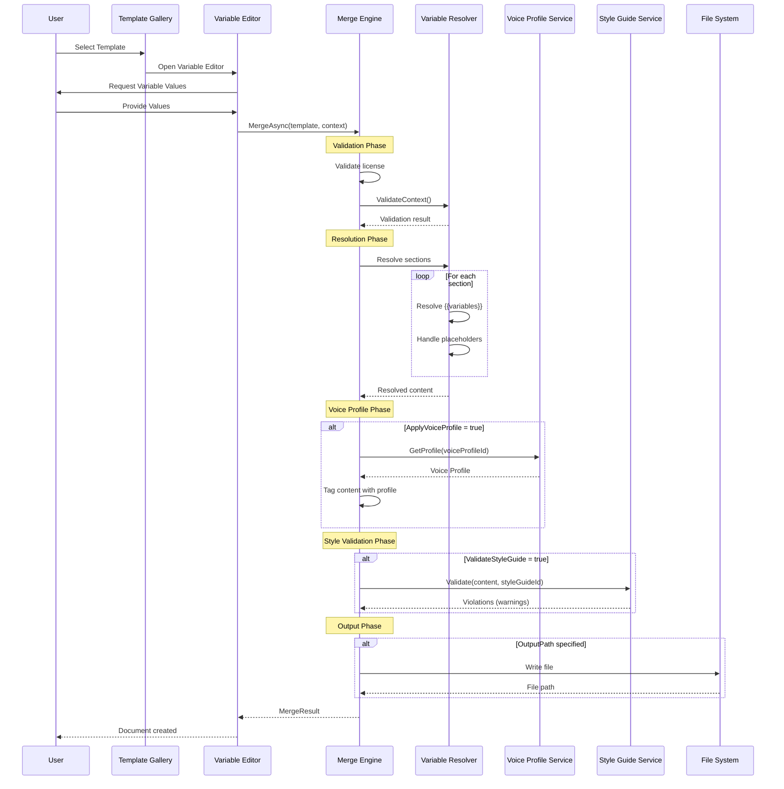
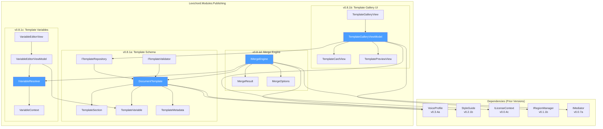
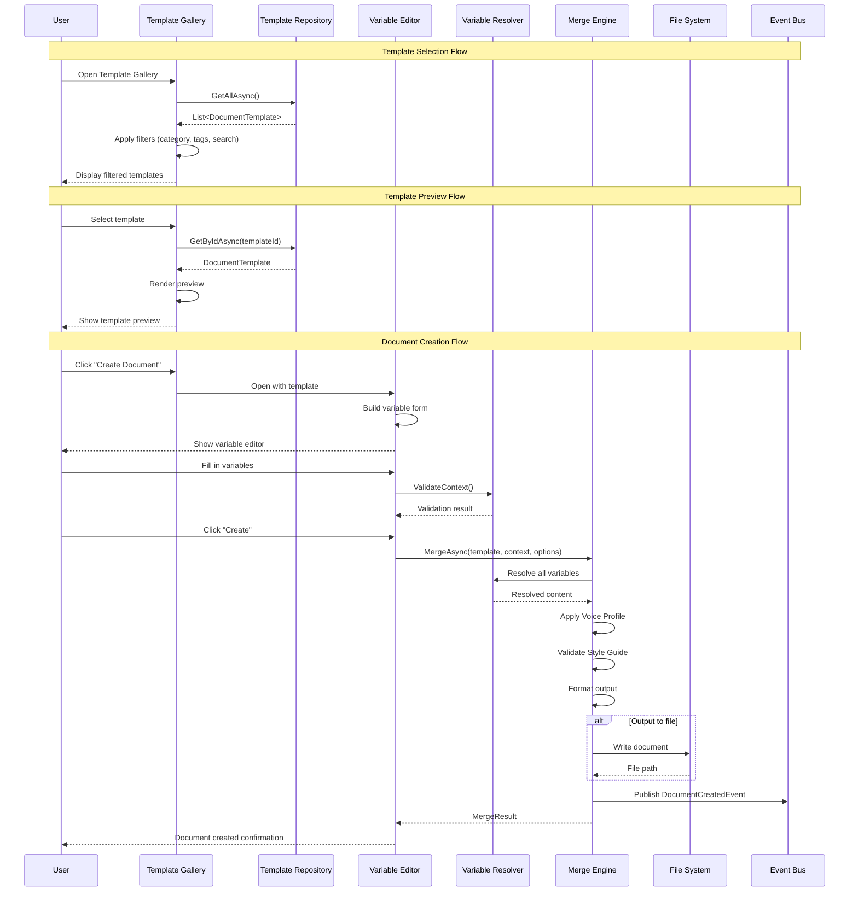

# LCS-SBD-081: Scope Breakdown — Document Templates

## Document Control

| Field            | Value                                    |
| :--------------- | :--------------------------------------- |
| **Document ID**  | LCS-SBD-081                              |
| **Version**      | v0.8.1                                   |
| **Codename**     | The Manuscript Blueprints                |
| **Status**       | Draft                                    |
| **Last Updated** | 2026-01-27                               |
| **Owner**        | Lead Architect                           |
| **Depends On**   | v0.7.x (Specialists), v0.6.x (AI Agents), v0.5.x (Enterprise), v0.3.x (Style Analysis) |

---

## 1. Executive Summary

### 1.1 The Vision

**v0.8.1** delivers the **Document Templates** — reusable document structures with style presets that enable writers to rapidly scaffold new documents with consistent formatting, voice profiles, and content placeholders. This release transforms Lexichord from a document analysis platform into a document production system, enabling professional writers and teams to maintain consistency across large-scale publishing workflows.

The Manuscript Blueprints establish a template infrastructure that carries Voice Profiles (v0.3.4), integrates with the Style Guide system (v0.2.x), and provides variable substitution for dynamic content generation. Templates serve as the foundation for batch document generation, team style enforcement, and enterprise publishing workflows.

### 1.2 Business Value

- **Productivity:** Writers create new documents from templates in seconds instead of manually copying and reformatting existing documents.
- **Consistency:** All documents generated from a template inherit the same structure, Voice Profile, and style settings, ensuring brand consistency.
- **Scalability:** Teams can share templates across projects, establishing organizational standards for document types (Blog Posts, Technical Specs, Press Releases).
- **Flexibility:** Template variables ({{Author}}, {{Date}}, {{Project}}) enable dynamic content that adapts to each document instance.
- **Integration:** Templates seamlessly connect with Voice Profiles, Style Guides, and AI Agents for intelligent content generation.
- **Foundation:** Establishes the template infrastructure for batch generation (v0.8.2) and multi-format export (v0.8.6).

### 1.3 Success Criteria

This release succeeds when:

1. Users can define templates in JSON/YAML format with structure, metadata, and style configurations.
2. The Template Gallery UI displays available templates with live previews and category filtering.
3. Template variables are correctly resolved during document generation with user-provided or default values.
4. The Merge Engine applies templates to create new documents with all placeholders replaced and Voice Profiles applied.
5. All UI respects license gating (WriterPro+ for Document Templates).

### 1.4 License Gating

The Document Templates feature is a **WriterPro** feature. Lower tiers will see:

- Read-only access to built-in templates (no custom template creation)
- "Upgrade to WriterPro" prompt when attempting to create custom templates
- Template Gallery visible but "Create from Template" disabled with upgrade tooltip
- Variable editor shows preview but requires upgrade for full editing

---

## 2. Dependencies on Prior Versions

| Component                  | Source Version | Usage in v0.8.1                                   |
| :------------------------- | :------------- | :------------------------------------------------ |
| `VoiceProfile`             | v0.3.4a        | Templates carry Voice Profile assignments         |
| `IVoiceProfileRepository`  | v0.3.4d        | Load Voice Profiles for template configuration    |
| `StyleGuide`               | v0.2.1b        | Templates reference Style Guide rules             |
| `IStyleGuideRepository`    | v0.2.2b        | Load Style Guides for template configuration      |
| `IMarkdownParser`          | v0.1.3b        | Parse template content for preview rendering      |
| `IRegionManager`           | v0.1.1b        | Register Template Gallery in shell regions        |
| `ISettingsService`         | v0.1.6a        | Store template directory preferences              |
| `ILicenseContext`          | v0.0.4c        | Gate template features by license tier            |
| `IMediator`                | v0.0.7a        | Publish template lifecycle events                 |
| `IFileSystemService`       | v0.0.5c        | Read/write template files from disk               |
| `Serilog`                  | v0.0.3b        | Logging template operations                       |
| `YamlDotNet`               | v0.8.1a        | Parse YAML template definitions (new)             |

---

## 3. Sub-Part Specifications

### 3.1 v0.8.1a: Template Schema

| Field            | Value                                     |
| :--------------- | :---------------------------------------- |
| **Sub-Part ID**  | PUB-081a                                  |
| **Title**        | Template Schema Definition                |
| **Module**       | `Lexichord.Modules.Publishing`            |
| **License Tier** | WriterPro                                 |

**Goal:** Define the JSON/YAML schema for document templates, including structure, metadata, variables, and style configurations.

**Key Deliverables:**

- `DocumentTemplate` record with all template properties
- `TemplateSection` record for hierarchical content structure
- `TemplateVariable` record for placeholder definitions
- `TemplateMetadata` record for author, version, and category information
- JSON Schema file for template validation
- YAML parser integration with YamlDotNet
- `ITemplateValidator` interface for schema validation
- Unit tests for schema parsing and validation

**Key Interfaces:**

```csharp
namespace Lexichord.Modules.Publishing.Templates;

/// <summary>
/// Represents a complete document template definition.
/// Templates carry structure, metadata, variables, and style configurations.
/// </summary>
public record DocumentTemplate
{
    /// <summary>Unique identifier for the template.</summary>
    public required Guid Id { get; init; }

    /// <summary>Human-readable template name.</summary>
    public required string Name { get; init; }

    /// <summary>Detailed description of the template's purpose.</summary>
    public string? Description { get; init; }

    /// <summary>Template metadata (author, version, category, tags).</summary>
    public required TemplateMetadata Metadata { get; init; }

    /// <summary>Hierarchical content structure with sections and placeholders.</summary>
    public required IReadOnlyList<TemplateSection> Sections { get; init; }

    /// <summary>Variable definitions with names, types, defaults, and prompts.</summary>
    public IReadOnlyList<TemplateVariable> Variables { get; init; } = [];

    /// <summary>Optional Voice Profile ID to apply to generated documents.</summary>
    public Guid? VoiceProfileId { get; init; }

    /// <summary>Optional Style Guide ID to apply to generated documents.</summary>
    public Guid? StyleGuideId { get; init; }

    /// <summary>Template format version for migration compatibility.</summary>
    public string SchemaVersion { get; init; } = "1.0";
}

/// <summary>
/// Metadata about the template including authorship and categorization.
/// </summary>
public record TemplateMetadata
{
    /// <summary>Template author name.</summary>
    public string? Author { get; init; }

    /// <summary>Template version string (e.g., "1.0.0").</summary>
    public string Version { get; init; } = "1.0.0";

    /// <summary>Category for organization (e.g., "Blog", "Technical", "Marketing").</summary>
    public required string Category { get; init; }

    /// <summary>Tags for search and filtering.</summary>
    public IReadOnlyList<string> Tags { get; init; } = [];

    /// <summary>Creation timestamp.</summary>
    public DateTime CreatedAt { get; init; } = DateTime.UtcNow;

    /// <summary>Last modification timestamp.</summary>
    public DateTime ModifiedAt { get; init; } = DateTime.UtcNow;

    /// <summary>License under which template is shared (if any).</summary>
    public string? License { get; init; }
}

/// <summary>
/// A section within the template's content structure.
/// Sections can be nested to create hierarchical documents.
/// </summary>
public record TemplateSection
{
    /// <summary>Section identifier for reference.</summary>
    public required string Id { get; init; }

    /// <summary>Section heading text (may contain variables).</summary>
    public required string Heading { get; init; }

    /// <summary>Heading level (1-6 for H1-H6).</summary>
    public int HeadingLevel { get; init; } = 2;

    /// <summary>Section content with Markdown and variable placeholders.</summary>
    public string? Content { get; init; }

    /// <summary>Nested child sections.</summary>
    public IReadOnlyList<TemplateSection> Children { get; init; } = [];

    /// <summary>Whether this section is required or optional.</summary>
    public bool IsRequired { get; init; } = true;

    /// <summary>Hint text shown to writers about section purpose.</summary>
    public string? Hint { get; init; }

    /// <summary>Minimum word count for section (0 = no minimum).</summary>
    public int MinWordCount { get; init; } = 0;

    /// <summary>Maximum word count for section (0 = no maximum).</summary>
    public int MaxWordCount { get; init; } = 0;
}

/// <summary>
/// A variable placeholder within the template.
/// Variables are resolved during document generation.
/// </summary>
public record TemplateVariable
{
    /// <summary>Variable name (used in placeholders as {{Name}}).</summary>
    public required string Name { get; init; }

    /// <summary>Display label for the variable input.</summary>
    public string? Label { get; init; }

    /// <summary>Variable data type.</summary>
    public TemplateVariableType Type { get; init; } = TemplateVariableType.Text;

    /// <summary>Default value if not provided.</summary>
    public string? DefaultValue { get; init; }

    /// <summary>Whether the variable is required.</summary>
    public bool IsRequired { get; init; } = false;

    /// <summary>Prompt text shown to user when requesting value.</summary>
    public string? Prompt { get; init; }

    /// <summary>Validation regex pattern (for Text type).</summary>
    public string? ValidationPattern { get; init; }

    /// <summary>Allowed values (for Select type).</summary>
    public IReadOnlyList<string>? AllowedValues { get; init; }

    /// <summary>Format string (for Date type, e.g., "yyyy-MM-dd").</summary>
    public string? Format { get; init; }
}

/// <summary>
/// Supported variable data types.
/// </summary>
public enum TemplateVariableType
{
    /// <summary>Free-form text input.</summary>
    Text,

    /// <summary>Multi-line text area.</summary>
    TextArea,

    /// <summary>Date picker input.</summary>
    Date,

    /// <summary>Date and time picker input.</summary>
    DateTime,

    /// <summary>Numeric input.</summary>
    Number,

    /// <summary>Boolean checkbox.</summary>
    Boolean,

    /// <summary>Selection from predefined options.</summary>
    Select,

    /// <summary>Multiple selection from predefined options.</summary>
    MultiSelect,

    /// <summary>URL input with validation.</summary>
    Url,

    /// <summary>Email input with validation.</summary>
    Email
}

/// <summary>
/// Validates template definitions against the schema.
/// </summary>
public interface ITemplateValidator
{
    /// <summary>
    /// Validates a template definition.
    /// </summary>
    /// <param name="template">The template to validate.</param>
    /// <returns>Validation result with any errors.</returns>
    TemplateValidationResult Validate(DocumentTemplate template);

    /// <summary>
    /// Validates raw JSON/YAML content against the schema.
    /// </summary>
    /// <param name="content">Raw template content.</param>
    /// <param name="format">Content format (JSON or YAML).</param>
    /// <returns>Validation result with any errors.</returns>
    TemplateValidationResult ValidateRaw(string content, TemplateFormat format);
}

/// <summary>
/// Result of template validation.
/// </summary>
public record TemplateValidationResult
{
    public bool IsValid { get; init; }
    public IReadOnlyList<TemplateValidationError> Errors { get; init; } = [];
}

/// <summary>
/// A validation error in a template.
/// </summary>
public record TemplateValidationError
{
    public required string Path { get; init; }
    public required string Message { get; init; }
    public TemplateValidationSeverity Severity { get; init; } = TemplateValidationSeverity.Error;
}

public enum TemplateValidationSeverity { Error, Warning, Info }

public enum TemplateFormat { Json, Yaml }
```

**Template File Format (YAML):**

```yaml
# Example: Blog Post Template
id: "550e8400-e29b-41d4-a716-446655440001"
name: "Blog Post"
description: "Standard blog post template with introduction, body sections, and conclusion."
schemaVersion: "1.0"

metadata:
  author: "Lexichord Team"
  version: "1.0.0"
  category: "Blog"
  tags: ["blog", "content", "marketing"]
  license: "MIT"

voiceProfileId: "550e8400-e29b-41d4-a716-446655440002"
styleGuideId: "550e8400-e29b-41d4-a716-446655440003"

variables:
  - name: "Title"
    label: "Post Title"
    type: Text
    isRequired: true
    prompt: "Enter the blog post title"

  - name: "Author"
    label: "Author Name"
    type: Text
    defaultValue: "{{CurrentUser}}"
    isRequired: true

  - name: "Date"
    label: "Publication Date"
    type: Date
    defaultValue: "{{Today}}"
    format: "MMMM d, yyyy"

  - name: "Category"
    label: "Post Category"
    type: Select
    allowedValues: ["Technology", "Business", "Lifestyle", "Tutorial"]
    defaultValue: "Technology"

  - name: "Tags"
    label: "Post Tags"
    type: MultiSelect
    allowedValues: ["AI", "Writing", "Productivity", "Tips", "Review"]

sections:
  - id: "header"
    heading: "{{Title}}"
    headingLevel: 1
    content: |
      *By {{Author}} | {{Date}}*

      **Category:** {{Category}}
    isRequired: true

  - id: "introduction"
    heading: "Introduction"
    headingLevel: 2
    content: |
      {{IntroductionPlaceholder:Write a compelling introduction that hooks the reader...}}
    isRequired: true
    hint: "Hook the reader with an engaging opening paragraph."
    minWordCount: 50
    maxWordCount: 200

  - id: "body"
    heading: "Main Content"
    headingLevel: 2
    isRequired: true
    children:
      - id: "body-section-1"
        heading: "Key Point 1"
        headingLevel: 3
        content: "{{Section1Content:Develop your first main point...}}"
        hint: "Present your first key argument or idea."
        minWordCount: 100

      - id: "body-section-2"
        heading: "Key Point 2"
        headingLevel: 3
        content: "{{Section2Content:Develop your second main point...}}"
        hint: "Present your second key argument or idea."
        minWordCount: 100

      - id: "body-section-3"
        heading: "Key Point 3"
        headingLevel: 3
        content: "{{Section3Content:Develop your third main point...}}"
        hint: "Present your third key argument or idea."
        isRequired: false
        minWordCount: 100

  - id: "conclusion"
    heading: "Conclusion"
    headingLevel: 2
    content: |
      {{ConclusionPlaceholder:Summarize key points and provide a call to action...}}
    isRequired: true
    hint: "Wrap up the post with a summary and call to action."
    minWordCount: 50
    maxWordCount: 150
```

**Storage Location:**

- Windows: `%APPDATA%/Lexichord/templates/`
- macOS: `~/Library/Application Support/Lexichord/templates/`
- Linux: `~/.config/Lexichord/templates/`
- Built-in templates: Embedded resources in `Lexichord.Modules.Publishing.dll`

**Dependencies:**

- v0.3.4a: `VoiceProfile` (templates reference Voice Profiles)
- v0.2.1b: `StyleGuide` (templates reference Style Guides)
- YamlDotNet 16.x (new NuGet package)

---

### 3.2 v0.8.1b: Template Gallery UI

| Field            | Value                                     |
| :--------------- | :---------------------------------------- |
| **Sub-Part ID**  | PUB-081b                                  |
| **Title**        | Template Gallery User Interface           |
| **Module**       | `Lexichord.Modules.Publishing`            |
| **License Tier** | WriterPro                                 |

**Goal:** Create a visual gallery interface for browsing, previewing, and selecting document templates with category filtering and search.

**Key Deliverables:**

- `TemplateGalleryView.axaml` with grid-based template display
- `TemplateGalleryViewModel` with filtering and selection logic
- `TemplateCardView.axaml` for individual template display
- `TemplatePreviewView.axaml` for live template preview
- Category filter sidebar with tag cloud
- Search functionality with full-text matching
- Template import/export functionality
- Registration in `ShellRegion.ContentPane` via `IRegionManager`
- Unit tests for ViewModel logic

**Key Interfaces:**

```csharp
namespace Lexichord.Modules.Publishing.ViewModels;

/// <summary>
/// ViewModel for the Template Gallery, managing template display, filtering, and selection.
/// </summary>
public partial class TemplateGalleryViewModel : ObservableObject
{
    private readonly ITemplateRepository _templateRepository;
    private readonly ILicenseContext _licenseContext;
    private readonly IMediator _mediator;
    private readonly ILogger<TemplateGalleryViewModel> _logger;

    [ObservableProperty]
    private ObservableCollection<TemplateCardViewModel> _templates = [];

    [ObservableProperty]
    private ObservableCollection<TemplateCardViewModel> _filteredTemplates = [];

    [ObservableProperty]
    private TemplateCardViewModel? _selectedTemplate;

    [ObservableProperty]
    private string _searchText = string.Empty;

    [ObservableProperty]
    private string? _selectedCategory;

    [ObservableProperty]
    private ObservableCollection<string> _categories = [];

    [ObservableProperty]
    private ObservableCollection<TagViewModel> _tags = [];

    [ObservableProperty]
    private bool _isLoading;

    [ObservableProperty]
    private bool _showPreview;

    [ObservableProperty]
    private TemplatePreviewViewModel? _previewViewModel;

    [ObservableProperty]
    private bool _canCreateCustomTemplates;

    public TemplateGalleryViewModel(
        ITemplateRepository templateRepository,
        ILicenseContext licenseContext,
        IMediator mediator,
        ILogger<TemplateGalleryViewModel> logger)
    {
        _templateRepository = templateRepository;
        _licenseContext = licenseContext;
        _mediator = mediator;
        _logger = logger;

        _canCreateCustomTemplates = _licenseContext.IsFeatureEnabled(
            FeatureFlags.Publishing.CustomTemplates);
    }

    [RelayCommand]
    private async Task LoadTemplatesAsync(CancellationToken ct)
    {
        IsLoading = true;
        try
        {
            var templates = await _templateRepository.GetAllAsync(ct);
            Templates = new ObservableCollection<TemplateCardViewModel>(
                templates.Select(t => new TemplateCardViewModel(t)));

            Categories = new ObservableCollection<string>(
                templates.Select(t => t.Metadata.Category).Distinct().OrderBy(c => c));

            var allTags = templates.SelectMany(t => t.Metadata.Tags).Distinct();
            Tags = new ObservableCollection<TagViewModel>(
                allTags.Select(tag => new TagViewModel(tag)));

            ApplyFilters();
        }
        finally
        {
            IsLoading = false;
        }
    }

    [RelayCommand]
    private void ApplyFilters()
    {
        var filtered = Templates.AsEnumerable();

        if (!string.IsNullOrWhiteSpace(SearchText))
        {
            var searchLower = SearchText.ToLowerInvariant();
            filtered = filtered.Where(t =>
                t.Name.ToLowerInvariant().Contains(searchLower) ||
                t.Description?.ToLowerInvariant().Contains(searchLower) == true ||
                t.Tags.Any(tag => tag.ToLowerInvariant().Contains(searchLower)));
        }

        if (!string.IsNullOrWhiteSpace(SelectedCategory))
        {
            filtered = filtered.Where(t => t.Category == SelectedCategory);
        }

        var selectedTags = Tags.Where(t => t.IsSelected).Select(t => t.Name).ToHashSet();
        if (selectedTags.Count > 0)
        {
            filtered = filtered.Where(t => t.Tags.Any(tag => selectedTags.Contains(tag)));
        }

        FilteredTemplates = new ObservableCollection<TemplateCardViewModel>(filtered);
    }

    [RelayCommand]
    private async Task SelectTemplateAsync(TemplateCardViewModel template, CancellationToken ct)
    {
        SelectedTemplate = template;
        ShowPreview = true;

        var fullTemplate = await _templateRepository.GetByIdAsync(template.Id, ct);
        if (fullTemplate is not null)
        {
            PreviewViewModel = new TemplatePreviewViewModel(fullTemplate);
        }
    }

    [RelayCommand]
    private async Task CreateFromTemplateAsync(CancellationToken ct)
    {
        if (SelectedTemplate is null) return;

        if (!CanCreateCustomTemplates)
        {
            await _mediator.Publish(new ShowUpgradePromptEvent(
                "Custom Templates",
                "Create documents from templates with WriterPro",
                LicenseTier.WriterPro), ct);
            return;
        }

        await _mediator.Publish(new CreateDocumentFromTemplateEvent(SelectedTemplate.Id), ct);
    }

    [RelayCommand]
    private async Task ImportTemplateAsync(CancellationToken ct)
    {
        if (!CanCreateCustomTemplates)
        {
            await _mediator.Publish(new ShowUpgradePromptEvent(
                "Import Templates",
                "Import custom templates with WriterPro",
                LicenseTier.WriterPro), ct);
            return;
        }

        await _mediator.Publish(new ImportTemplateRequestEvent(), ct);
    }

    [RelayCommand]
    private async Task ExportTemplateAsync(CancellationToken ct)
    {
        if (SelectedTemplate is null) return;
        await _mediator.Publish(new ExportTemplateRequestEvent(SelectedTemplate.Id), ct);
    }

    partial void OnSearchTextChanged(string value) => ApplyFilters();
    partial void OnSelectedCategoryChanged(string? value) => ApplyFilters();
}

/// <summary>
/// ViewModel for individual template cards in the gallery.
/// </summary>
public class TemplateCardViewModel
{
    public Guid Id { get; }
    public string Name { get; }
    public string? Description { get; }
    public string Category { get; }
    public IReadOnlyList<string> Tags { get; }
    public string? Author { get; }
    public string Version { get; }
    public DateTime ModifiedAt { get; }
    public bool HasVoiceProfile { get; }
    public bool HasStyleGuide { get; }
    public int SectionCount { get; }
    public int VariableCount { get; }

    public TemplateCardViewModel(DocumentTemplate template)
    {
        Id = template.Id;
        Name = template.Name;
        Description = template.Description;
        Category = template.Metadata.Category;
        Tags = template.Metadata.Tags;
        Author = template.Metadata.Author;
        Version = template.Metadata.Version;
        ModifiedAt = template.Metadata.ModifiedAt;
        HasVoiceProfile = template.VoiceProfileId.HasValue;
        HasStyleGuide = template.StyleGuideId.HasValue;
        SectionCount = CountSections(template.Sections);
        VariableCount = template.Variables.Count;
    }

    private static int CountSections(IReadOnlyList<TemplateSection> sections)
    {
        return sections.Sum(s => 1 + CountSections(s.Children));
    }
}

/// <summary>
/// ViewModel for tag filter items.
/// </summary>
public partial class TagViewModel : ObservableObject
{
    public string Name { get; }

    [ObservableProperty]
    private bool _isSelected;

    public TagViewModel(string name) => Name = name;
}
```

**Key UI Components:**

```text
+------------------------------------------------------------------+
|  Template Gallery                              [Import] [+ New]   | <- Toolbar
+------------------------------------------------------------------+
| Categories    | [Search templates...                          ]  | <- Search bar
|---------------|--------------------------------------------------|
| [ ] All       | +------------+  +------------+  +------------+   |
| [x] Blog      | |   Blog     |  | Technical  |  |  Press     |   |
| [ ] Technical | |   Post     |  |   Spec     |  |  Release   |   |
| [ ] Marketing | |            |  |            |  |            |   |
| [ ] Legal     | | 5 sections |  | 8 sections |  | 4 sections |   |
|---------------|  | 3 vars     |  | 12 vars    |  | 6 vars     |   |
| Tags          | +------------+  +------------+  +------------+   |
|---------------|                                                  |
| [x] AI        | +------------+  +------------+  +------------+   |
| [ ] Tutorial  | |  Meeting   |  |  Product   |  |   API      |   |
| [x] Writing   | |   Notes    |  |   Brief    |  |   Docs     |   |
| [ ] Review    | |            |  |            |  |            |   |
|               | | 3 sections |  | 6 sections |  | 10 sections|   |
|               | | 2 vars     |  | 8 vars     |  | 15 vars    |   |
|               | +------------+  +------------+  +------------+   |
+---------------+--------------------------------------------------+
| Selected: Blog Post | Author: Lexichord Team | v1.0.0            | <- Status bar
|                                    [Preview] [Create Document]   |
+------------------------------------------------------------------+
```

**Template Preview Panel:**

```text
+------------------------------------------------------------------+
|  Preview: Blog Post                                    [x] Close  |
+------------------------------------------------------------------+
| Structure                          | Preview                      |
|------------------------------------+------------------------------|
| v Header (H1)                      | # {{Title}}                  |
|   - Title, Author, Date            | *By {{Author}} | {{Date}}*  |
| v Introduction (H2)                |                              |
|   - 50-200 words                   | ## Introduction              |
| v Main Content (H2)                | Write a compelling intro...  |
|   v Key Point 1 (H3)               |                              |
|   v Key Point 2 (H3)               | ## Main Content              |
|   v Key Point 3 (H3) [optional]    | ### Key Point 1              |
| v Conclusion (H2)                  | Develop your first point...  |
|   - 50-150 words                   |                              |
|------------------------------------+------------------------------|
| Variables (3 required, 2 optional) | Voice Profile: Professional  |
| - Title (text, required)           | Style Guide: Company Blog    |
| - Author (text, required)          |                              |
| - Date (date, required)            |                              |
| - Category (select)                |                              |
| - Tags (multiselect)               |                              |
+------------------------------------------------------------------+
|                        [Use This Template]                        |
+------------------------------------------------------------------+
```

**Dependencies:**

- v0.8.1a: `DocumentTemplate` (template data model)
- v0.1.1b: `IRegionManager` (panel registration)
- v0.0.4c: `ILicenseContext` (feature gating)

---

### 3.3 v0.8.1c: Template Variables

| Field            | Value                                     |
| :--------------- | :---------------------------------------- |
| **Sub-Part ID**  | PUB-081c                                  |
| **Title**        | Template Variable System                  |
| **Module**       | `Lexichord.Modules.Publishing`            |
| **License Tier** | WriterPro                                 |

**Goal:** Implement the variable resolution system that processes template placeholders ({{Author}}, {{Date}}, {{Project}}) during document generation.

**Key Deliverables:**

- `IVariableResolver` interface for variable resolution
- `VariableResolver` implementation with built-in and custom variable support
- `VariableContext` for resolution state and user-provided values
- `VariableEditorView.axaml` for user input during document creation
- Built-in variables: {{Today}}, {{Now}}, {{CurrentUser}}, {{ProjectName}}
- Conditional variable syntax: {{VariableName:DefaultValue}}
- Nested variable support: {{Greeting:Hello, {{Author}}!}}
- Variable validation against defined types and patterns
- Unit tests for all variable resolution scenarios

**Key Interfaces:**

```csharp
namespace Lexichord.Modules.Publishing.Variables;

/// <summary>
/// Resolves template variables to their actual values.
/// </summary>
public interface IVariableResolver
{
    /// <summary>
    /// Resolves all variables in the given content.
    /// </summary>
    /// <param name="content">Content containing {{variable}} placeholders.</param>
    /// <param name="context">Resolution context with user-provided values.</param>
    /// <returns>Content with all variables resolved.</returns>
    string Resolve(string content, VariableContext context);

    /// <summary>
    /// Resolves all variables in the given content asynchronously.
    /// </summary>
    Task<string> ResolveAsync(string content, VariableContext context, CancellationToken ct = default);

    /// <summary>
    /// Extracts all variable references from content.
    /// </summary>
    /// <param name="content">Content to scan for variables.</param>
    /// <returns>List of variable references found.</returns>
    IReadOnlyList<VariableReference> ExtractVariables(string content);

    /// <summary>
    /// Validates that all required variables have values.
    /// </summary>
    /// <param name="template">Template with variable definitions.</param>
    /// <param name="context">Context with provided values.</param>
    /// <returns>Validation result.</returns>
    VariableValidationResult ValidateContext(DocumentTemplate template, VariableContext context);
}

/// <summary>
/// Context for variable resolution containing user-provided and system values.
/// </summary>
public class VariableContext
{
    private readonly Dictionary<string, object?> _values = new(StringComparer.OrdinalIgnoreCase);
    private readonly Dictionary<string, Func<object?>> _dynamicValues = new(StringComparer.OrdinalIgnoreCase);

    /// <summary>
    /// Gets or sets a variable value.
    /// </summary>
    public object? this[string name]
    {
        get => _values.TryGetValue(name, out var value) ? value
             : _dynamicValues.TryGetValue(name, out var factory) ? factory()
             : null;
        set => _values[name] = value;
    }

    /// <summary>
    /// Sets a static variable value.
    /// </summary>
    public void Set(string name, object? value) => _values[name] = value;

    /// <summary>
    /// Sets a dynamic variable that is evaluated on each access.
    /// </summary>
    public void SetDynamic(string name, Func<object?> factory) => _dynamicValues[name] = factory;

    /// <summary>
    /// Checks if a variable has a value (static or dynamic).
    /// </summary>
    public bool HasValue(string name) => _values.ContainsKey(name) || _dynamicValues.ContainsKey(name);

    /// <summary>
    /// Gets all variable names with values.
    /// </summary>
    public IEnumerable<string> GetVariableNames() => _values.Keys.Concat(_dynamicValues.Keys).Distinct();

    /// <summary>
    /// Creates a child context that inherits from this context.
    /// </summary>
    public VariableContext CreateChild()
    {
        var child = new VariableContext();
        foreach (var (key, value) in _values)
            child._values[key] = value;
        foreach (var (key, factory) in _dynamicValues)
            child._dynamicValues[key] = factory;
        return child;
    }

    /// <summary>
    /// Creates a default context with built-in system variables.
    /// </summary>
    public static VariableContext CreateDefault()
    {
        var context = new VariableContext();
        context.SetDynamic("Today", () => DateTime.Today.ToString("yyyy-MM-dd"));
        context.SetDynamic("Now", () => DateTime.Now.ToString("yyyy-MM-dd HH:mm"));
        context.SetDynamic("Year", () => DateTime.Today.Year.ToString());
        context.SetDynamic("Month", () => DateTime.Today.ToString("MMMM"));
        context.SetDynamic("CurrentUser", () => Environment.UserName);
        context.SetDynamic("MachineName", () => Environment.MachineName);
        return context;
    }
}

/// <summary>
/// A reference to a variable found in content.
/// </summary>
public record VariableReference
{
    /// <summary>Variable name.</summary>
    public required string Name { get; init; }

    /// <summary>Default value if specified ({{Name:Default}}).</summary>
    public string? DefaultValue { get; init; }

    /// <summary>Start position in the original content.</summary>
    public int StartIndex { get; init; }

    /// <summary>Length of the full placeholder including braces.</summary>
    public int Length { get; init; }

    /// <summary>The full original placeholder text.</summary>
    public required string OriginalText { get; init; }
}

/// <summary>
/// Result of variable validation.
/// </summary>
public record VariableValidationResult
{
    public bool IsValid { get; init; }
    public IReadOnlyList<VariableValidationError> Errors { get; init; } = [];
}

/// <summary>
/// A variable validation error.
/// </summary>
public record VariableValidationError
{
    public required string VariableName { get; init; }
    public required string Message { get; init; }
    public VariableValidationErrorType Type { get; init; }
}

public enum VariableValidationErrorType
{
    MissingRequired,
    InvalidType,
    InvalidFormat,
    OutOfRange,
    PatternMismatch,
    InvalidOption
}
```

**Variable Syntax:**

```text
VARIABLE PATTERNS:
├── Basic: {{VariableName}}
├── With Default: {{VariableName:Default Value}}
├── Nested: {{Greeting:Hello, {{Author}}!}}
├── Formatted Date: {{Date|format:MMMM d, yyyy}}
├── Conditional: {{#if HasSubtitle}}{{Subtitle}}{{/if}}
└── Loop: {{#each Tags}}{{.}}, {{/each}}

BUILT-IN VARIABLES:
├── {{Today}} → "2026-01-27"
├── {{Now}} → "2026-01-27 14:30"
├── {{Year}} → "2026"
├── {{Month}} → "January"
├── {{CurrentUser}} → "jsmith"
├── {{MachineName}} → "DESKTOP-ABC123"
├── {{ProjectName}} → (from workspace settings)
└── {{TemplateName}} → (current template name)

VARIABLE RESOLUTION ORDER:
1. User-provided values (highest priority)
2. Dynamic system variables
3. Default values from variable definition
4. Placeholder syntax default ({{Name:Default}})
5. Empty string (if optional)
6. Error (if required and no value)
```

**Variable Editor UI:**

```text
+------------------------------------------------------------------+
|  Configure Document Variables                          [x] Close  |
+------------------------------------------------------------------+
| Fill in the values for your new document:                         |
|                                                                   |
| Title *                                                           |
| +--------------------------------------------------------------+ |
| | My First Blog Post                                           | |
| +--------------------------------------------------------------+ |
|                                                                   |
| Author *                                                          |
| +--------------------------------------------------------------+ |
| | Jane Smith                                                    | |
| +--------------------------------------------------------------+ |
|                                                                   |
| Publication Date *                                                |
| +--------------------------------------------------------------+ |
| | January 27, 2026                                    [Calendar]| |
| +--------------------------------------------------------------+ |
|                                                                   |
| Category                                                          |
| +--------------------------------------------------------------+ |
| | Technology                                                  v | |
| +--------------------------------------------------------------+ |
|                                                                   |
| Tags                                                              |
| +--------------------------------------------------------------+ |
| | [x] AI  [ ] Writing  [x] Productivity  [ ] Tips  [ ] Review  | |
| +--------------------------------------------------------------+ |
|                                                                   |
| * Required fields                                                 |
|                                                                   |
|                              [Cancel]  [Create Document]          |
+------------------------------------------------------------------+
```

**Dependencies:**

- v0.8.1a: `DocumentTemplate`, `TemplateVariable` (variable definitions)
- v0.1.6a: `ISettingsService` (user preferences for defaults)

---

### 3.4 v0.8.1d: Merge Engine

| Field            | Value                                     |
| :--------------- | :---------------------------------------- |
| **Sub-Part ID**  | PUB-081d                                  |
| **Title**        | Template Merge Engine                     |
| **Module**       | `Lexichord.Modules.Publishing`            |
| **License Tier** | WriterPro                                 |

**Goal:** Implement the engine that applies templates to create new documents with all variables resolved, structure expanded, and Voice Profiles applied.

**Key Deliverables:**

- `IMergeEngine` interface for template-to-document conversion
- `MergeEngine` implementation with full pipeline
- `MergeResult` record with generated document and metadata
- `MergeOptions` for controlling merge behavior
- Voice Profile application during merge
- Style Guide validation post-merge
- Section expansion with nested structure
- Placeholder content handling (keep/remove/highlight)
- Progress reporting for long merges
- Unit tests for merge scenarios

**Key Interfaces:**

```csharp
namespace Lexichord.Modules.Publishing.Merge;

/// <summary>
/// Engine that merges templates with variable values to produce documents.
/// </summary>
public interface IMergeEngine
{
    /// <summary>
    /// Merges a template with variable values to create a new document.
    /// </summary>
    /// <param name="template">The template to use.</param>
    /// <param name="context">Variable context with user-provided values.</param>
    /// <param name="options">Merge options.</param>
    /// <param name="progress">Optional progress reporter.</param>
    /// <param name="ct">Cancellation token.</param>
    /// <returns>The merge result with generated document.</returns>
    Task<MergeResult> MergeAsync(
        DocumentTemplate template,
        VariableContext context,
        MergeOptions? options = null,
        IProgress<MergeProgress>? progress = null,
        CancellationToken ct = default);

    /// <summary>
    /// Previews a merge without creating a document.
    /// </summary>
    Task<MergePreview> PreviewAsync(
        DocumentTemplate template,
        VariableContext context,
        CancellationToken ct = default);

    /// <summary>
    /// Validates that a merge can be performed.
    /// </summary>
    Task<MergeValidationResult> ValidateAsync(
        DocumentTemplate template,
        VariableContext context,
        CancellationToken ct = default);
}

/// <summary>
/// Options controlling merge behavior.
/// </summary>
public record MergeOptions
{
    /// <summary>How to handle unresolved placeholder content.</summary>
    public PlaceholderHandling PlaceholderHandling { get; init; } = PlaceholderHandling.Keep;

    /// <summary>Whether to apply the template's Voice Profile.</summary>
    public bool ApplyVoiceProfile { get; init; } = true;

    /// <summary>Whether to validate against the template's Style Guide.</summary>
    public bool ValidateStyleGuide { get; init; } = true;

    /// <summary>Output format for the generated document.</summary>
    public DocumentFormat OutputFormat { get; init; } = DocumentFormat.Markdown;

    /// <summary>Whether to include section hints as comments.</summary>
    public bool IncludeSectionHints { get; init; } = true;

    /// <summary>Whether to include word count targets in comments.</summary>
    public bool IncludeWordCountTargets { get; init; } = true;

    /// <summary>Output file path (null = return content only).</summary>
    public string? OutputPath { get; init; }

    /// <summary>Whether to open the document after creation.</summary>
    public bool OpenAfterCreate { get; init; } = true;
}

/// <summary>
/// How to handle placeholder content in sections.
/// </summary>
public enum PlaceholderHandling
{
    /// <summary>Keep placeholder text as-is for user to replace.</summary>
    Keep,

    /// <summary>Remove placeholder text, leaving empty sections.</summary>
    Remove,

    /// <summary>Highlight placeholder text with markers.</summary>
    Highlight,

    /// <summary>Convert placeholders to comments.</summary>
    Comment
}

/// <summary>
/// Output document format.
/// </summary>
public enum DocumentFormat
{
    Markdown,
    Html,
    PlainText
}

/// <summary>
/// Result of a template merge operation.
/// </summary>
public record MergeResult
{
    /// <summary>Whether the merge succeeded.</summary>
    public bool Success { get; init; }

    /// <summary>The generated document content.</summary>
    public string? Content { get; init; }

    /// <summary>Path to the created file (if OutputPath was specified).</summary>
    public string? FilePath { get; init; }

    /// <summary>Metadata about the generated document.</summary>
    public MergeMetadata? Metadata { get; init; }

    /// <summary>Any warnings generated during merge.</summary>
    public IReadOnlyList<MergeWarning> Warnings { get; init; } = [];

    /// <summary>Error message if merge failed.</summary>
    public string? ErrorMessage { get; init; }

    /// <summary>Template that was used.</summary>
    public required Guid TemplateId { get; init; }

    /// <summary>Timestamp of the merge.</summary>
    public DateTime MergedAt { get; init; } = DateTime.UtcNow;
}

/// <summary>
/// Metadata about a merged document.
/// </summary>
public record MergeMetadata
{
    /// <summary>Total word count of generated document.</summary>
    public int WordCount { get; init; }

    /// <summary>Number of sections generated.</summary>
    public int SectionCount { get; init; }

    /// <summary>Number of variables resolved.</summary>
    public int VariablesResolved { get; init; }

    /// <summary>Number of placeholders remaining.</summary>
    public int PlaceholdersRemaining { get; init; }

    /// <summary>Voice Profile applied (if any).</summary>
    public Guid? VoiceProfileId { get; init; }

    /// <summary>Style Guide validated against (if any).</summary>
    public Guid? StyleGuideId { get; init; }

    /// <summary>Style Guide violations found.</summary>
    public int StyleViolations { get; init; }
}

/// <summary>
/// A warning generated during merge.
/// </summary>
public record MergeWarning
{
    public required string Message { get; init; }
    public MergeWarningType Type { get; init; }
    public string? SectionId { get; init; }
    public string? VariableName { get; init; }
}

public enum MergeWarningType
{
    UnresolvedVariable,
    OptionalSectionSkipped,
    WordCountBelowMinimum,
    WordCountAboveMaximum,
    StyleViolation,
    VoiceProfileMismatch
}

/// <summary>
/// Progress information for long-running merges.
/// </summary>
public record MergeProgress
{
    public required string Stage { get; init; }
    public int PercentComplete { get; init; }
    public string? CurrentSection { get; init; }
}

/// <summary>
/// Preview of a merge operation.
/// </summary>
public record MergePreview
{
    /// <summary>Preview content with variables resolved.</summary>
    public required string Content { get; init; }

    /// <summary>Variables that will be resolved.</summary>
    public IReadOnlyList<ResolvedVariable> ResolvedVariables { get; init; } = [];

    /// <summary>Variables that are missing values.</summary>
    public IReadOnlyList<string> UnresolvedVariables { get; init; } = [];

    /// <summary>Estimated word count.</summary>
    public int EstimatedWordCount { get; init; }
}

/// <summary>
/// A variable with its resolved value.
/// </summary>
public record ResolvedVariable
{
    public required string Name { get; init; }
    public required string Value { get; init; }
    public required string Source { get; init; } // "User", "Default", "System"
}

/// <summary>
/// Validation result for a potential merge.
/// </summary>
public record MergeValidationResult
{
    public bool CanMerge { get; init; }
    public IReadOnlyList<MergeValidationError> Errors { get; init; } = [];
    public IReadOnlyList<MergeWarning> Warnings { get; init; } = [];
}

public record MergeValidationError
{
    public required string Message { get; init; }
    public MergeValidationErrorType Type { get; init; }
}

public enum MergeValidationErrorType
{
    MissingRequiredVariable,
    InvalidVariableValue,
    TemplateNotFound,
    VoiceProfileNotFound,
    StyleGuideNotFound,
    OutputPathInvalid,
    InsufficientLicense
}
```

**Merge Pipeline:**



**Generated Document Example:**

```markdown
<!-- Generated from template: Blog Post (v1.0.0) -->
<!-- Voice Profile: Professional -->
<!-- Style Guide: Company Blog -->

# My First AI Writing Assistant Review

*By Jane Smith | January 27, 2026*

**Category:** Technology

## Introduction

<!-- HINT: Hook the reader with an engaging opening paragraph. -->
<!-- TARGET: 50-200 words -->

Write a compelling introduction that hooks the reader...

## Main Content

### Key Point 1

<!-- HINT: Present your first key argument or idea. -->
<!-- TARGET: 100+ words -->

Develop your first main point...

### Key Point 2

<!-- HINT: Present your second key argument or idea. -->
<!-- TARGET: 100+ words -->

Develop your second main point...

### Key Point 3

<!-- HINT: Present your third key argument or idea. -->
<!-- TARGET: 100+ words -->
<!-- NOTE: This section is optional -->

Develop your third main point...

## Conclusion

<!-- HINT: Wrap up the post with a summary and call to action. -->
<!-- TARGET: 50-150 words -->

Summarize key points and provide a call to action...

<!--
Document Statistics:
- Template: Blog Post
- Variables resolved: 5/5
- Sections: 6
- Placeholders remaining: 5
- Word count: ~50 (placeholders)
-->
```

**Dependencies:**

- v0.8.1a: `DocumentTemplate` (template structure)
- v0.8.1b: `TemplateGalleryViewModel` (UI integration)
- v0.8.1c: `IVariableResolver` (variable resolution)
- v0.3.4d: `IVoiceProfileRepository` (Voice Profile loading)
- v0.2.2b: `IStyleGuideRepository` (Style Guide loading)
- v0.0.5c: `IFileSystemService` (file output)

---

## 4. Implementation Checklist

| #  | Sub-Part | Task                                                      | Est. Hours |
| :- | :------- | :-------------------------------------------------------- | :--------- |
| 1  | v0.8.1a  | Create `DocumentTemplate` record                          | 1          |
| 2  | v0.8.1a  | Create `TemplateSection` record                           | 0.5        |
| 3  | v0.8.1a  | Create `TemplateVariable` record                          | 0.5        |
| 4  | v0.8.1a  | Create `TemplateMetadata` record                          | 0.5        |
| 5  | v0.8.1a  | Implement YAML parser with YamlDotNet                     | 2          |
| 6  | v0.8.1a  | Implement JSON parser                                     | 1          |
| 7  | v0.8.1a  | Implement `ITemplateValidator`                            | 2          |
| 8  | v0.8.1a  | Create JSON Schema file                                   | 1          |
| 9  | v0.8.1a  | Create built-in template files                            | 2          |
| 10 | v0.8.1a  | Unit tests for schema parsing                             | 2          |
| 11 | v0.8.1b  | Create `TemplateGalleryView.axaml`                        | 3          |
| 12 | v0.8.1b  | Create `TemplateGalleryViewModel`                         | 2          |
| 13 | v0.8.1b  | Create `TemplateCardView.axaml`                           | 1.5        |
| 14 | v0.8.1b  | Create `TemplatePreviewView.axaml`                        | 2          |
| 15 | v0.8.1b  | Implement category/tag filtering                          | 1.5        |
| 16 | v0.8.1b  | Implement search functionality                            | 1          |
| 17 | v0.8.1b  | Implement template import/export                          | 2          |
| 18 | v0.8.1b  | Register in shell regions                                 | 0.5        |
| 19 | v0.8.1b  | Unit tests for ViewModel                                  | 2          |
| 20 | v0.8.1c  | Create `IVariableResolver` interface                      | 0.5        |
| 21 | v0.8.1c  | Implement `VariableResolver`                              | 3          |
| 22 | v0.8.1c  | Create `VariableContext` class                            | 1          |
| 23 | v0.8.1c  | Implement built-in variables                              | 1          |
| 24 | v0.8.1c  | Create `VariableEditorView.axaml`                         | 2          |
| 25 | v0.8.1c  | Create `VariableEditorViewModel`                          | 1.5        |
| 26 | v0.8.1c  | Implement variable validation                             | 1.5        |
| 27 | v0.8.1c  | Unit tests for variable resolution                        | 2          |
| 28 | v0.8.1d  | Create `IMergeEngine` interface                           | 0.5        |
| 29 | v0.8.1d  | Implement `MergeEngine`                                   | 4          |
| 30 | v0.8.1d  | Create `MergeResult` and related records                  | 1          |
| 31 | v0.8.1d  | Implement Voice Profile application                       | 2          |
| 32 | v0.8.1d  | Implement Style Guide validation                          | 1.5        |
| 33 | v0.8.1d  | Implement progress reporting                              | 1          |
| 34 | v0.8.1d  | Create document output formatters                         | 2          |
| 35 | v0.8.1d  | Unit tests for merge engine                               | 3          |
| 36 | All      | Integration tests for full workflow                       | 3          |
| 37 | All      | DI registration in PublishingModule.cs                    | 1          |
| 38 | All      | Documentation and examples                                | 2          |
| **Total** |   |                                                           | **58 hours** |

---

## 5. Dependency Matrix

### 5.1 Required Interfaces (from earlier versions)

| Interface                  | Source Version | Purpose                              |
| :------------------------- | :------------- | :----------------------------------- |
| `VoiceProfile`             | v0.3.4a        | Voice Profile data model             |
| `IVoiceProfileRepository`  | v0.3.4d        | Load Voice Profiles                  |
| `StyleGuide`               | v0.2.1b        | Style Guide data model               |
| `IStyleGuideRepository`    | v0.2.2b        | Load Style Guides                    |
| `IMarkdownParser`          | v0.1.3b        | Parse template content               |
| `IRegionManager`           | v0.1.1b        | Register UI panels                   |
| `ISettingsService`         | v0.1.6a        | Store preferences                    |
| `ILicenseContext`          | v0.0.4c        | Feature gating                       |
| `IMediator`                | v0.0.7a        | Event publishing                     |
| `IFileSystemService`       | v0.0.5c        | File operations                      |

### 5.2 New Interfaces (defined in v0.8.1)

| Interface                     | Defined In | Module                  | Purpose                         |
| :---------------------------- | :--------- | :---------------------- | :------------------------------ |
| `ITemplateRepository`         | v0.8.1a    | Modules.Publishing      | Load and save templates         |
| `ITemplateValidator`          | v0.8.1a    | Modules.Publishing      | Validate template definitions   |
| `IVariableResolver`           | v0.8.1c    | Modules.Publishing      | Resolve template variables      |
| `IMergeEngine`                | v0.8.1d    | Modules.Publishing      | Merge templates to documents    |

### 5.3 New Records/DTOs (defined in v0.8.1)

| Record                    | Defined In | Purpose                                |
| :------------------------ | :--------- | :------------------------------------- |
| `DocumentTemplate`        | v0.8.1a    | Complete template definition           |
| `TemplateSection`         | v0.8.1a    | Hierarchical content structure         |
| `TemplateVariable`        | v0.8.1a    | Variable placeholder definition        |
| `TemplateMetadata`        | v0.8.1a    | Template authorship and categorization |
| `VariableContext`         | v0.8.1c    | Resolution state and values            |
| `VariableReference`       | v0.8.1c    | Variable reference in content          |
| `MergeResult`             | v0.8.1d    | Result of template merge               |
| `MergeOptions`            | v0.8.1d    | Merge behavior configuration           |
| `MergeMetadata`           | v0.8.1d    | Generated document statistics          |

### 5.4 NuGet Packages

| Package      | Version | Purpose                    | New/Existing |
| :----------- | :------ | :------------------------- | :----------- |
| `YamlDotNet` | 16.x    | YAML template parsing      | **New**      |

---

## 6. Architecture Diagram



---

## 7. Data Flow Diagram



---

## 8. Risks & Mitigations

| Risk | Impact | Probability | Mitigation |
| :--- | :----- | :---------- | :--------- |
| Complex variable nesting causes parsing errors | High | Medium | Limit nesting depth to 3 levels; comprehensive unit tests |
| Large templates slow down preview rendering | Medium | Low | Lazy loading of sections; virtualized preview |
| Template file corruption loses user work | High | Low | Auto-backup before save; validation before write |
| YAML parsing inconsistencies across platforms | Medium | Medium | Pin YamlDotNet version; extensive cross-platform tests |
| Voice Profile mismatch after template import | Medium | Medium | Validate references on import; offer to remap |
| License bypass through imported templates | High | Low | Validate license on merge, not just UI |

---

## 9. Success Metrics

| Metric | Target | Measurement |
| :----- | :----- | :---------- |
| Template loading time (100 templates) | < 500ms | Stopwatch timing |
| Gallery filter response | < 100ms | Debounce + filter timing |
| Variable resolution (50 variables) | < 50ms | Unit test timing |
| Merge operation (medium template) | < 200ms | Integration test timing |
| Template preview render | < 300ms | UI profiler |
| Memory usage (template gallery) | < 20MB | Memory profiler |

---

## 10. What This Enables

After v0.8.1, Lexichord will support:

- **v0.8.2 (Batch Generation):** Generate multiple documents from a template with data source integration.
- **v0.8.3 (AI Template Suggestions):** AI agents suggest templates based on content analysis.
- **v0.8.4 (Template Marketplace):** Share and discover community templates.
- **v0.8.5 (Custom Template Builder):** Visual template creation without YAML editing.
- **v0.8.6 (Multi-Format Export):** Export templates and documents to DOCX, PDF, HTML.
- **Future:** Enterprise template governance, version control integration, approval workflows.

---

## 11. Decision Trees

### 11.1 Should a Template Variable Be Resolved?

```text
START: "Variable {{Name}} encountered"
│
├── Is Name in user-provided values?
│   └── YES → USE user value
│
├── Is Name a built-in system variable?
│   └── YES → USE system value
│
├── Is there a default in variable definition?
│   └── YES → USE default value
│
├── Is there an inline default ({{Name:Default}})?
│   └── YES → USE inline default
│
├── Is the variable marked as required?
│   ├── YES → FAIL validation
│   └── NO → USE empty string
│
└── RESOLVED
```

### 11.2 Should License Gate Block Action?

```text
START: "User attempts template action"
│
├── Action: View template gallery?
│   └── ALLOW (all tiers)
│
├── Action: Preview template?
│   └── ALLOW (all tiers)
│
├── Action: Use built-in template?
│   ├── Is user WriterPro+?
│   │   └── YES → ALLOW
│   └── NO → SHOW upgrade prompt
│
├── Action: Create custom template?
│   ├── Is user WriterPro+?
│   │   └── YES → ALLOW
│   └── NO → SHOW upgrade prompt
│
├── Action: Import/Export template?
│   ├── Is user WriterPro+?
│   │   └── YES → ALLOW
│   └── NO → SHOW upgrade prompt
│
└── DEFAULT: SHOW upgrade prompt
```

---

## 12. User Stories

| ID    | Role            | Story                                                                                | Acceptance Criteria                    |
| :---- | :-------------- | :----------------------------------------------------------------------------------- | :------------------------------------- |
| US-01 | Content Writer  | As a content writer, I want to create blog posts from a template so that I maintain consistent structure. | Template applied, variables resolved. |
| US-02 | Tech Writer     | As a tech writer, I want to define custom templates so that my team uses standardized documentation formats. | Custom template saved and usable. |
| US-03 | Team Lead       | As a team lead, I want to share templates with my team so that everyone follows the same guidelines. | Template export/import working. |
| US-04 | Marketing       | As a marketer, I want templates with my brand's Voice Profile so that all content sounds consistent. | Voice Profile applied to output. |
| US-05 | Writer          | As a writer, I want to preview templates before using them so that I choose the right one. | Preview displays structure and variables. |

---

## 13. Use Cases

### UC-01: Create Document from Template

**Preconditions:**

- User has WriterPro license
- Template gallery is loaded

**Flow:**

1. User opens Template Gallery
2. User browses/filters templates by category
3. User selects "Blog Post" template
4. System displays template preview
5. User clicks "Create Document"
6. System opens Variable Editor
7. User fills in Title, Author, Date
8. User clicks "Create"
9. System merges template with variables
10. System opens new document in editor

**Postconditions:**

- New document created with template structure
- Variables resolved in content
- Voice Profile applied (if configured)

---

### UC-02: Create Custom Template

**Preconditions:**

- User has WriterPro license
- User has YAML editor preference set

**Flow:**

1. User clicks "New Template" in gallery
2. System creates template YAML file
3. User edits template definition
4. User saves template
5. System validates template schema
6. System adds template to gallery
7. Template available for use

**Postconditions:**

- Custom template saved to user templates folder
- Template appears in gallery with custom category

---

## 14. Unit Testing Requirements

### 14.1 Template Schema Tests

```csharp
[Trait("Category", "Unit")]
[Trait("Version", "v0.8.1a")]
public class TemplateSchemaTests
{
    [Fact]
    public void Parse_ValidYamlTemplate_ReturnsDocumentTemplate()
    {
        // Arrange
        var yaml = LoadTestYaml("blog-post-template.yaml");
        var parser = new YamlTemplateParser();

        // Act
        var result = parser.Parse(yaml);

        // Assert
        result.Should().NotBeNull();
        result.Name.Should().Be("Blog Post");
        result.Sections.Should().HaveCount(4);
        result.Variables.Should().HaveCount(5);
    }

    [Fact]
    public void Validate_TemplateWithMissingRequiredField_ReturnsError()
    {
        // Arrange
        var template = new DocumentTemplate
        {
            Id = Guid.NewGuid(),
            Name = "", // Missing required name
            Metadata = new TemplateMetadata { Category = "Test" },
            Sections = []
        };
        var validator = new TemplateValidator();

        // Act
        var result = validator.Validate(template);

        // Assert
        result.IsValid.Should().BeFalse();
        result.Errors.Should().ContainSingle(e => e.Path == "Name");
    }
}
```

### 14.2 Variable Resolution Tests

```csharp
[Trait("Category", "Unit")]
[Trait("Version", "v0.8.1c")]
public class VariableResolverTests
{
    [Theory]
    [InlineData("Hello, {{Name}}!", "Name", "World", "Hello, World!")]
    [InlineData("{{Greeting}}, {{Name}}!", "Greeting,Name", "Hello,World", "Hello, World!")]
    [InlineData("Date: {{Today}}", "", "", "Date: 2026-01-27")]
    public void Resolve_VariablesInContent_ReturnsResolvedString(
        string content, string varNames, string varValues, string expected)
    {
        // Arrange
        var resolver = new VariableResolver();
        var context = VariableContext.CreateDefault();

        var names = varNames.Split(',', StringSplitOptions.RemoveEmptyEntries);
        var values = varValues.Split(',', StringSplitOptions.RemoveEmptyEntries);
        for (int i = 0; i < names.Length; i++)
            context.Set(names[i], values[i]);

        // Act
        var result = resolver.Resolve(content, context);

        // Assert
        result.Should().Be(expected);
    }

    [Fact]
    public void Resolve_VariableWithDefault_UsesDefaultWhenMissing()
    {
        // Arrange
        var resolver = new VariableResolver();
        var context = new VariableContext();
        var content = "Hello, {{Name:Anonymous}}!";

        // Act
        var result = resolver.Resolve(content, context);

        // Assert
        result.Should().Be("Hello, Anonymous!");
    }

    [Fact]
    public void ExtractVariables_ContentWithMultipleVars_ReturnsAllReferences()
    {
        // Arrange
        var resolver = new VariableResolver();
        var content = "{{Title}} by {{Author}} on {{Date}}";

        // Act
        var result = resolver.ExtractVariables(content);

        // Assert
        result.Should().HaveCount(3);
        result.Select(v => v.Name).Should().BeEquivalentTo(["Title", "Author", "Date"]);
    }
}
```

---

## 15. Observability & Logging

| Level   | Source              | Message Template                                                       |
| :------ | :------------------ | :--------------------------------------------------------------------- |
| Debug   | TemplateRepository  | `Loading templates from {Path}`                                        |
| Info    | TemplateGallery     | `Template gallery loaded {Count} templates in {ElapsedMs}ms`           |
| Debug   | VariableResolver    | `Resolving variable {Name} with value {Value}`                         |
| Info    | MergeEngine         | `Merged template {TemplateName} creating document with {WordCount} words` |
| Warning | MergeEngine         | `Unresolved variable {VariableName} in section {SectionId}`            |
| Error   | TemplateValidator   | `Template validation failed: {ErrorMessage}`                           |
| Info    | TemplateImport      | `Imported template {Name} from {FilePath}`                             |

---

## 16. UI/UX Specifications

### 16.1 Template Gallery Layout

```text
+------------------------------------------------------------------------------+
|  Document Templates                           [Search...       ] [+ Import]   |
+------------------------------------------------------------------------------+
| Categories         | Templates (12 found)                                     |
|--------------------+----------------------------------------------------------|
| [ ] All (45)       | +----------------+  +----------------+  +----------------+|
| [x] Blog (12)      | |  Blog Post     |  | Tech Article   |  | Product Review ||
| [ ] Technical (15) | |  [Blog icon]   |  | [Tech icon]    |  | [Review icon]  ||
| [ ] Marketing (8)  | |                |  |                |  |                ||
| [ ] Legal (5)      | | 4 sections     |  | 6 sections     |  | 5 sections     ||
| [ ] Other (5)      | | 3 variables    |  | 8 variables    |  | 4 variables    ||
|--------------------|  |                |  |                |  |                ||
| Tags               | | v1.0 | Blog    |  | v1.2 | Tech    |  | v1.0 | Review  ||
|--------------------| +----------------+  +----------------+  +----------------+|
| [x] Writing        |                                                          |
| [ ] AI             | +----------------+  +----------------+  +----------------+|
| [x] Content        | | Newsletter     |  | How-To Guide   |  | Listicle       ||
| [ ] Tutorial       | | [Mail icon]    |  | [Guide icon]   |  | [List icon]    ||
| [ ] Documentation  | |                |  |                |  |                ||
|                    | | 3 sections     |  | 7 sections     |  | 4 sections     ||
|                    | | 5 variables    |  | 6 variables    |  | 2 variables    ||
|                    | |                |  |                |  |                ||
|                    | | v1.1 | News    |  | v2.0 | Guide   |  | v1.0 | List    ||
|                    | +----------------+  +----------------+  +----------------+|
+--------------------+----------------------------------------------------------+
| Selected: Blog Post | Lexichord Team | v1.0.0 | Updated 2026-01-15             |
|                                               [Preview]  [Use This Template]  |
+------------------------------------------------------------------------------+
```

### 16.2 Component Styling Requirements

| Component           | Theme Resource             | Notes                            |
| :------------------ | :------------------------- | :------------------------------- |
| Gallery Background  | `Brush.Surface.Primary`    | Main content area                |
| Category Sidebar    | `Brush.Surface.Secondary`  | Slightly darker than main        |
| Template Card       | `Brush.Surface.Elevated`   | Card with subtle shadow          |
| Card Hover          | `Brush.Interactive.Hover`  | Highlight on mouse over          |
| Selected Card       | `Brush.Interactive.Selected` | Blue border when selected      |
| Tag Chip            | `Brush.Accent.Muted`       | Rounded pill shape               |
| Search Input        | Standard TextBox theme     | With search icon                 |
| Primary Button      | `LexButtonPrimary` theme   | "Use Template" action            |
| Secondary Button    | `LexButtonSecondary` theme | "Preview", "Import" actions      |

---

## 17. Acceptance Criteria (QA)

| #   | Category            | Criterion                                                                    |
| :-- | :------------------ | :--------------------------------------------------------------------------- |
| 1   | **[Schema]**        | Valid YAML template parses without errors.                                   |
| 2   | **[Schema]**        | Invalid template returns specific validation errors with paths.              |
| 3   | **[Gallery]**       | Gallery loads and displays all templates in < 500ms.                         |
| 4   | **[Gallery]**       | Category filter shows only matching templates.                               |
| 5   | **[Gallery]**       | Tag filter combines with category filter correctly.                          |
| 6   | **[Gallery]**       | Search matches template name, description, and tags.                         |
| 7   | **[Variables]**     | All built-in variables ({{Today}}, etc.) resolve correctly.                  |
| 8   | **[Variables]**     | User-provided values override defaults.                                      |
| 9   | **[Variables]**     | Missing required variables show validation error.                            |
| 10  | **[Variables]**     | Nested variables resolve in correct order.                                   |
| 11  | **[Merge]**         | Generated document contains all resolved sections.                           |
| 12  | **[Merge]**         | Voice Profile is applied to generated document.                              |
| 13  | **[Merge]**         | Style Guide violations are reported as warnings.                             |
| 14  | **[Merge]**         | Placeholder handling respects MergeOptions setting.                          |
| 15  | **[License]**       | Core users can view gallery but not create documents.                        |
| 16  | **[License]**       | WriterPro users can use all template features.                               |
| 17  | **[License]**       | Upgrade prompt appears for gated features.                                   |
| 18  | **[Performance]**   | Merge operation completes in < 200ms for standard templates.                 |
| 19  | **[Accessibility]** | All UI elements are keyboard navigable.                                      |
| 20  | **[Accessibility]** | Screen reader announces template card details.                               |

---

## 18. Verification Commands

```bash
# ===============================================================================
# v0.8.1 Verification
# ===============================================================================

# 1. Verify NuGet packages installed
dotnet list src/Lexichord.Modules.Publishing package | grep YamlDotNet

# 2. Build solution
dotnet build

# 3. Run unit tests for v0.8.1 components
dotnet test --filter "Version=v0.8.1a" --logger "console;verbosity=detailed"
dotnet test --filter "Version=v0.8.1b" --logger "console;verbosity=detailed"
dotnet test --filter "Version=v0.8.1c" --logger "console;verbosity=detailed"
dotnet test --filter "Version=v0.8.1d" --logger "console;verbosity=detailed"

# 4. Run all v0.8.1 tests
dotnet test --filter "Version~v0.8.1" --logger "trx;LogFileName=v081-results.trx"

# 5. Manual verification:
# a) Open Lexichord application
# b) Navigate to Template Gallery
# c) Select "Blog Post" template
# d) Click "Preview" to verify structure display
# e) Click "Use This Template"
# f) Fill in variables (Title, Author, Date)
# g) Click "Create Document"
# h) Verify document created with correct content
# i) Verify Voice Profile indicator in status bar
```

---

## 19. Deliverable Checklist

| #  | Deliverable                                                    | Status |
| :- | :------------------------------------------------------------- | :----- |
| 1  | `DocumentTemplate.cs` with all record definitions              | [ ]    |
| 2  | `TemplateSection.cs` with nested structure support             | [ ]    |
| 3  | `TemplateVariable.cs` with all variable types                  | [ ]    |
| 4  | `ITemplateRepository.cs` interface                             | [ ]    |
| 5  | `YamlTemplateParser.cs` implementation                         | [ ]    |
| 6  | `TemplateValidator.cs` implementation                          | [ ]    |
| 7  | `template-schema.json` JSON Schema file                        | [ ]    |
| 8  | Built-in templates (Blog Post, Tech Spec, Press Release)       | [ ]    |
| 9  | `TemplateGalleryView.axaml` with grid layout                   | [ ]    |
| 10 | `TemplateGalleryViewModel.cs` with filtering                   | [ ]    |
| 11 | `TemplateCardView.axaml` for card display                      | [ ]    |
| 12 | `TemplatePreviewView.axaml` for preview panel                  | [ ]    |
| 13 | `IVariableResolver.cs` interface                               | [ ]    |
| 14 | `VariableResolver.cs` implementation                           | [ ]    |
| 15 | `VariableContext.cs` with built-in variables                   | [ ]    |
| 16 | `VariableEditorView.axaml` for variable input                  | [ ]    |
| 17 | `IMergeEngine.cs` interface                                    | [ ]    |
| 18 | `MergeEngine.cs` implementation                                | [ ]    |
| 19 | `MergeResult.cs` and related records                           | [ ]    |
| 20 | Unit tests for all components                                  | [ ]    |
| 21 | Integration tests for full workflow                            | [ ]    |
| 22 | DI registration in `PublishingModule.cs`                       | [ ]    |

---

## 20. Code Examples

### 20.1 ITemplateRepository Interface

```csharp
namespace Lexichord.Modules.Publishing.Templates;

/// <summary>
/// Repository for loading and saving document templates.
/// </summary>
public interface ITemplateRepository
{
    /// <summary>
    /// Gets all available templates (built-in and user-defined).
    /// </summary>
    Task<IReadOnlyList<DocumentTemplate>> GetAllAsync(CancellationToken ct = default);

    /// <summary>
    /// Gets a template by its unique identifier.
    /// </summary>
    Task<DocumentTemplate?> GetByIdAsync(Guid id, CancellationToken ct = default);

    /// <summary>
    /// Gets templates matching a category.
    /// </summary>
    Task<IReadOnlyList<DocumentTemplate>> GetByCategoryAsync(
        string category, CancellationToken ct = default);

    /// <summary>
    /// Saves a user-defined template.
    /// </summary>
    Task SaveAsync(DocumentTemplate template, CancellationToken ct = default);

    /// <summary>
    /// Deletes a user-defined template.
    /// </summary>
    Task DeleteAsync(Guid id, CancellationToken ct = default);

    /// <summary>
    /// Imports a template from a file.
    /// </summary>
    Task<DocumentTemplate> ImportAsync(string filePath, CancellationToken ct = default);

    /// <summary>
    /// Exports a template to a file.
    /// </summary>
    Task ExportAsync(Guid id, string filePath, CancellationToken ct = default);
}
```

### 20.2 MergeEngine Implementation

```csharp
namespace Lexichord.Modules.Publishing.Merge;

/// <summary>
/// Engine that merges templates with variable values to produce documents.
/// </summary>
public class MergeEngine : IMergeEngine
{
    private readonly IVariableResolver _variableResolver;
    private readonly IVoiceProfileRepository _voiceProfileRepository;
    private readonly IStyleGuideRepository _styleGuideRepository;
    private readonly IFileSystemService _fileSystem;
    private readonly ILicenseContext _licenseContext;
    private readonly ILogger<MergeEngine> _logger;

    public MergeEngine(
        IVariableResolver variableResolver,
        IVoiceProfileRepository voiceProfileRepository,
        IStyleGuideRepository styleGuideRepository,
        IFileSystemService fileSystem,
        ILicenseContext licenseContext,
        ILogger<MergeEngine> logger)
    {
        _variableResolver = variableResolver;
        _voiceProfileRepository = voiceProfileRepository;
        _styleGuideRepository = styleGuideRepository;
        _fileSystem = fileSystem;
        _licenseContext = licenseContext;
        _logger = logger;
    }

    public async Task<MergeResult> MergeAsync(
        DocumentTemplate template,
        VariableContext context,
        MergeOptions? options = null,
        IProgress<MergeProgress>? progress = null,
        CancellationToken ct = default)
    {
        options ??= new MergeOptions();
        var warnings = new List<MergeWarning>();

        try
        {
            // Validate license
            if (!_licenseContext.IsFeatureEnabled(FeatureFlags.Publishing.Templates))
            {
                return new MergeResult
                {
                    Success = false,
                    ErrorMessage = "Document Templates requires WriterPro license",
                    TemplateId = template.Id
                };
            }

            progress?.Report(new MergeProgress
            {
                Stage = "Validating",
                PercentComplete = 10
            });

            // Validate context
            var validation = _variableResolver.ValidateContext(template, context);
            if (!validation.IsValid)
            {
                return new MergeResult
                {
                    Success = false,
                    ErrorMessage = string.Join("; ", validation.Errors.Select(e => e.Message)),
                    TemplateId = template.Id
                };
            }

            progress?.Report(new MergeProgress
            {
                Stage = "Resolving variables",
                PercentComplete = 30
            });

            // Build document content
            var contentBuilder = new StringBuilder();

            // Add metadata comments
            if (options.OutputFormat == DocumentFormat.Markdown)
            {
                contentBuilder.AppendLine($"<!-- Generated from template: {template.Name} (v{template.Metadata.Version}) -->");
                if (template.VoiceProfileId.HasValue)
                    contentBuilder.AppendLine($"<!-- Voice Profile: {template.VoiceProfileId} -->");
                if (template.StyleGuideId.HasValue)
                    contentBuilder.AppendLine($"<!-- Style Guide: {template.StyleGuideId} -->");
                contentBuilder.AppendLine();
            }

            // Process each section
            var totalSections = CountSections(template.Sections);
            var processedSections = 0;

            foreach (var section in template.Sections)
            {
                var sectionContent = await ProcessSectionAsync(
                    section, context, options, warnings, ct);
                contentBuilder.Append(sectionContent);

                processedSections++;
                progress?.Report(new MergeProgress
                {
                    Stage = "Processing sections",
                    PercentComplete = 30 + (int)(50.0 * processedSections / totalSections),
                    CurrentSection = section.Id
                });
            }

            var content = contentBuilder.ToString();

            progress?.Report(new MergeProgress
            {
                Stage = "Applying Voice Profile",
                PercentComplete = 85
            });

            // Apply Voice Profile
            Guid? appliedVoiceProfile = null;
            if (options.ApplyVoiceProfile && template.VoiceProfileId.HasValue)
            {
                var profile = await _voiceProfileRepository.GetByIdAsync(
                    template.VoiceProfileId.Value, ct);
                if (profile is not null)
                {
                    appliedVoiceProfile = profile.Id;
                    // Tag content with Voice Profile metadata
                }
            }

            progress?.Report(new MergeProgress
            {
                Stage = "Validating style",
                PercentComplete = 90
            });

            // Validate against Style Guide
            var styleViolations = 0;
            if (options.ValidateStyleGuide && template.StyleGuideId.HasValue)
            {
                // Run style validation and collect warnings
                // styleViolations = await ValidateStyleAsync(content, template.StyleGuideId.Value, warnings, ct);
            }

            progress?.Report(new MergeProgress
            {
                Stage = "Writing output",
                PercentComplete = 95
            });

            // Write to file if requested
            string? filePath = null;
            if (!string.IsNullOrWhiteSpace(options.OutputPath))
            {
                await _fileSystem.WriteAllTextAsync(options.OutputPath, content, ct);
                filePath = options.OutputPath;
            }

            progress?.Report(new MergeProgress
            {
                Stage = "Complete",
                PercentComplete = 100
            });

            _logger.LogInformation(
                "Merged template {TemplateName} creating document with {WordCount} words",
                template.Name,
                CountWords(content));

            return new MergeResult
            {
                Success = true,
                Content = content,
                FilePath = filePath,
                TemplateId = template.Id,
                Metadata = new MergeMetadata
                {
                    WordCount = CountWords(content),
                    SectionCount = totalSections,
                    VariablesResolved = template.Variables.Count,
                    PlaceholdersRemaining = CountPlaceholders(content),
                    VoiceProfileId = appliedVoiceProfile,
                    StyleGuideId = template.StyleGuideId,
                    StyleViolations = styleViolations
                },
                Warnings = warnings
            };
        }
        catch (Exception ex)
        {
            _logger.LogError(ex, "Merge failed for template {TemplateId}", template.Id);
            return new MergeResult
            {
                Success = false,
                ErrorMessage = ex.Message,
                TemplateId = template.Id
            };
        }
    }

    private async Task<string> ProcessSectionAsync(
        TemplateSection section,
        VariableContext context,
        MergeOptions options,
        List<MergeWarning> warnings,
        CancellationToken ct)
    {
        var sb = new StringBuilder();

        // Resolve heading
        var heading = await _variableResolver.ResolveAsync(section.Heading, context, ct);
        var headingPrefix = new string('#', section.HeadingLevel);
        sb.AppendLine($"{headingPrefix} {heading}");
        sb.AppendLine();

        // Add hints if enabled
        if (options.IncludeSectionHints && !string.IsNullOrWhiteSpace(section.Hint))
        {
            sb.AppendLine($"<!-- HINT: {section.Hint} -->");
        }

        // Add word count targets if enabled
        if (options.IncludeWordCountTargets)
        {
            if (section.MinWordCount > 0 || section.MaxWordCount > 0)
            {
                var target = section.MaxWordCount > 0
                    ? $"{section.MinWordCount}-{section.MaxWordCount}"
                    : $"{section.MinWordCount}+";
                sb.AppendLine($"<!-- TARGET: {target} words -->");
            }
        }

        // Add required/optional note
        if (!section.IsRequired)
        {
            sb.AppendLine("<!-- NOTE: This section is optional -->");
        }

        sb.AppendLine();

        // Resolve content
        if (!string.IsNullOrWhiteSpace(section.Content))
        {
            var content = await _variableResolver.ResolveAsync(section.Content, context, ct);
            content = HandlePlaceholders(content, options.PlaceholderHandling);
            sb.AppendLine(content);
            sb.AppendLine();
        }

        // Process children recursively
        foreach (var child in section.Children)
        {
            var childContent = await ProcessSectionAsync(child, context, options, warnings, ct);
            sb.Append(childContent);
        }

        return sb.ToString();
    }

    private static string HandlePlaceholders(string content, PlaceholderHandling handling)
    {
        // Find placeholder patterns like {{PlaceholderName:placeholder text...}}
        var pattern = @"\{\{[A-Za-z]+:([^}]+)\}\}";

        return handling switch
        {
            PlaceholderHandling.Keep => Regex.Replace(content, pattern, "$1"),
            PlaceholderHandling.Remove => Regex.Replace(content, pattern, ""),
            PlaceholderHandling.Highlight => Regex.Replace(content, pattern, "**[TODO: $1]**"),
            PlaceholderHandling.Comment => Regex.Replace(content, pattern, "<!-- TODO: $1 -->"),
            _ => content
        };
    }

    private static int CountSections(IReadOnlyList<TemplateSection> sections)
    {
        return sections.Sum(s => 1 + CountSections(s.Children));
    }

    private static int CountWords(string content)
    {
        return content.Split(
            new[] { ' ', '\n', '\r', '\t' },
            StringSplitOptions.RemoveEmptyEntries).Length;
    }

    private static int CountPlaceholders(string content)
    {
        return Regex.Matches(content, @"\{\{[A-Za-z]+:[^}]+\}\}").Count;
    }

    // ... additional methods
}
```

---

## 21. Deferred Features

| Feature                         | Deferred To | Reason                                          |
| :------------------------------ | :---------- | :---------------------------------------------- |
| Visual template builder UI      | v0.8.5      | Requires complex drag-and-drop implementation   |
| Template versioning/history     | v0.8.4      | Needs version control infrastructure            |
| AI-powered template suggestions | v0.8.3      | Requires AI integration from v0.6.x             |
| Template marketplace            | v0.8.4      | Needs cloud infrastructure                      |
| Collaborative template editing  | v0.9.x      | Enterprise feature requiring Teams tier         |
| DOCX/PDF template output        | v0.8.6      | Multi-format export feature                     |

---

## 22. Changelog Entry

Upon completion of v0.8.1, the following entry will be added to `CHANGELOG.md`:

```markdown
## [0.8.1] - 2026-XX-XX

### Added

- **Document Templates**: Reusable document structures with style presets
- **Template Schema**: JSON/YAML template definition format with validation
- **Template Gallery**: Visual interface for browsing, previewing, and selecting templates
- **Template Variables**: Dynamic placeholders with built-in and custom variable support
- **Merge Engine**: Apply templates to create new documents with variable resolution

### Features

- Define templates for Blog Post, Technical Spec, Press Release, and more
- Templates carry Voice Profile and Style Guide configurations
- Variable types: Text, Date, Select, MultiSelect, Boolean, Number
- Built-in variables: {{Today}}, {{Now}}, {{CurrentUser}}, {{Year}}
- Category and tag filtering in Template Gallery
- Full-text search across template name, description, and tags
- Template import/export for sharing

### Technical

- `DocumentTemplate` record with hierarchical section structure
- `ITemplateRepository` for template storage and retrieval
- `IVariableResolver` for placeholder resolution
- `IMergeEngine` for template-to-document conversion
- YamlDotNet integration for YAML template parsing

### Dependencies

- Added: YamlDotNet 16.x for YAML template parsing

### License

- Document Templates requires WriterPro tier
```

---
