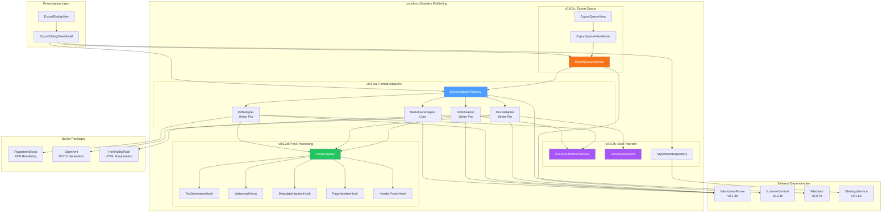
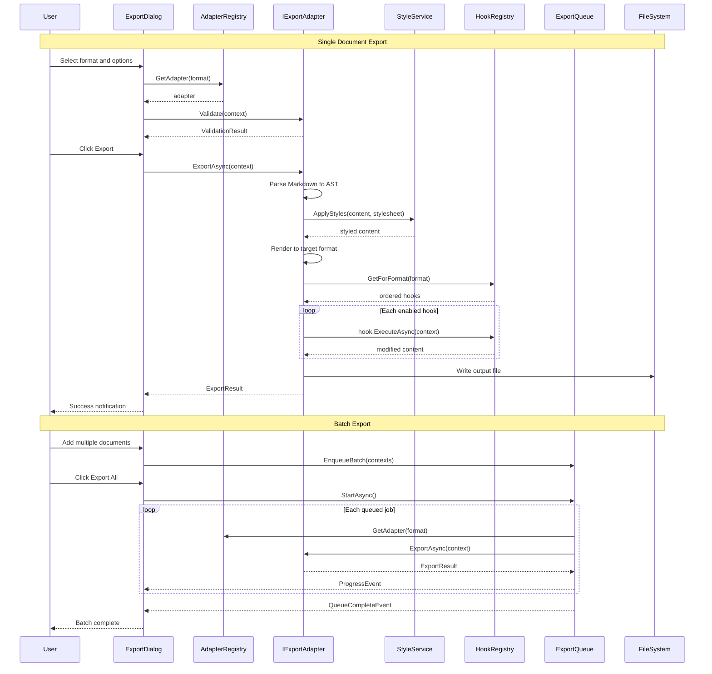

# LCS-DES-082: Design Specification Index — Export Pipeline

## Document Control

| Field | Value |
| :--- | :--- |
| **Document ID** | LCS-DES-082-INDEX |
| **Feature ID** | PUB-082 |
| **Feature Name** | Export Pipeline (To the Presses) |
| **Target Version** | v0.8.2 |
| **Module Scope** | Lexichord.Modules.Publishing |
| **Swimlane** | Publishing |
| **License Tier** | Writer Pro (Markdown: Core) |
| **Feature Gate Key** | `FeatureFlags.Publishing.ExportPipeline` |
| **Status** | Draft |
| **Last Updated** | 2026-01-27 |

---

## 1. Executive Summary

**v0.8.2** delivers the **Export Pipeline** — a comprehensive document export system enabling writers to publish their work to multiple formats including Markdown, DOCX, PDF, and HTML with professional styling and batch processing capabilities.

### 1.1 The Problem

Writers using Lexichord need to share their documents with diverse audiences:

- Technical documentation consumers who prefer HTML or PDF
- Editors and reviewers who require Microsoft Word with track changes
- Publishers who need specific format submissions
- Teams with varying tool preferences across the organization

Without a flexible export system, writers must manually convert documents using external tools, losing formatting consistency and requiring repeated effort for each format.

### 1.2 The Solution

Implement a pluggable export pipeline that:

1. **Format Adapters** — Convert documents to Markdown, DOCX, PDF, and HTML through a unified interface
2. **Style Transfer** — Apply CSS styles to web formats and Word styles to DOCX for consistent branding
3. **Export Queue** — Process multiple documents in batch with real-time progress tracking
4. **Post-Processing Hooks** — Enable automatic enhancements like TOC generation, watermarks, and metadata

### 1.3 Business Value

| Value | Description |
| :--- | :--- |
| **Publishing Flexibility** | Export to any format required by the audience or platform |
| **Brand Consistency** | Style sheets ensure uniform appearance across all exports |
| **Batch Efficiency** | Queue multiple documents for unattended processing |
| **Extensibility** | Hook system allows customization without core changes |
| **Enterprise Integration** | DOCX export enables Microsoft Office workflow compatibility |
| **Foundation** | Architecture supports future formats (EPUB, LaTeX) |

---

## 2. Related Documents

### 2.1 Scope Breakdown Document

The detailed scope breakdown for v0.8.2, including all sub-parts, implementation checklists, user stories, and acceptance criteria:

| Document | Description |
| :--- | :--- |
| **[LCS-SBD-082](./LCS-SBD-082.md)** | Scope Breakdown — Export Pipeline |

### 2.2 Sub-Part Design Specifications

Each sub-part has its own detailed design specification following the LDS-01 template:

| Sub-Part | Document | Title | Description |
| :--- | :--- | :--- | :--- |
| v0.8.2a | **[LCS-DES-082a](./LCS-DES-082a.md)** | Format Adapters | IExportAdapter interface and format implementations |
| v0.8.2b | **[LCS-DES-082b](./LCS-DES-082b.md)** | Style Transfer | CSS and DOCX style application during export |
| v0.8.2c | **[LCS-DES-082c](./LCS-DES-082c.md)** | Export Queue | Batch processing with progress tracking |
| v0.8.2d | **[LCS-DES-082d](./LCS-DES-082d.md)** | Post-Processing Hooks | TOC, watermarks, metadata, and more |

---

## 3. Architecture Overview

### 3.1 Component Diagram



### 3.2 Export Flow Diagram



---

## 4. Dependencies

### 4.1 Upstream Dependencies (Required)

| Interface | Source Version | Purpose |
| :--- | :--- | :--- |
| `IMarkdownParser` | v0.1.3b | Parse source Markdown documents |
| `ILicenseContext` | v0.0.4c | Gate export formats by license tier |
| `IMediator` | v0.0.7a | Publish export progress events |
| `ISettingsService` | v0.1.6a | Store export preferences |
| `IConfigurationService` | v0.0.3d | Configuration storage |
| `Serilog` | v0.0.3b | Logging operations |

### 4.2 Optional Dependencies

| Interface | Source Version | Purpose |
| :--- | :--- | :--- |
| `ILinterBridge` | v0.7.5a | Optional style annotations in exports |

### 4.3 NuGet Packages

| Package | Version | Purpose |
| :--- | :--- | :--- |
| `PuppeteerSharp` | 17.x | PDF rendering via headless Chromium |
| `DocumentFormat.OpenXml` | 3.x | DOCX generation and manipulation |
| `HtmlAgilityPack` | 1.11.x | HTML parsing and manipulation |
| `Markdig` | 0.34.x | Markdown parsing (existing) |
| `System.Reactive` | 6.x | Queue processing (existing) |

### 4.4 Downstream Consumers (Future)

| Version | Feature | Uses From v0.8.2 |
| :--- | :--- | :--- |
| v0.8.3 | Release Notes Agent | Export changelogs to multiple formats |
| v0.8.6 | PDF Exporter | Extends pipeline with proofing annotations |
| v0.9.x | EPUB Export | Add new adapter using same interface |
| v1.0.x | LaTeX Export | Academic publishing adapter |

---

## 5. License Gating Strategy

### 5.1 Tier Access Matrix

| Feature | Core | Writer | Writer Pro | Teams | Enterprise |
| :--- | :--- | :--- | :--- | :--- | :--- |
| Markdown Export | Yes | Yes | Yes | Yes | Yes |
| HTML Export | - | - | Yes | Yes | Yes |
| PDF Export | - | - | Yes | Yes | Yes |
| DOCX Export | - | - | Yes | Yes | Yes |
| Style Sheets | - | - | Yes | Yes | Yes |
| Export Queue | - | - | Yes | Yes | Yes |
| Post-Processing Hooks | - | - | Yes | Yes | Yes |
| Custom Style Sheets | - | - | - | Yes | Yes |
| Batch Export (>10 docs) | - | - | - | Yes | Yes |

### 5.2 Gating Implementation

```csharp
public class ExportAdapterRegistry : IExportAdapterRegistry
{
    private readonly ILicenseContext _licenseContext;
    private readonly IReadOnlyList<IExportAdapter> _adapters;

    public IExportAdapter? GetAdapter(ExportFormat format)
    {
        var adapter = _adapters.FirstOrDefault(a => a.Format == format);
        if (adapter == null) return null;

        // Check license tier
        if (!_licenseContext.HasTier(adapter.RequiredTier))
        {
            return null; // UI should show upgrade prompt
        }

        return adapter;
    }

    public IReadOnlyList<ExportFormat> GetAvailableFormats()
    {
        return _adapters
            .Where(a => _licenseContext.HasTier(a.RequiredTier))
            .Select(a => a.Format)
            .ToList();
    }
}
```

### 5.3 UI Behavior by Tier

**Core Tier:**
- Only Markdown format button enabled
- Other format buttons show lock icon
- Clicking locked button shows "Upgrade to Writer Pro" modal

**Writer Pro Tier:**
- All format buttons enabled
- Full access to style sheets and hooks
- Export queue limited to 10 documents

**Teams/Enterprise Tier:**
- All features unlocked
- Custom style sheet creation
- Unlimited batch export

---

## 6. Key Interfaces Summary

### 6.1 Export Pipeline Interfaces

| Interface | Module | Purpose |
| :--- | :--- | :--- |
| `IExportAdapter` | Abstractions | Contract for format-specific exporters |
| `IExportAdapterRegistry` | Abstractions | Adapter discovery and selection |
| `IStyleTransferService` | Abstractions | CSS style application |
| `IDocxStyleService` | Abstractions | Word style application |
| `IStyleSheetRepository` | Abstractions | Style persistence |
| `IExportQueueService` | Abstractions | Batch export management |
| `IPostProcessingHook` | Abstractions | Export hook contract |
| `IHookRegistry` | Abstractions | Hook management |

### 6.2 Key Records/DTOs

| Record | Purpose |
| :--- | :--- |
| `ExportContext` | All data needed for an export operation |
| `ExportOptions` | Configuration options for export |
| `ExportResult` | Result of export including statistics |
| `ExportStatistics` | Document metrics (pages, words, images) |
| `StyleSheet` | Reusable style definition |
| `ExportJob` | Queued export task representation |
| `ExportQueueStatus` | Queue state summary |
| `PostProcessingContext` | Hook execution context |
| `PostProcessingResult` | Hook execution result |

---

## 7. Key Test Scenarios Summary

### 7.1 Format Adapters (v0.8.2a)

| Scenario | Input | Expected Output |
| :--- | :--- | :--- |
| Markdown to Markdown | Simple document | Identical content |
| Markdown to HTML | Document with images | HTML with embedded images |
| Markdown to PDF | Document with code blocks | PDF with syntax highlighting |
| Markdown to DOCX | Document with tables | Word document with table styles |
| Invalid path | Non-existent file | Error result with message |

### 7.2 Style Transfer (v0.8.2b)

| Scenario | Style Sheet | Expected Result |
| :--- | :--- | :--- |
| Default CSS to HTML | Default | Blue accents, sans-serif |
| Academic CSS to PDF | Academic | Serif fonts, double-spaced |
| Technical CSS to HTML | Technical | Monospace code, numbered sections |
| DOCX styles | Default | Heading 1, Heading 2 styles applied |

### 7.3 Export Queue (v0.8.2c)

| Scenario | Action | Expected Result |
| :--- | :--- | :--- |
| Enqueue single | Add document | Job created, status Pending |
| Enqueue batch | Add 5 documents | 5 jobs created |
| Start processing | StartAsync() | Jobs process in order |
| Cancel pending | CancelJob() | Job status Cancelled |
| Retry failed | RetryJob() | New job created |

### 7.4 Post-Processing Hooks (v0.8.2d)

| Hook | Format | Expected Result |
| :--- | :--- | :--- |
| TOC Generation | PDF | Clickable table of contents |
| TOC Generation | DOCX | Word TOC field inserted |
| Page Numbers | PDF | Numbers in footer |
| Watermark | PDF | Diagonal text watermark |
| Metadata | PDF | Title, author properties set |

---

## 8. Implementation Checklist Summary

| Sub-Part | Tasks | Est. Hours |
| :--- | :--- | :--- |
| v0.8.2a | Format Adapters | 22.5 |
| v0.8.2b | Style Transfer | 13.5 |
| v0.8.2c | Export Queue | 14.5 |
| v0.8.2d | Post-Processing Hooks | 12 |
| Integration | Tests, DI, Documentation | 4 |
| **Total** | | **66 hours** |

See [LCS-SBD-082](./LCS-SBD-082.md) Section 4 for the detailed task breakdown.

---

## 9. Success Criteria Summary

| Category | Criterion | Target |
| :--- | :--- | :--- |
| **Functionality** | All 4 formats export correctly | 100% |
| **Style Fidelity** | CSS renders in PDF as expected | 95% match |
| **Performance** | 10,000 word PDF export | < 5 seconds |
| **Performance** | Batch throughput | 10 docs/minute |
| **Queue** | Progress accuracy | Within 5% |
| **Hooks** | TOC accuracy | 100% headings included |
| **License** | Tier gating works correctly | 100% |

See [LCS-SBD-082](./LCS-SBD-082.md) Section 9 for full success metrics.

---

## 10. Export Formats Summary

### 10.1 Markdown Export (Core)

- **Output:** `.md` file
- **Features:** Preserves all Markdown syntax, optional frontmatter
- **Use Case:** Sharing with other Markdown tools

### 10.2 HTML Export (Writer Pro)

- **Output:** `.html` file
- **Features:** Embedded CSS, images (base64 or relative), syntax highlighting
- **Use Case:** Web publishing, documentation sites

### 10.3 PDF Export (Writer Pro)

- **Output:** `.pdf` file
- **Features:** Print-ready formatting, TOC, page numbers, watermarks
- **Use Case:** Distribution, printing, archival
- **Technology:** PuppeteerSharp (headless Chromium)

### 10.4 DOCX Export (Writer Pro)

- **Output:** `.docx` file
- **Features:** Word styles, track changes compatible, embedded images
- **Use Case:** Editorial review, Microsoft Office workflows
- **Technology:** DocumentFormat.OpenXml

---

## 11. Built-in Style Sheets

| Name | Description | Best For |
| :--- | :--- | :--- |
| **Default** | Clean, modern sans-serif with blue accents | General use, screen reading |
| **Academic** | Serif fonts, double-spaced, wide margins | Academic papers, journals |
| **Technical** | Monospace code, numbered sections, compact | API docs, technical manuals |
| **Minimal** | Black and white, no decorations | Maximum readability, printing |

---

## 12. Post-Processing Hooks

| Hook ID | Name | Formats | Priority |
| :--- | :--- | :--- | :--- |
| `metadata-injection` | Document Metadata | PDF, DOCX, HTML | 5 |
| `toc-generation` | Table of Contents | PDF, DOCX, HTML | 10 |
| `header-footer` | Headers & Footers | PDF, DOCX | 70 |
| `page-numbers` | Page Numbers | PDF, DOCX | 80 |
| `watermark` | Watermark | PDF, DOCX | 90 |

Hooks execute in priority order (lower = earlier).

---

## 13. What This Enables

| Version | Feature | Uses From v0.8.2 |
| :--- | :--- | :--- |
| v0.8.3 | Release Notes Agent | Export generated changelogs to PDF/DOCX |
| v0.8.6 | PDF Proofing | Extends PDF adapter with annotations |
| v0.9.x | EPUB Export | New adapter using IExportAdapter |
| v1.0.x | LaTeX Export | Academic publishing adapter |
| v1.x | Plugin Adapters | Third-party format plugins |

---

## 14. MediatR Events

| Event | Published When |
| :--- | :--- |
| `ExportStartedEvent` | Export operation begins |
| `ExportCompletedEvent` | Export completes successfully |
| `ExportFailedEvent` | Export fails with error |
| `ExportQueueStartedEvent` | Batch processing begins |
| `ExportQueueCompletedEvent` | All batch jobs complete |
| `ExportJobProgressEvent` | Individual job progress update |
| `ExportJobStatusChangedEvent` | Job status changes |

---

## Document History

| Version | Date | Author | Changes |
| :--- | :--- | :--- | :--- |
| 1.0 | 2026-01-27 | Lead Architect | Initial draft |
