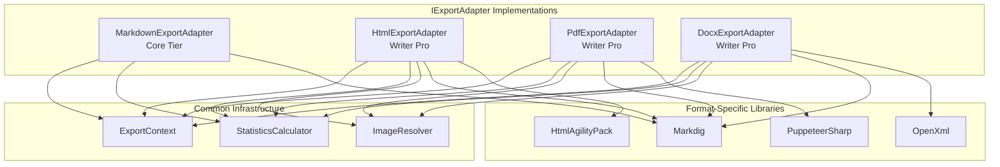
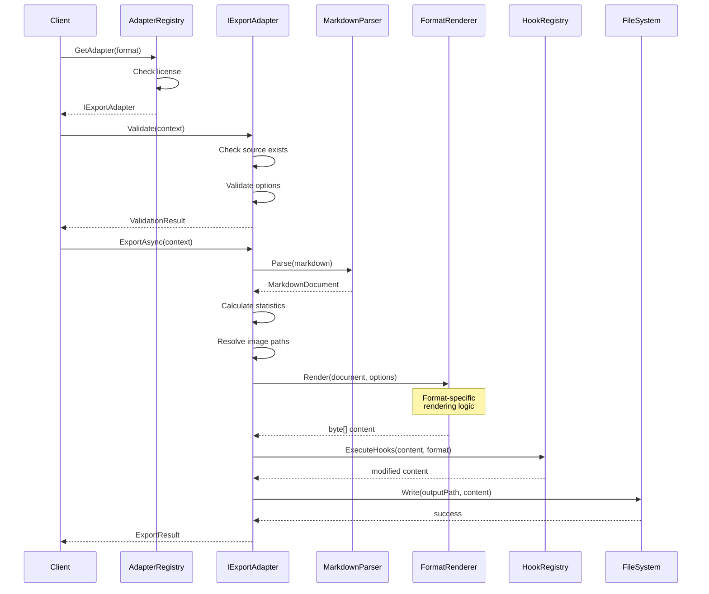

# LCS-DES-082a: Design Specification — Format Adapters

## 1. Metadata & Categorization

| Field | Value | Description |
| :--- | :--- | :--- |
| **Feature ID** | `PUB-082a` | Sub-part of PUB-082 |
| **Feature Name** | `Format Adapters (IExportAdapter Interface)` | Pluggable export format system |
| **Target Version** | `v0.8.2a` | First sub-part of v0.8.2 |
| **Module Scope** | `Lexichord.Modules.Publishing` | Publishing module |
| **Swimlane** | `Publishing` | Part of Publishing vertical |
| **License Tier** | `Writer Pro (Markdown: Core)` | Tiered by format |
| **Feature Gate Key** | `FeatureFlags.Publishing.Export.{Format}` | Per-format gating |
| **Author** | Lead Architect | |
| **Status** | `Draft` | |
| **Last Updated** | `2026-01-27` | |
| **Parent Document** | [LCS-DES-082-INDEX](./LCS-DES-082-INDEX.md) | |
| **Scope Breakdown** | [LCS-SBD-082 Section 3.1](./LCS-SBD-082.md#31-v082a-format-adapters) | |

---

## 2. Executive Summary

### 2.1 The Requirement

Writers need to export their Lexichord documents to various formats for different purposes:

- **Markdown** for sharing with other Markdown-based tools and version control
- **HTML** for web publishing and documentation sites
- **PDF** for distribution, printing, and archival
- **DOCX** for collaboration with Microsoft Office users and editorial review

Each format has unique requirements for rendering, styling, and metadata handling. A unified interface allows consistent export behavior while enabling format-specific optimizations.

> **Goal:** Define a pluggable adapter architecture that enables document export to Markdown, HTML, PDF, and DOCX through the `IExportAdapter` interface.

### 2.2 The Proposed Solution

Implement an adapter-based export system that:

1. Defines `IExportAdapter` interface as the contract for all format exporters
2. Implements four adapters: Markdown, HTML, PDF (via PuppeteerSharp), DOCX (via OpenXML)
3. Provides `ExportAdapterRegistry` for adapter discovery and license-based filtering
4. Creates `ExportContext` and `ExportResult` records for consistent data flow
5. Integrates with license system for tier-based format access

---

## 3. Architecture & Modular Strategy

### 3.1 Dependencies

#### 3.1.1 Upstream Dependencies

| Interface | Source Version | Purpose |
| :--- | :--- | :--- |
| `IMarkdownParser` | v0.1.3b | Parse Markdown source documents |
| `ILicenseContext` | v0.0.4c | Check license tier for format access |
| `ISettingsService` | v0.1.6a | Default export settings |
| `IConfigurationService` | v0.0.3d | Configuration storage |
| `Serilog` | v0.0.3b | Logging export operations |

#### 3.1.2 NuGet Packages

| Package | Version | Purpose |
| :--- | :--- | :--- |
| `PuppeteerSharp` | 17.x | PDF rendering via headless Chromium |
| `DocumentFormat.OpenXml` | 3.x | DOCX file generation |
| `HtmlAgilityPack` | 1.11.x | HTML manipulation and cleanup |
| `Markdig` | 0.34.x | Markdown parsing (existing) |

### 3.2 Licensing Behavior

| Format | Required Tier | Behavior When Not Licensed |
| :--- | :--- | :--- |
| Markdown | Core | Always available |
| HTML | Writer Pro | Format button disabled with lock icon |
| PDF | Writer Pro | Format button disabled with lock icon |
| DOCX | Writer Pro | Format button disabled with lock icon |

**Fallback Experience:**

- Unlicensed format buttons show lock icon overlay
- Clicking shows "Upgrade to Writer Pro" modal with feature benefits
- Export dialog's format list only shows available formats
- API calls return `LicenseRequiredError` for programmatic access

---

## 4. Data Contract (The API)

### 4.1 Core Interfaces

```csharp
namespace Lexichord.Abstractions.Contracts.Publishing;

/// <summary>
/// Defines the contract for document export adapters.
/// Each adapter handles conversion from Markdown to a specific output format.
/// </summary>
public interface IExportAdapter
{
    /// <summary>
    /// The format this adapter exports to.
    /// </summary>
    ExportFormat Format { get; }

    /// <summary>
    /// Display name for this format (e.g., "PDF Document").
    /// </summary>
    string DisplayName { get; }

    /// <summary>
    /// File extension for the output (e.g., ".pdf", ".docx").
    /// </summary>
    string FileExtension { get; }

    /// <summary>
    /// MIME type for the output format.
    /// </summary>
    string MimeType { get; }

    /// <summary>
    /// Minimum license tier required to use this adapter.
    /// </summary>
    LicenseTier RequiredTier { get; }

    /// <summary>
    /// Whether this adapter supports the given export options.
    /// </summary>
    /// <param name="options">Options to check.</param>
    /// <returns>True if all options are supported.</returns>
    bool SupportsOptions(ExportOptions options);

    /// <summary>
    /// Validates that the document can be exported to this format.
    /// </summary>
    /// <param name="context">Export context to validate.</param>
    /// <returns>Validation result with any warnings or errors.</returns>
    ExportValidationResult Validate(ExportContext context);

    /// <summary>
    /// Exports a document to this adapter's format.
    /// </summary>
    /// <param name="context">Export context with document and options.</param>
    /// <param name="progress">Optional progress reporter.</param>
    /// <param name="cancellationToken">Cancellation token.</param>
    /// <returns>Export result with output path and statistics.</returns>
    Task<ExportResult> ExportAsync(
        ExportContext context,
        IProgress<ExportProgress>? progress = null,
        CancellationToken cancellationToken = default);
}

/// <summary>
/// Registry for discovering and selecting export adapters.
/// </summary>
public interface IExportAdapterRegistry
{
    /// <summary>
    /// Gets all registered adapters.
    /// </summary>
    IReadOnlyList<IExportAdapter> GetAll();

    /// <summary>
    /// Gets adapters available for the current license tier.
    /// </summary>
    IReadOnlyList<IExportAdapter> GetAvailable();

    /// <summary>
    /// Gets an adapter for a specific format.
    /// </summary>
    /// <param name="format">The export format.</param>
    /// <returns>The adapter, or null if not found or not licensed.</returns>
    IExportAdapter? GetAdapter(ExportFormat format);

    /// <summary>
    /// Gets an adapter for a specific format, regardless of license.
    /// Used for UI to show locked options.
    /// </summary>
    /// <param name="format">The export format.</param>
    /// <returns>The adapter, or null if not found.</returns>
    IExportAdapter? GetAdapterIgnoreLicense(ExportFormat format);

    /// <summary>
    /// Checks if a format is available for the current license.
    /// </summary>
    /// <param name="format">The format to check.</param>
    /// <returns>True if the format can be used.</returns>
    bool IsFormatAvailable(ExportFormat format);

    /// <summary>
    /// Registers a custom adapter.
    /// </summary>
    /// <param name="adapter">The adapter to register.</param>
    void Register(IExportAdapter adapter);
}
```

### 4.2 Export Format Enumeration

```csharp
namespace Lexichord.Abstractions.Contracts.Publishing;

/// <summary>
/// Supported export formats.
/// </summary>
public enum ExportFormat
{
    /// <summary>
    /// Markdown format (.md). Available in Core tier.
    /// </summary>
    Markdown = 0,

    /// <summary>
    /// HTML format (.html). Requires Writer Pro.
    /// </summary>
    Html = 1,

    /// <summary>
    /// PDF format (.pdf). Requires Writer Pro.
    /// </summary>
    Pdf = 2,

    /// <summary>
    /// Microsoft Word format (.docx). Requires Writer Pro.
    /// </summary>
    Docx = 3
}
```

### 4.3 Export Context and Options

```csharp
namespace Lexichord.Abstractions.Contracts.Publishing;

/// <summary>
/// Context for an export operation containing all required information.
/// </summary>
public record ExportContext
{
    /// <summary>
    /// Unique identifier for this export operation.
    /// </summary>
    public Guid Id { get; init; } = Guid.NewGuid();

    /// <summary>
    /// Path to the source Markdown file.
    /// </summary>
    public required string SourcePath { get; init; }

    /// <summary>
    /// Path where the exported file will be written.
    /// </summary>
    public required string OutputPath { get; init; }

    /// <summary>
    /// Parsed Markdown document AST.
    /// </summary>
    public required MarkdownDocument Document { get; init; }

    /// <summary>
    /// Raw Markdown content (for adapters that need it).
    /// </summary>
    public required string MarkdownContent { get; init; }

    /// <summary>
    /// Export options controlling the conversion.
    /// </summary>
    public required ExportOptions Options { get; init; }

    /// <summary>
    /// Optional metadata to include in the export.
    /// Typically extracted from YAML frontmatter.
    /// </summary>
    public IReadOnlyDictionary<string, object>? Metadata { get; init; }

    /// <summary>
    /// Base path for resolving relative image paths.
    /// </summary>
    public string? BasePath { get; init; }

    /// <summary>
    /// Timestamp when export was requested.
    /// </summary>
    public DateTime RequestedAt { get; init; } = DateTime.UtcNow;
}

/// <summary>
/// Options controlling export behavior.
/// </summary>
public record ExportOptions
{
    /// <summary>
    /// Target export format.
    /// </summary>
    public required ExportFormat Format { get; init; }

    /// <summary>
    /// Whether to include a table of contents.
    /// </summary>
    public bool IncludeTableOfContents { get; init; } = false;

    /// <summary>
    /// Whether to include page numbers (PDF/DOCX only).
    /// </summary>
    public bool IncludePageNumbers { get; init; } = true;

    /// <summary>
    /// Whether to embed images in the output.
    /// If false, images are referenced by path.
    /// </summary>
    public bool EmbedImages { get; init; } = true;

    /// <summary>
    /// Whether to apply a style sheet.
    /// </summary>
    public bool ApplyStyleSheet { get; init; } = true;

    /// <summary>
    /// Path to custom style sheet (null for default).
    /// </summary>
    public string? StyleSheetPath { get; init; }

    /// <summary>
    /// ID of built-in style sheet template.
    /// </summary>
    public string? TemplateId { get; init; }

    /// <summary>
    /// Page size for PDF/DOCX exports.
    /// </summary>
    public PageSize PageSize { get; init; } = PageSize.A4;

    /// <summary>
    /// Page orientation for PDF/DOCX exports.
    /// </summary>
    public PageOrientation Orientation { get; init; } = PageOrientation.Portrait;

    /// <summary>
    /// Page margins for PDF/DOCX exports.
    /// </summary>
    public PageMargins? Margins { get; init; }

    /// <summary>
    /// Custom header text (PDF/DOCX only).
    /// </summary>
    public string? HeaderText { get; init; }

    /// <summary>
    /// Custom footer text (PDF/DOCX only).
    /// </summary>
    public string? FooterText { get; init; }

    /// <summary>
    /// Post-processing hooks to execute.
    /// </summary>
    public IReadOnlyList<string>? EnabledHookIds { get; init; }

    /// <summary>
    /// Hook-specific parameters.
    /// </summary>
    public IReadOnlyDictionary<string, object>? HookParameters { get; init; }

    /// <summary>
    /// Whether to overwrite existing output file.
    /// </summary>
    public bool OverwriteExisting { get; init; } = true;
}

/// <summary>
/// Page size options for PDF/DOCX exports.
/// </summary>
public enum PageSize
{
    A4,
    A5,
    Letter,
    Legal,
    Tabloid,
    Custom
}

/// <summary>
/// Page orientation options.
/// </summary>
public enum PageOrientation
{
    Portrait,
    Landscape
}

/// <summary>
/// Page margin settings in inches.
/// </summary>
public record PageMargins(
    double Top = 1.0,
    double Bottom = 1.0,
    double Left = 1.0,
    double Right = 1.0
);
```

### 4.4 Export Result and Statistics

```csharp
namespace Lexichord.Abstractions.Contracts.Publishing;

/// <summary>
/// Result of an export operation.
/// </summary>
public record ExportResult
{
    /// <summary>
    /// Whether the export succeeded.
    /// </summary>
    public required bool Success { get; init; }

    /// <summary>
    /// Path to the exported file.
    /// </summary>
    public required string OutputPath { get; init; }

    /// <summary>
    /// Format that was exported.
    /// </summary>
    public required ExportFormat Format { get; init; }

    /// <summary>
    /// Size of the output file in bytes.
    /// </summary>
    public long FileSizeBytes { get; init; }

    /// <summary>
    /// Time taken for the export.
    /// </summary>
    public TimeSpan Duration { get; init; }

    /// <summary>
    /// Statistics about the exported document.
    /// </summary>
    public required ExportStatistics Statistics { get; init; }

    /// <summary>
    /// Error message if export failed.
    /// </summary>
    public string? ErrorMessage { get; init; }

    /// <summary>
    /// Exception details if export failed.
    /// </summary>
    public Exception? Exception { get; init; }

    /// <summary>
    /// Warnings generated during export.
    /// </summary>
    public IReadOnlyList<ExportWarning>? Warnings { get; init; }

    /// <summary>
    /// Post-processing hooks that were executed.
    /// </summary>
    public IReadOnlyList<string>? ExecutedHooks { get; init; }

    /// <summary>
    /// Creates a successful result.
    /// </summary>
    public static ExportResult Succeeded(
        string outputPath,
        ExportFormat format,
        long fileSize,
        TimeSpan duration,
        ExportStatistics statistics,
        IReadOnlyList<ExportWarning>? warnings = null,
        IReadOnlyList<string>? executedHooks = null) => new()
    {
        Success = true,
        OutputPath = outputPath,
        Format = format,
        FileSizeBytes = fileSize,
        Duration = duration,
        Statistics = statistics,
        Warnings = warnings,
        ExecutedHooks = executedHooks
    };

    /// <summary>
    /// Creates a failed result.
    /// </summary>
    public static ExportResult Failed(
        string outputPath,
        ExportFormat format,
        string errorMessage,
        Exception? exception = null) => new()
    {
        Success = false,
        OutputPath = outputPath,
        Format = format,
        FileSizeBytes = 0,
        Duration = TimeSpan.Zero,
        Statistics = ExportStatistics.Empty,
        ErrorMessage = errorMessage,
        Exception = exception
    };
}

/// <summary>
/// Statistics about the exported document.
/// </summary>
public record ExportStatistics
{
    /// <summary>
    /// Number of pages in the output (PDF/DOCX only).
    /// </summary>
    public int PageCount { get; init; }

    /// <summary>
    /// Total word count.
    /// </summary>
    public int WordCount { get; init; }

    /// <summary>
    /// Number of images included.
    /// </summary>
    public int ImageCount { get; init; }

    /// <summary>
    /// Number of tables included.
    /// </summary>
    public int TableCount { get; init; }

    /// <summary>
    /// Number of code blocks included.
    /// </summary>
    public int CodeBlockCount { get; init; }

    /// <summary>
    /// Number of headings at each level.
    /// </summary>
    public IReadOnlyDictionary<int, int>? HeadingCounts { get; init; }

    /// <summary>
    /// Total heading count.
    /// </summary>
    public int HeadingCount => HeadingCounts?.Values.Sum() ?? 0;

    /// <summary>
    /// Empty statistics instance.
    /// </summary>
    public static ExportStatistics Empty => new()
    {
        PageCount = 0,
        WordCount = 0,
        ImageCount = 0,
        TableCount = 0,
        CodeBlockCount = 0
    };
}

/// <summary>
/// Warning generated during export.
/// </summary>
public record ExportWarning(
    string Code,
    string Message,
    string? Location = null
);

/// <summary>
/// Validation result for export context.
/// </summary>
public record ExportValidationResult
{
    /// <summary>
    /// Whether the context is valid for export.
    /// </summary>
    public required bool IsValid { get; init; }

    /// <summary>
    /// Validation errors (prevent export).
    /// </summary>
    public IReadOnlyList<string>? Errors { get; init; }

    /// <summary>
    /// Validation warnings (allow export with caution).
    /// </summary>
    public IReadOnlyList<string>? Warnings { get; init; }

    /// <summary>
    /// Creates a valid result.
    /// </summary>
    public static ExportValidationResult Valid(IReadOnlyList<string>? warnings = null) => new()
    {
        IsValid = true,
        Warnings = warnings
    };

    /// <summary>
    /// Creates an invalid result.
    /// </summary>
    public static ExportValidationResult Invalid(params string[] errors) => new()
    {
        IsValid = false,
        Errors = errors
    };
}

/// <summary>
/// Progress report during export.
/// </summary>
public record ExportProgress(
    double PercentComplete,
    string CurrentOperation,
    string? CurrentItem = null
);
```

---

## 5. Implementation Logic

### 5.1 Adapter Architecture



### 5.2 Export Flow



### 5.3 Markdown Export Adapter

```csharp
namespace Lexichord.Modules.Publishing.Adapters;

/// <summary>
/// Export adapter for Markdown format.
/// Simply preserves or optionally reformats the Markdown content.
/// </summary>
public class MarkdownExportAdapter : IExportAdapter
{
    private readonly ILogger<MarkdownExportAdapter> _logger;

    public ExportFormat Format => ExportFormat.Markdown;
    public string DisplayName => "Markdown Document";
    public string FileExtension => ".md";
    public string MimeType => "text/markdown";
    public LicenseTier RequiredTier => LicenseTier.Core;

    public MarkdownExportAdapter(ILogger<MarkdownExportAdapter> logger)
    {
        _logger = logger;
    }

    public bool SupportsOptions(ExportOptions options)
    {
        // Markdown supports limited options
        return options.Format == ExportFormat.Markdown;
    }

    public ExportValidationResult Validate(ExportContext context)
    {
        var errors = new List<string>();

        if (!File.Exists(context.SourcePath))
            errors.Add($"Source file not found: {context.SourcePath}");

        if (string.IsNullOrWhiteSpace(context.OutputPath))
            errors.Add("Output path is required");

        if (!context.Options.OverwriteExisting && File.Exists(context.OutputPath))
            errors.Add($"Output file already exists: {context.OutputPath}");

        return errors.Count > 0
            ? ExportValidationResult.Invalid(errors.ToArray())
            : ExportValidationResult.Valid();
    }

    public async Task<ExportResult> ExportAsync(
        ExportContext context,
        IProgress<ExportProgress>? progress = null,
        CancellationToken cancellationToken = default)
    {
        var sw = Stopwatch.StartNew();
        _logger.LogDebug("Starting Markdown export: {Source}", context.SourcePath);

        try
        {
            progress?.Report(new ExportProgress(10, "Reading source"));

            // For Markdown, we mostly pass through the content
            var content = context.MarkdownContent;

            progress?.Report(new ExportProgress(50, "Processing content"));

            // Optionally normalize/reformat
            if (context.Options.ApplyStyleSheet)
            {
                content = NormalizeMarkdown(content);
            }

            progress?.Report(new ExportProgress(80, "Writing output"));

            // Ensure output directory exists
            var outputDir = Path.GetDirectoryName(context.OutputPath);
            if (!string.IsNullOrEmpty(outputDir))
                Directory.CreateDirectory(outputDir);

            // Write content
            await File.WriteAllTextAsync(context.OutputPath, content, cancellationToken);

            progress?.Report(new ExportProgress(100, "Complete"));

            sw.Stop();
            var fileInfo = new FileInfo(context.OutputPath);

            _logger.LogInformation(
                "Markdown export completed: {Output} ({Size} bytes, {Duration}ms)",
                context.OutputPath, fileInfo.Length, sw.ElapsedMilliseconds);

            return ExportResult.Succeeded(
                outputPath: context.OutputPath,
                format: ExportFormat.Markdown,
                fileSize: fileInfo.Length,
                duration: sw.Elapsed,
                statistics: CalculateStatistics(context.Document));
        }
        catch (Exception ex)
        {
            _logger.LogError(ex, "Markdown export failed: {Source}", context.SourcePath);
            return ExportResult.Failed(
                context.OutputPath,
                ExportFormat.Markdown,
                ex.Message,
                ex);
        }
    }

    private static string NormalizeMarkdown(string content)
    {
        // Normalize line endings
        content = content.Replace("\r\n", "\n").Replace("\r", "\n");

        // Ensure file ends with newline
        if (!content.EndsWith('\n'))
            content += "\n";

        return content;
    }

    private static ExportStatistics CalculateStatistics(MarkdownDocument document)
    {
        var visitor = new StatisticsVisitor();
        visitor.Visit(document);
        return visitor.GetStatistics();
    }
}
```

### 5.4 PDF Export Adapter

```csharp
namespace Lexichord.Modules.Publishing.Adapters;

/// <summary>
/// Export adapter for PDF format using PuppeteerSharp.
/// Converts Markdown to HTML, then renders to PDF via headless Chromium.
/// </summary>
public class PdfExportAdapter : IExportAdapter
{
    private readonly IMarkdownParser _markdownParser;
    private readonly IStyleTransferService _styleService;
    private readonly IHookRegistry _hookRegistry;
    private readonly IImageResolver _imageResolver;
    private readonly ILogger<PdfExportAdapter> _logger;

    private static readonly Lazy<Task<IBrowser>> _browser = new(InitBrowserAsync);
    private static readonly SemaphoreSlim _browserLock = new(1, 1);

    public ExportFormat Format => ExportFormat.Pdf;
    public string DisplayName => "PDF Document";
    public string FileExtension => ".pdf";
    public string MimeType => "application/pdf";
    public LicenseTier RequiredTier => LicenseTier.WriterPro;

    public PdfExportAdapter(
        IMarkdownParser markdownParser,
        IStyleTransferService styleService,
        IHookRegistry hookRegistry,
        IImageResolver imageResolver,
        ILogger<PdfExportAdapter> logger)
    {
        _markdownParser = markdownParser;
        _styleService = styleService;
        _hookRegistry = hookRegistry;
        _imageResolver = imageResolver;
        _logger = logger;
    }

    public bool SupportsOptions(ExportOptions options)
    {
        return options.Format == ExportFormat.Pdf;
    }

    public ExportValidationResult Validate(ExportContext context)
    {
        var errors = new List<string>();
        var warnings = new List<string>();

        if (!File.Exists(context.SourcePath))
            errors.Add($"Source file not found: {context.SourcePath}");

        if (string.IsNullOrWhiteSpace(context.OutputPath))
            errors.Add("Output path is required");

        if (!context.OutputPath.EndsWith(".pdf", StringComparison.OrdinalIgnoreCase))
            warnings.Add("Output path should have .pdf extension");

        if (!context.Options.OverwriteExisting && File.Exists(context.OutputPath))
            errors.Add($"Output file already exists: {context.OutputPath}");

        // Check for missing images
        var missingImages = FindMissingImages(context);
        foreach (var img in missingImages)
            warnings.Add($"Image not found: {img}");

        return errors.Count > 0
            ? ExportValidationResult.Invalid(errors.ToArray())
            : ExportValidationResult.Valid(warnings.Count > 0 ? warnings : null);
    }

    public async Task<ExportResult> ExportAsync(
        ExportContext context,
        IProgress<ExportProgress>? progress = null,
        CancellationToken cancellationToken = default)
    {
        var sw = Stopwatch.StartNew();
        _logger.LogDebug("Starting PDF export: {Source}", context.SourcePath);

        try
        {
            // 1. Convert Markdown to HTML (10-30%)
            progress?.Report(new ExportProgress(10, "Converting to HTML"));
            var html = _markdownParser.ToHtml(context.Document);

            // 2. Resolve and embed images (30-40%)
            progress?.Report(new ExportProgress(30, "Processing images"));
            if (context.Options.EmbedImages)
            {
                html = await _imageResolver.EmbedImagesAsync(
                    html, context.BasePath ?? Path.GetDirectoryName(context.SourcePath)!,
                    cancellationToken);
            }

            // 3. Apply styles (40-50%)
            progress?.Report(new ExportProgress(40, "Applying styles"));
            if (context.Options.ApplyStyleSheet)
            {
                var styleSheet = await GetStyleSheetAsync(context.Options);
                html = _styleService.ApplyToHtml(html, styleSheet);
            }

            // 4. Wrap in complete HTML document (50%)
            progress?.Report(new ExportProgress(50, "Building document"));
            html = WrapInHtmlDocument(html, context);

            // 5. Render to PDF (50-80%)
            progress?.Report(new ExportProgress(55, "Rendering PDF"));
            var pdfBytes = await RenderPdfAsync(html, context.Options, cancellationToken);

            // 6. Execute post-processing hooks (80-95%)
            progress?.Report(new ExportProgress(80, "Post-processing"));
            var executedHooks = new List<string>();
            pdfBytes = await ExecuteHooksAsync(
                pdfBytes, context, executedHooks, cancellationToken);

            // 7. Write output (95-100%)
            progress?.Report(new ExportProgress(95, "Writing file"));
            var outputDir = Path.GetDirectoryName(context.OutputPath);
            if (!string.IsNullOrEmpty(outputDir))
                Directory.CreateDirectory(outputDir);

            await File.WriteAllBytesAsync(context.OutputPath, pdfBytes, cancellationToken);

            progress?.Report(new ExportProgress(100, "Complete"));
            sw.Stop();

            _logger.LogInformation(
                "PDF export completed: {Output} ({Size} bytes, {Duration}ms)",
                context.OutputPath, pdfBytes.Length, sw.ElapsedMilliseconds);

            return ExportResult.Succeeded(
                outputPath: context.OutputPath,
                format: ExportFormat.Pdf,
                fileSize: pdfBytes.Length,
                duration: sw.Elapsed,
                statistics: CalculateStatistics(context.Document),
                executedHooks: executedHooks);
        }
        catch (Exception ex)
        {
            _logger.LogError(ex, "PDF export failed: {Source}", context.SourcePath);
            return ExportResult.Failed(
                context.OutputPath,
                ExportFormat.Pdf,
                ex.Message,
                ex);
        }
    }

    private async Task<byte[]> RenderPdfAsync(
        string html,
        ExportOptions options,
        CancellationToken cancellationToken)
    {
        await _browserLock.WaitAsync(cancellationToken);
        try
        {
            var browser = await _browser.Value;
            await using var page = await browser.NewPageAsync();

            await page.SetContentAsync(html);

            return await page.PdfDataAsync(new PdfOptions
            {
                Format = MapPageSize(options.PageSize),
                Landscape = options.Orientation == PageOrientation.Landscape,
                PrintBackground = true,
                MarginOptions = MapMargins(options.Margins),
                DisplayHeaderFooter = HasHeaderOrFooter(options),
                HeaderTemplate = BuildHeaderTemplate(options),
                FooterTemplate = BuildFooterTemplate(options)
            });
        }
        finally
        {
            _browserLock.Release();
        }
    }

    private static PaperFormat MapPageSize(PageSize size) => size switch
    {
        PageSize.A4 => PaperFormat.A4,
        PageSize.A5 => PaperFormat.A5,
        PageSize.Letter => PaperFormat.Letter,
        PageSize.Legal => PaperFormat.Legal,
        PageSize.Tabloid => PaperFormat.Tabloid,
        _ => PaperFormat.A4
    };

    private static MarginOptions MapMargins(PageMargins? margins)
    {
        margins ??= new PageMargins();
        return new MarginOptions
        {
            Top = $"{margins.Top}in",
            Bottom = $"{margins.Bottom}in",
            Left = $"{margins.Left}in",
            Right = $"{margins.Right}in"
        };
    }

    private static async Task<IBrowser> InitBrowserAsync()
    {
        var browserFetcher = new BrowserFetcher();
        await browserFetcher.DownloadAsync();
        return await Puppeteer.LaunchAsync(new LaunchOptions
        {
            Headless = true,
            Args = new[] { "--no-sandbox", "--disable-setuid-sandbox" }
        });
    }

    private string WrapInHtmlDocument(string bodyContent, ExportContext context)
    {
        var title = context.Metadata?.GetValueOrDefault("title")?.ToString()
            ?? Path.GetFileNameWithoutExtension(context.SourcePath);

        return $"""
            <!DOCTYPE html>
            <html lang="en">
            <head>
                <meta charset="UTF-8">
                <meta name="viewport" content="width=device-width, initial-scale=1.0">
                <title>{WebUtility.HtmlEncode(title)}</title>
            </head>
            <body>
                {bodyContent}
            </body>
            </html>
            """;
    }
}
```

### 5.5 Adapter Registry Implementation

```csharp
namespace Lexichord.Modules.Publishing.Services;

/// <summary>
/// Registry for managing export adapters with license-aware access.
/// </summary>
public class ExportAdapterRegistry : IExportAdapterRegistry
{
    private readonly ILicenseContext _licenseContext;
    private readonly ILogger<ExportAdapterRegistry> _logger;
    private readonly List<IExportAdapter> _adapters = [];
    private readonly ReaderWriterLockSlim _lock = new();

    public ExportAdapterRegistry(
        IEnumerable<IExportAdapter> adapters,
        ILicenseContext licenseContext,
        ILogger<ExportAdapterRegistry> logger)
    {
        _licenseContext = licenseContext;
        _logger = logger;

        foreach (var adapter in adapters)
        {
            _adapters.Add(adapter);
            _logger.LogDebug(
                "Registered export adapter: {Format} ({Tier})",
                adapter.Format, adapter.RequiredTier);
        }
    }

    public IReadOnlyList<IExportAdapter> GetAll()
    {
        _lock.EnterReadLock();
        try
        {
            return _adapters.ToList();
        }
        finally
        {
            _lock.ExitReadLock();
        }
    }

    public IReadOnlyList<IExportAdapter> GetAvailable()
    {
        _lock.EnterReadLock();
        try
        {
            return _adapters
                .Where(a => _licenseContext.HasTier(a.RequiredTier))
                .ToList();
        }
        finally
        {
            _lock.ExitReadLock();
        }
    }

    public IExportAdapter? GetAdapter(ExportFormat format)
    {
        var adapter = GetAdapterIgnoreLicense(format);

        if (adapter != null && !_licenseContext.HasTier(adapter.RequiredTier))
        {
            _logger.LogWarning(
                "Export format {Format} requires {Tier} license",
                format, adapter.RequiredTier);
            return null;
        }

        return adapter;
    }

    public IExportAdapter? GetAdapterIgnoreLicense(ExportFormat format)
    {
        _lock.EnterReadLock();
        try
        {
            return _adapters.FirstOrDefault(a => a.Format == format);
        }
        finally
        {
            _lock.ExitReadLock();
        }
    }

    public bool IsFormatAvailable(ExportFormat format)
    {
        return GetAdapter(format) != null;
    }

    public void Register(IExportAdapter adapter)
    {
        _lock.EnterWriteLock();
        try
        {
            // Remove existing adapter for same format
            _adapters.RemoveAll(a => a.Format == adapter.Format);
            _adapters.Add(adapter);

            _logger.LogInformation(
                "Registered custom export adapter: {Format}",
                adapter.Format);
        }
        finally
        {
            _lock.ExitWriteLock();
        }
    }
}
```

---

## 6. UI/UX Specifications

### 6.1 Export Dialog Format Selection

```text
+------------------------------------------------------------------+
| Export Format                                                     |
| +-------+  +-------+  +-------+  +-------+                       |
| |  MD   |  | HTML  |  |  PDF  |  | DOCX  |                       |
| |  [v]  |  |  [x]  |  |  [ ]  |  |  [ ]  |                       |
| +-------+  +-------+  +-------+  +-------+                       |
|                                                                   |
|   [v] Selected    [x] Locked (Upgrade required)    [ ] Available  |
+------------------------------------------------------------------+
```

### 6.2 Format Button States

| State | Visual | Behavior |
| :--- | :--- | :--- |
| Available | Normal button | Selectable |
| Selected | Highlighted, checkmark | Currently chosen |
| Locked | Lock icon overlay, grayed | Shows upgrade modal on click |
| Disabled | Grayed, no icon | Not applicable for this document |

---

## 7. Observability & Logging

| Level | Source | Message Template |
| :--- | :--- | :--- |
| Debug | AdapterRegistry | `"Registered export adapter: {Format} ({Tier})"` |
| Debug | ExportAdapter | `"Starting {Format} export: {Source}"` |
| Info | ExportAdapter | `"Export completed: {Output} ({Size} bytes, {Duration}ms)"` |
| Warning | AdapterRegistry | `"Export format {Format} requires {Tier} license"` |
| Warning | ExportAdapter | `"Image not found during export: {ImagePath}"` |
| Error | ExportAdapter | `"Export failed: {Error}"` |

---

## 8. Security & Safety

| Risk | Level | Mitigation |
| :--- | :--- | :--- |
| Path traversal in output path | Medium | Validate path is within allowed directories |
| Malicious content in Markdown | Low | Sanitize HTML output, no script execution |
| Large file memory usage | Medium | Stream processing for large documents |
| Browser process leaks | Medium | Proper disposal, singleton browser instance |
| Chromium sandbox escape | Low | Run with --no-sandbox only if necessary |

---

## 9. Acceptance Criteria

### 9.1 Functional Criteria

| # | Given | When | Then |
| :--- | :--- | :--- | :--- |
| 1 | Valid Markdown document | Export to Markdown | Output matches input content |
| 2 | Document with images | Export to HTML with embed | Images are base64 encoded |
| 3 | Document with code blocks | Export to PDF | Syntax highlighting preserved |
| 4 | Document with tables | Export to DOCX | Tables render with borders |
| 5 | Core license | Request PDF export | Returns null adapter |
| 6 | Writer Pro license | Request PDF export | Returns PDF adapter |
| 7 | Non-existent source | Validate context | Returns invalid result |
| 8 | Existing output, no overwrite | Validate context | Returns invalid result |

### 9.2 Performance Criteria

| # | Scenario | Threshold |
| :--- | :--- | :--- |
| 1 | Markdown export (10K words) | < 100ms |
| 2 | HTML export (10K words) | < 500ms |
| 3 | PDF export (10K words) | < 5,000ms |
| 4 | DOCX export (10K words) | < 2,000ms |

---

## 10. Deliverable Checklist

| # | Deliverable | Status |
| :--- | :--- | :--- |
| 1 | `IExportAdapter` interface | [ ] |
| 2 | `IExportAdapterRegistry` interface | [ ] |
| 3 | `ExportContext` record | [ ] |
| 4 | `ExportOptions` record | [ ] |
| 5 | `ExportResult` record | [ ] |
| 6 | `ExportStatistics` record | [ ] |
| 7 | `MarkdownExportAdapter` implementation | [ ] |
| 8 | `HtmlExportAdapter` implementation | [ ] |
| 9 | `PdfExportAdapter` implementation | [ ] |
| 10 | `DocxExportAdapter` implementation | [ ] |
| 11 | `ExportAdapterRegistry` implementation | [ ] |
| 12 | Unit tests for all adapters | [ ] |
| 13 | Integration tests for export pipeline | [ ] |

---

## 11. Verification Commands

```bash
# Run all format adapter tests
dotnet test --filter "Version=v0.8.2a" --logger "console;verbosity=detailed"

# Run specific adapter tests
dotnet test --filter "FullyQualifiedName~MarkdownExportAdapter"
dotnet test --filter "FullyQualifiedName~PdfExportAdapter"

# Run with coverage
dotnet test --filter "Version=v0.8.2a" --collect:"XPlat Code Coverage"

# Verify NuGet packages
dotnet list src/Lexichord.Modules.Publishing package | grep -E "PuppeteerSharp|OpenXml"
```

---

## Document History

| Version | Date | Author | Changes |
| :--- | :--- | :--- | :--- |
| 1.0 | 2026-01-27 | Lead Architect | Initial draft |
