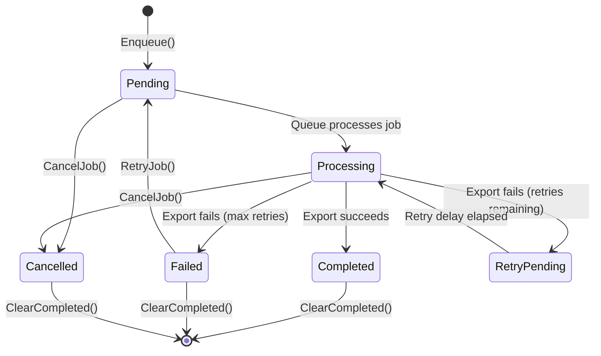

# LCS-DES-082c: Design Specification — Export Queue

## 1. Metadata & Categorization

| Field | Value | Description |
| :--- | :--- | :--- |
| **Feature ID** | `PUB-082c` | Sub-part of PUB-082 |
| **Feature Name** | `Export Queue (Batch Export with Progress)` | Batch processing system |
| **Target Version** | `v0.8.2c` | Third sub-part of v0.8.2 |
| **Module Scope** | `Lexichord.Modules.Publishing` | Publishing module |
| **Swimlane** | `Publishing` | Part of Publishing vertical |
| **License Tier** | `Writer Pro` | Batch features gated |
| **Feature Gate Key** | `FeatureFlags.Publishing.ExportQueue` | |
| **Author** | Lead Architect | |
| **Status** | `Draft` | |
| **Last Updated** | `2026-01-27` | |
| **Parent Document** | [LCS-DES-082-INDEX](./LCS-DES-082-INDEX.md) | |
| **Scope Breakdown** | [LCS-SBD-082 Section 3.3](./LCS-SBD-082.md#33-v082c-export-queue) | |

---

## 2. Executive Summary

### 2.1 The Requirement

Writers often need to export multiple documents simultaneously:

- Publishing a multi-chapter book requires exporting all chapters to PDF
- Documentation releases need HTML and PDF versions of all pages
- Localized content requires export to multiple formats per language
- End-of-project deliverables include various format exports

Manual sequential export is tedious, error-prone, and prevents users from doing other work while exports process.

> **Goal:** Implement a batch export system that queues multiple documents for export and provides real-time progress tracking with cancellation support.

### 2.2 The Proposed Solution

Implement a background queue service that:

1. Accepts multiple export jobs via `IExportQueueService`
2. Processes jobs sequentially in background thread
3. Reports progress via events and observable properties
4. Supports cancellation of individual jobs or entire queue
5. Implements retry logic for transient failures
6. Persists export history for review
7. Provides a UI for queue management

---

## 3. Architecture & Modular Strategy

### 3.1 Dependencies

#### 3.1.1 Upstream Dependencies

| Interface | Source Version | Purpose |
| :--- | :--- | :--- |
| `IExportAdapterRegistry` | v0.8.2a | Get adapters for each job |
| `IExportAdapter` | v0.8.2a | Perform actual exports |
| `IMediator` | v0.0.7a | Publish progress events |
| `ISettingsService` | v0.1.6a | Queue configuration |
| `ILicenseContext` | v0.0.4c | Batch limit enforcement |
| `Serilog` | v0.0.3b | Logging |

#### 3.1.2 NuGet Packages

| Package | Version | Purpose |
| :--- | :--- | :--- |
| `System.Reactive` | 6.x | Reactive progress streams |
| `System.Threading.Channels` | 8.x | High-performance queue |

### 3.2 Licensing Behavior

| Feature | Writer Pro | Teams | Enterprise |
| :--- | :--- | :--- | :--- |
| Export queue | Yes | Yes | Yes |
| Max batch size | 10 docs | 50 docs | Unlimited |
| Parallel processing | No | 2 parallel | 4 parallel |
| Queue persistence | Session only | Persisted | Persisted |
| Export history | 7 days | 30 days | 90 days |

---

## 4. Data Contract (The API)

### 4.1 Export Queue Service Interface

```csharp
namespace Lexichord.Abstractions.Contracts.Publishing;

/// <summary>
/// Service for managing the export queue.
/// Enables batch export with progress tracking and cancellation.
/// </summary>
public interface IExportQueueService
{
    /// <summary>
    /// Gets the current queue status.
    /// </summary>
    ExportQueueStatus Status { get; }

    /// <summary>
    /// Gets all jobs in the queue (pending, processing, completed, failed).
    /// </summary>
    IReadOnlyList<ExportJob> Jobs { get; }

    /// <summary>
    /// Gets jobs filtered by status.
    /// </summary>
    IReadOnlyList<ExportJob> GetJobsByStatus(ExportJobStatus status);

    /// <summary>
    /// Observable stream of queue status changes.
    /// </summary>
    IObservable<ExportQueueStatus> StatusChanges { get; }

    /// <summary>
    /// Observable stream of job progress updates.
    /// </summary>
    IObservable<ExportJobProgress> JobProgressUpdates { get; }

    /// <summary>
    /// Enqueues a document for export.
    /// </summary>
    /// <param name="context">Export context.</param>
    /// <returns>The created export job.</returns>
    ExportJob Enqueue(ExportContext context);

    /// <summary>
    /// Enqueues multiple documents for batch export.
    /// </summary>
    /// <param name="contexts">Export contexts.</param>
    /// <returns>The created export jobs.</returns>
    /// <exception cref="BatchLimitExceededException">Thrown if batch exceeds license limit.</exception>
    IReadOnlyList<ExportJob> EnqueueBatch(IEnumerable<ExportContext> contexts);

    /// <summary>
    /// Cancels a specific job.
    /// </summary>
    /// <param name="jobId">The job ID to cancel.</param>
    /// <returns>True if the job was cancelled, false if not found or already completed.</returns>
    bool CancelJob(Guid jobId);

    /// <summary>
    /// Cancels all pending jobs. Running jobs complete normally.
    /// </summary>
    /// <returns>Number of jobs cancelled.</returns>
    int CancelAllPending();

    /// <summary>
    /// Retries a failed job.
    /// </summary>
    /// <param name="jobId">The job ID to retry.</param>
    /// <returns>The new job, or null if retry not possible.</returns>
    ExportJob? RetryJob(Guid jobId);

    /// <summary>
    /// Retries all failed jobs.
    /// </summary>
    /// <returns>The new jobs created.</returns>
    IReadOnlyList<ExportJob> RetryAllFailed();

    /// <summary>
    /// Clears completed and failed jobs from the queue.
    /// </summary>
    /// <returns>Number of jobs cleared.</returns>
    int ClearCompleted();

    /// <summary>
    /// Clears all jobs from the queue (cancels pending first).
    /// </summary>
    void ClearAll();

    /// <summary>
    /// Starts processing the queue.
    /// </summary>
    /// <param name="cancellationToken">Token to stop processing.</param>
    Task StartAsync(CancellationToken cancellationToken = default);

    /// <summary>
    /// Pauses queue processing (current job completes).
    /// </summary>
    void Pause();

    /// <summary>
    /// Resumes queue processing.
    /// </summary>
    void Resume();

    /// <summary>
    /// Stops processing and waits for current job to complete.
    /// </summary>
    Task StopAsync();

    /// <summary>
    /// Gets export history.
    /// </summary>
    /// <param name="since">Start date for history.</param>
    /// <param name="limit">Maximum entries to return.</param>
    Task<IReadOnlyList<ExportHistoryEntry>> GetHistoryAsync(
        DateTime? since = null,
        int limit = 100,
        CancellationToken ct = default);

    /// <summary>
    /// Event raised when queue status changes.
    /// </summary>
    event EventHandler<ExportQueueStatusChangedEventArgs> StatusChanged;

    /// <summary>
    /// Event raised when a job's status changes.
    /// </summary>
    event EventHandler<ExportJobStatusChangedEventArgs> JobStatusChanged;

    /// <summary>
    /// Event raised when a job reports progress.
    /// </summary>
    event EventHandler<ExportJobProgressEventArgs> JobProgress;
}
```

### 4.2 Export Job Records

```csharp
namespace Lexichord.Abstractions.Contracts.Publishing;

/// <summary>
/// Represents a queued export job.
/// </summary>
public record ExportJob
{
    /// <summary>
    /// Unique identifier for this job.
    /// </summary>
    public Guid Id { get; init; } = Guid.NewGuid();

    /// <summary>
    /// Export context containing document and options.
    /// </summary>
    public required ExportContext Context { get; init; }

    /// <summary>
    /// Current status of the job.
    /// </summary>
    public ExportJobStatus Status { get; init; } = ExportJobStatus.Pending;

    /// <summary>
    /// When the job was created/enqueued.
    /// </summary>
    public DateTime CreatedAt { get; init; } = DateTime.UtcNow;

    /// <summary>
    /// When the job started processing.
    /// </summary>
    public DateTime? StartedAt { get; init; }

    /// <summary>
    /// When the job completed (success or failure).
    /// </summary>
    public DateTime? CompletedAt { get; init; }

    /// <summary>
    /// Progress percentage (0-100).
    /// </summary>
    public double ProgressPercent { get; init; }

    /// <summary>
    /// Current operation being performed.
    /// </summary>
    public string? CurrentOperation { get; init; }

    /// <summary>
    /// Export result if completed.
    /// </summary>
    public ExportResult? Result { get; init; }

    /// <summary>
    /// Number of retry attempts made.
    /// </summary>
    public int RetryCount { get; init; }

    /// <summary>
    /// Maximum retry attempts allowed.
    /// </summary>
    public int MaxRetries { get; init; } = 3;

    /// <summary>
    /// Error message if failed.
    /// </summary>
    public string? ErrorMessage { get; init; }

    /// <summary>
    /// Position in queue (1-based, 0 if not pending).
    /// </summary>
    public int QueuePosition { get; init; }

    /// <summary>
    /// Estimated time remaining based on progress.
    /// </summary>
    public TimeSpan? EstimatedTimeRemaining { get; init; }

    /// <summary>
    /// Display name for the job (derived from source file).
    /// </summary>
    public string DisplayName => Path.GetFileName(Context.SourcePath);

    /// <summary>
    /// Creates a copy with updated status.
    /// </summary>
    public ExportJob WithStatus(ExportJobStatus status) =>
        this with { Status = status };

    /// <summary>
    /// Creates a copy with updated progress.
    /// </summary>
    public ExportJob WithProgress(double percent, string? operation = null) =>
        this with { ProgressPercent = percent, CurrentOperation = operation };

    /// <summary>
    /// Creates a completed copy with result.
    /// </summary>
    public ExportJob WithResult(ExportResult result) =>
        this with
        {
            Status = result.Success ? ExportJobStatus.Completed : ExportJobStatus.Failed,
            CompletedAt = DateTime.UtcNow,
            Result = result,
            ProgressPercent = 100,
            ErrorMessage = result.ErrorMessage
        };
}

/// <summary>
/// Status of an export job.
/// </summary>
public enum ExportJobStatus
{
    /// <summary>
    /// Job is waiting in queue.
    /// </summary>
    Pending,

    /// <summary>
    /// Job is currently being processed.
    /// </summary>
    Processing,

    /// <summary>
    /// Job completed successfully.
    /// </summary>
    Completed,

    /// <summary>
    /// Job failed after all retry attempts.
    /// </summary>
    Failed,

    /// <summary>
    /// Job was cancelled by user.
    /// </summary>
    Cancelled,

    /// <summary>
    /// Job is waiting to retry after a failure.
    /// </summary>
    RetryPending
}

/// <summary>
/// Overall queue status summary.
/// </summary>
public record ExportQueueStatus
{
    /// <summary>
    /// Total number of jobs in queue.
    /// </summary>
    public int TotalJobs { get; init; }

    /// <summary>
    /// Number of pending jobs.
    /// </summary>
    public int PendingJobs { get; init; }

    /// <summary>
    /// Number of jobs currently processing.
    /// </summary>
    public int ProcessingJobs { get; init; }

    /// <summary>
    /// Number of completed jobs.
    /// </summary>
    public int CompletedJobs { get; init; }

    /// <summary>
    /// Number of failed jobs.
    /// </summary>
    public int FailedJobs { get; init; }

    /// <summary>
    /// Number of cancelled jobs.
    /// </summary>
    public int CancelledJobs { get; init; }

    /// <summary>
    /// Whether the queue is actively processing.
    /// </summary>
    public bool IsProcessing { get; init; }

    /// <summary>
    /// Whether the queue is paused.
    /// </summary>
    public bool IsPaused { get; init; }

    /// <summary>
    /// The currently processing job, if any.
    /// </summary>
    public ExportJob? CurrentJob { get; init; }

    /// <summary>
    /// Overall progress percentage.
    /// </summary>
    public double OverallProgressPercent =>
        TotalJobs > 0 ? (CompletedJobs + FailedJobs + CancelledJobs) * 100.0 / TotalJobs : 0;

    /// <summary>
    /// Estimated time to complete all pending jobs.
    /// </summary>
    public TimeSpan? EstimatedTimeRemaining { get; init; }

    /// <summary>
    /// Empty queue status.
    /// </summary>
    public static ExportQueueStatus Empty => new();
}

/// <summary>
/// Progress update for a job.
/// </summary>
public record ExportJobProgress(
    Guid JobId,
    double PercentComplete,
    string? CurrentOperation,
    TimeSpan? EstimatedTimeRemaining
);

/// <summary>
/// Historical export entry.
/// </summary>
public record ExportHistoryEntry(
    Guid JobId,
    string SourcePath,
    string OutputPath,
    ExportFormat Format,
    ExportJobStatus FinalStatus,
    DateTime StartedAt,
    DateTime CompletedAt,
    TimeSpan Duration,
    long FileSizeBytes,
    string? ErrorMessage
);
```

### 4.3 Event Arguments

```csharp
namespace Lexichord.Abstractions.Contracts.Publishing;

/// <summary>
/// Event args for queue status changes.
/// </summary>
public class ExportQueueStatusChangedEventArgs : EventArgs
{
    public required ExportQueueStatus OldStatus { get; init; }
    public required ExportQueueStatus NewStatus { get; init; }
}

/// <summary>
/// Event args for job status changes.
/// </summary>
public class ExportJobStatusChangedEventArgs : EventArgs
{
    public required ExportJob Job { get; init; }
    public required ExportJobStatus OldStatus { get; init; }
    public required ExportJobStatus NewStatus { get; init; }
}

/// <summary>
/// Event args for job progress updates.
/// </summary>
public class ExportJobProgressEventArgs : EventArgs
{
    public required ExportJob Job { get; init; }
    public required double ProgressPercent { get; init; }
    public required string? CurrentOperation { get; init; }
}
```

---

## 5. Implementation Logic

### 5.1 Queue Processing Flow



### 5.2 Export Queue Service Implementation

```csharp
namespace Lexichord.Modules.Publishing.Services;

/// <summary>
/// Service for managing the export queue with background processing.
/// </summary>
public class ExportQueueService : IExportQueueService, IDisposable
{
    private readonly IExportAdapterRegistry _adapterRegistry;
    private readonly IMediator _mediator;
    private readonly ILicenseContext _licenseContext;
    private readonly ILogger<ExportQueueService> _logger;

    private readonly Channel<ExportJob> _jobChannel;
    private readonly ConcurrentDictionary<Guid, ExportJob> _jobs = new();
    private readonly SemaphoreSlim _processingSemaphore = new(1, 1);
    private readonly Subject<ExportQueueStatus> _statusSubject = new();
    private readonly Subject<ExportJobProgress> _progressSubject = new();

    private CancellationTokenSource? _processingCts;
    private Task? _processingTask;
    private bool _isPaused;
    private ExportJob? _currentJob;

    public ExportQueueStatus Status => CalculateStatus();
    public IReadOnlyList<ExportJob> Jobs => _jobs.Values.ToList();
    public IObservable<ExportQueueStatus> StatusChanges => _statusSubject.AsObservable();
    public IObservable<ExportJobProgress> JobProgressUpdates => _progressSubject.AsObservable();

    public event EventHandler<ExportQueueStatusChangedEventArgs>? StatusChanged;
    public event EventHandler<ExportJobStatusChangedEventArgs>? JobStatusChanged;
    public event EventHandler<ExportJobProgressEventArgs>? JobProgress;

    public ExportQueueService(
        IExportAdapterRegistry adapterRegistry,
        IMediator mediator,
        ILicenseContext licenseContext,
        ILogger<ExportQueueService> logger)
    {
        _adapterRegistry = adapterRegistry;
        _mediator = mediator;
        _licenseContext = licenseContext;
        _logger = logger;

        _jobChannel = Channel.CreateUnbounded<ExportJob>(new UnboundedChannelOptions
        {
            SingleReader = true,
            SingleWriter = false
        });
    }

    public ExportJob Enqueue(ExportContext context)
    {
        var job = new ExportJob
        {
            Context = context,
            Status = ExportJobStatus.Pending
        };

        _jobs[job.Id] = job;
        _jobChannel.Writer.TryWrite(job);

        _logger.LogInformation("Enqueued export job: {JobId} ({Source})",
            job.Id, job.DisplayName);

        NotifyStatusChanged();
        return job;
    }

    public IReadOnlyList<ExportJob> EnqueueBatch(IEnumerable<ExportContext> contexts)
    {
        var contextList = contexts.ToList();

        // Check batch limit based on license
        var maxBatch = GetMaxBatchSize();
        if (contextList.Count > maxBatch)
        {
            throw new BatchLimitExceededException(
                $"Batch size {contextList.Count} exceeds limit of {maxBatch} for your license tier.");
        }

        var jobs = new List<ExportJob>();
        foreach (var context in contextList)
        {
            jobs.Add(Enqueue(context));
        }

        _logger.LogInformation("Enqueued batch of {Count} export jobs", jobs.Count);
        return jobs;
    }

    public bool CancelJob(Guid jobId)
    {
        if (!_jobs.TryGetValue(jobId, out var job))
            return false;

        if (job.Status is ExportJobStatus.Completed or ExportJobStatus.Failed)
            return false;

        var oldStatus = job.Status;
        var updatedJob = job with
        {
            Status = ExportJobStatus.Cancelled,
            CompletedAt = DateTime.UtcNow
        };

        _jobs[jobId] = updatedJob;

        _logger.LogInformation("Cancelled export job: {JobId}", jobId);
        NotifyJobStatusChanged(updatedJob, oldStatus);
        NotifyStatusChanged();

        return true;
    }

    public int CancelAllPending()
    {
        var pendingJobs = _jobs.Values
            .Where(j => j.Status == ExportJobStatus.Pending)
            .ToList();

        foreach (var job in pendingJobs)
        {
            CancelJob(job.Id);
        }

        return pendingJobs.Count;
    }

    public ExportJob? RetryJob(Guid jobId)
    {
        if (!_jobs.TryGetValue(jobId, out var job))
            return null;

        if (job.Status != ExportJobStatus.Failed)
            return null;

        // Create new job with incremented retry count
        var newJob = new ExportJob
        {
            Context = job.Context,
            Status = ExportJobStatus.Pending,
            RetryCount = job.RetryCount + 1,
            MaxRetries = job.MaxRetries
        };

        _jobs[newJob.Id] = newJob;
        _jobChannel.Writer.TryWrite(newJob);

        _logger.LogInformation("Retrying export job: {OldJobId} -> {NewJobId}",
            jobId, newJob.Id);

        NotifyStatusChanged();
        return newJob;
    }

    public IReadOnlyList<ExportJob> RetryAllFailed()
    {
        var failedJobs = _jobs.Values
            .Where(j => j.Status == ExportJobStatus.Failed)
            .ToList();

        var newJobs = new List<ExportJob>();
        foreach (var job in failedJobs)
        {
            var newJob = RetryJob(job.Id);
            if (newJob != null)
                newJobs.Add(newJob);
        }

        return newJobs;
    }

    public int ClearCompleted()
    {
        var completedJobs = _jobs.Values
            .Where(j => j.Status is ExportJobStatus.Completed
                or ExportJobStatus.Failed
                or ExportJobStatus.Cancelled)
            .ToList();

        foreach (var job in completedJobs)
        {
            _jobs.TryRemove(job.Id, out _);
        }

        NotifyStatusChanged();
        return completedJobs.Count;
    }

    public void ClearAll()
    {
        CancelAllPending();
        _jobs.Clear();
        NotifyStatusChanged();
    }

    public async Task StartAsync(CancellationToken cancellationToken = default)
    {
        if (_processingTask != null && !_processingTask.IsCompleted)
        {
            _logger.LogWarning("Queue processing already started");
            return;
        }

        _processingCts = CancellationTokenSource.CreateLinkedTokenSource(cancellationToken);
        _processingTask = ProcessQueueAsync(_processingCts.Token);

        _logger.LogInformation("Export queue processing started");
        NotifyStatusChanged();
    }

    public void Pause()
    {
        _isPaused = true;
        _logger.LogInformation("Export queue paused");
        NotifyStatusChanged();
    }

    public void Resume()
    {
        _isPaused = false;
        _logger.LogInformation("Export queue resumed");
        NotifyStatusChanged();
    }

    public async Task StopAsync()
    {
        _processingCts?.Cancel();

        if (_processingTask != null)
        {
            try
            {
                await _processingTask;
            }
            catch (OperationCanceledException)
            {
                // Expected
            }
        }

        _logger.LogInformation("Export queue processing stopped");
        NotifyStatusChanged();
    }

    private async Task ProcessQueueAsync(CancellationToken cancellationToken)
    {
        _logger.LogDebug("Queue processor started");

        try
        {
            await foreach (var job in _jobChannel.Reader.ReadAllAsync(cancellationToken))
            {
                // Skip cancelled jobs
                if (_jobs.TryGetValue(job.Id, out var currentJob) &&
                    currentJob.Status == ExportJobStatus.Cancelled)
                {
                    continue;
                }

                // Wait while paused
                while (_isPaused && !cancellationToken.IsCancellationRequested)
                {
                    await Task.Delay(100, cancellationToken);
                }

                cancellationToken.ThrowIfCancellationRequested();

                await ProcessJobAsync(job, cancellationToken);
            }
        }
        catch (OperationCanceledException)
        {
            _logger.LogDebug("Queue processor cancelled");
        }
        catch (Exception ex)
        {
            _logger.LogError(ex, "Queue processor error");
        }
    }

    private async Task ProcessJobAsync(ExportJob job, CancellationToken cancellationToken)
    {
        _logger.LogInformation("Processing export job: {JobId} ({Source})",
            job.Id, job.DisplayName);

        // Update status to processing
        var processingJob = job with
        {
            Status = ExportJobStatus.Processing,
            StartedAt = DateTime.UtcNow
        };
        _jobs[job.Id] = processingJob;
        _currentJob = processingJob;

        NotifyJobStatusChanged(processingJob, ExportJobStatus.Pending);
        NotifyStatusChanged();

        try
        {
            // Get the appropriate adapter
            var adapter = _adapterRegistry.GetAdapter(job.Context.Options.Format);
            if (adapter == null)
            {
                throw new InvalidOperationException(
                    $"No adapter available for format {job.Context.Options.Format}");
            }

            // Create progress reporter
            var progress = new Progress<ExportProgress>(p =>
            {
                var updatedJob = _jobs.GetValueOrDefault(job.Id);
                if (updatedJob != null)
                {
                    _jobs[job.Id] = updatedJob.WithProgress(p.PercentComplete, p.CurrentOperation);
                    NotifyJobProgress(updatedJob, p.PercentComplete, p.CurrentOperation);
                }
            });

            // Perform export
            var result = await adapter.ExportAsync(job.Context, progress, cancellationToken);

            // Update job with result
            var completedJob = _jobs[job.Id].WithResult(result);
            _jobs[job.Id] = completedJob;
            _currentJob = null;

            if (result.Success)
            {
                _logger.LogInformation(
                    "Export job completed: {JobId} ({Duration}ms)",
                    job.Id, result.Duration.TotalMilliseconds);

                await _mediator.Publish(new ExportCompletedEvent(completedJob), cancellationToken);
            }
            else
            {
                _logger.LogWarning(
                    "Export job failed: {JobId} - {Error}",
                    job.Id, result.ErrorMessage);

                // Check if should retry
                if (completedJob.RetryCount < completedJob.MaxRetries)
                {
                    _logger.LogInformation(
                        "Scheduling retry for job {JobId} (attempt {Attempt}/{Max})",
                        job.Id, completedJob.RetryCount + 1, completedJob.MaxRetries);

                    // Re-enqueue for retry after delay
                    await Task.Delay(GetRetryDelay(completedJob.RetryCount), cancellationToken);
                    RetryJob(job.Id);
                }
            }

            NotifyJobStatusChanged(completedJob, ExportJobStatus.Processing);
        }
        catch (OperationCanceledException)
        {
            var cancelledJob = _jobs[job.Id] with
            {
                Status = ExportJobStatus.Cancelled,
                CompletedAt = DateTime.UtcNow
            };
            _jobs[job.Id] = cancelledJob;
            _currentJob = null;

            NotifyJobStatusChanged(cancelledJob, ExportJobStatus.Processing);
            throw;
        }
        catch (Exception ex)
        {
            _logger.LogError(ex, "Export job error: {JobId}", job.Id);

            var failedJob = _jobs[job.Id] with
            {
                Status = ExportJobStatus.Failed,
                CompletedAt = DateTime.UtcNow,
                ErrorMessage = ex.Message
            };
            _jobs[job.Id] = failedJob;
            _currentJob = null;

            NotifyJobStatusChanged(failedJob, ExportJobStatus.Processing);
        }
        finally
        {
            NotifyStatusChanged();
        }
    }

    private ExportQueueStatus CalculateStatus()
    {
        var jobs = _jobs.Values.ToList();
        return new ExportQueueStatus
        {
            TotalJobs = jobs.Count,
            PendingJobs = jobs.Count(j => j.Status == ExportJobStatus.Pending),
            ProcessingJobs = jobs.Count(j => j.Status == ExportJobStatus.Processing),
            CompletedJobs = jobs.Count(j => j.Status == ExportJobStatus.Completed),
            FailedJobs = jobs.Count(j => j.Status == ExportJobStatus.Failed),
            CancelledJobs = jobs.Count(j => j.Status == ExportJobStatus.Cancelled),
            IsProcessing = _processingTask != null && !_processingTask.IsCompleted,
            IsPaused = _isPaused,
            CurrentJob = _currentJob
        };
    }

    private int GetMaxBatchSize() => _licenseContext.Tier switch
    {
        LicenseTier.WriterPro => 10,
        LicenseTier.Teams => 50,
        LicenseTier.Enterprise => int.MaxValue,
        _ => 1
    };

    private static TimeSpan GetRetryDelay(int retryCount) => retryCount switch
    {
        0 => TimeSpan.FromSeconds(1),
        1 => TimeSpan.FromSeconds(5),
        2 => TimeSpan.FromSeconds(15),
        _ => TimeSpan.FromSeconds(30)
    };

    private void NotifyStatusChanged()
    {
        var status = CalculateStatus();
        _statusSubject.OnNext(status);
        StatusChanged?.Invoke(this, new ExportQueueStatusChangedEventArgs
        {
            OldStatus = status, // Simplified - should track old status
            NewStatus = status
        });
    }

    private void NotifyJobStatusChanged(ExportJob job, ExportJobStatus oldStatus)
    {
        JobStatusChanged?.Invoke(this, new ExportJobStatusChangedEventArgs
        {
            Job = job,
            OldStatus = oldStatus,
            NewStatus = job.Status
        });
    }

    private void NotifyJobProgress(ExportJob job, double percent, string? operation)
    {
        _progressSubject.OnNext(new ExportJobProgress(job.Id, percent, operation, null));
        JobProgress?.Invoke(this, new ExportJobProgressEventArgs
        {
            Job = job,
            ProgressPercent = percent,
            CurrentOperation = operation
        });
    }

    public void Dispose()
    {
        _processingCts?.Cancel();
        _processingCts?.Dispose();
        _statusSubject.Dispose();
        _progressSubject.Dispose();
        _processingSemaphore.Dispose();
    }
}
```

---

## 6. UI/UX Specifications

### 6.1 Export Queue View

```text
+------------------------------------------------------------------------+
|  Export Queue                                    [Pause] [Clear] [x]   |
+------------------------------------------------------------------------+
| Overall Progress                                                        |
| ==================================================---------- 75%       |
| 3 of 4 documents exported | Estimated: 2 min remaining                 |
+------------------------------------------------------------------------+
|                                                                         |
| [v] chapter-01.md                                                       |
|     -> chapter-01.pdf (PDF)                           [Completed]       |
|     Size: 245 KB | Duration: 3.2s                                      |
|                                                                         |
| [v] chapter-02.md                                                       |
|     -> chapter-02.pdf (PDF)                           [Completed]       |
|     Size: 312 KB | Duration: 4.1s                                      |
|                                                                         |
| [>] chapter-03.md                                                       |
|     -> chapter-03.pdf (PDF)                          [Processing]       |
|     ================================--------------- 65%                 |
|     Rendering PDF...                                                    |
|                                                                         |
| [ ] chapter-04.md                                                       |
|     -> chapter-04.pdf (PDF)                            [Pending]        |
|     Queue position: 1                                                   |
|                                                                         |
| [!] chapter-05.md                                                       |
|     -> chapter-05.pdf (PDF)                             [Failed]        |
|     Error: Image not found: ./missing.png              [Retry]          |
|                                                                         |
+------------------------------------------------------------------------+
| [Add Documents...]    [Cancel All]            [Open Output Folder]     |
+------------------------------------------------------------------------+
```

### 6.2 Job Status Indicators

| Status | Icon | Color | Description |
| :--- | :--- | :--- | :--- |
| Pending | [ ] | Gray | Waiting in queue |
| Processing | [>] | Blue | Currently exporting |
| Completed | [v] | Green | Successfully exported |
| Failed | [!] | Red | Export failed |
| Cancelled | [x] | Orange | Cancelled by user |
| RetryPending | [~] | Yellow | Waiting to retry |

---

## 7. Observability & Logging

| Level | Source | Message Template |
| :--- | :--- | :--- |
| Info | ExportQueueService | `"Enqueued export job: {JobId} ({Source})"` |
| Info | ExportQueueService | `"Enqueued batch of {Count} export jobs"` |
| Info | ExportQueueService | `"Processing export job: {JobId} ({Source})"` |
| Info | ExportQueueService | `"Export job completed: {JobId} ({Duration}ms)"` |
| Info | ExportQueueService | `"Export queue processing started"` |
| Info | ExportQueueService | `"Export queue paused"` |
| Warning | ExportQueueService | `"Export job failed: {JobId} - {Error}"` |
| Warning | ExportQueueService | `"Queue processing already started"` |
| Error | ExportQueueService | `"Export job error: {JobId}"` |
| Debug | ExportQueueService | `"Queue processor started"` |

---

## 8. Acceptance Criteria

| # | Given | When | Then |
| :--- | :--- | :--- | :--- |
| 1 | Empty queue | Enqueue job | Job added with Pending status |
| 2 | Queue with pending jobs | StartAsync | Jobs process sequentially |
| 3 | Processing job | Job completes | Status changes to Completed |
| 4 | Processing job | Export fails | Status changes to Failed |
| 5 | Failed job (retries remaining) | Auto | Job re-queued for retry |
| 6 | Pending job | CancelJob | Status changes to Cancelled |
| 7 | Processing queue | Pause | Current job completes, queue pauses |
| 8 | Paused queue | Resume | Processing continues |
| 9 | Failed job | RetryJob | New job created with incremented retry |
| 10 | Writer Pro license | Batch 10 docs | All jobs enqueued |
| 11 | Writer Pro license | Batch 11 docs | BatchLimitExceededException |

---

## 9. Deliverable Checklist

| # | Deliverable | Status |
| :--- | :--- | :--- |
| 1 | `IExportQueueService` interface | [ ] |
| 2 | `ExportJob` record | [ ] |
| 3 | `ExportQueueStatus` record | [ ] |
| 4 | Event args classes | [ ] |
| 5 | `ExportQueueService` implementation | [ ] |
| 6 | Retry logic with exponential backoff | [ ] |
| 7 | `ExportQueueViewModel` | [ ] |
| 8 | `ExportQueueView.axaml` | [ ] |
| 9 | Progress reporting via MediatR | [ ] |
| 10 | Export history persistence | [ ] |
| 11 | Unit tests for queue operations | [ ] |

---

## 10. Verification Commands

```bash
# Run export queue tests
dotnet test --filter "Version=v0.8.2c" --logger "console;verbosity=detailed"

# Run specific tests
dotnet test --filter "FullyQualifiedName~ExportQueueService"

# Test batch limits
dotnet test --filter "FullyQualifiedName~BatchLimit"

# Test retry logic
dotnet test --filter "FullyQualifiedName~Retry"
```

---

## Document History

| Version | Date | Author | Changes |
| :--- | :--- | :--- | :--- |
| 1.0 | 2026-01-27 | Lead Architect | Initial draft |
