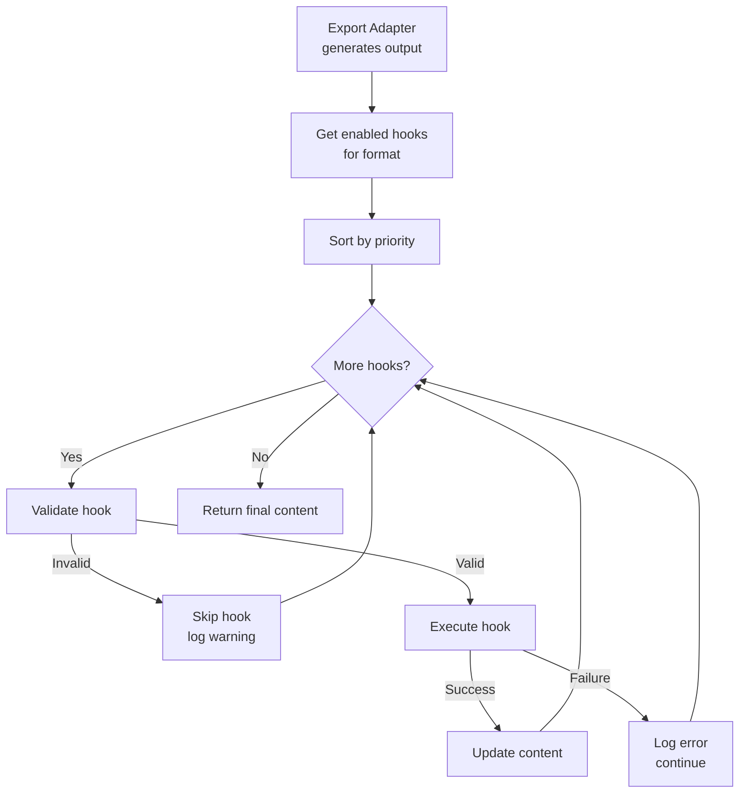

# LCS-DES-082d: Design Specification — Post-Processing Hooks

## 1. Metadata & Categorization

| Field | Value | Description |
| :--- | :--- | :--- |
| **Feature ID** | `PUB-082d` | Sub-part of PUB-082 |
| **Feature Name** | `Post-Processing Hooks` | Export enhancement system |
| **Target Version** | `v0.8.2d` | Fourth sub-part of v0.8.2 |
| **Module Scope** | `Lexichord.Modules.Publishing` | Publishing module |
| **Swimlane** | `Publishing` | Part of Publishing vertical |
| **License Tier** | `Writer Pro` | Hook features gated |
| **Feature Gate Key** | `FeatureFlags.Publishing.PostProcessingHooks` | |
| **Author** | Lead Architect | |
| **Status** | `Draft` | |
| **Last Updated** | `2026-01-27` | |
| **Parent Document** | [LCS-DES-082-INDEX](./LCS-DES-082-INDEX.md) | |
| **Scope Breakdown** | [LCS-SBD-082 Section 3.4](./LCS-SBD-082.md#34-v082d-post-processing-hooks) | |

---

## 2. Executive Summary

### 2.1 The Requirement

Exported documents often need additional processing beyond basic format conversion:

- PDFs need table of contents for navigation
- Documents require watermarks for draft status or confidentiality
- Metadata (title, author, keywords) must be set for proper indexing
- Page numbers and headers/footers add professionalism
- Custom post-processing enables enterprise-specific requirements

These enhancements must be applied consistently without requiring manual post-export editing.

> **Goal:** Implement a hook system that allows post-processing of exported documents for advanced features like automatic TOC generation, watermarking, metadata injection, and format-specific enhancements.

### 2.2 The Proposed Solution

Implement an extensible hook architecture that:

1. Defines `IPostProcessingHook` interface for pluggable enhancements
2. Implements built-in hooks for common needs (TOC, watermarks, metadata, page numbers)
3. Creates `HookRegistry` for managing and ordering hook execution
4. Supports format-specific hooks (PDF-only, DOCX-only, etc.)
5. Provides a priority system for hook execution order
6. Enables hook configuration via export options

---

## 3. Architecture & Modular Strategy

### 3.1 Dependencies

#### 3.1.1 Upstream Dependencies

| Interface | Source Version | Purpose |
| :--- | :--- | :--- |
| `IExportAdapter` | v0.8.2a | Hook integration point |
| `IStyleTransferService` | v0.8.2b | Some hooks use styles |
| `IMarkdownParser` | v0.1.3b | Parse headings for TOC |
| `ISettingsService` | v0.1.6a | Hook configuration |
| `Serilog` | v0.0.3b | Logging |

#### 3.1.2 NuGet Packages

| Package | Version | Purpose |
| :--- | :--- | :--- |
| `PdfSharp` | 6.x | PDF manipulation for hooks |
| `DocumentFormat.OpenXml` | 3.x | DOCX manipulation for hooks |
| `HtmlAgilityPack` | 1.11.x | HTML manipulation for hooks |

### 3.2 Licensing Behavior

| Hook | Writer Pro | Teams | Enterprise |
| :--- | :--- | :--- | :--- |
| Table of Contents | Yes | Yes | Yes |
| Page Numbers | Yes | Yes | Yes |
| Headers & Footers | Yes | Yes | Yes |
| Watermark | Yes | Yes | Yes |
| Metadata Injection | Yes | Yes | Yes |
| Custom Hooks | - | - | Yes |

---

## 4. Data Contract (The API)

### 4.1 Post-Processing Hook Interface

```csharp
namespace Lexichord.Abstractions.Contracts.Publishing;

/// <summary>
/// Interface for post-processing hooks that modify exported documents.
/// Hooks execute after the initial export and can add features like
/// table of contents, watermarks, page numbers, etc.
/// </summary>
public interface IPostProcessingHook
{
    /// <summary>
    /// Unique identifier for this hook.
    /// </summary>
    string HookId { get; }

    /// <summary>
    /// Display name for the hook.
    /// </summary>
    string Name { get; }

    /// <summary>
    /// Description of what the hook does.
    /// </summary>
    string Description { get; }

    /// <summary>
    /// Category for grouping in UI.
    /// </summary>
    HookCategory Category { get; }

    /// <summary>
    /// Export formats this hook supports.
    /// </summary>
    IReadOnlyList<ExportFormat> SupportedFormats { get; }

    /// <summary>
    /// Priority for hook execution (lower = earlier).
    /// Standard ranges:
    /// 1-20: Early hooks (metadata, setup)
    /// 21-50: Content hooks (TOC, content modification)
    /// 51-80: Layout hooks (headers, footers, page numbers)
    /// 81-100: Final hooks (watermarks, compression)
    /// </summary>
    int Priority { get; }

    /// <summary>
    /// Whether this hook is enabled by default.
    /// </summary>
    bool EnabledByDefault { get; }

    /// <summary>
    /// Parameters this hook accepts.
    /// </summary>
    IReadOnlyList<HookParameter> Parameters { get; }

    /// <summary>
    /// Validates that the hook can execute with the given context.
    /// </summary>
    /// <param name="context">Post-processing context.</param>
    /// <returns>Validation result.</returns>
    HookValidationResult Validate(PostProcessingContext context);

    /// <summary>
    /// Executes the hook on the exported content.
    /// </summary>
    /// <param name="context">Post-processing context.</param>
    /// <param name="cancellationToken">Cancellation token.</param>
    /// <returns>Result with modified content.</returns>
    Task<PostProcessingResult> ExecuteAsync(
        PostProcessingContext context,
        CancellationToken cancellationToken = default);
}

/// <summary>
/// Hook category for UI grouping.
/// </summary>
public enum HookCategory
{
    /// <summary>
    /// Document metadata (title, author, keywords).
    /// </summary>
    Metadata,

    /// <summary>
    /// Navigation (TOC, bookmarks).
    /// </summary>
    Navigation,

    /// <summary>
    /// Page layout (headers, footers, numbers).
    /// </summary>
    Layout,

    /// <summary>
    /// Security (watermarks, restrictions).
    /// </summary>
    Security,

    /// <summary>
    /// Other/custom hooks.
    /// </summary>
    Other
}

/// <summary>
/// Hook parameter definition.
/// </summary>
public record HookParameter
{
    /// <summary>
    /// Parameter key used in HookParameters dictionary.
    /// </summary>
    public required string Key { get; init; }

    /// <summary>
    /// Display name for the parameter.
    /// </summary>
    public required string DisplayName { get; init; }

    /// <summary>
    /// Description of the parameter.
    /// </summary>
    public string? Description { get; init; }

    /// <summary>
    /// Parameter type.
    /// </summary>
    public HookParameterType Type { get; init; } = HookParameterType.String;

    /// <summary>
    /// Whether the parameter is required.
    /// </summary>
    public bool Required { get; init; }

    /// <summary>
    /// Default value if not specified.
    /// </summary>
    public object? DefaultValue { get; init; }

    /// <summary>
    /// Allowed values for enum/select types.
    /// </summary>
    public IReadOnlyList<object>? AllowedValues { get; init; }
}

/// <summary>
/// Hook parameter types.
/// </summary>
public enum HookParameterType
{
    String,
    Integer,
    Double,
    Boolean,
    Color,
    Font,
    FilePath,
    Select
}
```

### 4.2 Post-Processing Context and Result

```csharp
namespace Lexichord.Abstractions.Contracts.Publishing;

/// <summary>
/// Context for post-processing hook execution.
/// </summary>
public record PostProcessingContext
{
    /// <summary>
    /// Export format being processed.
    /// </summary>
    public required ExportFormat Format { get; init; }

    /// <summary>
    /// Path to the output file.
    /// </summary>
    public required string OutputPath { get; init; }

    /// <summary>
    /// Content as byte array (for binary formats like PDF/DOCX).
    /// </summary>
    public required byte[] Content { get; init; }

    /// <summary>
    /// Content as string (for text formats like HTML/Markdown).
    /// </summary>
    public string? TextContent { get; init; }

    /// <summary>
    /// Original Markdown document AST.
    /// </summary>
    public required MarkdownDocument SourceDocument { get; init; }

    /// <summary>
    /// Original Markdown content.
    /// </summary>
    public required string SourceMarkdown { get; init; }

    /// <summary>
    /// Export options used.
    /// </summary>
    public required ExportOptions Options { get; init; }

    /// <summary>
    /// Statistics about the exported document.
    /// </summary>
    public required ExportStatistics Statistics { get; init; }

    /// <summary>
    /// Hook-specific parameters.
    /// </summary>
    public IReadOnlyDictionary<string, object> HookParameters { get; init; }
        = new Dictionary<string, object>();

    /// <summary>
    /// Document metadata from frontmatter.
    /// </summary>
    public IReadOnlyDictionary<string, object>? DocumentMetadata { get; init; }

    /// <summary>
    /// Results from previously executed hooks.
    /// </summary>
    public IReadOnlyDictionary<string, PostProcessingResult> PreviousResults { get; init; }
        = new Dictionary<string, PostProcessingResult>();
}

/// <summary>
/// Result of post-processing hook execution.
/// </summary>
public record PostProcessingResult
{
    /// <summary>
    /// Whether the hook executed successfully.
    /// </summary>
    public required bool Success { get; init; }

    /// <summary>
    /// Modified content (binary).
    /// </summary>
    public byte[]? ModifiedContent { get; init; }

    /// <summary>
    /// Modified content (text).
    /// </summary>
    public string? ModifiedTextContent { get; init; }

    /// <summary>
    /// Error message if failed.
    /// </summary>
    public string? ErrorMessage { get; init; }

    /// <summary>
    /// Warnings generated during execution.
    /// </summary>
    public IReadOnlyList<string>? Warnings { get; init; }

    /// <summary>
    /// Additional metadata produced by the hook.
    /// </summary>
    public IReadOnlyDictionary<string, object>? Metadata { get; init; }

    /// <summary>
    /// Creates a successful result with modified binary content.
    /// </summary>
    public static PostProcessingResult Succeeded(
        byte[] modifiedContent,
        IReadOnlyDictionary<string, object>? metadata = null,
        IReadOnlyList<string>? warnings = null) => new()
    {
        Success = true,
        ModifiedContent = modifiedContent,
        Metadata = metadata,
        Warnings = warnings
    };

    /// <summary>
    /// Creates a successful result with modified text content.
    /// </summary>
    public static PostProcessingResult SucceededText(
        string modifiedContent,
        IReadOnlyDictionary<string, object>? metadata = null,
        IReadOnlyList<string>? warnings = null) => new()
    {
        Success = true,
        ModifiedTextContent = modifiedContent,
        Metadata = metadata,
        Warnings = warnings
    };

    /// <summary>
    /// Creates a failed result.
    /// </summary>
    public static PostProcessingResult Failed(string errorMessage) => new()
    {
        Success = false,
        ErrorMessage = errorMessage
    };

    /// <summary>
    /// Creates a skipped result (hook didn't apply).
    /// </summary>
    public static PostProcessingResult Skipped(string reason) => new()
    {
        Success = true,
        Warnings = [reason]
    };
}

/// <summary>
/// Hook validation result.
/// </summary>
public record HookValidationResult
{
    /// <summary>
    /// Whether the hook can execute.
    /// </summary>
    public required bool IsValid { get; init; }

    /// <summary>
    /// Validation errors (prevent execution).
    /// </summary>
    public IReadOnlyList<string>? Errors { get; init; }

    /// <summary>
    /// Validation warnings (allow execution).
    /// </summary>
    public IReadOnlyList<string>? Warnings { get; init; }

    public static HookValidationResult Valid() => new() { IsValid = true };
    public static HookValidationResult Valid(params string[] warnings) => new()
    {
        IsValid = true,
        Warnings = warnings
    };
    public static HookValidationResult Invalid(params string[] errors) => new()
    {
        IsValid = false,
        Errors = errors
    };
}
```

### 4.3 Hook Registry Interface

```csharp
namespace Lexichord.Abstractions.Contracts.Publishing;

/// <summary>
/// Registry for managing post-processing hooks.
/// </summary>
public interface IHookRegistry
{
    /// <summary>
    /// Gets all registered hooks.
    /// </summary>
    IReadOnlyList<IPostProcessingHook> GetAll();

    /// <summary>
    /// Gets hooks that support a specific format, ordered by priority.
    /// </summary>
    /// <param name="format">The export format.</param>
    /// <returns>Supported hooks ordered by priority.</returns>
    IReadOnlyList<IPostProcessingHook> GetForFormat(ExportFormat format);

    /// <summary>
    /// Gets hooks by category.
    /// </summary>
    /// <param name="category">The hook category.</param>
    /// <returns>Hooks in the category.</returns>
    IReadOnlyList<IPostProcessingHook> GetByCategory(HookCategory category);

    /// <summary>
    /// Gets a hook by its ID.
    /// </summary>
    /// <param name="hookId">The hook ID.</param>
    /// <returns>The hook, or null if not found.</returns>
    IPostProcessingHook? GetById(string hookId);

    /// <summary>
    /// Registers a hook.
    /// </summary>
    /// <param name="hook">The hook to register.</param>
    void Register(IPostProcessingHook hook);

    /// <summary>
    /// Unregisters a hook.
    /// </summary>
    /// <param name="hookId">The hook ID to unregister.</param>
    /// <returns>True if the hook was removed.</returns>
    bool Unregister(string hookId);

    /// <summary>
    /// Executes all enabled hooks for a format in priority order.
    /// </summary>
    /// <param name="context">Post-processing context.</param>
    /// <param name="enabledHookIds">Hook IDs to execute (null = all enabled by default).</param>
    /// <param name="cancellationToken">Cancellation token.</param>
    /// <returns>Final result after all hooks.</returns>
    Task<HookExecutionResult> ExecuteAllAsync(
        PostProcessingContext context,
        IReadOnlyList<string>? enabledHookIds = null,
        CancellationToken cancellationToken = default);
}

/// <summary>
/// Result of executing all hooks.
/// </summary>
public record HookExecutionResult
{
    /// <summary>
    /// Final content after all hooks.
    /// </summary>
    public required byte[] Content { get; init; }

    /// <summary>
    /// Text content if applicable.
    /// </summary>
    public string? TextContent { get; init; }

    /// <summary>
    /// Results from each executed hook.
    /// </summary>
    public required IReadOnlyDictionary<string, PostProcessingResult> HookResults { get; init; }

    /// <summary>
    /// Hooks that executed successfully.
    /// </summary>
    public required IReadOnlyList<string> ExecutedHooks { get; init; }

    /// <summary>
    /// Hooks that failed.
    /// </summary>
    public required IReadOnlyList<string> FailedHooks { get; init; }

    /// <summary>
    /// Hooks that were skipped.
    /// </summary>
    public required IReadOnlyList<string> SkippedHooks { get; init; }

    /// <summary>
    /// All warnings from hook execution.
    /// </summary>
    public IReadOnlyList<string>? Warnings { get; init; }
}
```

---

## 5. Implementation Logic

### 5.1 Hook Execution Pipeline



### 5.2 Hook Registry Implementation

```csharp
namespace Lexichord.Modules.Publishing.Services;

/// <summary>
/// Registry for managing and executing post-processing hooks.
/// </summary>
public class HookRegistry : IHookRegistry
{
    private readonly ConcurrentDictionary<string, IPostProcessingHook> _hooks = new();
    private readonly ILogger<HookRegistry> _logger;

    public HookRegistry(
        IEnumerable<IPostProcessingHook> hooks,
        ILogger<HookRegistry> logger)
    {
        _logger = logger;

        foreach (var hook in hooks)
        {
            _hooks[hook.HookId] = hook;
            _logger.LogDebug("Registered hook: {HookId} ({Name})", hook.HookId, hook.Name);
        }
    }

    public IReadOnlyList<IPostProcessingHook> GetAll() =>
        _hooks.Values.OrderBy(h => h.Priority).ToList();

    public IReadOnlyList<IPostProcessingHook> GetForFormat(ExportFormat format) =>
        _hooks.Values
            .Where(h => h.SupportedFormats.Contains(format))
            .OrderBy(h => h.Priority)
            .ToList();

    public IReadOnlyList<IPostProcessingHook> GetByCategory(HookCategory category) =>
        _hooks.Values
            .Where(h => h.Category == category)
            .OrderBy(h => h.Priority)
            .ToList();

    public IPostProcessingHook? GetById(string hookId) =>
        _hooks.GetValueOrDefault(hookId);

    public void Register(IPostProcessingHook hook)
    {
        _hooks[hook.HookId] = hook;
        _logger.LogInformation("Registered custom hook: {HookId}", hook.HookId);
    }

    public bool Unregister(string hookId) =>
        _hooks.TryRemove(hookId, out _);

    public async Task<HookExecutionResult> ExecuteAllAsync(
        PostProcessingContext context,
        IReadOnlyList<string>? enabledHookIds = null,
        CancellationToken cancellationToken = default)
    {
        var hooks = GetForFormat(context.Format);
        var currentContent = context.Content;
        var currentTextContent = context.TextContent;

        var hookResults = new Dictionary<string, PostProcessingResult>();
        var executedHooks = new List<string>();
        var failedHooks = new List<string>();
        var skippedHooks = new List<string>();
        var allWarnings = new List<string>();

        foreach (var hook in hooks)
        {
            // Check if hook is enabled
            var isEnabled = enabledHookIds == null
                ? hook.EnabledByDefault
                : enabledHookIds.Contains(hook.HookId);

            if (!isEnabled)
            {
                skippedHooks.Add(hook.HookId);
                _logger.LogDebug("Skipping disabled hook: {HookId}", hook.HookId);
                continue;
            }

            // Create context with current content
            var hookContext = context with
            {
                Content = currentContent,
                TextContent = currentTextContent,
                PreviousResults = hookResults
            };

            // Validate
            var validation = hook.Validate(hookContext);
            if (!validation.IsValid)
            {
                skippedHooks.Add(hook.HookId);
                if (validation.Errors != null)
                    allWarnings.AddRange(validation.Errors.Select(e =>
                        $"[{hook.HookId}] Skipped: {e}"));
                _logger.LogWarning("Hook validation failed: {HookId} - {Errors}",
                    hook.HookId, string.Join(", ", validation.Errors ?? []));
                continue;
            }

            if (validation.Warnings != null)
                allWarnings.AddRange(validation.Warnings.Select(w =>
                    $"[{hook.HookId}] Warning: {w}"));

            // Execute
            try
            {
                _logger.LogDebug("Executing hook: {HookId} (priority {Priority})",
                    hook.HookId, hook.Priority);

                var result = await hook.ExecuteAsync(hookContext, cancellationToken);
                hookResults[hook.HookId] = result;

                if (result.Success)
                {
                    executedHooks.Add(hook.HookId);

                    // Update content for next hook
                    if (result.ModifiedContent != null)
                        currentContent = result.ModifiedContent;
                    if (result.ModifiedTextContent != null)
                        currentTextContent = result.ModifiedTextContent;

                    if (result.Warnings != null)
                        allWarnings.AddRange(result.Warnings.Select(w =>
                            $"[{hook.HookId}] {w}"));

                    _logger.LogDebug("Hook executed successfully: {HookId}", hook.HookId);
                }
                else
                {
                    failedHooks.Add(hook.HookId);
                    allWarnings.Add($"[{hook.HookId}] Failed: {result.ErrorMessage}");
                    _logger.LogWarning("Hook execution failed: {HookId} - {Error}",
                        hook.HookId, result.ErrorMessage);
                }
            }
            catch (Exception ex)
            {
                failedHooks.Add(hook.HookId);
                hookResults[hook.HookId] = PostProcessingResult.Failed(ex.Message);
                allWarnings.Add($"[{hook.HookId}] Exception: {ex.Message}");
                _logger.LogError(ex, "Hook threw exception: {HookId}", hook.HookId);
            }
        }

        return new HookExecutionResult
        {
            Content = currentContent,
            TextContent = currentTextContent,
            HookResults = hookResults,
            ExecutedHooks = executedHooks,
            FailedHooks = failedHooks,
            SkippedHooks = skippedHooks,
            Warnings = allWarnings.Count > 0 ? allWarnings : null
        };
    }
}
```

### 5.3 Built-in Hook Implementations

#### 5.3.1 Table of Contents Hook

```csharp
namespace Lexichord.Modules.Publishing.Hooks;

/// <summary>
/// Generates and inserts a table of contents based on document headings.
/// </summary>
public class TocGenerationHook : IPostProcessingHook
{
    private readonly ILogger<TocGenerationHook> _logger;

    public string HookId => "toc-generation";
    public string Name => "Table of Contents";
    public string Description => "Generates a clickable table of contents from document headings";
    public HookCategory Category => HookCategory.Navigation;
    public IReadOnlyList<ExportFormat> SupportedFormats =>
        [ExportFormat.Pdf, ExportFormat.Docx, ExportFormat.Html];
    public int Priority => 15;
    public bool EnabledByDefault => false;

    public IReadOnlyList<HookParameter> Parameters =>
    [
        new HookParameter
        {
            Key = "title",
            DisplayName = "TOC Title",
            Description = "Title to display above the table of contents",
            Type = HookParameterType.String,
            DefaultValue = "Table of Contents"
        },
        new HookParameter
        {
            Key = "maxDepth",
            DisplayName = "Maximum Depth",
            Description = "Maximum heading level to include (1-6)",
            Type = HookParameterType.Integer,
            DefaultValue = 3
        },
        new HookParameter
        {
            Key = "includePageNumbers",
            DisplayName = "Include Page Numbers",
            Description = "Show page numbers in TOC (PDF/DOCX only)",
            Type = HookParameterType.Boolean,
            DefaultValue = true
        }
    ];

    public TocGenerationHook(ILogger<TocGenerationHook> logger)
    {
        _logger = logger;
    }

    public HookValidationResult Validate(PostProcessingContext context)
    {
        // Check if document has any headings
        var headingCount = context.Statistics.HeadingCount;
        if (headingCount == 0)
        {
            return HookValidationResult.Invalid(
                "Document has no headings to generate TOC from");
        }

        return HookValidationResult.Valid();
    }

    public async Task<PostProcessingResult> ExecuteAsync(
        PostProcessingContext context,
        CancellationToken cancellationToken = default)
    {
        _logger.LogDebug("Generating table of contents for {Format}", context.Format);

        var title = context.HookParameters.GetValueOrDefault("title", "Table of Contents")?.ToString()
            ?? "Table of Contents";
        var maxDepth = Convert.ToInt32(context.HookParameters.GetValueOrDefault("maxDepth", 3));

        // Extract headings from source document
        var headings = ExtractHeadings(context.SourceDocument, maxDepth);

        return context.Format switch
        {
            ExportFormat.Pdf => await GeneratePdfTocAsync(context, headings, title, cancellationToken),
            ExportFormat.Docx => await GenerateDocxTocAsync(context, headings, title, cancellationToken),
            ExportFormat.Html => await GenerateHtmlTocAsync(context, headings, title, cancellationToken),
            _ => PostProcessingResult.Skipped($"TOC not supported for {context.Format}")
        };
    }

    private static IReadOnlyList<HeadingInfo> ExtractHeadings(MarkdownDocument doc, int maxDepth)
    {
        var headings = new List<HeadingInfo>();
        // Walk the AST and extract headings
        // Implementation would traverse MarkdownDocument to find HeadingBlock nodes
        return headings;
    }

    private async Task<PostProcessingResult> GenerateHtmlTocAsync(
        PostProcessingContext context,
        IReadOnlyList<HeadingInfo> headings,
        string title,
        CancellationToken cancellationToken)
    {
        var tocHtml = new StringBuilder();
        tocHtml.AppendLine($"""<nav class="toc" aria-label="Table of Contents">""");
        tocHtml.AppendLine($"""<h2 class="toc-title">{WebUtility.HtmlEncode(title)}</h2>""");
        tocHtml.AppendLine("<ol>");

        foreach (var heading in headings)
        {
            var indent = new string(' ', (heading.Level - 1) * 2);
            var anchor = GenerateAnchor(heading.Text);
            tocHtml.AppendLine($"""{indent}<li><a href="#{anchor}">{WebUtility.HtmlEncode(heading.Text)}</a></li>""");
        }

        tocHtml.AppendLine("</ol>");
        tocHtml.AppendLine("</nav>");

        // Insert TOC after opening body tag
        var html = context.TextContent ?? Encoding.UTF8.GetString(context.Content);
        var bodyIndex = html.IndexOf("<body>", StringComparison.OrdinalIgnoreCase);
        if (bodyIndex >= 0)
        {
            var insertPoint = bodyIndex + "<body>".Length;
            html = html.Insert(insertPoint, "\n" + tocHtml);
        }

        return PostProcessingResult.SucceededText(html, new Dictionary<string, object>
        {
            ["tocHeadingCount"] = headings.Count
        });
    }

    private async Task<PostProcessingResult> GeneratePdfTocAsync(
        PostProcessingContext context,
        IReadOnlyList<HeadingInfo> headings,
        string title,
        CancellationToken cancellationToken)
    {
        // PDF TOC would use PdfSharp to add bookmarks and optionally a TOC page
        // Implementation details depend on PdfSharp API
        _logger.LogDebug("Generating PDF bookmarks for {Count} headings", headings.Count);

        // For now, return unmodified content with metadata
        return PostProcessingResult.Succeeded(context.Content, new Dictionary<string, object>
        {
            ["tocHeadingCount"] = headings.Count,
            ["tocGenerated"] = true
        });
    }

    private async Task<PostProcessingResult> GenerateDocxTocAsync(
        PostProcessingContext context,
        IReadOnlyList<HeadingInfo> headings,
        string title,
        CancellationToken cancellationToken)
    {
        // DOCX TOC would use OpenXml to insert a TOC field
        _logger.LogDebug("Generating DOCX TOC for {Count} headings", headings.Count);

        // Implementation would modify the DOCX to add TOC field
        return PostProcessingResult.Succeeded(context.Content, new Dictionary<string, object>
        {
            ["tocHeadingCount"] = headings.Count,
            ["tocGenerated"] = true
        });
    }

    private static string GenerateAnchor(string text) =>
        text.ToLowerInvariant()
            .Replace(" ", "-")
            .Replace(new Regex("[^a-z0-9-]").Replace(text, ""), "");
}

/// <summary>
/// Heading information extracted from document.
/// </summary>
internal record HeadingInfo(int Level, string Text, int PageNumber = 0);
```

#### 5.3.2 Watermark Hook

```csharp
namespace Lexichord.Modules.Publishing.Hooks;

/// <summary>
/// Adds a watermark to PDF or DOCX documents.
/// </summary>
public class WatermarkHook : IPostProcessingHook
{
    private readonly ILogger<WatermarkHook> _logger;

    public string HookId => "watermark";
    public string Name => "Watermark";
    public string Description => "Adds a text or image watermark to each page";
    public HookCategory Category => HookCategory.Security;
    public IReadOnlyList<ExportFormat> SupportedFormats =>
        [ExportFormat.Pdf, ExportFormat.Docx];
    public int Priority => 90; // Run late
    public bool EnabledByDefault => false;

    public IReadOnlyList<HookParameter> Parameters =>
    [
        new HookParameter
        {
            Key = "text",
            DisplayName = "Watermark Text",
            Description = "Text to display as watermark",
            Type = HookParameterType.String,
            Required = true,
            DefaultValue = "DRAFT"
        },
        new HookParameter
        {
            Key = "opacity",
            DisplayName = "Opacity",
            Description = "Watermark opacity (0.0 to 1.0)",
            Type = HookParameterType.Double,
            DefaultValue = 0.3
        },
        new HookParameter
        {
            Key = "color",
            DisplayName = "Color",
            Description = "Watermark color",
            Type = HookParameterType.Color,
            DefaultValue = "#808080"
        },
        new HookParameter
        {
            Key = "angle",
            DisplayName = "Rotation Angle",
            Description = "Rotation angle in degrees",
            Type = HookParameterType.Integer,
            DefaultValue = -45
        },
        new HookParameter
        {
            Key = "fontSize",
            DisplayName = "Font Size",
            Description = "Font size in points",
            Type = HookParameterType.Integer,
            DefaultValue = 72
        }
    ];

    public WatermarkHook(ILogger<WatermarkHook> logger)
    {
        _logger = logger;
    }

    public HookValidationResult Validate(PostProcessingContext context)
    {
        var text = context.HookParameters.GetValueOrDefault("text")?.ToString();
        if (string.IsNullOrWhiteSpace(text))
        {
            return HookValidationResult.Invalid("Watermark text is required");
        }

        return HookValidationResult.Valid();
    }

    public async Task<PostProcessingResult> ExecuteAsync(
        PostProcessingContext context,
        CancellationToken cancellationToken = default)
    {
        var text = context.HookParameters.GetValueOrDefault("text", "DRAFT")?.ToString() ?? "DRAFT";
        var opacity = Convert.ToDouble(context.HookParameters.GetValueOrDefault("opacity", 0.3));
        var color = context.HookParameters.GetValueOrDefault("color", "#808080")?.ToString() ?? "#808080";
        var angle = Convert.ToInt32(context.HookParameters.GetValueOrDefault("angle", -45));
        var fontSize = Convert.ToInt32(context.HookParameters.GetValueOrDefault("fontSize", 72));

        _logger.LogDebug("Adding watermark: '{Text}' at {Opacity} opacity", text, opacity);

        return context.Format switch
        {
            ExportFormat.Pdf => await AddPdfWatermarkAsync(
                context.Content, text, opacity, color, angle, fontSize, cancellationToken),
            ExportFormat.Docx => await AddDocxWatermarkAsync(
                context.Content, text, opacity, color, angle, fontSize, cancellationToken),
            _ => PostProcessingResult.Skipped($"Watermark not supported for {context.Format}")
        };
    }

    private async Task<PostProcessingResult> AddPdfWatermarkAsync(
        byte[] content, string text, double opacity, string color,
        int angle, int fontSize, CancellationToken cancellationToken)
    {
        // Use PdfSharp to add watermark
        // Implementation would iterate pages and add diagonal text
        _logger.LogDebug("Adding PDF watermark");
        return PostProcessingResult.Succeeded(content);
    }

    private async Task<PostProcessingResult> AddDocxWatermarkAsync(
        byte[] content, string text, double opacity, string color,
        int angle, int fontSize, CancellationToken cancellationToken)
    {
        // Use OpenXml to add watermark
        // Implementation would add shape to document header
        _logger.LogDebug("Adding DOCX watermark");
        return PostProcessingResult.Succeeded(content);
    }
}
```

#### 5.3.3 Metadata Injection Hook

```csharp
namespace Lexichord.Modules.Publishing.Hooks;

/// <summary>
/// Injects document metadata (title, author, keywords, etc.).
/// </summary>
public class MetadataInjectionHook : IPostProcessingHook
{
    private readonly ILogger<MetadataInjectionHook> _logger;

    public string HookId => "metadata-injection";
    public string Name => "Document Metadata";
    public string Description => "Sets document properties like title, author, and keywords";
    public HookCategory Category => HookCategory.Metadata;
    public IReadOnlyList<ExportFormat> SupportedFormats =>
        [ExportFormat.Pdf, ExportFormat.Docx, ExportFormat.Html];
    public int Priority => 5; // Run early
    public bool EnabledByDefault => true;

    public IReadOnlyList<HookParameter> Parameters =>
    [
        new HookParameter
        {
            Key = "title",
            DisplayName = "Title",
            Description = "Document title",
            Type = HookParameterType.String
        },
        new HookParameter
        {
            Key = "author",
            DisplayName = "Author",
            Description = "Document author",
            Type = HookParameterType.String
        },
        new HookParameter
        {
            Key = "subject",
            DisplayName = "Subject",
            Description = "Document subject",
            Type = HookParameterType.String
        },
        new HookParameter
        {
            Key = "keywords",
            DisplayName = "Keywords",
            Description = "Comma-separated keywords",
            Type = HookParameterType.String
        },
        new HookParameter
        {
            Key = "useFrontmatter",
            DisplayName = "Use Frontmatter",
            Description = "Extract metadata from YAML frontmatter",
            Type = HookParameterType.Boolean,
            DefaultValue = true
        }
    ];

    public MetadataInjectionHook(ILogger<MetadataInjectionHook> logger)
    {
        _logger = logger;
    }

    public HookValidationResult Validate(PostProcessingContext context) =>
        HookValidationResult.Valid();

    public async Task<PostProcessingResult> ExecuteAsync(
        PostProcessingContext context,
        CancellationToken cancellationToken = default)
    {
        // Build metadata from parameters and frontmatter
        var useFrontmatter = Convert.ToBoolean(
            context.HookParameters.GetValueOrDefault("useFrontmatter", true));

        var metadata = new DocumentMetadata
        {
            Title = GetMetadataValue("title", context, useFrontmatter),
            Author = GetMetadataValue("author", context, useFrontmatter),
            Subject = GetMetadataValue("subject", context, useFrontmatter),
            Keywords = GetMetadataValue("keywords", context, useFrontmatter),
            CreatedDate = DateTime.UtcNow,
            Generator = "Lexichord Export Pipeline"
        };

        _logger.LogDebug("Injecting metadata: Title='{Title}', Author='{Author}'",
            metadata.Title, metadata.Author);

        return context.Format switch
        {
            ExportFormat.Pdf => await InjectPdfMetadataAsync(context.Content, metadata, cancellationToken),
            ExportFormat.Docx => await InjectDocxMetadataAsync(context.Content, metadata, cancellationToken),
            ExportFormat.Html => await InjectHtmlMetadataAsync(context, metadata, cancellationToken),
            _ => PostProcessingResult.Skipped($"Metadata not supported for {context.Format}")
        };
    }

    private string? GetMetadataValue(string key, PostProcessingContext context, bool useFrontmatter)
    {
        // First check hook parameters
        var paramValue = context.HookParameters.GetValueOrDefault(key)?.ToString();
        if (!string.IsNullOrEmpty(paramValue))
            return paramValue;

        // Then check frontmatter
        if (useFrontmatter && context.DocumentMetadata != null)
        {
            var fmValue = context.DocumentMetadata.GetValueOrDefault(key)?.ToString();
            if (!string.IsNullOrEmpty(fmValue))
                return fmValue;
        }

        return null;
    }

    private async Task<PostProcessingResult> InjectHtmlMetadataAsync(
        PostProcessingContext context,
        DocumentMetadata metadata,
        CancellationToken cancellationToken)
    {
        var html = context.TextContent ?? Encoding.UTF8.GetString(context.Content);

        var metaTags = new StringBuilder();
        if (!string.IsNullOrEmpty(metadata.Title))
            metaTags.AppendLine($"""<meta name="title" content="{WebUtility.HtmlEncode(metadata.Title)}">""");
        if (!string.IsNullOrEmpty(metadata.Author))
            metaTags.AppendLine($"""<meta name="author" content="{WebUtility.HtmlEncode(metadata.Author)}">""");
        if (!string.IsNullOrEmpty(metadata.Subject))
            metaTags.AppendLine($"""<meta name="description" content="{WebUtility.HtmlEncode(metadata.Subject)}">""");
        if (!string.IsNullOrEmpty(metadata.Keywords))
            metaTags.AppendLine($"""<meta name="keywords" content="{WebUtility.HtmlEncode(metadata.Keywords)}">""");
        metaTags.AppendLine($"""<meta name="generator" content="{metadata.Generator}">""");

        // Insert meta tags into head
        var headIndex = html.IndexOf("<head>", StringComparison.OrdinalIgnoreCase);
        if (headIndex >= 0)
        {
            var insertPoint = headIndex + "<head>".Length;
            html = html.Insert(insertPoint, "\n" + metaTags);
        }

        return PostProcessingResult.SucceededText(html);
    }

    private async Task<PostProcessingResult> InjectPdfMetadataAsync(
        byte[] content, DocumentMetadata metadata, CancellationToken cancellationToken)
    {
        // Use PdfSharp to set PDF metadata
        _logger.LogDebug("Injecting PDF metadata");
        return PostProcessingResult.Succeeded(content);
    }

    private async Task<PostProcessingResult> InjectDocxMetadataAsync(
        byte[] content, DocumentMetadata metadata, CancellationToken cancellationToken)
    {
        // Use OpenXml to set DOCX core properties
        _logger.LogDebug("Injecting DOCX metadata");
        return PostProcessingResult.Succeeded(content);
    }
}

internal record DocumentMetadata
{
    public string? Title { get; init; }
    public string? Author { get; init; }
    public string? Subject { get; init; }
    public string? Keywords { get; init; }
    public DateTime CreatedDate { get; init; }
    public string? Generator { get; init; }
}
```

#### 5.3.4 Page Number Hook

```csharp
namespace Lexichord.Modules.Publishing.Hooks;

/// <summary>
/// Adds page numbers to PDF and DOCX documents.
/// </summary>
public class PageNumberHook : IPostProcessingHook
{
    public string HookId => "page-numbers";
    public string Name => "Page Numbers";
    public string Description => "Adds page numbers to document footer";
    public HookCategory Category => HookCategory.Layout;
    public IReadOnlyList<ExportFormat> SupportedFormats =>
        [ExportFormat.Pdf, ExportFormat.Docx];
    public int Priority => 80;
    public bool EnabledByDefault => false;

    public IReadOnlyList<HookParameter> Parameters =>
    [
        new HookParameter
        {
            Key = "position",
            DisplayName = "Position",
            Type = HookParameterType.Select,
            DefaultValue = "center",
            AllowedValues = new object[] { "left", "center", "right" }
        },
        new HookParameter
        {
            Key = "format",
            DisplayName = "Format",
            Description = "Page number format ({page} = current, {total} = total pages)",
            Type = HookParameterType.String,
            DefaultValue = "Page {page} of {total}"
        },
        new HookParameter
        {
            Key = "startPage",
            DisplayName = "Start Page",
            Description = "First page to show numbers (1-based)",
            Type = HookParameterType.Integer,
            DefaultValue = 1
        }
    ];

    public HookValidationResult Validate(PostProcessingContext context) =>
        HookValidationResult.Valid();

    public async Task<PostProcessingResult> ExecuteAsync(
        PostProcessingContext context,
        CancellationToken cancellationToken = default)
    {
        // Implementation would add page numbers to PDF/DOCX footer
        return PostProcessingResult.Succeeded(context.Content);
    }
}
```

---

## 6. UI/UX Specifications

### 6.1 Hook Selection in Export Dialog

```text
+------------------------------------------------------------------+
| Post-Processing                                          [-]      |
+------------------------------------------------------------------+
| Navigation                                                        |
|   [x] Table of Contents                                           |
|       Title: [Table of Contents        ]                          |
|       Max Depth: [3 v]                                            |
|                                                                   |
| Layout                                                            |
|   [x] Page Numbers                                                |
|       Position: [Center v]  Format: [Page {page} of {total}    ]  |
|   [ ] Headers & Footers                                           |
|       Header: [                        ]                          |
|       Footer: [                        ]                          |
|                                                                   |
| Security                                                          |
|   [ ] Watermark                                                   |
|       Text: [DRAFT                     ]  Opacity: [30% v]        |
|                                                                   |
| Metadata                                                          |
|   [x] Document Metadata (auto from frontmatter)                   |
|       Title: [                         ] (override)               |
|       Author: [                        ] (override)               |
+------------------------------------------------------------------+
```

### 6.2 Hook Configuration Panel

| Section | Hooks | Default State |
| :--- | :--- | :--- |
| Navigation | Table of Contents | Disabled |
| Layout | Page Numbers, Headers & Footers | Disabled |
| Security | Watermark | Disabled |
| Metadata | Document Metadata | Enabled |

---

## 7. Observability & Logging

| Level | Source | Message Template |
| :--- | :--- | :--- |
| Debug | HookRegistry | `"Registered hook: {HookId} ({Name})"` |
| Debug | HookRegistry | `"Executing hook: {HookId} (priority {Priority})"` |
| Debug | HookRegistry | `"Skipping disabled hook: {HookId}"` |
| Debug | HookRegistry | `"Hook executed successfully: {HookId}"` |
| Info | HookRegistry | `"Registered custom hook: {HookId}"` |
| Warning | HookRegistry | `"Hook validation failed: {HookId} - {Errors}"` |
| Warning | HookRegistry | `"Hook execution failed: {HookId} - {Error}"` |
| Error | HookRegistry | `"Hook threw exception: {HookId}"` |

---

## 8. Acceptance Criteria

| # | Given | When | Then |
| :--- | :--- | :--- | :--- |
| 1 | Document with headings | TOC hook enabled for PDF | Bookmarks generated |
| 2 | Document with headings | TOC hook enabled for HTML | Navigation HTML inserted |
| 3 | PDF export | Watermark hook with "DRAFT" | Diagonal watermark on each page |
| 4 | DOCX export | Watermark hook enabled | Watermark shape in header |
| 5 | Document with frontmatter | Metadata hook enabled | Title/author set from frontmatter |
| 6 | Metadata hook with params | Export | Params override frontmatter |
| 7 | PDF/DOCX export | Page number hook enabled | Numbers in footer |
| 8 | Multiple hooks enabled | Export | Execute in priority order |
| 9 | Hook fails | Continue processing | Other hooks still execute |
| 10 | Hook disabled | Export | Hook not executed |

---

## 9. Deliverable Checklist

| # | Deliverable | Status |
| :--- | :--- | :--- |
| 1 | `IPostProcessingHook` interface | [ ] |
| 2 | `PostProcessingContext` record | [ ] |
| 3 | `PostProcessingResult` record | [ ] |
| 4 | `IHookRegistry` interface | [ ] |
| 5 | `HookRegistry` implementation | [ ] |
| 6 | `TocGenerationHook` | [ ] |
| 7 | `WatermarkHook` | [ ] |
| 8 | `MetadataInjectionHook` | [ ] |
| 9 | `PageNumberHook` | [ ] |
| 10 | `HeaderFooterHook` | [ ] |
| 11 | Hook selection UI component | [ ] |
| 12 | Unit tests for all hooks | [ ] |

---

## 10. Verification Commands

```bash
# Run hook tests
dotnet test --filter "Version=v0.8.2d" --logger "console;verbosity=detailed"

# Run specific hook tests
dotnet test --filter "FullyQualifiedName~TocGenerationHook"
dotnet test --filter "FullyQualifiedName~WatermarkHook"
dotnet test --filter "FullyQualifiedName~MetadataInjectionHook"

# Run hook registry tests
dotnet test --filter "FullyQualifiedName~HookRegistry"
```

---

## Document History

| Version | Date | Author | Changes |
| :--- | :--- | :--- | :--- |
| 1.0 | 2026-01-27 | Lead Architect | Initial draft |
