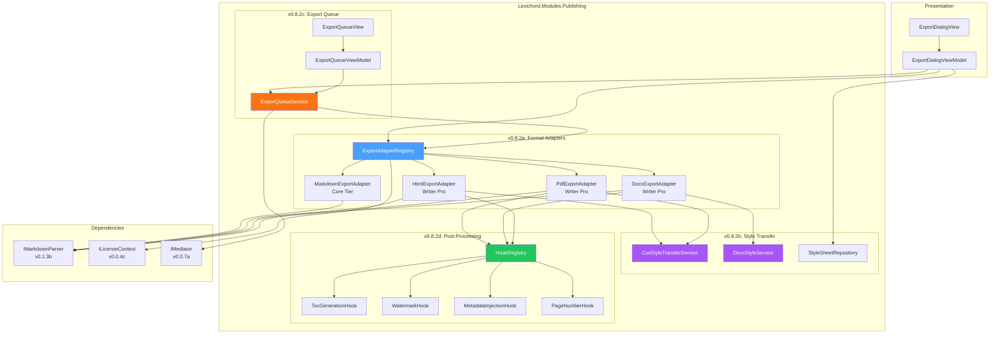
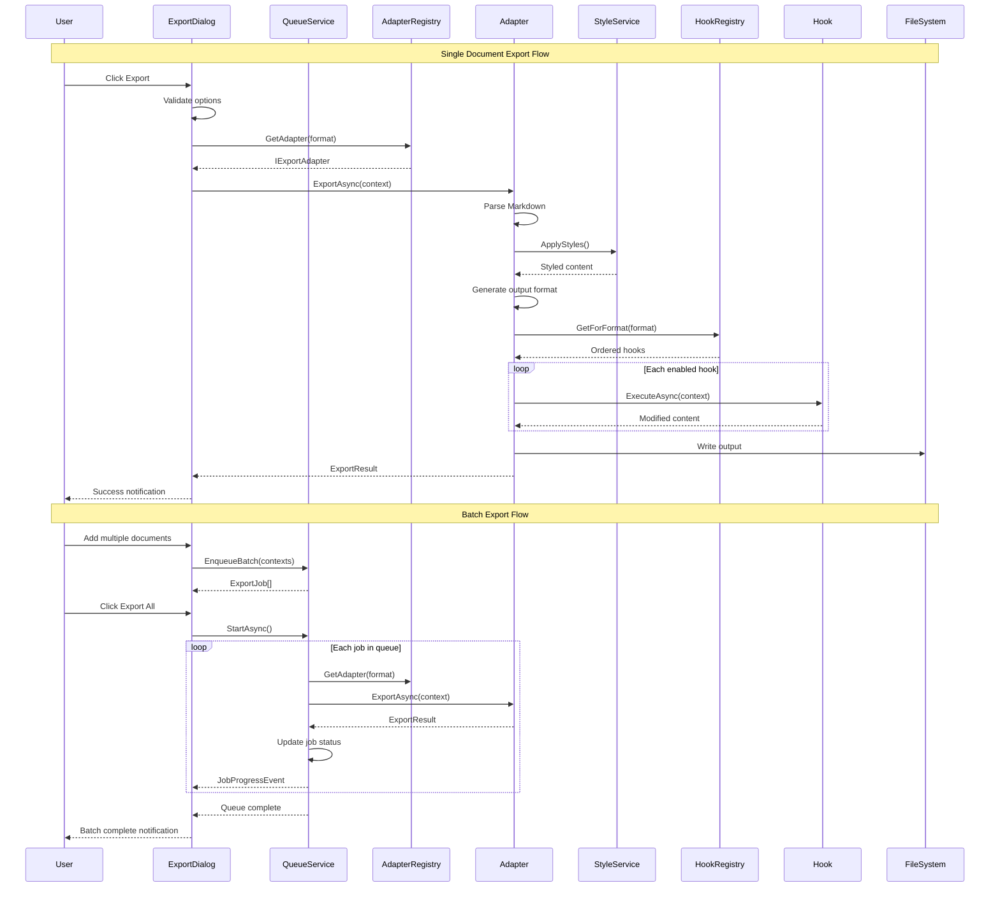

# LCS-SBD-082: Scope Breakdown — Export Pipeline

## Document Control

| Field            | Value                                    |
| :--------------- | :--------------------------------------- |
| **Document ID**  | LCS-SBD-082                              |
| **Version**      | v0.8.2                                   |
| **Codename**     | Export Pipeline (To the Presses)         |
| **Status**       | Draft                                    |
| **Last Updated** | 2026-01-27                               |
| **Owner**        | Lead Architect                           |
| **Depends On**   | v0.8.1 (Repository Reader), v0.1.3b (Markdown Parser), v0.7.5a (Linter Bridge) |

---

## 1. Executive Summary

### 1.1 The Vision

**v0.8.2** delivers the **Export Pipeline** — a comprehensive document export system that transforms Lexichord documents into multiple output formats including Markdown, DOCX, PDF, and HTML. This release transforms Lexichord from a writing and analysis platform into a complete publishing solution, enabling writers to produce production-ready documents in any format their audience requires.

The Export Pipeline introduces a pluggable adapter architecture that allows format-specific rendering while maintaining consistent styling across all outputs. Writers can export a single document to multiple formats with format-specific styling, queue batch exports with progress tracking, and apply post-processing hooks for advanced features like automatic table of contents generation for PDF exports.

### 1.2 Business Value

- **Publishing Flexibility:** Export documents to Markdown, DOCX, PDF, or HTML with a single click, reaching any audience or platform.
- **Style Consistency:** Apply CSS styles to HTML/PDF exports and DOCX styles to Word exports, ensuring brand consistency across all outputs.
- **Batch Processing:** Queue multiple documents for export with real-time progress tracking, enabling efficient bulk publishing workflows.
- **Extensibility:** Post-processing hooks allow customization like auto-generated TOC, watermarks, headers/footers, and metadata injection.
- **Enterprise Integration:** DOCX export enables seamless integration with Microsoft Office workflows common in enterprise environments.
- **Foundation:** Establishes the export architecture for future format adapters (EPUB, LaTeX, AsciiDoc).

### 1.3 Success Criteria

This release succeeds when:

1. Users can export a single document to Markdown, DOCX, PDF, and HTML formats via the Export menu.
2. CSS styles are correctly applied to HTML and PDF exports, preserving formatting and visual design.
3. DOCX exports support Word styles including headings, lists, tables, and code blocks.
4. Batch export queue processes multiple documents with accurate progress reporting.
5. Post-processing hooks execute correctly (e.g., PDF exports include auto-generated TOC when enabled).
6. All export features respect license gating (Writer Pro+ for full export capabilities).

### 1.4 License Gating

The Export Pipeline is a **Writer Pro** feature. Lower tiers will see:

- Export to Markdown available in Core tier (basic functionality)
- "Upgrade to Writer Pro" prompt when attempting DOCX, PDF, or HTML export
- Batch export and post-processing hooks disabled with upgrade tooltip
- Style transfer features require Writer Pro tier

---

## 2. Dependencies on Prior Versions

| Component                | Source Version | Usage in v0.8.2                          |
| :----------------------- | :------------- | :--------------------------------------- |
| `IMarkdownParser`        | v0.1.3b        | Parse Markdown AST for format conversion |
| `ILinterBridge`          | v0.7.5a        | Optional style annotations in exports    |
| `ISettingsService`       | v0.1.6a        | Export preferences and defaults          |
| `ILicenseContext`        | v0.0.4c        | Feature gating for export formats        |
| `IMediator`              | v0.0.7a        | Event publishing for export progress     |
| `IConfigurationService`  | v0.0.3d        | Export configuration storage             |
| `Serilog`                | v0.0.3b        | Logging export operations                |
| `IRobustFileSystemWatcher` | v0.1.2b      | Monitor export output directories        |

---

## 3. Sub-Part Specifications

### 3.1 v0.8.2a: Format Adapters

| Field            | Value                                     |
| :--------------- | :---------------------------------------- |
| **Sub-Part ID**  | PUB-082a                                  |
| **Title**        | Format Adapters (IExportAdapter Interface)|
| **Module**       | `Lexichord.Modules.Publishing`            |
| **License Tier** | Writer Pro (Markdown: Core)               |

**Goal:** Define a pluggable adapter architecture that enables document export to multiple formats through a unified interface.

**Key Deliverables:**

- `IExportAdapter` interface in Abstractions defining the export contract
- `ExportContext` record containing document metadata and export options
- `ExportResult` record with output path, format, and statistics
- `MarkdownExportAdapter` for Markdown output (Core tier)
- `DocxExportAdapter` for Microsoft Word output (Writer Pro)
- `PdfExportAdapter` for PDF output (Writer Pro)
- `HtmlExportAdapter` for HTML output (Writer Pro)
- `ExportAdapterRegistry` for adapter discovery and selection
- Unit tests for all adapters

**Key Interfaces:**

```csharp
namespace Lexichord.Abstractions.Contracts.Publishing;

/// <summary>
/// Defines the contract for document export adapters.
/// Each adapter handles conversion to a specific output format.
/// </summary>
public interface IExportAdapter
{
    /// <summary>
    /// The format this adapter exports to.
    /// </summary>
    ExportFormat Format { get; }

    /// <summary>
    /// File extension for the output (e.g., ".pdf", ".docx").
    /// </summary>
    string FileExtension { get; }

    /// <summary>
    /// MIME type for the output format.
    /// </summary>
    string MimeType { get; }

    /// <summary>
    /// Minimum license tier required to use this adapter.
    /// </summary>
    LicenseTier RequiredTier { get; }

    /// <summary>
    /// Exports a document to this adapter's format.
    /// </summary>
    /// <param name="context">Export context with document and options.</param>
    /// <param name="cancellationToken">Cancellation token.</param>
    /// <returns>Export result with output path and statistics.</returns>
    Task<ExportResult> ExportAsync(
        ExportContext context,
        CancellationToken cancellationToken = default);

    /// <summary>
    /// Validates that the document can be exported to this format.
    /// </summary>
    /// <param name="context">Export context to validate.</param>
    /// <returns>Validation result with any warnings or errors.</returns>
    ExportValidationResult Validate(ExportContext context);
}

/// <summary>
/// Supported export formats.
/// </summary>
public enum ExportFormat
{
    Markdown,
    Docx,
    Pdf,
    Html
}

/// <summary>
/// Context for an export operation containing all required information.
/// </summary>
public record ExportContext(
    string SourcePath,
    string OutputPath,
    MarkdownDocument Document,
    ExportOptions Options,
    IReadOnlyDictionary<string, object>? Metadata = null
);

/// <summary>
/// Options controlling export behavior.
/// </summary>
public record ExportOptions(
    ExportFormat Format,
    bool IncludeTableOfContents = false,
    bool IncludePageNumbers = true,
    bool EmbedImages = true,
    bool ApplyStyleSheet = true,
    string? StyleSheetPath = null,
    string? TemplateId = null,
    PageSize PageSize = PageSize.A4,
    PageOrientation Orientation = PageOrientation.Portrait,
    PageMargins? Margins = null,
    string? HeaderText = null,
    string? FooterText = null,
    IReadOnlyList<IPostProcessingHook>? PostProcessingHooks = null
);

/// <summary>
/// Result of an export operation.
/// </summary>
public record ExportResult(
    bool Success,
    string OutputPath,
    ExportFormat Format,
    long FileSizeBytes,
    TimeSpan Duration,
    ExportStatistics Statistics,
    string? ErrorMessage = null,
    IReadOnlyList<ExportWarning>? Warnings = null
);

/// <summary>
/// Statistics about the exported document.
/// </summary>
public record ExportStatistics(
    int PageCount,
    int WordCount,
    int ImageCount,
    int TableCount,
    int CodeBlockCount,
    int HeadingCount
);
```

**Key UI Components:**

```text
+------------------------------------------------------------------+
|  Export Document                                        [?] [x]   |
+------------------------------------------------------------------+
| Source: /path/to/document.md                                      |
+------------------------------------------------------------------+
| Format: [Markdown v] [DOCX] [PDF] [HTML]                          |
|                                                                   |
| Output: [/path/to/output/              ] [Browse...]              |
|                                                                   |
| [ ] Include Table of Contents                                     |
| [ ] Include Page Numbers (PDF/DOCX only)                          |
| [ ] Apply Style Sheet: [default.css      v]                       |
|                                                                   |
| Page Size: [A4         v]  Orientation: [Portrait v]              |
+------------------------------------------------------------------+
| [Cancel]                                           [Export]       |
+------------------------------------------------------------------+
```

**Dependencies:**

- v0.1.3b: `IMarkdownParser` (parse source document)
- v0.0.4c: `ILicenseContext` (gate adapter availability)

---

### 3.2 v0.8.2b: Style Transfer

| Field            | Value                                     |
| :--------------- | :---------------------------------------- |
| **Sub-Part ID**  | PUB-082b                                  |
| **Title**        | Style Transfer (CSS/DOCX Styles)          |
| **Module**       | `Lexichord.Modules.Publishing`            |
| **License Tier** | Writer Pro                                |

**Goal:** Implement style transfer capabilities that apply CSS styles to HTML/PDF exports and Word styles to DOCX exports for consistent, professional document formatting.

**Key Deliverables:**

- `IStyleTransferService` interface for applying styles during export
- `CssStyleTransferService` for HTML/PDF styling
- `DocxStyleTransferService` for Word document styling
- `StyleSheet` record representing a reusable style definition
- `StyleSheetRepository` for managing saved style sheets
- Built-in style sheets (default, academic, technical, minimal)
- Style preview functionality in export dialog
- Unit tests for style application

**Key Interfaces:**

```csharp
namespace Lexichord.Abstractions.Contracts.Publishing;

/// <summary>
/// Service for transferring styles to exported documents.
/// </summary>
public interface IStyleTransferService
{
    /// <summary>
    /// Applies styles to an HTML document.
    /// </summary>
    /// <param name="html">The HTML content to style.</param>
    /// <param name="styleSheet">The style sheet to apply.</param>
    /// <returns>Styled HTML content.</returns>
    string ApplyToHtml(string html, StyleSheet styleSheet);

    /// <summary>
    /// Gets the CSS content for a style sheet.
    /// </summary>
    /// <param name="styleSheet">The style sheet.</param>
    /// <returns>CSS content as a string.</returns>
    string GetCss(StyleSheet styleSheet);
}

/// <summary>
/// Service for applying Word styles to DOCX exports.
/// </summary>
public interface IDocxStyleService
{
    /// <summary>
    /// Applies a Word template/style to a DOCX document.
    /// </summary>
    /// <param name="document">The OpenXml document.</param>
    /// <param name="styleSheet">The style sheet to apply.</param>
    void ApplyStyles(WordprocessingDocument document, StyleSheet styleSheet);

    /// <summary>
    /// Gets the available Word style mappings.
    /// </summary>
    /// <returns>Dictionary of Markdown elements to Word styles.</returns>
    IReadOnlyDictionary<string, string> GetStyleMappings(StyleSheet styleSheet);
}

/// <summary>
/// Represents a reusable style definition for exports.
/// </summary>
public record StyleSheet(
    Guid Id,
    string Name,
    string Description,
    StyleSheetType Type,
    string CssContent,
    DocxStyleDefinition? DocxStyles,
    bool IsBuiltIn,
    DateTime CreatedAt,
    DateTime ModifiedAt
);

/// <summary>
/// Type of style sheet.
/// </summary>
public enum StyleSheetType
{
    Default,
    Academic,
    Technical,
    Minimal,
    Custom
}

/// <summary>
/// DOCX-specific style definitions.
/// </summary>
public record DocxStyleDefinition(
    string Heading1Style,
    string Heading2Style,
    string Heading3Style,
    string BodyTextStyle,
    string CodeBlockStyle,
    string BlockQuoteStyle,
    string TableStyle,
    string ListBulletStyle,
    string ListNumberStyle,
    FontDefinition DefaultFont,
    FontDefinition CodeFont,
    ColorPalette Colors
);

/// <summary>
/// Font definition for DOCX exports.
/// </summary>
public record FontDefinition(
    string FontFamily,
    double SizePoints,
    bool Bold,
    bool Italic
);

/// <summary>
/// Color palette for document styling.
/// </summary>
public record ColorPalette(
    string PrimaryColor,
    string SecondaryColor,
    string AccentColor,
    string TextColor,
    string BackgroundColor,
    string CodeBackgroundColor,
    string LinkColor
);
```

**Built-in Style Sheets:**

```text
STYLE SHEETS:
├── Default
│   ├── Clean, modern sans-serif design
│   ├── Blue accent colors
│   └── Optimized for screen reading
├── Academic
│   ├── Serif fonts (Times New Roman)
│   ├── Double-spaced paragraphs
│   └── APA/MLA compatible margins
├── Technical
│   ├── Monospace code blocks with syntax highlighting
│   ├── Numbered sections
│   └── Optimized for API documentation
└── Minimal
    ├── Black and white only
    ├── No decorative elements
    └── Maximum information density
```

**Dependencies:**

- v0.8.2a: `IExportAdapter` (adapters consume style services)
- v0.1.6a: `ISettingsService` (store style preferences)

---

### 3.3 v0.8.2c: Export Queue

| Field            | Value                                     |
| :--------------- | :---------------------------------------- |
| **Sub-Part ID**  | PUB-082c                                  |
| **Title**        | Export Queue (Batch Export with Progress) |
| **Module**       | `Lexichord.Modules.Publishing`            |
| **License Tier** | Writer Pro                                |

**Goal:** Implement a batch export system that queues multiple documents for export and provides real-time progress tracking with cancellation support.

**Key Deliverables:**

- `IExportQueueService` interface for managing export queue
- `ExportQueueService` implementation with background processing
- `ExportJob` record representing a queued export task
- `ExportQueueViewModel` for UI binding
- `ExportQueueView.axaml` with progress list
- Progress reporting via `IMediator` events
- Retry logic for failed exports
- Export history persistence
- Unit tests for queue operations

**Key Interfaces:**

```csharp
namespace Lexichord.Abstractions.Contracts.Publishing;

/// <summary>
/// Service for managing the export queue.
/// </summary>
public interface IExportQueueService
{
    /// <summary>
    /// Gets the current queue status.
    /// </summary>
    ExportQueueStatus Status { get; }

    /// <summary>
    /// Gets all jobs in the queue.
    /// </summary>
    IReadOnlyList<ExportJob> Jobs { get; }

    /// <summary>
    /// Enqueues a document for export.
    /// </summary>
    /// <param name="context">Export context.</param>
    /// <returns>The created export job.</returns>
    ExportJob Enqueue(ExportContext context);

    /// <summary>
    /// Enqueues multiple documents for batch export.
    /// </summary>
    /// <param name="contexts">Export contexts.</param>
    /// <returns>The created export jobs.</returns>
    IReadOnlyList<ExportJob> EnqueueBatch(IEnumerable<ExportContext> contexts);

    /// <summary>
    /// Cancels a specific job.
    /// </summary>
    /// <param name="jobId">The job ID to cancel.</param>
    /// <returns>True if the job was cancelled.</returns>
    bool CancelJob(Guid jobId);

    /// <summary>
    /// Cancels all pending jobs.
    /// </summary>
    void CancelAll();

    /// <summary>
    /// Retries a failed job.
    /// </summary>
    /// <param name="jobId">The job ID to retry.</param>
    /// <returns>The new job, or null if retry not possible.</returns>
    ExportJob? RetryJob(Guid jobId);

    /// <summary>
    /// Clears completed and failed jobs from the queue.
    /// </summary>
    void ClearCompleted();

    /// <summary>
    /// Starts processing the queue.
    /// </summary>
    Task StartAsync(CancellationToken cancellationToken = default);

    /// <summary>
    /// Stops processing the queue.
    /// </summary>
    Task StopAsync();

    /// <summary>
    /// Event raised when queue status changes.
    /// </summary>
    event EventHandler<ExportQueueStatusChangedEventArgs> StatusChanged;

    /// <summary>
    /// Event raised when a job progresses.
    /// </summary>
    event EventHandler<ExportJobProgressEventArgs> JobProgress;
}

/// <summary>
/// Represents a queued export job.
/// </summary>
public record ExportJob(
    Guid Id,
    ExportContext Context,
    ExportJobStatus Status,
    DateTime CreatedAt,
    DateTime? StartedAt,
    DateTime? CompletedAt,
    double ProgressPercent,
    string? CurrentOperation,
    ExportResult? Result,
    int RetryCount,
    string? ErrorMessage
);

/// <summary>
/// Status of an export job.
/// </summary>
public enum ExportJobStatus
{
    Pending,
    Processing,
    Completed,
    Failed,
    Cancelled
}

/// <summary>
/// Overall queue status.
/// </summary>
public record ExportQueueStatus(
    int TotalJobs,
    int PendingJobs,
    int ProcessingJobs,
    int CompletedJobs,
    int FailedJobs,
    bool IsProcessing,
    ExportJob? CurrentJob
);
```

**Key UI Components:**

```text
+------------------------------------------------------------------+
|  Export Queue                                     [Pause] [Clear] |
+------------------------------------------------------------------+
| Exporting 3 of 5 documents...                                     |
| =========================================----------- 60%          |
+------------------------------------------------------------------+
| [v] chapter-01.md     -> chapter-01.pdf     [Completed]           |
| [v] chapter-02.md     -> chapter-02.pdf     [Completed]           |
| [>] chapter-03.md     -> chapter-03.pdf     [Processing... 45%]   |
| [ ] chapter-04.md     -> chapter-04.pdf     [Pending]             |
| [!] chapter-05.md     -> chapter-05.pdf     [Failed] [Retry]      |
+------------------------------------------------------------------+
| Total: 5 | Completed: 2 | Failed: 1 | Remaining: 2                |
+------------------------------------------------------------------+
| [Add Documents...]                              [Export All]      |
+------------------------------------------------------------------+
```

**Queue Processing Logic:**

```text
QUEUE PROCESSING:
│
├── Job enters queue (Status: Pending)
│   └── JobEnqueuedEvent published
│
├── Queue processor picks up job
│   ├── Status → Processing
│   ├── JobStartedEvent published
│   └── Begin export operation
│
├── Export in progress
│   ├── Progress reported at intervals
│   ├── JobProgressEvent published (0-100%)
│   └── Check for cancellation
│
├── Export completes
│   ├── Success path:
│   │   ├── Status → Completed
│   │   └── JobCompletedEvent published
│   └── Failure path:
│       ├── RetryCount < MaxRetries?
│       │   ├── YES → Re-queue with delay
│       │   └── NO → Status → Failed
│       └── JobFailedEvent published
│
└── Process next job in queue
```

**Dependencies:**

- v0.8.2a: `IExportAdapter` (perform actual exports)
- v0.0.7a: `IMediator` (publish progress events)

---

### 3.4 v0.8.2d: Post-Processing Hooks

| Field            | Value                                     |
| :--------------- | :---------------------------------------- |
| **Sub-Part ID**  | PUB-082d                                  |
| **Title**        | Post-Processing Hooks                     |
| **Module**       | `Lexichord.Modules.Publishing`            |
| **License Tier** | Writer Pro                                |

**Goal:** Implement a hook system that allows post-processing of exported documents for advanced features like automatic TOC generation, watermarking, metadata injection, and format-specific enhancements.

**Key Deliverables:**

- `IPostProcessingHook` interface for export hooks
- `PostProcessingContext` record with hook execution data
- `TocGenerationHook` for automatic table of contents
- `WatermarkHook` for PDF/DOCX watermarking
- `MetadataInjectionHook` for document metadata
- `HeaderFooterHook` for repeating headers/footers
- `PageNumberHook` for page numbering
- `HookRegistry` for managing available hooks
- Unit tests for all hooks

**Key Interfaces:**

```csharp
namespace Lexichord.Abstractions.Contracts.Publishing;

/// <summary>
/// Interface for post-processing hooks that modify exported documents.
/// </summary>
public interface IPostProcessingHook
{
    /// <summary>
    /// Unique identifier for this hook.
    /// </summary>
    string HookId { get; }

    /// <summary>
    /// Display name for the hook.
    /// </summary>
    string Name { get; }

    /// <summary>
    /// Description of what the hook does.
    /// </summary>
    string Description { get; }

    /// <summary>
    /// Export formats this hook supports.
    /// </summary>
    IReadOnlyList<ExportFormat> SupportedFormats { get; }

    /// <summary>
    /// Priority for hook execution (lower = earlier).
    /// </summary>
    int Priority { get; }

    /// <summary>
    /// Executes the hook on the exported content.
    /// </summary>
    /// <param name="context">Post-processing context.</param>
    /// <param name="cancellationToken">Cancellation token.</param>
    /// <returns>Modified content or path.</returns>
    Task<PostProcessingResult> ExecuteAsync(
        PostProcessingContext context,
        CancellationToken cancellationToken = default);

    /// <summary>
    /// Validates that the hook can execute on this content.
    /// </summary>
    /// <param name="context">Context to validate.</param>
    /// <returns>Validation result.</returns>
    HookValidationResult Validate(PostProcessingContext context);
}

/// <summary>
/// Context for post-processing hook execution.
/// </summary>
public record PostProcessingContext(
    ExportFormat Format,
    string OutputPath,
    byte[] Content,
    MarkdownDocument SourceDocument,
    ExportOptions Options,
    ExportStatistics Statistics,
    IReadOnlyDictionary<string, object> HookParameters
);

/// <summary>
/// Result of post-processing hook execution.
/// </summary>
public record PostProcessingResult(
    bool Success,
    byte[] ModifiedContent,
    string? ErrorMessage = null,
    IReadOnlyDictionary<string, object>? Metadata = null
);

/// <summary>
/// Registry for managing post-processing hooks.
/// </summary>
public interface IHookRegistry
{
    /// <summary>
    /// Gets all registered hooks.
    /// </summary>
    IReadOnlyList<IPostProcessingHook> GetAll();

    /// <summary>
    /// Gets hooks that support a specific format.
    /// </summary>
    /// <param name="format">The export format.</param>
    /// <returns>Supported hooks ordered by priority.</returns>
    IReadOnlyList<IPostProcessingHook> GetForFormat(ExportFormat format);

    /// <summary>
    /// Gets a hook by its ID.
    /// </summary>
    /// <param name="hookId">The hook ID.</param>
    /// <returns>The hook, or null if not found.</returns>
    IPostProcessingHook? GetById(string hookId);

    /// <summary>
    /// Registers a custom hook.
    /// </summary>
    /// <param name="hook">The hook to register.</param>
    void Register(IPostProcessingHook hook);
}
```

**Built-in Hooks:**

```csharp
/// <summary>
/// Generates and inserts a table of contents based on document headings.
/// </summary>
public class TocGenerationHook : IPostProcessingHook
{
    public string HookId => "toc-generation";
    public string Name => "Table of Contents";
    public string Description => "Generates a clickable table of contents from document headings";
    public IReadOnlyList<ExportFormat> SupportedFormats =>
        [ExportFormat.Pdf, ExportFormat.Docx, ExportFormat.Html];
    public int Priority => 10;

    public async Task<PostProcessingResult> ExecuteAsync(
        PostProcessingContext context,
        CancellationToken cancellationToken = default)
    {
        // Implementation varies by format:
        // - PDF: Generate PDF bookmarks and TOC page
        // - DOCX: Insert Word TOC field
        // - HTML: Generate HTML navigation with anchor links
    }
}

/// <summary>
/// Adds a watermark to PDF or DOCX documents.
/// </summary>
public class WatermarkHook : IPostProcessingHook
{
    public string HookId => "watermark";
    public string Name => "Watermark";
    public string Description => "Adds a text or image watermark to each page";
    public IReadOnlyList<ExportFormat> SupportedFormats =>
        [ExportFormat.Pdf, ExportFormat.Docx];
    public int Priority => 90; // Run late in the pipeline
}

/// <summary>
/// Injects document metadata (title, author, keywords, etc.).
/// </summary>
public class MetadataInjectionHook : IPostProcessingHook
{
    public string HookId => "metadata-injection";
    public string Name => "Document Metadata";
    public string Description => "Sets document properties like title, author, and keywords";
    public IReadOnlyList<ExportFormat> SupportedFormats =>
        [ExportFormat.Pdf, ExportFormat.Docx, ExportFormat.Html];
    public int Priority => 5; // Run early
}

/// <summary>
/// Adds page numbers to PDF and DOCX documents.
/// </summary>
public class PageNumberHook : IPostProcessingHook
{
    public string HookId => "page-numbers";
    public string Name => "Page Numbers";
    public string Description => "Adds page numbers to document footer";
    public IReadOnlyList<ExportFormat> SupportedFormats =>
        [ExportFormat.Pdf, ExportFormat.Docx];
    public int Priority => 80;
}

/// <summary>
/// Adds repeating headers and footers.
/// </summary>
public class HeaderFooterHook : IPostProcessingHook
{
    public string HookId => "header-footer";
    public string Name => "Headers & Footers";
    public string Description => "Adds custom text to page headers and footers";
    public IReadOnlyList<ExportFormat> SupportedFormats =>
        [ExportFormat.Pdf, ExportFormat.Docx];
    public int Priority => 70;
}
```

**Hook Execution Pipeline:**

```text
HOOK EXECUTION PIPELINE:
│
├── Export adapter generates initial output
│
├── Get hooks for format (sorted by priority)
│
├── For each enabled hook:
│   │
│   ├── Validate hook can execute
│   │   └── Skip if validation fails
│   │
│   ├── Execute hook
│   │   ├── Pass current content
│   │   ├── Apply modifications
│   │   └── Return modified content
│   │
│   └── Log hook execution
│
├── Write final content to output path
│
└── Return export result with hook metadata
```

**Dependencies:**

- v0.8.2a: `IExportAdapter` (hook integration point)
- v0.8.2b: `IStyleTransferService` (some hooks use styles)

---

## 4. Implementation Checklist

| #  | Sub-Part | Task                                                      | Est. Hours |
| :- | :------- | :-------------------------------------------------------- | :--------- |
| 1  | v0.8.2a  | Define `IExportAdapter` interface and records             | 2          |
| 2  | v0.8.2a  | Implement `ExportAdapterRegistry`                         | 1.5        |
| 3  | v0.8.2a  | Implement `MarkdownExportAdapter`                         | 2          |
| 4  | v0.8.2a  | Implement `HtmlExportAdapter`                             | 3          |
| 5  | v0.8.2a  | Implement `PdfExportAdapter` with PuppeteerSharp          | 4          |
| 6  | v0.8.2a  | Implement `DocxExportAdapter` with OpenXML                | 4          |
| 7  | v0.8.2a  | Create `ExportDialogView.axaml` and ViewModel             | 3          |
| 8  | v0.8.2a  | Unit tests for all adapters                               | 3          |
| 9  | v0.8.2b  | Define `IStyleTransferService` interface                  | 1          |
| 10 | v0.8.2b  | Implement `CssStyleTransferService`                       | 2          |
| 11 | v0.8.2b  | Implement `DocxStyleService`                              | 3          |
| 12 | v0.8.2b  | Create built-in style sheets (Default, Academic, etc.)    | 2          |
| 13 | v0.8.2b  | Implement `StyleSheetRepository`                          | 1.5        |
| 14 | v0.8.2b  | Add style preview to export dialog                        | 2          |
| 15 | v0.8.2b  | Unit tests for style transfer                             | 2          |
| 16 | v0.8.2c  | Define `IExportQueueService` interface                    | 1          |
| 17 | v0.8.2c  | Implement `ExportQueueService` with background processing | 4          |
| 18 | v0.8.2c  | Implement retry logic with exponential backoff            | 1.5        |
| 19 | v0.8.2c  | Create `ExportQueueView.axaml` and ViewModel              | 3          |
| 20 | v0.8.2c  | Implement progress reporting via MediatR                  | 1.5        |
| 21 | v0.8.2c  | Implement export history persistence                      | 1.5        |
| 22 | v0.8.2c  | Unit tests for queue operations                           | 2          |
| 23 | v0.8.2d  | Define `IPostProcessingHook` interface                    | 1          |
| 24 | v0.8.2d  | Implement `HookRegistry`                                  | 1          |
| 25 | v0.8.2d  | Implement `TocGenerationHook`                             | 3          |
| 26 | v0.8.2d  | Implement `WatermarkHook`                                 | 2          |
| 27 | v0.8.2d  | Implement `MetadataInjectionHook`                         | 1.5        |
| 28 | v0.8.2d  | Implement `PageNumberHook` and `HeaderFooterHook`         | 2          |
| 29 | v0.8.2d  | Hook selection UI in export dialog                        | 1.5        |
| 30 | v0.8.2d  | Unit tests for all hooks                                  | 2          |
| 31 | All      | Integration tests for full export pipeline                | 3          |
| 32 | All      | DI registration in PublishingModule.cs                    | 1          |
| **Total** |   |                                                           | **66 hours** |

---

## 5. Dependency Matrix

### 5.1 Required Interfaces (from earlier versions)

| Interface                | Source Version | Purpose                              |
| :----------------------- | :------------- | :----------------------------------- |
| `IMarkdownParser`        | v0.1.3b        | Parse source documents               |
| `ILinterBridge`          | v0.7.5a        | Style annotations (optional)         |
| `ISettingsService`       | v0.1.6a        | Export preferences                   |
| `ILicenseContext`        | v0.0.4c        | Feature gating                       |
| `IMediator`              | v0.0.7a        | Event publishing                     |
| `IConfigurationService`  | v0.0.3d        | Configuration storage                |

### 5.2 New Interfaces (defined in v0.8.2)

| Interface                   | Defined In | Module              | Purpose                 |
| :-------------------------- | :--------- | :------------------ | :---------------------- |
| `IExportAdapter`            | v0.8.2a    | Abstractions        | Format export contract  |
| `IExportAdapterRegistry`    | v0.8.2a    | Abstractions        | Adapter discovery       |
| `IStyleTransferService`     | v0.8.2b    | Abstractions        | CSS style transfer      |
| `IDocxStyleService`         | v0.8.2b    | Abstractions        | Word style transfer     |
| `IStyleSheetRepository`     | v0.8.2b    | Abstractions        | Style persistence       |
| `IExportQueueService`       | v0.8.2c    | Abstractions        | Batch export queue      |
| `IPostProcessingHook`       | v0.8.2d    | Abstractions        | Export hook contract    |
| `IHookRegistry`             | v0.8.2d    | Abstractions        | Hook management         |

### 5.3 New Records/DTOs (defined in v0.8.2)

| Record                 | Defined In | Purpose                                |
| :--------------------- | :--------- | :------------------------------------- |
| `ExportContext`        | v0.8.2a    | Export operation context               |
| `ExportOptions`        | v0.8.2a    | Export configuration options           |
| `ExportResult`         | v0.8.2a    | Export operation result                |
| `ExportStatistics`     | v0.8.2a    | Document statistics                    |
| `StyleSheet`           | v0.8.2b    | Reusable style definition              |
| `DocxStyleDefinition`  | v0.8.2b    | Word-specific styles                   |
| `ExportJob`            | v0.8.2c    | Queued export task                     |
| `ExportQueueStatus`    | v0.8.2c    | Queue status summary                   |
| `PostProcessingContext`| v0.8.2d    | Hook execution context                 |
| `PostProcessingResult` | v0.8.2d    | Hook execution result                  |

### 5.4 NuGet Packages

| Package              | Version | Purpose                    | New/Existing |
| :------------------- | :------ | :------------------------- | :----------- |
| `PuppeteerSharp`     | 17.x    | PDF rendering via Chromium | **New**      |
| `DocumentFormat.OpenXml` | 3.x | DOCX generation           | **New**      |
| `HtmlAgilityPack`    | 1.11.x  | HTML manipulation          | **New**      |
| `Markdig`            | 0.34.x  | Markdown parsing           | Existing     |
| `System.Reactive`    | 6.x     | Queue processing           | Existing     |

---

## 6. Architecture Diagram



---

## 7. Data Flow Diagram



---

## 8. Risks & Mitigations

| Risk | Impact | Probability | Mitigation |
| :--- | :----- | :---------- | :--------- |
| PuppeteerSharp binary size increases app footprint | Medium | High | Lazy download Chromium on first PDF export |
| OpenXML complexity for advanced Word features | Medium | Medium | Start with basic styles, expand iteratively |
| PDF rendering differences across platforms | High | Medium | Use consistent Chromium version, test on all platforms |
| Large document export causes memory pressure | High | Medium | Stream processing for large files, chunked rendering |
| Hook execution order affects output | Medium | Low | Clear priority system, document dependencies |
| Style sheet compatibility across formats | Medium | Medium | Format-specific style mappings, graceful degradation |

---

## 9. Success Metrics

| Metric | Target | Measurement |
| :----- | :----- | :---------- |
| Markdown export time (10,000 words) | < 100ms | Stopwatch timing |
| HTML export time (10,000 words) | < 500ms | Stopwatch timing |
| PDF export time (10,000 words) | < 5s | Stopwatch timing |
| DOCX export time (10,000 words) | < 2s | Stopwatch timing |
| Batch export throughput | 10 docs/min | Queue metrics |
| Memory usage (50-page PDF) | < 500MB | Memory profiler |
| Style fidelity (CSS to PDF) | 95% visual match | Visual comparison |

---

## 10. What This Enables

After v0.8.2, Lexichord will support:

- **v0.8.3:** Release Notes Agent can export changelogs to multiple formats
- **v0.8.6:** PDF Exporter extends this pipeline with proofing annotations
- **v0.9.x:** EPUB export adapter for e-book publishing
- **v1.0.x:** LaTeX export for academic publishing workflows
- **Future:** Custom export adapters via plugin architecture

---

## 11. Decision Trees

### 11.1 Export Format Selection

```text
START: "User wants to export document"
│
├── Is format Markdown?
│   ├── YES → Use MarkdownExportAdapter (Core tier)
│   └── NO → Continue
│
├── Is format HTML?
│   ├── Is license Writer Pro+?
│   │   ├── YES → Use HtmlExportAdapter
│   │   └── NO → Show upgrade prompt
│   └── Continue
│
├── Is format PDF?
│   ├── Is license Writer Pro+?
│   │   ├── YES → Use PdfExportAdapter
│   │   └── NO → Show upgrade prompt
│   └── Continue
│
├── Is format DOCX?
│   ├── Is license Writer Pro+?
│   │   ├── YES → Use DocxExportAdapter
│   │   └── NO → Show upgrade prompt
│   └── Continue
│
└── Format not supported → Show error
```

### 11.2 Hook Execution Decision

```text
START: "Should this hook execute?"
│
├── Is hook enabled in options?
│   └── NO → Skip hook
│
├── Does hook support this format?
│   └── NO → Skip hook
│
├── Does hook validation pass?
│   └── NO → Log warning, skip hook
│
├── Execute hook
│   ├── Success → Continue to next hook
│   └── Failure → Log error, continue (non-fatal)
│
└── Return modified content
```

---

## 12. User Stories

| ID    | Role            | Story                                                       | Acceptance Criteria                    |
| :---- | :-------------- | :---------------------------------------------------------- | :------------------------------------- |
| US-01 | Writer          | As a writer, I want to export my document to PDF so that I can share it with readers who don't have Markdown tools. | PDF opens correctly in Adobe Reader with all formatting preserved. |
| US-02 | Writer          | As a writer, I want to export to DOCX so that my editor can review in Microsoft Word with track changes. | DOCX opens in Word with proper headings, styles, and formatting. |
| US-03 | Technical Writer | As a technical writer, I want to batch export all chapters to PDF so that I can publish a complete manual. | All chapters export with consistent styling and numbering. |
| US-04 | Writer          | As a writer, I want automatic TOC generation in my PDF so that readers can navigate easily. | PDF includes clickable TOC with accurate page numbers. |
| US-05 | Enterprise User | As an enterprise user, I want to apply company style sheets so that all exports match brand guidelines. | Custom CSS and DOCX styles apply correctly to exports. |

---

## 13. Use Cases

### UC-01: Single Document PDF Export

**Preconditions:**

- User has a Markdown document open
- User has Writer Pro license

**Flow:**

1. User clicks File > Export or presses Ctrl+E.
2. Export dialog opens with format options.
3. User selects PDF format.
4. User enables "Include Table of Contents" option.
5. User clicks Export button.
6. System validates document and options.
7. PdfExportAdapter converts Markdown to HTML.
8. CssStyleTransferService applies styles.
9. PuppeteerSharp renders HTML to PDF.
10. TocGenerationHook adds table of contents.
11. System saves PDF to selected location.
12. Success notification displays with "Open File" option.

**Postconditions:**

- PDF file exists at output path
- PDF includes styled content with TOC

---

### UC-02: Batch Export to Multiple Formats

**Preconditions:**

- User has multiple Markdown documents in project
- User has Writer Pro license

**Flow:**

1. User clicks File > Batch Export.
2. Export queue dialog opens.
3. User clicks "Add Documents" and selects 5 documents.
4. User selects output formats (PDF and DOCX) for each.
5. User clicks "Export All".
6. Queue service begins processing.
7. Progress bar shows overall progress.
8. Individual jobs show completion status.
9. One job fails due to invalid image path.
10. User clicks "Retry" on failed job after fixing image.
11. All jobs complete successfully.
12. User clicks "Open Folder" to view outputs.

**Postconditions:**

- All 5 documents exported to both PDF and DOCX
- 10 total output files in output directory

---

## 14. Unit Testing Requirements

### 14.1 Export Adapter Tests

```csharp
[Trait("Category", "Unit")]
[Trait("Version", "v0.8.2a")]
public class PdfExportAdapterTests
{
    [Fact]
    public async Task ExportAsync_ValidMarkdown_ProducesPdf()
    {
        // Arrange
        var adapter = new PdfExportAdapter(/* dependencies */);
        var context = CreateTestContext("# Hello World\n\nThis is a test.");

        // Act
        var result = await adapter.ExportAsync(context);

        // Assert
        result.Success.Should().BeTrue();
        result.FileSizeBytes.Should().BeGreaterThan(0);
        File.Exists(result.OutputPath).Should().BeTrue();
    }

    [Fact]
    public async Task ExportAsync_WithImages_EmbedsImages()
    {
        // Arrange
        var markdown = "# Test\n\n";
        var context = CreateTestContext(markdown);

        // Act
        var result = await adapter.ExportAsync(context);

        // Assert
        result.Success.Should().BeTrue();
        result.Statistics.ImageCount.Should().Be(1);
    }

    [Theory]
    [InlineData(PageSize.A4)]
    [InlineData(PageSize.Letter)]
    [InlineData(PageSize.Legal)]
    public async Task ExportAsync_WithPageSize_UsesCorrectDimensions(PageSize pageSize)
    {
        // Arrange
        var context = CreateTestContext("# Test", new ExportOptions(
            Format: ExportFormat.Pdf,
            PageSize: pageSize));

        // Act
        var result = await adapter.ExportAsync(context);

        // Assert
        result.Success.Should().BeTrue();
        // Verify PDF page dimensions match expected size
    }
}
```

### 14.2 Export Queue Tests

```csharp
[Trait("Category", "Unit")]
[Trait("Version", "v0.8.2c")]
public class ExportQueueServiceTests
{
    [Fact]
    public void Enqueue_ValidContext_ReturnsJob()
    {
        // Arrange
        var service = CreateQueueService();
        var context = CreateTestContext();

        // Act
        var job = service.Enqueue(context);

        // Assert
        job.Should().NotBeNull();
        job.Status.Should().Be(ExportJobStatus.Pending);
        service.Jobs.Should().Contain(job);
    }

    [Fact]
    public async Task StartAsync_ProcessesJobs_InOrder()
    {
        // Arrange
        var service = CreateQueueService();
        var contexts = Enumerable.Range(1, 5)
            .Select(i => CreateTestContext($"doc{i}.md"))
            .ToList();
        var jobs = service.EnqueueBatch(contexts);

        // Act
        await service.StartAsync();

        // Assert
        jobs.All(j => j.Status == ExportJobStatus.Completed).Should().BeTrue();
    }

    [Fact]
    public void CancelJob_PendingJob_CancelsSuccessfully()
    {
        // Arrange
        var service = CreateQueueService();
        var job = service.Enqueue(CreateTestContext());

        // Act
        var result = service.CancelJob(job.Id);

        // Assert
        result.Should().BeTrue();
        service.Jobs.First(j => j.Id == job.Id).Status
            .Should().Be(ExportJobStatus.Cancelled);
    }
}
```

---

## 15. Observability & Logging

| Level   | Source          | Message Template                                              |
| :------ | :-------------- | :------------------------------------------------------------ |
| Debug   | ExportAdapter   | `Export started: {SourcePath} -> {Format}`                    |
| Info    | ExportAdapter   | `Export completed: {OutputPath} ({FileSizeBytes} bytes, {DurationMs}ms)` |
| Warning | ExportAdapter   | `Export warning: {Warning} for {SourcePath}`                  |
| Error   | ExportAdapter   | `Export failed: {Error} for {SourcePath}`                     |
| Debug   | StyleTransfer   | `Applying style sheet: {StyleSheetName} to {Format}`          |
| Info    | ExportQueue     | `Queue started: {JobCount} jobs pending`                      |
| Debug   | ExportQueue     | `Job {JobId} status: {OldStatus} -> {NewStatus}`              |
| Info    | ExportQueue     | `Queue completed: {CompletedCount}/{TotalCount} succeeded`    |
| Debug   | PostProcessing  | `Executing hook: {HookId} (priority {Priority})`              |
| Warning | PostProcessing  | `Hook {HookId} failed: {Error} (continuing)`                  |

---

## 16. UI/UX Specifications

### 16.1 Export Dialog Layout

```text
+--------------------------------------------------------------------------+
|  Export Document                                              [?] [x]    |
+--------------------------------------------------------------------------+
| Source Document                                                          |
| +----------------------------------------------------------------------+ |
| | /path/to/my-document.md                                              | |
| +----------------------------------------------------------------------+ |
|                                                                          |
| Output Format                                                            |
| +--------+  +--------+  +--------+  +--------+                          |
| |   MD   |  |  HTML  |  |  PDF   |  |  DOCX  |                          |
| | [====] |  |        |  |        |  |        |                          |
| +--------+  +--------+  +--------+  +--------+                          |
|                                                                          |
| Output Location                                                          |
| +-----------------------------------------------------------+ +-------+ |
| | /path/to/output/my-document.pdf                           | |Browse | |
| +-----------------------------------------------------------+ +-------+ |
|                                                                          |
| Style Sheet: [Default                                    v]              |
|              [ ] Preview styles                                          |
|                                                                          |
| +----------------------------------------------------------------------+ |
| | Page Options                                           [-]           | |
| +----------------------------------------------------------------------+ |
| |  Size: [A4          v]    Orientation: [Portrait   v]               | |
| |                                                                      | |
| |  Margins:  Top [1.0"] Bottom [1.0"] Left [1.0"] Right [1.0"]        | |
| +----------------------------------------------------------------------+ |
|                                                                          |
| +----------------------------------------------------------------------+ |
| | Post-Processing                                        [-]           | |
| +----------------------------------------------------------------------+ |
| |  [x] Include Table of Contents                                       | |
| |  [x] Add Page Numbers                                                | |
| |  [ ] Add Watermark: [DRAFT                         ]                 | |
| |  [ ] Custom Header: [                              ]                 | |
| |  [ ] Custom Footer: [                              ]                 | |
| +----------------------------------------------------------------------+ |
|                                                                          |
+--------------------------------------------------------------------------+
| [Cancel]                                                      [Export]   |
+--------------------------------------------------------------------------+
```

### 16.2 Component Styling Requirements

| Component           | Theme Resource             | Notes                            |
| :------------------ | :------------------------- | :------------------------------- |
| Format buttons      | `LexToggleButtonGroup`     | Exclusive selection              |
| Browse button       | `LexButtonSecondary`       | Opens file picker                |
| Style dropdown      | `LexComboBox`              | With preview thumbnail           |
| Collapsible sections| `LexExpander`              | Collapsed by default             |
| Export button       | `LexButtonPrimary`         | Accent color, prominent          |
| Progress bar        | `LexProgressBar`           | Indeterminate during export      |

---

## 17. Acceptance Criteria (QA)

| #   | Category            | Criterion                                                    |
| :-- | :------------------ | :----------------------------------------------------------- |
| 1   | **[Markdown]**      | Markdown export preserves all content and formatting         |
| 2   | **[HTML]**          | HTML export includes embedded CSS and renders correctly      |
| 3   | **[PDF]**           | PDF export renders headings, lists, tables, and code blocks  |
| 4   | **[DOCX]**          | DOCX opens in Word 2019+ with proper styles applied          |
| 5   | **[Styles]**        | Custom CSS applies to HTML/PDF exports                       |
| 6   | **[Styles]**        | Built-in style sheets produce consistent visual output       |
| 7   | **[Queue]**         | Batch export processes all documents with progress updates   |
| 8   | **[Queue]**         | Failed exports can be retried without re-adding              |
| 9   | **[Queue]**         | Cancel stops pending jobs without affecting completed ones   |
| 10  | **[Hooks]**         | TOC hook generates accurate table of contents in PDF         |
| 11  | **[Hooks]**         | Page numbers appear in correct position                      |
| 12  | **[License]**       | Core tier can only export to Markdown                        |
| 13  | **[License]**       | Writer Pro tier unlocks all formats and features             |
| 14  | **[Performance]**   | 10,000 word PDF export completes in < 5 seconds              |
| 15  | **[Accessibility]** | Export dialog is fully keyboard navigable                    |

---

## 18. Verification Commands

```bash
# ═══════════════════════════════════════════════════════════════════════════
# v0.8.2 Verification
# ═══════════════════════════════════════════════════════════════════════════

# 1. Verify NuGet packages installed
dotnet list src/Lexichord.Modules.Publishing package | grep -E "PuppeteerSharp|OpenXml|HtmlAgilityPack"

# 2. Build solution
dotnet build

# 3. Run unit tests for v0.8.2 components
dotnet test --filter "Category=Unit&FullyQualifiedName~Publishing.Export"

# 4. Run all v0.8.2 tests
dotnet test --filter "Version~v0.8.2"

# 5. Manual verification:
# a) Open a Markdown document
# b) Click File > Export
# c) Select PDF format with TOC enabled
# d) Verify PDF opens with table of contents
# e) Verify styles are applied correctly

# 6. Batch export verification:
# a) Open File > Batch Export
# b) Add 3 documents
# c) Select PDF and DOCX for each
# d) Click Export All
# e) Verify all 6 files created with correct content
```

---

## 19. Deliverable Checklist

| #  | Deliverable                                                    | Status |
| :- | :------------------------------------------------------------- | :----- |
| 1  | `IExportAdapter` interface with records                        | [ ]    |
| 2  | `ExportAdapterRegistry` implementation                         | [ ]    |
| 3  | `MarkdownExportAdapter` implementation                         | [ ]    |
| 4  | `HtmlExportAdapter` implementation                             | [ ]    |
| 5  | `PdfExportAdapter` implementation                              | [ ]    |
| 6  | `DocxExportAdapter` implementation                             | [ ]    |
| 7  | `IStyleTransferService` interface                              | [ ]    |
| 8  | `CssStyleTransferService` implementation                       | [ ]    |
| 9  | `DocxStyleService` implementation                              | [ ]    |
| 10 | Built-in style sheets (Default, Academic, Technical, Minimal)  | [ ]    |
| 11 | `StyleSheetRepository` implementation                          | [ ]    |
| 12 | `IExportQueueService` interface                                | [ ]    |
| 13 | `ExportQueueService` implementation                            | [ ]    |
| 14 | `ExportQueueView.axaml` and ViewModel                          | [ ]    |
| 15 | `IPostProcessingHook` interface                                | [ ]    |
| 16 | `HookRegistry` implementation                                  | [ ]    |
| 17 | `TocGenerationHook` implementation                             | [ ]    |
| 18 | `WatermarkHook` implementation                                 | [ ]    |
| 19 | `MetadataInjectionHook` implementation                         | [ ]    |
| 20 | `PageNumberHook` and `HeaderFooterHook` implementations        | [ ]    |
| 21 | `ExportDialogView.axaml` and ViewModel                         | [ ]    |
| 22 | Unit tests for all components                                  | [ ]    |
| 23 | Integration tests for export pipeline                          | [ ]    |
| 24 | DI registration in PublishingModule.cs                         | [ ]    |

---

## 20. Code Examples

### 20.1 Export Context Record

```csharp
namespace Lexichord.Modules.Publishing.Models;

/// <summary>
/// Context for an export operation containing all required information
/// to convert a document to the target format.
/// </summary>
public record ExportContext
{
    /// <summary>
    /// Path to the source Markdown file.
    /// </summary>
    public required string SourcePath { get; init; }

    /// <summary>
    /// Path where the exported file will be written.
    /// </summary>
    public required string OutputPath { get; init; }

    /// <summary>
    /// Parsed Markdown document.
    /// </summary>
    public required MarkdownDocument Document { get; init; }

    /// <summary>
    /// Export options controlling the conversion.
    /// </summary>
    public required ExportOptions Options { get; init; }

    /// <summary>
    /// Optional metadata to include in the export.
    /// </summary>
    public IReadOnlyDictionary<string, object>? Metadata { get; init; }

    /// <summary>
    /// Creates an export context from a file path.
    /// </summary>
    public static async Task<ExportContext> FromFileAsync(
        string sourcePath,
        string outputPath,
        ExportOptions options,
        IMarkdownParser parser,
        CancellationToken ct = default)
    {
        var content = await File.ReadAllTextAsync(sourcePath, ct);
        var document = parser.Parse(content);

        return new ExportContext
        {
            SourcePath = sourcePath,
            OutputPath = outputPath,
            Document = document,
            Options = options,
            Metadata = ExtractFrontmatter(content)
        };
    }
}
```

### 20.2 PDF Export Adapter

```csharp
namespace Lexichord.Modules.Publishing.Adapters;

/// <summary>
/// Export adapter for PDF format using PuppeteerSharp.
/// </summary>
public class PdfExportAdapter : IExportAdapter
{
    private readonly IMarkdownParser _markdownParser;
    private readonly IStyleTransferService _styleService;
    private readonly IHookRegistry _hookRegistry;
    private readonly ILogger<PdfExportAdapter> _logger;
    private static readonly Lazy<Task<IBrowser>> _browser = new(InitBrowserAsync);

    public ExportFormat Format => ExportFormat.Pdf;
    public string FileExtension => ".pdf";
    public string MimeType => "application/pdf";
    public LicenseTier RequiredTier => LicenseTier.WriterPro;

    public PdfExportAdapter(
        IMarkdownParser markdownParser,
        IStyleTransferService styleService,
        IHookRegistry hookRegistry,
        ILogger<PdfExportAdapter> logger)
    {
        _markdownParser = markdownParser;
        _styleService = styleService;
        _hookRegistry = hookRegistry;
        _logger = logger;
    }

    public async Task<ExportResult> ExportAsync(
        ExportContext context,
        CancellationToken cancellationToken = default)
    {
        var sw = Stopwatch.StartNew();
        _logger.LogDebug("Starting PDF export: {Source}", context.SourcePath);

        try
        {
            // 1. Convert Markdown to HTML
            var html = _markdownParser.ToHtml(context.Document);

            // 2. Apply styles
            if (context.Options.ApplyStyleSheet)
            {
                var styleSheet = await GetStyleSheetAsync(context.Options);
                html = _styleService.ApplyToHtml(html, styleSheet);
            }

            // 3. Wrap in complete HTML document
            html = WrapInHtmlDocument(html, context);

            // 4. Render to PDF using Puppeteer
            var browser = await _browser.Value;
            await using var page = await browser.NewPageAsync();
            await page.SetContentAsync(html);

            var pdfBytes = await page.PdfDataAsync(new PdfOptions
            {
                Format = MapPageSize(context.Options.PageSize),
                Landscape = context.Options.Orientation == PageOrientation.Landscape,
                PrintBackground = true,
                MarginOptions = MapMargins(context.Options.Margins),
                DisplayHeaderFooter = !string.IsNullOrEmpty(context.Options.HeaderText) ||
                                      !string.IsNullOrEmpty(context.Options.FooterText),
                HeaderTemplate = context.Options.HeaderText ?? "",
                FooterTemplate = context.Options.FooterText ?? ""
            });

            // 5. Execute post-processing hooks
            var hookContext = CreateHookContext(context, pdfBytes);
            pdfBytes = await ExecuteHooksAsync(hookContext, cancellationToken);

            // 6. Write to output file
            await File.WriteAllBytesAsync(context.OutputPath, pdfBytes, cancellationToken);

            sw.Stop();
            _logger.LogInformation(
                "PDF export completed: {Output} ({Size} bytes, {Duration}ms)",
                context.OutputPath, pdfBytes.Length, sw.ElapsedMilliseconds);

            return new ExportResult(
                Success: true,
                OutputPath: context.OutputPath,
                Format: ExportFormat.Pdf,
                FileSizeBytes: pdfBytes.Length,
                Duration: sw.Elapsed,
                Statistics: CalculateStatistics(context.Document));
        }
        catch (Exception ex)
        {
            _logger.LogError(ex, "PDF export failed: {Source}", context.SourcePath);
            return new ExportResult(
                Success: false,
                OutputPath: context.OutputPath,
                Format: ExportFormat.Pdf,
                FileSizeBytes: 0,
                Duration: sw.Elapsed,
                Statistics: new ExportStatistics(0, 0, 0, 0, 0, 0),
                ErrorMessage: ex.Message);
        }
    }

    private static async Task<IBrowser> InitBrowserAsync()
    {
        await new BrowserFetcher().DownloadAsync();
        return await Puppeteer.LaunchAsync(new LaunchOptions { Headless = true });
    }
}
```

---

## 21. Deferred Features

| Feature                      | Deferred To | Reason                                         |
| :--------------------------- | :---------- | :--------------------------------------------- |
| EPUB export format           | v0.9.x      | E-book publishing is separate milestone        |
| LaTeX export format          | v1.0.x      | Academic publishing requires specialized work  |
| Custom adapter plugins       | v1.x        | Plugin architecture not yet implemented        |
| Real-time style preview      | v0.8.4      | Requires significant UI work                   |
| Cloud export destinations    | v1.x        | Requires cloud integration infrastructure      |
| Parallel batch processing    | v0.9.x      | Current serial approach sufficient for v0.8    |

---

## 22. Changelog Entry

Upon completion of v0.8.2, the following entry will be added to `CHANGELOG.md`:

```markdown
## [0.8.2] - YYYY-MM-DD

### Added

- **Export Pipeline**: Export documents to Markdown, DOCX, PDF, and HTML formats
- **Format Adapters**: Pluggable adapter architecture with `IExportAdapter` interface
- **Style Transfer**: Apply CSS and Word styles to exports for consistent formatting
- **Export Queue**: Batch export multiple documents with progress tracking
- **Post-Processing Hooks**: Extensible hooks for TOC, watermarks, metadata, and more
- **Built-in Style Sheets**: Default, Academic, Technical, and Minimal styles

### Changed

- Export menu now shows all available formats based on license tier
- Publishing module now requires PuppeteerSharp for PDF rendering

### Dependencies

- Added: PuppeteerSharp 17.x for PDF rendering
- Added: DocumentFormat.OpenXml 3.x for DOCX generation
- Added: HtmlAgilityPack 1.11.x for HTML manipulation

### Technical

- `IExportAdapter` interface for format-specific export implementations
- `IStyleTransferService` for CSS and DOCX style application
- `IExportQueueService` for batch export management
- `IPostProcessingHook` for export post-processing extensions
```

---
