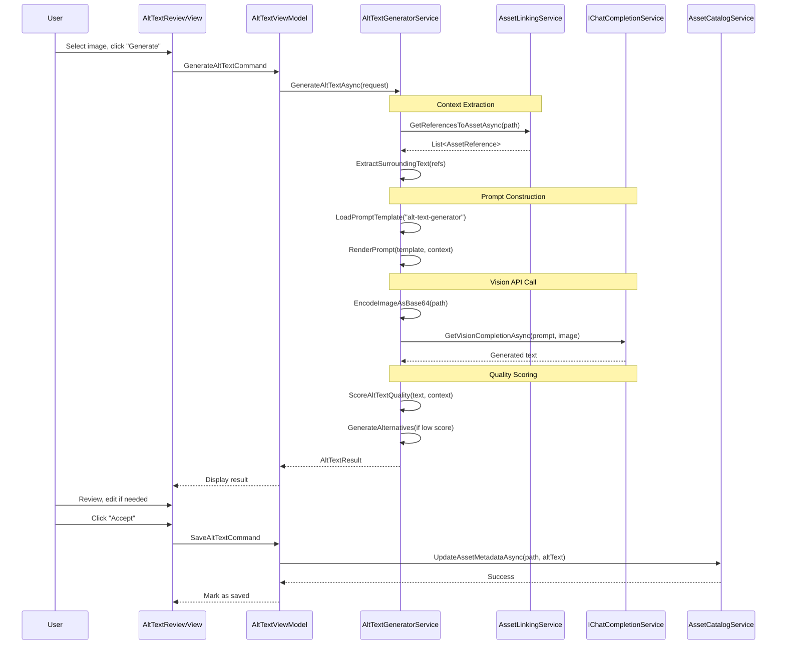

# LCS-DES-083c: Design Specification — Alt-Text Generator

## 1. Metadata & Categorization

| Field | Value | Description |
| :--- | :--- | :--- |
| **Feature ID** | `PUB-083c` | Sub-part of PUB-083 |
| **Feature Name** | `Alt-Text Generator (AI Accessibility)` | AI-powered image descriptions |
| **Target Version** | `v0.8.3c` | Third sub-part of v0.8.3 |
| **Module Scope** | `Lexichord.Modules.Publishing` | Publishing module |
| **Swimlane** | `Publishing` | Part of Publisher vertical |
| **License Tier** | `Writer Pro` | Required for full access |
| **Feature Gate Key** | `FeatureFlags.Publishing.AltTextGenerator` | License check key |
| **Author** | Lead Architect | |
| **Reviewer** | | |
| **Status** | `Draft` | |
| **Last Updated** | `2026-01-27` | |
| **Parent Document** | [LCS-DES-083-INDEX](./LCS-DES-083-INDEX.md) | |
| **Scope Breakdown** | [LCS-SBD-083 Section 3.3](./LCS-SBD-083.md#33-v083c-alt-text-generator) | |

---

## 2. Executive Summary

### 2.1 The Requirement

Accessibility is no longer optional for documentation. Screen readers depend on alt-text to convey image content to visually impaired users. Common accessibility standards (WCAG 2.1, Section 508) require meaningful alt-text for all non-decorative images.

Current challenges:

- **Time-consuming:** Writing quality alt-text manually for hundreds of images is tedious
- **Inconsistent:** Different writers produce varying quality descriptions
- **Context-blind:** Generic alt-text doesn't reflect the image's purpose in its specific document
- **Compliance gaps:** Many images have missing or placeholder alt-text

> **Goal:** Provide AI-powered alt-text generation that understands document context and produces accessibility-compliant descriptions, with batch processing and quality scoring.

### 2.2 The Proposed Solution

Implement an **Alt-Text Generator Service** that:

1. Uses vision-capable LLM to analyze image content
2. Extracts document context from surrounding text
3. Generates contextually appropriate descriptions
4. Scores alt-text quality against accessibility guidelines
5. Supports batch processing for large documentation sets
6. Produces accessibility audit reports
7. Allows user review and editing before saving

---

## 3. Architecture & Modular Strategy

### 3.1 Dependencies

#### 3.1.1 Upstream Modules

| Module/Interface | Source Version | Purpose |
| :--- | :--- | :--- |
| `IAssetCatalogService` | v0.8.3a | Asset metadata and storage |
| `IAssetLinkingService` | v0.8.3b | Document context extraction |
| `IChatCompletionService` | v0.6.1a | LLM for alt-text generation |
| `IPromptRenderer` | v0.6.3b | Render prompt templates |
| `IPromptTemplateRepository` | v0.6.4a | Store generation templates |
| `ILicenseContext` | v0.0.4c | License tier validation |
| `IMediator` | v0.0.7a | Publish generation events |
| `Serilog` | v0.0.3b | Logging operations |

#### 3.1.2 NuGet Packages

| Package | Version | Purpose |
| :--- | :--- | :--- |
| `SixLabors.ImageSharp` | 3.x | Image encoding for API |
| `Polly` | 8.x | Retry and rate limiting |

### 3.2 Licensing Behavior

**Hard Gate:** Alt-text generation requires Writer Pro tier.

- **Load Behavior:** Service available but returns license error for lower tiers
- **Fallback Experience:**
  - Core/Writer: "Generate Alt-Text" button shows upgrade prompt
  - Manual alt-text editing still available
  - Audit reports show "Upgrade to generate suggestions"

---

## 4. Data Contract (The API)

### 4.1 IAltTextGeneratorService Interface

```csharp
namespace Lexichord.Abstractions.Contracts;

/// <summary>
/// Service for AI-powered alt-text generation for images.
/// Uses vision-capable LLM with document context awareness.
/// </summary>
public interface IAltTextGeneratorService
{
    /// <summary>
    /// Generates alt-text for a single image.
    /// </summary>
    /// <param name="request">Generation request with options.</param>
    /// <param name="ct">Cancellation token.</param>
    /// <returns>Generated alt-text with confidence score.</returns>
    Task<AltTextResult> GenerateAltTextAsync(
        AltTextRequest request,
        CancellationToken ct = default);

    /// <summary>
    /// Generates alt-text for multiple images in batch.
    /// </summary>
    /// <param name="requests">List of generation requests.</param>
    /// <param name="ct">Cancellation token.</param>
    /// <returns>List of results matching request order.</returns>
    Task<IReadOnlyList<AltTextResult>> GenerateBatchAltTextAsync(
        IReadOnlyList<AltTextRequest> requests,
        CancellationToken ct = default);

    /// <summary>
    /// Generates alt-text for all images missing descriptions.
    /// </summary>
    /// <param name="options">Batch generation options.</param>
    /// <param name="progress">Progress reporter.</param>
    /// <param name="ct">Cancellation token.</param>
    /// <returns>Batch result with all generations.</returns>
    Task<BatchAltTextResult> GenerateForAllMissingAsync(
        BatchGenerationOptions options,
        IProgress<BatchGenerationProgress>? progress = null,
        CancellationToken ct = default);

    /// <summary>
    /// Performs an accessibility audit of all images in workspace.
    /// </summary>
    /// <param name="workspacePath">Path to workspace root.</param>
    /// <param name="ct">Cancellation token.</param>
    /// <returns>Comprehensive audit report.</returns>
    Task<AccessibilityAuditResult> AuditAccessibilityAsync(
        string workspacePath,
        CancellationToken ct = default);

    /// <summary>
    /// Scores the quality of existing alt-text.
    /// </summary>
    /// <param name="altText">Alt-text to score.</param>
    /// <param name="assetPath">Path to the image.</param>
    /// <param name="context">Optional document context.</param>
    /// <returns>Quality score with improvement suggestions.</returns>
    Task<AltTextQualityScore> ScoreAltTextAsync(
        string altText,
        string assetPath,
        string? context = null);
}
```

### 4.2 Data Transfer Objects

```csharp
namespace Lexichord.Modules.Publishing.Models;

/// <summary>
/// Request for alt-text generation.
/// </summary>
public record AltTextRequest(
    /// <summary>Path to the image file.</summary>
    string AssetPath,

    /// <summary>Optional document context for relevance.</summary>
    string? DocumentContext = null,

    /// <summary>Existing alt-text to improve (if any).</summary>
    string? ExistingAltText = null,

    /// <summary>Style of alt-text to generate.</summary>
    AltTextStyle Style = AltTextStyle.Descriptive,

    /// <summary>Maximum character length.</summary>
    int MaxLength = 125,

    /// <summary>Include technical details (dimensions, colors).</summary>
    bool IncludeTechnicalDetails = false,

    /// <summary>Target audience context.</summary>
    string? TargetAudience = null
);

/// <summary>
/// Style of alt-text description.
/// </summary>
public enum AltTextStyle
{
    /// <summary>Describe what is visible in the image.</summary>
    Descriptive,

    /// <summary>Describe the purpose/function of the image.</summary>
    Functional,

    /// <summary>Mark as decorative (empty alt).</summary>
    Decorative,

    /// <summary>Detailed description for complex images.</summary>
    Complex
}

/// <summary>
/// Result of alt-text generation.
/// </summary>
public record AltTextResult(
    /// <summary>Path to the processed asset.</summary>
    string AssetPath,

    /// <summary>Generated alt-text (empty for decorative).</summary>
    string GeneratedAltText,

    /// <summary>Confidence score (0.0 - 1.0).</summary>
    float ConfidenceScore,

    /// <summary>Alternative suggestions if available.</summary>
    IReadOnlyList<string> AlternativeSuggestions,

    /// <summary>Warning message if any issues detected.</summary>
    string? Warning,

    /// <summary>Whether the generation was successful.</summary>
    bool Success = true,

    /// <summary>Error message if generation failed.</summary>
    string? ErrorMessage = null,

    /// <summary>Time taken for generation in milliseconds.</summary>
    long GenerationTimeMs = 0
);

/// <summary>
/// Options for batch alt-text generation.
/// </summary>
public record BatchGenerationOptions(
    /// <summary>Maximum concurrent generations.</summary>
    int MaxConcurrency = 3,

    /// <summary>Skip images that already have alt-text.</summary>
    bool SkipExisting = true,

    /// <summary>Stop on first error.</summary>
    bool StopOnError = false,

    /// <summary>Default style for all images.</summary>
    AltTextStyle DefaultStyle = AltTextStyle.Descriptive,

    /// <summary>Include context from referencing documents.</summary>
    bool IncludeDocumentContext = true
);

/// <summary>
/// Result of batch alt-text generation.
/// </summary>
public record BatchAltTextResult(
    /// <summary>Total images processed.</summary>
    int TotalProcessed,

    /// <summary>Successful generations.</summary>
    int SuccessCount,

    /// <summary>Failed generations.</summary>
    int FailureCount,

    /// <summary>Skipped (already had alt-text).</summary>
    int SkippedCount,

    /// <summary>Individual results.</summary>
    IReadOnlyList<AltTextResult> Results,

    /// <summary>Total processing time in milliseconds.</summary>
    long TotalTimeMs
);

/// <summary>
/// Progress report for batch generation.
/// </summary>
public record BatchGenerationProgress(
    /// <summary>Current item being processed.</summary>
    int Current,

    /// <summary>Total items to process.</summary>
    int Total,

    /// <summary>Current asset path.</summary>
    string CurrentAssetPath,

    /// <summary>Estimated time remaining in seconds.</summary>
    int? EstimatedSecondsRemaining
);

/// <summary>
/// Comprehensive accessibility audit result.
/// </summary>
public record AccessibilityAuditResult(
    /// <summary>Total images audited.</summary>
    int TotalImages,

    /// <summary>Images with valid alt-text.</summary>
    int ImagesWithAltText,

    /// <summary>Images with empty alt-text (decorative).</summary>
    int ImagesWithEmptyAltText,

    /// <summary>Images missing alt-text (violation).</summary>
    int ImagesMissingAltText,

    /// <summary>Explicitly marked decorative images.</summary>
    int DecorativeImages,

    /// <summary>Images with low-quality alt-text.</summary>
    int ImagesWithPoorAltText,

    /// <summary>Detailed issues found.</summary>
    IReadOnlyList<AccessibilityIssue> Issues,

    /// <summary>Overall accessibility score (0-100).</summary>
    float OverallScore,

    /// <summary>WCAG compliance level achieved.</summary>
    WcagComplianceLevel ComplianceLevel,

    /// <summary>Summary recommendations.</summary>
    IReadOnlyList<string> Recommendations
);

/// <summary>
/// WCAG compliance levels.
/// </summary>
public enum WcagComplianceLevel
{
    /// <summary>Not compliant.</summary>
    None,

    /// <summary>Level A (minimum).</summary>
    A,

    /// <summary>Level AA (standard).</summary>
    AA,

    /// <summary>Level AAA (enhanced).</summary>
    AAA
}

/// <summary>
/// Individual accessibility issue.
/// </summary>
public record AccessibilityIssue(
    /// <summary>Path to the problematic asset.</summary>
    string AssetPath,

    /// <summary>Document containing the reference.</summary>
    string DocumentPath,

    /// <summary>Line number in document.</summary>
    int LineNumber,

    /// <summary>Type of accessibility issue.</summary>
    AccessibilityIssueType Type,

    /// <summary>Severity of the issue.</summary>
    AccessibilityIssueSeverity Severity,

    /// <summary>Human-readable description.</summary>
    string Description,

    /// <summary>Suggested fix.</summary>
    string Suggestion,

    /// <summary>WCAG criterion violated.</summary>
    string? WcagCriterion
);

/// <summary>
/// Types of accessibility issues.
/// </summary>
public enum AccessibilityIssueType
{
    /// <summary>Image has no alt attribute.</summary>
    MissingAltText,

    /// <summary>Alt attribute is empty without decorative marking.</summary>
    EmptyAltText,

    /// <summary>Alt-text exceeds recommended length.</summary>
    AltTextTooLong,

    /// <summary>Alt-text is too short to be meaningful.</summary>
    AltTextTooShort,

    /// <summary>Alt-text uses generic phrases.</summary>
    GenericAltText,

    /// <summary>Alt-text is just the filename.</summary>
    FileNameAsAltText,

    /// <summary>Alt-text starts with "Image of" or similar.</summary>
    RedundantAltText,

    /// <summary>Decorative image has non-empty alt.</summary>
    DecorativeWithAlt
}

/// <summary>
/// Severity levels for accessibility issues.
/// </summary>
public enum AccessibilityIssueSeverity
{
    /// <summary>Informational, no action required.</summary>
    Info,

    /// <summary>Minor issue, recommended to fix.</summary>
    Warning,

    /// <summary>Significant issue, should fix.</summary>
    Error,

    /// <summary>Critical compliance violation.</summary>
    Critical
}

/// <summary>
/// Quality score for alt-text.
/// </summary>
public record AltTextQualityScore(
    /// <summary>Overall score (0-100).</summary>
    int Score,

    /// <summary>Quality grade (A-F).</summary>
    char Grade,

    /// <summary>Individual scoring factors.</summary>
    IReadOnlyList<QualityFactor> Factors,

    /// <summary>Suggested improvements.</summary>
    IReadOnlyList<string> Improvements
);

/// <summary>
/// Individual factor in quality scoring.
/// </summary>
public record QualityFactor(
    /// <summary>Factor name.</summary>
    string Name,

    /// <summary>Factor score (0-100).</summary>
    int Score,

    /// <summary>Weight in overall score.</summary>
    float Weight,

    /// <summary>Explanation.</summary>
    string Description
);
```

---

## 5. Implementation Logic

### 5.1 Generation Flow



### 5.2 Prompt Template

```yaml
template_id: "alt-text-generator"
version: "1.0"
description: "Generates accessible alt-text for images"

system_prompt: |
  You are an accessibility expert generating alt-text for images in technical documentation.

  Your goal is to create alt-text that:
  1. Helps screen reader users understand the image content
  2. Conveys the same information a sighted user would get
  3. Is concise but complete (under {{max_length}} characters)
  4. Uses natural language, not technical jargon
  5. Avoids redundant phrases like "Image of" or "Picture showing"

  Guidelines by image type:
  - Screenshots: Describe the UI state, relevant buttons, and displayed data
  - Diagrams: Explain the relationships and flow between elements
  - Charts: State the type, what it measures, and key trends/values
  - Code snippets: Describe what the code demonstrates
  - Logos/icons: State the brand name and purpose
  - Decorative images: Return exactly "decorative" (these will get empty alt)

  {{#document_context}}
  Document context where this image appears:
  {{document_context}}
  {{/document_context}}

  {{#existing_alt}}
  Current alt-text to improve:
  {{existing_alt}}
  {{/existing_alt}}

  {{#style_guidance}}
  Style: {{style_guidance}}
  {{/style_guidance}}

  {{#target_audience}}
  Target audience: {{target_audience}}
  {{/target_audience}}

user_prompt: |
  Generate alt-text for the attached image.

  Image path: {{image_path}}

  Requirements:
  - Maximum length: {{max_length}} characters
  - Style: {{style}}
  {{#include_technical}}
  - Include technical details (dimensions, colors) if relevant
  {{/include_technical}}

  Respond with ONLY the alt-text, nothing else.
```

### 5.3 Quality Scoring Algorithm

```text
SCORE alt-text quality:
│
├── 1. LENGTH SCORE (weight: 25%)
│   │
│   ├── < 10 chars → 0 points (too short)
│   ├── 10-20 chars → 50 points
│   ├── 21-80 chars → 100 points (optimal)
│   ├── 81-125 chars → 80 points
│   └── > 125 chars → 40 points (too long)
│
├── 2. GENERIC PHRASE SCORE (weight: 20%)
│   │
│   ├── Starts with "Image of" → -50 points
│   ├── Starts with "Picture of" → -50 points
│   ├── Starts with "Screenshot of" → -30 points
│   ├── Contains "click here" → -20 points
│   ├── Is filename pattern → 0 points
│   └── No generic phrases → 100 points
│
├── 3. SPECIFICITY SCORE (weight: 25%)
│   │
│   ├── Contains numbers/data → +20 points
│   ├── Contains proper nouns → +15 points
│   ├── Contains action verbs → +15 points
│   ├── Contains colors/sizes → +10 points (if relevant)
│   └── Base: 40 points
│
├── 4. CONTEXT RELEVANCE SCORE (weight: 15%)
│   │
│   ├── IF context provided:
│   │   ├── Count matching keywords
│   │   ├── High match (3+) → 100 points
│   │   ├── Medium match (1-2) → 70 points
│   │   └── No match → 40 points
│   └── IF no context → 60 points (neutral)
│
├── 5. ACCESSIBILITY COMPLIANCE SCORE (weight: 15%)
│   │
│   ├── Doesn't start with "Image" → +25 points
│   ├── Doesn't say "icon" without purpose → +25 points
│   ├── Uses plain language → +25 points
│   └── Not placeholder text → +25 points
│
└── CALCULATE final score:
    │
    ├── Weighted sum of all scores
    ├── Clamp to 0-100 range
    │
    └── GRADE:
        ├── 90-100 → A
        ├── 80-89 → B
        ├── 70-79 → C
        ├── 60-69 → D
        └── 0-59 → F
```

### 5.4 Batch Processing Logic

```text
PROCESS batch of images:
│
├── 1. Filter images
│   │
│   ├── Get all images from catalog
│   ├── IF SkipExisting → Remove images with alt-text
│   └── Apply any additional filters
│
├── 2. Setup progress tracking
│   │
│   ├── total = filtered.Count
│   ├── current = 0
│   └── startTime = now
│
├── 3. Process with concurrency control
│   │
│   ├── Create SemaphoreSlim(MaxConcurrency)
│   │
│   └── FOR EACH image IN parallel:
│       │
│       ├── Wait for semaphore
│       ├── TRY:
│       │   │
│       │   ├── Get document context (if enabled)
│       │   ├── Call GenerateAltTextAsync
│       │   ├── Report progress
│       │   └── Add to results
│       │
│       ├── CATCH error:
│       │   ├── IF StopOnError → throw
│       │   └── ELSE → Record failure, continue
│       │
│       └── FINALLY: Release semaphore
│
├── 4. Compile results
│   │
│   ├── Count successes, failures, skipped
│   ├── Calculate total time
│   └── Build BatchAltTextResult
│
└── RETURN result
```

### 5.5 Accessibility Audit Logic

```text
AUDIT workspace accessibility:
│
├── 1. Gather all images
│   │
│   ├── Get all assets from catalog
│   └── Filter to images and diagrams
│
├── 2. Gather all references
│   │
│   └── Get all references from linking service
│
├── 3. Check each image
│   │
│   └── FOR EACH image:
│       │
│       ├── Get references to this image
│       │
│       └── FOR EACH reference:
│           │
│           ├── Check if alt-text exists
│           │   └── IF missing → Add MissingAltText issue (Critical)
│           │
│           ├── Check if alt-text is empty
│           │   ├── IF explicitly decorative → OK
│           │   └── IF not decorative → Add EmptyAltText issue (Error)
│           │
│           ├── Check alt-text quality
│           │   ├── Length check
│           │   ├── Generic phrase check
│           │   └── Filename check
│           │
│           └── Score each issue by severity
│
├── 4. Calculate metrics
│   │
│   ├── Count images by category
│   ├── Calculate overall score:
│   │   │
│   │   ├── Base: 100
│   │   ├── -20 per Critical issue
│   │   ├── -10 per Error issue
│   │   ├── -5 per Warning issue
│   │   └── Clamp to 0-100
│   │
│   └── Determine compliance level:
│       ├── Score >= 95 AND no Critical → AAA
│       ├── Score >= 85 AND no Critical/Error → AA
│       ├── Score >= 70 AND no Critical → A
│       └── ELSE → None
│
├── 5. Generate recommendations
│   │
│   ├── Prioritize by impact
│   └── Group by issue type
│
└── RETURN AccessibilityAuditResult
```

---

## 6. UI/UX Specifications

### 6.1 Alt-Text Review Dialog

```text
+------------------------------------------------------------------------+
|  Generate Alt-Text for: screenshot1.png                       [x]      |
+------------------------------------------------------------------------+
|                                                                         |
| +----------------------------------+ +--------------------------------+ |
| |                                  | | Document Context:              | |
| |                                  | |                                | |
| |        [IMAGE PREVIEW]           | | "...click the Settings button | |
| |                                  | | in the toolbar to access      | |
| |        1920 x 1080               | | configuration options. The    | |
| |                                  | | screenshot below shows the    | |
| +----------------------------------+ | main editor window..."        | |
|                                      |                                | |
|                                      | From: docs/getting-started.md  | |
|                                      +--------------------------------+ |
|                                                                         |
+------------------------------------------------------------------------+
| Style: [Descriptive v] | Max Length: [125   ] | [x] Include context    |
+------------------------------------------------------------------------+
|                                                                         |
| Generated Alt-Text:                                                     |
| +--------------------------------------------------------------------+ |
| | Lexichord editor window showing the main toolbar with Settings      | |
| | button highlighted, markdown source panel on left, and live         | |
| | preview panel on right                                              | |
| +--------------------------------------------------------------------+ |
| Character count: 156/125                               [!] Too long    |
|                                                                         |
| Quality Score: [====----] 72/100 (Grade: C)                            |
| - Length: Exceeds recommended maximum                                   |
| - Specificity: Good use of specific terms                              |
| - Relevance: Matches document context                                  |
|                                                                         |
+------------------------------------------------------------------------+
| Alternative Suggestions:                                                |
| +--------------------------------------------------------------------+ |
| | 1. "Editor window with Settings button, markdown source and        | |
| |    preview panels"                                         [Use]   | |
| | 2. "Main Lexichord interface showing toolbar and dual-pane         | |
| |    editor"                                                 [Use]   | |
| +--------------------------------------------------------------------+ |
|                                                                         |
+------------------------------------------------------------------------+
|                        [Regenerate] [Mark Decorative] [Accept] [Cancel] |
+------------------------------------------------------------------------+
```

### 6.2 Batch Generation Dialog

```text
+------------------------------------------------------------------------+
|  Batch Generate Alt-Text                                      [x]      |
+------------------------------------------------------------------------+
| Found 45 images missing alt-text                                        |
+------------------------------------------------------------------------+
| Options:                                                                |
| [x] Skip images with existing alt-text                                 |
| [x] Include document context                                           |
| [ ] Stop on first error                                                |
| Concurrency: [3 v]  | Style: [Descriptive v]                           |
+------------------------------------------------------------------------+
|                                                                         |
| Progress: [================>                    ] 23/45                 |
|                                                                         |
| Current: diagrams/architecture.svg                                     |
| Estimated time remaining: 2 minutes                                     |
|                                                                         |
| Results so far:                                                         |
| +--------------------------------------------------------------------+ |
| | [OK] screenshot1.png - "Editor window showing..." (87%)            | |
| | [OK] logo.png - "Lexichord application logo" (92%)                 | |
| | [OK] diagram.svg - "System architecture with..." (78%)             | |
| | [!!] flow.mmd - Low confidence (45%)                               | |
| | ...                                                                 | |
| +--------------------------------------------------------------------+ |
|                                                                         |
+------------------------------------------------------------------------+
|                                    [Pause] [Review Results] [Cancel]    |
+------------------------------------------------------------------------+
```

### 6.3 Accessibility Audit Report

```text
+------------------------------------------------------------------------+
|  Accessibility Audit Report                                   [x]      |
+------------------------------------------------------------------------+
| Workspace: /docs/lexichord                                             |
| Generated: 2026-01-27 14:30:00                                         |
+------------------------------------------------------------------------+
|                                                                         |
| OVERALL SCORE: [=================>  ] 78/100                           |
| Compliance Level: WCAG 2.1 Level A                                     |
|                                                                         |
+------------------------------------------------------------------------+
| Summary:                                                                |
| +------------------------------------------------------------------+   |
| | Total Images         | 156                                       |   |
| | With Alt-Text        | 128 (82%)                                 |   |
| | Missing Alt-Text     |  18 (12%)  [!] Critical                   |   |
| | Empty Alt-Text       |   5 (3%)   [?] Review needed               |   |
| | Decorative           |   5 (3%)   [OK]                            |   |
| | Poor Quality         |  12 (8%)   [!] Improvements needed         |   |
| +------------------------------------------------------------------+   |
|                                                                         |
+------------------------------------------------------------------------+
| Critical Issues (18):                                                   |
| +------------------------------------------------------------------+   |
| | [!] docs/install.md:15 - screenshot-setup.png                    |   |
| |     Missing alt-text attribute                                   |   |
| |     Suggested: Add descriptive alt-text               [Generate] |   |
| |                                                                   |   |
| | [!] docs/api/auth.md:42 - flow-diagram.svg                       |   |
| |     Missing alt-text attribute                                   |   |
| |     Suggested: Describe the authentication flow       [Generate] |   |
| +------------------------------------------------------------------+   |
|                                                                         |
+------------------------------------------------------------------------+
| Recommendations:                                                        |
| 1. Generate alt-text for 18 images missing descriptions                |
| 2. Review 5 images with empty alt-text for decorative marking          |
| 3. Improve 12 images with low-quality descriptions                     |
| 4. Consider using "decorative" role for purely visual images           |
|                                                                         |
+------------------------------------------------------------------------+
|                  [Generate All Missing] [Export PDF] [Export CSV] [Close]|
+------------------------------------------------------------------------+
```

---

## 7. Observability & Logging

| Level | Source | Message Template |
| :--- | :--- | :--- |
| Debug | AltTextGeneratorService | `"Generating alt-text for: {AssetPath}"` |
| Debug | AltTextGeneratorService | `"Extracted context: {ContextLength} chars from {DocumentCount} docs"` |
| Info | AltTextGeneratorService | `"Generated alt-text for {AssetPath}: score={Score}, length={Length}"` |
| Warning | AltTextGeneratorService | `"Low confidence alt-text for {AssetPath}: {Score}"` |
| Warning | AltTextGeneratorService | `"Alt-text exceeds max length: {Length}/{MaxLength}"` |
| Info | AltTextGeneratorService | `"Batch complete: {Success}/{Total} succeeded in {ElapsedMs}ms"` |
| Error | AltTextGeneratorService | `"Alt-text generation failed for {AssetPath}: {Error}"` |
| Info | AltTextGeneratorService | `"Accessibility audit: score={Score}, compliance={Level}"` |

---

## 8. Security & Safety

| Risk | Level | Mitigation |
| :--- | :--- | :--- |
| PII in images sent to LLM | Medium | Warn users about cloud processing; offer local model option |
| Inappropriate content generation | Low | Use content filtering; review before saving |
| API rate limiting | Medium | Implement exponential backoff with Polly |
| Cost overruns (API usage) | Medium | Track token usage; warn at thresholds |
| Prompt injection via image | Low | Sanitize any text extracted from images |

---

## 9. Acceptance Criteria

### 9.1 Functional Criteria

| # | Given | When | Then |
| :--- | :--- | :--- | :--- |
| 1 | Image without alt-text | Generate alt-text | Returns meaningful description |
| 2 | Screenshot of UI | Generate alt-text | Describes UI elements and state |
| 3 | Diagram | Generate alt-text | Explains relationships and flow |
| 4 | Image with existing alt-text | Regenerate | Offers improved version |
| 5 | 10 images selected | Batch generate | All processed with progress |
| 6 | Generated text > 125 chars | Quality check | Shows "too long" warning |
| 7 | Generated text is filename | Quality check | Shows "generic" warning |
| 8 | Document context available | Generate | Alt-text reflects context |

### 9.2 Performance Criteria

| # | Scenario | Target |
| :--- | :--- | :--- |
| 1 | Single image generation | < 3 seconds |
| 2 | Batch of 10 images (concurrent) | < 15 seconds |
| 3 | Quality scoring | < 50ms |
| 4 | Accessibility audit (100 images) | < 10 seconds |
| 5 | Context extraction | < 100ms per document |

### 9.3 Quality Criteria

| # | Metric | Target |
| :--- | :--- | :--- |
| 1 | User acceptance rate | > 90% |
| 2 | Average quality score | > 75/100 |
| 3 | Context relevance (when provided) | > 80% keyword match |
| 4 | Length compliance | > 95% under max length |

---

## 10. Unit Testing Requirements

### 10.1 Alt-Text Generator Tests

```csharp
[Trait("Category", "Unit")]
[Trait("Version", "v0.8.3c")]
public class AltTextGeneratorServiceTests
{
    [Fact]
    public async Task GenerateAltTextAsync_ValidImage_ReturnsResult()
    {
        // Arrange
        var mockLlm = CreateMockLlm("A screenshot showing the main editor");
        var sut = new AltTextGeneratorService(mockLlm, Mock.Of<IAssetLinkingService>());

        var request = new AltTextRequest(AssetPath: "test.png");

        // Act
        var result = await sut.GenerateAltTextAsync(request);

        // Assert
        result.Success.Should().BeTrue();
        result.GeneratedAltText.Should().NotBeNullOrEmpty();
        result.ConfidenceScore.Should().BeGreaterThan(0);
    }

    [Fact]
    public async Task GenerateAltTextAsync_WithContext_UsesContextInPrompt()
    {
        // Arrange
        var capturedPrompt = string.Empty;
        var mockLlm = CreateCapturingMockLlm(p => capturedPrompt = p);
        var sut = new AltTextGeneratorService(mockLlm, Mock.Of<IAssetLinkingService>());

        var request = new AltTextRequest(
            AssetPath: "test.png",
            DocumentContext: "Click the button to submit the form."
        );

        // Act
        await sut.GenerateAltTextAsync(request);

        // Assert
        capturedPrompt.Should().Contain("submit the form");
    }

    [Fact]
    public async Task GenerateBatchAltTextAsync_MultipleImages_ProcessesAll()
    {
        // Arrange
        var mockLlm = CreateMockLlm("Generated alt-text");
        var sut = new AltTextGeneratorService(mockLlm, Mock.Of<IAssetLinkingService>());

        var requests = new[]
        {
            new AltTextRequest(AssetPath: "img1.png"),
            new AltTextRequest(AssetPath: "img2.png"),
            new AltTextRequest(AssetPath: "img3.png")
        };

        // Act
        var results = await sut.GenerateBatchAltTextAsync(requests);

        // Assert
        results.Should().HaveCount(3);
        results.Should().AllSatisfy(r => r.Success.Should().BeTrue());
    }

    [Fact]
    public async Task ScoreAltTextAsync_TooLong_ReturnsLowScore()
    {
        // Arrange
        var sut = new AltTextGeneratorService(Mock.Of<IChatCompletionService>(), Mock.Of<IAssetLinkingService>());
        var longAltText = new string('x', 200);

        // Act
        var score = await sut.ScoreAltTextAsync(longAltText, "test.png");

        // Assert
        score.Score.Should().BeLessThan(70);
        score.Factors.Should().Contain(f => f.Name == "Length" && f.Score < 50);
    }

    [Theory]
    [InlineData("Image of a button", true)]
    [InlineData("Picture of the settings screen", true)]
    [InlineData("The settings screen showing options", false)]
    public async Task ScoreAltTextAsync_GenericPhrases_DetectedCorrectly(
        string altText, bool hasGenericPhrase)
    {
        // Arrange
        var sut = new AltTextGeneratorService(Mock.Of<IChatCompletionService>(), Mock.Of<IAssetLinkingService>());

        // Act
        var score = await sut.ScoreAltTextAsync(altText, "test.png");

        // Assert
        var genericFactor = score.Factors.First(f => f.Name == "Generic Phrases");
        if (hasGenericPhrase)
        {
            genericFactor.Score.Should().BeLessThan(50);
        }
        else
        {
            genericFactor.Score.Should().BeGreaterOrEqualTo(80);
        }
    }
}
```

### 10.2 Accessibility Audit Tests

```csharp
[Trait("Category", "Unit")]
[Trait("Version", "v0.8.3c")]
public class AccessibilityAuditTests
{
    [Fact]
    public async Task AuditAccessibilityAsync_AllHaveAltText_ReturnsHighScore()
    {
        // Arrange
        var catalog = CreateCatalogWithAltText(
            ("img1.png", "Description 1"),
            ("img2.png", "Description 2")
        );
        var sut = new AltTextGeneratorService(Mock.Of<IChatCompletionService>(), catalog);

        // Act
        var result = await sut.AuditAccessibilityAsync("/workspace");

        // Assert
        result.OverallScore.Should().BeGreaterOrEqualTo(90);
        result.ImagesMissingAltText.Should().Be(0);
    }

    [Fact]
    public async Task AuditAccessibilityAsync_MissingAltText_ReturnsCriticalIssue()
    {
        // Arrange
        var catalog = CreateCatalogWithAltText(
            ("img1.png", "Description"),
            ("img2.png", null) // Missing alt-text
        );
        var sut = new AltTextGeneratorService(Mock.Of<IChatCompletionService>(), catalog);

        // Act
        var result = await sut.AuditAccessibilityAsync("/workspace");

        // Assert
        result.ImagesMissingAltText.Should().Be(1);
        result.Issues.Should().Contain(i =>
            i.Type == AccessibilityIssueType.MissingAltText &&
            i.Severity == AccessibilityIssueSeverity.Critical);
    }

    [Theory]
    [InlineData(100, WcagComplianceLevel.AAA)]
    [InlineData(90, WcagComplianceLevel.AA)]
    [InlineData(75, WcagComplianceLevel.A)]
    [InlineData(50, WcagComplianceLevel.None)]
    public void DetermineComplianceLevel_ScoreRanges_ReturnsCorrectLevel(
        float score, WcagComplianceLevel expectedLevel)
    {
        var result = AccessibilityScorer.DetermineComplianceLevel(score, criticalCount: 0);
        result.Should().Be(expectedLevel);
    }
}
```

---

## 11. Deliverable Checklist

| # | Deliverable | Status |
| :--- | :--- | :--- |
| 1 | `IAltTextGeneratorService` interface | [ ] |
| 2 | `AltTextGeneratorService` implementation | [ ] |
| 3 | Alt-text prompt template | [ ] |
| 4 | Quality scoring algorithm | [ ] |
| 5 | Batch processing with concurrency | [ ] |
| 6 | Accessibility audit logic | [ ] |
| 7 | `AltTextReviewView.axaml` dialog | [ ] |
| 8 | `AltTextReviewViewModel` | [ ] |
| 9 | Batch generation dialog | [ ] |
| 10 | Accessibility audit report view | [ ] |
| 11 | DTOs for all request/response types | [ ] |
| 12 | Unit tests for generator service | [ ] |
| 13 | Unit tests for quality scoring | [ ] |
| 14 | Unit tests for audit logic | [ ] |
| 15 | DI registration | [ ] |

---

## 12. Verification Commands

```bash
# ═══════════════════════════════════════════════════════════════════════════
# v0.8.3c Verification
# ═══════════════════════════════════════════════════════════════════════════

# 1. Build module
dotnet build src/Lexichord.Modules.Publishing

# 2. Run unit tests
dotnet test --filter "Version=v0.8.3c" --logger "console;verbosity=detailed"

# 3. Run with coverage
dotnet test --filter "Version=v0.8.3c" --collect:"XPlat Code Coverage"

# 4. Manual verification:
# a) Select an image, click "Generate Alt-Text"
# b) Verify alt-text describes the image appropriately
# c) Check quality score and suggestions
# d) Test batch generation on multiple images
# e) Run accessibility audit, review report
```

---

## Document History

| Version | Date | Author | Changes |
| :--- | :--- | :--- | :--- |
| 1.0 | 2026-01-27 | Lead Architect | Initial draft |
