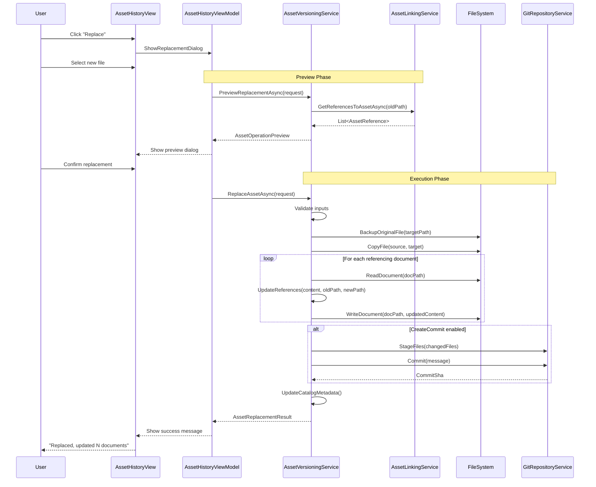

# LCS-DES-083d: Design Specification — Asset Versioning

## 1. Metadata & Categorization

| Field | Value | Description |
| :--- | :--- | :--- |
| **Feature ID** | `PUB-083d` | Sub-part of PUB-083 |
| **Feature Name** | `Asset Versioning (Replace and Propagate)` | Version control for assets |
| **Target Version** | `v0.8.3d` | Fourth sub-part of v0.8.3 |
| **Module Scope** | `Lexichord.Modules.Publishing` | Publishing module |
| **Swimlane** | `Publishing` | Part of Publisher vertical |
| **License Tier** | `Writer Pro` | Required for full access |
| **Feature Gate Key** | `FeatureFlags.Publishing.AssetVersioning` | License check key |
| **Author** | Lead Architect | |
| **Reviewer** | | |
| **Status** | `Draft` | |
| **Last Updated** | `2026-01-27` | |
| **Parent Document** | [LCS-DES-083-INDEX](./LCS-DES-083-INDEX.md) | |
| **Scope Breakdown** | [LCS-SBD-083 Section 3.4](./LCS-SBD-083.md#34-v083d-asset-versioning) | |

---

## 2. Executive Summary

### 2.1 The Requirement

Managing asset updates in documentation is error-prone and time-consuming:

- **Manual propagation:** Replacing an image requires manually finding and updating all documents that reference it
- **Broken references:** Renaming or moving assets often breaks document links
- **No version history:** Once an asset is overwritten, the previous version is lost
- **Fear of changes:** Writers avoid updating assets because the process is risky

> **Goal:** Enable asset replacement, rename, and move operations that automatically update all referencing documents, with full version history tracked via Git integration.

### 2.2 The Proposed Solution

Implement an **Asset Versioning Service** that:

1. Replaces assets with automatic reference propagation
2. Renames assets with reference updates across all documents
3. Moves assets between directories with reference path updates
4. Tracks version history via Git commits
5. Provides rollback capability to previous versions
6. Shows preview of affected documents before operations
7. Creates atomic operations with error recovery

---

## 3. Architecture & Modular Strategy

### 3.1 Dependencies

#### 3.1.1 Upstream Modules

| Module/Interface | Source Version | Purpose |
| :--- | :--- | :--- |
| `IAssetCatalogService` | v0.8.3a | Asset metadata and refresh |
| `IAssetLinkingService` | v0.8.3b | Reference tracking for propagation |
| `IGitRepositoryService` | v0.8.1a | Git repository operations |
| `IGitHistoryService` | v0.8.1a | Query file version history |
| `IRobustFileSystemWatcher` | v0.1.2b | Detect external changes |
| `ILicenseContext` | v0.0.4c | License tier validation |
| `IMediator` | v0.0.7a | Publish versioning events |
| `Serilog` | v0.0.3b | Logging operations |

#### 3.1.2 NuGet Packages

| Package | Version | Purpose |
| :--- | :--- | :--- |
| `LibGit2Sharp` | 0.30.x | Git operations |
| `System.IO.Abstractions` | 21.x | Testable file system |

### 3.2 Licensing Behavior

**Hard Gate:** Asset versioning operations require Writer Pro tier.

- **Load Behavior:** Service available but operations return license error for lower tiers
- **Fallback Experience:**
  - Core/Writer: Replace/Rename/Move buttons show upgrade prompt
  - Version history visible but rollback disabled
  - Manual file operations still possible (but no reference updates)

---

## 4. Data Contract (The API)

### 4.1 IAssetVersioningService Interface

```csharp
namespace Lexichord.Abstractions.Contracts;

/// <summary>
/// Service for versioned asset operations with automatic reference propagation.
/// Integrates with Git for version history and rollback capabilities.
/// </summary>
public interface IAssetVersioningService
{
    /// <summary>
    /// Gets the current version information for an asset.
    /// </summary>
    /// <param name="assetPath">Relative path to the asset.</param>
    /// <param name="ct">Cancellation token.</param>
    /// <returns>Current version metadata.</returns>
    Task<AssetVersion> GetCurrentVersionAsync(
        string assetPath,
        CancellationToken ct = default);

    /// <summary>
    /// Gets the version history for an asset from Git.
    /// </summary>
    /// <param name="assetPath">Relative path to the asset.</param>
    /// <param name="maxCount">Maximum versions to return.</param>
    /// <param name="ct">Cancellation token.</param>
    /// <returns>List of versions, newest first.</returns>
    Task<IReadOnlyList<AssetVersion>> GetVersionHistoryAsync(
        string assetPath,
        int maxCount = 20,
        CancellationToken ct = default);

    /// <summary>
    /// Replaces an asset with a new file and updates all references.
    /// </summary>
    /// <param name="request">Replacement request details.</param>
    /// <param name="ct">Cancellation token.</param>
    /// <returns>Result with updated document list.</returns>
    Task<AssetReplacementResult> ReplaceAssetAsync(
        AssetReplacementRequest request,
        CancellationToken ct = default);

    /// <summary>
    /// Renames an asset and updates all references.
    /// </summary>
    /// <param name="oldPath">Current asset path.</param>
    /// <param name="newPath">New asset path (same directory).</param>
    /// <param name="options">Optional operation options.</param>
    /// <param name="ct">Cancellation token.</param>
    /// <returns>Result with updated reference list.</returns>
    Task<AssetRenameResult> RenameAssetAsync(
        string oldPath,
        string newPath,
        AssetOperationOptions? options = null,
        CancellationToken ct = default);

    /// <summary>
    /// Moves an asset to a new directory and updates all references.
    /// </summary>
    /// <param name="sourcePath">Current asset path.</param>
    /// <param name="destinationPath">New asset path (different directory).</param>
    /// <param name="options">Optional operation options.</param>
    /// <param name="ct">Cancellation token.</param>
    /// <returns>Result with updated reference list.</returns>
    Task<AssetMoveResult> MoveAssetAsync(
        string sourcePath,
        string destinationPath,
        AssetOperationOptions? options = null,
        CancellationToken ct = default);

    /// <summary>
    /// Rolls back an asset to a previous version from Git history.
    /// </summary>
    /// <param name="assetPath">Path to the asset.</param>
    /// <param name="commitSha">Commit SHA to restore from.</param>
    /// <param name="options">Optional operation options.</param>
    /// <param name="ct">Cancellation token.</param>
    /// <returns>Result of the rollback operation.</returns>
    Task<RollbackResult> RollbackToVersionAsync(
        string assetPath,
        string commitSha,
        AssetOperationOptions? options = null,
        CancellationToken ct = default);

    /// <summary>
    /// Previews the impact of a replacement operation without executing it.
    /// </summary>
    /// <param name="request">Replacement request details.</param>
    /// <param name="ct">Cancellation token.</param>
    /// <returns>Preview of affected documents.</returns>
    Task<AssetOperationPreview> PreviewReplacementAsync(
        AssetReplacementRequest request,
        CancellationToken ct = default);

    /// <summary>
    /// Deletes an asset and optionally removes references.
    /// </summary>
    /// <param name="assetPath">Path to delete.</param>
    /// <param name="options">Delete options.</param>
    /// <param name="ct">Cancellation token.</param>
    /// <returns>Result with removed reference list.</returns>
    Task<AssetDeleteResult> DeleteAssetAsync(
        string assetPath,
        AssetDeleteOptions options,
        CancellationToken ct = default);
}
```

### 4.2 Data Transfer Objects

```csharp
namespace Lexichord.Modules.Publishing.Models;

/// <summary>
/// Represents a version of an asset in Git history.
/// </summary>
public record AssetVersion(
    /// <summary>Relative path to the asset.</summary>
    string AssetPath,

    /// <summary>Git commit SHA for this version.</summary>
    string CommitSha,

    /// <summary>Short SHA for display.</summary>
    string ShortSha,

    /// <summary>Commit message.</summary>
    string CommitMessage,

    /// <summary>When the commit was made.</summary>
    DateTime CommittedAt,

    /// <summary>Author name.</summary>
    string Author,

    /// <summary>Author email.</summary>
    string AuthorEmail,

    /// <summary>File size at this version in bytes.</summary>
    long FileSizeBytes,

    /// <summary>Path to thumbnail for this version (if cached).</summary>
    string? ThumbnailPath,

    /// <summary>Whether this is the current version.</summary>
    bool IsCurrent
);

/// <summary>
/// Request for replacing an asset.
/// </summary>
public record AssetReplacementRequest(
    /// <summary>Path to the asset to replace.</summary>
    string TargetAssetPath,

    /// <summary>Path to the new asset file (source).</summary>
    string NewAssetSourcePath,

    /// <summary>Whether to update document references.</summary>
    bool UpdateReferences = true,

    /// <summary>Whether to preserve existing alt-text.</summary>
    bool PreserveAltText = true,

    /// <summary>Custom commit message (null for auto-generated).</summary>
    string? CommitMessage = null,

    /// <summary>Whether to create a Git commit.</summary>
    bool CreateCommit = true
);

/// <summary>
/// Result of an asset replacement operation.
/// </summary>
public record AssetReplacementResult(
    /// <summary>Whether the operation succeeded.</summary>
    bool Success,

    /// <summary>Error message if failed.</summary>
    string? ErrorMessage,

    /// <summary>Number of documents updated.</summary>
    int DocumentsUpdated,

    /// <summary>List of all updated references.</summary>
    IReadOnlyList<UpdatedReference> UpdatedReferences,

    /// <summary>New Git commit SHA (if commit created).</summary>
    string? NewCommitSha,

    /// <summary>Previous file size in bytes.</summary>
    long PreviousFileSizeBytes,

    /// <summary>New file size in bytes.</summary>
    long NewFileSizeBytes,

    /// <summary>Operation duration in milliseconds.</summary>
    long DurationMs
);

/// <summary>
/// Details of an updated reference.
/// </summary>
public record UpdatedReference(
    /// <summary>Path to the document.</summary>
    string DocumentPath,

    /// <summary>Line number of the reference.</summary>
    int LineNumber,

    /// <summary>Original reference text.</summary>
    string OldReference,

    /// <summary>Updated reference text.</summary>
    string NewReference,

    /// <summary>Type of reference that was updated.</summary>
    AssetReferenceType ReferenceType
);

/// <summary>
/// Result of an asset rename operation.
/// </summary>
public record AssetRenameResult(
    /// <summary>Whether the operation succeeded.</summary>
    bool Success,

    /// <summary>Error message if failed.</summary>
    string? ErrorMessage,

    /// <summary>Original asset path.</summary>
    string OldPath,

    /// <summary>New asset path.</summary>
    string NewPath,

    /// <summary>Number of references updated.</summary>
    int ReferencesUpdated,

    /// <summary>List of all updated references.</summary>
    IReadOnlyList<UpdatedReference> UpdatedReferences,

    /// <summary>Git commit SHA if commit created.</summary>
    string? CommitSha
);

/// <summary>
/// Result of an asset move operation.
/// </summary>
public record AssetMoveResult(
    /// <summary>Whether the operation succeeded.</summary>
    bool Success,

    /// <summary>Error message if failed.</summary>
    string? ErrorMessage,

    /// <summary>Original asset path.</summary>
    string OldPath,

    /// <summary>New asset path.</summary>
    string NewPath,

    /// <summary>Number of references updated.</summary>
    int ReferencesUpdated,

    /// <summary>List of all updated references.</summary>
    IReadOnlyList<UpdatedReference> UpdatedReferences,

    /// <summary>Git commit SHA if commit created.</summary>
    string? CommitSha
);

/// <summary>
/// Result of a rollback operation.
/// </summary>
public record RollbackResult(
    /// <summary>Whether the operation succeeded.</summary>
    bool Success,

    /// <summary>Error message if failed.</summary>
    string? ErrorMessage,

    /// <summary>Commit SHA that was restored.</summary>
    string RestoredFromCommit,

    /// <summary>New commit SHA for the rollback.</summary>
    string? NewCommitSha,

    /// <summary>File size after rollback.</summary>
    long RestoredFileSizeBytes
);

/// <summary>
/// Options for asset operations.
/// </summary>
public record AssetOperationOptions(
    /// <summary>Whether to create a Git commit.</summary>
    bool CreateCommit = true,

    /// <summary>Custom commit message.</summary>
    string? CommitMessage = null,

    /// <summary>Whether to update document references.</summary>
    bool UpdateReferences = true,

    /// <summary>Whether to run in dry-run mode (no changes).</summary>
    bool DryRun = false
);

/// <summary>
/// Preview of an asset operation's impact.
/// </summary>
public record AssetOperationPreview(
    /// <summary>Number of documents that will be affected.</summary>
    int AffectedDocumentCount,

    /// <summary>Total number of references to update.</summary>
    int TotalReferences,

    /// <summary>List of documents with their references.</summary>
    IReadOnlyList<AffectedDocument> AffectedDocuments,

    /// <summary>Estimated operation time in milliseconds.</summary>
    int EstimatedDurationMs,

    /// <summary>Warnings about the operation.</summary>
    IReadOnlyList<string> Warnings
);

/// <summary>
/// A document affected by an asset operation.
/// </summary>
public record AffectedDocument(
    /// <summary>Path to the document.</summary>
    string DocumentPath,

    /// <summary>References in this document.</summary>
    IReadOnlyList<AssetReference> References,

    /// <summary>Whether the document is read-only.</summary>
    bool IsReadOnly
);

/// <summary>
/// Options for deleting an asset.
/// </summary>
public record AssetDeleteOptions(
    /// <summary>What to do with references.</summary>
    DeleteReferenceAction ReferenceAction = DeleteReferenceAction.Remove,

    /// <summary>Whether to create a Git commit.</summary>
    bool CreateCommit = true,

    /// <summary>Custom commit message.</summary>
    string? CommitMessage = null
);

/// <summary>
/// What to do with references when deleting an asset.
/// </summary>
public enum DeleteReferenceAction
{
    /// <summary>Remove reference lines from documents.</summary>
    Remove,

    /// <summary>Leave references (will become broken).</summary>
    Leave,

    /// <summary>Comment out references.</summary>
    Comment
}

/// <summary>
/// Result of a delete operation.
/// </summary>
public record AssetDeleteResult(
    /// <summary>Whether the operation succeeded.</summary>
    bool Success,

    /// <summary>Error message if failed.</summary>
    string? ErrorMessage,

    /// <summary>Path that was deleted.</summary>
    string DeletedPath,

    /// <summary>Number of references affected.</summary>
    int ReferencesAffected,

    /// <summary>Git commit SHA if commit created.</summary>
    string? CommitSha
);
```

---

## 5. Implementation Logic

### 5.1 Asset Replacement Flow



### 5.2 Reference Update Algorithm

```text
UPDATE references IN document:
│
├── 1. Read document content as string
│
├── 2. Parse for all asset references
│   │
│   └── FOR EACH reference matching old path:
│       │
│       ├── Determine reference type (Markdown/HTML/Include)
│       │
│       ├── Calculate new relative path
│       │   │
│       │   ├── Get document directory
│       │   ├── Get new asset path
│       │   └── Compute relative path from doc to asset
│       │
│       ├── Build replacement string
│       │   │
│       │   ├── MarkdownImage: 
│       │   ├── HtmlImage: 
│       │   └── MarkdownLink: [same-text](new-path)
│       │
│       └── Track change for result
│
├── 3. Apply all replacements to content
│   │
│   └── Use position-based replacement (bottom-up to preserve offsets)
│
├── 4. Write updated content to document
│
└── 5. RETURN list of UpdatedReference
```

### 5.3 Relative Path Calculation

```csharp
/// <summary>
/// Calculates the relative path from a document to an asset.
/// </summary>
public static string CalculateRelativePath(string documentPath, string assetPath)
{
    // Get directory of the document
    var docDir = Path.GetDirectoryName(documentPath) ?? "";

    // Split paths into segments
    var docSegments = docDir.Split('/', '\\').Where(s => !string.IsNullOrEmpty(s)).ToArray();
    var assetSegments = assetPath.Split('/', '\\').Where(s => !string.IsNullOrEmpty(s)).ToArray();

    // Find common prefix length
    var commonLength = 0;
    while (commonLength < docSegments.Length &&
           commonLength < assetSegments.Length - 1 &&
           docSegments[commonLength].Equals(assetSegments[commonLength], StringComparison.OrdinalIgnoreCase))
    {
        commonLength++;
    }

    // Build relative path
    var result = new StringBuilder();

    // Add ".." for each remaining doc segment
    for (var i = commonLength; i < docSegments.Length; i++)
    {
        result.Append("../");
    }

    // Add remaining asset segments
    for (var i = commonLength; i < assetSegments.Length; i++)
    {
        if (i > commonLength)
            result.Append('/');
        result.Append(assetSegments[i]);
    }

    return result.Length == 0 ? assetSegments[^1] : result.ToString();
}
```

### 5.4 Git Version History Retrieval

```text
GET version history FOR asset:
│
├── 1. Check if Git repository exists
│   │
│   └── IF NOT → Return empty list
│
├── 2. Query Git log for file
│   │
│   ├── Command: git log --follow -- {assetPath}
│   ├── Include: SHA, message, date, author
│   └── Limit to maxCount entries
│
├── 3. FOR EACH commit:
│   │
│   ├── Get file size at that commit
│   │   └── git show {sha}:{path} | wc -c
│   │
│   ├── Check if thumbnail exists in cache
│   │
│   └── Build AssetVersion record
│
├── 4. Mark first entry as IsCurrent = true
│
└── RETURN list of AssetVersion
```

### 5.5 Rollback Logic

```text
ROLLBACK asset TO version:
│
├── 1. Validate commit SHA exists
│
├── 2. Extract file from commit
│   │
│   └── git show {sha}:{assetPath} > temp_file
│
├── 3. Replace current file with extracted version
│   │
│   ├── Backup current file
│   ├── Copy temp file to asset location
│   └── Delete temp file
│
├── 4. Update catalog metadata
│
├── 5. IF CreateCommit:
│   │
│   ├── Stage the restored file
│   ├── Create commit: "Restore {filename} to version from {shortSha}"
│   └── Get new commit SHA
│
└── RETURN RollbackResult
```

---

## 6. UI/UX Specifications

### 6.1 Version History Panel

```text
+------------------------------------------------------------------------+
|  Version History: screenshot1.png                              [x]     |
+------------------------------------------------------------------------+
| Current Version                                                         |
| +--------------------------------------------------------------------+ |
| |  [THUMB]  |  abc1234  |  "Updated screenshot for v2.0 release"    | |
| |           |  2026-01-27 14:30  |  John Doe                         | |
| |  245 KB   |  1920x1080         |                          [Current]| |
| +--------------------------------------------------------------------+ |
|                                                                         |
| Previous Versions                                                       |
| +--------------------------------------------------------------------+ |
| |  [THUMB]  |  def5678  |  "Updated colors and layout"               | |
| |           |  2026-01-20 10:15  |  Jane Smith                        | |
| |  198 KB   |  1920x1080         |                [Compare] [Restore]| |
| +--------------------------------------------------------------------+ |
| +--------------------------------------------------------------------+ |
| |  [THUMB]  |  ghi9012  |  "Initial screenshot"                      | |
| |           |  2026-01-15 09:00  |  John Doe                         | |
| |  156 KB   |  1280x720          |                [Compare] [Restore]| |
| +--------------------------------------------------------------------+ |
|                                                                         |
+------------------------------------------------------------------------+
|                                            [Load More] [Export History] |
+------------------------------------------------------------------------+
```

### 6.2 Replacement Preview Dialog

```text
+------------------------------------------------------------------------+
|  Replace Asset                                                 [x]     |
+------------------------------------------------------------------------+
|                                                                         |
| Current Asset                  →    New Asset                           |
| +------------------------+         +------------------------+           |
| |                        |         |                        |           |
| |    [OLD THUMBNAIL]     |         |    [NEW THUMBNAIL]     |           |
| |                        |         |                        |           |
| +------------------------+         +------------------------+           |
| screenshot1.png                    screenshot1-new.png                  |
| 245 KB | 1920x1080                 312 KB | 2560x1440                   |
|                                                                         |
+------------------------------------------------------------------------+
| Impact Preview:                                                         |
| +--------------------------------------------------------------------+ |
| | This operation will update 5 documents:                            | |
| |                                                                     | |
| | [x] docs/getting-started.md (2 references)                         | |
| | [x] docs/tutorials/first-project.md (1 reference)                  | |
| | [x] docs/features/editor.md (2 references)                         | |
| | [!] docs/api/config.md (1 reference) - File is read-only           | |
| | [x] README.md (1 reference)                                        | |
| +--------------------------------------------------------------------+ |
|                                                                         |
| Options:                                                                |
| [x] Update all document references                                     |
| [x] Preserve existing alt-text                                         |
| [x] Create Git commit                                                  |
|                                                                         |
| Commit message:                                                         |
| [Replace screenshot1.png with updated version              ]           |
|                                                                         |
+------------------------------------------------------------------------+
|                                          [Cancel] [Preview Diff] [Replace]|
+------------------------------------------------------------------------+
```

### 6.3 Rename Dialog

```text
+------------------------------------------------------------------------+
|  Rename Asset                                                  [x]     |
+------------------------------------------------------------------------+
|                                                                         |
| Current name: screenshot1.png                                          |
|                                                                         |
| New name: [main-editor-screenshot.png                      ]           |
|                                                                         |
| Preview path: images/screenshots/main-editor-screenshot.png            |
|                                                                         |
+------------------------------------------------------------------------+
| This will update 5 references in 3 documents:                          |
|                                                                         |
| - docs/getting-started.md: 2 references                                |
| - docs/tutorials/first-project.md: 1 reference                         |
| - docs/features/editor.md: 2 references                                |
|                                                                         |
+------------------------------------------------------------------------+
| [x] Create Git commit                                                  |
|                                                                         |
+------------------------------------------------------------------------+
|                                                    [Cancel] [Rename]    |
+------------------------------------------------------------------------+
```

### 6.4 Move Dialog

```text
+------------------------------------------------------------------------+
|  Move Asset                                                    [x]     |
+------------------------------------------------------------------------+
|                                                                         |
| Moving: screenshot1.png                                                |
| From: images/screenshots/                                              |
|                                                                         |
| To: [images/archived/                                      ] [Browse]  |
|                                                                         |
| New path: images/archived/screenshot1.png                              |
|                                                                         |
+------------------------------------------------------------------------+
| Reference updates required:                                             |
|                                                                         |
| docs/getting-started.md:                                               |
|   Line 15: ../images/screenshots/screenshot1.png                       |
|         →  ../images/archived/screenshot1.png                          |
|                                                                         |
| docs/tutorials/first-project.md:                                       |
|   Line 42: ../../images/screenshots/screenshot1.png                    |
|         →  ../../images/archived/screenshot1.png                       |
|                                                                         |
+------------------------------------------------------------------------+
| [x] Update all document references                                     |
| [x] Create Git commit                                                  |
|                                                                         |
+------------------------------------------------------------------------+
|                                                      [Cancel] [Move]    |
+------------------------------------------------------------------------+
```

---

## 7. Observability & Logging

| Level | Source | Message Template |
| :--- | :--- | :--- |
| Debug | AssetVersioningService | `"Getting version history for: {AssetPath}"` |
| Info | AssetVersioningService | `"Found {Count} versions for: {AssetPath}"` |
| Info | AssetVersioningService | `"Replacing asset: {OldPath} with {NewPath}"` |
| Debug | AssetVersioningService | `"Updating reference in {DocumentPath}:{LineNumber}"` |
| Info | AssetVersioningService | `"Replacement complete: {DocumentCount} docs updated"` |
| Info | AssetVersioningService | `"Renaming asset: {OldPath} -> {NewPath}"` |
| Info | AssetVersioningService | `"Moving asset: {OldPath} -> {NewPath}"` |
| Info | AssetVersioningService | `"Rolling back {AssetPath} to {CommitSha}"` |
| Warning | AssetVersioningService | `"Read-only document skipped: {DocumentPath}"` |
| Error | AssetVersioningService | `"Asset operation failed: {Error}"` |
| Debug | AssetVersioningService | `"Git commit created: {CommitSha}"` |

---

## 8. Security & Safety

| Risk | Level | Mitigation |
| :--- | :--- | :--- |
| Partial update failure | High | Use transaction-like pattern with backup/restore |
| Reference update corrupts document | Medium | Parse carefully, backup before write |
| Git operation fails mid-commit | Medium | Stage all files before commit |
| Concurrent modifications | Medium | Lock files during operation |
| Accidental asset deletion | Medium | Require confirmation, support undo via Git |
| Path traversal in move/rename | Low | Validate all paths stay within workspace |

---

## 9. Acceptance Criteria

### 9.1 Functional Criteria

| # | Given | When | Then |
| :--- | :--- | :--- | :--- |
| 1 | Asset with 5 references | Replace asset | All 5 references updated |
| 2 | Asset renamed to new name | Rename operation | All references use new name |
| 3 | Asset moved to new directory | Move operation | All references have updated paths |
| 4 | Asset with Git history | View history | Shows all commits with thumbnails |
| 5 | Previous version selected | Rollback | File restored, commit created |
| 6 | Replace with invalid path | Replace operation | Error returned, no changes made |
| 7 | Document is read-only | Update references | Skipped with warning |
| 8 | Git not available | Any operation | Works without commit, warns user |

### 9.2 Performance Criteria

| # | Scenario | Target |
| :--- | :--- | :--- |
| 1 | Replace with 10 document updates | < 2 seconds |
| 2 | Rename with 50 reference updates | < 5 seconds |
| 3 | Get version history (20 versions) | < 1 second |
| 4 | Preview replacement impact | < 500ms |
| 5 | Rollback to previous version | < 1 second |

### 9.3 Reference Update Accuracy

| # | Reference Format | Updated Correctly |
| :--- | :--- | :--- |
| 1 | `` | Yes |
| 2 | `` | Yes |
| 3 | `` | Yes |
| 4 | `[link](path.png "title")` | Yes |
| 5 | Multiple references same line | Yes |
| 6 | Reference in code block | Skipped (correct) |

---

## 10. Unit Testing Requirements

### 10.1 Asset Versioning Service Tests

```csharp
[Trait("Category", "Unit")]
[Trait("Version", "v0.8.3d")]
public class AssetVersioningServiceTests
{
    [Fact]
    public async Task ReplaceAssetAsync_UpdatesAllReferences()
    {
        // Arrange
        var workspace = CreateWorkspace(
            ("images/old.png", ImageData),
            ("doc1.md", ""),
            ("doc2.md", "See  for details")
        );
        var linkingService = CreateLinkingService(workspace);
        var sut = new AssetVersioningService(linkingService, workspace);

        var request = new AssetReplacementRequest(
            TargetAssetPath: "images/old.png",
            NewAssetSourcePath: "/tmp/new.png"
        );

        // Act
        var result = await sut.ReplaceAssetAsync(request);

        // Assert
        result.Success.Should().BeTrue();
        result.DocumentsUpdated.Should().Be(2);
        result.UpdatedReferences.Should().HaveCount(2);
    }

    [Fact]
    public async Task RenameAssetAsync_UpdatesRelativePaths()
    {
        // Arrange
        var workspace = CreateWorkspace(
            ("images/old-name.png", ImageData),
            ("docs/readme.md", "")
        );
        var sut = CreateService(workspace);

        // Act
        var result = await sut.RenameAssetAsync(
            "images/old-name.png",
            "images/new-name.png"
        );

        // Assert
        result.Success.Should().BeTrue();
        result.ReferencesUpdated.Should().Be(1);

        var docContent = workspace.ReadFile("docs/readme.md");
        docContent.Should().Contain("../images/new-name.png");
        docContent.Should().NotContain("old-name.png");
    }

    [Fact]
    public async Task MoveAssetAsync_RecalculatesRelativePaths()
    {
        // Arrange
        var workspace = CreateWorkspace(
            ("images/current/screenshot.png", ImageData),
            ("docs/guide.md", "")
        );
        var sut = CreateService(workspace);

        // Act
        var result = await sut.MoveAssetAsync(
            "images/current/screenshot.png",
            "images/archived/screenshot.png"
        );

        // Assert
        result.Success.Should().BeTrue();

        var docContent = workspace.ReadFile("docs/guide.md");
        docContent.Should().Contain("../images/archived/screenshot.png");
    }

    [Fact]
    public async Task PreviewReplacementAsync_ReturnsAffectedDocuments()
    {
        // Arrange
        var workspace = CreateWorkspace(
            ("images/test.png", ImageData),
            ("doc1.md", ""),
            ("doc2.md", "\n"),
            ("doc3.md", "No images here")
        );
        var sut = CreateService(workspace);

        var request = new AssetReplacementRequest(
            TargetAssetPath: "images/test.png",
            NewAssetSourcePath: "/tmp/new.png"
        );

        // Act
        var preview = await sut.PreviewReplacementAsync(request);

        // Assert
        preview.AffectedDocumentCount.Should().Be(2);
        preview.TotalReferences.Should().Be(3);
        preview.AffectedDocuments.Should().Contain(d => d.DocumentPath == "doc1.md");
        preview.AffectedDocuments.Should().Contain(d => d.DocumentPath == "doc2.md");
    }

    [Fact]
    public async Task RollbackToVersionAsync_RestoresFileContent()
    {
        // Arrange
        var gitRepo = CreateGitRepoWithHistory(
            ("images/test.png", "v1-content", "sha1"),
            ("images/test.png", "v2-content", "sha2")
        );
        var sut = CreateService(gitRepo);

        // Act
        var result = await sut.RollbackToVersionAsync("images/test.png", "sha1");

        // Assert
        result.Success.Should().BeTrue();
        var content = gitRepo.ReadFile("images/test.png");
        content.Should().Be("v1-content");
    }
}
```

### 10.2 Path Resolution Tests

```csharp
[Trait("Category", "Unit")]
[Trait("Version", "v0.8.3d")]
public class RelativePathCalculationTests
{
    [Theory]
    [InlineData("docs/readme.md", "images/logo.png", "../images/logo.png")]
    [InlineData("docs/api/index.md", "images/logo.png", "../../images/logo.png")]
    [InlineData("readme.md", "images/logo.png", "images/logo.png")]
    [InlineData("docs/readme.md", "docs/images/logo.png", "images/logo.png")]
    [InlineData("a/b/c/doc.md", "a/img.png", "../../img.png")]
    public void CalculateRelativePath_ReturnsCorrectPath(
        string documentPath, string assetPath, string expectedRelative)
    {
        var result = PathCalculator.CalculateRelativePath(documentPath, assetPath);
        result.Should().Be(expectedRelative);
    }

    [Theory]
    [InlineData("docs/readme.md", "../images/logo.png", "images/logo.png")]
    [InlineData("docs/api/index.md", "../../images/logo.png", "images/logo.png")]
    public void ResolveRelativePath_ReturnsAbsolutePath(
        string documentPath, string relativePath, string expectedAbsolute)
    {
        var result = PathCalculator.ResolveRelativePath(documentPath, relativePath);
        result.Should().Be(expectedAbsolute);
    }
}
```

### 10.3 Reference Update Tests

```csharp
[Trait("Category", "Unit")]
[Trait("Version", "v0.8.3d")]
public class ReferenceUpdateTests
{
    [Theory]
    [InlineData(
        "",
        "old.png", "new.png",
        "")]
    [InlineData(
        "",
        "images/old.png", "images/new.png",
        "")]
    [InlineData(
        "",
        "old.png", "new.png",
        "")]
    public void UpdateMarkdownImageReference_UpdatesCorrectly(
        string original, string oldPath, string newPath, string expected)
    {
        var updater = new ReferenceUpdater("doc.md");
        var result = updater.UpdateReference(original, oldPath, newPath);
        result.Should().Be(expected);
    }

    [Theory]
    [InlineData(
        "",
        "old.png", "new.png",
        "")]
    [InlineData(
        "",
        "images/old.png", "images/new.png",
        "")]
    public void UpdateHtmlImageReference_PreservesAttributes(
        string original, string oldPath, string newPath, string expected)
    {
        var updater = new ReferenceUpdater("doc.md");
        var result = updater.UpdateReference(original, oldPath, newPath);
        result.Should().Be(expected);
    }

    [Fact]
    public void UpdateReference_MultipleOnSameLine_UpdatesAll()
    {
        var original = " and  are shown";
        var updater = new ReferenceUpdater("doc.md");

        var result = updater.UpdateAllReferences(original, "img.png", "new.png");

        result.Should().Be(" and  are shown");
    }

    [Fact]
    public void UpdateReference_InCodeBlock_SkipsUpdate()
    {
        var original = @"
Text with 

```markdown

```

More text
";
        var updater = new ReferenceUpdater("doc.md");

        var result = updater.UpdateAllReferences(original, "img.png", "new.png");

        // Should update first reference but not the one in code block
        result.Should().Contain("");
        result.Should().Contain(""); // Unchanged in code block
    }
}
```

---

## 11. Service Implementation

```csharp
namespace Lexichord.Modules.Publishing.Services;

/// <summary>
/// Service for versioned asset operations with automatic reference propagation.
/// </summary>
[RequiresLicense(LicenseTier.WriterPro)]
public class AssetVersioningService : IAssetVersioningService
{
    private readonly IAssetCatalogService _catalogService;
    private readonly IAssetLinkingService _linkingService;
    private readonly IGitRepositoryService _gitService;
    private readonly IGitHistoryService _gitHistoryService;
    private readonly IFileSystem _fileSystem;
    private readonly ILogger<AssetVersioningService> _logger;
    private readonly string _workspacePath;

    public AssetVersioningService(
        IAssetCatalogService catalogService,
        IAssetLinkingService linkingService,
        IGitRepositoryService gitService,
        IGitHistoryService gitHistoryService,
        IFileSystem fileSystem,
        IWorkspaceContext workspaceContext,
        ILogger<AssetVersioningService> logger)
    {
        _catalogService = catalogService;
        _linkingService = linkingService;
        _gitService = gitService;
        _gitHistoryService = gitHistoryService;
        _fileSystem = fileSystem;
        _workspacePath = workspaceContext.RootPath;
        _logger = logger;
    }

    public async Task<AssetReplacementResult> ReplaceAssetAsync(
        AssetReplacementRequest request,
        CancellationToken ct = default)
    {
        var sw = Stopwatch.StartNew();
        _logger.LogInformation("Replacing asset: {OldPath}", request.TargetAssetPath);

        try
        {
            // 1. Validate inputs
            var targetFullPath = Path.Combine(_workspacePath, request.TargetAssetPath);
            if (!_fileSystem.File.Exists(targetFullPath))
            {
                return new AssetReplacementResult(
                    Success: false,
                    ErrorMessage: $"Target asset not found: {request.TargetAssetPath}",
                    DocumentsUpdated: 0,
                    UpdatedReferences: [],
                    NewCommitSha: null,
                    PreviousFileSizeBytes: 0,
                    NewFileSizeBytes: 0,
                    DurationMs: sw.ElapsedMilliseconds);
            }

            if (!_fileSystem.File.Exists(request.NewAssetSourcePath))
            {
                return new AssetReplacementResult(
                    Success: false,
                    ErrorMessage: $"Source file not found: {request.NewAssetSourcePath}",
                    DocumentsUpdated: 0,
                    UpdatedReferences: [],
                    NewCommitSha: null,
                    PreviousFileSizeBytes: 0,
                    NewFileSizeBytes: 0,
                    DurationMs: sw.ElapsedMilliseconds);
            }

            // 2. Get current file info
            var previousSize = _fileSystem.FileInfo.New(targetFullPath).Length;

            // 3. Get all references
            var references = await _linkingService.GetReferencesToAssetAsync(
                request.TargetAssetPath, ct);

            // 4. Backup original file
            var backupPath = targetFullPath + ".backup";
            _fileSystem.File.Copy(targetFullPath, backupPath, overwrite: true);

            try
            {
                // 5. Copy new file
                _fileSystem.File.Copy(request.NewAssetSourcePath, targetFullPath, overwrite: true);
                var newSize = _fileSystem.FileInfo.New(targetFullPath).Length;

                // 6. Update references in documents
                var updatedReferences = new List<UpdatedReference>();
                var updatedDocuments = new HashSet<string>();

                if (request.UpdateReferences)
                {
                    foreach (var reference in references)
                    {
                        var docFullPath = Path.Combine(_workspacePath, reference.DocumentPath);

                        if (IsReadOnly(docFullPath))
                        {
                            _logger.LogWarning("Skipping read-only document: {Path}", reference.DocumentPath);
                            continue;
                        }

                        var content = await _fileSystem.File.ReadAllTextAsync(docFullPath, ct);
                        // For replace (same filename), references don't need path changes
                        // But we record them for completeness
                        updatedReferences.Add(new UpdatedReference(
                            DocumentPath: reference.DocumentPath,
                            LineNumber: reference.LineNumber,
                            OldReference: reference.RawReference,
                            NewReference: reference.RawReference, // Same path
                            ReferenceType: reference.Type));

                        updatedDocuments.Add(reference.DocumentPath);
                    }
                }

                // 7. Create Git commit
                string? commitSha = null;
                if (request.CreateCommit && await _gitService.IsGitRepository(_workspacePath))
                {
                    var filesToStage = new List<string> { request.TargetAssetPath };
                    filesToStage.AddRange(updatedDocuments);

                    var message = request.CommitMessage ??
                        $"Replace {Path.GetFileName(request.TargetAssetPath)} with updated version";

                    commitSha = await _gitService.CommitAsync(filesToStage, message, ct);
                    _logger.LogDebug("Git commit created: {Sha}", commitSha);
                }

                // 8. Cleanup backup
                _fileSystem.File.Delete(backupPath);

                // 9. Refresh catalog
                await _catalogService.RefreshCatalogAsync(ct);

                sw.Stop();
                _logger.LogInformation(
                    "Replacement complete: {DocumentCount} docs in {ElapsedMs}ms",
                    updatedDocuments.Count, sw.ElapsedMilliseconds);

                return new AssetReplacementResult(
                    Success: true,
                    ErrorMessage: null,
                    DocumentsUpdated: updatedDocuments.Count,
                    UpdatedReferences: updatedReferences,
                    NewCommitSha: commitSha,
                    PreviousFileSizeBytes: previousSize,
                    NewFileSizeBytes: newSize,
                    DurationMs: sw.ElapsedMilliseconds);
            }
            catch
            {
                // Restore from backup on failure
                _fileSystem.File.Copy(backupPath, targetFullPath, overwrite: true);
                _fileSystem.File.Delete(backupPath);
                throw;
            }
        }
        catch (Exception ex)
        {
            _logger.LogError(ex, "Asset replacement failed: {Path}", request.TargetAssetPath);
            return new AssetReplacementResult(
                Success: false,
                ErrorMessage: ex.Message,
                DocumentsUpdated: 0,
                UpdatedReferences: [],
                NewCommitSha: null,
                PreviousFileSizeBytes: 0,
                NewFileSizeBytes: 0,
                DurationMs: sw.ElapsedMilliseconds);
        }
    }

    public async Task<AssetRenameResult> RenameAssetAsync(
        string oldPath,
        string newPath,
        AssetOperationOptions? options = null,
        CancellationToken ct = default)
    {
        options ??= new AssetOperationOptions();
        _logger.LogInformation("Renaming asset: {OldPath} -> {NewPath}", oldPath, newPath);

        try
        {
            // 1. Validate paths
            var oldFullPath = Path.Combine(_workspacePath, oldPath);
            var newFullPath = Path.Combine(_workspacePath, newPath);

            if (!_fileSystem.File.Exists(oldFullPath))
            {
                return new AssetRenameResult(false, $"Asset not found: {oldPath}",
                    oldPath, newPath, 0, [], null);
            }

            if (_fileSystem.File.Exists(newFullPath))
            {
                return new AssetRenameResult(false, $"Destination already exists: {newPath}",
                    oldPath, newPath, 0, [], null);
            }

            // 2. Get references
            var references = await _linkingService.GetReferencesToAssetAsync(oldPath, ct);

            // 3. Rename file
            if (!options.DryRun)
            {
                _fileSystem.File.Move(oldFullPath, newFullPath);
            }

            // 4. Update references
            var updatedReferences = new List<UpdatedReference>();

            if (options.UpdateReferences && !options.DryRun)
            {
                foreach (var reference in references)
                {
                    var updated = await UpdateReferenceInDocument(
                        reference, oldPath, newPath, ct);
                    if (updated != null)
                    {
                        updatedReferences.Add(updated);
                    }
                }
            }

            // 5. Create Git commit
            string? commitSha = null;
            if (options.CreateCommit && !options.DryRun &&
                await _gitService.IsGitRepository(_workspacePath))
            {
                var filesToStage = new List<string> { newPath };
                filesToStage.AddRange(updatedReferences.Select(r => r.DocumentPath));

                var message = options.CommitMessage ??
                    $"Rename {Path.GetFileName(oldPath)} to {Path.GetFileName(newPath)}";

                commitSha = await _gitService.CommitAsync(filesToStage, message, ct);
            }

            // 6. Refresh catalog
            if (!options.DryRun)
            {
                await _catalogService.RefreshCatalogAsync(ct);
            }

            return new AssetRenameResult(
                Success: true,
                ErrorMessage: null,
                OldPath: oldPath,
                NewPath: newPath,
                ReferencesUpdated: updatedReferences.Count,
                UpdatedReferences: updatedReferences,
                CommitSha: commitSha);
        }
        catch (Exception ex)
        {
            _logger.LogError(ex, "Asset rename failed: {OldPath}", oldPath);
            return new AssetRenameResult(false, ex.Message, oldPath, newPath, 0, [], null);
        }
    }

    private async Task<UpdatedReference?> UpdateReferenceInDocument(
        AssetReference reference,
        string oldPath,
        string newPath,
        CancellationToken ct)
    {
        var docFullPath = Path.Combine(_workspacePath, reference.DocumentPath);

        if (IsReadOnly(docFullPath))
        {
            _logger.LogWarning("Skipping read-only document: {Path}", reference.DocumentPath);
            return null;
        }

        var content = await _fileSystem.File.ReadAllTextAsync(docFullPath, ct);

        // Calculate new relative path from document to asset
        var newRelativePath = PathCalculator.CalculateRelativePath(
            reference.DocumentPath, newPath);

        var oldRelativePath = PathCalculator.CalculateRelativePath(
            reference.DocumentPath, oldPath);

        var updater = new ReferenceUpdater(reference.DocumentPath);
        var updatedContent = updater.UpdateAllReferences(content, oldRelativePath, newRelativePath);

        if (content != updatedContent)
        {
            await _fileSystem.File.WriteAllTextAsync(docFullPath, updatedContent, ct);

            return new UpdatedReference(
                DocumentPath: reference.DocumentPath,
                LineNumber: reference.LineNumber,
                OldReference: reference.RawReference,
                NewReference: reference.RawReference.Replace(oldRelativePath, newRelativePath),
                ReferenceType: reference.Type);
        }

        return null;
    }

    private bool IsReadOnly(string path)
    {
        try
        {
            var attributes = _fileSystem.File.GetAttributes(path);
            return (attributes & FileAttributes.ReadOnly) == FileAttributes.ReadOnly;
        }
        catch
        {
            return true; // Assume read-only if we can't check
        }
    }
}
```

---

## 12. Deliverable Checklist

| # | Deliverable | Status |
| :--- | :--- | :--- |
| 1 | `IAssetVersioningService` interface | [ ] |
| 2 | `AssetVersioningService` implementation | [ ] |
| 3 | `PathCalculator` utility class | [ ] |
| 4 | `ReferenceUpdater` document updater | [ ] |
| 5 | Git version history retrieval | [ ] |
| 6 | Asset replacement with backup/restore | [ ] |
| 7 | Asset rename with reference updates | [ ] |
| 8 | Asset move with path recalculation | [ ] |
| 9 | Rollback functionality | [ ] |
| 10 | Preview dialog for operations | [ ] |
| 11 | `AssetHistoryView.axaml` version timeline | [ ] |
| 12 | `AssetHistoryViewModel` | [ ] |
| 13 | Replacement preview dialog | [ ] |
| 14 | Rename dialog | [ ] |
| 15 | Move dialog | [ ] |
| 16 | Unit tests for service | [ ] |
| 17 | Unit tests for path calculation | [ ] |
| 18 | Unit tests for reference updating | [ ] |
| 19 | DI registration | [ ] |

---

## 13. Verification Commands

```bash
# ═══════════════════════════════════════════════════════════════════════════
# v0.8.3d Verification
# ═══════════════════════════════════════════════════════════════════════════

# 1. Build module
dotnet build src/Lexichord.Modules.Publishing

# 2. Run unit tests
dotnet test --filter "Version=v0.8.3d" --logger "console;verbosity=detailed"

# 3. Run with coverage
dotnet test --filter "Version=v0.8.3d" --collect:"XPlat Code Coverage"

# 4. Manual verification:
# a) Select an asset with multiple references
# b) Click "Replace", select new file
# c) Verify preview shows all affected documents
# d) Confirm replacement, verify all documents updated
# e) Check Git history for new commit
# f) Test rollback to previous version
# g) Test rename and move operations
```

---

## Document History

| Version | Date | Author | Changes |
| :--- | :--- | :--- | :--- |
| 1.0 | 2026-01-27 | Lead Architect | Initial draft |
