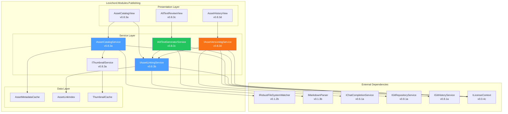
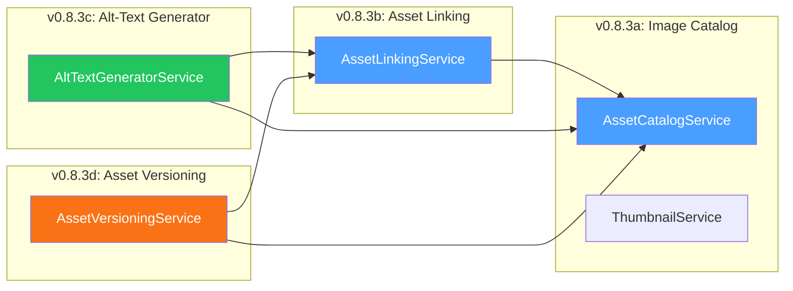
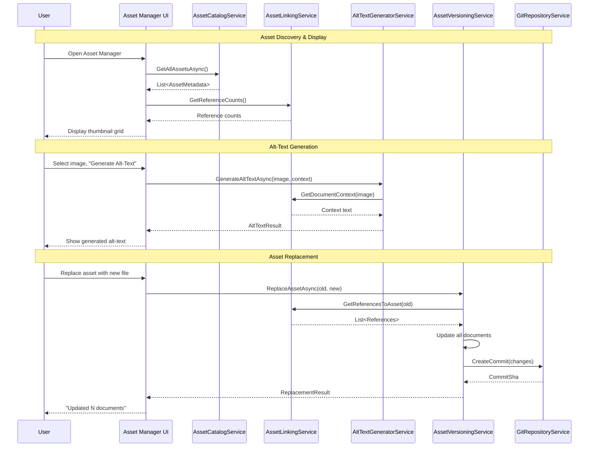

# LCS-DES-083: Design Specification Index — Asset Manager

## Document Control

| Field | Value |
| :--- | :--- |
| **Document ID** | LCS-DES-083-INDEX |
| **Feature ID** | PUB-083 |
| **Feature Name** | Asset Manager (The Prop Room) |
| **Target Version** | v0.8.3 |
| **Module Scope** | Lexichord.Modules.Publishing |
| **Swimlane** | Publishing |
| **License Tier** | Writer Pro |
| **Feature Gate Key** | FeatureFlags.Publishing.AssetManager |
| **Status** | Draft |
| **Last Updated** | 2026-01-27 |

---

## 1. Executive Summary

**v0.8.3** delivers the **Asset Manager** — "The Prop Room" for managing images, diagrams, and attachments in your documentation workspace. This release transforms Lexichord into a comprehensive media-aware documentation platform.

### 1.1 The Problem

Technical documentation relies heavily on visual content:

- Screenshots illustrating UI workflows
- Architecture diagrams explaining system design
- Flowcharts depicting processes
- Code snippets rendered as images
- Logos and branding assets

Without proper asset management, writers face critical challenges:

- **Orphaned assets:** Images no longer referenced by any document consume space
- **Broken references:** Documents linking to missing or moved images
- **Accessibility gaps:** Images missing alt-text fail compliance audits
- **Version chaos:** Updating an image requires manual find-and-replace across all documents
- **Discovery friction:** No way to browse available assets or understand their usage

### 1.2 The Solution

The Asset Manager provides four integrated capabilities:

1. **Image Catalog (v0.8.3a):** Centralized thumbnail gallery with metadata and search
2. **Asset Linking (v0.8.3b):** Bidirectional reference tracking between assets and documents
3. **Alt-Text Generator (v0.8.3c):** AI-powered accessibility descriptions with context awareness
4. **Asset Versioning (v0.8.3d):** Replace once, update everywhere with Git integration

### 1.3 Business Value

| Value | Description |
| :--- | :--- |
| **Centralized Library** | Single source of truth for all media assets |
| **Accessibility Compliance** | AI-generated alt-text for screen readers |
| **Reference Integrity** | Know exactly which documents use which assets |
| **Version Control** | Replace assets with automatic document updates |
| **Quality Assurance** | Detect orphans, broken links, and accessibility gaps |
| **Foundation** | Infrastructure for future video and interactive content |

---

## 2. Related Documents

### 2.1 Scope Breakdown Document

The detailed scope breakdown for v0.8.3, including all sub-parts, implementation checklists, user stories, and acceptance criteria:

| Document | Description |
| :--- | :--- |
| **[LCS-SBD-083](./LCS-SBD-083.md)** | Scope Breakdown — Asset Manager |

### 2.2 Sub-Part Design Specifications

Each sub-part has its own detailed design specification:

| Sub-Part | Document | Title | Description |
| :--- | :--- | :--- | :--- |
| v0.8.3a | **[LCS-DES-083a](./LCS-DES-083a.md)** | Image Catalog | Thumbnail gallery, metadata, search/filter |
| v0.8.3b | **[LCS-DES-083b](./LCS-DES-083b.md)** | Asset Linking | Bidirectional reference tracking |
| v0.8.3c | **[LCS-DES-083c](./LCS-DES-083c.md)** | Alt-Text Generator | AI-powered accessibility descriptions |
| v0.8.3d | **[LCS-DES-083d](./LCS-DES-083d.md)** | Asset Versioning | Replace and propagate with Git |

---

## 3. Architecture Overview

### 3.1 Component Diagram



### 3.2 Service Dependencies



### 3.3 Data Flow Overview



---

## 4. Dependencies

### 4.1 Upstream Dependencies (Required Services)

| Interface | Source Version | Purpose |
| :--- | :--- | :--- |
| `IRobustFileSystemWatcher` | v0.1.2b | Monitor workspace for asset changes |
| `IMarkdownParser` | v0.1.3b | Parse documents for image references |
| `IChatCompletionService` | v0.6.1a | AI-powered alt-text generation |
| `IPromptRenderer` | v0.6.3b | Render prompt templates |
| `IPromptTemplateRepository` | v0.6.4a | Store alt-text templates |
| `IGitRepositoryService` | v0.8.1a | Git repository access |
| `IGitHistoryService` | v0.8.1a | Query file version history |
| `IRegionManager` | v0.1.1b | Register Asset Manager panel |
| `ISettingsService` | v0.1.6a | Store user preferences |
| `ILicenseContext` | v0.0.4c | Writer Pro feature gating |
| `IMediator` | v0.0.7a | Event publishing |

### 4.2 NuGet Packages

| Package | Version | Purpose |
| :--- | :--- | :--- |
| `SixLabors.ImageSharp` | 3.x | Image processing and thumbnails (NEW) |
| `Svg` | 3.x | SVG rendering to bitmaps (NEW) |
| `Markdig` | 0.34.x | Markdown parsing |
| `LibGit2Sharp` | 0.30.x | Git integration |

### 4.3 Downstream Consumers (Future Versions)

| Version | Feature | Uses From v0.8.3 |
| :--- | :--- | :--- |
| v0.8.4 | Comparison View | Show asset diffs (before/after) |
| v0.8.5 | Static Site Bridge | Asset path resolution for MkDocs |
| v0.8.6 | PDF Exporter | Alt-text for PDF accessibility |
| v0.9.x | Video Support | Extend catalog for video assets |

---

## 5. License Gating Strategy

The Asset Manager is a **Writer Pro** feature.

### 5.1 Gating Behavior

| Tier | Catalog View | Reference View | Alt-Text Gen | Versioning |
| :--- | :--- | :--- | :--- | :--- |
| Core | Read-only | Hidden | Hidden | Hidden |
| Writer | Read-only | Read-only | Hidden | Hidden |
| **Writer Pro** | Full access | Full access | Full access | Full access |
| Teams | Full access | Full access | Full access | Full access |
| Enterprise | Full access | Full access | Full access | Full access |

### 5.2 Fallback Experience (Core/Writer Tiers)

```text
+------------------------------------------------------------------------+
|  Asset Manager                                           [?] [_] [x]   |
+------------------------------------------------------------------------+
| [+ Import] [Refresh]  | [Search assets...              ] | [Grid]     |
| [UPGRADE TO WRITER PRO FOR FULL FEATURES]                              |
+------------------------------------------------------------------------+
| +----------+  +----------+  +----------+  +----------+  +----------+   |
| |          |  |          |  |          |  |          |  |          |   |
| | [thumb]  |  | [thumb]  |  | [thumb]  |  | [thumb]  |  | [thumb]  |   |
| |          |  |          |  |          |  |          |  |          |   |
| +----------+  +----------+  +----------+  +----------+  +----------+   |
+------------------------------------------------------------------------+
| SELECTED: screenshot1.png                                               |
| Path: /images/screenshot1.png | Size: 245 KB | 1920x1080               |
|                                                                         |
| [Generate Alt-Text] [Replace Asset] [Rename] [Delete]                   |
|        ^                  ^            ^         ^                      |
|        |__________________|____________|_________|                      |
|           All buttons show "Upgrade to Writer Pro" on click             |
+------------------------------------------------------------------------+
```

---

## 6. Key Interfaces Summary

### 6.1 IAssetCatalogService (v0.8.3a)

```csharp
public interface IAssetCatalogService
{
    Task<IReadOnlyList<AssetMetadata>> GetAllAssetsAsync(CancellationToken ct = default);
    Task<AssetMetadata?> GetAssetAsync(string assetPath, CancellationToken ct = default);
    Task RefreshCatalogAsync(CancellationToken ct = default);
    Task<IReadOnlyList<AssetMetadata>> SearchAssetsAsync(AssetSearchQuery query, CancellationToken ct = default);
    IObservable<AssetCatalogChangedEvent> CatalogChanges { get; }
}
```

### 6.2 IAssetLinkingService (v0.8.3b)

```csharp
public interface IAssetLinkingService
{
    Task<IReadOnlyList<AssetReference>> GetReferencesToAssetAsync(string assetPath, CancellationToken ct = default);
    Task<IReadOnlyList<AssetReference>> GetAssetReferencesInDocumentAsync(string documentPath, CancellationToken ct = default);
    Task<IReadOnlyList<AssetMetadata>> GetOrphanedAssetsAsync(CancellationToken ct = default);
    Task<IReadOnlyList<BrokenReference>> GetBrokenReferencesAsync(CancellationToken ct = default);
    Task RebuildIndexAsync(CancellationToken ct = default);
}
```

### 6.3 IAltTextGeneratorService (v0.8.3c)

```csharp
public interface IAltTextGeneratorService
{
    Task<AltTextResult> GenerateAltTextAsync(AltTextRequest request, CancellationToken ct = default);
    Task<IReadOnlyList<AltTextResult>> GenerateBatchAltTextAsync(IReadOnlyList<AltTextRequest> requests, CancellationToken ct = default);
    Task<AccessibilityAuditResult> AuditAccessibilityAsync(string workspacePath, CancellationToken ct = default);
}
```

### 6.4 IAssetVersioningService (v0.8.3d)

```csharp
public interface IAssetVersioningService
{
    Task<AssetVersion> GetCurrentVersionAsync(string assetPath, CancellationToken ct = default);
    Task<IReadOnlyList<AssetVersion>> GetVersionHistoryAsync(string assetPath, CancellationToken ct = default);
    Task<AssetReplacementResult> ReplaceAssetAsync(AssetReplacementRequest request, CancellationToken ct = default);
    Task<AssetRenameResult> RenameAssetAsync(string oldPath, string newPath, CancellationToken ct = default);
    Task<RollbackResult> RollbackToVersionAsync(string assetPath, string commitSha, CancellationToken ct = default);
}
```

---

## 7. Key Scenarios Summary

### 7.1 Image Catalog (v0.8.3a)

| Scenario | Input | Expected Output |
| :--- | :--- | :--- |
| Browse all assets | Open Asset Manager | Thumbnail grid of all images |
| Search by name | Type "logo" in search | Filter to matching files |
| Filter by type | Select "Diagrams" filter | Show only SVG/Mermaid files |
| View metadata | Click on asset | Show size, dimensions, refs |

### 7.2 Asset Linking (v0.8.3b)

| Scenario | Input | Expected Output |
| :--- | :--- | :--- |
| View references | Select asset | List of documents + line numbers |
| Find orphans | Click "Show Orphans" | Assets with 0 references |
| Find broken refs | Click "Check Links" | References to missing files |

### 7.3 Alt-Text Generator (v0.8.3c)

| Scenario | Input | Expected Output |
| :--- | :--- | :--- |
| Generate single | Select image, click Generate | Alt-text with confidence score |
| Generate batch | Select 10 images, click Generate | 10 alt-texts for review |
| Audit accessibility | Click "Audit" | Report of missing alt-text |

### 7.4 Asset Versioning (v0.8.3d)

| Scenario | Input | Expected Output |
| :--- | :--- | :--- |
| Replace asset | Select new file | All references updated |
| Rename asset | Enter new name | All references updated |
| View history | Click "History" | Git commits for asset |
| Rollback | Click "Restore" on old version | Asset restored, commit created |

---

## 8. Implementation Checklist Summary

| Sub-Part | Tasks | Est. Hours |
| :--- | :--- | :--- |
| v0.8.3a (Image Catalog) | Service, UI, thumbnails, caching | 19 |
| v0.8.3b (Asset Linking) | Parser, index, orphan/broken detection | 13 |
| v0.8.3c (Alt-Text Generator) | LLM integration, batch, audit | 14 |
| v0.8.3d (Asset Versioning) | Replace, rename, Git integration | 18 |
| Integration | Tests, DI registration | 9 |
| **Total** | | **73 hours** |

See [LCS-SBD-083](./LCS-SBD-083.md) Section 4 for the detailed task breakdown.

---

## 9. Success Criteria Summary

| Category | Criterion | Target |
| :--- | :--- | :--- |
| **Catalog** | Initial load (1000 images) | < 5 seconds |
| **Catalog** | Thumbnail generation | < 200ms per image |
| **Linking** | Reference accuracy | 100% match actual |
| **Linking** | Index rebuild (500 docs) | < 10 seconds |
| **Alt-Text** | Generation time | < 3 seconds per image |
| **Alt-Text** | User acceptance rate | > 90% |
| **Versioning** | Replacement (10 docs) | < 2 seconds |
| **Memory** | 1000 assets indexed | < 100 MB |

See [LCS-SBD-083](./LCS-SBD-083.md) Section 9 for full success metrics.

---

## 10. MediatR Events Introduced

| Event | Description |
| :--- | :--- |
| `AssetCatalogChangedEvent` | Asset added, modified, or deleted |
| `AssetLinkChangedEvent` | Reference added or removed |
| `AltTextGeneratedEvent` | AI alt-text generation completed |
| `AssetReplacedEvent` | Asset file replaced |
| `AssetRenamedEvent` | Asset path changed |
| `AssetDeletedEvent` | Asset removed from workspace |
| `AccessibilityAuditCompletedEvent` | Audit scan finished |

---

## 11. What This Enables

| Version | Feature | Uses From v0.8.3 |
| :--- | :--- | :--- |
| v0.8.4 | Comparison View | Asset before/after thumbnails in diffs |
| v0.8.5 | Static Site Bridge | Asset path resolution for docs frameworks |
| v0.8.6 | PDF Exporter | Alt-text metadata for PDF accessibility |
| v0.9.x | Video Support | Extend catalog model for video assets |
| v0.9.x | Image Optimization | Resize/compress using thumbnail pipeline |
| v1.0.x | Collaborative Assets | Share asset libraries across teams |

---

## Document History

| Version | Date | Author | Changes |
| :--- | :--- | :--- | :--- |
| 1.0 | 2026-01-27 | Lead Architect | Initial draft |
