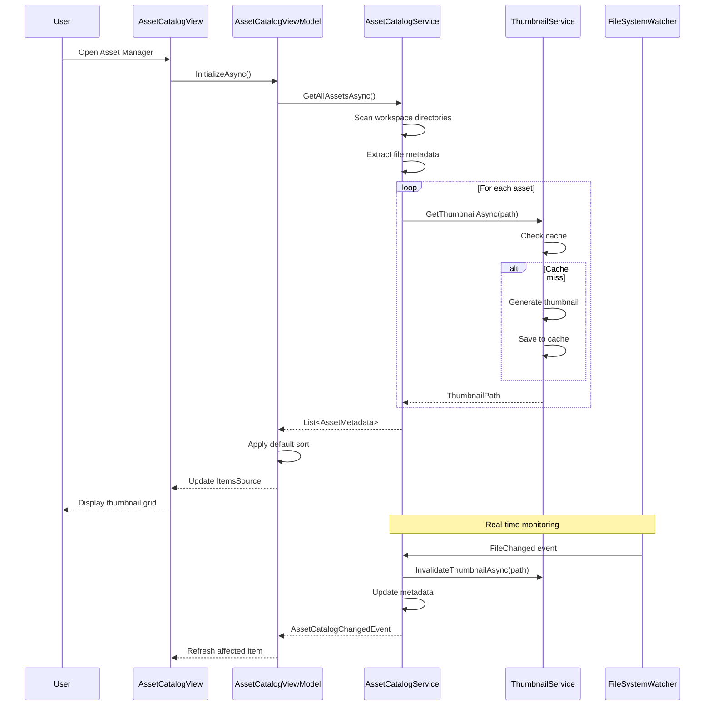

# LCS-DES-083a: Design Specification — Image Catalog

## 1. Metadata & Categorization

| Field | Value | Description |
| :--- | :--- | :--- |
| **Feature ID** | `PUB-083a` | Sub-part of PUB-083 |
| **Feature Name** | `Image Catalog (Thumbnail Gallery)` | Centralized media library |
| **Target Version** | `v0.8.3a` | First sub-part of v0.8.3 |
| **Module Scope** | `Lexichord.Modules.Publishing` | Publishing module |
| **Swimlane** | `Publishing` | Part of Publisher vertical |
| **License Tier** | `Writer Pro` | Required for full access |
| **Feature Gate Key** | `FeatureFlags.Publishing.AssetCatalog` | License check key |
| **Author** | Lead Architect | |
| **Reviewer** | | |
| **Status** | `Draft` | |
| **Last Updated** | `2026-01-27` | |
| **Parent Document** | [LCS-DES-083-INDEX](./LCS-DES-083-INDEX.md) | |
| **Scope Breakdown** | [LCS-SBD-083 Section 3.1](./LCS-SBD-083.md#31-v083a-image-catalog) | |

---

## 2. Executive Summary

### 2.1 The Requirement

Technical writers working with large documentation projects need a centralized view of all media assets in their workspace. Currently, finding and managing images requires:

- Manual file browser navigation through nested directories
- No preview of image contents without opening each file
- No metadata at a glance (dimensions, size, type)
- No understanding of which assets are used or orphaned

> **Goal:** Provide a thumbnail gallery view of all workspace assets with search, filter, and metadata display, enabling writers to quickly find and understand their media library.

### 2.2 The Proposed Solution

Implement an **Image Catalog** that:

1. Scans the workspace for all media files (PNG, JPG, SVG, etc.)
2. Generates and caches thumbnails for fast preview
3. Extracts and displays metadata (dimensions, size, type)
4. Provides search and filter capabilities
5. Integrates with the Asset Linking service for reference counts
6. Supports grid and list view modes

---

## 3. Architecture & Modular Strategy

### 3.1 Dependencies

#### 3.1.1 Upstream Modules

| Module/Interface | Source Version | Purpose |
| :--- | :--- | :--- |
| `IRobustFileSystemWatcher` | v0.1.2b | Detect file changes in workspace |
| `IRegionManager` | v0.1.1b | Register Asset Manager panel |
| `ISettingsService` | v0.1.6a | Store user view preferences |
| `ILicenseContext` | v0.0.4c | License tier validation |
| `IMediator` | v0.0.7a | Publish catalog events |
| `Serilog` | v0.0.3b | Logging operations |

#### 3.1.2 NuGet Packages

| Package | Version | Purpose |
| :--- | :--- | :--- |
| `SixLabors.ImageSharp` | 3.x | Image loading and thumbnail generation |
| `Svg` | 3.x | SVG rendering to bitmap |
| `System.IO.Abstractions` | 21.x | Testable file system access |

### 3.2 Licensing Behavior

**Soft Gate:** The catalog loads for all users, but edit operations require Writer Pro.

- **Load Behavior:** Module loads, catalog populates with read-only data
- **Fallback Experience:**
  - Core/Writer: Browse thumbnails, view metadata (read-only)
  - Import, edit, delete buttons show "Upgrade to Writer Pro" tooltip
  - Context menu options disabled for lower tiers

---

## 4. Data Contract (The API)

### 4.1 IAssetCatalogService Interface

```csharp
namespace Lexichord.Abstractions.Contracts;

/// <summary>
/// Service for discovering, indexing, and searching media assets in a workspace.
/// Provides centralized catalog of all images, diagrams, and attachments.
/// </summary>
public interface IAssetCatalogService
{
    /// <summary>
    /// Gets all assets in the workspace.
    /// </summary>
    /// <param name="ct">Cancellation token.</param>
    /// <returns>List of all asset metadata, sorted by modification date descending.</returns>
    Task<IReadOnlyList<AssetMetadata>> GetAllAssetsAsync(
        CancellationToken ct = default);

    /// <summary>
    /// Gets metadata for a specific asset by path.
    /// </summary>
    /// <param name="assetPath">Relative or absolute path to asset.</param>
    /// <param name="ct">Cancellation token.</param>
    /// <returns>Asset metadata if found, null otherwise.</returns>
    Task<AssetMetadata?> GetAssetAsync(
        string assetPath,
        CancellationToken ct = default);

    /// <summary>
    /// Refreshes the catalog by rescanning the workspace.
    /// Invalidates thumbnail cache for changed files.
    /// </summary>
    /// <param name="ct">Cancellation token.</param>
    Task RefreshCatalogAsync(CancellationToken ct = default);

    /// <summary>
    /// Searches assets using the specified query parameters.
    /// </summary>
    /// <param name="query">Search query with filters.</param>
    /// <param name="ct">Cancellation token.</param>
    /// <returns>Filtered list of matching assets.</returns>
    Task<IReadOnlyList<AssetMetadata>> SearchAssetsAsync(
        AssetSearchQuery query,
        CancellationToken ct = default);

    /// <summary>
    /// Updates metadata for an asset (e.g., alt-text, tags).
    /// </summary>
    /// <param name="assetPath">Path to asset.</param>
    /// <param name="updates">Metadata updates to apply.</param>
    /// <param name="ct">Cancellation token.</param>
    Task UpdateAssetMetadataAsync(
        string assetPath,
        AssetMetadataUpdate updates,
        CancellationToken ct = default);

    /// <summary>
    /// Gets the count of assets by type.
    /// </summary>
    /// <param name="ct">Cancellation token.</param>
    /// <returns>Dictionary of asset type to count.</returns>
    Task<IReadOnlyDictionary<AssetType, int>> GetAssetCountsByTypeAsync(
        CancellationToken ct = default);

    /// <summary>
    /// Observable stream of catalog change events for real-time updates.
    /// </summary>
    IObservable<AssetCatalogChangedEvent> CatalogChanges { get; }
}
```

### 4.2 IThumbnailService Interface

```csharp
namespace Lexichord.Abstractions.Contracts;

/// <summary>
/// Service for generating and caching thumbnail images for assets.
/// </summary>
public interface IThumbnailService
{
    /// <summary>
    /// Gets the thumbnail path for an asset, generating if needed.
    /// </summary>
    /// <param name="assetPath">Path to the source asset.</param>
    /// <param name="options">Thumbnail generation options.</param>
    /// <param name="ct">Cancellation token.</param>
    /// <returns>Path to the thumbnail file.</returns>
    Task<string> GetThumbnailAsync(
        string assetPath,
        ThumbnailOptions? options = null,
        CancellationToken ct = default);

    /// <summary>
    /// Invalidates the cached thumbnail for an asset.
    /// </summary>
    /// <param name="assetPath">Path to the asset.</param>
    Task InvalidateThumbnailAsync(string assetPath);

    /// <summary>
    /// Clears all cached thumbnails.
    /// </summary>
    Task ClearCacheAsync();

    /// <summary>
    /// Gets the total size of the thumbnail cache.
    /// </summary>
    /// <returns>Cache size in bytes.</returns>
    Task<long> GetCacheSizeAsync();
}

/// <summary>
/// Options for thumbnail generation.
/// </summary>
public record ThumbnailOptions(
    int MaxWidth = 150,
    int MaxHeight = 150,
    ThumbnailFormat Format = ThumbnailFormat.Png,
    bool PreserveAspectRatio = true
);

public enum ThumbnailFormat { Png, Jpeg, WebP }
```

### 4.3 Data Transfer Objects

```csharp
namespace Lexichord.Modules.Publishing.Models;

/// <summary>
/// Represents metadata for a media asset in the workspace.
/// </summary>
public record AssetMetadata
{
    /// <summary>Unique identifier (hash of relative path).</summary>
    public required string Id { get; init; }

    /// <summary>File name including extension.</summary>
    public required string FileName { get; init; }

    /// <summary>Path relative to workspace root.</summary>
    public required string RelativePath { get; init; }

    /// <summary>Absolute file system path.</summary>
    public required string AbsolutePath { get; init; }

    /// <summary>Classified asset type.</summary>
    public AssetType Type { get; init; } = AssetType.Unknown;

    /// <summary>File size in bytes.</summary>
    public long FileSizeBytes { get; init; }

    /// <summary>Image width in pixels (null for non-images).</summary>
    public int? Width { get; init; }

    /// <summary>Image height in pixels (null for non-images).</summary>
    public int? Height { get; init; }

    /// <summary>MIME type (e.g., "image/png").</summary>
    public string? MimeType { get; init; }

    /// <summary>File creation timestamp.</summary>
    public DateTime CreatedAt { get; init; }

    /// <summary>Last modification timestamp.</summary>
    public DateTime ModifiedAt { get; init; }

    /// <summary>Accessibility alt-text description.</summary>
    public string? AltText { get; init; }

    /// <summary>User-assigned tags for categorization.</summary>
    public IReadOnlyList<string> Tags { get; init; } = [];

    /// <summary>Path to cached thumbnail image.</summary>
    public string? ThumbnailPath { get; init; }

    /// <summary>Number of documents referencing this asset.</summary>
    public int ReferenceCount { get; init; }

    /// <summary>Whether the asset has no references.</summary>
    public bool IsOrphaned => ReferenceCount == 0;

    /// <summary>Whether the asset is missing required alt-text.</summary>
    public bool IsMissingAltText =>
        Type is AssetType.Image or AssetType.Diagram &&
        string.IsNullOrWhiteSpace(AltText);

    /// <summary>Formatted file size for display.</summary>
    public string FormattedFileSize => FileSizeBytes switch
    {
        < 1024 => $"{FileSizeBytes} B",
        < 1024 * 1024 => $"{FileSizeBytes / 1024.0:F1} KB",
        _ => $"{FileSizeBytes / (1024.0 * 1024):F1} MB"
    };

    /// <summary>Formatted dimensions for display.</summary>
    public string? FormattedDimensions =>
        Width.HasValue && Height.HasValue
            ? $"{Width}x{Height}"
            : null;
}

/// <summary>
/// Classification of asset types.
/// </summary>
public enum AssetType
{
    Unknown,
    Image,
    Diagram,
    Attachment,
    Video
}

/// <summary>
/// Query parameters for searching assets.
/// </summary>
public record AssetSearchQuery(
    string? NameFilter = null,
    AssetType? TypeFilter = null,
    int? MinWidth = null,
    int? MaxWidth = null,
    long? MinSizeBytes = null,
    long? MaxSizeBytes = null,
    DateTime? ModifiedAfter = null,
    DateTime? ModifiedBefore = null,
    IReadOnlyList<string>? Tags = null,
    bool? HasAltText = null,
    bool? IsOrphaned = null,
    AssetSortField SortBy = AssetSortField.ModifiedAt,
    bool SortDescending = true
);

public enum AssetSortField
{
    FileName,
    ModifiedAt,
    CreatedAt,
    FileSize,
    ReferenceCount
}

/// <summary>
/// Partial update for asset metadata.
/// </summary>
public record AssetMetadataUpdate(
    string? AltText = null,
    IReadOnlyList<string>? Tags = null
);

/// <summary>
/// Event published when the catalog changes.
/// </summary>
public record AssetCatalogChangedEvent(
    AssetCatalogChangeType ChangeType,
    string AssetPath,
    AssetMetadata? Asset
);

public enum AssetCatalogChangeType
{
    Added,
    Modified,
    Deleted,
    Refreshed
}
```

---

## 5. Implementation Logic

### 5.1 Asset Discovery Flow



### 5.2 Thumbnail Generation Logic

```text
GENERATE thumbnail FOR asset:
│
├── 1. Check thumbnail cache
│   │
│   ├── Cache EXISTS and asset not modified?
│   │   └── RETURN cached thumbnail path
│   │
│   └── Cache MISS or stale → Continue
│
├── 2. Determine asset type from extension
│   │
│   ├── .png, .jpg, .jpeg, .gif, .webp, .bmp
│   │   └── AssetType.Image → Use ImageSharp
│   │
│   ├── .svg
│   │   └── AssetType.Diagram → Use Svg library
│   │
│   ├── .mmd, .mermaid
│   │   └── AssetType.Diagram → Use Mermaid CLI (if available)
│   │   └── FALLBACK: Generic diagram icon
│   │
│   ├── .drawio, .excalidraw
│   │   └── AssetType.Diagram → Generic diagram icon
│   │
│   ├── .pdf
│   │   └── AssetType.Attachment → Generic PDF icon
│   │
│   ├── .mp4, .webm, .mov
│   │   └── AssetType.Video → Generic video icon
│   │
│   └── Other
│       └── AssetType.Unknown → Generic file icon
│
├── 3. Generate thumbnail
│   │
│   ├── Load source image/render SVG
│   ├── Resize to fit MaxWidth x MaxHeight (preserve aspect)
│   ├── Apply consistent background (transparent or white)
│   └── Encode as PNG
│
├── 4. Save to cache directory
│   │
│   ├── Path: {CacheDir}/{hash(relativePath)}.png
│   └── Create parent directories if needed
│
└── 5. RETURN thumbnail path
```

### 5.3 Asset Type Classification

```csharp
private static AssetType ClassifyAsset(string extension) => extension.ToLowerInvariant() switch
{
    ".png" or ".jpg" or ".jpeg" or ".gif" or ".webp" or ".bmp" or ".ico" => AssetType.Image,
    ".svg" or ".mmd" or ".mermaid" or ".drawio" or ".excalidraw" => AssetType.Diagram,
    ".pdf" or ".docx" or ".xlsx" or ".pptx" or ".zip" => AssetType.Attachment,
    ".mp4" or ".webm" or ".mov" or ".avi" => AssetType.Video,
    _ => AssetType.Unknown
};

private static string? GetMimeType(string extension) => extension.ToLowerInvariant() switch
{
    ".png" => "image/png",
    ".jpg" or ".jpeg" => "image/jpeg",
    ".gif" => "image/gif",
    ".webp" => "image/webp",
    ".svg" => "image/svg+xml",
    ".bmp" => "image/bmp",
    ".ico" => "image/x-icon",
    ".pdf" => "application/pdf",
    ".mp4" => "video/mp4",
    ".webm" => "video/webm",
    _ => null
};
```

### 5.4 Search and Filter Logic

```text
FILTER assets BY query:
│
├── Start with all assets
│
├── IF NameFilter provided:
│   └── FILTER: FileName CONTAINS NameFilter (case-insensitive)
│
├── IF TypeFilter provided:
│   └── FILTER: Type == TypeFilter
│
├── IF MinWidth provided:
│   └── FILTER: Width >= MinWidth
│
├── IF MaxWidth provided:
│   └── FILTER: Width <= MaxWidth
│
├── IF MinSizeBytes provided:
│   └── FILTER: FileSizeBytes >= MinSizeBytes
│
├── IF MaxSizeBytes provided:
│   └── FILTER: FileSizeBytes <= MaxSizeBytes
│
├── IF ModifiedAfter provided:
│   └── FILTER: ModifiedAt >= ModifiedAfter
│
├── IF ModifiedBefore provided:
│   └── FILTER: ModifiedAt <= ModifiedBefore
│
├── IF Tags provided:
│   └── FILTER: Tags INTERSECTS query.Tags
│
├── IF HasAltText provided:
│   └── FILTER: (AltText != null) == HasAltText
│
├── IF IsOrphaned provided:
│   └── FILTER: IsOrphaned == query.IsOrphaned
│
├── SORT BY SortBy field
│   └── Direction: SortDescending ? DESC : ASC
│
└── RETURN filtered list
```

---

## 6. Data Persistence

### 6.1 Thumbnail Cache Storage

```text
CACHE DIRECTORY STRUCTURE:

Windows:  %APPDATA%/Lexichord/cache/thumbnails/
macOS:    ~/Library/Caches/Lexichord/thumbnails/
Linux:    ~/.cache/Lexichord/thumbnails/

thumbnails/
├── metadata.json           # Cache metadata (version, stats)
├── ab/
│   ├── ab12cd34.png       # Thumbnail files by hash prefix
│   └── ab98ef76.png
├── cd/
│   └── cd45ab12.png
└── ...
```

### 6.2 Asset Metadata Cache

```text
METADATA CACHE:

Location: {WorkspaceRoot}/.lexichord/asset-catalog.json

{
  "version": "1.0",
  "lastScan": "2026-01-27T10:30:00Z",
  "assets": {
    "images/screenshot1.png": {
      "altText": "Main editor window showing markdown preview",
      "tags": ["ui", "editor", "screenshot"],
      "customMetadata": {}
    },
    "diagrams/architecture.svg": {
      "altText": "System architecture diagram showing components",
      "tags": ["architecture", "diagram"],
      "customMetadata": {}
    }
  }
}
```

---

## 7. UI/UX Specifications

### 7.1 AssetCatalogView Layout

```text
+------------------------------------------------------------------------+
|  Asset Manager                                           [?] [_] [x]   |
+------------------------------------------------------------------------+
| [+ Import] [Refresh] | [Search assets...              ] | [=] [#]     |
|                                                           Grid  List   |
+------------------------------------------------------------------------+
| Type: [All v] | Size: [All v] | Sort: [Modified v] [^] | Show: [All v]|
+------------------------------------------------------------------------+
|                                                                         |
| +----------+  +----------+  +----------+  +----------+  +----------+   |
| |          |  |          |  |          |  |          |  |          |   |
| | [thumb]  |  | [thumb]  |  | [thumb]  |  | [thumb]  |  | [thumb]  |   |
| |          |  |          |  |          |  |          |  |   [!]    |   |
| +----------+  +----------+  +----------+  +----------+  +----------+   |
| screenshot1   diagram.svg   logo.png      flow.mmd      orphan.png     |
| 1920x1080     800x600       256x256       1200x800      512x512        |
| 5 refs        3 refs        12 refs       1 ref         0 refs         |
|                                                                         |
| +----------+  +----------+  +----------+  +----------+  +----------+   |
| |          |  |          |  |          |  |          |  |          |   |
| | [thumb]  |  | [thumb]  |  | [thumb]  |  | [thumb]  |  | [thumb]  |   |
| |   [x]    |  |          |  |          |  |          |  |          |   |
| +----------+  +----------+  +----------+  +----------+  +----------+   |
| noalt.png     banner.jpg    arch.png      setup.gif     config.svg     |
|                                                                         |
+------------------------------------------------------------------------+
| SELECTED: screenshot1.png                                               |
| /images/screenshots/screenshot1.png                                     |
|                                                                         |
| Size: 245 KB        Dimensions: 1920 x 1080        Type: PNG           |
| Created: 2026-01-15 14:30        Modified: 2026-01-20 09:15            |
|                                                                         |
| Alt-Text: "Main editor window showing markdown preview panel"           |
| Tags: [ui] [editor] [screenshot]                                        |
| References: 5 documents                             [View References]   |
+------------------------------------------------------------------------+
| [Generate Alt-Text] [Replace] [Rename] [Copy Path] [Open Folder] [Del] |
+------------------------------------------------------------------------+
```

### 7.2 Grid Item Template

```text
+------------------+
|                  |
|                  |
|    [THUMBNAIL]   |    <- 150x150 max, centered, letterbox
|                  |
|       [!]        |    <- Overlay badge (orphan warning)
|       [x]        |    <- Overlay badge (missing alt-text)
+------------------+
| filename.png     |    <- Filename (truncate with ellipsis)
| 1920x1080        |    <- Dimensions or file size
| 5 refs           |    <- Reference count
+------------------+

BADGE MEANINGS:
[!] = Yellow warning: Orphaned (0 references)
[x] = Red error: Missing alt-text for image/diagram
```

### 7.3 List View Layout

```text
+------------------------------------------------------------------------+
| [Icon] | Name           | Type    | Size    | Dimensions | Refs | Mod  |
+------------------------------------------------------------------------+
| [img]  | screenshot1... | Image   | 245 KB  | 1920x1080  | 5    | 1/20 |
| [svg]  | diagram.svg    | Diagram | 12 KB   | 800x600    | 3    | 1/18 |
| [img]  | logo.png       | Image   | 8 KB    | 256x256    | 12   | 1/10 |
| [mmd]  | flow.mmd       | Diagram | 2 KB    | -          | 1    | 1/15 |
| [img]  | orphan.png [!] | Image   | 156 KB  | 512x512    | 0    | 1/05 |
+------------------------------------------------------------------------+
```

### 7.4 Component Styling

| Component | Theme Resource | Notes |
| :--- | :--- | :--- |
| Panel Background | `Brush.Surface.Primary` | Main container |
| Thumbnail Card | `Brush.Surface.Secondary` | Individual item cards |
| Selected Card | `Brush.Accent.Primary` | 2px border when selected |
| Orphan Badge | `Brush.Warning` | Yellow "!" icon |
| Missing Alt Badge | `Brush.Error` | Red "x" icon |
| Reference Count | `Brush.Text.Secondary` | Subtle gray text |
| File Name | `Brush.Text.Primary` | Bold primary text |
| Metadata Text | `Brush.Text.Secondary` | Dimensions, size |
| Buttons | `LexButtonSecondary` | Action bar buttons |

---

## 8. Observability & Logging

| Level | Source | Message Template |
| :--- | :--- | :--- |
| Debug | AssetCatalogService | `"Scanning directory: {Directory}"` |
| Debug | AssetCatalogService | `"Found asset: {Path}, Type: {Type}"` |
| Info | AssetCatalogService | `"Catalog loaded: {Count} assets in {ElapsedMs}ms"` |
| Debug | ThumbnailService | `"Generating thumbnail: {AssetPath}"` |
| Debug | ThumbnailService | `"Thumbnail cache hit: {AssetPath}"` |
| Warning | ThumbnailService | `"Thumbnail generation failed: {AssetPath}, Error: {Error}"` |
| Info | ThumbnailService | `"Cache cleared: {FreedBytes} bytes"` |
| Debug | AssetCatalogService | `"Asset modified: {Path}"` |
| Debug | AssetCatalogService | `"Search query: {Query}, Results: {Count}"` |

---

## 9. Security & Safety

| Risk | Level | Mitigation |
| :--- | :--- | :--- |
| Path traversal in asset paths | Medium | Validate paths are within workspace |
| Large file DoS (huge images) | Low | Limit thumbnail generation to < 50MB files |
| Malicious SVG (scripts) | Medium | Render SVG to bitmap, strip scripts |
| Cache directory exhaustion | Low | Limit cache size, implement LRU eviction |
| Sensitive file exposure | Low | Only scan configured asset directories |

---

## 10. Acceptance Criteria

### 10.1 Functional Criteria

| # | Given | When | Then |
| :--- | :--- | :--- | :--- |
| 1 | Workspace with PNG, JPG, SVG files | Open Asset Manager | All files appear in grid |
| 2 | Asset selected | View details panel | Shows size, dimensions, path |
| 3 | Type "logo" in search | Search executes | Only files with "logo" in name shown |
| 4 | Select "Diagrams" type filter | Filter applied | Only SVG/Mermaid files shown |
| 5 | New image added to workspace | FileWatcher triggers | Asset appears in catalog |
| 6 | Image modified externally | FileWatcher triggers | Thumbnail regenerates |
| 7 | Asset with 0 references | View catalog | Shows orphan warning badge |
| 8 | Image without alt-text | View catalog | Shows missing alt-text badge |

### 10.2 Performance Criteria

| # | Scenario | Target |
| :--- | :--- | :--- |
| 1 | Initial load (100 assets) | < 2 seconds |
| 2 | Initial load (1000 assets) | < 5 seconds |
| 3 | Thumbnail generation (single) | < 200ms |
| 4 | Thumbnail cache hit | < 10ms |
| 5 | Search filter (1000 assets) | < 100ms |
| 6 | Memory (1000 assets loaded) | < 50MB |

### 10.3 License Criteria

| # | Tier | Expected Behavior |
| :--- | :--- | :--- |
| 1 | Core | View thumbnails, metadata (read-only) |
| 2 | Core | Import/Edit buttons show upgrade prompt |
| 3 | Writer Pro | Full access to all features |

---

## 11. Unit Testing Requirements

### 11.1 AssetCatalogService Tests

```csharp
[Trait("Category", "Unit")]
[Trait("Version", "v0.8.3a")]
public class AssetCatalogServiceTests
{
    [Fact]
    public async Task GetAllAssetsAsync_EmptyWorkspace_ReturnsEmptyList()
    {
        // Arrange
        var workspace = CreateEmptyWorkspace();
        var sut = new AssetCatalogService(workspace, Mock.Of<IThumbnailService>());

        // Act
        var result = await sut.GetAllAssetsAsync();

        // Assert
        result.Should().BeEmpty();
    }

    [Fact]
    public async Task GetAllAssetsAsync_WorkspaceWithImages_ReturnsAllAssets()
    {
        // Arrange
        var workspace = CreateWorkspaceWithFiles("img1.png", "img2.jpg", "doc.md");
        var sut = new AssetCatalogService(workspace, Mock.Of<IThumbnailService>());

        // Act
        var result = await sut.GetAllAssetsAsync();

        // Assert
        result.Should().HaveCount(2); // Only image files
        result.Should().Contain(a => a.FileName == "img1.png");
        result.Should().Contain(a => a.FileName == "img2.jpg");
    }

    [Theory]
    [InlineData(".png", AssetType.Image)]
    [InlineData(".jpg", AssetType.Image)]
    [InlineData(".jpeg", AssetType.Image)]
    [InlineData(".gif", AssetType.Image)]
    [InlineData(".webp", AssetType.Image)]
    [InlineData(".svg", AssetType.Diagram)]
    [InlineData(".mmd", AssetType.Diagram)]
    [InlineData(".pdf", AssetType.Attachment)]
    [InlineData(".mp4", AssetType.Video)]
    [InlineData(".xyz", AssetType.Unknown)]
    public async Task GetAssetAsync_ClassifiesTypeCorrectly(
        string extension, AssetType expectedType)
    {
        // Arrange
        var workspace = CreateWorkspaceWithFiles($"test{extension}");
        var sut = new AssetCatalogService(workspace, Mock.Of<IThumbnailService>());

        // Act
        var result = await sut.GetAssetAsync($"test{extension}");

        // Assert
        result.Should().NotBeNull();
        result!.Type.Should().Be(expectedType);
    }

    [Fact]
    public async Task SearchAssetsAsync_FilterByName_ReturnsMatches()
    {
        // Arrange
        var workspace = CreateWorkspaceWithFiles("logo.png", "banner.png", "icon.svg");
        var sut = new AssetCatalogService(workspace, Mock.Of<IThumbnailService>());
        var query = new AssetSearchQuery(NameFilter: "logo");

        // Act
        var result = await sut.SearchAssetsAsync(query);

        // Assert
        result.Should().ContainSingle();
        result[0].FileName.Should().Be("logo.png");
    }

    [Fact]
    public async Task SearchAssetsAsync_FilterByType_ReturnsMatches()
    {
        // Arrange
        var workspace = CreateWorkspaceWithFiles("img.png", "diag.svg", "doc.pdf");
        var sut = new AssetCatalogService(workspace, Mock.Of<IThumbnailService>());
        var query = new AssetSearchQuery(TypeFilter: AssetType.Diagram);

        // Act
        var result = await sut.SearchAssetsAsync(query);

        // Assert
        result.Should().ContainSingle();
        result[0].FileName.Should().Be("diag.svg");
    }

    [Fact]
    public async Task SearchAssetsAsync_SortByModified_ReturnsInOrder()
    {
        // Arrange
        var workspace = CreateWorkspaceWithDatedFiles(
            ("old.png", DateTime.Now.AddDays(-10)),
            ("new.png", DateTime.Now));
        var sut = new AssetCatalogService(workspace, Mock.Of<IThumbnailService>());
        var query = new AssetSearchQuery(SortBy: AssetSortField.ModifiedAt, SortDescending: true);

        // Act
        var result = await sut.SearchAssetsAsync(query);

        // Assert
        result[0].FileName.Should().Be("new.png");
        result[1].FileName.Should().Be("old.png");
    }
}
```

### 11.2 ThumbnailService Tests

```csharp
[Trait("Category", "Unit")]
[Trait("Version", "v0.8.3a")]
public class ThumbnailServiceTests
{
    [Fact]
    public async Task GetThumbnailAsync_PngImage_GeneratesThumbnail()
    {
        // Arrange
        var testImage = CreateTestImage(1920, 1080);
        var sut = new ThumbnailService(CreateTempCacheDir());

        // Act
        var thumbnailPath = await sut.GetThumbnailAsync(testImage);

        // Assert
        File.Exists(thumbnailPath).Should().BeTrue();
        using var thumb = await Image.LoadAsync(thumbnailPath);
        thumb.Width.Should().BeLessOrEqualTo(150);
        thumb.Height.Should().BeLessOrEqualTo(150);
    }

    [Fact]
    public async Task GetThumbnailAsync_CachedThumbnail_ReturnsCached()
    {
        // Arrange
        var testImage = CreateTestImage(100, 100);
        var sut = new ThumbnailService(CreateTempCacheDir());

        // Act
        var path1 = await sut.GetThumbnailAsync(testImage);
        var path2 = await sut.GetThumbnailAsync(testImage);

        // Assert
        path1.Should().Be(path2);
    }

    [Fact]
    public async Task InvalidateThumbnailAsync_RemovesCachedFile()
    {
        // Arrange
        var testImage = CreateTestImage(100, 100);
        var sut = new ThumbnailService(CreateTempCacheDir());
        var path = await sut.GetThumbnailAsync(testImage);

        // Act
        await sut.InvalidateThumbnailAsync(testImage);

        // Assert
        File.Exists(path).Should().BeFalse();
    }

    [Theory]
    [InlineData(1920, 1080, 150, 84)]   // Landscape
    [InlineData(1080, 1920, 84, 150)]   // Portrait
    [InlineData(100, 100, 100, 100)]    // Small square (no resize)
    [InlineData(150, 150, 150, 150)]    // Exact size
    public async Task GetThumbnailAsync_PreservesAspectRatio(
        int srcWidth, int srcHeight, int expectedWidth, int expectedHeight)
    {
        // Arrange
        var testImage = CreateTestImage(srcWidth, srcHeight);
        var sut = new ThumbnailService(CreateTempCacheDir());

        // Act
        var thumbnailPath = await sut.GetThumbnailAsync(testImage);

        // Assert
        using var thumb = await Image.LoadAsync(thumbnailPath);
        thumb.Width.Should().Be(expectedWidth);
        thumb.Height.Should().Be(expectedHeight);
    }
}
```

---

## 12. ViewModel Implementation

```csharp
namespace Lexichord.Modules.Publishing.ViewModels;

/// <summary>
/// ViewModel for the Asset Catalog view.
/// </summary>
public partial class AssetCatalogViewModel : ObservableObject
{
    private readonly IAssetCatalogService _catalogService;
    private readonly IAssetLinkingService _linkingService;
    private readonly ILicenseContext _licenseContext;
    private readonly IMediator _mediator;

    [ObservableProperty]
    private ObservableCollection<AssetItemViewModel> _assets = [];

    [ObservableProperty]
    private AssetItemViewModel? _selectedAsset;

    [ObservableProperty]
    private string _searchText = string.Empty;

    [ObservableProperty]
    private AssetType? _selectedTypeFilter;

    [ObservableProperty]
    private AssetSortField _sortField = AssetSortField.ModifiedAt;

    [ObservableProperty]
    private bool _sortDescending = true;

    [ObservableProperty]
    private bool _isLoading;

    [ObservableProperty]
    private bool _isGridView = true;

    [ObservableProperty]
    private int _totalAssetCount;

    [ObservableProperty]
    private int _filteredAssetCount;

    public bool CanEdit => _licenseContext.CurrentTier >= LicenseTier.WriterPro;

    public AssetCatalogViewModel(
        IAssetCatalogService catalogService,
        IAssetLinkingService linkingService,
        ILicenseContext licenseContext,
        IMediator mediator)
    {
        _catalogService = catalogService;
        _linkingService = linkingService;
        _licenseContext = licenseContext;
        _mediator = mediator;

        // Subscribe to catalog changes
        _catalogService.CatalogChanges.Subscribe(OnCatalogChanged);
    }

    [RelayCommand]
    private async Task InitializeAsync(CancellationToken ct)
    {
        IsLoading = true;
        try
        {
            await RefreshAssetsAsync(ct);
        }
        finally
        {
            IsLoading = false;
        }
    }

    [RelayCommand]
    private async Task RefreshAsync(CancellationToken ct)
    {
        IsLoading = true;
        try
        {
            await _catalogService.RefreshCatalogAsync(ct);
            await RefreshAssetsAsync(ct);
        }
        finally
        {
            IsLoading = false;
        }
    }

    [RelayCommand]
    private async Task SearchAsync(CancellationToken ct)
    {
        await RefreshAssetsAsync(ct);
    }

    private async Task RefreshAssetsAsync(CancellationToken ct)
    {
        var query = new AssetSearchQuery(
            NameFilter: string.IsNullOrWhiteSpace(SearchText) ? null : SearchText,
            TypeFilter: SelectedTypeFilter,
            SortBy: SortField,
            SortDescending: SortDescending
        );

        var assets = await _catalogService.SearchAssetsAsync(query, ct);

        Assets.Clear();
        foreach (var asset in assets)
        {
            Assets.Add(new AssetItemViewModel(asset));
        }

        TotalAssetCount = await GetTotalCountAsync(ct);
        FilteredAssetCount = Assets.Count;
    }

    partial void OnSearchTextChanged(string value)
    {
        // Debounced search triggered by view
    }

    partial void OnSelectedTypeFilterChanged(AssetType? value)
    {
        _ = RefreshAssetsAsync(CancellationToken.None);
    }

    private void OnCatalogChanged(AssetCatalogChangedEvent evt)
    {
        Dispatcher.UIThread.InvokeAsync(() =>
        {
            switch (evt.ChangeType)
            {
                case AssetCatalogChangeType.Added when evt.Asset is not null:
                    Assets.Insert(0, new AssetItemViewModel(evt.Asset));
                    break;

                case AssetCatalogChangeType.Modified when evt.Asset is not null:
                    var existing = Assets.FirstOrDefault(a => a.RelativePath == evt.AssetPath);
                    if (existing is not null)
                    {
                        var index = Assets.IndexOf(existing);
                        Assets[index] = new AssetItemViewModel(evt.Asset);
                    }
                    break;

                case AssetCatalogChangeType.Deleted:
                    var toRemove = Assets.FirstOrDefault(a => a.RelativePath == evt.AssetPath);
                    if (toRemove is not null)
                    {
                        Assets.Remove(toRemove);
                    }
                    break;
            }
        });
    }
}
```

---

## 13. Deliverable Checklist

| # | Deliverable | Status |
| :--- | :--- | :--- |
| 1 | `IAssetCatalogService` interface | [ ] |
| 2 | `AssetCatalogService` implementation | [ ] |
| 3 | `IThumbnailService` interface | [ ] |
| 4 | `ThumbnailService` implementation | [ ] |
| 5 | `AssetMetadata` and related DTOs | [ ] |
| 6 | `AssetCatalogView.axaml` | [ ] |
| 7 | `AssetCatalogViewModel` | [ ] |
| 8 | `AssetItemViewModel` for grid items | [ ] |
| 9 | Thumbnail caching system | [ ] |
| 10 | FileSystemWatcher integration | [ ] |
| 11 | Search and filter implementation | [ ] |
| 12 | Grid and list view modes | [ ] |
| 13 | Unit tests for `AssetCatalogService` | [ ] |
| 14 | Unit tests for `ThumbnailService` | [ ] |
| 15 | DI registration | [ ] |

---

## 14. Verification Commands

```bash
# ═══════════════════════════════════════════════════════════════════════════
# v0.8.3a Verification
# ═══════════════════════════════════════════════════════════════════════════

# 1. Verify NuGet packages
dotnet list src/Lexichord.Modules.Publishing package | grep ImageSharp

# 2. Build module
dotnet build src/Lexichord.Modules.Publishing

# 3. Run unit tests
dotnet test --filter "Version=v0.8.3a" --logger "console;verbosity=detailed"

# 4. Run with coverage
dotnet test --filter "Version=v0.8.3a" --collect:"XPlat Code Coverage"

# 5. Manual verification:
# a) Open Asset Manager panel
# b) Verify thumbnails load for all workspace images
# c) Test search by filename
# d) Test filter by type
# e) Verify orphan badges appear for unreferenced images
```

---

## Document History

| Version | Date | Author | Changes |
| :--- | :--- | :--- | :--- |
| 1.0 | 2026-01-27 | Lead Architect | Initial draft |
