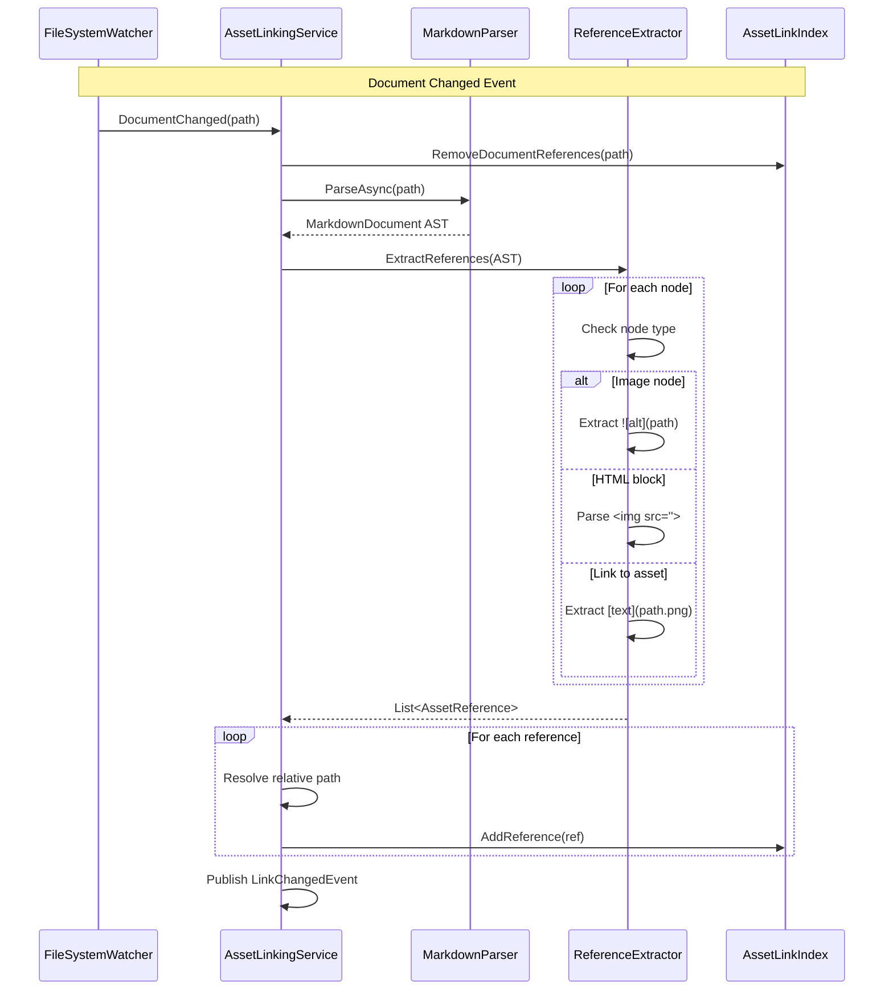

# LCS-DES-083b: Design Specification — Asset Linking

## 1. Metadata & Categorization

| Field | Value | Description |
| :--- | :--- | :--- |
| **Feature ID** | `PUB-083b` | Sub-part of PUB-083 |
| **Feature Name** | `Asset Linking (Reference Tracking)` | Bidirectional asset-document mapping |
| **Target Version** | `v0.8.3b` | Second sub-part of v0.8.3 |
| **Module Scope** | `Lexichord.Modules.Publishing` | Publishing module |
| **Swimlane** | `Publishing` | Part of Publisher vertical |
| **License Tier** | `Writer Pro` | Required for full access |
| **Feature Gate Key** | `FeatureFlags.Publishing.AssetLinking` | License check key |
| **Author** | Lead Architect | |
| **Reviewer** | | |
| **Status** | `Draft` | |
| **Last Updated** | `2026-01-27` | |
| **Parent Document** | [LCS-DES-083-INDEX](./LCS-DES-083-INDEX.md) | |
| **Scope Breakdown** | [LCS-SBD-083 Section 3.2](./LCS-SBD-083.md#32-v083b-asset-linking) | |

---

## 2. Executive Summary

### 2.1 The Requirement

Documentation projects suffer from reference integrity issues:

- **Orphaned assets:** Images that are no longer used but still consume storage
- **Broken references:** Documents linking to assets that have been moved or deleted
- **Unclear dependencies:** No way to know which documents will be affected when modifying an asset
- **Refactoring risk:** Fear of breaking things when reorganizing assets

> **Goal:** Track bidirectional references between assets and documents, enabling reference counting, orphan detection, broken link detection, and safe asset operations.

### 2.2 The Proposed Solution

Implement an **Asset Linking Service** that:

1. Parses all Markdown documents to extract image and asset references
2. Builds a bidirectional index mapping assets to documents and vice versa
3. Tracks reference counts for each asset
4. Detects orphaned assets (zero references)
5. Detects broken references (references to non-existent files)
6. Provides real-time updates when documents change
7. Supports multiple reference formats (Markdown, HTML, includes)

---

## 3. Architecture & Modular Strategy

### 3.1 Dependencies

#### 3.1.1 Upstream Modules

| Module/Interface | Source Version | Purpose |
| :--- | :--- | :--- |
| `IAssetCatalogService` | v0.8.3a | Asset discovery and metadata |
| `IMarkdownParser` | v0.1.3b | Parse documents for references |
| `IRobustFileSystemWatcher` | v0.1.2b | Detect document changes |
| `ILicenseContext` | v0.0.4c | License tier validation |
| `IMediator` | v0.0.7a | Publish link events |
| `Serilog` | v0.0.3b | Logging operations |

#### 3.1.2 NuGet Packages

| Package | Version | Purpose |
| :--- | :--- | :--- |
| `Markdig` | 0.34.x | Markdown AST parsing |
| `AngleSharp` | 1.x | HTML parsing for embedded images |
| `System.IO.Abstractions` | 21.x | Testable file system access |

### 3.2 Licensing Behavior

**Soft Gate:** The linking service indexes references for all users, but detailed views require Writer Pro.

- **Load Behavior:** Index builds in background for all tiers
- **Fallback Experience:**
  - Core/Writer: See reference counts in catalog (read-only)
  - "View References" button shows upgrade prompt
  - Orphan/broken reference reports require upgrade

---

## 4. Data Contract (The API)

### 4.1 IAssetLinkingService Interface

```csharp
namespace Lexichord.Abstractions.Contracts;

/// <summary>
/// Service for tracking bidirectional references between assets and documents.
/// Enables reference counting, orphan detection, and broken link identification.
/// </summary>
public interface IAssetLinkingService
{
    /// <summary>
    /// Gets all references to a specific asset from documents.
    /// </summary>
    /// <param name="assetPath">Relative path to the asset.</param>
    /// <param name="ct">Cancellation token.</param>
    /// <returns>List of document references to the asset.</returns>
    Task<IReadOnlyList<AssetReference>> GetReferencesToAssetAsync(
        string assetPath,
        CancellationToken ct = default);

    /// <summary>
    /// Gets all asset references within a specific document.
    /// </summary>
    /// <param name="documentPath">Path to the Markdown document.</param>
    /// <param name="ct">Cancellation token.</param>
    /// <returns>List of asset references in the document.</returns>
    Task<IReadOnlyList<AssetReference>> GetAssetReferencesInDocumentAsync(
        string documentPath,
        CancellationToken ct = default);

    /// <summary>
    /// Gets all orphaned assets (assets with zero references).
    /// </summary>
    /// <param name="ct">Cancellation token.</param>
    /// <returns>List of orphaned asset metadata.</returns>
    Task<IReadOnlyList<AssetMetadata>> GetOrphanedAssetsAsync(
        CancellationToken ct = default);

    /// <summary>
    /// Gets all broken references (references to non-existent assets).
    /// </summary>
    /// <param name="ct">Cancellation token.</param>
    /// <returns>List of broken reference details.</returns>
    Task<IReadOnlyList<BrokenReference>> GetBrokenReferencesAsync(
        CancellationToken ct = default);

    /// <summary>
    /// Gets the reference count for a specific asset.
    /// </summary>
    /// <param name="assetPath">Path to the asset.</param>
    /// <param name="ct">Cancellation token.</param>
    /// <returns>Number of documents referencing the asset.</returns>
    Task<int> GetReferenceCountAsync(
        string assetPath,
        CancellationToken ct = default);

    /// <summary>
    /// Rebuilds the entire reference index by scanning all documents.
    /// </summary>
    /// <param name="ct">Cancellation token.</param>
    Task RebuildIndexAsync(CancellationToken ct = default);

    /// <summary>
    /// Updates the index for a specific document (after document change).
    /// </summary>
    /// <param name="documentPath">Path to the changed document.</param>
    /// <param name="ct">Cancellation token.</param>
    Task UpdateDocumentIndexAsync(
        string documentPath,
        CancellationToken ct = default);

    /// <summary>
    /// Observable stream of link change events.
    /// </summary>
    IObservable<AssetLinkChangedEvent> LinkChanges { get; }
}
```

### 4.2 Data Transfer Objects

```csharp
namespace Lexichord.Modules.Publishing.Models;

/// <summary>
/// Represents a reference from a document to an asset.
/// </summary>
public record AssetReference(
    /// <summary>Relative path to the referenced asset.</summary>
    string AssetPath,

    /// <summary>Relative path to the document containing the reference.</summary>
    string DocumentPath,

    /// <summary>Line number where the reference appears (1-based).</summary>
    int LineNumber,

    /// <summary>Column number where the reference starts (1-based).</summary>
    int ColumnNumber,

    /// <summary>The raw reference text as it appears in the document.</summary>
    string RawReference,

    /// <summary>Type of reference syntax used.</summary>
    AssetReferenceType Type,

    /// <summary>Alt-text if specified in the reference.</summary>
    string? AltText,

    /// <summary>Title attribute if specified.</summary>
    string? Title,

    /// <summary>Whether the reference uses a relative or absolute path.</summary>
    bool IsRelativePath,

    /// <summary>Surrounding context text (for preview).</summary>
    string? ContextSnippet
);

/// <summary>
/// Type of asset reference syntax.
/// </summary>
public enum AssetReferenceType
{
    /// <summary>Markdown image: </summary>
    MarkdownImage,

    /// <summary>HTML image tag: &lt;img src="path"&gt;</summary>
    HtmlImage,

    /// <summary>Markdown link to asset: [text](path.png)</summary>
    MarkdownLink,

    /// <summary>Include directive: {{&lt; include "path" &gt;}}</summary>
    Include,

    /// <summary>Reference-style image: ![alt][ref]</summary>
    ReferenceStyleImage,

    /// <summary>HTML source element: &lt;source src="path"&gt;</summary>
    HtmlSource
}

/// <summary>
/// Represents a broken reference to a non-existent asset.
/// </summary>
public record BrokenReference(
    /// <summary>Path to the document containing the broken reference.</summary>
    string DocumentPath,

    /// <summary>Line number of the broken reference.</summary>
    int LineNumber,

    /// <summary>Column number of the broken reference.</summary>
    int ColumnNumber,

    /// <summary>The referenced path that doesn't exist.</summary>
    string ReferencedPath,

    /// <summary>Reason why the reference is broken.</summary>
    BrokenReferenceReason Reason,

    /// <summary>Human-readable description of the issue.</summary>
    string Description,

    /// <summary>Suggested fix if available.</summary>
    string? SuggestedFix
);

/// <summary>
/// Reason why a reference is broken.
/// </summary>
public enum BrokenReferenceReason
{
    /// <summary>Referenced file does not exist.</summary>
    FileNotFound,

    /// <summary>Path escapes workspace directory.</summary>
    PathOutsideWorkspace,

    /// <summary>Invalid URL or path syntax.</summary>
    InvalidPath,

    /// <summary>Circular reference detected.</summary>
    CircularReference
}

/// <summary>
/// Event published when asset links change.
/// </summary>
public record AssetLinkChangedEvent(
    /// <summary>Path to the affected asset.</summary>
    string AssetPath,

    /// <summary>Type of change that occurred.</summary>
    AssetLinkChangeType ChangeType,

    /// <summary>List of affected references.</summary>
    IReadOnlyList<AssetReference> AffectedReferences,

    /// <summary>Previous reference count (for comparison).</summary>
    int PreviousReferenceCount,

    /// <summary>New reference count.</summary>
    int NewReferenceCount
);

/// <summary>
/// Type of link change.
/// </summary>
public enum AssetLinkChangeType
{
    /// <summary>New reference added to asset.</summary>
    ReferenceAdded,

    /// <summary>Reference to asset removed.</summary>
    ReferenceRemoved,

    /// <summary>Asset was moved (references may need updating).</summary>
    AssetMoved,

    /// <summary>Asset was deleted (references now broken).</summary>
    AssetDeleted,

    /// <summary>Index was fully rebuilt.</summary>
    IndexRebuilt
}
```

---

## 5. Implementation Logic

### 5.1 Reference Index Architecture

```mermaid
graph TB
    subgraph "Bidirectional Index"
        subgraph "Asset → Documents Index"
            AI[AssetIndex<br/>Dictionary&lt;assetPath, List&lt;AssetReference&gt;&gt;]
        end

        subgraph "Document → Assets Index"
            DI[DocumentIndex<br/>Dictionary&lt;docPath, List&lt;AssetReference&gt;&gt;]
        end
    end

    subgraph "Index Operations"
        RB[RebuildIndex<br/>Full scan]
        UD[UpdateDocument<br/>Incremental]
        QA[QueryAsset<br/>O(1) lookup]
        QD[QueryDocument<br/>O(1) lookup]
    end

    RB --> AI
    RB --> DI
    UD --> AI
    UD --> DI
    AI --> QA
    DI --> QD

    style AI fill:#4a9eff,color:#fff
    style DI fill:#4a9eff,color:#fff
```

### 5.2 Index Data Structure

```csharp
/// <summary>
/// In-memory bidirectional index for asset references.
/// Thread-safe for concurrent read/write operations.
/// </summary>
internal class AssetLinkIndex
{
    private readonly ConcurrentDictionary<string, HashSet<AssetReference>> _assetToDocuments = new();
    private readonly ConcurrentDictionary<string, HashSet<AssetReference>> _documentToAssets = new();
    private readonly ReaderWriterLockSlim _lock = new();

    /// <summary>
    /// Adds a reference to the index.
    /// </summary>
    public void AddReference(AssetReference reference)
    {
        _lock.EnterWriteLock();
        try
        {
            // Asset → Documents
            var assetKey = NormalizePath(reference.AssetPath);
            if (!_assetToDocuments.TryGetValue(assetKey, out var assetRefs))
            {
                assetRefs = new HashSet<AssetReference>();
                _assetToDocuments[assetKey] = assetRefs;
            }
            assetRefs.Add(reference);

            // Document → Assets
            var docKey = NormalizePath(reference.DocumentPath);
            if (!_documentToAssets.TryGetValue(docKey, out var docRefs))
            {
                docRefs = new HashSet<AssetReference>();
                _documentToAssets[docKey] = docRefs;
            }
            docRefs.Add(reference);
        }
        finally
        {
            _lock.ExitWriteLock();
        }
    }

    /// <summary>
    /// Removes all references from a document.
    /// </summary>
    public void RemoveDocumentReferences(string documentPath)
    {
        _lock.EnterWriteLock();
        try
        {
            var docKey = NormalizePath(documentPath);
            if (_documentToAssets.TryRemove(docKey, out var refs))
            {
                foreach (var reference in refs)
                {
                    var assetKey = NormalizePath(reference.AssetPath);
                    if (_assetToDocuments.TryGetValue(assetKey, out var assetRefs))
                    {
                        assetRefs.RemoveWhere(r =>
                            NormalizePath(r.DocumentPath) == docKey);
                    }
                }
            }
        }
        finally
        {
            _lock.ExitWriteLock();
        }
    }

    /// <summary>
    /// Gets all references to an asset.
    /// </summary>
    public IReadOnlyList<AssetReference> GetReferencesToAsset(string assetPath)
    {
        _lock.EnterReadLock();
        try
        {
            var key = NormalizePath(assetPath);
            return _assetToDocuments.TryGetValue(key, out var refs)
                ? refs.ToList()
                : [];
        }
        finally
        {
            _lock.ExitReadLock();
        }
    }

    /// <summary>
    /// Gets all assets referenced by a document.
    /// </summary>
    public IReadOnlyList<AssetReference> GetAssetsInDocument(string documentPath)
    {
        _lock.EnterReadLock();
        try
        {
            var key = NormalizePath(documentPath);
            return _documentToAssets.TryGetValue(key, out var refs)
                ? refs.ToList()
                : [];
        }
        finally
        {
            _lock.ExitReadLock();
        }
    }

    private static string NormalizePath(string path) =>
        path.Replace('\\', '/').ToLowerInvariant();
}
```

### 5.3 Reference Parsing Flow



### 5.4 Reference Extraction Logic

```text
EXTRACT references FROM document:
│
├── 1. Parse document as Markdown AST
│
├── 2. Walk AST nodes
│   │
│   ├── LinkInline node
│   │   ├── IF Url ends with image extension
│   │   │   └── CREATE AssetReference (MarkdownLink)
│   │   └── ELSE → Skip
│   │
│   ├── ImageInline node: 
│   │   ├── Extract: Url, AltText, Title
│   │   └── CREATE AssetReference (MarkdownImage)
│   │
│   ├── HtmlBlock or HtmlInline
│   │   ├── Parse with AngleSharp
│   │   ├── Find  tags
│   │   │   └── CREATE AssetReference (HtmlImage)
│   │   ├── Find <source src="..."> tags
│   │   │   └── CREATE AssetReference (HtmlSource)
│   │   └── Find <picture> elements
│   │
│   └── Custom block (e.g., Hugo shortcode)
│       ├── Match 
│       └── CREATE AssetReference (Include)
│
├── 3. Resolve each path relative to document location
│   │
│   ├── IF path is absolute URL (http://)
│   │   └── SKIP (external resource)
│   │
│   ├── IF path starts with /
│   │   └── Resolve relative to workspace root
│   │
│   └── ELSE (relative path)
│       └── Resolve relative to document directory
│
├── 4. Validate resolved path
│   │
│   ├── IF path escapes workspace
│   │   └── FLAG as broken (PathOutsideWorkspace)
│   │
│   └── IF file does not exist
│       └── FLAG as broken (FileNotFound)
│
└── 5. RETURN list of AssetReference
```

### 5.5 Orphan Detection Logic

```text
FIND orphaned assets:
│
├── Get all assets from IAssetCatalogService
│
├── FOR EACH asset:
│   │
│   ├── Get reference count from index
│   │
│   └── IF reference count == 0
│       └── ADD to orphan list
│
└── RETURN orphan list sorted by ModifiedAt (oldest first)
```

### 5.6 Broken Reference Detection Logic

```text
FIND broken references:
│
├── FOR EACH document in workspace:
│   │
│   ├── Get references from index
│   │
│   └── FOR EACH reference:
│       │
│       ├── Check if asset exists
│       │   └── IF NOT → Add BrokenReference (FileNotFound)
│       │
│       ├── Check if path is valid
│       │   └── IF NOT → Add BrokenReference (InvalidPath)
│       │
│       └── Check if path escapes workspace
│           └── IF YES → Add BrokenReference (PathOutsideWorkspace)
│
└── RETURN list of BrokenReference
```

---

## 6. UI/UX Specifications

### 6.1 Reference List Panel

```text
+------------------------------------------------------------------------+
|  References to: screenshot1.png                              [x]        |
+------------------------------------------------------------------------+
| Found 5 references in 3 documents                                       |
+------------------------------------------------------------------------+
|                                                                         |
| /docs/getting-started.md                                                |
| +--------------------------------------------------------------------+ |
| | Line 15:      | |
| |          > The main window shows the editor with...                 | |
| |                                                      [Go to line]   | |
| +--------------------------------------------------------------------+ |
| | Line 42: See the [screenshot](../images/screenshots/screenshot1.png)| |
| |          > For more details, see the screenshot above...            | |
| |                                                      [Go to line]   | |
| +--------------------------------------------------------------------+ |
|                                                                         |
| /docs/tutorials/first-project.md                                        |
| +--------------------------------------------------------------------+ |
| | Line 8: | |
| |         > When you first open Lexichord, you'll see...              | |
| |                                                      [Go to line]   | |
| +--------------------------------------------------------------------+ |
|                                                                         |
| /docs/features/editor.md                                                |
| +--------------------------------------------------------------------+ |
| | Line 23:      | |
| |          > The editor panel provides syntax highlighting...         | |
| |                                                      [Go to line]   | |
| | Line 89:         | |
| |          > Access settings from the editor toolbar...               | |
| |                                                      [Go to line]   | |
| +--------------------------------------------------------------------+ |
|                                                                         |
+------------------------------------------------------------------------+
|                              [Open All Documents] [Export Report] [Close]|
+------------------------------------------------------------------------+
```

### 6.2 Orphan Detection Panel

```text
+------------------------------------------------------------------------+
|  Orphaned Assets (0 references)                              [x]        |
+------------------------------------------------------------------------+
| Found 3 orphaned assets | Total size: 1.2 MB                            |
+------------------------------------------------------------------------+
| [ ] | [thumb] | unused-screenshot.png  | 512x384  | 245 KB | Jan 5      |
| [ ] | [thumb] | old-diagram.svg        | 800x600  | 12 KB  | Dec 20     |
| [ ] | [thumb] | deleted-feature.png    | 1920x1080| 890 KB | Nov 15     |
+------------------------------------------------------------------------+
| Selected: 0 items | 0 KB                                                |
+------------------------------------------------------------------------+
|                    [Select All] [Delete Selected] [Move to Archive]     |
+------------------------------------------------------------------------+
```

### 6.3 Broken References Report

```text
+------------------------------------------------------------------------+
|  Broken References                                            [x]       |
+------------------------------------------------------------------------+
| Found 4 broken references in 2 documents                                |
+------------------------------------------------------------------------+
|                                                                         |
| /docs/installation.md                                                   |
| +--------------------------------------------------------------------+ |
| | [!] Line 15:                      | |
| |     Reason: File not found                                          | |
| |     Suggested: Did you mean 'missing-fixed.png'?           [Fix]   | |
| +--------------------------------------------------------------------+ |
| | [!] Line 42:                 | |
| |     Reason: Path outside workspace                                  | |
| |     Suggested: Use relative path instead                   [Fix]   | |
| +--------------------------------------------------------------------+ |
|                                                                         |
| /docs/api-reference.md                                                  |
| +--------------------------------------------------------------------+ |
| | [!] Line 8:                       | |
| |     Reason: Invalid path (contains space)                           | |
| |     Suggested: Rename file or encode space             [Go to line]| |
| +--------------------------------------------------------------------+ |
| | [!] Line 156:           | |
| |     Reason: File not found                                          | |
| |     Suggested: Remove reference or restore file        [Go to line]| |
| +--------------------------------------------------------------------+ |
|                                                                         |
+------------------------------------------------------------------------+
|                                           [Fix All] [Export Report]     |
+------------------------------------------------------------------------+
```

---

## 7. Observability & Logging

| Level | Source | Message Template |
| :--- | :--- | :--- |
| Debug | AssetLinkingService | `"Parsing document: {DocumentPath}"` |
| Debug | AssetLinkingService | `"Found {Count} references in {DocumentPath}"` |
| Info | AssetLinkingService | `"Index rebuilt: {DocumentCount} docs, {ReferenceCount} refs in {ElapsedMs}ms"` |
| Debug | ReferenceExtractor | `"Extracted reference: {Type} -> {AssetPath} at line {Line}"` |
| Warning | AssetLinkingService | `"Broken reference in {DocumentPath}:{Line}: {Reason}"` |
| Info | AssetLinkingService | `"Found {Count} orphaned assets"` |
| Debug | AssetLinkIndex | `"Added reference: {AssetPath} <- {DocumentPath}"` |
| Debug | AssetLinkIndex | `"Removed {Count} references for document: {DocumentPath}"` |

---

## 8. Security & Safety

| Risk | Level | Mitigation |
| :--- | :--- | :--- |
| Path traversal in references | Medium | Validate all paths stay within workspace |
| Symlink following | Low | Resolve symlinks and validate final path |
| Large document DoS | Low | Limit AST depth and node count |
| Index memory exhaustion | Medium | Limit index size, implement LRU eviction |
| Concurrent modification | Medium | Use thread-safe collections and locks |

---

## 9. Acceptance Criteria

### 9.1 Functional Criteria

| # | Given | When | Then |
| :--- | :--- | :--- | :--- |
| 1 | Document with `` | Parse references | Returns MarkdownImage reference |
| 2 | Document with `` | Parse references | Returns HtmlImage reference |
| 3 | Document with `[link](doc.pdf)` | Parse references | Returns MarkdownLink reference |
| 4 | Image referenced by 3 documents | Query references | Returns 3 AssetReference items |
| 5 | Image with 0 references | Query orphans | Appears in orphan list |
| 6 | Reference to non-existent file | Query broken refs | Appears with FileNotFound reason |
| 7 | Document modified | FileWatcher triggers | Index updates incrementally |
| 8 | Reference path escapes workspace | Validation | Flagged as PathOutsideWorkspace |

### 9.2 Performance Criteria

| # | Scenario | Target |
| :--- | :--- | :--- |
| 1 | Full index rebuild (100 documents) | < 2 seconds |
| 2 | Full index rebuild (500 documents) | < 10 seconds |
| 3 | Single document update | < 100ms |
| 4 | Query references to asset | < 10ms |
| 5 | Query orphaned assets | < 100ms |
| 6 | Memory for index (1000 refs) | < 10MB |

### 9.3 Reference Type Coverage

| # | Reference Format | Detected |
| :--- | :--- | :--- |
| 1 | `` | Yes |
| 2 | `` | Yes |
| 3 | `![alt][ref]` with `[ref]: path` | Yes |
| 4 | `` | Yes |
| 5 | `` | Yes |
| 6 | `[text](path.png)` | Yes |
| 7 | `` | Yes |
| 8 | `<source src="path">` | Yes |

---

## 10. Unit Testing Requirements

### 10.1 Reference Extraction Tests

```csharp
[Trait("Category", "Unit")]
[Trait("Version", "v0.8.3b")]
public class ReferenceExtractorTests
{
    private readonly ReferenceExtractor _sut = new();

    [Fact]
    public void Extract_MarkdownImage_ReturnsReference()
    {
        // Arrange
        var markdown = "# Title\n\n\n\nText";

        // Act
        var result = _sut.ExtractReferences(markdown, "docs/readme.md");

        // Assert
        result.Should().ContainSingle();
        result[0].Type.Should().Be(AssetReferenceType.MarkdownImage);
        result[0].AssetPath.Should().Be("docs/images/screenshot.png");
        result[0].AltText.Should().Be("Screenshot");
        result[0].LineNumber.Should().Be(3);
    }

    [Fact]
    public void Extract_MarkdownImageWithTitle_ReturnsReferenceWithTitle()
    {
        // Arrange
        var markdown = "";

        // Act
        var result = _sut.ExtractReferences(markdown, "doc.md");

        // Assert
        result.Should().ContainSingle();
        result[0].AltText.Should().Be("Alt");
        result[0].Title.Should().Be("Image Title");
    }

    [Fact]
    public void Extract_HtmlImage_ReturnsReference()
    {
        // Arrange
        var markdown = "";

        // Act
        var result = _sut.ExtractReferences(markdown, "doc.md");

        // Assert
        result.Should().ContainSingle();
        result[0].Type.Should().Be(AssetReferenceType.HtmlImage);
        result[0].AssetPath.Should().Be("images/logo.png");
        result[0].AltText.Should().Be("Logo");
    }

    [Fact]
    public void Extract_MultipleReferences_ReturnsAll()
    {
        // Arrange
        var markdown = @"
# Document


";

        // Act
        var result = _sut.ExtractReferences(markdown, "doc.md");

        // Assert
        result.Should().HaveCount(3);
    }

    [Theory]
    [InlineData("", "")] // Empty alt
    [InlineData("", " ")] // Whitespace alt
    public void Extract_EmptyOrWhitespaceAlt_StillExtracts(string markdown, string expectedAlt)
    {
        var result = _sut.ExtractReferences(markdown, "doc.md");

        result.Should().ContainSingle();
        result[0].AltText.Should().Be(expectedAlt);
    }

    [Theory]
    [InlineData("https://example.com/image.png")]
    [InlineData("http://example.com/image.png")]
    [InlineData("//cdn.example.com/image.png")]
    public void Extract_ExternalUrl_IsSkipped(string url)
    {
        // Arrange
        var markdown = $"";

        // Act
        var result = _sut.ExtractReferences(markdown, "doc.md");

        // Assert
        result.Should().BeEmpty();
    }

    [Fact]
    public void Extract_ReferenceStyleImage_ReturnsReference()
    {
        // Arrange
        var markdown = @"
![Alt Text][logo]

[logo]: images/logo.png
";

        // Act
        var result = _sut.ExtractReferences(markdown, "doc.md");

        // Assert
        result.Should().ContainSingle();
        result[0].AssetPath.Should().Be("images/logo.png");
        result[0].Type.Should().Be(AssetReferenceType.ReferenceStyleImage);
    }

    [Fact]
    public void Extract_LinkToAsset_ReturnsReference()
    {
        // Arrange
        var markdown = "Download the [PDF guide](docs/guide.pdf).";

        // Act
        var result = _sut.ExtractReferences(markdown, "readme.md");

        // Assert
        result.Should().ContainSingle();
        result[0].Type.Should().Be(AssetReferenceType.MarkdownLink);
        result[0].AssetPath.Should().Be("docs/guide.pdf");
    }

    [Theory]
    [InlineData("[link](page.md)")] // Markdown file
    [InlineData("[link](https://example.com)")] // External URL
    [InlineData("[link](#section)")] // Anchor
    public void Extract_NonAssetLink_IsSkipped(string markdown)
    {
        var result = _sut.ExtractReferences(markdown, "doc.md");
        result.Should().BeEmpty();
    }
}
```

### 10.2 Asset Linking Service Tests

```csharp
[Trait("Category", "Unit")]
[Trait("Version", "v0.8.3b")]
public class AssetLinkingServiceTests
{
    [Fact]
    public async Task GetReferencesToAssetAsync_MultipleDocuments_ReturnsAllReferences()
    {
        // Arrange
        var workspace = CreateWorkspace(
            ("doc1.md", ""),
            ("doc2.md", "See the  for branding"),
            ("doc3.md", "")
        );
        var sut = CreateService(workspace);
        await sut.RebuildIndexAsync();

        // Act
        var result = await sut.GetReferencesToAssetAsync("images/logo.png");

        // Assert
        result.Should().HaveCount(3);
        result.Should().Contain(r => r.DocumentPath == "doc1.md");
        result.Should().Contain(r => r.DocumentPath == "doc2.md");
        result.Should().Contain(r => r.DocumentPath == "doc3.md");
    }

    [Fact]
    public async Task GetOrphanedAssetsAsync_NoReferences_ReturnsOrphan()
    {
        // Arrange
        var workspace = CreateWorkspace(
            ("images/used.png", ImageData),
            ("images/unused.png", ImageData),
            ("doc.md", "")
        );
        var catalogService = MockCatalogService(workspace);
        var sut = CreateService(workspace, catalogService);
        await sut.RebuildIndexAsync();

        // Act
        var result = await sut.GetOrphanedAssetsAsync();

        // Assert
        result.Should().ContainSingle();
        result[0].FileName.Should().Be("unused.png");
    }

    [Fact]
    public async Task GetBrokenReferencesAsync_MissingFile_ReturnsBroken()
    {
        // Arrange
        var workspace = CreateWorkspace(
            ("doc.md", "")
        );
        var sut = CreateService(workspace);
        await sut.RebuildIndexAsync();

        // Act
        var result = await sut.GetBrokenReferencesAsync();

        // Assert
        result.Should().ContainSingle();
        result[0].ReferencedPath.Should().Be("images/nonexistent.png");
        result[0].Reason.Should().Be(BrokenReferenceReason.FileNotFound);
    }

    [Fact]
    public async Task UpdateDocumentIndexAsync_DocumentModified_UpdatesIndex()
    {
        // Arrange
        var workspace = CreateWorkspace(
            ("doc.md", "")
        );
        var sut = CreateService(workspace);
        await sut.RebuildIndexAsync();

        // Modify document
        workspace.UpdateFile("doc.md", "");

        // Act
        await sut.UpdateDocumentIndexAsync("doc.md");

        // Assert
        var oldRefs = await sut.GetReferencesToAssetAsync("old.png");
        var newRefs = await sut.GetReferencesToAssetAsync("new.png");

        oldRefs.Should().BeEmpty();
        newRefs.Should().ContainSingle();
    }

    [Fact]
    public async Task GetReferenceCountAsync_ReturnsCorrectCount()
    {
        // Arrange
        var workspace = CreateWorkspace(
            ("doc1.md", ""),
            ("doc2.md", "\n"),
            ("doc3.md", "")
        );
        var sut = CreateService(workspace);
        await sut.RebuildIndexAsync();

        // Act
        var count = await sut.GetReferenceCountAsync("img.png");

        // Assert
        count.Should().Be(4);
    }
}
```

### 10.3 Path Resolution Tests

```csharp
[Trait("Category", "Unit")]
[Trait("Version", "v0.8.3b")]
public class PathResolutionTests
{
    [Theory]
    [InlineData("docs/readme.md", "images/logo.png", "docs/images/logo.png")]
    [InlineData("docs/readme.md", "../images/logo.png", "images/logo.png")]
    [InlineData("docs/sub/page.md", "../../img.png", "img.png")]
    [InlineData("readme.md", "images/logo.png", "images/logo.png")]
    public void ResolvePath_RelativePaths_ResolvesCorrectly(
        string documentPath, string referencePath, string expectedResolved)
    {
        var result = PathResolver.Resolve(documentPath, referencePath);
        result.Should().Be(expectedResolved);
    }

    [Theory]
    [InlineData("docs/readme.md", "/images/logo.png", "images/logo.png")]
    [InlineData("deep/nested/doc.md", "/root-image.png", "root-image.png")]
    public void ResolvePath_AbsolutePaths_ResolvesFromRoot(
        string documentPath, string referencePath, string expectedResolved)
    {
        var result = PathResolver.Resolve(documentPath, referencePath);
        result.Should().Be(expectedResolved);
    }

    [Theory]
    [InlineData("docs/readme.md", "../../outside.png")]
    [InlineData("readme.md", "../escape.png")]
    public void ResolvePath_EscapesWorkspace_ReturnsNull(
        string documentPath, string referencePath)
    {
        var result = PathResolver.Resolve(documentPath, referencePath);
        result.Should().BeNull();
    }
}
```

---

## 11. Service Implementation

```csharp
namespace Lexichord.Modules.Publishing.Services;

/// <summary>
/// Service for tracking bidirectional references between assets and documents.
/// </summary>
[RequiresLicense(LicenseTier.WriterPro)]
public class AssetLinkingService : IAssetLinkingService, IDisposable
{
    private readonly IAssetCatalogService _catalogService;
    private readonly IMarkdownParser _markdownParser;
    private readonly IRobustFileSystemWatcher _fileWatcher;
    private readonly ILogger<AssetLinkingService> _logger;
    private readonly AssetLinkIndex _index = new();
    private readonly Subject<AssetLinkChangedEvent> _linkChanges = new();
    private readonly string _workspacePath;
    private IDisposable? _watcherSubscription;

    public AssetLinkingService(
        IAssetCatalogService catalogService,
        IMarkdownParser markdownParser,
        IRobustFileSystemWatcher fileWatcher,
        IWorkspaceContext workspaceContext,
        ILogger<AssetLinkingService> logger)
    {
        _catalogService = catalogService;
        _markdownParser = markdownParser;
        _fileWatcher = fileWatcher;
        _workspacePath = workspaceContext.RootPath;
        _logger = logger;

        SubscribeToFileChanges();
    }

    public IObservable<AssetLinkChangedEvent> LinkChanges => _linkChanges.AsObservable();

    public async Task<IReadOnlyList<AssetReference>> GetReferencesToAssetAsync(
        string assetPath, CancellationToken ct = default)
    {
        return _index.GetReferencesToAsset(assetPath);
    }

    public async Task<IReadOnlyList<AssetReference>> GetAssetReferencesInDocumentAsync(
        string documentPath, CancellationToken ct = default)
    {
        return _index.GetAssetsInDocument(documentPath);
    }

    public async Task<IReadOnlyList<AssetMetadata>> GetOrphanedAssetsAsync(
        CancellationToken ct = default)
    {
        var allAssets = await _catalogService.GetAllAssetsAsync(ct);
        var orphans = new List<AssetMetadata>();

        foreach (var asset in allAssets)
        {
            var refs = _index.GetReferencesToAsset(asset.RelativePath);
            if (refs.Count == 0)
            {
                orphans.Add(asset);
            }
        }

        _logger.LogInformation("Found {Count} orphaned assets", orphans.Count);
        return orphans.OrderBy(a => a.ModifiedAt).ToList();
    }

    public async Task<IReadOnlyList<BrokenReference>> GetBrokenReferencesAsync(
        CancellationToken ct = default)
    {
        var broken = new List<BrokenReference>();
        var documents = GetAllMarkdownFiles();

        foreach (var docPath in documents)
        {
            var refs = _index.GetAssetsInDocument(docPath);
            foreach (var reference in refs)
            {
                var fullPath = Path.Combine(_workspacePath, reference.AssetPath);

                if (!File.Exists(fullPath))
                {
                    broken.Add(new BrokenReference(
                        DocumentPath: reference.DocumentPath,
                        LineNumber: reference.LineNumber,
                        ColumnNumber: reference.ColumnNumber,
                        ReferencedPath: reference.AssetPath,
                        Reason: BrokenReferenceReason.FileNotFound,
                        Description: $"File not found: {reference.AssetPath}",
                        SuggestedFix: FindSimilarFile(reference.AssetPath)
                    ));
                }
            }
        }

        _logger.LogInformation("Found {Count} broken references", broken.Count);
        return broken;
    }

    public async Task<int> GetReferenceCountAsync(
        string assetPath, CancellationToken ct = default)
    {
        return _index.GetReferencesToAsset(assetPath).Count;
    }

    public async Task RebuildIndexAsync(CancellationToken ct = default)
    {
        var sw = Stopwatch.StartNew();
        _index.Clear();

        var documents = GetAllMarkdownFiles();
        var referenceCount = 0;

        foreach (var docPath in documents)
        {
            ct.ThrowIfCancellationRequested();

            var refs = await ExtractReferencesAsync(docPath, ct);
            foreach (var reference in refs)
            {
                _index.AddReference(reference);
                referenceCount++;
            }
        }

        sw.Stop();
        _logger.LogInformation(
            "Index rebuilt: {DocumentCount} docs, {ReferenceCount} refs in {ElapsedMs}ms",
            documents.Count, referenceCount, sw.ElapsedMilliseconds);

        _linkChanges.OnNext(new AssetLinkChangedEvent(
            AssetPath: "*",
            ChangeType: AssetLinkChangeType.IndexRebuilt,
            AffectedReferences: [],
            PreviousReferenceCount: 0,
            NewReferenceCount: referenceCount));
    }

    public async Task UpdateDocumentIndexAsync(
        string documentPath, CancellationToken ct = default)
    {
        var previousRefs = _index.GetAssetsInDocument(documentPath).ToList();
        _index.RemoveDocumentReferences(documentPath);

        var newRefs = await ExtractReferencesAsync(documentPath, ct);
        foreach (var reference in newRefs)
        {
            _index.AddReference(reference);
        }

        _logger.LogDebug(
            "Updated index for {Document}: {OldCount} -> {NewCount} refs",
            documentPath, previousRefs.Count, newRefs.Count);

        // Emit change events
        var removedAssets = previousRefs.Select(r => r.AssetPath).Except(newRefs.Select(r => r.AssetPath));
        var addedAssets = newRefs.Select(r => r.AssetPath).Except(previousRefs.Select(r => r.AssetPath));

        foreach (var asset in removedAssets)
        {
            _linkChanges.OnNext(new AssetLinkChangedEvent(
                AssetPath: asset,
                ChangeType: AssetLinkChangeType.ReferenceRemoved,
                AffectedReferences: previousRefs.Where(r => r.AssetPath == asset).ToList(),
                PreviousReferenceCount: _index.GetReferencesToAsset(asset).Count + 1,
                NewReferenceCount: _index.GetReferencesToAsset(asset).Count));
        }

        foreach (var asset in addedAssets)
        {
            _linkChanges.OnNext(new AssetLinkChangedEvent(
                AssetPath: asset,
                ChangeType: AssetLinkChangeType.ReferenceAdded,
                AffectedReferences: newRefs.Where(r => r.AssetPath == asset).ToList(),
                PreviousReferenceCount: _index.GetReferencesToAsset(asset).Count - 1,
                NewReferenceCount: _index.GetReferencesToAsset(asset).Count));
        }
    }

    private async Task<IReadOnlyList<AssetReference>> ExtractReferencesAsync(
        string documentPath, CancellationToken ct)
    {
        var fullPath = Path.Combine(_workspacePath, documentPath);
        var content = await File.ReadAllTextAsync(fullPath, ct);

        var extractor = new ReferenceExtractor();
        return extractor.ExtractReferences(content, documentPath);
    }

    private void SubscribeToFileChanges()
    {
        _watcherSubscription = _fileWatcher.FileChanges
            .Where(e => e.Path.EndsWith(".md", StringComparison.OrdinalIgnoreCase))
            .Throttle(TimeSpan.FromMilliseconds(100))
            .Subscribe(async e =>
            {
                try
                {
                    await UpdateDocumentIndexAsync(e.RelativePath);
                }
                catch (Exception ex)
                {
                    _logger.LogWarning(ex, "Failed to update index for {Path}", e.Path);
                }
            });
    }

    private IReadOnlyList<string> GetAllMarkdownFiles()
    {
        return Directory.GetFiles(_workspacePath, "*.md", SearchOption.AllDirectories)
            .Select(p => Path.GetRelativePath(_workspacePath, p))
            .ToList();
    }

    private string? FindSimilarFile(string missingPath)
    {
        // Simple suggestion: look for files with similar names
        var fileName = Path.GetFileName(missingPath);
        var allAssets = Directory.GetFiles(_workspacePath, "*", SearchOption.AllDirectories)
            .Where(f => AssetExtensions.Contains(Path.GetExtension(f).ToLowerInvariant()))
            .Select(p => Path.GetRelativePath(_workspacePath, p));

        var similar = allAssets
            .OrderBy(f => LevenshteinDistance(Path.GetFileName(f), fileName))
            .FirstOrDefault(f => LevenshteinDistance(Path.GetFileName(f), fileName) <= 3);

        return similar is not null ? $"Did you mean '{similar}'?" : null;
    }

    public void Dispose()
    {
        _watcherSubscription?.Dispose();
        _linkChanges.Dispose();
    }

    private static readonly HashSet<string> AssetExtensions = new(StringComparer.OrdinalIgnoreCase)
    {
        ".png", ".jpg", ".jpeg", ".gif", ".webp", ".svg", ".bmp", ".ico",
        ".pdf", ".mp4", ".webm", ".mov"
    };
}
```

---

## 12. Deliverable Checklist

| # | Deliverable | Status |
| :--- | :--- | :--- |
| 1 | `IAssetLinkingService` interface | [ ] |
| 2 | `AssetLinkingService` implementation | [ ] |
| 3 | `AssetLinkIndex` bidirectional index | [ ] |
| 4 | `ReferenceExtractor` Markdown parser | [ ] |
| 5 | `PathResolver` utility | [ ] |
| 6 | `AssetReference` and related DTOs | [ ] |
| 7 | Orphan detection logic | [ ] |
| 8 | Broken reference detection logic | [ ] |
| 9 | FileSystemWatcher integration | [ ] |
| 10 | Reference list view panel | [ ] |
| 11 | Orphan assets panel | [ ] |
| 12 | Broken references report | [ ] |
| 13 | Unit tests for `ReferenceExtractor` | [ ] |
| 14 | Unit tests for `AssetLinkingService` | [ ] |
| 15 | Unit tests for `PathResolver` | [ ] |
| 16 | DI registration | [ ] |

---

## 13. Verification Commands

```bash
# ═══════════════════════════════════════════════════════════════════════════
# v0.8.3b Verification
# ═══════════════════════════════════════════════════════════════════════════

# 1. Build module
dotnet build src/Lexichord.Modules.Publishing

# 2. Run unit tests
dotnet test --filter "Version=v0.8.3b" --logger "console;verbosity=detailed"

# 3. Run with coverage
dotnet test --filter "Version=v0.8.3b" --collect:"XPlat Code Coverage"

# 4. Manual verification:
# a) Open Asset Manager, select an image
# b) Click "View References" - should show all documents
# c) Click "Show Orphans" - should list unreferenced images
# d) Click "Check Links" - should find broken references
# e) Modify a document, save, verify index updates
```

---

## Document History

| Version | Date | Author | Changes |
| :--- | :--- | :--- | :--- |
| 1.0 | 2026-01-27 | Lead Architect | Initial draft |
