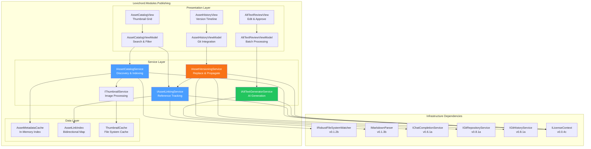
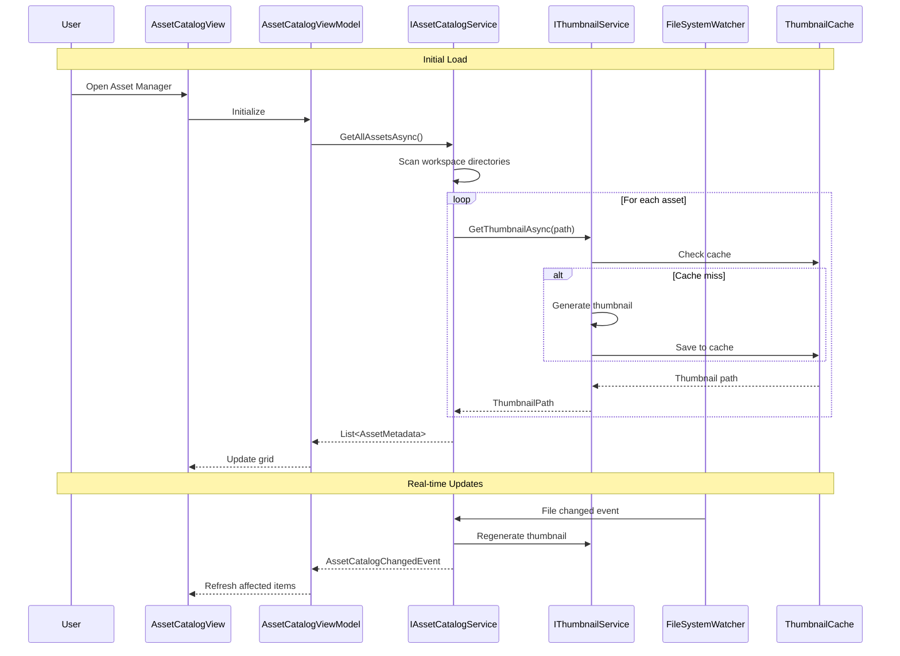
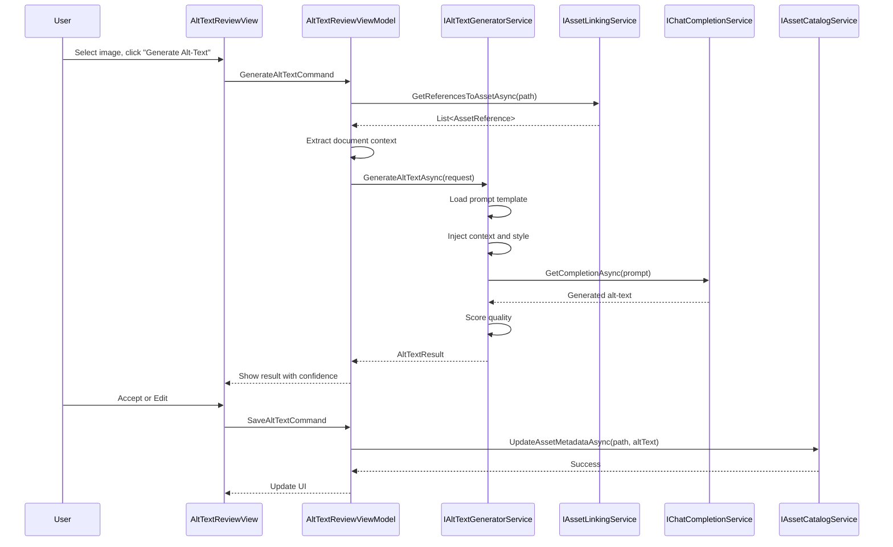
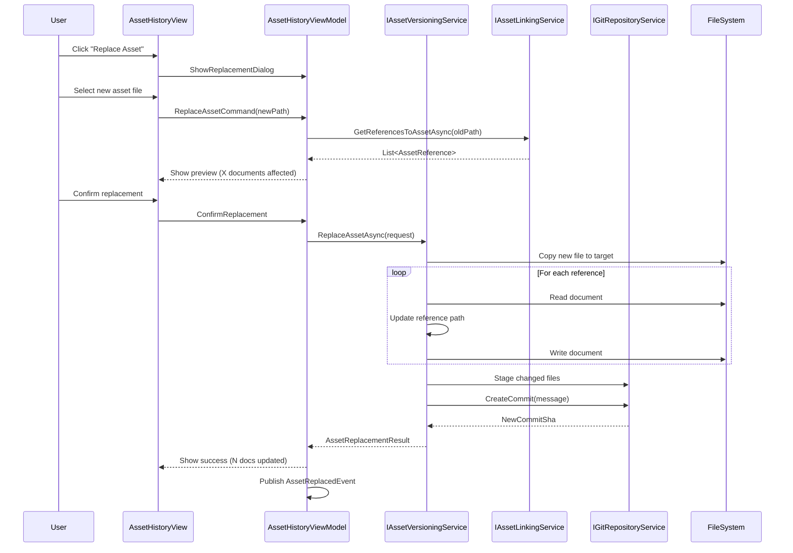

# LCS-SBD-083: Scope Breakdown — Asset Manager

## Document Control

| Field            | Value                                    |
| :--------------- | :--------------------------------------- |
| **Document ID**  | LCS-SBD-083                              |
| **Version**      | v0.8.3                                   |
| **Codename**     | Asset Manager (The Prop Room)            |
| **Status**       | Draft                                    |
| **Last Updated** | 2026-01-27                               |
| **Owner**        | Lead Architect                           |
| **Depends On**   | v0.8.1 (Repository Reader), v0.8.2 (Commit Browser), v0.1.2b (File Watcher), v0.6.1a (Chat Completion) |

---

## 1. Executive Summary

### 1.1 The Vision

**v0.8.3** delivers the **Asset Manager** — "The Prop Room" for managing images, diagrams, and attachments within your documentation workspace. This release transforms Lexichord from a text-focused writing environment into a comprehensive media-aware documentation platform, enabling technical writers to maintain a centralized media library with full traceability between assets and the documents that reference them.

Modern documentation relies heavily on visual content — screenshots, architecture diagrams, flowcharts, and illustrations. Without proper asset management, writers struggle with orphaned images, broken references, inconsistent alt-text, and version control nightmares when updating visuals across multiple documents. The Asset Manager solves these challenges by providing a unified interface for cataloging, linking, describing, and versioning all media assets.

### 1.2 Business Value

- **Centralized Media Library:** Single source of truth for all images, diagrams, and attachments with thumbnail previews and searchable metadata.
- **Accessibility Compliance:** AI-powered alt-text generation ensures all images have descriptive text for screen readers and accessibility audits.
- **Reference Tracking:** Know exactly which documents use which assets, preventing orphaned files and enabling safe refactoring.
- **Version Control:** Replace an asset once and automatically update all documents that reference it, eliminating manual find-and-replace workflows.
- **Quality Assurance:** Detect missing assets, broken references, and accessibility gaps before publishing.
- **Foundation:** Establishes the media infrastructure for future video embedding, interactive diagram editing, and multi-format export pipelines.

### 1.3 Success Criteria

This release succeeds when:

1. Users can browse all workspace images in a thumbnail gallery with metadata display.
2. The system tracks bidirectional references between assets and Markdown documents.
3. AI generates context-aware alt-text for images with 90%+ user acceptance rate.
4. Asset replacement propagates to all referencing documents automatically.
5. All UI respects license gating (Writer Pro+ for Asset Manager features).

### 1.4 License Gating

The Asset Manager is a **Writer Pro** feature. Lower tiers will see:

- Read-only access to asset metadata (no edit capability)
- "Upgrade to Writer Pro" prompt when attempting to add/edit assets
- Alt-text generation buttons disabled with upgrade tooltip
- Asset versioning features hidden entirely

---

## 2. Dependencies on Prior Versions

| Component                  | Source Version | Usage in v0.8.3                                   |
| :------------------------- | :------------- | :------------------------------------------------ |
| `IRobustFileSystemWatcher` | v0.1.2b        | Monitor workspace for new/changed assets          |
| `IMarkdownParser`          | v0.1.3b        | Parse documents to extract image references       |
| `IChatCompletionService`   | v0.6.1a        | AI-powered alt-text generation                    |
| `IPromptRenderer`          | v0.6.3b        | Template rendering for alt-text prompts           |
| `IPromptTemplateRepository`| v0.6.4a        | Store alt-text generation templates               |
| `IGitRepositoryService`    | v0.8.1a        | Track asset versions in Git history               |
| `IGitHistoryService`       | v0.8.1a        | Query asset change history                        |
| `IRegionManager`           | v0.1.1b        | Panel registration for Asset Browser              |
| `ISettingsService`         | v0.1.6a        | Store user preferences for asset management       |
| `ILicenseContext`          | v0.0.4c        | Feature gating for Writer Pro tier                |
| `IMediator`                | v0.0.7a        | Event publishing for asset operations             |
| `Serilog`                  | v0.0.3b        | Logging asset operations                          |

---

## 3. Sub-Part Specifications

### 3.1 v0.8.3a: Image Catalog

| Field            | Value                                     |
| :--------------- | :---------------------------------------- |
| **Sub-Part ID**  | PUB-083a                                  |
| **Title**        | Image Catalog (Thumbnail Gallery)         |
| **Module**       | `Lexichord.Modules.Publishing`            |
| **License Tier** | Writer Pro                                |

**Goal:** Create a centralized media library with thumbnail gallery view, metadata display, and search/filter capabilities for all workspace assets.

**Key Deliverables:**

- `AssetCatalogView.axaml` with virtualized thumbnail grid
- `AssetCatalogViewModel` with `ObservableCollection<AssetViewModel>`
- `IAssetCatalogService` interface for asset discovery and indexing
- `AssetCatalogService` implementation with file system scanning
- `AssetMetadata` record for storing image properties
- Thumbnail generation pipeline with caching
- Search and filter by name, type, dimensions, and date
- Context menu for asset operations (open, copy path, view references)
- Unit tests for catalog service

**Key Interfaces:**

```csharp
public interface IAssetCatalogService
{
    Task<IReadOnlyList<AssetMetadata>> GetAllAssetsAsync(CancellationToken ct = default);
    Task<AssetMetadata?> GetAssetAsync(string assetPath, CancellationToken ct = default);
    Task RefreshCatalogAsync(CancellationToken ct = default);
    Task<IReadOnlyList<AssetMetadata>> SearchAssetsAsync(AssetSearchQuery query, CancellationToken ct = default);
    IObservable<AssetCatalogChangedEvent> CatalogChanges { get; }
}

public record AssetMetadata(
    string Id,
    string FileName,
    string RelativePath,
    string AbsolutePath,
    AssetType Type,
    long FileSizeBytes,
    int? Width,
    int? Height,
    string? MimeType,
    DateTime CreatedAt,
    DateTime ModifiedAt,
    string? AltText,
    IReadOnlyList<string> Tags,
    string? ThumbnailPath
);

public enum AssetType { Image, Diagram, Attachment, Video, Unknown }

public record AssetSearchQuery(
    string? NameFilter = null,
    AssetType? TypeFilter = null,
    int? MinWidth = null,
    int? MaxWidth = null,
    DateTime? ModifiedAfter = null,
    IReadOnlyList<string>? Tags = null
);
```

**Key UI Components:**

```text
+------------------------------------------------------------------------+
|  Asset Manager                                    [Search...] [Refresh] |
+------------------------------------------------------------------------+
| Filter: [All Types v] [All Sizes v] [Sort: Name v]     [Grid] [List]   |
+------------------------------------------------------------------------+
| +----------+  +----------+  +----------+  +----------+  +----------+   |
| |          |  |          |  |          |  |          |  |          |   |
| | [thumb]  |  | [thumb]  |  | [thumb]  |  | [thumb]  |  | [thumb]  |   |
| |          |  |          |  |          |  |          |  |          |   |
| +----------+  +----------+  +----------+  +----------+  +----------+   |
| screenshot1   diagram.svg   logo.png      flow.mmd      arch.png       |
| 1920x1080     800x600       256x256       1200x800      2400x1600      |
| 2 refs        5 refs        12 refs       1 ref         0 refs         |
+------------------------------------------------------------------------+
| Selected: screenshot1.png | 245 KB | PNG | Created: 2026-01-15         |
+------------------------------------------------------------------------+
```

**Thumbnail Generation Logic:**

```text
GENERATE thumbnail FOR asset:
│
├── Check thumbnail cache
│   ├── Cache HIT → RETURN cached thumbnail
│   └── Cache MISS → Continue
│
├── Determine asset type
│   ├── Image (PNG, JPG, GIF, WebP) → Use image library
│   ├── SVG → Render to bitmap
│   ├── Mermaid (.mmd) → Render via Mermaid CLI
│   └── Other → Use generic icon
│
├── Resize to thumbnail dimensions (150x150 max)
├── Save to cache directory
└── RETURN thumbnail path
```

**Storage Location:**

- Thumbnail Cache:
  - Windows: `%APPDATA%/Lexichord/cache/thumbnails/`
  - macOS: `~/Library/Caches/Lexichord/thumbnails/`
  - Linux: `~/.cache/Lexichord/thumbnails/`

**Dependencies:**

- v0.1.2b: `IRobustFileSystemWatcher` (detect new/changed assets)
- v0.1.1b: `IRegionManager` (panel registration)

---

### 3.2 v0.8.3b: Asset Linking

| Field            | Value                                     |
| :--------------- | :---------------------------------------- |
| **Sub-Part ID**  | PUB-083b                                  |
| **Title**        | Asset Linking (Reference Tracking)        |
| **Module**       | `Lexichord.Modules.Publishing`            |
| **License Tier** | Writer Pro                                |

**Goal:** Track bidirectional references between assets and documents, enabling reference counting, orphan detection, and safe asset operations.

**Key Deliverables:**

- `IAssetLinkingService` interface for reference tracking
- `AssetLinkingService` implementation with Markdown parsing
- `AssetReference` record for storing link information
- `DocumentAssetMap` for bidirectional lookups
- Orphan asset detection (assets with zero references)
- Broken reference detection (references to missing assets)
- Reference list view for selected asset
- Document list view showing all asset references
- Real-time reference updates on document save
- Unit tests for linking service

**Key Interfaces:**

```csharp
public interface IAssetLinkingService
{
    Task<IReadOnlyList<AssetReference>> GetReferencesToAssetAsync(
        string assetPath, CancellationToken ct = default);

    Task<IReadOnlyList<AssetReference>> GetAssetReferencesInDocumentAsync(
        string documentPath, CancellationToken ct = default);

    Task<IReadOnlyList<AssetMetadata>> GetOrphanedAssetsAsync(CancellationToken ct = default);

    Task<IReadOnlyList<BrokenReference>> GetBrokenReferencesAsync(CancellationToken ct = default);

    Task RebuildIndexAsync(CancellationToken ct = default);

    IObservable<AssetLinkChangedEvent> LinkChanges { get; }
}

public record AssetReference(
    string AssetPath,
    string DocumentPath,
    int LineNumber,
    int ColumnNumber,
    string RawReference,
    AssetReferenceType Type,
    string? AltText
);

public enum AssetReferenceType { MarkdownImage, HtmlImage, MarkdownLink, Include }

public record BrokenReference(
    string DocumentPath,
    int LineNumber,
    string ReferencedPath,
    string Reason
);

public record AssetLinkChangedEvent(
    string AssetPath,
    AssetLinkChangeType ChangeType,
    IReadOnlyList<AssetReference> AffectedReferences
);

public enum AssetLinkChangeType { ReferenceAdded, ReferenceRemoved, AssetMoved, AssetDeleted }
```

**Reference Detection Logic:**

```text
PARSE document FOR asset references:
│
├── Parse Markdown AST
│
├── Find image nodes: 
│   └── Extract: path, alt text, line number
│
├── Find HTML image tags: 
│   └── Extract: src, alt, line number
│
├── Find link nodes pointing to assets: [text](path.png)
│   └── Extract: path, text, line number
│
├── Find include directives: 
│   └── Extract: path, line number
│
└── RETURN list of AssetReference records
```

**Bidirectional Index Structure:**

```text
ASSET INDEX (Asset → Documents):
├── /images/screenshot1.png
│   ├── /docs/getting-started.md:15
│   └── /docs/installation.md:42
│
├── /diagrams/architecture.svg
│   ├── /docs/overview.md:8
│   ├── /docs/design.md:23
│   └── /docs/design.md:89
│
└── /images/orphan.png
    └── (no references)

DOCUMENT INDEX (Document → Assets):
├── /docs/getting-started.md
│   ├── /images/screenshot1.png:15
│   └── /images/logo.png:3
│
└── /docs/overview.md
    └── /diagrams/architecture.svg:8
```

**Dependencies:**

- v0.8.3a: `IAssetCatalogService` (asset discovery)
- v0.1.3b: `IMarkdownParser` (parse documents for references)
- v0.1.2b: `IRobustFileSystemWatcher` (detect document changes)

---

### 3.3 v0.8.3c: Alt-Text Generator

| Field            | Value                                     |
| :--------------- | :---------------------------------------- |
| **Sub-Part ID**  | PUB-083c                                  |
| **Title**        | Alt-Text Generator (AI Accessibility)     |
| **Module**       | `Lexichord.Modules.Publishing`            |
| **License Tier** | Writer Pro                                |

**Goal:** Provide AI-powered alt-text generation for images to ensure accessibility compliance, with context-aware descriptions based on surrounding document content.

**Key Deliverables:**

- `IAltTextGeneratorService` interface for alt-text generation
- `AltTextGeneratorService` implementation using vision-capable LLM
- `AltTextPromptTemplate` for customizable generation prompts
- Batch alt-text generation for multiple images
- Context extraction from surrounding document text
- Alt-text quality scoring and suggestions
- User review and edit workflow
- Alt-text persistence to asset metadata
- Accessibility audit report generation
- Unit tests for generator service

**Key Interfaces:**

```csharp
public interface IAltTextGeneratorService
{
    Task<AltTextResult> GenerateAltTextAsync(
        AltTextRequest request, CancellationToken ct = default);

    Task<IReadOnlyList<AltTextResult>> GenerateBatchAltTextAsync(
        IReadOnlyList<AltTextRequest> requests, CancellationToken ct = default);

    Task<AccessibilityAuditResult> AuditAccessibilityAsync(
        string workspacePath, CancellationToken ct = default);
}

public record AltTextRequest(
    string AssetPath,
    string? DocumentContext = null,
    string? ExistingAltText = null,
    AltTextStyle Style = AltTextStyle.Descriptive,
    int MaxLength = 125
);

public enum AltTextStyle { Descriptive, Functional, Decorative, Complex }

public record AltTextResult(
    string AssetPath,
    string GeneratedAltText,
    float ConfidenceScore,
    IReadOnlyList<string> AlternativeSuggestions,
    string? Warning
);

public record AccessibilityAuditResult(
    int TotalImages,
    int ImagesWithAltText,
    int ImagesWithEmptyAltText,
    int ImagesMissingAltText,
    int DecorativeImages,
    IReadOnlyList<AccessibilityIssue> Issues,
    float OverallScore
);

public record AccessibilityIssue(
    string AssetPath,
    string DocumentPath,
    int LineNumber,
    AccessibilityIssueType Type,
    string Description,
    string Suggestion
);

public enum AccessibilityIssueType
{
    MissingAltText,
    EmptyAltText,
    AltTextTooLong,
    AltTextTooShort,
    GenericAltText,
    FileNameAsAltText
}
```

**Alt-Text Generation Prompt Template:**

```yaml
template_id: "alt-text-generator"
system_prompt: |
  You are an accessibility expert generating alt-text for images in technical documentation.

  Guidelines:
  1. Describe the image content concisely (under {{max_length}} characters)
  2. Focus on information conveyed, not visual appearance
  3. For screenshots: Describe the UI state and relevant elements
  4. For diagrams: Describe the relationships and flow
  5. For code snippets: Describe what the code demonstrates
  6. Avoid starting with "Image of..." or "Picture of..."
  7. Include relevant text visible in the image

  {{#document_context}}
  The image appears in this context:
  {{document_context}}
  {{/document_context}}

  {{#style_rules}}
  Style: {{style_rules}}
  {{/style_rules}}

user_prompt: |
  Generate alt-text for this image: {{image_path}}

  {{#existing_alt}}
  Current alt-text (improve if needed): {{existing_alt}}
  {{/existing_alt}}

  Provide a concise, descriptive alt-text.
```

**Alt-Text Quality Scoring:**

```text
SCORE alt-text quality:
│
├── Length check (10-125 chars ideal)
│   ├── < 10 chars → -20 points (too short)
│   ├── 10-125 chars → +20 points (optimal)
│   └── > 125 chars → -10 points (too long)
│
├── Generic phrase check
│   ├── Contains "image of" → -15 points
│   ├── Contains "picture of" → -15 points
│   └── Is filename → -25 points
│
├── Relevance to context
│   └── Contains context keywords → +15 points
│
├── Descriptive quality
│   ├── Contains action verbs → +10 points
│   └── Contains specific details → +10 points
│
└── RETURN score (0-100)
```

**Dependencies:**

- v0.8.3a: `IAssetCatalogService` (asset metadata)
- v0.8.3b: `IAssetLinkingService` (document context)
- v0.6.1a: `IChatCompletionService` (LLM for generation)
- v0.6.3b: `IPromptRenderer` (template rendering)

---

### 3.4 v0.8.3d: Asset Versioning

| Field            | Value                                     |
| :--------------- | :---------------------------------------- |
| **Sub-Part ID**  | PUB-083d                                  |
| **Title**        | Asset Versioning (Replace and Propagate)  |
| **Module**       | `Lexichord.Modules.Publishing`            |
| **License Tier** | Writer Pro                                |

**Goal:** Enable asset replacement with automatic propagation to all referencing documents, with version history tracking via Git integration.

**Key Deliverables:**

- `IAssetVersioningService` interface for version management
- `AssetVersioningService` implementation with Git integration
- Asset replacement workflow with preview
- Automatic reference update in all documents
- Version history view with diff visualization
- Rollback capability to previous asset versions
- Rename asset with reference updates
- Move asset with reference updates
- Bulk asset operations (replace multiple)
- Unit tests for versioning service

**Key Interfaces:**

```csharp
public interface IAssetVersioningService
{
    Task<AssetVersion> GetCurrentVersionAsync(
        string assetPath, CancellationToken ct = default);

    Task<IReadOnlyList<AssetVersion>> GetVersionHistoryAsync(
        string assetPath, CancellationToken ct = default);

    Task<AssetReplacementResult> ReplaceAssetAsync(
        AssetReplacementRequest request, CancellationToken ct = default);

    Task<AssetRenameResult> RenameAssetAsync(
        string oldPath, string newPath, CancellationToken ct = default);

    Task<AssetMoveResult> MoveAssetAsync(
        string sourcePath, string destinationPath, CancellationToken ct = default);

    Task<RollbackResult> RollbackToVersionAsync(
        string assetPath, string commitSha, CancellationToken ct = default);
}

public record AssetVersion(
    string AssetPath,
    string CommitSha,
    string CommitMessage,
    DateTime CommittedAt,
    string Author,
    long FileSizeBytes,
    string? ThumbnailPath
);

public record AssetReplacementRequest(
    string TargetAssetPath,
    string NewAssetSourcePath,
    bool UpdateReferences = true,
    bool PreserveAltText = true,
    string? CommitMessage = null
);

public record AssetReplacementResult(
    bool Success,
    string? ErrorMessage,
    int DocumentsUpdated,
    IReadOnlyList<UpdatedReference> UpdatedReferences,
    string? NewCommitSha
);

public record UpdatedReference(
    string DocumentPath,
    int LineNumber,
    string OldReference,
    string NewReference
);

public record AssetRenameResult(
    bool Success,
    string? ErrorMessage,
    string OldPath,
    string NewPath,
    int ReferencesUpdated,
    IReadOnlyList<UpdatedReference> UpdatedReferences
);

public record AssetMoveResult(
    bool Success,
    string? ErrorMessage,
    string OldPath,
    string NewPath,
    int ReferencesUpdated,
    IReadOnlyList<UpdatedReference> UpdatedReferences
);

public record RollbackResult(
    bool Success,
    string? ErrorMessage,
    string RestoredFromCommit,
    string? NewCommitSha
);
```

**Asset Replacement Workflow:**

```text
REPLACE asset:
│
├── Validate new asset file exists
│
├── Get all references to target asset
│   └── From IAssetLinkingService
│
├── Preview changes
│   ├── Show current vs new asset (side-by-side)
│   ├── List all documents to be updated
│   └── Confirm with user
│
├── Execute replacement
│   ├── Copy new asset to target location
│   ├── FOR EACH referencing document:
│   │   ├── Update reference path (if changed)
│   │   ├── Preserve existing alt-text (if requested)
│   │   └── Save document
│   │
│   ├── Update asset metadata cache
│   ├── Regenerate thumbnail
│   └── Publish AssetReplacedEvent
│
├── IF Git repository:
│   ├── Stage all changed files
│   └── Create commit (optional)
│
└── RETURN AssetReplacementResult
```

**Reference Update Logic:**

```text
UPDATE references IN document:
│
├── Parse document as text (preserve formatting)
│
├── FOR EACH reference to old asset:
│   ├── Calculate new relative path
│   ├── Replace old path with new path
│   └── Track change for result
│
├── Write updated document
│
└── Publish DocumentModifiedEvent
```

**Version History View:**

```text
+------------------------------------------------------------------------+
|  Asset Version History: screenshot1.png                                 |
+------------------------------------------------------------------------+
| [Current]  abc1234  "Updated screenshot for v2.0"  2026-01-27  J. Doe  |
|            +----------+                                                 |
|            | [thumb]  |  Size: 245 KB  |  Dimensions: 1920x1080         |
|            +----------+                                                 |
+------------------------------------------------------------------------+
|            def5678  "Initial screenshot"           2026-01-15  J. Doe  |
|            +----------+                                                 |
|            | [thumb]  |  Size: 198 KB  |  Dimensions: 1280x720          |
|            +----------+                                        [Restore]|
+------------------------------------------------------------------------+
```

**Dependencies:**

- v0.8.3a: `IAssetCatalogService` (asset metadata)
- v0.8.3b: `IAssetLinkingService` (reference tracking)
- v0.8.1a: `IGitRepositoryService` (Git operations)
- v0.8.1a: `IGitHistoryService` (version history)

---

## 4. Implementation Checklist

| #  | Sub-Part | Task                                                      | Est. Hours |
| :- | :------- | :-------------------------------------------------------- | :--------- |
| 1  | v0.8.3a  | Define `IAssetCatalogService` interface                   | 1          |
| 2  | v0.8.3a  | Implement `AssetCatalogService` with file scanning        | 3          |
| 3  | v0.8.3a  | Create `AssetMetadata` record and related DTOs            | 1          |
| 4  | v0.8.3a  | Implement thumbnail generation pipeline                   | 3          |
| 5  | v0.8.3a  | Create `AssetCatalogView.axaml` with thumbnail grid       | 4          |
| 6  | v0.8.3a  | Create `AssetCatalogViewModel` with search/filter         | 3          |
| 7  | v0.8.3a  | Implement thumbnail caching system                        | 2          |
| 8  | v0.8.3a  | Unit tests for `AssetCatalogService`                      | 2          |
| 9  | v0.8.3b  | Define `IAssetLinkingService` interface                   | 1          |
| 10 | v0.8.3b  | Implement Markdown reference parser                       | 3          |
| 11 | v0.8.3b  | Implement bidirectional index data structure              | 2          |
| 12 | v0.8.3b  | Implement `AssetLinkingService`                           | 3          |
| 13 | v0.8.3b  | Create reference list view component                      | 2          |
| 14 | v0.8.3b  | Implement orphan/broken reference detection               | 2          |
| 15 | v0.8.3b  | Unit tests for `AssetLinkingService`                      | 2          |
| 16 | v0.8.3c  | Define `IAltTextGeneratorService` interface               | 1          |
| 17 | v0.8.3c  | Create alt-text prompt templates                          | 2          |
| 18 | v0.8.3c  | Implement `AltTextGeneratorService` with LLM integration  | 4          |
| 19 | v0.8.3c  | Implement batch alt-text generation                       | 2          |
| 20 | v0.8.3c  | Create alt-text review/edit UI                            | 3          |
| 21 | v0.8.3c  | Implement accessibility audit report                      | 2          |
| 22 | v0.8.3c  | Unit tests for `AltTextGeneratorService`                  | 2          |
| 23 | v0.8.3d  | Define `IAssetVersioningService` interface                | 1          |
| 24 | v0.8.3d  | Implement asset replacement workflow                      | 4          |
| 25 | v0.8.3d  | Implement reference update logic                          | 3          |
| 26 | v0.8.3d  | Implement rename/move with reference updates              | 3          |
| 27 | v0.8.3d  | Create version history view with Git integration          | 3          |
| 28 | v0.8.3d  | Implement rollback functionality                          | 2          |
| 29 | v0.8.3d  | Create asset replacement preview UI                       | 2          |
| 30 | v0.8.3d  | Unit tests for `AssetVersioningService`                   | 2          |
| 31 | All      | Integration tests for full asset workflow                 | 3          |
| 32 | All      | DI registration in `PublishingModule.cs`                  | 1          |
| **Total** |   |                                                           | **73 hours** |

---

## 5. Dependency Matrix

### 5.1 Required Interfaces (from earlier versions)

| Interface                  | Source Version | Purpose                              |
| :------------------------- | :------------- | :----------------------------------- |
| `IRobustFileSystemWatcher` | v0.1.2b        | Monitor workspace for asset changes  |
| `IMarkdownParser`          | v0.1.3b        | Parse documents for image references |
| `IChatCompletionService`   | v0.6.1a        | AI-powered alt-text generation       |
| `IPromptRenderer`          | v0.6.3b        | Render prompt templates              |
| `IGitRepositoryService`    | v0.8.1a        | Git repository access                |
| `IGitHistoryService`       | v0.8.1a        | Query file version history           |
| `IRegionManager`           | v0.1.1b        | Register Asset Manager panel         |
| `ILicenseContext`          | v0.0.4c        | Writer Pro feature gating            |

### 5.2 New Interfaces (defined in v0.8.3)

| Interface                   | Defined In | Module                      | Purpose                      |
| :-------------------------- | :--------- | :-------------------------- | :--------------------------- |
| `IAssetCatalogService`      | v0.8.3a    | Modules.Publishing          | Asset discovery and indexing |
| `IAssetLinkingService`      | v0.8.3b    | Modules.Publishing          | Reference tracking           |
| `IAltTextGeneratorService`  | v0.8.3c    | Modules.Publishing          | AI alt-text generation       |
| `IAssetVersioningService`   | v0.8.3d    | Modules.Publishing          | Version management           |
| `IThumbnailService`         | v0.8.3a    | Modules.Publishing          | Thumbnail generation         |

### 5.3 New Records/DTOs (defined in v0.8.3)

| Record                     | Defined In | Purpose                                |
| :------------------------- | :--------- | :------------------------------------- |
| `AssetMetadata`            | v0.8.3a    | Store asset properties and metadata    |
| `AssetSearchQuery`         | v0.8.3a    | Filter parameters for asset search     |
| `AssetReference`           | v0.8.3b    | Track document-to-asset references     |
| `BrokenReference`          | v0.8.3b    | Identify broken asset links            |
| `AltTextRequest`           | v0.8.3c    | Alt-text generation request            |
| `AltTextResult`            | v0.8.3c    | Alt-text generation result             |
| `AccessibilityAuditResult` | v0.8.3c    | Accessibility compliance report        |
| `AssetVersion`             | v0.8.3d    | Asset version metadata                 |
| `AssetReplacementRequest`  | v0.8.3d    | Asset replacement parameters           |
| `AssetReplacementResult`   | v0.8.3d    | Asset replacement outcome              |

### 5.4 NuGet Packages

| Package              | Version | Purpose                         | New/Existing |
| :------------------- | :------ | :------------------------------ | :----------- |
| `SixLabors.ImageSharp` | 3.x   | Image processing and thumbnails | **New**      |
| `Svg`                | 3.x     | SVG rendering                   | **New**      |
| `Markdig`            | 0.34.x  | Markdown parsing                | Existing     |
| `LibGit2Sharp`       | 0.30.x  | Git integration                 | Existing     |

---

## 6. Architecture Diagram



---

## 7. Data Flow Diagram

### 7.1 Asset Discovery Flow



### 7.2 Alt-Text Generation Flow



### 7.3 Asset Replacement Flow



---

## 8. Risks & Mitigations

| Risk | Impact | Probability | Mitigation |
| :--- | :----- | :---------- | :--------- |
| Large workspace with thousands of images causes slow startup | High | Medium | Implement lazy loading, background indexing, and progressive thumbnail generation |
| Alt-text generation quality varies by image type | Medium | Medium | Provide specialized prompts for screenshots vs diagrams vs photos; allow user editing |
| Reference updates corrupt document formatting | High | Low | Parse and update references without reformatting; maintain backup before changes |
| Git operations fail mid-replacement | High | Low | Implement transaction-like rollback; stage all changes before commit |
| Thumbnail generation fails for exotic formats | Low | Medium | Provide fallback generic icon; log unsupported formats for future support |
| Vision model unavailable or rate-limited | Medium | Medium | Queue requests with retry logic; cache generated alt-text; provide manual fallback |
| Circular references in include directives | Low | Low | Detect cycles during indexing; report error to user |
| License bypass through direct file modification | Low | Low | All operations go through licensed services; file watcher triggers re-validation |

---

## 9. Success Metrics

| Metric | Target | Measurement |
| :----- | :----- | :---------- |
| Initial catalog load (1000 images) | < 5s | Stopwatch timing |
| Thumbnail generation (single image) | < 200ms | Async operation timing |
| Reference index rebuild | < 10s for 500 documents | Background task timing |
| Alt-text generation (single image) | < 3s | LLM response timing |
| Alt-text user acceptance rate | > 90% | Track accept vs edit ratio |
| Asset replacement (10 documents) | < 2s | Operation timing |
| Memory usage (1000 assets indexed) | < 100MB | Memory profiler |
| Orphan detection accuracy | 100% | Verify against manual check |
| Broken reference detection accuracy | 100% | Verify against manual check |

---

## 10. What This Enables

After v0.8.3, Lexichord will support:

- **v0.8.4 (Comparison View):** Diff visualization can now include asset changes, showing before/after thumbnails.
- **v0.8.5 (Static Site Bridge):** Asset catalog integrates with MkDocs/Docusaurus image optimization and path resolution.
- **v0.8.6 (PDF Exporter):** Asset metadata provides alt-text for PDF accessibility compliance.
- **v0.9.x:** Video asset support, interactive diagram editing, and multi-resolution image generation.
- **Future:** CDN integration for asset hosting, automatic image optimization, and collaborative asset libraries.

---

## 11. Decision Trees

### 11.1 Asset Type Classification

```text
START: "Determine asset type from file"
│
├── Extension check
│   ├── .png, .jpg, .jpeg, .gif, .webp, .bmp → Image
│   ├── .svg → Diagram (vector)
│   ├── .mmd, .mermaid → Diagram (Mermaid)
│   ├── .drawio, .excalidraw → Diagram (interactive)
│   ├── .pdf → Attachment
│   ├── .mp4, .webm, .mov → Video
│   └── Other → Unknown
│
└── RETURN AssetType
```

### 11.2 Should Generate Alt-Text?

```text
START: "Check if alt-text generation needed"
│
├── Asset already has alt-text?
│   ├── YES → Return existing (unless force regenerate)
│   └── NO → Continue
│
├── Asset type is Image or Diagram?
│   ├── NO → SKIP (not applicable)
│   └── YES → Continue
│
├── Asset marked as decorative?
│   ├── YES → SKIP (decorative images use empty alt)
│   └── NO → Continue
│
├── Vision-capable model available?
│   ├── NO → Return error (manual entry required)
│   └── YES → GENERATE
│
└── RETURN should_generate decision
```

### 11.3 Reference Update Strategy

```text
START: "Asset path changed, update references"
│
├── Get all references to old path
│   └── NO references → Done (no updates needed)
│
├── FOR EACH referencing document:
│   │
│   ├── Calculate new relative path from document to asset
│   │
│   ├── Reference format?
│   │   ├── Markdown:  → Update path
│   │   ├── HTML:  → Update src
│   │   └── Include:  → Update path
│   │
│   └── Save document with updated reference
│
└── RETURN list of updated documents
```

---

## 12. User Stories

| ID    | Role              | Story                                                                                | Acceptance Criteria                    |
| :---- | :---------------- | :----------------------------------------------------------------------------------- | :------------------------------------- |
| US-01 | Technical Writer  | As a writer, I want to browse all images in my workspace so I can find assets quickly. | Thumbnail gallery displays all images with search. |
| US-02 | Technical Writer  | As a writer, I want to see which documents use an image so I can update them safely. | Reference list shows all documents with line numbers. |
| US-03 | Technical Writer  | As a writer, I want AI to generate alt-text for accessibility compliance. | Alt-text generated with 90%+ acceptance rate. |
| US-04 | Technical Writer  | As a writer, I want to replace an image and have all documents update automatically. | Single replacement updates all N references. |
| US-05 | Documentation Lead| As a lead, I want to audit accessibility gaps in our documentation. | Audit report shows images missing alt-text. |
| US-06 | Technical Writer  | As a writer, I want to find orphaned images that are no longer used. | Orphan list shows assets with zero references. |
| US-07 | Technical Writer  | As a writer, I want to rollback an image to a previous version if needed. | Version history shows commits with restore option. |
| US-08 | Technical Writer  | As a writer, I want to rename an image and have references update automatically. | Rename propagates to all referencing documents. |

---

## 13. Use Cases

### UC-01: Browse and Search Assets

**Preconditions:**

- User has opened a workspace with images
- User has Writer Pro license or higher

**Flow:**

1. User clicks "Asset Manager" in sidebar.
2. System scans workspace for assets and displays thumbnail grid.
3. User types "diagram" in search box.
4. System filters to show only assets with "diagram" in filename or path.
5. User clicks on an asset.
6. System shows metadata panel with size, dimensions, references.
7. User right-clicks and selects "Open in Explorer".
8. System opens file location.

**Postconditions:**

- Asset catalog remains indexed for fast subsequent access.

---

### UC-02: Generate Alt-Text for Multiple Images

**Preconditions:**

- User has images without alt-text
- Vision-capable LLM is configured

**Flow:**

1. User selects multiple images in catalog.
2. User clicks "Generate Alt-Text" button.
3. System queues images for batch processing.
4. For each image:
   - System extracts document context from references.
   - System sends image + context to LLM.
   - System receives generated alt-text.
5. System displays review dialog with all generated alt-text.
6. User reviews, edits if needed, and clicks "Accept All".
7. System saves alt-text to asset metadata.

**Postconditions:**

- All selected images have alt-text stored in metadata.
- Alt-text appears in reference count tooltip.

---

### UC-03: Replace Image Across Documentation

**Preconditions:**

- User has an outdated screenshot used in multiple documents
- User has a new screenshot ready

**Flow:**

1. User selects outdated image in catalog.
2. User clicks "Replace" button.
3. System shows file picker dialog.
4. User selects new image file.
5. System shows preview:
   - Old image thumbnail vs new image thumbnail
   - List of 5 documents that will be updated
6. User clicks "Confirm Replacement".
7. System:
   - Copies new image to old image location
   - Updates references in all 5 documents
   - Regenerates thumbnail
   - Creates Git commit (if enabled)
8. System shows success message: "Replaced screenshot1.png, updated 5 documents".

**Postconditions:**

- New image is in place of old image.
- All documents reference the new image.
- Git history shows the change.

---

## 14. Unit Testing Requirements

### 14.1 AssetCatalogService Tests

```csharp
[Trait("Category", "Unit")]
[Trait("Version", "v0.8.3a")]
public class AssetCatalogServiceTests
{
    [Fact]
    public async Task GetAllAssetsAsync_WorkspaceWithImages_ReturnsAllAssets()
    {
        // Arrange
        var workspace = CreateTestWorkspace(imageCount: 10);
        var sut = new AssetCatalogService(workspace);

        // Act
        var result = await sut.GetAllAssetsAsync();

        // Assert
        result.Should().HaveCount(10);
        result.Should().AllSatisfy(a => a.Type.Should().Be(AssetType.Image));
    }

    [Fact]
    public async Task SearchAssetsAsync_FilterByName_ReturnsMatchingAssets()
    {
        // Arrange
        var sut = CreateCatalogWithAssets("logo.png", "banner.png", "icon.svg");
        var query = new AssetSearchQuery(NameFilter: "logo");

        // Act
        var result = await sut.SearchAssetsAsync(query);

        // Assert
        result.Should().ContainSingle(a => a.FileName == "logo.png");
    }

    [Theory]
    [InlineData(".png", AssetType.Image)]
    [InlineData(".jpg", AssetType.Image)]
    [InlineData(".svg", AssetType.Diagram)]
    [InlineData(".mmd", AssetType.Diagram)]
    [InlineData(".pdf", AssetType.Attachment)]
    public async Task GetAssetAsync_DifferentExtensions_ReturnsCorrectType(
        string extension, AssetType expectedType)
    {
        // Arrange
        var sut = CreateCatalogWithAssets($"test{extension}");

        // Act
        var result = await sut.GetAssetAsync($"test{extension}");

        // Assert
        result.Should().NotBeNull();
        result!.Type.Should().Be(expectedType);
    }
}
```

### 14.2 AssetLinkingService Tests

```csharp
[Trait("Category", "Unit")]
[Trait("Version", "v0.8.3b")]
public class AssetLinkingServiceTests
{
    [Fact]
    public async Task GetReferencesToAssetAsync_ImageUsedInMultipleDocs_ReturnsAllReferences()
    {
        // Arrange
        var workspace = CreateWorkspaceWithDocuments(
            ("doc1.md", ""),
            ("doc2.md", "See our  for branding")
        );
        var sut = new AssetLinkingService(workspace);

        // Act
        var result = await sut.GetReferencesToAssetAsync("images/logo.png");

        // Assert
        result.Should().HaveCount(2);
        result.Should().Contain(r => r.DocumentPath.EndsWith("doc1.md"));
        result.Should().Contain(r => r.DocumentPath.EndsWith("doc2.md"));
    }

    [Fact]
    public async Task GetOrphanedAssetsAsync_AssetWithNoReferences_ReturnsAsOrphan()
    {
        // Arrange
        var workspace = CreateWorkspaceWithAssets("used.png", "orphan.png");
        var documents = new[] { ("doc.md", "") };
        var sut = new AssetLinkingService(workspace, documents);

        // Act
        var result = await sut.GetOrphanedAssetsAsync();

        // Assert
        result.Should().ContainSingle(a => a.FileName == "orphan.png");
    }

    [Fact]
    public async Task GetBrokenReferencesAsync_ReferenceToMissingFile_ReturnsBrokenReference()
    {
        // Arrange
        var documents = new[] { ("doc.md", "") };
        var sut = new AssetLinkingService(CreateEmptyWorkspace(), documents);

        // Act
        var result = await sut.GetBrokenReferencesAsync();

        // Assert
        result.Should().ContainSingle();
        result[0].ReferencedPath.Should().Be("missing.png");
    }
}
```

---

## 15. Observability & Logging

| Level   | Source                  | Message Template                                                       |
| :------ | :---------------------- | :--------------------------------------------------------------------- |
| Debug   | AssetCatalogService     | `"Scanning directory for assets: {Directory}"`                         |
| Info    | AssetCatalogService     | `"Asset catalog loaded: {AssetCount} assets in {ElapsedMs}ms"`         |
| Debug   | ThumbnailService        | `"Generating thumbnail for: {AssetPath}"`                              |
| Warning | ThumbnailService        | `"Thumbnail generation failed for {AssetPath}: {Error}"`               |
| Info    | AssetLinkingService     | `"Reference index built: {DocumentCount} docs, {ReferenceCount} refs"` |
| Debug   | AssetLinkingService     | `"Found {Count} references to asset: {AssetPath}"`                     |
| Info    | AltTextGeneratorService | `"Generated alt-text for {AssetPath}: confidence={Confidence}"`        |
| Warning | AltTextGeneratorService | `"Alt-text quality score below threshold: {Score} for {AssetPath}"`    |
| Info    | AssetVersioningService  | `"Replaced asset {AssetPath}, updated {DocumentCount} documents"`      |
| Error   | AssetVersioningService  | `"Asset replacement failed: {Error}"`                                  |

---

## 16. UI/UX Specifications

### 16.1 Asset Manager Layout

```text
+------------------------------------------------------------------------+
|  Asset Manager                                           [?] [_] [x]   |
+------------------------------------------------------------------------+
| [+ Import] [Refresh] | [Search assets...              ] | [Grid][List] |
+------------------------------------------------------------------------+
| Filter: [All Types v] | [All Sizes v] | [Sort: Modified v]             |
+------------------------------------------------------------------------+
| +----------+  +----------+  +----------+  +----------+  +----------+   |
| |          |  |          |  |          |  |          |  |          |   |
| | [thumb]  |  | [thumb]  |  | [thumb]  |  | [thumb]  |  | [thumb]  |   |
| |    x     |  |          |  |          |  |          |  |    !     |   |
| +----------+  +----------+  +----------+  +----------+  +----------+   |
| screenshot1   diagram.svg   logo.png      flow.mmd      orphan.png     |
| 1920x1080     800x600       256x256       1200x800      512x512        |
| 5 refs        3 refs        12 refs       1 ref         0 refs         |
+------------------------------------------------------------------------+
| +----------+  +----------+  +----------+  +----------+  +----------+   |
| |          |  |          |  |          |  |          |  |          |   |
| | [thumb]  |  | [thumb]  |  | [thumb]  |  | [thumb]  |  | [thumb]  |   |
| |          |  |          |  |          |  |          |  |          |   |
| +----------+  +----------+  +----------+  +----------+  +----------+   |
| banner.jpg    arch.png      setup.gif     config.svg    hero.webp      |
+------------------------------------------------------------------------+
| SELECTED: screenshot1.png                                               |
| Path: /images/screenshots/screenshot1.png                               |
| Size: 245 KB | Dimensions: 1920x1080 | Created: 2026-01-15             |
| Alt-Text: "Lexichord main editor window showing markdown preview"       |
| References: 5 documents                             [View References]   |
+------------------------------------------------------------------------+
| [Generate Alt-Text] [Replace Asset] [Rename] [Delete]                   |
+------------------------------------------------------------------------+
```

### 16.2 Reference List Panel

```text
+------------------------------------------------------------------------+
|  References to: screenshot1.png                              [x]        |
+------------------------------------------------------------------------+
| /docs/getting-started.md                                      Line 15   |
| >                  |
| > The main window shows the editor...                                   |
+------------------------------------------------------------------------+
| /docs/tutorials/first-project.md                              Line 42   |
| >      |
| > When you first open Lexichord...                                      |
+------------------------------------------------------------------------+
| /docs/features/editor.md                                      Line 8    |
| >            |
| > The editor panel provides...                                          |
+------------------------------------------------------------------------+
|                                                   [Open All] [Close]    |
+------------------------------------------------------------------------+
```

### 16.3 Component Styling Requirements

| Component           | Theme Resource             | Notes                            |
| :------------------ | :------------------------- | :------------------------------- |
| Thumbnail Grid      | `Brush.Surface.Secondary`  | Card background for thumbnails   |
| Selected Thumbnail  | `Brush.Accent.Primary`     | 2px border when selected         |
| Orphan Badge        | `Brush.Warning`            | Yellow "!" indicator             |
| Missing Alt Badge   | `Brush.Error`              | Red "x" indicator                |
| Reference Count     | `Brush.Text.Secondary`     | Subtle gray text                 |
| Action Buttons      | `LexButtonPrimary` theme   | Generate, Replace, Rename        |
| Delete Button       | `LexButtonDanger` theme    | Red destructive action           |

---

## 17. Acceptance Criteria (QA)

| #   | Category            | Criterion                                                                    |
| :-- | :------------------ | :--------------------------------------------------------------------------- |
| 1   | **[Catalog]**       | All PNG, JPG, GIF, SVG, WebP files in workspace appear in catalog.           |
| 2   | **[Catalog]**       | Thumbnails load within 200ms per image after initial generation.             |
| 3   | **[Catalog]**       | Search by filename filters results in real-time.                             |
| 4   | **[Linking]**       | Reference count matches actual occurrences in documents.                     |
| 5   | **[Linking]**       | Orphaned assets (0 references) are visually indicated.                       |
| 6   | **[Linking]**       | Broken references (missing files) are detected and reported.                 |
| 7   | **[Alt-Text]**      | AI generates alt-text for images with document context.                      |
| 8   | **[Alt-Text]**      | Generated alt-text is under 125 characters by default.                       |
| 9   | **[Alt-Text]**      | Batch generation processes 10 images in under 30 seconds.                    |
| 10  | **[Versioning]**    | Asset replacement updates all referencing documents.                         |
| 11  | **[Versioning]**    | Rename updates all references to use new filename.                           |
| 12  | **[Versioning]**    | Version history shows Git commits for asset.                                 |
| 13  | **[License Gate]**  | Core users see read-only catalog; edit buttons show upgrade prompt.          |
| 14  | **[Performance]**   | Catalog with 1000 images loads in under 5 seconds.                           |
| 15  | **[Accessibility]** | All UI components are keyboard navigable.                                    |

---

## 18. Verification Commands

```bash
# ═══════════════════════════════════════════════════════════════════════════
# v0.8.3 Verification
# ═══════════════════════════════════════════════════════════════════════════

# 1. Verify NuGet packages installed
dotnet list src/Lexichord.Modules.Publishing package | grep -E "ImageSharp|Svg"

# 2. Build solution
dotnet build

# 3. Run unit tests for v0.8.3a (Image Catalog)
dotnet test --filter "Category=Unit&Version=v0.8.3a" --logger "console;verbosity=detailed"

# 4. Run unit tests for v0.8.3b (Asset Linking)
dotnet test --filter "Category=Unit&Version=v0.8.3b" --logger "console;verbosity=detailed"

# 5. Run unit tests for v0.8.3c (Alt-Text Generator)
dotnet test --filter "Category=Unit&Version=v0.8.3c" --logger "console;verbosity=detailed"

# 6. Run unit tests for v0.8.3d (Asset Versioning)
dotnet test --filter "Category=Unit&Version=v0.8.3d" --logger "console;verbosity=detailed"

# 7. Run all v0.8.3 tests
dotnet test --filter "Version~v0.8.3" --logger "trx;LogFileName=v083-results.trx"

# 8. Manual verification:
# a) Open Asset Manager panel in a workspace with images
# b) Verify thumbnails display correctly
# c) Select an image and verify reference count
# d) Generate alt-text for an image without existing alt-text
# e) Replace an image and verify all references update
```

---

## 19. Deliverable Checklist

| #  | Deliverable                                                    | Status |
| :- | :------------------------------------------------------------- | :----- |
| 1  | `IAssetCatalogService` interface definition                    | [ ]    |
| 2  | `AssetCatalogService` implementation                           | [ ]    |
| 3  | `AssetCatalogView.axaml` with thumbnail grid                   | [ ]    |
| 4  | `AssetCatalogViewModel` with search/filter logic               | [ ]    |
| 5  | `IThumbnailService` with caching                               | [ ]    |
| 6  | `IAssetLinkingService` interface definition                    | [ ]    |
| 7  | `AssetLinkingService` with Markdown parsing                    | [ ]    |
| 8  | Bidirectional reference index                                  | [ ]    |
| 9  | `IAltTextGeneratorService` interface definition                | [ ]    |
| 10 | `AltTextGeneratorService` with LLM integration                 | [ ]    |
| 11 | Alt-text prompt templates                                      | [ ]    |
| 12 | `AltTextReviewView.axaml` for batch review                     | [ ]    |
| 13 | `IAssetVersioningService` interface definition                 | [ ]    |
| 14 | `AssetVersioningService` with Git integration                  | [ ]    |
| 15 | Asset replacement workflow with preview                        | [ ]    |
| 16 | `AssetHistoryView.axaml` for version timeline                  | [ ]    |
| 17 | Unit tests for all services                                    | [ ]    |
| 18 | Integration tests for full asset workflow                      | [ ]    |
| 19 | DI registration in `PublishingModule.cs`                       | [ ]    |
| 20 | SixLabors.ImageSharp NuGet package added                       | [ ]    |

---

## 20. Code Examples

### 20.1 AssetMetadata Record

```csharp
namespace Lexichord.Modules.Publishing.Models;

/// <summary>
/// Represents metadata for a media asset in the workspace.
/// Includes dimensions, file information, and accessibility metadata.
/// </summary>
public record AssetMetadata
{
    /// <summary>Unique identifier for the asset (hash of path).</summary>
    public required string Id { get; init; }

    /// <summary>File name including extension.</summary>
    public required string FileName { get; init; }

    /// <summary>Path relative to workspace root.</summary>
    public required string RelativePath { get; init; }

    /// <summary>Absolute file system path.</summary>
    public required string AbsolutePath { get; init; }

    /// <summary>Classified asset type (Image, Diagram, etc.).</summary>
    public AssetType Type { get; init; } = AssetType.Unknown;

    /// <summary>File size in bytes.</summary>
    public long FileSizeBytes { get; init; }

    /// <summary>Image width in pixels (null for non-images).</summary>
    public int? Width { get; init; }

    /// <summary>Image height in pixels (null for non-images).</summary>
    public int? Height { get; init; }

    /// <summary>MIME type (e.g., "image/png").</summary>
    public string? MimeType { get; init; }

    /// <summary>File creation timestamp.</summary>
    public DateTime CreatedAt { get; init; }

    /// <summary>Last modification timestamp.</summary>
    public DateTime ModifiedAt { get; init; }

    /// <summary>Accessibility alt-text description.</summary>
    public string? AltText { get; init; }

    /// <summary>User-assigned tags for categorization.</summary>
    public IReadOnlyList<string> Tags { get; init; } = [];

    /// <summary>Path to cached thumbnail image.</summary>
    public string? ThumbnailPath { get; init; }

    /// <summary>Number of documents referencing this asset.</summary>
    public int ReferenceCount { get; init; }

    /// <summary>Whether the asset has no references (orphaned).</summary>
    public bool IsOrphaned => ReferenceCount == 0;

    /// <summary>Whether the asset is missing required alt-text.</summary>
    public bool IsMissingAltText =>
        Type is AssetType.Image or AssetType.Diagram &&
        string.IsNullOrWhiteSpace(AltText);
}
```

### 20.2 IAssetCatalogService Interface

```csharp
namespace Lexichord.Abstractions.Contracts;

/// <summary>
/// Service for discovering, indexing, and searching media assets in a workspace.
/// Provides centralized catalog of all images, diagrams, and attachments.
/// </summary>
public interface IAssetCatalogService
{
    /// <summary>
    /// Gets all assets in the workspace.
    /// </summary>
    /// <param name="ct">Cancellation token.</param>
    /// <returns>List of all asset metadata.</returns>
    Task<IReadOnlyList<AssetMetadata>> GetAllAssetsAsync(
        CancellationToken ct = default);

    /// <summary>
    /// Gets metadata for a specific asset by path.
    /// </summary>
    /// <param name="assetPath">Relative or absolute path to asset.</param>
    /// <param name="ct">Cancellation token.</param>
    /// <returns>Asset metadata if found, null otherwise.</returns>
    Task<AssetMetadata?> GetAssetAsync(
        string assetPath,
        CancellationToken ct = default);

    /// <summary>
    /// Refreshes the catalog by rescanning the workspace.
    /// </summary>
    /// <param name="ct">Cancellation token.</param>
    Task RefreshCatalogAsync(CancellationToken ct = default);

    /// <summary>
    /// Searches assets using the specified query parameters.
    /// </summary>
    /// <param name="query">Search query with filters.</param>
    /// <param name="ct">Cancellation token.</param>
    /// <returns>Filtered list of matching assets.</returns>
    Task<IReadOnlyList<AssetMetadata>> SearchAssetsAsync(
        AssetSearchQuery query,
        CancellationToken ct = default);

    /// <summary>
    /// Updates metadata for an asset (e.g., alt-text, tags).
    /// </summary>
    /// <param name="assetPath">Path to asset.</param>
    /// <param name="updates">Metadata updates to apply.</param>
    /// <param name="ct">Cancellation token.</param>
    Task UpdateAssetMetadataAsync(
        string assetPath,
        AssetMetadataUpdate updates,
        CancellationToken ct = default);

    /// <summary>
    /// Observable stream of catalog change events.
    /// </summary>
    IObservable<AssetCatalogChangedEvent> CatalogChanges { get; }
}
```

### 20.3 AltTextGeneratorService Implementation

```csharp
namespace Lexichord.Modules.Publishing.Services;

/// <summary>
/// AI-powered alt-text generator using vision-capable LLM.
/// </summary>
[RequiresLicense(LicenseTier.WriterPro)]
public class AltTextGeneratorService(
    IChatCompletionService chatService,
    IPromptRenderer promptRenderer,
    IPromptTemplateRepository templates,
    IAssetLinkingService linkingService,
    ILogger<AltTextGeneratorService> logger) : IAltTextGeneratorService
{
    private const string TemplateId = "alt-text-generator";

    public async Task<AltTextResult> GenerateAltTextAsync(
        AltTextRequest request,
        CancellationToken ct = default)
    {
        logger.LogDebug("Generating alt-text for {AssetPath}", request.AssetPath);

        // Extract document context if not provided
        var context = request.DocumentContext;
        if (string.IsNullOrEmpty(context))
        {
            context = await ExtractDocumentContextAsync(request.AssetPath, ct);
        }

        // Load and render prompt template
        var template = await templates.GetTemplateAsync(TemplateId, ct);
        var prompt = await promptRenderer.RenderAsync(template, new Dictionary<string, object>
        {
            ["image_path"] = request.AssetPath,
            ["max_length"] = request.MaxLength,
            ["document_context"] = context ?? "",
            ["existing_alt"] = request.ExistingAltText ?? "",
            ["style_rules"] = GetStyleRules(request.Style)
        });

        // Call vision-capable model with image
        var response = await chatService.GetCompletionWithVisionAsync(
            prompt,
            request.AssetPath,
            ct);

        // Parse and score result
        var altText = response.Content.Trim();
        var score = ScoreAltTextQuality(altText, context);

        logger.LogInformation(
            "Generated alt-text for {AssetPath}: confidence={Score}",
            request.AssetPath, score);

        return new AltTextResult(
            AssetPath: request.AssetPath,
            GeneratedAltText: altText,
            ConfidenceScore: score,
            AlternativeSuggestions: [],
            Warning: score < 0.7f ? "Low confidence - manual review recommended" : null
        );
    }

    private float ScoreAltTextQuality(string altText, string? context)
    {
        var score = 0.5f;

        // Length scoring
        if (altText.Length >= 10 && altText.Length <= 125)
            score += 0.2f;
        else if (altText.Length < 10)
            score -= 0.2f;
        else if (altText.Length > 125)
            score -= 0.1f;

        // Generic phrase penalties
        if (altText.StartsWith("image of", StringComparison.OrdinalIgnoreCase))
            score -= 0.15f;
        if (altText.StartsWith("picture of", StringComparison.OrdinalIgnoreCase))
            score -= 0.15f;

        // Context relevance bonus
        if (!string.IsNullOrEmpty(context))
        {
            var contextWords = context.Split(' ', StringSplitOptions.RemoveEmptyEntries);
            var matchCount = contextWords.Count(w =>
                altText.Contains(w, StringComparison.OrdinalIgnoreCase));
            if (matchCount > 2)
                score += 0.15f;
        }

        return Math.Clamp(score, 0f, 1f);
    }

    private async Task<string?> ExtractDocumentContextAsync(
        string assetPath, CancellationToken ct)
    {
        var references = await linkingService.GetReferencesToAssetAsync(assetPath, ct);
        if (references.Count == 0)
            return null;

        // Get surrounding text from first reference
        var firstRef = references[0];
        // Extract ~100 chars before and after the reference
        return $"Used in {firstRef.DocumentPath} near line {firstRef.LineNumber}";
    }

    private static string GetStyleRules(AltTextStyle style) => style switch
    {
        AltTextStyle.Descriptive => "Describe what is visible in the image",
        AltTextStyle.Functional => "Describe the purpose or function of the image",
        AltTextStyle.Complex => "Provide detailed description for complex diagrams",
        AltTextStyle.Decorative => "Return empty string for decorative images",
        _ => "Describe the image concisely"
    };
}
```

---

## 21. Deferred Features

| Feature                      | Deferred To | Reason                                         |
| :--------------------------- | :---------- | :--------------------------------------------- |
| Video asset support          | v0.9.x      | Requires additional video processing libraries |
| Interactive diagram editing  | v0.9.x      | Complex feature requiring dedicated editor     |
| CDN upload integration       | v0.9.x      | Requires cloud infrastructure setup            |
| Image optimization (resize)  | v0.8.6      | Integrate with PDF export pipeline             |
| Collaborative asset library  | v1.0.x      | Teams feature requiring server sync            |
| Asset analytics (usage stats)| v0.9.x      | Lower priority than core functionality         |

---

## 22. Changelog Entry

Upon completion of v0.8.3, the following entry will be added to `CHANGELOG.md`:

```markdown
## [0.8.3] - 2026-XX-XX

### Added

- **Asset Manager (The Prop Room)**: Centralized media library for images, diagrams, and attachments
- **Image Catalog**: Thumbnail gallery with search, filter, and metadata display
- **Asset Linking**: Bidirectional reference tracking between assets and documents
- **Alt-Text Generator**: AI-powered accessibility descriptions with document context awareness
- **Asset Versioning**: Replace images with automatic reference propagation
- **Orphan Detection**: Identify unused assets in the workspace
- **Broken Reference Detection**: Find missing asset links in documents
- **Accessibility Audit**: Report on images missing alt-text

### Changed

- Markdown parser now extracts image references for linking service
- File system watcher monitors asset directories for changes

### Dependencies

- Added: SixLabors.ImageSharp 3.x for image processing and thumbnails
- Added: Svg 3.x for SVG rendering to thumbnails

### Technical

- `IAssetCatalogService` for asset discovery and indexing
- `IAssetLinkingService` for bidirectional reference tracking
- `IAltTextGeneratorService` for AI-powered alt-text generation
- `IAssetVersioningService` for replacement and version history
- `IThumbnailService` for thumbnail generation and caching
- `AssetMetadata` record for comprehensive asset information
```

---
