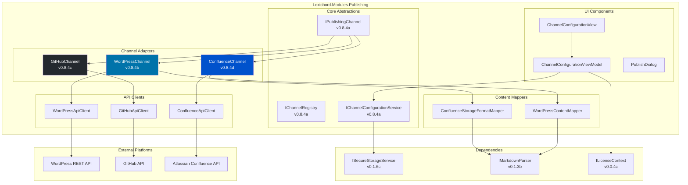
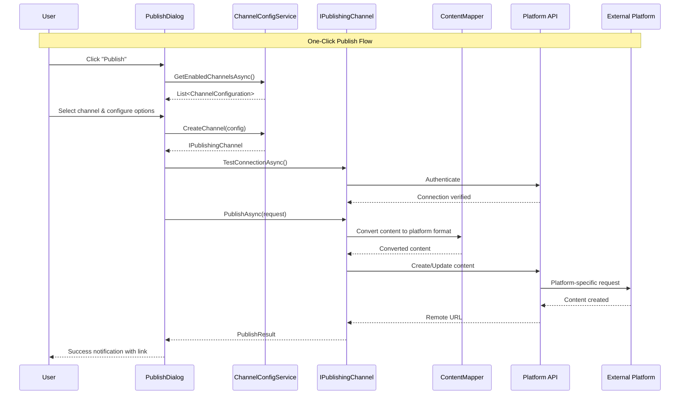

# LCS-DES-084: Design Specification Index — Publication Channels

## Document Control

| Field | Value |
| :--- | :--- |
| **Document ID** | LCS-DES-084-INDEX |
| **Feature ID** | PUB-084 |
| **Feature Name** | Publication Channels |
| **Target Version** | v0.8.4 |
| **Module Scope** | Lexichord.Modules.Publishing |
| **Swimlane** | Publisher |
| **License Tier** | Teams |
| **Feature Gate Key** | FeatureFlags.Publishing.Channels |
| **Status** | Draft |
| **Last Updated** | 2026-01-27 |

---

## 1. Executive Summary

**v0.8.4** delivers the **Publication Channels** — a distribution network enabling direct publish to external platforms including WordPress, GitHub, and Confluence.

### 1.1 The Problem

Technical writers using Lexichord must currently export their documentation and manually upload or copy content to various publishing platforms. This workflow is:

- Time-consuming with multiple context switches
- Error-prone when copying content between systems
- Difficult to maintain consistency across platforms
- Lacking in audit trail for what was published where

### 1.2 The Solution

Implement a unified publishing system that:

1. **Configures Channels** — Define publishing destinations with secure credential management
2. **Adapts Content** — Transform Markdown to platform-specific formats
3. **Publishes Directly** — One-click push to WordPress, GitHub, or Confluence
4. **Supports Workflows** — Create PRs for review or direct publish based on permissions

### 1.3 Business Value

| Value | Description |
| :--- | :--- |
| **Workflow Efficiency** | Eliminate context-switching between Lexichord and publishing platforms |
| **Multi-Platform Distribution** | Publish to WordPress, GitHub, and Confluence from a single interface |
| **Credential Security** | OAuth and API key management with OS-native secure storage |
| **Version Control Integration** | GitHub PR workflow for documentation reviews |
| **Enterprise Collaboration** | Confluence integration for team documentation |
| **Foundation** | Extensible adapter pattern for future publishing integrations |

---

## 2. Related Documents

### 2.1 Scope Breakdown Document

The detailed scope breakdown for v0.8.4, including all sub-parts, implementation checklists, user stories, and acceptance criteria:

| Document | Description |
| :--- | :--- |
| **[LCS-SBD-084](./LCS-SBD-084.md)** | Scope Breakdown — Publication Channels |

### 2.2 Sub-Part Design Specifications

Each sub-part has its own detailed design specification following the LDS-01 template:

| Sub-Part | Document | Title | Description |
| :--- | :--- | :--- | :--- |
| v0.8.4a | **[LCS-DES-084a](./LCS-DES-084a.md)** | Channel Configuration | OAuth, API keys, secure credential storage |
| v0.8.4b | **[LCS-DES-084b](./LCS-DES-084b.md)** | WordPress Adapter | REST API integration for WordPress publishing |
| v0.8.4c | **[LCS-DES-084c](./LCS-DES-084c.md)** | GitHub Adapter | Push to repo, create PRs for review workflows |
| v0.8.4d | **[LCS-DES-084d](./LCS-DES-084d.md)** | Confluence Adapter | Atlassian API integration for Confluence spaces |

---

## 3. Architecture Overview

### 3.1 Component Diagram



### 3.2 Publishing Flow



---

## 4. Dependencies

### 4.1 Upstream Dependencies

| Interface | Source Version | Purpose |
| :--- | :--- | :--- |
| `IGitRepositoryService` | v0.8.1a | Repository context for GitHub publishing |
| `IGitHistoryService` | v0.8.1a | Branch information for PR creation |
| `IMarkdownParser` | v0.1.3b | Content parsing for format conversion |
| `ISettingsService` | v0.1.6a | Channel configuration persistence |
| `ISecureStorageService` | v0.1.6c | Secure credential storage |
| `ILicenseContext` | v0.0.4c | Teams tier feature gating |
| `IMediator` | v0.0.7a | Event publishing |
| `Polly` | v0.0.5d | Retry policies for API calls |

### 4.2 NuGet Packages

| Package | Version | Purpose |
| :--- | :--- | :--- |
| `System.Net.Http.Json` | 9.x | JSON HTTP client extensions |
| `Polly` | 8.x | Resilience and retry policies |
| `System.IdentityModel.Tokens.Jwt` | 7.x | OAuth token parsing (NEW) |
| `Microsoft.Extensions.Http` | 9.x | HttpClientFactory |

### 4.3 Downstream Consumers (Future)

| Version | Feature | Uses From v0.8.4 |
| :--- | :--- | :--- |
| v0.8.5 | Static Site Bridge | Adapter pattern for doc framework publishing |
| v0.9.x | Team Workflows | Channel infrastructure for multi-user approval |
| v1.0.x | Enterprise | SSO integration for channel auth |

---

## 5. License Gating Strategy

Publication Channels is a **Teams** tier feature.

| Tier | Behavior |
| :--- | :--- |
| **Core** | Channel config UI visible but disabled; publish buttons show upgrade prompt |
| **WriterPro** | Same as Core |
| **Teams** | Full access to all channel configuration and publishing features |
| **Enterprise** | Full access plus audit logging for publish operations |

**Feature Gate Key:** `FeatureFlags.Publishing.Channels`

**Implementation:**

```csharp
[RequiresLicense(LicenseTier.Teams)]
public class ChannelConfigurationViewModel : ObservableObject
{
    // All channel operations check license
}

[RequiresLicense(LicenseTier.Teams)]
public class WordPressChannel : IPublishingChannel
{
    // Channel implementation requires Teams tier
}
```

---

## 6. Channel Types Summary

### 6.1 WordPress (v0.8.4b)

| Feature | Support |
| :--- | :--- |
| Authentication | OAuth 2.0 (WordPress.com), Application Password (self-hosted) |
| Content Types | Posts, Pages |
| Metadata | Categories, Tags, Featured Images |
| Capabilities | Create, Update, Delete, Draft, Schedule |

### 6.2 GitHub (v0.8.4c)

| Feature | Support |
| :--- | :--- |
| Authentication | Personal Access Token, GitHub App |
| Content Types | Markdown files, READMEs |
| Workflows | Direct commit, Pull Request |
| Capabilities | Create, Update, Branch protection awareness |

### 6.3 Confluence (v0.8.4d)

| Feature | Support |
| :--- | :--- |
| Authentication | OAuth 2.0 (Cloud), PAT (Data Center) |
| Content Types | Pages, Child Pages |
| Metadata | Labels, Attachments |
| Capabilities | Create, Update, Versioning, Page hierarchy |

---

## 7. Key Interfaces Summary

| Interface | Defined In | Purpose |
| :--- | :--- | :--- |
| `IPublishingChannel` | v0.8.4a | Common channel operations contract |
| `IChannelRegistry` | v0.8.4a | Adapter registration and factory |
| `IChannelConfigurationService` | v0.8.4a | Channel CRUD operations |
| `IWordPressApiClient` | v0.8.4b | WordPress REST API client |
| `IWordPressContentMapper` | v0.8.4b | Markdown to WordPress blocks |
| `IGitHubApiClient` | v0.8.4c | GitHub REST API client |
| `IConfluenceApiClient` | v0.8.4d | Confluence REST API client |
| `IConfluenceStorageFormatMapper` | v0.8.4d | Markdown to Confluence Storage Format |

---

## 8. Implementation Checklist Summary

| Sub-Part | Tasks | Est. Hours |
| :--- | :--- | :--- |
| v0.8.4a | Channel Configuration | 23 |
| v0.8.4b | WordPress Adapter | 20 |
| v0.8.4c | GitHub Adapter | 16 |
| v0.8.4d | Confluence Adapter | 18.5 |
| Integration | Tests, UI, DI | 7 |
| **Total** | | **84 hours** |

See [LCS-SBD-084](./LCS-SBD-084.md) Section 4 for the detailed task breakdown.

---

## 9. Success Criteria Summary

| Category | Criterion | Target |
| :--- | :--- | :--- |
| **Configuration** | Channel setup time | < 2 minutes |
| **WordPress** | Publish latency | < 5 seconds |
| **GitHub** | PR creation latency | < 10 seconds |
| **Confluence** | Publish latency | < 5 seconds |
| **Reliability** | Publish success rate | > 99% |
| **Content Fidelity** | Elements preserved | > 95% |

See [LCS-SBD-084](./LCS-SBD-084.md) Section 9 for full success metrics.

---

## 10. Key Test Scenarios

### 10.1 Channel Configuration

| Scenario | Expected Outcome |
| :--- | :--- |
| Add WordPress channel with OAuth | Credentials stored, status "Connected" |
| Add GitHub channel with PAT | Credentials stored, status "Connected" |
| Test connection with invalid credentials | Status "Auth Required", error message shown |

### 10.2 WordPress Publishing

| Scenario | Expected Outcome |
| :--- | :--- |
| Publish new post | Post created with correct title/content |
| Update existing post | Post updated, version incremented |
| Publish with categories | Categories correctly applied |

### 10.3 GitHub Publishing

| Scenario | Expected Outcome |
| :--- | :--- |
| Publish to unprotected branch | File committed directly |
| Publish to protected branch | PR created with correct metadata |
| Update existing file | Commit updates file, preserves history |

### 10.4 Confluence Publishing

| Scenario | Expected Outcome |
| :--- | :--- |
| Publish new page | Page created in correct space |
| Update existing page | Version incremented, history preserved |
| Publish with code blocks | Code macros correctly generated |

---

## 11. MediatR Events

| Event | Description |
| :--- | :--- |
| `ChannelConfiguredEvent` | New channel added or existing channel updated |
| `ChannelRemovedEvent` | Channel deleted from configuration |
| `ChannelConnectionTestedEvent` | Connection test completed (success or failure) |
| `ContentPublishedEvent` | Content successfully published to channel |
| `ContentPublishFailedEvent` | Publish operation failed |
| `ChannelCredentialsExpiredEvent` | OAuth token or credentials expired |

---

## 12. What This Enables

| Version | Feature | Uses From v0.8.4 |
| :--- | :--- | :--- |
| v0.8.5 | Static Site Bridge | Adapter pattern for MkDocs/Docusaurus |
| v0.9.x | Team Workflows | Multi-user publish approval flows |
| v1.0.x | Enterprise | SSO integration, audit logging |
| Future | Additional Adapters | Medium, Dev.to, GitLab, Notion |

---

## Document History

| Version | Date | Author | Changes |
| :--- | :--- | :--- | :--- |
| 1.0 | 2026-01-27 | Lead Architect | Initial draft |
