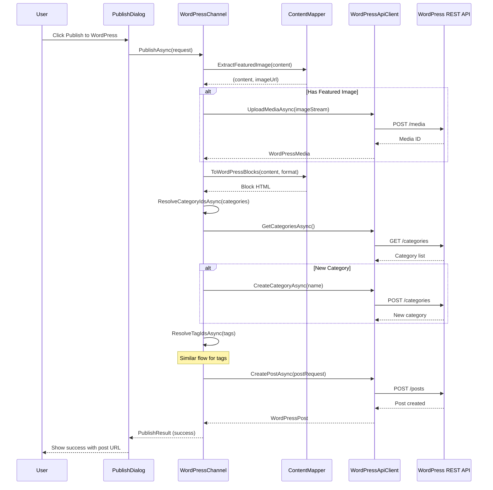

# LCS-DES-084b: Design Specification — WordPress Adapter

## 1. Metadata & Categorization

| Field | Value | Description |
| :--- | :--- | :--- |
| **Feature ID** | `PUB-084b` | Sub-part of PUB-084 |
| **Feature Name** | `WordPress Adapter` | REST API integration for WordPress publishing |
| **Target Version** | `v0.8.4b` | Second sub-part of v0.8.4 |
| **Module Scope** | `Lexichord.Modules.Publishing` | Publishing module |
| **Swimlane** | `Publisher` | Part of Publisher vertical |
| **License Tier** | `Teams` | Teams tier required |
| **Feature Gate Key** | `FeatureFlags.Publishing.WordPress` | License check key |
| **Author** | Lead Architect | |
| **Status** | `Draft` | |
| **Last Updated** | `2026-01-27` | |
| **Parent Document** | [LCS-DES-084-INDEX](./LCS-DES-084-INDEX.md) | |
| **Scope Breakdown** | [LCS-SBD-084 Section 3.2](./LCS-SBD-084.md#32-v084b-wordpress-adapter) | |

---

## 2. Executive Summary

### 2.1 The Requirement

WordPress powers a significant portion of the web, including many technical blogs and documentation sites. Writers using Lexichord need to:

- Publish Markdown content directly to WordPress sites
- Support both WordPress.com and self-hosted WordPress installations
- Manage posts, pages, categories, and tags
- Upload featured images and inline media
- Work with drafts and scheduled publishing

### 2.2 The Proposed Solution

Implement a WordPress adapter that:

1. **Implements IPublishingChannel** — Full compliance with the channel abstraction
2. **Uses REST API** — WordPress REST API (v2) for all operations
3. **Supports Both Auth Methods** — OAuth 2.0 for WordPress.com, Application Passwords for self-hosted
4. **Converts Content** — Markdown to WordPress Gutenberg block format
5. **Handles Media** — Upload images referenced in Markdown content

---

## 3. Architecture & Modular Strategy

### 3.1 Dependencies

#### 3.1.1 Upstream Dependencies

| Interface | Source Version | Purpose |
| :--- | :--- | :--- |
| `IPublishingChannel` | v0.8.4a | Channel abstraction to implement |
| `IChannelConfigurationService` | v0.8.4a | Retrieve stored credentials |
| `IMarkdownParser` | v0.1.3b | Parse Markdown for content conversion |
| `ISecureStorageService` | v0.1.6c | Retrieve stored credentials |
| `Polly` | v0.0.5d | Retry policies for API calls |

#### 3.1.2 NuGet Packages

| Package | Version | Purpose |
| :--- | :--- | :--- |
| `System.Net.Http.Json` | 9.x | JSON HTTP client extensions |
| `Polly.Extensions.Http` | 3.x | HTTP-specific retry policies |

### 3.2 Licensing Behavior

Same as parent feature: **Teams** tier required.

---

## 4. Data Contract (The API)

### 4.1 WordPress Channel Implementation

```csharp
namespace Lexichord.Modules.Publishing.WordPress;

/// <summary>
/// WordPress-specific publishing channel implementation.
/// Supports WordPress.com (OAuth) and self-hosted (Application Passwords).
/// </summary>
[RequiresLicense(LicenseTier.Teams)]
public class WordPressChannel : IPublishingChannel
{
    private readonly IWordPressApiClient _apiClient;
    private readonly IWordPressContentMapper _contentMapper;
    private readonly ChannelConfiguration _config;
    private readonly ILogger<WordPressChannel> _logger;

    public Guid ChannelId => _config.ChannelId;
    public string DisplayName => _config.DisplayName;
    public ChannelType Type => ChannelType.WordPress;

    [ObservableProperty]
    private ChannelStatus _status = ChannelStatus.Disconnected;

    public WordPressChannel(
        IWordPressApiClient apiClient,
        IWordPressContentMapper contentMapper,
        ChannelConfiguration config,
        ILogger<WordPressChannel> logger)
    {
        _apiClient = apiClient;
        _contentMapper = contentMapper;
        _config = config;
        _logger = logger;
    }

    public async Task<ChannelConnectionResult> TestConnectionAsync(CancellationToken ct = default)
    {
        try
        {
            _logger.LogDebug("Testing WordPress connection to {Url}", _config.BaseUrl);

            var user = await _apiClient.GetCurrentUserAsync(ct);

            Status = ChannelStatus.Connected;

            var capabilities = new ChannelCapabilities(
                CanCreate: user.Capabilities.Contains("publish_posts"),
                CanUpdate: user.Capabilities.Contains("edit_posts"),
                CanDelete: user.Capabilities.Contains("delete_posts"),
                CanListContent: true,
                SupportsDrafts: true,
                SupportsScheduling: user.Capabilities.Contains("publish_posts"),
                SupportsCategories: true,
                SupportsTags: true);

            _logger.LogInformation(
                "WordPress connection successful for {User} at {Url}",
                user.Username, _config.BaseUrl);

            return new ChannelConnectionResult(
                IsConnected: true,
                ErrorMessage: null,
                Capabilities: capabilities);
        }
        catch (WordPressAuthenticationException ex)
        {
            Status = ChannelStatus.AuthenticationRequired;
            _logger.LogWarning("WordPress authentication failed: {Error}", ex.Message);

            return new ChannelConnectionResult(
                IsConnected: false,
                ErrorMessage: "Authentication failed. Please re-authorize with WordPress.",
                Capabilities: default);
        }
        catch (HttpRequestException ex)
        {
            Status = ChannelStatus.Error;
            _logger.LogError(ex, "WordPress API request failed");

            return new ChannelConnectionResult(
                IsConnected: false,
                ErrorMessage: $"Connection failed: {ex.Message}",
                Capabilities: default);
        }
    }

    public async Task<PublishResult> PublishAsync(
        PublishRequest request,
        CancellationToken ct = default)
    {
        _logger.LogInformation("Publishing to WordPress: {Title}", request.Title);

        // Extract and upload featured image if present
        var (content, featuredImageUrl) = _contentMapper.ExtractFeaturedImage(request.Content);
        int? featuredMediaId = null;

        if (featuredImageUrl is not null)
        {
            var media = await UploadMediaFromUrlAsync(featuredImageUrl, ct);
            featuredMediaId = media?.Id;
        }

        // Convert Markdown to WordPress blocks
        var wpContent = _contentMapper.ToWordPressBlocks(content, request.Format);

        // Resolve categories and tags to IDs
        var categoryIds = await ResolveCategoryIdsAsync(request.Options.Categories, ct);
        var tagIds = await ResolveTagIdsAsync(request.Options.Tags, ct);

        var postRequest = new WordPressPostRequest
        {
            Title = request.Title,
            Content = wpContent,
            Status = DetermineStatus(request.Options),
            Date = request.Options.ScheduledPublishTime,
            FeaturedMedia = featuredMediaId,
            Categories = categoryIds,
            Tags = tagIds
        };

        var post = await _apiClient.CreatePostAsync(postRequest, ct);

        _logger.LogInformation("Published to WordPress: {PostId} at {Url}", post.Id, post.Link);

        return new PublishResult(
            Success: true,
            RemoteId: post.Id.ToString(),
            RemoteUrl: post.Link,
            ErrorMessage: null,
            PublishedAt: post.DateGmt);
    }

    public async Task<PublishResult> UpdateAsync(
        UpdateRequest request,
        CancellationToken ct = default)
    {
        if (!int.TryParse(request.RemoteId, out var postId))
        {
            return new PublishResult(
                Success: false,
                RemoteId: request.RemoteId,
                RemoteUrl: null,
                ErrorMessage: "Invalid post ID format",
                PublishedAt: default);
        }

        _logger.LogInformation("Updating WordPress post: {PostId}", postId);

        var wpContent = _contentMapper.ToWordPressBlocks(request.Content, request.Format);

        var postRequest = new WordPressPostRequest
        {
            Title = request.Title,
            Content = wpContent
        };

        var post = await _apiClient.UpdatePostAsync(postId, postRequest, ct);

        _logger.LogInformation("Updated WordPress post: {PostId}", postId);

        return new PublishResult(
            Success: true,
            RemoteId: post.Id.ToString(),
            RemoteUrl: post.Link,
            ErrorMessage: null,
            PublishedAt: post.ModifiedGmt);
    }

    public async Task<RemoteContentInfo?> GetRemoteContentAsync(
        string remoteId,
        CancellationToken ct = default)
    {
        if (!int.TryParse(remoteId, out var postId))
            return null;

        var post = await _apiClient.GetPostAsync(postId, ct);

        if (post is null)
            return null;

        return new RemoteContentInfo(
            RemoteId: post.Id.ToString(),
            Title: post.Title,
            RemoteUrl: post.Link,
            CreatedAt: post.DateGmt,
            ModifiedAt: post.ModifiedGmt,
            Author: null, // Would need additional API call
            Status: MapStatus(post.Status));
    }

    private async Task<IReadOnlyList<int>?> ResolveCategoryIdsAsync(
        IReadOnlyList<string>? categoryNames,
        CancellationToken ct)
    {
        if (categoryNames is null || categoryNames.Count == 0)
            return null;

        var existingCategories = await _apiClient.GetCategoriesAsync(ct);
        var result = new List<int>();

        foreach (var name in categoryNames)
        {
            var existing = existingCategories.FirstOrDefault(
                c => c.Name.Equals(name, StringComparison.OrdinalIgnoreCase));

            if (existing is not null)
            {
                result.Add(existing.Id);
            }
            else
            {
                // Create new category
                var newCategory = await _apiClient.CreateCategoryAsync(name, ct: ct);
                result.Add(newCategory.Id);
            }
        }

        return result;
    }

    private async Task<IReadOnlyList<int>?> ResolveTagIdsAsync(
        IReadOnlyList<string>? tagNames,
        CancellationToken ct)
    {
        if (tagNames is null || tagNames.Count == 0)
            return null;

        var existingTags = await _apiClient.GetTagsAsync(ct);
        var result = new List<int>();

        foreach (var name in tagNames)
        {
            var existing = existingTags.FirstOrDefault(
                t => t.Name.Equals(name, StringComparison.OrdinalIgnoreCase));

            if (existing is not null)
            {
                result.Add(existing.Id);
            }
            else
            {
                var newTag = await _apiClient.CreateTagAsync(name, ct: ct);
                result.Add(newTag.Id);
            }
        }

        return result;
    }

    private static string DetermineStatus(PublishOptions options)
    {
        if (options.IsDraft)
            return "draft";
        if (options.ScheduledPublishTime.HasValue && options.ScheduledPublishTime > DateTime.UtcNow)
            return "future";
        return "publish";
    }

    private static ContentStatus MapStatus(string wpStatus) => wpStatus switch
    {
        "publish" => ContentStatus.Published,
        "draft" => ContentStatus.Draft,
        "future" => ContentStatus.Scheduled,
        "trash" => ContentStatus.Deleted,
        _ => ContentStatus.Draft
    };
}
```

### 4.2 WordPress API Client

```csharp
namespace Lexichord.Modules.Publishing.WordPress;

/// <summary>
/// HTTP client for WordPress REST API v2.
/// </summary>
public interface IWordPressApiClient
{
    /// <summary>
    /// Gets the currently authenticated user.
    /// </summary>
    Task<WordPressUser> GetCurrentUserAsync(CancellationToken ct = default);

    /// <summary>
    /// Creates a new post.
    /// </summary>
    Task<WordPressPost> CreatePostAsync(
        WordPressPostRequest request, CancellationToken ct = default);

    /// <summary>
    /// Updates an existing post.
    /// </summary>
    Task<WordPressPost> UpdatePostAsync(
        int postId, WordPressPostRequest request, CancellationToken ct = default);

    /// <summary>
    /// Gets a post by ID.
    /// </summary>
    Task<WordPressPost?> GetPostAsync(int postId, CancellationToken ct = default);

    /// <summary>
    /// Deletes a post.
    /// </summary>
    Task DeletePostAsync(int postId, bool force = false, CancellationToken ct = default);

    /// <summary>
    /// Gets all categories.
    /// </summary>
    Task<IReadOnlyList<WordPressCategory>> GetCategoriesAsync(CancellationToken ct = default);

    /// <summary>
    /// Creates a new category.
    /// </summary>
    Task<WordPressCategory> CreateCategoryAsync(
        string name, string? description = null, int? parentId = null,
        CancellationToken ct = default);

    /// <summary>
    /// Gets all tags.
    /// </summary>
    Task<IReadOnlyList<WordPressTag>> GetTagsAsync(CancellationToken ct = default);

    /// <summary>
    /// Creates a new tag.
    /// </summary>
    Task<WordPressTag> CreateTagAsync(
        string name, string? description = null, CancellationToken ct = default);

    /// <summary>
    /// Uploads media (images, files).
    /// </summary>
    Task<WordPressMedia> UploadMediaAsync(
        Stream fileStream, string fileName, string contentType,
        CancellationToken ct = default);

    /// <summary>
    /// Gets site information.
    /// </summary>
    Task<WordPressSiteInfo> GetSiteInfoAsync(CancellationToken ct = default);
}

/// <summary>
/// Implementation of WordPress API client using HttpClient.
/// </summary>
public class WordPressApiClient : IWordPressApiClient
{
    private readonly HttpClient _httpClient;
    private readonly ChannelConfiguration _config;
    private readonly ISecureChannelCredentialStore _credentialStore;
    private readonly ILogger<WordPressApiClient> _logger;

    public WordPressApiClient(
        HttpClient httpClient,
        ChannelConfiguration config,
        ISecureChannelCredentialStore credentialStore,
        ILogger<WordPressApiClient> logger)
    {
        _httpClient = httpClient;
        _config = config;
        _credentialStore = credentialStore;
        _logger = logger;

        ConfigureHttpClient();
    }

    private void ConfigureHttpClient()
    {
        _httpClient.BaseAddress = new Uri(_config.BaseUrl.TrimEnd('/') + "/wp-json/wp/v2/");
        _httpClient.DefaultRequestHeaders.Accept.Add(
            new MediaTypeWithQualityHeaderValue("application/json"));
    }

    private async Task EnsureAuthenticatedAsync(CancellationToken ct)
    {
        var credentials = await _credentialStore.GetCredentialsAsync(_config.ChannelId, ct);

        if (credentials is null)
            throw new WordPressAuthenticationException("No credentials found for channel");

        switch (_config.AuthType)
        {
            case AuthenticationType.OAuth2:
                if (string.IsNullOrEmpty(credentials.AccessToken))
                    throw new WordPressAuthenticationException("OAuth access token not found");

                _httpClient.DefaultRequestHeaders.Authorization =
                    new AuthenticationHeaderValue("Bearer", credentials.AccessToken);
                break;

            case AuthenticationType.BasicAuth:
                if (string.IsNullOrEmpty(credentials.Username) ||
                    string.IsNullOrEmpty(credentials.Password))
                    throw new WordPressAuthenticationException("Application password not configured");

                var basicAuth = Convert.ToBase64String(
                    Encoding.UTF8.GetBytes($"{credentials.Username}:{credentials.Password}"));
                _httpClient.DefaultRequestHeaders.Authorization =
                    new AuthenticationHeaderValue("Basic", basicAuth);
                break;

            default:
                throw new WordPressAuthenticationException($"Unsupported auth type: {_config.AuthType}");
        }
    }

    public async Task<WordPressUser> GetCurrentUserAsync(CancellationToken ct = default)
    {
        await EnsureAuthenticatedAsync(ct);

        var response = await _httpClient.GetAsync("users/me?context=edit", ct);
        await EnsureSuccessAsync(response, ct);

        return await response.Content.ReadFromJsonAsync<WordPressUser>(ct)
            ?? throw new WordPressApiException("Failed to parse user response");
    }

    public async Task<WordPressPost> CreatePostAsync(
        WordPressPostRequest request,
        CancellationToken ct = default)
    {
        await EnsureAuthenticatedAsync(ct);

        var response = await _httpClient.PostAsJsonAsync("posts", request, ct);
        await EnsureSuccessAsync(response, ct);

        return await response.Content.ReadFromJsonAsync<WordPressPost>(ct)
            ?? throw new WordPressApiException("Failed to parse post response");
    }

    public async Task<WordPressPost> UpdatePostAsync(
        int postId,
        WordPressPostRequest request,
        CancellationToken ct = default)
    {
        await EnsureAuthenticatedAsync(ct);

        var response = await _httpClient.PostAsJsonAsync($"posts/{postId}", request, ct);
        await EnsureSuccessAsync(response, ct);

        return await response.Content.ReadFromJsonAsync<WordPressPost>(ct)
            ?? throw new WordPressApiException("Failed to parse post response");
    }

    public async Task<WordPressPost?> GetPostAsync(int postId, CancellationToken ct = default)
    {
        await EnsureAuthenticatedAsync(ct);

        var response = await _httpClient.GetAsync($"posts/{postId}?context=edit", ct);

        if (response.StatusCode == System.Net.HttpStatusCode.NotFound)
            return null;

        await EnsureSuccessAsync(response, ct);

        return await response.Content.ReadFromJsonAsync<WordPressPost>(ct);
    }

    public async Task<WordPressMedia> UploadMediaAsync(
        Stream fileStream,
        string fileName,
        string contentType,
        CancellationToken ct = default)
    {
        await EnsureAuthenticatedAsync(ct);

        using var content = new StreamContent(fileStream);
        content.Headers.ContentType = new MediaTypeHeaderValue(contentType);
        content.Headers.ContentDisposition = new ContentDispositionHeaderValue("attachment")
        {
            FileName = fileName
        };

        var response = await _httpClient.PostAsync("media", content, ct);
        await EnsureSuccessAsync(response, ct);

        return await response.Content.ReadFromJsonAsync<WordPressMedia>(ct)
            ?? throw new WordPressApiException("Failed to parse media response");
    }

    // Additional methods...

    private async Task EnsureSuccessAsync(HttpResponseMessage response, CancellationToken ct)
    {
        if (response.IsSuccessStatusCode)
            return;

        var errorContent = await response.Content.ReadAsStringAsync(ct);

        if (response.StatusCode == System.Net.HttpStatusCode.Unauthorized ||
            response.StatusCode == System.Net.HttpStatusCode.Forbidden)
        {
            throw new WordPressAuthenticationException(
                $"Authentication failed: {response.StatusCode} - {errorContent}");
        }

        throw new WordPressApiException(
            $"WordPress API error: {response.StatusCode} - {errorContent}");
    }
}
```

### 4.3 Content Mapper

```csharp
namespace Lexichord.Modules.Publishing.WordPress;

/// <summary>
/// Converts Markdown content to WordPress Gutenberg block format.
/// </summary>
public interface IWordPressContentMapper
{
    /// <summary>
    /// Converts content to WordPress Gutenberg block format.
    /// </summary>
    /// <param name="content">Source content.</param>
    /// <param name="sourceFormat">Format of source content.</param>
    /// <returns>WordPress block HTML.</returns>
    string ToWordPressBlocks(string content, ContentFormat sourceFormat);

    /// <summary>
    /// Converts WordPress block content back to Markdown.
    /// </summary>
    /// <param name="blockContent">WordPress block HTML.</param>
    /// <returns>Markdown content.</returns>
    string FromWordPressBlocks(string blockContent);

    /// <summary>
    /// Extracts featured image from content if present.
    /// Looks for image at the start of the document.
    /// </summary>
    /// <param name="content">Content to process.</param>
    /// <returns>Tuple of (content without featured image, featured image URL).</returns>
    (string Content, string? FeaturedImageUrl) ExtractFeaturedImage(string content);
}

public class WordPressContentMapper : IWordPressContentMapper
{
    private readonly IMarkdownParser _markdownParser;
    private readonly ILogger<WordPressContentMapper> _logger;

    public WordPressContentMapper(
        IMarkdownParser markdownParser,
        ILogger<WordPressContentMapper> logger)
    {
        _markdownParser = markdownParser;
        _logger = logger;
    }

    public string ToWordPressBlocks(string content, ContentFormat sourceFormat)
    {
        if (sourceFormat == ContentFormat.Html)
        {
            return WrapInBlocks(content);
        }

        // Parse Markdown to AST
        var ast = _markdownParser.Parse(content);

        var builder = new StringBuilder();

        foreach (var node in ast.Children)
        {
            var block = ConvertNodeToBlock(node);
            if (!string.IsNullOrEmpty(block))
            {
                builder.AppendLine(block);
                builder.AppendLine();
            }
        }

        return builder.ToString().TrimEnd();
    }

    private string ConvertNodeToBlock(MarkdownNode node)
    {
        return node switch
        {
            HeadingNode h => ConvertHeading(h),
            ParagraphNode p => ConvertParagraph(p),
            CodeBlockNode c => ConvertCodeBlock(c),
            ListNode l => ConvertList(l),
            BlockquoteNode b => ConvertBlockquote(b),
            ImageNode i => ConvertImage(i),
            HorizontalRuleNode => "<!-- wp:separator -->\n<hr class=\"wp-block-separator\"/>\n<!-- /wp:separator -->",
            _ => ConvertGeneric(node)
        };
    }

    private static string ConvertHeading(HeadingNode heading)
    {
        var level = heading.Level;
        var content = heading.InnerHtml;

        return $@"<!-- wp:heading {{""level"":{level}}} -->
<h{level}>{content}</h{level}>
<!-- /wp:heading -->";
    }

    private static string ConvertParagraph(ParagraphNode paragraph)
    {
        var content = paragraph.InnerHtml;

        return $@"<!-- wp:paragraph -->
<p>{content}</p>
<!-- /wp:paragraph -->";
    }

    private static string ConvertCodeBlock(CodeBlockNode codeBlock)
    {
        var language = codeBlock.Language ?? "plaintext";
        var escapedCode = System.Security.SecurityElement.Escape(codeBlock.Code);

        return $@"<!-- wp:code -->
<pre class=""wp-block-code""><code class=""language-{language}"">{escapedCode}</code></pre>
<!-- /wp:code -->";
    }

    private string ConvertList(ListNode list)
    {
        var tag = list.IsOrdered ? "ol" : "ul";
        var items = new StringBuilder();

        foreach (var item in list.Items)
        {
            items.AppendLine($"<li>{item.InnerHtml}</li>");
        }

        return $@"<!-- wp:list {{""ordered"":{list.IsOrdered.ToString().ToLower()}}} -->
<{tag}>
{items}</{tag}>
<!-- /wp:list -->";
    }

    private static string ConvertBlockquote(BlockquoteNode blockquote)
    {
        return $@"<!-- wp:quote -->
<blockquote class=""wp-block-quote""><p>{blockquote.InnerHtml}</p></blockquote>
<!-- /wp:quote -->";
    }

    private static string ConvertImage(ImageNode image)
    {
        var alt = image.Alt ?? "";
        var caption = image.Caption ?? "";

        return $@"<!-- wp:image -->
<figure class=""wp-block-image"">{(string.IsNullOrEmpty(caption) ? "" : $"<figcaption>{caption}</figcaption>")}</figure>
<!-- /wp:image -->";
    }

    private string ConvertGeneric(MarkdownNode node)
    {
        // Fallback: render as HTML and wrap in paragraph
        var html = _markdownParser.ToHtml(node);
        return $@"<!-- wp:html -->
{html}
<!-- /wp:html -->";
    }

    public string FromWordPressBlocks(string blockContent)
    {
        // Remove WordPress block comments and convert back to Markdown
        var withoutComments = Regex.Replace(
            blockContent,
            @"<!--\s*/?wp:\w+.*?-->",
            "",
            RegexOptions.Singleline);

        // Convert HTML back to Markdown
        return HtmlToMarkdown(withoutComments);
    }

    public (string Content, string? FeaturedImageUrl) ExtractFeaturedImage(string content)
    {
        // Look for image at the very start of content
        var match = Regex.Match(content, @"^\s*!\[([^\]]*)\]\(([^)]+)\)\s*", RegexOptions.Multiline);

        if (match.Success)
        {
            var imageUrl = match.Groups[2].Value;
            var contentWithoutImage = content.Substring(match.Length);
            return (contentWithoutImage.TrimStart(), imageUrl);
        }

        return (content, null);
    }

    private string WrapInBlocks(string html)
    {
        // Wrap raw HTML in WordPress HTML blocks
        return $@"<!-- wp:html -->
{html}
<!-- /wp:html -->";
    }

    private string HtmlToMarkdown(string html)
    {
        // Simplified HTML to Markdown conversion
        // In production, use a proper library like ReverseMarkdown
        var result = html;

        // Headers
        result = Regex.Replace(result, @"<h1[^>]*>(.+?)</h1>", "# $1\n");
        result = Regex.Replace(result, @"<h2[^>]*>(.+?)</h2>", "## $1\n");
        result = Regex.Replace(result, @"<h3[^>]*>(.+?)</h3>", "### $1\n");

        // Paragraphs
        result = Regex.Replace(result, @"<p[^>]*>(.+?)</p>", "$1\n\n");

        // Bold and italic
        result = Regex.Replace(result, @"<strong>(.+?)</strong>", "**$1**");
        result = Regex.Replace(result, @"<em>(.+?)</em>", "*$1*");

        // Links
        result = Regex.Replace(result, @"<a[^>]*href=""([^""]+)""[^>]*>(.+?)</a>", "[$2]($1)");

        // Code
        result = Regex.Replace(result, @"<code>(.+?)</code>", "`$1`");

        // Strip remaining HTML
        result = Regex.Replace(result, @"<[^>]+>", "");

        return result.Trim();
    }
}
```

---

## 5. Implementation Logic

### 5.1 Publishing Flow



### 5.2 Block Format Conversion Examples

| Markdown | WordPress Gutenberg Blocks |
| :--- | :--- |
| `# Heading` | `<!-- wp:heading {"level":1} --><h1>Heading</h1><!-- /wp:heading -->` |
| `Regular paragraph` | `<!-- wp:paragraph --><p>Regular paragraph</p><!-- /wp:paragraph -->` |
| `` ```python ... ``` `` | `<!-- wp:code --><pre class="wp-block-code"><code class="language-python">...</code></pre><!-- /wp:code -->` |
| `> Quote` | `<!-- wp:quote --><blockquote class="wp-block-quote"><p>Quote</p></blockquote><!-- /wp:quote -->` |
| `` | `<!-- wp:image --><figure class="wp-block-image"></figure><!-- /wp:image -->` |

### 5.3 Authentication Decision Tree

```text
START: "Authenticate to WordPress"
│
├── Is AuthType == OAuth2 (WordPress.com)?
│   ├── YES → Use Bearer token
│   │   ├── Check token expiry
│   │   ├── Refresh if needed
│   │   └── Set Authorization: Bearer {token}
│   │
│   └── NO → Continue
│
├── Is AuthType == BasicAuth (Self-hosted)?
│   └── YES → Use Application Password
│       ├── Combine username:app_password
│       ├── Base64 encode
│       └── Set Authorization: Basic {encoded}
│
└── Unsupported → Throw exception
```

---

## 6. Data Transfer Objects

```csharp
namespace Lexichord.Modules.Publishing.WordPress;

/// <summary>
/// WordPress user information from /users/me endpoint.
/// </summary>
public record WordPressUser(
    [property: JsonPropertyName("id")] int Id,
    [property: JsonPropertyName("username")] string Username,
    [property: JsonPropertyName("name")] string Name,
    [property: JsonPropertyName("email")] string Email,
    [property: JsonPropertyName("capabilities")] IReadOnlyList<string> Capabilities);

/// <summary>
/// WordPress post from /posts endpoint.
/// </summary>
public record WordPressPost(
    [property: JsonPropertyName("id")] int Id,
    [property: JsonPropertyName("title")] WordPressRenderedContent Title,
    [property: JsonPropertyName("content")] WordPressRenderedContent Content,
    [property: JsonPropertyName("excerpt")] WordPressRenderedContent Excerpt,
    [property: JsonPropertyName("status")] string Status,
    [property: JsonPropertyName("link")] string Link,
    [property: JsonPropertyName("date_gmt")] DateTime DateGmt,
    [property: JsonPropertyName("modified_gmt")] DateTime ModifiedGmt,
    [property: JsonPropertyName("author")] int Author,
    [property: JsonPropertyName("featured_media")] int? FeaturedMedia,
    [property: JsonPropertyName("categories")] IReadOnlyList<int> Categories,
    [property: JsonPropertyName("tags")] IReadOnlyList<int> Tags);

/// <summary>
/// WordPress rendered content (contains "rendered" and optionally "raw").
/// </summary>
public record WordPressRenderedContent(
    [property: JsonPropertyName("rendered")] string Rendered,
    [property: JsonPropertyName("raw")] string? Raw);

/// <summary>
/// Request to create or update a WordPress post.
/// </summary>
public class WordPressPostRequest
{
    [JsonPropertyName("title")]
    public string Title { get; init; } = string.Empty;

    [JsonPropertyName("content")]
    public string Content { get; init; } = string.Empty;

    [JsonPropertyName("excerpt")]
    public string? Excerpt { get; init; }

    [JsonPropertyName("status")]
    public string Status { get; init; } = "draft";

    [JsonPropertyName("date")]
    [JsonIgnore(Condition = JsonIgnoreCondition.WhenWritingNull)]
    public DateTime? Date { get; init; }

    [JsonPropertyName("featured_media")]
    [JsonIgnore(Condition = JsonIgnoreCondition.WhenWritingNull)]
    public int? FeaturedMedia { get; init; }

    [JsonPropertyName("categories")]
    [JsonIgnore(Condition = JsonIgnoreCondition.WhenWritingNull)]
    public IReadOnlyList<int>? Categories { get; init; }

    [JsonPropertyName("tags")]
    [JsonIgnore(Condition = JsonIgnoreCondition.WhenWritingNull)]
    public IReadOnlyList<int>? Tags { get; init; }
}

/// <summary>
/// WordPress category.
/// </summary>
public record WordPressCategory(
    [property: JsonPropertyName("id")] int Id,
    [property: JsonPropertyName("name")] string Name,
    [property: JsonPropertyName("slug")] string Slug,
    [property: JsonPropertyName("description")] string Description,
    [property: JsonPropertyName("parent")] int? Parent,
    [property: JsonPropertyName("count")] int Count);

/// <summary>
/// WordPress tag.
/// </summary>
public record WordPressTag(
    [property: JsonPropertyName("id")] int Id,
    [property: JsonPropertyName("name")] string Name,
    [property: JsonPropertyName("slug")] string Slug,
    [property: JsonPropertyName("description")] string Description,
    [property: JsonPropertyName("count")] int Count);

/// <summary>
/// WordPress media item.
/// </summary>
public record WordPressMedia(
    [property: JsonPropertyName("id")] int Id,
    [property: JsonPropertyName("title")] WordPressRenderedContent Title,
    [property: JsonPropertyName("source_url")] string SourceUrl,
    [property: JsonPropertyName("mime_type")] string MimeType,
    [property: JsonPropertyName("media_details")] WordPressMediaDetails Details);

/// <summary>
/// WordPress media details.
/// </summary>
public record WordPressMediaDetails(
    [property: JsonPropertyName("width")] int Width,
    [property: JsonPropertyName("height")] int Height,
    [property: JsonPropertyName("file")] string File);

/// <summary>
/// WordPress site information.
/// </summary>
public record WordPressSiteInfo(
    [property: JsonPropertyName("name")] string Name,
    [property: JsonPropertyName("description")] string Description,
    [property: JsonPropertyName("url")] string Url,
    [property: JsonPropertyName("namespaces")] IReadOnlyList<string> Namespaces);
```

---

## 7. Error Handling

```csharp
namespace Lexichord.Modules.Publishing.WordPress;

/// <summary>
/// Base exception for WordPress operations.
/// </summary>
public class WordPressException : Exception
{
    public WordPressException(string message) : base(message) { }
    public WordPressException(string message, Exception inner) : base(message, inner) { }
}

/// <summary>
/// Authentication-specific WordPress error.
/// </summary>
public class WordPressAuthenticationException : WordPressException
{
    public WordPressAuthenticationException(string message) : base(message) { }
}

/// <summary>
/// API error from WordPress.
/// </summary>
public class WordPressApiException : WordPressException
{
    public int? StatusCode { get; }
    public string? ErrorCode { get; }

    public WordPressApiException(string message, int? statusCode = null, string? errorCode = null)
        : base(message)
    {
        StatusCode = statusCode;
        ErrorCode = errorCode;
    }
}

/// <summary>
/// Rate limit exceeded.
/// </summary>
public class WordPressRateLimitException : WordPressApiException
{
    public TimeSpan? RetryAfter { get; }

    public WordPressRateLimitException(string message, TimeSpan? retryAfter = null)
        : base(message, 429)
    {
        RetryAfter = retryAfter;
    }
}
```

---

## 8. Observability & Logging

| Level | Source | Message Template |
| :--- | :--- | :--- |
| Debug | ApiClient | `"WordPress API request: {Method} {Endpoint}"` |
| Debug | ContentMapper | `"Converting Markdown node: {NodeType}"` |
| Info | Channel | `"Publishing to WordPress: {Title}"` |
| Info | Channel | `"Published: Post ID {PostId} at {Url}"` |
| Info | ApiClient | `"Uploaded media: {MediaId} ({FileName})"` |
| Warning | ApiClient | `"WordPress rate limit approaching: {Remaining} requests"` |
| Warning | Channel | `"Category not found, creating: {CategoryName}"` |
| Error | ApiClient | `"WordPress API error: {StatusCode} - {Message}"` |
| Error | Channel | `"Publish failed: {Error}"` |

---

## 9. Acceptance Criteria

| # | Given | When | Then |
| :--- | :--- | :--- | :--- |
| 1 | WordPress channel configured with OAuth | Testing connection | Status shows "Connected" with capabilities |
| 2 | WordPress channel configured with App Password | Testing connection | Status shows "Connected" |
| 3 | Valid Markdown content | Publishing to WordPress | Post created with correct title and block content |
| 4 | Markdown with code blocks | Publishing | Code blocks converted to WordPress code blocks |
| 5 | Markdown with images | Publishing | Images converted to WordPress image blocks |
| 6 | Categories specified | Publishing | Categories resolved/created and assigned |
| 7 | Tags specified | Publishing | Tags resolved/created and assigned |
| 8 | Draft option selected | Publishing | Post created with "draft" status |
| 9 | Scheduled time specified | Publishing | Post created with "future" status |
| 10 | Existing post ID | Updating | Post content updated, new revision created |
| 11 | Invalid credentials | Testing connection | Status shows "Auth Required" |
| 12 | API returns 429 | Publishing | Retry with exponential backoff |

---

## 10. Deliverable Checklist

| # | Deliverable | Status |
| :--- | :--- | :--- |
| 1 | `WordPressChannel.cs` | [ ] |
| 2 | `IWordPressApiClient.cs` interface | [ ] |
| 3 | `WordPressApiClient.cs` implementation | [ ] |
| 4 | `IWordPressContentMapper.cs` interface | [ ] |
| 5 | `WordPressContentMapper.cs` implementation | [ ] |
| 6 | WordPress DTOs (User, Post, Category, Tag, Media) | [ ] |
| 7 | WordPress exceptions | [ ] |
| 8 | OAuth 2.0 flow for WordPress.com | [ ] |
| 9 | Application Password authentication | [ ] |
| 10 | Unit tests for ContentMapper | [ ] |
| 11 | Unit tests for ApiClient (with mocks) | [ ] |
| 12 | Integration tests (with test site) | [ ] |

---

## 11. Verification Commands

```bash
# Run WordPress adapter unit tests
dotnet test --filter "FullyQualifiedName~WordPress"

# Run content mapper tests
dotnet test --filter "FullyQualifiedName~WordPressContentMapper"

# Run integration tests (requires credentials)
LEXICHORD_TEST_WP_URL=https://test.wordpress.com \
LEXICHORD_TEST_WP_TOKEN=xxx \
dotnet test --filter "Category=Integration&FullyQualifiedName~WordPress"

# Manual verification:
# 1. Configure WordPress channel (OAuth or App Password)
# 2. Test connection - verify success
# 3. Create Markdown document with headings, code, images
# 4. Publish to WordPress
# 5. Verify post appears on WordPress with correct formatting
# 6. Verify categories and tags applied
# 7. Update the post from Lexichord
# 8. Verify update appears on WordPress
```

---

## Document History

| Version | Date | Author | Changes |
| :--- | :--- | :--- | :--- |
| 1.0 | 2026-01-27 | Lead Architect | Initial draft |
