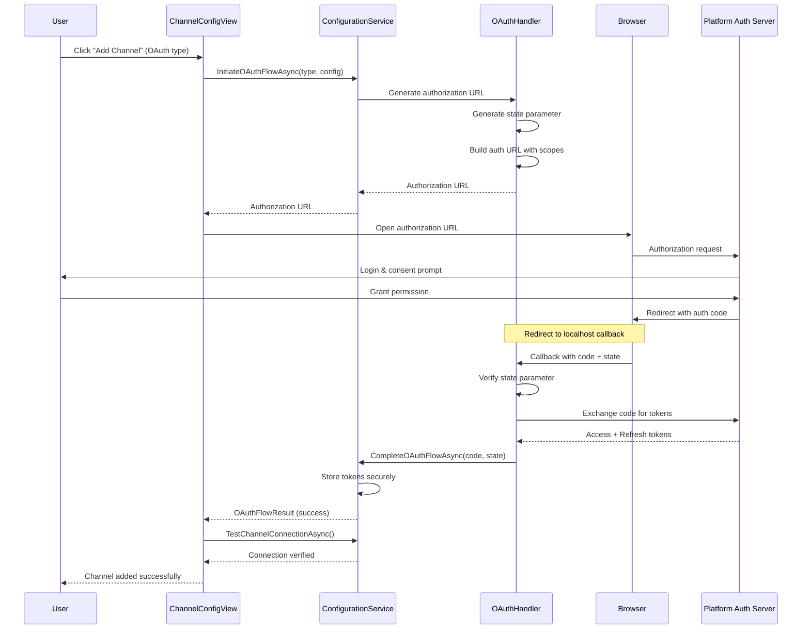
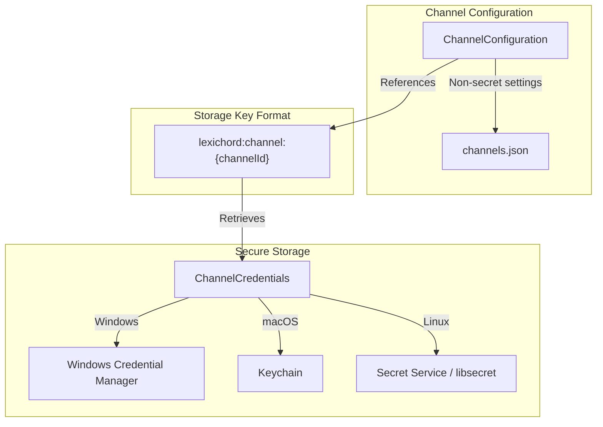

# LCS-DES-084a: Design Specification — Channel Configuration

## 1. Metadata & Categorization

| Field | Value | Description |
| :--- | :--- | :--- |
| **Feature ID** | `PUB-084a` | Sub-part of PUB-084 |
| **Feature Name** | `Channel Configuration` | OAuth, API keys, secure credential storage |
| **Target Version** | `v0.8.4a` | First sub-part of v0.8.4 |
| **Module Scope** | `Lexichord.Modules.Publishing` | Publishing module |
| **Swimlane** | `Publisher` | Part of Publisher vertical |
| **License Tier** | `Teams` | Teams tier required |
| **Feature Gate Key** | `FeatureFlags.Publishing.Channels` | License check key |
| **Author** | Lead Architect | |
| **Status** | `Draft` | |
| **Last Updated** | `2026-01-27` | |
| **Parent Document** | [LCS-DES-084-INDEX](./LCS-DES-084-INDEX.md) | |
| **Scope Breakdown** | [LCS-SBD-084 Section 3.1](./LCS-SBD-084.md#31-v084a-channel-configuration) | |

---

## 2. Executive Summary

### 2.1 The Requirement

Before Lexichord can publish content to external platforms, users need a way to:

- Configure publishing destinations (channels)
- Authenticate securely with each platform
- Store credentials safely without risk of exposure
- Test connections before attempting to publish
- Manage multiple channels for different platforms

### 2.2 The Proposed Solution

Implement a unified channel configuration system that:

1. **Defines Abstractions** — `IPublishingChannel` contract for all platform adapters
2. **Manages Registration** — `IChannelRegistry` for adapter discovery and instantiation
3. **Handles Configuration** — `IChannelConfigurationService` for CRUD operations
4. **Secures Credentials** — Integration with OS-native secure storage
5. **Provides UI** — Channel management view with OAuth flow support

---

## 3. Architecture & Modular Strategy

### 3.1 Dependencies

#### 3.1.1 Upstream Dependencies

| Interface | Source Version | Purpose |
| :--- | :--- | :--- |
| `ISettingsService` | v0.1.6a | Persist channel configurations |
| `ISecureStorageService` | v0.1.6c | Store credentials securely |
| `ILicenseContext` | v0.0.4c | Teams tier feature gating |
| `IMediator` | v0.0.7a | Event publishing |
| `IRegionManager` | v0.1.1b | UI region registration |

#### 3.1.2 NuGet Packages

| Package | Version | Purpose |
| :--- | :--- | :--- |
| `System.IdentityModel.Tokens.Jwt` | 7.x | Parse and validate JWT tokens |
| `System.Net.Http.Json` | 9.x | JSON serialization for HTTP |

### 3.2 Licensing Behavior

**License Gate:** Teams tier required

| Tier | UI Behavior |
| :--- | :--- |
| Core/WriterPro | Channel list visible but disabled; "Upgrade to Teams" overlay |
| Teams | Full access to add, edit, delete, and test channels |
| Enterprise | Full access plus audit logging for configuration changes |

**Implementation Pattern:**

```csharp
[RequiresLicense(LicenseTier.Teams)]
public class ChannelConfigurationViewModel : ObservableObject
{
    // License check applied at ViewModel level
}
```

---

## 4. Data Contract (The API)

### 4.1 Core Interfaces

```csharp
namespace Lexichord.Abstractions.Publishing;

/// <summary>
/// Represents a configured publishing channel to an external platform.
/// This is the core abstraction that all platform adapters implement.
/// </summary>
public interface IPublishingChannel
{
    /// <summary>
    /// Unique identifier for this channel instance.
    /// </summary>
    Guid ChannelId { get; }

    /// <summary>
    /// User-friendly display name for the channel.
    /// </summary>
    string DisplayName { get; }

    /// <summary>
    /// The type of platform this channel publishes to.
    /// </summary>
    ChannelType Type { get; }

    /// <summary>
    /// Current connection status of the channel.
    /// </summary>
    ChannelStatus Status { get; }

    /// <summary>
    /// Tests the connection to the remote platform.
    /// Validates credentials and verifies API access.
    /// </summary>
    /// <param name="ct">Cancellation token.</param>
    /// <returns>Connection result with status and capabilities.</returns>
    Task<ChannelConnectionResult> TestConnectionAsync(CancellationToken ct = default);

    /// <summary>
    /// Publishes new content to the remote platform.
    /// </summary>
    /// <param name="request">The content and options for publishing.</param>
    /// <param name="ct">Cancellation token.</param>
    /// <returns>Result containing remote ID and URL.</returns>
    Task<PublishResult> PublishAsync(PublishRequest request, CancellationToken ct = default);

    /// <summary>
    /// Updates existing content on the remote platform.
    /// </summary>
    /// <param name="request">The update request with remote ID and new content.</param>
    /// <param name="ct">Cancellation token.</param>
    /// <returns>Result containing updated remote URL.</returns>
    Task<PublishResult> UpdateAsync(UpdateRequest request, CancellationToken ct = default);

    /// <summary>
    /// Retrieves metadata about existing content on the remote platform.
    /// </summary>
    /// <param name="remoteId">The platform-specific content identifier.</param>
    /// <param name="ct">Cancellation token.</param>
    /// <returns>Remote content info or null if not found.</returns>
    Task<RemoteContentInfo?> GetRemoteContentAsync(string remoteId, CancellationToken ct = default);
}
```

```csharp
namespace Lexichord.Abstractions.Publishing;

/// <summary>
/// Registry for discovering and instantiating channel adapters.
/// </summary>
public interface IChannelRegistry
{
    /// <summary>
    /// Gets metadata about all available channel adapter types.
    /// </summary>
    /// <returns>List of adapter information.</returns>
    IReadOnlyList<ChannelAdapterInfo> GetAvailableAdapters();

    /// <summary>
    /// Creates a channel instance from configuration.
    /// </summary>
    /// <param name="type">The channel type to create.</param>
    /// <param name="config">The channel configuration.</param>
    /// <returns>A configured channel instance.</returns>
    IPublishingChannel CreateChannel(ChannelType type, ChannelConfiguration config);

    /// <summary>
    /// Registers a new channel adapter factory.
    /// Used for extensibility with custom adapters.
    /// </summary>
    /// <param name="type">The channel type.</param>
    /// <param name="factory">Factory function to create channel instances.</param>
    /// <param name="info">Metadata about the adapter.</param>
    void RegisterAdapter(
        ChannelType type,
        Func<ChannelConfiguration, IPublishingChannel> factory,
        ChannelAdapterInfo info);
}

/// <summary>
/// Metadata describing a channel adapter's requirements.
/// </summary>
/// <param name="Type">The channel type.</param>
/// <param name="DisplayName">Human-readable name.</param>
/// <param name="Description">Description of the channel.</param>
/// <param name="IconKey">Resource key for the platform icon.</param>
/// <param name="AuthType">Required authentication method.</param>
/// <param name="RequiredFields">Configuration fields needed.</param>
public record ChannelAdapterInfo(
    ChannelType Type,
    string DisplayName,
    string Description,
    string IconKey,
    AuthenticationType AuthType,
    IReadOnlyList<ConfigurationField> RequiredFields);
```

```csharp
namespace Lexichord.Abstractions.Publishing;

/// <summary>
/// Service for managing channel configurations.
/// </summary>
public interface IChannelConfigurationService
{
    /// <summary>
    /// Gets all configured channels.
    /// </summary>
    Task<IReadOnlyList<ChannelConfiguration>> GetAllChannelsAsync(CancellationToken ct = default);

    /// <summary>
    /// Gets channels of a specific type.
    /// </summary>
    Task<IReadOnlyList<ChannelConfiguration>> GetChannelsByTypeAsync(
        ChannelType type, CancellationToken ct = default);

    /// <summary>
    /// Gets a specific channel by ID.
    /// </summary>
    Task<ChannelConfiguration?> GetChannelAsync(Guid channelId, CancellationToken ct = default);

    /// <summary>
    /// Adds a new channel configuration.
    /// Credentials are stored separately via ISecureStorageService.
    /// </summary>
    Task<ChannelConfiguration> AddChannelAsync(
        CreateChannelRequest request, CancellationToken ct = default);

    /// <summary>
    /// Updates an existing channel configuration.
    /// </summary>
    Task<ChannelConfiguration> UpdateChannelAsync(
        Guid channelId, UpdateChannelRequest request, CancellationToken ct = default);

    /// <summary>
    /// Deletes a channel and its stored credentials.
    /// </summary>
    Task DeleteChannelAsync(Guid channelId, CancellationToken ct = default);

    /// <summary>
    /// Tests a channel's connection.
    /// </summary>
    Task<ChannelConnectionResult> TestChannelConnectionAsync(
        Guid channelId, CancellationToken ct = default);

    /// <summary>
    /// Initiates an OAuth flow for platforms that require it.
    /// </summary>
    Task<OAuthFlowResult> InitiateOAuthFlowAsync(
        ChannelType type, OAuthConfiguration config, CancellationToken ct = default);

    /// <summary>
    /// Completes an OAuth flow after user authorization.
    /// </summary>
    Task<OAuthFlowResult> CompleteOAuthFlowAsync(
        ChannelType type, string authorizationCode, string state, CancellationToken ct = default);

    /// <summary>
    /// Refreshes OAuth tokens for a channel.
    /// </summary>
    Task<ChannelCredentials?> RefreshTokensAsync(
        Guid channelId, CancellationToken ct = default);
}
```

### 4.2 Data Transfer Objects

```csharp
namespace Lexichord.Abstractions.Publishing;

/// <summary>
/// Stored configuration for a publishing channel.
/// Credentials are stored separately in secure storage.
/// </summary>
public record ChannelConfiguration
{
    /// <summary>
    /// Unique identifier for the channel.
    /// </summary>
    public Guid ChannelId { get; init; }

    /// <summary>
    /// User-friendly display name.
    /// </summary>
    public required string DisplayName { get; init; }

    /// <summary>
    /// Platform type (WordPress, GitHub, Confluence).
    /// </summary>
    public ChannelType Type { get; init; }

    /// <summary>
    /// Base URL for the platform API.
    /// </summary>
    public required string BaseUrl { get; init; }

    /// <summary>
    /// Authentication method used.
    /// </summary>
    public AuthenticationType AuthType { get; init; }

    /// <summary>
    /// Platform-specific settings (non-secret).
    /// </summary>
    public IReadOnlyDictionary<string, string> Settings { get; init; } =
        new Dictionary<string, string>();

    /// <summary>
    /// When the channel was created.
    /// </summary>
    public DateTime CreatedAt { get; init; }

    /// <summary>
    /// When the channel was last modified.
    /// </summary>
    public DateTime ModifiedAt { get; init; }

    /// <summary>
    /// Whether the channel is enabled for publishing.
    /// </summary>
    public bool IsEnabled { get; init; } = true;

    /// <summary>
    /// Last successful connection test timestamp.
    /// </summary>
    public DateTime? LastTestedAt { get; init; }

    /// <summary>
    /// Last publish operation timestamp.
    /// </summary>
    public DateTime? LastPublishedAt { get; init; }
}

/// <summary>
/// Request to create a new channel.
/// </summary>
/// <param name="DisplayName">User-friendly name for the channel.</param>
/// <param name="Type">Platform type.</param>
/// <param name="BaseUrl">Platform API URL.</param>
/// <param name="AuthType">Authentication method.</param>
/// <param name="Settings">Platform-specific settings.</param>
/// <param name="Credentials">Authentication credentials.</param>
public record CreateChannelRequest(
    string DisplayName,
    ChannelType Type,
    string BaseUrl,
    AuthenticationType AuthType,
    IReadOnlyDictionary<string, string> Settings,
    ChannelCredentials Credentials);

/// <summary>
/// Request to update an existing channel.
/// Null values indicate "no change".
/// </summary>
public record UpdateChannelRequest(
    string? DisplayName = null,
    string? BaseUrl = null,
    IReadOnlyDictionary<string, string>? Settings = null,
    ChannelCredentials? Credentials = null,
    bool? IsEnabled = null);

/// <summary>
/// Authentication credentials for a channel.
/// Only one credential type should be populated based on AuthType.
/// </summary>
public record ChannelCredentials(
    string? ApiKey = null,
    string? Username = null,
    string? Password = null,
    string? AccessToken = null,
    string? RefreshToken = null,
    DateTime? TokenExpiry = null);
```

### 4.3 Enumerations

```csharp
namespace Lexichord.Abstractions.Publishing;

/// <summary>
/// Supported publishing platform types.
/// </summary>
public enum ChannelType
{
    /// <summary>WordPress blog or site.</summary>
    WordPress,

    /// <summary>GitHub repository.</summary>
    GitHub,

    /// <summary>Atlassian Confluence wiki.</summary>
    Confluence,

    /// <summary>Custom or third-party adapter.</summary>
    Custom
}

/// <summary>
/// Connection status for a publishing channel.
/// </summary>
public enum ChannelStatus
{
    /// <summary>Not connected to the platform.</summary>
    Disconnected,

    /// <summary>Connection in progress.</summary>
    Connecting,

    /// <summary>Successfully connected.</summary>
    Connected,

    /// <summary>Connection error occurred.</summary>
    Error,

    /// <summary>Re-authentication required.</summary>
    AuthenticationRequired
}

/// <summary>
/// Authentication method required by a channel.
/// </summary>
public enum AuthenticationType
{
    /// <summary>No authentication (public access).</summary>
    None,

    /// <summary>API key authentication.</summary>
    ApiKey,

    /// <summary>OAuth 2.0 authorization flow.</summary>
    OAuth2,

    /// <summary>Basic authentication (username/password).</summary>
    BasicAuth,

    /// <summary>Personal Access Token.</summary>
    PersonalAccessToken
}

/// <summary>
/// Type of configuration field.
/// </summary>
public enum FieldType
{
    /// <summary>Single-line text input.</summary>
    Text,

    /// <summary>Password/secret input (masked).</summary>
    Password,

    /// <summary>URL input with validation.</summary>
    Url,

    /// <summary>Numeric input.</summary>
    Number,

    /// <summary>Boolean checkbox.</summary>
    Boolean,

    /// <summary>Single selection dropdown.</summary>
    Select,

    /// <summary>Multiple selection.</summary>
    MultiSelect
}
```

---

## 5. Implementation Logic

### 5.1 OAuth 2.0 Flow



### 5.2 Credential Storage Strategy



**Secure Storage Implementation:**

```csharp
public class SecureChannelCredentialStore : ISecureChannelCredentialStore
{
    private readonly ISecureStorageService _secureStorage;
    private const string KeyPrefix = "lexichord:channel:";

    public async Task StoreCredentialsAsync(
        Guid channelId,
        ChannelCredentials credentials,
        CancellationToken ct = default)
    {
        var key = $"{KeyPrefix}{channelId}";
        var json = JsonSerializer.Serialize(credentials);

        await _secureStorage.SetAsync(key, json, ct);
    }

    public async Task<ChannelCredentials?> GetCredentialsAsync(
        Guid channelId,
        CancellationToken ct = default)
    {
        var key = $"{KeyPrefix}{channelId}";
        var json = await _secureStorage.GetAsync(key, ct);

        if (string.IsNullOrEmpty(json))
            return null;

        return JsonSerializer.Deserialize<ChannelCredentials>(json);
    }

    public async Task DeleteCredentialsAsync(
        Guid channelId,
        CancellationToken ct = default)
    {
        var key = $"{KeyPrefix}{channelId}";
        await _secureStorage.DeleteAsync(key, ct);
    }
}
```

### 5.3 Token Refresh Logic

```text
START: "Check if tokens need refresh"
│
├── Is AuthType == OAuth2?
│   ├── NO → Skip refresh
│   └── YES → Continue
│
├── Is RefreshToken available?
│   ├── NO → Set status to AuthenticationRequired
│   └── YES → Continue
│
├── Is TokenExpiry within 5 minutes?
│   ├── NO → Use existing token
│   └── YES → Continue
│
├── Call token refresh endpoint
│   ├── SUCCESS → Update stored tokens
│   └── FAILURE → Set status to AuthenticationRequired
│
└── Return refreshed credentials
```

---

## 6. Data Persistence

### 6.1 Configuration Storage

**File Location:**

- Windows: `%APPDATA%/Lexichord/publishing/channels.json`
- macOS: `~/Library/Application Support/Lexichord/publishing/channels.json`
- Linux: `~/.config/Lexichord/publishing/channels.json`

**JSON Schema:**

```json
{
  "$schema": "http://json-schema.org/draft-07/schema#",
  "type": "object",
  "properties": {
    "version": { "type": "integer" },
    "channels": {
      "type": "array",
      "items": {
        "type": "object",
        "properties": {
          "channelId": { "type": "string", "format": "uuid" },
          "displayName": { "type": "string" },
          "type": { "type": "string", "enum": ["WordPress", "GitHub", "Confluence", "Custom"] },
          "baseUrl": { "type": "string", "format": "uri" },
          "authType": { "type": "string" },
          "settings": { "type": "object" },
          "isEnabled": { "type": "boolean" },
          "createdAt": { "type": "string", "format": "date-time" },
          "modifiedAt": { "type": "string", "format": "date-time" }
        },
        "required": ["channelId", "displayName", "type", "baseUrl"]
      }
    }
  }
}
```

**Example:**

```json
{
  "version": 1,
  "channels": [
    {
      "channelId": "a1b2c3d4-e5f6-7890-abcd-ef1234567890",
      "displayName": "My WordPress Blog",
      "type": "WordPress",
      "baseUrl": "https://myblog.wordpress.com",
      "authType": "OAuth2",
      "settings": {
        "postType": "post",
        "defaultStatus": "draft"
      },
      "isEnabled": true,
      "createdAt": "2026-01-15T10:30:00Z",
      "modifiedAt": "2026-01-20T14:45:00Z"
    },
    {
      "channelId": "b2c3d4e5-f6a7-8901-bcde-f23456789012",
      "displayName": "Documentation Repo",
      "type": "GitHub",
      "baseUrl": "https://api.github.com",
      "authType": "PersonalAccessToken",
      "settings": {
        "owner": "myorg",
        "repo": "docs",
        "branch": "main",
        "path": "docs"
      },
      "isEnabled": true,
      "createdAt": "2026-01-18T09:00:00Z",
      "modifiedAt": "2026-01-18T09:00:00Z"
    }
  ]
}
```

---

## 7. UI/UX Specifications

### 7.1 Channel Configuration View

```text
+------------------------------------------------------------------+
|  Publication Channels                     [+ Add Channel] [?]     |
+------------------------------------------------------------------+
| Search: [_____________________]  Filter: [All Types v] [Enabled v]|
+------------------------------------------------------------------+
|                                                                   |
| +--------------------------------------------------------------+ |
| | [WordPress icon]                                              | |
| |   My WordPress Blog                            [Connected]    | |
| |   https://myblog.wordpress.com                                | |
| |   OAuth 2.0 | Last published: 2 hours ago                     | |
| |                                                               | |
| |   [Test Connection]              [Edit]  [Disable]  [Delete]  | |
| +--------------------------------------------------------------+ |
|                                                                   |
| +--------------------------------------------------------------+ |
| | [GitHub icon]                                                 | |
| |   Documentation Repo                           [Connected]    | |
| |   github.com/myorg/docs                                       | |
| |   Personal Access Token | Last published: Yesterday           | |
| |                                                               | |
| |   [Test Connection]              [Edit]  [Disable]  [Delete]  | |
| +--------------------------------------------------------------+ |
|                                                                   |
| +--------------------------------------------------------------+ |
| | [Confluence icon]                                             | |
| |   Team Wiki                              [Auth Required]      | |
| |   mycompany.atlassian.net                                     | |
| |   OAuth 2.0 | Token expired 3 days ago                        | |
| |                                                               | |
| |   [Reconnect]                    [Edit]  [Disable]  [Delete]  | |
| +--------------------------------------------------------------+ |
|                                                                   |
+------------------------------------------------------------------+
| Teams license required for publishing  |  3 channels configured  |
+------------------------------------------------------------------+
```

### 7.2 Add/Edit Channel Dialog

```text
+------------------------------------------------------------------+
|  Add Publishing Channel                                    [X]    |
+------------------------------------------------------------------+
|                                                                   |
| Channel Type                                                      |
| +--------------------------------------------------------------+ |
| | [WordPress]  [GitHub]  [Confluence]                           | |
| +--------------------------------------------------------------+ |
|                                                                   |
| Display Name *                                                    |
| [My WordPress Blog                                           ]    |
|                                                                   |
| Site URL *                                                        |
| [https://myblog.wordpress.com                                ]    |
|                                                                   |
+------------------------------------------------------------------+
| Authentication                                                    |
+------------------------------------------------------------------+
|                                                                   |
| (x) OAuth 2.0 (Recommended)                                       |
|     [Authorize with WordPress]                                    |
|                                                                   |
| ( ) Application Password                                          |
|     Username: [                                              ]    |
|     Password: [                                              ]    |
|                                                                   |
+------------------------------------------------------------------+
| Advanced Settings                                          [v]    |
+------------------------------------------------------------------+
|                                                                   |
| Default Post Type: [Post          v]                              |
| Default Status:    [Draft         v]                              |
|                                                                   |
+------------------------------------------------------------------+
|                                                                   |
| [Test Connection]                    [Cancel]  [Save Channel]     |
|                                                                   |
+------------------------------------------------------------------+
```

### 7.3 Connection Test Result

```text
+------------------------------------------------------------------+
|  Connection Test Result                                    [X]    |
+------------------------------------------------------------------+
|                                                                   |
|   [Check icon]  Connected Successfully                            |
|                                                                   |
|   Authenticated as: john.smith@example.com                        |
|   Platform: WordPress 6.4                                         |
|                                                                   |
|   Capabilities:                                                   |
|   [x] Create posts       [x] Update posts     [x] Delete posts    |
|   [x] Upload media       [x] Manage categories                    |
|   [x] Schedule posts     [x] Create drafts                        |
|                                                                   |
|                                        [Close]  [Save & Close]    |
|                                                                   |
+------------------------------------------------------------------+
```

### 7.4 Component Styling

| Component | Theme Resource | Notes |
| :--- | :--- | :--- |
| Channel Card | `Brush.Surface.Secondary` | Subtle elevation, rounded corners |
| Status Badge (Connected) | `Brush.Success` | Green with checkmark icon |
| Status Badge (Error) | `Brush.Error` | Red with warning icon |
| Status Badge (Auth Required) | `Brush.Warning` | Yellow with lock icon |
| Platform Icons | SVG with 24x24 | WordPress blue, GitHub dark, Confluence blue |
| Add Channel Button | `LexButtonPrimary` | Prominent accent color |

---

## 8. ViewModel Implementation

```csharp
namespace Lexichord.Modules.Publishing.ViewModels;

[RequiresLicense(LicenseTier.Teams)]
public partial class ChannelConfigurationViewModel : ObservableObject
{
    private readonly IChannelConfigurationService _configService;
    private readonly IChannelRegistry _registry;
    private readonly ILicenseContext _licenseContext;
    private readonly IMediator _mediator;
    private readonly ILogger<ChannelConfigurationViewModel> _logger;

    [ObservableProperty]
    private ObservableCollection<ChannelViewModel> _channels = new();

    [ObservableProperty]
    private ChannelViewModel? _selectedChannel;

    [ObservableProperty]
    private string _searchText = string.Empty;

    [ObservableProperty]
    private ChannelType? _filterType;

    [ObservableProperty]
    private bool _isLoading;

    [ObservableProperty]
    private bool _isLicensed;

    public ChannelConfigurationViewModel(
        IChannelConfigurationService configService,
        IChannelRegistry registry,
        ILicenseContext licenseContext,
        IMediator mediator,
        ILogger<ChannelConfigurationViewModel> logger)
    {
        _configService = configService;
        _registry = registry;
        _licenseContext = licenseContext;
        _mediator = mediator;
        _logger = logger;

        IsLicensed = _licenseContext.CurrentTier >= LicenseTier.Teams;
    }

    public IReadOnlyList<ChannelAdapterInfo> AvailableAdapters =>
        _registry.GetAvailableAdapters();

    [RelayCommand]
    private async Task LoadChannelsAsync(CancellationToken ct)
    {
        IsLoading = true;
        try
        {
            var configs = await _configService.GetAllChannelsAsync(ct);

            Channels.Clear();
            foreach (var config in configs)
            {
                Channels.Add(new ChannelViewModel(config, _registry));
            }
        }
        finally
        {
            IsLoading = false;
        }
    }

    [RelayCommand]
    private async Task AddChannelAsync(CreateChannelRequest request, CancellationToken ct)
    {
        if (!IsLicensed)
        {
            await _mediator.Publish(new ShowUpgradePromptEvent("Publication Channels"), ct);
            return;
        }

        var config = await _configService.AddChannelAsync(request, ct);
        Channels.Add(new ChannelViewModel(config, _registry));

        await _mediator.Publish(new ChannelConfiguredEvent(config.ChannelId), ct);
    }

    [RelayCommand]
    private async Task TestConnectionAsync(ChannelViewModel channel, CancellationToken ct)
    {
        channel.IsTesting = true;
        try
        {
            var result = await _configService.TestChannelConnectionAsync(channel.ChannelId, ct);
            channel.Status = result.IsConnected ? ChannelStatus.Connected : ChannelStatus.Error;
            channel.Capabilities = result.Capabilities;
            channel.LastError = result.ErrorMessage;
        }
        finally
        {
            channel.IsTesting = false;
        }
    }

    [RelayCommand]
    private async Task DeleteChannelAsync(ChannelViewModel channel, CancellationToken ct)
    {
        await _configService.DeleteChannelAsync(channel.ChannelId, ct);
        Channels.Remove(channel);

        await _mediator.Publish(new ChannelRemovedEvent(channel.ChannelId), ct);
    }

    [RelayCommand]
    private async Task InitiateOAuthAsync(ChannelType type, CancellationToken ct)
    {
        var adapter = AvailableAdapters.First(a => a.Type == type);

        if (adapter.AuthType != AuthenticationType.OAuth2)
            return;

        var config = BuildOAuthConfiguration(type);
        var result = await _configService.InitiateOAuthFlowAsync(type, config, ct);

        if (result.Success && result.AuthorizationUrl is not null)
        {
            // Open browser for authorization
            Process.Start(new ProcessStartInfo
            {
                FileName = result.AuthorizationUrl,
                UseShellExecute = true
            });
        }
    }

    partial void OnSearchTextChanged(string value) => ApplyFilters();
    partial void OnFilterTypeChanged(ChannelType? value) => ApplyFilters();

    private void ApplyFilters()
    {
        // Filter logic for search and type
    }
}

public partial class ChannelViewModel : ObservableObject
{
    private readonly ChannelConfiguration _config;
    private readonly IChannelRegistry _registry;

    public Guid ChannelId => _config.ChannelId;
    public string DisplayName => _config.DisplayName;
    public ChannelType Type => _config.Type;
    public string BaseUrl => _config.BaseUrl;
    public AuthenticationType AuthType => _config.AuthType;
    public bool IsEnabled => _config.IsEnabled;
    public DateTime? LastPublishedAt => _config.LastPublishedAt;

    [ObservableProperty]
    private ChannelStatus _status = ChannelStatus.Disconnected;

    [ObservableProperty]
    private bool _isTesting;

    [ObservableProperty]
    private ChannelCapabilities? _capabilities;

    [ObservableProperty]
    private string? _lastError;

    public string IconKey => _registry.GetAvailableAdapters()
        .FirstOrDefault(a => a.Type == Type)?.IconKey ?? "channel";

    public ChannelViewModel(ChannelConfiguration config, IChannelRegistry registry)
    {
        _config = config;
        _registry = registry;
    }
}
```

---

## 9. Observability & Logging

| Level | Source | Message Template |
| :--- | :--- | :--- |
| Debug | ConfigService | `"Loading channel configurations from {Path}"` |
| Info | ConfigService | `"Channel {ChannelId} ({Type}) configuration saved"` |
| Info | ConfigService | `"Channel {ChannelId} deleted"` |
| Info | OAuthHandler | `"Initiating OAuth flow for {ChannelType}"` |
| Info | OAuthHandler | `"OAuth flow completed for {ChannelType}"` |
| Warning | ConfigService | `"Channel {ChannelId} token expiring in {Minutes} minutes"` |
| Warning | OAuthHandler | `"OAuth state mismatch - possible CSRF attempt"` |
| Error | ConfigService | `"Failed to load channel configurations: {Error}"` |
| Error | OAuthHandler | `"OAuth token exchange failed: {Error}"` |

---

## 10. Security & Safety

| Risk | Level | Mitigation |
| :--- | :--- | :--- |
| Credential exposure | High | Store in OS secure storage, never log credentials |
| OAuth state manipulation | Medium | Cryptographic state parameter, verify on callback |
| Token theft | High | Short-lived tokens, secure storage, refresh rotation |
| CSRF in OAuth flow | Medium | State parameter with entropy, same-origin checks |
| Unauthorized access | Medium | License gating, permission checks per operation |

**Security Checklist:**

- [ ] Never log credentials (API keys, tokens, passwords)
- [ ] Use HTTPS for all OAuth endpoints
- [ ] Validate OAuth state parameter on callback
- [ ] Store credentials in OS-native secure storage only
- [ ] Implement token refresh before expiry
- [ ] Clear credentials on channel deletion
- [ ] Encrypt configuration file at rest (future)

---

## 11. Acceptance Criteria

### 11.1 Functional Criteria

| # | Given | When | Then |
| :--- | :--- | :--- | :--- |
| 1 | User has Teams license | Opening Channel Configuration | See list of configured channels |
| 2 | User has Core license | Opening Channel Configuration | See disabled UI with upgrade prompt |
| 3 | No channels configured | Viewing channel list | See empty state with "Add Channel" CTA |
| 4 | Adding WordPress channel | Completing OAuth flow | Channel saved with Connected status |
| 5 | Adding GitHub channel | Entering PAT | Channel saved with credentials stored securely |
| 6 | Channel configured | Clicking "Test Connection" | See connection result with capabilities |
| 7 | Channel with expired token | Testing connection | See Auth Required status with Reconnect button |
| 8 | Channel configured | Clicking "Delete" | Channel removed and credentials cleared |

### 11.2 Security Criteria

| # | Given | When | Then |
| :--- | :--- | :--- | :--- |
| 9 | OAuth flow initiated | Completing with mismatched state | Reject flow, show error |
| 10 | Credentials stored | Inspecting channels.json | No credentials visible in file |
| 11 | Channel deleted | Checking secure storage | Credentials removed from OS store |

---

## 12. Deliverable Checklist

| # | Deliverable | Status |
| :--- | :--- | :--- |
| 1 | `IPublishingChannel.cs` interface | [ ] |
| 2 | `IChannelRegistry.cs` interface | [ ] |
| 3 | `IChannelConfigurationService.cs` interface | [ ] |
| 4 | `ChannelConfiguration.cs` and related DTOs | [ ] |
| 5 | `ChannelConfigurationService.cs` implementation | [ ] |
| 6 | `ChannelRegistry.cs` implementation | [ ] |
| 7 | `SecureChannelCredentialStore.cs` | [ ] |
| 8 | `OAuthFlowHandler.cs` | [ ] |
| 9 | `ChannelConfigurationView.axaml` | [ ] |
| 10 | `ChannelConfigurationViewModel.cs` | [ ] |
| 11 | Add/Edit Channel dialog | [ ] |
| 12 | Unit tests for configuration service | [ ] |
| 13 | Unit tests for OAuth flow | [ ] |
| 14 | Integration tests for credential storage | [ ] |

---

## 13. Verification Commands

```bash
# Run channel configuration tests
dotnet test --filter "FullyQualifiedName~ChannelConfiguration"

# Run OAuth flow tests
dotnet test --filter "FullyQualifiedName~OAuth"

# Run secure storage tests
dotnet test --filter "FullyQualifiedName~SecureStorage"

# Manual verification:
# 1. Open Lexichord with Teams license
# 2. Navigate to Tools > Publication Channels
# 3. Verify empty state shown initially
# 4. Click "Add Channel" > WordPress
# 5. Complete OAuth flow in browser
# 6. Verify channel appears with "Connected" status
# 7. Click "Test Connection" > verify success
# 8. Check channels.json contains no credentials
# 9. Verify credentials in OS secure storage (Windows: Credential Manager)
```

---

## Document History

| Version | Date | Author | Changes |
| :--- | :--- | :--- | :--- |
| 1.0 | 2026-01-27 | Lead Architect | Initial draft |
