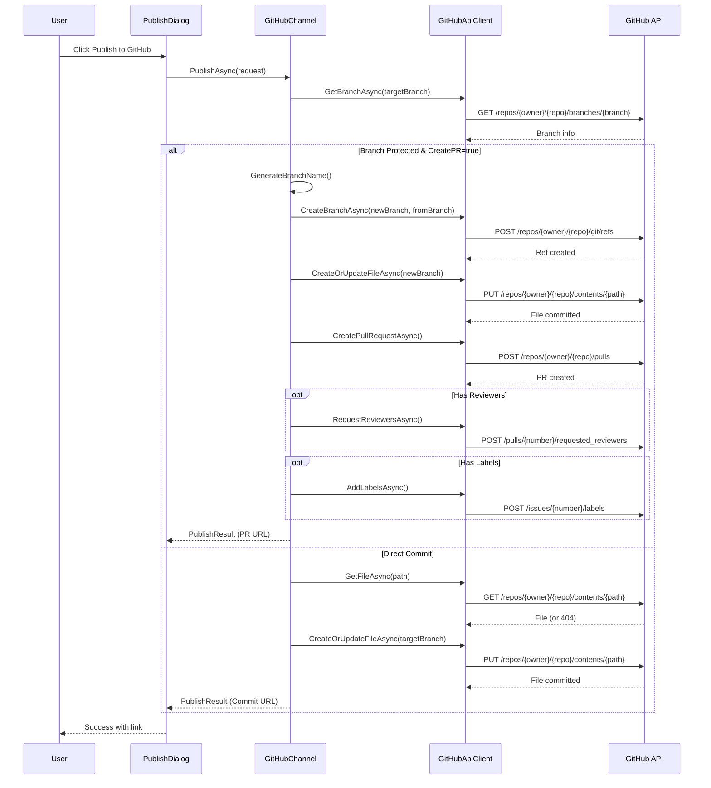

# LCS-DES-084c: Design Specification — GitHub Adapter

## 1. Metadata & Categorization

| Field | Value | Description |
| :--- | :--- | :--- |
| **Feature ID** | `PUB-084c` | Sub-part of PUB-084 |
| **Feature Name** | `GitHub Adapter` | Push to repo, create PRs for review workflows |
| **Target Version** | `v0.8.4c` | Third sub-part of v0.8.4 |
| **Module Scope** | `Lexichord.Modules.Publishing` | Publishing module |
| **Swimlane** | `Publisher` | Part of Publisher vertical |
| **License Tier** | `Teams` | Teams tier required |
| **Feature Gate Key** | `FeatureFlags.Publishing.GitHub` | License check key |
| **Author** | Lead Architect | |
| **Status** | `Draft` | |
| **Last Updated** | `2026-01-27` | |
| **Parent Document** | [LCS-DES-084-INDEX](./LCS-DES-084-INDEX.md) | |
| **Scope Breakdown** | [LCS-SBD-084 Section 3.3](./LCS-SBD-084.md#33-v084c-github-adapter) | |

---

## 2. Executive Summary

### 2.1 The Requirement

GitHub is the primary platform for open-source and enterprise documentation repositories. Documentation teams need to:

- Push Markdown documentation directly to GitHub repositories
- Support review workflows through pull requests
- Respect branch protection rules
- Update existing documentation files
- Work with GitHub wikis and README files

### 2.2 The Proposed Solution

Implement a GitHub adapter that:

1. **Implements IPublishingChannel** — Full compliance with the channel abstraction
2. **Uses GitHub REST API** — Contents API for file operations, Pull Requests API for PRs
3. **Respects Branch Protection** — Automatically creates PRs when direct push is not allowed
4. **Supports PAT Auth** — Personal Access Tokens for authentication
5. **Handles Git Operations** — Create branches, commits, and pull requests

---

## 3. Architecture & Modular Strategy

### 3.1 Dependencies

#### 3.1.1 Upstream Dependencies

| Interface | Source Version | Purpose |
| :--- | :--- | :--- |
| `IPublishingChannel` | v0.8.4a | Channel abstraction to implement |
| `IChannelConfigurationService` | v0.8.4a | Retrieve stored credentials |
| `IGitRepositoryService` | v0.8.1a | Local repository context |
| `ISecureStorageService` | v0.1.6c | Retrieve stored credentials |
| `Polly` | v0.0.5d | Retry policies for API calls |

#### 3.1.2 NuGet Packages

| Package | Version | Purpose |
| :--- | :--- | :--- |
| `System.Net.Http.Json` | 9.x | JSON HTTP client extensions |
| `Polly.Extensions.Http` | 3.x | HTTP-specific retry policies |

### 3.2 Licensing Behavior

Same as parent feature: **Teams** tier required.

---

## 4. Data Contract (The API)

### 4.1 GitHub Channel Implementation

```csharp
namespace Lexichord.Modules.Publishing.GitHub;

/// <summary>
/// GitHub-specific publishing channel implementation.
/// Supports direct commits and pull request workflows.
/// </summary>
[RequiresLicense(LicenseTier.Teams)]
public class GitHubChannel : IPublishingChannel
{
    private readonly IGitHubApiClient _apiClient;
    private readonly ChannelConfiguration _config;
    private readonly ILogger<GitHubChannel> _logger;

    public Guid ChannelId => _config.ChannelId;
    public string DisplayName => _config.DisplayName;
    public ChannelType Type => ChannelType.GitHub;

    [ObservableProperty]
    private ChannelStatus _status = ChannelStatus.Disconnected;

    public GitHubChannel(
        IGitHubApiClient apiClient,
        ChannelConfiguration config,
        ILogger<GitHubChannel> logger)
    {
        _apiClient = apiClient;
        _config = config;
        _logger = logger;
    }

    public async Task<ChannelConnectionResult> TestConnectionAsync(CancellationToken ct = default)
    {
        try
        {
            var settings = GetGitHubSettings();

            _logger.LogDebug("Testing GitHub connection to {Owner}/{Repo}",
                settings.Owner, settings.Repository);

            var user = await _apiClient.GetCurrentUserAsync(ct);
            var repo = await _apiClient.GetRepositoryAsync(
                settings.Owner, settings.Repository, ct);

            Status = ChannelStatus.Connected;

            var capabilities = new ChannelCapabilities(
                CanCreate: repo.Permissions.Push,
                CanUpdate: repo.Permissions.Push,
                CanDelete: repo.Permissions.Push,
                CanListContent: true,
                SupportsDrafts: true, // Draft PRs
                SupportsScheduling: false,
                SupportsCategories: false,
                SupportsTags: true); // Labels on PRs

            _logger.LogInformation(
                "GitHub connection successful for {User} to {Owner}/{Repo}",
                user.Login, settings.Owner, settings.Repository);

            return new ChannelConnectionResult(
                IsConnected: true,
                ErrorMessage: null,
                Capabilities: capabilities);
        }
        catch (GitHubAuthenticationException ex)
        {
            Status = ChannelStatus.AuthenticationRequired;
            _logger.LogWarning("GitHub authentication failed: {Error}", ex.Message);

            return new ChannelConnectionResult(
                IsConnected: false,
                ErrorMessage: "Authentication failed. Check your Personal Access Token.",
                Capabilities: default);
        }
        catch (GitHubNotFoundException ex)
        {
            Status = ChannelStatus.Error;
            _logger.LogWarning("GitHub repository not found: {Error}", ex.Message);

            return new ChannelConnectionResult(
                IsConnected: false,
                ErrorMessage: $"Repository not found or access denied.",
                Capabilities: default);
        }
    }

    public async Task<PublishResult> PublishAsync(
        PublishRequest request,
        CancellationToken ct = default)
    {
        var settings = GetGitHubSettings();

        _logger.LogInformation("Publishing to GitHub: {Owner}/{Repo} - {Title}",
            settings.Owner, settings.Repository, request.Title);

        // Check branch protection
        var branchInfo = await _apiClient.GetBranchAsync(
            settings.Owner,
            settings.Repository,
            settings.TargetBranch,
            ct);

        var filePath = BuildFilePath(settings, request);

        if (branchInfo.Protected && settings.CreatePullRequest)
        {
            _logger.LogInformation("Branch {Branch} is protected, creating PR", settings.TargetBranch);
            return await CreatePullRequestAsync(request, settings, filePath, ct);
        }
        else
        {
            return await DirectCommitAsync(request, settings, filePath, ct);
        }
    }

    private async Task<PublishResult> CreatePullRequestAsync(
        PublishRequest request,
        GitHubChannelSettings settings,
        string filePath,
        CancellationToken ct)
    {
        // Generate a unique branch name
        var branchName = GenerateBranchName(request.Title);

        _logger.LogDebug("Creating branch {Branch} from {Base}",
            branchName, settings.TargetBranch);

        // Create new branch from target branch
        await _apiClient.CreateBranchAsync(
            settings.Owner,
            settings.Repository,
            branchName,
            settings.TargetBranch,
            ct);

        // Commit the content to the new branch
        var commitResult = await _apiClient.CreateOrUpdateFileAsync(
            settings.Owner,
            settings.Repository,
            filePath,
            new GitHubFileRequest
            {
                Message = GenerateCommitMessage(request, isNew: true),
                Content = Convert.ToBase64String(Encoding.UTF8.GetBytes(request.Content)),
                Branch = branchName
            },
            ct);

        // Create the pull request
        var prBody = GeneratePullRequestBody(request);

        var pr = await _apiClient.CreatePullRequestAsync(
            settings.Owner,
            settings.Repository,
            new GitHubPullRequestRequest
            {
                Title = $"docs: {request.Title}",
                Body = prBody,
                Head = branchName,
                Base = settings.PrBaseBranch ?? settings.TargetBranch,
                Draft = request.Options.IsDraft
            },
            ct);

        // Add reviewers if specified
        if (settings.Reviewers?.Count > 0)
        {
            await _apiClient.RequestReviewersAsync(
                settings.Owner,
                settings.Repository,
                pr.Number,
                settings.Reviewers,
                ct);
        }

        // Add labels if specified
        if (settings.Labels?.Count > 0)
        {
            await _apiClient.AddLabelsAsync(
                settings.Owner,
                settings.Repository,
                pr.Number,
                settings.Labels,
                ct);
        }

        _logger.LogInformation("Created PR #{Number} at {Url}", pr.Number, pr.HtmlUrl);

        return new PublishResult(
            Success: true,
            RemoteId: pr.Number.ToString(),
            RemoteUrl: pr.HtmlUrl,
            ErrorMessage: null,
            PublishedAt: pr.CreatedAt);
    }

    private async Task<PublishResult> DirectCommitAsync(
        PublishRequest request,
        GitHubChannelSettings settings,
        string filePath,
        CancellationToken ct)
    {
        _logger.LogDebug("Direct commit to {Branch}", settings.TargetBranch);

        // Check if file exists
        var existingFile = await _apiClient.GetFileAsync(
            settings.Owner,
            settings.Repository,
            filePath,
            settings.TargetBranch,
            ct);

        var isNew = existingFile is null;

        var fileRequest = new GitHubFileRequest
        {
            Message = GenerateCommitMessage(request, isNew),
            Content = Convert.ToBase64String(Encoding.UTF8.GetBytes(request.Content)),
            Branch = settings.TargetBranch,
            Sha = existingFile?.Sha // Required for updates
        };

        var result = await _apiClient.CreateOrUpdateFileAsync(
            settings.Owner,
            settings.Repository,
            filePath,
            fileRequest,
            ct);

        _logger.LogInformation("Committed to {Owner}/{Repo}: {Path}",
            settings.Owner, settings.Repository, filePath);

        return new PublishResult(
            Success: true,
            RemoteId: result.Content.Sha,
            RemoteUrl: result.Content.HtmlUrl,
            ErrorMessage: null,
            PublishedAt: DateTime.UtcNow);
    }

    public async Task<PublishResult> UpdateAsync(
        UpdateRequest request,
        CancellationToken ct = default)
    {
        var settings = GetGitHubSettings();

        // For GitHub, RemoteId could be a file path or a PR number
        // We'll treat it as a file SHA and look for the file
        var filePath = request.Options.PlatformSpecificOptions
            ?.GetValueOrDefault("filePath") as string;

        if (string.IsNullOrEmpty(filePath))
        {
            return new PublishResult(
                Success: false,
                RemoteId: request.RemoteId,
                RemoteUrl: null,
                ErrorMessage: "File path required for GitHub updates",
                PublishedAt: default);
        }

        var existingFile = await _apiClient.GetFileAsync(
            settings.Owner,
            settings.Repository,
            filePath,
            settings.TargetBranch,
            ct);

        if (existingFile is null)
        {
            return new PublishResult(
                Success: false,
                RemoteId: request.RemoteId,
                RemoteUrl: null,
                ErrorMessage: $"File not found: {filePath}",
                PublishedAt: default);
        }

        var fileRequest = new GitHubFileRequest
        {
            Message = request.Options.UpdateMessage ?? $"docs: update {request.Title}",
            Content = Convert.ToBase64String(Encoding.UTF8.GetBytes(request.Content)),
            Branch = settings.TargetBranch,
            Sha = existingFile.Sha
        };

        var result = await _apiClient.CreateOrUpdateFileAsync(
            settings.Owner,
            settings.Repository,
            filePath,
            fileRequest,
            ct);

        return new PublishResult(
            Success: true,
            RemoteId: result.Content.Sha,
            RemoteUrl: result.Content.HtmlUrl,
            ErrorMessage: null,
            PublishedAt: DateTime.UtcNow);
    }

    public async Task<RemoteContentInfo?> GetRemoteContentAsync(
        string remoteId,
        CancellationToken ct = default)
    {
        var settings = GetGitHubSettings();

        // remoteId is treated as a file path for GitHub
        var file = await _apiClient.GetFileAsync(
            settings.Owner,
            settings.Repository,
            remoteId,
            settings.TargetBranch,
            ct);

        if (file is null)
            return null;

        return new RemoteContentInfo(
            RemoteId: file.Sha,
            Title: file.Name,
            RemoteUrl: file.HtmlUrl,
            CreatedAt: DateTime.MinValue, // GitHub doesn't track file creation
            ModifiedAt: DateTime.UtcNow, // Would need commit history
            Author: null,
            Status: ContentStatus.Published);
    }

    private GitHubChannelSettings GetGitHubSettings()
    {
        return new GitHubChannelSettings
        {
            Owner = _config.Settings.GetValueOrDefault("owner")
                ?? throw new InvalidOperationException("GitHub owner not configured"),
            Repository = _config.Settings.GetValueOrDefault("repo")
                ?? throw new InvalidOperationException("GitHub repository not configured"),
            TargetBranch = _config.Settings.GetValueOrDefault("branch") ?? "main",
            BasePath = _config.Settings.GetValueOrDefault("path") ?? "docs",
            CreatePullRequest = bool.TryParse(
                _config.Settings.GetValueOrDefault("createPr"), out var pr) && pr,
            PrBaseBranch = _config.Settings.GetValueOrDefault("prBaseBranch"),
            Reviewers = _config.Settings.GetValueOrDefault("reviewers")
                ?.Split(',', StringSplitOptions.RemoveEmptyEntries).ToList(),
            Labels = _config.Settings.GetValueOrDefault("labels")
                ?.Split(',', StringSplitOptions.RemoveEmptyEntries).ToList()
        };
    }

    private string BuildFilePath(GitHubChannelSettings settings, PublishRequest request)
    {
        var fileName = Slugify(request.Title) + ".md";
        var targetPath = request.Options.TargetPath ?? settings.BasePath;

        return string.IsNullOrEmpty(targetPath)
            ? fileName
            : $"{targetPath.TrimEnd('/')}/{fileName}";
    }

    private static string GenerateBranchName(string title)
    {
        var slug = Slugify(title);
        var uniqueId = Guid.NewGuid().ToString("N")[..8];
        return $"docs/{uniqueId}-{slug}";
    }

    private static string GenerateCommitMessage(PublishRequest request, bool isNew)
    {
        var verb = isNew ? "add" : "update";
        return $"docs: {verb} {request.Title}";
    }

    private static string GeneratePullRequestBody(PublishRequest request)
    {
        var builder = new StringBuilder();
        builder.AppendLine("## Summary");
        builder.AppendLine();
        builder.AppendLine($"This PR adds/updates documentation: **{request.Title}**");
        builder.AppendLine();
        builder.AppendLine("---");
        builder.AppendLine();
        builder.AppendLine("*Published via Lexichord*");

        return builder.ToString();
    }

    private static string Slugify(string text)
    {
        // Convert to lowercase
        var slug = text.ToLowerInvariant();

        // Replace spaces with hyphens
        slug = Regex.Replace(slug, @"\s+", "-");

        // Remove non-alphanumeric characters (except hyphens)
        slug = Regex.Replace(slug, @"[^a-z0-9\-]", "");

        // Collapse multiple hyphens
        slug = Regex.Replace(slug, @"-+", "-");

        // Trim hyphens from ends
        slug = slug.Trim('-');

        // Limit length
        if (slug.Length > 50)
            slug = slug[..50].TrimEnd('-');

        return slug;
    }
}
```

### 4.2 GitHub API Client

```csharp
namespace Lexichord.Modules.Publishing.GitHub;

/// <summary>
/// HTTP client for GitHub REST API.
/// </summary>
public interface IGitHubApiClient
{
    /// <summary>Gets the authenticated user.</summary>
    Task<GitHubUser> GetCurrentUserAsync(CancellationToken ct = default);

    /// <summary>Gets repository information.</summary>
    Task<GitHubRepository> GetRepositoryAsync(
        string owner, string repo, CancellationToken ct = default);

    /// <summary>Gets branch information including protection status.</summary>
    Task<GitHubBranch> GetBranchAsync(
        string owner, string repo, string branch, CancellationToken ct = default);

    /// <summary>Creates a new branch from a reference.</summary>
    Task CreateBranchAsync(
        string owner, string repo, string newBranch, string fromBranch,
        CancellationToken ct = default);

    /// <summary>Gets file contents from a repository.</summary>
    Task<GitHubFileContent?> GetFileAsync(
        string owner, string repo, string path, string branch,
        CancellationToken ct = default);

    /// <summary>Creates or updates a file in a repository.</summary>
    Task<GitHubFileResult> CreateOrUpdateFileAsync(
        string owner, string repo, string path, GitHubFileRequest request,
        CancellationToken ct = default);

    /// <summary>Creates a pull request.</summary>
    Task<GitHubPullRequest> CreatePullRequestAsync(
        string owner, string repo, GitHubPullRequestRequest request,
        CancellationToken ct = default);

    /// <summary>Requests reviewers for a pull request.</summary>
    Task RequestReviewersAsync(
        string owner, string repo, int prNumber, IReadOnlyList<string> reviewers,
        CancellationToken ct = default);

    /// <summary>Adds labels to an issue or pull request.</summary>
    Task AddLabelsAsync(
        string owner, string repo, int issueNumber, IReadOnlyList<string> labels,
        CancellationToken ct = default);

    /// <summary>Lists repository contents.</summary>
    Task<IReadOnlyList<GitHubContent>> ListContentsAsync(
        string owner, string repo, string path, string? branch = null,
        CancellationToken ct = default);
}

public class GitHubApiClient : IGitHubApiClient
{
    private readonly HttpClient _httpClient;
    private readonly ChannelConfiguration _config;
    private readonly ISecureChannelCredentialStore _credentialStore;
    private readonly ILogger<GitHubApiClient> _logger;

    private const string ApiBaseUrl = "https://api.github.com";
    private const string AcceptHeader = "application/vnd.github+json";
    private const string ApiVersion = "2022-11-28";

    public GitHubApiClient(
        HttpClient httpClient,
        ChannelConfiguration config,
        ISecureChannelCredentialStore credentialStore,
        ILogger<GitHubApiClient> logger)
    {
        _httpClient = httpClient;
        _config = config;
        _credentialStore = credentialStore;
        _logger = logger;

        ConfigureHttpClient();
    }

    private void ConfigureHttpClient()
    {
        _httpClient.BaseAddress = new Uri(ApiBaseUrl);
        _httpClient.DefaultRequestHeaders.Accept.Add(
            new MediaTypeWithQualityHeaderValue(AcceptHeader));
        _httpClient.DefaultRequestHeaders.Add("X-GitHub-Api-Version", ApiVersion);
        _httpClient.DefaultRequestHeaders.UserAgent.Add(
            new ProductInfoHeaderValue("Lexichord", "1.0"));
    }

    private async Task EnsureAuthenticatedAsync(CancellationToken ct)
    {
        var credentials = await _credentialStore.GetCredentialsAsync(_config.ChannelId, ct);

        if (credentials is null || string.IsNullOrEmpty(credentials.AccessToken))
            throw new GitHubAuthenticationException("Personal Access Token not found");

        _httpClient.DefaultRequestHeaders.Authorization =
            new AuthenticationHeaderValue("Bearer", credentials.AccessToken);
    }

    public async Task<GitHubUser> GetCurrentUserAsync(CancellationToken ct = default)
    {
        await EnsureAuthenticatedAsync(ct);

        var response = await _httpClient.GetAsync("/user", ct);
        await EnsureSuccessAsync(response, ct);

        return await response.Content.ReadFromJsonAsync<GitHubUser>(ct)
            ?? throw new GitHubApiException("Failed to parse user response");
    }

    public async Task<GitHubRepository> GetRepositoryAsync(
        string owner, string repo, CancellationToken ct = default)
    {
        await EnsureAuthenticatedAsync(ct);

        var response = await _httpClient.GetAsync($"/repos/{owner}/{repo}", ct);
        await EnsureSuccessAsync(response, ct);

        return await response.Content.ReadFromJsonAsync<GitHubRepository>(ct)
            ?? throw new GitHubApiException("Failed to parse repository response");
    }

    public async Task<GitHubBranch> GetBranchAsync(
        string owner, string repo, string branch, CancellationToken ct = default)
    {
        await EnsureAuthenticatedAsync(ct);

        var response = await _httpClient.GetAsync(
            $"/repos/{owner}/{repo}/branches/{branch}", ct);
        await EnsureSuccessAsync(response, ct);

        return await response.Content.ReadFromJsonAsync<GitHubBranch>(ct)
            ?? throw new GitHubApiException("Failed to parse branch response");
    }

    public async Task CreateBranchAsync(
        string owner, string repo, string newBranch, string fromBranch,
        CancellationToken ct = default)
    {
        await EnsureAuthenticatedAsync(ct);

        // Get the SHA of the source branch
        var sourceBranch = await GetBranchAsync(owner, repo, fromBranch, ct);

        // Create reference for new branch
        var request = new
        {
            @ref = $"refs/heads/{newBranch}",
            sha = sourceBranch.Commit.Sha
        };

        var response = await _httpClient.PostAsJsonAsync(
            $"/repos/{owner}/{repo}/git/refs", request, ct);
        await EnsureSuccessAsync(response, ct);

        _logger.LogDebug("Created branch {Branch} from {Source}", newBranch, fromBranch);
    }

    public async Task<GitHubFileContent?> GetFileAsync(
        string owner, string repo, string path, string branch,
        CancellationToken ct = default)
    {
        await EnsureAuthenticatedAsync(ct);

        var response = await _httpClient.GetAsync(
            $"/repos/{owner}/{repo}/contents/{path}?ref={branch}", ct);

        if (response.StatusCode == System.Net.HttpStatusCode.NotFound)
            return null;

        await EnsureSuccessAsync(response, ct);

        return await response.Content.ReadFromJsonAsync<GitHubFileContent>(ct);
    }

    public async Task<GitHubFileResult> CreateOrUpdateFileAsync(
        string owner, string repo, string path, GitHubFileRequest request,
        CancellationToken ct = default)
    {
        await EnsureAuthenticatedAsync(ct);

        var response = await _httpClient.PutAsJsonAsync(
            $"/repos/{owner}/{repo}/contents/{path}", request, ct);
        await EnsureSuccessAsync(response, ct);

        return await response.Content.ReadFromJsonAsync<GitHubFileResult>(ct)
            ?? throw new GitHubApiException("Failed to parse file result");
    }

    public async Task<GitHubPullRequest> CreatePullRequestAsync(
        string owner, string repo, GitHubPullRequestRequest request,
        CancellationToken ct = default)
    {
        await EnsureAuthenticatedAsync(ct);

        var response = await _httpClient.PostAsJsonAsync(
            $"/repos/{owner}/{repo}/pulls", request, ct);
        await EnsureSuccessAsync(response, ct);

        return await response.Content.ReadFromJsonAsync<GitHubPullRequest>(ct)
            ?? throw new GitHubApiException("Failed to parse pull request response");
    }

    public async Task RequestReviewersAsync(
        string owner, string repo, int prNumber, IReadOnlyList<string> reviewers,
        CancellationToken ct = default)
    {
        await EnsureAuthenticatedAsync(ct);

        var request = new { reviewers };

        var response = await _httpClient.PostAsJsonAsync(
            $"/repos/{owner}/{repo}/pulls/{prNumber}/requested_reviewers", request, ct);
        await EnsureSuccessAsync(response, ct);
    }

    public async Task AddLabelsAsync(
        string owner, string repo, int issueNumber, IReadOnlyList<string> labels,
        CancellationToken ct = default)
    {
        await EnsureAuthenticatedAsync(ct);

        var request = new { labels };

        var response = await _httpClient.PostAsJsonAsync(
            $"/repos/{owner}/{repo}/issues/{issueNumber}/labels", request, ct);
        await EnsureSuccessAsync(response, ct);
    }

    private async Task EnsureSuccessAsync(HttpResponseMessage response, CancellationToken ct)
    {
        if (response.IsSuccessStatusCode)
            return;

        var errorContent = await response.Content.ReadAsStringAsync(ct);

        if (response.StatusCode == System.Net.HttpStatusCode.Unauthorized)
        {
            throw new GitHubAuthenticationException(
                $"Authentication failed: {errorContent}");
        }

        if (response.StatusCode == System.Net.HttpStatusCode.NotFound)
        {
            throw new GitHubNotFoundException(
                $"Resource not found: {errorContent}");
        }

        if (response.StatusCode == System.Net.HttpStatusCode.Forbidden)
        {
            // Check for rate limiting
            if (response.Headers.Contains("X-RateLimit-Remaining"))
            {
                var remaining = response.Headers.GetValues("X-RateLimit-Remaining").First();
                if (remaining == "0")
                {
                    var resetTime = response.Headers.GetValues("X-RateLimit-Reset").First();
                    throw new GitHubRateLimitException(
                        "Rate limit exceeded",
                        DateTimeOffset.FromUnixTimeSeconds(long.Parse(resetTime)));
                }
            }
        }

        throw new GitHubApiException(
            $"GitHub API error: {response.StatusCode} - {errorContent}");
    }
}
```

---

## 5. Implementation Logic

### 5.1 Publishing Flow



### 5.2 Branch Protection Detection

```text
START: "Should we create a PR?"
│
├── Is CreatePullRequest setting true?
│   ├── NO → Direct commit (if allowed)
│   └── YES → Continue
│
├── Fetch branch info from API
│   └── GET /repos/{owner}/{repo}/branches/{branch}
│
├── Is branch.protected == true?
│   ├── YES → Must create PR
│   └── NO → User preference applies
│
└── Create PR or direct commit based on result
```

---

## 6. Data Transfer Objects

```csharp
namespace Lexichord.Modules.Publishing.GitHub;

/// <summary>
/// GitHub user information.
/// </summary>
public record GitHubUser(
    [property: JsonPropertyName("id")] int Id,
    [property: JsonPropertyName("login")] string Login,
    [property: JsonPropertyName("name")] string? Name,
    [property: JsonPropertyName("email")] string? Email,
    [property: JsonPropertyName("avatar_url")] string AvatarUrl);

/// <summary>
/// GitHub repository information.
/// </summary>
public record GitHubRepository(
    [property: JsonPropertyName("id")] int Id,
    [property: JsonPropertyName("name")] string Name,
    [property: JsonPropertyName("full_name")] string FullName,
    [property: JsonPropertyName("description")] string? Description,
    [property: JsonPropertyName("default_branch")] string DefaultBranch,
    [property: JsonPropertyName("private")] bool Private,
    [property: JsonPropertyName("has_wiki")] bool HasWiki,
    [property: JsonPropertyName("permissions")] GitHubPermissions Permissions);

/// <summary>
/// Repository permissions.
/// </summary>
public record GitHubPermissions(
    [property: JsonPropertyName("admin")] bool Admin,
    [property: JsonPropertyName("push")] bool Push,
    [property: JsonPropertyName("pull")] bool Pull);

/// <summary>
/// GitHub branch information.
/// </summary>
public record GitHubBranch(
    [property: JsonPropertyName("name")] string Name,
    [property: JsonPropertyName("commit")] GitHubBranchCommit Commit,
    [property: JsonPropertyName("protected")] bool Protected);

/// <summary>
/// Branch commit reference.
/// </summary>
public record GitHubBranchCommit(
    [property: JsonPropertyName("sha")] string Sha,
    [property: JsonPropertyName("url")] string Url);

/// <summary>
/// GitHub file content.
/// </summary>
public record GitHubFileContent(
    [property: JsonPropertyName("name")] string Name,
    [property: JsonPropertyName("path")] string Path,
    [property: JsonPropertyName("sha")] string Sha,
    [property: JsonPropertyName("size")] int Size,
    [property: JsonPropertyName("content")] string? Content,
    [property: JsonPropertyName("encoding")] string? Encoding,
    [property: JsonPropertyName("html_url")] string HtmlUrl);

/// <summary>
/// Request to create or update a file.
/// </summary>
public class GitHubFileRequest
{
    [JsonPropertyName("message")]
    public required string Message { get; init; }

    [JsonPropertyName("content")]
    public required string Content { get; init; }

    [JsonPropertyName("branch")]
    public required string Branch { get; init; }

    [JsonPropertyName("sha")]
    [JsonIgnore(Condition = JsonIgnoreCondition.WhenWritingNull)]
    public string? Sha { get; init; }

    [JsonPropertyName("committer")]
    [JsonIgnore(Condition = JsonIgnoreCondition.WhenWritingNull)]
    public GitHubCommitter? Committer { get; init; }
}

/// <summary>
/// Committer information.
/// </summary>
public record GitHubCommitter(
    [property: JsonPropertyName("name")] string Name,
    [property: JsonPropertyName("email")] string Email);

/// <summary>
/// Result of file create/update.
/// </summary>
public record GitHubFileResult(
    [property: JsonPropertyName("content")] GitHubFileContent Content,
    [property: JsonPropertyName("commit")] GitHubCommitInfo Commit);

/// <summary>
/// Commit information.
/// </summary>
public record GitHubCommitInfo(
    [property: JsonPropertyName("sha")] string Sha,
    [property: JsonPropertyName("message")] string Message,
    [property: JsonPropertyName("html_url")] string HtmlUrl);

/// <summary>
/// GitHub pull request.
/// </summary>
public record GitHubPullRequest(
    [property: JsonPropertyName("number")] int Number,
    [property: JsonPropertyName("title")] string Title,
    [property: JsonPropertyName("body")] string? Body,
    [property: JsonPropertyName("state")] string State,
    [property: JsonPropertyName("html_url")] string HtmlUrl,
    [property: JsonPropertyName("created_at")] DateTime CreatedAt,
    [property: JsonPropertyName("head")] GitHubPrRef Head,
    [property: JsonPropertyName("base")] GitHubPrRef Base);

/// <summary>
/// PR branch reference.
/// </summary>
public record GitHubPrRef(
    [property: JsonPropertyName("ref")] string Ref,
    [property: JsonPropertyName("sha")] string Sha);

/// <summary>
/// Request to create a pull request.
/// </summary>
public class GitHubPullRequestRequest
{
    [JsonPropertyName("title")]
    public required string Title { get; init; }

    [JsonPropertyName("body")]
    [JsonIgnore(Condition = JsonIgnoreCondition.WhenWritingNull)]
    public string? Body { get; init; }

    [JsonPropertyName("head")]
    public required string Head { get; init; }

    [JsonPropertyName("base")]
    public required string Base { get; init; }

    [JsonPropertyName("draft")]
    public bool Draft { get; init; }
}

/// <summary>
/// GitHub channel settings.
/// </summary>
public record GitHubChannelSettings
{
    public required string Owner { get; init; }
    public required string Repository { get; init; }
    public string TargetBranch { get; init; } = "main";
    public string BasePath { get; init; } = "docs";
    public bool CreatePullRequest { get; init; } = true;
    public string? PrBaseBranch { get; init; }
    public IReadOnlyList<string>? Reviewers { get; init; }
    public IReadOnlyList<string>? Labels { get; init; }
    public bool UseWiki { get; init; }
}
```

---

## 7. Error Handling

```csharp
namespace Lexichord.Modules.Publishing.GitHub;

public class GitHubException : Exception
{
    public GitHubException(string message) : base(message) { }
    public GitHubException(string message, Exception inner) : base(message, inner) { }
}

public class GitHubAuthenticationException : GitHubException
{
    public GitHubAuthenticationException(string message) : base(message) { }
}

public class GitHubNotFoundException : GitHubException
{
    public GitHubNotFoundException(string message) : base(message) { }
}

public class GitHubApiException : GitHubException
{
    public int? StatusCode { get; }
    public GitHubApiException(string message, int? statusCode = null) : base(message)
    {
        StatusCode = statusCode;
    }
}

public class GitHubRateLimitException : GitHubApiException
{
    public DateTimeOffset ResetTime { get; }
    public GitHubRateLimitException(string message, DateTimeOffset resetTime)
        : base(message, 403)
    {
        ResetTime = resetTime;
    }
}
```

---

## 8. Observability & Logging

| Level | Source | Message Template |
| :--- | :--- | :--- |
| Debug | ApiClient | `"GitHub API request: {Method} {Endpoint}"` |
| Debug | Channel | `"Creating branch {Branch} from {Base}"` |
| Info | Channel | `"Publishing to GitHub: {Owner}/{Repo}"` |
| Info | Channel | `"Created PR #{Number} at {Url}"` |
| Info | Channel | `"Committed to {Owner}/{Repo}: {Path}"` |
| Warning | ApiClient | `"GitHub rate limit: {Remaining} remaining"` |
| Warning | Channel | `"Branch {Branch} is protected, creating PR"` |
| Error | ApiClient | `"GitHub API error: {StatusCode} - {Message}"` |
| Error | Channel | `"Publish failed: {Error}"` |

---

## 9. Acceptance Criteria

| # | Given | When | Then |
| :--- | :--- | :--- | :--- |
| 1 | GitHub channel configured with PAT | Testing connection | Status shows "Connected" with permissions |
| 2 | Unprotected branch, CreatePR=false | Publishing | File committed directly to branch |
| 3 | Protected branch, CreatePR=true | Publishing | New branch created, PR opened |
| 4 | CreatePR=true, reviewers configured | Publishing | PR created with reviewers requested |
| 5 | CreatePR=true, labels configured | Publishing | PR created with labels applied |
| 6 | Existing file at path | Publishing same title | File updated with new SHA |
| 7 | Invalid PAT | Testing connection | Status shows "Auth Required" |
| 8 | Repository not found | Testing connection | Status shows "Error" with message |
| 9 | Rate limit exceeded | Making API call | Retry with backoff, show reset time |
| 10 | Draft option selected | Creating PR | PR created as draft |

---

## 10. Deliverable Checklist

| # | Deliverable | Status |
| :--- | :--- | :--- |
| 1 | `GitHubChannel.cs` | [ ] |
| 2 | `IGitHubApiClient.cs` interface | [ ] |
| 3 | `GitHubApiClient.cs` implementation | [ ] |
| 4 | GitHub DTOs (User, Repository, Branch, File, PR) | [ ] |
| 5 | GitHub exceptions | [ ] |
| 6 | PAT authentication | [ ] |
| 7 | Branch creation logic | [ ] |
| 8 | Pull request creation | [ ] |
| 9 | Reviewer and label assignment | [ ] |
| 10 | Unit tests for Channel | [ ] |
| 11 | Unit tests for ApiClient (with mocks) | [ ] |
| 12 | Integration tests (with test repo) | [ ] |

---

## 11. Verification Commands

```bash
# Run GitHub adapter unit tests
dotnet test --filter "FullyQualifiedName~GitHub"

# Run integration tests (requires credentials)
LEXICHORD_TEST_GH_TOKEN=ghp_xxx \
LEXICHORD_TEST_GH_OWNER=test-org \
LEXICHORD_TEST_GH_REPO=test-docs \
dotnet test --filter "Category=Integration&FullyQualifiedName~GitHub"

# Manual verification:
# 1. Configure GitHub channel with PAT
# 2. Test connection - verify success
# 3. Publish document with CreatePR=false to unprotected branch
# 4. Verify file appears in repository
# 5. Publish document with CreatePR=true
# 6. Verify PR created with correct title and content
# 7. Verify reviewers and labels if configured
# 8. Update existing document
# 9. Verify commit updates the file
```

---

## Document History

| Version | Date | Author | Changes |
| :--- | :--- | :--- | :--- |
| 1.0 | 2026-01-27 | Lead Architect | Initial draft |
