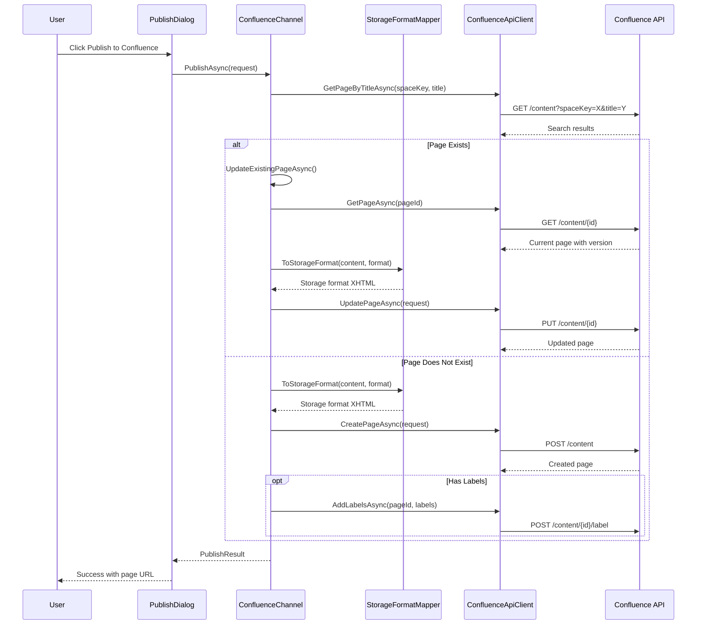

# LCS-DES-084d: Design Specification — Confluence Adapter

## 1. Metadata & Categorization

| Field | Value | Description |
| :--- | :--- | :--- |
| **Feature ID** | `PUB-084d` | Sub-part of PUB-084 |
| **Feature Name** | `Confluence Adapter` | Atlassian API integration for Confluence spaces |
| **Target Version** | `v0.8.4d` | Fourth sub-part of v0.8.4 |
| **Module Scope** | `Lexichord.Modules.Publishing` | Publishing module |
| **Swimlane** | `Publisher` | Part of Publisher vertical |
| **License Tier** | `Teams` | Teams tier required |
| **Feature Gate Key** | `FeatureFlags.Publishing.Confluence` | License check key |
| **Author** | Lead Architect | |
| **Status** | `Draft` | |
| **Last Updated** | `2026-01-27` | |
| **Parent Document** | [LCS-DES-084-INDEX](./LCS-DES-084-INDEX.md) | |
| **Scope Breakdown** | [LCS-SBD-084 Section 3.4](./LCS-SBD-084.md#34-v084d-confluence-adapter) | |

---

## 2. Executive Summary

### 2.1 The Requirement

Confluence is Atlassian's enterprise wiki platform, widely used for internal documentation and knowledge bases. Documentation teams need to:

- Publish Markdown documentation to Confluence spaces
- Maintain page hierarchies with parent/child relationships
- Support versioning with meaningful version comments
- Convert Markdown to Confluence Storage Format (XHTML-based)
- Handle code blocks with syntax highlighting macros
- Manage labels and attachments

### 2.2 The Proposed Solution

Implement a Confluence adapter that:

1. **Implements IPublishingChannel** — Full compliance with the channel abstraction
2. **Uses Atlassian REST API** — Confluence Content API for page operations
3. **Supports Both Auth Methods** — OAuth 2.0 (3LO) for Cloud, PAT for Data Center
4. **Converts Content** — Markdown to Confluence Storage Format with macro support
5. **Manages Versioning** — Increment version numbers with update messages

---

## 3. Architecture & Modular Strategy

### 3.1 Dependencies

#### 3.1.1 Upstream Dependencies

| Interface | Source Version | Purpose |
| :--- | :--- | :--- |
| `IPublishingChannel` | v0.8.4a | Channel abstraction to implement |
| `IChannelConfigurationService` | v0.8.4a | Retrieve stored credentials |
| `IMarkdownParser` | v0.1.3b | Parse Markdown for content conversion |
| `ISecureStorageService` | v0.1.6c | Retrieve stored credentials |
| `Polly` | v0.0.5d | Retry policies for API calls |

#### 3.1.2 NuGet Packages

| Package | Version | Purpose |
| :--- | :--- | :--- |
| `System.Net.Http.Json` | 9.x | JSON HTTP client extensions |
| `Polly.Extensions.Http` | 3.x | HTTP-specific retry policies |
| `System.IdentityModel.Tokens.Jwt` | 7.x | OAuth token handling |

### 3.2 Licensing Behavior

Same as parent feature: **Teams** tier required.

---

## 4. Data Contract (The API)

### 4.1 Confluence Channel Implementation

```csharp
namespace Lexichord.Modules.Publishing.Confluence;

/// <summary>
/// Confluence-specific publishing channel implementation.
/// Supports Confluence Cloud (OAuth 2.0) and Data Center (PAT).
/// </summary>
[RequiresLicense(LicenseTier.Teams)]
public class ConfluenceChannel : IPublishingChannel
{
    private readonly IConfluenceApiClient _apiClient;
    private readonly IConfluenceStorageFormatMapper _contentMapper;
    private readonly ChannelConfiguration _config;
    private readonly ILogger<ConfluenceChannel> _logger;

    public Guid ChannelId => _config.ChannelId;
    public string DisplayName => _config.DisplayName;
    public ChannelType Type => ChannelType.Confluence;

    [ObservableProperty]
    private ChannelStatus _status = ChannelStatus.Disconnected;

    public ConfluenceChannel(
        IConfluenceApiClient apiClient,
        IConfluenceStorageFormatMapper contentMapper,
        ChannelConfiguration config,
        ILogger<ConfluenceChannel> logger)
    {
        _apiClient = apiClient;
        _contentMapper = contentMapper;
        _config = config;
        _logger = logger;
    }

    public async Task<ChannelConnectionResult> TestConnectionAsync(CancellationToken ct = default)
    {
        try
        {
            var settings = GetConfluenceSettings();

            _logger.LogDebug("Testing Confluence connection to space {SpaceKey}",
                settings.SpaceKey);

            var user = await _apiClient.GetCurrentUserAsync(ct);

            // Verify space access
            var space = await _apiClient.GetSpaceAsync(settings.SpaceKey, ct);

            Status = ChannelStatus.Connected;

            var capabilities = new ChannelCapabilities(
                CanCreate: space.Permissions.Contains("create"),
                CanUpdate: space.Permissions.Contains("update"),
                CanDelete: space.Permissions.Contains("delete"),
                CanListContent: true,
                SupportsDrafts: true,
                SupportsScheduling: false,
                SupportsCategories: false,
                SupportsTags: true); // Labels

            _logger.LogInformation(
                "Confluence connection successful for {User} to space {SpaceKey}",
                user.DisplayName, settings.SpaceKey);

            return new ChannelConnectionResult(
                IsConnected: true,
                ErrorMessage: null,
                Capabilities: capabilities);
        }
        catch (ConfluenceAuthenticationException ex)
        {
            Status = ChannelStatus.AuthenticationRequired;
            _logger.LogWarning("Confluence authentication failed: {Error}", ex.Message);

            return new ChannelConnectionResult(
                IsConnected: false,
                ErrorMessage: "Authentication failed. Please re-authorize with Atlassian.",
                Capabilities: default);
        }
        catch (ConfluenceSpaceNotFoundException ex)
        {
            Status = ChannelStatus.Error;
            _logger.LogWarning("Confluence space not found: {SpaceKey}", ex.SpaceKey);

            return new ChannelConnectionResult(
                IsConnected: false,
                ErrorMessage: $"Space '{ex.SpaceKey}' not found or access denied.",
                Capabilities: default);
        }
    }

    public async Task<PublishResult> PublishAsync(
        PublishRequest request,
        CancellationToken ct = default)
    {
        var settings = GetConfluenceSettings();

        _logger.LogInformation("Publishing to Confluence space {SpaceKey}: {Title}",
            settings.SpaceKey, request.Title);

        // Check if page already exists
        var existingPage = await _apiClient.GetPageByTitleAsync(
            settings.SpaceKey,
            request.Title,
            ct);

        if (existingPage is not null)
        {
            _logger.LogInformation("Page already exists, updating: {PageId}", existingPage.Id);
            return await UpdateExistingPageAsync(existingPage, request, settings, ct);
        }

        // Convert content to Confluence Storage Format
        var storageFormat = _contentMapper.ToStorageFormat(
            request.Content,
            request.Format,
            new StorageFormatOptions
            {
                EnableCodeMacro = true,
                EnableTocMacro = settings.AutoInsertToc,
                EnableInfoPanels = settings.ConvertBlockquotesToPanels
            });

        var pageRequest = new ConfluencePageRequest
        {
            SpaceKey = settings.SpaceKey,
            Title = request.Title,
            Content = storageFormat,
            ParentPageId = settings.ParentPageId,
            Status = request.Options.IsDraft ? "draft" : "current"
        };

        var page = await _apiClient.CreatePageAsync(pageRequest, ct);

        // Add labels if specified
        if (request.Options.Tags?.Count > 0)
        {
            var labels = request.Options.Tags
                .Select(t => new ConfluenceLabel(t))
                .ToList();

            await _apiClient.AddLabelsAsync(page.Id, labels, ct);
        }

        _logger.LogInformation("Published to Confluence: {PageId} at {Url}",
            page.Id, page.Links.WebUi);

        return new PublishResult(
            Success: true,
            RemoteId: page.Id,
            RemoteUrl: BuildFullUrl(page.Links.WebUi),
            ErrorMessage: null,
            PublishedAt: page.History.CreatedDate);
    }

    private async Task<PublishResult> UpdateExistingPageAsync(
        ConfluencePage existingPage,
        PublishRequest request,
        ConfluenceChannelSettings settings,
        CancellationToken ct)
    {
        var storageFormat = _contentMapper.ToStorageFormat(
            request.Content,
            request.Format,
            new StorageFormatOptions
            {
                EnableCodeMacro = true,
                EnableTocMacro = settings.AutoInsertToc,
                EnableInfoPanels = settings.ConvertBlockquotesToPanels
            });

        var updateRequest = new ConfluencePageUpdateRequest
        {
            Id = existingPage.Id,
            Title = request.Title,
            Content = storageFormat,
            Version = existingPage.Version.Number + 1,
            VersionMessage = "Updated via Lexichord"
        };

        var updatedPage = await _apiClient.UpdatePageAsync(updateRequest, ct);

        return new PublishResult(
            Success: true,
            RemoteId: updatedPage.Id,
            RemoteUrl: BuildFullUrl(updatedPage.Links.WebUi),
            ErrorMessage: null,
            PublishedAt: updatedPage.History.LastUpdated.When);
    }

    public async Task<PublishResult> UpdateAsync(
        UpdateRequest request,
        CancellationToken ct = default)
    {
        _logger.LogInformation("Updating Confluence page: {PageId}", request.RemoteId);

        var currentPage = await _apiClient.GetPageAsync(request.RemoteId, ct);

        if (currentPage is null)
        {
            return new PublishResult(
                Success: false,
                RemoteId: request.RemoteId,
                RemoteUrl: null,
                ErrorMessage: "Page not found",
                PublishedAt: default);
        }

        var settings = GetConfluenceSettings();

        var storageFormat = _contentMapper.ToStorageFormat(
            request.Content,
            request.Format,
            new StorageFormatOptions
            {
                EnableCodeMacro = true,
                EnableTocMacro = settings.AutoInsertToc
            });

        var updateRequest = new ConfluencePageUpdateRequest
        {
            Id = request.RemoteId,
            Title = request.Title,
            Content = storageFormat,
            Version = currentPage.Version.Number + 1,
            VersionMessage = request.Options.UpdateMessage ?? "Updated via Lexichord"
        };

        var updatedPage = await _apiClient.UpdatePageAsync(updateRequest, ct);

        _logger.LogInformation("Updated Confluence page: {PageId} (v{Version})",
            updatedPage.Id, updatedPage.Version.Number);

        return new PublishResult(
            Success: true,
            RemoteId: updatedPage.Id,
            RemoteUrl: BuildFullUrl(updatedPage.Links.WebUi),
            ErrorMessage: null,
            PublishedAt: updatedPage.History.LastUpdated.When);
    }

    public async Task<RemoteContentInfo?> GetRemoteContentAsync(
        string remoteId,
        CancellationToken ct = default)
    {
        var page = await _apiClient.GetPageAsync(remoteId, ct);

        if (page is null)
            return null;

        return new RemoteContentInfo(
            RemoteId: page.Id,
            Title: page.Title,
            RemoteUrl: BuildFullUrl(page.Links.WebUi),
            CreatedAt: page.History.CreatedDate,
            ModifiedAt: page.History.LastUpdated.When,
            Author: page.History.LastUpdated.By,
            Status: MapStatus(page.Status));
    }

    private ConfluenceChannelSettings GetConfluenceSettings()
    {
        return new ConfluenceChannelSettings
        {
            SpaceKey = _config.Settings.GetValueOrDefault("spaceKey")
                ?? throw new InvalidOperationException("Confluence space key not configured"),
            ParentPageId = _config.Settings.GetValueOrDefault("parentPageId"),
            AutoInsertToc = bool.TryParse(
                _config.Settings.GetValueOrDefault("autoToc"), out var toc) && toc,
            ConvertBlockquotesToPanels = !bool.TryParse(
                _config.Settings.GetValueOrDefault("convertPanels"), out var panels) || panels
        };
    }

    private string BuildFullUrl(string relativePath)
    {
        var baseUrl = _config.BaseUrl.TrimEnd('/');
        var path = relativePath.TrimStart('/');
        return $"{baseUrl}/{path}";
    }

    private static ContentStatus MapStatus(string confluenceStatus) => confluenceStatus switch
    {
        "current" => ContentStatus.Published,
        "draft" => ContentStatus.Draft,
        "trashed" => ContentStatus.Deleted,
        "archived" => ContentStatus.Archived,
        _ => ContentStatus.Published
    };
}
```

### 4.2 Confluence API Client

```csharp
namespace Lexichord.Modules.Publishing.Confluence;

/// <summary>
/// HTTP client for Confluence REST API.
/// </summary>
public interface IConfluenceApiClient
{
    /// <summary>Gets the current user.</summary>
    Task<ConfluenceUser> GetCurrentUserAsync(CancellationToken ct = default);

    /// <summary>Gets space information.</summary>
    Task<ConfluenceSpace> GetSpaceAsync(string spaceKey, CancellationToken ct = default);

    /// <summary>Gets a page by ID.</summary>
    Task<ConfluencePage?> GetPageAsync(string pageId, CancellationToken ct = default);

    /// <summary>Gets a page by title within a space.</summary>
    Task<ConfluencePage?> GetPageByTitleAsync(
        string spaceKey, string title, CancellationToken ct = default);

    /// <summary>Creates a new page.</summary>
    Task<ConfluencePage> CreatePageAsync(
        ConfluencePageRequest request, CancellationToken ct = default);

    /// <summary>Updates an existing page.</summary>
    Task<ConfluencePage> UpdatePageAsync(
        ConfluencePageUpdateRequest request, CancellationToken ct = default);

    /// <summary>Deletes a page.</summary>
    Task DeletePageAsync(string pageId, CancellationToken ct = default);

    /// <summary>Gets child pages of a parent.</summary>
    Task<IReadOnlyList<ConfluencePageSummary>> GetChildPagesAsync(
        string parentPageId, CancellationToken ct = default);

    /// <summary>Adds labels to a page.</summary>
    Task AddLabelsAsync(
        string pageId, IReadOnlyList<ConfluenceLabel> labels, CancellationToken ct = default);

    /// <summary>Removes a label from a page.</summary>
    Task RemoveLabelAsync(
        string pageId, string labelName, CancellationToken ct = default);

    /// <summary>Uploads an attachment to a page.</summary>
    Task<ConfluenceAttachment> UploadAttachmentAsync(
        string pageId, Stream fileStream, string fileName, string contentType,
        CancellationToken ct = default);
}

public class ConfluenceApiClient : IConfluenceApiClient
{
    private readonly HttpClient _httpClient;
    private readonly ChannelConfiguration _config;
    private readonly ISecureChannelCredentialStore _credentialStore;
    private readonly ILogger<ConfluenceApiClient> _logger;

    public ConfluenceApiClient(
        HttpClient httpClient,
        ChannelConfiguration config,
        ISecureChannelCredentialStore credentialStore,
        ILogger<ConfluenceApiClient> logger)
    {
        _httpClient = httpClient;
        _config = config;
        _credentialStore = credentialStore;
        _logger = logger;

        ConfigureHttpClient();
    }

    private void ConfigureHttpClient()
    {
        // Confluence Cloud: https://{site}.atlassian.net/wiki/rest/api
        // Confluence Server: https://{server}/rest/api
        var baseUrl = _config.BaseUrl.TrimEnd('/');

        if (baseUrl.Contains("atlassian.net"))
        {
            _httpClient.BaseAddress = new Uri($"{baseUrl}/wiki/rest/api/");
        }
        else
        {
            _httpClient.BaseAddress = new Uri($"{baseUrl}/rest/api/");
        }

        _httpClient.DefaultRequestHeaders.Accept.Add(
            new MediaTypeWithQualityHeaderValue("application/json"));
    }

    private async Task EnsureAuthenticatedAsync(CancellationToken ct)
    {
        var credentials = await _credentialStore.GetCredentialsAsync(_config.ChannelId, ct);

        if (credentials is null)
            throw new ConfluenceAuthenticationException("No credentials found for channel");

        switch (_config.AuthType)
        {
            case AuthenticationType.OAuth2:
                if (string.IsNullOrEmpty(credentials.AccessToken))
                    throw new ConfluenceAuthenticationException("OAuth access token not found");

                _httpClient.DefaultRequestHeaders.Authorization =
                    new AuthenticationHeaderValue("Bearer", credentials.AccessToken);
                break;

            case AuthenticationType.PersonalAccessToken:
                if (string.IsNullOrEmpty(credentials.AccessToken))
                    throw new ConfluenceAuthenticationException("Personal Access Token not found");

                _httpClient.DefaultRequestHeaders.Authorization =
                    new AuthenticationHeaderValue("Bearer", credentials.AccessToken);
                break;

            case AuthenticationType.BasicAuth:
                if (string.IsNullOrEmpty(credentials.Username) ||
                    string.IsNullOrEmpty(credentials.Password))
                    throw new ConfluenceAuthenticationException("Basic auth credentials not configured");

                var basicAuth = Convert.ToBase64String(
                    Encoding.UTF8.GetBytes($"{credentials.Username}:{credentials.Password}"));
                _httpClient.DefaultRequestHeaders.Authorization =
                    new AuthenticationHeaderValue("Basic", basicAuth);
                break;

            default:
                throw new ConfluenceAuthenticationException($"Unsupported auth type: {_config.AuthType}");
        }
    }

    public async Task<ConfluenceUser> GetCurrentUserAsync(CancellationToken ct = default)
    {
        await EnsureAuthenticatedAsync(ct);

        var response = await _httpClient.GetAsync("user/current", ct);
        await EnsureSuccessAsync(response, ct);

        return await response.Content.ReadFromJsonAsync<ConfluenceUser>(ct)
            ?? throw new ConfluenceApiException("Failed to parse user response");
    }

    public async Task<ConfluenceSpace> GetSpaceAsync(string spaceKey, CancellationToken ct = default)
    {
        await EnsureAuthenticatedAsync(ct);

        var response = await _httpClient.GetAsync($"space/{spaceKey}?expand=permissions", ct);

        if (response.StatusCode == System.Net.HttpStatusCode.NotFound)
            throw new ConfluenceSpaceNotFoundException(spaceKey);

        await EnsureSuccessAsync(response, ct);

        return await response.Content.ReadFromJsonAsync<ConfluenceSpace>(ct)
            ?? throw new ConfluenceApiException("Failed to parse space response");
    }

    public async Task<ConfluencePage?> GetPageAsync(string pageId, CancellationToken ct = default)
    {
        await EnsureAuthenticatedAsync(ct);

        var response = await _httpClient.GetAsync(
            $"content/{pageId}?expand=version,history.lastUpdated,body.storage,ancestors", ct);

        if (response.StatusCode == System.Net.HttpStatusCode.NotFound)
            return null;

        await EnsureSuccessAsync(response, ct);

        return await response.Content.ReadFromJsonAsync<ConfluencePage>(ct);
    }

    public async Task<ConfluencePage?> GetPageByTitleAsync(
        string spaceKey, string title, CancellationToken ct = default)
    {
        await EnsureAuthenticatedAsync(ct);

        var encodedTitle = Uri.EscapeDataString(title);
        var response = await _httpClient.GetAsync(
            $"content?spaceKey={spaceKey}&title={encodedTitle}&expand=version,history.lastUpdated", ct);

        await EnsureSuccessAsync(response, ct);

        var result = await response.Content.ReadFromJsonAsync<ConfluenceSearchResult>(ct);

        return result?.Results.FirstOrDefault();
    }

    public async Task<ConfluencePage> CreatePageAsync(
        ConfluencePageRequest request, CancellationToken ct = default)
    {
        await EnsureAuthenticatedAsync(ct);

        var apiRequest = new
        {
            type = "page",
            title = request.Title,
            space = new { key = request.SpaceKey },
            status = request.Status,
            ancestors = request.ParentPageId is not null
                ? new[] { new { id = request.ParentPageId } }
                : null,
            body = new
            {
                storage = new
                {
                    value = request.Content,
                    representation = "storage"
                }
            }
        };

        var response = await _httpClient.PostAsJsonAsync("content", apiRequest, ct);
        await EnsureSuccessAsync(response, ct);

        return await response.Content.ReadFromJsonAsync<ConfluencePage>(ct)
            ?? throw new ConfluenceApiException("Failed to parse page response");
    }

    public async Task<ConfluencePage> UpdatePageAsync(
        ConfluencePageUpdateRequest request, CancellationToken ct = default)
    {
        await EnsureAuthenticatedAsync(ct);

        var apiRequest = new
        {
            type = "page",
            title = request.Title,
            version = new
            {
                number = request.Version,
                message = request.VersionMessage
            },
            body = new
            {
                storage = new
                {
                    value = request.Content,
                    representation = "storage"
                }
            }
        };

        var response = await _httpClient.PutAsJsonAsync($"content/{request.Id}", apiRequest, ct);
        await EnsureSuccessAsync(response, ct);

        return await response.Content.ReadFromJsonAsync<ConfluencePage>(ct)
            ?? throw new ConfluenceApiException("Failed to parse page response");
    }

    public async Task AddLabelsAsync(
        string pageId, IReadOnlyList<ConfluenceLabel> labels, CancellationToken ct = default)
    {
        await EnsureAuthenticatedAsync(ct);

        var apiLabels = labels.Select(l => new { prefix = l.Prefix, name = l.Name }).ToArray();

        var response = await _httpClient.PostAsJsonAsync($"content/{pageId}/label", apiLabels, ct);
        await EnsureSuccessAsync(response, ct);
    }

    public async Task<ConfluenceAttachment> UploadAttachmentAsync(
        string pageId, Stream fileStream, string fileName, string contentType,
        CancellationToken ct = default)
    {
        await EnsureAuthenticatedAsync(ct);

        using var content = new MultipartFormDataContent();
        using var fileContent = new StreamContent(fileStream);
        fileContent.Headers.ContentType = new MediaTypeHeaderValue(contentType);

        content.Add(fileContent, "file", fileName);

        // Confluence requires X-Atlassian-Token header for attachments
        using var request = new HttpRequestMessage(HttpMethod.Post, $"content/{pageId}/child/attachment");
        request.Headers.Add("X-Atlassian-Token", "nocheck");
        request.Content = content;

        var response = await _httpClient.SendAsync(request, ct);
        await EnsureSuccessAsync(response, ct);

        var result = await response.Content.ReadFromJsonAsync<ConfluenceAttachmentResult>(ct);
        return result?.Results.FirstOrDefault()
            ?? throw new ConfluenceApiException("Failed to parse attachment response");
    }

    private async Task EnsureSuccessAsync(HttpResponseMessage response, CancellationToken ct)
    {
        if (response.IsSuccessStatusCode)
            return;

        var errorContent = await response.Content.ReadAsStringAsync(ct);

        if (response.StatusCode == System.Net.HttpStatusCode.Unauthorized ||
            response.StatusCode == System.Net.HttpStatusCode.Forbidden)
        {
            throw new ConfluenceAuthenticationException(
                $"Authentication failed: {response.StatusCode} - {errorContent}");
        }

        throw new ConfluenceApiException(
            $"Confluence API error: {response.StatusCode} - {errorContent}");
    }
}
```

### 4.3 Storage Format Mapper

```csharp
namespace Lexichord.Modules.Publishing.Confluence;

/// <summary>
/// Converts Markdown to Confluence Storage Format (XHTML-based).
/// </summary>
public interface IConfluenceStorageFormatMapper
{
    /// <summary>
    /// Converts content to Confluence Storage Format.
    /// </summary>
    string ToStorageFormat(
        string content,
        ContentFormat sourceFormat,
        StorageFormatOptions? options = null);

    /// <summary>
    /// Converts Confluence Storage Format back to Markdown.
    /// </summary>
    string FromStorageFormat(string storageContent);
}

/// <summary>
/// Options for Storage Format conversion.
/// </summary>
public record StorageFormatOptions
{
    public bool EnableCodeMacro { get; init; } = true;
    public bool EnableTocMacro { get; init; }
    public bool EnableInfoPanels { get; init; } = true;
    public string DefaultCodeLanguage { get; init; } = "text";
}

public class ConfluenceStorageFormatMapper : IConfluenceStorageFormatMapper
{
    private readonly IMarkdownParser _markdownParser;
    private readonly ILogger<ConfluenceStorageFormatMapper> _logger;

    public ConfluenceStorageFormatMapper(
        IMarkdownParser markdownParser,
        ILogger<ConfluenceStorageFormatMapper> logger)
    {
        _markdownParser = markdownParser;
        _logger = logger;
    }

    public string ToStorageFormat(
        string content,
        ContentFormat sourceFormat,
        StorageFormatOptions? options = null)
    {
        options ??= new StorageFormatOptions();

        var builder = new StringBuilder();

        // Add TOC macro if enabled
        if (options.EnableTocMacro)
        {
            builder.AppendLine(GenerateTocMacro());
        }

        if (sourceFormat == ContentFormat.Html)
        {
            builder.Append(SanitizeHtmlForConfluence(content));
            return builder.ToString();
        }

        // Parse Markdown to AST
        var ast = _markdownParser.Parse(content);

        foreach (var node in ast.Children)
        {
            var storageElement = ConvertNodeToStorage(node, options);
            if (!string.IsNullOrEmpty(storageElement))
            {
                builder.AppendLine(storageElement);
            }
        }

        return builder.ToString().TrimEnd();
    }

    private string ConvertNodeToStorage(MarkdownNode node, StorageFormatOptions options)
    {
        return node switch
        {
            HeadingNode h => ConvertHeading(h),
            ParagraphNode p => ConvertParagraph(p),
            CodeBlockNode c => ConvertCodeBlock(c, options),
            ListNode l => ConvertList(l),
            BlockquoteNode b => ConvertBlockquote(b, options),
            ImageNode i => ConvertImage(i),
            TableNode t => ConvertTable(t),
            HorizontalRuleNode => "<hr/>",
            _ => ConvertGeneric(node)
        };
    }

    private static string ConvertHeading(HeadingNode heading)
    {
        return $"<h{heading.Level}>{heading.InnerHtml}</h{heading.Level}>";
    }

    private static string ConvertParagraph(ParagraphNode paragraph)
    {
        return $"<p>{paragraph.InnerHtml}</p>";
    }

    private string ConvertCodeBlock(CodeBlockNode codeBlock, StorageFormatOptions options)
    {
        if (!options.EnableCodeMacro)
        {
            // Fallback to preformatted text
            var escaped = System.Security.SecurityElement.Escape(codeBlock.Code);
            return $"<pre>{escaped}</pre>";
        }

        var language = codeBlock.Language ?? options.DefaultCodeLanguage;
        var escapedCode = System.Security.SecurityElement.Escape(codeBlock.Code);

        // Confluence Code Macro
        return $@"<ac:structured-macro ac:name=""code"">
  <ac:parameter ac:name=""language"">{language}</ac:parameter>
  <ac:parameter ac:name=""linenumbers"">true</ac:parameter>
  <ac:plain-text-body><![CDATA[{codeBlock.Code}]]></ac:plain-text-body>
</ac:structured-macro>";
    }

    private string ConvertList(ListNode list)
    {
        var tag = list.IsOrdered ? "ol" : "ul";
        var items = new StringBuilder();

        foreach (var item in list.Items)
        {
            items.AppendLine($"  <li>{item.InnerHtml}</li>");
        }

        return $"<{tag}>\n{items}</{tag}>";
    }

    private string ConvertBlockquote(BlockquoteNode blockquote, StorageFormatOptions options)
    {
        if (options.EnableInfoPanels)
        {
            // Detect panel type from content
            var panelType = DetectPanelType(blockquote.InnerHtml);

            return $@"<ac:structured-macro ac:name=""{panelType}"">
  <ac:rich-text-body>
    <p>{StripPanelPrefix(blockquote.InnerHtml)}</p>
  </ac:rich-text-body>
</ac:structured-macro>";
        }

        // Standard blockquote
        return $"<blockquote><p>{blockquote.InnerHtml}</p></blockquote>";
    }

    private static string DetectPanelType(string content)
    {
        var lowerContent = content.ToLowerInvariant().TrimStart();

        if (lowerContent.StartsWith("warning:") || lowerContent.StartsWith("caution:"))
            return "warning";
        if (lowerContent.StartsWith("note:") || lowerContent.StartsWith("info:"))
            return "info";
        if (lowerContent.StartsWith("tip:"))
            return "tip";

        return "info"; // Default panel type
    }

    private static string StripPanelPrefix(string content)
    {
        var prefixes = new[] { "warning:", "caution:", "note:", "info:", "tip:" };

        foreach (var prefix in prefixes)
        {
            if (content.TrimStart().StartsWith(prefix, StringComparison.OrdinalIgnoreCase))
            {
                return content.TrimStart().Substring(prefix.Length).TrimStart();
            }
        }

        return content;
    }

    private static string ConvertImage(ImageNode image)
    {
        var altAttr = !string.IsNullOrEmpty(image.Alt) ? $" ac:alt=\"{image.Alt}\"" : "";

        // Check if it's an external URL or attachment
        if (image.Src.StartsWith("http://") || image.Src.StartsWith("https://"))
        {
            return $@"<ac:image{altAttr}>
  <ri:url ri:value=""{image.Src}""/>
</ac:image>";
        }

        // Attachment reference
        return $@"<ac:image{altAttr}>
  <ri:attachment ri:filename=""{image.Src}""/>
</ac:image>";
    }

    private string ConvertTable(TableNode table)
    {
        var builder = new StringBuilder();
        builder.AppendLine("<table>");

        // Header row
        if (table.Headers.Count > 0)
        {
            builder.AppendLine("  <tr>");
            foreach (var header in table.Headers)
            {
                builder.AppendLine($"    <th>{header}</th>");
            }
            builder.AppendLine("  </tr>");
        }

        // Data rows
        foreach (var row in table.Rows)
        {
            builder.AppendLine("  <tr>");
            foreach (var cell in row)
            {
                builder.AppendLine($"    <td>{cell}</td>");
            }
            builder.AppendLine("  </tr>");
        }

        builder.AppendLine("</table>");
        return builder.ToString();
    }

    private string ConvertGeneric(MarkdownNode node)
    {
        var html = _markdownParser.ToHtml(node);
        return SanitizeHtmlForConfluence(html);
    }

    private static string GenerateTocMacro()
    {
        return @"<ac:structured-macro ac:name=""toc"">
  <ac:parameter ac:name=""printable"">true</ac:parameter>
  <ac:parameter ac:name=""style"">disc</ac:parameter>
  <ac:parameter ac:name=""maxLevel"">3</ac:parameter>
  <ac:parameter ac:name=""minLevel"">1</ac:parameter>
</ac:structured-macro>";
    }

    private static string SanitizeHtmlForConfluence(string html)
    {
        // Confluence Storage Format requires specific XHTML
        var result = html;

        // Self-closing tags
        result = Regex.Replace(result, @"<(br|hr|img)([^>]*)>", "<$1$2/>");

        // Remove script/style tags
        result = Regex.Replace(result, @"<script[^>]*>[\s\S]*?</script>", "", RegexOptions.IgnoreCase);
        result = Regex.Replace(result, @"<style[^>]*>[\s\S]*?</style>", "", RegexOptions.IgnoreCase);

        return result;
    }

    public string FromStorageFormat(string storageContent)
    {
        var result = storageContent;

        // Remove Confluence macros and convert to Markdown
        // Code macro -> fenced code block
        result = Regex.Replace(
            result,
            @"<ac:structured-macro ac:name=""code""[^>]*>.*?<ac:parameter ac:name=""language"">([^<]+)</ac:parameter>.*?<ac:plain-text-body><!\[CDATA\[(.*?)\]\]></ac:plain-text-body>.*?</ac:structured-macro>",
            "```$1\n$2\n```",
            RegexOptions.Singleline);

        // Info/warning panels -> blockquotes
        result = Regex.Replace(
            result,
            @"<ac:structured-macro ac:name=""(info|warning|note|tip)""[^>]*>.*?<ac:rich-text-body>(.*?)</ac:rich-text-body>.*?</ac:structured-macro>",
            "> $2",
            RegexOptions.Singleline);

        // TOC macro -> empty (or could add placeholder)
        result = Regex.Replace(
            result,
            @"<ac:structured-macro ac:name=""toc""[^>]*>.*?</ac:structured-macro>",
            "",
            RegexOptions.Singleline);

        // Standard HTML to Markdown conversion
        result = HtmlToMarkdown(result);

        return result.Trim();
    }

    private static string HtmlToMarkdown(string html)
    {
        var result = html;

        // Headers
        result = Regex.Replace(result, @"<h1[^>]*>(.+?)</h1>", "# $1\n");
        result = Regex.Replace(result, @"<h2[^>]*>(.+?)</h2>", "## $1\n");
        result = Regex.Replace(result, @"<h3[^>]*>(.+?)</h3>", "### $1\n");
        result = Regex.Replace(result, @"<h4[^>]*>(.+?)</h4>", "#### $1\n");
        result = Regex.Replace(result, @"<h5[^>]*>(.+?)</h5>", "##### $1\n");
        result = Regex.Replace(result, @"<h6[^>]*>(.+?)</h6>", "###### $1\n");

        // Paragraphs
        result = Regex.Replace(result, @"<p[^>]*>(.+?)</p>", "$1\n\n", RegexOptions.Singleline);

        // Bold and italic
        result = Regex.Replace(result, @"<strong>(.+?)</strong>", "**$1**");
        result = Regex.Replace(result, @"<em>(.+?)</em>", "*$1*");

        // Links
        result = Regex.Replace(result, @"<a[^>]*href=""([^""]+)""[^>]*>(.+?)</a>", "[$2]($1)");

        // Code
        result = Regex.Replace(result, @"<code>(.+?)</code>", "`$1`");

        // Preformatted
        result = Regex.Replace(result, @"<pre[^>]*>(.+?)</pre>", "```\n$1\n```", RegexOptions.Singleline);

        // Lists
        result = Regex.Replace(result, @"<li>(.+?)</li>", "- $1\n");
        result = Regex.Replace(result, @"</?[ou]l>", "");

        // Horizontal rules
        result = Regex.Replace(result, @"<hr\s*/?>", "---\n");

        // Strip remaining HTML tags
        result = Regex.Replace(result, @"<[^>]+>", "");

        // Decode HTML entities
        result = System.Net.WebUtility.HtmlDecode(result);

        return result;
    }
}
```

---

## 5. Data Transfer Objects

```csharp
namespace Lexichord.Modules.Publishing.Confluence;

/// <summary>
/// Confluence user information.
/// </summary>
public record ConfluenceUser(
    [property: JsonPropertyName("accountId")] string AccountId,
    [property: JsonPropertyName("displayName")] string DisplayName,
    [property: JsonPropertyName("email")] string? Email,
    [property: JsonPropertyName("profilePicture")] ConfluenceProfilePicture? ProfilePicture);

public record ConfluenceProfilePicture(
    [property: JsonPropertyName("path")] string Path);

/// <summary>
/// Confluence space.
/// </summary>
public record ConfluenceSpace(
    [property: JsonPropertyName("key")] string Key,
    [property: JsonPropertyName("name")] string Name,
    [property: JsonPropertyName("type")] string Type,
    [property: JsonPropertyName("_links")] ConfluenceLinks Links,
    [property: JsonPropertyName("permissions")] IReadOnlyList<ConfluencePermission>? PermissionList)
{
    public IReadOnlyList<string> Permissions => PermissionList?
        .Select(p => p.Operation?.Key ?? "")
        .Where(k => !string.IsNullOrEmpty(k))
        .ToList() ?? Array.Empty<string>();
}

public record ConfluencePermission(
    [property: JsonPropertyName("operation")] ConfluenceOperation? Operation);

public record ConfluenceOperation(
    [property: JsonPropertyName("key")] string Key);

/// <summary>
/// Confluence page.
/// </summary>
public record ConfluencePage(
    [property: JsonPropertyName("id")] string Id,
    [property: JsonPropertyName("title")] string Title,
    [property: JsonPropertyName("type")] string Type,
    [property: JsonPropertyName("status")] string Status,
    [property: JsonPropertyName("body")] ConfluencePageBody? Body,
    [property: JsonPropertyName("version")] ConfluenceVersion Version,
    [property: JsonPropertyName("history")] ConfluenceHistory History,
    [property: JsonPropertyName("_links")] ConfluenceLinks Links,
    [property: JsonPropertyName("ancestors")] IReadOnlyList<ConfluencePageAncestor>? Ancestors);

public record ConfluencePageAncestor(
    [property: JsonPropertyName("id")] string Id,
    [property: JsonPropertyName("title")] string Title);

/// <summary>
/// Page body content.
/// </summary>
public record ConfluencePageBody(
    [property: JsonPropertyName("storage")] ConfluenceStorageContent Storage);

/// <summary>
/// Storage format content.
/// </summary>
public record ConfluenceStorageContent(
    [property: JsonPropertyName("value")] string Value,
    [property: JsonPropertyName("representation")] string Representation);

/// <summary>
/// Page version.
/// </summary>
public record ConfluenceVersion(
    [property: JsonPropertyName("number")] int Number,
    [property: JsonPropertyName("message")] string? Message,
    [property: JsonPropertyName("when")] DateTime When);

/// <summary>
/// Page history.
/// </summary>
public record ConfluenceHistory(
    [property: JsonPropertyName("createdDate")] DateTime CreatedDate,
    [property: JsonPropertyName("lastUpdated")] ConfluenceLastUpdated LastUpdated);

/// <summary>
/// Last updated information.
/// </summary>
public record ConfluenceLastUpdated(
    [property: JsonPropertyName("when")] DateTime When,
    [property: JsonPropertyName("by")] ConfluenceUserRef? ByUser)
{
    public string? By => ByUser?.DisplayName;
}

public record ConfluenceUserRef(
    [property: JsonPropertyName("displayName")] string DisplayName);

/// <summary>
/// Confluence links.
/// </summary>
public record ConfluenceLinks(
    [property: JsonPropertyName("webui")] string WebUi,
    [property: JsonPropertyName("edit")] string? Edit,
    [property: JsonPropertyName("self")] string Self);

/// <summary>
/// Page summary for listings.
/// </summary>
public record ConfluencePageSummary(
    [property: JsonPropertyName("id")] string Id,
    [property: JsonPropertyName("title")] string Title,
    [property: JsonPropertyName("status")] string Status);

/// <summary>
/// Search result container.
/// </summary>
public record ConfluenceSearchResult(
    [property: JsonPropertyName("results")] IReadOnlyList<ConfluencePage> Results,
    [property: JsonPropertyName("size")] int Size);

/// <summary>
/// Request to create a page.
/// </summary>
public record ConfluencePageRequest
{
    public required string SpaceKey { get; init; }
    public required string Title { get; init; }
    public required string Content { get; init; }
    public string? ParentPageId { get; init; }
    public string Status { get; init; } = "current";
}

/// <summary>
/// Request to update a page.
/// </summary>
public record ConfluencePageUpdateRequest
{
    public required string Id { get; init; }
    public required string Title { get; init; }
    public required string Content { get; init; }
    public required int Version { get; init; }
    public string? VersionMessage { get; init; }
}

/// <summary>
/// Confluence label.
/// </summary>
public record ConfluenceLabel(
    string Name,
    string Prefix = "global");

/// <summary>
/// Confluence attachment.
/// </summary>
public record ConfluenceAttachment(
    [property: JsonPropertyName("id")] string Id,
    [property: JsonPropertyName("title")] string Title,
    [property: JsonPropertyName("mediaType")] string MediaType,
    [property: JsonPropertyName("fileSize")] long FileSize,
    [property: JsonPropertyName("_links")] ConfluenceAttachmentLinks Links);

public record ConfluenceAttachmentLinks(
    [property: JsonPropertyName("download")] string Download);

public record ConfluenceAttachmentResult(
    [property: JsonPropertyName("results")] IReadOnlyList<ConfluenceAttachment> Results);

/// <summary>
/// Confluence channel settings.
/// </summary>
public record ConfluenceChannelSettings
{
    public required string SpaceKey { get; init; }
    public string? ParentPageId { get; init; }
    public bool AutoInsertToc { get; init; }
    public bool ConvertBlockquotesToPanels { get; init; } = true;
}
```

---

## 6. Error Handling

```csharp
namespace Lexichord.Modules.Publishing.Confluence;

public class ConfluenceException : Exception
{
    public ConfluenceException(string message) : base(message) { }
    public ConfluenceException(string message, Exception inner) : base(message, inner) { }
}

public class ConfluenceAuthenticationException : ConfluenceException
{
    public ConfluenceAuthenticationException(string message) : base(message) { }
}

public class ConfluenceSpaceNotFoundException : ConfluenceException
{
    public string SpaceKey { get; }
    public ConfluenceSpaceNotFoundException(string spaceKey)
        : base($"Space '{spaceKey}' not found")
    {
        SpaceKey = spaceKey;
    }
}

public class ConfluenceApiException : ConfluenceException
{
    public int? StatusCode { get; }
    public ConfluenceApiException(string message, int? statusCode = null) : base(message)
    {
        StatusCode = statusCode;
    }
}

public class ConfluenceVersionConflictException : ConfluenceApiException
{
    public int ExpectedVersion { get; }
    public int ActualVersion { get; }

    public ConfluenceVersionConflictException(int expected, int actual)
        : base($"Version conflict: expected {expected}, actual {actual}", 409)
    {
        ExpectedVersion = expected;
        ActualVersion = actual;
    }
}
```

---

## 7. Implementation Logic

### 7.1 Publishing Flow



### 7.2 Storage Format Conversion Examples

| Markdown | Confluence Storage Format |
| :--- | :--- |
| `# Heading` | `<h1>Heading</h1>` |
| `**bold**` | `<strong>bold</strong>` |
| `` ```python ``` `` | `<ac:structured-macro ac:name="code"><ac:parameter ac:name="language">python</ac:parameter>...` |
| `> Note: text` | `<ac:structured-macro ac:name="info"><ac:rich-text-body><p>text</p></ac:rich-text-body>...` |
| `> Warning: text` | `<ac:structured-macro ac:name="warning"><ac:rich-text-body><p>text</p></ac:rich-text-body>...` |
| `` | `<ac:image ac:alt="alt"><ri:url ri:value="url"/></ac:image>` |

---

## 8. Observability & Logging

| Level | Source | Message Template |
| :--- | :--- | :--- |
| Debug | ApiClient | `"Confluence API request: {Method} {Endpoint}"` |
| Debug | Mapper | `"Converting node to Storage Format: {NodeType}"` |
| Info | Channel | `"Publishing to Confluence space {SpaceKey}: {Title}"` |
| Info | Channel | `"Published: {PageId} at {Url}"` |
| Info | Channel | `"Updated page: {PageId} (v{Version})"` |
| Warning | Channel | `"Page already exists, updating: {PageId}"` |
| Warning | ApiClient | `"Confluence API rate limit: {Remaining}"` |
| Error | ApiClient | `"Confluence API error: {StatusCode} - {Message}"` |
| Error | Channel | `"Publish failed: {Error}"` |

---

## 9. Acceptance Criteria

| # | Given | When | Then |
| :--- | :--- | :--- | :--- |
| 1 | Confluence channel configured with OAuth | Testing connection | Status shows "Connected" with space access |
| 2 | Confluence channel configured with PAT | Testing connection | Status shows "Connected" |
| 3 | Markdown with headings | Publishing | Headings converted to h1-h6 tags |
| 4 | Markdown with code blocks | Publishing | Code macro with language parameter |
| 5 | Markdown with `> Note:` blockquote | Publishing | Info panel macro |
| 6 | Markdown with `> Warning:` blockquote | Publishing | Warning panel macro |
| 7 | TOC option enabled | Publishing | TOC macro at top of page |
| 8 | Page does not exist | Publishing | New page created in space |
| 9 | Page with same title exists | Publishing | Existing page updated |
| 10 | Update with version conflict | Updating | Fetch latest version and retry |
| 11 | Labels specified | Publishing | Labels added to page |
| 12 | Parent page specified | Publishing | Page created as child of parent |
| 13 | Draft option selected | Publishing | Page created with "draft" status |

---

## 10. Deliverable Checklist

| # | Deliverable | Status |
| :--- | :--- | :--- |
| 1 | `ConfluenceChannel.cs` | [ ] |
| 2 | `IConfluenceApiClient.cs` interface | [ ] |
| 3 | `ConfluenceApiClient.cs` implementation | [ ] |
| 4 | `IConfluenceStorageFormatMapper.cs` interface | [ ] |
| 5 | `ConfluenceStorageFormatMapper.cs` implementation | [ ] |
| 6 | Confluence DTOs (User, Space, Page, etc.) | [ ] |
| 7 | Confluence exceptions | [ ] |
| 8 | OAuth 2.0 (3LO) for Cloud | [ ] |
| 9 | PAT authentication for Data Center | [ ] |
| 10 | Code macro generation | [ ] |
| 11 | Info/warning panel generation | [ ] |
| 12 | TOC macro generation | [ ] |
| 13 | Unit tests for StorageFormatMapper | [ ] |
| 14 | Unit tests for Channel | [ ] |
| 15 | Integration tests (with test space) | [ ] |

---

## 11. Verification Commands

```bash
# Run Confluence adapter unit tests
dotnet test --filter "FullyQualifiedName~Confluence"

# Run storage format mapper tests
dotnet test --filter "FullyQualifiedName~StorageFormatMapper"

# Run integration tests (requires credentials)
LEXICHORD_TEST_CONFLUENCE_URL=https://test.atlassian.net \
LEXICHORD_TEST_CONFLUENCE_TOKEN=xxx \
LEXICHORD_TEST_CONFLUENCE_SPACE=TEST \
dotnet test --filter "Category=Integration&FullyQualifiedName~Confluence"

# Manual verification:
# 1. Configure Confluence channel with OAuth or PAT
# 2. Test connection - verify success and space access
# 3. Create Markdown document with various elements
# 4. Publish to Confluence
# 5. Verify page appears in correct space
# 6. Verify code blocks use code macro
# 7. Verify blockquotes converted to panels
# 8. Update the document
# 9. Verify version incremented on Confluence
# 10. Check page history shows update message
```

---

## Document History

| Version | Date | Author | Changes |
| :--- | :--- | :--- | :--- |
| 1.0 | 2026-01-27 | Lead Architect | Initial draft |
