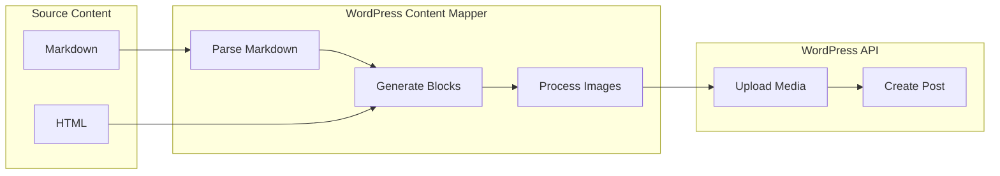
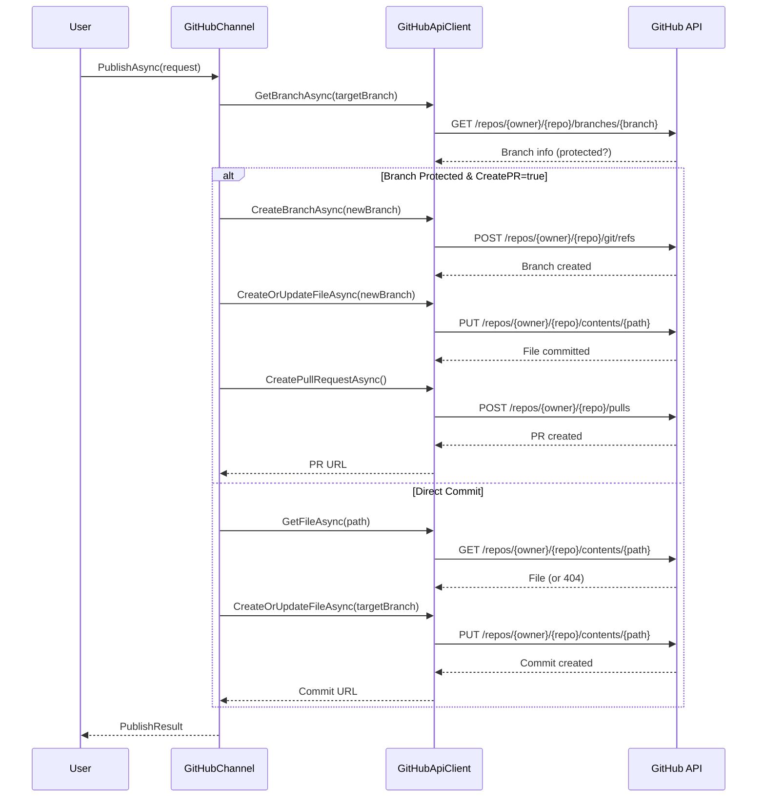
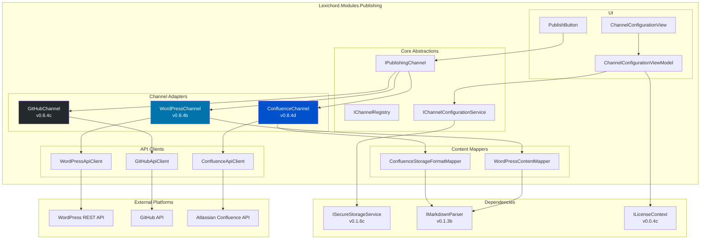
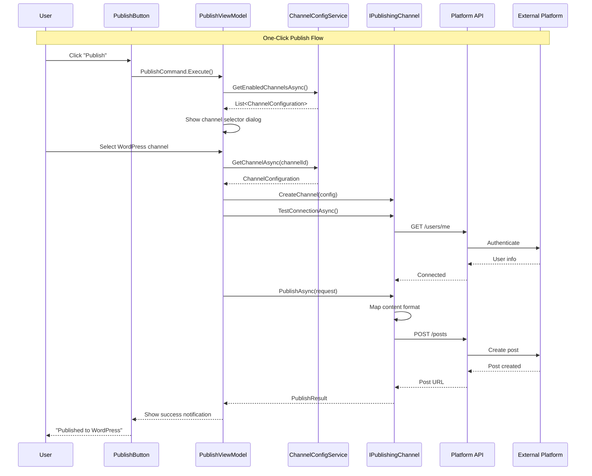

# LCS-SBD-084: Scope Breakdown — Publication Channels

## Document Control

| Field            | Value                                    |
| :--------------- | :--------------------------------------- |
| **Document ID**  | LCS-SBD-084                              |
| **Version**      | v0.8.4                                   |
| **Codename**     | Publication Channels                     |
| **Status**       | Draft                                    |
| **Last Updated** | 2026-01-27                               |
| **Owner**        | Lead Architect                           |
| **Depends On**   | v0.8.1 (Repository Reader), v0.8.2 (Commit Browser), v0.8.3 (Release Notes Agent) |

---

## 1. Executive Summary

### 1.1 The Vision

**v0.8.4** delivers the **Publication Channels** — a distribution network enabling direct publish to external platforms. This release transforms Lexichord from a standalone documentation editor into a connected publishing hub, enabling technical writers to push content directly to WordPress, GitHub repositories, and Confluence spaces with one-click publish functionality.

While v0.8.1-v0.8.3 built the foundation for Git integration and release notes generation, Publication Channels extends Lexichord's reach beyond local editing to become a true documentation distribution platform. Writers can configure multiple "channels" representing different publishing destinations, manage authentication credentials securely, and publish or update content without leaving the application.

### 1.2 Business Value

- **Workflow Efficiency:** Eliminate context-switching between Lexichord and external publishing platforms.
- **Multi-Platform Distribution:** Publish the same content to WordPress blogs, GitHub wikis/READMEs, and Confluence documentation spaces simultaneously.
- **Credential Security:** OAuth and API key management with secure storage prevents credential leakage.
- **Version Control Integration:** GitHub adapter enables creating pull requests for documentation changes, supporting review workflows.
- **Enterprise Collaboration:** Confluence adapter integrates with Atlassian ecosystem for enterprise documentation needs.
- **Foundation:** Establishes adapter pattern for future publishing integrations (Medium, GitLab, Notion, etc.).

### 1.3 Success Criteria

This release succeeds when:

1. Users can configure at least three channel types (WordPress, GitHub, Confluence) with secure credential storage.
2. One-click publish successfully creates or updates content on the target platform.
3. WordPress adapter supports creating posts, updating existing posts, and managing categories/tags.
4. GitHub adapter supports pushing to repositories and creating pull requests with configurable target branches.
5. Confluence adapter supports creating and updating pages within specified spaces.
6. All UI respects license gating (Teams+ for Publication Channels).

### 1.4 License Gating

The Publication Channels feature is a **Teams** feature. Lower tiers will see:

- Read-only access to channel configuration UI (no add/edit/delete capability)
- "Upgrade to Teams" prompt when attempting to add a channel
- Publish buttons disabled with upgrade tooltip
- Channel status indicators visible but non-functional

---

## 2. Dependencies on Prior Versions

| Component                  | Source Version | Usage in v0.8.4                                   |
| :------------------------- | :------------- | :------------------------------------------------ |
| `IGitRepositoryService`    | v0.8.1a        | Repository context for GitHub publishing          |
| `IGitHistoryService`       | v0.8.1a        | Branch information for PR creation                |
| `LibGit2Sharp`             | v0.8.1b        | Git operations for GitHub adapter                 |
| `IMarkdownParser`          | v0.1.3b        | Convert Markdown to platform-specific formats     |
| `ISettingsService`         | v0.1.6a        | Store channel configurations                      |
| `ISecureStorageService`    | v0.1.6c        | Secure credential storage                         |
| `ILicenseContext`          | v0.0.4c        | Feature gating for Teams tier                     |
| `IMediator`                | v0.0.7a        | Event publishing for channel operations           |
| `IConfigurationService`    | v0.0.3d        | Application configuration                         |
| `Serilog`                  | v0.0.3b        | Logging operations                                |
| `Polly`                    | v0.0.5d        | Retry policies for API calls                      |
| `IRegionManager`           | v0.1.1b        | Panel registration for channel management UI      |

---

## 3. Sub-Part Specifications

### 3.1 v0.8.4a: Channel Configuration

| Field            | Value                                     |
| :--------------- | :---------------------------------------- |
| **Sub-Part ID**  | PUB-084a                                  |
| **Title**        | Channel Configuration                     |
| **Module**       | `Lexichord.Modules.Publishing`            |
| **License Tier** | Teams                                     |

**Goal:** Create a unified channel configuration system supporting OAuth flows and API key authentication for multiple publishing platforms.

**Key Deliverables:**

- `IPublishingChannel` abstraction defining common channel operations
- `IChannelRegistry` for managing registered channel adapters
- `IChannelConfigurationService` for CRUD operations on channel configs
- `ChannelConfigurationView.axaml` for channel management UI
- `ChannelConfigurationViewModel` with ObservableCollection<ChannelViewModel>
- OAuth flow integration for WordPress and Atlassian
- Secure API key storage via `ISecureStorageService`
- Unit tests for configuration validation

**Key Interfaces:**

```csharp
namespace Lexichord.Abstractions.Publishing;

/// <summary>
/// Represents a configured publishing channel to an external platform.
/// </summary>
public interface IPublishingChannel
{
    /// <summary>
    /// Unique identifier for this channel instance.
    /// </summary>
    Guid ChannelId { get; }

    /// <summary>
    /// User-friendly display name for the channel.
    /// </summary>
    string DisplayName { get; }

    /// <summary>
    /// The type of platform this channel publishes to.
    /// </summary>
    ChannelType Type { get; }

    /// <summary>
    /// Current connection status of the channel.
    /// </summary>
    ChannelStatus Status { get; }

    /// <summary>
    /// Tests the connection to the remote platform.
    /// </summary>
    Task<ChannelConnectionResult> TestConnectionAsync(CancellationToken ct = default);

    /// <summary>
    /// Publishes content to the remote platform.
    /// </summary>
    Task<PublishResult> PublishAsync(
        PublishRequest request,
        CancellationToken ct = default);

    /// <summary>
    /// Updates existing content on the remote platform.
    /// </summary>
    Task<PublishResult> UpdateAsync(
        UpdateRequest request,
        CancellationToken ct = default);

    /// <summary>
    /// Retrieves metadata about existing content on the remote platform.
    /// </summary>
    Task<RemoteContentInfo?> GetRemoteContentAsync(
        string remoteId,
        CancellationToken ct = default);
}

/// <summary>
/// Enumeration of supported publishing channel types.
/// </summary>
public enum ChannelType
{
    WordPress,
    GitHub,
    Confluence,
    Custom
}

/// <summary>
/// Connection status for a publishing channel.
/// </summary>
public enum ChannelStatus
{
    Disconnected,
    Connecting,
    Connected,
    Error,
    AuthenticationRequired
}

/// <summary>
/// Result of a connection test to a publishing channel.
/// </summary>
public record ChannelConnectionResult(
    bool IsConnected,
    string? ErrorMessage,
    ChannelCapabilities Capabilities);

/// <summary>
/// Describes what operations a channel supports.
/// </summary>
public record ChannelCapabilities(
    bool CanCreate,
    bool CanUpdate,
    bool CanDelete,
    bool CanListContent,
    bool SupportsDrafts,
    bool SupportsScheduling,
    bool SupportsCategories,
    bool SupportsTags);

/// <summary>
/// Request to publish new content to a channel.
/// </summary>
public record PublishRequest(
    string Title,
    string Content,
    ContentFormat Format,
    PublishOptions Options);

/// <summary>
/// Options for publishing content.
/// </summary>
public record PublishOptions(
    bool IsDraft = false,
    DateTime? ScheduledPublishTime = null,
    IReadOnlyList<string>? Categories = null,
    IReadOnlyList<string>? Tags = null,
    string? TargetPath = null,
    IReadOnlyDictionary<string, object>? PlatformSpecificOptions = null);

/// <summary>
/// Format of content being published.
/// </summary>
public enum ContentFormat
{
    Markdown,
    Html,
    PlainText,
    RichText
}

/// <summary>
/// Result of a publish or update operation.
/// </summary>
public record PublishResult(
    bool Success,
    string? RemoteId,
    string? RemoteUrl,
    string? ErrorMessage,
    DateTime PublishedAt);

/// <summary>
/// Request to update existing content.
/// </summary>
public record UpdateRequest(
    string RemoteId,
    string Title,
    string Content,
    ContentFormat Format,
    UpdateOptions Options);

/// <summary>
/// Options for updating content.
/// </summary>
public record UpdateOptions(
    bool CreateNewVersion = true,
    string? UpdateMessage = null,
    IReadOnlyDictionary<string, object>? PlatformSpecificOptions = null);

/// <summary>
/// Information about content that exists on a remote platform.
/// </summary>
public record RemoteContentInfo(
    string RemoteId,
    string Title,
    string RemoteUrl,
    DateTime CreatedAt,
    DateTime ModifiedAt,
    string? Author,
    ContentStatus Status);

/// <summary>
/// Status of content on the remote platform.
/// </summary>
public enum ContentStatus
{
    Published,
    Draft,
    Scheduled,
    Archived,
    Deleted
}
```

```csharp
namespace Lexichord.Abstractions.Publishing;

/// <summary>
/// Registry for managing available channel adapters.
/// </summary>
public interface IChannelRegistry
{
    /// <summary>
    /// Gets all registered channel adapter types.
    /// </summary>
    IReadOnlyList<ChannelAdapterInfo> GetAvailableAdapters();

    /// <summary>
    /// Creates a new channel instance of the specified type.
    /// </summary>
    IPublishingChannel CreateChannel(ChannelType type, ChannelConfiguration config);

    /// <summary>
    /// Registers a new channel adapter factory.
    /// </summary>
    void RegisterAdapter(
        ChannelType type,
        Func<ChannelConfiguration, IPublishingChannel> factory,
        ChannelAdapterInfo info);
}

/// <summary>
/// Metadata about a channel adapter.
/// </summary>
public record ChannelAdapterInfo(
    ChannelType Type,
    string DisplayName,
    string Description,
    string IconKey,
    AuthenticationType AuthType,
    IReadOnlyList<ConfigurationField> RequiredFields);

/// <summary>
/// Type of authentication required by a channel.
/// </summary>
public enum AuthenticationType
{
    None,
    ApiKey,
    OAuth2,
    BasicAuth,
    PersonalAccessToken
}

/// <summary>
/// Describes a configuration field required by a channel adapter.
/// </summary>
public record ConfigurationField(
    string Key,
    string DisplayName,
    string Description,
    FieldType Type,
    bool IsRequired,
    bool IsSecret,
    string? DefaultValue = null,
    string? ValidationPattern = null);

/// <summary>
/// Type of a configuration field.
/// </summary>
public enum FieldType
{
    Text,
    Password,
    Url,
    Number,
    Boolean,
    Select,
    MultiSelect
}
```

```csharp
namespace Lexichord.Abstractions.Publishing;

/// <summary>
/// Service for managing channel configurations.
/// </summary>
public interface IChannelConfigurationService
{
    /// <summary>
    /// Gets all configured channels.
    /// </summary>
    Task<IReadOnlyList<ChannelConfiguration>> GetAllChannelsAsync(
        CancellationToken ct = default);

    /// <summary>
    /// Gets a specific channel configuration by ID.
    /// </summary>
    Task<ChannelConfiguration?> GetChannelAsync(
        Guid channelId,
        CancellationToken ct = default);

    /// <summary>
    /// Adds a new channel configuration.
    /// </summary>
    Task<ChannelConfiguration> AddChannelAsync(
        CreateChannelRequest request,
        CancellationToken ct = default);

    /// <summary>
    /// Updates an existing channel configuration.
    /// </summary>
    Task<ChannelConfiguration> UpdateChannelAsync(
        Guid channelId,
        UpdateChannelRequest request,
        CancellationToken ct = default);

    /// <summary>
    /// Deletes a channel configuration and its stored credentials.
    /// </summary>
    Task DeleteChannelAsync(
        Guid channelId,
        CancellationToken ct = default);

    /// <summary>
    /// Tests a channel's connection to the remote platform.
    /// </summary>
    Task<ChannelConnectionResult> TestChannelConnectionAsync(
        Guid channelId,
        CancellationToken ct = default);

    /// <summary>
    /// Initiates OAuth flow for a channel that requires it.
    /// </summary>
    Task<OAuthFlowResult> InitiateOAuthFlowAsync(
        ChannelType type,
        OAuthConfiguration oauthConfig,
        CancellationToken ct = default);
}

/// <summary>
/// Stored configuration for a publishing channel.
/// </summary>
public record ChannelConfiguration
{
    public Guid ChannelId { get; init; }
    public required string DisplayName { get; init; }
    public ChannelType Type { get; init; }
    public required string BaseUrl { get; init; }
    public AuthenticationType AuthType { get; init; }
    public IReadOnlyDictionary<string, string> Settings { get; init; } =
        new Dictionary<string, string>();
    public DateTime CreatedAt { get; init; }
    public DateTime ModifiedAt { get; init; }
    public bool IsEnabled { get; init; } = true;
}

/// <summary>
/// Request to create a new channel.
/// </summary>
public record CreateChannelRequest(
    string DisplayName,
    ChannelType Type,
    string BaseUrl,
    AuthenticationType AuthType,
    IReadOnlyDictionary<string, string> Settings,
    ChannelCredentials Credentials);

/// <summary>
/// Credentials for authenticating to a channel.
/// </summary>
public record ChannelCredentials(
    string? ApiKey = null,
    string? Username = null,
    string? Password = null,
    string? AccessToken = null,
    string? RefreshToken = null,
    DateTime? TokenExpiry = null);

/// <summary>
/// Request to update an existing channel.
/// </summary>
public record UpdateChannelRequest(
    string? DisplayName = null,
    string? BaseUrl = null,
    IReadOnlyDictionary<string, string>? Settings = null,
    ChannelCredentials? Credentials = null,
    bool? IsEnabled = null);

/// <summary>
/// Result of initiating an OAuth flow.
/// </summary>
public record OAuthFlowResult(
    bool Success,
    string? AuthorizationUrl,
    string? ErrorMessage,
    ChannelCredentials? Credentials);

/// <summary>
/// Configuration for OAuth authentication.
/// </summary>
public record OAuthConfiguration(
    string ClientId,
    string ClientSecret,
    string AuthorizationEndpoint,
    string TokenEndpoint,
    IReadOnlyList<string> Scopes,
    string RedirectUri);
```

**Key UI Components:**

```text
+------------------------------------------------------------------+
|  Publication Channels                           [+ Add Channel]   |
+------------------------------------------------------------------+
| [WordPress icon] My WordPress Blog                    [Connected] |
|   https://myblog.wordpress.com                        [Edit] [X]  |
+------------------------------------------------------------------+
| [GitHub icon] Documentation Repo                      [Connected] |
|   github.com/myorg/docs                               [Edit] [X]  |
+------------------------------------------------------------------+
| [Confluence icon] Team Wiki                    [Auth Required]    |
|   mycompany.atlassian.net                       [Reconnect] [X]   |
+------------------------------------------------------------------+
| [+ Add Channel]                                                   |
|   Configure a new publishing destination                          |
+------------------------------------------------------------------+
```

**Add/Edit Channel Dialog:**

```text
+------------------------------------------------------------------+
|  Add Publishing Channel                                    [X]    |
+------------------------------------------------------------------+
| Channel Type: [WordPress        v]                                |
|                                                                   |
| Display Name: [My WordPress Blog              ]                   |
|                                                                   |
| Site URL:     [https://myblog.wordpress.com   ]                   |
|                                                                   |
| Authentication:                                                   |
|   ( ) OAuth 2.0 (Recommended)    [Authorize with WordPress]       |
|   (x) Application Password                                        |
|       Username: [admin                        ]                   |
|       App Password: [****************************]                |
|                                                                   |
| [Test Connection]              [Cancel]  [Save Channel]           |
+------------------------------------------------------------------+
```

**Storage Location:**

- Windows: `%APPDATA%/Lexichord/publishing/channels.json`
- macOS: `~/Library/Application Support/Lexichord/publishing/channels.json`
- Linux: `~/.config/Lexichord/publishing/channels.json`

Credentials are stored separately via `ISecureStorageService`:
- Windows: Windows Credential Manager
- macOS: Keychain
- Linux: Secret Service API (libsecret)

**Dependencies:**

- v0.1.6a: `ISettingsService` (configuration storage)
- v0.1.6c: `ISecureStorageService` (credential storage)
- v0.0.4c: `ILicenseContext` (Teams tier gating)

---

### 3.2 v0.8.4b: WordPress Adapter

| Field            | Value                                     |
| :--------------- | :---------------------------------------- |
| **Sub-Part ID**  | PUB-084b                                  |
| **Title**        | WordPress Adapter                         |
| **Module**       | `Lexichord.Modules.Publishing`            |
| **License Tier** | Teams                                     |

**Goal:** Implement a WordPress publishing adapter using the WordPress REST API to create, update, and manage posts and pages.

**Key Deliverables:**

- `WordPressChannel` implementing `IPublishingChannel`
- `IWordPressApiClient` for REST API communication
- `WordPressContentMapper` for Markdown to WordPress block format conversion
- Support for posts, pages, categories, tags, and featured images
- OAuth 2.0 flow for WordPress.com and Application Passwords for self-hosted
- Retry policies for transient API failures
- Unit tests for API client and content mapping

**Key Interfaces:**

```csharp
namespace Lexichord.Modules.Publishing.WordPress;

/// <summary>
/// WordPress-specific publishing channel implementation.
/// </summary>
[RequiresLicense(LicenseTier.Teams)]
public class WordPressChannel : IPublishingChannel
{
    private readonly IWordPressApiClient _apiClient;
    private readonly IWordPressContentMapper _contentMapper;
    private readonly ChannelConfiguration _config;
    private readonly ILogger<WordPressChannel> _logger;

    public Guid ChannelId => _config.ChannelId;
    public string DisplayName => _config.DisplayName;
    public ChannelType Type => ChannelType.WordPress;
    public ChannelStatus Status { get; private set; }

    public WordPressChannel(
        IWordPressApiClient apiClient,
        IWordPressContentMapper contentMapper,
        ChannelConfiguration config,
        ILogger<WordPressChannel> logger)
    {
        _apiClient = apiClient;
        _contentMapper = contentMapper;
        _config = config;
        _logger = logger;
    }

    public async Task<ChannelConnectionResult> TestConnectionAsync(
        CancellationToken ct = default)
    {
        try
        {
            var userInfo = await _apiClient.GetCurrentUserAsync(ct);
            Status = ChannelStatus.Connected;

            return new ChannelConnectionResult(
                IsConnected: true,
                ErrorMessage: null,
                Capabilities: new ChannelCapabilities(
                    CanCreate: userInfo.Capabilities.Contains("publish_posts"),
                    CanUpdate: userInfo.Capabilities.Contains("edit_posts"),
                    CanDelete: userInfo.Capabilities.Contains("delete_posts"),
                    CanListContent: true,
                    SupportsDrafts: true,
                    SupportsScheduling: true,
                    SupportsCategories: true,
                    SupportsTags: true));
        }
        catch (WordPressAuthenticationException)
        {
            Status = ChannelStatus.AuthenticationRequired;
            return new ChannelConnectionResult(
                IsConnected: false,
                ErrorMessage: "Authentication failed. Please re-authorize.",
                Capabilities: default);
        }
        catch (Exception ex)
        {
            Status = ChannelStatus.Error;
            _logger.LogError(ex, "Failed to connect to WordPress site {Url}", _config.BaseUrl);
            return new ChannelConnectionResult(
                IsConnected: false,
                ErrorMessage: ex.Message,
                Capabilities: default);
        }
    }

    public async Task<PublishResult> PublishAsync(
        PublishRequest request,
        CancellationToken ct = default)
    {
        var wpContent = _contentMapper.ToWordPressBlocks(request.Content, request.Format);

        var postRequest = new WordPressPostRequest
        {
            Title = request.Title,
            Content = wpContent,
            Status = request.Options.IsDraft ? "draft" : "publish",
            Date = request.Options.ScheduledPublishTime,
            Categories = await ResolveCategoryIdsAsync(request.Options.Categories, ct),
            Tags = await ResolveTagIdsAsync(request.Options.Tags, ct)
        };

        var post = await _apiClient.CreatePostAsync(postRequest, ct);

        return new PublishResult(
            Success: true,
            RemoteId: post.Id.ToString(),
            RemoteUrl: post.Link,
            ErrorMessage: null,
            PublishedAt: post.DateGmt);
    }

    // Additional implementation...
}

/// <summary>
/// REST API client for WordPress.
/// </summary>
public interface IWordPressApiClient
{
    /// <summary>
    /// Gets information about the currently authenticated user.
    /// </summary>
    Task<WordPressUser> GetCurrentUserAsync(CancellationToken ct = default);

    /// <summary>
    /// Creates a new post.
    /// </summary>
    Task<WordPressPost> CreatePostAsync(
        WordPressPostRequest request,
        CancellationToken ct = default);

    /// <summary>
    /// Updates an existing post.
    /// </summary>
    Task<WordPressPost> UpdatePostAsync(
        int postId,
        WordPressPostRequest request,
        CancellationToken ct = default);

    /// <summary>
    /// Gets a post by ID.
    /// </summary>
    Task<WordPressPost?> GetPostAsync(
        int postId,
        CancellationToken ct = default);

    /// <summary>
    /// Deletes a post.
    /// </summary>
    Task DeletePostAsync(
        int postId,
        bool force = false,
        CancellationToken ct = default);

    /// <summary>
    /// Gets all categories.
    /// </summary>
    Task<IReadOnlyList<WordPressCategory>> GetCategoriesAsync(
        CancellationToken ct = default);

    /// <summary>
    /// Gets all tags.
    /// </summary>
    Task<IReadOnlyList<WordPressTag>> GetTagsAsync(
        CancellationToken ct = default);

    /// <summary>
    /// Creates a new category.
    /// </summary>
    Task<WordPressCategory> CreateCategoryAsync(
        string name,
        string? description = null,
        int? parentId = null,
        CancellationToken ct = default);

    /// <summary>
    /// Creates a new tag.
    /// </summary>
    Task<WordPressTag> CreateTagAsync(
        string name,
        string? description = null,
        CancellationToken ct = default);

    /// <summary>
    /// Uploads media (images, files).
    /// </summary>
    Task<WordPressMedia> UploadMediaAsync(
        Stream fileStream,
        string fileName,
        string contentType,
        CancellationToken ct = default);
}

/// <summary>
/// WordPress post data transfer object.
/// </summary>
public record WordPressPost(
    int Id,
    string Title,
    string Content,
    string Excerpt,
    string Status,
    string Link,
    DateTime DateGmt,
    DateTime ModifiedGmt,
    int Author,
    int? FeaturedMedia,
    IReadOnlyList<int> Categories,
    IReadOnlyList<int> Tags);

/// <summary>
/// Request to create or update a WordPress post.
/// </summary>
public record WordPressPostRequest
{
    public string Title { get; init; } = string.Empty;
    public string Content { get; init; } = string.Empty;
    public string? Excerpt { get; init; }
    public string Status { get; init; } = "draft";
    public DateTime? Date { get; init; }
    public int? FeaturedMedia { get; init; }
    public IReadOnlyList<int>? Categories { get; init; }
    public IReadOnlyList<int>? Tags { get; init; }
}

/// <summary>
/// WordPress user information.
/// </summary>
public record WordPressUser(
    int Id,
    string Username,
    string Name,
    string Email,
    IReadOnlyList<string> Capabilities);

/// <summary>
/// WordPress category.
/// </summary>
public record WordPressCategory(
    int Id,
    string Name,
    string Slug,
    string Description,
    int? Parent,
    int Count);

/// <summary>
/// WordPress tag.
/// </summary>
public record WordPressTag(
    int Id,
    string Name,
    string Slug,
    string Description,
    int Count);

/// <summary>
/// WordPress media item.
/// </summary>
public record WordPressMedia(
    int Id,
    string Title,
    string SourceUrl,
    string MimeType,
    int Width,
    int Height);
```

```csharp
namespace Lexichord.Modules.Publishing.WordPress;

/// <summary>
/// Converts Markdown content to WordPress block format.
/// </summary>
public interface IWordPressContentMapper
{
    /// <summary>
    /// Converts content to WordPress Gutenberg block format.
    /// </summary>
    string ToWordPressBlocks(string content, ContentFormat sourceFormat);

    /// <summary>
    /// Converts WordPress block content back to Markdown.
    /// </summary>
    string FromWordPressBlocks(string blockContent);

    /// <summary>
    /// Extracts featured image from content if present.
    /// </summary>
    (string Content, string? FeaturedImageUrl) ExtractFeaturedImage(string content);
}
```

**WordPress API Endpoints:**

| Endpoint | Method | Purpose |
| :--- | :--- | :--- |
| `/wp-json/wp/v2/posts` | GET | List posts |
| `/wp-json/wp/v2/posts` | POST | Create post |
| `/wp-json/wp/v2/posts/{id}` | GET | Get post |
| `/wp-json/wp/v2/posts/{id}` | PUT | Update post |
| `/wp-json/wp/v2/posts/{id}` | DELETE | Delete post |
| `/wp-json/wp/v2/categories` | GET | List categories |
| `/wp-json/wp/v2/tags` | GET | List tags |
| `/wp-json/wp/v2/media` | POST | Upload media |
| `/wp-json/wp/v2/users/me` | GET | Current user info |

**Content Mapping Flow:**



**Dependencies:**

- v0.8.4a: `IPublishingChannel` (channel abstraction)
- v0.1.3b: `IMarkdownParser` (Markdown parsing)
- v0.0.5d: `Polly` (retry policies)

---

### 3.3 v0.8.4c: GitHub Adapter

| Field            | Value                                     |
| :--------------- | :---------------------------------------- |
| **Sub-Part ID**  | PUB-084c                                  |
| **Title**        | GitHub Adapter                            |
| **Module**       | `Lexichord.Modules.Publishing`            |
| **License Tier** | Teams                                     |

**Goal:** Implement a GitHub publishing adapter that can push documentation to repositories and create pull requests for review workflows.

**Key Deliverables:**

- `GitHubChannel` implementing `IPublishingChannel`
- `IGitHubApiClient` for GitHub REST API communication
- Support for pushing to branches (direct commit or via PR)
- Pull request creation with configurable base/head branches
- Support for GitHub wikis and README files
- Personal Access Token (PAT) and GitHub App authentication
- Branch protection awareness (force PR if protected)
- Unit tests for API client and Git operations

**Key Interfaces:**

```csharp
namespace Lexichord.Modules.Publishing.GitHub;

/// <summary>
/// GitHub-specific publishing channel implementation.
/// </summary>
[RequiresLicense(LicenseTier.Teams)]
public class GitHubChannel : IPublishingChannel
{
    private readonly IGitHubApiClient _apiClient;
    private readonly IGitRepositoryService _gitService;
    private readonly ChannelConfiguration _config;
    private readonly ILogger<GitHubChannel> _logger;

    public Guid ChannelId => _config.ChannelId;
    public string DisplayName => _config.DisplayName;
    public ChannelType Type => ChannelType.GitHub;
    public ChannelStatus Status { get; private set; }

    public GitHubChannel(
        IGitHubApiClient apiClient,
        IGitRepositoryService gitService,
        ChannelConfiguration config,
        ILogger<GitHubChannel> logger)
    {
        _apiClient = apiClient;
        _gitService = gitService;
        _config = config;
        _logger = logger;
    }

    public async Task<PublishResult> PublishAsync(
        PublishRequest request,
        CancellationToken ct = default)
    {
        var settings = GetGitHubSettings();

        // Check branch protection
        var branchInfo = await _apiClient.GetBranchAsync(
            settings.Owner,
            settings.Repository,
            settings.TargetBranch,
            ct);

        if (branchInfo.Protected && settings.CreatePullRequest)
        {
            return await CreatePullRequestAsync(request, settings, ct);
        }
        else
        {
            return await DirectCommitAsync(request, settings, ct);
        }
    }

    private async Task<PublishResult> CreatePullRequestAsync(
        PublishRequest request,
        GitHubChannelSettings settings,
        CancellationToken ct)
    {
        // Create a new branch
        var branchName = $"docs/{Guid.NewGuid():N[..8]}-{Slugify(request.Title)}";

        await _apiClient.CreateBranchAsync(
            settings.Owner,
            settings.Repository,
            branchName,
            settings.TargetBranch,
            ct);

        // Commit the content
        var filePath = BuildFilePath(settings, request);
        await _apiClient.CreateOrUpdateFileAsync(
            settings.Owner,
            settings.Repository,
            filePath,
            new GitHubFileRequest
            {
                Message = $"docs: add {request.Title}",
                Content = Convert.ToBase64String(Encoding.UTF8.GetBytes(request.Content)),
                Branch = branchName
            },
            ct);

        // Create pull request
        var pr = await _apiClient.CreatePullRequestAsync(
            settings.Owner,
            settings.Repository,
            new GitHubPullRequestRequest
            {
                Title = $"docs: {request.Title}",
                Body = GeneratePrBody(request),
                Head = branchName,
                Base = settings.TargetBranch
            },
            ct);

        return new PublishResult(
            Success: true,
            RemoteId: pr.Number.ToString(),
            RemoteUrl: pr.HtmlUrl,
            ErrorMessage: null,
            PublishedAt: pr.CreatedAt);
    }

    private async Task<PublishResult> DirectCommitAsync(
        PublishRequest request,
        GitHubChannelSettings settings,
        CancellationToken ct)
    {
        var filePath = BuildFilePath(settings, request);

        // Check if file exists
        var existingFile = await _apiClient.GetFileAsync(
            settings.Owner,
            settings.Repository,
            filePath,
            settings.TargetBranch,
            ct);

        var fileRequest = new GitHubFileRequest
        {
            Message = existingFile is null
                ? $"docs: add {request.Title}"
                : $"docs: update {request.Title}",
            Content = Convert.ToBase64String(Encoding.UTF8.GetBytes(request.Content)),
            Branch = settings.TargetBranch,
            Sha = existingFile?.Sha
        };

        var result = await _apiClient.CreateOrUpdateFileAsync(
            settings.Owner,
            settings.Repository,
            filePath,
            fileRequest,
            ct);

        return new PublishResult(
            Success: true,
            RemoteId: result.Content.Sha,
            RemoteUrl: result.Content.HtmlUrl,
            ErrorMessage: null,
            PublishedAt: DateTime.UtcNow);
    }

    // Additional implementation...
}

/// <summary>
/// REST API client for GitHub.
/// </summary>
public interface IGitHubApiClient
{
    /// <summary>
    /// Gets information about the authenticated user.
    /// </summary>
    Task<GitHubUser> GetCurrentUserAsync(CancellationToken ct = default);

    /// <summary>
    /// Gets repository information.
    /// </summary>
    Task<GitHubRepository> GetRepositoryAsync(
        string owner,
        string repo,
        CancellationToken ct = default);

    /// <summary>
    /// Gets branch information including protection status.
    /// </summary>
    Task<GitHubBranch> GetBranchAsync(
        string owner,
        string repo,
        string branch,
        CancellationToken ct = default);

    /// <summary>
    /// Creates a new branch from a reference.
    /// </summary>
    Task CreateBranchAsync(
        string owner,
        string repo,
        string newBranch,
        string fromBranch,
        CancellationToken ct = default);

    /// <summary>
    /// Gets file contents from a repository.
    /// </summary>
    Task<GitHubFileContent?> GetFileAsync(
        string owner,
        string repo,
        string path,
        string branch,
        CancellationToken ct = default);

    /// <summary>
    /// Creates or updates a file in a repository.
    /// </summary>
    Task<GitHubFileResult> CreateOrUpdateFileAsync(
        string owner,
        string repo,
        string path,
        GitHubFileRequest request,
        CancellationToken ct = default);

    /// <summary>
    /// Creates a pull request.
    /// </summary>
    Task<GitHubPullRequest> CreatePullRequestAsync(
        string owner,
        string repo,
        GitHubPullRequestRequest request,
        CancellationToken ct = default);

    /// <summary>
    /// Lists repository contents (files and directories).
    /// </summary>
    Task<IReadOnlyList<GitHubContent>> ListContentsAsync(
        string owner,
        string repo,
        string path,
        string? branch = null,
        CancellationToken ct = default);
}

/// <summary>
/// GitHub user information.
/// </summary>
public record GitHubUser(
    int Id,
    string Login,
    string Name,
    string Email,
    string AvatarUrl);

/// <summary>
/// GitHub repository information.
/// </summary>
public record GitHubRepository(
    int Id,
    string Name,
    string FullName,
    string Description,
    string DefaultBranch,
    bool Private,
    bool HasWiki,
    GitHubPermissions Permissions);

/// <summary>
/// Repository permissions for the authenticated user.
/// </summary>
public record GitHubPermissions(
    bool Admin,
    bool Push,
    bool Pull);

/// <summary>
/// GitHub branch information.
/// </summary>
public record GitHubBranch(
    string Name,
    string Sha,
    bool Protected);

/// <summary>
/// GitHub file content.
/// </summary>
public record GitHubFileContent(
    string Name,
    string Path,
    string Sha,
    int Size,
    string Content,
    string Encoding,
    string HtmlUrl);

/// <summary>
/// Request to create or update a file.
/// </summary>
public record GitHubFileRequest
{
    public required string Message { get; init; }
    public required string Content { get; init; }
    public required string Branch { get; init; }
    public string? Sha { get; init; }
    public GitHubCommitter? Committer { get; init; }
}

/// <summary>
/// Committer information for a file operation.
/// </summary>
public record GitHubCommitter(
    string Name,
    string Email);

/// <summary>
/// Result of a file create/update operation.
/// </summary>
public record GitHubFileResult(
    GitHubFileContent Content,
    GitHubCommitInfo Commit);

/// <summary>
/// Commit information.
/// </summary>
public record GitHubCommitInfo(
    string Sha,
    string Message,
    string HtmlUrl);

/// <summary>
/// GitHub pull request.
/// </summary>
public record GitHubPullRequest(
    int Number,
    string Title,
    string Body,
    string State,
    string HtmlUrl,
    DateTime CreatedAt,
    string Head,
    string Base);

/// <summary>
/// Request to create a pull request.
/// </summary>
public record GitHubPullRequestRequest
{
    public required string Title { get; init; }
    public string? Body { get; init; }
    public required string Head { get; init; }
    public required string Base { get; init; }
    public bool Draft { get; init; }
}

/// <summary>
/// GitHub content item (file or directory).
/// </summary>
public record GitHubContent(
    string Name,
    string Path,
    string Sha,
    int Size,
    string Type,
    string HtmlUrl);
```

```csharp
namespace Lexichord.Modules.Publishing.GitHub;

/// <summary>
/// Settings specific to GitHub channels.
/// </summary>
public record GitHubChannelSettings
{
    public required string Owner { get; init; }
    public required string Repository { get; init; }
    public string TargetBranch { get; init; } = "main";
    public string BasePath { get; init; } = "docs";
    public bool CreatePullRequest { get; init; } = true;
    public string? PrBaseBranch { get; init; }
    public IReadOnlyList<string>? Reviewers { get; init; }
    public IReadOnlyList<string>? Labels { get; init; }
    public bool UseWiki { get; init; }
}
```

**GitHub API Endpoints:**

| Endpoint | Method | Purpose |
| :--- | :--- | :--- |
| `/user` | GET | Current user info |
| `/repos/{owner}/{repo}` | GET | Repository info |
| `/repos/{owner}/{repo}/branches/{branch}` | GET | Branch info |
| `/repos/{owner}/{repo}/git/refs` | POST | Create branch |
| `/repos/{owner}/{repo}/contents/{path}` | GET | Get file |
| `/repos/{owner}/{repo}/contents/{path}` | PUT | Create/update file |
| `/repos/{owner}/{repo}/pulls` | POST | Create PR |

**Publishing Flow:**



**Dependencies:**

- v0.8.4a: `IPublishingChannel` (channel abstraction)
- v0.8.1a: `IGitRepositoryService` (local repo context)
- v0.0.5d: `Polly` (retry policies)

---

### 3.4 v0.8.4d: Confluence Adapter

| Field            | Value                                     |
| :--------------- | :---------------------------------------- |
| **Sub-Part ID**  | PUB-084d                                  |
| **Title**        | Confluence Adapter                        |
| **Module**       | `Lexichord.Modules.Publishing`            |
| **License Tier** | Teams                                     |

**Goal:** Implement a Confluence publishing adapter using the Atlassian REST API to create and update pages within Confluence spaces.

**Key Deliverables:**

- `ConfluenceChannel` implementing `IPublishingChannel`
- `IConfluenceApiClient` for Atlassian REST API communication
- `ConfluenceStorageFormatMapper` for Markdown to Confluence Storage Format conversion
- Support for pages, child pages, and page hierarchies
- OAuth 2.0 (3LO) for Confluence Cloud authentication
- Personal Access Token for Confluence Data Center
- Macro support (code blocks, info panels, table of contents)
- Unit tests for API client and content mapping

**Key Interfaces:**

```csharp
namespace Lexichord.Modules.Publishing.Confluence;

/// <summary>
/// Confluence-specific publishing channel implementation.
/// </summary>
[RequiresLicense(LicenseTier.Teams)]
public class ConfluenceChannel : IPublishingChannel
{
    private readonly IConfluenceApiClient _apiClient;
    private readonly IConfluenceStorageFormatMapper _contentMapper;
    private readonly ChannelConfiguration _config;
    private readonly ILogger<ConfluenceChannel> _logger;

    public Guid ChannelId => _config.ChannelId;
    public string DisplayName => _config.DisplayName;
    public ChannelType Type => ChannelType.Confluence;
    public ChannelStatus Status { get; private set; }

    public ConfluenceChannel(
        IConfluenceApiClient apiClient,
        IConfluenceStorageFormatMapper contentMapper,
        ChannelConfiguration config,
        ILogger<ConfluenceChannel> logger)
    {
        _apiClient = apiClient;
        _contentMapper = contentMapper;
        _config = config;
        _logger = logger;
    }

    public async Task<ChannelConnectionResult> TestConnectionAsync(
        CancellationToken ct = default)
    {
        try
        {
            var user = await _apiClient.GetCurrentUserAsync(ct);
            var settings = GetConfluenceSettings();

            // Verify space access
            var space = await _apiClient.GetSpaceAsync(settings.SpaceKey, ct);

            Status = ChannelStatus.Connected;
            return new ChannelConnectionResult(
                IsConnected: true,
                ErrorMessage: null,
                Capabilities: new ChannelCapabilities(
                    CanCreate: true,
                    CanUpdate: true,
                    CanDelete: space.Permissions.Contains("delete"),
                    CanListContent: true,
                    SupportsDrafts: true,
                    SupportsScheduling: false,
                    SupportsCategories: false,
                    SupportsTags: true));
        }
        catch (ConfluenceAuthenticationException)
        {
            Status = ChannelStatus.AuthenticationRequired;
            return new ChannelConnectionResult(
                IsConnected: false,
                ErrorMessage: "Authentication failed. Please re-authorize with Atlassian.",
                Capabilities: default);
        }
        catch (ConfluenceSpaceNotFoundException ex)
        {
            Status = ChannelStatus.Error;
            return new ChannelConnectionResult(
                IsConnected: false,
                ErrorMessage: $"Space '{ex.SpaceKey}' not found or access denied.",
                Capabilities: default);
        }
    }

    public async Task<PublishResult> PublishAsync(
        PublishRequest request,
        CancellationToken ct = default)
    {
        var settings = GetConfluenceSettings();

        // Convert content to Confluence Storage Format
        var storageFormat = _contentMapper.ToStorageFormat(
            request.Content,
            request.Format,
            new StorageFormatOptions
            {
                EnableCodeMacro = true,
                EnableTocMacro = settings.AutoInsertToc,
                EnableInfoPanels = true
            });

        var pageRequest = new ConfluencePageRequest
        {
            SpaceKey = settings.SpaceKey,
            Title = request.Title,
            Content = storageFormat,
            ParentPageId = settings.ParentPageId,
            Status = request.Options.IsDraft ? "draft" : "current"
        };

        var page = await _apiClient.CreatePageAsync(pageRequest, ct);

        // Add labels if specified
        if (request.Options.Tags?.Count > 0)
        {
            await _apiClient.AddLabelsAsync(
                page.Id,
                request.Options.Tags.Select(t => new ConfluenceLabel(t)).ToList(),
                ct);
        }

        return new PublishResult(
            Success: true,
            RemoteId: page.Id,
            RemoteUrl: page.Links.WebUi,
            ErrorMessage: null,
            PublishedAt: page.History.CreatedDate);
    }

    public async Task<PublishResult> UpdateAsync(
        UpdateRequest request,
        CancellationToken ct = default)
    {
        // Get current page to obtain version number
        var currentPage = await _apiClient.GetPageAsync(request.RemoteId, ct);

        if (currentPage is null)
        {
            return new PublishResult(
                Success: false,
                RemoteId: request.RemoteId,
                RemoteUrl: null,
                ErrorMessage: "Page not found",
                PublishedAt: default);
        }

        var storageFormat = _contentMapper.ToStorageFormat(
            request.Content,
            request.Format);

        var updateRequest = new ConfluencePageUpdateRequest
        {
            Id = request.RemoteId,
            Title = request.Title,
            Content = storageFormat,
            Version = currentPage.Version.Number + 1,
            VersionMessage = request.Options.UpdateMessage ?? "Updated via Lexichord"
        };

        var updatedPage = await _apiClient.UpdatePageAsync(updateRequest, ct);

        return new PublishResult(
            Success: true,
            RemoteId: updatedPage.Id,
            RemoteUrl: updatedPage.Links.WebUi,
            ErrorMessage: null,
            PublishedAt: updatedPage.History.LastUpdated.When);
    }

    // Additional implementation...
}

/// <summary>
/// REST API client for Confluence.
/// </summary>
public interface IConfluenceApiClient
{
    /// <summary>
    /// Gets information about the current user.
    /// </summary>
    Task<ConfluenceUser> GetCurrentUserAsync(CancellationToken ct = default);

    /// <summary>
    /// Gets space information.
    /// </summary>
    Task<ConfluenceSpace> GetSpaceAsync(
        string spaceKey,
        CancellationToken ct = default);

    /// <summary>
    /// Gets a page by ID.
    /// </summary>
    Task<ConfluencePage?> GetPageAsync(
        string pageId,
        CancellationToken ct = default);

    /// <summary>
    /// Gets a page by title within a space.
    /// </summary>
    Task<ConfluencePage?> GetPageByTitleAsync(
        string spaceKey,
        string title,
        CancellationToken ct = default);

    /// <summary>
    /// Creates a new page.
    /// </summary>
    Task<ConfluencePage> CreatePageAsync(
        ConfluencePageRequest request,
        CancellationToken ct = default);

    /// <summary>
    /// Updates an existing page.
    /// </summary>
    Task<ConfluencePage> UpdatePageAsync(
        ConfluencePageUpdateRequest request,
        CancellationToken ct = default);

    /// <summary>
    /// Deletes a page.
    /// </summary>
    Task DeletePageAsync(
        string pageId,
        CancellationToken ct = default);

    /// <summary>
    /// Gets child pages of a parent page.
    /// </summary>
    Task<IReadOnlyList<ConfluencePageSummary>> GetChildPagesAsync(
        string parentPageId,
        CancellationToken ct = default);

    /// <summary>
    /// Adds labels to a page.
    /// </summary>
    Task AddLabelsAsync(
        string pageId,
        IReadOnlyList<ConfluenceLabel> labels,
        CancellationToken ct = default);

    /// <summary>
    /// Uploads an attachment to a page.
    /// </summary>
    Task<ConfluenceAttachment> UploadAttachmentAsync(
        string pageId,
        Stream fileStream,
        string fileName,
        string contentType,
        CancellationToken ct = default);
}

/// <summary>
/// Confluence user information.
/// </summary>
public record ConfluenceUser(
    string AccountId,
    string DisplayName,
    string Email,
    string ProfilePicture);

/// <summary>
/// Confluence space.
/// </summary>
public record ConfluenceSpace(
    string Key,
    string Name,
    string Type,
    ConfluenceSpaceLinks Links,
    IReadOnlyList<string> Permissions);

/// <summary>
/// Links for a Confluence space.
/// </summary>
public record ConfluenceSpaceLinks(
    string WebUi,
    string Self);

/// <summary>
/// Confluence page.
/// </summary>
public record ConfluencePage(
    string Id,
    string Title,
    string SpaceKey,
    ConfluencePageBody Body,
    ConfluencePageVersion Version,
    ConfluencePageHistory History,
    ConfluencePageLinks Links,
    string? ParentId);

/// <summary>
/// Page body content.
/// </summary>
public record ConfluencePageBody(
    ConfluenceStorageContent Storage);

/// <summary>
/// Storage format content.
/// </summary>
public record ConfluenceStorageContent(
    string Value,
    string Representation);

/// <summary>
/// Page version information.
/// </summary>
public record ConfluencePageVersion(
    int Number,
    string Message,
    DateTime When);

/// <summary>
/// Page history.
/// </summary>
public record ConfluencePageHistory(
    DateTime CreatedDate,
    ConfluenceVersionInfo LastUpdated);

/// <summary>
/// Version info with when/by details.
/// </summary>
public record ConfluenceVersionInfo(
    DateTime When,
    string By);

/// <summary>
/// Links for a Confluence page.
/// </summary>
public record ConfluencePageLinks(
    string WebUi,
    string Edit,
    string Self);

/// <summary>
/// Summary of a Confluence page (for listings).
/// </summary>
public record ConfluencePageSummary(
    string Id,
    string Title,
    string Status);

/// <summary>
/// Request to create a Confluence page.
/// </summary>
public record ConfluencePageRequest
{
    public required string SpaceKey { get; init; }
    public required string Title { get; init; }
    public required string Content { get; init; }
    public string? ParentPageId { get; init; }
    public string Status { get; init; } = "current";
}

/// <summary>
/// Request to update a Confluence page.
/// </summary>
public record ConfluencePageUpdateRequest
{
    public required string Id { get; init; }
    public required string Title { get; init; }
    public required string Content { get; init; }
    public required int Version { get; init; }
    public string? VersionMessage { get; init; }
}

/// <summary>
/// Confluence label.
/// </summary>
public record ConfluenceLabel(
    string Name,
    string Prefix = "global");

/// <summary>
/// Confluence attachment.
/// </summary>
public record ConfluenceAttachment(
    string Id,
    string Title,
    string MediaType,
    long FileSize,
    string DownloadUrl);
```

```csharp
namespace Lexichord.Modules.Publishing.Confluence;

/// <summary>
/// Converts Markdown to Confluence Storage Format (XHTML-based).
/// </summary>
public interface IConfluenceStorageFormatMapper
{
    /// <summary>
    /// Converts content to Confluence Storage Format.
    /// </summary>
    string ToStorageFormat(
        string content,
        ContentFormat sourceFormat,
        StorageFormatOptions? options = null);

    /// <summary>
    /// Converts Confluence Storage Format back to Markdown.
    /// </summary>
    string FromStorageFormat(string storageContent);
}

/// <summary>
/// Options for Storage Format conversion.
/// </summary>
public record StorageFormatOptions
{
    /// <summary>
    /// Use the code macro for fenced code blocks.
    /// </summary>
    public bool EnableCodeMacro { get; init; } = true;

    /// <summary>
    /// Auto-insert Table of Contents macro at the top.
    /// </summary>
    public bool EnableTocMacro { get; init; }

    /// <summary>
    /// Convert blockquotes to info/warning/note panels.
    /// </summary>
    public bool EnableInfoPanels { get; init; } = true;

    /// <summary>
    /// Language for syntax highlighting in code blocks.
    /// </summary>
    public string DefaultCodeLanguage { get; init; } = "text";
}

/// <summary>
/// Settings specific to Confluence channels.
/// </summary>
public record ConfluenceChannelSettings
{
    public required string SpaceKey { get; init; }
    public string? ParentPageId { get; init; }
    public bool AutoInsertToc { get; init; }
    public bool ConvertBlockquotesToPanels { get; init; } = true;
}
```

**Confluence API Endpoints:**

| Endpoint | Method | Purpose |
| :--- | :--- | :--- |
| `/wiki/rest/api/user/current` | GET | Current user info |
| `/wiki/rest/api/space/{spaceKey}` | GET | Space info |
| `/wiki/rest/api/content` | POST | Create page |
| `/wiki/rest/api/content/{id}` | GET | Get page |
| `/wiki/rest/api/content/{id}` | PUT | Update page |
| `/wiki/rest/api/content/{id}` | DELETE | Delete page |
| `/wiki/rest/api/content/{id}/label` | POST | Add labels |
| `/wiki/rest/api/content/{id}/child/attachment` | POST | Upload attachment |

**Storage Format Conversion Examples:**

| Markdown | Confluence Storage Format |
| :--- | :--- |
| `# Heading 1` | `<h1>Heading 1</h1>` |
| `**bold**` | `<strong>bold</strong>` |
| `` `code` `` | `<code>code</code>` |
| Code block with language | `<ac:structured-macro ac:name="code"><ac:parameter ac:name="language">java</ac:parameter><ac:plain-text-body>...</ac:plain-text-body></ac:structured-macro>` |
| `> Note` | `<ac:structured-macro ac:name="info"><ac:rich-text-body><p>Note</p></ac:rich-text-body></ac:structured-macro>` |

**Dependencies:**

- v0.8.4a: `IPublishingChannel` (channel abstraction)
- v0.1.3b: `IMarkdownParser` (Markdown parsing)
- v0.0.5d: `Polly` (retry policies)

---

## 4. Implementation Checklist

| #  | Sub-Part | Task                                                      | Est. Hours |
| :- | :------- | :-------------------------------------------------------- | :--------- |
| 1  | v0.8.4a  | Define `IPublishingChannel` interface                     | 2          |
| 2  | v0.8.4a  | Define `IChannelRegistry` interface                       | 1          |
| 3  | v0.8.4a  | Define `IChannelConfigurationService` interface           | 1.5        |
| 4  | v0.8.4a  | Implement `ChannelConfigurationService`                   | 3          |
| 5  | v0.8.4a  | Implement OAuth flow handler                              | 4          |
| 6  | v0.8.4a  | Create `ChannelConfigurationView.axaml`                   | 3          |
| 7  | v0.8.4a  | Create `ChannelConfigurationViewModel`                    | 2.5        |
| 8  | v0.8.4a  | Create Add/Edit Channel dialog                            | 2          |
| 9  | v0.8.4a  | Implement secure credential storage integration           | 2          |
| 10 | v0.8.4a  | Unit tests for configuration service                      | 2          |
| 11 | v0.8.4b  | Implement `IWordPressApiClient`                           | 4          |
| 12 | v0.8.4b  | Implement `WordPressChannel`                              | 3          |
| 13 | v0.8.4b  | Implement `WordPressContentMapper`                        | 3          |
| 14 | v0.8.4b  | Implement OAuth 2.0 for WordPress.com                     | 2          |
| 15 | v0.8.4b  | Implement Application Password auth                       | 1          |
| 16 | v0.8.4b  | Handle categories and tags                                | 2          |
| 17 | v0.8.4b  | Handle media uploads                                      | 2          |
| 18 | v0.8.4b  | Unit tests for WordPress adapter                          | 3          |
| 19 | v0.8.4c  | Implement `IGitHubApiClient`                              | 4          |
| 20 | v0.8.4c  | Implement `GitHubChannel`                                 | 3          |
| 21 | v0.8.4c  | Implement branch creation logic                           | 2          |
| 22 | v0.8.4c  | Implement pull request creation                           | 2          |
| 23 | v0.8.4c  | Handle branch protection detection                        | 1          |
| 24 | v0.8.4c  | Implement PAT authentication                              | 1          |
| 25 | v0.8.4c  | Unit tests for GitHub adapter                             | 3          |
| 26 | v0.8.4d  | Implement `IConfluenceApiClient`                          | 4          |
| 27 | v0.8.4d  | Implement `ConfluenceChannel`                             | 3          |
| 28 | v0.8.4d  | Implement `ConfluenceStorageFormatMapper`                 | 4          |
| 29 | v0.8.4d  | Implement Atlassian OAuth 2.0 (3LO)                       | 3          |
| 30 | v0.8.4d  | Handle page versioning                                    | 1.5        |
| 31 | v0.8.4d  | Handle attachments                                        | 2          |
| 32 | v0.8.4d  | Unit tests for Confluence adapter                         | 3          |
| 33 | All      | Integration tests for full publish workflow               | 4          |
| 34 | All      | Create Publish button UI integration                      | 2          |
| 35 | All      | DI registration in PublishingModule.cs                    | 1          |
| **Total** |   |                                                           | **84 hours** |

---

## 5. Dependency Matrix

### 5.1 Required Interfaces (from earlier versions)

| Interface                   | Source Version | Purpose                              |
| :-------------------------- | :------------- | :----------------------------------- |
| `IGitRepositoryService`     | v0.8.1a        | Repository context for GitHub        |
| `IMarkdownParser`           | v0.1.3b        | Content parsing                      |
| `ISettingsService`          | v0.1.6a        | Configuration persistence            |
| `ISecureStorageService`     | v0.1.6c        | Credential security                  |
| `ILicenseContext`           | v0.0.4c        | Teams tier gating                    |
| `IMediator`                 | v0.0.7a        | Event publishing                     |

### 5.2 New Interfaces (defined in v0.8.4)

| Interface                      | Defined In | Module                    | Purpose                        |
| :----------------------------- | :--------- | :------------------------ | :----------------------------- |
| `IPublishingChannel`           | v0.8.4a    | Abstractions.Publishing   | Channel contract               |
| `IChannelRegistry`             | v0.8.4a    | Abstractions.Publishing   | Adapter registration           |
| `IChannelConfigurationService` | v0.8.4a    | Abstractions.Publishing   | Config management              |
| `IWordPressApiClient`          | v0.8.4b    | Modules.Publishing        | WordPress API                  |
| `IWordPressContentMapper`      | v0.8.4b    | Modules.Publishing        | Content conversion             |
| `IGitHubApiClient`             | v0.8.4c    | Modules.Publishing        | GitHub API                     |
| `IConfluenceApiClient`         | v0.8.4d    | Modules.Publishing        | Confluence API                 |
| `IConfluenceStorageFormatMapper` | v0.8.4d  | Modules.Publishing        | Storage format conversion      |

### 5.3 New Records/DTOs (defined in v0.8.4)

| Record                     | Defined In | Purpose                                |
| :------------------------- | :--------- | :------------------------------------- |
| `ChannelConfiguration`     | v0.8.4a    | Stored channel config                  |
| `PublishRequest`           | v0.8.4a    | Publish operation input                |
| `PublishResult`            | v0.8.4a    | Publish operation output               |
| `ChannelCapabilities`      | v0.8.4a    | Channel feature flags                  |
| `WordPressPost`            | v0.8.4b    | WordPress post DTO                     |
| `GitHubPullRequest`        | v0.8.4c    | GitHub PR DTO                          |
| `ConfluencePage`           | v0.8.4d    | Confluence page DTO                    |

### 5.4 NuGet Packages

| Package              | Version | Purpose                    | New/Existing |
| :------------------- | :------ | :------------------------- | :----------- |
| `System.Net.Http.Json` | 9.x   | JSON HTTP client           | Existing     |
| `Polly`              | 8.x     | Retry policies             | Existing     |
| `System.IdentityModel.Tokens.Jwt` | 7.x | JWT parsing for OAuth | **New**      |
| `Microsoft.Extensions.Http` | 9.x | HttpClientFactory        | Existing     |

---

## 6. Architecture Diagram



---

## 7. Data Flow Diagram



---

## 8. Risks & Mitigations

| Risk | Impact | Probability | Mitigation |
| :--- | :----- | :---------- | :--------- |
| OAuth token expiration mid-publish | Medium | Medium | Implement token refresh before publish; catch auth errors and prompt re-auth |
| API rate limiting | Medium | Medium | Implement exponential backoff with Polly; queue large batch operations |
| Platform API changes | Medium | Low | Version-pin API endpoints; abstract API client interfaces for easier updates |
| Credential leakage | High | Low | Use OS-native secure storage; never log credentials; encrypt at rest |
| Large content size limits | Medium | Medium | Chunk large documents; warn user before publish if content exceeds limits |
| Network failures during publish | Medium | Medium | Implement retry with idempotency keys where supported |
| Concurrent edits on remote platform | Low | Low | Check version/ETag before update; warn on conflict |
| License bypass attempt | Medium | Low | Server-side validation of license; UI-only disabling insufficient |

---

## 9. Success Metrics

| Metric | Target | Measurement |
| :----- | :----- | :---------- |
| Channel configuration time | < 2 minutes | User testing |
| Publish latency (WordPress) | < 5 seconds | Stopwatch timing |
| Publish latency (GitHub) | < 10 seconds | Stopwatch timing (includes PR creation) |
| Publish latency (Confluence) | < 5 seconds | Stopwatch timing |
| OAuth flow completion rate | > 95% | Analytics |
| Publish success rate | > 99% | Error tracking |
| Content fidelity (Markdown to target) | 95%+ elements preserved | Manual verification |

---

## 10. What This Enables

After v0.8.4, Lexichord will support:

- **v0.8.5 (Static Site Bridge):** Extend publishing to MkDocs/Docusaurus with similar adapter pattern.
- **v0.9.x (Team Workflows):** Multi-user publish approval workflows building on channel infrastructure.
- **v1.0.x (Enterprise):** SSO integration for channel authentication; audit logging for publish operations.
- **Future:** Additional adapters (Medium, Dev.to, GitLab, Notion) using established patterns.

---

## 11. Decision Trees

### 11.1 Authentication Method Selection

```text
START: "Which authentication method to use?"
│
├── Is channel type WordPress?
│   ├── Is WordPress.com?
│   │   └── YES → Use OAuth 2.0
│   └── Is self-hosted WordPress?
│       └── YES → Use Application Password
│
├── Is channel type GitHub?
│   ├── Is enterprise GitHub (custom domain)?
│   │   └── YES → Use Personal Access Token
│   └── Is github.com?
│       └── YES → Use Personal Access Token (or GitHub App)
│
└── Is channel type Confluence?
    ├── Is Confluence Cloud?
    │   └── YES → Use OAuth 2.0 (3LO)
    └── Is Confluence Data Center?
        └── YES → Use Personal Access Token
```

### 11.2 Publish or Create PR Decision

```text
START: "Should we create a PR or direct commit?"
│
├── Is CreatePullRequest setting enabled?
│   ├── NO → Direct commit to target branch
│   └── YES → Continue
│
├── Is target branch protected?
│   ├── YES → Create PR (required)
│   └── NO → Continue
│
├── Does user have push access?
│   ├── NO → Create PR (required)
│   └── YES → Continue
│
└── User preference?
    ├── Prefer PR → Create PR
    └── Prefer direct → Direct commit
```

---

## 12. User Stories

| ID    | Role            | Story                                                                                | Acceptance Criteria                    |
| :---- | :-------------- | :----------------------------------------------------------------------------------- | :------------------------------------- |
| US-01 | Tech Writer     | As a tech writer, I want to publish docs to WordPress without leaving Lexichord.    | One-click publish creates WordPress post. |
| US-02 | Documentation Lead | As a doc lead, I want to push docs to GitHub and create PRs for review.          | PR created with correct branch and content. |
| US-03 | Enterprise User | As an enterprise user, I want to publish to Confluence spaces for team access.      | Page created in correct Confluence space. |
| US-04 | Admin           | As an admin, I want to configure channels with secure credential storage.           | Credentials stored in OS secure storage. |
| US-05 | Tech Writer     | As a tech writer, I want to update existing remote content from Lexichord.          | Updates preserve remote content history. |
| US-06 | Team Member     | As a team member on Teams tier, I want access to publishing features.               | Publishing UI available for Teams+. |
| US-07 | Core User       | As a Core user, I want to see publishing features with upgrade prompts.             | Upgrade prompts on publish attempt. |

---

## 13. Use Cases

### UC-01: Configure WordPress Channel

**Preconditions:**

- User has Teams license
- User has WordPress site credentials

**Flow:**

1. User opens Channel Configuration view.
2. User clicks "Add Channel".
3. User selects "WordPress" from channel type dropdown.
4. User enters site URL and display name.
5. User selects authentication method (OAuth or App Password).
6. If OAuth: User clicks "Authorize", browser opens, user grants permission.
7. If App Password: User enters username and app password.
8. User clicks "Test Connection".
9. System verifies credentials and displays capabilities.
10. User clicks "Save Channel".

**Postconditions:**

- Channel saved to configuration
- Credentials stored securely
- Channel appears in channel list with "Connected" status

---

### UC-02: Publish Document to GitHub via PR

**Preconditions:**

- GitHub channel configured and connected
- Document open in editor
- CreatePullRequest setting enabled

**Flow:**

1. User clicks "Publish" button on toolbar.
2. System shows channel selector with configured channels.
3. User selects GitHub channel.
4. System shows publish options (target path, PR settings).
5. User confirms settings and clicks "Publish".
6. System creates new branch from target branch.
7. System commits document to new branch.
8. System creates pull request.
9. System displays success with PR link.
10. User can click link to open PR in browser.

**Postconditions:**

- New branch created in repository
- Document committed to branch
- PR created targeting configured base branch
- Publish history updated

---

## 14. Unit Testing Requirements

### 14.1 WordPress Adapter Tests

```csharp
[Trait("Category", "Unit")]
[Trait("Version", "v0.8.4b")]
public class WordPressChannelTests
{
    [Fact]
    public async Task PublishAsync_WithValidContent_CreatesPost()
    {
        // Arrange
        var mockApiClient = new Mock<IWordPressApiClient>();
        mockApiClient
            .Setup(c => c.CreatePostAsync(It.IsAny<WordPressPostRequest>(), It.IsAny<CancellationToken>()))
            .ReturnsAsync(new WordPressPost(
                Id: 123,
                Title: "Test Post",
                Content: "<p>Content</p>",
                Excerpt: "",
                Status: "publish",
                Link: "https://blog.example.com/test-post",
                DateGmt: DateTime.UtcNow,
                ModifiedGmt: DateTime.UtcNow,
                Author: 1,
                FeaturedMedia: null,
                Categories: Array.Empty<int>(),
                Tags: Array.Empty<int>()));

        var sut = CreateChannel(mockApiClient.Object);

        // Act
        var result = await sut.PublishAsync(new PublishRequest(
            Title: "Test Post",
            Content: "# Test\n\nContent",
            Format: ContentFormat.Markdown,
            Options: new PublishOptions()));

        // Assert
        result.Success.Should().BeTrue();
        result.RemoteId.Should().Be("123");
        result.RemoteUrl.Should().Be("https://blog.example.com/test-post");
    }

    [Fact]
    public async Task TestConnectionAsync_WithInvalidCredentials_ReturnsAuthRequired()
    {
        // Arrange
        var mockApiClient = new Mock<IWordPressApiClient>();
        mockApiClient
            .Setup(c => c.GetCurrentUserAsync(It.IsAny<CancellationToken>()))
            .ThrowsAsync(new WordPressAuthenticationException("Invalid credentials"));

        var sut = CreateChannel(mockApiClient.Object);

        // Act
        var result = await sut.TestConnectionAsync();

        // Assert
        result.IsConnected.Should().BeFalse();
        result.ErrorMessage.Should().Contain("Authentication failed");
        sut.Status.Should().Be(ChannelStatus.AuthenticationRequired);
    }
}
```

### 14.2 GitHub Adapter Tests

```csharp
[Trait("Category", "Unit")]
[Trait("Version", "v0.8.4c")]
public class GitHubChannelTests
{
    [Fact]
    public async Task PublishAsync_WithProtectedBranch_CreatesPullRequest()
    {
        // Arrange
        var mockApiClient = new Mock<IGitHubApiClient>();
        mockApiClient
            .Setup(c => c.GetBranchAsync("owner", "repo", "main", It.IsAny<CancellationToken>()))
            .ReturnsAsync(new GitHubBranch("main", "abc123", Protected: true));

        mockApiClient
            .Setup(c => c.CreatePullRequestAsync("owner", "repo", It.IsAny<GitHubPullRequestRequest>(), It.IsAny<CancellationToken>()))
            .ReturnsAsync(new GitHubPullRequest(
                Number: 42,
                Title: "docs: Test Document",
                Body: "Published via Lexichord",
                State: "open",
                HtmlUrl: "https://github.com/owner/repo/pull/42",
                CreatedAt: DateTime.UtcNow,
                Head: "docs/test",
                Base: "main"));

        var sut = CreateChannel(mockApiClient.Object);

        // Act
        var result = await sut.PublishAsync(new PublishRequest(
            Title: "Test Document",
            Content: "# Test\n\nContent",
            Format: ContentFormat.Markdown,
            Options: new PublishOptions()));

        // Assert
        result.Success.Should().BeTrue();
        result.RemoteId.Should().Be("42");
        result.RemoteUrl.Should().Contain("/pull/42");
    }
}
```

---

## 15. Observability & Logging

| Level   | Source                  | Message Template                                                       |
| :------ | :---------------------- | :--------------------------------------------------------------------- |
| Debug   | ChannelConfigService    | `Loading channel configuration for {ChannelId}`                        |
| Info    | WordPressChannel        | `Publishing to WordPress: {SiteUrl} - {Title}`                         |
| Info    | GitHubChannel           | `Creating PR in {Owner}/{Repo}: {BranchName}`                          |
| Info    | ConfluenceChannel       | `Publishing to Confluence space {SpaceKey}: {Title}`                   |
| Warning | ChannelConfigService    | `Channel {ChannelId} credentials expired, refresh required`            |
| Warning | WordPressApiClient      | `Rate limit approaching: {RemainingRequests} remaining`                |
| Error   | WordPressChannel        | `Publish failed: {ErrorMessage}`                                       |
| Error   | GitHubApiClient         | `GitHub API error: {StatusCode} - {Message}`                           |
| Error   | ConfluenceApiClient     | `Confluence API error: {StatusCode} - {Message}`                       |

---

## 16. UI/UX Specifications

### 16.1 Channel Configuration View Layout

```text
+------------------------------------------------------------------+
|  Publication Channels                                [?] [Refresh] |
+------------------------------------------------------------------+
| Search channels: [________________________] [Filter: All Types v] |
+------------------------------------------------------------------+
|                                                                   |
| +--------------------------------------------------------------+ |
| | [WP]  My WordPress Blog                        [Connected]    | |
| |       https://myblog.wordpress.com                            | |
| |       Last published: 2 hours ago              [Test] [Edit]  | |
| +--------------------------------------------------------------+ |
|                                                                   |
| +--------------------------------------------------------------+ |
| | [GH]  Documentation Repo                       [Connected]    | |
| |       github.com/myorg/docs                                   | |
| |       Last published: Yesterday                [Test] [Edit]  | |
| +--------------------------------------------------------------+ |
|                                                                   |
| +--------------------------------------------------------------+ |
| | [CF]  Team Wiki                          [Auth Required]      | |
| |       mycompany.atlassian.net/wiki                            | |
| |       Authorization expired            [Reconnect] [Edit]     | |
| +--------------------------------------------------------------+ |
|                                                                   |
| [+ Add Channel]                                                   |
|                                                                   |
+------------------------------------------------------------------+
| Teams license required for publishing   |   3 channels configured |
+------------------------------------------------------------------+
```

### 16.2 Publish Dialog Layout

```text
+------------------------------------------------------------------+
|  Publish Document                                           [X]   |
+------------------------------------------------------------------+
| Document: "API Reference Guide"                                   |
|                                                                   |
| Select destination:                                               |
|                                                                   |
| +--------------------------------------------------------------+ |
| | ( ) [WP] My WordPress Blog                                    | |
| |     Post title: [API Reference Guide                 ]        | |
| |     Categories: [Documentation v]  Tags: [api, reference]     | |
| |     Status: ( ) Draft  (x) Publish                            | |
| +--------------------------------------------------------------+ |
|                                                                   |
| +--------------------------------------------------------------+ |
| | (x) [GH] Documentation Repo                                   | |
| |     Path: docs/api/[reference-guide.md        ]               | |
| |     Branch: [main                v]                           | |
| |     [x] Create Pull Request                                   | |
| |         PR Title: [docs: Add API Reference Guide     ]        | |
| +--------------------------------------------------------------+ |
|                                                                   |
| +--------------------------------------------------------------+ |
| | ( ) [CF] Team Wiki                          [Not available]   | |
| |     Re-authorization required. [Reconnect]                    | |
| +--------------------------------------------------------------+ |
|                                                                   |
|                           [Cancel]  [Publish to Selected]         |
+------------------------------------------------------------------+
```

### 16.3 Component Styling Requirements

| Component           | Theme Resource             | Notes                            |
| :------------------ | :------------------------- | :------------------------------- |
| Channel Card        | `Brush.Surface.Secondary`  | Rounded corners, subtle border   |
| Status Badge        | Status-specific colors     | Green=Connected, Red=Error, Yellow=Warning |
| Platform Icons      | SVG icons per platform     | WordPress=Blue, GitHub=Dark, Confluence=Blue |
| Add Channel Button  | `LexButtonPrimary` theme   | Prominent placement              |
| Publish Button      | `LexButtonAccent` theme    | Accent color for primary action  |

---

## 17. Acceptance Criteria (QA)

| #   | Category            | Criterion                                                                    |
| :-- | :------------------ | :--------------------------------------------------------------------------- |
| 1   | **[Configuration]** | User can add a WordPress channel with OAuth authentication.                  |
| 2   | **[Configuration]** | User can add a GitHub channel with Personal Access Token.                    |
| 3   | **[Configuration]** | User can add a Confluence channel with OAuth 2.0.                            |
| 4   | **[Configuration]** | Credentials are stored securely in OS-native secure storage.                 |
| 5   | **[Connection]**    | Test Connection accurately reports connected/disconnected status.            |
| 6   | **[WordPress]**     | Publish creates a new WordPress post with correct title and content.         |
| 7   | **[WordPress]**     | Update modifies existing WordPress post content.                             |
| 8   | **[WordPress]**     | Categories and tags are correctly applied to published posts.                |
| 9   | **[GitHub]**        | Publish creates a new file in the configured repository path.                |
| 10  | **[GitHub]**        | Publish with protected branch creates a pull request.                        |
| 11  | **[GitHub]**        | Pull request has correct title, body, and target branch.                     |
| 12  | **[Confluence]**    | Publish creates a new page in the configured space.                          |
| 13  | **[Confluence]**    | Update increments page version and preserves history.                        |
| 14  | **[Confluence]**    | Code blocks are converted to Confluence code macros.                         |
| 15  | **[License Gate]**  | Core tier users see disabled publish buttons with upgrade prompts.           |
| 16  | **[License Gate]**  | Teams tier users have full access to all publishing features.                |
| 17  | **[Error Handling]**| API failures display user-friendly error messages.                           |
| 18  | **[Error Handling]**| Token expiration prompts re-authentication.                                  |
| 19  | **[Performance]**   | Publish operation completes within 10 seconds for typical documents.         |
| 20  | **[Accessibility]** | All channel configuration UI is keyboard navigable.                          |

---

## 18. Verification Commands

```bash
# ═══════════════════════════════════════════════════════════════════════════
# v0.8.4 Verification
# ═══════════════════════════════════════════════════════════════════════════

# 1. Verify NuGet packages installed
dotnet list src/Lexichord.Modules.Publishing package | grep -E "System.IdentityModel|Polly"

# 2. Build solution
dotnet build

# 3. Run unit tests for v0.8.4 components
dotnet test --filter "Category=Unit&Version~v0.8.4"

# 4. Run channel configuration tests
dotnet test --filter "FullyQualifiedName~ChannelConfiguration"

# 5. Run WordPress adapter tests
dotnet test --filter "FullyQualifiedName~WordPress"

# 6. Run GitHub adapter tests
dotnet test --filter "FullyQualifiedName~GitHub"

# 7. Run Confluence adapter tests
dotnet test --filter "FullyQualifiedName~Confluence"

# 8. Run integration tests (requires test credentials)
LEXICHORD_TEST_WP_URL=https://test.wordpress.com \
LEXICHORD_TEST_WP_TOKEN=xxx \
dotnet test --filter "Category=Integration&Version~v0.8.4"

# 9. Manual verification:
# a) Open Lexichord with Teams license
# b) Navigate to Tools > Publication Channels
# c) Add WordPress channel with test credentials
# d) Click "Test Connection" - verify success
# e) Open a Markdown document
# f) Click "Publish" - select WordPress channel
# g) Verify post created on WordPress site
# h) Repeat for GitHub and Confluence channels
```

---

## 19. Deliverable Checklist

| #  | Deliverable                                                    | Status |
| :- | :------------------------------------------------------------- | :----- |
| 1  | `IPublishingChannel.cs` interface                              | [ ]    |
| 2  | `IChannelRegistry.cs` interface                                | [ ]    |
| 3  | `IChannelConfigurationService.cs` interface                    | [ ]    |
| 4  | `ChannelConfigurationService.cs` implementation                | [ ]    |
| 5  | `ChannelConfigurationView.axaml` UI                            | [ ]    |
| 6  | `ChannelConfigurationViewModel.cs`                             | [ ]    |
| 7  | OAuth flow handler implementation                              | [ ]    |
| 8  | `WordPressChannel.cs` implementation                           | [ ]    |
| 9  | `WordPressApiClient.cs` implementation                         | [ ]    |
| 10 | `WordPressContentMapper.cs` implementation                     | [ ]    |
| 11 | `GitHubChannel.cs` implementation                              | [ ]    |
| 12 | `GitHubApiClient.cs` implementation                            | [ ]    |
| 13 | `ConfluenceChannel.cs` implementation                          | [ ]    |
| 14 | `ConfluenceApiClient.cs` implementation                        | [ ]    |
| 15 | `ConfluenceStorageFormatMapper.cs` implementation              | [ ]    |
| 16 | Unit tests for all channel adapters                            | [ ]    |
| 17 | Integration tests for publish workflow                         | [ ]    |
| 18 | Publish button UI integration                                  | [ ]    |
| 19 | DI registration in PublishingModule.cs                         | [ ]    |
| 20 | License gating for Teams tier                                  | [ ]    |

---

## 20. Code Examples

### 20.1 Channel Registry Implementation

```csharp
namespace Lexichord.Modules.Publishing;

/// <summary>
/// Registry for managing available channel adapters.
/// </summary>
public class ChannelRegistry : IChannelRegistry
{
    private readonly Dictionary<ChannelType, ChannelAdapterRegistration> _adapters = new();
    private readonly IServiceProvider _serviceProvider;
    private readonly ILogger<ChannelRegistry> _logger;

    public ChannelRegistry(
        IServiceProvider serviceProvider,
        ILogger<ChannelRegistry> logger)
    {
        _serviceProvider = serviceProvider;
        _logger = logger;

        // Register built-in adapters
        RegisterBuiltInAdapters();
    }

    private void RegisterBuiltInAdapters()
    {
        RegisterAdapter(
            ChannelType.WordPress,
            config => ActivatorUtilities.CreateInstance<WordPressChannel>(
                _serviceProvider, config),
            new ChannelAdapterInfo(
                Type: ChannelType.WordPress,
                DisplayName: "WordPress",
                Description: "Publish to WordPress blogs and sites",
                IconKey: "wordpress",
                AuthType: AuthenticationType.OAuth2,
                RequiredFields: new[]
                {
                    new ConfigurationField("siteUrl", "Site URL", "WordPress site URL",
                        FieldType.Url, true, false),
                    new ConfigurationField("postType", "Post Type", "Content type to create",
                        FieldType.Select, false, false, "post")
                }));

        RegisterAdapter(
            ChannelType.GitHub,
            config => ActivatorUtilities.CreateInstance<GitHubChannel>(
                _serviceProvider, config),
            new ChannelAdapterInfo(
                Type: ChannelType.GitHub,
                DisplayName: "GitHub",
                Description: "Push to repositories and create pull requests",
                IconKey: "github",
                AuthType: AuthenticationType.PersonalAccessToken,
                RequiredFields: new[]
                {
                    new ConfigurationField("owner", "Owner", "Repository owner/organization",
                        FieldType.Text, true, false),
                    new ConfigurationField("repo", "Repository", "Repository name",
                        FieldType.Text, true, false),
                    new ConfigurationField("branch", "Target Branch", "Branch to publish to",
                        FieldType.Text, false, false, "main"),
                    new ConfigurationField("path", "Base Path", "Directory path for documents",
                        FieldType.Text, false, false, "docs")
                }));

        RegisterAdapter(
            ChannelType.Confluence,
            config => ActivatorUtilities.CreateInstance<ConfluenceChannel>(
                _serviceProvider, config),
            new ChannelAdapterInfo(
                Type: ChannelType.Confluence,
                DisplayName: "Confluence",
                Description: "Publish to Atlassian Confluence spaces",
                IconKey: "confluence",
                AuthType: AuthenticationType.OAuth2,
                RequiredFields: new[]
                {
                    new ConfigurationField("cloudId", "Cloud ID", "Atlassian Cloud site ID",
                        FieldType.Text, true, false),
                    new ConfigurationField("spaceKey", "Space Key", "Confluence space key",
                        FieldType.Text, true, false),
                    new ConfigurationField("parentPageId", "Parent Page", "ID of parent page",
                        FieldType.Text, false, false)
                }));
    }

    public IReadOnlyList<ChannelAdapterInfo> GetAvailableAdapters() =>
        _adapters.Values.Select(r => r.Info).ToList();

    public IPublishingChannel CreateChannel(ChannelType type, ChannelConfiguration config)
    {
        if (!_adapters.TryGetValue(type, out var registration))
        {
            throw new InvalidOperationException($"No adapter registered for channel type: {type}");
        }

        _logger.LogDebug("Creating channel {Type} with config {ChannelId}", type, config.ChannelId);
        return registration.Factory(config);
    }

    public void RegisterAdapter(
        ChannelType type,
        Func<ChannelConfiguration, IPublishingChannel> factory,
        ChannelAdapterInfo info)
    {
        _adapters[type] = new ChannelAdapterRegistration(factory, info);
        _logger.LogInformation("Registered channel adapter: {Type}", type);
    }

    private record ChannelAdapterRegistration(
        Func<ChannelConfiguration, IPublishingChannel> Factory,
        ChannelAdapterInfo Info);
}
```

### 20.2 Publishing Module Registration

```csharp
namespace Lexichord.Modules.Publishing;

/// <summary>
/// Module registration for the Publishing feature.
/// </summary>
public static class PublishingModule
{
    public static IServiceCollection AddPublishingModule(
        this IServiceCollection services)
    {
        // Core services
        services.AddSingleton<IChannelRegistry, ChannelRegistry>();
        services.AddSingleton<IChannelConfigurationService, ChannelConfigurationService>();

        // API clients
        services.AddHttpClient<IWordPressApiClient, WordPressApiClient>()
            .AddPolicyHandler(GetRetryPolicy());
        services.AddHttpClient<IGitHubApiClient, GitHubApiClient>()
            .AddPolicyHandler(GetRetryPolicy());
        services.AddHttpClient<IConfluenceApiClient, ConfluenceApiClient>()
            .AddPolicyHandler(GetRetryPolicy());

        // Content mappers
        services.AddTransient<IWordPressContentMapper, WordPressContentMapper>();
        services.AddTransient<IConfluenceStorageFormatMapper, ConfluenceStorageFormatMapper>();

        // ViewModels
        services.AddTransient<ChannelConfigurationViewModel>();
        services.AddTransient<PublishDialogViewModel>();

        return services;
    }

    private static IAsyncPolicy<HttpResponseMessage> GetRetryPolicy()
    {
        return Policy
            .Handle<HttpRequestException>()
            .OrResult<HttpResponseMessage>(r =>
                r.StatusCode == System.Net.HttpStatusCode.TooManyRequests ||
                r.StatusCode >= System.Net.HttpStatusCode.InternalServerError)
            .WaitAndRetryAsync(3, retryAttempt =>
                TimeSpan.FromSeconds(Math.Pow(2, retryAttempt)));
    }
}
```

---

## 21. Deferred Features

| Feature                         | Deferred To | Reason                                          |
| :------------------------------ | :---------- | :---------------------------------------------- |
| Medium adapter                  | v0.9.x      | Lower priority; similar to WordPress pattern    |
| GitLab adapter                  | v0.9.x      | Lower priority; similar to GitHub pattern       |
| Notion adapter                  | v0.9.x      | Requires separate Notion API integration        |
| Batch publish to multiple       | v0.9.x      | Adds complexity; single channel per publish first |
| Scheduled publishing            | v0.9.x      | Requires background job infrastructure          |
| Publish templates               | v0.9.x      | Nice-to-have after core publishing works        |
| Webhook notifications           | v1.0.x      | Enterprise feature                              |
| Publish audit logging           | v1.0.x      | Enterprise compliance feature                   |

---

## 22. Changelog Entry

Upon completion of v0.8.4, the following entry will be added to `CHANGELOG.md`:

```markdown
## [0.8.4] - YYYY-MM-DD

### Added

- **Publication Channels**: One-click publishing to external platforms
- **WordPress Adapter**: Publish posts and pages to WordPress sites
  - OAuth 2.0 for WordPress.com
  - Application Passwords for self-hosted WordPress
  - Category and tag support
  - Featured image uploads
- **GitHub Adapter**: Push documentation to repositories
  - Direct commit or Pull Request workflow
  - Branch protection awareness
  - Personal Access Token authentication
- **Confluence Adapter**: Publish to Atlassian Confluence spaces
  - OAuth 2.0 (3LO) for Cloud
  - Storage Format conversion from Markdown
  - Page hierarchy support
- **Channel Configuration UI**: Manage publishing destinations
  - Secure credential storage via OS keychain
  - Connection testing
  - OAuth flow integration

### Technical

- `IPublishingChannel` abstraction for platform adapters
- `IChannelRegistry` for adapter registration
- `IChannelConfigurationService` for channel CRUD
- `WordPressChannel`, `GitHubChannel`, `ConfluenceChannel` implementations
- Content mappers for platform-specific formats

### Dependencies

- Added: System.IdentityModel.Tokens.Jwt 7.x for OAuth token handling

### License

- Publication Channels require Teams tier license
```

---
