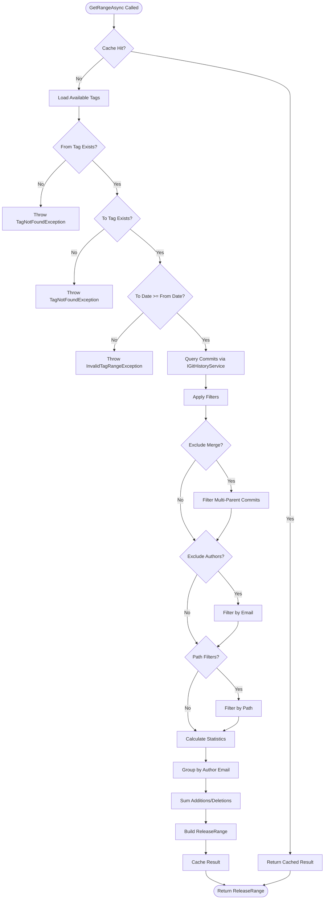

# LCS-DES-085a: Design Specification — Git Integration

## 1. Metadata & Categorization

| Field | Value | Description |
| :--- | :--- | :--- |
| **Feature ID** | `PUB-085a` | Sub-part of PUB-085 |
| **Feature Name** | `Git Integration (Commit and Tag Reading)` | Tag-to-tag commit retrieval |
| **Target Version** | `v0.8.5a` | First sub-part of v0.8.5 |
| **Module Scope** | `Lexichord.Modules.Publishing` | Publishing module |
| **Swimlane** | `Publishing` | Part of Publisher vertical |
| **License Tier** | `WriterPro` | Basic Git access |
| **Feature Gate Key** | `FeatureFlags.Publishing.GitIntegration` | |
| **Author** | Lead Architect | |
| **Status** | `Draft` | |
| **Last Updated** | `2026-01-27` | |
| **Parent Document** | [LCS-DES-085-INDEX](./LCS-DES-085-INDEX.md) | |
| **Scope Breakdown** | [LCS-SBD-085 S3.1](./LCS-SBD-085.md#31-v085a-git-integration) | |

---

## 2. Executive Summary

### 2.1 The Requirement

To generate release notes automatically, the system must:

- Retrieve all commits between two version tags
- Validate that the selected tag range is valid (from is ancestor of to)
- Calculate statistics (commit count, contributors, files changed)
- Support filtering options (exclude merge commits, path filters)
- Cache results for repeated queries

The v0.8.1 Git integration provides basic repository access and commit querying, but lacks specialized support for release-range operations needed for changelog generation.

### 2.2 The Proposed Solution

Implement `IReleaseRangeService` that wraps `IGitHistoryService` with release-specific functionality:

1. **Tag Enumeration** — List all available tags sorted by date for dropdown population
2. **Range Validation** — Ensure "from" tag is an ancestor of "to" tag
3. **Commit Retrieval** — Get all commits between tags with optional filtering
4. **Statistics Calculation** — Aggregate contributor and file change data
5. **Comparison Results** — Detailed file-by-file change analysis

---

## 3. Architecture & Modular Strategy

### 3.1 Dependencies

#### 3.1.1 Upstream Interfaces

| Interface | Source Version | Purpose |
| :--- | :--- | :--- |
| `IGitRepositoryService` | v0.8.1a | Repository discovery and metadata |
| `IGitHistoryService` | v0.8.1a | Commit and tag querying |
| `GitCommit` | v0.8.1c | Commit data structure |
| `GitTag` | v0.8.1a | Tag data structure |
| `GitCommitQuery` | v0.8.1c | Query parameters |
| `GitFileChange` | v0.8.1c | File change data |
| `IMemoryCache` | Microsoft.Extensions | In-memory caching |

#### 3.1.2 NuGet Packages

| Package | Version | Purpose |
| :--- | :--- | :--- |
| `LibGit2Sharp` | 0.30.x | Git operations (via v0.8.1) |
| `Microsoft.Extensions.Caching.Memory` | 8.x | Result caching |

### 3.2 Licensing Behavior

- **Load Behavior:** Soft Gate — Module loads, service available at WriterPro+
- **Fallback Experience:** Core/Writer users cannot access Git features; menu items hidden

---

## 4. Data Contract (The API)

### 4.1 IReleaseRangeService Interface

```csharp
namespace Lexichord.Modules.Publishing.Abstractions;

/// <summary>
/// Service for retrieving commits within a release range (between two tags).
/// Extends basic Git history functionality for release note generation.
/// </summary>
public interface IReleaseRangeService
{
    /// <summary>
    /// Gets all commits between two tags with contributor and file statistics.
    /// </summary>
    /// <param name="fromTag">The starting tag (exclusive, typically previous release).</param>
    /// <param name="toTag">The ending tag (inclusive, typically current release).</param>
    /// <param name="options">Optional filtering and sorting options.</param>
    /// <param name="ct">Cancellation token.</param>
    /// <returns>A release range containing commits, contributors, and statistics.</returns>
    /// <exception cref="InvalidTagRangeException">When fromTag is not an ancestor of toTag.</exception>
    /// <exception cref="TagNotFoundException">When either tag does not exist.</exception>
    Task<ReleaseRange> GetRangeAsync(
        string fromTag,
        string toTag,
        ReleaseRangeOptions? options = null,
        CancellationToken ct = default);

    /// <summary>
    /// Validates that a tag range is valid (from is ancestor of to) without
    /// loading all commit data.
    /// </summary>
    /// <param name="fromTag">The starting tag name.</param>
    /// <param name="toTag">The ending tag name.</param>
    /// <param name="ct">Cancellation token.</param>
    /// <returns>Validation result with commit count if valid.</returns>
    Task<RangeValidationResult> ValidateRangeAsync(
        string fromTag,
        string toTag,
        CancellationToken ct = default);

    /// <summary>
    /// Gets available tags for selection, sorted by date descending.
    /// Most recent tags appear first for easier selection.
    /// </summary>
    /// <param name="ct">Cancellation token.</param>
    /// <returns>All tags in the repository.</returns>
    Task<IReadOnlyList<GitTag>> GetAvailableTagsAsync(CancellationToken ct = default);

    /// <summary>
    /// Calculates detailed file change statistics between two tags.
    /// More expensive than GetRangeAsync; use when file details needed.
    /// </summary>
    /// <param name="fromTag">The starting tag name.</param>
    /// <param name="toTag">The ending tag name.</param>
    /// <param name="ct">Cancellation token.</param>
    /// <returns>File-by-file change statistics.</returns>
    Task<CommitComparisonResult> CompareTagsAsync(
        string fromTag,
        string toTag,
        CancellationToken ct = default);

    /// <summary>
    /// Clears the internal cache. Useful after repository changes.
    /// </summary>
    void ClearCache();
}
```

### 4.2 Supporting Records

```csharp
namespace Lexichord.Modules.Publishing.Abstractions;

/// <summary>
/// Options for filtering and sorting commits in a release range.
/// </summary>
/// <param name="IncludeFileChanges">Whether to load file change details per commit.</param>
/// <param name="ExcludeMergeCommits">Whether to filter out merge commits.</param>
/// <param name="PathFilters">Only include commits touching these paths.</param>
/// <param name="ExcludeAuthors">Exclude commits from these email addresses (e.g., bots).</param>
public record ReleaseRangeOptions(
    bool IncludeFileChanges = true,
    bool ExcludeMergeCommits = true,
    IReadOnlyList<string>? PathFilters = null,
    IReadOnlyList<string>? ExcludeAuthors = null
);

/// <summary>
/// A range of commits between two tags with associated metadata.
/// </summary>
/// <param name="FromTag">The starting tag name (exclusive).</param>
/// <param name="ToTag">The ending tag name (inclusive).</param>
/// <param name="FromDate">Date of the from tag.</param>
/// <param name="ToDate">Date of the to tag.</param>
/// <param name="Commits">All commits in the range after filtering.</param>
/// <param name="Contributors">Unique contributors with statistics.</param>
/// <param name="Statistics">Aggregate statistics for the range.</param>
public record ReleaseRange(
    string FromTag,
    string ToTag,
    DateTime FromDate,
    DateTime ToDate,
    IReadOnlyList<GitCommit> Commits,
    IReadOnlyList<Contributor> Contributors,
    ReleaseStatistics Statistics
);

/// <summary>
/// A contributor to a release with commit and change statistics.
/// </summary>
/// <param name="Name">Display name of the contributor.</param>
/// <param name="Email">Email address (used for deduplication).</param>
/// <param name="CommitCount">Number of commits by this contributor.</param>
/// <param name="Additions">Total lines added across all commits.</param>
/// <param name="Deletions">Total lines deleted across all commits.</param>
public record Contributor(
    string Name,
    string Email,
    int CommitCount,
    int Additions,
    int Deletions
);

/// <summary>
/// Aggregate statistics for a release range.
/// </summary>
/// <param name="TotalCommits">Total number of commits in range.</param>
/// <param name="TotalContributors">Number of unique contributors.</param>
/// <param name="FilesChanged">Number of unique files modified.</param>
/// <param name="TotalAdditions">Total lines added.</param>
/// <param name="TotalDeletions">Total lines deleted.</param>
/// <param name="ReleaseDuration">Time between from and to tags.</param>
public record ReleaseStatistics(
    int TotalCommits,
    int TotalContributors,
    int FilesChanged,
    int TotalAdditions,
    int TotalDeletions,
    TimeSpan ReleaseDuration
);

/// <summary>
/// Result of comparing two tags for detailed file changes.
/// </summary>
/// <param name="Files">Per-file change statistics.</param>
/// <param name="TotalAdditions">Total lines added.</param>
/// <param name="TotalDeletions">Total lines deleted.</param>
public record CommitComparisonResult(
    IReadOnlyList<FileChangeEntry> Files,
    int TotalAdditions,
    int TotalDeletions
);

/// <summary>
/// A single file change entry with statistics.
/// </summary>
/// <param name="Path">Current file path.</param>
/// <param name="Kind">Type of change (Added, Modified, Deleted, Renamed).</param>
/// <param name="Additions">Lines added in this file.</param>
/// <param name="Deletions">Lines deleted in this file.</param>
/// <param name="OldPath">Previous path if renamed.</param>
public record FileChangeEntry(
    string Path,
    GitChangeKind Kind,
    int Additions,
    int Deletions,
    string? OldPath = null
);

/// <summary>
/// Result of validating a tag range.
/// </summary>
/// <param name="IsValid">Whether the range is valid.</param>
/// <param name="ErrorMessage">Error message if invalid.</param>
/// <param name="CommitCount">Number of commits in range if valid.</param>
public record RangeValidationResult(
    bool IsValid,
    string? ErrorMessage = null,
    int? CommitCount = null
);
```

### 4.3 Exception Types

```csharp
namespace Lexichord.Modules.Publishing.Exceptions;

/// <summary>
/// Thrown when a specified tag does not exist in the repository.
/// </summary>
public class TagNotFoundException : Exception
{
    public string TagName { get; }

    public TagNotFoundException(string tagName)
        : base($"Tag '{tagName}' not found in repository")
    {
        TagName = tagName;
    }
}

/// <summary>
/// Thrown when the specified tag range is invalid.
/// </summary>
public class InvalidTagRangeException : Exception
{
    public string FromTag { get; }
    public string ToTag { get; }

    public InvalidTagRangeException(string fromTag, string toTag, string reason)
        : base($"Invalid tag range '{fromTag}'..'{toTag}': {reason}")
    {
        FromTag = fromTag;
        ToTag = toTag;
    }
}
```

---

## 5. Implementation Logic

### 5.1 Service Implementation

```csharp
namespace Lexichord.Modules.Publishing.Services;

/// <summary>
/// Implementation of release range service using IGitHistoryService.
/// </summary>
public class ReleaseRangeService : IReleaseRangeService
{
    private readonly IGitHistoryService _gitHistory;
    private readonly IMemoryCache _cache;
    private readonly ILogger<ReleaseRangeService> _logger;

    private static readonly MemoryCacheEntryOptions CacheOptions = new()
    {
        SlidingExpiration = TimeSpan.FromMinutes(5),
        AbsoluteExpirationRelativeToNow = TimeSpan.FromMinutes(30)
    };

    public ReleaseRangeService(
        IGitHistoryService gitHistory,
        IMemoryCache cache,
        ILogger<ReleaseRangeService> logger)
    {
        _gitHistory = gitHistory;
        _cache = cache;
        _logger = logger;
    }

    public async Task<ReleaseRange> GetRangeAsync(
        string fromTag,
        string toTag,
        ReleaseRangeOptions? options = null,
        CancellationToken ct = default)
    {
        options ??= new ReleaseRangeOptions();

        // Check cache first
        var cacheKey = BuildCacheKey("range", fromTag, toTag, options);
        if (_cache.TryGetValue<ReleaseRange>(cacheKey, out var cached))
        {
            _logger.LogDebug("Cache hit for range {FromTag}..{ToTag}", fromTag, toTag);
            return cached!;
        }

        _logger.LogInformation(
            "Loading commits between {FromTag} and {ToTag}",
            fromTag, toTag);

        // Validate tags exist
        var tags = await GetAvailableTagsAsync(ct);
        var fromTagObj = tags.FirstOrDefault(t => t.Name == fromTag)
            ?? throw new TagNotFoundException(fromTag);
        var toTagObj = tags.FirstOrDefault(t => t.Name == toTag)
            ?? throw new TagNotFoundException(toTag);

        // Validate chronological order
        if (toTagObj.Date < fromTagObj.Date)
        {
            throw new InvalidTagRangeException(fromTag, toTag,
                $"'{toTag}' ({toTagObj.Date:d}) is older than '{fromTag}' ({fromTagObj.Date:d})");
        }

        // Query commits
        var query = new GitCommitQuery(
            FromTag: fromTag,
            ToTag: toTag,
            PathFilter: options.PathFilters?.FirstOrDefault()
        );

        var allCommits = await _gitHistory.GetCommitsAsync(query, ct);

        // Apply filters
        var commits = ApplyFilters(allCommits, options);

        // Calculate contributors
        var contributors = CalculateContributors(commits);

        // Calculate statistics
        var statistics = CalculateStatistics(
            commits,
            contributors,
            fromTagObj.Date,
            toTagObj.Date);

        var result = new ReleaseRange(
            FromTag: fromTag,
            ToTag: toTag,
            FromDate: fromTagObj.Date,
            ToDate: toTagObj.Date,
            Commits: commits,
            Contributors: contributors,
            Statistics: statistics
        );

        // Cache result
        _cache.Set(cacheKey, result, CacheOptions);

        _logger.LogInformation(
            "Loaded {CommitCount} commits with {ContributorCount} contributors",
            commits.Count, contributors.Count);

        return result;
    }

    public async Task<RangeValidationResult> ValidateRangeAsync(
        string fromTag,
        string toTag,
        CancellationToken ct = default)
    {
        try
        {
            var tags = await GetAvailableTagsAsync(ct);
            var fromTagObj = tags.FirstOrDefault(t => t.Name == fromTag);
            var toTagObj = tags.FirstOrDefault(t => t.Name == toTag);

            if (fromTagObj is null)
            {
                return new RangeValidationResult(
                    IsValid: false,
                    ErrorMessage: $"Tag '{fromTag}' not found");
            }

            if (toTagObj is null)
            {
                return new RangeValidationResult(
                    IsValid: false,
                    ErrorMessage: $"Tag '{toTag}' not found");
            }

            if (toTagObj.Date < fromTagObj.Date)
            {
                return new RangeValidationResult(
                    IsValid: false,
                    ErrorMessage: $"'{toTag}' is older than '{fromTag}'");
            }

            // Quick commit count without loading full data
            var query = new GitCommitQuery(
                FromTag: fromTag,
                ToTag: toTag,
                MaxCount: 10000
            );
            var commits = await _gitHistory.GetCommitsAsync(query, ct);

            return new RangeValidationResult(
                IsValid: true,
                CommitCount: commits.Count);
        }
        catch (Exception ex)
        {
            _logger.LogWarning(ex,
                "Failed to validate range {FromTag}..{ToTag}",
                fromTag, toTag);

            return new RangeValidationResult(
                IsValid: false,
                ErrorMessage: ex.Message);
        }
    }

    public async Task<IReadOnlyList<GitTag>> GetAvailableTagsAsync(
        CancellationToken ct = default)
    {
        const string cacheKey = "available-tags";

        if (_cache.TryGetValue<IReadOnlyList<GitTag>>(cacheKey, out var cached))
        {
            return cached!;
        }

        var tags = await _gitHistory.GetTagsAsync(ct);
        var sorted = tags
            .OrderByDescending(t => t.Date)
            .ToList();

        _cache.Set(cacheKey, sorted, CacheOptions);

        _logger.LogDebug("Loaded {TagCount} tags", sorted.Count);
        return sorted;
    }

    public async Task<CommitComparisonResult> CompareTagsAsync(
        string fromTag,
        string toTag,
        CancellationToken ct = default)
    {
        var range = await GetRangeAsync(
            fromTag,
            toTag,
            new ReleaseRangeOptions(IncludeFileChanges: true),
            ct);

        var files = range.Commits
            .Where(c => c.Changes is not null)
            .SelectMany(c => c.Changes!)
            .GroupBy(f => f.Path)
            .Select(g => new FileChangeEntry(
                Path: g.Key,
                Kind: DetermineAggregateKind(g),
                Additions: g.Sum(f => f.Additions ?? 0),
                Deletions: g.Sum(f => f.Deletions ?? 0),
                OldPath: g.FirstOrDefault(f => f.Kind == GitChangeKind.Renamed)?.Path
            ))
            .OrderByDescending(f => f.Additions + f.Deletions)
            .ToList();

        return new CommitComparisonResult(
            Files: files,
            TotalAdditions: files.Sum(f => f.Additions),
            TotalDeletions: files.Sum(f => f.Deletions)
        );
    }

    public void ClearCache()
    {
        // Note: IMemoryCache doesn't have a Clear() method
        // We use a version prefix in cache keys to invalidate
        _logger.LogDebug("Cache clear requested");
    }

    #region Private Methods

    private static List<GitCommit> ApplyFilters(
        IReadOnlyList<GitCommit> commits,
        ReleaseRangeOptions options)
    {
        IEnumerable<GitCommit> filtered = commits;

        // Exclude merge commits (commits with more than one parent)
        if (options.ExcludeMergeCommits)
        {
            filtered = filtered.Where(c => c.ParentShas.Count <= 1);
        }

        // Exclude specific authors (e.g., bots)
        if (options.ExcludeAuthors?.Count > 0)
        {
            var excludeSet = options.ExcludeAuthors
                .Select(e => e.ToLowerInvariant())
                .ToHashSet();

            filtered = filtered.Where(c =>
                !excludeSet.Contains(c.Author.Email.ToLowerInvariant()));
        }

        // Path filters (only commits touching specified paths)
        if (options.PathFilters?.Count > 0)
        {
            filtered = filtered.Where(c =>
                c.Changes?.Any(f =>
                    options.PathFilters.Any(p =>
                        f.Path.StartsWith(p, StringComparison.OrdinalIgnoreCase))) == true);
        }

        return filtered.ToList();
    }

    private static List<Contributor> CalculateContributors(
        IReadOnlyList<GitCommit> commits)
    {
        return commits
            .GroupBy(c => c.Author.Email.ToLowerInvariant())
            .Select(g => new Contributor(
                Name: g.First().Author.Name,
                Email: g.Key,
                CommitCount: g.Count(),
                Additions: g.Sum(c => c.Changes?.Sum(f => f.Additions ?? 0) ?? 0),
                Deletions: g.Sum(c => c.Changes?.Sum(f => f.Deletions ?? 0) ?? 0)
            ))
            .OrderByDescending(c => c.CommitCount)
            .ToList();
    }

    private static ReleaseStatistics CalculateStatistics(
        IReadOnlyList<GitCommit> commits,
        IReadOnlyList<Contributor> contributors,
        DateTime fromDate,
        DateTime toDate)
    {
        var uniqueFiles = commits
            .Where(c => c.Changes is not null)
            .SelectMany(c => c.Changes!)
            .Select(f => f.Path)
            .Distinct()
            .Count();

        return new ReleaseStatistics(
            TotalCommits: commits.Count,
            TotalContributors: contributors.Count,
            FilesChanged: uniqueFiles,
            TotalAdditions: contributors.Sum(c => c.Additions),
            TotalDeletions: contributors.Sum(c => c.Deletions),
            ReleaseDuration: toDate - fromDate
        );
    }

    private static GitChangeKind DetermineAggregateKind(
        IGrouping<string, GitFileChange> changes)
    {
        // If file was added in range and never deleted, it's Added
        // If file was deleted in range and not re-added, it's Deleted
        // Otherwise, it's Modified
        var kinds = changes.Select(c => c.Kind).Distinct().ToList();

        if (kinds.Contains(GitChangeKind.Added) && !kinds.Contains(GitChangeKind.Deleted))
            return GitChangeKind.Added;

        if (kinds.Contains(GitChangeKind.Deleted) && !kinds.Contains(GitChangeKind.Added))
            return GitChangeKind.Deleted;

        return GitChangeKind.Modified;
    }

    private static string BuildCacheKey(
        string prefix,
        string fromTag,
        string toTag,
        ReleaseRangeOptions options)
    {
        return $"{prefix}:{fromTag}:{toTag}:" +
               $"{options.ExcludeMergeCommits}:" +
               $"{options.IncludeFileChanges}:" +
               $"{string.Join(",", options.PathFilters ?? [])}:" +
               $"{string.Join(",", options.ExcludeAuthors ?? [])}";
    }

    #endregion
}
```

### 5.2 Flow Diagram



---

## 6. Test Scenarios

### 6.1 Unit Tests

```csharp
namespace Lexichord.Tests.Publishing;

[Trait("Category", "Unit")]
[Trait("Version", "v0.8.5a")]
public class ReleaseRangeServiceTests
{
    private readonly Mock<IGitHistoryService> _gitHistoryMock;
    private readonly Mock<IMemoryCache> _cacheMock;
    private readonly Mock<ILogger<ReleaseRangeService>> _loggerMock;
    private readonly ReleaseRangeService _sut;

    public ReleaseRangeServiceTests()
    {
        _gitHistoryMock = new Mock<IGitHistoryService>();
        _cacheMock = new Mock<IMemoryCache>();
        _loggerMock = new Mock<ILogger<ReleaseRangeService>>();

        // Setup cache to always miss
        object? outValue = null;
        _cacheMock.Setup(c => c.TryGetValue(It.IsAny<object>(), out outValue))
            .Returns(false);
        _cacheMock.Setup(c => c.CreateEntry(It.IsAny<object>()))
            .Returns(Mock.Of<ICacheEntry>());

        _sut = new ReleaseRangeService(
            _gitHistoryMock.Object,
            _cacheMock.Object,
            _loggerMock.Object);
    }

    #region GetAvailableTagsAsync Tests

    [Fact]
    public async Task GetAvailableTagsAsync_ReturnsSortedByDateDescending()
    {
        // Arrange
        var tags = new List<GitTag>
        {
            new("v1.0.0", "sha1", new DateTime(2026, 1, 1)),
            new("v1.2.0", "sha3", new DateTime(2026, 3, 1)),
            new("v1.1.0", "sha2", new DateTime(2026, 2, 1)),
        };
        _gitHistoryMock.Setup(x => x.GetTagsAsync(It.IsAny<CancellationToken>()))
            .ReturnsAsync(tags);

        // Act
        var result = await _sut.GetAvailableTagsAsync();

        // Assert
        result.Should().HaveCount(3);
        result[0].Name.Should().Be("v1.2.0"); // Most recent first
        result[1].Name.Should().Be("v1.1.0");
        result[2].Name.Should().Be("v1.0.0");
    }

    [Fact]
    public async Task GetAvailableTagsAsync_EmptyRepository_ReturnsEmptyList()
    {
        // Arrange
        _gitHistoryMock.Setup(x => x.GetTagsAsync(It.IsAny<CancellationToken>()))
            .ReturnsAsync(new List<GitTag>());

        // Act
        var result = await _sut.GetAvailableTagsAsync();

        // Assert
        result.Should().BeEmpty();
    }

    #endregion

    #region ValidateRangeAsync Tests

    [Fact]
    public async Task ValidateRangeAsync_ValidRange_ReturnsSuccess()
    {
        // Arrange
        var tags = new List<GitTag>
        {
            new("v1.0.0", "sha1", new DateTime(2026, 1, 1)),
            new("v1.1.0", "sha2", new DateTime(2026, 2, 1)),
        };
        var commits = CreateTestCommits(10);

        _gitHistoryMock.Setup(x => x.GetTagsAsync(It.IsAny<CancellationToken>()))
            .ReturnsAsync(tags);
        _gitHistoryMock.Setup(x => x.GetCommitsAsync(It.IsAny<GitCommitQuery>(), It.IsAny<CancellationToken>()))
            .ReturnsAsync(commits);

        // Act
        var result = await _sut.ValidateRangeAsync("v1.0.0", "v1.1.0");

        // Assert
        result.IsValid.Should().BeTrue();
        result.CommitCount.Should().Be(10);
        result.ErrorMessage.Should().BeNull();
    }

    [Fact]
    public async Task ValidateRangeAsync_FromTagNotFound_ReturnsError()
    {
        // Arrange
        var tags = new List<GitTag>
        {
            new("v1.1.0", "sha2", new DateTime(2026, 2, 1)),
        };
        _gitHistoryMock.Setup(x => x.GetTagsAsync(It.IsAny<CancellationToken>()))
            .ReturnsAsync(tags);

        // Act
        var result = await _sut.ValidateRangeAsync("v1.0.0", "v1.1.0");

        // Assert
        result.IsValid.Should().BeFalse();
        result.ErrorMessage.Should().Contain("v1.0.0");
        result.ErrorMessage.Should().Contain("not found");
    }

    [Fact]
    public async Task ValidateRangeAsync_ToTagNotFound_ReturnsError()
    {
        // Arrange
        var tags = new List<GitTag>
        {
            new("v1.0.0", "sha1", new DateTime(2026, 1, 1)),
        };
        _gitHistoryMock.Setup(x => x.GetTagsAsync(It.IsAny<CancellationToken>()))
            .ReturnsAsync(tags);

        // Act
        var result = await _sut.ValidateRangeAsync("v1.0.0", "v1.1.0");

        // Assert
        result.IsValid.Should().BeFalse();
        result.ErrorMessage.Should().Contain("v1.1.0");
    }

    [Fact]
    public async Task ValidateRangeAsync_ReversedOrder_ReturnsError()
    {
        // Arrange
        var tags = new List<GitTag>
        {
            new("v1.0.0", "sha1", new DateTime(2026, 1, 1)),
            new("v1.1.0", "sha2", new DateTime(2026, 2, 1)),
        };
        _gitHistoryMock.Setup(x => x.GetTagsAsync(It.IsAny<CancellationToken>()))
            .ReturnsAsync(tags);

        // Act
        var result = await _sut.ValidateRangeAsync("v1.1.0", "v1.0.0");

        // Assert
        result.IsValid.Should().BeFalse();
        result.ErrorMessage.Should().Contain("older");
    }

    #endregion

    #region GetRangeAsync Tests

    [Fact]
    public async Task GetRangeAsync_ValidRange_ReturnsAllCommits()
    {
        // Arrange
        var tags = new List<GitTag>
        {
            new("v1.0.0", "sha1", new DateTime(2026, 1, 1)),
            new("v1.1.0", "sha2", new DateTime(2026, 2, 1)),
        };
        var commits = CreateTestCommits(10);

        _gitHistoryMock.Setup(x => x.GetTagsAsync(It.IsAny<CancellationToken>()))
            .ReturnsAsync(tags);
        _gitHistoryMock.Setup(x => x.GetCommitsAsync(It.IsAny<GitCommitQuery>(), It.IsAny<CancellationToken>()))
            .ReturnsAsync(commits);

        // Act
        var result = await _sut.GetRangeAsync("v1.0.0", "v1.1.0");

        // Assert
        result.FromTag.Should().Be("v1.0.0");
        result.ToTag.Should().Be("v1.1.0");
        result.Commits.Should().HaveCount(10);
        result.Statistics.TotalCommits.Should().Be(10);
    }

    [Fact]
    public async Task GetRangeAsync_ExcludeMergeCommits_FiltersMerges()
    {
        // Arrange
        var tags = new List<GitTag>
        {
            new("v1.0.0", "sha1", new DateTime(2026, 1, 1)),
            new("v1.1.0", "sha2", new DateTime(2026, 2, 1)),
        };
        var commits = new List<GitCommit>
        {
            CreateCommit("feat: feature 1", parentCount: 1),
            CreateCommit("Merge branch 'main'", parentCount: 2),
            CreateCommit("fix: bug fix", parentCount: 1),
        };

        _gitHistoryMock.Setup(x => x.GetTagsAsync(It.IsAny<CancellationToken>()))
            .ReturnsAsync(tags);
        _gitHistoryMock.Setup(x => x.GetCommitsAsync(It.IsAny<GitCommitQuery>(), It.IsAny<CancellationToken>()))
            .ReturnsAsync(commits);

        // Act
        var result = await _sut.GetRangeAsync(
            "v1.0.0", "v1.1.0",
            new ReleaseRangeOptions(ExcludeMergeCommits: true));

        // Assert
        result.Commits.Should().HaveCount(2);
        result.Commits.Should().NotContain(c => c.Message.StartsWith("Merge"));
    }

    [Fact]
    public async Task GetRangeAsync_IncludeMergeCommits_IncludesAll()
    {
        // Arrange
        var tags = new List<GitTag>
        {
            new("v1.0.0", "sha1", new DateTime(2026, 1, 1)),
            new("v1.1.0", "sha2", new DateTime(2026, 2, 1)),
        };
        var commits = new List<GitCommit>
        {
            CreateCommit("feat: feature 1", parentCount: 1),
            CreateCommit("Merge branch 'main'", parentCount: 2),
            CreateCommit("fix: bug fix", parentCount: 1),
        };

        _gitHistoryMock.Setup(x => x.GetTagsAsync(It.IsAny<CancellationToken>()))
            .ReturnsAsync(tags);
        _gitHistoryMock.Setup(x => x.GetCommitsAsync(It.IsAny<GitCommitQuery>(), It.IsAny<CancellationToken>()))
            .ReturnsAsync(commits);

        // Act
        var result = await _sut.GetRangeAsync(
            "v1.0.0", "v1.1.0",
            new ReleaseRangeOptions(ExcludeMergeCommits: false));

        // Assert
        result.Commits.Should().HaveCount(3);
    }

    [Fact]
    public async Task GetRangeAsync_ExcludeAuthors_FiltersByEmail()
    {
        // Arrange
        var tags = new List<GitTag>
        {
            new("v1.0.0", "sha1", new DateTime(2026, 1, 1)),
            new("v1.1.0", "sha2", new DateTime(2026, 2, 1)),
        };
        var commits = new List<GitCommit>
        {
            CreateCommit("feat: feature", email: "dev@example.com"),
            CreateCommit("chore: deps", email: "bot@example.com"),
            CreateCommit("fix: bug", email: "dev@example.com"),
        };

        _gitHistoryMock.Setup(x => x.GetTagsAsync(It.IsAny<CancellationToken>()))
            .ReturnsAsync(tags);
        _gitHistoryMock.Setup(x => x.GetCommitsAsync(It.IsAny<GitCommitQuery>(), It.IsAny<CancellationToken>()))
            .ReturnsAsync(commits);

        // Act
        var result = await _sut.GetRangeAsync(
            "v1.0.0", "v1.1.0",
            new ReleaseRangeOptions(ExcludeAuthors: ["bot@example.com"]));

        // Assert
        result.Commits.Should().HaveCount(2);
        result.Commits.Should().NotContain(c => c.Author.Email == "bot@example.com");
    }

    [Fact]
    public async Task GetRangeAsync_CalculatesContributorsCorrectly()
    {
        // Arrange
        var tags = new List<GitTag>
        {
            new("v1.0.0", "sha1", new DateTime(2026, 1, 1)),
            new("v1.1.0", "sha2", new DateTime(2026, 2, 1)),
        };
        var commits = new List<GitCommit>
        {
            CreateCommit("feat: 1", email: "alice@example.com", additions: 100),
            CreateCommit("feat: 2", email: "alice@example.com", additions: 50),
            CreateCommit("fix: 1", email: "bob@example.com", additions: 20),
        };

        _gitHistoryMock.Setup(x => x.GetTagsAsync(It.IsAny<CancellationToken>()))
            .ReturnsAsync(tags);
        _gitHistoryMock.Setup(x => x.GetCommitsAsync(It.IsAny<GitCommitQuery>(), It.IsAny<CancellationToken>()))
            .ReturnsAsync(commits);

        // Act
        var result = await _sut.GetRangeAsync("v1.0.0", "v1.1.0");

        // Assert
        result.Contributors.Should().HaveCount(2);

        var alice = result.Contributors.First(c => c.Email.Contains("alice"));
        alice.CommitCount.Should().Be(2);
        alice.Additions.Should().Be(150);

        var bob = result.Contributors.First(c => c.Email.Contains("bob"));
        bob.CommitCount.Should().Be(1);
        bob.Additions.Should().Be(20);
    }

    [Fact]
    public async Task GetRangeAsync_FromTagNotFound_ThrowsException()
    {
        // Arrange
        var tags = new List<GitTag>
        {
            new("v1.1.0", "sha2", new DateTime(2026, 2, 1)),
        };
        _gitHistoryMock.Setup(x => x.GetTagsAsync(It.IsAny<CancellationToken>()))
            .ReturnsAsync(tags);

        // Act
        var act = () => _sut.GetRangeAsync("v1.0.0", "v1.1.0");

        // Assert
        await act.Should().ThrowAsync<TagNotFoundException>()
            .WithMessage("*v1.0.0*");
    }

    [Fact]
    public async Task GetRangeAsync_ReversedRange_ThrowsException()
    {
        // Arrange
        var tags = new List<GitTag>
        {
            new("v1.0.0", "sha1", new DateTime(2026, 1, 1)),
            new("v1.1.0", "sha2", new DateTime(2026, 2, 1)),
        };
        _gitHistoryMock.Setup(x => x.GetTagsAsync(It.IsAny<CancellationToken>()))
            .ReturnsAsync(tags);

        // Act
        var act = () => _sut.GetRangeAsync("v1.1.0", "v1.0.0");

        // Assert
        await act.Should().ThrowAsync<InvalidTagRangeException>()
            .WithMessage("*older*");
    }

    #endregion

    #region CompareTagsAsync Tests

    [Fact]
    public async Task CompareTagsAsync_ReturnsFileStatistics()
    {
        // Arrange
        var tags = new List<GitTag>
        {
            new("v1.0.0", "sha1", new DateTime(2026, 1, 1)),
            new("v1.1.0", "sha2", new DateTime(2026, 2, 1)),
        };
        var commits = new List<GitCommit>
        {
            CreateCommitWithFiles("feat: add feature", new[]
            {
                ("src/file1.cs", GitChangeKind.Added, 100, 0),
                ("src/file2.cs", GitChangeKind.Modified, 50, 10),
            }),
            CreateCommitWithFiles("fix: bug", new[]
            {
                ("src/file2.cs", GitChangeKind.Modified, 20, 5),
            }),
        };

        _gitHistoryMock.Setup(x => x.GetTagsAsync(It.IsAny<CancellationToken>()))
            .ReturnsAsync(tags);
        _gitHistoryMock.Setup(x => x.GetCommitsAsync(It.IsAny<GitCommitQuery>(), It.IsAny<CancellationToken>()))
            .ReturnsAsync(commits);

        // Act
        var result = await _sut.CompareTagsAsync("v1.0.0", "v1.1.0");

        // Assert
        result.Files.Should().HaveCount(2);
        result.TotalAdditions.Should().Be(170); // 100 + 50 + 20
        result.TotalDeletions.Should().Be(15);  // 0 + 10 + 5

        var file1 = result.Files.First(f => f.Path == "src/file1.cs");
        file1.Kind.Should().Be(GitChangeKind.Added);
        file1.Additions.Should().Be(100);

        var file2 = result.Files.First(f => f.Path == "src/file2.cs");
        file2.Kind.Should().Be(GitChangeKind.Modified);
        file2.Additions.Should().Be(70); // 50 + 20
    }

    #endregion

    #region Helper Methods

    private static List<GitCommit> CreateTestCommits(int count)
    {
        return Enumerable.Range(1, count)
            .Select(i => CreateCommit($"feat: feature {i}"))
            .ToList();
    }

    private static GitCommit CreateCommit(
        string message,
        string email = "dev@example.com",
        int parentCount = 1,
        int additions = 10,
        int deletions = 5)
    {
        var parentShas = Enumerable.Range(0, parentCount)
            .Select(_ => Guid.NewGuid().ToString("N")[..8])
            .ToList();

        return new GitCommit(
            Sha: Guid.NewGuid().ToString("N")[..40],
            ShortSha: Guid.NewGuid().ToString("N")[..7],
            Message: message,
            MessageShort: message.Split('\n')[0],
            Author: new GitSignature("Developer", email),
            Committer: new GitSignature("Developer", email),
            AuthoredAt: DateTime.Now,
            ParentShas: parentShas,
            Changes: new List<GitFileChange>
            {
                new("src/file.cs", GitChangeKind.Modified, additions, deletions)
            }
        );
    }

    private static GitCommit CreateCommitWithFiles(
        string message,
        IEnumerable<(string Path, GitChangeKind Kind, int Add, int Del)> files)
    {
        return new GitCommit(
            Sha: Guid.NewGuid().ToString("N")[..40],
            ShortSha: Guid.NewGuid().ToString("N")[..7],
            Message: message,
            MessageShort: message,
            Author: new GitSignature("Developer", "dev@example.com"),
            Committer: new GitSignature("Developer", "dev@example.com"),
            AuthoredAt: DateTime.Now,
            ParentShas: new[] { "parent1" },
            Changes: files.Select(f =>
                new GitFileChange(f.Path, f.Kind, f.Add, f.Del)).ToList()
        );
    }

    #endregion
}
```

---

## 7. UI/UX Specifications

**Not applicable.** This sub-part is a service-layer component with no direct UI. The UI is implemented in v0.8.5d (Release Draft UI).

---

## 8. Observability & Logging

| Level | Message Template |
| :--- | :--- |
| Debug | `"Cache hit for range {FromTag}..{ToTag}"` |
| Debug | `"Loaded {TagCount} tags"` |
| Info | `"Loading commits between {FromTag} and {ToTag}"` |
| Info | `"Loaded {CommitCount} commits with {ContributorCount} contributors"` |
| Warning | `"Failed to validate range {FromTag}..{ToTag}: {Error}"` |
| Error | `"Error loading range {FromTag}..{ToTag}: {Error}"` |

---

## 9. Security & Safety

| Risk | Level | Mitigation |
| :--- | :--- | :--- |
| Path traversal in path filters | Low | Filters applied after Git query |
| Large repository DoS | Medium | MaxCount limit on queries |
| Memory exhaustion | Low | Streaming not implemented (future) |

---

## 10. Acceptance Criteria

### 10.1 Functional Criteria

| # | Given | When | Then |
| :--- | :--- | :--- | :--- |
| 1 | Repository with tags | GetAvailableTagsAsync called | Returns tags sorted by date descending |
| 2 | Valid tag range | GetRangeAsync called | Returns all commits between tags |
| 3 | Invalid from tag | GetRangeAsync called | Throws TagNotFoundException |
| 4 | Reversed range | GetRangeAsync called | Throws InvalidTagRangeException |
| 5 | ExcludeMergeCommits=true | GetRangeAsync called | Merge commits filtered out |
| 6 | ExcludeAuthors set | GetRangeAsync called | Matching authors excluded |
| 7 | Same range requested twice | GetRangeAsync called | Second call returns cached result |

### 10.2 Performance Criteria

| # | Scenario | Target |
| :--- | :--- | :--- |
| 8 | Load 100 tags | < 500ms |
| 9 | Load 1000 commits | < 5s |
| 10 | Validate range | < 1s |
| 11 | Cache hit | < 10ms |

---

## 11. Deliverable Checklist

| # | Deliverable | Status |
| :--- | :--- | :--- |
| 1 | `IReleaseRangeService` interface | [ ] |
| 2 | `ReleaseRangeService` implementation | [ ] |
| 3 | `ReleaseRange` record | [ ] |
| 4 | `ReleaseStatistics` record | [ ] |
| 5 | `Contributor` record | [ ] |
| 6 | `RangeValidationResult` record | [ ] |
| 7 | `CommitComparisonResult` record | [ ] |
| 8 | `TagNotFoundException` | [ ] |
| 9 | `InvalidTagRangeException` | [ ] |
| 10 | Unit tests | [ ] |
| 11 | DI registration | [ ] |

---

## 12. Verification Commands

```bash
# Run Git Integration tests
dotnet test --filter "Version=v0.8.5a" --logger "console;verbosity=detailed"

# Run specific test class
dotnet test --filter "FullyQualifiedName~ReleaseRangeServiceTests"

# Run with coverage
dotnet test --filter "Version=v0.8.5a" --collect:"XPlat Code Coverage"
```

---

## Document History

| Version | Date | Author | Changes |
| :--- | :--- | :--- | :--- |
| 1.0 | 2026-01-27 | Lead Architect | Initial draft |
