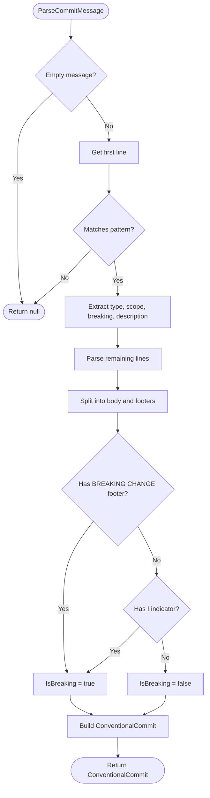

# LCS-DES-085b: Design Specification — Changelog Parser

## 1. Metadata & Categorization

| Field | Value | Description |
| :--- | :--- | :--- |
| **Feature ID** | `PUB-085b` | Sub-part of PUB-085 |
| **Feature Name** | `Changelog Parser (Conventional Commits)` | Commit categorization |
| **Target Version** | `v0.8.5b` | Second sub-part of v0.8.5 |
| **Module Scope** | `Lexichord.Modules.Publishing` | Publishing module |
| **Swimlane** | `Publishing` | Part of Publisher vertical |
| **License Tier** | `WriterPro` | Basic parsing capability |
| **Feature Gate Key** | `FeatureFlags.Publishing.ChangelogParser` | |
| **Author** | Lead Architect | |
| **Status** | `Draft` | |
| **Last Updated** | `2026-01-27` | |
| **Parent Document** | [LCS-DES-085-INDEX](./LCS-DES-085-INDEX.md) | |
| **Scope Breakdown** | [LCS-SBD-085 S3.2](./LCS-SBD-085.md#32-v085b-changelog-parser) | |

---

## 2. Executive Summary

### 2.1 The Requirement

To generate meaningful release notes, commits must be categorized by type and impact:

- **Type Categorization:** Features, Bug Fixes, Documentation, Performance, etc.
- **Scope Extraction:** Component or module affected (e.g., `api`, `ui`, `core`)
- **Breaking Change Detection:** Identify changes requiring user migration
- **Issue/PR References:** Link commits to tracking systems

The [Conventional Commits](https://www.conventionalcommits.org/) specification provides a standard format for commit messages that enables automated parsing. However, not all teams follow this convention, so the parser must also handle non-conventional commits gracefully.

### 2.2 The Proposed Solution

Implement `IChangelogParser` that:

1. **Parses Conventional Commits** — Extract type, scope, description, body, and footers
2. **Detects Breaking Changes** — From `!` indicator or `BREAKING CHANGE:` footer
3. **Categories Commits** — Group by type into predefined sections
4. **Handles Non-Conventional** — Place in "Other Changes" section
5. **Supports Customization** — Allow custom type-to-section mapping

---

## 3. Architecture & Modular Strategy

### 3.1 Dependencies

#### 3.1.1 Upstream Interfaces

| Interface | Source Version | Purpose |
| :--- | :--- | :--- |
| `IConventionalCommitParser` | v0.8.2d | Base parsing (extended here) |
| `ConventionalCommit` | v0.8.2d | Parsed commit record |
| `GitCommit` | v0.8.1c | Raw commit data |

#### 3.1.2 NuGet Packages

No additional packages required. Uses standard .NET regex.

### 3.2 Licensing Behavior

- **Load Behavior:** Soft Gate — Available at WriterPro+
- **Fallback Experience:** Lower tiers cannot access changelog features

---

## 4. Data Contract (The API)

### 4.1 IChangelogParser Interface

```csharp
namespace Lexichord.Modules.Publishing.Abstractions;

/// <summary>
/// Parses a collection of Git commits into a structured changelog
/// following the Conventional Commits specification.
/// </summary>
public interface IChangelogParser
{
    /// <summary>
    /// Parses commits into a categorized changelog structure.
    /// </summary>
    /// <param name="commits">The commits to parse and categorize.</param>
    /// <param name="options">Parsing configuration options.</param>
    /// <returns>A parsed changelog with categorized sections.</returns>
    ParsedChangelog Parse(
        IReadOnlyList<GitCommit> commits,
        ChangelogParserOptions? options = null);

    /// <summary>
    /// Parses a single commit message into a conventional commit structure.
    /// Returns null if the message doesn't follow conventional commit format.
    /// </summary>
    /// <param name="message">The commit message to parse.</param>
    /// <returns>The parsed conventional commit, or null if not conventional.</returns>
    ConventionalCommit? ParseCommitMessage(string message);

    /// <summary>
    /// Determines the commit type from a conventional commit type string.
    /// </summary>
    /// <param name="type">The type string (e.g., "feat", "fix").</param>
    /// <returns>The corresponding CommitType enum value.</returns>
    CommitType GetCommitType(string type);
}
```

### 4.2 Supporting Records

```csharp
namespace Lexichord.Modules.Publishing.Abstractions;

/// <summary>
/// Options for configuring changelog parsing behavior.
/// </summary>
/// <param name="GroupByScope">Group commits by scope within sections.</param>
/// <param name="IncludeNonConventional">Include commits that don't follow conventional format.</param>
/// <param name="TypeMapping">Custom mapping of type strings to CommitType values.</param>
/// <param name="ExcludeTypes">Types to exclude from the parsed changelog.</param>
/// <param name="SectionOrder">Custom ordering of sections (by CommitType).</param>
public record ChangelogParserOptions(
    bool GroupByScope = false,
    bool IncludeNonConventional = true,
    IReadOnlyDictionary<string, CommitType>? TypeMapping = null,
    IReadOnlyList<CommitType>? ExcludeTypes = null,
    IReadOnlyList<CommitType>? SectionOrder = null
);

/// <summary>
/// A parsed changelog with commits grouped by category.
/// </summary>
/// <param name="Sections">Commits organized into sections by type.</param>
/// <param name="UncategorizedCommits">Commits that don't match conventional format.</param>
/// <param name="BreakingChanges">All commits marked as breaking changes.</param>
/// <param name="TotalCommits">Total number of input commits.</param>
/// <param name="ConventionalCommitCount">Number of commits following conventional format.</param>
public record ParsedChangelog(
    IReadOnlyList<ChangelogSection> Sections,
    IReadOnlyList<ParsedCommit> UncategorizedCommits,
    IReadOnlyList<ParsedCommit> BreakingChanges,
    int TotalCommits,
    int ConventionalCommitCount
)
{
    /// <summary>
    /// Percentage of commits following conventional commit format.
    /// </summary>
    public double ConventionalPercentage =>
        TotalCommits > 0 ? (double)ConventionalCommitCount / TotalCommits * 100 : 0;

    /// <summary>
    /// Whether the changelog has any breaking changes.
    /// </summary>
    public bool HasBreakingChanges => BreakingChanges.Count > 0;
}

/// <summary>
/// A section of the changelog containing commits of a specific type.
/// </summary>
/// <param name="Title">Display title for the section (e.g., "Features").</param>
/// <param name="Type">The commit type this section represents.</param>
/// <param name="Commits">All commits in this section.</param>
/// <param name="CommitCount">Number of commits in the section.</param>
public record ChangelogSection(
    string Title,
    CommitType Type,
    IReadOnlyList<ParsedCommit> Commits,
    int CommitCount
)
{
    /// <summary>
    /// Commits grouped by scope (if any).
    /// </summary>
    public IReadOnlyDictionary<string?, IReadOnlyList<ParsedCommit>> ByScope =>
        Commits
            .GroupBy(c => c.Conventional?.Scope)
            .ToDictionary(g => g.Key, g => (IReadOnlyList<ParsedCommit>)g.ToList());
}

/// <summary>
/// A commit parsed with conventional commit metadata.
/// </summary>
/// <param name="Original">The original GitCommit record.</param>
/// <param name="Conventional">Parsed conventional commit data (null if non-conventional).</param>
/// <param name="DisplayMessage">The message to display (description or full message).</param>
/// <param name="IsBreakingChange">Whether this commit represents a breaking change.</param>
public record ParsedCommit(
    GitCommit Original,
    ConventionalCommit? Conventional,
    string DisplayMessage,
    bool IsBreakingChange
)
{
    /// <summary>
    /// The commit type (or Other if non-conventional).
    /// </summary>
    public CommitType Type => Conventional is not null
        ? MapType(Conventional.Type)
        : CommitType.Other;

    /// <summary>
    /// The scope, if present.
    /// </summary>
    public string? Scope => Conventional?.Scope;

    /// <summary>
    /// Issue references extracted from footers.
    /// </summary>
    public IReadOnlyList<string> IssueReferences =>
        Conventional?.Footers
            .Where(f => f.StartsWith("Fixes") || f.StartsWith("Closes") || f.StartsWith("Refs"))
            .SelectMany(f => ExtractIssueNumbers(f))
            .ToList()
        ?? [];

    private static CommitType MapType(string type) =>
        DefaultTypeMapping.GetValueOrDefault(type.ToLowerInvariant(), CommitType.Other);

    private static IEnumerable<string> ExtractIssueNumbers(string footer) =>
        Regex.Matches(footer, @"#(\d+)").Select(m => m.Groups[1].Value);

    private static readonly Dictionary<string, CommitType> DefaultTypeMapping = new()
    {
        ["feat"] = CommitType.Feature,
        ["fix"] = CommitType.BugFix,
        ["docs"] = CommitType.Documentation,
        ["style"] = CommitType.Style,
        ["refactor"] = CommitType.Refactor,
        ["perf"] = CommitType.Performance,
        ["test"] = CommitType.Test,
        ["build"] = CommitType.Build,
        ["ci"] = CommitType.CI,
        ["chore"] = CommitType.Chore,
        ["revert"] = CommitType.Revert
    };
}

/// <summary>
/// Standard commit type enumeration following Conventional Commits specification.
/// </summary>
public enum CommitType
{
    /// <summary>A new feature (feat:)</summary>
    Feature,

    /// <summary>A bug fix (fix:)</summary>
    BugFix,

    /// <summary>Documentation changes (docs:)</summary>
    Documentation,

    /// <summary>Formatting, white-space (style:)</summary>
    Style,

    /// <summary>Code refactoring (refactor:)</summary>
    Refactor,

    /// <summary>Performance improvements (perf:)</summary>
    Performance,

    /// <summary>Adding tests (test:)</summary>
    Test,

    /// <summary>Build system changes (build:)</summary>
    Build,

    /// <summary>CI configuration (ci:)</summary>
    CI,

    /// <summary>Maintenance tasks (chore:)</summary>
    Chore,

    /// <summary>Reverted changes (revert:)</summary>
    Revert,

    /// <summary>Non-conventional or unmapped commits</summary>
    Other
}

/// <summary>
/// Default section titles for commit types.
/// </summary>
public static class ChangelogSectionTitles
{
    /// <summary>
    /// Default display titles for each commit type.
    /// </summary>
    public static readonly IReadOnlyDictionary<CommitType, string> Defaults =
        new Dictionary<CommitType, string>
        {
            [CommitType.Feature] = "Features",
            [CommitType.BugFix] = "Bug Fixes",
            [CommitType.Documentation] = "Documentation",
            [CommitType.Style] = "Styles",
            [CommitType.Refactor] = "Code Refactoring",
            [CommitType.Performance] = "Performance Improvements",
            [CommitType.Test] = "Tests",
            [CommitType.Build] = "Build System",
            [CommitType.CI] = "Continuous Integration",
            [CommitType.Chore] = "Chores",
            [CommitType.Revert] = "Reverts",
            [CommitType.Other] = "Other Changes"
        };

    /// <summary>
    /// Keep-a-Changelog style titles.
    /// </summary>
    public static readonly IReadOnlyDictionary<CommitType, string> KeepAChangelog =
        new Dictionary<CommitType, string>
        {
            [CommitType.Feature] = "Added",
            [CommitType.BugFix] = "Fixed",
            [CommitType.Documentation] = "Documentation",
            [CommitType.Refactor] = "Changed",
            [CommitType.Performance] = "Changed",
            [CommitType.Revert] = "Removed",
            [CommitType.Other] = "Changed"
        };

    /// <summary>
    /// Default section ordering (most important first).
    /// </summary>
    public static readonly IReadOnlyList<CommitType> DefaultOrder = new[]
    {
        CommitType.Feature,
        CommitType.BugFix,
        CommitType.Performance,
        CommitType.Documentation,
        CommitType.Refactor,
        CommitType.Style,
        CommitType.Test,
        CommitType.Build,
        CommitType.CI,
        CommitType.Chore,
        CommitType.Revert,
        CommitType.Other
    };
}
```

---

## 5. Implementation Logic

### 5.1 ChangelogParser Implementation

```csharp
namespace Lexichord.Modules.Publishing.Services;

/// <summary>
/// Parses commits into a structured changelog following Conventional Commits spec.
/// </summary>
public partial class ChangelogParser : IChangelogParser
{
    /// <summary>
    /// Regex pattern for parsing conventional commit messages.
    /// Format: type(scope)!: description
    /// </summary>
    [GeneratedRegex(
        @"^(?<type>\w+)(?:\((?<scope>[^)]+)\))?(?<breaking>!)?: (?<description>.+)$",
        RegexOptions.Compiled | RegexOptions.Multiline)]
    private static partial Regex ConventionalCommitPattern();

    /// <summary>
    /// Default mapping of type strings to CommitType enum.
    /// </summary>
    private static readonly Dictionary<string, CommitType> DefaultTypeMapping = new(StringComparer.OrdinalIgnoreCase)
    {
        ["feat"] = CommitType.Feature,
        ["feature"] = CommitType.Feature,
        ["fix"] = CommitType.BugFix,
        ["bugfix"] = CommitType.BugFix,
        ["docs"] = CommitType.Documentation,
        ["doc"] = CommitType.Documentation,
        ["style"] = CommitType.Style,
        ["refactor"] = CommitType.Refactor,
        ["perf"] = CommitType.Performance,
        ["performance"] = CommitType.Performance,
        ["test"] = CommitType.Test,
        ["tests"] = CommitType.Test,
        ["build"] = CommitType.Build,
        ["ci"] = CommitType.CI,
        ["chore"] = CommitType.Chore,
        ["revert"] = CommitType.Revert
    };

    public ParsedChangelog Parse(
        IReadOnlyList<GitCommit> commits,
        ChangelogParserOptions? options = null)
    {
        options ??= new ChangelogParserOptions();

        // Parse all commits
        var parsedCommits = commits
            .Select(c => ParseCommit(c, options))
            .ToList();

        // Extract breaking changes (across all categories)
        var breakingChanges = parsedCommits
            .Where(c => c.IsBreakingChange)
            .ToList();

        // Group conventional commits by type into sections
        var typeMapping = options.TypeMapping ?? DefaultTypeMapping
            .ToDictionary(kvp => kvp.Key, kvp => kvp.Value, StringComparer.OrdinalIgnoreCase);

        var sections = parsedCommits
            .Where(c => c.Conventional is not null)
            .Where(c => options.ExcludeTypes is null ||
                        !options.ExcludeTypes.Contains(GetCommitType(c.Conventional!.Type, typeMapping)))
            .GroupBy(c => GetCommitType(c.Conventional!.Type, typeMapping))
            .Select(g => new ChangelogSection(
                Title: ChangelogSectionTitles.Defaults.GetValueOrDefault(g.Key, "Other"),
                Type: g.Key,
                Commits: options.GroupByScope
                    ? g.OrderBy(c => c.Scope ?? "zzz").ToList()
                    : g.ToList(),
                CommitCount: g.Count()
            ))
            .Where(s => s.CommitCount > 0)
            .OrderBy(s => GetSectionOrder(s.Type, options.SectionOrder))
            .ToList();

        // Collect uncategorized commits
        var uncategorized = options.IncludeNonConventional
            ? parsedCommits.Where(c => c.Conventional is null).ToList()
            : new List<ParsedCommit>();

        return new ParsedChangelog(
            Sections: sections,
            UncategorizedCommits: uncategorized,
            BreakingChanges: breakingChanges,
            TotalCommits: commits.Count,
            ConventionalCommitCount: parsedCommits.Count(c => c.Conventional is not null)
        );
    }

    public ConventionalCommit? ParseCommitMessage(string message)
    {
        if (string.IsNullOrWhiteSpace(message))
            return null;

        var lines = message.Split('\n');
        var firstLine = lines[0].Trim();

        var match = ConventionalCommitPattern().Match(firstLine);
        if (!match.Success)
            return null;

        var type = match.Groups["type"].Value.ToLowerInvariant();
        var scope = match.Groups["scope"].Success ? match.Groups["scope"].Value : null;
        var hasBreakingIndicator = match.Groups["breaking"].Success;
        var description = match.Groups["description"].Value;

        // Parse body and footers
        var (body, footers) = ParseBodyAndFooters(lines.Skip(1).ToArray());

        // Check for BREAKING CHANGE footer
        var hasBreakingFooter = footers.Any(f =>
            f.StartsWith("BREAKING CHANGE:", StringComparison.OrdinalIgnoreCase) ||
            f.StartsWith("BREAKING-CHANGE:", StringComparison.OrdinalIgnoreCase));

        return new ConventionalCommit(
            Type: type,
            Scope: scope,
            Description: description,
            Body: body,
            Footers: footers,
            IsBreakingChange: hasBreakingIndicator || hasBreakingFooter
        );
    }

    public CommitType GetCommitType(string type)
    {
        return GetCommitType(type, DefaultTypeMapping);
    }

    #region Private Methods

    private ParsedCommit ParseCommit(GitCommit commit, ChangelogParserOptions options)
    {
        var conventional = ParseCommitMessage(commit.Message);

        return new ParsedCommit(
            Original: commit,
            Conventional: conventional,
            DisplayMessage: conventional?.Description ?? commit.MessageShort,
            IsBreakingChange: conventional?.IsBreakingChange ?? false
        );
    }

    private static CommitType GetCommitType(
        string type,
        IReadOnlyDictionary<string, CommitType> typeMapping)
    {
        return typeMapping.TryGetValue(type, out var commitType)
            ? commitType
            : CommitType.Other;
    }

    private static (string? Body, IReadOnlyList<string> Footers) ParseBodyAndFooters(
        string[] lines)
    {
        if (lines.Length == 0)
            return (null, Array.Empty<string>());

        var bodyLines = new List<string>();
        var footers = new List<string>();
        var inBody = false;
        var inFooters = false;

        foreach (var line in lines)
        {
            var trimmed = line.Trim();

            // Empty line transitions from header to body
            if (string.IsNullOrWhiteSpace(trimmed))
            {
                if (!inBody && !inFooters)
                {
                    inBody = true;
                }
                else if (inBody)
                {
                    bodyLines.Add(string.Empty);
                }
                continue;
            }

            // Check if this line is a footer
            if (IsFooterLine(trimmed))
            {
                inFooters = true;
                footers.Add(trimmed);
            }
            else if (inBody && !inFooters)
            {
                bodyLines.Add(line);
            }
        }

        var body = bodyLines.Count > 0
            ? string.Join("\n", bodyLines).Trim()
            : null;

        return (body, footers);
    }

    private static bool IsFooterLine(string line)
    {
        // Conventional Commits footer patterns:
        // - "Token: value" (e.g., "BREAKING CHANGE: description")
        // - "Token #value" (e.g., "Fixes #123")
        // - "Token-with-dashes: value"

        // Common footer tokens
        var footerTokens = new[]
        {
            "BREAKING CHANGE",
            "BREAKING-CHANGE",
            "Fixes",
            "Closes",
            "Refs",
            "Resolves",
            "Related",
            "Co-authored-by",
            "Signed-off-by",
            "Reviewed-by",
            "Acked-by"
        };

        foreach (var token in footerTokens)
        {
            if (line.StartsWith(token, StringComparison.OrdinalIgnoreCase))
            {
                return true;
            }
        }

        // Generic pattern: WORD-WORD: or WORD:
        return Regex.IsMatch(line, @"^[\w-]+:\s");
    }

    private static int GetSectionOrder(
        CommitType type,
        IReadOnlyList<CommitType>? customOrder)
    {
        var order = customOrder ?? ChangelogSectionTitles.DefaultOrder;
        var index = order.ToList().IndexOf(type);
        return index >= 0 ? index : 999;
    }

    #endregion
}
```

### 5.2 Parsing Flow Diagram



### 5.3 Conventional Commit Pattern Examples

```text
VALID PATTERNS:
├── "feat: add user authentication"
│   └── type=feat, scope=null, breaking=false, desc="add user authentication"
│
├── "feat(auth): add OAuth support"
│   └── type=feat, scope=auth, breaking=false, desc="add OAuth support"
│
├── "fix!: resolve critical security issue"
│   └── type=fix, scope=null, breaking=true, desc="resolve critical security issue"
│
├── "feat(api)!: change response format"
│   └── type=feat, scope=api, breaking=true, desc="change response format"
│
└── Multi-line with footer:
    "feat: add new feature

    This is a detailed description
    spanning multiple lines.

    BREAKING CHANGE: API v1 removed
    Fixes #123
    Co-authored-by: Name <email>"

INVALID PATTERNS (return null):
├── "Update README"
├── "WIP: working on feature"
├── "Merge branch 'main' into develop"
├── "v1.2.3"
└── "hotfix"
```

---

## 6. Test Scenarios

### 6.1 Unit Tests

```csharp
namespace Lexichord.Tests.Publishing;

[Trait("Category", "Unit")]
[Trait("Version", "v0.8.5b")]
public class ChangelogParserTests
{
    private readonly IChangelogParser _sut = new ChangelogParser();

    #region ParseCommitMessage - Basic Patterns

    [Theory]
    [InlineData("feat: add new feature", "feat", null, false, "add new feature")]
    [InlineData("fix: resolve bug", "fix", null, false, "resolve bug")]
    [InlineData("docs: update readme", "docs", null, false, "update readme")]
    [InlineData("style: format code", "style", null, false, "format code")]
    [InlineData("refactor: simplify logic", "refactor", null, false, "simplify logic")]
    [InlineData("perf: optimize query", "perf", null, false, "optimize query")]
    [InlineData("test: add unit tests", "test", null, false, "add unit tests")]
    [InlineData("build: update dependencies", "build", null, false, "update dependencies")]
    [InlineData("ci: fix pipeline", "ci", null, false, "fix pipeline")]
    [InlineData("chore: cleanup", "chore", null, false, "cleanup")]
    [InlineData("revert: undo change", "revert", null, false, "undo change")]
    public void ParseCommitMessage_StandardTypes_ExtractsCorrectly(
        string message,
        string expectedType,
        string? expectedScope,
        bool expectedBreaking,
        string expectedDescription)
    {
        var result = _sut.ParseCommitMessage(message);

        result.Should().NotBeNull();
        result!.Type.Should().Be(expectedType);
        result.Scope.Should().Be(expectedScope);
        result.IsBreakingChange.Should().Be(expectedBreaking);
        result.Description.Should().Be(expectedDescription);
    }

    #endregion

    #region ParseCommitMessage - Scopes

    [Theory]
    [InlineData("feat(api): add endpoint", "api")]
    [InlineData("fix(ui): button alignment", "ui")]
    [InlineData("docs(readme): update usage", "readme")]
    [InlineData("feat(user-auth): add oauth", "user-auth")]
    [InlineData("fix(api/v2): fix route", "api/v2")]
    public void ParseCommitMessage_WithScope_ExtractsScope(
        string message, string expectedScope)
    {
        var result = _sut.ParseCommitMessage(message);

        result.Should().NotBeNull();
        result!.Scope.Should().Be(expectedScope);
    }

    #endregion

    #region ParseCommitMessage - Breaking Changes

    [Theory]
    [InlineData("feat!: breaking feature")]
    [InlineData("fix!: breaking fix")]
    [InlineData("feat(api)!: breaking api change")]
    public void ParseCommitMessage_WithBreakingIndicator_SetsBreakingTrue(string message)
    {
        var result = _sut.ParseCommitMessage(message);

        result.Should().NotBeNull();
        result!.IsBreakingChange.Should().BeTrue();
    }

    [Fact]
    public void ParseCommitMessage_WithBreakingChangeFooter_SetsBreakingTrue()
    {
        var message = """
            feat: add new api

            This is a detailed description.

            BREAKING CHANGE: The old endpoint is removed.
            """;

        var result = _sut.ParseCommitMessage(message);

        result.Should().NotBeNull();
        result!.IsBreakingChange.Should().BeTrue();
        result.Footers.Should().Contain(f => f.StartsWith("BREAKING CHANGE"));
    }

    [Fact]
    public void ParseCommitMessage_WithBreakingChangeHyphen_SetsBreakingTrue()
    {
        var message = """
            feat: add new api

            BREAKING-CHANGE: Use new format
            """;

        var result = _sut.ParseCommitMessage(message);

        result.Should().NotBeNull();
        result!.IsBreakingChange.Should().BeTrue();
    }

    #endregion

    #region ParseCommitMessage - Body and Footers

    [Fact]
    public void ParseCommitMessage_WithBody_ExtractsBody()
    {
        var message = """
            feat: add user authentication

            This commit adds a new authentication module
            that supports OAuth 2.0 and OpenID Connect.

            The module includes:
            - Login flow
            - Token refresh
            - Session management
            """;

        var result = _sut.ParseCommitMessage(message);

        result.Should().NotBeNull();
        result!.Body.Should().Contain("OAuth 2.0");
        result.Body.Should().Contain("Login flow");
    }

    [Fact]
    public void ParseCommitMessage_WithFooters_ExtractsFooters()
    {
        var message = """
            fix: resolve login issue

            Fixed a race condition in token refresh.

            Fixes #123
            Closes #456
            Co-authored-by: Jane Doe <jane@example.com>
            """;

        var result = _sut.ParseCommitMessage(message);

        result.Should().NotBeNull();
        result!.Footers.Should().HaveCount(3);
        result.Footers.Should().Contain("Fixes #123");
        result.Footers.Should().Contain("Closes #456");
        result.Footers.Should().Contain(f => f.StartsWith("Co-authored-by"));
    }

    #endregion

    #region ParseCommitMessage - Non-Conventional

    [Theory]
    [InlineData("Update README")]
    [InlineData("WIP: work in progress")]
    [InlineData("Merge branch 'main' into develop")]
    [InlineData("Merge pull request #123 from feature")]
    [InlineData("v1.2.3")]
    [InlineData("hotfix")]
    [InlineData("Initial commit")]
    [InlineData("")]
    [InlineData("   ")]
    public void ParseCommitMessage_NonConventional_ReturnsNull(string message)
    {
        var result = _sut.ParseCommitMessage(message);

        result.Should().BeNull();
    }

    #endregion

    #region Parse - Commit Grouping

    [Fact]
    public void Parse_MixedCommits_GroupsByType()
    {
        var commits = new List<GitCommit>
        {
            CreateCommit("feat: feature 1"),
            CreateCommit("feat: feature 2"),
            CreateCommit("fix: bug fix 1"),
            CreateCommit("fix: bug fix 2"),
            CreateCommit("fix: bug fix 3"),
            CreateCommit("docs: update docs"),
            CreateCommit("Non-conventional commit")
        };

        var result = _sut.Parse(commits);

        result.TotalCommits.Should().Be(7);
        result.ConventionalCommitCount.Should().Be(6);
        result.ConventionalPercentage.Should().BeApproximately(85.7, 0.1);

        result.Sections.Should().Contain(s =>
            s.Type == CommitType.Feature && s.CommitCount == 2);
        result.Sections.Should().Contain(s =>
            s.Type == CommitType.BugFix && s.CommitCount == 3);
        result.Sections.Should().Contain(s =>
            s.Type == CommitType.Documentation && s.CommitCount == 1);

        result.UncategorizedCommits.Should().HaveCount(1);
    }

    [Fact]
    public void Parse_WithBreakingChanges_CollectsBreaking()
    {
        var commits = new List<GitCommit>
        {
            CreateCommit("feat: regular feature"),
            CreateCommit("feat!: breaking feature"),
            CreateCommit("fix: regular fix"),
            CreateCommit("fix(api)!: breaking fix")
        };

        var result = _sut.Parse(commits);

        result.BreakingChanges.Should().HaveCount(2);
        result.HasBreakingChanges.Should().BeTrue();
        result.BreakingChanges.Should().AllSatisfy(c =>
            c.IsBreakingChange.Should().BeTrue());
    }

    [Fact]
    public void Parse_ExcludeNonConventional_OmitsUncategorized()
    {
        var commits = new List<GitCommit>
        {
            CreateCommit("feat: feature"),
            CreateCommit("Non-conventional")
        };

        var result = _sut.Parse(commits,
            new ChangelogParserOptions(IncludeNonConventional: false));

        result.UncategorizedCommits.Should().BeEmpty();
    }

    [Fact]
    public void Parse_ExcludeTypes_OmitsSpecifiedTypes()
    {
        var commits = new List<GitCommit>
        {
            CreateCommit("feat: feature"),
            CreateCommit("chore: maintenance"),
            CreateCommit("ci: pipeline update")
        };

        var result = _sut.Parse(commits,
            new ChangelogParserOptions(ExcludeTypes: [CommitType.Chore, CommitType.CI]));

        result.Sections.Should().HaveCount(1);
        result.Sections.Single().Type.Should().Be(CommitType.Feature);
    }

    [Fact]
    public void Parse_SectionOrdering_RespectsDefaultOrder()
    {
        var commits = new List<GitCommit>
        {
            CreateCommit("docs: documentation"),
            CreateCommit("fix: bug fix"),
            CreateCommit("feat: feature"),
            CreateCommit("perf: performance")
        };

        var result = _sut.Parse(commits);

        var sectionTypes = result.Sections.Select(s => s.Type).ToList();

        // Feature should come before BugFix, BugFix before Performance, etc.
        sectionTypes.IndexOf(CommitType.Feature).Should()
            .BeLessThan(sectionTypes.IndexOf(CommitType.BugFix));
        sectionTypes.IndexOf(CommitType.BugFix).Should()
            .BeLessThan(sectionTypes.IndexOf(CommitType.Performance));
        sectionTypes.IndexOf(CommitType.Performance).Should()
            .BeLessThan(sectionTypes.IndexOf(CommitType.Documentation));
    }

    [Fact]
    public void Parse_CustomSectionOrder_RespectsCustomOrder()
    {
        var commits = new List<GitCommit>
        {
            CreateCommit("feat: feature"),
            CreateCommit("fix: bug fix"),
            CreateCommit("docs: documentation")
        };

        var customOrder = new[] { CommitType.Documentation, CommitType.BugFix, CommitType.Feature };

        var result = _sut.Parse(commits,
            new ChangelogParserOptions(SectionOrder: customOrder));

        var sectionTypes = result.Sections.Select(s => s.Type).ToList();

        sectionTypes[0].Should().Be(CommitType.Documentation);
        sectionTypes[1].Should().Be(CommitType.BugFix);
        sectionTypes[2].Should().Be(CommitType.Feature);
    }

    #endregion

    #region Parse - Scope Grouping

    [Fact]
    public void Parse_GroupByScope_GroupsWithinSections()
    {
        var commits = new List<GitCommit>
        {
            CreateCommit("feat(api): api feature 1"),
            CreateCommit("feat(ui): ui feature"),
            CreateCommit("feat(api): api feature 2"),
            CreateCommit("feat: unscoped feature")
        };

        var result = _sut.Parse(commits,
            new ChangelogParserOptions(GroupByScope: true));

        var featureSection = result.Sections.Single(s => s.Type == CommitType.Feature);
        featureSection.ByScope.Should().HaveCount(3); // "api", "ui", null

        featureSection.ByScope["api"].Should().HaveCount(2);
        featureSection.ByScope["ui"].Should().HaveCount(1);
        featureSection.ByScope[null].Should().HaveCount(1);
    }

    #endregion

    #region GetCommitType

    [Theory]
    [InlineData("feat", CommitType.Feature)]
    [InlineData("feature", CommitType.Feature)]
    [InlineData("FEAT", CommitType.Feature)]
    [InlineData("fix", CommitType.BugFix)]
    [InlineData("bugfix", CommitType.BugFix)]
    [InlineData("unknown", CommitType.Other)]
    public void GetCommitType_ReturnsCorrectType(string type, CommitType expected)
    {
        var result = _sut.GetCommitType(type);

        result.Should().Be(expected);
    }

    #endregion

    #region Helper Methods

    private static GitCommit CreateCommit(string message)
    {
        return new GitCommit(
            Sha: Guid.NewGuid().ToString("N")[..40],
            ShortSha: Guid.NewGuid().ToString("N")[..7],
            Message: message,
            MessageShort: message.Split('\n')[0],
            Author: new GitSignature("Developer", "dev@example.com"),
            Committer: new GitSignature("Developer", "dev@example.com"),
            AuthoredAt: DateTime.Now,
            ParentShas: new[] { "parent" },
            Changes: null
        );
    }

    #endregion
}
```

---

## 7. UI/UX Specifications

**Not applicable.** This sub-part is a service-layer component with no direct UI.

---

## 8. Observability & Logging

| Level | Message Template |
| :--- | :--- |
| Debug | `"Parsing commit: {ShortSha} - {MessageShort}"` |
| Debug | `"Commit {ShortSha} is conventional: {Type}({Scope})"` |
| Debug | `"Commit {ShortSha} is non-conventional"` |
| Info | `"Parsed {Total} commits: {Conventional} conventional ({Percentage:F1}%)"` |
| Info | `"Found {BreakingCount} breaking changes"` |
| Warning | `"Low conventional commit ratio: {Percentage:F1}%"` |

---

## 9. Security & Safety

| Risk | Level | Mitigation |
| :--- | :--- | :--- |
| Regex DoS | Low | Pattern is simple, no backtracking |
| Large message parsing | Low | Only first line used for pattern match |

---

## 10. Acceptance Criteria

### 10.1 Functional Criteria

| # | Given | When | Then |
| :--- | :--- | :--- | :--- |
| 1 | "feat: description" | ParseCommitMessage | Returns type=feat |
| 2 | "feat(scope): description" | ParseCommitMessage | Returns scope=scope |
| 3 | "feat!: description" | ParseCommitMessage | Returns IsBreakingChange=true |
| 4 | "BREAKING CHANGE:" footer | ParseCommitMessage | Returns IsBreakingChange=true |
| 5 | Non-conventional message | ParseCommitMessage | Returns null |
| 6 | Mixed commits | Parse | Groups by type correctly |
| 7 | ExcludeTypes option | Parse | Excludes specified types |
| 8 | GroupByScope option | Parse | Groups by scope within sections |

### 10.2 Accuracy Criteria

| # | Metric | Target |
| :--- | :--- | :--- |
| 9 | Conventional commit detection | 95%+ accuracy |
| 10 | Type categorization | 100% for standard types |
| 11 | Breaking change detection | 100% for `!` and footer |

---

## 11. Deliverable Checklist

| # | Deliverable | Status |
| :--- | :--- | :--- |
| 1 | `IChangelogParser` interface | [ ] |
| 2 | `ChangelogParser` implementation | [ ] |
| 3 | `ParsedChangelog` record | [ ] |
| 4 | `ChangelogSection` record | [ ] |
| 5 | `ParsedCommit` record | [ ] |
| 6 | `CommitType` enum | [ ] |
| 7 | `ChangelogParserOptions` record | [ ] |
| 8 | `ChangelogSectionTitles` static class | [ ] |
| 9 | Unit tests | [ ] |
| 10 | DI registration | [ ] |

---

## 12. Verification Commands

```bash
# Run Changelog Parser tests
dotnet test --filter "Version=v0.8.5b" --logger "console;verbosity=detailed"

# Run specific test class
dotnet test --filter "FullyQualifiedName~ChangelogParserTests"

# Run with coverage
dotnet test --filter "Version=v0.8.5b" --collect:"XPlat Code Coverage"
```

---

## Document History

| Version | Date | Author | Changes |
| :--- | :--- | :--- | :--- |
| 1.0 | 2026-01-27 | Lead Architect | Initial draft |
