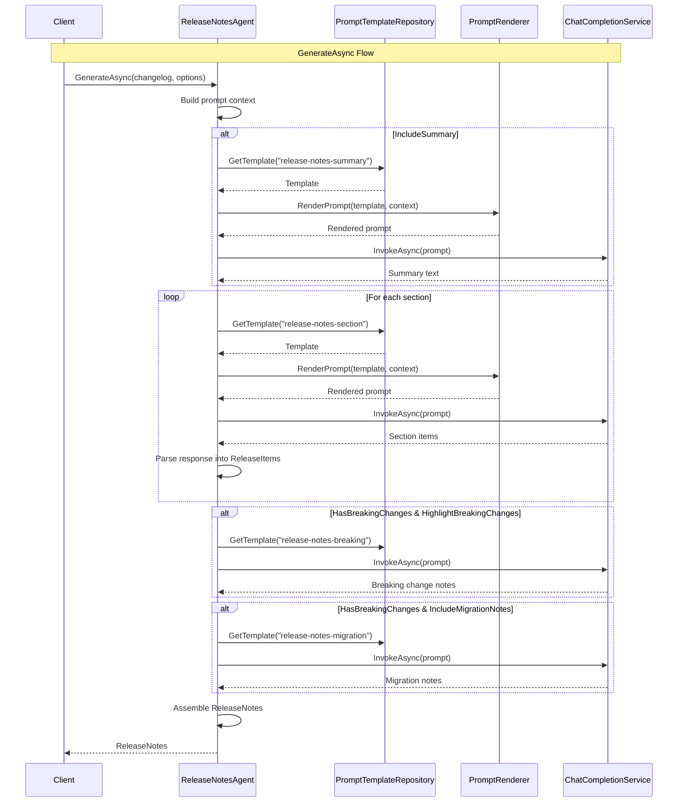

# LCS-DES-085c: Design Specification — Notes Generator

## 1. Metadata & Categorization

| Field | Value | Description |
| :--- | :--- | :--- |
| **Feature ID** | `PUB-085c` | Sub-part of PUB-085 |
| **Feature Name** | `Notes Generator (AI-Powered Rewriting)` | LLM-based release note generation |
| **Target Version** | `v0.8.5c` | Third sub-part of v0.8.5 |
| **Module Scope** | `Lexichord.Modules.Publishing` | Publishing module |
| **Swimlane** | `Publishing` | Part of Publisher vertical |
| **License Tier** | `Teams` | AI features require Teams tier |
| **Feature Gate Key** | `FeatureFlags.Publishing.ReleaseNotesAgent` | |
| **Author** | Lead Architect | |
| **Status** | `Draft` | |
| **Last Updated** | `2026-01-27` | |
| **Parent Document** | [LCS-DES-085-INDEX](./LCS-DES-085-INDEX.md) | |
| **Scope Breakdown** | [LCS-SBD-085 S3.3](./LCS-SBD-085.md#33-v085c-notes-generator) | |

---

## 2. Executive Summary

### 2.1 The Requirement

Technical commit messages are often cryptic, abbreviated, or overly technical for end-user consumption:

- `fix(api): resolve n+1 query in getUsers endpoint` - meaningless to non-developers
- `refactor: extract AuthService from UserController` - implementation detail
- `feat: add JWT RS256 support` - needs explanation

Release notes must be clear, audience-appropriate, and professionally written. Manual rewriting is time-consuming and inconsistent.

### 2.2 The Proposed Solution

Implement `ReleaseNotesAgent` that leverages LLM capabilities to:

1. **Generate Summary** — Create a 2-3 sentence overview of the release
2. **Rewrite Sections** — Transform technical commits into user-friendly descriptions
3. **Adapt to Audience** — Adjust language for end-users, developers, or enterprise
4. **Highlight Breaking Changes** — Clearly communicate migration requirements
5. **Support Regeneration** — Allow section-by-section refinement

---

## 3. Architecture & Modular Strategy

### 3.1 Dependencies

#### 3.1.1 Upstream Interfaces

| Interface | Source Version | Purpose |
| :--- | :--- | :--- |
| `IAgent` | v0.6.6a | Agent interface contract |
| `BaseAgent` | v0.7.3b | Agent base class implementation |
| `IChatCompletionService` | v0.6.1a | LLM service access |
| `IPromptRenderer` | v0.6.3b | Template rendering |
| `IPromptTemplateRepository` | v0.6.3a | Template storage |
| `IChangelogParser` | v0.8.5b | Parsed changelog input |
| `ParsedChangelog` | v0.8.5b | Categorized commits |
| `ILicenseContext` | v0.0.4c | License verification |

#### 3.1.2 NuGet Packages

No additional packages. Uses existing LLM infrastructure.

### 3.2 Licensing Behavior

- **Load Behavior:** Hard Gate at service level
- **Attribute:** `[RequiresLicense(LicenseTier.Teams)]`
- **Fallback Experience:** Lower tiers receive `LicenseRequiredException` when calling generation methods

---

## 4. Data Contract (The API)

### 4.1 IReleaseNotesGenerator Interface

```csharp
namespace Lexichord.Modules.Publishing.Abstractions;

/// <summary>
/// Generates polished release notes from parsed changelog data using AI.
/// </summary>
public interface IReleaseNotesGenerator
{
    /// <summary>
    /// Generates complete release notes from a parsed changelog.
    /// </summary>
    /// <param name="changelog">The parsed changelog data from IChangelogParser.</param>
    /// <param name="options">Generation options including audience and style.</param>
    /// <param name="ct">Cancellation token.</param>
    /// <returns>Generated release notes.</returns>
    /// <exception cref="LicenseRequiredException">When license tier is below Teams.</exception>
    Task<ReleaseNotes> GenerateAsync(
        ParsedChangelog changelog,
        ReleaseNotesOptions options,
        CancellationToken ct = default);

    /// <summary>
    /// Regenerates a specific section of the release notes.
    /// Useful for refining individual sections without regenerating everything.
    /// </summary>
    /// <param name="section">The changelog section to regenerate.</param>
    /// <param name="context">Context from other sections for consistency.</param>
    /// <param name="options">Generation options.</param>
    /// <param name="ct">Cancellation token.</param>
    /// <returns>The regenerated section.</returns>
    Task<ReleaseSection> RegenerateSectionAsync(
        ChangelogSection section,
        ReleaseNotesContext context,
        ReleaseNotesOptions options,
        CancellationToken ct = default);

    /// <summary>
    /// Generates only the summary paragraph for the release.
    /// </summary>
    /// <param name="changelog">The parsed changelog data.</param>
    /// <param name="options">Generation options.</param>
    /// <param name="ct">Cancellation token.</param>
    /// <returns>A 2-3 sentence summary of the release.</returns>
    Task<string> GenerateSummaryAsync(
        ParsedChangelog changelog,
        ReleaseNotesOptions options,
        CancellationToken ct = default);

    /// <summary>
    /// Generates migration notes for breaking changes.
    /// </summary>
    /// <param name="breakingChanges">List of breaking change commits.</param>
    /// <param name="options">Generation options.</param>
    /// <param name="ct">Cancellation token.</param>
    /// <returns>Migration guidance text.</returns>
    Task<string> GenerateMigrationNotesAsync(
        IReadOnlyList<ParsedCommit> breakingChanges,
        ReleaseNotesOptions options,
        CancellationToken ct = default);
}
```

### 4.2 Configuration Records

```csharp
namespace Lexichord.Modules.Publishing.Abstractions;

/// <summary>
/// Options for configuring release notes generation.
/// </summary>
/// <param name="Version">The version string (e.g., "v1.2.3").</param>
/// <param name="ReleaseDate">The release date.</param>
/// <param name="Audience">Target audience for the notes.</param>
/// <param name="Tone">Writing tone/style.</param>
/// <param name="ProductName">Optional product name to include.</param>
/// <param name="IncludeSummary">Whether to generate a summary paragraph.</param>
/// <param name="IncludeContributors">Whether to list contributors.</param>
/// <param name="IncludeMigrationNotes">Whether to generate migration guidance.</param>
/// <param name="HighlightBreakingChanges">Whether to highlight breaking changes.</param>
/// <param name="CustomSectionTitles">Custom titles for sections.</param>
/// <param name="StyleGuideUrl">Optional URL to a style guide for the LLM to follow.</param>
/// <param name="MaxTokensPerSection">Maximum tokens for each section generation.</param>
public record ReleaseNotesOptions(
    string Version,
    DateTime ReleaseDate,
    ReleaseAudience Audience = ReleaseAudience.Developer,
    ReleaseTone Tone = ReleaseTone.Professional,
    string? ProductName = null,
    bool IncludeSummary = true,
    bool IncludeContributors = true,
    bool IncludeMigrationNotes = true,
    bool HighlightBreakingChanges = true,
    IReadOnlyDictionary<CommitType, string>? CustomSectionTitles = null,
    string? StyleGuideUrl = null,
    int MaxTokensPerSection = 500
);

/// <summary>
/// Target audience for release notes.
/// </summary>
public enum ReleaseAudience
{
    /// <summary>
    /// Non-technical users. Focus on features and benefits.
    /// Avoid technical jargon, explain impact in user terms.
    /// </summary>
    EndUser,

    /// <summary>
    /// Technical users. Include API changes and code details.
    /// Can use technical terminology appropriately.
    /// </summary>
    Developer,

    /// <summary>
    /// Business stakeholders. Focus on compliance, stability, security.
    /// Emphasize reliability and risk mitigation.
    /// </summary>
    Enterprise,

    /// <summary>
    /// Internal team. Include all technical details.
    /// Implementation specifics are appropriate.
    /// </summary>
    Internal
}

/// <summary>
/// Writing tone for release notes.
/// </summary>
public enum ReleaseTone
{
    /// <summary>Formal, business-appropriate language.</summary>
    Professional,

    /// <summary>Approachable, conversational style.</summary>
    Friendly,

    /// <summary>Detailed, precise technical language.</summary>
    Technical,

    /// <summary>Enthusiastic, benefit-focused copy.</summary>
    Marketing
}
```

### 4.3 Output Records

```csharp
namespace Lexichord.Modules.Publishing.Abstractions;

/// <summary>
/// Generated release notes with structured sections.
/// </summary>
/// <param name="Version">The version this release covers.</param>
/// <param name="ReleaseDate">The release date.</param>
/// <param name="Summary">Overview paragraph (if generated).</param>
/// <param name="Sections">Content sections by type.</param>
/// <param name="Contributors">List of contributors.</param>
/// <param name="MigrationNotes">Migration guidance (if breaking changes).</param>
/// <param name="BreakingChanges">Highlighted breaking changes.</param>
/// <param name="Metadata">Generation metadata.</param>
public record ReleaseNotes(
    string Version,
    DateTime ReleaseDate,
    string Summary,
    IReadOnlyList<ReleaseSection> Sections,
    IReadOnlyList<Contributor> Contributors,
    string? MigrationNotes,
    IReadOnlyList<BreakingChangeNote>? BreakingChanges,
    ReleaseNotesMetadata Metadata
);

/// <summary>
/// A section of the release notes (e.g., Features, Bug Fixes).
/// </summary>
/// <param name="Title">Display title for the section.</param>
/// <param name="Type">The commit type this section represents.</param>
/// <param name="Items">Individual items in this section.</param>
public record ReleaseSection(
    string Title,
    CommitType Type,
    IReadOnlyList<ReleaseItem> Items
);

/// <summary>
/// A single item in a release section.
/// </summary>
/// <param name="Description">User-facing description (AI-generated).</param>
/// <param name="Scope">Component scope (if applicable).</param>
/// <param name="CommitSha">Original commit SHA for reference.</param>
/// <param name="PullRequestUrl">Link to PR (if extractable).</param>
/// <param name="IssueUrl">Link to issue (if extractable).</param>
/// <param name="Details">Additional details (for technical audiences).</param>
public record ReleaseItem(
    string Description,
    string? Scope,
    string? CommitSha,
    string? PullRequestUrl,
    string? IssueUrl,
    IReadOnlyList<string>? Details = null
);

/// <summary>
/// A breaking change note with migration guidance.
/// </summary>
/// <param name="Description">What changed.</param>
/// <param name="MigrationPath">How to migrate.</param>
/// <param name="CommitSha">Original commit reference.</param>
/// <param name="RelatedType">The type of change (feature, fix, etc.).</param>
public record BreakingChangeNote(
    string Description,
    string? MigrationPath,
    string? CommitSha,
    CommitType RelatedType
);

/// <summary>
/// Metadata about the generation process.
/// </summary>
/// <param name="GeneratedAt">When the notes were generated.</param>
/// <param name="GeneratorVersion">Version of the generator.</param>
/// <param name="Audience">The target audience used.</param>
/// <param name="Tone">The tone used.</param>
/// <param name="TokensUsed">Total tokens consumed.</param>
/// <param name="GenerationTime">How long generation took.</param>
public record ReleaseNotesMetadata(
    DateTime GeneratedAt,
    string GeneratorVersion,
    ReleaseAudience Audience,
    ReleaseTone Tone,
    int TokensUsed,
    TimeSpan GenerationTime
);

/// <summary>
/// Context for section regeneration to maintain consistency.
/// </summary>
/// <param name="Version">The release version.</param>
/// <param name="Summary">The release summary.</param>
/// <param name="OtherSections">Other sections for context.</param>
/// <param name="Options">Original generation options.</param>
public record ReleaseNotesContext(
    string Version,
    string Summary,
    IReadOnlyList<ReleaseSection> OtherSections,
    ReleaseNotesOptions Options
);
```

---

## 5. Implementation Logic

### 5.1 ReleaseNotesAgent Implementation

```csharp
namespace Lexichord.Modules.Publishing.Agents;

/// <summary>
/// AI-powered agent for generating release notes from Git history.
/// </summary>
[RequiresLicense(LicenseTier.Teams)]
[AgentDefinition(
    Id = "release-notes",
    Name = "Release Notes Agent",
    Description = "Generates changelogs from Git history")]
public class ReleaseNotesAgent : BaseAgent, IReleaseNotesGenerator
{
    private const string GeneratorVersion = "0.8.5";

    private readonly IPromptTemplateRepository _templates;
    private readonly ILogger<ReleaseNotesAgent> _logger;

    public ReleaseNotesAgent(
        IChatCompletionService llm,
        IPromptRenderer renderer,
        IPromptTemplateRepository templates,
        ILogger<ReleaseNotesAgent> logger)
        : base(llm, renderer, templates, logger)
    {
        _templates = templates;
        _logger = logger;
    }

    public async Task<ReleaseNotes> GenerateAsync(
        ParsedChangelog changelog,
        ReleaseNotesOptions options,
        CancellationToken ct = default)
    {
        var sw = Stopwatch.StartNew();
        var totalTokens = 0;

        _logger.LogInformation(
            "Generating release notes for {Version} with {CommitCount} commits, " +
            "Audience: {Audience}, Tone: {Tone}",
            options.Version,
            changelog.TotalCommits,
            options.Audience,
            options.Tone);

        // 1. Generate summary
        string summary = string.Empty;
        if (options.IncludeSummary)
        {
            summary = await GenerateSummaryAsync(changelog, options, ct);
            totalTokens += EstimateTokens(summary);
        }

        // 2. Generate sections
        var sections = new List<ReleaseSection>();
        foreach (var changelogSection in changelog.Sections)
        {
            _logger.LogDebug(
                "Generating section: {SectionTitle} with {CommitCount} commits",
                changelogSection.Title,
                changelogSection.CommitCount);

            var section = await GenerateSectionAsync(changelogSection, options, ct);
            sections.Add(section);
            totalTokens += EstimateTokens(section);
        }

        // 3. Generate breaking changes
        IReadOnlyList<BreakingChangeNote>? breakingChanges = null;
        if (options.HighlightBreakingChanges && changelog.HasBreakingChanges)
        {
            breakingChanges = await GenerateBreakingChangesAsync(
                changelog.BreakingChanges, options, ct);
            totalTokens += breakingChanges.Sum(bc =>
                EstimateTokens(bc.Description) + EstimateTokens(bc.MigrationPath));
        }

        // 4. Generate migration notes
        string? migrationNotes = null;
        if (options.IncludeMigrationNotes && changelog.HasBreakingChanges)
        {
            migrationNotes = await GenerateMigrationNotesAsync(
                changelog.BreakingChanges, options, ct);
            totalTokens += EstimateTokens(migrationNotes);
        }

        // 5. Extract contributors
        var contributors = ExtractContributors(changelog);

        sw.Stop();

        _logger.LogInformation(
            "Release notes generated for {Version} in {ElapsedMs}ms, {TokensUsed} tokens used",
            options.Version,
            sw.ElapsedMilliseconds,
            totalTokens);

        return new ReleaseNotes(
            Version: options.Version,
            ReleaseDate: options.ReleaseDate,
            Summary: summary,
            Sections: sections,
            Contributors: options.IncludeContributors ? contributors : [],
            MigrationNotes: migrationNotes,
            BreakingChanges: breakingChanges,
            Metadata: new ReleaseNotesMetadata(
                GeneratedAt: DateTime.UtcNow,
                GeneratorVersion: GeneratorVersion,
                Audience: options.Audience,
                Tone: options.Tone,
                TokensUsed: totalTokens,
                GenerationTime: sw.Elapsed
            )
        );
    }

    public async Task<string> GenerateSummaryAsync(
        ParsedChangelog changelog,
        ReleaseNotesOptions options,
        CancellationToken ct = default)
    {
        var template = await _templates.GetTemplateAsync("release-notes-summary", ct);

        var context = BuildPromptContext(options);
        context["feature_count"] = changelog.Sections
            .FirstOrDefault(s => s.Type == CommitType.Feature)?.CommitCount ?? 0;
        context["bugfix_count"] = changelog.Sections
            .FirstOrDefault(s => s.Type == CommitType.BugFix)?.CommitCount ?? 0;
        context["breaking_count"] = changelog.BreakingChanges.Count;
        context["other_count"] = changelog.TotalCommits -
            (int)context["feature_count"] - (int)context["bugfix_count"];
        context["key_commits"] = GetKeyCommits(changelog);

        var prompt = await RenderPromptAsync(template, context, ct);
        var response = await InvokeAsync(
            new AgentRequest(prompt, null, null), ct);

        return response.Content.Trim();
    }

    public async Task<ReleaseSection> RegenerateSectionAsync(
        ChangelogSection section,
        ReleaseNotesContext context,
        ReleaseNotesOptions options,
        CancellationToken ct = default)
    {
        var promptContext = BuildPromptContext(options);
        promptContext["existing_summary"] = context.Summary;
        promptContext["other_sections"] = FormatOtherSections(context.OtherSections);

        return await GenerateSectionAsync(section, options, ct, promptContext);
    }

    public async Task<string> GenerateMigrationNotesAsync(
        IReadOnlyList<ParsedCommit> breakingChanges,
        ReleaseNotesOptions options,
        CancellationToken ct = default)
    {
        var template = await _templates.GetTemplateAsync("release-notes-migration", ct);

        var context = BuildPromptContext(options);
        context["breaking_changes"] = FormatBreakingChanges(breakingChanges);

        var prompt = await RenderPromptAsync(template, context, ct);
        var response = await InvokeAsync(
            new AgentRequest(prompt, null, null), ct);

        return response.Content.Trim();
    }

    #region Private Methods

    private async Task<ReleaseSection> GenerateSectionAsync(
        ChangelogSection section,
        ReleaseNotesOptions options,
        CancellationToken ct,
        Dictionary<string, object>? additionalContext = null)
    {
        var template = await _templates.GetTemplateAsync("release-notes-section", ct);

        var context = BuildPromptContext(options);
        context["section_title"] = GetSectionTitle(section.Type, options);
        context["commits"] = FormatCommitsForPrompt(section.Commits);

        if (additionalContext != null)
        {
            foreach (var kvp in additionalContext)
            {
                context[kvp.Key] = kvp.Value;
            }
        }

        var prompt = await RenderPromptAsync(template, context, ct);
        var response = await InvokeAsync(
            new AgentRequest(prompt, null, null), ct);

        var items = ParseSectionResponse(response.Content, section.Commits);

        return new ReleaseSection(
            Title: GetSectionTitle(section.Type, options),
            Type: section.Type,
            Items: items
        );
    }

    private async Task<IReadOnlyList<BreakingChangeNote>> GenerateBreakingChangesAsync(
        IReadOnlyList<ParsedCommit> breakingChanges,
        ReleaseNotesOptions options,
        CancellationToken ct)
    {
        var template = await _templates.GetTemplateAsync("release-notes-breaking", ct);

        var context = BuildPromptContext(options);
        context["breaking_changes"] = FormatBreakingChanges(breakingChanges);

        var prompt = await RenderPromptAsync(template, context, ct);
        var response = await InvokeAsync(
            new AgentRequest(prompt, null, null), ct);

        return ParseBreakingChangesResponse(response.Content, breakingChanges);
    }

    private Dictionary<string, object> BuildPromptContext(ReleaseNotesOptions options)
    {
        return new Dictionary<string, object>
        {
            ["version"] = options.Version,
            ["release_date"] = options.ReleaseDate.ToString("MMMM d, yyyy"),
            ["product_name"] = options.ProductName ?? "the application",
            ["audience"] = GetAudienceDescription(options.Audience),
            ["tone"] = GetToneDescription(options.Tone),
            ["style_guide"] = options.StyleGuideUrl ?? ""
        };
    }

    private static string GetAudienceDescription(ReleaseAudience audience) => audience switch
    {
        ReleaseAudience.EndUser =>
            "non-technical end users. Avoid jargon, focus on benefits and user impact.",
        ReleaseAudience.Developer =>
            "developers and technical users. Include API changes and technical details.",
        ReleaseAudience.Enterprise =>
            "enterprise stakeholders. Emphasize stability, security, and compliance.",
        ReleaseAudience.Internal =>
            "internal team members. Include all implementation details.",
        _ => "general audience"
    };

    private static string GetToneDescription(ReleaseTone tone) => tone switch
    {
        ReleaseTone.Professional => "professional and formal",
        ReleaseTone.Friendly => "friendly and conversational",
        ReleaseTone.Technical => "technical and precise",
        ReleaseTone.Marketing => "enthusiastic and benefit-focused",
        _ => "professional"
    };

    private static string GetSectionTitle(
        CommitType type,
        ReleaseNotesOptions options)
    {
        if (options.CustomSectionTitles?.TryGetValue(type, out var custom) == true)
            return custom;

        return ChangelogSectionTitles.Defaults.GetValueOrDefault(type, "Other Changes");
    }

    private static string FormatCommitsForPrompt(IReadOnlyList<ParsedCommit> commits)
    {
        var sb = new StringBuilder();
        foreach (var commit in commits)
        {
            var scope = commit.Scope != null ? $" ({commit.Scope})" : "";
            sb.AppendLine($"- {commit.DisplayMessage}{scope}");

            if (commit.Conventional?.Body != null)
            {
                sb.AppendLine($"  Context: {commit.Conventional.Body[..Math.Min(200, commit.Conventional.Body.Length)]}");
            }
        }
        return sb.ToString();
    }

    private static string FormatBreakingChanges(IReadOnlyList<ParsedCommit> changes)
    {
        var sb = new StringBuilder();
        foreach (var change in changes)
        {
            sb.AppendLine($"- {change.DisplayMessage}");
            if (change.Conventional?.Footers.FirstOrDefault(f =>
                f.StartsWith("BREAKING CHANGE", StringComparison.OrdinalIgnoreCase)) is { } footer)
            {
                sb.AppendLine($"  Details: {footer}");
            }
        }
        return sb.ToString();
    }

    private static List<object> GetKeyCommits(ParsedChangelog changelog)
    {
        // Select top commits for summary context
        var keyCommits = new List<object>();

        // Add first 3 features
        var features = changelog.Sections
            .FirstOrDefault(s => s.Type == CommitType.Feature)?
            .Commits.Take(3) ?? [];

        foreach (var commit in features)
        {
            keyCommits.Add(new { type = "Feature", description = commit.DisplayMessage });
        }

        // Add first 2 bug fixes
        var fixes = changelog.Sections
            .FirstOrDefault(s => s.Type == CommitType.BugFix)?
            .Commits.Take(2) ?? [];

        foreach (var commit in fixes)
        {
            keyCommits.Add(new { type = "Bug Fix", description = commit.DisplayMessage });
        }

        // Add all breaking changes
        foreach (var commit in changelog.BreakingChanges)
        {
            keyCommits.Add(new { type = "Breaking", description = commit.DisplayMessage });
        }

        return keyCommits;
    }

    private static string FormatOtherSections(IReadOnlyList<ReleaseSection> sections)
    {
        var sb = new StringBuilder();
        foreach (var section in sections)
        {
            sb.AppendLine($"{section.Title}:");
            foreach (var item in section.Items.Take(3))
            {
                sb.AppendLine($"  - {item.Description}");
            }
        }
        return sb.ToString();
    }

    private static List<ReleaseItem> ParseSectionResponse(
        string response,
        IReadOnlyList<ParsedCommit> originalCommits)
    {
        // Parse the LLM response into individual items
        // Expected format: one item per line, starting with "-" or "*"
        var items = new List<ReleaseItem>();
        var lines = response.Split('\n', StringSplitOptions.RemoveEmptyEntries);

        var commitIndex = 0;
        foreach (var line in lines)
        {
            var trimmed = line.Trim();
            if (trimmed.StartsWith("-") || trimmed.StartsWith("*"))
            {
                var description = trimmed.TrimStart('-', '*', ' ');
                var commit = commitIndex < originalCommits.Count
                    ? originalCommits[commitIndex]
                    : null;

                items.Add(new ReleaseItem(
                    Description: description,
                    Scope: commit?.Scope,
                    CommitSha: commit?.Original.ShortSha,
                    PullRequestUrl: null,
                    IssueUrl: null,
                    Details: null
                ));

                commitIndex++;
            }
        }

        return items;
    }

    private static List<BreakingChangeNote> ParseBreakingChangesResponse(
        string response,
        IReadOnlyList<ParsedCommit> originalCommits)
    {
        var notes = new List<BreakingChangeNote>();
        var sections = response.Split(new[] { "\n\n" }, StringSplitOptions.RemoveEmptyEntries);

        var commitIndex = 0;
        foreach (var section in sections)
        {
            var lines = section.Split('\n', StringSplitOptions.RemoveEmptyEntries);
            if (lines.Length == 0) continue;

            var description = lines[0].TrimStart('-', '*', ' ');
            var migrationPath = lines.Length > 1
                ? string.Join(" ", lines.Skip(1)).Trim()
                : null;

            var commit = commitIndex < originalCommits.Count
                ? originalCommits[commitIndex]
                : null;

            notes.Add(new BreakingChangeNote(
                Description: description,
                MigrationPath: migrationPath,
                CommitSha: commit?.Original.ShortSha,
                RelatedType: commit?.Type ?? CommitType.Other
            ));

            commitIndex++;
        }

        return notes;
    }

    private static List<Contributor> ExtractContributors(ParsedChangelog changelog)
    {
        return changelog.Sections
            .SelectMany(s => s.Commits)
            .Concat(changelog.UncategorizedCommits)
            .GroupBy(c => c.Original.Author.Email.ToLowerInvariant())
            .Select(g => new Contributor(
                Name: g.First().Original.Author.Name,
                Email: g.Key,
                CommitCount: g.Count(),
                Additions: 0,
                Deletions: 0
            ))
            .OrderByDescending(c => c.CommitCount)
            .ToList();
    }

    private static int EstimateTokens(string? text)
    {
        if (string.IsNullOrEmpty(text)) return 0;
        // Rough estimate: 1 token per 4 characters
        return text.Length / 4;
    }

    private static int EstimateTokens(ReleaseSection section)
    {
        return section.Items.Sum(i =>
            EstimateTokens(i.Description) +
            EstimateTokens(i.Scope) +
            (i.Details?.Sum(EstimateTokens) ?? 0));
    }

    #endregion
}
```

### 5.2 Prompt Templates

```yaml
# templates/release-notes-summary.yaml
template_id: "release-notes-summary"
system_prompt: |
  You are a technical writer creating release notes for {{product_name}}.

  Target Audience: {{audience}}
  Writing Tone: {{tone}}

  Write a brief summary (2-3 sentences) that:
  1. Highlights the most important changes in this release
  2. Gives users a quick understanding of what's new
  3. Sets expectations for the rest of the release notes

  {{#style_guide}}
  Follow these style guidelines: {{style_guide}}
  {{/style_guide}}

user_prompt: |
  Generate a release summary for version {{version}} ({{release_date}}).

  Release contains:
  - Features: {{feature_count}}
  - Bug Fixes: {{bugfix_count}}
  - Breaking Changes: {{breaking_count}}
  - Other: {{other_count}}

  Key changes:
  {{#key_commits}}
  - {{type}}: {{description}}
  {{/key_commits}}

  Write a 2-3 sentence summary.

# templates/release-notes-section.yaml
template_id: "release-notes-section"
system_prompt: |
  You are a technical writer creating release notes for {{product_name}}.

  Target Audience: {{audience}}
  Writing Tone: {{tone}}

  Rewrite the following commit messages as clear, user-facing release notes.

  Guidelines:
  - Use complete sentences
  - Focus on the impact to the user, not the implementation details
  - Be concise but informative
  - Use active voice
  - Start each item with an action verb
  - One item per line, starting with "-"

  {{#style_guide}}
  Follow these style guidelines: {{style_guide}}
  {{/style_guide}}

user_prompt: |
  Rewrite these {{section_title}} items for version {{version}}:

  {{commits}}

  Return one clear, user-friendly description per commit, each on a new line starting with "-".

# templates/release-notes-breaking.yaml
template_id: "release-notes-breaking"
system_prompt: |
  You are a technical writer documenting breaking changes.

  Target Audience: {{audience}}

  For each breaking change:
  1. Clearly describe what changed
  2. Explain the impact on users
  3. Provide migration guidance if possible

  Format each breaking change as:
  - Description of the change

  Migration: How to update (if applicable)

user_prompt: |
  Document these breaking changes for version {{version}}:

  {{breaking_changes}}

  Provide clear descriptions and migration guidance.

# templates/release-notes-migration.yaml
template_id: "release-notes-migration"
system_prompt: |
  You are a technical writer creating migration documentation.

  Target Audience: {{audience}}
  Writing Tone: {{tone}}

  Create a migration guide that helps users upgrade to this version.
  Be specific, provide code examples where helpful, and order steps logically.

user_prompt: |
  Create migration notes for version {{version}} based on these breaking changes:

  {{breaking_changes}}

  Provide step-by-step migration guidance.
```

### 5.3 Generation Flow Diagram



---

## 6. Test Scenarios

### 6.1 Unit Tests

```csharp
namespace Lexichord.Tests.Publishing;

[Trait("Category", "Unit")]
[Trait("Version", "v0.8.5c")]
public class ReleaseNotesAgentTests
{
    private readonly Mock<IChatCompletionService> _llmMock;
    private readonly Mock<IPromptRenderer> _rendererMock;
    private readonly Mock<IPromptTemplateRepository> _templatesMock;
    private readonly ReleaseNotesAgent _sut;

    public ReleaseNotesAgentTests()
    {
        _llmMock = new Mock<IChatCompletionService>();
        _rendererMock = new Mock<IPromptRenderer>();
        _templatesMock = new Mock<IPromptTemplateRepository>();

        _sut = new ReleaseNotesAgent(
            _llmMock.Object,
            _rendererMock.Object,
            _templatesMock.Object,
            Mock.Of<ILogger<ReleaseNotesAgent>>());

        SetupDefaultMocks();
    }

    #region GenerateSummaryAsync Tests

    [Fact]
    public async Task GenerateSummaryAsync_WithFeatures_GeneratesSummary()
    {
        // Arrange
        var changelog = CreateChangelog(features: 3, fixes: 2);
        var options = CreateDefaultOptions();

        _llmMock.Setup(x => x.CompleteAsync(It.IsAny<ChatMessage[]>(), It.IsAny<CancellationToken>()))
            .ReturnsAsync(new ChatResponse("This release introduces 3 new features and fixes 2 bugs."));

        // Act
        var result = await _sut.GenerateSummaryAsync(changelog, options);

        // Assert
        result.Should().NotBeNullOrEmpty();
        result.Should().Contain("feature");
    }

    [Fact]
    public async Task GenerateSummaryAsync_WithBreakingChanges_MentionsBreaking()
    {
        // Arrange
        var changelog = CreateChangelog(features: 1, breaking: 2);
        var options = CreateDefaultOptions();

        _llmMock.Setup(x => x.CompleteAsync(It.IsAny<ChatMessage[]>(), It.IsAny<CancellationToken>()))
            .ReturnsAsync(new ChatResponse(
                "This release includes breaking changes that require migration."));

        // Act
        var result = await _sut.GenerateSummaryAsync(changelog, options);

        // Assert
        _templatesMock.Verify(x => x.GetTemplateAsync("release-notes-summary", It.IsAny<CancellationToken>()));
    }

    #endregion

    #region GenerateAsync Tests

    [Fact]
    public async Task GenerateAsync_WithAllOptions_GeneratesCompleteNotes()
    {
        // Arrange
        var changelog = CreateChangelog(features: 2, fixes: 1);
        var options = new ReleaseNotesOptions(
            Version: "v1.0.0",
            ReleaseDate: new DateTime(2026, 1, 27),
            Audience: ReleaseAudience.Developer,
            Tone: ReleaseTone.Professional,
            IncludeSummary: true,
            IncludeContributors: true);

        SetupLlmResponses();

        // Act
        var result = await _sut.GenerateAsync(changelog, options);

        // Assert
        result.Version.Should().Be("v1.0.0");
        result.ReleaseDate.Should().Be(new DateTime(2026, 1, 27));
        result.Summary.Should().NotBeNullOrEmpty();
        result.Sections.Should().HaveCount(2); // Features + Bug Fixes
        result.Metadata.Audience.Should().Be(ReleaseAudience.Developer);
        result.Metadata.Tone.Should().Be(ReleaseTone.Professional);
        result.Metadata.GeneratorVersion.Should().Be("0.8.5");
    }

    [Fact]
    public async Task GenerateAsync_WithoutSummary_SkipsSummaryGeneration()
    {
        // Arrange
        var changelog = CreateChangelog(features: 1);
        var options = CreateDefaultOptions() with { IncludeSummary = false };

        SetupLlmResponses();

        // Act
        var result = await _sut.GenerateAsync(changelog, options);

        // Assert
        result.Summary.Should().BeEmpty();
        _templatesMock.Verify(
            x => x.GetTemplateAsync("release-notes-summary", It.IsAny<CancellationToken>()),
            Times.Never);
    }

    [Fact]
    public async Task GenerateAsync_WithBreakingChanges_GeneratesBreakingSection()
    {
        // Arrange
        var changelog = CreateChangelog(features: 1, breaking: 1);
        var options = CreateDefaultOptions() with { HighlightBreakingChanges = true };

        SetupLlmResponses();

        // Act
        var result = await _sut.GenerateAsync(changelog, options);

        // Assert
        result.BreakingChanges.Should().NotBeNull();
        result.BreakingChanges.Should().HaveCount(1);
    }

    [Fact]
    public async Task GenerateAsync_WithMigrationNotes_GeneratesMigration()
    {
        // Arrange
        var changelog = CreateChangelog(features: 1, breaking: 1);
        var options = CreateDefaultOptions() with { IncludeMigrationNotes = true };

        SetupLlmResponses();

        // Act
        var result = await _sut.GenerateAsync(changelog, options);

        // Assert
        result.MigrationNotes.Should().NotBeNullOrEmpty();
    }

    #endregion

    #region Audience Tests

    [Theory]
    [InlineData(ReleaseAudience.EndUser, "non-technical")]
    [InlineData(ReleaseAudience.Developer, "developers")]
    [InlineData(ReleaseAudience.Enterprise, "enterprise")]
    [InlineData(ReleaseAudience.Internal, "internal")]
    public async Task GenerateAsync_DifferentAudiences_UsesAppropriatePrompt(
        ReleaseAudience audience, string expectedKeyword)
    {
        // Arrange
        var changelog = CreateChangelog(features: 1);
        var options = CreateDefaultOptions() with { Audience = audience };
        string capturedPrompt = "";

        _rendererMock.Setup(x => x.RenderAsync(It.IsAny<PromptTemplate>(), It.IsAny<Dictionary<string, object>>(), It.IsAny<CancellationToken>()))
            .Callback<PromptTemplate, Dictionary<string, object>, CancellationToken>((_, ctx, _) =>
            {
                if (ctx.TryGetValue("audience", out var a))
                    capturedPrompt = a.ToString()!;
            })
            .ReturnsAsync("rendered prompt");

        SetupLlmResponses();

        // Act
        await _sut.GenerateAsync(changelog, options);

        // Assert
        capturedPrompt.ToLower().Should().Contain(expectedKeyword);
    }

    #endregion

    #region RegenerateSectionAsync Tests

    [Fact]
    public async Task RegenerateSectionAsync_ReturnsNewSection()
    {
        // Arrange
        var section = CreateChangelogSection(CommitType.Feature, 2);
        var context = new ReleaseNotesContext(
            Version: "v1.0.0",
            Summary: "A great release",
            OtherSections: new List<ReleaseSection>(),
            Options: CreateDefaultOptions());

        SetupLlmResponses();

        // Act
        var result = await _sut.RegenerateSectionAsync(
            section, context, CreateDefaultOptions());

        // Assert
        result.Should().NotBeNull();
        result.Type.Should().Be(CommitType.Feature);
        result.Items.Should().NotBeEmpty();
    }

    #endregion

    #region Helper Methods

    private void SetupDefaultMocks()
    {
        _templatesMock.Setup(x => x.GetTemplateAsync(It.IsAny<string>(), It.IsAny<CancellationToken>()))
            .ReturnsAsync(new PromptTemplate("id", "system", "user"));

        _rendererMock.Setup(x => x.RenderAsync(It.IsAny<PromptTemplate>(), It.IsAny<Dictionary<string, object>>(), It.IsAny<CancellationToken>()))
            .ReturnsAsync("rendered prompt");
    }

    private void SetupLlmResponses()
    {
        var callCount = 0;
        _llmMock.Setup(x => x.CompleteAsync(It.IsAny<ChatMessage[]>(), It.IsAny<CancellationToken>()))
            .ReturnsAsync(() =>
            {
                callCount++;
                return callCount switch
                {
                    1 => new ChatResponse("This release introduces new features."),
                    2 => new ChatResponse("- New feature added\n- Another improvement"),
                    3 => new ChatResponse("- Bug fix applied"),
                    4 => new ChatResponse("- Breaking: API changed\n\nMigration: Update your code"),
                    5 => new ChatResponse("1. Update API calls\n2. Test thoroughly"),
                    _ => new ChatResponse("Generated content")
                };
            });
    }

    private static ReleaseNotesOptions CreateDefaultOptions() => new(
        Version: "v1.0.0",
        ReleaseDate: DateTime.Now,
        Audience: ReleaseAudience.Developer,
        Tone: ReleaseTone.Professional);

    private static ParsedChangelog CreateChangelog(
        int features = 0,
        int fixes = 0,
        int breaking = 0)
    {
        var sections = new List<ChangelogSection>();

        if (features > 0)
            sections.Add(CreateChangelogSection(CommitType.Feature, features));

        if (fixes > 0)
            sections.Add(CreateChangelogSection(CommitType.BugFix, fixes));

        var breakingCommits = Enumerable.Range(0, breaking)
            .Select(i => CreateParsedCommit($"feat!: breaking {i}", isBreaking: true))
            .ToList();

        return new ParsedChangelog(
            Sections: sections,
            UncategorizedCommits: new List<ParsedCommit>(),
            BreakingChanges: breakingCommits,
            TotalCommits: features + fixes + breaking,
            ConventionalCommitCount: features + fixes + breaking
        );
    }

    private static ChangelogSection CreateChangelogSection(CommitType type, int count)
    {
        var commits = Enumerable.Range(0, count)
            .Select(i => CreateParsedCommit($"{type}: item {i}"))
            .ToList();

        return new ChangelogSection(
            Title: ChangelogSectionTitles.Defaults[type],
            Type: type,
            Commits: commits,
            CommitCount: count
        );
    }

    private static ParsedCommit CreateParsedCommit(string message, bool isBreaking = false)
    {
        var commit = new GitCommit(
            Sha: Guid.NewGuid().ToString("N")[..40],
            ShortSha: Guid.NewGuid().ToString("N")[..7],
            Message: message,
            MessageShort: message,
            Author: new GitSignature("Dev", "dev@example.com"),
            Committer: new GitSignature("Dev", "dev@example.com"),
            AuthoredAt: DateTime.Now,
            ParentShas: new[] { "parent" },
            Changes: null
        );

        return new ParsedCommit(
            Original: commit,
            Conventional: new ConventionalCommit("feat", null, message, null, new List<string>(), isBreaking),
            DisplayMessage: message,
            IsBreakingChange: isBreaking
        );
    }

    #endregion
}
```

---

## 7. UI/UX Specifications

**Not applicable.** This sub-part is an agent/service component. The UI is implemented in v0.8.5d.

---

## 8. Observability & Logging

| Level | Message Template |
| :--- | :--- |
| Info | `"Generating release notes for {Version} with {CommitCount} commits, Audience: {Audience}, Tone: {Tone}"` |
| Debug | `"Generating section: {SectionTitle} with {CommitCount} commits"` |
| Debug | `"Generating summary from {KeyCommitCount} key commits"` |
| Debug | `"Generating migration notes for {BreakingCount} breaking changes"` |
| Info | `"Release notes generated for {Version} in {ElapsedMs}ms, {TokensUsed} tokens used"` |
| Warning | `"LLM response truncated for section {SectionTitle}"` |
| Error | `"Generation failed for {Version}: {Error}"` |

---

## 9. Security & Safety

| Risk | Level | Mitigation |
| :--- | :--- | :--- |
| Prompt injection via commit messages | Medium | Commits used as data, not instructions |
| LLM hallucination | Medium | Original commit data preserved; human review step |
| Token limit exceeded | Low | MaxTokensPerSection option; chunking for large sections |
| License bypass | Low | `[RequiresLicense]` attribute; server-side verification |

---

## 10. Acceptance Criteria

### 10.1 Functional Criteria

| # | Given | When | Then |
| :--- | :--- | :--- | :--- |
| 1 | Changelog with features | GenerateAsync | Summary mentions features |
| 2 | IncludeSummary=false | GenerateAsync | No summary generated |
| 3 | Breaking changes exist | GenerateAsync | BreakingChanges populated |
| 4 | IncludeMigrationNotes=true | GenerateAsync | MigrationNotes generated |
| 5 | Audience=EndUser | GenerateAsync | Non-technical language used |
| 6 | Audience=Developer | GenerateAsync | Technical details included |
| 7 | Section regeneration | RegenerateSectionAsync | Only that section updated |

### 10.2 Quality Criteria

| # | Metric | Target |
| :--- | :--- | :--- |
| 8 | Summary length | 2-3 sentences |
| 9 | Item descriptions | Complete sentences |
| 10 | Grammar correctness | 95%+ |
| 11 | Relevance to original commit | 90%+ |

### 10.3 License Criteria

| # | Given | When | Then |
| :--- | :--- | :--- | :--- |
| 12 | License < Teams | GenerateAsync | LicenseRequiredException thrown |
| 13 | License = Teams | GenerateAsync | Generation succeeds |

---

## 11. Deliverable Checklist

| # | Deliverable | Status |
| :--- | :--- | :--- |
| 1 | `IReleaseNotesGenerator` interface | [ ] |
| 2 | `ReleaseNotesAgent` implementation | [ ] |
| 3 | `ReleaseNotes` record | [ ] |
| 4 | `ReleaseSection` record | [ ] |
| 5 | `ReleaseItem` record | [ ] |
| 6 | `BreakingChangeNote` record | [ ] |
| 7 | `ReleaseNotesOptions` record | [ ] |
| 8 | `ReleaseNotesMetadata` record | [ ] |
| 9 | `ReleaseNotesContext` record | [ ] |
| 10 | `ReleaseAudience` enum | [ ] |
| 11 | `ReleaseTone` enum | [ ] |
| 12 | Prompt template: release-notes-summary | [ ] |
| 13 | Prompt template: release-notes-section | [ ] |
| 14 | Prompt template: release-notes-breaking | [ ] |
| 15 | Prompt template: release-notes-migration | [ ] |
| 16 | Unit tests | [ ] |
| 17 | DI registration | [ ] |

---

## 12. Verification Commands

```bash
# Run Notes Generator tests
dotnet test --filter "Version=v0.8.5c" --logger "console;verbosity=detailed"

# Run specific test class
dotnet test --filter "FullyQualifiedName~ReleaseNotesAgentTests"

# Run with coverage
dotnet test --filter "Version=v0.8.5c" --collect:"XPlat Code Coverage"
```

---

## Document History

| Version | Date | Author | Changes |
| :--- | :--- | :--- | :--- |
| 1.0 | 2026-01-27 | Lead Architect | Initial draft |
