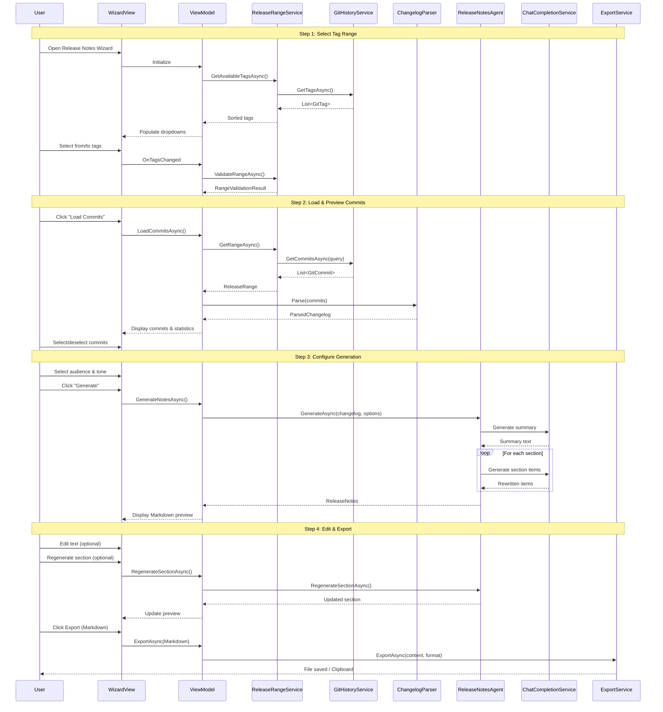

# LCS-DES-085: Design Specification Index — Release Notes Agent

## Document Control

| Field | Value |
| :--- | :--- |
| **Document ID** | LCS-DES-085-INDEX |
| **Feature ID** | PUB-085 |
| **Feature Name** | Release Notes Agent (The Playbill Writer) |
| **Target Version** | v0.8.5 |
| **Module Scope** | Lexichord.Modules.Publishing |
| **Swimlane** | Publishing |
| **License Tier** | Teams |
| **Feature Gate Key** | `FeatureFlags.Publishing.ReleaseNotes` |
| **Status** | Draft |
| **Last Updated** | 2026-01-27 |

---

## 1. Executive Summary

**v0.8.5** delivers the **Release Notes Agent** (codename: The Playbill Writer) — an AI-powered system that automatically generates professional, user-facing changelogs from Git commit history.

### 1.1 The Problem

Technical writers and development teams spend 2-3 hours per release manually:

- Diffing Git tags to identify included commits
- Interpreting cryptic commit messages
- Categorizing changes by type (features, fixes, documentation)
- Rewriting technical descriptions for end-users
- Maintaining consistent formatting across releases

This manual process is error-prone, time-consuming, and inconsistent.

### 1.2 The Solution

Implement an integrated workflow that:

1. **Reads Git History** — Query commits between any two tags with full metadata
2. **Parses Conventional Commits** — Automatically categorize by type (feat, fix, docs, etc.)
3. **Generates with AI** — Rewrite commit messages for target audiences using LLM
4. **Provides Editing UI** — Preview, edit, regenerate sections, and export

### 1.3 Business Value

| Value | Description |
| :--- | :--- |
| **Time Savings** | 2-3 hours reduced to under 10 minutes per release |
| **Consistency** | Uniform formatting, categorization, and tone |
| **Accuracy** | Direct Git integration eliminates transcription errors |
| **Audience Adaptation** | AI rewrites for end-user, developer, or enterprise audiences |
| **Conventional Commits** | Full support for standard commit message parsing |
| **Foundation** | Establishes patterns for future AI-assisted documentation |

---

## 2. Related Documents

### 2.1 Scope Breakdown Document

The detailed scope breakdown for v0.8.5, including all sub-parts, implementation checklists, user stories, and acceptance criteria:

| Document | Description |
| :--- | :--- |
| **[LCS-SBD-085](./LCS-SBD-085.md)** | Scope Breakdown — Release Notes Agent |

### 2.2 Sub-Part Design Specifications

Each sub-part has its own detailed design specification following the LDS-01 template:

| Sub-Part | Document | Title | Description |
| :--- | :--- | :--- | :--- |
| v0.8.5a | **[LCS-DES-085a](./LCS-DES-085a.md)** | Git Integration | Read commits, tags, and compare ranges |
| v0.8.5b | **[LCS-DES-085b](./LCS-DES-085b.md)** | Changelog Parser | Recognize and categorize conventional commits |
| v0.8.5c | **[LCS-DES-085c](./LCS-DES-085c.md)** | Notes Generator | AI rewrites for target audience |
| v0.8.5d | **[LCS-DES-085d](./LCS-DES-085d.md)** | Release Draft UI | Preview, edit, and export workflow |

---

## 3. Architecture Overview

### 3.1 Component Diagram

```mermaid
graph TB
    subgraph "Lexichord.Modules.Publishing"
        subgraph "v0.8.5a: Git Integration"
            RRS[IReleaseRangeService<br/>Tag-to-tag commits]
            RS[ReleaseRangeService<br/>Implementation]
        end

        subgraph "v0.8.5b: Changelog Parser"
            CP[IChangelogParser<br/>Commit categorization]
            CPI[ChangelogParser<br/>Conventional Commits]
        end

        subgraph "v0.8.5c: Notes Generator"
            RNG[IReleaseNotesGenerator<br/>AI generation]
            RNA[ReleaseNotesAgent<br/>BaseAgent implementation]
            PT[Prompt Templates<br/>Audience-specific]
        end

        subgraph "v0.8.5d: Release Draft UI"
            WIZ[ReleaseNotesWizardView<br/>Multi-step workflow]
            VM[ReleaseNotesWizardViewModel<br/>State management]
            TRS[TagRangeSelector<br/>Tag selection]
            CPP[CommitPreviewPanel<br/>Commit list]
            RNE[ReleaseNotesEditor<br/>Markdown editor]
            EXP[ExportService<br/>Format export]
        end
    end

    subgraph "Dependencies (Prior Versions)"
        GRS[IGitRepositoryService<br/>v0.8.1a]
        GHS[IGitHistoryService<br/>v0.8.1a]
        CCP[IConventionalCommitParser<br/>v0.8.2d]
        LLM[IChatCompletionService<br/>v0.6.1a]
        BA[BaseAgent<br/>v0.7.3b]
        PR[IPromptRenderer<br/>v0.6.3b]
        LIC[ILicenseContext<br/>v0.0.4c]
        MED[IMediator<br/>v0.0.7a]
    end

    RS --> GHS
    RS --> GRS
    CPI --> CCP
    RNA --> BA
    RNA --> LLM
    RNA --> PR
    RNA --> CP
    RNA --> PT

    WIZ --> VM
    VM --> RRS
    VM --> CP
    VM --> RNG
    VM --> EXP
    VM --> LIC
    VM --> MED

    WIZ --> TRS
    WIZ --> CPP
    WIZ --> RNE

    style RRS fill:#4a9eff,color:#fff
    style RS fill:#4a9eff,color:#fff
    style CP fill:#4a9eff,color:#fff
    style CPI fill:#4a9eff,color:#fff
    style RNG fill:#f97316,color:#fff
    style RNA fill:#f97316,color:#fff
    style PT fill:#f97316,color:#fff
    style WIZ fill:#22c55e,color:#fff
    style VM fill:#22c55e,color:#fff
    style TRS fill:#22c55e,color:#fff
    style CPP fill:#22c55e,color:#fff
    style RNE fill:#22c55e,color:#fff
    style EXP fill:#22c55e,color:#fff
```



### 3.2 Data Flow Diagram



---

## 4. Dependencies

### 4.1 Upstream Dependencies (Required from Prior Versions)

| Interface | Source Version | Purpose |
| :--- | :--- | :--- |
| `IGitRepositoryService` | v0.8.1a | Open and query repository |
| `IGitHistoryService` | v0.8.1a | Get commits and tags |
| `GitCommit` | v0.8.1c | Commit data structure |
| `GitTag` | v0.8.1a | Tag data structure |
| `IConventionalCommitParser` | v0.8.2d | Base conventional commit parsing |
| `ConventionalCommit` | v0.8.2d | Parsed commit record |
| `IAgent` | v0.6.6a | Agent interface |
| `BaseAgent` | v0.7.3b | Agent base class |
| `IChatCompletionService` | v0.6.1a | LLM integration |
| `IPromptRenderer` | v0.6.3b | Template rendering |
| `IPromptTemplateRepository` | v0.6.3a | Template storage |
| `ILicenseContext` | v0.0.4c | License verification |
| `IMediator` | v0.0.7a | Event publishing |
| `IRegionManager` | v0.1.1b | UI panel registration |
| `ISettingsService` | v0.1.6a | User preferences |

### 4.2 NuGet Packages

| Package | Version | Purpose |
| :--- | :--- | :--- |
| `LibGit2Sharp` | 0.30.x | Git repository access (existing) |
| `Markdig` | 0.34.x | Markdown parsing/rendering (existing) |
| `Microsoft.Extensions.Caching.Memory` | 8.x | In-memory caching (existing) |

### 4.3 Downstream Consumers (Future Versions)

| Version | Feature | Uses From v0.8.5 |
| :--- | :--- | :--- |
| v0.8.6 | PDF Exporter | Export release notes to PDF |
| v0.8.7 | Documentation Linter | Lint generated release notes |
| v0.9.x | Release Automation | Auto-generate on tag push |

---

## 5. License Gating Strategy

### 5.1 Feature Access by Tier

| Feature | Core | Writer | WriterPro | Teams | Enterprise |
| :--- | :--- | :--- | :--- | :--- | :--- |
| View available tags | - | - | Yes | Yes | Yes |
| Load commits in range | - | - | Yes | Yes | Yes |
| View commit details | - | - | Yes | Yes | Yes |
| Parse conventional commits | - | - | Yes | Yes | Yes |
| **AI note generation** | - | - | - | **Yes** | **Yes** |
| Section regeneration | - | - | - | Yes | Yes |
| Export to all formats | - | - | - | Yes | Yes |

### 5.2 Gating Behavior

- **Hard Gate:** `ReleaseNotesAgent` marked with `[RequiresLicense(LicenseTier.Teams)]`
- **Soft Gate:** UI buttons disabled with upgrade tooltip for lower tiers
- **Fallback Experience:**
  - WriterPro users can view and select commits
  - "Generate" button shows lock icon
  - Clicking shows "Upgrade to Teams" modal
  - Manual editing still available (no AI)

---

## 6. New Interfaces Summary

### 6.1 Interfaces Defined in v0.8.5

| Interface | Sub-Part | Module | Purpose |
| :--- | :--- | :--- | :--- |
| `IReleaseRangeService` | v0.8.5a | Modules.Publishing | Tag-to-tag commit retrieval |
| `IChangelogParser` | v0.8.5b | Modules.Publishing | Commit categorization |
| `IReleaseNotesGenerator` | v0.8.5c | Modules.Publishing | AI-powered note generation |

### 6.2 Key Records/DTOs

| Record | Sub-Part | Purpose |
| :--- | :--- | :--- |
| `ReleaseRange` | v0.8.5a | Commits between tags with metadata |
| `ReleaseStatistics` | v0.8.5a | Aggregate release statistics |
| `Contributor` | v0.8.5a | Contributor with commit stats |
| `RangeValidationResult` | v0.8.5a | Tag range validation result |
| `ParsedChangelog` | v0.8.5b | Categorized commits structure |
| `ChangelogSection` | v0.8.5b | Commits grouped by type |
| `ParsedCommit` | v0.8.5b | Commit with conventional metadata |
| `ReleaseNotes` | v0.8.5c | Generated release notes |
| `ReleaseSection` | v0.8.5c | Section in generated notes |
| `ReleaseItem` | v0.8.5c | Single item in a section |
| `ReleaseNotesOptions` | v0.8.5c | Generation configuration |
| `ReleaseNotesMetadata` | v0.8.5c | Generation metadata |

---

## 7. Key Test Scenarios Summary

### 7.1 Git Integration (v0.8.5a)

| Scenario | Input | Expected |
| :--- | :--- | :--- |
| Load tags | Repository with 10 tags | All tags returned, sorted by date |
| Valid range | v0.8.4 to v0.8.5 | Commits between tags returned |
| Invalid range | v0.8.5 to v0.8.4 | Validation error returned |
| Exclude merge commits | Range with merges | Merge commits filtered out |

### 7.2 Changelog Parser (v0.8.5b)

| Scenario | Input | Expected |
| :--- | :--- | :--- |
| Feature commit | "feat: add feature" | Type = Feature |
| Fix with scope | "fix(api): bug fix" | Type = BugFix, Scope = "api" |
| Breaking indicator | "feat!: breaking" | IsBreakingChange = true |
| Breaking footer | "BREAKING CHANGE: ..." | IsBreakingChange = true |
| Non-conventional | "Update readme" | Conventional = null |

### 7.3 Notes Generator (v0.8.5c)

| Scenario | Input | Expected |
| :--- | :--- | :--- |
| Generate summary | Changelog with 10 commits | 2-3 sentence summary |
| Generate section | 5 feature commits | 5 rewritten items |
| Developer audience | Technical commits | Technical language preserved |
| End-user audience | Technical commits | Simplified language |

### 7.4 Release Draft UI (v0.8.5d)

| Scenario | Expected |
| :--- | :--- |
| Step navigation | Back/Next work correctly |
| Commit selection | Statistics update in real-time |
| Export Markdown | Valid Markdown file created |
| License check | Upgrade prompt for lower tiers |

---

## 8. Implementation Checklist Summary

| Sub-Part | Tasks | Est. Hours |
| :--- | :--- | :--- |
| v0.8.5a | Git Integration | 10 |
| v0.8.5b | Changelog Parser | 10 |
| v0.8.5c | Notes Generator | 11.5 |
| v0.8.5d | Release Draft UI | 17 |
| Integration | Tests, DI registration | 4 |
| **Total** | | **52.5 hours** |

See [LCS-SBD-085](./LCS-SBD-085.md) Section 4 for the detailed task breakdown.

---

## 9. Success Criteria Summary

| Category | Criterion | Target |
| :--- | :--- | :--- |
| **Git Performance** | Tag loading | < 2s |
| **Git Performance** | 1000 commits loading | < 5s |
| **Parser Accuracy** | Conventional commit detection | 95%+ |
| **Generator Quality** | Acceptable first draft | 80%+ |
| **Export Validity** | Valid Markdown/HTML | 100% |
| **License Gating** | Proper enforcement | 100% |

See [LCS-SBD-085](./LCS-SBD-085.md) Section 9 for full success metrics.

---

## 10. MediatR Events Introduced

| Event | Description |
| :--- | :--- |
| `CommitsLoadedEvent` | Commits loaded from tag range |
| `ChangelogParsedEvent` | Changelog parsed and categorized |
| `ReleaseNotesGeneratedEvent` | AI generation completed |
| `ReleaseNotesExportedEvent` | Notes exported to file/clipboard |
| `SectionRegeneratedEvent` | Individual section regenerated |

---

## 11. What This Enables

| Version | Feature | Uses From v0.8.5 |
| :--- | :--- | :--- |
| v0.8.6 | PDF Exporter | Export release notes to branded PDF |
| v0.8.7 | Documentation Linter | Quality check generated notes |
| v0.9.x | Release Automation | Auto-generate on Git tag creation |
| v1.0.x | GitHub/GitLab Publishing | Direct publication to release pages |

---

## 12. Quick Reference Commands

```bash
# Run all v0.8.5 tests
dotnet test --filter "Version~v0.8.5"

# Run specific sub-part tests
dotnet test --filter "Version=v0.8.5a"  # Git Integration
dotnet test --filter "Version=v0.8.5b"  # Changelog Parser
dotnet test --filter "Version=v0.8.5c"  # Notes Generator
dotnet test --filter "Version=v0.8.5d"  # Release Draft UI

# Build the Publishing module
dotnet build src/Lexichord.Modules.Publishing

# Verify DI registration
dotnet test --filter "FullyQualifiedName~PublishingModuleTests"
```

---

## Document History

| Version | Date | Author | Changes |
| :--- | :--- | :--- | :--- |
| 1.0 | 2026-01-27 | Lead Architect | Initial draft |
