# LCS-DES-085d: Design Specification — Release Draft UI

## 1. Metadata & Categorization

| Field | Value | Description |
| :--- | :--- | :--- |
| **Feature ID** | `PUB-085d` | Sub-part of PUB-085 |
| **Feature Name** | `Release Draft UI (Preview and Edit)` | Multi-step wizard for release notes |
| **Target Version** | `v0.8.5d` | Fourth sub-part of v0.8.5 |
| **Module Scope** | `Lexichord.Modules.Publishing` | Publishing module |
| **Swimlane** | `Publishing` | Part of Publisher vertical |
| **License Tier** | `Teams` | Full functionality requires Teams |
| **Feature Gate Key** | `FeatureFlags.Publishing.ReleaseDraftUI` | |
| **Author** | Lead Architect | |
| **Status** | `Draft` | |
| **Last Updated** | `2026-01-27` | |
| **Parent Document** | [LCS-DES-085-INDEX](./LCS-DES-085-INDEX.md) | |
| **Scope Breakdown** | [LCS-SBD-085 S3.4](./LCS-SBD-085.md#34-v085d-release-draft-ui) | |

---

## 2. Executive Summary

### 2.1 The Requirement

Users need an intuitive interface to:

1. **Select Tag Range** — Choose "from" and "to" tags for the release
2. **Preview Commits** — Review and filter commits to include
3. **Configure Generation** — Set audience, tone, and options
4. **Review & Edit** — Preview generated notes and make adjustments
5. **Export** — Save to file or copy to clipboard in various formats

The workflow must be guided, with clear step progression and validation at each stage.

### 2.2 The Proposed Solution

Implement a multi-step wizard with:

1. **Step 1: Range Selection** — Tag dropdowns, validation, statistics preview
2. **Step 2: Commit Preview** — Filterable commit list with selection checkboxes
3. **Step 3: Generation Options** — Audience, tone, and feature toggles
4. **Step 4: Preview & Export** — Live Markdown preview, editing, export buttons

---

## 3. Architecture & Modular Strategy

### 3.1 Dependencies

#### 3.1.1 Upstream Interfaces

| Interface | Source Version | Purpose |
| :--- | :--- | :--- |
| `IReleaseRangeService` | v0.8.5a | Tag and commit retrieval |
| `IChangelogParser` | v0.8.5b | Commit categorization |
| `IReleaseNotesGenerator` | v0.8.5c | AI note generation |
| `IRegionManager` | v0.1.1b | Panel registration |
| `IMediator` | v0.0.7a | Event publishing |
| `ILicenseContext` | v0.0.4c | License verification |
| `ISettingsService` | v0.1.6a | User preferences |

#### 3.1.2 NuGet Packages

| Package | Version | Purpose |
| :--- | :--- | :--- |
| `Markdig` | 0.34.x | Markdown rendering (existing) |
| `AvaloniaEdit` | 11.x | Code editor component (existing) |

### 3.2 Licensing Behavior

- **Load Behavior:** Soft Gate — UI loads but generation disabled for lower tiers
- **WriterPro Experience:**
  - Can view tags and commits
  - "Generate" button disabled with upgrade tooltip
  - Manual editing available (no AI)
- **Teams+ Experience:**
  - Full access to all features
  - AI generation enabled

---

## 4. Data Contract (The API)

### 4.1 ViewModel Structure

```csharp
namespace Lexichord.Modules.Publishing.ViewModels;

/// <summary>
/// ViewModel for the Release Notes Wizard multi-step workflow.
/// </summary>
public partial class ReleaseNotesWizardViewModel : ObservableObject, IDisposable
{
    private readonly IReleaseRangeService _rangeService;
    private readonly IChangelogParser _changelogParser;
    private readonly IReleaseNotesGenerator _notesGenerator;
    private readonly IExportService _exportService;
    private readonly ILicenseContext _licenseContext;
    private readonly IMediator _mediator;
    private readonly ILogger<ReleaseNotesWizardViewModel> _logger;

    #region Step Navigation

    /// <summary>Current wizard step (1-4).</summary>
    [ObservableProperty]
    [NotifyPropertyChangedFor(nameof(CanGoBack))]
    [NotifyPropertyChangedFor(nameof(CanGoNext))]
    [NotifyPropertyChangedFor(nameof(CurrentStepTitle))]
    private int _currentStep = 1;

    /// <summary>Whether the back button is enabled.</summary>
    public bool CanGoBack => CurrentStep > 1;

    /// <summary>Whether the next button is enabled.</summary>
    public bool CanGoNext => CurrentStep < 4 && IsCurrentStepValid;

    /// <summary>Title for the current step.</summary>
    public string CurrentStepTitle => CurrentStep switch
    {
        1 => "Select Tag Range",
        2 => "Preview Commits",
        3 => "Configure Generation",
        4 => "Preview & Export",
        _ => "Release Notes"
    };

    #endregion

    #region Loading State

    /// <summary>Whether a loading operation is in progress.</summary>
    [ObservableProperty]
    [NotifyPropertyChangedFor(nameof(IsNotLoading))]
    private bool _isLoading;

    /// <summary>Inverse of IsLoading for binding.</summary>
    public bool IsNotLoading => !IsLoading;

    /// <summary>Error message to display.</summary>
    [ObservableProperty]
    private string? _errorMessage;

    /// <summary>Progress message during operations.</summary>
    [ObservableProperty]
    private string _progressMessage = string.Empty;

    #endregion

    #region Step 1: Tag Selection

    /// <summary>Available tags for selection.</summary>
    [ObservableProperty]
    private ObservableCollection<GitTag> _availableTags = new();

    /// <summary>Selected "from" tag (previous release).</summary>
    [ObservableProperty]
    [NotifyPropertyChangedFor(nameof(IsRangeValid))]
    [NotifyPropertyChangedFor(nameof(IsCurrentStepValid))]
    private GitTag? _fromTag;

    /// <summary>Selected "to" tag (current release).</summary>
    [ObservableProperty]
    [NotifyPropertyChangedFor(nameof(IsRangeValid))]
    [NotifyPropertyChangedFor(nameof(IsCurrentStepValid))]
    private GitTag? _toTag;

    /// <summary>Whether to exclude merge commits.</summary>
    [ObservableProperty]
    private bool _excludeMergeCommits = true;

    /// <summary>Whether to include file change details.</summary>
    [ObservableProperty]
    private bool _includeFileChanges = true;

    /// <summary>Statistics for the selected range.</summary>
    [ObservableProperty]
    private ReleaseStatistics? _statistics;

    /// <summary>Validation result for the range.</summary>
    [ObservableProperty]
    private RangeValidationResult? _rangeValidation;

    /// <summary>Whether the selected range is valid.</summary>
    public bool IsRangeValid => RangeValidation?.IsValid == true;

    #endregion

    #region Step 2: Commit Preview

    /// <summary>Commits in the selected range with selection state.</summary>
    [ObservableProperty]
    private ObservableCollection<CommitSelectionItem> _commits = new();

    /// <summary>Parsed changelog from selected commits.</summary>
    [ObservableProperty]
    private ParsedChangelog? _parsedChangelog;

    /// <summary>Number of selected commits.</summary>
    public int SelectedCommitCount => Commits.Count(c => c.IsSelected);

    /// <summary>Filter text for commit list.</summary>
    [ObservableProperty]
    private string _commitFilterText = string.Empty;

    /// <summary>Filtered commits based on filter text.</summary>
    public IEnumerable<CommitSelectionItem> FilteredCommits =>
        string.IsNullOrWhiteSpace(CommitFilterText)
            ? Commits
            : Commits.Where(c =>
                c.Commit.Message.Contains(CommitFilterText, StringComparison.OrdinalIgnoreCase) ||
                c.Commit.Author.Name.Contains(CommitFilterText, StringComparison.OrdinalIgnoreCase));

    #endregion

    #region Step 3: Generation Options

    /// <summary>Selected target audience.</summary>
    [ObservableProperty]
    private ReleaseAudience _selectedAudience = ReleaseAudience.Developer;

    /// <summary>Selected writing tone.</summary>
    [ObservableProperty]
    private ReleaseTone _selectedTone = ReleaseTone.Professional;

    /// <summary>Product name to use in notes.</summary>
    [ObservableProperty]
    private string _productName = string.Empty;

    /// <summary>Whether to include a summary paragraph.</summary>
    [ObservableProperty]
    private bool _includeSummary = true;

    /// <summary>Whether to include contributor list.</summary>
    [ObservableProperty]
    private bool _includeContributors = true;

    /// <summary>Whether to highlight breaking changes.</summary>
    [ObservableProperty]
    private bool _highlightBreakingChanges = true;

    /// <summary>Whether to include migration notes.</summary>
    [ObservableProperty]
    private bool _includeMigrationNotes = true;

    /// <summary>Available audience options for dropdown.</summary>
    public IReadOnlyList<ReleaseAudience> AudienceOptions { get; } =
        Enum.GetValues<ReleaseAudience>();

    /// <summary>Available tone options for dropdown.</summary>
    public IReadOnlyList<ReleaseTone> ToneOptions { get; } =
        Enum.GetValues<ReleaseTone>();

    #endregion

    #region Step 4: Preview & Export

    /// <summary>Generated release notes.</summary>
    [ObservableProperty]
    [NotifyPropertyChangedFor(nameof(CanExport))]
    private ReleaseNotes? _generatedNotes;

    /// <summary>Markdown preview content.</summary>
    [ObservableProperty]
    private string _previewMarkdown = string.Empty;

    /// <summary>Whether generation is in progress.</summary>
    [ObservableProperty]
    private bool _isGenerating;

    /// <summary>Generation progress (0-100).</summary>
    [ObservableProperty]
    private double _generationProgress;

    /// <summary>Whether export is enabled.</summary>
    public bool CanExport => GeneratedNotes is not null && !IsGenerating;

    /// <summary>Selected export format.</summary>
    [ObservableProperty]
    private ExportFormat _selectedExportFormat = ExportFormat.Markdown;

    /// <summary>Available export format options.</summary>
    public IReadOnlyList<ExportFormat> ExportFormatOptions { get; } =
        Enum.GetValues<ExportFormat>();

    #endregion

    #region License State

    /// <summary>Whether AI generation is available.</summary>
    public bool CanGenerate => _licenseContext.CurrentTier >= LicenseTier.Teams;

    /// <summary>Message to show for upgrade prompt.</summary>
    public string UpgradeMessage => "Upgrade to Teams to unlock AI-powered release note generation.";

    #endregion

    #region Computed Properties

    /// <summary>Whether the current step is valid for progression.</summary>
    public bool IsCurrentStepValid => CurrentStep switch
    {
        1 => FromTag is not null && ToTag is not null && IsRangeValid,
        2 => ParsedChangelog is not null && SelectedCommitCount > 0,
        3 => true,
        4 => GeneratedNotes is not null,
        _ => false
    };

    #endregion
}
```

### 4.2 Commands

```csharp
// Continuation of ReleaseNotesWizardViewModel

#region Commands

[RelayCommand]
private async Task LoadTagsAsync(CancellationToken ct)
{
    IsLoading = true;
    ErrorMessage = null;
    ProgressMessage = "Loading available tags...";

    try
    {
        var tags = await _rangeService.GetAvailableTagsAsync(ct);
        AvailableTags = new ObservableCollection<GitTag>(tags);

        // Auto-select most recent two tags
        if (tags.Count >= 2)
        {
            ToTag = tags[0];      // Most recent
            FromTag = tags[1];    // Previous release
            await ValidateRangeAsync(ct);
        }

        _logger.LogInformation("Loaded {TagCount} tags", tags.Count);
    }
    catch (Exception ex)
    {
        ErrorMessage = $"Failed to load tags: {ex.Message}";
        _logger.LogError(ex, "Failed to load tags");
    }
    finally
    {
        IsLoading = false;
        ProgressMessage = string.Empty;
    }
}

[RelayCommand]
private async Task ValidateRangeAsync(CancellationToken ct)
{
    if (FromTag is null || ToTag is null)
    {
        RangeValidation = null;
        Statistics = null;
        return;
    }

    IsLoading = true;
    ErrorMessage = null;

    try
    {
        RangeValidation = await _rangeService.ValidateRangeAsync(
            FromTag.Name, ToTag.Name, ct);

        if (!RangeValidation.IsValid)
        {
            ErrorMessage = RangeValidation.ErrorMessage;
            Statistics = null;
        }
    }
    catch (Exception ex)
    {
        ErrorMessage = $"Validation failed: {ex.Message}";
        _logger.LogError(ex, "Range validation failed");
    }
    finally
    {
        IsLoading = false;
    }
}

[RelayCommand]
private async Task LoadCommitsAsync(CancellationToken ct)
{
    if (FromTag is null || ToTag is null) return;

    IsLoading = true;
    ErrorMessage = null;
    ProgressMessage = "Loading commits...";

    try
    {
        var range = await _rangeService.GetRangeAsync(
            FromTag.Name,
            ToTag.Name,
            new ReleaseRangeOptions(
                IncludeFileChanges: IncludeFileChanges,
                ExcludeMergeCommits: ExcludeMergeCommits),
            ct);

        Statistics = range.Statistics;
        Commits = new ObservableCollection<CommitSelectionItem>(
            range.Commits.Select(c => new CommitSelectionItem(c)));

        // Subscribe to selection changes
        foreach (var item in Commits)
        {
            item.PropertyChanged += (_, e) =>
            {
                if (e.PropertyName == nameof(CommitSelectionItem.IsSelected))
                {
                    OnPropertyChanged(nameof(SelectedCommitCount));
                    OnPropertyChanged(nameof(IsCurrentStepValid));
                    UpdateParsedChangelog();
                }
            };
        }

        UpdateParsedChangelog();

        await _mediator.Publish(new CommitsLoadedEvent(range), ct);

        _logger.LogInformation("Loaded {CommitCount} commits", range.Commits.Count);
    }
    catch (Exception ex)
    {
        ErrorMessage = $"Failed to load commits: {ex.Message}";
        _logger.LogError(ex, "Failed to load commits");
    }
    finally
    {
        IsLoading = false;
        ProgressMessage = string.Empty;
    }
}

[RelayCommand]
private async Task GenerateNotesAsync(CancellationToken ct)
{
    if (ParsedChangelog is null || !CanGenerate) return;

    IsGenerating = true;
    ErrorMessage = null;
    GenerationProgress = 0;
    ProgressMessage = "Generating release notes...";

    try
    {
        // Reparse with only selected commits
        var selectedCommits = Commits
            .Where(c => c.IsSelected)
            .Select(c => c.Commit)
            .ToList();

        var filteredChangelog = _changelogParser.Parse(selectedCommits);

        GenerationProgress = 20;
        ProgressMessage = "Generating summary...";

        var options = new ReleaseNotesOptions(
            Version: ToTag?.Name ?? "Unknown",
            ReleaseDate: ToTag?.Date ?? DateTime.Now,
            Audience: SelectedAudience,
            Tone: SelectedTone,
            ProductName: string.IsNullOrWhiteSpace(ProductName) ? null : ProductName,
            IncludeSummary: IncludeSummary,
            IncludeContributors: IncludeContributors,
            HighlightBreakingChanges: HighlightBreakingChanges,
            IncludeMigrationNotes: IncludeMigrationNotes);

        GenerationProgress = 40;
        ProgressMessage = "Generating sections...";

        GeneratedNotes = await _notesGenerator.GenerateAsync(
            filteredChangelog, options, ct);

        GenerationProgress = 80;
        ProgressMessage = "Rendering preview...";

        PreviewMarkdown = RenderToMarkdown(GeneratedNotes);

        GenerationProgress = 100;
        CurrentStep = 4;

        await _mediator.Publish(new ReleaseNotesGeneratedEvent(GeneratedNotes), ct);

        _logger.LogInformation(
            "Release notes generated for {Version} in {ElapsedMs}ms",
            GeneratedNotes.Version,
            GeneratedNotes.Metadata.GenerationTime.TotalMilliseconds);
    }
    catch (LicenseRequiredException)
    {
        ErrorMessage = UpgradeMessage;
    }
    catch (Exception ex)
    {
        ErrorMessage = $"Generation failed: {ex.Message}";
        _logger.LogError(ex, "Generation failed");
    }
    finally
    {
        IsGenerating = false;
        ProgressMessage = string.Empty;
    }
}

[RelayCommand]
private async Task ExportAsync(CancellationToken ct)
{
    if (GeneratedNotes is null) return;

    IsLoading = true;
    ProgressMessage = $"Exporting as {SelectedExportFormat}...";

    try
    {
        var content = SelectedExportFormat switch
        {
            ExportFormat.Markdown => RenderToMarkdown(GeneratedNotes),
            ExportFormat.KeepAChangelog => RenderToKeepAChangelog(GeneratedNotes),
            ExportFormat.Html => RenderToHtml(GeneratedNotes),
            ExportFormat.PlainText => RenderToPlainText(GeneratedNotes),
            _ => PreviewMarkdown
        };

        await _exportService.ExportAsync(
            content,
            SelectedExportFormat,
            $"CHANGELOG-{GeneratedNotes.Version}",
            ct);

        await _mediator.Publish(
            new ReleaseNotesExportedEvent(GeneratedNotes.Version, SelectedExportFormat),
            ct);

        _logger.LogInformation(
            "Exported release notes for {Version} as {Format}",
            GeneratedNotes.Version,
            SelectedExportFormat);
    }
    catch (Exception ex)
    {
        ErrorMessage = $"Export failed: {ex.Message}";
        _logger.LogError(ex, "Export failed");
    }
    finally
    {
        IsLoading = false;
        ProgressMessage = string.Empty;
    }
}

[RelayCommand]
private async Task CopyToClipboardAsync()
{
    if (string.IsNullOrEmpty(PreviewMarkdown)) return;

    try
    {
        var clipboard = Application.Current?.Clipboard;
        if (clipboard != null)
        {
            await clipboard.SetTextAsync(PreviewMarkdown);
            _logger.LogDebug("Copied release notes to clipboard");
        }
    }
    catch (Exception ex)
    {
        ErrorMessage = $"Copy failed: {ex.Message}";
        _logger.LogError(ex, "Copy to clipboard failed");
    }
}

[RelayCommand]
private async Task RegenerateSectionAsync(ReleaseSection section, CancellationToken ct)
{
    if (GeneratedNotes is null || ParsedChangelog is null) return;

    IsGenerating = true;
    ProgressMessage = $"Regenerating {section.Title}...";

    try
    {
        var changelogSection = ParsedChangelog.Sections
            .FirstOrDefault(s => s.Type == section.Type);

        if (changelogSection is null) return;

        var context = new ReleaseNotesContext(
            GeneratedNotes.Version,
            GeneratedNotes.Summary,
            GeneratedNotes.Sections.Where(s => s.Type != section.Type).ToList(),
            new ReleaseNotesOptions(
                GeneratedNotes.Version,
                GeneratedNotes.ReleaseDate,
                SelectedAudience,
                SelectedTone));

        var regenerated = await _notesGenerator.RegenerateSectionAsync(
            changelogSection, context,
            new ReleaseNotesOptions(
                GeneratedNotes.Version,
                GeneratedNotes.ReleaseDate,
                SelectedAudience,
                SelectedTone),
            ct);

        // Update the section
        var sections = GeneratedNotes.Sections.ToList();
        var index = sections.FindIndex(s => s.Type == section.Type);
        if (index >= 0)
        {
            sections[index] = regenerated;
            GeneratedNotes = GeneratedNotes with { Sections = sections };
            PreviewMarkdown = RenderToMarkdown(GeneratedNotes);
        }

        await _mediator.Publish(
            new SectionRegeneratedEvent(section.Type, regenerated),
            ct);
    }
    catch (Exception ex)
    {
        ErrorMessage = $"Regeneration failed: {ex.Message}";
        _logger.LogError(ex, "Section regeneration failed");
    }
    finally
    {
        IsGenerating = false;
        ProgressMessage = string.Empty;
    }
}

[RelayCommand]
private void SelectAllCommits()
{
    foreach (var commit in Commits)
    {
        commit.IsSelected = true;
    }
}

[RelayCommand]
private void DeselectAllCommits()
{
    foreach (var commit in Commits)
    {
        commit.IsSelected = false;
    }
}

[RelayCommand]
private void GoBack()
{
    if (CanGoBack)
    {
        CurrentStep--;
    }
}

[RelayCommand]
private void GoNext()
{
    if (CanGoNext)
    {
        CurrentStep++;

        // Auto-load commits when entering step 2
        if (CurrentStep == 2 && Commits.Count == 0)
        {
            LoadCommitsCommand.Execute(null);
        }
    }
}

#endregion

#region Private Methods

private void UpdateParsedChangelog()
{
    var selectedCommits = Commits
        .Where(c => c.IsSelected)
        .Select(c => c.Commit)
        .ToList();

    ParsedChangelog = _changelogParser.Parse(selectedCommits);
}

private static string RenderToMarkdown(ReleaseNotes notes)
{
    var sb = new StringBuilder();

    // Header
    sb.AppendLine($"# {notes.Version}");
    sb.AppendLine();
    sb.AppendLine($"*Released: {notes.ReleaseDate:MMMM d, yyyy}*");
    sb.AppendLine();

    // Summary
    if (!string.IsNullOrEmpty(notes.Summary))
    {
        sb.AppendLine(notes.Summary);
        sb.AppendLine();
    }

    // Breaking Changes
    if (notes.BreakingChanges?.Count > 0)
    {
        sb.AppendLine("## Breaking Changes");
        sb.AppendLine();
        foreach (var bc in notes.BreakingChanges)
        {
            sb.AppendLine($"- **{bc.Description}**");
            if (!string.IsNullOrEmpty(bc.MigrationPath))
            {
                sb.AppendLine($"  - Migration: {bc.MigrationPath}");
            }
        }
        sb.AppendLine();
    }

    // Sections
    foreach (var section in notes.Sections)
    {
        sb.AppendLine($"## {section.Title}");
        sb.AppendLine();
        foreach (var item in section.Items)
        {
            var scope = item.Scope != null ? $"**{item.Scope}:** " : "";
            sb.AppendLine($"- {scope}{item.Description}");
        }
        sb.AppendLine();
    }

    // Migration Notes
    if (!string.IsNullOrEmpty(notes.MigrationNotes))
    {
        sb.AppendLine("## Migration Guide");
        sb.AppendLine();
        sb.AppendLine(notes.MigrationNotes);
        sb.AppendLine();
    }

    // Contributors
    if (notes.Contributors.Count > 0)
    {
        sb.AppendLine("## Contributors");
        sb.AppendLine();
        foreach (var contributor in notes.Contributors.OrderByDescending(c => c.CommitCount))
        {
            sb.AppendLine($"- {contributor.Name} ({contributor.CommitCount} commits)");
        }
        sb.AppendLine();
    }

    return sb.ToString();
}

private static string RenderToKeepAChangelog(ReleaseNotes notes)
{
    var sb = new StringBuilder();

    sb.AppendLine($"## [{notes.Version}] - {notes.ReleaseDate:yyyy-MM-dd}");
    sb.AppendLine();

    // Map to Keep-a-Changelog sections
    var added = notes.Sections.FirstOrDefault(s => s.Type == CommitType.Feature);
    var changed = notes.Sections.Where(s =>
        s.Type == CommitType.Refactor ||
        s.Type == CommitType.Performance).SelectMany(s => s.Items);
    var fixed = notes.Sections.FirstOrDefault(s => s.Type == CommitType.BugFix);

    if (added != null && added.Items.Count > 0)
    {
        sb.AppendLine("### Added");
        sb.AppendLine();
        foreach (var item in added.Items)
        {
            sb.AppendLine($"- {item.Description}");
        }
        sb.AppendLine();
    }

    if (changed.Any())
    {
        sb.AppendLine("### Changed");
        sb.AppendLine();
        foreach (var item in changed)
        {
            sb.AppendLine($"- {item.Description}");
        }
        sb.AppendLine();
    }

    if (fixed != null && fixed.Items.Count > 0)
    {
        sb.AppendLine("### Fixed");
        sb.AppendLine();
        foreach (var item in fixed.Items)
        {
            sb.AppendLine($"- {item.Description}");
        }
        sb.AppendLine();
    }

    return sb.ToString();
}

private static string RenderToHtml(ReleaseNotes notes)
{
    var markdown = RenderToMarkdown(notes);
    var pipeline = new MarkdownPipelineBuilder()
        .UseAdvancedExtensions()
        .Build();
    return Markdig.Markdown.ToHtml(markdown, pipeline);
}

private static string RenderToPlainText(ReleaseNotes notes)
{
    var sb = new StringBuilder();

    sb.AppendLine($"{notes.Version} - Released {notes.ReleaseDate:MMMM d, yyyy}");
    sb.AppendLine(new string('=', 60));
    sb.AppendLine();

    if (!string.IsNullOrEmpty(notes.Summary))
    {
        sb.AppendLine(notes.Summary);
        sb.AppendLine();
    }

    foreach (var section in notes.Sections)
    {
        sb.AppendLine(section.Title);
        sb.AppendLine(new string('-', section.Title.Length));
        foreach (var item in section.Items)
        {
            sb.AppendLine($"  * {item.Description}");
        }
        sb.AppendLine();
    }

    return sb.ToString();
}

#endregion
```

### 4.3 Supporting Types

```csharp
namespace Lexichord.Modules.Publishing.ViewModels;

/// <summary>
/// Wrapper for commit with selection state in the UI.
/// </summary>
public partial class CommitSelectionItem : ObservableObject
{
    /// <summary>The underlying Git commit.</summary>
    public GitCommit Commit { get; }

    /// <summary>Parsed conventional commit data (if applicable).</summary>
    public ConventionalCommit? Conventional { get; }

    /// <summary>Whether this commit is selected for inclusion.</summary>
    [ObservableProperty]
    private bool _isSelected = true;

    /// <summary>Display type badge (e.g., "feat", "fix").</summary>
    public string TypeBadge => Conventional?.Type ?? "other";

    /// <summary>Display scope (if any).</summary>
    public string? Scope => Conventional?.Scope;

    /// <summary>Whether this is a breaking change.</summary>
    public bool IsBreakingChange => Conventional?.IsBreakingChange ?? false;

    public CommitSelectionItem(GitCommit commit, ConventionalCommit? conventional = null)
    {
        Commit = commit;
        Conventional = conventional;
    }
}

/// <summary>
/// Export format options.
/// </summary>
public enum ExportFormat
{
    /// <summary>Standard Markdown format.</summary>
    Markdown,

    /// <summary>Keep-a-Changelog format (keepachangelog.com).</summary>
    KeepAChangelog,

    /// <summary>HTML format.</summary>
    Html,

    /// <summary>Plain text format.</summary>
    PlainText
}
```

---

## 5. Implementation Logic

### 5.1 View Implementation (AXAML)

```xml
<!-- ReleaseNotesWizardView.axaml -->
<UserControl xmlns="https://github.com/avaloniaui"
             xmlns:x="http://schemas.microsoft.com/winfx/2006/xaml"
             xmlns:vm="using:Lexichord.Modules.Publishing.ViewModels"
             x:Class="Lexichord.Modules.Publishing.Views.ReleaseNotesWizardView"
             x:DataType="vm:ReleaseNotesWizardViewModel">

    <Grid RowDefinitions="Auto,*,Auto">

        <!-- Step Indicator -->
        <Border Grid.Row="0" Classes="wizard-header" Padding="16">
            <StackPanel Orientation="Horizontal" HorizontalAlignment="Center" Spacing="8">
                <Button Content="1. Range"
                        Command="{Binding GoToStepCommand}"
                        CommandParameter="1"
                        Classes.active="{Binding CurrentStep, Converter={StaticResource EqualConverter}, ConverterParameter=1}" />
                <TextBlock Text="-->" VerticalAlignment="Center" />
                <Button Content="2. Preview"
                        Command="{Binding GoToStepCommand}"
                        CommandParameter="2"
                        Classes.active="{Binding CurrentStep, Converter={StaticResource EqualConverter}, ConverterParameter=2}"
                        IsEnabled="{Binding IsCurrentStepValid}" />
                <TextBlock Text="-->" VerticalAlignment="Center" />
                <Button Content="3. Options"
                        Command="{Binding GoToStepCommand}"
                        CommandParameter="3"
                        Classes.active="{Binding CurrentStep, Converter={StaticResource EqualConverter}, ConverterParameter=3}" />
                <TextBlock Text="-->" VerticalAlignment="Center" />
                <Button Content="4. Export"
                        Command="{Binding GoToStepCommand}"
                        CommandParameter="4"
                        Classes.active="{Binding CurrentStep, Converter={StaticResource EqualConverter}, ConverterParameter=4}" />
            </StackPanel>
        </Border>

        <!-- Content Area -->
        <Carousel Grid.Row="1" SelectedIndex="{Binding CurrentStep, Converter={StaticResource StepToIndexConverter}}">

            <!-- Step 1: Tag Selection -->
            <Grid ColumnDefinitions="*,*" Margin="16">
                <StackPanel Grid.Column="0" Spacing="16">
                    <TextBlock Text="Select Tag Range" Classes="h2" />

                    <StackPanel Spacing="8">
                        <TextBlock Text="From Tag (Previous Release):" />
                        <ComboBox ItemsSource="{Binding AvailableTags}"
                                  SelectedItem="{Binding FromTag}"
                                  DisplayMemberBinding="{Binding Name}"
                                  HorizontalAlignment="Stretch" />
                    </StackPanel>

                    <StackPanel Spacing="8">
                        <TextBlock Text="To Tag (Current Release):" />
                        <ComboBox ItemsSource="{Binding AvailableTags}"
                                  SelectedItem="{Binding ToTag}"
                                  DisplayMemberBinding="{Binding Name}"
                                  HorizontalAlignment="Stretch" />
                    </StackPanel>

                    <CheckBox Content="Exclude merge commits"
                              IsChecked="{Binding ExcludeMergeCommits}" />

                    <CheckBox Content="Include file change details"
                              IsChecked="{Binding IncludeFileChanges}" />

                    <!-- Validation Message -->
                    <Border IsVisible="{Binding ErrorMessage, Converter={x:Static StringConverters.IsNotNullOrEmpty}}"
                            Classes="error-banner">
                        <TextBlock Text="{Binding ErrorMessage}" />
                    </Border>
                </StackPanel>

                <!-- Statistics Panel -->
                <Border Grid.Column="1" Classes="stats-panel" Margin="16,0,0,0"
                        IsVisible="{Binding Statistics, Converter={x:Static ObjectConverters.IsNotNull}}">
                    <StackPanel Spacing="8">
                        <TextBlock Text="Release Statistics" Classes="h3" />
                        <Grid ColumnDefinitions="Auto,*" RowDefinitions="Auto,Auto,Auto,Auto,Auto,Auto">
                            <TextBlock Grid.Row="0" Grid.Column="0" Text="Commits:" />
                            <TextBlock Grid.Row="0" Grid.Column="1" Text="{Binding Statistics.TotalCommits}" FontWeight="Bold" />

                            <TextBlock Grid.Row="1" Grid.Column="0" Text="Contributors:" />
                            <TextBlock Grid.Row="1" Grid.Column="1" Text="{Binding Statistics.TotalContributors}" FontWeight="Bold" />

                            <TextBlock Grid.Row="2" Grid.Column="0" Text="Files Changed:" />
                            <TextBlock Grid.Row="2" Grid.Column="1" Text="{Binding Statistics.FilesChanged}" FontWeight="Bold" />

                            <TextBlock Grid.Row="3" Grid.Column="0" Text="Additions:" />
                            <TextBlock Grid.Row="3" Grid.Column="1" Text="{Binding Statistics.TotalAdditions, StringFormat=+{0}}"
                                       Foreground="Green" FontWeight="Bold" />

                            <TextBlock Grid.Row="4" Grid.Column="0" Text="Deletions:" />
                            <TextBlock Grid.Row="4" Grid.Column="1" Text="{Binding Statistics.TotalDeletions, StringFormat=-{0}}"
                                       Foreground="Red" FontWeight="Bold" />

                            <TextBlock Grid.Row="5" Grid.Column="0" Text="Duration:" />
                            <TextBlock Grid.Row="5" Grid.Column="1" Text="{Binding Statistics.ReleaseDuration.Days, StringFormat={}{0} days}"
                                       FontWeight="Bold" />
                        </Grid>
                    </StackPanel>
                </Border>
            </Grid>

            <!-- Step 2: Commit Preview -->
            <Grid RowDefinitions="Auto,*" Margin="16">
                <StackPanel Grid.Row="0" Orientation="Horizontal" Spacing="16" Margin="0,0,0,8">
                    <TextBox Watermark="Filter commits..."
                             Text="{Binding CommitFilterText}"
                             Width="300" />
                    <Button Content="Select All" Command="{Binding SelectAllCommitsCommand}" />
                    <Button Content="Deselect All" Command="{Binding DeselectAllCommitsCommand}" />
                    <TextBlock Text="{Binding SelectedCommitCount, StringFormat={}{0} commits selected}"
                               VerticalAlignment="Center" />
                </StackPanel>

                <DataGrid Grid.Row="1"
                          ItemsSource="{Binding FilteredCommits}"
                          AutoGenerateColumns="False"
                          IsReadOnly="False"
                          CanUserResizeColumns="True">
                    <DataGrid.Columns>
                        <DataGridCheckBoxColumn Header="" Binding="{Binding IsSelected}" Width="40" />
                        <DataGridTextColumn Header="Type" Binding="{Binding TypeBadge}" Width="80" />
                        <DataGridTextColumn Header="Scope" Binding="{Binding Scope}" Width="100" />
                        <DataGridTextColumn Header="Message" Binding="{Binding Commit.MessageShort}" Width="*" />
                        <DataGridTextColumn Header="Author" Binding="{Binding Commit.Author.Name}" Width="120" />
                        <DataGridTextColumn Header="Date" Binding="{Binding Commit.AuthoredAt, StringFormat={}{0:yyyy-MM-dd}}" Width="100" />
                    </DataGrid.Columns>
                </DataGrid>
            </Grid>

            <!-- Step 3: Generation Options -->
            <StackPanel Margin="16" Spacing="16">
                <TextBlock Text="Configure Generation" Classes="h2" />

                <Grid ColumnDefinitions="*,*" RowDefinitions="Auto,Auto,Auto,Auto">
                    <StackPanel Grid.Row="0" Grid.Column="0" Spacing="8" Margin="0,0,16,16">
                        <TextBlock Text="Target Audience:" />
                        <ComboBox ItemsSource="{Binding AudienceOptions}"
                                  SelectedItem="{Binding SelectedAudience}"
                                  HorizontalAlignment="Stretch" />
                    </StackPanel>

                    <StackPanel Grid.Row="0" Grid.Column="1" Spacing="8" Margin="0,0,0,16">
                        <TextBlock Text="Writing Tone:" />
                        <ComboBox ItemsSource="{Binding ToneOptions}"
                                  SelectedItem="{Binding SelectedTone}"
                                  HorizontalAlignment="Stretch" />
                    </StackPanel>

                    <StackPanel Grid.Row="1" Grid.Column="0" Grid.ColumnSpan="2" Spacing="8" Margin="0,0,0,16">
                        <TextBlock Text="Product Name (optional):" />
                        <TextBox Text="{Binding ProductName}"
                                 Watermark="e.g., Lexichord" />
                    </StackPanel>

                    <StackPanel Grid.Row="2" Grid.Column="0" Spacing="8">
                        <CheckBox Content="Include summary paragraph" IsChecked="{Binding IncludeSummary}" />
                        <CheckBox Content="Include contributor list" IsChecked="{Binding IncludeContributors}" />
                    </StackPanel>

                    <StackPanel Grid.Row="2" Grid.Column="1" Spacing="8">
                        <CheckBox Content="Highlight breaking changes" IsChecked="{Binding HighlightBreakingChanges}" />
                        <CheckBox Content="Include migration notes" IsChecked="{Binding IncludeMigrationNotes}" />
                    </StackPanel>
                </Grid>

                <!-- License Warning -->
                <Border IsVisible="{Binding !CanGenerate}" Classes="warning-banner" Padding="16">
                    <StackPanel Spacing="8">
                        <TextBlock Text="{Binding UpgradeMessage}" />
                        <Button Content="Upgrade to Teams" Classes="primary" />
                    </StackPanel>
                </Border>
            </StackPanel>

            <!-- Step 4: Preview & Export -->
            <Grid ColumnDefinitions="*,300" Margin="16">
                <!-- Markdown Preview -->
                <Border Grid.Column="0" Classes="preview-panel">
                    <ScrollViewer>
                        <TextBox Text="{Binding PreviewMarkdown}"
                                 AcceptsReturn="True"
                                 TextWrapping="Wrap"
                                 FontFamily="Consolas, Courier New, monospace" />
                    </ScrollViewer>
                </Border>

                <!-- Export Options -->
                <StackPanel Grid.Column="1" Spacing="16" Margin="16,0,0,0">
                    <TextBlock Text="Export Options" Classes="h3" />

                    <StackPanel Spacing="8">
                        <TextBlock Text="Format:" />
                        <ComboBox ItemsSource="{Binding ExportFormatOptions}"
                                  SelectedItem="{Binding SelectedExportFormat}"
                                  HorizontalAlignment="Stretch" />
                    </StackPanel>

                    <Button Content="Export to File"
                            Command="{Binding ExportCommand}"
                            Classes="primary"
                            HorizontalAlignment="Stretch" />

                    <Button Content="Copy to Clipboard"
                            Command="{Binding CopyToClipboardCommand}"
                            HorizontalAlignment="Stretch" />

                    <Separator />

                    <TextBlock Text="Sections" Classes="h4" />

                    <ItemsControl ItemsSource="{Binding GeneratedNotes.Sections}">
                        <ItemsControl.ItemTemplate>
                            <DataTemplate>
                                <Grid ColumnDefinitions="*,Auto" Margin="0,4">
                                    <TextBlock Grid.Column="0" Text="{Binding Title}" VerticalAlignment="Center" />
                                    <Button Grid.Column="1" Content="Regenerate"
                                            Command="{Binding DataContext.RegenerateSectionCommand, RelativeSource={RelativeSource AncestorType=UserControl}}"
                                            CommandParameter="{Binding}"
                                            Classes="small" />
                                </Grid>
                            </DataTemplate>
                        </ItemsControl.ItemTemplate>
                    </ItemsControl>
                </StackPanel>
            </Grid>

        </Carousel>

        <!-- Footer with Navigation -->
        <Border Grid.Row="2" Classes="wizard-footer" Padding="16">
            <Grid ColumnDefinitions="*,Auto,Auto">
                <!-- Progress/Error Messages -->
                <StackPanel Grid.Column="0" Orientation="Horizontal" Spacing="8">
                    <ProgressBar IsIndeterminate="True"
                                 IsVisible="{Binding IsLoading}"
                                 Width="100" />
                    <TextBlock Text="{Binding ProgressMessage}"
                               IsVisible="{Binding ProgressMessage, Converter={x:Static StringConverters.IsNotNullOrEmpty}}"
                               VerticalAlignment="Center" />
                </StackPanel>

                <!-- Navigation Buttons -->
                <Button Grid.Column="1" Content="Back"
                        Command="{Binding GoBackCommand}"
                        IsEnabled="{Binding CanGoBack}"
                        Margin="0,0,8,0" />

                <Button Grid.Column="2" Content="{Binding CurrentStep, Converter={StaticResource StepToNextButtonConverter}}"
                        Command="{Binding CurrentStep, Converter={StaticResource StepToCommandConverter}}"
                        Classes="primary"
                        IsEnabled="{Binding IsCurrentStepValid}" />
            </Grid>
        </Border>

    </Grid>

</UserControl>
```

### 5.2 Workflow Diagram

```mermaid
stateDiagram-v2
    [*] --> Step1_TagSelection
    Step1_TagSelection --> Step2_CommitPreview: Tags selected & valid
    Step2_CommitPreview --> Step1_TagSelection: Back
    Step2_CommitPreview --> Step3_Options: Commits selected
    Step3_Options --> Step2_CommitPreview: Back
    Step3_Options --> Generating: Generate clicked
    Generating --> Step4_Preview: Generation complete
    Step4_Preview --> Step3_Options: Back
    Step4_Preview --> Exporting: Export clicked
    Exporting --> Step4_Preview: Export complete
    Step4_Preview --> [*]: Close

    state Step1_TagSelection {
        [*] --> LoadTags
        LoadTags --> DisplayTags
        DisplayTags --> SelectFromTag
        SelectFromTag --> SelectToTag
        SelectToTag --> ValidateRange
        ValidateRange --> ShowStatistics: Valid
        ValidateRange --> ShowError: Invalid
    }

    state Step2_CommitPreview {
        [*] --> LoadCommits
        LoadCommits --> DisplayCommits
        DisplayCommits --> FilterCommits
        FilterCommits --> SelectCommits
        SelectCommits --> ParseChangelog
    }

    state Step3_Options {
        [*] --> ConfigureAudience
        ConfigureAudience --> ConfigureTone
        ConfigureTone --> SetOptions
    }

    state Step4_Preview {
        [*] --> DisplayMarkdown
        DisplayMarkdown --> EditText
        EditText --> RegenerateSection
        RegenerateSection --> DisplayMarkdown
    }
```



---

## 6. Test Scenarios

### 6.1 Unit Tests

```csharp
namespace Lexichord.Tests.Publishing.ViewModels;

[Trait("Category", "Unit")]
[Trait("Version", "v0.8.5d")]
public class ReleaseNotesWizardViewModelTests
{
    private readonly Mock<IReleaseRangeService> _rangeServiceMock;
    private readonly Mock<IChangelogParser> _parserMock;
    private readonly Mock<IReleaseNotesGenerator> _generatorMock;
    private readonly Mock<IExportService> _exportServiceMock;
    private readonly Mock<ILicenseContext> _licenseMock;
    private readonly Mock<IMediator> _mediatorMock;
    private readonly ReleaseNotesWizardViewModel _sut;

    public ReleaseNotesWizardViewModelTests()
    {
        _rangeServiceMock = new Mock<IReleaseRangeService>();
        _parserMock = new Mock<IChangelogParser>();
        _generatorMock = new Mock<IReleaseNotesGenerator>();
        _exportServiceMock = new Mock<IExportService>();
        _licenseMock = new Mock<ILicenseContext>();
        _mediatorMock = new Mock<IMediator>();

        _licenseMock.Setup(x => x.CurrentTier).Returns(LicenseTier.Teams);

        _sut = new ReleaseNotesWizardViewModel(
            _rangeServiceMock.Object,
            _parserMock.Object,
            _generatorMock.Object,
            _exportServiceMock.Object,
            _licenseMock.Object,
            _mediatorMock.Object,
            Mock.Of<ILogger<ReleaseNotesWizardViewModel>>());
    }

    #region Step Navigation Tests

    [Fact]
    public void CurrentStep_InitialValue_IsOne()
    {
        _sut.CurrentStep.Should().Be(1);
    }

    [Fact]
    public void CanGoBack_OnStep1_IsFalse()
    {
        _sut.CurrentStep = 1;
        _sut.CanGoBack.Should().BeFalse();
    }

    [Fact]
    public void CanGoBack_OnStep2_IsTrue()
    {
        _sut.CurrentStep = 2;
        _sut.CanGoBack.Should().BeTrue();
    }

    [Fact]
    public void CanGoNext_Step1WithoutTags_IsFalse()
    {
        _sut.CurrentStep = 1;
        _sut.FromTag = null;
        _sut.ToTag = null;

        _sut.CanGoNext.Should().BeFalse();
    }

    [Fact]
    public void CanGoNext_Step1WithValidTags_IsTrue()
    {
        _sut.CurrentStep = 1;
        _sut.FromTag = new GitTag("v1.0.0", "sha1", DateTime.Now.AddDays(-7));
        _sut.ToTag = new GitTag("v1.1.0", "sha2", DateTime.Now);
        _sut.RangeValidation = new RangeValidationResult(true, CommitCount: 10);

        _sut.CanGoNext.Should().BeTrue();
    }

    [Fact]
    public void GoBack_DecrementsStep()
    {
        _sut.CurrentStep = 3;

        _sut.GoBackCommand.Execute(null);

        _sut.CurrentStep.Should().Be(2);
    }

    [Fact]
    public void GoNext_IncrementsStep()
    {
        _sut.CurrentStep = 1;
        _sut.FromTag = new GitTag("v1.0.0", "sha1", DateTime.Now.AddDays(-7));
        _sut.ToTag = new GitTag("v1.1.0", "sha2", DateTime.Now);
        _sut.RangeValidation = new RangeValidationResult(true, CommitCount: 10);

        _sut.GoNextCommand.Execute(null);

        _sut.CurrentStep.Should().Be(2);
    }

    #endregion

    #region Tag Loading Tests

    [Fact]
    public async Task LoadTagsAsync_PopulatesAvailableTags()
    {
        // Arrange
        var tags = new List<GitTag>
        {
            new("v1.1.0", "sha2", DateTime.Now),
            new("v1.0.0", "sha1", DateTime.Now.AddDays(-7))
        };
        _rangeServiceMock.Setup(x => x.GetAvailableTagsAsync(It.IsAny<CancellationToken>()))
            .ReturnsAsync(tags);

        // Act
        await _sut.LoadTagsCommand.ExecuteAsync(null);

        // Assert
        _sut.AvailableTags.Should().HaveCount(2);
        _sut.ToTag.Should().Be(tags[0]);
        _sut.FromTag.Should().Be(tags[1]);
    }

    [Fact]
    public async Task LoadTagsAsync_OnError_SetsErrorMessage()
    {
        // Arrange
        _rangeServiceMock.Setup(x => x.GetAvailableTagsAsync(It.IsAny<CancellationToken>()))
            .ThrowsAsync(new Exception("Repository not found"));

        // Act
        await _sut.LoadTagsCommand.ExecuteAsync(null);

        // Assert
        _sut.ErrorMessage.Should().Contain("Repository not found");
    }

    #endregion

    #region Range Validation Tests

    [Fact]
    public async Task ValidateRangeAsync_ValidRange_SetsRangeValidation()
    {
        // Arrange
        _sut.FromTag = new GitTag("v1.0.0", "sha1", DateTime.Now.AddDays(-7));
        _sut.ToTag = new GitTag("v1.1.0", "sha2", DateTime.Now);

        _rangeServiceMock.Setup(x => x.ValidateRangeAsync(
                It.IsAny<string>(), It.IsAny<string>(), It.IsAny<CancellationToken>()))
            .ReturnsAsync(new RangeValidationResult(true, CommitCount: 25));

        // Act
        await _sut.ValidateRangeCommand.ExecuteAsync(null);

        // Assert
        _sut.RangeValidation!.IsValid.Should().BeTrue();
        _sut.RangeValidation.CommitCount.Should().Be(25);
        _sut.IsRangeValid.Should().BeTrue();
    }

    [Fact]
    public async Task ValidateRangeAsync_InvalidRange_SetsErrorMessage()
    {
        // Arrange
        _sut.FromTag = new GitTag("v1.1.0", "sha2", DateTime.Now);
        _sut.ToTag = new GitTag("v1.0.0", "sha1", DateTime.Now.AddDays(-7));

        _rangeServiceMock.Setup(x => x.ValidateRangeAsync(
                It.IsAny<string>(), It.IsAny<string>(), It.IsAny<CancellationToken>()))
            .ReturnsAsync(new RangeValidationResult(false, "To tag is older than From tag"));

        // Act
        await _sut.ValidateRangeCommand.ExecuteAsync(null);

        // Assert
        _sut.RangeValidation!.IsValid.Should().BeFalse();
        _sut.ErrorMessage.Should().Contain("older");
    }

    #endregion

    #region Commit Loading Tests

    [Fact]
    public async Task LoadCommitsAsync_PopulatesCommits()
    {
        // Arrange
        _sut.FromTag = new GitTag("v1.0.0", "sha1", DateTime.Now.AddDays(-7));
        _sut.ToTag = new GitTag("v1.1.0", "sha2", DateTime.Now);

        var range = CreateTestRange(10);
        _rangeServiceMock.Setup(x => x.GetRangeAsync(
                It.IsAny<string>(), It.IsAny<string>(),
                It.IsAny<ReleaseRangeOptions>(), It.IsAny<CancellationToken>()))
            .ReturnsAsync(range);

        _parserMock.Setup(x => x.Parse(It.IsAny<IReadOnlyList<GitCommit>>(), It.IsAny<ChangelogParserOptions>()))
            .Returns(CreateTestChangelog());

        // Act
        await _sut.LoadCommitsCommand.ExecuteAsync(null);

        // Assert
        _sut.Commits.Should().HaveCount(10);
        _sut.Statistics.Should().NotBeNull();
        _sut.ParsedChangelog.Should().NotBeNull();
    }

    [Fact]
    public async Task LoadCommitsAsync_AllCommitsSelectedByDefault()
    {
        // Arrange
        _sut.FromTag = new GitTag("v1.0.0", "sha1", DateTime.Now.AddDays(-7));
        _sut.ToTag = new GitTag("v1.1.0", "sha2", DateTime.Now);

        var range = CreateTestRange(5);
        _rangeServiceMock.Setup(x => x.GetRangeAsync(
                It.IsAny<string>(), It.IsAny<string>(),
                It.IsAny<ReleaseRangeOptions>(), It.IsAny<CancellationToken>()))
            .ReturnsAsync(range);

        _parserMock.Setup(x => x.Parse(It.IsAny<IReadOnlyList<GitCommit>>(), It.IsAny<ChangelogParserOptions>()))
            .Returns(CreateTestChangelog());

        // Act
        await _sut.LoadCommitsCommand.ExecuteAsync(null);

        // Assert
        _sut.Commits.Should().AllSatisfy(c => c.IsSelected.Should().BeTrue());
        _sut.SelectedCommitCount.Should().Be(5);
    }

    #endregion

    #region Generation Tests

    [Fact]
    public async Task GenerateNotesAsync_GeneratesNotes()
    {
        // Arrange
        SetupForGeneration();

        var notes = CreateTestNotes();
        _generatorMock.Setup(x => x.GenerateAsync(
                It.IsAny<ParsedChangelog>(), It.IsAny<ReleaseNotesOptions>(),
                It.IsAny<CancellationToken>()))
            .ReturnsAsync(notes);

        // Act
        await _sut.GenerateNotesCommand.ExecuteAsync(null);

        // Assert
        _sut.GeneratedNotes.Should().NotBeNull();
        _sut.PreviewMarkdown.Should().NotBeNullOrEmpty();
        _sut.CurrentStep.Should().Be(4);
    }

    [Fact]
    public async Task GenerateNotesAsync_PublishesEvent()
    {
        // Arrange
        SetupForGeneration();

        var notes = CreateTestNotes();
        _generatorMock.Setup(x => x.GenerateAsync(
                It.IsAny<ParsedChangelog>(), It.IsAny<ReleaseNotesOptions>(),
                It.IsAny<CancellationToken>()))
            .ReturnsAsync(notes);

        // Act
        await _sut.GenerateNotesCommand.ExecuteAsync(null);

        // Assert
        _mediatorMock.Verify(
            x => x.Publish(It.IsAny<ReleaseNotesGeneratedEvent>(), It.IsAny<CancellationToken>()),
            Times.Once);
    }

    [Fact]
    public async Task GenerateNotesAsync_LicenseBelow Teams_ShowsError()
    {
        // Arrange
        _licenseMock.Setup(x => x.CurrentTier).Returns(LicenseTier.WriterPro);
        SetupForGeneration();

        _generatorMock.Setup(x => x.GenerateAsync(
                It.IsAny<ParsedChangelog>(), It.IsAny<ReleaseNotesOptions>(),
                It.IsAny<CancellationToken>()))
            .ThrowsAsync(new LicenseRequiredException(LicenseTier.Teams));

        // Act
        await _sut.GenerateNotesCommand.ExecuteAsync(null);

        // Assert
        _sut.ErrorMessage.Should().Contain("Upgrade");
        _sut.GeneratedNotes.Should().BeNull();
    }

    #endregion

    #region Export Tests

    [Fact]
    public async Task ExportAsync_ExportsToSelectedFormat()
    {
        // Arrange
        _sut.GeneratedNotes = CreateTestNotes();
        _sut.PreviewMarkdown = "# Test";
        _sut.SelectedExportFormat = ExportFormat.Markdown;

        // Act
        await _sut.ExportCommand.ExecuteAsync(null);

        // Assert
        _exportServiceMock.Verify(
            x => x.ExportAsync(
                It.IsAny<string>(),
                ExportFormat.Markdown,
                It.IsAny<string>(),
                It.IsAny<CancellationToken>()),
            Times.Once);
    }

    #endregion

    #region License Tests

    [Fact]
    public void CanGenerate_TeamsTier_IsTrue()
    {
        _licenseMock.Setup(x => x.CurrentTier).Returns(LicenseTier.Teams);

        _sut.CanGenerate.Should().BeTrue();
    }

    [Fact]
    public void CanGenerate_WriterProTier_IsFalse()
    {
        _licenseMock.Setup(x => x.CurrentTier).Returns(LicenseTier.WriterPro);

        _sut.CanGenerate.Should().BeFalse();
    }

    #endregion

    #region Helper Methods

    private void SetupForGeneration()
    {
        _sut.FromTag = new GitTag("v1.0.0", "sha1", DateTime.Now.AddDays(-7));
        _sut.ToTag = new GitTag("v1.1.0", "sha2", DateTime.Now);
        _sut.ParsedChangelog = CreateTestChangelog();
        _sut.Commits = new ObservableCollection<CommitSelectionItem>
        {
            new(CreateTestCommit(), null) { IsSelected = true }
        };
    }

    private static ReleaseRange CreateTestRange(int commitCount)
    {
        var commits = Enumerable.Range(0, commitCount)
            .Select(_ => CreateTestCommit())
            .ToList();

        return new ReleaseRange(
            "v1.0.0", "v1.1.0",
            DateTime.Now.AddDays(-7), DateTime.Now,
            commits,
            new List<Contributor> { new("Dev", "dev@example.com", commitCount, 100, 50) },
            new ReleaseStatistics(commitCount, 1, 10, 100, 50, TimeSpan.FromDays(7))
        );
    }

    private static ParsedChangelog CreateTestChangelog()
    {
        return new ParsedChangelog(
            new List<ChangelogSection>
            {
                new("Features", CommitType.Feature, new List<ParsedCommit>(), 1)
            },
            new List<ParsedCommit>(),
            new List<ParsedCommit>(),
            1, 1
        );
    }

    private static ReleaseNotes CreateTestNotes()
    {
        return new ReleaseNotes(
            "v1.1.0",
            DateTime.Now,
            "A great release.",
            new List<ReleaseSection>
            {
                new("Features", CommitType.Feature, new List<ReleaseItem>
                {
                    new("New feature", null, "abc123", null, null, null)
                })
            },
            new List<Contributor>(),
            null,
            null,
            new ReleaseNotesMetadata(DateTime.Now, "0.8.5", ReleaseAudience.Developer,
                ReleaseTone.Professional, 100, TimeSpan.FromSeconds(5))
        );
    }

    private static GitCommit CreateTestCommit()
    {
        return new GitCommit(
            Guid.NewGuid().ToString("N")[..40],
            Guid.NewGuid().ToString("N")[..7],
            "feat: test commit",
            "feat: test commit",
            new GitSignature("Dev", "dev@example.com"),
            new GitSignature("Dev", "dev@example.com"),
            DateTime.Now,
            new[] { "parent" },
            null
        );
    }

    #endregion
}
```

---

## 7. UI/UX Specifications

### 7.1 Wizard Layout

```text
+------------------------------------------------------------------------------+
|  Release Notes Wizard                                          [?] [_] [X]   |
+------------------------------------------------------------------------------+
|  [1. Range] ══> [2. Preview] ──> [3. Options] ──> [4. Export]               |
+------------------------------------------------------------------------------+
|                                                                              |
|  STEP 1: SELECT TAG RANGE                                                    |
|  ─────────────────────────────────────────────────────────────────────────  |
|                                                                              |
|  ┌─ Tag Selection ────────────────────┐  ┌─ Statistics ──────────────────┐  |
|  │                                    │  │                               │  |
|  │  From Tag (Previous Release):      │  │  Commits:       47            │  |
|  │  [▼ v0.8.4                    ]    │  │  Contributors:  8             │  |
|  │                                    │  │  Files Changed: 156           │  |
|  │  To Tag (Current Release):         │  │  Additions:     +4,523        │  |
|  │  [▼ v0.8.5                    ]    │  │  Deletions:     -1,287        │  |
|  │                                    │  │  Duration:      14 days       │  |
|  │  [x] Exclude merge commits         │  │                               │  |
|  │  [x] Include file change details   │  │                               │  |
|  │                                    │  │                               │  |
|  └────────────────────────────────────┘  └───────────────────────────────┘  |
|                                                                              |
+------------------------------------------------------------------------------+
|  [Progress bar when loading...]                              [< Back] [Next >]|
+------------------------------------------------------------------------------+
```

### 7.2 Component Styling

| Component | Theme Resource | Notes |
| :--- | :--- | :--- |
| Step indicator | `Brush.Primary` | Active step highlighted |
| Step buttons | `LexButtonSecondary` | Inactive steps clickable |
| Tag dropdowns | `LexComboBox` | Standard combo styling |
| Statistics panel | `Brush.Surface.Secondary` | Subtle background |
| Commit grid | `LexDataGrid` | Virtualized, sortable |
| Type badges | `CommitTypeBadge` | Color-coded by type |
| Preview editor | `AvaloniaEdit` | Monospace font |
| Primary buttons | `LexButtonPrimary` | Generate, Export |
| Error banner | `Brush.Error.Background` | Red background |
| Warning banner | `Brush.Warning.Background` | Yellow background |

---

## 8. Observability & Logging

| Level | Message Template |
| :--- | :--- |
| Info | `"Loaded {TagCount} tags"` |
| Info | `"Loaded {CommitCount} commits"` |
| Info | `"Release notes generated for {Version} in {ElapsedMs}ms"` |
| Info | `"Exported release notes for {Version} as {Format}"` |
| Debug | `"Copied release notes to clipboard"` |
| Debug | `"Step changed from {OldStep} to {NewStep}"` |
| Warning | `"User attempted generation without Teams license"` |
| Error | `"Failed to load tags: {Error}"` |
| Error | `"Generation failed: {Error}"` |
| Error | `"Export failed: {Error}"` |

---

## 9. Security & Safety

| Risk | Level | Mitigation |
| :--- | :--- | :--- |
| XSS in HTML export | Low | Markdown library sanitizes output |
| Clipboard data leakage | Low | User-initiated action only |
| License bypass | Low | Server-side verification; UI is convenience |

---

## 10. Acceptance Criteria

### 10.1 Functional Criteria

| # | Given | When | Then |
| :--- | :--- | :--- | :--- |
| 1 | Wizard opened | Initial load | Tags populated, step 1 shown |
| 2 | Tags selected | Validation runs | Statistics shown or error |
| 3 | Valid range | Next clicked | Commits loaded |
| 4 | Commits displayed | Filter text entered | List filtered |
| 5 | Commit unchecked | SelectedCount updated | Count decreases |
| 6 | Step 3 reached | Generate clicked | AI generates notes |
| 7 | Generation complete | Step 4 shown | Markdown preview displayed |
| 8 | Export clicked | Format selected | File saved/clipboard updated |
| 9 | Section regenerated | Button clicked | Only that section updates |

### 10.2 Navigation Criteria

| # | Given | When | Then |
| :--- | :--- | :--- | :--- |
| 10 | Step 1 | Back clicked | Nothing happens |
| 11 | Step 2 | Back clicked | Returns to step 1 |
| 12 | Step 1, no tags | Next clicked | Disabled |
| 13 | Step 2, no commits selected | Next clicked | Disabled |

### 10.3 License Criteria

| # | Given | When | Then |
| :--- | :--- | :--- | :--- |
| 14 | WriterPro license | Generate clicked | Upgrade prompt shown |
| 15 | Teams license | Generate clicked | Generation proceeds |

---

## 11. Deliverable Checklist

| # | Deliverable | Status |
| :--- | :--- | :--- |
| 1 | `ReleaseNotesWizardView.axaml` | [ ] |
| 2 | `ReleaseNotesWizardView.axaml.cs` | [ ] |
| 3 | `ReleaseNotesWizardViewModel` | [ ] |
| 4 | `CommitSelectionItem` class | [ ] |
| 5 | `ExportFormat` enum | [ ] |
| 6 | `IExportService` interface | [ ] |
| 7 | `ExportService` implementation | [ ] |
| 8 | Step indicator component | [ ] |
| 9 | Commit data grid | [ ] |
| 10 | Markdown preview panel | [ ] |
| 11 | Value converters | [ ] |
| 12 | Unit tests | [ ] |
| 13 | DI registration | [ ] |
| 14 | Menu registration | [ ] |

---

## 12. Verification Commands

```bash
# Run Release Draft UI tests
dotnet test --filter "Version=v0.8.5d" --logger "console;verbosity=detailed"

# Run specific test class
dotnet test --filter "FullyQualifiedName~ReleaseNotesWizardViewModelTests"

# Run with coverage
dotnet test --filter "Version=v0.8.5d" --collect:"XPlat Code Coverage"

# Manual verification:
# 1. Open Lexichord
# 2. Navigate to Publishing > Release Notes Wizard
# 3. Select tag range and verify validation
# 4. Preview commits and verify filtering
# 5. Generate notes (Teams license required)
# 6. Export to each format
```

---

## Document History

| Version | Date | Author | Changes |
| :--- | :--- | :--- | :--- |
| 1.0 | 2026-01-27 | Lead Architect | Initial draft |
