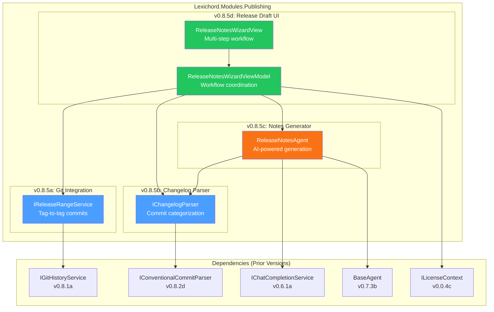
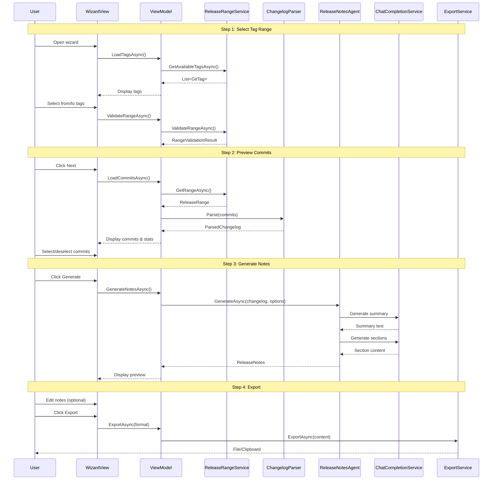

# LCS-SBD-085: Scope Breakdown — Release Notes Agent

## Document Control

| Field            | Value                                    |
| :--------------- | :--------------------------------------- |
| **Document ID**  | LCS-SBD-085                              |
| **Version**      | v0.8.5                                   |
| **Codename**     | Release Notes Agent (The Playbill Writer)|
| **Status**       | Draft                                    |
| **Last Updated** | 2026-01-27                               |
| **Owner**        | Lead Architect                           |
| **Depends On**   | v0.8.1 (Repository Reader), v0.8.2 (Commit Browser), v0.6.6a (IAgent), v0.7.3b (BaseAgent) |

---

## 1. Executive Summary

### 1.1 The Vision

**v0.8.5** delivers the **Release Notes Agent** — an AI-powered system that automatically generates professional, user-facing changelogs from Git commit history. This release transforms Lexichord from a documentation editing platform into a complete software publishing toolkit, enabling technical writers and development teams to produce polished release notes in minutes rather than hours.

The Playbill Writer reads Git history between version tags, parses conventional commit messages, groups changes by type (features, fixes, documentation), and leverages LLM capabilities to rewrite technical commit messages into clear, audience-appropriate release documentation. Teams no longer need to manually diff Git tags, interpret cryptic commit messages, or struggle with consistent formatting across releases.

### 1.2 Business Value

- **Time Savings:** Reduces release note drafting from 2-3 hours to under 10 minutes for typical releases.
- **Consistency:** Enforces uniform formatting, categorization, and tone across all release documentation.
- **Accuracy:** Directly reads Git history, eliminating manual transcription errors and missed commits.
- **Audience Adaptation:** AI rewrites technical commit messages for end-user, developer, or enterprise audiences.
- **Conventional Commits:** Full support for conventional commit parsing (feat, fix, docs, perf, BREAKING CHANGE).
- **Foundation:** Establishes patterns for future AI-assisted documentation generation features.

### 1.3 Success Criteria

This release succeeds when:

1. Git Integration reads commits between any two tags with full metadata (author, date, message, files changed).
2. Changelog Parser correctly identifies 95%+ of conventional commit types and scopes.
3. Notes Generator produces grammatically correct, audience-appropriate release notes via LLM.
4. Release Draft UI provides preview, editing, and export capabilities with real-time updates.
5. All features respect license gating (Teams+ for full Release Notes Agent).

### 1.4 License Gating

The Release Notes Agent is a **Teams** feature. Lower tiers will see:

- Read-only access to Git history viewing (WriterPro tier)
- "Upgrade to Teams" prompt when attempting AI-powered note generation
- Manual changelog editing available at all tiers
- Export buttons disabled with upgrade tooltip for Core/Writer tiers

---

## 2. Dependencies on Prior Versions

| Component                  | Source Version | Usage in v0.8.5                                   |
| :------------------------- | :------------- | :------------------------------------------------ |
| `IGitRepositoryService`    | v0.8.1a        | Repository access and metadata retrieval          |
| `IGitHistoryService`       | v0.8.1a        | Commit and tag querying                           |
| `GitCommit`                | v0.8.1c        | Commit data structure                             |
| `GitTag`                   | v0.8.1a        | Tag data for range selection                      |
| `IConventionalCommitParser`| v0.8.2d        | Parse conventional commit messages                |
| `ConventionalCommit`       | v0.8.2d        | Parsed commit structure                           |
| `IAgent`                   | v0.6.6a        | Agent interface for LLM integration               |
| `BaseAgent`                | v0.7.3b        | Base class for agent implementations              |
| `IChatCompletionService`   | v0.6.1a        | LLM service for note generation                   |
| `IPromptRenderer`          | v0.6.3b        | Prompt template rendering                         |
| `IPromptTemplateRepository`| v0.6.3a        | Prompt template storage                           |
| `ILicenseContext`          | v0.0.4c        | License tier verification                         |
| `IMediator`                | v0.0.7a        | Event publishing for workflow coordination        |
| `IRegionManager`           | v0.1.1b        | Panel registration for UI                         |
| `ISettingsService`         | v0.1.6a        | User preferences storage                          |
| `Serilog`                  | v0.0.3b        | Structured logging                                |

---

## 3. Sub-Part Specifications

### 3.1 v0.8.5a: Git Integration

| Field            | Value                                     |
| :--------------- | :---------------------------------------- |
| **Sub-Part ID**  | PUB-085a                                  |
| **Title**        | Git Integration (Commit and Tag Reading)  |
| **Module**       | `Lexichord.Modules.Publishing`            |
| **License Tier** | WriterPro                                 |

**Goal:** Extend Git integration to support reading commits between tags, comparing branches, and extracting file change statistics for release note generation.

**Key Deliverables:**

- `IReleaseRangeService` interface for tag-to-tag commit retrieval
- `ReleaseRangeService` implementation using `IGitHistoryService`
- `ReleaseRange` record with commits, contributors, and statistics
- `CommitComparisonResult` for diff statistics between tags
- Tag validation (ensure "from" is ancestor of "to")
- Caching layer for repeated queries
- Unit tests for all range operations

**Key Interfaces:**

```csharp
namespace Lexichord.Modules.Publishing.Abstractions;

/// <summary>
/// Service for retrieving commits within a release range (between two tags).
/// </summary>
public interface IReleaseRangeService
{
    /// <summary>
    /// Gets all commits between two tags.
    /// </summary>
    /// <param name="fromTag">The starting tag (exclusive, typically previous release).</param>
    /// <param name="toTag">The ending tag (inclusive, typically current release).</param>
    /// <param name="options">Optional filtering and sorting options.</param>
    /// <param name="ct">Cancellation token.</param>
    /// <returns>A release range containing commits, contributors, and statistics.</returns>
    Task<ReleaseRange> GetRangeAsync(
        string fromTag,
        string toTag,
        ReleaseRangeOptions? options = null,
        CancellationToken ct = default);

    /// <summary>
    /// Validates that a tag range is valid (from is ancestor of to).
    /// </summary>
    Task<RangeValidationResult> ValidateRangeAsync(
        string fromTag,
        string toTag,
        CancellationToken ct = default);

    /// <summary>
    /// Gets available tags for selection, sorted by date descending.
    /// </summary>
    Task<IReadOnlyList<GitTag>> GetAvailableTagsAsync(CancellationToken ct = default);

    /// <summary>
    /// Calculates file change statistics between two tags.
    /// </summary>
    Task<CommitComparisonResult> CompareTagsAsync(
        string fromTag,
        string toTag,
        CancellationToken ct = default);
}

/// <summary>
/// Options for filtering and sorting commits in a release range.
/// </summary>
public record ReleaseRangeOptions(
    bool IncludeFileChanges = true,
    bool ExcludeMergeCommits = true,
    IReadOnlyList<string>? PathFilters = null,
    IReadOnlyList<string>? ExcludeAuthors = null
);

/// <summary>
/// A range of commits between two tags with associated metadata.
/// </summary>
public record ReleaseRange(
    string FromTag,
    string ToTag,
    DateTime FromDate,
    DateTime ToDate,
    IReadOnlyList<GitCommit> Commits,
    IReadOnlyList<Contributor> Contributors,
    ReleaseStatistics Statistics
);

/// <summary>
/// A contributor to a release with commit statistics.
/// </summary>
public record Contributor(
    string Name,
    string Email,
    int CommitCount,
    int Additions,
    int Deletions
);

/// <summary>
/// Aggregate statistics for a release range.
/// </summary>
public record ReleaseStatistics(
    int TotalCommits,
    int TotalContributors,
    int FilesChanged,
    int TotalAdditions,
    int TotalDeletions,
    TimeSpan ReleaseDuration
);

/// <summary>
/// Result of comparing two tags for file changes.
/// </summary>
public record CommitComparisonResult(
    IReadOnlyList<FileChangeEntry> Files,
    int TotalAdditions,
    int TotalDeletions
);

/// <summary>
/// A single file change entry with statistics.
/// </summary>
public record FileChangeEntry(
    string Path,
    GitChangeKind Kind,
    int Additions,
    int Deletions,
    string? OldPath = null
);

/// <summary>
/// Result of validating a tag range.
/// </summary>
public record RangeValidationResult(
    bool IsValid,
    string? ErrorMessage = null,
    int? CommitCount = null
);
```

**Dependencies:**

- v0.8.1a: `IGitHistoryService` (commit querying)
- v0.8.1a: `IGitRepositoryService` (repository access)

---

### 3.2 v0.8.5b: Changelog Parser

| Field            | Value                                     |
| :--------------- | :---------------------------------------- |
| **Sub-Part ID**  | PUB-085b                                  |
| **Title**        | Changelog Parser (Conventional Commits)   |
| **Module**       | `Lexichord.Modules.Publishing`            |
| **License Tier** | WriterPro                                 |

**Goal:** Parse and categorize commits according to the Conventional Commits specification, grouping them by type for structured release notes generation.

**Key Deliverables:**

- `IChangelogParser` interface for commit categorization
- `ChangelogParser` implementation with full conventional commit support
- `ParsedChangelog` record with grouped and ungrouped commits
- Support for all standard types: feat, fix, docs, style, refactor, perf, test, build, ci, chore
- Breaking change detection from `!` suffix and `BREAKING CHANGE:` footer
- Scope extraction and grouping
- Custom type mapping configuration
- Unit tests for all parsing scenarios

**Key Interfaces:**

```csharp
namespace Lexichord.Modules.Publishing.Abstractions;

/// <summary>
/// Parses a collection of Git commits into a structured changelog.
/// </summary>
public interface IChangelogParser
{
    /// <summary>
    /// Parses commits into a categorized changelog structure.
    /// </summary>
    /// <param name="commits">The commits to parse.</param>
    /// <param name="options">Parsing configuration options.</param>
    /// <returns>A parsed changelog with categorized commits.</returns>
    ParsedChangelog Parse(
        IReadOnlyList<GitCommit> commits,
        ChangelogParserOptions? options = null);

    /// <summary>
    /// Parses a single commit message into a conventional commit structure.
    /// </summary>
    /// <param name="message">The commit message to parse.</param>
    /// <returns>The parsed conventional commit, or null if not conventional.</returns>
    ConventionalCommit? ParseCommitMessage(string message);
}

/// <summary>
/// Options for configuring changelog parsing behavior.
/// </summary>
public record ChangelogParserOptions(
    bool GroupByScope = false,
    bool IncludeNonConventional = true,
    IReadOnlyDictionary<string, string>? TypeMapping = null,
    IReadOnlyList<string>? ExcludeTypes = null
);

/// <summary>
/// A parsed changelog with commits grouped by category.
/// </summary>
public record ParsedChangelog(
    IReadOnlyList<ChangelogSection> Sections,
    IReadOnlyList<ParsedCommit> UncategorizedCommits,
    IReadOnlyList<ParsedCommit> BreakingChanges,
    int TotalCommits,
    int ConventionalCommitCount
);

/// <summary>
/// A section of the changelog containing commits of a specific type.
/// </summary>
public record ChangelogSection(
    string Title,
    CommitType Type,
    IReadOnlyList<ParsedCommit> Commits,
    int CommitCount
);

/// <summary>
/// A commit parsed with conventional commit metadata.
/// </summary>
public record ParsedCommit(
    GitCommit Original,
    ConventionalCommit? Conventional,
    string DisplayMessage,
    bool IsBreakingChange
);

/// <summary>
/// Standard commit type enumeration following Conventional Commits spec.
/// </summary>
public enum CommitType
{
    Feature,        // feat:
    BugFix,         // fix:
    Documentation,  // docs:
    Style,          // style:
    Refactor,       // refactor:
    Performance,    // perf:
    Test,           // test:
    Build,          // build:
    CI,             // ci:
    Chore,          // chore:
    Revert,         // revert:
    Other           // Non-conventional or unmapped
}

/// <summary>
/// Default section titles for commit types.
/// </summary>
public static class ChangelogSectionTitles
{
    public static readonly IReadOnlyDictionary<CommitType, string> Defaults = new Dictionary<CommitType, string>
    {
        [CommitType.Feature] = "Features",
        [CommitType.BugFix] = "Bug Fixes",
        [CommitType.Documentation] = "Documentation",
        [CommitType.Style] = "Styles",
        [CommitType.Refactor] = "Code Refactoring",
        [CommitType.Performance] = "Performance Improvements",
        [CommitType.Test] = "Tests",
        [CommitType.Build] = "Build System",
        [CommitType.CI] = "Continuous Integration",
        [CommitType.Chore] = "Chores",
        [CommitType.Revert] = "Reverts",
        [CommitType.Other] = "Other Changes"
    };
}
```

**Parsing Logic:**

```text
PARSE COMMIT MESSAGE:
│
├── Match pattern: ^(?<type>\w+)(?:\((?<scope>[^)]+)\))?(?<breaking>!)?: (?<description>.+)$
│   ├── Extract type → Map to CommitType enum
│   ├── Extract scope (optional) → Store as string
│   ├── Detect breaking (!) → Flag as breaking change
│   └── Extract description → Short description
│
├── Parse body (after first blank line):
│   └── Store as string for additional context
│
├── Parse footers:
│   ├── BREAKING CHANGE: → Flag as breaking, extract details
│   ├── Fixes #123 → Extract issue references
│   ├── Closes #456 → Extract issue references
│   └── Co-authored-by: → Extract contributors
│
└── RETURN ConventionalCommit or null if pattern doesn't match
```

**Dependencies:**

- v0.8.2d: `IConventionalCommitParser` (base parsing)
- v0.8.1c: `GitCommit` (commit data)

---

### 3.3 v0.8.5c: Notes Generator

| Field            | Value                                     |
| :--------------- | :---------------------------------------- |
| **Sub-Part ID**  | PUB-085c                                  |
| **Title**        | Notes Generator (AI-Powered Rewriting)    |
| **Module**       | `Lexichord.Modules.Publishing`            |
| **License Tier** | Teams                                     |

**Goal:** Implement an AI-powered agent that transforms parsed changelog data into polished, audience-appropriate release notes using LLM capabilities.

**Key Deliverables:**

- `IReleaseNotesGenerator` interface for note generation
- `ReleaseNotesAgent` implementation extending `BaseAgent`
- `ReleaseNotes` record with structured output
- Multiple audience presets (end-user, developer, enterprise)
- Customizable tone and style settings
- Template-based prompt generation
- Section-by-section regeneration support
- Unit tests with mocked LLM responses

**Key Interfaces:**

```csharp
namespace Lexichord.Modules.Publishing.Abstractions;

/// <summary>
/// Generates polished release notes from parsed changelog data using AI.
/// </summary>
public interface IReleaseNotesGenerator
{
    /// <summary>
    /// Generates complete release notes from a parsed changelog.
    /// </summary>
    /// <param name="changelog">The parsed changelog data.</param>
    /// <param name="options">Generation options including audience and style.</param>
    /// <param name="ct">Cancellation token.</param>
    /// <returns>Generated release notes.</returns>
    Task<ReleaseNotes> GenerateAsync(
        ParsedChangelog changelog,
        ReleaseNotesOptions options,
        CancellationToken ct = default);

    /// <summary>
    /// Regenerates a specific section of the release notes.
    /// </summary>
    /// <param name="section">The section to regenerate.</param>
    /// <param name="context">Context from other sections for consistency.</param>
    /// <param name="options">Generation options.</param>
    /// <param name="ct">Cancellation token.</param>
    /// <returns>The regenerated section.</returns>
    Task<ReleaseSection> RegenerateSectionAsync(
        ChangelogSection section,
        ReleaseNotesContext context,
        ReleaseNotesOptions options,
        CancellationToken ct = default);

    /// <summary>
    /// Generates a summary paragraph for the release.
    /// </summary>
    Task<string> GenerateSummaryAsync(
        ParsedChangelog changelog,
        ReleaseNotesOptions options,
        CancellationToken ct = default);
}

/// <summary>
/// Options for configuring release notes generation.
/// </summary>
public record ReleaseNotesOptions(
    string Version,
    DateTime ReleaseDate,
    ReleaseAudience Audience = ReleaseAudience.Developer,
    ReleaseTone Tone = ReleaseTone.Professional,
    string? ProductName = null,
    bool IncludeSummary = true,
    bool IncludeContributors = true,
    bool IncludeMigrationNotes = true,
    bool HighlightBreakingChanges = true,
    IReadOnlyDictionary<string, string>? CustomSectionTitles = null,
    string? StyleGuideUrl = null
);

/// <summary>
/// Target audience for release notes.
/// </summary>
public enum ReleaseAudience
{
    EndUser,      // Non-technical users, focus on features and benefits
    Developer,    // Technical users, include API changes and code details
    Enterprise,   // Business stakeholders, focus on compliance and stability
    Internal      // Internal team, include all technical details
}

/// <summary>
/// Writing tone for release notes.
/// </summary>
public enum ReleaseTone
{
    Professional,  // Formal, business-appropriate
    Friendly,      // Approachable, conversational
    Technical,     // Detailed, precise technical language
    Marketing      // Enthusiastic, benefit-focused
}

/// <summary>
/// Generated release notes with structured sections.
/// </summary>
public record ReleaseNotes(
    string Version,
    DateTime ReleaseDate,
    string Summary,
    IReadOnlyList<ReleaseSection> Sections,
    IReadOnlyList<Contributor> Contributors,
    string? MigrationNotes,
    IReadOnlyList<BreakingChangeNote>? BreakingChanges,
    ReleaseNotesMetadata Metadata
);

/// <summary>
/// A section of the release notes (e.g., Features, Bug Fixes).
/// </summary>
public record ReleaseSection(
    string Title,
    CommitType Type,
    IReadOnlyList<ReleaseItem> Items
);

/// <summary>
/// A single item in a release section.
/// </summary>
public record ReleaseItem(
    string Description,
    string? Scope,
    string? CommitSha,
    string? PullRequestUrl,
    string? IssueUrl,
    IReadOnlyList<string>? Details = null
);

/// <summary>
/// A breaking change note with migration guidance.
/// </summary>
public record BreakingChangeNote(
    string Description,
    string? MigrationPath,
    string? CommitSha,
    CommitType RelatedType
);

/// <summary>
/// Metadata about the generation process.
/// </summary>
public record ReleaseNotesMetadata(
    DateTime GeneratedAt,
    string GeneratorVersion,
    ReleaseAudience Audience,
    ReleaseTone Tone,
    int TokensUsed,
    TimeSpan GenerationTime
);

/// <summary>
/// Context for section regeneration to maintain consistency.
/// </summary>
public record ReleaseNotesContext(
    string Version,
    string Summary,
    IReadOnlyList<ReleaseSection> OtherSections,
    ReleaseNotesOptions Options
);
```

**Agent Implementation:**

```csharp
namespace Lexichord.Modules.Publishing.Agents;

/// <summary>
/// AI-powered agent for generating release notes from Git history.
/// </summary>
[RequiresLicense(LicenseTier.Teams)]
[AgentDefinition("release-notes", "Release Notes Agent", "Generates changelogs from Git history")]
public class ReleaseNotesAgent : BaseAgent, IReleaseNotesGenerator
{
    private readonly IChangelogParser _changelogParser;
    private readonly IPromptTemplateRepository _templates;
    private readonly ILogger<ReleaseNotesAgent> _logger;

    public ReleaseNotesAgent(
        IChatCompletionService llm,
        IPromptRenderer renderer,
        IChangelogParser changelogParser,
        IPromptTemplateRepository templates,
        ILogger<ReleaseNotesAgent> logger)
        : base(llm, renderer, templates, logger)
    {
        _changelogParser = changelogParser;
        _templates = templates;
        _logger = logger;
    }

    public async Task<ReleaseNotes> GenerateAsync(
        ParsedChangelog changelog,
        ReleaseNotesOptions options,
        CancellationToken ct = default)
    {
        var sw = Stopwatch.StartNew();
        var tokensUsed = 0;

        _logger.LogInformation(
            "Generating release notes for {Version} with {CommitCount} commits",
            options.Version,
            changelog.TotalCommits);

        // 1. Generate summary
        var summary = options.IncludeSummary
            ? await GenerateSummaryAsync(changelog, options, ct)
            : string.Empty;

        // 2. Generate sections
        var sections = new List<ReleaseSection>();
        foreach (var section in changelog.Sections)
        {
            var generated = await GenerateSectionAsync(section, options, ct);
            sections.Add(generated);
        }

        // 3. Generate breaking changes
        var breakingChanges = options.HighlightBreakingChanges && changelog.BreakingChanges.Count > 0
            ? await GenerateBreakingChangesAsync(changelog.BreakingChanges, options, ct)
            : null;

        // 4. Generate migration notes
        var migrationNotes = options.IncludeMigrationNotes && changelog.BreakingChanges.Count > 0
            ? await GenerateMigrationNotesAsync(changelog.BreakingChanges, options, ct)
            : null;

        sw.Stop();

        return new ReleaseNotes(
            Version: options.Version,
            ReleaseDate: options.ReleaseDate,
            Summary: summary,
            Sections: sections,
            Contributors: ExtractContributors(changelog),
            MigrationNotes: migrationNotes,
            BreakingChanges: breakingChanges,
            Metadata: new ReleaseNotesMetadata(
                GeneratedAt: DateTime.UtcNow,
                GeneratorVersion: "0.8.5",
                Audience: options.Audience,
                Tone: options.Tone,
                TokensUsed: tokensUsed,
                GenerationTime: sw.Elapsed
            )
        );
    }

    // Additional implementation methods...
}
```

**Prompt Templates:**

```yaml
# release-notes-summary.yaml
template_id: "release-notes-summary"
system_prompt: |
  You are a technical writer creating release notes for {{product_name}}.

  Target Audience: {{audience}}
  Tone: {{tone}}

  Write a brief summary (2-3 sentences) highlighting the most important changes.
  {{#style_guide}}
  Follow these style guidelines: {{style_guide}}
  {{/style_guide}}

user_prompt: |
  Generate a release summary for version {{version}}.

  Changes overview:
  - Features: {{feature_count}}
  - Bug Fixes: {{bugfix_count}}
  - Breaking Changes: {{breaking_count}}
  - Other: {{other_count}}

  Key commits:
  {{#key_commits}}
  - {{type}}: {{description}}
  {{/key_commits}}

# release-notes-section.yaml
template_id: "release-notes-section"
system_prompt: |
  You are a technical writer creating release notes.

  Target Audience: {{audience}}
  Tone: {{tone}}

  Rewrite the following commit messages as clear, user-facing release notes.
  - Use complete sentences
  - Focus on the impact to the user, not the implementation
  - Be concise but informative
  - Use active voice

user_prompt: |
  Rewrite these {{section_title}} for version {{version}}:

  {{#commits}}
  - {{description}}{{#scope}} ({{scope}}){{/scope}}
  {{/commits}}
```

**Dependencies:**

- v0.7.3b: `BaseAgent` (agent base class)
- v0.6.1a: `IChatCompletionService` (LLM integration)
- v0.6.3b: `IPromptRenderer` (template rendering)
- v0.8.5b: `IChangelogParser` (parsed changelog data)

---

### 3.4 v0.8.5d: Release Draft UI

| Field            | Value                                     |
| :--------------- | :---------------------------------------- |
| **Sub-Part ID**  | PUB-085d                                  |
| **Title**        | Release Draft UI (Preview and Edit)       |
| **Module**       | `Lexichord.Modules.Publishing`            |
| **License Tier** | Teams                                     |

**Goal:** Build a comprehensive UI for the release notes workflow, including tag selection, preview, editing, and export capabilities.

**Key Deliverables:**

- `ReleaseNotesWizardView.axaml` with multi-step workflow
- `ReleaseNotesWizardViewModel` with step navigation
- `TagRangeSelector` component for from/to tag selection
- `CommitPreviewPanel` showing commits to include
- `ReleaseNotesEditor` with live Markdown preview
- `ReleaseNotesExporter` for various output formats
- Export formats: Markdown, Keep-a-Changelog, HTML, Plain Text
- Copy to clipboard functionality
- Integration with document workspace

**Key UI Components:**

```text
+------------------------------------------------------------------------------+
|  Release Notes Wizard                                          [?] [_] [X]   |
+------------------------------------------------------------------------------+
|  Step 1: Select Range  |  Step 2: Preview  |  Step 3: Generate  |  Step 4: Export  |
+------------------------------------------------------------------------------+
|                                                                              |
|  +-----------------------------------+  +----------------------------------+ |
|  |  From Tag:                        |  |  Release Statistics              | |
|  |  [ v0.8.4          v ]            |  |  -------------------------------- | |
|  |                                   |  |  Commits: 47                     | |
|  |  To Tag:                          |  |  Contributors: 8                 | |
|  |  [ v0.8.5          v ]            |  |  Files Changed: 156              | |
|  |                                   |  |  Additions: 4,523                | |
|  |  [x] Exclude merge commits        |  |  Deletions: 1,287                | |
|  |  [x] Include file changes         |  |  Duration: 14 days               | |
|  +-----------------------------------+  +----------------------------------+ |
|                                                                              |
|  +-----------------------------------------------------------------------+  |
|  |  Commits in Range (47)                                    [Refresh]   |  |
|  |-----------------------------------------------------------------------|  |
|  |  [ ] | Type | Scope | Message                              | Author   |  |
|  |-----------------------------------------------------------------------|  |
|  |  [x] | feat | api   | Add new REST endpoint for user...    | jsmith   |  |
|  |  [x] | fix  | ui    | Fix button alignment in header       | mjones   |  |
|  |  [x] | docs | -     | Update API documentation             | klee     |  |
|  |  [x] | feat | core  | Implement caching layer              | jsmith   |  |
|  |  ...                                                                   |  |
|  +-----------------------------------------------------------------------+  |
|                                                                              |
+------------------------------------------------------------------------------+
|  [< Back]                                            [Next: Preview Commits >]|
+------------------------------------------------------------------------------+
```

**ViewModel Structure:**

```csharp
namespace Lexichord.Modules.Publishing.ViewModels;

/// <summary>
/// ViewModel for the Release Notes Wizard multi-step workflow.
/// </summary>
public partial class ReleaseNotesWizardViewModel : ObservableObject
{
    private readonly IReleaseRangeService _rangeService;
    private readonly IChangelogParser _changelogParser;
    private readonly IReleaseNotesGenerator _notesGenerator;
    private readonly IExportService _exportService;
    private readonly IMediator _mediator;

    [ObservableProperty] private int _currentStep = 1;
    [ObservableProperty] private bool _isLoading;
    [ObservableProperty] private string? _errorMessage;

    // Step 1: Tag Selection
    [ObservableProperty] private ObservableCollection<GitTag> _availableTags = [];
    [ObservableProperty] private GitTag? _fromTag;
    [ObservableProperty] private GitTag? _toTag;
    [ObservableProperty] private bool _excludeMergeCommits = true;
    [ObservableProperty] private bool _includeFileChanges = true;
    [ObservableProperty] private ReleaseStatistics? _statistics;

    // Step 2: Commit Preview
    [ObservableProperty] private ObservableCollection<CommitSelectionItem> _commits = [];
    [ObservableProperty] private ParsedChangelog? _parsedChangelog;

    // Step 3: Generation Options
    [ObservableProperty] private ReleaseAudience _selectedAudience = ReleaseAudience.Developer;
    [ObservableProperty] private ReleaseTone _selectedTone = ReleaseTone.Professional;
    [ObservableProperty] private string _productName = string.Empty;
    [ObservableProperty] private bool _includeSummary = true;
    [ObservableProperty] private bool _includeContributors = true;
    [ObservableProperty] private bool _highlightBreakingChanges = true;

    // Step 4: Preview & Export
    [ObservableProperty] private ReleaseNotes? _generatedNotes;
    [ObservableProperty] private string _previewMarkdown = string.Empty;
    [ObservableProperty] private bool _isGenerating;
    [ObservableProperty] private double _generationProgress;

    // Navigation
    public bool CanGoBack => CurrentStep > 1;
    public bool CanGoNext => CurrentStep < 4 && IsStepValid(CurrentStep);
    public bool CanGenerate => CurrentStep == 3 && ParsedChangelog != null;
    public bool CanExport => CurrentStep == 4 && GeneratedNotes != null;

    [RelayCommand]
    private async Task LoadTagsAsync(CancellationToken ct)
    {
        IsLoading = true;
        try
        {
            var tags = await _rangeService.GetAvailableTagsAsync(ct);
            AvailableTags = new ObservableCollection<GitTag>(tags);

            if (tags.Count >= 2)
            {
                ToTag = tags[0];      // Most recent
                FromTag = tags[1];    // Previous release
            }
        }
        finally
        {
            IsLoading = false;
        }
    }

    [RelayCommand]
    private async Task LoadCommitsAsync(CancellationToken ct)
    {
        if (FromTag is null || ToTag is null) return;

        IsLoading = true;
        ErrorMessage = null;

        try
        {
            var validation = await _rangeService.ValidateRangeAsync(
                FromTag.Name, ToTag.Name, ct);

            if (!validation.IsValid)
            {
                ErrorMessage = validation.ErrorMessage;
                return;
            }

            var range = await _rangeService.GetRangeAsync(
                FromTag.Name,
                ToTag.Name,
                new ReleaseRangeOptions(
                    IncludeFileChanges: IncludeFileChanges,
                    ExcludeMergeCommits: ExcludeMergeCommits),
                ct);

            Statistics = range.Statistics;
            Commits = new ObservableCollection<CommitSelectionItem>(
                range.Commits.Select(c => new CommitSelectionItem(c, IsSelected: true)));

            ParsedChangelog = _changelogParser.Parse(range.Commits);

            await _mediator.Publish(new CommitsLoadedEvent(range), ct);
        }
        catch (Exception ex)
        {
            ErrorMessage = $"Failed to load commits: {ex.Message}";
        }
        finally
        {
            IsLoading = false;
        }
    }

    [RelayCommand]
    private async Task GenerateNotesAsync(CancellationToken ct)
    {
        if (ParsedChangelog is null) return;

        IsGenerating = true;
        GenerationProgress = 0;

        try
        {
            var selectedCommits = Commits
                .Where(c => c.IsSelected)
                .Select(c => c.Commit)
                .ToList();

            var filteredChangelog = _changelogParser.Parse(selectedCommits);

            var options = new ReleaseNotesOptions(
                Version: ToTag?.Name ?? "Unknown",
                ReleaseDate: ToTag?.Date ?? DateTime.Now,
                Audience: SelectedAudience,
                Tone: SelectedTone,
                ProductName: ProductName,
                IncludeSummary: IncludeSummary,
                IncludeContributors: IncludeContributors,
                HighlightBreakingChanges: HighlightBreakingChanges);

            GeneratedNotes = await _notesGenerator.GenerateAsync(
                filteredChangelog, options, ct);

            PreviewMarkdown = RenderToMarkdown(GeneratedNotes);
            CurrentStep = 4;

            await _mediator.Publish(
                new ReleaseNotesGeneratedEvent(GeneratedNotes), ct);
        }
        catch (Exception ex)
        {
            ErrorMessage = $"Generation failed: {ex.Message}";
        }
        finally
        {
            IsGenerating = false;
        }
    }

    [RelayCommand]
    private async Task ExportAsync(ExportFormat format, CancellationToken ct)
    {
        if (GeneratedNotes is null) return;

        var content = format switch
        {
            ExportFormat.Markdown => RenderToMarkdown(GeneratedNotes),
            ExportFormat.KeepAChangelog => RenderToKeepAChangelog(GeneratedNotes),
            ExportFormat.Html => RenderToHtml(GeneratedNotes),
            ExportFormat.PlainText => RenderToPlainText(GeneratedNotes),
            _ => throw new ArgumentOutOfRangeException(nameof(format))
        };

        await _exportService.ExportAsync(content, format, ct);
    }

    [RelayCommand]
    private async Task CopyToClipboardAsync()
    {
        if (string.IsNullOrEmpty(PreviewMarkdown)) return;
        await Application.Current!.Clipboard!.SetTextAsync(PreviewMarkdown);
    }

    [RelayCommand]
    private async Task RegenerateSectionAsync(ReleaseSection section, CancellationToken ct)
    {
        if (GeneratedNotes is null || ParsedChangelog is null) return;

        var changelogSection = ParsedChangelog.Sections
            .FirstOrDefault(s => s.Type == section.Type);

        if (changelogSection is null) return;

        var context = new ReleaseNotesContext(
            GeneratedNotes.Version,
            GeneratedNotes.Summary,
            GeneratedNotes.Sections.Where(s => s.Type != section.Type).ToList(),
            new ReleaseNotesOptions(
                GeneratedNotes.Version,
                GeneratedNotes.ReleaseDate,
                GeneratedNotes.Metadata.Audience,
                GeneratedNotes.Metadata.Tone));

        var regenerated = await _notesGenerator.RegenerateSectionAsync(
            changelogSection, context,
            new ReleaseNotesOptions(
                GeneratedNotes.Version,
                GeneratedNotes.ReleaseDate,
                SelectedAudience,
                SelectedTone),
            ct);

        // Update the section in GeneratedNotes
        var sections = GeneratedNotes.Sections.ToList();
        var index = sections.FindIndex(s => s.Type == section.Type);
        if (index >= 0)
        {
            sections[index] = regenerated;
            GeneratedNotes = GeneratedNotes with { Sections = sections };
            PreviewMarkdown = RenderToMarkdown(GeneratedNotes);
        }
    }

    [RelayCommand]
    private void GoBack()
    {
        if (CanGoBack) CurrentStep--;
    }

    [RelayCommand]
    private void GoNext()
    {
        if (CanGoNext) CurrentStep++;
    }

    private bool IsStepValid(int step) => step switch
    {
        1 => FromTag is not null && ToTag is not null,
        2 => ParsedChangelog is not null && Commits.Any(c => c.IsSelected),
        3 => true,
        4 => GeneratedNotes is not null,
        _ => false
    };

    private string RenderToMarkdown(ReleaseNotes notes)
    {
        var sb = new StringBuilder();
        sb.AppendLine($"# {notes.Version}");
        sb.AppendLine();
        sb.AppendLine($"*Released: {notes.ReleaseDate:MMMM d, yyyy}*");
        sb.AppendLine();

        if (!string.IsNullOrEmpty(notes.Summary))
        {
            sb.AppendLine(notes.Summary);
            sb.AppendLine();
        }

        if (notes.BreakingChanges?.Count > 0)
        {
            sb.AppendLine("## Breaking Changes");
            sb.AppendLine();
            foreach (var bc in notes.BreakingChanges)
            {
                sb.AppendLine($"- **{bc.Description}**");
                if (!string.IsNullOrEmpty(bc.MigrationPath))
                {
                    sb.AppendLine($"  - Migration: {bc.MigrationPath}");
                }
            }
            sb.AppendLine();
        }

        foreach (var section in notes.Sections)
        {
            sb.AppendLine($"## {section.Title}");
            sb.AppendLine();
            foreach (var item in section.Items)
            {
                var scope = item.Scope is not null ? $"**{item.Scope}:** " : "";
                sb.AppendLine($"- {scope}{item.Description}");
            }
            sb.AppendLine();
        }

        if (notes.Contributors.Count > 0)
        {
            sb.AppendLine("## Contributors");
            sb.AppendLine();
            foreach (var contributor in notes.Contributors.OrderByDescending(c => c.CommitCount))
            {
                sb.AppendLine($"- {contributor.Name} ({contributor.CommitCount} commits)");
            }
        }

        return sb.ToString();
    }
}

/// <summary>
/// Wrapper for commit selection in the UI.
/// </summary>
public partial class CommitSelectionItem : ObservableObject
{
    public GitCommit Commit { get; }

    [ObservableProperty] private bool _isSelected;

    public CommitSelectionItem(GitCommit commit, bool isSelected = true)
    {
        Commit = commit;
        _isSelected = isSelected;
    }
}

/// <summary>
/// Export format options.
/// </summary>
public enum ExportFormat
{
    Markdown,
    KeepAChangelog,
    Html,
    PlainText
}
```

**Dependencies:**

- v0.8.5a: `IReleaseRangeService` (tag and commit retrieval)
- v0.8.5b: `IChangelogParser` (commit parsing)
- v0.8.5c: `IReleaseNotesGenerator` (AI generation)
- v0.1.1b: `IRegionManager` (panel registration)

---

## 4. Implementation Checklist

| #  | Sub-Part | Task                                                      | Est. Hours |
| :- | :------- | :-------------------------------------------------------- | :--------- |
| 1  | v0.8.5a  | Define `IReleaseRangeService` interface                   | 1          |
| 2  | v0.8.5a  | Implement `ReleaseRangeService`                           | 3          |
| 3  | v0.8.5a  | Implement tag validation logic                            | 1          |
| 4  | v0.8.5a  | Implement commit comparison and statistics                | 2          |
| 5  | v0.8.5a  | Add caching for repeated queries                          | 1          |
| 6  | v0.8.5a  | Unit tests for range service                              | 2          |
| 7  | v0.8.5b  | Define `IChangelogParser` interface                       | 1          |
| 8  | v0.8.5b  | Implement `ChangelogParser` with regex patterns           | 3          |
| 9  | v0.8.5b  | Implement breaking change detection                       | 1          |
| 10 | v0.8.5b  | Implement footer parsing (issues, co-authors)             | 1.5        |
| 11 | v0.8.5b  | Add custom type mapping configuration                     | 1          |
| 12 | v0.8.5b  | Unit tests for all parsing scenarios                      | 2.5        |
| 13 | v0.8.5c  | Define `IReleaseNotesGenerator` interface                 | 1          |
| 14 | v0.8.5c  | Implement `ReleaseNotesAgent` extending BaseAgent         | 4          |
| 15 | v0.8.5c  | Create prompt templates (summary, sections)               | 2          |
| 16 | v0.8.5c  | Implement audience/tone presets                           | 1          |
| 17 | v0.8.5c  | Implement section regeneration                            | 1.5        |
| 18 | v0.8.5c  | Unit tests with mocked LLM                                | 2          |
| 19 | v0.8.5d  | Create `ReleaseNotesWizardView.axaml`                     | 4          |
| 20 | v0.8.5d  | Implement `ReleaseNotesWizardViewModel`                   | 4          |
| 21 | v0.8.5d  | Create `TagRangeSelector` component                       | 2          |
| 22 | v0.8.5d  | Create `CommitPreviewPanel` component                     | 2          |
| 23 | v0.8.5d  | Create `ReleaseNotesEditor` with Markdown preview         | 3          |
| 24 | v0.8.5d  | Implement export functionality                            | 2          |
| 25 | v0.8.5d  | UI tests and accessibility                                | 2          |
| 26 | All      | Integration tests for full workflow                       | 3          |
| 27 | All      | DI registration in PublishingModule.cs                    | 1          |
| **Total** |   |                                                           | **50 hours** |

---

## 5. Dependency Matrix

### 5.1 Required Interfaces (from earlier versions)

| Interface                  | Source Version | Purpose                              |
| :------------------------- | :------------- | :----------------------------------- |
| `IGitRepositoryService`    | v0.8.1a        | Repository access                    |
| `IGitHistoryService`       | v0.8.1a        | Commit and tag queries               |
| `IConventionalCommitParser`| v0.8.2d        | Base commit parsing                  |
| `IAgent`                   | v0.6.6a        | Agent interface                      |
| `BaseAgent`                | v0.7.3b        | Agent base class                     |
| `IChatCompletionService`   | v0.6.1a        | LLM access                           |
| `IPromptRenderer`          | v0.6.3b        | Template rendering                   |
| `ILicenseContext`          | v0.0.4c        | License verification                 |
| `IMediator`                | v0.0.7a        | Event publishing                     |

### 5.2 New Interfaces (defined in v0.8.5)

| Interface                   | Defined In | Module                  | Purpose                 |
| :-------------------------- | :--------- | :---------------------- | :---------------------- |
| `IReleaseRangeService`      | v0.8.5a    | Modules.Publishing      | Tag-to-tag commits      |
| `IChangelogParser`          | v0.8.5b    | Modules.Publishing      | Commit categorization   |
| `IReleaseNotesGenerator`    | v0.8.5c    | Modules.Publishing      | AI note generation      |

### 5.3 New Records/DTOs (defined in v0.8.5)

| Record                    | Defined In | Purpose                                |
| :------------------------ | :--------- | :------------------------------------- |
| `ReleaseRange`            | v0.8.5a    | Commits between tags                   |
| `ReleaseStatistics`       | v0.8.5a    | Aggregate release stats                |
| `Contributor`             | v0.8.5a    | Contributor with stats                 |
| `ParsedChangelog`         | v0.8.5b    | Categorized commits                    |
| `ChangelogSection`        | v0.8.5b    | Commits of one type                    |
| `ParsedCommit`            | v0.8.5b    | Commit with metadata                   |
| `ReleaseNotes`            | v0.8.5c    | Generated notes output                 |
| `ReleaseSection`          | v0.8.5c    | Section of notes                       |
| `ReleaseItem`             | v0.8.5c    | Single note item                       |
| `ReleaseNotesOptions`     | v0.8.5c    | Generation configuration               |
| `ReleaseNotesMetadata`    | v0.8.5c    | Generation metadata                    |

### 5.4 NuGet Packages

| Package          | Version | Purpose                    | New/Existing |
| :--------------- | :------ | :------------------------- | :----------- |
| `LibGit2Sharp`   | 0.30.x  | Git repository access      | Existing     |
| `Markdig`        | 0.34.x  | Markdown rendering         | Existing     |

---

## 6. Architecture Diagram



---

## 7. Data Flow Diagram



---

## 8. Risks & Mitigations

| Risk | Impact | Probability | Mitigation |
| :--- | :----- | :---------- | :--------- |
| LLM generates inaccurate release notes | High | Medium | Human review step required; regenerate individual sections |
| Large repositories slow down tag loading | Medium | Medium | Implement pagination and caching; lazy load commit details |
| Conventional commit parsing misses edge cases | Medium | Medium | Extensive test suite; fallback to "Other" category |
| UI complexity overwhelms users | Medium | Low | Progressive disclosure; clear step indicators; tooltips |
| Token limits exceeded for large releases | Medium | Low | Chunk large changelogs; summarize before detailed sections |
| License bypass attempts | High | Low | Server-side verification; feature gates at service layer |

---

## 9. Success Metrics

| Metric | Target | Measurement |
| :----- | :----- | :---------- |
| Tag loading time | < 2s | Stopwatch timing |
| Commit range loading | < 5s for 1000 commits | Stopwatch timing |
| Conventional commit parsing accuracy | 95%+ | Test suite |
| Release notes generation time | < 30s (excluding LLM) | Stopwatch timing |
| User satisfaction (preview accuracy) | 80%+ acceptable first draft | User feedback |
| Export format correctness | 100% valid Markdown/HTML | Validation tests |

---

## 10. What This Enables

After v0.8.5, Lexichord will support:

- **v0.8.6 (PDF Exporter):** Export release notes directly to PDF with branding.
- **v0.8.7 (Documentation Linter):** Lint generated release notes for quality.
- **v0.9.x (Release Automation):** Auto-generate and publish notes on tag push.
- **Future:** Integration with GitHub Releases, GitLab Releases, and other platforms.

---

## 11. Decision Trees

### 11.1 Should a Commit Be Included?

```text
START: "Evaluate commit for inclusion"
│
├── Is it a merge commit?
│   ├── YES → Is "Exclude merge commits" enabled?
│   │   ├── YES → EXCLUDE
│   │   └── NO → Continue
│   └── NO → Continue
│
├── Does author match exclude list?
│   ├── YES → EXCLUDE
│   └── NO → Continue
│
├── Does path match path filters (if any)?
│   ├── NO filters → INCLUDE
│   ├── YES matches → INCLUDE
│   └── NO match → EXCLUDE
│
└── DEFAULT: INCLUDE
```

### 11.2 How to Categorize a Commit?

```text
START: "Categorize commit message"
│
├── Does message match conventional commit pattern?
│   ├── NO → Category = Other
│   └── YES → Extract type
│       │
│       ├── type == "feat" → Category = Feature
│       ├── type == "fix" → Category = BugFix
│       ├── type == "docs" → Category = Documentation
│       ├── type == "perf" → Category = Performance
│       ├── type == "test" → Category = Test
│       ├── type == "refactor" → Category = Refactor
│       ├── type == "style" → Category = Style
│       ├── type == "build" → Category = Build
│       ├── type == "ci" → Category = CI
│       ├── type == "chore" → Category = Chore
│       ├── type == "revert" → Category = Revert
│       └── DEFAULT → Category = Other
│
├── Check for breaking change:
│   ├── Has "!" after type → IsBreakingChange = true
│   ├── Has "BREAKING CHANGE:" footer → IsBreakingChange = true
│   └── DEFAULT → IsBreakingChange = false
│
└── RETURN (Category, IsBreakingChange)
```

---

## 12. User Stories

| ID    | Role            | Story                                                                          | Acceptance Criteria                    |
| :---- | :-------------- | :----------------------------------------------------------------------------- | :------------------------------------- |
| US-01 | Technical Writer| As a technical writer, I want to select a tag range so that I can generate notes for a specific release. | Tag dropdowns show all available tags; validation prevents invalid ranges. |
| US-02 | Technical Writer| As a technical writer, I want to preview commits before generation so that I can exclude irrelevant changes. | Commit list shows all commits with checkboxes; statistics update on selection. |
| US-03 | Technical Writer| As a technical writer, I want AI to rewrite commit messages so that they are user-friendly. | Generated notes use complete sentences; technical jargon is explained. |
| US-04 | Product Manager | As a product manager, I want to choose the audience for my notes so that I can target different stakeholders. | Audience selection changes tone and detail level in generated notes. |
| US-05 | Developer       | As a developer, I want to regenerate individual sections so that I can fine-tune the output. | "Regenerate" button appears on each section; only that section updates. |
| US-06 | Release Manager | As a release manager, I want to export to multiple formats so that I can publish notes in various places. | Export options include Markdown, HTML, Keep-a-Changelog, Plain Text. |
| US-07 | Team Lead       | As a team lead, I want breaking changes highlighted so that users are warned about migration needs. | Breaking changes appear in a separate prominent section with migration guidance. |

---

## 13. Use Cases

### UC-01: Generate Release Notes from Tag Range

**Preconditions:**

- User has Teams license or higher
- Workspace contains a Git repository with at least two tags

**Flow:**

1. User opens Release Notes Wizard from Publishing menu.
2. System loads available tags and displays in dropdowns.
3. User selects "from" tag (e.g., v0.8.4) and "to" tag (e.g., v0.8.5).
4. System validates range and shows commit count.
5. User clicks "Next" to preview commits.
6. System displays all commits with type icons and selection checkboxes.
7. User optionally deselects irrelevant commits.
8. User selects audience (Developer) and tone (Professional).
9. User clicks "Generate".
10. System calls LLM to generate notes.
11. System displays Markdown preview with live editing.
12. User reviews and optionally regenerates sections.
13. User exports to Markdown file.

**Postconditions:**

- Release notes file created in workspace
- `ReleaseNotesGeneratedEvent` published

---

### UC-02: Handle Non-Conventional Commits

**Preconditions:**

- Repository contains mix of conventional and non-conventional commits

**Flow:**

1. User selects tag range containing both commit styles.
2. System parses all commits.
3. Conventional commits are categorized by type (feat, fix, etc.).
4. Non-conventional commits are placed in "Other Changes" section.
5. AI rewrites all commits for chosen audience.
6. User can move commits between sections if miscategorized.

**Postconditions:**

- All commits appear in generated notes regardless of message format

---

## 14. Unit Testing Requirements

### 14.1 Changelog Parser Tests

```csharp
[Trait("Category", "Unit")]
[Trait("Version", "v0.8.5b")]
public class ChangelogParserTests
{
    private readonly IChangelogParser _sut = new ChangelogParser();

    [Theory]
    [InlineData("feat: add new feature", CommitType.Feature, null)]
    [InlineData("feat(api): add endpoint", CommitType.Feature, "api")]
    [InlineData("fix: resolve crash", CommitType.BugFix, null)]
    [InlineData("fix(ui): button alignment", CommitType.BugFix, "ui")]
    [InlineData("docs: update readme", CommitType.Documentation, null)]
    [InlineData("perf: optimize query", CommitType.Performance, null)]
    [InlineData("test: add unit tests", CommitType.Test, null)]
    public void ParseCommitMessage_ConventionalCommit_ExtractsTypeAndScope(
        string message, CommitType expectedType, string? expectedScope)
    {
        var result = _sut.ParseCommitMessage(message);

        result.Should().NotBeNull();
        result!.Type.Should().Be(expectedType.ToString().ToLower());
        result.Scope.Should().Be(expectedScope);
    }

    [Theory]
    [InlineData("feat!: breaking feature", true)]
    [InlineData("fix!: breaking fix", true)]
    [InlineData("feat: regular feature", false)]
    public void ParseCommitMessage_BreakingIndicator_DetectsCorrectly(
        string message, bool isBreaking)
    {
        var result = _sut.ParseCommitMessage(message);

        result.Should().NotBeNull();
        result!.IsBreakingChange.Should().Be(isBreaking);
    }

    [Fact]
    public void ParseCommitMessage_BreakingChangeFooter_DetectsBreaking()
    {
        var message = """
            feat: add new api

            This adds a new REST API endpoint.

            BREAKING CHANGE: The old /api/v1 endpoint is removed.
            """;

        var result = _sut.ParseCommitMessage(message);

        result.Should().NotBeNull();
        result!.IsBreakingChange.Should().BeTrue();
        result.Footers.Should().Contain("BREAKING CHANGE: The old /api/v1 endpoint is removed.");
    }

    [Theory]
    [InlineData("Update dependencies")]
    [InlineData("WIP: work in progress")]
    [InlineData("Merge branch 'main' into feature")]
    public void ParseCommitMessage_NonConventional_ReturnsNull(string message)
    {
        var result = _sut.ParseCommitMessage(message);

        result.Should().BeNull();
    }

    [Fact]
    public void Parse_MixedCommits_GroupsCorrectly()
    {
        var commits = new[]
        {
            CreateCommit("feat: feature 1"),
            CreateCommit("feat: feature 2"),
            CreateCommit("fix: bug fix 1"),
            CreateCommit("docs: update docs"),
            CreateCommit("Random commit message")
        };

        var result = _sut.Parse(commits.ToList());

        result.Sections.Should().Contain(s => s.Type == CommitType.Feature && s.CommitCount == 2);
        result.Sections.Should().Contain(s => s.Type == CommitType.BugFix && s.CommitCount == 1);
        result.Sections.Should().Contain(s => s.Type == CommitType.Documentation && s.CommitCount == 1);
        result.UncategorizedCommits.Should().HaveCount(1);
    }
}
```

### 14.2 Release Range Service Tests

```csharp
[Trait("Category", "Unit")]
[Trait("Version", "v0.8.5a")]
public class ReleaseRangeServiceTests
{
    private readonly Mock<IGitHistoryService> _gitHistoryMock;
    private readonly IReleaseRangeService _sut;

    public ReleaseRangeServiceTests()
    {
        _gitHistoryMock = new Mock<IGitHistoryService>();
        _sut = new ReleaseRangeService(_gitHistoryMock.Object);
    }

    [Fact]
    public async Task GetRangeAsync_ValidRange_ReturnsCommits()
    {
        // Arrange
        var commits = CreateTestCommits(10);
        _gitHistoryMock
            .Setup(x => x.GetCommitsAsync(It.IsAny<GitCommitQuery>(), It.IsAny<CancellationToken>()))
            .ReturnsAsync(commits);

        // Act
        var result = await _sut.GetRangeAsync("v1.0.0", "v1.1.0");

        // Assert
        result.Commits.Should().HaveCount(10);
        result.FromTag.Should().Be("v1.0.0");
        result.ToTag.Should().Be("v1.1.0");
    }

    [Fact]
    public async Task GetRangeAsync_WithExcludeMergeCommits_FiltersMerges()
    {
        // Arrange
        var commits = new[]
        {
            CreateCommit("feat: feature", isMerge: false),
            CreateCommit("Merge branch 'main'", isMerge: true),
            CreateCommit("fix: bug fix", isMerge: false)
        };
        _gitHistoryMock
            .Setup(x => x.GetCommitsAsync(It.IsAny<GitCommitQuery>(), It.IsAny<CancellationToken>()))
            .ReturnsAsync(commits.ToList());

        // Act
        var result = await _sut.GetRangeAsync(
            "v1.0.0", "v1.1.0",
            new ReleaseRangeOptions(ExcludeMergeCommits: true));

        // Assert
        result.Commits.Should().HaveCount(2);
        result.Commits.Should().NotContain(c => c.Message.StartsWith("Merge"));
    }

    [Fact]
    public async Task ValidateRangeAsync_InvalidRange_ReturnsError()
    {
        // Arrange
        _gitHistoryMock
            .Setup(x => x.GetCommitsAsync(It.IsAny<GitCommitQuery>(), It.IsAny<CancellationToken>()))
            .ThrowsAsync(new InvalidOperationException("Invalid range"));

        // Act
        var result = await _sut.ValidateRangeAsync("v2.0.0", "v1.0.0");

        // Assert
        result.IsValid.Should().BeFalse();
        result.ErrorMessage.Should().NotBeNullOrEmpty();
    }
}
```

---

## 15. Observability & Logging

| Level   | Source                | Message Template                                                       |
| :------ | :-------------------- | :--------------------------------------------------------------------- |
| Debug   | ReleaseRangeService   | `Loading commits between {FromTag} and {ToTag}`                        |
| Info    | ReleaseRangeService   | `Found {CommitCount} commits in range {FromTag}..{ToTag}`              |
| Debug   | ChangelogParser       | `Parsing commit: {ShortSha} - {MessageShort}`                          |
| Info    | ChangelogParser       | `Parsed {Total} commits: {Conventional} conventional, {Other} other`   |
| Debug   | ReleaseNotesAgent     | `Generating section: {SectionTitle} with {CommitCount} commits`        |
| Info    | ReleaseNotesAgent     | `Release notes generated for {Version} in {ElapsedMs}ms`               |
| Warning | ReleaseNotesAgent     | `LLM response truncated, retrying with smaller context`                |
| Error   | ReleaseNotesAgent     | `Generation failed: {Error}`                                           |
| Info    | WizardViewModel       | `User exported release notes as {Format}`                              |

---

## 16. UI/UX Specifications

### 16.1 Wizard Layout

```text
+------------------------------------------------------------------------------+
|  Release Notes Wizard                                          [?] [_] [X]   |
+------------------------------------------------------------------------------+
|  [1. Range] ──> [2. Preview] ──> [3. Options] ──> [4. Export]               |
|  ════════                                                                    |
+------------------------------------------------------------------------------+
|                                                                              |
|  ┌─ Tag Selection ────────────────────┐  ┌─ Statistics ──────────────────┐  |
|  │                                    │  │                               │  |
|  │  From Tag:   [▼ v0.8.4        ]    │  │  Commits:       47            │  |
|  │                                    │  │  Contributors:  8             │  |
|  │  To Tag:     [▼ v0.8.5        ]    │  │  Files Changed: 156           │  |
|  │                                    │  │  Additions:     +4,523        │  |
|  │  ☑ Exclude merge commits          │  │  Deletions:     -1,287        │  |
|  │  ☑ Include file changes           │  │  Duration:      14 days       │  |
|  │                                    │  │                               │  |
|  └────────────────────────────────────┘  └───────────────────────────────┘  |
|                                                                              |
|  ┌─ Commits in Range ───────────────────────────────────────────────────┐   |
|  │ ☑ │ Type │ Scope │ Message                                   │ Author│   |
|  │───│──────│───────│─────────────────────────────────────────── │───────│   |
|  │ ☑ │ feat │ api   │ Add new REST endpoint for user profiles   │ jsmith│   |
|  │ ☑ │ fix  │ ui    │ Fix button alignment in header            │ mjones│   |
|  │ ☑ │ docs │ -     │ Update API documentation for v2           │ klee  │   |
|  │ ☑ │ feat │ core  │ Implement caching layer for queries       │ jsmith│   |
|  │ ☑ │ fix  │ auth  │ Resolve token refresh race condition      │ asmith│   |
|  │ ☐ │ chore│ deps  │ Update dependencies                       │ bot   │   |
|  │ ...                                                                   │   |
|  └───────────────────────────────────────────────────────────────────────┘   |
|                                                                              |
+------------------------------------------------------------------------------+
|  [< Back]                                            [Next: Configure Options]|
+------------------------------------------------------------------------------+
```

### 16.2 Component Styling Requirements

| Component           | Theme Resource             | Notes                            |
| :------------------ | :------------------------- | :------------------------------- |
| Step indicator      | `Brush.Primary`            | Active step highlighted          |
| Tag dropdowns       | `LexComboBox` theme        | Standard combo styling           |
| Statistics panel    | `Brush.Surface.Secondary`  | Subtle background                |
| Commit list         | `LexDataGrid` theme        | Virtualized for performance      |
| Type badges         | `CommitTypeBadge` custom   | Color-coded by type              |
| Generate button     | `LexButtonPrimary` theme   | Prominent CTA                    |
| Export buttons      | `LexButtonSecondary` theme | Secondary actions                |

---

## 17. Acceptance Criteria (QA)

| #   | Category            | Criterion                                                                    |
| :-- | :------------------ | :--------------------------------------------------------------------------- |
| 1   | **[Git]**           | Tag dropdown shows all tags sorted by date descending.                       |
| 2   | **[Git]**           | Invalid range (to < from) shows clear error message.                         |
| 3   | **[Git]**           | Commit loading completes in < 5s for 1000 commits.                           |
| 4   | **[Parser]**        | "feat: description" correctly categorized as Feature.                        |
| 5   | **[Parser]**        | "feat(scope): description" extracts scope correctly.                         |
| 6   | **[Parser]**        | "feat!: breaking" detected as breaking change.                               |
| 7   | **[Parser]**        | "BREAKING CHANGE:" footer detected as breaking.                              |
| 8   | **[Parser]**        | Non-conventional commits appear in "Other" section.                          |
| 9   | **[Generator]**     | Generated summary is 2-3 sentences.                                          |
| 10  | **[Generator]**     | Generated items use complete sentences.                                      |
| 11  | **[Generator]**     | Audience selection changes tone (End-user vs Developer).                     |
| 12  | **[Generator]**     | Section regeneration only updates that section.                              |
| 13  | **[UI]**            | Wizard step navigation works correctly.                                      |
| 14  | **[UI]**            | Commit selection updates statistics in real-time.                            |
| 15  | **[UI]**            | Export to Markdown produces valid Markdown.                                  |
| 16  | **[UI]**            | Copy to clipboard works correctly.                                           |
| 17  | **[License]**       | Core/Writer users see upgrade prompt on Generate.                            |
| 18  | **[License]**       | WriterPro users can view commits but not generate.                           |
| 19  | **[License]**       | Teams users have full access to all features.                                |
| 20  | **[Accessibility]** | All controls are keyboard navigable.                                         |

---

## 18. Verification Commands

```bash
# ═══════════════════════════════════════════════════════════════════════════
# v0.8.5 Verification
# ═══════════════════════════════════════════════════════════════════════════

# 1. Verify NuGet packages
dotnet list src/Lexichord.Modules.Publishing package | grep -E "LibGit2Sharp|Markdig"

# 2. Build solution
dotnet build src/Lexichord.Modules.Publishing

# 3. Run unit tests for v0.8.5 components
dotnet test --filter "Version=v0.8.5a" --logger "console;verbosity=detailed"
dotnet test --filter "Version=v0.8.5b" --logger "console;verbosity=detailed"
dotnet test --filter "Version=v0.8.5c" --logger "console;verbosity=detailed"
dotnet test --filter "Version=v0.8.5d" --logger "console;verbosity=detailed"

# 4. Run all v0.8.5 tests
dotnet test --filter "Version~v0.8.5"

# 5. Manual verification:
# a) Open Lexichord and navigate to Publishing > Release Notes Wizard
# b) Verify tag dropdowns populate correctly
# c) Select a valid tag range and verify commit loading
# d) Generate release notes and verify output quality
# e) Export to each format and verify validity
# f) Test with Core/Writer/WriterPro licenses for proper gating
```

---

## 19. Deliverable Checklist

| #  | Deliverable                                                    | Status |
| :- | :------------------------------------------------------------- | :----- |
| 1  | `IReleaseRangeService` interface                               | [ ]    |
| 2  | `ReleaseRangeService` implementation                           | [ ]    |
| 3  | `IChangelogParser` interface                                   | [ ]    |
| 4  | `ChangelogParser` implementation                               | [ ]    |
| 5  | `IReleaseNotesGenerator` interface                             | [ ]    |
| 6  | `ReleaseNotesAgent` implementation                             | [ ]    |
| 7  | Prompt templates (summary, sections)                           | [ ]    |
| 8  | `ReleaseNotesWizardView.axaml`                                 | [ ]    |
| 9  | `ReleaseNotesWizardViewModel`                                  | [ ]    |
| 10 | `TagRangeSelector` component                                   | [ ]    |
| 11 | `CommitPreviewPanel` component                                 | [ ]    |
| 12 | `ReleaseNotesEditor` component                                 | [ ]    |
| 13 | Export functionality (MD, HTML, Keep-a-Changelog, Text)        | [ ]    |
| 14 | Unit tests for ReleaseRangeService                             | [ ]    |
| 15 | Unit tests for ChangelogParser                                 | [ ]    |
| 16 | Unit tests for ReleaseNotesAgent (mocked LLM)                  | [ ]    |
| 17 | Integration tests for full workflow                            | [ ]    |
| 18 | DI registration in PublishingModule.cs                         | [ ]    |
| 19 | License gating verified                                        | [ ]    |

---

## 20. Code Examples

### 20.1 ReleaseRangeService Implementation

```csharp
namespace Lexichord.Modules.Publishing.Services;

/// <summary>
/// Service for retrieving commits within a release range.
/// </summary>
public class ReleaseRangeService : IReleaseRangeService
{
    private readonly IGitHistoryService _gitHistory;
    private readonly ILogger<ReleaseRangeService> _logger;
    private readonly IMemoryCache _cache;

    public ReleaseRangeService(
        IGitHistoryService gitHistory,
        IMemoryCache cache,
        ILogger<ReleaseRangeService> logger)
    {
        _gitHistory = gitHistory;
        _cache = cache;
        _logger = logger;
    }

    public async Task<ReleaseRange> GetRangeAsync(
        string fromTag,
        string toTag,
        ReleaseRangeOptions? options = null,
        CancellationToken ct = default)
    {
        options ??= new ReleaseRangeOptions();
        var cacheKey = $"range:{fromTag}:{toTag}:{options.GetHashCode()}";

        if (_cache.TryGetValue<ReleaseRange>(cacheKey, out var cached))
        {
            _logger.LogDebug("Returning cached range for {FromTag}..{ToTag}", fromTag, toTag);
            return cached!;
        }

        _logger.LogInformation("Loading commits between {FromTag} and {ToTag}", fromTag, toTag);

        var query = new GitCommitQuery(
            FromTag: fromTag,
            ToTag: toTag,
            PathFilter: options.PathFilters?.FirstOrDefault()
        );

        var allCommits = await _gitHistory.GetCommitsAsync(query, ct);

        var commits = allCommits
            .Where(c => !options.ExcludeMergeCommits || c.ParentShas.Count <= 1)
            .Where(c => options.ExcludeAuthors is null ||
                        !options.ExcludeAuthors.Contains(c.Author.Email))
            .ToList();

        var contributors = commits
            .GroupBy(c => c.Author.Email)
            .Select(g => new Contributor(
                Name: g.First().Author.Name,
                Email: g.Key,
                CommitCount: g.Count(),
                Additions: g.Sum(c => c.Changes?.Sum(f => f.Additions ?? 0) ?? 0),
                Deletions: g.Sum(c => c.Changes?.Sum(f => f.Deletions ?? 0) ?? 0)
            ))
            .OrderByDescending(c => c.CommitCount)
            .ToList();

        var tags = await _gitHistory.GetTagsAsync(ct);
        var fromTagObj = tags.First(t => t.Name == fromTag);
        var toTagObj = tags.First(t => t.Name == toTag);

        var statistics = new ReleaseStatistics(
            TotalCommits: commits.Count,
            TotalContributors: contributors.Count,
            FilesChanged: commits.SelectMany(c => c.Changes ?? []).Select(f => f.Path).Distinct().Count(),
            TotalAdditions: commits.Sum(c => c.Changes?.Sum(f => f.Additions ?? 0) ?? 0),
            TotalDeletions: commits.Sum(c => c.Changes?.Sum(f => f.Deletions ?? 0) ?? 0),
            ReleaseDuration: toTagObj.Date - fromTagObj.Date
        );

        var result = new ReleaseRange(
            FromTag: fromTag,
            ToTag: toTag,
            FromDate: fromTagObj.Date,
            ToDate: toTagObj.Date,
            Commits: commits,
            Contributors: contributors,
            Statistics: statistics
        );

        _cache.Set(cacheKey, result, TimeSpan.FromMinutes(5));
        _logger.LogInformation("Found {CommitCount} commits in range", commits.Count);

        return result;
    }

    public async Task<RangeValidationResult> ValidateRangeAsync(
        string fromTag,
        string toTag,
        CancellationToken ct = default)
    {
        try
        {
            var tags = await _gitHistory.GetTagsAsync(ct);
            var fromTagObj = tags.FirstOrDefault(t => t.Name == fromTag);
            var toTagObj = tags.FirstOrDefault(t => t.Name == toTag);

            if (fromTagObj is null)
                return new RangeValidationResult(false, $"Tag '{fromTag}' not found");

            if (toTagObj is null)
                return new RangeValidationResult(false, $"Tag '{toTag}' not found");

            if (toTagObj.Date < fromTagObj.Date)
                return new RangeValidationResult(false,
                    $"'To' tag ({toTag}) is older than 'From' tag ({fromTag})");

            var commits = await _gitHistory.GetCommitsAsync(
                new GitCommitQuery(FromTag: fromTag, ToTag: toTag), ct);

            return new RangeValidationResult(true, CommitCount: commits.Count);
        }
        catch (Exception ex)
        {
            _logger.LogError(ex, "Failed to validate range {FromTag}..{ToTag}", fromTag, toTag);
            return new RangeValidationResult(false, ex.Message);
        }
    }

    public async Task<IReadOnlyList<GitTag>> GetAvailableTagsAsync(CancellationToken ct = default)
    {
        var tags = await _gitHistory.GetTagsAsync(ct);
        return tags.OrderByDescending(t => t.Date).ToList();
    }

    public async Task<CommitComparisonResult> CompareTagsAsync(
        string fromTag,
        string toTag,
        CancellationToken ct = default)
    {
        var range = await GetRangeAsync(fromTag, toTag,
            new ReleaseRangeOptions(IncludeFileChanges: true), ct);

        var files = range.Commits
            .SelectMany(c => c.Changes ?? [])
            .GroupBy(f => f.Path)
            .Select(g => new FileChangeEntry(
                Path: g.Key,
                Kind: g.Last().Kind,
                Additions: g.Sum(f => f.Additions ?? 0),
                Deletions: g.Sum(f => f.Deletions ?? 0)
            ))
            .ToList();

        return new CommitComparisonResult(
            Files: files,
            TotalAdditions: files.Sum(f => f.Additions),
            TotalDeletions: files.Sum(f => f.Deletions)
        );
    }
}
```

### 20.2 ChangelogParser Implementation

```csharp
namespace Lexichord.Modules.Publishing.Services;

/// <summary>
/// Parses commits into a structured changelog following Conventional Commits spec.
/// </summary>
public partial class ChangelogParser : IChangelogParser
{
    private static readonly Regex ConventionalCommitPattern = ConventionalCommitRegex();

    [GeneratedRegex(
        @"^(?<type>\w+)(?:\((?<scope>[^)]+)\))?(?<breaking>!)?: (?<description>.+)$",
        RegexOptions.Compiled | RegexOptions.Multiline)]
    private static partial Regex ConventionalCommitRegex();

    private static readonly Dictionary<string, CommitType> TypeMapping = new(StringComparer.OrdinalIgnoreCase)
    {
        ["feat"] = CommitType.Feature,
        ["fix"] = CommitType.BugFix,
        ["docs"] = CommitType.Documentation,
        ["style"] = CommitType.Style,
        ["refactor"] = CommitType.Refactor,
        ["perf"] = CommitType.Performance,
        ["test"] = CommitType.Test,
        ["build"] = CommitType.Build,
        ["ci"] = CommitType.CI,
        ["chore"] = CommitType.Chore,
        ["revert"] = CommitType.Revert
    };

    public ParsedChangelog Parse(
        IReadOnlyList<GitCommit> commits,
        ChangelogParserOptions? options = null)
    {
        options ??= new ChangelogParserOptions();

        var parsedCommits = commits
            .Select(c => ParseCommit(c))
            .ToList();

        var breakingChanges = parsedCommits
            .Where(c => c.IsBreakingChange)
            .ToList();

        var categorized = parsedCommits
            .Where(c => c.Conventional is not null)
            .Where(c => options.ExcludeTypes is null ||
                        !options.ExcludeTypes.Contains(c.Conventional!.Type))
            .GroupBy(c => MapType(c.Conventional!.Type, options.TypeMapping))
            .Select(g => new ChangelogSection(
                Title: ChangelogSectionTitles.Defaults.GetValueOrDefault(g.Key, "Other"),
                Type: g.Key,
                Commits: g.ToList(),
                CommitCount: g.Count()
            ))
            .Where(s => s.CommitCount > 0)
            .OrderBy(s => GetSectionOrder(s.Type))
            .ToList();

        var uncategorized = parsedCommits
            .Where(c => c.Conventional is null)
            .ToList();

        if (!options.IncludeNonConventional)
            uncategorized = [];

        return new ParsedChangelog(
            Sections: categorized,
            UncategorizedCommits: uncategorized,
            BreakingChanges: breakingChanges,
            TotalCommits: commits.Count,
            ConventionalCommitCount: parsedCommits.Count(c => c.Conventional is not null)
        );
    }

    public ConventionalCommit? ParseCommitMessage(string message)
    {
        var lines = message.Split('\n', StringSplitOptions.None);
        var firstLine = lines[0].Trim();

        var match = ConventionalCommitPattern.Match(firstLine);
        if (!match.Success)
            return null;

        var type = match.Groups["type"].Value;
        var scope = match.Groups["scope"].Success ? match.Groups["scope"].Value : null;
        var hasBreakingIndicator = match.Groups["breaking"].Success;
        var description = match.Groups["description"].Value;

        // Parse body and footers
        string? body = null;
        var footers = new List<string>();
        var isBreakingFromFooter = false;

        if (lines.Length > 1)
        {
            var bodyLines = new List<string>();
            var inBody = false;
            var inFooters = false;

            for (int i = 1; i < lines.Length; i++)
            {
                var line = lines[i];

                if (string.IsNullOrWhiteSpace(line) && !inBody && !inFooters)
                {
                    inBody = true;
                    continue;
                }

                if (IsFooter(line))
                {
                    inFooters = true;
                    footers.Add(line.Trim());

                    if (line.StartsWith("BREAKING CHANGE:", StringComparison.OrdinalIgnoreCase) ||
                        line.StartsWith("BREAKING-CHANGE:", StringComparison.OrdinalIgnoreCase))
                    {
                        isBreakingFromFooter = true;
                    }
                }
                else if (inBody && !inFooters)
                {
                    bodyLines.Add(line);
                }
            }

            if (bodyLines.Count > 0)
                body = string.Join("\n", bodyLines).Trim();
        }

        return new ConventionalCommit(
            Type: type,
            Scope: scope,
            Description: description,
            Body: body,
            Footers: footers,
            IsBreakingChange: hasBreakingIndicator || isBreakingFromFooter
        );
    }

    private ParsedCommit ParseCommit(GitCommit commit)
    {
        var conventional = ParseCommitMessage(commit.Message);

        return new ParsedCommit(
            Original: commit,
            Conventional: conventional,
            DisplayMessage: conventional?.Description ?? commit.MessageShort,
            IsBreakingChange: conventional?.IsBreakingChange ?? false
        );
    }

    private static CommitType MapType(
        string type,
        IReadOnlyDictionary<string, string>? customMapping)
    {
        if (customMapping?.TryGetValue(type, out var mapped) == true)
            type = mapped;

        return TypeMapping.GetValueOrDefault(type, CommitType.Other);
    }

    private static bool IsFooter(string line)
    {
        return line.Contains(": ") || line.Contains(" #");
    }

    private static int GetSectionOrder(CommitType type) => type switch
    {
        CommitType.Feature => 0,
        CommitType.BugFix => 1,
        CommitType.Performance => 2,
        CommitType.Documentation => 3,
        CommitType.Refactor => 4,
        _ => 99
    };
}
```

---

## 21. Deferred Features

| Feature                         | Deferred To | Reason                                          |
| :------------------------------ | :---------- | :---------------------------------------------- |
| GitHub/GitLab Release publishing| v0.9.x      | Requires OAuth integration                      |
| Multi-repository aggregation    | v0.9.x      | Complex merge logic needed                      |
| Semantic versioning suggestions | v0.8.7      | Analyze commits to suggest version bump         |
| Localization of release notes   | v1.0.x      | Requires translation infrastructure             |
| Release note templates library  | v0.9.x      | Need user research on preferred formats         |

---

## 22. Changelog Entry

Upon completion of v0.8.5, the following entry will be added to `CHANGELOG.md`:

```markdown
## [0.8.5] - 2026-XX-XX

### Added

- **Release Notes Agent**: AI-powered changelog generation from Git history
- **Git Integration**: Read commits between tags with statistics and contributors
- **Changelog Parser**: Full Conventional Commits specification support
- **Notes Generator**: LLM-powered rewriting for different audiences
- **Release Draft UI**: Multi-step wizard for tag selection, preview, and export
- **Export Formats**: Markdown, Keep-a-Changelog, HTML, Plain Text

### Features

- Select any two tags to generate release notes for that range
- Automatic commit categorization (features, fixes, docs, etc.)
- Breaking change detection and highlighting
- Audience presets: End-user, Developer, Enterprise, Internal
- Tone presets: Professional, Friendly, Technical, Marketing
- Section-by-section regeneration for fine-tuning
- Real-time Markdown preview with live editing
- One-click copy to clipboard

### Technical

- `IReleaseRangeService` for tag-to-tag commit retrieval
- `IChangelogParser` for Conventional Commits parsing
- `IReleaseNotesGenerator` with `ReleaseNotesAgent` implementation
- `ReleaseNotesWizardView` multi-step workflow UI
- Full license gating (Teams tier required for AI generation)

### Dependencies

- Utilizes: LibGit2Sharp 0.30.x (existing), Markdig 0.34.x (existing)
```

---
