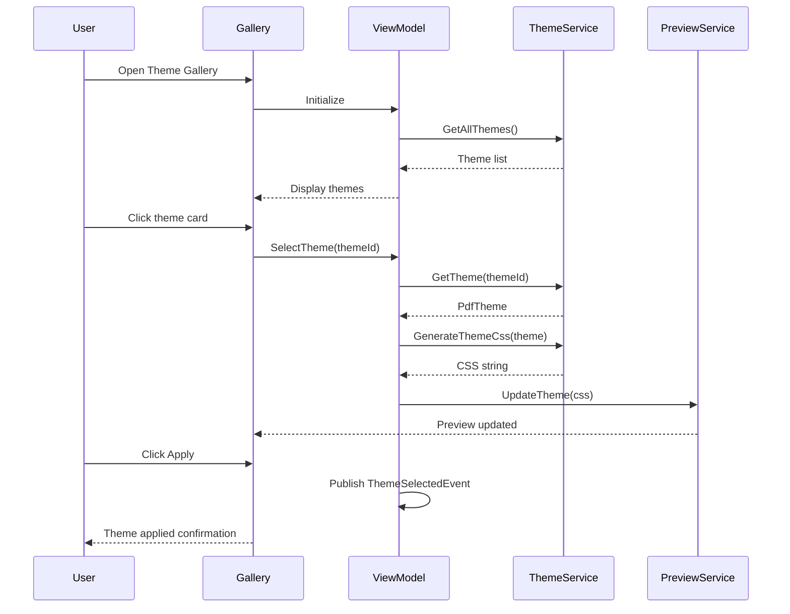
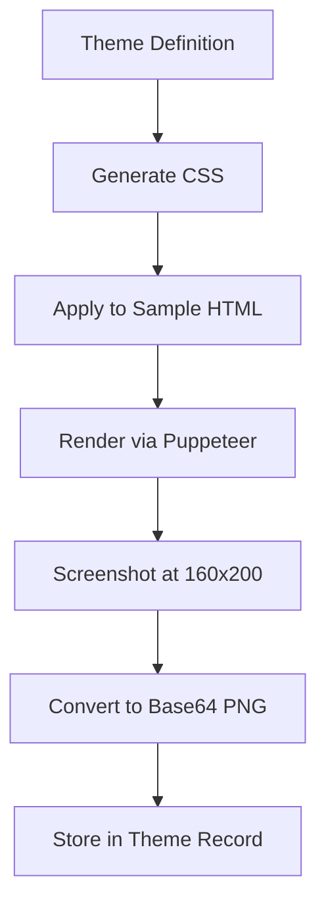

# LCS-DES-086b: Design Specification — Theme Gallery

## 1. Metadata & Categorization

| Field | Value | Description |
| :--- | :--- | :--- |
| **Feature ID** | `PUB-086b` | Sub-part of PUB-086 |
| **Feature Name** | `Theme Gallery` | Pre-built PDF themes |
| **Target Version** | `v0.8.6b` | Second sub-part of v0.8.6 |
| **Module Scope** | `Lexichord.Modules.Publishing` | Publishing module |
| **Swimlane** | `Publishing` | Part of Publisher vertical |
| **License Tier** | `Writer Pro` | Premium feature |
| **Feature Gate Key** | `FeatureFlags.Publishing.ThemeGallery` | License check key |
| **Author** | Lead Architect | |
| **Status** | `Draft` | |
| **Last Updated** | `2026-01-27` | |
| **Parent Document** | [LCS-DES-086-INDEX](./LCS-DES-086-INDEX.md) | |
| **Scope Breakdown** | [LCS-SBD-086 Section 3.2](./LCS-SBD-086.md#32-v086b-theme-gallery) | |

---

## 2. Executive Summary

### 2.1 The Requirement

Organizations need consistent, branded PDF output that reflects their identity. Technical writers need professional-looking documents without design expertise. Currently:

- PDF exports have generic, unstyled appearance
- No support for corporate colors, fonts, or branding
- Each document requires manual formatting
- No way to share styles across teams

> **Goal:** Provide a visual theme gallery with pre-built themes (Corporate, Academic, Minimal) and support for custom theme creation, enabling consistent, professional PDF output.

### 2.2 The Proposed Solution

Implement a Theme Gallery that:

1. Offers 3 built-in themes covering common use cases
2. Allows visual browsing and instant theme preview
3. Supports custom theme creation by cloning and editing
4. Generates CSS for complete document styling
5. Enables theme export/import for team sharing

---

## 3. Architecture & Modular Strategy

### 3.1 Dependencies

#### 3.1.1 Upstream Dependencies

| Interface | Source Version | Purpose |
| :--- | :--- | :--- |
| `IPageLayoutService` | v0.8.6a | Default layout per theme |
| `ISettingsService` | v0.1.6a | Theme persistence |
| `ILicenseContext` | v0.0.4c | Writer Pro feature gating |
| `IMediator` | v0.0.7a | Theme selection events |

#### 3.1.2 NuGet Packages

| Package | Version | Purpose |
| :--- | :--- | :--- |
| `CommunityToolkit.Mvvm` | 8.x | ViewModel base classes |
| `System.Text.Json` | 8.x | Theme serialization |

### 3.2 Licensing Behavior

**Soft Gate:** The Theme Gallery displays for all users, but theme application requires Writer Pro.

**Fallback Experience:**
- Gallery shows all themes with preview thumbnails
- Lock icon overlay on each theme card for Core users
- "Upgrade to Writer Pro" tooltip on apply button
- Default styling used for basic export

---

## 4. Data Contract (The API)

### 4.1 Core Interfaces

```csharp
namespace Lexichord.Modules.Publishing.Abstractions;

/// <summary>
/// Service for managing PDF themes.
/// </summary>
public interface IPdfThemeService
{
    /// <summary>
    /// Gets all built-in themes.
    /// </summary>
    IReadOnlyList<PdfTheme> GetBuiltInThemes();

    /// <summary>
    /// Gets all custom (user-created) themes.
    /// </summary>
    IReadOnlyList<PdfTheme> GetCustomThemes();

    /// <summary>
    /// Gets all themes (built-in and custom).
    /// </summary>
    IReadOnlyList<PdfTheme> GetAllThemes();

    /// <summary>
    /// Gets a theme by ID.
    /// </summary>
    /// <param name="themeId">The theme ID.</param>
    /// <returns>The theme, or null if not found.</returns>
    PdfTheme? GetTheme(Guid themeId);

    /// <summary>
    /// Creates a new custom theme.
    /// </summary>
    /// <param name="definition">Theme definition.</param>
    /// <param name="ct">Cancellation token.</param>
    /// <returns>The created theme.</returns>
    Task<PdfTheme> CreateThemeAsync(PdfThemeDefinition definition, CancellationToken ct = default);

    /// <summary>
    /// Clones an existing theme with a new name.
    /// </summary>
    /// <param name="sourceThemeId">Source theme to clone.</param>
    /// <param name="newName">Name for the cloned theme.</param>
    /// <param name="ct">Cancellation token.</param>
    /// <returns>The cloned theme.</returns>
    Task<PdfTheme> CloneThemeAsync(Guid sourceThemeId, string newName, CancellationToken ct = default);

    /// <summary>
    /// Updates an existing custom theme.
    /// </summary>
    /// <param name="theme">The theme with updated values.</param>
    /// <param name="ct">Cancellation token.</param>
    Task UpdateThemeAsync(PdfTheme theme, CancellationToken ct = default);

    /// <summary>
    /// Deletes a custom theme.
    /// </summary>
    /// <param name="themeId">The theme ID to delete.</param>
    /// <param name="ct">Cancellation token.</param>
    Task DeleteThemeAsync(Guid themeId, CancellationToken ct = default);

    /// <summary>
    /// Exports a theme to JSON string.
    /// </summary>
    /// <param name="themeId">The theme ID to export.</param>
    /// <param name="ct">Cancellation token.</param>
    /// <returns>JSON string representation.</returns>
    Task<string> ExportThemeAsync(Guid themeId, CancellationToken ct = default);

    /// <summary>
    /// Imports a theme from JSON string.
    /// </summary>
    /// <param name="themeJson">JSON string.</param>
    /// <param name="ct">Cancellation token.</param>
    /// <returns>The imported theme.</returns>
    Task<PdfTheme> ImportThemeAsync(string themeJson, CancellationToken ct = default);

    /// <summary>
    /// Generates CSS for a theme.
    /// </summary>
    /// <param name="theme">The theme.</param>
    /// <returns>CSS string.</returns>
    string GenerateThemeCss(PdfTheme theme);

    /// <summary>
    /// Generates a preview thumbnail for a theme.
    /// </summary>
    /// <param name="theme">The theme.</param>
    /// <param name="ct">Cancellation token.</param>
    /// <returns>Base64-encoded PNG thumbnail.</returns>
    Task<string> GenerateThumbnailAsync(PdfTheme theme, CancellationToken ct = default);
}
```

### 4.2 Data Records

```csharp
namespace Lexichord.Modules.Publishing.Models;

/// <summary>
/// Complete PDF theme definition including colors, typography, and spacing.
/// </summary>
public record PdfTheme(
    Guid Id,
    string Name,
    string? Description,
    bool IsBuiltIn,
    ThemeCategory Category,
    ThemeColorPalette Colors,
    ThemeTypography Typography,
    ThemeSpacing Spacing,
    PageLayoutConfiguration? DefaultLayout,
    HeaderFooterConfiguration? DefaultHeaderFooter,
    string? ThumbnailBase64,
    DateTime CreatedAt,
    DateTime ModifiedAt
);

/// <summary>
/// Input for creating a new theme.
/// </summary>
public record PdfThemeDefinition(
    string Name,
    string? Description,
    ThemeCategory Category,
    ThemeColorPalette Colors,
    ThemeTypography Typography,
    ThemeSpacing Spacing,
    PageLayoutConfiguration? DefaultLayout = null,
    HeaderFooterConfiguration? DefaultHeaderFooter = null
);

/// <summary>
/// Theme category for organization.
/// </summary>
public enum ThemeCategory
{
    Corporate,
    Academic,
    Technical,
    Minimal,
    Creative,
    Custom
}

/// <summary>
/// Color palette for a theme.
/// </summary>
public record ThemeColorPalette(
    string PrimaryColor,
    string SecondaryColor,
    string AccentColor,
    string TextColor,
    string HeadingColor,
    string LinkColor,
    string BackgroundColor,
    string CodeBlockBackground,
    string TableHeaderBackground,
    string TableStripeColor
)
{
    /// <summary>
    /// Default corporate color palette.
    /// </summary>
    public static ThemeColorPalette Corporate => new(
        PrimaryColor: "#1a365d",
        SecondaryColor: "#718096",
        AccentColor: "#3182ce",
        TextColor: "#2d3748",
        HeadingColor: "#1a365d",
        LinkColor: "#3182ce",
        BackgroundColor: "#ffffff",
        CodeBlockBackground: "#f7fafc",
        TableHeaderBackground: "#edf2f7",
        TableStripeColor: "#f7fafc"
    );

    /// <summary>
    /// Default academic color palette.
    /// </summary>
    public static ThemeColorPalette Academic => new(
        PrimaryColor: "#000000",
        SecondaryColor: "#4a5568",
        AccentColor: "#9b2c2c",
        TextColor: "#1a202c",
        HeadingColor: "#000000",
        LinkColor: "#2b6cb0",
        BackgroundColor: "#ffffff",
        CodeBlockBackground: "#edf2f7",
        TableHeaderBackground: "#e2e8f0",
        TableStripeColor: "#f7fafc"
    );

    /// <summary>
    /// Default minimal color palette.
    /// </summary>
    public static ThemeColorPalette Minimal => new(
        PrimaryColor: "#2d3748",
        SecondaryColor: "#718096",
        AccentColor: "#319795",
        TextColor: "#4a5568",
        HeadingColor: "#2d3748",
        LinkColor: "#319795",
        BackgroundColor: "#ffffff",
        CodeBlockBackground: "#f7fafc",
        TableHeaderBackground: "#edf2f7",
        TableStripeColor: "#f7fafc"
    );
}

/// <summary>
/// Typography settings for a theme.
/// </summary>
public record ThemeTypography(
    string HeadingFontFamily,
    string BodyFontFamily,
    string CodeFontFamily,
    double BaseFontSize,
    double LineHeight,
    double H1Scale,
    double H2Scale,
    double H3Scale,
    double H4Scale,
    FontWeight HeadingWeight,
    FontWeight BodyWeight
)
{
    /// <summary>
    /// Default corporate typography.
    /// </summary>
    public static ThemeTypography Corporate => new(
        HeadingFontFamily: "Arial, Helvetica, sans-serif",
        BodyFontFamily: "Georgia, 'Times New Roman', serif",
        CodeFontFamily: "Consolas, 'Courier New', monospace",
        BaseFontSize: 11,
        LineHeight: 1.6,
        H1Scale: 2.0,
        H2Scale: 1.5,
        H3Scale: 1.25,
        H4Scale: 1.0,
        HeadingWeight: FontWeight.Bold,
        BodyWeight: FontWeight.Regular
    );

    /// <summary>
    /// Default academic typography.
    /// </summary>
    public static ThemeTypography Academic => new(
        HeadingFontFamily: "'Times New Roman', Times, serif",
        BodyFontFamily: "'Times New Roman', Times, serif",
        CodeFontFamily: "'Courier New', Courier, monospace",
        BaseFontSize: 12,
        LineHeight: 2.0, // Double-spaced
        H1Scale: 1.5,
        H2Scale: 1.25,
        H3Scale: 1.1,
        H4Scale: 1.0,
        HeadingWeight: FontWeight.Bold,
        BodyWeight: FontWeight.Regular
    );

    /// <summary>
    /// Default minimal typography.
    /// </summary>
    public static ThemeTypography Minimal => new(
        HeadingFontFamily: "-apple-system, BlinkMacSystemFont, 'Segoe UI', Roboto, sans-serif",
        BodyFontFamily: "-apple-system, BlinkMacSystemFont, 'Segoe UI', Roboto, sans-serif",
        CodeFontFamily: "'SF Mono', 'Fira Code', Consolas, monospace",
        BaseFontSize: 10,
        LineHeight: 1.5,
        H1Scale: 1.75,
        H2Scale: 1.4,
        H3Scale: 1.15,
        H4Scale: 1.0,
        HeadingWeight: FontWeight.SemiBold,
        BodyWeight: FontWeight.Regular
    );
}

/// <summary>
/// Font weight options.
/// </summary>
public enum FontWeight
{
    Light = 300,
    Regular = 400,
    Medium = 500,
    SemiBold = 600,
    Bold = 700
}

/// <summary>
/// Spacing configuration for a theme.
/// </summary>
public record ThemeSpacing(
    double ParagraphSpacing,
    double HeadingSpacing,
    double ListIndent,
    double BlockquoteIndent,
    double CodeBlockPadding,
    double TableCellPadding
)
{
    /// <summary>
    /// Default corporate spacing (compact).
    /// </summary>
    public static ThemeSpacing Corporate => new(
        ParagraphSpacing: 12,
        HeadingSpacing: 18,
        ListIndent: 20,
        BlockquoteIndent: 15,
        CodeBlockPadding: 12,
        TableCellPadding: 8
    );

    /// <summary>
    /// Default academic spacing (generous).
    /// </summary>
    public static ThemeSpacing Academic => new(
        ParagraphSpacing: 24, // Double-spaced
        HeadingSpacing: 24,
        ListIndent: 36,
        BlockquoteIndent: 36,
        CodeBlockPadding: 16,
        TableCellPadding: 10
    );

    /// <summary>
    /// Default minimal spacing (balanced).
    /// </summary>
    public static ThemeSpacing Minimal => new(
        ParagraphSpacing: 16,
        HeadingSpacing: 24,
        ListIndent: 24,
        BlockquoteIndent: 20,
        CodeBlockPadding: 16,
        TableCellPadding: 12
    );
}
```

---

## 5. Implementation Logic

### 5.1 CSS Generation

```csharp
public class PdfThemeService : IPdfThemeService
{
    public string GenerateThemeCss(PdfTheme theme)
    {
        var sb = new StringBuilder();

        // Root variables
        sb.AppendLine(":root {");
        sb.AppendLine($"  --color-primary: {theme.Colors.PrimaryColor};");
        sb.AppendLine($"  --color-secondary: {theme.Colors.SecondaryColor};");
        sb.AppendLine($"  --color-accent: {theme.Colors.AccentColor};");
        sb.AppendLine($"  --color-text: {theme.Colors.TextColor};");
        sb.AppendLine($"  --color-heading: {theme.Colors.HeadingColor};");
        sb.AppendLine($"  --color-link: {theme.Colors.LinkColor};");
        sb.AppendLine($"  --color-bg: {theme.Colors.BackgroundColor};");
        sb.AppendLine($"  --color-code-bg: {theme.Colors.CodeBlockBackground};");
        sb.AppendLine($"  --font-heading: {theme.Typography.HeadingFontFamily};");
        sb.AppendLine($"  --font-body: {theme.Typography.BodyFontFamily};");
        sb.AppendLine($"  --font-code: {theme.Typography.CodeFontFamily};");
        sb.AppendLine($"  --font-size-base: {theme.Typography.BaseFontSize}pt;");
        sb.AppendLine($"  --line-height: {theme.Typography.LineHeight};");
        sb.AppendLine("}");
        sb.AppendLine();

        // Body styles
        sb.AppendLine("body {");
        sb.AppendLine("  font-family: var(--font-body);");
        sb.AppendLine("  font-size: var(--font-size-base);");
        sb.AppendLine("  line-height: var(--line-height);");
        sb.AppendLine("  color: var(--color-text);");
        sb.AppendLine("  background-color: var(--color-bg);");
        sb.AppendLine($"  font-weight: {(int)theme.Typography.BodyWeight};");
        sb.AppendLine("}");
        sb.AppendLine();

        // Headings
        sb.AppendLine("h1, h2, h3, h4, h5, h6 {");
        sb.AppendLine("  font-family: var(--font-heading);");
        sb.AppendLine("  color: var(--color-heading);");
        sb.AppendLine($"  font-weight: {(int)theme.Typography.HeadingWeight};");
        sb.AppendLine($"  margin-top: {theme.Spacing.HeadingSpacing}pt;");
        sb.AppendLine($"  margin-bottom: {theme.Spacing.HeadingSpacing / 2}pt;");
        sb.AppendLine("  page-break-after: avoid;");
        sb.AppendLine("}");
        sb.AppendLine();

        // Heading sizes
        sb.AppendLine($"h1 {{ font-size: calc(var(--font-size-base) * {theme.Typography.H1Scale}); }}");
        sb.AppendLine($"h2 {{ font-size: calc(var(--font-size-base) * {theme.Typography.H2Scale}); }}");
        sb.AppendLine($"h3 {{ font-size: calc(var(--font-size-base) * {theme.Typography.H3Scale}); }}");
        sb.AppendLine($"h4 {{ font-size: calc(var(--font-size-base) * {theme.Typography.H4Scale}); }}");
        sb.AppendLine();

        // Paragraphs
        sb.AppendLine("p {");
        sb.AppendLine($"  margin-bottom: {theme.Spacing.ParagraphSpacing}pt;");
        sb.AppendLine("}");
        sb.AppendLine();

        // Links
        sb.AppendLine("a {");
        sb.AppendLine("  color: var(--color-link);");
        sb.AppendLine("  text-decoration: underline;");
        sb.AppendLine("}");
        sb.AppendLine();

        // Code blocks
        sb.AppendLine("pre, code {");
        sb.AppendLine("  font-family: var(--font-code);");
        sb.AppendLine("  background-color: var(--color-code-bg);");
        sb.AppendLine("}");
        sb.AppendLine();

        sb.AppendLine("pre {");
        sb.AppendLine($"  padding: {theme.Spacing.CodeBlockPadding}pt;");
        sb.AppendLine("  border-radius: 4pt;");
        sb.AppendLine("  overflow-x: auto;");
        sb.AppendLine("}");
        sb.AppendLine();

        // Blockquotes
        sb.AppendLine("blockquote {");
        sb.AppendLine($"  margin-left: {theme.Spacing.BlockquoteIndent}pt;");
        sb.AppendLine("  padding-left: 12pt;");
        sb.AppendLine("  border-left: 3pt solid var(--color-secondary);");
        sb.AppendLine("  color: var(--color-secondary);");
        sb.AppendLine("  font-style: italic;");
        sb.AppendLine("}");
        sb.AppendLine();

        // Lists
        sb.AppendLine("ul, ol {");
        sb.AppendLine($"  padding-left: {theme.Spacing.ListIndent}pt;");
        sb.AppendLine("}");
        sb.AppendLine();

        // Tables
        sb.AppendLine("table {");
        sb.AppendLine("  width: 100%;");
        sb.AppendLine("  border-collapse: collapse;");
        sb.AppendLine("  margin-bottom: 16pt;");
        sb.AppendLine("}");
        sb.AppendLine();

        sb.AppendLine("th, td {");
        sb.AppendLine($"  padding: {theme.Spacing.TableCellPadding}pt;");
        sb.AppendLine("  border: 1pt solid var(--color-secondary);");
        sb.AppendLine("  text-align: left;");
        sb.AppendLine("}");
        sb.AppendLine();

        sb.AppendLine("th {");
        sb.AppendLine($"  background-color: {theme.Colors.TableHeaderBackground};");
        sb.AppendLine("  font-weight: bold;");
        sb.AppendLine("}");
        sb.AppendLine();

        sb.AppendLine("tr:nth-child(even) {");
        sb.AppendLine($"  background-color: {theme.Colors.TableStripeColor};");
        sb.AppendLine("}");

        return sb.ToString();
    }
}
```

### 5.2 Built-in Theme Definitions

```csharp
public static class BuiltInThemes
{
    public static PdfTheme Corporate => new(
        Id: Guid.Parse("00000000-0000-0000-0001-000000000001"),
        Name: "Corporate",
        Description: "Professional branding with navy headers and clean typography. Ideal for business reports, proposals, and internal documentation.",
        IsBuiltIn: true,
        Category: ThemeCategory.Corporate,
        Colors: ThemeColorPalette.Corporate,
        Typography: ThemeTypography.Corporate,
        Spacing: ThemeSpacing.Corporate,
        DefaultLayout: new PageLayoutConfiguration(
            Guid.NewGuid(),
            "Corporate Default",
            PageSize.A4,
            PageOrientation.Portrait,
            PageMargins.Uniform(25),
            ColumnLayout.Single
        ),
        DefaultHeaderFooter: null,
        ThumbnailBase64: null, // Generated at runtime
        CreatedAt: DateTime.UtcNow,
        ModifiedAt: DateTime.UtcNow
    );

    public static PdfTheme Academic => new(
        Id: Guid.Parse("00000000-0000-0000-0001-000000000002"),
        Name: "Academic",
        Description: "Scholarly formatting with Times New Roman and double spacing. Suitable for research papers, dissertations, and journal submissions.",
        IsBuiltIn: true,
        Category: ThemeCategory.Academic,
        Colors: ThemeColorPalette.Academic,
        Typography: ThemeTypography.Academic,
        Spacing: ThemeSpacing.Academic,
        DefaultLayout: new PageLayoutConfiguration(
            Guid.NewGuid(),
            "Academic Default",
            PageSize.Letter,
            PageOrientation.Portrait,
            new PageMargins(25.4, 25.4, 25.4, 25.4, MeasurementUnit.Millimeters), // 1 inch
            ColumnLayout.Single
        ),
        DefaultHeaderFooter: null,
        ThumbnailBase64: null,
        CreatedAt: DateTime.UtcNow,
        ModifiedAt: DateTime.UtcNow
    );

    public static PdfTheme Minimal => new(
        Id: Guid.Parse("00000000-0000-0000-0001-000000000003"),
        Name: "Minimal",
        Description: "Clean, modern design with system fonts and ample whitespace. Perfect for technical documentation and user guides.",
        IsBuiltIn: true,
        Category: ThemeCategory.Minimal,
        Colors: ThemeColorPalette.Minimal,
        Typography: ThemeTypography.Minimal,
        Spacing: ThemeSpacing.Minimal,
        DefaultLayout: new PageLayoutConfiguration(
            Guid.NewGuid(),
            "Minimal Default",
            PageSize.A4,
            PageOrientation.Portrait,
            new PageMargins(30, 30, 25, 25),
            ColumnLayout.Single
        ),
        DefaultHeaderFooter: null,
        ThumbnailBase64: null,
        CreatedAt: DateTime.UtcNow,
        ModifiedAt: DateTime.UtcNow
    );

    public static IReadOnlyList<PdfTheme> All => new[] { Corporate, Academic, Minimal };
}
```

### 5.3 Flow Diagram



---

## 6. UI/UX Specifications

### 6.1 Theme Gallery View

```text
+------------------------------------------------------------------+
|  Theme Gallery                           [Import] [+ New Theme]   |
+------------------------------------------------------------------+
| Filter: [All Categories  v]  Search: [                    ] [Q]   |
+------------------------------------------------------------------+
|                                                                   |
| BUILT-IN THEMES                                                   |
| +------------------+  +------------------+  +------------------+  |
| |    Corporate     |  |     Academic     |  |     Minimal      |  |
| | +------------+   |  | +------------+   |  | +------------+   |  |
| | |            |   |  | |            |   |  | |            |   |  |
| | |  Thumbnail |   |  | |  Thumbnail |   |  | |  Thumbnail |   |  |
| | |  Preview   |   |  | |  Preview   |   |  | |  Preview   |   |  |
| | |            |   |  | |            |   |  | |            |   |  |
| | +------------+   |  | +------------+   |  | +------------+   |  |
| | Professional     |  | Scholarly        |  | Clean, modern    |  |
| | branding with    |  | formatting with  |  | design with      |  |
| | navy headers     |  | Times New Roman  |  | system fonts     |  |
| |                  |  |                  |  |                  |  |
| | [Apply]          |  | [Apply]          |  | [Apply]          |  |
| +------------------+  +------------------+  +------------------+  |
|                                                                   |
| CUSTOM THEMES                                                     |
| +------------------+  +------------------+                        |
| |   My Company     |  |    + Create      |                        |
| | +------------+   |  | +------------+   |                        |
| | |            |   |  | |            |   |                        |
| | |  Thumbnail |   |  | |     +      |   |                        |
| | |  Preview   |   |  | |            |   |                        |
| | |            |   |  | |            |   |                        |
| | +------------+   |  | +------------+   |                        |
| | Based on         |  | Create a new     |                        |
| | Corporate        |  | custom theme     |                        |
| |                  |  |                  |                        |
| | [Edit] [Apply]   |  | [New Theme]      |                        |
| +------------------+  +------------------+                        |
|                                                                   |
+------------------------------------------------------------------+
```

### 6.2 Theme Card Component

```text
+------------------+
|   [Theme Name]   |
| +------------+   |
| |            |   |
| | Thumbnail  |   |  <- 160x200 preview image
| | showing    |   |
| | formatted  |   |
| | sample     |   |
| | text       |   |
| |            |   |
| +------------+   |
| Description text |
| that wraps to    |
| two lines max... |
|                  |
| [Action Button]  |
+------------------+

States:
- Default: Light border, subtle shadow
- Hover: Elevated shadow, slight scale
- Selected: Primary color border, checkmark
- Locked (Core): Lock icon overlay, dimmed
```

### 6.3 Theme Editor Dialog

```text
+------------------------------------------------------------------+
|  Edit Theme: My Company                             [Cancel][Save]|
+------------------------------------------------------------------+
| Name: [My Company Theme                               ]           |
| Description: [Based on Corporate with custom colors   ]           |
| Category: [Corporate         v]                                   |
+------------------------------------------------------------------+
| [Colors] | [Typography] | [Spacing] | [Preview]                   |
+------------------------------------------------------------------+
| Colors                                                            |
| +--------------------------------------------------------------+ |
| | Primary:    [#1a365d] [=]   Secondary: [#718096] [=]         | |
| | Accent:     [#3182ce] [=]   Text:      [#2d3748] [=]         | |
| | Headings:   [#1a365d] [=]   Links:     [#3182ce] [=]         | |
| | Background: [#ffffff] [=]   Code BG:   [#f7fafc] [=]         | |
| | Table Header: [#edf2f7] [=] Table Stripe: [#f7fafc] [=]      | |
| +--------------------------------------------------------------+ |
| [Reset to Default]                                                |
+------------------------------------------------------------------+
```

### 6.4 Component Styling

| Component | Theme Resource | Notes |
| :--- | :--- | :--- |
| Theme Card | `LexCard` | Border radius 8px |
| Card Thumbnail | `LexThumbnail` | 160x200px, rounded corners |
| Apply Button | `LexButtonPrimary` | Primary action |
| Edit Button | `LexButtonSecondary` | Secondary action |
| Color Picker | `LexColorPicker` | With hex input |
| Tab Control | `LexTabControl` | Editor tabs |

---

## 7. Theme Preview Generation

### 7.1 Sample Content

The thumbnail preview uses standardized sample content:

```markdown
# Document Title

## Introduction

Lorem ipsum dolor sit amet, consectetur adipiscing elit.
Sed do eiusmod tempor incididunt ut labore.

### Key Points

- First important item
- Second important item
- Third important item

```code
function example() {
  return "Hello, World!";
}
```

> A relevant quotation that demonstrates the blockquote styling.

| Column A | Column B |
|----------|----------|
| Data 1   | Value 1  |
| Data 2   | Value 2  |
```

### 7.2 Thumbnail Generation Process



---

## 8. Observability & Logging

| Level | Source | Message Template |
| :--- | :--- | :--- |
| Debug | PdfThemeService | `"Generating CSS for theme: {ThemeName}"` |
| Debug | PdfThemeService | `"CSS generated: {CssLength} characters"` |
| Info | PdfThemeService | `"Theme created: {ThemeName} (ID: {ThemeId})"` |
| Info | PdfThemeService | `"Theme cloned: {SourceName} -> {NewName}"` |
| Info | PdfThemeService | `"Theme exported: {ThemeName}"` |
| Info | PdfThemeService | `"Theme imported: {ThemeName}"` |
| Warning | PdfThemeService | `"Theme thumbnail generation failed: {Error}"` |
| Error | PdfThemeService | `"Theme save failed: {Error}"` |

---

## 9. Security & Safety

| Risk | Level | Mitigation |
| :--- | :--- | :--- |
| CSS injection via theme | Medium | Validate color format, sanitize font names |
| Malicious theme import | Medium | Validate JSON schema, limit file size |
| XSS in theme names | Low | Escape special characters in display |

**Import Validation:**
- Maximum import file size: 100KB
- Required fields validation
- Color format regex: `^#[0-9A-Fa-f]{6}$`
- Font family allowlist for built-in themes

---

## 10. Acceptance Criteria

### 10.1 Functional Criteria

| # | Given | When | Then |
| :--- | :--- | :--- | :--- |
| 1 | Theme Gallery open | Loading | 3 built-in themes displayed |
| 2 | Corporate theme | Applied | Navy headings, Georgia body font |
| 3 | Academic theme | Applied | Times New Roman, double spacing |
| 4 | Minimal theme | Applied | System fonts, teal accents |
| 5 | Custom theme creation | Clone Corporate | New editable theme created |
| 6 | Theme color change | Edit primary color | Preview updates immediately |
| 7 | Theme export | Click Export | JSON file downloaded |
| 8 | Theme import | Select JSON file | Theme added to custom list |
| 9 | Theme deletion | Delete custom theme | Theme removed from gallery |
| 10 | Built-in theme | Attempt delete | Delete option not available |

### 10.2 License Criteria

| # | Given | When | Then |
| :--- | :--- | :--- | :--- |
| 11 | Core license | Click Apply | Upgrade prompt displayed |
| 12 | Writer Pro | Click Apply | Theme applied successfully |

---

## 11. Test Scenarios

```csharp
[Trait("Category", "Unit")]
[Trait("Version", "v0.8.6b")]
public class PdfThemeServiceTests
{
    private readonly PdfThemeService _sut = new();

    #region Built-in Theme Tests

    [Fact]
    public void GetBuiltInThemes_ReturnsThreeThemes()
    {
        var themes = _sut.GetBuiltInThemes();
        themes.Should().HaveCount(3);
    }

    [Theory]
    [InlineData("Corporate")]
    [InlineData("Academic")]
    [InlineData("Minimal")]
    public void GetBuiltInThemes_ContainsExpectedTheme(string themeName)
    {
        var themes = _sut.GetBuiltInThemes();
        themes.Should().Contain(t => t.Name == themeName);
    }

    [Fact]
    public void GetBuiltInThemes_AllMarkedAsBuiltIn()
    {
        var themes = _sut.GetBuiltInThemes();
        themes.Should().AllSatisfy(t => t.IsBuiltIn.Should().BeTrue());
    }

    #endregion

    #region CSS Generation Tests

    [Fact]
    public void GenerateThemeCss_CorporateTheme_IncludesNavyColor()
    {
        var theme = BuiltInThemes.Corporate;
        var css = _sut.GenerateThemeCss(theme);
        css.Should().Contain("#1a365d");
    }

    [Fact]
    public void GenerateThemeCss_AcademicTheme_IncludesTimesNewRoman()
    {
        var theme = BuiltInThemes.Academic;
        var css = _sut.GenerateThemeCss(theme);
        css.Should().Contain("'Times New Roman'");
    }

    [Fact]
    public void GenerateThemeCss_MinimalTheme_IncludesSystemFonts()
    {
        var theme = BuiltInThemes.Minimal;
        var css = _sut.GenerateThemeCss(theme);
        css.Should().Contain("-apple-system");
    }

    [Fact]
    public void GenerateThemeCss_IncludesHeadingScales()
    {
        var theme = BuiltInThemes.Corporate;
        var css = _sut.GenerateThemeCss(theme);

        css.Should().Contain("h1 {");
        css.Should().Contain("h2 {");
        css.Should().Contain("h3 {");
        css.Should().Contain("h4 {");
    }

    [Fact]
    public void GenerateThemeCss_IncludesTableStyles()
    {
        var theme = BuiltInThemes.Corporate;
        var css = _sut.GenerateThemeCss(theme);

        css.Should().Contain("table {");
        css.Should().Contain("th, td {");
        css.Should().Contain("tr:nth-child(even)");
    }

    #endregion

    #region Clone Tests

    [Fact]
    public async Task CloneThemeAsync_CreatesNewTheme_WithNewId()
    {
        var original = BuiltInThemes.Corporate;

        var cloned = await _sut.CloneThemeAsync(original.Id, "My Corporate");

        cloned.Id.Should().NotBe(original.Id);
        cloned.Name.Should().Be("My Corporate");
        cloned.IsBuiltIn.Should().BeFalse();
    }

    [Fact]
    public async Task CloneThemeAsync_PreservesColors()
    {
        var original = BuiltInThemes.Corporate;

        var cloned = await _sut.CloneThemeAsync(original.Id, "My Corporate");

        cloned.Colors.Should().BeEquivalentTo(original.Colors);
    }

    #endregion

    #region Export/Import Tests

    [Fact]
    public async Task ExportImport_RoundTrip_PreservesTheme()
    {
        var original = await _sut.CreateThemeAsync(new PdfThemeDefinition(
            Name: "Test Theme",
            Description: "Test",
            Category: ThemeCategory.Custom,
            Colors: ThemeColorPalette.Corporate,
            Typography: ThemeTypography.Corporate,
            Spacing: ThemeSpacing.Corporate
        ));

        var json = await _sut.ExportThemeAsync(original.Id);
        var imported = await _sut.ImportThemeAsync(json);

        imported.Name.Should().Be(original.Name);
        imported.Colors.Should().BeEquivalentTo(original.Colors);
        imported.Typography.Should().BeEquivalentTo(original.Typography);
    }

    #endregion
}
```

---

## 12. Deliverable Checklist

| # | Deliverable | Status |
| :--- | :--- | :--- |
| 1 | `IPdfThemeService` interface | [ ] |
| 2 | `PdfTheme` and related records | [ ] |
| 3 | `ThemeColorPalette` with defaults | [ ] |
| 4 | `ThemeTypography` with defaults | [ ] |
| 5 | `ThemeSpacing` with defaults | [ ] |
| 6 | Corporate built-in theme | [ ] |
| 7 | Academic built-in theme | [ ] |
| 8 | Minimal built-in theme | [ ] |
| 9 | CSS generation implementation | [ ] |
| 10 | `ThemeGalleryView.axaml` | [ ] |
| 11 | `ThemeGalleryViewModel` | [ ] |
| 12 | Theme card component | [ ] |
| 13 | Theme editor dialog | [ ] |
| 14 | Theme export functionality | [ ] |
| 15 | Theme import functionality | [ ] |
| 16 | Thumbnail generation | [ ] |
| 17 | Unit tests for CSS generation | [ ] |
| 18 | Unit tests for clone/export/import | [ ] |

---

## 13. Verification Commands

```bash
# Run all Theme Gallery tests
dotnet test --filter "Version=v0.8.6b" --logger "console;verbosity=detailed"

# Run only CSS generation tests
dotnet test --filter "FullyQualifiedName~GenerateThemeCss"

# Run only built-in theme tests
dotnet test --filter "FullyQualifiedName~BuiltInTheme"

# Run with coverage
dotnet test --filter "Version=v0.8.6b" --collect:"XPlat Code Coverage"
```

---

## Document History

| Version | Date | Author | Changes |
| :--- | :--- | :--- | :--- |
| 1.0 | 2026-01-27 | Lead Architect | Initial draft |

---
