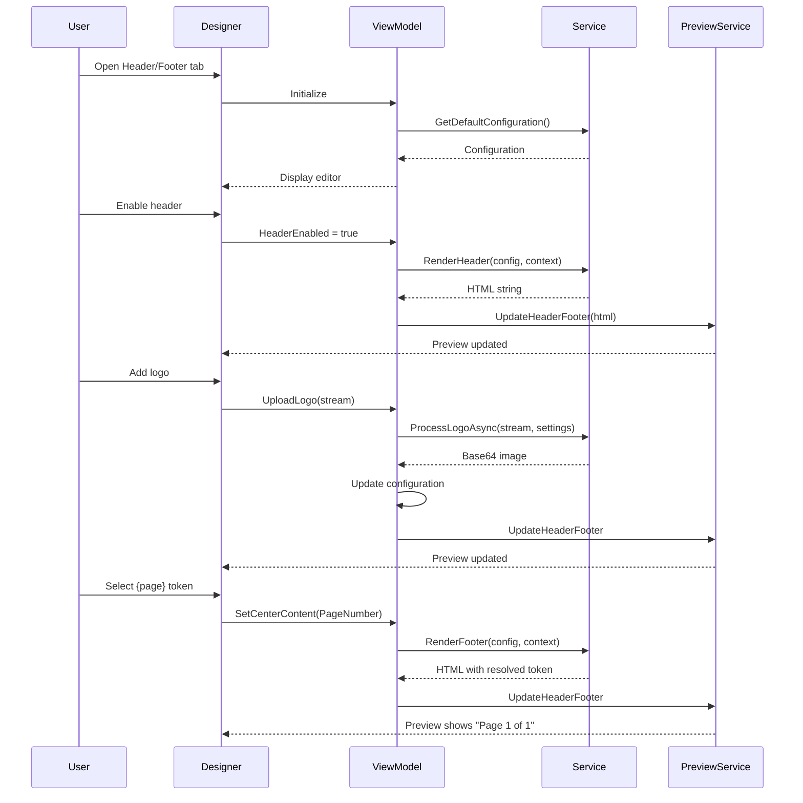
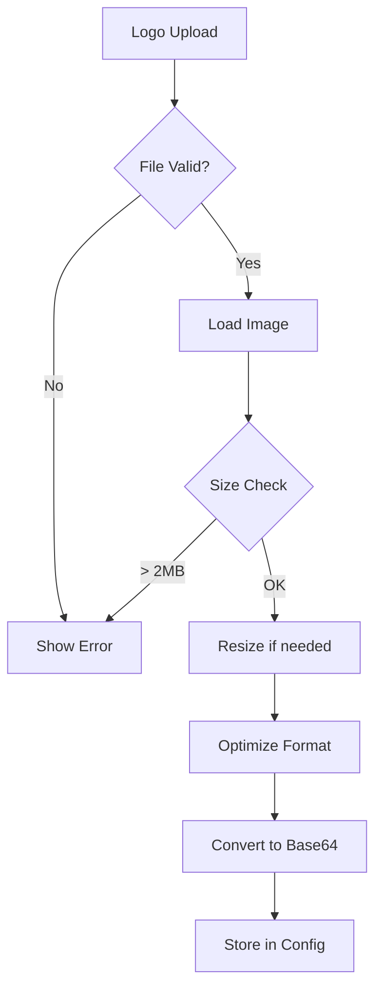

# LCS-DES-086c: Design Specification — Header/Footer Designer

## 1. Metadata & Categorization

| Field | Value | Description |
| :--- | :--- | :--- |
| **Feature ID** | `PUB-086c` | Sub-part of PUB-086 |
| **Feature Name** | `Header/Footer Designer` | Logo, date, page number placement |
| **Target Version** | `v0.8.6c` | Third sub-part of v0.8.6 |
| **Module Scope** | `Lexichord.Modules.Publishing` | Publishing module |
| **Swimlane** | `Publishing` | Part of Publisher vertical |
| **License Tier** | `Writer Pro` | Premium feature |
| **Feature Gate Key** | `FeatureFlags.Publishing.HeaderFooter` | License check key |
| **Author** | Lead Architect | |
| **Status** | `Draft` | |
| **Last Updated** | `2026-01-27` | |
| **Parent Document** | [LCS-DES-086-INDEX](./LCS-DES-086-INDEX.md) | |
| **Scope Breakdown** | [LCS-SBD-086 Section 3.3](./LCS-SBD-086.md#33-v086c-headerfooter-designer) | |

---

## 2. Executive Summary

### 2.1 The Requirement

Professional documents require headers and footers with:

- Company logos for brand identity
- Automatic page numbering
- Document metadata (title, author, date)
- Confidentiality notices

Currently, PDF exports have no header/footer capability, requiring manual addition in external tools.

> **Goal:** Provide a visual designer for headers and footers with support for logos, dynamic tokens (page numbers, dates), and flexible positioning.

### 2.2 The Proposed Solution

Implement a Header/Footer Designer that:

1. Provides visual three-zone layout (left, center, right)
2. Supports dynamic tokens that resolve at export time
3. Enables logo upload with positioning and sizing
4. Offers different configurations for first page and odd/even pages
5. Generates HTML/CSS for PuppeteerSharp rendering

---

## 3. Architecture & Modular Strategy

### 3.1 Dependencies

#### 3.1.1 Upstream Dependencies

| Interface | Source Version | Purpose |
| :--- | :--- | :--- |
| `IPageLayoutService` | v0.8.6a | Margin calculations for positioning |
| `ISettingsService` | v0.1.6a | Configuration persistence |
| `ILicenseContext` | v0.0.4c | Writer Pro feature gating |
| `IMediator` | v0.0.7a | Header/footer change events |

#### 3.1.2 NuGet Packages

| Package | Version | Purpose |
| :--- | :--- | :--- |
| `SixLabors.ImageSharp` | 3.x | Logo image processing |
| `CommunityToolkit.Mvvm` | 8.x | ViewModel base classes |

### 3.2 Licensing Behavior

**Soft Gate:** Header/Footer Designer is disabled for non-Writer Pro users.

**Fallback Experience:**
- Designer tab shows but is disabled
- "Upgrade to Writer Pro" message displayed
- Basic export has no headers/footers

---

## 4. Data Contract (The API)

### 4.1 Core Interfaces

```csharp
namespace Lexichord.Modules.Publishing.Abstractions;

/// <summary>
/// Service for managing PDF headers and footers.
/// </summary>
public interface IHeaderFooterService
{
    /// <summary>
    /// Gets the default header/footer configuration.
    /// </summary>
    HeaderFooterConfiguration GetDefaultConfiguration();

    /// <summary>
    /// Gets a saved configuration by ID.
    /// </summary>
    HeaderFooterConfiguration? GetConfiguration(Guid configurationId);

    /// <summary>
    /// Gets all saved configurations.
    /// </summary>
    IReadOnlyList<HeaderFooterConfiguration> GetAllConfigurations();

    /// <summary>
    /// Saves a header/footer configuration.
    /// </summary>
    Task SaveConfigurationAsync(HeaderFooterConfiguration config, CancellationToken ct = default);

    /// <summary>
    /// Deletes a configuration.
    /// </summary>
    Task DeleteConfigurationAsync(Guid configurationId, CancellationToken ct = default);

    /// <summary>
    /// Renders the header HTML for a specific page.
    /// </summary>
    /// <param name="config">The configuration.</param>
    /// <param name="context">The render context.</param>
    /// <returns>HTML string for the header.</returns>
    string RenderHeader(HeaderFooterConfiguration config, RenderContext context);

    /// <summary>
    /// Renders the footer HTML for a specific page.
    /// </summary>
    /// <param name="config">The configuration.</param>
    /// <param name="context">The render context.</param>
    /// <returns>HTML string for the footer.</returns>
    string RenderFooter(HeaderFooterConfiguration config, RenderContext context);

    /// <summary>
    /// Gets all available dynamic tokens.
    /// </summary>
    IReadOnlyList<DynamicToken> GetAvailableTokens();

    /// <summary>
    /// Resolves dynamic tokens in a template string.
    /// </summary>
    /// <param name="template">Template with tokens.</param>
    /// <param name="context">Render context.</param>
    /// <returns>Resolved string.</returns>
    string ResolveTokens(string template, RenderContext context);

    /// <summary>
    /// Processes and stores a logo image.
    /// </summary>
    /// <param name="logoStream">Logo image stream.</param>
    /// <param name="settings">Logo processing settings.</param>
    /// <param name="ct">Cancellation token.</param>
    /// <returns>Base64-encoded processed image.</returns>
    Task<string> ProcessLogoAsync(Stream logoStream, LogoSettings settings, CancellationToken ct = default);

    /// <summary>
    /// Generates CSS for header/footer positioning.
    /// </summary>
    string GenerateHeaderFooterCss(HeaderFooterConfiguration config, PageLayoutConfiguration layout);
}
```

### 4.2 Data Records

```csharp
namespace Lexichord.Modules.Publishing.Models;

/// <summary>
/// Complete header/footer configuration.
/// </summary>
public record HeaderFooterConfiguration(
    Guid Id,
    string Name,
    HeaderConfiguration Header,
    FooterConfiguration Footer,
    bool DifferentFirstPage = false,
    HeaderConfiguration? FirstPageHeader = null,
    FooterConfiguration? FirstPageFooter = null,
    bool DifferentOddEven = false,
    HeaderConfiguration? OddPageHeader = null,
    HeaderConfiguration? EvenPageHeader = null,
    FooterConfiguration? OddPageFooter = null,
    FooterConfiguration? EvenPageFooter = null
);

/// <summary>
/// Header configuration with three content zones.
/// </summary>
public record HeaderConfiguration(
    bool Enabled,
    double Height,
    HeaderFooterSection Left,
    HeaderFooterSection Center,
    HeaderFooterSection Right,
    string? BackgroundColor = null,
    BorderConfiguration? BottomBorder = null,
    MeasurementUnit HeightUnit = MeasurementUnit.Millimeters
);

/// <summary>
/// Footer configuration with three content zones.
/// </summary>
public record FooterConfiguration(
    bool Enabled,
    double Height,
    HeaderFooterSection Left,
    HeaderFooterSection Center,
    HeaderFooterSection Right,
    string? BackgroundColor = null,
    BorderConfiguration? TopBorder = null,
    MeasurementUnit HeightUnit = MeasurementUnit.Millimeters
);

/// <summary>
/// A single section (left, center, or right) of a header or footer.
/// </summary>
public record HeaderFooterSection(
    HeaderFooterContentType ContentType,
    string? TextContent = null,
    TextFormatting? Formatting = null,
    LogoConfiguration? Logo = null
)
{
    /// <summary>
    /// Creates an empty section.
    /// </summary>
    public static HeaderFooterSection Empty => new(HeaderFooterContentType.None);

    /// <summary>
    /// Creates a text section.
    /// </summary>
    public static HeaderFooterSection Text(string content, TextFormatting? formatting = null)
        => new(HeaderFooterContentType.Text, content, formatting);

    /// <summary>
    /// Creates a page number section.
    /// </summary>
    public static HeaderFooterSection PageNumber(TextFormatting? formatting = null)
        => new(HeaderFooterContentType.PageNumber, null, formatting);

    /// <summary>
    /// Creates a "Page X of Y" section.
    /// </summary>
    public static HeaderFooterSection PageOfPages(TextFormatting? formatting = null)
        => new(HeaderFooterContentType.PageOfPages, null, formatting);
}

/// <summary>
/// Content type for header/footer sections.
/// </summary>
public enum HeaderFooterContentType
{
    None,
    Text,
    PageNumber,
    PageCount,
    PageOfPages,
    Date,
    DateTime,
    DocumentTitle,
    Author,
    Logo,
    Custom
}

/// <summary>
/// Text formatting options.
/// </summary>
public record TextFormatting(
    string FontFamily = "Arial, sans-serif",
    double FontSize = 9,
    string Color = "#666666",
    FontWeight Weight = FontWeight.Regular,
    TextAlignment Alignment = TextAlignment.Left,
    bool Italic = false
);

/// <summary>
/// Text alignment options.
/// </summary>
public enum TextAlignment
{
    Left,
    Center,
    Right
}

/// <summary>
/// Logo configuration.
/// </summary>
public record LogoConfiguration(
    string ImageBase64,
    double Width,
    double Height,
    bool MaintainAspectRatio = true,
    LogoPosition Position = LogoPosition.Left,
    MeasurementUnit SizeUnit = MeasurementUnit.Millimeters
);

/// <summary>
/// Logo positioning.
/// </summary>
public enum LogoPosition
{
    Left,
    Center,
    Right
}

/// <summary>
/// Border configuration.
/// </summary>
public record BorderConfiguration(
    double Width,
    string Color,
    BorderStyle Style = BorderStyle.Solid
);

/// <summary>
/// Border style options.
/// </summary>
public enum BorderStyle
{
    Solid,
    Dashed,
    Dotted,
    None
}

/// <summary>
/// Context for rendering headers/footers.
/// </summary>
public record RenderContext(
    int CurrentPage,
    int TotalPages,
    DateTime ExportDate,
    string DocumentTitle,
    string? Author = null,
    IDictionary<string, string>? CustomTokens = null
)
{
    /// <summary>
    /// Whether this is the first page.
    /// </summary>
    public bool IsFirstPage => CurrentPage == 1;

    /// <summary>
    /// Whether this is an odd page (1, 3, 5...).
    /// </summary>
    public bool IsOddPage => CurrentPage % 2 == 1;

    /// <summary>
    /// Whether this is an even page (2, 4, 6...).
    /// </summary>
    public bool IsEvenPage => CurrentPage % 2 == 0;
}

/// <summary>
/// Definition of an available dynamic token.
/// </summary>
public record DynamicToken(
    string Token,
    string DisplayName,
    string Description,
    string ExampleOutput
);

/// <summary>
/// Settings for logo processing.
/// </summary>
public record LogoSettings(
    int MaxWidth = 200,
    int MaxHeight = 100,
    bool ConvertToOptimalFormat = true,
    int JpegQuality = 85
);
```

---

## 5. Implementation Logic

### 5.1 Token Resolution

```csharp
public class TokenResolver
{
    private static readonly Dictionary<string, Func<RenderContext, string>> _tokenResolvers = new()
    {
        ["{page}"] = ctx => ctx.CurrentPage.ToString(),
        ["{pages}"] = ctx => ctx.TotalPages.ToString(),
        ["{date}"] = ctx => ctx.ExportDate.ToString("yyyy-MM-dd"),
        ["{date:short}"] = ctx => ctx.ExportDate.ToString("d"),
        ["{date:long}"] = ctx => ctx.ExportDate.ToString("D"),
        ["{time}"] = ctx => ctx.ExportDate.ToString("HH:mm"),
        ["{datetime}"] = ctx => ctx.ExportDate.ToString("yyyy-MM-dd HH:mm"),
        ["{title}"] = ctx => ctx.DocumentTitle,
        ["{author}"] = ctx => ctx.Author ?? "",
        ["{filename}"] = ctx => Path.GetFileName(ctx.DocumentTitle),
    };

    public string Resolve(string template, RenderContext context)
    {
        if (string.IsNullOrEmpty(template))
            return string.Empty;

        var result = template;

        // Built-in tokens
        foreach (var (token, resolver) in _tokenResolvers)
        {
            if (result.Contains(token, StringComparison.OrdinalIgnoreCase))
            {
                result = result.Replace(token, resolver(context), StringComparison.OrdinalIgnoreCase);
            }
        }

        // Custom tokens
        if (context.CustomTokens != null)
        {
            foreach (var (key, value) in context.CustomTokens)
            {
                result = result.Replace($"{{{key}}}", value, StringComparison.OrdinalIgnoreCase);
            }
        }

        return result;
    }

    public static IReadOnlyList<DynamicToken> GetAvailableTokens() => new[]
    {
        new DynamicToken("{page}", "Page Number", "Current page number", "5"),
        new DynamicToken("{pages}", "Total Pages", "Total number of pages", "42"),
        new DynamicToken("{date}", "Date", "Export date (YYYY-MM-DD)", "2026-01-27"),
        new DynamicToken("{date:short}", "Date (Short)", "Export date in short format", "1/27/2026"),
        new DynamicToken("{date:long}", "Date (Long)", "Export date in long format", "January 27, 2026"),
        new DynamicToken("{time}", "Time", "Export time (HH:MM)", "14:30"),
        new DynamicToken("{datetime}", "Date & Time", "Full date and time", "2026-01-27 14:30"),
        new DynamicToken("{title}", "Document Title", "Title of the document", "User Guide"),
        new DynamicToken("{author}", "Author", "Document author name", "John Doe"),
        new DynamicToken("{filename}", "Filename", "Source file name", "guide.md"),
    };
}
```

### 5.2 HTML Rendering

```csharp
public class HeaderFooterRenderer
{
    private readonly TokenResolver _tokenResolver = new();

    public string RenderHeader(HeaderFooterConfiguration config, RenderContext context)
    {
        var headerConfig = GetApplicableHeader(config, context);
        if (headerConfig == null || !headerConfig.Enabled)
            return string.Empty;

        return RenderSection(headerConfig, "header", context);
    }

    public string RenderFooter(HeaderFooterConfiguration config, RenderContext context)
    {
        var footerConfig = GetApplicableFooter(config, context);
        if (footerConfig == null || !footerConfig.Enabled)
            return string.Empty;

        return RenderSection(footerConfig, "footer", context);
    }

    private HeaderConfiguration? GetApplicableHeader(HeaderFooterConfiguration config, RenderContext ctx)
    {
        if (config.DifferentFirstPage && ctx.IsFirstPage)
            return config.FirstPageHeader;

        if (config.DifferentOddEven)
            return ctx.IsOddPage ? config.OddPageHeader : config.EvenPageHeader;

        return config.Header;
    }

    private FooterConfiguration? GetApplicableFooter(HeaderFooterConfiguration config, RenderContext ctx)
    {
        if (config.DifferentFirstPage && ctx.IsFirstPage)
            return config.FirstPageFooter;

        if (config.DifferentOddEven)
            return ctx.IsOddPage ? config.OddPageFooter : config.EvenPageFooter;

        return config.Footer;
    }

    private string RenderSection(object config, string type, RenderContext context)
    {
        var height = type == "header"
            ? ((HeaderConfiguration)config).Height
            : ((FooterConfiguration)config).Height;

        var left = type == "header"
            ? ((HeaderConfiguration)config).Left
            : ((FooterConfiguration)config).Left;

        var center = type == "header"
            ? ((HeaderConfiguration)config).Center
            : ((FooterConfiguration)config).Center;

        var right = type == "header"
            ? ((HeaderConfiguration)config).Right
            : ((FooterConfiguration)config).Right;

        var bgColor = type == "header"
            ? ((HeaderConfiguration)config).BackgroundColor
            : ((FooterConfiguration)config).BackgroundColor;

        var sb = new StringBuilder();
        sb.AppendLine($"<div class=\"{type}\" style=\"height: {height}mm; display: flex; align-items: center;");

        if (!string.IsNullOrEmpty(bgColor))
            sb.Append($" background-color: {bgColor};");

        sb.AppendLine("\">");

        // Left zone
        sb.AppendLine("<div class=\"zone-left\" style=\"flex: 1; text-align: left;\">");
        sb.AppendLine(RenderSectionContent(left, context));
        sb.AppendLine("</div>");

        // Center zone
        sb.AppendLine("<div class=\"zone-center\" style=\"flex: 1; text-align: center;\">");
        sb.AppendLine(RenderSectionContent(center, context));
        sb.AppendLine("</div>");

        // Right zone
        sb.AppendLine("<div class=\"zone-right\" style=\"flex: 1; text-align: right;\">");
        sb.AppendLine(RenderSectionContent(right, context));
        sb.AppendLine("</div>");

        sb.AppendLine("</div>");
        return sb.ToString();
    }

    private string RenderSectionContent(HeaderFooterSection section, RenderContext context)
    {
        return section.ContentType switch
        {
            HeaderFooterContentType.None => "",
            HeaderFooterContentType.Text => RenderText(section, context),
            HeaderFooterContentType.PageNumber => RenderText(
                section with { TextContent = "{page}" }, context),
            HeaderFooterContentType.PageCount => RenderText(
                section with { TextContent = "{pages}" }, context),
            HeaderFooterContentType.PageOfPages => RenderText(
                section with { TextContent = "Page {page} of {pages}" }, context),
            HeaderFooterContentType.Date => RenderText(
                section with { TextContent = "{date}" }, context),
            HeaderFooterContentType.DateTime => RenderText(
                section with { TextContent = "{datetime}" }, context),
            HeaderFooterContentType.DocumentTitle => RenderText(
                section with { TextContent = "{title}" }, context),
            HeaderFooterContentType.Author => RenderText(
                section with { TextContent = "{author}" }, context),
            HeaderFooterContentType.Logo => RenderLogo(section),
            HeaderFooterContentType.Custom => RenderText(section, context),
            _ => ""
        };
    }

    private string RenderText(HeaderFooterSection section, RenderContext context)
    {
        var text = _tokenResolver.Resolve(section.TextContent ?? "", context);
        var formatting = section.Formatting ?? new TextFormatting();

        var style = new StringBuilder();
        style.Append($"font-family: {formatting.FontFamily}; ");
        style.Append($"font-size: {formatting.FontSize}pt; ");
        style.Append($"color: {formatting.Color}; ");
        style.Append($"font-weight: {(int)formatting.Weight}; ");

        if (formatting.Italic)
            style.Append("font-style: italic; ");

        return $"<span style=\"{style}\">{EscapeHtml(text)}</span>";
    }

    private string RenderLogo(HeaderFooterSection section)
    {
        if (section.Logo == null || string.IsNullOrEmpty(section.Logo.ImageBase64))
            return "";

        var style = new StringBuilder();
        style.Append($"width: {section.Logo.Width}mm; ");
        style.Append($"height: {section.Logo.Height}mm; ");

        if (section.Logo.MaintainAspectRatio)
            style.Append("object-fit: contain; ");

        return $"";
    }

    private static string EscapeHtml(string text)
        => System.Net.WebUtility.HtmlEncode(text);
}
```

### 5.3 Flow Diagram



---

## 6. UI/UX Specifications

### 6.1 Header/Footer Designer Panel

```text
+------------------------------------------------------------------+
|  Header/Footer Designer                          [Reset] [Save]   |
+------------------------------------------------------------------+
| Saved Configurations: [Corporate Standard  v]  [Load] [Delete]    |
+------------------------------------------------------------------+
| HEADER                                                [x] Enabled |
| +--------------------------------------------------------------+ |
| | Height: [15   ] mm                                           | |
| +--------------------------------------------------------------+ |
| | +------------------+------------------+------------------+    | |
| | |   LEFT ZONE      |   CENTER ZONE    |    RIGHT ZONE    |    | |
| | +------------------+------------------+------------------+    | |
| | | [Logo      v]    | [Title     v]    | [Date      v]    |    | |
| | | [Upload Logo]    | {title}          | {date}           |    | |
| | +------------------+------------------+------------------+    | |
| +--------------------------------------------------------------+ |
| | Border: [x] Show  Width: [1  ] pt  Color: [#cccccc] [=]      | |
| +--------------------------------------------------------------+ |
+------------------------------------------------------------------+
| FOOTER                                                [x] Enabled |
| +--------------------------------------------------------------+ |
| | Height: [12   ] mm                                           | |
| +--------------------------------------------------------------+ |
| | +------------------+------------------+------------------+    | |
| | |   LEFT ZONE      |   CENTER ZONE    |    RIGHT ZONE    |    | |
| | +------------------+------------------+------------------+    | |
| | | [Text      v]    | [Page of Pages v]| [Text      v]    |    | |
| | | Acme Corp        | Page {page}      | Confidential     |    | |
| | |                  | of {pages}       |                  |    | |
| | +------------------+------------------+------------------+    | |
| +--------------------------------------------------------------+ |
| | Border: [x] Show  Width: [1  ] pt  Color: [#cccccc] [=]      | |
| +--------------------------------------------------------------+ |
+------------------------------------------------------------------+
| OPTIONS                                                           |
| [ ] Different first page header/footer                            |
| [ ] Different odd/even page headers/footers                       |
+------------------------------------------------------------------+
| AVAILABLE TOKENS                                                  |
| +--------------------------------------------------------------+ |
| | {page}  Current page    {pages}  Total pages                 | |
| | {date}  Export date     {title}  Document title              | |
| | {author} Author         {time}   Export time                 | |
| +--------------------------------------------------------------+ |
+------------------------------------------------------------------+
```

### 6.2 Zone Content Editor

```text
+-----------------------------------+
|  Edit Zone Content                |
+-----------------------------------+
| Content Type: [Page Number   v]   |
|                                   |
| [x] None                          |
| [ ] Text                          |
| [o] Page Number                   |
| [ ] Page of Pages                 |
| [ ] Date                          |
| [ ] Document Title                |
| [ ] Logo                          |
| [ ] Custom                        |
+-----------------------------------+
| Formatting                        |
| +-------------------------------+ |
| | Font: [Arial          v]      | |
| | Size: [9    ] pt              | |
| | Color: [#666666] [=]          | |
| | Weight: [Regular     v]       | |
| | [ ] Italic                    | |
| +-------------------------------+ |
+-----------------------------------+
|              [Cancel]  [Apply]    |
+-----------------------------------+
```

### 6.3 Logo Upload Dialog

```text
+-----------------------------------+
|  Upload Logo                      |
+-----------------------------------+
| +---------------------------+     |
| |                           |     |
| |    [Drop image here]      |     |
| |    or click to browse     |     |
| |                           |     |
| +---------------------------+     |
|                                   |
| Dimensions:                       |
| Width:  [30   ] mm                |
| Height: [15   ] mm                |
| [x] Maintain aspect ratio         |
|                                   |
| Preview:                          |
| +---------------------------+     |
| |        [Logo]             |     |
| +---------------------------+     |
|                                   |
| Supported: PNG, JPG, SVG          |
| Max size: 2MB                     |
|              [Cancel]  [Upload]   |
+-----------------------------------+
```

### 6.4 Component Styling

| Component | Theme Resource | Notes |
| :--- | :--- | :--- |
| Zone Container | `LexZoneContainer` | Three-column flex |
| Zone Button | `LexZoneButton` | Click to edit |
| Token Chip | `LexTokenChip` | Draggable token |
| Logo Preview | `LexLogoPreview` | Maintains aspect |
| Color Picker | `LexColorPicker` | With hex input |

---

## 7. Logo Processing

### 7.1 Processing Pipeline



### 7.2 Processing Code

```csharp
public class LogoProcessor
{
    private const int MaxFileSizeBytes = 2 * 1024 * 1024; // 2MB
    private const int MaxDimension = 500; // pixels

    public async Task<string> ProcessLogoAsync(
        Stream logoStream,
        LogoSettings settings,
        CancellationToken ct)
    {
        // Load image
        using var image = await Image.LoadAsync(logoStream, ct);

        // Validate dimensions
        if (image.Width > MaxDimension || image.Height > MaxDimension)
        {
            // Resize maintaining aspect ratio
            image.Mutate(x => x.Resize(new ResizeOptions
            {
                Size = new Size(settings.MaxWidth, settings.MaxHeight),
                Mode = ResizeMode.Max
            }));
        }

        // Convert to PNG for consistency
        using var outputStream = new MemoryStream();
        await image.SaveAsPngAsync(outputStream, ct);

        return Convert.ToBase64String(outputStream.ToArray());
    }

    public ValidationResult ValidateLogoFile(Stream stream, string fileName)
    {
        // Check size
        if (stream.Length > MaxFileSizeBytes)
            return ValidationResult.Failure(new ValidationError(
                "FileSize", $"Logo file exceeds maximum size of 2MB"));

        // Check extension
        var extension = Path.GetExtension(fileName).ToLowerInvariant();
        if (!new[] { ".png", ".jpg", ".jpeg", ".svg" }.Contains(extension))
            return ValidationResult.Failure(new ValidationError(
                "FileType", "Logo must be PNG, JPG, or SVG"));

        return ValidationResult.Success;
    }
}
```

---

## 8. Observability & Logging

| Level | Source | Message Template |
| :--- | :--- | :--- |
| Debug | HeaderFooterService | `"Rendering header for page {Page} of {TotalPages}"` |
| Debug | TokenResolver | `"Resolved token '{Token}' to '{Value}'"` |
| Debug | LogoProcessor | `"Processing logo: {Width}x{Height} pixels"` |
| Info | HeaderFooterService | `"Header/footer configuration saved: {Name}"` |
| Warning | LogoProcessor | `"Logo resized from {OriginalSize} to {NewSize}"` |
| Error | LogoProcessor | `"Logo processing failed: {Error}"` |

---

## 9. Security & Safety

| Risk | Level | Mitigation |
| :--- | :--- | :--- |
| XSS via token content | Medium | Escape all HTML output |
| Logo file exploits | Medium | Validate file type, use ImageSharp |
| Large logo memory usage | Low | Enforce size limits, resize early |

**Token Escaping:**
All resolved token values are HTML-escaped before rendering to prevent XSS.

---

## 10. Acceptance Criteria

### 10.1 Functional Criteria

| # | Given | When | Then |
| :--- | :--- | :--- | :--- |
| 1 | Default configuration | Loading designer | Header and footer disabled |
| 2 | Header enabled | Toggle on | Header visible in preview |
| 3 | Logo uploaded | File selected | Logo appears in left zone |
| 4 | {page} token | Added to footer | Shows "1" in preview |
| 5 | {pages} token | Added to footer | Shows total page count |
| 6 | Page of Pages | Selected | Shows "Page 1 of X" |
| 7 | {date} token | Used | Shows export date |
| 8 | {title} token | Used | Shows document title |
| 9 | Different first page | Enabled | First page has different header |
| 10 | Configuration saved | Click Save | Configuration persisted |

### 10.2 License Criteria

| # | Given | When | Then |
| :--- | :--- | :--- | :--- |
| 11 | Core license | Opening designer | Controls disabled |
| 12 | Writer Pro | Opening designer | Full functionality available |

---

## 11. Test Scenarios

```csharp
[Trait("Category", "Unit")]
[Trait("Version", "v0.8.6c")]
public class TokenResolverTests
{
    private readonly TokenResolver _sut = new();

    #region Basic Token Tests

    [Theory]
    [InlineData("{page}", 5, "5")]
    [InlineData("{pages}", 42, "42")]
    [InlineData("Page {page} of {pages}", 5, "Page 5 of 42")]
    public void Resolve_PageTokens_ReturnsExpected(
        string template, int currentPage, string expected)
    {
        var context = new RenderContext(currentPage, 42, DateTime.Now, "Test");
        var result = _sut.Resolve(template, context);
        result.Should().Be(expected);
    }

    [Fact]
    public void Resolve_DateToken_ReturnsFormattedDate()
    {
        var exportDate = new DateTime(2026, 1, 27);
        var context = new RenderContext(1, 1, exportDate, "Test");

        var result = _sut.Resolve("{date}", context);

        result.Should().Be("2026-01-27");
    }

    [Fact]
    public void Resolve_DateLongToken_ReturnsLongFormat()
    {
        var exportDate = new DateTime(2026, 1, 27);
        var context = new RenderContext(1, 1, exportDate, "Test");

        var result = _sut.Resolve("{date:long}", context);

        result.Should().Contain("January");
        result.Should().Contain("27");
        result.Should().Contain("2026");
    }

    [Fact]
    public void Resolve_TitleToken_ReturnsDocumentTitle()
    {
        var context = new RenderContext(1, 1, DateTime.Now, "My Document");

        var result = _sut.Resolve("{title}", context);

        result.Should().Be("My Document");
    }

    [Fact]
    public void Resolve_AuthorToken_ReturnsAuthor()
    {
        var context = new RenderContext(1, 1, DateTime.Now, "Test", "John Doe");

        var result = _sut.Resolve("{author}", context);

        result.Should().Be("John Doe");
    }

    [Fact]
    public void Resolve_AuthorToken_WhenNull_ReturnsEmpty()
    {
        var context = new RenderContext(1, 1, DateTime.Now, "Test", null);

        var result = _sut.Resolve("{author}", context);

        result.Should().BeEmpty();
    }

    #endregion

    #region Custom Token Tests

    [Fact]
    public void Resolve_CustomToken_ReturnsValue()
    {
        var customTokens = new Dictionary<string, string>
        {
            ["company"] = "Acme Corp"
        };
        var context = new RenderContext(1, 1, DateTime.Now, "Test", null, customTokens);

        var result = _sut.Resolve("{company}", context);

        result.Should().Be("Acme Corp");
    }

    #endregion

    #region Edge Cases

    [Fact]
    public void Resolve_EmptyTemplate_ReturnsEmpty()
    {
        var context = new RenderContext(1, 1, DateTime.Now, "Test");
        var result = _sut.Resolve("", context);
        result.Should().BeEmpty();
    }

    [Fact]
    public void Resolve_NoTokens_ReturnsOriginal()
    {
        var context = new RenderContext(1, 1, DateTime.Now, "Test");
        var result = _sut.Resolve("Plain text", context);
        result.Should().Be("Plain text");
    }

    [Fact]
    public void Resolve_UnknownToken_KeepsToken()
    {
        var context = new RenderContext(1, 1, DateTime.Now, "Test");
        var result = _sut.Resolve("{unknown}", context);
        result.Should().Be("{unknown}");
    }

    #endregion
}

[Trait("Category", "Unit")]
[Trait("Version", "v0.8.6c")]
public class HeaderFooterRendererTests
{
    private readonly HeaderFooterRenderer _sut = new();

    [Fact]
    public void RenderHeader_WhenDisabled_ReturnsEmpty()
    {
        var config = CreateConfig(headerEnabled: false);
        var context = new RenderContext(1, 10, DateTime.Now, "Test");

        var result = _sut.RenderHeader(config, context);

        result.Should().BeEmpty();
    }

    [Fact]
    public void RenderHeader_WithPageNumber_ContainsCurrentPage()
    {
        var config = CreateConfig(
            headerEnabled: true,
            centerContent: HeaderFooterContentType.PageNumber);
        var context = new RenderContext(5, 10, DateTime.Now, "Test");

        var result = _sut.RenderHeader(config, context);

        result.Should().Contain("5");
    }

    [Fact]
    public void RenderHeader_DifferentFirstPage_UsesFirstPageConfig()
    {
        var config = new HeaderFooterConfiguration(
            Guid.NewGuid(),
            "Test",
            new HeaderConfiguration(true, 15,
                HeaderFooterSection.Text("Normal"),
                HeaderFooterSection.Empty,
                HeaderFooterSection.Empty),
            new FooterConfiguration(false, 12,
                HeaderFooterSection.Empty,
                HeaderFooterSection.Empty,
                HeaderFooterSection.Empty),
            DifferentFirstPage: true,
            FirstPageHeader: new HeaderConfiguration(true, 15,
                HeaderFooterSection.Text("First Page Only"),
                HeaderFooterSection.Empty,
                HeaderFooterSection.Empty)
        );
        var context = new RenderContext(1, 10, DateTime.Now, "Test");

        var result = _sut.RenderHeader(config, context);

        result.Should().Contain("First Page Only");
        result.Should().NotContain("Normal");
    }

    private static HeaderFooterConfiguration CreateConfig(
        bool headerEnabled = true,
        bool footerEnabled = true,
        HeaderFooterContentType centerContent = HeaderFooterContentType.None)
    {
        return new HeaderFooterConfiguration(
            Guid.NewGuid(),
            "Test",
            new HeaderConfiguration(
                headerEnabled, 15,
                HeaderFooterSection.Empty,
                new HeaderFooterSection(centerContent),
                HeaderFooterSection.Empty),
            new FooterConfiguration(
                footerEnabled, 12,
                HeaderFooterSection.Empty,
                HeaderFooterSection.PageOfPages(),
                HeaderFooterSection.Empty)
        );
    }
}
```

---

## 12. Deliverable Checklist

| # | Deliverable | Status |
| :--- | :--- | :--- |
| 1 | `IHeaderFooterService` interface | [ ] |
| 2 | `HeaderFooterConfiguration` record | [ ] |
| 3 | `HeaderConfiguration` record | [ ] |
| 4 | `FooterConfiguration` record | [ ] |
| 5 | `HeaderFooterSection` record | [ ] |
| 6 | `TokenResolver` implementation | [ ] |
| 7 | `HeaderFooterRenderer` implementation | [ ] |
| 8 | `LogoProcessor` implementation | [ ] |
| 9 | `HeaderFooterDesignerView.axaml` | [ ] |
| 10 | `HeaderFooterDesignerViewModel` | [ ] |
| 11 | Zone content editor component | [ ] |
| 12 | Logo upload dialog | [ ] |
| 13 | Token reference panel | [ ] |
| 14 | Different first page support | [ ] |
| 15 | Different odd/even support | [ ] |
| 16 | Unit tests for token resolution | [ ] |
| 17 | Unit tests for HTML rendering | [ ] |
| 18 | Unit tests for logo processing | [ ] |

---

## 13. Verification Commands

```bash
# Run all Header/Footer Designer tests
dotnet test --filter "Version=v0.8.6c" --logger "console;verbosity=detailed"

# Run only token resolver tests
dotnet test --filter "FullyQualifiedName~TokenResolverTests"

# Run only renderer tests
dotnet test --filter "FullyQualifiedName~HeaderFooterRendererTests"

# Run with coverage
dotnet test --filter "Version=v0.8.6c" --collect:"XPlat Code Coverage"
```

---

## Document History

| Version | Date | Author | Changes |
| :--- | :--- | :--- | :--- |
| 1.0 | 2026-01-27 | Lead Architect | Initial draft |

---
