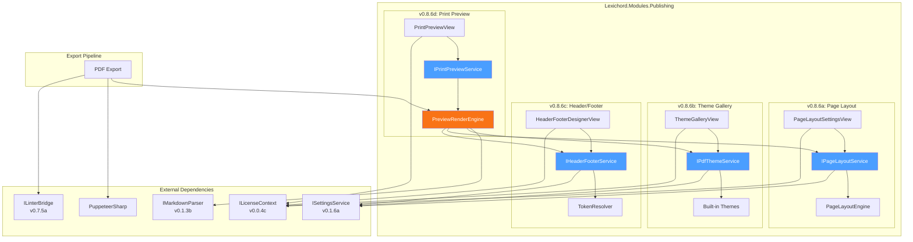
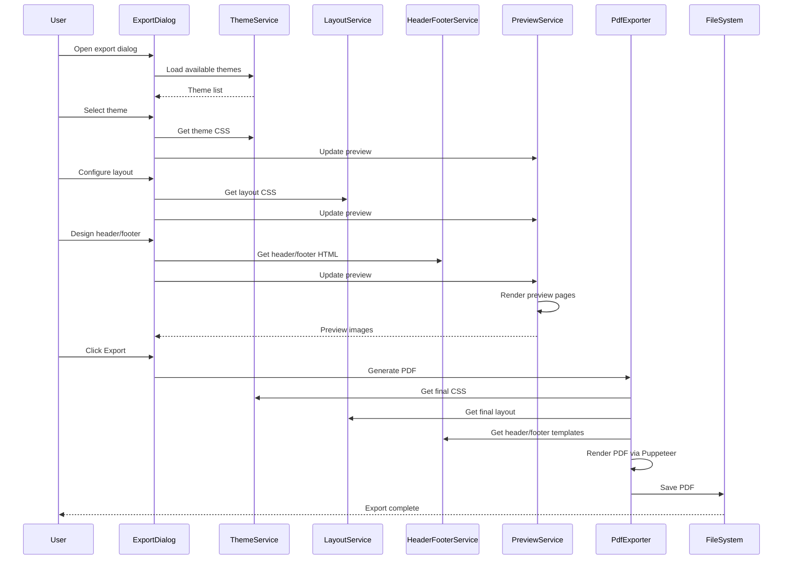

# LCS-DES-086: Design Specification Index — Print Stylesheets

## Document Control

| Field | Value |
| :--- | :--- |
| **Document ID** | LCS-DES-086-INDEX |
| **Feature ID** | PUB-086 |
| **Feature Name** | Print Stylesheets (The Costume Designer) |
| **Target Version** | v0.8.6 |
| **Module Scope** | Lexichord.Modules.Publishing |
| **Swimlane** | Publishing |
| **License Tier** | Writer Pro |
| **Feature Gate Key** | `FeatureFlags.Publishing.PrintStylesheets` |
| **Status** | Draft |
| **Last Updated** | 2026-01-27 |

---

## 1. Executive Summary

**v0.8.6** delivers the **Print Stylesheets** — also known as "The Costume Designer" — enabling PDF-specific styling and branding for professional document export.

### 1.1 The Problem

Lexichord's current PDF export produces functional but unstyled documents:

- No support for corporate branding (logos, colors, typography)
- Fixed page layouts with no margin or column customization
- No headers or footers with page numbers and dates
- No preview capability to verify output before export

Writers must either accept generic output or manually post-process PDFs in external tools, breaking the unified writing workflow.

### 1.2 The Solution

Implement a comprehensive print styling system that:

1. **Theme Gallery** — Pre-built and custom PDF themes for consistent branding
2. **Page Layout Engine** — Configurable margins, columns, and orientation
3. **Header/Footer Designer** — Visual editor with logos, dates, and page numbers
4. **Print Preview** — WYSIWYG preview ensuring export accuracy

### 1.3 Business Value

| Value | Description |
| :--- | :--- |
| **Brand Consistency** | Corporate themes ensure all exports match organizational identity |
| **Professional Output** | Pre-built themes enable immediate publication-ready documents |
| **Layout Control** | Fine-grained margin and column configuration for precise formatting |
| **Preview Confidence** | WYSIWYG preview eliminates export surprises |
| **Productivity** | Reduces manual post-processing and iteration cycles |

---

## 2. Related Documents

### 2.1 Scope Breakdown Document

The detailed scope breakdown for v0.8.6, including all sub-parts, implementation checklists, user stories, and acceptance criteria:

| Document | Description |
| :--- | :--- |
| **[LCS-SBD-086](./LCS-SBD-086.md)** | Scope Breakdown — Print Stylesheets |

### 2.2 Sub-Part Design Specifications

Each sub-part has its own detailed design specification following the LDS-01 template:

| Sub-Part | Document | Title | Description |
| :--- | :--- | :--- | :--- |
| v0.8.6a | **[LCS-DES-086a](./LCS-DES-086a.md)** | Page Layout Engine | Margins, columns, orientation configuration |
| v0.8.6b | **[LCS-DES-086b](./LCS-DES-086b.md)** | Theme Gallery | Pre-built and custom PDF themes |
| v0.8.6c | **[LCS-DES-086c](./LCS-DES-086c.md)** | Header/Footer Designer | Logo, date, page number placement |
| v0.8.6d | **[LCS-DES-086d](./LCS-DES-086d.md)** | Print Preview | WYSIWYG PDF output preview |

---

## 3. Architecture Overview

### 3.1 Component Diagram

### 3.2 Export Pipeline Flow

---

## 4. Dependencies

### 4.1 Upstream Dependencies

| Interface | Source Version | Purpose |
| :--- | :--- | :--- |
| `IMarkdownParser` | v0.1.3b | Markdown to AST conversion |
| `ILinterBridge` | v0.7.5a | Style annotations in PDF |
| `ISettingsService` | v0.1.6a | Configuration persistence |
| `ILicenseContext` | v0.0.4c | Writer Pro feature gating |
| `IMediator` | v0.0.7a | Event publishing |
| `IRegionManager` | v0.1.1b | Panel registration |

### 4.2 NuGet Packages

| Package | Version | Purpose |
| :--- | :--- | :--- |
| `PuppeteerSharp` | 17.x | PDF rendering via Chromium |
| `SixLabors.ImageSharp` | 3.x | Logo image processing (NEW) |
| `SkiaSharp` | 2.88.x | Preview rendering (NEW) |

### 4.3 Downstream Consumers (Future)

| Version | Feature | Uses From v0.8.6 |
| :--- | :--- | :--- |
| v0.8.7 | Documentation Linter | Annotation rendering in preview |
| v0.8.8 | Hardening | Export quality verification tests |
| v0.9.x | Batch Export | Theme application to multiple documents |

---

## 5. License Gating Strategy

Print Stylesheets is a **Writer Pro** feature with the following gating:

| Component | Core Tier | Writer Pro Tier |
| :--- | :--- | :--- |
| Basic PDF export | Available | Available |
| Theme Gallery viewing | Read-only | Full access |
| Theme application | Disabled | Available |
| Page Layout customization | Disabled | Available |
| Header/Footer Designer | Disabled | Available |
| Print Preview | Limited to 1 page | Full document |
| Custom theme creation | Disabled | Available |

**Feature Gate Key:** `FeatureFlags.Publishing.PrintStylesheets`

**UI Behavior for Core Tier:**
- Theme cards show lock icon
- "Upgrade to Writer Pro" tooltip on hover
- Layout controls are grayed out
- Header/Footer Designer tab shows upgrade prompt

---

## 6. Sub-Part Summary

### 6.1 v0.8.6a: Page Layout Engine

**Goal:** Implement the foundational page layout system with margins, columns, and orientation.

| Aspect | Details |
| :--- | :--- |
| Primary Interface | `IPageLayoutService` |
| Key Records | `PageLayoutConfiguration`, `PageMargins`, `ColumnLayout` |
| UI Component | `PageLayoutSettingsView.axaml` |
| Est. Hours | 11.5 |

### 6.2 v0.8.6b: Theme Gallery

**Goal:** Create a visual theme gallery with pre-built and custom PDF themes.

| Aspect | Details |
| :--- | :--- |
| Primary Interface | `IPdfThemeService` |
| Key Records | `PdfTheme`, `ThemeColorPalette`, `ThemeTypography` |
| UI Component | `ThemeGalleryView.axaml` |
| Built-in Themes | Corporate, Academic, Minimal |
| Est. Hours | 17 |

### 6.3 v0.8.6c: Header/Footer Designer

**Goal:** Build a visual designer for headers/footers with logos and dynamic tokens.

| Aspect | Details |
| :--- | :--- |
| Primary Interface | `IHeaderFooterService` |
| Key Records | `HeaderFooterConfiguration`, `HeaderConfiguration`, `FooterConfiguration` |
| UI Component | `HeaderFooterDesignerView.axaml` |
| Dynamic Tokens | `{page}`, `{pages}`, `{date}`, `{title}`, `{author}` |
| Est. Hours | 13.5 |

### 6.4 v0.8.6d: Print Preview

**Goal:** Implement WYSIWYG print preview with zoom, navigation, and accurate rendering.

| Aspect | Details |
| :--- | :--- |
| Primary Interface | `IPrintPreviewService` |
| Key Records | `PrintPreviewRequest`, `PrintPreviewResult`, `PagePreview` |
| UI Component | `PrintPreviewView.axaml` |
| Zoom Range | 25% - 400% |
| Est. Hours | 16 |

---

## 7. Key Interfaces Summary

| Interface | Sub-Part | Purpose |
| :--- | :--- | :--- |
| `IPageLayoutService` | v0.8.6a | Page layout management and CSS generation |
| `IPdfThemeService` | v0.8.6b | Theme management, CRUD, and CSS generation |
| `IHeaderFooterService` | v0.8.6c | Header/footer configuration and token resolution |
| `IPrintPreviewService` | v0.8.6d | Preview generation and PDF export |

---

## 8. Built-in Themes Overview

### 8.1 Corporate Theme

| Aspect | Value |
| :--- | :--- |
| Primary Color | Navy (#1a365d) |
| Typography | Arial headings, Georgia body |
| Layout | A4 portrait, 25mm margins |
| Style | Professional, logo-friendly |

### 8.2 Academic Theme

| Aspect | Value |
| :--- | :--- |
| Primary Color | Black (#000000) |
| Typography | Times New Roman throughout |
| Layout | Letter, 1-inch margins |
| Style | Scholarly, citation-ready |

### 8.3 Minimal Theme

| Aspect | Value |
| :--- | :--- |
| Primary Color | Dark Gray (#2d3748) |
| Typography | System fonts (SF Pro, Segoe UI) |
| Layout | A4 portrait, generous margins |
| Style | Clean, whitespace-focused |

---

## 9. Implementation Checklist Summary

| Sub-Part | Tasks | Est. Hours |
| :--- | :--- | :--- |
| v0.8.6a | Page Layout Engine | 11.5 |
| v0.8.6b | Theme Gallery | 17 |
| v0.8.6c | Header/Footer Designer | 13.5 |
| v0.8.6d | Print Preview | 16 |
| Integration | Tests & DI registration | 4 |
| **Total** | | **62 hours** |

See [LCS-SBD-086](./LCS-SBD-086.md) Section 4 for the detailed task breakdown.

---

## 10. Success Criteria Summary

| Category | Criterion | Target |
| :--- | :--- | :--- |
| **Theme Application** | Theme CSS generation | < 100ms |
| **Preview Rendering** | 10-page preview | < 2s |
| **PDF Export** | 10-page document | < 5s |
| **Memory Usage** | During preview | < 100MB |
| **Accuracy** | Preview vs PDF match | 99%+ pixel accuracy |
| **Token Resolution** | Header/footer tokens | < 10ms |

See [LCS-SBD-086](./LCS-SBD-086.md) Section 9 for full success metrics.

---

## 11. Risks and Mitigations

| Risk | Impact | Mitigation |
| :--- | :--- | :--- |
| Chromium download size | High | Lazy download, shared instance |
| Preview performance | Medium | On-demand rendering, caching |
| Cross-platform fonts | High | Bundle fonts, fallback chain |
| Header/footer positioning | Medium | Extensive page size testing |

See [LCS-SBD-086](./LCS-SBD-086.md) Section 8 for full risk analysis.

---

## 12. What This Enables

| Version | Feature | Uses From v0.8.6 |
| :--- | :--- | :--- |
| v0.8.7 | Documentation Linter | Annotation overlay in preview |
| v0.8.8 | Hardening | Export quality tests |
| v0.9.x | Batch Export | Theme application at scale |
| v1.0.x | Template Library | Shareable theme distribution |

---

## 13. Event Flow

### 13.1 MediatR Events

| Event | Publisher | Subscribers | Description |
| :--- | :--- | :--- | :--- |
| `ThemeSelectedEvent` | ThemeGalleryViewModel | PreviewViewModel | Theme selection changed |
| `LayoutChangedEvent` | PageLayoutViewModel | PreviewViewModel | Layout configuration changed |
| `HeaderFooterChangedEvent` | HeaderFooterViewModel | PreviewViewModel | Header/footer updated |
| `PreviewGeneratedEvent` | PreviewService | ExportDialog | Preview ready for display |
| `PdfExportStartedEvent` | PdfExporter | ProgressIndicator | Export began |
| `PdfExportCompletedEvent` | PdfExporter | ExportDialog | Export finished |
| `PdfExportFailedEvent` | PdfExporter | ErrorHandler | Export error occurred |

---

## 14. Configuration Storage

### 14.1 File Locations

| Configuration | Path |
| :--- | :--- |
| Page Layouts | `{AppData}/Lexichord/Publishing/Layouts/*.json` |
| Custom Themes | `{AppData}/Lexichord/Publishing/Themes/*.json` |
| Header/Footer | `{AppData}/Lexichord/Publishing/HeaderFooter/*.json` |
| Export Preferences | `{AppData}/Lexichord/Settings/export-preferences.json` |

### 14.2 Default Configuration

| Setting | Default Value |
| :--- | :--- |
| Default Theme | Minimal |
| Default Page Size | A4 |
| Default Orientation | Portrait |
| Default Margins | 25mm all sides |
| Show Page Numbers | Yes |
| Preview Auto-refresh | Yes (500ms debounce) |

---

## Document History

| Version | Date | Author | Changes |
| :--- | :--- | :--- | :--- |
| 1.0 | 2026-01-27 | Lead Architect | Initial draft |

---
