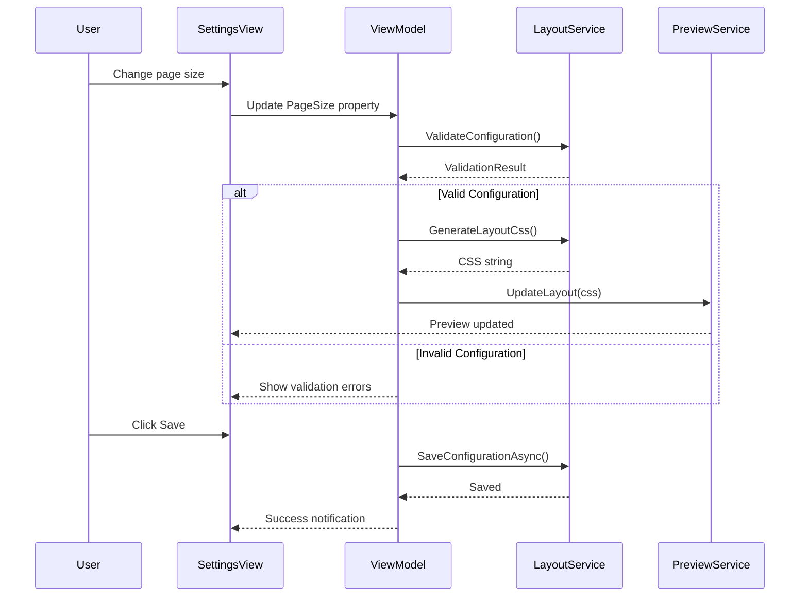

# LCS-DES-086a: Design Specification — Page Layout Engine

## 1. Metadata & Categorization

| Field | Value | Description |
| :--- | :--- | :--- |
| **Feature ID** | `PUB-086a` | Sub-part of PUB-086 |
| **Feature Name** | `Page Layout Engine` | Margins, columns, orientation configuration |
| **Target Version** | `v0.8.6a` | First sub-part of v0.8.6 |
| **Module Scope** | `Lexichord.Modules.Publishing` | Publishing module |
| **Swimlane** | `Publishing` | Part of Publisher vertical |
| **License Tier** | `Writer Pro` | Premium feature |
| **Feature Gate Key** | `FeatureFlags.Publishing.PageLayout` | License check key |
| **Author** | Lead Architect | |
| **Status** | `Draft` | |
| **Last Updated** | `2026-01-27` | |
| **Parent Document** | [LCS-DES-086-INDEX](./LCS-DES-086-INDEX.md) | |
| **Scope Breakdown** | [LCS-SBD-086 Section 3.1](./LCS-SBD-086.md#31-v086a-page-layout-engine) | |

---

## 2. Executive Summary

### 2.1 The Requirement

Technical writers and enterprise teams need precise control over PDF page layout to meet organizational standards and publication requirements. Current PDF export uses fixed layouts that cannot accommodate:

- Custom margin requirements (academic journals, corporate templates)
- Multi-column layouts for newsletters or technical references
- Different page sizes for international standards (A4 vs Letter)
- Binding margins for printed documents

> **Goal:** Enable users to configure page size, orientation, margins, and columns for PDF export, with all settings applied via generated CSS.

### 2.2 The Proposed Solution

Implement a Page Layout Engine that:

1. Defines layout configuration as structured records
2. Generates CSS for page layout using `@page` rules
3. Provides a visual settings UI with live preview
4. Supports standard page sizes (A4, Letter, Legal, A3, A5)
5. Enables multi-column layouts (1-3 columns)
6. Persists user preferences for reuse

---

## 3. Architecture & Modular Strategy

### 3.1 Dependencies

#### 3.1.1 Upstream Dependencies

| Interface | Source Version | Purpose |
| :--- | :--- | :--- |
| `ISettingsService` | v0.1.6a | Persist layout configurations |
| `ILicenseContext` | v0.0.4c | Writer Pro feature gating |
| `IMediator` | v0.0.7a | Event publishing for layout changes |

#### 3.1.2 NuGet Packages

| Package | Version | Purpose |
| :--- | :--- | :--- |
| `CommunityToolkit.Mvvm` | 8.x | ViewModel base classes |
| `Avalonia.Controls` | 11.x | UI components |

### 3.2 Licensing Behavior

**Soft Gate:** The module loads, but layout customization is disabled for non-Writer Pro users.

**Fallback Experience:**
- Layout settings panel shows but controls are disabled
- "Upgrade to Writer Pro" tooltip on hover
- Default A4 portrait layout used for basic export

---

## 4. Data Contract (The API)

### 4.1 Core Interfaces

```csharp
namespace Lexichord.Modules.Publishing.Abstractions;

/// <summary>
/// Service for managing PDF page layout configurations.
/// </summary>
public interface IPageLayoutService
{
    /// <summary>
    /// Gets the default layout configuration.
    /// </summary>
    PageLayoutConfiguration GetDefaultConfiguration();

    /// <summary>
    /// Loads a saved layout configuration by ID.
    /// </summary>
    /// <param name="configurationId">The configuration ID.</param>
    /// <returns>The loaded configuration, or null if not found.</returns>
    PageLayoutConfiguration? LoadConfiguration(string configurationId);

    /// <summary>
    /// Gets all saved layout configurations.
    /// </summary>
    /// <returns>List of all saved configurations.</returns>
    IReadOnlyList<PageLayoutConfiguration> GetAllConfigurations();

    /// <summary>
    /// Saves a layout configuration.
    /// </summary>
    /// <param name="config">The configuration to save.</param>
    /// <param name="ct">Cancellation token.</param>
    Task SaveConfigurationAsync(PageLayoutConfiguration config, CancellationToken ct = default);

    /// <summary>
    /// Deletes a layout configuration.
    /// </summary>
    /// <param name="configurationId">The ID to delete.</param>
    /// <param name="ct">Cancellation token.</param>
    Task DeleteConfigurationAsync(Guid configurationId, CancellationToken ct = default);

    /// <summary>
    /// Generates CSS for the given layout configuration.
    /// </summary>
    /// <param name="config">The layout configuration.</param>
    /// <returns>CSS string for page layout.</returns>
    string GenerateLayoutCss(PageLayoutConfiguration config);

    /// <summary>
    /// Validates a layout configuration.
    /// </summary>
    /// <param name="config">The configuration to validate.</param>
    /// <returns>Validation result with any errors.</returns>
    ValidationResult ValidateConfiguration(PageLayoutConfiguration config);

    /// <summary>
    /// Converts margins between measurement units.
    /// </summary>
    /// <param name="margins">The margins to convert.</param>
    /// <param name="targetUnit">The target unit.</param>
    /// <returns>Converted margins.</returns>
    PageMargins ConvertMargins(PageMargins margins, MeasurementUnit targetUnit);
}
```

### 4.2 Data Records

```csharp
namespace Lexichord.Modules.Publishing.Models;

/// <summary>
/// Complete configuration for PDF page layout.
/// </summary>
public record PageLayoutConfiguration(
    Guid Id,
    string Name,
    PageSize PageSize,
    PageOrientation Orientation,
    PageMargins Margins,
    ColumnLayout Columns,
    bool MirrorMarginsForBinding = false,
    string? CustomCss = null
)
{
    /// <summary>
    /// Gets the effective page width after applying orientation.
    /// </summary>
    public double EffectiveWidthMm => Orientation == PageOrientation.Portrait
        ? PageSizeDimensions.GetWidthMm(PageSize)
        : PageSizeDimensions.GetHeightMm(PageSize);

    /// <summary>
    /// Gets the effective page height after applying orientation.
    /// </summary>
    public double EffectiveHeightMm => Orientation == PageOrientation.Portrait
        ? PageSizeDimensions.GetHeightMm(PageSize)
        : PageSizeDimensions.GetWidthMm(PageSize);

    /// <summary>
    /// Gets the content area width (page width minus margins).
    /// </summary>
    public double ContentWidthMm => EffectiveWidthMm
        - Margins.LeftMm - Margins.RightMm;

    /// <summary>
    /// Gets the content area height (page height minus margins).
    /// </summary>
    public double ContentHeightMm => EffectiveHeightMm
        - Margins.TopMm - Margins.BottomMm;
}

/// <summary>
/// Page size enumeration with standard dimensions.
/// </summary>
public enum PageSize
{
    A4,         // 210 x 297 mm (ISO 216)
    Letter,     // 8.5 x 11 in (215.9 x 279.4 mm)
    Legal,      // 8.5 x 14 in (215.9 x 355.6 mm)
    A3,         // 297 x 420 mm (ISO 216)
    A5,         // 148 x 210 mm (ISO 216)
    Tabloid,    // 11 x 17 in (279.4 x 431.8 mm)
    Custom      // User-defined dimensions
}

/// <summary>
/// Page orientation.
/// </summary>
public enum PageOrientation
{
    Portrait,
    Landscape
}

/// <summary>
/// Page margin configuration with support for multiple units.
/// </summary>
public record PageMargins(
    double Top,
    double Bottom,
    double Left,
    double Right,
    MeasurementUnit Unit = MeasurementUnit.Millimeters
)
{
    /// <summary>
    /// Gets the top margin in millimeters.
    /// </summary>
    public double TopMm => ConvertToMm(Top, Unit);

    /// <summary>
    /// Gets the bottom margin in millimeters.
    /// </summary>
    public double BottomMm => ConvertToMm(Bottom, Unit);

    /// <summary>
    /// Gets the left margin in millimeters.
    /// </summary>
    public double LeftMm => ConvertToMm(Left, Unit);

    /// <summary>
    /// Gets the right margin in millimeters.
    /// </summary>
    public double RightMm => ConvertToMm(Right, Unit);

    /// <summary>
    /// Creates uniform margins.
    /// </summary>
    public static PageMargins Uniform(double value, MeasurementUnit unit = MeasurementUnit.Millimeters)
        => new(value, value, value, value, unit);

    /// <summary>
    /// Creates margins with symmetric vertical and horizontal values.
    /// </summary>
    public static PageMargins Symmetric(double vertical, double horizontal, MeasurementUnit unit = MeasurementUnit.Millimeters)
        => new(vertical, vertical, horizontal, horizontal, unit);

    private static double ConvertToMm(double value, MeasurementUnit unit) => unit switch
    {
        MeasurementUnit.Millimeters => value,
        MeasurementUnit.Inches => value * 25.4,
        MeasurementUnit.Points => value * 0.352778,
        _ => value
    };
}

/// <summary>
/// Measurement unit for margins.
/// </summary>
public enum MeasurementUnit
{
    Millimeters,
    Inches,
    Points
}

/// <summary>
/// Multi-column layout configuration.
/// </summary>
public record ColumnLayout(
    int ColumnCount,
    double GutterWidth,
    bool BalanceColumns = true,
    MeasurementUnit GutterUnit = MeasurementUnit.Millimeters
)
{
    /// <summary>
    /// Single column layout (default).
    /// </summary>
    public static ColumnLayout Single => new(1, 0);

    /// <summary>
    /// Two-column layout with standard gutter.
    /// </summary>
    public static ColumnLayout TwoColumn => new(2, 10, true);

    /// <summary>
    /// Three-column layout with standard gutter.
    /// </summary>
    public static ColumnLayout ThreeColumn => new(3, 8, true);

    /// <summary>
    /// Gets the gutter width in millimeters.
    /// </summary>
    public double GutterWidthMm => GutterUnit switch
    {
        MeasurementUnit.Millimeters => GutterWidth,
        MeasurementUnit.Inches => GutterWidth * 25.4,
        MeasurementUnit.Points => GutterWidth * 0.352778,
        _ => GutterWidth
    };
}

/// <summary>
/// Static helper for page size dimensions.
/// </summary>
public static class PageSizeDimensions
{
    public static double GetWidthMm(PageSize size) => size switch
    {
        PageSize.A4 => 210,
        PageSize.Letter => 215.9,
        PageSize.Legal => 215.9,
        PageSize.A3 => 297,
        PageSize.A5 => 148,
        PageSize.Tabloid => 279.4,
        _ => 210
    };

    public static double GetHeightMm(PageSize size) => size switch
    {
        PageSize.A4 => 297,
        PageSize.Letter => 279.4,
        PageSize.Legal => 355.6,
        PageSize.A3 => 420,
        PageSize.A5 => 210,
        PageSize.Tabloid => 431.8,
        _ => 297
    };

    public static string GetDisplayName(PageSize size) => size switch
    {
        PageSize.A4 => "A4 (210 x 297 mm)",
        PageSize.Letter => "Letter (8.5 x 11 in)",
        PageSize.Legal => "Legal (8.5 x 14 in)",
        PageSize.A3 => "A3 (297 x 420 mm)",
        PageSize.A5 => "A5 (148 x 210 mm)",
        PageSize.Tabloid => "Tabloid (11 x 17 in)",
        PageSize.Custom => "Custom",
        _ => "Unknown"
    };
}

/// <summary>
/// Validation result for layout configuration.
/// </summary>
public record ValidationResult(
    bool IsValid,
    IReadOnlyList<ValidationError> Errors
)
{
    public static ValidationResult Success => new(true, Array.Empty<ValidationError>());

    public static ValidationResult Failure(params ValidationError[] errors)
        => new(false, errors);
}

/// <summary>
/// A single validation error.
/// </summary>
public record ValidationError(
    string Field,
    string Message,
    ValidationSeverity Severity = ValidationSeverity.Error
);

/// <summary>
/// Validation error severity.
/// </summary>
public enum ValidationSeverity
{
    Warning,
    Error
}
```

---

## 5. Implementation Logic

### 5.1 CSS Generation

The Page Layout Engine generates CSS using `@page` rules for print media:

```csharp
public class PageLayoutEngine : IPageLayoutService
{
    public string GenerateLayoutCss(PageLayoutConfiguration config)
    {
        var sb = new StringBuilder();

        // Page size and orientation
        sb.AppendLine("@page {");
        sb.AppendLine($"  size: {config.EffectiveWidthMm}mm {config.EffectiveHeightMm}mm;");

        // Margins
        if (config.MirrorMarginsForBinding)
        {
            // Different margins for odd/even pages
            sb.AppendLine($"  margin-top: {config.Margins.TopMm}mm;");
            sb.AppendLine($"  margin-bottom: {config.Margins.BottomMm}mm;");
            sb.AppendLine("}");

            sb.AppendLine("@page :left {");
            sb.AppendLine($"  margin-left: {config.Margins.RightMm}mm;");
            sb.AppendLine($"  margin-right: {config.Margins.LeftMm}mm;");
            sb.AppendLine("}");

            sb.AppendLine("@page :right {");
            sb.AppendLine($"  margin-left: {config.Margins.LeftMm}mm;");
            sb.AppendLine($"  margin-right: {config.Margins.RightMm}mm;");
            sb.AppendLine("}");
        }
        else
        {
            sb.AppendLine($"  margin: {config.Margins.TopMm}mm {config.Margins.RightMm}mm {config.Margins.BottomMm}mm {config.Margins.LeftMm}mm;");
            sb.AppendLine("}");
        }

        // Multi-column layout
        if (config.Columns.ColumnCount > 1)
        {
            sb.AppendLine(".content-body {");
            sb.AppendLine($"  column-count: {config.Columns.ColumnCount};");
            sb.AppendLine($"  column-gap: {config.Columns.GutterWidthMm}mm;");

            if (config.Columns.BalanceColumns)
            {
                sb.AppendLine("  column-fill: balance;");
            }
            else
            {
                sb.AppendLine("  column-fill: auto;");
            }

            sb.AppendLine("}");

            // Prevent orphans and widows
            sb.AppendLine(".content-body p {");
            sb.AppendLine("  orphans: 3;");
            sb.AppendLine("  widows: 3;");
            sb.AppendLine("}");

            // Keep headings with following content
            sb.AppendLine(".content-body h1, .content-body h2, .content-body h3 {");
            sb.AppendLine("  break-after: avoid;");
            sb.AppendLine("}");
        }

        // Custom CSS override
        if (!string.IsNullOrWhiteSpace(config.CustomCss))
        {
            sb.AppendLine("/* Custom CSS */");
            sb.AppendLine(config.CustomCss);
        }

        return sb.ToString();
    }
}
```

### 5.2 Validation Logic

```text
VALIDATE Layout Configuration:
│
├── Page Size
│   ├── If Custom → Validate custom dimensions provided
│   └── If Standard → Accept as valid
│
├── Margins
│   ├── All values >= 0?
│   │   └── NO → Error: "Margins cannot be negative"
│   ├── Left + Right < Page Width?
│   │   └── NO → Error: "Horizontal margins exceed page width"
│   ├── Top + Bottom < Page Height?
│   │   └── NO → Error: "Vertical margins exceed page height"
│   └── Content area >= 50mm in both dimensions?
│       └── NO → Warning: "Content area may be too small"
│
├── Columns
│   ├── ColumnCount in [1, 3]?
│   │   └── NO → Error: "Column count must be 1-3"
│   ├── If ColumnCount > 1, GutterWidth > 0?
│   │   └── NO → Warning: "Gutter width should be > 0 for multi-column"
│   └── Content width / ColumnCount >= 40mm?
│       └── NO → Warning: "Columns may be too narrow"
│
└── Return ValidationResult
```

### 5.3 Flow Diagram



---

## 6. Data Persistence

### 6.1 Storage Format

```json
{
  "id": "3fa85f64-5717-4562-b3fc-2c963f66afa6",
  "name": "Corporate Standard",
  "pageSize": "A4",
  "orientation": "Portrait",
  "margins": {
    "top": 25,
    "bottom": 25,
    "left": 20,
    "right": 20,
    "unit": "Millimeters"
  },
  "columns": {
    "columnCount": 1,
    "gutterWidth": 10,
    "balanceColumns": true,
    "gutterUnit": "Millimeters"
  },
  "mirrorMarginsForBinding": false,
  "customCss": null
}
```

### 6.2 Storage Location

- Windows: `%APPDATA%/Lexichord/Publishing/Layouts/{id}.json`
- macOS: `~/Library/Application Support/Lexichord/Publishing/Layouts/{id}.json`
- Linux: `~/.config/Lexichord/Publishing/Layouts/{id}.json`

---

## 7. UI/UX Specifications

### 7.1 Layout Settings Panel

```text
+------------------------------------------------------------------+
|  Page Layout                                   [Save As] [Reset]  |
+------------------------------------------------------------------+
| Saved Layouts: [Corporate Standard    v]  [Load] [Delete]         |
+------------------------------------------------------------------+
| Page Size                                                         |
| +--------------------------------------------------------------+ |
| | [A4 (210 x 297 mm)              v]                           | |
| +--------------------------------------------------------------+ |
| Orientation                                                       |
| +--------------------------------------------------------------+ |
| | (o) Portrait    ( ) Landscape                                | |
| +--------------------------------------------------------------+ |
+------------------------------------------------------------------+
| Margins                                           Unit: [mm   v]  |
| +--------------------------------------------------------------+ |
| |    Top:    [ 25      ]                                       | |
| |                                                              | |
| | Left       +------------------+       Right                  | |
| | [ 20    ]  |                  |       [ 20    ]              | |
| |            |   Page Preview   |                              | |
| |            |                  |                              | |
| |            +------------------+                              | |
| |                                                              | |
| |    Bottom: [ 25      ]                                       | |
| +--------------------------------------------------------------+ |
| [ ] Mirror margins for binding (different left/right on odd/even)|
+------------------------------------------------------------------+
| Columns                                                           |
| +--------------------------------------------------------------+ |
| | [ 1 ]  [ 2 ]  [ 3 ]                                          | |
| |                                                              | |
| | Gutter Width: [ 10     ] mm                                  | |
| | [x] Balance columns                                          | |
| +--------------------------------------------------------------+ |
+------------------------------------------------------------------+
| Content Area: 170mm x 247mm (A4 with current margins)             |
+------------------------------------------------------------------+
```

### 7.2 Visual Mini-Preview

The settings panel includes a miniature page preview that updates in real-time:

```text
Page Preview (scaled):
+------------------+
|   |  margin  |   |
|---+----------+---|
|   |          |   |
| m |  content | m |
| a |   area   | a |
| r |          | r |
| g |          | g |
|   |          |   |
|---+----------+---|
|   |  margin  |   |
+------------------+
```

### 7.3 Component Styling

| Component | Theme Resource | Notes |
| :--- | :--- | :--- |
| Dropdown (Page Size) | `LexDropdown` | Full width |
| RadioButton (Orientation) | `LexRadioButton` | Horizontal group |
| NumericUpDown (Margins) | `LexNumericInput` | Min 0, Max page size |
| ToggleButton (Columns) | `LexToggleButtonGroup` | Exclusive selection |
| Checkbox | `LexCheckbox` | Standard styling |
| Preview Panel | `LexPreviewPanel` | Light border, centered |

---

## 8. Observability & Logging

| Level | Source | Message Template |
| :--- | :--- | :--- |
| Debug | PageLayoutEngine | `"Generating CSS for layout: {LayoutName} ({PageSize} {Orientation})"` |
| Debug | PageLayoutEngine | `"CSS generated: {CssLength} characters"` |
| Info | PageLayoutService | `"Layout configuration saved: {LayoutName} (ID: {LayoutId})"` |
| Info | PageLayoutService | `"Layout configuration loaded: {LayoutName}"` |
| Warning | PageLayoutService | `"Layout validation warning: {Warning}"` |
| Error | PageLayoutService | `"Layout validation failed: {Errors}"` |

---

## 9. Security & Safety

| Risk | Level | Mitigation |
| :--- | :--- | :--- |
| Custom CSS injection | Medium | Sanitize custom CSS, limit allowed properties |
| Invalid margin values | Low | Server-side validation before PDF generation |
| Large file storage | Low | Limit saved layouts per user |

**Custom CSS Sanitization:**
- Allow only layout-related properties (`margin`, `padding`, `column-*`, `page-break-*`)
- Strip any `url()` references
- Reject JavaScript or expressions

---

## 10. Acceptance Criteria

### 10.1 Functional Criteria

| # | Given | When | Then |
| :--- | :--- | :--- | :--- |
| 1 | Default configuration | Loading settings | A4 portrait with 25mm margins |
| 2 | Page size dropdown | Selecting Letter | Page dimensions update to 215.9 x 279.4 mm |
| 3 | Orientation toggle | Selecting Landscape | Width and height swap |
| 4 | Margin input | Setting 30mm top margin | CSS `@page { margin-top: 30mm }` generated |
| 5 | Column selector | Selecting 2 columns | CSS `column-count: 2` generated |
| 6 | Balance columns checkbox | Unchecking | CSS `column-fill: auto` generated |
| 7 | Mirror margins checkbox | Checking | CSS `:left` and `:right` page rules generated |
| 8 | Invalid margins (>page) | Setting left+right > width | Validation error displayed |
| 9 | Save button | Clicking Save | Configuration persisted to file |
| 10 | Load dropdown | Selecting saved config | Settings populated from saved values |

### 10.2 License Criteria

| # | Given | When | Then |
| :--- | :--- | :--- | :--- |
| 11 | Core license user | Opening layout settings | Controls disabled with upgrade tooltip |
| 12 | Writer Pro user | Opening layout settings | Full functionality available |

---

## 11. Test Scenarios

### 11.1 Unit Tests

```csharp
[Trait("Category", "Unit")]
[Trait("Version", "v0.8.6a")]
public class PageLayoutEngineTests
{
    private readonly PageLayoutEngine _sut = new();

    #region Page Dimension Tests

    [Theory]
    [InlineData(PageSize.A4, PageOrientation.Portrait, 210, 297)]
    [InlineData(PageSize.A4, PageOrientation.Landscape, 297, 210)]
    [InlineData(PageSize.Letter, PageOrientation.Portrait, 215.9, 279.4)]
    [InlineData(PageSize.Letter, PageOrientation.Landscape, 279.4, 215.9)]
    [InlineData(PageSize.Legal, PageOrientation.Portrait, 215.9, 355.6)]
    public void GenerateLayoutCss_PageDimensions_IncludesCorrectSize(
        PageSize size, PageOrientation orientation,
        double expectedWidth, double expectedHeight)
    {
        // Arrange
        var config = CreateConfig(size, orientation);

        // Act
        var css = _sut.GenerateLayoutCss(config);

        // Assert
        css.Should().Contain($"size: {expectedWidth}mm {expectedHeight}mm");
    }

    #endregion

    #region Margin Tests

    [Fact]
    public void GenerateLayoutCss_UniformMargins_SingleMarginRule()
    {
        // Arrange
        var config = CreateConfig(margins: PageMargins.Uniform(25));

        // Act
        var css = _sut.GenerateLayoutCss(config);

        // Assert
        css.Should().Contain("margin: 25mm 25mm 25mm 25mm");
    }

    [Fact]
    public void GenerateLayoutCss_AsymmetricMargins_CorrectOrder()
    {
        // Arrange
        var margins = new PageMargins(10, 20, 30, 40);
        var config = CreateConfig(margins: margins);

        // Act
        var css = _sut.GenerateLayoutCss(config);

        // Assert
        css.Should().Contain("margin: 10mm 40mm 20mm 30mm");
    }

    [Fact]
    public void GenerateLayoutCss_MirrorMargins_LeftRightPageRules()
    {
        // Arrange
        var margins = new PageMargins(25, 25, 30, 20);
        var config = CreateConfig(margins: margins, mirrorMargins: true);

        // Act
        var css = _sut.GenerateLayoutCss(config);

        // Assert
        css.Should().Contain("@page :left");
        css.Should().Contain("@page :right");
        css.Should().Contain("margin-left: 20mm"); // :left gets right margin
        css.Should().Contain("margin-left: 30mm"); // :right gets left margin
    }

    #endregion

    #region Column Tests

    [Theory]
    [InlineData(1, false)]
    [InlineData(2, true)]
    [InlineData(3, true)]
    public void GenerateLayoutCss_ColumnCount_IncludesColumnRule(
        int columnCount, bool expectColumnRule)
    {
        // Arrange
        var columns = new ColumnLayout(columnCount, 10);
        var config = CreateConfig(columns: columns);

        // Act
        var css = _sut.GenerateLayoutCss(config);

        // Assert
        if (expectColumnRule)
        {
            css.Should().Contain($"column-count: {columnCount}");
        }
        else
        {
            css.Should().NotContain("column-count:");
        }
    }

    [Fact]
    public void GenerateLayoutCss_TwoColumnsWithGutter_IncludesGap()
    {
        // Arrange
        var columns = new ColumnLayout(2, 15);
        var config = CreateConfig(columns: columns);

        // Act
        var css = _sut.GenerateLayoutCss(config);

        // Assert
        css.Should().Contain("column-gap: 15mm");
    }

    [Theory]
    [InlineData(true, "balance")]
    [InlineData(false, "auto")]
    public void GenerateLayoutCss_BalanceColumns_CorrectFill(
        bool balance, string expectedFill)
    {
        // Arrange
        var columns = new ColumnLayout(2, 10, balance);
        var config = CreateConfig(columns: columns);

        // Act
        var css = _sut.GenerateLayoutCss(config);

        // Assert
        css.Should().Contain($"column-fill: {expectedFill}");
    }

    #endregion

    #region Validation Tests

    [Fact]
    public void ValidateConfiguration_ValidConfig_ReturnsSuccess()
    {
        // Arrange
        var config = CreateConfig();

        // Act
        var result = _sut.ValidateConfiguration(config);

        // Assert
        result.IsValid.Should().BeTrue();
        result.Errors.Should().BeEmpty();
    }

    [Fact]
    public void ValidateConfiguration_NegativeMargin_ReturnsError()
    {
        // Arrange
        var margins = new PageMargins(-5, 25, 20, 20);
        var config = CreateConfig(margins: margins);

        // Act
        var result = _sut.ValidateConfiguration(config);

        // Assert
        result.IsValid.Should().BeFalse();
        result.Errors.Should().Contain(e => e.Field == "Margins.Top");
    }

    [Fact]
    public void ValidateConfiguration_MarginsExceedPageWidth_ReturnsError()
    {
        // Arrange - A4 is 210mm wide
        var margins = new PageMargins(25, 25, 110, 110); // 220mm total horizontal
        var config = CreateConfig(PageSize.A4, margins: margins);

        // Act
        var result = _sut.ValidateConfiguration(config);

        // Assert
        result.IsValid.Should().BeFalse();
        result.Errors.Should().Contain(e =>
            e.Message.Contains("exceed page width"));
    }

    [Fact]
    public void ValidateConfiguration_SmallContentArea_ReturnsWarning()
    {
        // Arrange - Very large margins leaving small content area
        var margins = new PageMargins(130, 130, 90, 90); // Leaves tiny area
        var config = CreateConfig(PageSize.A4, margins: margins);

        // Act
        var result = _sut.ValidateConfiguration(config);

        // Assert
        result.Errors.Should().Contain(e =>
            e.Severity == ValidationSeverity.Warning &&
            e.Message.Contains("too small"));
    }

    #endregion

    #region Helper Methods

    private static PageLayoutConfiguration CreateConfig(
        PageSize size = PageSize.A4,
        PageOrientation orientation = PageOrientation.Portrait,
        PageMargins? margins = null,
        ColumnLayout? columns = null,
        bool mirrorMargins = false)
    {
        return new PageLayoutConfiguration(
            Guid.NewGuid(),
            "Test Layout",
            size,
            orientation,
            margins ?? PageMargins.Uniform(25),
            columns ?? ColumnLayout.Single,
            mirrorMargins
        );
    }

    #endregion
}
```

### 11.2 Integration Tests

```csharp
[Trait("Category", "Integration")]
[Trait("Version", "v0.8.6a")]
public class PageLayoutServiceIntegrationTests
{
    [Fact]
    public async Task SaveAndLoadConfiguration_RoundTrip_PreservesValues()
    {
        // Arrange
        var service = CreateService();
        var original = new PageLayoutConfiguration(
            Guid.NewGuid(),
            "Integration Test",
            PageSize.Letter,
            PageOrientation.Landscape,
            new PageMargins(15, 15, 25, 25, MeasurementUnit.Millimeters),
            new ColumnLayout(2, 12, true),
            true
        );

        // Act
        await service.SaveConfigurationAsync(original);
        var loaded = service.LoadConfiguration(original.Id.ToString());

        // Assert
        loaded.Should().NotBeNull();
        loaded!.Name.Should().Be(original.Name);
        loaded.PageSize.Should().Be(original.PageSize);
        loaded.Orientation.Should().Be(original.Orientation);
        loaded.Margins.Should().BeEquivalentTo(original.Margins);
        loaded.Columns.Should().BeEquivalentTo(original.Columns);
        loaded.MirrorMarginsForBinding.Should().Be(original.MirrorMarginsForBinding);
    }
}
```

---

## 12. Deliverable Checklist

| # | Deliverable | Status |
| :--- | :--- | :--- |
| 1 | `IPageLayoutService` interface | [ ] |
| 2 | `PageLayoutConfiguration` record | [ ] |
| 3 | `PageMargins` record with unit conversion | [ ] |
| 4 | `ColumnLayout` record | [ ] |
| 5 | `PageLayoutEngine` implementation | [ ] |
| 6 | CSS generation for `@page` rules | [ ] |
| 7 | CSS generation for multi-column | [ ] |
| 8 | Mirror margins for binding support | [ ] |
| 9 | `PageLayoutSettingsView.axaml` | [ ] |
| 10 | `PageLayoutSettingsViewModel` | [ ] |
| 11 | Mini-preview component | [ ] |
| 12 | Configuration validation | [ ] |
| 13 | Configuration persistence | [ ] |
| 14 | Unit tests for CSS generation | [ ] |
| 15 | Unit tests for validation | [ ] |
| 16 | Integration tests for persistence | [ ] |

---

## 13. Verification Commands

```bash
# Run all Page Layout Engine tests
dotnet test --filter "Version=v0.8.6a" --logger "console;verbosity=detailed"

# Run only CSS generation tests
dotnet test --filter "FullyQualifiedName~PageLayoutEngineTests"

# Run only validation tests
dotnet test --filter "FullyQualifiedName~ValidateConfiguration"

# Run with coverage
dotnet test --filter "Version=v0.8.6a" --collect:"XPlat Code Coverage"
```

---

## Document History

| Version | Date | Author | Changes |
| :--- | :--- | :--- | :--- |
| 1.0 | 2026-01-27 | Lead Architect | Initial draft |

---
