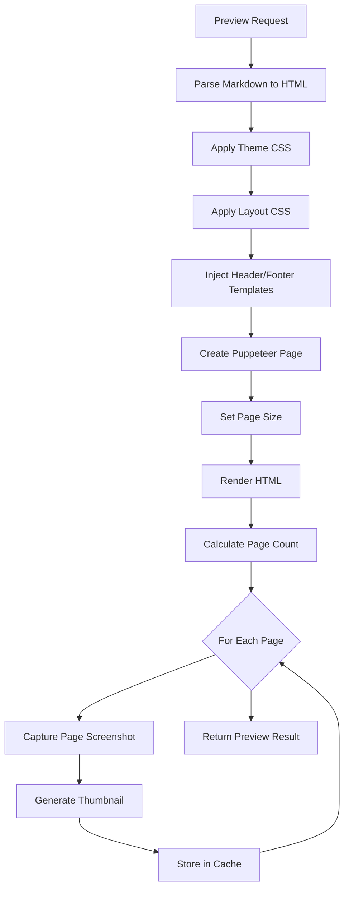
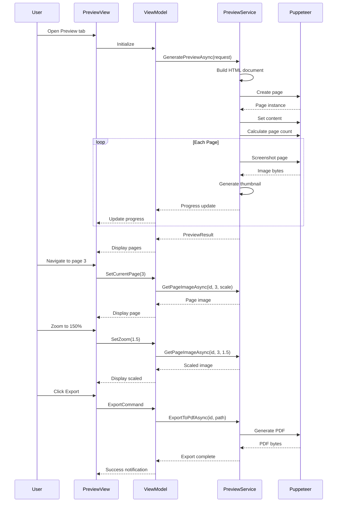

# LCS-DES-086d: Design Specification — Print Preview

## 1. Metadata & Categorization

| Field | Value | Description |
| :--- | :--- | :--- |
| **Feature ID** | `PUB-086d` | Sub-part of PUB-086 |
| **Feature Name** | `Print Preview` | WYSIWYG PDF output preview |
| **Target Version** | `v0.8.6d` | Fourth sub-part of v0.8.6 |
| **Module Scope** | `Lexichord.Modules.Publishing` | Publishing module |
| **Swimlane** | `Publishing` | Part of Publisher vertical |
| **License Tier** | `Writer Pro` | Premium feature |
| **Feature Gate Key** | `FeatureFlags.Publishing.PrintPreview` | License check key |
| **Author** | Lead Architect | |
| **Status** | `Draft` | |
| **Last Updated** | `2026-01-27` | |
| **Parent Document** | [LCS-DES-086-INDEX](./LCS-DES-086-INDEX.md) | |
| **Scope Breakdown** | [LCS-SBD-086 Section 3.4](./LCS-SBD-086.md#34-v086d-print-preview) | |

---

## 2. Executive Summary

### 2.1 The Requirement

Writers need to verify how their documents will appear in the final PDF before export. Currently:

- No preview capability exists
- Export iterations are required to verify formatting
- Theme and layout changes cannot be previewed
- Pagination surprises occur at export time

> **Goal:** Implement a WYSIWYG print preview that accurately displays the final PDF output, including themes, headers/footers, and pagination.

### 2.2 The Proposed Solution

Implement a Print Preview system that:

1. Renders accurate page representations matching final PDF output
2. Provides zoom controls (25% - 400%) for detail inspection
3. Shows page thumbnails for quick navigation
4. Updates in real-time when configuration changes
5. Enables direct PDF export from preview

---

## 3. Architecture & Modular Strategy

### 3.1 Dependencies

#### 3.1.1 Upstream Dependencies

| Interface | Source Version | Purpose |
| :--- | :--- | :--- |
| `IPageLayoutService` | v0.8.6a | Page layout configuration |
| `IPdfThemeService` | v0.8.6b | Theme CSS generation |
| `IHeaderFooterService` | v0.8.6c | Header/footer rendering |
| `IMarkdownParser` | v0.1.3b | Markdown to HTML conversion |
| `ILinterBridge` | v0.7.5a | Style annotations |
| `ILicenseContext` | v0.0.4c | Writer Pro feature gating |
| `IMediator` | v0.0.7a | Preview events |

#### 3.1.2 NuGet Packages

| Package | Version | Purpose |
| :--- | :--- | :--- |
| `PuppeteerSharp` | 17.x | Page rendering via Chromium |
| `SkiaSharp` | 2.88.x | Image manipulation |
| `CommunityToolkit.Mvvm` | 8.x | ViewModel base classes |

### 3.2 Licensing Behavior

**Soft Gate:** Core users see limited preview (first page only).

**Fallback Experience:**
- Core: First page preview only, "Upgrade" prompt for more
- Writer Pro: Full document preview with all features

---

## 4. Data Contract (The API)

### 4.1 Core Interfaces

```csharp
namespace Lexichord.Modules.Publishing.Abstractions;

/// <summary>
/// Service for generating and managing print previews.
/// </summary>
public interface IPrintPreviewService : IDisposable
{
    /// <summary>
    /// Generates a complete preview of the document.
    /// </summary>
    /// <param name="request">Preview request details.</param>
    /// <param name="progress">Progress callback.</param>
    /// <param name="ct">Cancellation token.</param>
    /// <returns>Preview result with rendered pages.</returns>
    Task<PrintPreviewResult> GeneratePreviewAsync(
        PrintPreviewRequest request,
        IProgress<PreviewProgress>? progress = null,
        CancellationToken ct = default);

    /// <summary>
    /// Gets a specific page image at the requested scale.
    /// </summary>
    /// <param name="previewId">The preview ID.</param>
    /// <param name="pageNumber">Page number (1-indexed).</param>
    /// <param name="scale">Scale factor (1.0 = 100%).</param>
    /// <param name="ct">Cancellation token.</param>
    /// <returns>Page image as stream.</returns>
    Task<Stream> GetPageImageAsync(
        Guid previewId,
        int pageNumber,
        double scale = 1.0,
        CancellationToken ct = default);

    /// <summary>
    /// Gets a thumbnail image for a page.
    /// </summary>
    /// <param name="previewId">The preview ID.</param>
    /// <param name="pageNumber">Page number (1-indexed).</param>
    /// <param name="ct">Cancellation token.</param>
    /// <returns>Thumbnail image as base64.</returns>
    Task<string> GetThumbnailAsync(
        Guid previewId,
        int pageNumber,
        CancellationToken ct = default);

    /// <summary>
    /// Exports the preview to PDF.
    /// </summary>
    /// <param name="previewId">The preview ID.</param>
    /// <param name="outputPath">Output file path.</param>
    /// <param name="progress">Progress callback.</param>
    /// <param name="ct">Cancellation token.</param>
    Task ExportToPdfAsync(
        Guid previewId,
        string outputPath,
        IProgress<ExportProgress>? progress = null,
        CancellationToken ct = default);

    /// <summary>
    /// Exports the preview to PDF and returns bytes.
    /// </summary>
    /// <param name="previewId">The preview ID.</param>
    /// <param name="ct">Cancellation token.</param>
    /// <returns>PDF file as byte array.</returns>
    Task<byte[]> ExportToPdfBytesAsync(
        Guid previewId,
        CancellationToken ct = default);

    /// <summary>
    /// Disposes a preview and releases resources.
    /// </summary>
    /// <param name="previewId">The preview ID.</param>
    void DisposePreview(Guid previewId);

    /// <summary>
    /// Gets preview metadata without regenerating.
    /// </summary>
    /// <param name="previewId">The preview ID.</param>
    /// <returns>Preview metadata, or null if not found.</returns>
    PreviewMetadata? GetPreviewMetadata(Guid previewId);
}
```

### 4.2 Data Records

```csharp
namespace Lexichord.Modules.Publishing.Models;

/// <summary>
/// Request for generating a print preview.
/// </summary>
public record PrintPreviewRequest(
    string DocumentPath,
    string DocumentContent,
    PdfTheme Theme,
    PageLayoutConfiguration Layout,
    HeaderFooterConfiguration? HeaderFooter,
    PreviewOptions Options
);

/// <summary>
/// Options for preview generation.
/// </summary>
public record PreviewOptions(
    bool ShowAnnotations = false,
    bool ShowPageBoundaries = true,
    bool ShowNonPrintableArea = true,
    int MaxPagesToRender = 100,
    double DefaultZoom = 1.0,
    int ThumbnailWidth = 120
);

/// <summary>
/// Result of preview generation.
/// </summary>
public record PrintPreviewResult(
    Guid PreviewId,
    int TotalPages,
    PageDimensions PageDimensions,
    IReadOnlyList<PageInfo> Pages,
    TimeSpan RenderTime,
    PreviewStatus Status,
    string? ErrorMessage = null
);

/// <summary>
/// Page dimensions.
/// </summary>
public record PageDimensions(
    double WidthMm,
    double HeightMm,
    int WidthPixels,
    int HeightPixels,
    double Dpi
);

/// <summary>
/// Information about a single preview page.
/// </summary>
public record PageInfo(
    int PageNumber,
    bool IsRendered,
    string? ThumbnailBase64,
    IReadOnlyList<PageAnnotation>? Annotations
);

/// <summary>
/// An annotation on a page (e.g., style violation).
/// </summary>
public record PageAnnotation(
    double X,
    double Y,
    double Width,
    double Height,
    string Text,
    AnnotationType Type,
    AnnotationSeverity Severity
);

/// <summary>
/// Annotation type.
/// </summary>
public enum AnnotationType
{
    StyleViolation,
    Comment,
    Highlight,
    Suggestion,
    Warning
}

/// <summary>
/// Annotation severity.
/// </summary>
public enum AnnotationSeverity
{
    Info,
    Warning,
    Error
}

/// <summary>
/// Preview generation status.
/// </summary>
public enum PreviewStatus
{
    Pending,
    Rendering,
    Complete,
    Error,
    Cancelled,
    PartiallyComplete
}

/// <summary>
/// Preview metadata for quick access.
/// </summary>
public record PreviewMetadata(
    Guid PreviewId,
    int TotalPages,
    PageDimensions Dimensions,
    DateTime GeneratedAt,
    PreviewStatus Status
);

/// <summary>
/// Progress update for preview generation.
/// </summary>
public record PreviewProgress(
    int CurrentPage,
    int TotalPages,
    string StatusMessage,
    double PercentComplete
);

/// <summary>
/// Progress update for PDF export.
/// </summary>
public record ExportProgress(
    ExportPhase Phase,
    double PercentComplete,
    string StatusMessage
);

/// <summary>
/// Export phases.
/// </summary>
public enum ExportPhase
{
    Preparing,
    RenderingPages,
    CombiningPages,
    WritingFile,
    Complete
}
```

---

## 5. Implementation Logic

### 5.1 Preview Rendering Pipeline



### 5.2 Preview Engine Implementation

```csharp
public class PrintPreviewEngine : IPrintPreviewService
{
    private readonly IMarkdownParser _markdownParser;
    private readonly IPdfThemeService _themeService;
    private readonly IPageLayoutService _layoutService;
    private readonly IHeaderFooterService _headerFooterService;
    private readonly ILogger<PrintPreviewEngine> _logger;

    private static readonly Lazy<Task<IBrowser>> _browserLazy =
        new(InitializeBrowserAsync);

    private readonly ConcurrentDictionary<Guid, PreviewCache> _previewCache = new();

    public async Task<PrintPreviewResult> GeneratePreviewAsync(
        PrintPreviewRequest request,
        IProgress<PreviewProgress>? progress = null,
        CancellationToken ct = default)
    {
        var previewId = Guid.NewGuid();
        var stopwatch = Stopwatch.StartNew();

        try
        {
            progress?.Report(new PreviewProgress(0, 0, "Preparing content...", 0));

            // 1. Convert Markdown to HTML
            var html = await BuildHtmlDocumentAsync(request, ct);

            // 2. Initialize browser and page
            var browser = await _browserLazy.Value;
            await using var page = await browser.NewPageAsync();

            // 3. Set page size
            var pageWidth = request.Layout.EffectiveWidthMm;
            var pageHeight = request.Layout.EffectiveHeightMm;

            await page.SetViewportAsync(new ViewPortOptions
            {
                Width = (int)(pageWidth * 3.7795), // mm to pixels at 96 DPI
                Height = (int)(pageHeight * 3.7795)
            });

            // 4. Load content
            await page.SetContentAsync(html, new NavigationOptions
            {
                WaitUntil = new[] { WaitUntilNavigation.Load }
            });

            // 5. Calculate total pages
            var totalPages = await CalculatePageCountAsync(page, pageHeight);
            totalPages = Math.Min(totalPages, request.Options.MaxPagesToRender);

            progress?.Report(new PreviewProgress(0, totalPages, "Rendering pages...", 10));

            // 6. Render each page
            var pages = new List<PageInfo>();
            var cache = new PreviewCache(previewId, html, request);

            for (int i = 1; i <= totalPages; i++)
            {
                ct.ThrowIfCancellationRequested();

                var pageImage = await CapturePageAsync(page, i, pageHeight);
                var thumbnail = GenerateThumbnail(pageImage, request.Options.ThumbnailWidth);

                pages.Add(new PageInfo(i, true, thumbnail, null));
                cache.PageImages[i] = pageImage;

                progress?.Report(new PreviewProgress(
                    i, totalPages,
                    $"Rendered page {i} of {totalPages}",
                    10 + (80.0 * i / totalPages)));
            }

            _previewCache[previewId] = cache;

            stopwatch.Stop();
            progress?.Report(new PreviewProgress(totalPages, totalPages, "Complete", 100));

            return new PrintPreviewResult(
                previewId,
                totalPages,
                new PageDimensions(
                    pageWidth, pageHeight,
                    (int)(pageWidth * 3.7795),
                    (int)(pageHeight * 3.7795),
                    96),
                pages,
                stopwatch.Elapsed,
                PreviewStatus.Complete);
        }
        catch (OperationCanceledException)
        {
            return new PrintPreviewResult(
                previewId, 0, null!, Array.Empty<PageInfo>(),
                stopwatch.Elapsed, PreviewStatus.Cancelled);
        }
        catch (Exception ex)
        {
            _logger.LogError(ex, "Preview generation failed");
            return new PrintPreviewResult(
                previewId, 0, null!, Array.Empty<PageInfo>(),
                stopwatch.Elapsed, PreviewStatus.Error, ex.Message);
        }
    }

    private async Task<string> BuildHtmlDocumentAsync(
        PrintPreviewRequest request, CancellationToken ct)
    {
        var sb = new StringBuilder();

        // HTML wrapper
        sb.AppendLine("<!DOCTYPE html>");
        sb.AppendLine("<html><head>");
        sb.AppendLine("<meta charset=\"utf-8\">");

        // Theme CSS
        sb.AppendLine("<style>");
        sb.AppendLine(_themeService.GenerateThemeCss(request.Theme));
        sb.AppendLine("</style>");

        // Layout CSS
        sb.AppendLine("<style>");
        sb.AppendLine(_layoutService.GenerateLayoutCss(request.Layout));
        sb.AppendLine("</style>");

        // Header/Footer CSS
        if (request.HeaderFooter != null)
        {
            sb.AppendLine("<style>");
            sb.AppendLine(_headerFooterService.GenerateHeaderFooterCss(
                request.HeaderFooter, request.Layout));
            sb.AppendLine("</style>");
        }

        // Print styles
        sb.AppendLine("<style>");
        sb.AppendLine("@media print { body { margin: 0; } }");
        sb.AppendLine("</style>");

        sb.AppendLine("</head><body>");

        // Content
        var contentHtml = _markdownParser.ToHtml(request.DocumentContent);
        sb.AppendLine("<div class=\"content-body\">");
        sb.AppendLine(contentHtml);
        sb.AppendLine("</div>");

        sb.AppendLine("</body></html>");

        return sb.ToString();
    }

    private async Task<int> CalculatePageCountAsync(IPage page, double pageHeightMm)
    {
        var bodyHeight = await page.EvaluateExpressionAsync<int>(
            "document.body.scrollHeight");
        var pageHeightPx = pageHeightMm * 3.7795;
        return (int)Math.Ceiling(bodyHeight / pageHeightPx);
    }

    private async Task<byte[]> CapturePageAsync(IPage page, int pageNumber, double pageHeightMm)
    {
        var pageHeightPx = pageHeightMm * 3.7795;
        var yOffset = (pageNumber - 1) * pageHeightPx;

        await page.EvaluateExpressionAsync($"window.scrollTo(0, {yOffset})");
        await Task.Delay(50); // Allow scroll to settle

        return await page.ScreenshotDataAsync(new ScreenshotOptions
        {
            Type = ScreenshotType.Png,
            Clip = new Clip
            {
                X = 0,
                Y = 0,
                Width = page.Viewport.Width,
                Height = (int)pageHeightPx
            }
        });
    }

    private string GenerateThumbnail(byte[] pageImage, int targetWidth)
    {
        using var image = Image.Load(pageImage);
        var aspectRatio = (double)image.Height / image.Width;
        var targetHeight = (int)(targetWidth * aspectRatio);

        image.Mutate(x => x.Resize(targetWidth, targetHeight));

        using var ms = new MemoryStream();
        image.SaveAsPng(ms);
        return Convert.ToBase64String(ms.ToArray());
    }

    public async Task<Stream> GetPageImageAsync(
        Guid previewId, int pageNumber, double scale, CancellationToken ct)
    {
        if (!_previewCache.TryGetValue(previewId, out var cache))
            throw new InvalidOperationException("Preview not found");

        if (!cache.PageImages.TryGetValue(pageNumber, out var imageBytes))
            throw new InvalidOperationException($"Page {pageNumber} not found");

        if (Math.Abs(scale - 1.0) < 0.01)
            return new MemoryStream(imageBytes);

        // Scale the image
        using var image = Image.Load(imageBytes);
        var newWidth = (int)(image.Width * scale);
        var newHeight = (int)(image.Height * scale);

        image.Mutate(x => x.Resize(newWidth, newHeight));

        var ms = new MemoryStream();
        await image.SaveAsPngAsync(ms, ct);
        ms.Position = 0;
        return ms;
    }

    public async Task ExportToPdfAsync(
        Guid previewId, string outputPath,
        IProgress<ExportProgress>? progress, CancellationToken ct)
    {
        if (!_previewCache.TryGetValue(previewId, out var cache))
            throw new InvalidOperationException("Preview not found");

        progress?.Report(new ExportProgress(ExportPhase.Preparing, 0, "Preparing export..."));

        var browser = await _browserLazy.Value;
        await using var page = await browser.NewPageAsync();

        // Recreate the full document
        await page.SetContentAsync(cache.HtmlContent);

        progress?.Report(new ExportProgress(ExportPhase.RenderingPages, 20, "Rendering PDF..."));

        var pdfBytes = await page.PdfDataAsync(new PdfOptions
        {
            Format = MapPageSize(cache.Request.Layout.PageSize),
            Landscape = cache.Request.Layout.Orientation == PageOrientation.Landscape,
            PrintBackground = true,
            MarginOptions = new MarginOptions
            {
                Top = $"{cache.Request.Layout.Margins.TopMm}mm",
                Bottom = $"{cache.Request.Layout.Margins.BottomMm}mm",
                Left = $"{cache.Request.Layout.Margins.LeftMm}mm",
                Right = $"{cache.Request.Layout.Margins.RightMm}mm"
            },
            DisplayHeaderFooter = cache.Request.HeaderFooter?.Header.Enabled == true ||
                                  cache.Request.HeaderFooter?.Footer.Enabled == true,
            HeaderTemplate = cache.Request.HeaderFooter != null
                ? _headerFooterService.RenderHeader(cache.Request.HeaderFooter,
                    new RenderContext(1, 1, DateTime.Now, cache.Request.DocumentPath))
                : "",
            FooterTemplate = cache.Request.HeaderFooter != null
                ? _headerFooterService.RenderFooter(cache.Request.HeaderFooter,
                    new RenderContext(1, 1, DateTime.Now, cache.Request.DocumentPath))
                : ""
        });

        progress?.Report(new ExportProgress(ExportPhase.WritingFile, 80, "Writing file..."));

        await File.WriteAllBytesAsync(outputPath, pdfBytes, ct);

        progress?.Report(new ExportProgress(ExportPhase.Complete, 100, "Export complete"));
    }

    public void DisposePreview(Guid previewId)
    {
        _previewCache.TryRemove(previewId, out _);
    }

    private static async Task<IBrowser> InitializeBrowserAsync()
    {
        var fetcher = new BrowserFetcher();
        await fetcher.DownloadAsync();
        return await Puppeteer.LaunchAsync(new LaunchOptions
        {
            Headless = true,
            Args = new[] { "--no-sandbox", "--disable-setuid-sandbox" }
        });
    }

    private static PaperFormat MapPageSize(PageSize size) => size switch
    {
        PageSize.A4 => PaperFormat.A4,
        PageSize.Letter => PaperFormat.Letter,
        PageSize.Legal => PaperFormat.Legal,
        PageSize.A3 => PaperFormat.A3,
        _ => PaperFormat.A4
    };

    private record PreviewCache(
        Guid PreviewId,
        string HtmlContent,
        PrintPreviewRequest Request)
    {
        public ConcurrentDictionary<int, byte[]> PageImages { get; } = new();
    }
}
```

### 5.3 Flow Diagram



---

## 6. UI/UX Specifications

### 6.1 Print Preview Panel

```text
+------------------------------------------------------------------+
|  Print Preview                              [Fit Page v] [Export] |
+------------------------------------------------------------------+
| Navigation:  [<] Page [3  ] of 42 [>]    Zoom: [-] [100%] [+]    |
+------------------------------------------------------------------+
|          |                                                        |
| Thumbs   |           Main Preview Area                            |
| +------+ |   +----------------------------------------------+    |
| |  1   | |   |                                              |    |
| | [==] | |   |  +--------------------------------------+    |    |
| +------+ |   |  | Header                               |    |    |
| +------+ |   |  +--------------------------------------+    |    |
| |  2   | |   |                                              |    |
| | [==] | |   |  # Document Title                            |    |
| +------+ |   |                                              |    |
| +------+ |   |  Content rendered with applied theme,        |    |
| | [3]  | |   |  layout, and formatting...                   |    |
| | [==] | |   |                                              |    |
| +------+ |   |  Lorem ipsum dolor sit amet, consectetur     |    |
| +------+ |   |  adipiscing elit.                            |    |
| |  4   | |   |                                              |    |
| | [==] | |   |  +--------------------------------------+    |    |
| +------+ |   |  | Footer: Page 3 of 42                 |    |    |
| +------+ |   |  +--------------------------------------+    |    |
| |  5   | |   |                                              |    |
| | [==] | |   +----------------------------------------------+    |
| +------+ |                                                        |
|   ...    |   [Page boundary indicator]                            |
|          |                                                        |
+------------------------------------------------------------------+
| Status: Ready                              Rendered in 1.2s       |
+------------------------------------------------------------------+
```

### 6.2 Thumbnail Sidebar

```text
+--------+
| Page 1 |  <- Current page highlighted
+--------+
|  [===] |  <- Mini page representation
|  [===] |
|  [===] |
+--------+

+--------+
| Page 2 |
+--------+
|  [===] |
|  [===] |
|  [===] |
+--------+

States:
- Default: Gray border
- Current: Blue border, slight elevation
- Hover: Light blue background
- Rendering: Spinner overlay
```

### 6.3 Zoom Controls

```text
+--------------------------------------------------+
|  Zoom: [-] [   100%   v] [+]                     |
+--------------------------------------------------+

Dropdown Options:
- Fit Page
- Fit Width
- 50%
- 75%
- 100%
- 125%
- 150%
- 200%
- 300%
- 400%

Keyboard Shortcuts:
- Ctrl++ : Zoom in
- Ctrl+- : Zoom out
- Ctrl+0 : Reset to 100%
- Ctrl+1 : Fit page
```

### 6.4 Export Dialog

```text
+-------------------------------------------+
|  Export to PDF                            |
+-------------------------------------------+
| File name: [document.pdf          ] [...] |
|                                           |
| Location: /Users/john/Documents           |
|                                           |
| +---------------------------------------+ |
| |  Exporting...                         | |
| |  [=================>        ] 65%     | |
| |  Rendering page 26 of 40              | |
| +---------------------------------------+ |
|                                           |
|                    [Cancel]  [Export]     |
+-------------------------------------------+
```

### 6.5 Component Styling

| Component | Theme Resource | Notes |
| :--- | :--- | :--- |
| Preview Canvas | `LexPreviewCanvas` | Scrollable, centered |
| Thumbnail List | `LexThumbnailList` | Virtual scrolling |
| Zoom Dropdown | `LexDropdown` | With percentage display |
| Page Navigator | `LexPageNavigator` | Compact, centered |
| Progress Bar | `LexProgressBar` | Animated |
| Export Button | `LexButtonPrimary` | Primary action |

---

## 7. Performance Optimization

### 7.1 Rendering Strategy

```text
PREVIEW RENDERING STRATEGY:

Initial Load:
├── Render first 3 pages immediately
├── Generate all thumbnails (background)
└── Lazy-load remaining pages on demand

Page Navigation:
├── Pre-render adjacent pages (N-1, N+1)
├── Cache rendered pages (LRU, max 20)
└── Dispose pages outside cache

Zoom Changes:
├── Use cached base image
├── Scale on client side for small changes
└── Re-render from source for large zooms (>200%)
```

### 7.2 Memory Management

```csharp
public class PreviewCacheManager
{
    private readonly int _maxCachedPages = 20;
    private readonly LinkedList<int> _accessOrder = new();
    private readonly Dictionary<int, byte[]> _cache = new();

    public void AddPage(int pageNumber, byte[] imageData)
    {
        if (_cache.ContainsKey(pageNumber))
        {
            // Move to front
            _accessOrder.Remove(pageNumber);
            _accessOrder.AddFirst(pageNumber);
            return;
        }

        // Evict oldest if at capacity
        while (_cache.Count >= _maxCachedPages)
        {
            var oldest = _accessOrder.Last.Value;
            _accessOrder.RemoveLast();
            _cache.Remove(oldest);
        }

        _cache[pageNumber] = imageData;
        _accessOrder.AddFirst(pageNumber);
    }

    public byte[]? GetPage(int pageNumber)
    {
        if (!_cache.TryGetValue(pageNumber, out var data))
            return null;

        // Move to front
        _accessOrder.Remove(pageNumber);
        _accessOrder.AddFirst(pageNumber);
        return data;
    }
}
```

---

## 8. Observability & Logging

| Level | Source | Message Template |
| :--- | :--- | :--- |
| Debug | PreviewEngine | `"Generating preview for document: {DocumentPath}"` |
| Debug | PreviewEngine | `"Building HTML: theme={ThemeName}, layout={LayoutName}"` |
| Debug | PreviewEngine | `"Rendering page {Page} of {TotalPages}"` |
| Info | PreviewEngine | `"Preview complete: {PageCount} pages in {ElapsedMs}ms"` |
| Info | PreviewEngine | `"PDF exported: {FileName}, {FileSizeKB}KB"` |
| Warning | PreviewEngine | `"Preview truncated at {MaxPages} pages"` |
| Error | PreviewEngine | `"Preview generation failed: {Error}"` |
| Error | PreviewEngine | `"PDF export failed: {Error}"` |

---

## 9. Security & Safety

| Risk | Level | Mitigation |
| :--- | :--- | :--- |
| Chromium sandbox escape | Medium | Run with --no-sandbox only in container |
| Memory exhaustion | Medium | Limit cached pages, dispose aggressively |
| Malicious HTML in Markdown | Low | Sanitize HTML output from parser |

---

## 10. Acceptance Criteria

### 10.1 Functional Criteria

| # | Given | When | Then |
| :--- | :--- | :--- | :--- |
| 1 | Document loaded | Opening preview | First page renders correctly |
| 2 | Multi-page document | Generating preview | All pages accessible |
| 3 | Theme applied | Viewing preview | Theme styles visible |
| 4 | Header/footer configured | Viewing preview | Headers/footers on all pages |
| 5 | Page 5 selected | Navigating | Page 5 displayed in main area |
| 6 | Zoom at 150% | Zooming | Page scales correctly |
| 7 | Export clicked | Exporting | PDF saved to disk |
| 8 | Configuration changed | After change | Preview updates automatically |
| 9 | Large document (50 pages) | Loading | Progress bar shows progress |
| 10 | Preview cancelled | Clicking cancel | Operation stops gracefully |

### 10.2 Performance Criteria

| # | Scenario | Target |
| :--- | :--- | :--- |
| 11 | 10-page preview generation | < 2 seconds |
| 12 | Page navigation | < 100ms |
| 13 | Zoom change | < 200ms |
| 14 | Thumbnail generation | < 50ms per page |
| 15 | 10-page PDF export | < 5 seconds |

### 10.3 License Criteria

| # | Given | When | Then |
| :--- | :--- | :--- | :--- |
| 16 | Core license | Opening preview | Only first page shown |
| 17 | Writer Pro | Opening preview | Full document preview |

---

## 11. Test Scenarios

```csharp
[Trait("Category", "Unit")]
[Trait("Version", "v0.8.6d")]
public class PrintPreviewServiceTests
{
    [Fact]
    public async Task GeneratePreviewAsync_SinglePage_ReturnsOnePage()
    {
        // Arrange
        var sut = CreateService();
        var request = CreateRequest("# Short Document\n\nJust one paragraph.");

        // Act
        var result = await sut.GeneratePreviewAsync(request);

        // Assert
        result.Status.Should().Be(PreviewStatus.Complete);
        result.TotalPages.Should().Be(1);
        result.Pages.Should().HaveCount(1);
    }

    [Fact]
    public async Task GeneratePreviewAsync_WithTheme_AppliesThemeCss()
    {
        // Arrange
        var sut = CreateService();
        var request = CreateRequest(
            "# Styled Document",
            theme: BuiltInThemes.Corporate);

        // Act
        var result = await sut.GeneratePreviewAsync(request);

        // Assert
        result.Status.Should().Be(PreviewStatus.Complete);
        // Theme verification would require visual inspection or CSS parsing
    }

    [Fact]
    public async Task GeneratePreviewAsync_ReportsProgress()
    {
        // Arrange
        var sut = CreateService();
        var request = CreateRequest(GenerateLongContent());
        var progressReports = new List<PreviewProgress>();
        var progress = new Progress<PreviewProgress>(p => progressReports.Add(p));

        // Act
        await sut.GeneratePreviewAsync(request, progress);

        // Assert
        progressReports.Should().NotBeEmpty();
        progressReports.Last().PercentComplete.Should().Be(100);
    }

    [Fact]
    public async Task GetPageImageAsync_ValidPage_ReturnsImage()
    {
        // Arrange
        var sut = CreateService();
        var request = CreateRequest("# Test");
        var result = await sut.GeneratePreviewAsync(request);

        // Act
        var pageStream = await sut.GetPageImageAsync(result.PreviewId, 1, 1.0);

        // Assert
        pageStream.Should().NotBeNull();
        pageStream.Length.Should().BeGreaterThan(0);
    }

    [Fact]
    public async Task GetPageImageAsync_WithScale_ReturnsScaledImage()
    {
        // Arrange
        var sut = CreateService();
        var request = CreateRequest("# Test");
        var result = await sut.GeneratePreviewAsync(request);

        var normalStream = await sut.GetPageImageAsync(result.PreviewId, 1, 1.0);
        var scaledStream = await sut.GetPageImageAsync(result.PreviewId, 1, 2.0);

        // Assert
        scaledStream.Length.Should().BeGreaterThan(normalStream.Length);
    }

    [Fact]
    public async Task ExportToPdfAsync_ValidPreview_CreatesPdf()
    {
        // Arrange
        var sut = CreateService();
        var request = CreateRequest("# Export Test\n\nContent here.");
        var result = await sut.GeneratePreviewAsync(request);
        var outputPath = Path.GetTempFileName() + ".pdf";

        try
        {
            // Act
            await sut.ExportToPdfAsync(result.PreviewId, outputPath);

            // Assert
            File.Exists(outputPath).Should().BeTrue();
            new FileInfo(outputPath).Length.Should().BeGreaterThan(0);
        }
        finally
        {
            if (File.Exists(outputPath))
                File.Delete(outputPath);
        }
    }

    [Fact]
    public async Task GeneratePreviewAsync_Cancelled_ReturnsCancel()
    {
        // Arrange
        var sut = CreateService();
        var request = CreateRequest(GenerateLongContent());
        var cts = new CancellationTokenSource();

        // Act
        var task = sut.GeneratePreviewAsync(request, ct: cts.Token);
        cts.Cancel();
        var result = await task;

        // Assert
        result.Status.Should().Be(PreviewStatus.Cancelled);
    }

    [Fact]
    public void DisposePreview_ValidId_RemovesFromCache()
    {
        // Arrange
        var sut = CreateService();
        var request = CreateRequest("# Test");
        var result = sut.GeneratePreviewAsync(request).Result;

        // Act
        sut.DisposePreview(result.PreviewId);
        var metadata = sut.GetPreviewMetadata(result.PreviewId);

        // Assert
        metadata.Should().BeNull();
    }

    private static PrintPreviewRequest CreateRequest(
        string content,
        PdfTheme? theme = null,
        PageLayoutConfiguration? layout = null)
    {
        return new PrintPreviewRequest(
            DocumentPath: "test.md",
            DocumentContent: content,
            Theme: theme ?? BuiltInThemes.Minimal,
            Layout: layout ?? new PageLayoutConfiguration(
                Guid.NewGuid(), "Test", PageSize.A4, PageOrientation.Portrait,
                PageMargins.Uniform(25), ColumnLayout.Single),
            HeaderFooter: null,
            Options: new PreviewOptions());
    }

    private static string GenerateLongContent()
    {
        var sb = new StringBuilder();
        sb.AppendLine("# Long Document");
        for (int i = 0; i < 100; i++)
        {
            sb.AppendLine($"\n## Section {i + 1}\n");
            sb.AppendLine("Lorem ipsum dolor sit amet, consectetur adipiscing elit. " +
                "Sed do eiusmod tempor incididunt ut labore et dolore magna aliqua. " +
                "Ut enim ad minim veniam, quis nostrud exercitation ullamco laboris.\n");
        }
        return sb.ToString();
    }
}
```

---

## 12. Deliverable Checklist

| # | Deliverable | Status |
| :--- | :--- | :--- |
| 1 | `IPrintPreviewService` interface | [ ] |
| 2 | `PrintPreviewRequest` record | [ ] |
| 3 | `PrintPreviewResult` record | [ ] |
| 4 | `PrintPreviewEngine` implementation | [ ] |
| 5 | HTML document builder | [ ] |
| 6 | Page rendering via Puppeteer | [ ] |
| 7 | Thumbnail generation | [ ] |
| 8 | Preview caching | [ ] |
| 9 | PDF export implementation | [ ] |
| 10 | `PrintPreviewView.axaml` | [ ] |
| 11 | `PrintPreviewViewModel` | [ ] |
| 12 | Thumbnail sidebar component | [ ] |
| 13 | Zoom controls | [ ] |
| 14 | Page navigation | [ ] |
| 15 | Export dialog | [ ] |
| 16 | Progress reporting | [ ] |
| 17 | Memory management (LRU cache) | [ ] |
| 18 | Unit tests for preview generation | [ ] |
| 19 | Unit tests for export | [ ] |
| 20 | Performance tests | [ ] |

---

## 13. Verification Commands

```bash
# Run all Print Preview tests
dotnet test --filter "Version=v0.8.6d" --logger "console;verbosity=detailed"

# Run only preview generation tests
dotnet test --filter "FullyQualifiedName~GeneratePreviewAsync"

# Run only export tests
dotnet test --filter "FullyQualifiedName~ExportToPdfAsync"

# Run performance tests
dotnet test --filter "Category=Performance&Version=v0.8.6d"

# Run with coverage
dotnet test --filter "Version=v0.8.6d" --collect:"XPlat Code Coverage"
```

---

## Document History

| Version | Date | Author | Changes |
| :--- | :--- | :--- | :--- |
| 1.0 | 2026-01-27 | Lead Architect | Initial draft |

---
