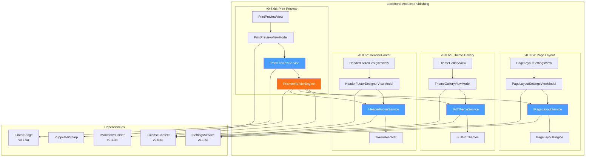
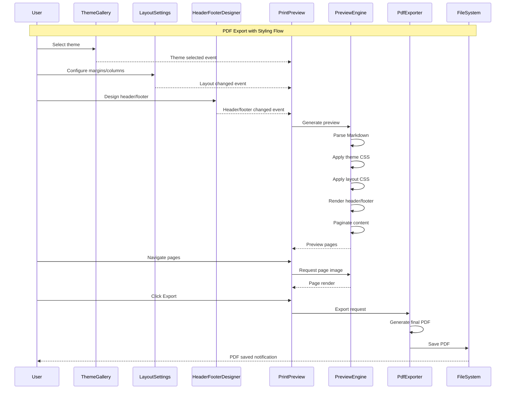

# LCS-SBD-086: Scope Breakdown — Print Stylesheets

## Document Control

| Field            | Value                                    |
| :--------------- | :--------------------------------------- |
| **Document ID**  | LCS-SBD-086                              |
| **Version**      | v0.8.6                                   |
| **Codename**     | Print Stylesheets (The Costume Designer) |
| **Status**       | Draft                                    |
| **Last Updated** | 2026-01-27                               |
| **Owner**        | Lead Architect                           |
| **Depends On**   | v0.8.5 (Static Site Bridge), v0.1.3b (Markdown Parser), v0.7.5a (Linter Bridge) |

---

## 1. Executive Summary

### 1.1 The Vision

**v0.8.6** delivers the **Print Stylesheets** — also known as "The Costume Designer" — PDF-specific styling and branding capabilities for professional document export. This release transforms Lexichord from a basic document exporter into a sophisticated publishing platform, enabling technical writers and enterprise teams to produce branded, publication-ready PDF documents with custom themes, headers, footers, and precise layout control.

While v0.8.5 established the Static Site Bridge for documentation frameworks, Print Stylesheets focuses on the final-mile presentation layer. Writers can now define corporate themes, academic formatting, or minimalist styles and apply them consistently across all exported documents. The WYSIWYG print preview ensures what you see is exactly what gets printed.

### 1.2 Business Value

- **Brand Consistency:** Define corporate PDF themes with logos, colors, and typography that match organizational identity across all exported documents.
- **Professional Output:** Academic, corporate, and minimal theme presets enable immediate professional-quality exports without design expertise.
- **Layout Control:** Fine-grained control over margins, columns, and orientation ensures content fits precisely as intended.
- **Header/Footer Customization:** Dynamic headers and footers with logo placement, dates, and automatic page numbering eliminate manual formatting.
- **WYSIWYG Preview:** Real-time print preview prevents export surprises and reduces iteration cycles.
- **Foundation:** Establishes the PDF theming infrastructure for future batch export and template management features.

### 1.3 Success Criteria

This release succeeds when:

1. Users can select from 3+ pre-built PDF themes (corporate, academic, minimal) via a Theme Gallery.
2. Page Layout Engine supports configurable margins (top, bottom, left, right), column layouts (1-3), and orientation (portrait/landscape).
3. Header/Footer Designer allows placement of logos, dates, and page numbers with live preview.
4. Print Preview displays accurate WYSIWYG representation of the final PDF output.
5. All UI respects license gating (Writer Pro+ for Print Stylesheets).

### 1.4 License Gating

The Print Stylesheets feature is a **Writer Pro** feature. Lower tiers will see:

- Read-only access to theme gallery (cannot apply themes)
- "Upgrade to Writer Pro" prompt when attempting to customize page layout
- Header/Footer Designer disabled with upgrade tooltip
- Basic PDF export still available; styled export requires Writer Pro

---

## 2. Dependencies on Prior Versions

| Component                  | Source Version | Usage in v0.8.6                                   |
| :------------------------- | :------------- | :------------------------------------------------ |
| `IPdfExporter`             | v0.8.6a        | Core export interface (defined in this version)   |
| `IMarkdownParser`          | v0.1.3b        | Markdown to AST conversion                        |
| `ILinterBridge`            | v0.7.5a        | Style annotations in PDF                          |
| `ISettingsService`         | v0.1.6a        | Export preferences persistence                    |
| `ILicenseContext`          | v0.0.4c        | Feature gating for Writer Pro                     |
| `IMediator`                | v0.0.7a        | Event publishing for export lifecycle             |
| `IRegionManager`           | v0.1.1b        | Panel registration for preview                    |
| `Serilog`                  | v0.0.3b        | Logging operations                                |
| `IConfigurationService`    | v0.0.3d        | Theme storage and retrieval                       |

---

## 3. Sub-Part Specifications

### 3.1 v0.8.6a: Page Layout Engine

| Field            | Value                                     |
| :--------------- | :---------------------------------------- |
| **Sub-Part ID**  | PUB-086a                                  |
| **Title**        | Page Layout Engine                        |
| **Module**       | `Lexichord.Modules.Publishing`            |
| **License Tier** | Writer Pro                                |

**Goal:** Implement the foundational page layout system supporting configurable margins, multi-column layouts, and page orientation for PDF export.

**Key Deliverables:**

- `IPageLayoutService` interface defining layout operations
- `PageLayoutConfiguration` record for layout settings
- `PageLayoutEngine.cs` implementation with margin, column, and orientation support
- `PageSize` enumeration (A4, Letter, Legal, A3, Custom)
- `PageOrientation` enumeration (Portrait, Landscape)
- `PageMargins` record with top, bottom, left, right values
- `ColumnLayout` record supporting 1-3 columns with gutter configuration
- CSS generation for layout application
- Unit tests for layout calculations

**Key Interfaces:**

```csharp
namespace Lexichord.Modules.Publishing.Abstractions;

public interface IPageLayoutService
{
    PageLayoutConfiguration GetDefaultConfiguration();
    PageLayoutConfiguration LoadConfiguration(string configurationId);
    Task SaveConfigurationAsync(PageLayoutConfiguration config, CancellationToken ct = default);
    string GenerateLayoutCss(PageLayoutConfiguration config);
    ValidationResult ValidateConfiguration(PageLayoutConfiguration config);
}

public record PageLayoutConfiguration(
    Guid Id,
    string Name,
    PageSize PageSize,
    PageOrientation Orientation,
    PageMargins Margins,
    ColumnLayout Columns,
    bool MirrorMarginsForBinding = false,
    string? CustomCss = null
);

public enum PageSize
{
    A4,         // 210 x 297 mm
    Letter,     // 8.5 x 11 in
    Legal,      // 8.5 x 14 in
    A3,         // 297 x 420 mm
    A5,         // 148 x 210 mm
    Custom
}

public enum PageOrientation
{
    Portrait,
    Landscape
}

public record PageMargins(
    double Top,
    double Bottom,
    double Left,
    double Right,
    MeasurementUnit Unit = MeasurementUnit.Millimeters
);

public enum MeasurementUnit
{
    Millimeters,
    Inches,
    Points
}

public record ColumnLayout(
    int ColumnCount,
    double GutterWidth,
    bool BalanceColumns = true
);
```

**Key UI Components:**

```text
+------------------------------------------------------------------+
|  Page Layout Settings                                    [Reset]  |
+------------------------------------------------------------------+
| Page Size:    [A4            v]  Orientation: (o) Portrait        |
|                                               ( ) Landscape       |
+------------------------------------------------------------------+
| Margins (mm)                                                      |
|   Top:    [25    ]     Bottom: [25    ]                          |
|   Left:   [20    ]     Right:  [20    ]                          |
|   [ ] Mirror margins for binding                                  |
+------------------------------------------------------------------+
| Columns                                                           |
|   [1] [2] [3]    Gutter: [10   ] mm                              |
|   [x] Balance columns                                             |
+------------------------------------------------------------------+
| Preview:                                                          |
| +--------+  Visual representation of page                         |
| |  | |   |  with margins and columns                             |
| |  | |   |  indicated                                            |
| +--------+                                                        |
+------------------------------------------------------------------+
```

**Storage Location:**

- Windows: `%APPDATA%/Lexichord/Publishing/Layouts/[id].json`
- macOS: `~/Library/Application Support/Lexichord/Publishing/Layouts/[id].json`
- Linux: `~/.config/Lexichord/Publishing/Layouts/[id].json`

**Dependencies:**

- v0.1.6a: `ISettingsService` (persistence of layout preferences)
- v0.0.4c: `ILicenseContext` (Writer Pro feature gating)

---

### 3.2 v0.8.6b: Theme Gallery

| Field            | Value                                     |
| :--------------- | :---------------------------------------- |
| **Sub-Part ID**  | PUB-086b                                  |
| **Title**        | Theme Gallery                             |
| **Module**       | `Lexichord.Modules.Publishing`            |
| **License Tier** | Writer Pro                                |

**Goal:** Create a visual theme gallery with pre-built PDF themes (corporate, academic, minimal) and support for custom theme creation.

**Key Deliverables:**

- `IPdfThemeService` interface for theme management
- `PdfTheme` record defining theme properties
- `ThemeGalleryView.axaml` with visual theme browser
- `ThemeGalleryViewModel` with theme selection and preview
- 3 built-in themes: Corporate, Academic, Minimal
- Theme export/import functionality
- Custom theme editor
- Unit tests for theme application

**Key Interfaces:**

```csharp
namespace Lexichord.Modules.Publishing.Abstractions;

public interface IPdfThemeService
{
    IReadOnlyList<PdfTheme> GetBuiltInThemes();
    IReadOnlyList<PdfTheme> GetCustomThemes();
    Task<PdfTheme> CreateThemeAsync(PdfThemeDefinition definition, CancellationToken ct = default);
    Task<PdfTheme> CloneThemeAsync(Guid sourceThemeId, string newName, CancellationToken ct = default);
    Task UpdateThemeAsync(PdfTheme theme, CancellationToken ct = default);
    Task DeleteThemeAsync(Guid themeId, CancellationToken ct = default);
    Task<string> ExportThemeAsync(Guid themeId, CancellationToken ct = default);
    Task<PdfTheme> ImportThemeAsync(string themeJson, CancellationToken ct = default);
    string GenerateThemeCss(PdfTheme theme);
}

public record PdfTheme(
    Guid Id,
    string Name,
    string Description,
    bool IsBuiltIn,
    ThemeCategory Category,
    ThemeColorPalette Colors,
    ThemeTypography Typography,
    ThemeSpacing Spacing,
    PageLayoutConfiguration DefaultLayout,
    HeaderFooterConfiguration? DefaultHeaderFooter,
    string? ThumbnailBase64,
    DateTime CreatedAt,
    DateTime ModifiedAt
);

public enum ThemeCategory
{
    Corporate,
    Academic,
    Technical,
    Minimal,
    Creative,
    Custom
}

public record ThemeColorPalette(
    string PrimaryColor,
    string SecondaryColor,
    string AccentColor,
    string TextColor,
    string HeadingColor,
    string LinkColor,
    string BackgroundColor,
    string CodeBlockBackground,
    string TableHeaderBackground,
    string TableStripeColor
);

public record ThemeTypography(
    string HeadingFontFamily,
    string BodyFontFamily,
    string CodeFontFamily,
    double BaseFontSize,
    double LineHeight,
    double H1Scale,
    double H2Scale,
    double H3Scale,
    double H4Scale,
    FontWeight HeadingWeight,
    FontWeight BodyWeight
);

public record ThemeSpacing(
    double ParagraphSpacing,
    double HeadingSpacing,
    double ListIndent,
    double BlockquoteIndent,
    double CodeBlockPadding,
    double TableCellPadding
);

public enum FontWeight
{
    Light = 300,
    Regular = 400,
    Medium = 500,
    SemiBold = 600,
    Bold = 700
}
```

**Key UI Components:**

```text
+------------------------------------------------------------------+
|  Theme Gallery                           [Import] [+ New Theme]   |
+------------------------------------------------------------------+
| Filter: [All Themes     v]  Search: [                    ] [Q]    |
+------------------------------------------------------------------+
| +---------------+  +---------------+  +---------------+           |
| |   Corporate   |  |   Academic    |  |    Minimal    |           |
| | +-----------+ |  | +-----------+ |  | +-----------+ |           |
| | | Thumbnail | |  | | Thumbnail | |  | | Thumbnail | |           |
| | |  Preview  | |  | |  Preview  | |  | |  Preview  | |           |
| | +-----------+ |  | +-----------+ |  | +-----------+ |           |
| | Professional  |  | Scholarly     |  | Clean, simple |           |
| | branding      |  | formatting    |  | layout        |           |
| | [Apply]       |  | [Apply]       |  | [Apply]       |           |
| +---------------+  +---------------+  +---------------+           |
+------------------------------------------------------------------+
| +---------------+  +---------------+                              |
| |  My Custom    |  |  + Add New    |                              |
| | +-----------+ |  | +-----------+ |                              |
| | | Thumbnail | |  | |     +     | |                              |
| | |  Preview  | |  | |           | |                              |
| | +-----------+ |  | +-----------+ |                              |
| | Custom theme  |  | Create new    |                              |
| | [Edit][Apply] |  | theme...      |                              |
| +---------------+  +---------------+                              |
+------------------------------------------------------------------+
```

**Built-in Theme Definitions:**

```text
CORPORATE THEME:
├── Colors: Navy (#1a365d), Gray (#718096), Blue accent (#3182ce)
├── Typography: Arial/Helvetica headings, Georgia body
├── Layout: A4 portrait, 25mm margins
└── Style: Professional, branded, logo-friendly

ACADEMIC THEME:
├── Colors: Black (#000), Gray (#4a5568), Burgundy accent (#9b2c2c)
├── Typography: Times New Roman headings and body
├── Layout: Letter, 1-inch margins, optional 2-column
└── Style: Scholarly, citation-friendly, footnote-ready

MINIMAL THEME:
├── Colors: Dark gray (#2d3748), Light gray (#e2e8f0), Teal accent (#319795)
├── Typography: System fonts (SF Pro, Segoe UI)
├── Layout: A4 portrait, generous margins
└── Style: Clean, whitespace-focused, modern
```

**Dependencies:**

- v0.8.6a: `PageLayoutConfiguration` (default layout per theme)
- v0.1.6a: `ISettingsService` (theme persistence)
- v0.0.4c: `ILicenseContext` (Writer Pro feature gating)

---

### 3.3 v0.8.6c: Header/Footer Designer

| Field            | Value                                     |
| :--------------- | :---------------------------------------- |
| **Sub-Part ID**  | PUB-086c                                  |
| **Title**        | Header/Footer Designer                    |
| **Module**       | `Lexichord.Modules.Publishing`            |
| **License Tier** | Writer Pro                                |

**Goal:** Build a visual designer for PDF headers and footers with support for logos, dates, page numbers, and dynamic content.

**Key Deliverables:**

- `IHeaderFooterService` interface for header/footer management
- `HeaderFooterConfiguration` record for settings
- `HeaderFooterDesignerView.axaml` with visual editor
- `HeaderFooterDesignerViewModel` with drag-drop zones
- Dynamic token system ({page}, {pages}, {date}, {title}, {author})
- Logo upload and positioning
- Live preview integration
- Unit tests for token replacement

**Key Interfaces:**

```csharp
namespace Lexichord.Modules.Publishing.Abstractions;

public interface IHeaderFooterService
{
    HeaderFooterConfiguration GetDefaultConfiguration();
    Task SaveConfigurationAsync(HeaderFooterConfiguration config, CancellationToken ct = default);
    string RenderHeader(HeaderFooterConfiguration config, RenderContext context);
    string RenderFooter(HeaderFooterConfiguration config, RenderContext context);
    IReadOnlyList<DynamicToken> GetAvailableTokens();
    string ResolveTokens(string template, RenderContext context);
    Task<string> ProcessLogoAsync(Stream logoStream, LogoSettings settings, CancellationToken ct = default);
}

public record HeaderFooterConfiguration(
    Guid Id,
    string Name,
    HeaderConfiguration Header,
    FooterConfiguration Footer,
    bool DifferentFirstPage = false,
    HeaderConfiguration? FirstPageHeader = null,
    FooterConfiguration? FirstPageFooter = null,
    bool DifferentOddEven = false,
    HeaderConfiguration? OddPageHeader = null,
    HeaderConfiguration? EvenPageHeader = null,
    FooterConfiguration? OddPageFooter = null,
    FooterConfiguration? EvenPageFooter = null
);

public record HeaderConfiguration(
    bool Enabled,
    double Height,
    HeaderFooterSection Left,
    HeaderFooterSection Center,
    HeaderFooterSection Right,
    string? BackgroundColor = null,
    BorderConfiguration? BottomBorder = null
);

public record FooterConfiguration(
    bool Enabled,
    double Height,
    HeaderFooterSection Left,
    HeaderFooterSection Center,
    HeaderFooterSection Right,
    string? BackgroundColor = null,
    BorderConfiguration? TopBorder = null
);

public record HeaderFooterSection(
    HeaderFooterContentType ContentType,
    string? TextContent = null,
    TextFormatting? Formatting = null,
    LogoConfiguration? Logo = null
);

public enum HeaderFooterContentType
{
    None,
    Text,
    PageNumber,
    PageCount,
    PageOfPages,
    Date,
    DateTime,
    DocumentTitle,
    Author,
    Logo,
    Custom
}

public record TextFormatting(
    string FontFamily,
    double FontSize,
    string Color,
    FontWeight Weight,
    TextAlignment Alignment
);

public record LogoConfiguration(
    string ImageBase64,
    double Width,
    double Height,
    bool MaintainAspectRatio,
    LogoPosition Position
);

public enum LogoPosition
{
    Left,
    Center,
    Right
}

public record BorderConfiguration(
    double Width,
    string Color,
    BorderStyle Style
);

public enum BorderStyle
{
    Solid,
    Dashed,
    Dotted
}

public record RenderContext(
    int CurrentPage,
    int TotalPages,
    DateTime ExportDate,
    string DocumentTitle,
    string? Author,
    IDictionary<string, string>? CustomTokens
);

public record DynamicToken(
    string Token,
    string DisplayName,
    string Description,
    string ExampleOutput
);
```

**Key UI Components:**

```text
+------------------------------------------------------------------+
|  Header/Footer Designer                              [Reset][Save]|
+------------------------------------------------------------------+
| Header                                               [x] Enabled  |
| +--------------------------------------------------------------+ |
| | Left Zone      |     Center Zone      |       Right Zone     | |
| | +-----------+  |  +--------------+    |  +----------------+  | |
| | |  [Logo]   |  |  | {title}      |    |  | {date}         |  | |
| | +-----------+  |  +--------------+    |  +----------------+  | |
| +--------------------------------------------------------------+ |
| Height: [15   ] mm   Border: [x] Show   Color: [#cccccc]        |
+------------------------------------------------------------------+
| Footer                                               [x] Enabled  |
| +--------------------------------------------------------------+ |
| | Left Zone      |     Center Zone      |       Right Zone     | |
| | +-----------+  |  +--------------+    |  +----------------+  | |
| | | Lexichord |  |  | Page {page}  |    |  | Confidential   |  | |
| | |    Inc.   |  |  | of {pages}   |    |  |                |  | |
| | +-----------+  |  +--------------+    |  +----------------+  | |
| +--------------------------------------------------------------+ |
| Height: [12   ] mm   Border: [x] Show   Color: [#cccccc]        |
+------------------------------------------------------------------+
| Options:                                                          |
| [ ] Different first page header/footer                            |
| [ ] Different odd/even pages                                      |
+------------------------------------------------------------------+
| Available Tokens:                                                 |
| {page} - Current page    {pages} - Total pages                    |
| {date} - Current date    {title} - Document title                 |
| {author} - Author name   {time} - Current time                    |
+------------------------------------------------------------------+
```

**Dynamic Token Reference:**

| Token | Description | Example Output |
| :--- | :--- | :--- |
| `{page}` | Current page number | 5 |
| `{pages}` | Total page count | 42 |
| `{date}` | Export date (short) | 2026-01-27 |
| `{date:long}` | Export date (long) | January 27, 2026 |
| `{time}` | Export time | 14:30 |
| `{datetime}` | Full date and time | 2026-01-27 14:30 |
| `{title}` | Document title | User Guide |
| `{author}` | Document author | John Doe |
| `{filename}` | Source filename | guide.md |

**Dependencies:**

- v0.8.6a: `PageLayoutConfiguration` (margin calculations for header/footer positioning)
- v0.1.6a: `ISettingsService` (configuration persistence)
- v0.0.4c: `ILicenseContext` (Writer Pro feature gating)

---

### 3.4 v0.8.6d: Print Preview

| Field            | Value                                     |
| :--------------- | :---------------------------------------- |
| **Sub-Part ID**  | PUB-086d                                  |
| **Title**        | Print Preview                             |
| **Module**       | `Lexichord.Modules.Publishing`            |
| **License Tier** | Writer Pro                                |

**Goal:** Implement a WYSIWYG print preview that accurately displays the final PDF output with themes, headers, footers, and pagination.

**Key Deliverables:**

- `IPrintPreviewService` interface for preview generation
- `PrintPreviewView.axaml` with paginated preview display
- `PrintPreviewViewModel` with zoom, navigation, and export controls
- Real-time preview updates on configuration changes
- Page thumbnail navigation
- Zoom controls (25%-400%)
- Export to PDF with progress indicator
- Unit tests for preview accuracy

**Key Interfaces:**

```csharp
namespace Lexichord.Modules.Publishing.Abstractions;

public interface IPrintPreviewService
{
    Task<PrintPreviewResult> GeneratePreviewAsync(
        PrintPreviewRequest request,
        CancellationToken ct = default);

    Task<PrintPreviewResult> RefreshPreviewAsync(
        Guid previewId,
        CancellationToken ct = default);

    Task<byte[]> ExportToPdfAsync(
        Guid previewId,
        CancellationToken ct = default);

    Task<Stream> GetPageImageAsync(
        Guid previewId,
        int pageNumber,
        double scale = 1.0,
        CancellationToken ct = default);

    void DisposePreview(Guid previewId);
}

public record PrintPreviewRequest(
    string DocumentPath,
    string DocumentContent,
    PdfTheme Theme,
    PageLayoutConfiguration Layout,
    HeaderFooterConfiguration? HeaderFooter,
    PreviewOptions Options
);

public record PreviewOptions(
    bool ShowAnnotations = false,
    bool ShowPageBoundaries = true,
    bool ShowNonPrintableArea = true,
    int MaxPagesToRender = 10
);

public record PrintPreviewResult(
    Guid PreviewId,
    int TotalPages,
    PageDimensions PageDimensions,
    IReadOnlyList<PagePreview> Pages,
    TimeSpan RenderTime,
    PreviewStatus Status,
    string? ErrorMessage = null
);

public record PageDimensions(
    double Width,
    double Height,
    MeasurementUnit Unit
);

public record PagePreview(
    int PageNumber,
    string ThumbnailBase64,
    IReadOnlyList<PreviewAnnotation>? Annotations
);

public record PreviewAnnotation(
    double X,
    double Y,
    double Width,
    double Height,
    string Text,
    AnnotationType Type
);

public enum AnnotationType
{
    StyleViolation,
    Comment,
    Highlight,
    Suggestion
}

public enum PreviewStatus
{
    Pending,
    Rendering,
    Complete,
    Error,
    Cancelled
}
```

**Key UI Components:**

```text
+------------------------------------------------------------------+
|  Print Preview                      [Fit Width v] [100%] [Export] |
+------------------------------------------------------------------+
| Navigation:  [<] Page [3  ] of 42 [>]    Zoom: [-] [100%] [+]    |
+------------------------------------------------------------------+
|                                                                   |
|  +----+  +--------------------------------------------------+     |
|  | 1  |  |                                                  |     |
|  +----+  |   +------------------------------------------+   |     |
|  +----+  |   | Header: Logo    Title          Date      |   |     |
|  | 2  |  |   +------------------------------------------+   |     |
|  +----+  |                                                  |     |
|  +----+  |   # Document Content                             |     |
|  |[3] |  |                                                  |     |
|  +----+  |   Lorem ipsum dolor sit amet, consectetur        |     |
|  +----+  |   adipiscing elit. Sed do eiusmod tempor         |     |
|  | 4  |  |   incididunt ut labore et dolore magna aliqua.   |     |
|  +----+  |                                                  |     |
|  +----+  |   ## Section Heading                             |     |
|  | 5  |  |                                                  |     |
|  +----+  |   More content here with proper styling and      |     |
|    :     |   formatting applied from the selected theme.    |     |
|    :     |                                                  |     |
|          |   +------------------------------------------+   |     |
|          |   | Footer: Company   Page 3 of 42  Conf.    |   |     |
|          |   +------------------------------------------+   |     |
|          +--------------------------------------------------+     |
|                                                                   |
+------------------------------------------------------------------+
| Status: Preview ready                    Render time: 1.2s        |
+------------------------------------------------------------------+
```

**Zoom Level Options:**

| Option | Scale | Use Case |
| :--- | :--- | :--- |
| Fit Page | Variable | See entire page |
| Fit Width | Variable | Maximize content readability |
| 50% | 0.5x | Quick overview |
| 75% | 0.75x | Comfortable reading |
| 100% | 1.0x | Actual size |
| 150% | 1.5x | Detail inspection |
| 200% | 2.0x | Fine detail work |

**Preview Update Triggers:**

```text
REFRESH PREVIEW when:
├── Document content changes (debounced 500ms)
├── Theme selection changes
├── Page layout configuration changes
├── Header/footer configuration changes
├── Zoom level changes (re-render at new resolution)
└── User clicks "Refresh" button
```

**Dependencies:**

- v0.8.6a: `PageLayoutConfiguration` (layout for rendering)
- v0.8.6b: `PdfTheme` (theme for styling)
- v0.8.6c: `HeaderFooterConfiguration` (headers/footers for rendering)
- v0.1.3b: `IMarkdownParser` (content parsing)
- v0.1.1b: `IRegionManager` (panel registration)

---

## 4. Implementation Checklist

| #  | Sub-Part | Task                                                      | Est. Hours |
| :- | :------- | :-------------------------------------------------------- | :--------- |
| 1  | v0.8.6a  | Define `IPageLayoutService` interface                     | 1          |
| 2  | v0.8.6a  | Implement `PageLayoutConfiguration` and related records   | 1.5        |
| 3  | v0.8.6a  | Implement `PageLayoutEngine` with CSS generation          | 3          |
| 4  | v0.8.6a  | Create `PageLayoutSettingsView.axaml`                     | 2          |
| 5  | v0.8.6a  | Implement `PageLayoutSettingsViewModel`                   | 2          |
| 6  | v0.8.6a  | Unit tests for layout calculations                        | 2          |
| 7  | v0.8.6b  | Define `IPdfThemeService` interface                       | 1          |
| 8  | v0.8.6b  | Implement `PdfTheme` and related records                  | 2          |
| 9  | v0.8.6b  | Create 3 built-in themes (Corporate, Academic, Minimal)   | 4          |
| 10 | v0.8.6b  | Implement `PdfThemeService` with CSS generation           | 3          |
| 11 | v0.8.6b  | Create `ThemeGalleryView.axaml`                           | 3          |
| 12 | v0.8.6b  | Implement `ThemeGalleryViewModel`                         | 2          |
| 13 | v0.8.6b  | Theme import/export functionality                         | 2          |
| 14 | v0.8.6b  | Unit tests for theme application                          | 2          |
| 15 | v0.8.6c  | Define `IHeaderFooterService` interface                   | 1          |
| 16 | v0.8.6c  | Implement `HeaderFooterConfiguration` records             | 1.5        |
| 17 | v0.8.6c  | Implement dynamic token system                            | 2          |
| 18 | v0.8.6c  | Create `HeaderFooterDesignerView.axaml`                   | 3          |
| 19 | v0.8.6c  | Implement `HeaderFooterDesignerViewModel`                 | 2.5        |
| 20 | v0.8.6c  | Logo upload and processing                                | 2          |
| 21 | v0.8.6c  | Unit tests for token replacement                          | 1.5        |
| 22 | v0.8.6d  | Define `IPrintPreviewService` interface                   | 1          |
| 23 | v0.8.6d  | Implement preview rendering engine                        | 4          |
| 24 | v0.8.6d  | Create `PrintPreviewView.axaml`                           | 3          |
| 25 | v0.8.6d  | Implement `PrintPreviewViewModel`                         | 2.5        |
| 26 | v0.8.6d  | Page thumbnail generation                                 | 2          |
| 27 | v0.8.6d  | Zoom and navigation controls                              | 1.5        |
| 28 | v0.8.6d  | PDF export integration                                    | 2          |
| 29 | v0.8.6d  | Unit tests for preview accuracy                           | 2          |
| 30 | All      | Integration tests for full export pipeline                | 3          |
| 31 | All      | DI registration in PublishingModule.cs                    | 1          |
| **Total** |   |                                                           | **62 hours** |

---

## 5. Dependency Matrix

### 5.1 Required Interfaces (from earlier versions)

| Interface                | Source Version | Purpose                              |
| :----------------------- | :------------- | :----------------------------------- |
| `IMarkdownParser`        | v0.1.3b        | Markdown to AST conversion           |
| `ILinterBridge`          | v0.7.5a        | Style annotations for PDF            |
| `ISettingsService`       | v0.1.6a        | Configuration persistence            |
| `ILicenseContext`        | v0.0.4c        | Writer Pro feature gating            |
| `IMediator`              | v0.0.7a        | Event publishing                     |
| `IRegionManager`         | v0.1.1b        | Panel registration                   |

### 5.2 New Interfaces (defined in v0.8.6)

| Interface                    | Defined In | Module                    | Purpose                 |
| :--------------------------- | :--------- | :------------------------ | :---------------------- |
| `IPageLayoutService`         | v0.8.6a    | Modules.Publishing        | Page layout management  |
| `IPdfThemeService`           | v0.8.6b    | Modules.Publishing        | Theme management        |
| `IHeaderFooterService`       | v0.8.6c    | Modules.Publishing        | Header/footer design    |
| `IPrintPreviewService`       | v0.8.6d    | Modules.Publishing        | Preview generation      |

### 5.3 New Records/DTOs (defined in v0.8.6)

| Record                       | Defined In | Purpose                                |
| :--------------------------- | :--------- | :------------------------------------- |
| `PageLayoutConfiguration`    | v0.8.6a    | Layout settings                        |
| `PageMargins`                | v0.8.6a    | Margin configuration                   |
| `ColumnLayout`               | v0.8.6a    | Column configuration                   |
| `PdfTheme`                   | v0.8.6b    | Complete theme definition              |
| `ThemeColorPalette`          | v0.8.6b    | Theme colors                           |
| `ThemeTypography`            | v0.8.6b    | Font settings                          |
| `HeaderFooterConfiguration`  | v0.8.6c    | Header/footer settings                 |
| `HeaderConfiguration`        | v0.8.6c    | Header section settings                |
| `FooterConfiguration`        | v0.8.6c    | Footer section settings                |
| `PrintPreviewRequest`        | v0.8.6d    | Preview generation request             |
| `PrintPreviewResult`         | v0.8.6d    | Preview generation result              |

### 5.4 NuGet Packages

| Package           | Version | Purpose                    | New/Existing |
| :---------------- | :------ | :------------------------- | :----------- |
| `PuppeteerSharp`  | 17.x    | PDF rendering via Chromium | Existing     |
| `SixLabors.ImageSharp` | 3.x | Image processing for logos | New          |
| `SkiaSharp`       | 2.88.x  | Preview rendering          | New          |

---

## 6. Architecture Diagram



---

## 7. Data Flow Diagram



---

## 8. Risks & Mitigations

| Risk | Impact | Probability | Mitigation |
| :--- | :----- | :---------- | :--------- |
| PuppeteerSharp Chromium size (300MB+) | High | High | Lazy download, shared Chromium instance, consider wkhtmltopdf fallback |
| Preview rendering performance | Medium | Medium | Render pages on-demand, cache rendered pages, limit concurrent renders |
| Theme CSS conflicts with content | Medium | Medium | Scoped CSS, CSS reset, thorough testing with various Markdown |
| Header/footer positioning across page sizes | High | Medium | Extensive testing matrix, percentage-based positioning where possible |
| Logo image processing memory usage | Medium | Low | Size limits, progressive loading, ImageSharp memory constraints |
| Cross-platform font availability | High | Medium | Bundle core fonts, font fallback chain, web-safe font recommendations |

---

## 9. Success Metrics

| Metric | Target | Measurement |
| :----- | :----- | :---------- |
| Theme application time | < 100ms | Theme CSS generation timing |
| Preview render time (10-page doc) | < 2s | Preview generation timing |
| Full PDF export (10-page doc) | < 5s | Export timing |
| Memory usage during preview | < 100MB | Memory profiler |
| Theme gallery load time | < 500ms | Gallery initialization timing |
| Header/footer token resolution | < 10ms | Token replacement timing |

---

## 10. What This Enables

After v0.8.6, Lexichord will support:

- **v0.8.7 (Documentation Linter):** Style violations can be rendered as PDF annotations using the annotation system established here.
- **v0.8.8 (Hardening):** PDF export quality tests will validate theme and layout accuracy.
- **v0.9.x (Batch Export):** Multiple documents can be exported with consistent themes.
- **v1.0.x (Template Library):** Themes can be shared and distributed as templates.
- **Future:** Enterprise white-labeling, custom font embedding, PDF/A compliance.

---

## 11. Decision Trees

### 11.1 Theme Selection Flow

```text
START: "User opens export dialog"
│
├── License check: Is Writer Pro?
│   ├── NO → Show upgrade prompt, offer basic export
│   └── YES → Continue
│
├── Theme Gallery displayed
│   ├── User selects built-in theme → Apply immediately
│   ├── User selects custom theme → Apply immediately
│   └── User clicks "New Theme"
│       ├── Clone from existing? → Select base theme
│       └── Create blank → Start with minimal defaults
│
├── Theme applied
│   └── Preview updates automatically
│
└── User proceeds to export or continues customizing
```

### 11.2 Header/Footer Content Resolution

```text
START: "Resolving header/footer content"
│
├── Check content type
│   ├── None → Return empty string
│   ├── Text → Return static text
│   ├── PageNumber → Return "{page}" for later resolution
│   ├── PageCount → Return "{pages}" for later resolution
│   ├── PageOfPages → Return "{page} of {pages}"
│   ├── Date → Return formatted current date
│   ├── DateTime → Return formatted current date/time
│   ├── DocumentTitle → Return document title from metadata
│   ├── Author → Return author from metadata or empty
│   ├── Logo → Return  tag with base64 source
│   └── Custom → Return user-defined template
│
├── Apply formatting (font, size, color, weight)
│
└── Return HTML fragment for CSS positioning
```

---

## 12. User Stories

| ID    | Role            | Story                                                                              | Acceptance Criteria                    |
| :---- | :-------------- | :--------------------------------------------------------------------------------- | :------------------------------------- |
| US-01 | Technical Writer| As a technical writer, I want to apply corporate branding to my PDFs so that exported documents match company standards. | Can select corporate theme and see logo/colors applied |
| US-02 | Academic Writer | As an academic writer, I want to export papers with proper margins and formatting so that they meet journal requirements. | Can configure 1-inch margins, Times New Roman, proper pagination |
| US-03 | Team Lead       | As a team lead, I want to create custom themes so that my team exports consistent documents. | Can create, save, and share custom themes |
| US-04 | Any User        | As a user, I want to preview my PDF before exporting so that I can verify formatting. | WYSIWYG preview matches final PDF output |
| US-05 | Enterprise User | As an enterprise user, I want to add company logo to headers so that all documents are properly branded. | Can upload logo and position in header |

---

## 13. Use Cases

### UC-01: Apply Theme and Export PDF

**Preconditions:**

- User has Writer Pro license
- Document is open in editor
- Export dialog is open

**Flow:**

1. User clicks "Theme" tab in export dialog.
2. System displays Theme Gallery with built-in and custom themes.
3. User clicks on "Corporate" theme card.
4. System applies theme and updates preview.
5. User adjusts page orientation to Landscape.
6. System updates preview with new orientation.
7. User clicks "Export" button.
8. System generates PDF with selected theme.
9. System prompts for save location.
10. User selects location and clicks Save.
11. System saves PDF and shows success notification.

**Postconditions:**

- PDF exported with corporate theme applied
- Page layout matches configuration
- Headers/footers rendered correctly

---

### UC-02: Create Custom Theme

**Preconditions:**

- User has Writer Pro license
- Theme Gallery is open

**Flow:**

1. User clicks "New Theme" button.
2. System prompts: "Create blank or clone existing?"
3. User selects "Clone from Corporate."
4. System creates copy with name "Corporate (Copy)."
5. User opens color palette editor.
6. User changes primary color to company blue (#0066cc).
7. System updates preview with new color.
8. User uploads company logo for header.
9. System processes and stores logo.
10. User renames theme to "Acme Corp Standard."
11. User clicks Save.
12. System saves theme and adds to custom themes list.

**Postconditions:**

- Custom theme saved and available in gallery
- Theme includes custom colors and logo

---

## 14. Unit Testing Requirements

### 14.1 Page Layout Tests

```csharp
[Trait("Category", "Unit")]
[Trait("Version", "v0.8.6a")]
public class PageLayoutEngineTests
{
    [Theory]
    [InlineData(PageSize.A4, PageOrientation.Portrait, 210, 297)]
    [InlineData(PageSize.A4, PageOrientation.Landscape, 297, 210)]
    [InlineData(PageSize.Letter, PageOrientation.Portrait, 215.9, 279.4)]
    public void GenerateLayoutCss_PageDimensions_ReturnsCorrectSize(
        PageSize size, PageOrientation orientation, double expectedWidth, double expectedHeight)
    {
        // Arrange
        var sut = new PageLayoutEngine();
        var config = new PageLayoutConfiguration(
            Guid.NewGuid(), "Test", size, orientation,
            new PageMargins(25, 25, 20, 20),
            new ColumnLayout(1, 10));

        // Act
        var css = sut.GenerateLayoutCss(config);

        // Assert
        css.Should().Contain($"width: {expectedWidth}mm");
        css.Should().Contain($"height: {expectedHeight}mm");
    }

    [Theory]
    [InlineData(1, false)]
    [InlineData(2, true)]
    [InlineData(3, true)]
    public void GenerateLayoutCss_MultiColumn_IncludesColumnRule(
        int columnCount, bool expectColumnRule)
    {
        // Arrange
        var sut = new PageLayoutEngine();
        var config = new PageLayoutConfiguration(
            Guid.NewGuid(), "Test", PageSize.A4, PageOrientation.Portrait,
            new PageMargins(25, 25, 20, 20),
            new ColumnLayout(columnCount, 10));

        // Act
        var css = sut.GenerateLayoutCss(config);

        // Assert
        if (expectColumnRule)
            css.Should().Contain("column-count:");
        else
            css.Should().NotContain("column-count:");
    }
}
```

### 14.2 Token Replacement Tests

```csharp
[Trait("Category", "Unit")]
[Trait("Version", "v0.8.6c")]
public class TokenResolverTests
{
    [Theory]
    [InlineData("{page}", 5, "5")]
    [InlineData("{pages}", 42, "42")]
    [InlineData("Page {page} of {pages}", 5, "Page 5 of 42")]
    public void ResolveTokens_PageTokens_ReturnsExpected(
        string template, int currentPage, string expected)
    {
        // Arrange
        var sut = new TokenResolver();
        var context = new RenderContext(currentPage, 42, DateTime.Now, "Test", null, null);

        // Act
        var result = sut.Resolve(template, context);

        // Assert
        result.Should().Be(expected);
    }

    [Fact]
    public void ResolveTokens_DateToken_ReturnsFormattedDate()
    {
        // Arrange
        var sut = new TokenResolver();
        var exportDate = new DateTime(2026, 1, 27);
        var context = new RenderContext(1, 1, exportDate, "Test", null, null);

        // Act
        var result = sut.Resolve("{date}", context);

        // Assert
        result.Should().Be("2026-01-27");
    }

    [Fact]
    public void ResolveTokens_TitleToken_ReturnsDocumentTitle()
    {
        // Arrange
        var sut = new TokenResolver();
        var context = new RenderContext(1, 1, DateTime.Now, "My Document", null, null);

        // Act
        var result = sut.Resolve("{title}", context);

        // Assert
        result.Should().Be("My Document");
    }
}
```

---

## 15. Observability & Logging

| Level   | Source            | Message Template                                                       |
| :------ | :---------------- | :--------------------------------------------------------------------- |
| Debug   | PageLayoutEngine  | `"Generating layout CSS for page size {PageSize}, orientation {Orientation}"` |
| Debug   | PdfThemeService   | `"Applying theme {ThemeName} (ID: {ThemeId})"` |
| Debug   | TokenResolver     | `"Resolving tokens in template: {Template}"` |
| Info    | PrintPreview      | `"Preview generated: {PageCount} pages in {ElapsedMs}ms"` |
| Info    | PdfExporter       | `"PDF export completed: {FileName}, {FileSize} bytes"` |
| Warning | HeaderFooter      | `"Logo image exceeds recommended size: {ActualSize}KB > {MaxSize}KB"` |
| Error   | PrintPreview      | `"Preview generation failed: {Error}"` |
| Error   | PdfExporter       | `"PDF export failed: {Error}"` |

---

## 16. UI/UX Specifications

### 16.1 Export Dialog Layout

```text
+------------------------------------------------------------------+
|  Export to PDF                                          [X]       |
+------------------------------------------------------------------+
| [Layout] | [Theme] | [Header/Footer] | [Preview]                  |
+------------------------------------------------------------------+
|                                                                   |
|  [Tab content area - changes based on selected tab]               |
|                                                                   |
|                                                                   |
|                                                                   |
+------------------------------------------------------------------+
|                                    [Cancel]  [Export to PDF]      |
+------------------------------------------------------------------+
```

### 16.2 Component Styling Requirements

| Component           | Theme Resource             | Notes                            |
| :------------------ | :------------------------- | :------------------------------- |
| Tab headers         | `LexTabHeader` style       | Consistent with app tabs         |
| Theme cards         | `LexCard` style            | Hover effect, selection border   |
| Preview canvas      | `LexPreviewCanvas`         | Drop shadow, page boundary       |
| Zoom slider         | `LexSlider` style          | Min 25%, Max 400%                |
| Export button       | `LexButtonPrimary` style   | Primary action emphasis          |

---

## 17. Acceptance Criteria (QA)

| #   | Category            | Criterion                                                                    |
| :-- | :------------------ | :--------------------------------------------------------------------------- |
| 1   | **[Layout]**        | Page margins can be set independently (top, bottom, left, right).            |
| 2   | **[Layout]**        | A4, Letter, and Legal page sizes render at correct dimensions.               |
| 3   | **[Layout]**        | Landscape orientation swaps width and height correctly.                      |
| 4   | **[Layout]**        | 2-column and 3-column layouts display with configurable gutter.              |
| 5   | **[Theme]**         | Corporate theme applies navy headers and professional typography.            |
| 6   | **[Theme]**         | Academic theme applies Times New Roman and citation-friendly formatting.     |
| 7   | **[Theme]**         | Minimal theme applies clean, modern styling with ample whitespace.           |
| 8   | **[Theme]**         | Custom themes can be created, saved, and reloaded.                           |
| 9   | **[Header/Footer]** | Logo can be uploaded and positioned in header.                               |
| 10  | **[Header/Footer]** | Page numbers display correctly on all pages.                                 |
| 11  | **[Header/Footer]** | Date token resolves to export date.                                          |
| 12  | **[Header/Footer]** | Different first page header/footer option works correctly.                   |
| 13  | **[Preview]**       | Preview accurately reflects final PDF output.                                |
| 14  | **[Preview]**       | Zoom controls allow 25% to 400% scaling.                                     |
| 15  | **[Preview]**       | Page navigation works with thumbnail sidebar.                                |
| 16  | **[License]**       | Writer Pro features disabled for lower license tiers.                        |
| 17  | **[Performance]**   | 10-page preview renders in < 2 seconds.                                      |
| 18  | **[Accessibility]** | All controls are keyboard accessible.                                        |

---

## 18. Verification Commands

```bash
# ═══════════════════════════════════════════════════════════════════════════
# v0.8.6 Verification
# ═══════════════════════════════════════════════════════════════════════════

# 1. Verify NuGet packages installed
dotnet list src/Lexichord.Modules.Publishing package | grep -E "PuppeteerSharp|ImageSharp|SkiaSharp"

# 2. Build solution
dotnet build

# 3. Run unit tests for v0.8.6 components
dotnet test --filter "Category=Unit&FullyQualifiedName~Publishing"

# 4. Run all v0.8.6 tests
dotnet test --filter "Version~v0.8.6"

# 5. Manual verification:
# a) Open Export dialog and verify Theme Gallery displays 3 built-in themes
# b) Select Corporate theme and verify preview updates
# c) Configure custom margins and verify layout changes
# d) Upload logo to header and verify positioning
# e) Export PDF and verify output matches preview
# f) Test with Core license to verify upgrade prompts appear
```

---

## 19. Deliverable Checklist

| #  | Deliverable                                                    | Status |
| :- | :------------------------------------------------------------- | :----- |
| 1  | `IPageLayoutService` interface                                 | [ ]    |
| 2  | `PageLayoutEngine` implementation                              | [ ]    |
| 3  | `PageLayoutSettingsView.axaml`                                 | [ ]    |
| 4  | `PageLayoutSettingsViewModel`                                  | [ ]    |
| 5  | `IPdfThemeService` interface                                   | [ ]    |
| 6  | `PdfThemeService` implementation                               | [ ]    |
| 7  | Corporate, Academic, Minimal built-in themes                   | [ ]    |
| 8  | `ThemeGalleryView.axaml`                                       | [ ]    |
| 9  | `ThemeGalleryViewModel`                                        | [ ]    |
| 10 | `IHeaderFooterService` interface                               | [ ]    |
| 11 | `HeaderFooterService` implementation                           | [ ]    |
| 12 | Token resolver system                                          | [ ]    |
| 13 | `HeaderFooterDesignerView.axaml`                               | [ ]    |
| 14 | `HeaderFooterDesignerViewModel`                                | [ ]    |
| 15 | `IPrintPreviewService` interface                               | [ ]    |
| 16 | `PrintPreviewService` implementation                           | [ ]    |
| 17 | `PrintPreviewView.axaml`                                       | [ ]    |
| 18 | `PrintPreviewViewModel`                                        | [ ]    |
| 19 | Unit tests for all components                                  | [ ]    |
| 20 | Integration tests for export pipeline                          | [ ]    |
| 21 | DI registration in PublishingModule.cs                         | [ ]    |

---

## 20. Code Examples

### 20.1 PageLayoutConfiguration Record

```csharp
namespace Lexichord.Modules.Publishing.Models;

/// <summary>
/// Complete configuration for PDF page layout including size, orientation, margins, and columns.
/// </summary>
public record PageLayoutConfiguration
{
    public Guid Id { get; init; }
    public required string Name { get; init; }
    public PageSize PageSize { get; init; } = PageSize.A4;
    public PageOrientation Orientation { get; init; } = PageOrientation.Portrait;
    public required PageMargins Margins { get; init; }
    public required ColumnLayout Columns { get; init; }
    public bool MirrorMarginsForBinding { get; init; } = false;
    public string? CustomCss { get; init; }

    /// <summary>
    /// Gets the effective page width in millimeters after applying orientation.
    /// </summary>
    public double EffectiveWidthMm => Orientation == PageOrientation.Portrait
        ? GetPageWidthMm(PageSize)
        : GetPageHeightMm(PageSize);

    /// <summary>
    /// Gets the effective page height in millimeters after applying orientation.
    /// </summary>
    public double EffectiveHeightMm => Orientation == PageOrientation.Portrait
        ? GetPageHeightMm(PageSize)
        : GetPageWidthMm(PageSize);

    private static double GetPageWidthMm(PageSize size) => size switch
    {
        PageSize.A4 => 210,
        PageSize.Letter => 215.9,
        PageSize.Legal => 215.9,
        PageSize.A3 => 297,
        PageSize.A5 => 148,
        _ => 210
    };

    private static double GetPageHeightMm(PageSize size) => size switch
    {
        PageSize.A4 => 297,
        PageSize.Letter => 279.4,
        PageSize.Legal => 355.6,
        PageSize.A3 => 420,
        PageSize.A5 => 210,
        _ => 297
    };
}
```

### 20.2 PdfTheme Record

```csharp
namespace Lexichord.Modules.Publishing.Models;

/// <summary>
/// Complete PDF theme definition including colors, typography, spacing, and default configurations.
/// </summary>
public record PdfTheme
{
    public Guid Id { get; init; }
    public required string Name { get; init; }
    public string? Description { get; init; }
    public bool IsBuiltIn { get; init; }
    public ThemeCategory Category { get; init; }
    public required ThemeColorPalette Colors { get; init; }
    public required ThemeTypography Typography { get; init; }
    public required ThemeSpacing Spacing { get; init; }
    public PageLayoutConfiguration? DefaultLayout { get; init; }
    public HeaderFooterConfiguration? DefaultHeaderFooter { get; init; }
    public string? ThumbnailBase64 { get; init; }
    public DateTime CreatedAt { get; init; }
    public DateTime ModifiedAt { get; init; }

    /// <summary>
    /// Creates the default Corporate theme.
    /// </summary>
    public static PdfTheme CreateCorporateTheme() => new()
    {
        Id = Guid.Parse("00000000-0000-0000-0001-000000000001"),
        Name = "Corporate",
        Description = "Professional branding with navy headers and clean typography",
        IsBuiltIn = true,
        Category = ThemeCategory.Corporate,
        Colors = new ThemeColorPalette(
            PrimaryColor: "#1a365d",
            SecondaryColor: "#718096",
            AccentColor: "#3182ce",
            TextColor: "#2d3748",
            HeadingColor: "#1a365d",
            LinkColor: "#3182ce",
            BackgroundColor: "#ffffff",
            CodeBlockBackground: "#f7fafc",
            TableHeaderBackground: "#edf2f7",
            TableStripeColor: "#f7fafc"
        ),
        Typography = new ThemeTypography(
            HeadingFontFamily: "Arial, Helvetica, sans-serif",
            BodyFontFamily: "Georgia, serif",
            CodeFontFamily: "Consolas, monospace",
            BaseFontSize: 11,
            LineHeight: 1.6,
            H1Scale: 2.0,
            H2Scale: 1.5,
            H3Scale: 1.25,
            H4Scale: 1.0,
            HeadingWeight: FontWeight.Bold,
            BodyWeight: FontWeight.Regular
        ),
        Spacing = new ThemeSpacing(
            ParagraphSpacing: 12,
            HeadingSpacing: 18,
            ListIndent: 20,
            BlockquoteIndent: 15,
            CodeBlockPadding: 12,
            TableCellPadding: 8
        ),
        CreatedAt = DateTime.UtcNow,
        ModifiedAt = DateTime.UtcNow
    };
}
```

### 20.3 IPrintPreviewService Interface

```csharp
namespace Lexichord.Modules.Publishing.Abstractions;

/// <summary>
/// Service for generating WYSIWYG print previews of PDF exports.
/// </summary>
public interface IPrintPreviewService
{
    /// <summary>
    /// Generates a complete preview of the document with all styling applied.
    /// </summary>
    /// <param name="request">The preview request containing document and configuration.</param>
    /// <param name="ct">Cancellation token.</param>
    /// <returns>Preview result with rendered pages.</returns>
    Task<PrintPreviewResult> GeneratePreviewAsync(
        PrintPreviewRequest request,
        CancellationToken ct = default);

    /// <summary>
    /// Refreshes an existing preview with updated configuration.
    /// </summary>
    /// <param name="previewId">The ID of the preview to refresh.</param>
    /// <param name="ct">Cancellation token.</param>
    /// <returns>Updated preview result.</returns>
    Task<PrintPreviewResult> RefreshPreviewAsync(
        Guid previewId,
        CancellationToken ct = default);

    /// <summary>
    /// Exports the previewed document to PDF.
    /// </summary>
    /// <param name="previewId">The ID of the preview to export.</param>
    /// <param name="ct">Cancellation token.</param>
    /// <returns>PDF file as byte array.</returns>
    Task<byte[]> ExportToPdfAsync(
        Guid previewId,
        CancellationToken ct = default);

    /// <summary>
    /// Gets a rendered image of a specific page.
    /// </summary>
    /// <param name="previewId">The preview ID.</param>
    /// <param name="pageNumber">The page number (1-indexed).</param>
    /// <param name="scale">The scale factor (1.0 = 100%).</param>
    /// <param name="ct">Cancellation token.</param>
    /// <returns>Page image as stream.</returns>
    Task<Stream> GetPageImageAsync(
        Guid previewId,
        int pageNumber,
        double scale = 1.0,
        CancellationToken ct = default);

    /// <summary>
    /// Releases resources associated with a preview.
    /// </summary>
    /// <param name="previewId">The preview ID to dispose.</param>
    void DisposePreview(Guid previewId);
}
```

---

## 21. Deferred Features

| Feature                         | Deferred To | Reason                                          |
| :------------------------------ | :---------- | :---------------------------------------------- |
| PDF/A compliance                | v1.0.x      | Requires additional validation and metadata     |
| Custom font embedding           | v0.9.x      | Font licensing complexity                       |
| Batch export with themes        | v0.9.x      | Requires batch export infrastructure            |
| Theme marketplace               | v1.x        | Requires cloud infrastructure                   |
| Watermark support               | v0.8.8      | Related to branding but separate feature        |
| Table of contents generation    | v0.8.7      | Part of documentation linting scope             |

---

## 22. Changelog Entry

Upon completion of v0.8.6, the following entry will be added to `CHANGELOG.md`:

```markdown
## [0.8.6] - YYYY-MM-DD

### Added

- **Page Layout Engine**: Configurable margins, columns, and page orientation
- **Theme Gallery**: 3 built-in PDF themes (Corporate, Academic, Minimal) with custom theme support
- **Header/Footer Designer**: Visual editor with logo placement and dynamic tokens
- **Print Preview**: WYSIWYG preview with zoom, navigation, and accurate rendering

### Technical

- `IPageLayoutService` for page layout management
- `IPdfThemeService` for theme creation and application
- `IHeaderFooterService` for header/footer design
- `IPrintPreviewService` for preview generation
- `PageLayoutConfiguration` record for layout settings
- `PdfTheme` record for complete theme definitions
- `HeaderFooterConfiguration` record for header/footer settings
- Dynamic token system: {page}, {pages}, {date}, {title}, {author}

### Dependencies

- Added: SixLabors.ImageSharp 3.x for logo processing
- Added: SkiaSharp 2.88.x for preview rendering
- Existing: PuppeteerSharp 17.x for PDF generation

### License

- Print Stylesheets features require Writer Pro tier
```

---
