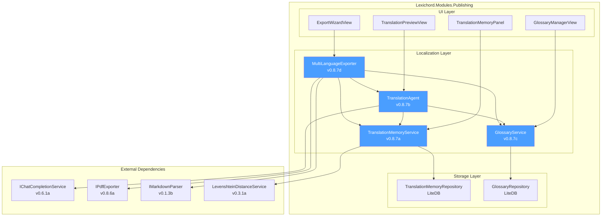
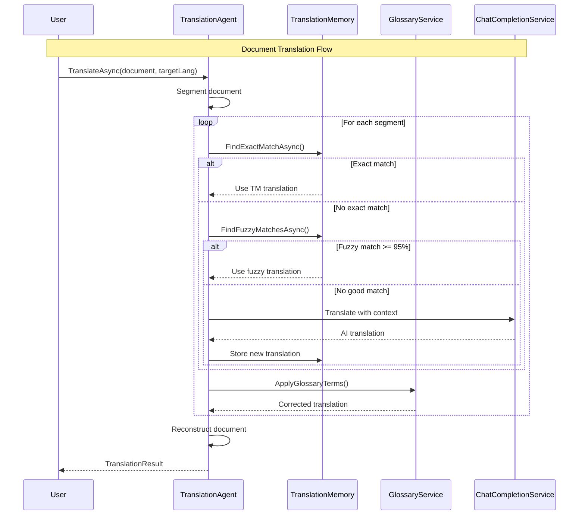

# LCS-DES-087: Design Specification Index — The Interpreter

## Document Control

| Field | Value |
| :--- | :--- |
| **Document ID** | LCS-DES-087-INDEX |
| **Feature ID** | PUB-087 |
| **Feature Name** | The Interpreter (Localization) |
| **Target Version** | v0.8.7 |
| **Module Scope** | Lexichord.Modules.Publishing |
| **Swimlane** | Publishing |
| **License Tier** | Teams |
| **Feature Gate Key** | FeatureFlags.Publishing.Localization |
| **Status** | Draft |
| **Last Updated** | 2026-01-27 |

---

## 1. Executive Summary

**v0.8.7** delivers the **Interpreter** — AI-powered document translation with terminology consistency and multi-language export capabilities for technical documentation.

### 1.1 The Problem

Technical writers and documentation teams face significant challenges when localizing documentation:

- Manual translation is time-consuming and expensive
- Terminology varies across documents and translators
- Maintaining multiple language versions creates synchronization issues
- Technical content (code, URLs, placeholders) often breaks during translation
- Right-to-left languages require special formatting considerations
- No reuse of previously approved translations

### 1.2 The Solution

Implement a comprehensive localization system that:

1. **Translation Memory** — Stores approved translations for reuse across documents
2. **AI Translation Agent** — Translates with context awareness while preserving formatting
3. **Glossary Sync** — Enforces consistent terminology across all target languages
4. **Multi-Language Export** — Produces localized outputs from a single source document

### 1.3 Business Value

| Value | Description |
| :--- | :--- |
| **Time Savings** | 70% reduction in translation time through TM reuse and AI assistance |
| **Consistency** | 100% terminology consistency through glossary enforcement |
| **Quality** | AI preserves style, tone, and formatting during translation |
| **Scalability** | Single source produces unlimited target language outputs |
| **Cost Reduction** | Reduce professional translation costs through pre-translation |
| **Compliance** | Full audit trail for enterprise requirements |

---

## 2. Related Documents

### 2.1 Scope Breakdown Document

The detailed scope breakdown for v0.8.7, including all sub-parts, implementation checklists, user stories, and acceptance criteria:

| Document | Description |
| :--- | :--- |
| **[LCS-SBD-087](./LCS-SBD-087.md)** | Scope Breakdown — The Interpreter |

### 2.2 Sub-Part Design Specifications

Each sub-part has its own detailed design specification following the LDS-01 template:

| Sub-Part | Document | Title | Description |
| :--- | :--- | :--- | :--- |
| v0.8.7a | **[LCS-DES-087a](./LCS-DES-087a.md)** | Translation Memory | Store and retrieve approved translations |
| v0.8.7b | **[LCS-DES-087b](./LCS-DES-087b.md)** | AI Translation Agent | Context-aware AI translation |
| v0.8.7c | **[LCS-DES-087c](./LCS-DES-087c.md)** | Glossary Sync | Terminology consistency enforcement |
| v0.8.7d | **[LCS-DES-087d](./LCS-DES-087d.md)** | Multi-Language Export | Batch export to multiple languages |

---

## 3. Architecture Overview

### 3.1 Component Diagram



### 3.2 Translation Flow



---

## 4. Dependencies

### 4.1 Upstream Dependencies

| Interface | Source Version | Purpose |
| :--- | :--- | :--- |
| `IChatCompletionService` | v0.6.1a | LLM for AI translation |
| `IPromptRenderer` | v0.6.3b | Template rendering |
| `BaseAgent` | v0.6.6a | Agent base class |
| `IMarkdownParser` | v0.1.3b | Document parsing |
| `IPdfExporter` | v0.8.6a | PDF export |
| `LevenshteinDistanceService` | v0.3.1a | Fuzzy matching for TM |
| `ILicenseContext` | v0.0.4c | Feature gating |
| `LiteDB` | v0.2.1a | Local storage |

### 4.2 NuGet Packages

| Package | Version | Purpose |
| :--- | :--- | :--- |
| `LiteDB` | 5.x | Translation Memory and Glossary storage |
| `Markdig` | 0.37.x | Markdown parsing and reconstruction |

### 4.3 Downstream Consumers (Future)

| Version | Feature | Uses From v0.8.7 |
| :--- | :--- | :--- |
| v0.8.8 | Hardening | Test patterns for localization |
| v0.9.x | Enterprise | Review workflows, cloud TM |
| v1.0.x | Cloud | Shared Translation Memory |

---

## 5. License Gating Strategy

The Localization feature is **Teams** tier. Behavior by tier:

| Feature | Core | WriterPro | Teams | Enterprise |
| :--- | :--- | :--- | :--- | :--- |
| View translation preview | - | - | Yes | Yes |
| Translation Memory | - | - | Yes | Yes |
| AI Translation Agent | - | - | Yes | Yes |
| Glossary Sync | - | - | Yes | Yes |
| Multi-Language Export | - | - | Yes | Yes |
| TMX/TBX Import/Export | - | - | Yes | Yes |
| Cloud TM Sync | - | - | - | Yes |

**Fallback Experience:**

- Lower tiers see "Translate" menu item with lock icon
- Clicking shows "Upgrade to Teams" modal
- Translation Memory panel hidden for lower tiers

---

## 6. Key Interfaces Summary

### 6.1 Translation Memory (v0.8.7a)

```csharp
public interface ITranslationMemoryService
{
    Task<TranslationUnit> StoreAsync(TranslationUnit unit, CancellationToken ct);
    Task<TranslationUnit?> FindExactMatchAsync(string source, string srcLang, string tgtLang, CancellationToken ct);
    Task<IReadOnlyList<TranslationMatch>> FindFuzzyMatchesAsync(string source, string srcLang, string tgtLang, double minSim, CancellationToken ct);
    Task<TranslationMemoryImportResult> ImportTmxAsync(Stream tmx, CancellationToken ct);
    Task<Stream> ExportTmxAsync(TranslationMemoryExportOptions options, CancellationToken ct);
}
```

### 6.2 Translation Agent (v0.8.7b)

```csharp
public interface ITranslationAgent
{
    Task<TranslationResult> TranslateAsync(TranslationRequest request, IProgress<TranslationProgress>? progress, CancellationToken ct);
    Task<SegmentTranslationResult> TranslateSegmentAsync(string source, TranslationContext context, CancellationToken ct);
    Task<TranslationQualityEstimate> EstimateQualityAsync(string source, string translated, string srcLang, string tgtLang, CancellationToken ct);
}
```

### 6.3 Glossary Service (v0.8.7c)

```csharp
public interface IGlossaryService
{
    Task<GlossaryEntry> AddEntryAsync(GlossaryEntry entry, CancellationToken ct);
    Task<IReadOnlyList<GlossaryEntry>> GetTermsAsync(string srcLang, string tgtLang, CancellationToken ct);
    Task<IReadOnlyList<GlossaryMatch>> FindTermsInTextAsync(string text, string srcLang, CancellationToken ct);
    Task<GlossaryValidationResult> ValidateTranslationAsync(string source, string translated, string srcLang, string tgtLang, CancellationToken ct);
    Task<GlossaryImportResult> ImportTbxAsync(Stream tbx, CancellationToken ct);
}
```

### 6.4 Multi-Language Exporter (v0.8.7d)

```csharp
public interface IMultiLanguageExporter
{
    Task<MultiLanguageExportResult> ExportAsync(MultiLanguageExportRequest request, IProgress<MultiLanguageExportProgress>? progress, CancellationToken ct);
    Task<IReadOnlyList<SupportedLanguage>> GetSupportedLanguagesAsync(CancellationToken ct);
    Task<ExportEstimate> EstimateExportAsync(MultiLanguageExportRequest request, CancellationToken ct);
}
```

---

## 7. Key Test Scenarios Summary

### 7.1 Translation Memory (v0.8.7a)

| Scenario | Expected Outcome |
| :--- | :--- |
| Store and retrieve exact match | 100% identical text returned |
| Fuzzy match at 0.85 threshold | Valid candidates returned |
| TMX import | Creates valid translation units |
| TMX export | Produces valid TMX file |

### 7.2 Translation Agent (v0.8.7b)

| Scenario | Expected Outcome |
| :--- | :--- |
| Translate document with code blocks | Code blocks unchanged |
| Translate with TM matches available | TM matches used first |
| Translate with glossary terms | Terms translated consistently |
| Preserve markdown formatting | Bold, italic, headers intact |

### 7.3 Glossary Sync (v0.8.7c)

| Scenario | Expected Outcome |
| :--- | :--- |
| Add glossary term | Term stored and retrievable |
| Validate translation | Violations detected and reported |
| Forbidden term in translation | Warning generated |
| TBX import | Creates valid glossary entries |

### 7.4 Multi-Language Export (v0.8.7d)

| Scenario | Expected Outcome |
| :--- | :--- |
| Export to 5 languages | 5 output files created |
| RTL language (Arabic) | Proper RTL formatting applied |
| Generate manifest | Valid JSON manifest created |
| Parallel processing | Faster than sequential |

---

## 8. Implementation Checklist Summary

| Sub-Part | Tasks | Est. Hours |
| :--- | :--- | :--- |
| v0.8.7a | Translation Memory | 20 |
| v0.8.7b | AI Translation Agent | 23 |
| v0.8.7c | Glossary Sync | 20 |
| v0.8.7d | Multi-Language Export | 26 |
| Integration | Tests & DI registration | 6 |
| **Total** | | **95 hours** |

See [LCS-SBD-087](./LCS-SBD-087.md) Section 4 for the detailed task breakdown.

---

## 9. Success Criteria Summary

| Category | Criterion | Target |
| :--- | :--- | :--- |
| **TM Accuracy** | Exact match retrieval | 100% |
| **TM Accuracy** | Fuzzy match at 0.85 | 95%+ |
| **Translation** | Formatting preserved | 99% |
| **Translation** | Code blocks preserved | 100% |
| **Glossary** | Term application | 100% |
| **Export** | RTL rendering | 95%+ |
| **Performance** | 10K words translation | < 5 min |
| **Performance** | TM exact lookup | < 100ms |

See [LCS-SBD-087](./LCS-SBD-087.md) Section 9 for full success metrics.

---

## 10. Supported Languages

The Multi-Language Export supports 20+ languages:

| Language | Code | RTL | Script |
| :--- | :--- | :--- | :--- |
| Arabic | ar-SA | Yes | Arabic |
| Chinese (Simplified) | zh-CN | No | Han |
| Chinese (Traditional) | zh-TW | No | Han |
| Dutch | nl-NL | No | Latin |
| English | en-US | No | Latin |
| Finnish | fi-FI | No | Latin |
| French | fr-FR | No | Latin |
| German | de-DE | No | Latin |
| Hebrew | he-IL | Yes | Hebrew |
| Hindi | hi-IN | No | Devanagari |
| Italian | it-IT | No | Latin |
| Japanese | ja-JP | No | Mixed |
| Korean | ko-KR | No | Hangul |
| Polish | pl-PL | No | Latin |
| Portuguese | pt-BR | No | Latin |
| Russian | ru-RU | No | Cyrillic |
| Spanish | es-ES | No | Latin |
| Swedish | sv-SE | No | Latin |
| Thai | th-TH | No | Thai |
| Turkish | tr-TR | No | Latin |

---

## 11. What This Enables

| Version | Feature | Uses From v0.8.7 |
| :--- | :--- | :--- |
| v0.8.8 | Hardening | Test suites for localization |
| v0.9.x | Enterprise | Review workflows, cloud TM |
| v1.0.x | Cloud | Shared Translation Memory |
| Future | MT APIs | DeepL, Google Translate integration |

---

## 12. Risk Summary

| Risk | Impact | Mitigation |
| :--- | :--- | :--- |
| AI translation quality varies | High | Quality estimates, human review |
| RTL formatting complexity | Medium | Thorough testing, native speaker review |
| Large documents exceed limits | High | Intelligent segmentation |
| TMX/TBX compatibility | Medium | Test with multiple CAT tools |

See [LCS-SBD-087](./LCS-SBD-087.md) Section 8 for full risk analysis.

---

## Document History

| Version | Date | Author | Changes |
| :--- | :--- | :--- | :--- |
| 1.0 | 2026-01-27 | Lead Architect | Initial draft |
