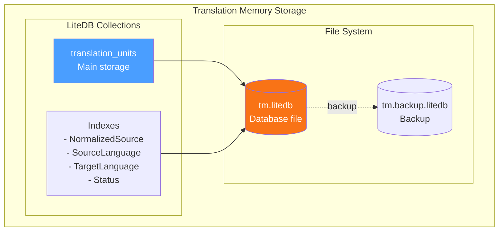

# LCS-DES-087a: Design Specification — Translation Memory

## 1. Metadata & Categorization

| Field | Value | Description |
| :--- | :--- | :--- |
| **Feature ID** | `PUB-087a` | Sub-part of PUB-087 |
| **Feature Name** | `Translation Memory` | Store and retrieve approved translations |
| **Target Version** | `v0.8.7a` | First sub-part of v0.8.7 |
| **Module Scope** | `Lexichord.Modules.Publishing` | Publishing module |
| **Swimlane** | `Publishing` | Part of Publisher vertical |
| **License Tier** | `Teams` | Teams tier required |
| **Feature Gate Key** | `FeatureFlags.Publishing.TranslationMemory` | License gate key |
| **Author** | Lead Architect | |
| **Status** | `Draft` | |
| **Last Updated** | `2026-01-27` | |
| **Parent Document** | [LCS-DES-087-INDEX](./LCS-DES-087-INDEX.md) | |
| **Scope Breakdown** | [LCS-SBD-087 Section 3.1](./LCS-SBD-087.md#31-v087a-translation-memory) | |

---

## 2. Executive Summary

### 2.1 The Requirement

Technical writers and localization teams need to reuse previously approved translations to:

- Reduce translation time and cost
- Ensure consistency across documents
- Leverage human-reviewed translations over AI-only output
- Import/export industry-standard formats (TMX) for tool interoperability

> **Goal:** Store approved source-target translation pairs and retrieve them with 100% accuracy on exact matches and fuzzy matching for similar segments.

### 2.2 The Proposed Solution

Implement a Translation Memory (TM) service that:

1. Stores translation units (source/target pairs) in LiteDB
2. Provides exact match lookup with O(1) complexity via indexing
3. Implements fuzzy matching using Levenshtein distance (85% threshold)
4. Supports TMX import/export for CAT tool interoperability
5. Provides a browsing UI for managing stored translations

---

## 3. Architecture & Modular Strategy

### 3.1 Dependencies

#### 3.1.1 Upstream Dependencies

| Interface | Source Version | Purpose |
| :--- | :--- | :--- |
| `LiteDB` | v0.2.1a | Database storage |
| `LevenshteinDistanceService` | v0.3.1a | Fuzzy matching calculation |
| `ILicenseContext` | v0.0.4c | Feature gating |
| `IMediator` | v0.0.7a | Event publishing |
| `IRegionManager` | v0.1.1b | Panel registration |

#### 3.1.2 NuGet Packages

| Package | Version | Purpose |
| :--- | :--- | :--- |
| `LiteDB` | 5.x | Embedded NoSQL database |

### 3.2 Licensing Behavior

| Tier | Behavior |
| :--- | :--- |
| Core | TM panel hidden, service returns empty results |
| WriterPro | TM panel hidden, service returns empty results |
| Teams | Full TM functionality |
| Enterprise | Full TM functionality + cloud sync (future) |

**Fallback Experience:**

- Lower tiers see "Translation Memory" menu item grayed out
- Clicking shows "Upgrade to Teams" modal with feature benefits

---

## 4. Data Contract (The API)

### 4.1 Core Interfaces

```csharp
namespace Lexichord.Abstractions.Contracts.Localization;

/// <summary>
/// Service for managing Translation Memory storage and retrieval.
/// Translation Memory stores approved source-target text pairs for reuse.
/// </summary>
public interface ITranslationMemoryService
{
    /// <summary>
    /// Stores a translation unit in the Translation Memory.
    /// </summary>
    /// <param name="unit">The translation unit to store.</param>
    /// <param name="cancellationToken">Cancellation token.</param>
    /// <returns>The stored translation unit with assigned ID.</returns>
    Task<TranslationUnit> StoreAsync(
        TranslationUnit unit,
        CancellationToken cancellationToken = default);

    /// <summary>
    /// Stores multiple translation units in batch.
    /// </summary>
    /// <param name="units">The translation units to store.</param>
    /// <param name="cancellationToken">Cancellation token.</param>
    /// <returns>Number of units successfully stored.</returns>
    Task<int> StoreBatchAsync(
        IEnumerable<TranslationUnit> units,
        CancellationToken cancellationToken = default);

    /// <summary>
    /// Finds exact matches for a source segment.
    /// </summary>
    /// <param name="sourceText">The source text to match.</param>
    /// <param name="sourceLanguage">Source language code (e.g., "en-US").</param>
    /// <param name="targetLanguage">Target language code (e.g., "de-DE").</param>
    /// <param name="cancellationToken">Cancellation token.</param>
    /// <returns>Exact match translation unit, or null if not found.</returns>
    Task<TranslationUnit?> FindExactMatchAsync(
        string sourceText,
        string sourceLanguage,
        string targetLanguage,
        CancellationToken cancellationToken = default);

    /// <summary>
    /// Finds fuzzy matches for a source segment within the similarity threshold.
    /// </summary>
    /// <param name="sourceText">The source text to match.</param>
    /// <param name="sourceLanguage">Source language code.</param>
    /// <param name="targetLanguage">Target language code.</param>
    /// <param name="minSimilarity">Minimum similarity threshold (0.0-1.0).</param>
    /// <param name="maxResults">Maximum number of results to return.</param>
    /// <param name="cancellationToken">Cancellation token.</param>
    /// <returns>List of fuzzy matches with similarity scores.</returns>
    Task<IReadOnlyList<TranslationMatch>> FindFuzzyMatchesAsync(
        string sourceText,
        string sourceLanguage,
        string targetLanguage,
        double minSimilarity = 0.85,
        int maxResults = 5,
        CancellationToken cancellationToken = default);

    /// <summary>
    /// Searches Translation Memory with a query.
    /// </summary>
    /// <param name="query">The search query parameters.</param>
    /// <param name="cancellationToken">Cancellation token.</param>
    /// <returns>List of matching translation units.</returns>
    Task<IReadOnlyList<TranslationUnit>> SearchAsync(
        TranslationMemoryQuery query,
        CancellationToken cancellationToken = default);

    /// <summary>
    /// Updates an existing translation unit.
    /// </summary>
    /// <param name="unit">The translation unit to update.</param>
    /// <param name="cancellationToken">Cancellation token.</param>
    /// <returns>The updated translation unit.</returns>
    Task<TranslationUnit> UpdateAsync(
        TranslationUnit unit,
        CancellationToken cancellationToken = default);

    /// <summary>
    /// Deletes a translation unit by ID.
    /// </summary>
    /// <param name="unitId">The ID of the unit to delete.</param>
    /// <param name="cancellationToken">Cancellation token.</param>
    /// <returns>True if deleted, false if not found.</returns>
    Task<bool> DeleteAsync(
        Guid unitId,
        CancellationToken cancellationToken = default);

    /// <summary>
    /// Imports translation units from TMX format.
    /// </summary>
    /// <param name="tmxStream">Stream containing TMX data.</param>
    /// <param name="cancellationToken">Cancellation token.</param>
    /// <returns>Import result with statistics.</returns>
    Task<TranslationMemoryImportResult> ImportTmxAsync(
        Stream tmxStream,
        CancellationToken cancellationToken = default);

    /// <summary>
    /// Exports translation units to TMX format.
    /// </summary>
    /// <param name="options">Export options.</param>
    /// <param name="cancellationToken">Cancellation token.</param>
    /// <returns>Stream containing TMX data.</returns>
    Task<Stream> ExportTmxAsync(
        TranslationMemoryExportOptions options,
        CancellationToken cancellationToken = default);

    /// <summary>
    /// Gets statistics about the Translation Memory.
    /// </summary>
    /// <param name="cancellationToken">Cancellation token.</param>
    /// <returns>Statistics about stored translation units.</returns>
    Task<TranslationMemoryStats> GetStatsAsync(
        CancellationToken cancellationToken = default);

    /// <summary>
    /// Clears all translation units matching the filter.
    /// </summary>
    /// <param name="filter">Optional filter for selective clearing.</param>
    /// <param name="cancellationToken">Cancellation token.</param>
    /// <returns>Number of units deleted.</returns>
    Task<int> ClearAsync(
        TranslationMemoryClearFilter? filter = null,
        CancellationToken cancellationToken = default);
}
```

### 4.2 Data Models

```csharp
namespace Lexichord.Abstractions.Contracts.Localization;

/// <summary>
/// A single translation unit containing source and target text.
/// </summary>
public record TranslationUnit
{
    /// <summary>Unique identifier for this translation unit.</summary>
    public Guid Id { get; init; } = Guid.NewGuid();

    /// <summary>The original source text.</summary>
    public required string SourceText { get; init; }

    /// <summary>The translated target text.</summary>
    public required string TargetText { get; init; }

    /// <summary>Source language code (e.g., "en-US").</summary>
    public required string SourceLanguage { get; init; }

    /// <summary>Target language code (e.g., "de-DE").</summary>
    public required string TargetLanguage { get; init; }

    /// <summary>Normalized source text for exact matching.</summary>
    public string NormalizedSource { get; init; } = string.Empty;

    /// <summary>Optional context for disambiguation.</summary>
    public string? Context { get; init; }

    /// <summary>Domain or subject area (e.g., "software", "legal").</summary>
    public string? Domain { get; init; }

    /// <summary>Project this translation belongs to.</summary>
    public string? Project { get; init; }

    /// <summary>Current status of the translation.</summary>
    public TranslationStatus Status { get; init; } = TranslationStatus.Approved;

    /// <summary>Who performed the translation.</summary>
    public string? TranslatedBy { get; init; }

    /// <summary>Who approved the translation.</summary>
    public string? ApprovedBy { get; init; }

    /// <summary>When this unit was created.</summary>
    public DateTime CreatedAt { get; init; } = DateTime.UtcNow;

    /// <summary>When this unit was last modified.</summary>
    public DateTime? ModifiedAt { get; init; }

    /// <summary>Usage count for this translation.</summary>
    public int UsageCount { get; init; } = 0;

    /// <summary>When this translation was last used.</summary>
    public DateTime? LastUsedAt { get; init; }

    /// <summary>Custom metadata key-value pairs.</summary>
    public IReadOnlyDictionary<string, string>? Metadata { get; init; }
}

/// <summary>
/// Status of a translation unit.
/// </summary>
public enum TranslationStatus
{
    /// <summary>Initial draft, not yet reviewed.</summary>
    Draft,

    /// <summary>Translated but not reviewed.</summary>
    Translated,

    /// <summary>Reviewed by a second translator.</summary>
    Reviewed,

    /// <summary>Approved for production use.</summary>
    Approved,

    /// <summary>Rejected, should not be used.</summary>
    Rejected
}

/// <summary>
/// A fuzzy match result with similarity score.
/// </summary>
public record TranslationMatch(
    TranslationUnit Unit,
    double Similarity,
    MatchType MatchType);

/// <summary>
/// Type of match found in Translation Memory.
/// </summary>
public enum MatchType
{
    /// <summary>100% exact match.</summary>
    Exact,

    /// <summary>85-99% fuzzy match.</summary>
    Fuzzy,

    /// <summary>Partial/substring match.</summary>
    Concordance
}

/// <summary>
/// Query parameters for searching Translation Memory.
/// </summary>
public record TranslationMemoryQuery(
    string? SourceLanguage = null,
    string? TargetLanguage = null,
    string? SearchText = null,
    string? Domain = null,
    string? Project = null,
    TranslationStatus? Status = null,
    DateTime? CreatedAfter = null,
    DateTime? CreatedBefore = null,
    string? TranslatedBy = null,
    int Skip = 0,
    int Take = 100,
    TranslationMemorySortField SortBy = TranslationMemorySortField.CreatedAt,
    bool SortDescending = true);

/// <summary>
/// Fields available for sorting Translation Memory results.
/// </summary>
public enum TranslationMemorySortField
{
    CreatedAt,
    ModifiedAt,
    LastUsedAt,
    UsageCount,
    SourceText
}

/// <summary>
/// Result of a TMX import operation.
/// </summary>
public record TranslationMemoryImportResult(
    int TotalUnits,
    int ImportedUnits,
    int SkippedUnits,
    int UpdatedUnits,
    int DuplicateUnits,
    TimeSpan ElapsedTime,
    IReadOnlyList<string> Errors,
    IReadOnlyList<string> Warnings);

/// <summary>
/// Options for exporting Translation Memory.
/// </summary>
public record TranslationMemoryExportOptions(
    string? SourceLanguage = null,
    string? TargetLanguage = null,
    string? Domain = null,
    string? Project = null,
    TranslationStatus? MinStatus = null,
    DateTime? CreatedAfter = null,
    bool IncludeMetadata = true);

/// <summary>
/// Statistics about the Translation Memory.
/// </summary>
public record TranslationMemoryStats(
    int TotalUnits,
    long DatabaseSizeBytes,
    IReadOnlyDictionary<string, int> UnitsBySourceLanguage,
    IReadOnlyDictionary<string, int> UnitsByTargetLanguage,
    IReadOnlyDictionary<string, int> LanguagePairCounts,
    IReadOnlyDictionary<TranslationStatus, int> UnitsByStatus,
    IReadOnlyDictionary<string, int> UnitsByDomain,
    DateTime? OldestUnit,
    DateTime? NewestUnit,
    int TotalUsageCount);

/// <summary>
/// Filter for clearing Translation Memory.
/// </summary>
public record TranslationMemoryClearFilter(
    string? SourceLanguage = null,
    string? TargetLanguage = null,
    string? Domain = null,
    string? Project = null,
    TranslationStatus? Status = null,
    DateTime? CreatedBefore = null);
```

---

## 5. Implementation Logic

### 5.1 Storage Architecture



### 5.2 Exact Match Algorithm

```text
FindExactMatch(sourceText, srcLang, tgtLang):
│
├── Normalize sourceText
│   ├── Trim whitespace
│   ├── Convert to lowercase
│   └── Normalize unicode
│
├── Query index: NormalizedSource = normalized AND
│                SourceLanguage = srcLang AND
│                TargetLanguage = tgtLang AND
│                Status = Approved
│
├── FOUND?
│   ├── YES → Increment UsageCount, Update LastUsedAt
│   │         Publish TranslationMemoryUsedEvent
│   │         RETURN TranslationUnit
│   └── NO → RETURN null
```

### 5.3 Fuzzy Match Algorithm

```text
FindFuzzyMatches(sourceText, srcLang, tgtLang, minSimilarity, maxResults):
│
├── Load candidates from index:
│   SourceLanguage = srcLang AND
│   TargetLanguage = tgtLang AND
│   Status = Approved
│
├── Pre-filter by length (optimization):
│   │ Keep candidates where:
│   │   length(candidate) >= length(source) * minSimilarity
│   │   length(candidate) <= length(source) / minSimilarity
│
├── FOR EACH candidate:
│   ├── Calculate Levenshtein distance
│   ├── Calculate similarity = 1 - (distance / max(len1, len2))
│   ├── IF similarity >= minSimilarity:
│   │   └── Add to results with score
│
├── Sort results by similarity descending
│
├── Take top maxResults
│
└── RETURN results
```

### 5.4 TMX Format Handling

TMX (Translation Memory eXchange) is the industry standard for TM interchange:

```xml
<?xml version="1.0" encoding="UTF-8"?>
<!DOCTYPE tmx SYSTEM "tmx14.dtd">
<tmx version="1.4">
  <header
    creationtool="Lexichord"
    creationtoolversion="0.8.7"
    datatype="PlainText"
    segtype="sentence"
    adminlang="en-US"
    srclang="en-US"
    o-tmf="Lexichord TM"/>
  <body>
    <tu tuid="a1b2c3d4-e5f6-7890-abcd-ef1234567890" creationdate="20260127T143000Z">
      <prop type="domain">software</prop>
      <prop type="project">Lexichord Docs</prop>
      <tuv xml:lang="en-US">
        <seg>Click Save to preserve your work.</seg>
      </tuv>
      <tuv xml:lang="de-DE">
        <seg>Klicken Sie auf Speichern, um Ihre Arbeit zu sichern.</seg>
      </tuv>
    </tu>
  </body>
</tmx>
```

---

## 6. Implementation Details

### 6.1 TranslationMemoryService Implementation

```csharp
namespace Lexichord.Modules.Publishing.Localization;

/// <summary>
/// LiteDB-backed implementation of Translation Memory service.
/// </summary>
[RequiresLicense(LicenseTier.Teams)]
public class TranslationMemoryService : ITranslationMemoryService
{
    private readonly ILiteDatabase _database;
    private readonly ILiteCollection<TranslationUnit> _collection;
    private readonly LevenshteinDistanceService _distanceService;
    private readonly IMediator _mediator;
    private readonly ILogger<TranslationMemoryService> _logger;

    public TranslationMemoryService(
        ILiteDatabase database,
        LevenshteinDistanceService distanceService,
        IMediator mediator,
        ILogger<TranslationMemoryService> logger)
    {
        _database = database;
        _distanceService = distanceService;
        _mediator = mediator;
        _logger = logger;

        _collection = _database.GetCollection<TranslationUnit>("translation_units");

        // Ensure indexes exist
        _collection.EnsureIndex(x => x.NormalizedSource);
        _collection.EnsureIndex(x => x.SourceLanguage);
        _collection.EnsureIndex(x => x.TargetLanguage);
        _collection.EnsureIndex(x => x.Status);
        _collection.EnsureIndex(x => x.Domain);
        _collection.EnsureIndex(x => x.Project);
        _collection.EnsureIndex(x => x.CreatedAt);
    }

    public async Task<TranslationUnit> StoreAsync(
        TranslationUnit unit,
        CancellationToken cancellationToken = default)
    {
        cancellationToken.ThrowIfCancellationRequested();

        // Normalize source text for indexing
        var normalizedUnit = unit with
        {
            NormalizedSource = NormalizeText(unit.SourceText),
            CreatedAt = DateTime.UtcNow
        };

        _logger.LogDebug(
            "Storing translation unit: '{Source}' -> '{Target}' ({SrcLang} -> {TgtLang})",
            unit.SourceText.Truncate(50),
            unit.TargetText.Truncate(50),
            unit.SourceLanguage,
            unit.TargetLanguage);

        // Check for existing exact match
        var existing = _collection.FindOne(u =>
            u.NormalizedSource == normalizedUnit.NormalizedSource &&
            u.SourceLanguage == unit.SourceLanguage &&
            u.TargetLanguage == unit.TargetLanguage);

        if (existing is not null)
        {
            // Update existing unit
            var updated = existing with
            {
                TargetText = unit.TargetText,
                Status = unit.Status,
                ModifiedAt = DateTime.UtcNow,
                TranslatedBy = unit.TranslatedBy,
                ApprovedBy = unit.ApprovedBy
            };
            _collection.Update(updated);

            await _mediator.Publish(new TranslationUnitUpdatedEvent(updated), cancellationToken);
            return updated;
        }

        // Insert new unit
        _collection.Insert(normalizedUnit);

        await _mediator.Publish(new TranslationUnitStoredEvent(normalizedUnit), cancellationToken);

        _logger.LogInfo(
            "Stored new translation unit: {Id}",
            normalizedUnit.Id);

        return normalizedUnit;
    }

    public async Task<TranslationUnit?> FindExactMatchAsync(
        string sourceText,
        string sourceLanguage,
        string targetLanguage,
        CancellationToken cancellationToken = default)
    {
        cancellationToken.ThrowIfCancellationRequested();

        var normalized = NormalizeText(sourceText);

        _logger.LogDebug(
            "Searching TM for exact match: '{Source}' ({SrcLang} -> {TgtLang})",
            sourceText.Truncate(50),
            sourceLanguage,
            targetLanguage);

        var match = _collection.FindOne(u =>
            u.NormalizedSource == normalized &&
            u.SourceLanguage == sourceLanguage &&
            u.TargetLanguage == targetLanguage &&
            u.Status == TranslationStatus.Approved);

        if (match is not null)
        {
            // Update usage statistics
            var updated = match with
            {
                UsageCount = match.UsageCount + 1,
                LastUsedAt = DateTime.UtcNow
            };
            _collection.Update(updated);

            _logger.LogInfo(
                "TM exact match found: {Id} (usage: {Count})",
                match.Id,
                updated.UsageCount);

            await _mediator.Publish(
                new TranslationMemoryMatchEvent(updated, MatchType.Exact, 1.0),
                cancellationToken);

            return updated;
        }

        _logger.LogDebug("No exact match found for: '{Source}'", sourceText.Truncate(50));
        return null;
    }

    public async Task<IReadOnlyList<TranslationMatch>> FindFuzzyMatchesAsync(
        string sourceText,
        string sourceLanguage,
        string targetLanguage,
        double minSimilarity = 0.85,
        int maxResults = 5,
        CancellationToken cancellationToken = default)
    {
        cancellationToken.ThrowIfCancellationRequested();

        _logger.LogDebug(
            "Searching TM for fuzzy matches: '{Source}' (min: {MinSim})",
            sourceText.Truncate(50),
            minSimilarity);

        var normalized = NormalizeText(sourceText);
        var sourceLength = normalized.Length;

        // Pre-filter candidates by length (optimization)
        var minLength = (int)(sourceLength * minSimilarity);
        var maxLength = (int)(sourceLength / minSimilarity);

        var candidates = _collection.Find(u =>
            u.SourceLanguage == sourceLanguage &&
            u.TargetLanguage == targetLanguage &&
            u.Status == TranslationStatus.Approved &&
            u.NormalizedSource.Length >= minLength &&
            u.NormalizedSource.Length <= maxLength)
            .ToList();

        var matches = new List<TranslationMatch>();

        foreach (var candidate in candidates)
        {
            cancellationToken.ThrowIfCancellationRequested();

            var similarity = CalculateSimilarity(normalized, candidate.NormalizedSource);

            if (similarity >= minSimilarity)
            {
                var matchType = similarity >= 1.0 ? MatchType.Exact :
                               similarity >= 0.85 ? MatchType.Fuzzy :
                               MatchType.Concordance;

                matches.Add(new TranslationMatch(candidate, similarity, matchType));
            }
        }

        var results = matches
            .OrderByDescending(m => m.Similarity)
            .Take(maxResults)
            .ToList();

        _logger.LogDebug(
            "Found {Count} fuzzy matches for: '{Source}'",
            results.Count,
            sourceText.Truncate(50));

        return results;
    }

    public async Task<TranslationMemoryImportResult> ImportTmxAsync(
        Stream tmxStream,
        CancellationToken cancellationToken = default)
    {
        var stopwatch = Stopwatch.StartNew();
        var errors = new List<string>();
        var warnings = new List<string>();
        int total = 0, imported = 0, skipped = 0, updated = 0, duplicates = 0;

        _logger.LogInfo("Starting TMX import");

        try
        {
            var doc = await XDocument.LoadAsync(tmxStream, LoadOptions.None, cancellationToken);
            var tmx = doc.Root;

            if (tmx?.Name.LocalName != "tmx")
            {
                errors.Add("Invalid TMX file: root element must be 'tmx'");
                return new TranslationMemoryImportResult(
                    0, 0, 0, 0, 0, stopwatch.Elapsed, errors, warnings);
            }

            var header = tmx.Element("header");
            var srcLang = header?.Attribute("srclang")?.Value ?? "en-US";

            var body = tmx.Element("body");
            var tus = body?.Elements("tu") ?? [];

            foreach (var tu in tus)
            {
                cancellationToken.ThrowIfCancellationRequested();
                total++;

                try
                {
                    var result = await ImportTranslationUnitAsync(tu, srcLang, cancellationToken);
                    switch (result)
                    {
                        case ImportResult.Imported: imported++; break;
                        case ImportResult.Updated: updated++; break;
                        case ImportResult.Duplicate: duplicates++; break;
                        case ImportResult.Skipped: skipped++; break;
                    }
                }
                catch (Exception ex)
                {
                    errors.Add($"Failed to import TU {total}: {ex.Message}");
                    skipped++;
                }
            }
        }
        catch (Exception ex)
        {
            errors.Add($"Failed to parse TMX: {ex.Message}");
        }

        stopwatch.Stop();

        _logger.LogInfo(
            "TMX import completed: {Imported} imported, {Updated} updated, {Skipped} skipped in {Elapsed}",
            imported, updated, skipped, stopwatch.Elapsed);

        return new TranslationMemoryImportResult(
            total, imported, skipped, updated, duplicates,
            stopwatch.Elapsed, errors, warnings);
    }

    public async Task<Stream> ExportTmxAsync(
        TranslationMemoryExportOptions options,
        CancellationToken cancellationToken = default)
    {
        _logger.LogInfo("Starting TMX export with options: {Options}", options);

        var query = BuildQuery(options);
        var units = _collection.Find(query).ToList();

        var doc = new XDocument(
            new XDeclaration("1.0", "UTF-8", null),
            new XElement("tmx",
                new XAttribute("version", "1.4"),
                new XElement("header",
                    new XAttribute("creationtool", "Lexichord"),
                    new XAttribute("creationtoolversion", "0.8.7"),
                    new XAttribute("datatype", "PlainText"),
                    new XAttribute("segtype", "sentence"),
                    new XAttribute("adminlang", "en-US"),
                    new XAttribute("srclang", options.SourceLanguage ?? "en-US")),
                new XElement("body",
                    units.Select(u => CreateTuElement(u, options.IncludeMetadata)))));

        var stream = new MemoryStream();
        await doc.SaveAsync(stream, SaveOptions.None, cancellationToken);
        stream.Position = 0;

        _logger.LogInfo("TMX export completed: {Count} units exported", units.Count);

        return stream;
    }

    public async Task<TranslationMemoryStats> GetStatsAsync(
        CancellationToken cancellationToken = default)
    {
        cancellationToken.ThrowIfCancellationRequested();

        var allUnits = _collection.FindAll().ToList();

        var stats = new TranslationMemoryStats(
            TotalUnits: allUnits.Count,
            DatabaseSizeBytes: new FileInfo(_database.GetCollectionInfo("translation_units").DataFileInfo.Path).Length,
            UnitsBySourceLanguage: allUnits.GroupBy(u => u.SourceLanguage).ToDictionary(g => g.Key, g => g.Count()),
            UnitsByTargetLanguage: allUnits.GroupBy(u => u.TargetLanguage).ToDictionary(g => g.Key, g => g.Count()),
            LanguagePairCounts: allUnits.GroupBy(u => $"{u.SourceLanguage} -> {u.TargetLanguage}").ToDictionary(g => g.Key, g => g.Count()),
            UnitsByStatus: allUnits.GroupBy(u => u.Status).ToDictionary(g => g.Key, g => g.Count()),
            UnitsByDomain: allUnits.Where(u => u.Domain != null).GroupBy(u => u.Domain!).ToDictionary(g => g.Key, g => g.Count()),
            OldestUnit: allUnits.MinBy(u => u.CreatedAt)?.CreatedAt,
            NewestUnit: allUnits.MaxBy(u => u.CreatedAt)?.CreatedAt,
            TotalUsageCount: allUnits.Sum(u => u.UsageCount));

        return stats;
    }

    private double CalculateSimilarity(string source, string target)
    {
        var distance = _distanceService.Calculate(source, target);
        var maxLength = Math.Max(source.Length, target.Length);
        return maxLength == 0 ? 1.0 : 1.0 - ((double)distance / maxLength);
    }

    private static string NormalizeText(string text) =>
        text.Trim()
            .ToLowerInvariant()
            .Normalize(NormalizationForm.FormKC);

    private enum ImportResult { Imported, Updated, Duplicate, Skipped }
}
```

### 6.2 Translation Memory Panel ViewModel

```csharp
namespace Lexichord.Modules.Publishing.ViewModels;

/// <summary>
/// ViewModel for the Translation Memory browsing panel.
/// </summary>
public partial class TranslationMemoryPanelViewModel : ObservableObject
{
    private readonly ITranslationMemoryService _tmService;
    private readonly IMediator _mediator;

    [ObservableProperty]
    private ObservableCollection<TranslationUnitViewModel> _units = [];

    [ObservableProperty]
    private TranslationUnitViewModel? _selectedUnit;

    [ObservableProperty]
    private string _searchText = string.Empty;

    [ObservableProperty]
    private string? _selectedSourceLanguage;

    [ObservableProperty]
    private string? _selectedTargetLanguage;

    [ObservableProperty]
    private string? _selectedDomain;

    [ObservableProperty]
    private TranslationMemoryStats? _stats;

    [ObservableProperty]
    private bool _isLoading;

    [ObservableProperty]
    private int _currentPage = 1;

    [ObservableProperty]
    private int _totalPages = 1;

    [ObservableProperty]
    private int _pageSize = 50;

    public ObservableCollection<string> SourceLanguages { get; } = [];
    public ObservableCollection<string> TargetLanguages { get; } = [];
    public ObservableCollection<string> Domains { get; } = [];

    public TranslationMemoryPanelViewModel(
        ITranslationMemoryService tmService,
        IMediator mediator)
    {
        _tmService = tmService;
        _mediator = mediator;
    }

    [RelayCommand]
    private async Task LoadAsync(CancellationToken ct)
    {
        IsLoading = true;
        try
        {
            Stats = await _tmService.GetStatsAsync(ct);

            // Populate filter dropdowns
            SourceLanguages.Clear();
            foreach (var lang in Stats.UnitsBySourceLanguage.Keys)
                SourceLanguages.Add(lang);

            TargetLanguages.Clear();
            foreach (var lang in Stats.UnitsByTargetLanguage.Keys)
                TargetLanguages.Add(lang);

            Domains.Clear();
            foreach (var domain in Stats.UnitsByDomain.Keys)
                Domains.Add(domain);

            await SearchAsync(ct);
        }
        finally
        {
            IsLoading = false;
        }
    }

    [RelayCommand]
    private async Task SearchAsync(CancellationToken ct)
    {
        IsLoading = true;
        try
        {
            var query = new TranslationMemoryQuery(
                SourceLanguage: SelectedSourceLanguage,
                TargetLanguage: SelectedTargetLanguage,
                SearchText: string.IsNullOrWhiteSpace(SearchText) ? null : SearchText,
                Domain: SelectedDomain,
                Skip: (CurrentPage - 1) * PageSize,
                Take: PageSize);

            var results = await _tmService.SearchAsync(query, ct);

            Units.Clear();
            foreach (var unit in results)
            {
                Units.Add(new TranslationUnitViewModel(unit));
            }

            // Calculate pagination
            var total = Stats?.TotalUnits ?? 0;
            TotalPages = Math.Max(1, (int)Math.Ceiling(total / (double)PageSize));
        }
        finally
        {
            IsLoading = false;
        }
    }

    [RelayCommand]
    private async Task ImportTmxAsync(CancellationToken ct)
    {
        // Open file dialog to select TMX file
        var dialog = new OpenFileDialog
        {
            Title = "Import Translation Memory",
            Filters = new List<FileDialogFilter>
            {
                new("TMX Files") { Extensions = ["tmx"] },
                new("All Files") { Extensions = ["*"] }
            }
        };

        var paths = await dialog.ShowAsync(MainWindow.Instance);
        if (paths?.Length > 0)
        {
            IsLoading = true;
            try
            {
                await using var stream = File.OpenRead(paths[0]);
                var result = await _tmService.ImportTmxAsync(stream, ct);

                await _mediator.Publish(new NotificationEvent(
                    $"Imported {result.ImportedUnits} translation units",
                    result.Errors.Count > 0 ? NotificationLevel.Warning : NotificationLevel.Success));

                await LoadAsync(ct);
            }
            finally
            {
                IsLoading = false;
            }
        }
    }

    [RelayCommand]
    private async Task ExportTmxAsync(CancellationToken ct)
    {
        var dialog = new SaveFileDialog
        {
            Title = "Export Translation Memory",
            DefaultExtension = "tmx",
            InitialFileName = $"lexichord-tm-{DateTime.Now:yyyyMMdd}.tmx"
        };

        var path = await dialog.ShowAsync(MainWindow.Instance);
        if (!string.IsNullOrEmpty(path))
        {
            IsLoading = true;
            try
            {
                var options = new TranslationMemoryExportOptions(
                    SourceLanguage: SelectedSourceLanguage,
                    TargetLanguage: SelectedTargetLanguage,
                    Domain: SelectedDomain);

                await using var stream = await _tmService.ExportTmxAsync(options, ct);
                await using var file = File.Create(path);
                await stream.CopyToAsync(file, ct);

                await _mediator.Publish(new NotificationEvent(
                    $"Exported Translation Memory to {Path.GetFileName(path)}",
                    NotificationLevel.Success));
            }
            finally
            {
                IsLoading = false;
            }
        }
    }

    [RelayCommand]
    private async Task DeleteSelectedAsync(CancellationToken ct)
    {
        if (SelectedUnit is null) return;

        var confirmed = await _mediator.Send(new ConfirmationRequest(
            "Delete Translation Unit",
            $"Are you sure you want to delete this translation unit?"));

        if (confirmed)
        {
            await _tmService.DeleteAsync(SelectedUnit.Id, ct);
            Units.Remove(SelectedUnit);
            SelectedUnit = null;
            Stats = await _tmService.GetStatsAsync(ct);
        }
    }

    [RelayCommand]
    private void NextPage()
    {
        if (CurrentPage < TotalPages)
        {
            CurrentPage++;
            _ = SearchAsync(CancellationToken.None);
        }
    }

    [RelayCommand]
    private void PreviousPage()
    {
        if (CurrentPage > 1)
        {
            CurrentPage--;
            _ = SearchAsync(CancellationToken.None);
        }
    }
}
```

---

## 7. UI/UX Specifications

### 7.1 Translation Memory Panel Layout

```text
+------------------------------------------------------------------+
|  Translation Memory                              [Import] [Export]|
+------------------------------------------------------------------+
| Source: [en-US v]  Target: [de-DE v]  Domain: [All v]            |
| [Search translations...                            ] [Search]    |
+------------------------------------------------------------------+
| Source Text          | Target Text         | Status    | Used    |
|----------------------|---------------------|-----------|---------|
| Click Save to...     | Klicken Sie auf...  | Approved  | 47x     |
| Enter your name      | Geben Sie Ihren...  | Approved  | 23x     |
| Loading...           | Wird geladen...     | Approved  | 156x    |
| The file was saved   | Die Datei wurde...  | Reviewed  | 5x      |
| Select an option     | Wahlen Sie eine...  | Approved  | 89x     |
+------------------------------------------------------------------+
| Selected: "Click Save to preserve your work."                     |
| Translation: "Klicken Sie auf Speichern, um Ihre Arbeit..."      |
| Domain: software  |  Project: Lexichord Docs  |  Created: Jan 15  |
+------------------------------------------------------------------+
| Showing 1-50 of 1,234 units              [<] [1] [2] [3] ... [>] |
+------------------------------------------------------------------+
```

### 7.2 Component Styling

| Component | Theme Resource | Notes |
| :--- | :--- | :--- |
| Panel Header | `Brush.Surface.Header` | Dark header |
| Filter dropdowns | `LexDropdown` | Standard dropdowns |
| Search input | `LexTextBox` | With search icon |
| Data grid | `LexDataGrid` | Sortable columns |
| Status badge (Approved) | `Brush.Success.Light` | Green |
| Status badge (Reviewed) | `Brush.Warning.Light` | Yellow |
| Status badge (Draft) | `Brush.Neutral.Light` | Gray |
| Pagination | `LexPagination` | Standard pager |

---

## 8. Observability & Logging

| Level | Message Template |
| :--- | :--- |
| Debug | `"Searching TM for exact match: '{SourceText}' ({SourceLang} -> {TargetLang})"` |
| Debug | `"Found {Count} fuzzy matches for: '{SourceText}'"` |
| Info | `"TM exact match found: {Id} (usage: {Count})"` |
| Info | `"Stored new translation unit: {Id}"` |
| Info | `"TMX import completed: {Imported} imported, {Updated} updated"` |
| Info | `"TMX export completed: {Count} units exported"` |
| Warning | `"TM fuzzy match below threshold: {Similarity} < {MinSimilarity}"` |
| Error | `"Failed to import TU: {Error}"` |

---

## 9. Security & Safety

| Risk | Level | Mitigation |
| :--- | :--- | :--- |
| Large TMX files | Medium | Stream processing, memory limits |
| Malformed TMX | Low | XML validation, try-catch per unit |
| Database corruption | Medium | Regular backups, WAL mode |
| Sensitive data in TM | Medium | No auto-sync to cloud (Enterprise only) |

---

## 10. Acceptance Criteria

### 10.1 Functional Criteria

| # | Given | When | Then |
| :--- | :--- | :--- | :--- |
| 1 | TM has unit with "Hello" | Finding exact match for "Hello" | Returns unit with 100% match |
| 2 | TM has unit with "Hello" | Finding exact match for "hello" | Returns unit (case-insensitive) |
| 3 | TM has unit with "Hello world" | Finding exact match for "Hello" | Returns null (no exact match) |
| 4 | TM has unit with "Hello world" | Finding fuzzy match for "Hello worlds" | Returns unit with ~95% similarity |
| 5 | TM is empty | Importing valid TMX | Units are created |
| 6 | TM has units | Exporting to TMX | Valid TMX file produced |
| 7 | User is not Teams tier | Accessing TM panel | Upgrade prompt shown |

### 10.2 Performance Criteria

| # | Scenario | Target |
| :--- | :--- | :--- |
| 1 | Exact match lookup | < 10ms |
| 2 | Fuzzy match (1000 candidates) | < 500ms |
| 3 | TMX import (10,000 units) | < 30s |
| 4 | TMX export (10,000 units) | < 10s |

---

## 11. Deliverable Checklist

| # | Deliverable | Status |
| :--- | :--- | :--- |
| 1 | `ITranslationMemoryService` interface | [ ] |
| 2 | `TranslationMemoryService` implementation | [ ] |
| 3 | `TranslationUnit` and related records | [ ] |
| 4 | LiteDB indexes and configuration | [ ] |
| 5 | TMX import implementation | [ ] |
| 6 | TMX export implementation | [ ] |
| 7 | `TranslationMemoryPanel.axaml` | [ ] |
| 8 | `TranslationMemoryPanelViewModel` | [ ] |
| 9 | Unit tests for TM operations | [ ] |
| 10 | Integration tests for TMX import/export | [ ] |

---

## 12. Verification Commands

```bash
# Run Translation Memory unit tests
dotnet test --filter "Version=v0.8.7a" --logger "console;verbosity=detailed"

# Run TM-specific tests
dotnet test --filter "FullyQualifiedName~TranslationMemory"

# Verify TMX import
dotnet run -- tm import --file sample.tmx --verbose

# Verify TMX export
dotnet run -- tm export --output export.tmx --lang en-US de-DE

# Check TM statistics
dotnet run -- tm stats
```

---

## 13. MediatR Events

| Event | Description |
| :--- | :--- |
| `TranslationUnitStoredEvent` | New translation unit added to TM |
| `TranslationUnitUpdatedEvent` | Existing translation unit modified |
| `TranslationUnitDeletedEvent` | Translation unit removed from TM |
| `TranslationMemoryMatchEvent` | TM match found during lookup |
| `TranslationMemoryImportedEvent` | TMX import completed |
| `TranslationMemoryExportedEvent` | TMX export completed |

---

## Document History

| Version | Date | Author | Changes |
| :--- | :--- | :--- | :--- |
| 1.0 | 2026-01-27 | Lead Architect | Initial draft |
