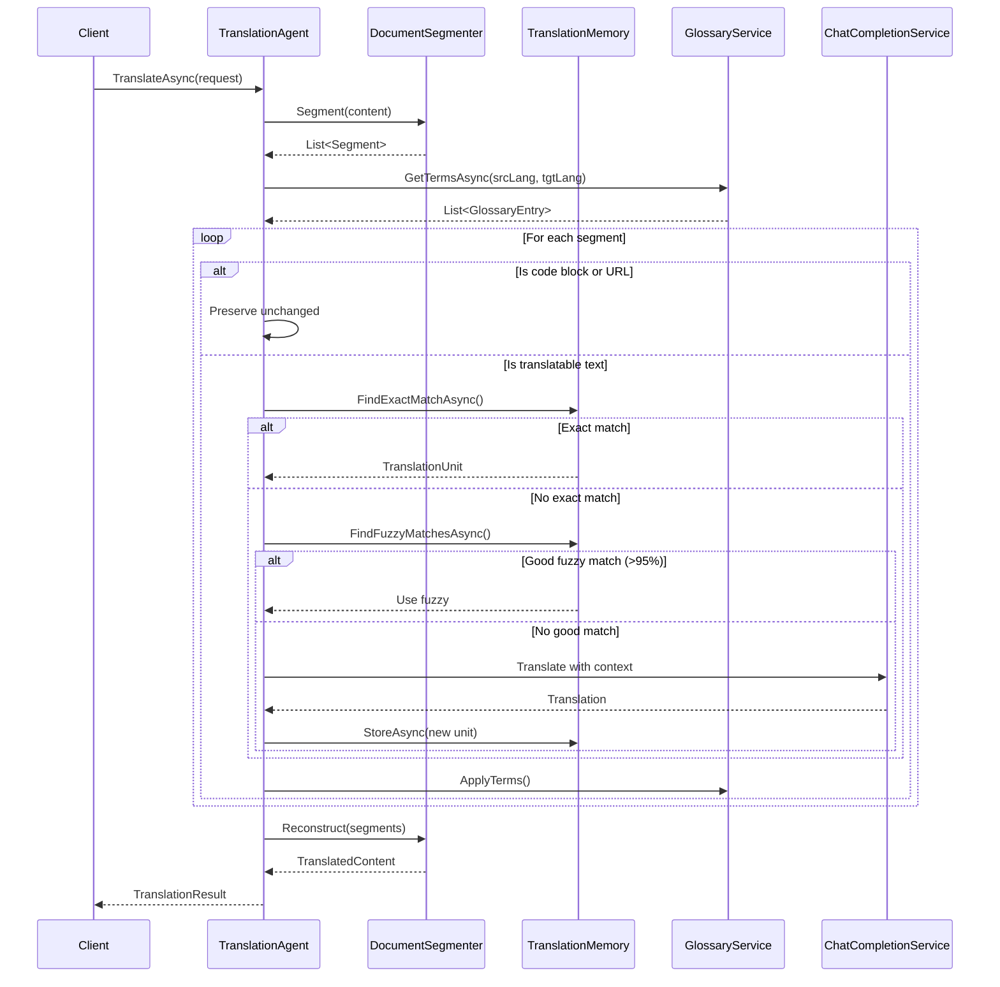

# LCS-DES-087b: Design Specification — AI Translation Agent

## 1. Metadata & Categorization

| Field | Value | Description |
| :--- | :--- | :--- |
| **Feature ID** | `PUB-087b` | Sub-part of PUB-087 |
| **Feature Name** | `AI Translation Agent` | Context-aware document translation |
| **Target Version** | `v0.8.7b` | Second sub-part of v0.8.7 |
| **Module Scope** | `Lexichord.Modules.Publishing` | Publishing module |
| **Swimlane** | `Publishing` | Part of Publisher vertical |
| **License Tier** | `Teams` | Teams tier required |
| **Feature Gate Key** | `FeatureFlags.Publishing.TranslationAgent` | License gate key |
| **Author** | Lead Architect | |
| **Status** | `Draft` | |
| **Last Updated** | `2026-01-27` | |
| **Parent Document** | [LCS-DES-087-INDEX](./LCS-DES-087-INDEX.md) | |
| **Scope Breakdown** | [LCS-SBD-087 Section 3.2](./LCS-SBD-087.md#32-v087b-ai-translation-agent) | |

---

## 2. Executive Summary

### 2.1 The Requirement

Traditional machine translation tools fail to meet the needs of technical documentation because:

- They break markdown formatting, code blocks, and URLs
- They lack context awareness (preceding/following text)
- They ignore domain-specific terminology from glossaries
- They produce inconsistent translations for repeated segments
- They cannot leverage existing Translation Memory

> **Goal:** Translate documents using AI while preserving formatting, applying glossary terms, leveraging Translation Memory, and maintaining contextual coherence.

### 2.2 The Proposed Solution

Implement an AI Translation Agent that:

1. Segments documents intelligently (respecting markdown structure)
2. Consults Translation Memory before invoking AI
3. Provides context (preceding/following segments) to AI
4. Applies glossary term corrections post-translation
5. Preserves code blocks, URLs, and placeholders unchanged
6. Stores new translations in TM for future reuse

---

## 3. Architecture & Modular Strategy

### 3.1 Dependencies

#### 3.1.1 Upstream Dependencies

| Interface | Source Version | Purpose |
| :--- | :--- | :--- |
| `IChatCompletionService` | v0.6.1a | LLM for translation |
| `IPromptRenderer` | v0.6.3b | Template rendering |
| `IPromptTemplateRepository` | v0.6.3b | Prompt templates |
| `BaseAgent` | v0.6.6a | Agent base class |
| `ITranslationMemoryService` | v0.8.7a | TM lookup |
| `IGlossaryService` | v0.8.7c | Term enforcement |
| `IMarkdownParser` | v0.1.3b | Document parsing |
| `ILicenseContext` | v0.0.4c | Feature gating |

#### 3.1.2 NuGet Packages

| Package | Version | Purpose |
| :--- | :--- | :--- |
| `Markdig` | 0.37.x | Markdown parsing |

### 3.2 Licensing Behavior

| Tier | Behavior |
| :--- | :--- |
| Core | Translation unavailable, shows upgrade prompt |
| WriterPro | Translation unavailable, shows upgrade prompt |
| Teams | Full translation functionality |
| Enterprise | Full translation + priority processing |

---

## 4. Data Contract (The API)

### 4.1 Core Interfaces

```csharp
namespace Lexichord.Abstractions.Contracts.Localization;

/// <summary>
/// AI-powered translation agent that translates documents with context awareness.
/// </summary>
public interface ITranslationAgent
{
    /// <summary>
    /// Translates a document from source to target language.
    /// </summary>
    /// <param name="request">Translation request with source content and options.</param>
    /// <param name="progress">Progress reporter for translation status.</param>
    /// <param name="cancellationToken">Cancellation token.</param>
    /// <returns>Translation result with translated content and statistics.</returns>
    Task<TranslationResult> TranslateAsync(
        TranslationRequest request,
        IProgress<TranslationProgress>? progress = null,
        CancellationToken cancellationToken = default);

    /// <summary>
    /// Translates a single segment with Translation Memory lookup.
    /// </summary>
    /// <param name="sourceText">The source text to translate.</param>
    /// <param name="context">Translation context including languages and options.</param>
    /// <param name="cancellationToken">Cancellation token.</param>
    /// <returns>Segment translation result.</returns>
    Task<SegmentTranslationResult> TranslateSegmentAsync(
        string sourceText,
        TranslationContext context,
        CancellationToken cancellationToken = default);

    /// <summary>
    /// Estimates the quality of an existing translation.
    /// </summary>
    /// <param name="sourceText">The original source text.</param>
    /// <param name="translatedText">The translated text to evaluate.</param>
    /// <param name="sourceLanguage">Source language code.</param>
    /// <param name="targetLanguage">Target language code.</param>
    /// <param name="cancellationToken">Cancellation token.</param>
    /// <returns>Quality estimate with scores and issues.</returns>
    Task<TranslationQualityEstimate> EstimateQualityAsync(
        string sourceText,
        string translatedText,
        string sourceLanguage,
        string targetLanguage,
        CancellationToken cancellationToken = default);

    /// <summary>
    /// Suggests improvements for an existing translation.
    /// </summary>
    /// <param name="sourceText">The original source text.</param>
    /// <param name="translatedText">The current translation.</param>
    /// <param name="context">Translation context.</param>
    /// <param name="cancellationToken">Cancellation token.</param>
    /// <returns>List of improvement suggestions.</returns>
    Task<IReadOnlyList<TranslationSuggestion>> SuggestImprovementsAsync(
        string sourceText,
        string translatedText,
        TranslationContext context,
        CancellationToken cancellationToken = default);

    /// <summary>
    /// Gets the list of supported language pairs.
    /// </summary>
    /// <param name="cancellationToken">Cancellation token.</param>
    /// <returns>List of supported language pairs.</returns>
    Task<IReadOnlyList<LanguagePair>> GetSupportedLanguagePairsAsync(
        CancellationToken cancellationToken = default);
}
```

### 4.2 Request/Response Models

```csharp
namespace Lexichord.Abstractions.Contracts.Localization;

/// <summary>
/// Request for translating a document.
/// </summary>
public record TranslationRequest
{
    /// <summary>The source content to translate.</summary>
    public required string SourceContent { get; init; }

    /// <summary>Source language code (e.g., "en-US").</summary>
    public required string SourceLanguage { get; init; }

    /// <summary>Target language code (e.g., "de-DE").</summary>
    public required string TargetLanguage { get; init; }

    /// <summary>Format of the source content.</summary>
    public ContentFormat Format { get; init; } = ContentFormat.Markdown;

    /// <summary>Translation options.</summary>
    public TranslationOptions Options { get; init; } = new();

    /// <summary>Path to source document (for context).</summary>
    public string? DocumentPath { get; init; }

    /// <summary>Project context for domain-specific translation.</summary>
    public string? ProjectContext { get; init; }

    /// <summary>Optional custom prompt instructions.</summary>
    public string? CustomInstructions { get; init; }
}

/// <summary>
/// Content format of the source document.
/// </summary>
public enum ContentFormat
{
    /// <summary>Plain text without formatting.</summary>
    PlainText,

    /// <summary>Markdown formatted text.</summary>
    Markdown,

    /// <summary>HTML formatted text.</summary>
    Html,

    /// <summary>reStructuredText format.</summary>
    Rst
}

/// <summary>
/// Options controlling translation behavior.
/// </summary>
public record TranslationOptions
{
    /// <summary>Whether to use Translation Memory for matching.</summary>
    public bool UseTranslationMemory { get; init; } = true;

    /// <summary>Whether to use glossary for term enforcement.</summary>
    public bool UseGlossary { get; init; } = true;

    /// <summary>Whether to preserve markdown/HTML formatting.</summary>
    public bool PreserveFormatting { get; init; } = true;

    /// <summary>Whether to preserve code blocks unchanged.</summary>
    public bool PreserveCodeBlocks { get; init; } = true;

    /// <summary>Whether to preserve URLs unchanged.</summary>
    public bool PreserveUrls { get; init; } = true;

    /// <summary>Whether to preserve placeholders like {{variable}}.</summary>
    public bool PreservePlaceholders { get; init; } = true;

    /// <summary>Tone to use in translation.</summary>
    public TranslationTone Tone { get; init; } = TranslationTone.Formal;

    /// <summary>Minimum TM match threshold for fuzzy matches.</summary>
    public double MinTmMatchThreshold { get; init; } = 0.85;

    /// <summary>Maximum segment length before splitting.</summary>
    public int MaxSegmentLength { get; init; } = 500;

    /// <summary>Whether to store new AI translations in TM.</summary>
    public bool StoreNewTranslations { get; init; } = true;

    /// <summary>Number of context segments before/after.</summary>
    public int ContextWindowSize { get; init; } = 2;
}

/// <summary>
/// Tone to use in translation.
/// </summary>
public enum TranslationTone
{
    /// <summary>Formal, professional tone.</summary>
    Formal,

    /// <summary>Casual, friendly tone.</summary>
    Informal,

    /// <summary>Technical, precise tone.</summary>
    Technical,

    /// <summary>Conversational, approachable tone.</summary>
    Conversational,

    /// <summary>Academic, scholarly tone.</summary>
    Academic
}

/// <summary>
/// Result of a document translation.
/// </summary>
public record TranslationResult
{
    /// <summary>The translated content.</summary>
    public required string TranslatedContent { get; init; }

    /// <summary>Source language of the translation.</summary>
    public required string SourceLanguage { get; init; }

    /// <summary>Target language of the translation.</summary>
    public required string TargetLanguage { get; init; }

    /// <summary>Translation statistics.</summary>
    public TranslationStats Stats { get; init; } = new();

    /// <summary>Individual translated segments.</summary>
    public IReadOnlyList<TranslationSegment> Segments { get; init; } = [];

    /// <summary>Warnings generated during translation.</summary>
    public IReadOnlyList<TranslationWarning> Warnings { get; init; } = [];

    /// <summary>When the translation was completed.</summary>
    public DateTime TranslatedAt { get; init; } = DateTime.UtcNow;

    /// <summary>Total time taken for translation.</summary>
    public TimeSpan ElapsedTime { get; init; }

    /// <summary>Estimated overall quality score (0-100).</summary>
    public double? QualityScore { get; init; }
}

/// <summary>
/// Statistics about the translation.
/// </summary>
public record TranslationStats
{
    /// <summary>Total number of segments translated.</summary>
    public int TotalSegments { get; init; }

    /// <summary>Segments matched exactly from TM.</summary>
    public int TmExactMatches { get; init; }

    /// <summary>Segments matched with fuzzy matching from TM.</summary>
    public int TmFuzzyMatches { get; init; }

    /// <summary>Segments translated by AI.</summary>
    public int AiTranslated { get; init; }

    /// <summary>Segments preserved unchanged (code, URLs).</summary>
    public int PreservedSegments { get; init; }

    /// <summary>Glossary terms applied.</summary>
    public int GlossaryTermsApplied { get; init; }

    /// <summary>Total word count in source.</summary>
    public int SourceWordCount { get; init; }

    /// <summary>Total word count in translation.</summary>
    public int TargetWordCount { get; init; }

    /// <summary>Total character count in source.</summary>
    public int SourceCharacterCount { get; init; }

    /// <summary>Total character count in translation.</summary>
    public int TargetCharacterCount { get; init; }

    /// <summary>LLM tokens used for translation.</summary>
    public int TokensUsed { get; init; }
}

/// <summary>
/// A single translated segment with metadata.
/// </summary>
public record TranslationSegment
{
    /// <summary>Original source text.</summary>
    public required string SourceText { get; init; }

    /// <summary>Translated target text.</summary>
    public required string TargetText { get; init; }

    /// <summary>Origin of this translation.</summary>
    public SegmentOrigin Origin { get; init; }

    /// <summary>TM similarity score if from TM.</summary>
    public double? Similarity { get; init; }

    /// <summary>Quality score for this segment.</summary>
    public double? QualityScore { get; init; }

    /// <summary>Position in source document.</summary>
    public int SourcePosition { get; init; }

    /// <summary>Position in target document.</summary>
    public int TargetPosition { get; init; }

    /// <summary>Segment type (text, code, heading, etc.).</summary>
    public SegmentType Type { get; init; } = SegmentType.Text;
}

/// <summary>
/// Origin of a translated segment.
/// </summary>
public enum SegmentOrigin
{
    /// <summary>100% match from Translation Memory.</summary>
    TranslationMemoryExact,

    /// <summary>Fuzzy match from Translation Memory.</summary>
    TranslationMemoryFuzzy,

    /// <summary>Translated by AI.</summary>
    AiTranslation,

    /// <summary>Taken from glossary.</summary>
    Glossary,

    /// <summary>Preserved unchanged (code, URL, etc.).</summary>
    Preserved
}

/// <summary>
/// Type of segment in the document.
/// </summary>
public enum SegmentType
{
    Text,
    Heading,
    ListItem,
    CodeBlock,
    InlineCode,
    Link,
    Image,
    Table,
    Blockquote,
    Paragraph
}

/// <summary>
/// Context for translating a segment.
/// </summary>
public record TranslationContext
{
    /// <summary>Source language code.</summary>
    public required string SourceLanguage { get; init; }

    /// <summary>Target language code.</summary>
    public required string TargetLanguage { get; init; }

    /// <summary>Domain or subject area.</summary>
    public string? Domain { get; init; }

    /// <summary>Project name for context.</summary>
    public string? Project { get; init; }

    /// <summary>Preceding context text.</summary>
    public string? PrecedingContext { get; init; }

    /// <summary>Following context text.</summary>
    public string? FollowingContext { get; init; }

    /// <summary>Translation options.</summary>
    public TranslationOptions Options { get; init; } = new();

    /// <summary>Glossary terms for this translation.</summary>
    public IReadOnlyList<GlossaryEntry>? GlossaryTerms { get; init; }
}

/// <summary>
/// Result of translating a single segment.
/// </summary>
public record SegmentTranslationResult(
    string TranslatedText,
    SegmentOrigin Origin,
    double? Similarity,
    double? QualityScore,
    IReadOnlyList<string>? Alternatives);

/// <summary>
/// Quality estimate for a translation.
/// </summary>
public record TranslationQualityEstimate(
    double OverallScore,
    double FluencyScore,
    double AdequacyScore,
    double TerminologyScore,
    double StyleScore,
    IReadOnlyList<QualityIssue> Issues);

/// <summary>
/// Specific quality issue in a translation.
/// </summary>
public record QualityIssue(
    QualityIssueType Type,
    string Description,
    string? SourceFragment,
    string? TargetFragment,
    string? Suggestion,
    int? Position);

/// <summary>
/// Type of quality issue.
/// </summary>
public enum QualityIssueType
{
    MissingTranslation,
    IncorrectTerminology,
    GrammarError,
    StyleMismatch,
    Undertranslation,
    Overtranslation,
    Inconsistency,
    FormattingIssue
}

/// <summary>
/// Suggestion for improving a translation.
/// </summary>
public record TranslationSuggestion(
    string OriginalFragment,
    string SuggestedFragment,
    string Reason,
    SuggestionPriority Priority,
    int Position);

/// <summary>
/// Priority of a translation suggestion.
/// </summary>
public enum SuggestionPriority
{
    Low,
    Medium,
    High,
    Critical
}

/// <summary>
/// A supported language pair for translation.
/// </summary>
public record LanguagePair(
    string SourceLanguage,
    string SourceLanguageName,
    string TargetLanguage,
    string TargetLanguageName,
    double QualityRating);

/// <summary>
/// Warning during translation.
/// </summary>
public record TranslationWarning(
    WarningLevel Level,
    string Message,
    string? SourceSegment,
    int? Position);

/// <summary>
/// Warning severity level.
/// </summary>
public enum WarningLevel
{
    Info,
    Warning,
    Error
}

/// <summary>
/// Progress during translation.
/// </summary>
public record TranslationProgress(
    int CurrentSegment,
    int TotalSegments,
    string? CurrentText,
    TranslationPhase Phase,
    double PercentComplete);

/// <summary>
/// Phase of translation process.
/// </summary>
public enum TranslationPhase
{
    Initializing,
    LoadingResources,
    Segmenting,
    LookingUpTm,
    Translating,
    ApplyingGlossary,
    ValidatingQuality,
    Finalizing
}
```

---

## 5. Implementation Logic

### 5.1 Translation Flow



### 5.2 Segment Processing Decision Tree

```text
ProcessSegment(segment):
│
├── Is segment a code block?
│   └── YES → RETURN (preserve unchanged, Origin: Preserved)
│
├── Is segment a URL?
│   └── YES → RETURN (preserve unchanged, Origin: Preserved)
│
├── Is segment a placeholder pattern?
│   └── YES → RETURN (preserve unchanged, Origin: Preserved)
│
├── Is segment inline code?
│   └── YES → RETURN (preserve unchanged, Origin: Preserved)
│
├── Is TM enabled?
│   ├── YES → Check TM for exact match
│   │         ├── FOUND → RETURN (TM translation, Origin: TM_Exact)
│   │         └── NOT FOUND → Check TM for fuzzy match
│   │                         ├── FOUND (>= 95%) → RETURN (fuzzy, Origin: TM_Fuzzy)
│   │                         └── NOT FOUND → Continue to AI
│   └── NO → Continue to AI
│
├── Translate with AI:
│   ├── Build context (preceding + following segments)
│   ├── Include glossary terms in prompt
│   ├── Call LLM with translation prompt
│   └── Extract translation from response
│
├── Apply glossary corrections
│
├── Store in TM (if enabled)
│
└── RETURN (translation, Origin: AI_Translation)
```

### 5.3 Document Segmentation Strategy

```text
SegmentDocument(content, format):
│
├── IF format == Markdown:
│   ├── Parse with Markdig
│   ├── Walk AST, extract segments:
│   │   ├── HeadingBlock → Segment(Type: Heading)
│   │   ├── ParagraphBlock → Segment(Type: Paragraph)
│   │   ├── ListItemBlock → Segment(Type: ListItem)
│   │   ├── FencedCodeBlock → Segment(Type: CodeBlock, Preserve: true)
│   │   ├── CodeInline → Mark inline code spans
│   │   ├── LinkInline → Segment(Type: Link)
│   │   └── Table → Segment cells individually
│   └── RETURN segments with positions
│
├── IF format == PlainText:
│   ├── Split by sentence boundaries
│   ├── Respect paragraph breaks
│   └── RETURN segments
│
├── IF format == HTML:
│   ├── Parse with HtmlAgilityPack
│   ├── Extract text nodes
│   └── RETURN segments
│
└── DEFAULT: Treat as PlainText
```

---

## 6. Implementation Details

### 6.1 Translation Agent Implementation

```csharp
namespace Lexichord.Modules.Publishing.Agents;

/// <summary>
/// AI-powered translation agent using LLM for context-aware translation.
/// </summary>
[RequiresLicense(LicenseTier.Teams)]
[AgentDefinition("translator", "Translation Agent", "Translates documents with context awareness")]
public class TranslationAgent : BaseAgent, ITranslationAgent
{
    private readonly ITranslationMemoryService _translationMemory;
    private readonly IGlossaryService _glossary;
    private readonly IDocumentSegmenter _segmenter;
    private readonly ILogger<TranslationAgent> _logger;

    public TranslationAgent(
        IChatCompletionService llm,
        IPromptRenderer renderer,
        IPromptTemplateRepository templates,
        ITranslationMemoryService translationMemory,
        IGlossaryService glossary,
        IDocumentSegmenter segmenter,
        ILogger<TranslationAgent> logger)
        : base(llm, renderer, templates, logger)
    {
        _translationMemory = translationMemory;
        _glossary = glossary;
        _segmenter = segmenter;
        _logger = logger;
    }

    public async Task<TranslationResult> TranslateAsync(
        TranslationRequest request,
        IProgress<TranslationProgress>? progress = null,
        CancellationToken cancellationToken = default)
    {
        var stopwatch = Stopwatch.StartNew();
        var warnings = new List<TranslationWarning>();
        var segments = new List<TranslationSegment>();

        _logger.LogInfo(
            "Starting translation: {SourceLang} -> {TargetLang}, {Length} chars",
            request.SourceLanguage,
            request.TargetLanguage,
            request.SourceContent.Length);

        // Phase 1: Initialize
        progress?.Report(new TranslationProgress(0, 0, null, TranslationPhase.Initializing, 0));

        // Phase 2: Segment the document
        progress?.Report(new TranslationProgress(0, 0, null, TranslationPhase.Segmenting, 5));
        var sourceSegments = _segmenter.Segment(request.SourceContent, request.Format);

        _logger.LogDebug("Document segmented into {Count} segments", sourceSegments.Count);

        // Phase 3: Load glossary terms
        progress?.Report(new TranslationProgress(0, sourceSegments.Count, null, TranslationPhase.LoadingResources, 10));
        var glossaryTerms = request.Options.UseGlossary
            ? await _glossary.GetTermsAsync(request.SourceLanguage, request.TargetLanguage, cancellationToken)
            : [];

        _logger.LogDebug("Loaded {Count} glossary terms", glossaryTerms.Count);

        // Initialize stats
        int tmExactMatches = 0, tmFuzzyMatches = 0, aiTranslated = 0, preserved = 0;
        int tokensUsed = 0;

        // Phase 4: Translate each segment
        for (int i = 0; i < sourceSegments.Count; i++)
        {
            cancellationToken.ThrowIfCancellationRequested();

            var segment = sourceSegments[i];
            var percentComplete = 10 + (int)(80.0 * i / sourceSegments.Count);

            progress?.Report(new TranslationProgress(
                i + 1, sourceSegments.Count, segment.Text.Truncate(50),
                TranslationPhase.Translating, percentComplete));

            // Check if segment should be preserved
            if (ShouldPreserve(segment, request.Options))
            {
                segments.Add(new TranslationSegment
                {
                    SourceText = segment.Text,
                    TargetText = segment.Text,
                    Origin = SegmentOrigin.Preserved,
                    SourcePosition = segment.Position,
                    TargetPosition = segments.Sum(s => s.TargetText.Length),
                    Type = segment.Type
                });
                preserved++;
                continue;
            }

            // Build translation context
            var context = new TranslationContext
            {
                SourceLanguage = request.SourceLanguage,
                TargetLanguage = request.TargetLanguage,
                Domain = request.ProjectContext,
                PrecedingContext = GetPrecedingContext(sourceSegments, i, request.Options.ContextWindowSize),
                FollowingContext = GetFollowingContext(sourceSegments, i, request.Options.ContextWindowSize),
                Options = request.Options,
                GlossaryTerms = glossaryTerms
            };

            // Translate segment
            var result = await TranslateSegmentInternalAsync(segment.Text, context, cancellationToken);

            segments.Add(new TranslationSegment
            {
                SourceText = segment.Text,
                TargetText = result.TranslatedText,
                Origin = result.Origin,
                Similarity = result.Similarity,
                QualityScore = result.QualityScore,
                SourcePosition = segment.Position,
                TargetPosition = segments.Sum(s => s.TargetText.Length),
                Type = segment.Type
            });

            // Update stats
            switch (result.Origin)
            {
                case SegmentOrigin.TranslationMemoryExact: tmExactMatches++; break;
                case SegmentOrigin.TranslationMemoryFuzzy: tmFuzzyMatches++; break;
                case SegmentOrigin.AiTranslation: aiTranslated++; break;
            }

            // Store AI translation in TM
            if (result.Origin == SegmentOrigin.AiTranslation && request.Options.StoreNewTranslations)
            {
                await _translationMemory.StoreAsync(new TranslationUnit
                {
                    SourceText = segment.Text,
                    TargetText = result.TranslatedText,
                    SourceLanguage = request.SourceLanguage,
                    TargetLanguage = request.TargetLanguage,
                    Status = TranslationStatus.Translated,
                    Domain = request.ProjectContext
                }, cancellationToken);
            }
        }

        // Phase 5: Reconstruct document
        progress?.Report(new TranslationProgress(
            sourceSegments.Count, sourceSegments.Count, null, TranslationPhase.Finalizing, 95));

        var translatedContent = _segmenter.Reconstruct(
            segments.Select(s => (s.SourceText, s.TargetText, s.Type)).ToList(),
            request.Format);

        stopwatch.Stop();

        progress?.Report(new TranslationProgress(
            sourceSegments.Count, sourceSegments.Count, null, TranslationPhase.Finalizing, 100));

        var translationResult = new TranslationResult
        {
            TranslatedContent = translatedContent,
            SourceLanguage = request.SourceLanguage,
            TargetLanguage = request.TargetLanguage,
            Stats = new TranslationStats
            {
                TotalSegments = sourceSegments.Count,
                TmExactMatches = tmExactMatches,
                TmFuzzyMatches = tmFuzzyMatches,
                AiTranslated = aiTranslated,
                PreservedSegments = preserved,
                GlossaryTermsApplied = glossaryTerms.Count,
                SourceWordCount = CountWords(request.SourceContent),
                TargetWordCount = CountWords(translatedContent),
                SourceCharacterCount = request.SourceContent.Length,
                TargetCharacterCount = translatedContent.Length,
                TokensUsed = tokensUsed
            },
            Segments = segments,
            Warnings = warnings,
            ElapsedTime = stopwatch.Elapsed
        };

        _logger.LogInfo(
            "Translation completed: {Segments} segments, {TmExact} TM exact, {TmFuzzy} TM fuzzy, {Ai} AI in {Elapsed}",
            sourceSegments.Count, tmExactMatches, tmFuzzyMatches, aiTranslated, stopwatch.Elapsed);

        return translationResult;
    }

    public async Task<SegmentTranslationResult> TranslateSegmentAsync(
        string sourceText,
        TranslationContext context,
        CancellationToken cancellationToken = default)
    {
        return await TranslateSegmentInternalAsync(sourceText, context, cancellationToken);
    }

    private async Task<SegmentTranslationResult> TranslateSegmentInternalAsync(
        string sourceText,
        TranslationContext context,
        CancellationToken cancellationToken)
    {
        // Step 1: Check for exact TM match
        if (context.Options.UseTranslationMemory)
        {
            var exactMatch = await _translationMemory.FindExactMatchAsync(
                sourceText, context.SourceLanguage, context.TargetLanguage, cancellationToken);

            if (exactMatch is not null)
            {
                _logger.LogDebug("TM exact match found for: '{Text}'", sourceText.Truncate(50));
                return new SegmentTranslationResult(
                    exactMatch.TargetText,
                    SegmentOrigin.TranslationMemoryExact,
                    1.0,
                    null,
                    null);
            }

            // Step 2: Check for fuzzy TM match
            var fuzzyMatches = await _translationMemory.FindFuzzyMatchesAsync(
                sourceText, context.SourceLanguage, context.TargetLanguage,
                context.Options.MinTmMatchThreshold, 3, cancellationToken);

            if (fuzzyMatches.Count > 0)
            {
                var bestMatch = fuzzyMatches[0];
                if (bestMatch.Similarity >= 0.95)
                {
                    _logger.LogDebug(
                        "TM fuzzy match ({Similarity:P0}) found for: '{Text}'",
                        bestMatch.Similarity, sourceText.Truncate(50));

                    return new SegmentTranslationResult(
                        bestMatch.Unit.TargetText,
                        SegmentOrigin.TranslationMemoryFuzzy,
                        bestMatch.Similarity,
                        null,
                        fuzzyMatches.Skip(1).Select(m => m.Unit.TargetText).ToList());
                }
            }
        }

        // Step 3: AI Translation
        _logger.LogDebug("Translating with AI: '{Text}'", sourceText.Truncate(50));

        var translated = await TranslateWithAiAsync(sourceText, context, cancellationToken);

        // Step 4: Apply glossary terms
        if (context.Options.UseGlossary && context.GlossaryTerms?.Count > 0)
        {
            translated = ApplyGlossaryTerms(translated, sourceText, context.GlossaryTerms);
        }

        return new SegmentTranslationResult(
            translated,
            SegmentOrigin.AiTranslation,
            null,
            null,
            null);
    }

    private async Task<string> TranslateWithAiAsync(
        string sourceText,
        TranslationContext context,
        CancellationToken cancellationToken)
    {
        var promptContext = new Dictionary<string, object>
        {
            ["source_text"] = sourceText,
            ["source_language"] = GetLanguageDisplayName(context.SourceLanguage),
            ["target_language"] = GetLanguageDisplayName(context.TargetLanguage),
            ["tone"] = context.Options.Tone.ToString().ToLower()
        };

        if (!string.IsNullOrEmpty(context.PrecedingContext))
            promptContext["preceding_context"] = context.PrecedingContext;

        if (!string.IsNullOrEmpty(context.FollowingContext))
            promptContext["following_context"] = context.FollowingContext;

        if (context.GlossaryTerms?.Count > 0)
            promptContext["glossary_terms"] = FormatGlossaryForPrompt(context.GlossaryTerms, context.TargetLanguage);

        var response = await InvokeAsync(new AgentRequest(
            "Translate the following text",
            null,
            promptContext), cancellationToken);

        return response.Content.Trim();
    }

    private string ApplyGlossaryTerms(
        string translatedText,
        string sourceText,
        IReadOnlyList<GlossaryEntry> terms)
    {
        var result = translatedText;

        foreach (var term in terms)
        {
            // Check if source term appears in source text
            if (sourceText.Contains(term.SourceTerm, StringComparison.OrdinalIgnoreCase))
            {
                // Get target language translation
                if (term.Translations.TryGetValue(_currentTargetLanguage, out var targetTerm))
                {
                    // Replace incorrect translations with glossary term
                    result = EnforceGlossaryTerm(result, targetTerm, term);
                }
            }
        }

        return result;
    }

    private bool ShouldPreserve(DocumentSegment segment, TranslationOptions options)
    {
        if (options.PreserveCodeBlocks && segment.Type == SegmentType.CodeBlock)
            return true;

        if (options.PreserveUrls && IsUrl(segment.Text))
            return true;

        if (options.PreservePlaceholders && ContainsPlaceholder(segment.Text))
            return true;

        if (segment.Type == SegmentType.InlineCode && options.PreserveCodeBlocks)
            return true;

        return false;
    }

    private static bool IsUrl(string text) =>
        Uri.TryCreate(text.Trim(), UriKind.Absolute, out var uri) &&
        (uri.Scheme == Uri.UriSchemeHttp || uri.Scheme == Uri.UriSchemeHttps);

    private static bool ContainsPlaceholder(string text) =>
        Regex.IsMatch(text, @"\{\{[^}]+\}\}") ||
        Regex.IsMatch(text, @"\$\{[^}]+\}") ||
        Regex.IsMatch(text, @"%[a-zA-Z_]+%");

    private string? GetPrecedingContext(
        IReadOnlyList<DocumentSegment> segments,
        int currentIndex,
        int windowSize)
    {
        if (currentIndex == 0 || windowSize == 0) return null;

        var start = Math.Max(0, currentIndex - windowSize);
        var contextSegments = segments.Skip(start).Take(currentIndex - start);

        return string.Join(" ", contextSegments
            .Where(s => s.Type != SegmentType.CodeBlock)
            .Select(s => s.Text.Truncate(100)));
    }

    private string? GetFollowingContext(
        IReadOnlyList<DocumentSegment> segments,
        int currentIndex,
        int windowSize)
    {
        if (currentIndex >= segments.Count - 1 || windowSize == 0) return null;

        var contextSegments = segments.Skip(currentIndex + 1).Take(windowSize);

        return string.Join(" ", contextSegments
            .Where(s => s.Type != SegmentType.CodeBlock)
            .Select(s => s.Text.Truncate(100)));
    }

    private static string GetLanguageDisplayName(string code) => code switch
    {
        "en-US" => "English",
        "de-DE" => "German",
        "fr-FR" => "French",
        "es-ES" => "Spanish",
        "it-IT" => "Italian",
        "pt-BR" => "Portuguese (Brazil)",
        "ja-JP" => "Japanese",
        "ko-KR" => "Korean",
        "zh-CN" => "Chinese (Simplified)",
        "ar-SA" => "Arabic",
        _ => code
    };

    private static int CountWords(string text) =>
        text.Split([' ', '\n', '\r', '\t'], StringSplitOptions.RemoveEmptyEntries).Length;
}
```

### 6.2 Translation Prompt Template

```yaml
template_id: "translation-agent"
version: "1.0"
description: "Prompt template for AI-powered document translation"

system_prompt: |
  You are a professional translator specializing in technical documentation.
  Your translations must be accurate, natural-sounding, and preserve the original meaning.

  ## Translation Guidelines

  1. **Accuracy**: Translate the meaning faithfully. Do not add or remove information.

  2. **Tone**: Use a {{tone}} tone appropriate for technical documentation.

  3. **Formatting**: Preserve ALL formatting exactly:
     - Keep markdown syntax (**, *, #, -, etc.) in the same positions
     - Keep line breaks and paragraph structure
     - Keep any HTML tags unchanged

  4. **Code**: NEVER translate:
     - Code blocks (```...```)
     - Inline code (`...`)
     - Variable names, function names, class names
     - File paths and URLs
     - Placeholders like {{variable}} or ${name}

  5. **Technical Terms**: Use consistent terminology:
     {{#glossary_terms}}
     - "{{source}}" must be translated as "{{target}}"
     {{/glossary_terms}}

  6. **Context Awareness**:
     {{#preceding_context}}
     Previous context: {{preceding_context}}
     {{/preceding_context}}
     {{#following_context}}
     Following context: {{following_context}}
     {{/following_context}}

  7. **Output**: Respond with ONLY the translated text. No explanations, no notes.

user_prompt: |
  Translate the following text from {{source_language}} to {{target_language}}:

  {{source_text}}

output_format: "plain"
temperature: 0.3
max_tokens: 2000
```

---

## 7. UI/UX Specifications

### 7.1 Translation Preview View Layout

```text
+------------------------------------------------------------------------------+
|  Translation Preview                                    [Accept All] [Export]|
+------------------------------------------------------------------------------+
|  Source: English (en-US)           |  Target: German (de-DE)                |
|  document.md                       |  Status: Translating...                 |
+------------------------------------+-----------------------------------------+
|  ## Introduction                   |  ## Einleitung                          |
|                                    |                                         |
|  Welcome to Lexichord, the AI-     |  Willkommen bei Lexichord, dem KI-     |
|  powered writing assistant.        |  gestutzten Schreibassistenten.        |
|                                    |                                         |
|  [TM 100%] Click **Save** to       |  Klicken Sie auf **Speichern**, um     |
|  preserve your work.               |  Ihre Arbeit zu sichern.               |
|                                    |                                         |
|  ```python                         |  ```python                              |
|  def hello():                      |  def hello():                           |
|      print("Hello")                |      print("Hello")                     |
|  ```                               |  ```                                    |
|                                    |                                         |
|  [AI] This feature requires a      |  Diese Funktion erfordert eine         |
|  Teams license.                    |  Teams-Lizenz.                         |
+------------------------------------+-----------------------------------------+
|  Segment 45/52  |  TM: 23 exact, 12 fuzzy  |  AI: 10  |  Elapsed: 00:02:34  |
+------------------------------------------------------------------------------+
```

### 7.2 Segment Origin Badges

| Badge | Color | Description |
| :--- | :--- | :--- |
| `[TM 100%]` | Green | Exact match from Translation Memory |
| `[TM 95%]` | Yellow | Fuzzy match from Translation Memory |
| `[AI]` | Blue | Translated by AI |
| `[PRE]` | Gray | Preserved unchanged |
| `[GLO]` | Purple | Glossary term applied |

---

## 8. Observability & Logging

| Level | Message Template |
| :--- | :--- |
| Info | `"Starting translation: {SourceLang} -> {TargetLang}, {Length} chars"` |
| Debug | `"Document segmented into {Count} segments"` |
| Debug | `"Loaded {Count} glossary terms"` |
| Debug | `"TM exact match found for: '{Text}'"` |
| Debug | `"TM fuzzy match ({Similarity:P0}) found for: '{Text}'"` |
| Debug | `"Translating with AI: '{Text}'"` |
| Info | `"Translation completed: {Segments} segments in {Elapsed}"` |
| Warning | `"Low quality translation detected: {Segment}"` |
| Error | `"Translation failed for segment {Index}: {Error}"` |

---

## 9. Security & Safety

| Risk | Level | Mitigation |
| :--- | :--- | :--- |
| Prompt injection via source | Medium | Sanitize prompts, escape special chars |
| Sensitive data in translation | Medium | No logging of full content, warn on PII patterns |
| LLM hallucination | Low | Quality estimation, human review workflow |
| Token limit exceeded | Medium | Segment length limits, chunking |

---

## 10. Acceptance Criteria

### 10.1 Functional Criteria

| # | Given | When | Then |
| :--- | :--- | :--- | :--- |
| 1 | Document with code blocks | Translating | Code blocks remain unchanged |
| 2 | Document with URLs | Translating | URLs remain unchanged |
| 3 | TM has exact match | Translating segment | TM translation used |
| 4 | TM has no match | Translating segment | AI translation generated |
| 5 | Glossary has term | Translating | Term enforced in output |
| 6 | Markdown with **bold** | Translating | **bold** preserved in output |
| 7 | Document with placeholders | Translating | {{placeholders}} unchanged |

### 10.2 Performance Criteria

| # | Scenario | Target |
| :--- | :--- | :--- |
| 1 | 1,000 word document | < 30s |
| 2 | 10,000 word document | < 5 min |
| 3 | Segment with TM hit | < 100ms |
| 4 | Segment with AI | < 3s |

---

## 11. Deliverable Checklist

| # | Deliverable | Status |
| :--- | :--- | :--- |
| 1 | `ITranslationAgent` interface | [ ] |
| 2 | `TranslationAgent` implementation | [ ] |
| 3 | `IDocumentSegmenter` interface | [ ] |
| 4 | `MarkdownDocumentSegmenter` | [ ] |
| 5 | Translation prompt template | [ ] |
| 6 | `TranslationPreviewView.axaml` | [ ] |
| 7 | `TranslationPreviewViewModel` | [ ] |
| 8 | Unit tests for segmentation | [ ] |
| 9 | Unit tests for translation | [ ] |
| 10 | Integration tests for full workflow | [ ] |

---

## 12. Verification Commands

```bash
# Run Translation Agent unit tests
dotnet test --filter "Version=v0.8.7b" --logger "console;verbosity=detailed"

# Run segmentation tests
dotnet test --filter "FullyQualifiedName~DocumentSegmenter"

# Run translation integration tests
dotnet test --filter "FullyQualifiedName~TranslationAgent"

# Manual verification: Translate sample document
dotnet run -- translate --input sample.md --source en-US --target de-DE --output sample.de.md
```

---

## Document History

| Version | Date | Author | Changes |
| :--- | :--- | :--- | :--- |
| 1.0 | 2026-01-27 | Lead Architect | Initial draft |
