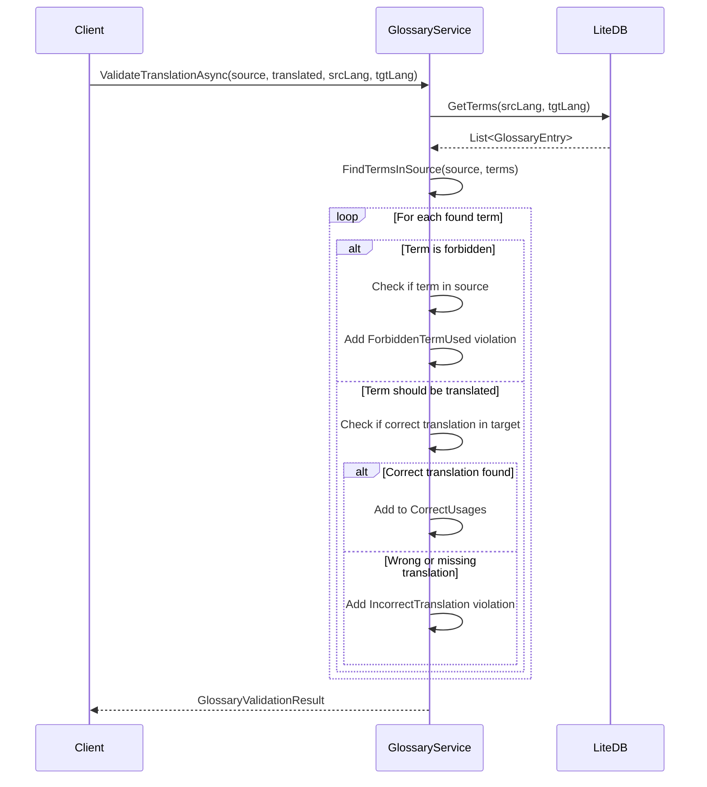

# LCS-DES-087c: Design Specification — Glossary Sync

## 1. Metadata & Categorization

| Field | Value | Description |
| :--- | :--- | :--- |
| **Feature ID** | `PUB-087c` | Sub-part of PUB-087 |
| **Feature Name** | `Glossary Sync` | Terminology consistency enforcement |
| **Target Version** | `v0.8.7c` | Third sub-part of v0.8.7 |
| **Module Scope** | `Lexichord.Modules.Publishing` | Publishing module |
| **Swimlane** | `Publishing` | Part of Publisher vertical |
| **License Tier** | `Teams` | Teams tier required |
| **Feature Gate Key** | `FeatureFlags.Publishing.GlossarySync` | License gate key |
| **Author** | Lead Architect | |
| **Status** | `Draft` | |
| **Last Updated** | `2026-01-27` | |
| **Parent Document** | [LCS-DES-087-INDEX](./LCS-DES-087-INDEX.md) | |
| **Scope Breakdown** | [LCS-SBD-087 Section 3.3](./LCS-SBD-087.md#33-v087c-glossary-sync) | |

---

## 2. Executive Summary

### 2.1 The Requirement

Terminology inconsistency is a major problem in localized documentation:

- Technical terms like "repository" might be translated differently across documents
- Brand names and product names must remain untranslated or follow specific rules
- Some terms are forbidden (e.g., "whitelist") and must be replaced with alternatives
- Different translators may use different terms for the same concept
- Compliance requirements mandate consistent terminology

> **Goal:** Ensure that specific terms are translated consistently across all documents and languages through a centralized, enforceable glossary system.

### 2.2 The Proposed Solution

Implement a Glossary Sync service that:

1. Maintains a multilingual glossary with source terms and translations per language
2. Supports term types (terms, abbreviations, brand names, forbidden terms)
3. Validates translations against the glossary and reports violations
4. Enforces correct terminology during AI translation
5. Imports/exports industry-standard TBX (TermBase eXchange) format
6. Provides a management UI for adding, editing, and organizing terms

---

## 3. Architecture & Modular Strategy

### 3.1 Dependencies

#### 3.1.1 Upstream Dependencies

| Interface | Source Version | Purpose |
| :--- | :--- | :--- |
| `LiteDB` | v0.2.1a | Database storage |
| `IMediator` | v0.0.7a | Event publishing |
| `ILicenseContext` | v0.0.4c | Feature gating |
| `IRegionManager` | v0.1.1b | Panel registration |

#### 3.1.2 NuGet Packages

| Package | Version | Purpose |
| :--- | :--- | :--- |
| `LiteDB` | 5.x | Embedded NoSQL database |

### 3.2 Licensing Behavior

| Tier | Behavior |
| :--- | :--- |
| Core | Glossary manager hidden |
| WriterPro | Glossary manager hidden |
| Teams | Full glossary functionality |
| Enterprise | Full glossary + team sync |

---

## 4. Data Contract (The API)

### 4.1 Core Interfaces

```csharp
namespace Lexichord.Abstractions.Contracts.Localization;

/// <summary>
/// Service for managing multilingual glossary terms and ensuring terminology consistency.
/// </summary>
public interface IGlossaryService
{
    /// <summary>
    /// Adds a new glossary entry.
    /// </summary>
    /// <param name="entry">The glossary entry to add.</param>
    /// <param name="cancellationToken">Cancellation token.</param>
    /// <returns>The added glossary entry with assigned ID.</returns>
    Task<GlossaryEntry> AddEntryAsync(
        GlossaryEntry entry,
        CancellationToken cancellationToken = default);

    /// <summary>
    /// Updates an existing glossary entry.
    /// </summary>
    /// <param name="entry">The glossary entry to update.</param>
    /// <param name="cancellationToken">Cancellation token.</param>
    /// <returns>The updated glossary entry.</returns>
    Task<GlossaryEntry> UpdateEntryAsync(
        GlossaryEntry entry,
        CancellationToken cancellationToken = default);

    /// <summary>
    /// Deletes a glossary entry by ID.
    /// </summary>
    /// <param name="entryId">The ID of the entry to delete.</param>
    /// <param name="cancellationToken">Cancellation token.</param>
    /// <returns>True if deleted, false if not found.</returns>
    Task<bool> DeleteEntryAsync(
        Guid entryId,
        CancellationToken cancellationToken = default);

    /// <summary>
    /// Gets a glossary entry by ID.
    /// </summary>
    /// <param name="entryId">The ID of the entry.</param>
    /// <param name="cancellationToken">Cancellation token.</param>
    /// <returns>The glossary entry, or null if not found.</returns>
    Task<GlossaryEntry?> GetEntryAsync(
        Guid entryId,
        CancellationToken cancellationToken = default);

    /// <summary>
    /// Gets all terms for a language pair.
    /// </summary>
    /// <param name="sourceLanguage">Source language code.</param>
    /// <param name="targetLanguage">Target language code.</param>
    /// <param name="cancellationToken">Cancellation token.</param>
    /// <returns>List of glossary entries with translations for the language pair.</returns>
    Task<IReadOnlyList<GlossaryEntry>> GetTermsAsync(
        string sourceLanguage,
        string targetLanguage,
        CancellationToken cancellationToken = default);

    /// <summary>
    /// Searches glossary entries.
    /// </summary>
    /// <param name="query">The search query.</param>
    /// <param name="cancellationToken">Cancellation token.</param>
    /// <returns>List of matching glossary entries.</returns>
    Task<IReadOnlyList<GlossaryEntry>> SearchAsync(
        GlossaryQuery query,
        CancellationToken cancellationToken = default);

    /// <summary>
    /// Finds terms that appear in the given text.
    /// </summary>
    /// <param name="text">The text to search in.</param>
    /// <param name="sourceLanguage">The language of the text.</param>
    /// <param name="cancellationToken">Cancellation token.</param>
    /// <returns>List of glossary terms found in the text.</returns>
    Task<IReadOnlyList<GlossaryMatch>> FindTermsInTextAsync(
        string text,
        string sourceLanguage,
        CancellationToken cancellationToken = default);

    /// <summary>
    /// Validates that a translation uses correct glossary terms.
    /// </summary>
    /// <param name="sourceText">The original source text.</param>
    /// <param name="translatedText">The translated text.</param>
    /// <param name="sourceLanguage">Source language code.</param>
    /// <param name="targetLanguage">Target language code.</param>
    /// <param name="cancellationToken">Cancellation token.</param>
    /// <returns>Validation result with any violations found.</returns>
    Task<GlossaryValidationResult> ValidateTranslationAsync(
        string sourceText,
        string translatedText,
        string sourceLanguage,
        string targetLanguage,
        CancellationToken cancellationToken = default);

    /// <summary>
    /// Applies glossary corrections to a translation.
    /// </summary>
    /// <param name="sourceText">The original source text.</param>
    /// <param name="translatedText">The translated text.</param>
    /// <param name="sourceLanguage">Source language code.</param>
    /// <param name="targetLanguage">Target language code.</param>
    /// <param name="cancellationToken">Cancellation token.</param>
    /// <returns>The corrected translation.</returns>
    Task<string> ApplyCorrectionsAsync(
        string sourceText,
        string translatedText,
        string sourceLanguage,
        string targetLanguage,
        CancellationToken cancellationToken = default);

    /// <summary>
    /// Imports glossary entries from TBX format.
    /// </summary>
    /// <param name="tbxStream">Stream containing TBX data.</param>
    /// <param name="options">Import options.</param>
    /// <param name="cancellationToken">Cancellation token.</param>
    /// <returns>Import result with statistics.</returns>
    Task<GlossaryImportResult> ImportTbxAsync(
        Stream tbxStream,
        GlossaryImportOptions? options = null,
        CancellationToken cancellationToken = default);

    /// <summary>
    /// Exports glossary entries to TBX format.
    /// </summary>
    /// <param name="options">Export options.</param>
    /// <param name="cancellationToken">Cancellation token.</param>
    /// <returns>Stream containing TBX data.</returns>
    Task<Stream> ExportTbxAsync(
        GlossaryExportOptions options,
        CancellationToken cancellationToken = default);

    /// <summary>
    /// Syncs glossary with a remote source.
    /// </summary>
    /// <param name="options">Sync options.</param>
    /// <param name="cancellationToken">Cancellation token.</param>
    /// <returns>Sync result with statistics.</returns>
    Task<GlossarySyncResult> SyncAsync(
        GlossarySyncOptions options,
        CancellationToken cancellationToken = default);

    /// <summary>
    /// Gets glossary statistics.
    /// </summary>
    /// <param name="cancellationToken">Cancellation token.</param>
    /// <returns>Statistics about the glossary.</returns>
    Task<GlossaryStats> GetStatsAsync(
        CancellationToken cancellationToken = default);

    /// <summary>
    /// Gets all available domains in the glossary.
    /// </summary>
    /// <param name="cancellationToken">Cancellation token.</param>
    /// <returns>List of domain names.</returns>
    Task<IReadOnlyList<string>> GetDomainsAsync(
        CancellationToken cancellationToken = default);

    /// <summary>
    /// Gets all available source languages in the glossary.
    /// </summary>
    /// <param name="cancellationToken">Cancellation token.</param>
    /// <returns>List of language codes.</returns>
    Task<IReadOnlyList<string>> GetSourceLanguagesAsync(
        CancellationToken cancellationToken = default);
}
```

### 4.2 Data Models

```csharp
namespace Lexichord.Abstractions.Contracts.Localization;

/// <summary>
/// A glossary entry with translations in multiple languages.
/// </summary>
public record GlossaryEntry
{
    /// <summary>Unique identifier for this entry.</summary>
    public Guid Id { get; init; } = Guid.NewGuid();

    /// <summary>The source term in the source language.</summary>
    public required string SourceTerm { get; init; }

    /// <summary>Source language code (e.g., "en-US").</summary>
    public required string SourceLanguage { get; init; }

    /// <summary>Translations keyed by language code.</summary>
    public required IReadOnlyDictionary<string, string> Translations { get; init; }

    /// <summary>Definition of the term.</summary>
    public string? Definition { get; init; }

    /// <summary>Usage context or example.</summary>
    public string? Context { get; init; }

    /// <summary>Usage notes for translators.</summary>
    public string? Note { get; init; }

    /// <summary>Domain or subject area (e.g., "software", "legal").</summary>
    public string? Domain { get; init; }

    /// <summary>Type of term.</summary>
    public TermType Type { get; init; } = TermType.Term;

    /// <summary>Status of the term.</summary>
    public TermStatus Status { get; init; } = TermStatus.Approved;

    /// <summary>Whether matching should be case-sensitive.</summary>
    public bool CaseSensitive { get; init; } = false;

    /// <summary>Whether this is a forbidden term that should not be used.</summary>
    public bool ForbiddenTerm { get; init; } = false;

    /// <summary>The preferred alternative if this is a forbidden term.</summary>
    public string? PreferredAlternative { get; init; }

    /// <summary>Alternative forms or synonyms.</summary>
    public IReadOnlyList<string>? Synonyms { get; init; }

    /// <summary>Part of speech (noun, verb, adjective, etc.).</summary>
    public string? PartOfSpeech { get; init; }

    /// <summary>When this entry was created.</summary>
    public DateTime CreatedAt { get; init; } = DateTime.UtcNow;

    /// <summary>When this entry was last modified.</summary>
    public DateTime? ModifiedAt { get; init; }

    /// <summary>Who created this entry.</summary>
    public string? CreatedBy { get; init; }

    /// <summary>Who last modified this entry.</summary>
    public string? ModifiedBy { get; init; }
}

/// <summary>
/// Type of glossary term.
/// </summary>
public enum TermType
{
    /// <summary>General term.</summary>
    Term,

    /// <summary>Abbreviation (e.g., "TM" for Translation Memory).</summary>
    Abbreviation,

    /// <summary>Acronym (e.g., "API").</summary>
    Acronym,

    /// <summary>Proper noun (e.g., person name).</summary>
    ProperNoun,

    /// <summary>Brand name (usually not translated).</summary>
    BrandName,

    /// <summary>Product name (usually not translated).</summary>
    ProductName,

    /// <summary>UI element name.</summary>
    UiElement,

    /// <summary>Technical term with specific meaning.</summary>
    TechnicalTerm
}

/// <summary>
/// Status of a glossary term.
/// </summary>
public enum TermStatus
{
    /// <summary>Initial draft, not reviewed.</summary>
    Draft,

    /// <summary>Proposed, pending approval.</summary>
    Proposed,

    /// <summary>Approved for use.</summary>
    Approved,

    /// <summary>Deprecated, should not be used for new content.</summary>
    Deprecated
}

/// <summary>
/// Query parameters for searching glossary.
/// </summary>
public record GlossaryQuery(
    string? SearchText = null,
    string? SourceLanguage = null,
    string? TargetLanguage = null,
    string? Domain = null,
    TermType? Type = null,
    TermStatus? Status = null,
    bool? IncludeForbidden = true,
    bool? OnlyForbidden = false,
    int Skip = 0,
    int Take = 100,
    GlossarySortField SortBy = GlossarySortField.SourceTerm,
    bool SortDescending = false);

/// <summary>
/// Fields available for sorting glossary results.
/// </summary>
public enum GlossarySortField
{
    SourceTerm,
    CreatedAt,
    ModifiedAt,
    Type,
    Status
}

/// <summary>
/// A match of a glossary term in text.
/// </summary>
public record GlossaryMatch(
    GlossaryEntry Entry,
    int StartPosition,
    int EndPosition,
    string MatchedText,
    bool ExactMatch);

/// <summary>
/// Result of validating a translation against the glossary.
/// </summary>
public record GlossaryValidationResult(
    bool IsValid,
    IReadOnlyList<GlossaryViolation> Violations,
    IReadOnlyList<GlossaryMatch> CorrectUsages,
    int TermsChecked);

/// <summary>
/// A violation of glossary rules.
/// </summary>
public record GlossaryViolation(
    GlossaryViolationType Type,
    GlossaryEntry Entry,
    string ExpectedTranslation,
    string? ActualTranslation,
    int? SourcePosition,
    int? TargetPosition,
    string Message,
    ViolationSeverity Severity);

/// <summary>
/// Type of glossary violation.
/// </summary>
public enum GlossaryViolationType
{
    /// <summary>Term was translated incorrectly.</summary>
    IncorrectTranslation,

    /// <summary>Term was not translated when it should have been.</summary>
    MissingTranslation,

    /// <summary>A forbidden term was used.</summary>
    ForbiddenTermUsed,

    /// <summary>Capitalization does not match expected.</summary>
    InconsistentCapitalization,

    /// <summary>Term was translated when it should have been preserved.</summary>
    ShouldNotTranslate
}

/// <summary>
/// Severity of a glossary violation.
/// </summary>
public enum ViolationSeverity
{
    Info,
    Warning,
    Error,
    Critical
}

/// <summary>
/// Options for importing glossary.
/// </summary>
public record GlossaryImportOptions(
    bool OverwriteExisting = false,
    bool SkipDuplicates = true,
    string? DefaultDomain = null,
    TermStatus DefaultStatus = TermStatus.Proposed);

/// <summary>
/// Result of importing glossary from TBX.
/// </summary>
public record GlossaryImportResult(
    int TotalEntries,
    int ImportedEntries,
    int UpdatedEntries,
    int SkippedEntries,
    int DuplicateEntries,
    TimeSpan ElapsedTime,
    IReadOnlyList<string> Errors,
    IReadOnlyList<string> Warnings);

/// <summary>
/// Options for exporting glossary.
/// </summary>
public record GlossaryExportOptions(
    string? SourceLanguage = null,
    IReadOnlyList<string>? TargetLanguages = null,
    string? Domain = null,
    TermStatus? MinStatus = null,
    bool IncludeForbidden = true,
    bool IncludeMetadata = true);

/// <summary>
/// Options for syncing glossary.
/// </summary>
public record GlossarySyncOptions(
    string RemoteUrl,
    GlossarySyncDirection Direction,
    bool OverwriteLocal = false,
    bool OverwriteRemote = false,
    string? ApiKey = null);

/// <summary>
/// Direction of glossary sync.
/// </summary>
public enum GlossarySyncDirection
{
    /// <summary>Pull changes from remote.</summary>
    Pull,

    /// <summary>Push changes to remote.</summary>
    Push,

    /// <summary>Sync both directions.</summary>
    Bidirectional
}

/// <summary>
/// Result of glossary sync operation.
/// </summary>
public record GlossarySyncResult(
    int PulledEntries,
    int PushedEntries,
    int ConflictCount,
    IReadOnlyList<GlossaryConflict> Conflicts,
    TimeSpan ElapsedTime);

/// <summary>
/// A conflict during glossary sync.
/// </summary>
public record GlossaryConflict(
    GlossaryEntry LocalEntry,
    GlossaryEntry RemoteEntry,
    GlossaryConflictType ConflictType,
    GlossaryConflictResolution? Resolution);

/// <summary>
/// Type of glossary conflict.
/// </summary>
public enum GlossaryConflictType
{
    /// <summary>Both sides modified the same entry.</summary>
    BothModified,

    /// <summary>Local deleted, remote modified.</summary>
    DeletedLocally,

    /// <summary>Remote deleted, local modified.</summary>
    DeletedRemotely
}

/// <summary>
/// Resolution for a glossary conflict.
/// </summary>
public enum GlossaryConflictResolution
{
    UseLocal,
    UseRemote,
    Merge,
    Skip
}

/// <summary>
/// Statistics about the glossary.
/// </summary>
public record GlossaryStats(
    int TotalEntries,
    long DatabaseSizeBytes,
    IReadOnlyDictionary<string, int> EntriesBySourceLanguage,
    IReadOnlyDictionary<string, int> TranslationsByTargetLanguage,
    IReadOnlyDictionary<TermType, int> EntriesByType,
    IReadOnlyDictionary<TermStatus, int> EntriesByStatus,
    IReadOnlyDictionary<string, int> EntriesByDomain,
    int ForbiddenTerms,
    int TermsWithDefinition,
    DateTime? OldestEntry,
    DateTime? NewestEntry);
```

---

## 5. Implementation Logic

### 5.1 Glossary Validation Flow



### 5.2 Term Matching Algorithm

```text
FindTermsInText(text, sourceLanguage):
│
├── Load all entries where SourceLanguage = sourceLanguage
│
├── FOR EACH entry:
│   ├── Build regex pattern from SourceTerm
│   │   ├── IF CaseSensitive = false → Add (?i) flag
│   │   ├── Add word boundary markers \b
│   │   └── Escape special regex characters
│   │
│   ├── Find all matches in text
│   │
│   └── FOR EACH match:
│       └── Add GlossaryMatch(entry, startPos, endPos, matchedText)
│
├── Include synonyms in matching
│   └── FOR EACH synonym → Add to matches
│
└── RETURN sorted by position
```

### 5.3 Translation Validation Logic

```text
ValidateTranslation(sourceText, translatedText, srcLang, tgtLang):
│
├── Find all glossary terms in sourceText
│
├── FOR EACH found term:
│   │
│   ├── Is term forbidden?
│   │   ├── YES → Add VIOLATION (ForbiddenTermUsed)
│   │   │         Suggest preferred alternative
│   │   └── NO → Continue
│   │
│   ├── Is term a "do not translate" type (BrandName, ProductName)?
│   │   ├── YES → Check if term appears unchanged in translation
│   │   │         ├── YES → Add to CorrectUsages
│   │   │         └── NO → Add VIOLATION (ShouldNotTranslate)
│   │   └── NO → Continue
│   │
│   ├── Get expected translation for target language
│   │   └── NOT FOUND → Skip (no translation defined)
│   │
│   ├── Find expected translation in translatedText
│   │   ├── FOUND → Add to CorrectUsages
│   │   └── NOT FOUND → Check for common errors
│   │       ├── Wrong translation present → VIOLATION (IncorrectTranslation)
│   │       ├── Term missing entirely → VIOLATION (MissingTranslation)
│   │       └── Case mismatch → VIOLATION (InconsistentCapitalization)
│
└── RETURN GlossaryValidationResult
```

---

## 6. Implementation Details

### 6.1 GlossaryService Implementation

```csharp
namespace Lexichord.Modules.Publishing.Localization;

/// <summary>
/// LiteDB-backed implementation of glossary service.
/// </summary>
[RequiresLicense(LicenseTier.Teams)]
public class GlossaryService : IGlossaryService
{
    private readonly ILiteDatabase _database;
    private readonly ILiteCollection<GlossaryEntry> _collection;
    private readonly IMediator _mediator;
    private readonly ILogger<GlossaryService> _logger;

    public GlossaryService(
        ILiteDatabase database,
        IMediator mediator,
        ILogger<GlossaryService> logger)
    {
        _database = database;
        _mediator = mediator;
        _logger = logger;

        _collection = _database.GetCollection<GlossaryEntry>("glossary_entries");

        // Ensure indexes
        _collection.EnsureIndex(x => x.SourceTerm);
        _collection.EnsureIndex(x => x.SourceLanguage);
        _collection.EnsureIndex(x => x.Domain);
        _collection.EnsureIndex(x => x.Type);
        _collection.EnsureIndex(x => x.Status);
        _collection.EnsureIndex(x => x.ForbiddenTerm);
    }

    public async Task<IReadOnlyList<GlossaryEntry>> GetTermsAsync(
        string sourceLanguage,
        string targetLanguage,
        CancellationToken cancellationToken = default)
    {
        cancellationToken.ThrowIfCancellationRequested();

        _logger.LogDebug(
            "Getting glossary terms for {SourceLang} -> {TargetLang}",
            sourceLanguage, targetLanguage);

        var entries = _collection.Find(e =>
            e.SourceLanguage == sourceLanguage &&
            e.Status == TermStatus.Approved)
            .Where(e => e.Translations.ContainsKey(targetLanguage))
            .ToList();

        _logger.LogDebug("Found {Count} glossary terms", entries.Count);

        return entries;
    }

    public async Task<IReadOnlyList<GlossaryMatch>> FindTermsInTextAsync(
        string text,
        string sourceLanguage,
        CancellationToken cancellationToken = default)
    {
        cancellationToken.ThrowIfCancellationRequested();

        var entries = _collection.Find(e =>
            e.SourceLanguage == sourceLanguage &&
            e.Status == TermStatus.Approved)
            .ToList();

        var matches = new List<GlossaryMatch>();

        foreach (var entry in entries)
        {
            var termsToMatch = new List<string> { entry.SourceTerm };
            if (entry.Synonyms?.Count > 0)
                termsToMatch.AddRange(entry.Synonyms);

            foreach (var term in termsToMatch)
            {
                var pattern = BuildMatchPattern(term, entry.CaseSensitive);
                var regex = new Regex(pattern);

                foreach (Match match in regex.Matches(text))
                {
                    matches.Add(new GlossaryMatch(
                        entry,
                        match.Index,
                        match.Index + match.Length,
                        match.Value,
                        string.Equals(match.Value, term,
                            entry.CaseSensitive ? StringComparison.Ordinal : StringComparison.OrdinalIgnoreCase)));
                }
            }
        }

        return matches.OrderBy(m => m.StartPosition).ToList();
    }

    public async Task<GlossaryValidationResult> ValidateTranslationAsync(
        string sourceText,
        string translatedText,
        string sourceLanguage,
        string targetLanguage,
        CancellationToken cancellationToken = default)
    {
        cancellationToken.ThrowIfCancellationRequested();

        _logger.LogDebug("Validating translation against glossary");

        var violations = new List<GlossaryViolation>();
        var correctUsages = new List<GlossaryMatch>();
        var termsInSource = await FindTermsInTextAsync(sourceText, sourceLanguage, cancellationToken);

        foreach (var match in termsInSource)
        {
            var entry = match.Entry;

            // Check forbidden terms
            if (entry.ForbiddenTerm)
            {
                violations.Add(new GlossaryViolation(
                    GlossaryViolationType.ForbiddenTermUsed,
                    entry,
                    entry.PreferredAlternative ?? "(none)",
                    match.MatchedText,
                    match.StartPosition,
                    null,
                    $"Forbidden term '{entry.SourceTerm}' used. Use '{entry.PreferredAlternative}' instead.",
                    ViolationSeverity.Error));
                continue;
            }

            // Check "do not translate" terms
            if (entry.Type is TermType.BrandName or TermType.ProductName)
            {
                if (!translatedText.Contains(entry.SourceTerm,
                    entry.CaseSensitive ? StringComparison.Ordinal : StringComparison.OrdinalIgnoreCase))
                {
                    violations.Add(new GlossaryViolation(
                        GlossaryViolationType.ShouldNotTranslate,
                        entry,
                        entry.SourceTerm,
                        null,
                        match.StartPosition,
                        null,
                        $"'{entry.SourceTerm}' should not be translated.",
                        ViolationSeverity.Warning));
                }
                else
                {
                    correctUsages.Add(match);
                }
                continue;
            }

            // Check translation
            if (!entry.Translations.TryGetValue(targetLanguage, out var expectedTranslation))
                continue; // No translation defined for this language

            var translationFound = translatedText.Contains(expectedTranslation,
                entry.CaseSensitive ? StringComparison.Ordinal : StringComparison.OrdinalIgnoreCase);

            if (translationFound)
            {
                // Find position in translation
                var pos = translatedText.IndexOf(expectedTranslation,
                    entry.CaseSensitive ? StringComparison.Ordinal : StringComparison.OrdinalIgnoreCase);

                correctUsages.Add(new GlossaryMatch(
                    entry,
                    pos,
                    pos + expectedTranslation.Length,
                    expectedTranslation,
                    true));
            }
            else
            {
                // Check if source term appears incorrectly in translation
                if (translatedText.Contains(entry.SourceTerm, StringComparison.OrdinalIgnoreCase))
                {
                    violations.Add(new GlossaryViolation(
                        GlossaryViolationType.MissingTranslation,
                        entry,
                        expectedTranslation,
                        entry.SourceTerm,
                        match.StartPosition,
                        translatedText.IndexOf(entry.SourceTerm, StringComparison.OrdinalIgnoreCase),
                        $"'{entry.SourceTerm}' should be translated as '{expectedTranslation}'.",
                        ViolationSeverity.Warning));
                }
                else
                {
                    violations.Add(new GlossaryViolation(
                        GlossaryViolationType.IncorrectTranslation,
                        entry,
                        expectedTranslation,
                        null,
                        match.StartPosition,
                        null,
                        $"Expected translation '{expectedTranslation}' not found for term '{entry.SourceTerm}'.",
                        ViolationSeverity.Info));
                }
            }
        }

        var result = new GlossaryValidationResult(
            violations.Count == 0,
            violations,
            correctUsages,
            termsInSource.Count);

        _logger.LogDebug(
            "Glossary validation: {Checked} terms, {Correct} correct, {Violations} violations",
            termsInSource.Count, correctUsages.Count, violations.Count);

        return result;
    }

    public async Task<string> ApplyCorrectionsAsync(
        string sourceText,
        string translatedText,
        string sourceLanguage,
        string targetLanguage,
        CancellationToken cancellationToken = default)
    {
        var validation = await ValidateTranslationAsync(
            sourceText, translatedText, sourceLanguage, targetLanguage, cancellationToken);

        if (validation.IsValid)
            return translatedText;

        var result = translatedText;

        foreach (var violation in validation.Violations
            .Where(v => v.Type == GlossaryViolationType.IncorrectTranslation ||
                       v.Type == GlossaryViolationType.MissingTranslation)
            .OrderByDescending(v => v.TargetPosition ?? 0))
        {
            if (violation.ActualTranslation != null && violation.ExpectedTranslation != null)
            {
                result = result.Replace(
                    violation.ActualTranslation,
                    violation.ExpectedTranslation,
                    StringComparison.OrdinalIgnoreCase);
            }
        }

        return result;
    }

    public async Task<GlossaryImportResult> ImportTbxAsync(
        Stream tbxStream,
        GlossaryImportOptions? options = null,
        CancellationToken cancellationToken = default)
    {
        var stopwatch = Stopwatch.StartNew();
        var opts = options ?? new GlossaryImportOptions();
        var errors = new List<string>();
        var warnings = new List<string>();
        int total = 0, imported = 0, updated = 0, skipped = 0, duplicates = 0;

        _logger.LogInfo("Starting TBX import");

        try
        {
            var doc = await XDocument.LoadAsync(tbxStream, LoadOptions.None, cancellationToken);
            var root = doc.Root;

            // TBX structure: martif/text/body/termEntry
            var body = root?.Element("text")?.Element("body") ??
                      root?.Element("body");

            if (body is null)
            {
                errors.Add("Invalid TBX file: body element not found");
                return new GlossaryImportResult(0, 0, 0, 0, 0, stopwatch.Elapsed, errors, warnings);
            }

            var termEntries = body.Elements().Where(e =>
                e.Name.LocalName == "termEntry" || e.Name.LocalName == "conceptEntry");

            foreach (var termEntry in termEntries)
            {
                cancellationToken.ThrowIfCancellationRequested();
                total++;

                try
                {
                    var result = await ImportTermEntryAsync(termEntry, opts, cancellationToken);
                    switch (result)
                    {
                        case "imported": imported++; break;
                        case "updated": updated++; break;
                        case "duplicate": duplicates++; break;
                        case "skipped": skipped++; break;
                    }
                }
                catch (Exception ex)
                {
                    errors.Add($"Failed to import entry {total}: {ex.Message}");
                    skipped++;
                }
            }
        }
        catch (Exception ex)
        {
            errors.Add($"Failed to parse TBX: {ex.Message}");
        }

        stopwatch.Stop();

        _logger.LogInfo(
            "TBX import completed: {Imported} imported, {Updated} updated in {Elapsed}",
            imported, updated, stopwatch.Elapsed);

        return new GlossaryImportResult(
            total, imported, updated, skipped, duplicates,
            stopwatch.Elapsed, errors, warnings);
    }

    private static string BuildMatchPattern(string term, bool caseSensitive)
    {
        var escaped = Regex.Escape(term);
        var pattern = $@"\b{escaped}\b";
        return caseSensitive ? pattern : $"(?i){pattern}";
    }
}
```

---

## 7. UI/UX Specifications

### 7.1 Glossary Manager Layout

```text
+------------------------------------------------------------------+
|  Glossary Manager                              [Import] [Export] [Sync]|
+------------------------------------------------------------------+
| Source: [en-US v]  Domain: [All v]  [+ Add Term]                      |
| [Search terms...                                        ] [Search]    |
+------------------------------------------------------------------+
| Term            | de-DE         | fr-FR         | es-ES    | Type    |
|-----------------|---------------|---------------|----------|---------|
| API             | API           | API           | API      | Acronym |
| repository      | Repository    | depot         | repositorio | Term  |
| pull request    | Pull-Request  | demande de... | solicitud... | Term |
| commit          | Commit        | commit        | commit   | Term    |
| [!] whitelist   | —             | —             | —        | Forbidden|
| [>] allowlist   | Erlaubnisliste| liste blanche | lista blanca | Term |
+------------------------------------------------------------------+
| Selected: "repository"                                             |
| Definition: A storage location for software packages               |
| Domain: software  |  Type: Term  |  Status: Approved              |
| Translations: de-DE: Repository, fr-FR: depot, es-ES: repositorio |
+------------------------------------------------------------------+
| Total: 156 terms  |  [!] 5 forbidden  |  Legend: [!] Forbidden  [>] Preferred |
+------------------------------------------------------------------+
```

### 7.2 Add/Edit Term Dialog

```text
+--------------------------------------------------+
|  Add Glossary Term                         [X]   |
+--------------------------------------------------+
|  Source Term: [repository                    ]   |
|  Source Language: [en-US v]                      |
|                                                  |
|  Type: [Term v]                                  |
|  Domain: [software v]                            |
|  Status: [Approved v]                            |
|                                                  |
|  [ ] Case Sensitive                              |
|  [ ] Forbidden Term                              |
|      Preferred Alternative: [              ]     |
|                                                  |
|  Definition:                                     |
|  [A storage location for software packages  ]    |
|                                                  |
|  Context/Example:                                |
|  [Clone the repository to your local machine]   |
|                                                  |
|  Translations:                                   |
|  +--------------------------------------------+  |
|  | Language | Translation                     |  |
|  |----------|--------------------------------|  |
|  | de-DE    | [Repository                   ]|  |
|  | fr-FR    | [depot                        ]|  |
|  | es-ES    | [repositorio                  ]|  |
|  | [+ Add Language]                           |  |
|  +--------------------------------------------+  |
|                                                  |
|  Synonyms: [repo, code repository         ]     |
|                                                  |
|                         [Cancel]  [Save Term]    |
+--------------------------------------------------+
```

### 7.3 Component Styling

| Component | Theme Resource | Notes |
| :--- | :--- | :--- |
| Forbidden badge `[!]` | `Brush.Error.Light` | Red background |
| Preferred badge `[>]` | `Brush.Success.Light` | Green background |
| Missing translation | `Brush.Warning.Light` | Yellow background |
| Status: Approved | `Brush.Success.Foreground` | Green text |
| Status: Draft | `Brush.Neutral.Foreground` | Gray text |
| Status: Deprecated | `Brush.Error.Foreground` | Red strikethrough |

---

## 8. Observability & Logging

| Level | Message Template |
| :--- | :--- |
| Debug | `"Getting glossary terms for {SourceLang} -> {TargetLang}"` |
| Debug | `"Found {Count} glossary terms"` |
| Debug | `"Validating translation against glossary"` |
| Debug | `"Glossary validation: {Checked} terms, {Correct} correct, {Violations} violations"` |
| Info | `"Added glossary entry: {Term} ({SourceLang})"` |
| Info | `"TBX import completed: {Imported} imported in {Elapsed}"` |
| Warning | `"Glossary violation: {Type} for term '{Term}'"` |
| Error | `"Failed to import TBX entry: {Error}"` |

---

## 9. Security & Safety

| Risk | Level | Mitigation |
| :--- | :--- | :--- |
| Large TBX files | Medium | Stream processing, size limits |
| Regex DoS | Low | Timeout on pattern matching |
| Sensitive terms in glossary | Low | Enterprise: access control |
| Sync credential exposure | Medium | Secure credential storage |

---

## 10. Acceptance Criteria

### 10.1 Functional Criteria

| # | Given | When | Then |
| :--- | :--- | :--- | :--- |
| 1 | Glossary has "repository" -> "Repository" (de-DE) | Validating translation with "Repository" | No violation |
| 2 | Glossary has "repository" -> "Repository" (de-DE) | Validating translation with "Repositori" | Violation reported |
| 3 | "whitelist" is forbidden | Source contains "whitelist" | ForbiddenTermUsed violation |
| 4 | "Lexichord" is BrandName | Translation contains "Lexicord" | ShouldNotTranslate violation |
| 5 | Valid TBX file | Importing | Entries created |
| 6 | Glossary has entries | Exporting to TBX | Valid TBX file |

### 10.2 Performance Criteria

| # | Scenario | Target |
| :--- | :--- | :--- |
| 1 | Find terms in 10K word text | < 500ms |
| 2 | Validate translation (100 terms) | < 200ms |
| 3 | TBX import (1000 entries) | < 10s |

---

## 11. Deliverable Checklist

| # | Deliverable | Status |
| :--- | :--- | :--- |
| 1 | `IGlossaryService` interface | [ ] |
| 2 | `GlossaryService` implementation | [ ] |
| 3 | `GlossaryEntry` and related records | [ ] |
| 4 | Term matching algorithm | [ ] |
| 5 | Translation validation | [ ] |
| 6 | TBX import implementation | [ ] |
| 7 | TBX export implementation | [ ] |
| 8 | `GlossaryManagerView.axaml` | [ ] |
| 9 | `GlossaryManagerViewModel` | [ ] |
| 10 | Add/Edit term dialog | [ ] |
| 11 | Unit tests for glossary operations | [ ] |

---

## 12. TBX Format Reference

TBX (TermBase eXchange) is the ISO standard for terminology interchange:

```xml
<?xml version="1.0" encoding="UTF-8"?>
<!DOCTYPE martif SYSTEM "TBXcoreStructV02.dtd">
<martif type="TBX" xml:lang="en">
  <martifHeader>
    <fileDesc>
      <titleStmt>
        <title>Lexichord Glossary</title>
      </titleStmt>
      <sourceDesc>
        <p>Exported from Lexichord v0.8.7</p>
      </sourceDesc>
    </fileDesc>
  </martifHeader>
  <text>
    <body>
      <termEntry id="entry-001">
        <descrip type="subjectField">software</descrip>
        <descrip type="definition">A storage location for software packages</descrip>
        <langSet xml:lang="en-US">
          <tig>
            <term>repository</term>
            <termNote type="termType">fullForm</termNote>
          </tig>
        </langSet>
        <langSet xml:lang="de-DE">
          <tig>
            <term>Repository</term>
          </tig>
        </langSet>
        <langSet xml:lang="fr-FR">
          <tig>
            <term>depot</term>
          </tig>
        </langSet>
      </termEntry>
    </body>
  </text>
</martif>
```

---

## Document History

| Version | Date | Author | Changes |
| :--- | :--- | :--- | :--- |
| 1.0 | 2026-01-27 | Lead Architect | Initial draft |
