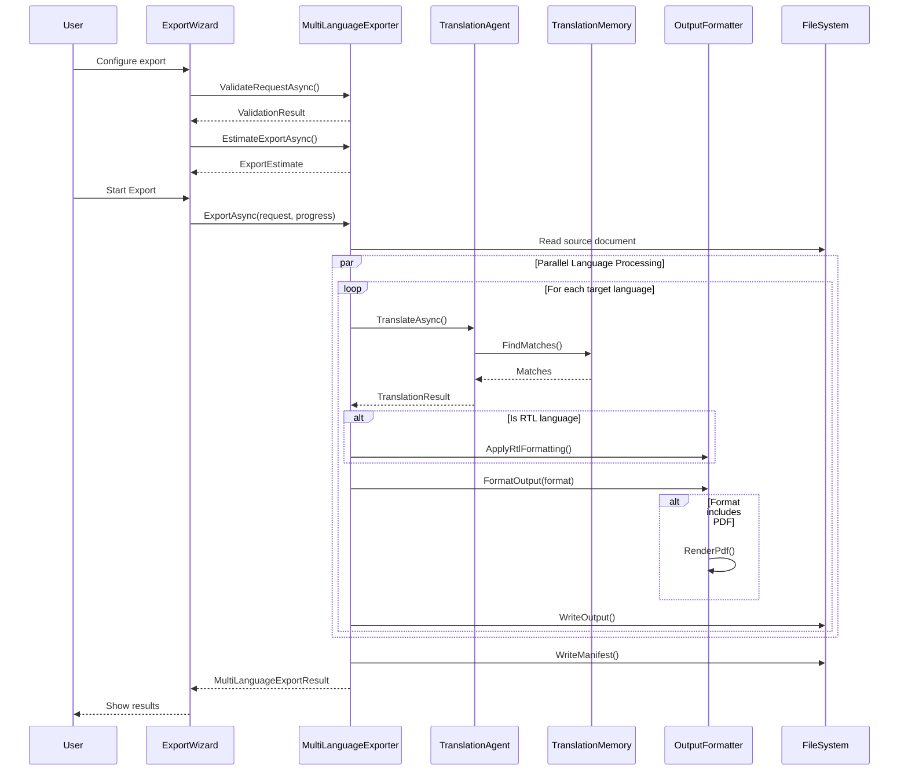

# LCS-DES-087d: Design Specification — Multi-Language Export

## 1. Metadata & Categorization

| Field | Value | Description |
| :--- | :--- | :--- |
| **Feature ID** | `PUB-087d` | Sub-part of PUB-087 |
| **Feature Name** | `Multi-Language Export` | Batch export to multiple languages |
| **Target Version** | `v0.8.7d` | Fourth sub-part of v0.8.7 |
| **Module Scope** | `Lexichord.Modules.Publishing` | Publishing module |
| **Swimlane** | `Publishing` | Part of Publisher vertical |
| **License Tier** | `Teams` | Teams tier required |
| **Feature Gate Key** | `FeatureFlags.Publishing.MultiLanguageExport` | License gate key |
| **Author** | Lead Architect | |
| **Status** | `Draft` | |
| **Last Updated** | `2026-01-27` | |
| **Parent Document** | [LCS-DES-087-INDEX](./LCS-DES-087-INDEX.md) | |
| **Scope Breakdown** | [LCS-SBD-087 Section 3.4](./LCS-SBD-087.md#34-v087d-multi-language-export) | |

---

## 2. Executive Summary

### 2.1 The Requirement

Documentation teams need to publish content in multiple languages from a single source:

- Manually exporting to each language is time-consuming and error-prone
- Different formats are needed (Markdown, PDF, HTML) for different purposes
- Right-to-left (RTL) languages require special formatting considerations
- Progress tracking is essential for large export jobs
- Export manifests help track what was produced and any issues

> **Goal:** Export a single source document to multiple target languages simultaneously, producing properly formatted localized outputs with a comprehensive export manifest.

### 2.2 The Proposed Solution

Implement a Multi-Language Export service that:

1. Translates and exports to multiple languages in parallel
2. Supports multiple output formats (Markdown, PDF, HTML, DOCX)
3. Handles RTL languages (Arabic, Hebrew) with proper formatting
4. Applies locale-specific formatting (dates, numbers, currency)
5. Generates an export manifest with statistics and warnings
6. Provides a wizard UI for configuring and monitoring exports

---

## 3. Architecture & Modular Strategy

### 3.1 Dependencies

#### 3.1.1 Upstream Dependencies

| Interface | Source Version | Purpose |
| :--- | :--- | :--- |
| `ITranslationAgent` | v0.8.7b | Document translation |
| `ITranslationMemoryService` | v0.8.7a | TM lookup |
| `IGlossaryService` | v0.8.7c | Term enforcement |
| `IPdfExporter` | v0.8.6a | PDF output |
| `IMarkdownParser` | v0.1.3b | Document parsing |
| `ILicenseContext` | v0.0.4c | Feature gating |
| `IMediator` | v0.0.7a | Event publishing |

#### 3.1.2 NuGet Packages

| Package | Version | Purpose |
| :--- | :--- | :--- |
| `Markdig` | 0.37.x | Markdown processing |
| `PuppeteerSharp` | 17.x | PDF rendering |

### 3.2 Licensing Behavior

| Tier | Behavior |
| :--- | :--- |
| Core | Export wizard hidden |
| WriterPro | Export wizard hidden |
| Teams | Full export functionality |
| Enterprise | Full export + priority queue |

---

## 4. Data Contract (The API)

### 4.1 Core Interfaces

```csharp
namespace Lexichord.Abstractions.Contracts.Localization;

/// <summary>
/// Service for exporting documents to multiple languages simultaneously.
/// </summary>
public interface IMultiLanguageExporter
{
    /// <summary>
    /// Exports a document to multiple target languages.
    /// </summary>
    /// <param name="request">Export request with source document and target languages.</param>
    /// <param name="progress">Progress reporter for export status.</param>
    /// <param name="cancellationToken">Cancellation token.</param>
    /// <returns>Export result with status for each language.</returns>
    Task<MultiLanguageExportResult> ExportAsync(
        MultiLanguageExportRequest request,
        IProgress<MultiLanguageExportProgress>? progress = null,
        CancellationToken cancellationToken = default);

    /// <summary>
    /// Gets the list of supported target languages.
    /// </summary>
    /// <param name="cancellationToken">Cancellation token.</param>
    /// <returns>List of supported languages with metadata.</returns>
    Task<IReadOnlyList<SupportedLanguage>> GetSupportedLanguagesAsync(
        CancellationToken cancellationToken = default);

    /// <summary>
    /// Validates an export request before execution.
    /// </summary>
    /// <param name="request">The export request to validate.</param>
    /// <param name="cancellationToken">Cancellation token.</param>
    /// <returns>Validation result with any errors or warnings.</returns>
    Task<ExportValidationResult> ValidateRequestAsync(
        MultiLanguageExportRequest request,
        CancellationToken cancellationToken = default);

    /// <summary>
    /// Estimates the time and resources needed for an export.
    /// </summary>
    /// <param name="request">The export request to estimate.</param>
    /// <param name="cancellationToken">Cancellation token.</param>
    /// <returns>Estimate with time, TM coverage, and resource requirements.</returns>
    Task<ExportEstimate> EstimateExportAsync(
        MultiLanguageExportRequest request,
        CancellationToken cancellationToken = default);

    /// <summary>
    /// Cancels an in-progress export.
    /// </summary>
    /// <param name="exportId">The ID of the export to cancel.</param>
    /// <param name="cancellationToken">Cancellation token.</param>
    /// <returns>True if cancelled, false if not found or already completed.</returns>
    Task<bool> CancelExportAsync(
        Guid exportId,
        CancellationToken cancellationToken = default);

    /// <summary>
    /// Gets the status of an in-progress or completed export.
    /// </summary>
    /// <param name="exportId">The ID of the export.</param>
    /// <param name="cancellationToken">Cancellation token.</param>
    /// <returns>Export status, or null if not found.</returns>
    Task<ExportStatus?> GetExportStatusAsync(
        Guid exportId,
        CancellationToken cancellationToken = default);
}
```

### 4.2 Request/Response Models

```csharp
namespace Lexichord.Abstractions.Contracts.Localization;

/// <summary>
/// Request for multi-language export.
/// </summary>
public record MultiLanguageExportRequest
{
    /// <summary>Unique identifier for this export job.</summary>
    public Guid Id { get; init; } = Guid.NewGuid();

    /// <summary>Path to the source document.</summary>
    public required string SourceDocumentPath { get; init; }

    /// <summary>Source language code (e.g., "en-US").</summary>
    public required string SourceLanguage { get; init; }

    /// <summary>List of target language codes.</summary>
    public required IReadOnlyList<string> TargetLanguages { get; init; }

    /// <summary>Output directory for exported files.</summary>
    public required string OutputDirectory { get; init; }

    /// <summary>Output format(s).</summary>
    public ExportFormat Format { get; init; } = ExportFormat.Markdown;

    /// <summary>Export options.</summary>
    public MultiLanguageExportOptions Options { get; init; } = new();

    /// <summary>Project name for context.</summary>
    public string? ProjectName { get; init; }

    /// <summary>Custom metadata to include in manifest.</summary>
    public IReadOnlyDictionary<string, string>? Metadata { get; init; }
}

/// <summary>
/// Output format for export.
/// </summary>
[Flags]
public enum ExportFormat
{
    /// <summary>Markdown format.</summary>
    Markdown = 1,

    /// <summary>HTML format.</summary>
    Html = 2,

    /// <summary>PDF format.</summary>
    Pdf = 4,

    /// <summary>DOCX format.</summary>
    Docx = 8,

    /// <summary>All formats.</summary>
    All = Markdown | Html | Pdf | Docx
}

/// <summary>
/// Options for multi-language export.
/// </summary>
public record MultiLanguageExportOptions
{
    /// <summary>Whether to use Translation Memory.</summary>
    public bool UseTranslationMemory { get; init; } = true;

    /// <summary>Whether to use glossary.</summary>
    public bool UseGlossary { get; init; } = true;

    /// <summary>Whether to process languages in parallel.</summary>
    public bool ParallelProcessing { get; init; } = true;

    /// <summary>Maximum number of languages to process in parallel.</summary>
    public int MaxParallelLanguages { get; init; } = 4;

    /// <summary>Whether to generate an export manifest.</summary>
    public bool GenerateManifest { get; init; } = true;

    /// <summary>Whether to include source document in output.</summary>
    public bool IncludeSourceInOutput { get; init; } = false;

    /// <summary>File naming convention.</summary>
    public FileNamingConvention NamingConvention { get; init; } = FileNamingConvention.LanguageSuffix;

    /// <summary>Whether to create subfolders for each language.</summary>
    public bool CreateLanguageSubfolders { get; init; } = true;

    /// <summary>Locale-specific formatting options.</summary>
    public LocaleFormattingOptions LocaleFormatting { get; init; } = new();

    /// <summary>RTL language handling options.</summary>
    public RtlOptions RtlOptions { get; init; } = new();

    /// <summary>PDF export options (if PDF format selected).</summary>
    public PdfExportOptions? PdfOptions { get; init; }

    /// <summary>Translation options to pass to the agent.</summary>
    public TranslationOptions? TranslationOptions { get; init; }

    /// <summary>Whether to continue on error for individual languages.</summary>
    public bool ContinueOnError { get; init; } = true;

    /// <summary>Whether to overwrite existing files.</summary>
    public bool OverwriteExisting { get; init; } = true;
}

/// <summary>
/// File naming convention for exports.
/// </summary>
public enum FileNamingConvention
{
    /// <summary>Add language as suffix: document.de-DE.md</summary>
    LanguageSuffix,

    /// <summary>Add language as prefix: de-DE.document.md</summary>
    LanguagePrefix,

    /// <summary>Use subfolders only: de-DE/document.md</summary>
    SubfolderOnly
}

/// <summary>
/// Options for locale-specific formatting.
/// </summary>
public record LocaleFormattingOptions
{
    /// <summary>Whether to format dates according to locale.</summary>
    public bool FormatDates { get; init; } = true;

    /// <summary>Whether to format numbers according to locale.</summary>
    public bool FormatNumbers { get; init; } = true;

    /// <summary>Whether to format currency according to locale.</summary>
    public bool FormatCurrency { get; init; } = true;

    /// <summary>Whether to convert measurements to locale units.</summary>
    public bool FormatMeasurements { get; init; } = false;

    /// <summary>Custom date format pattern (overrides locale).</summary>
    public string? DateFormatPattern { get; init; }

    /// <summary>Custom number format pattern (overrides locale).</summary>
    public string? NumberFormatPattern { get; init; }
}

/// <summary>
/// Options for Right-to-Left language handling.
/// </summary>
public record RtlOptions
{
    /// <summary>Whether to automatically detect RTL languages.</summary>
    public bool AutoDetectRtl { get; init; } = true;

    /// <summary>Whether to add Unicode direction markers.</summary>
    public bool AddDirectionMarkers { get; init; } = true;

    /// <summary>Whether to mirror images for RTL.</summary>
    public bool MirrorImages { get; init; } = false;

    /// <summary>Whether to reverse table columns for RTL.</summary>
    public bool ReverseTableColumns { get; init; } = false;

    /// <summary>Whether to add dir="rtl" to HTML output.</summary>
    public bool AddHtmlDirAttribute { get; init; } = true;

    /// <summary>Custom RTL CSS file to include.</summary>
    public string? CustomRtlCssPath { get; init; }
}

/// <summary>
/// Result of a multi-language export.
/// </summary>
public record MultiLanguageExportResult
{
    /// <summary>Export job ID.</summary>
    public Guid ExportId { get; init; }

    /// <summary>Whether all languages exported successfully.</summary>
    public bool Success { get; init; }

    /// <summary>Results for each language.</summary>
    public required IReadOnlyList<LanguageExportResult> LanguageResults { get; init; }

    /// <summary>Path to the export manifest file.</summary>
    public string? ManifestPath { get; init; }

    /// <summary>Overall export summary.</summary>
    public ExportSummary Summary { get; init; } = new();

    /// <summary>Total elapsed time for the export.</summary>
    public TimeSpan TotalElapsedTime { get; init; }

    /// <summary>When the export started.</summary>
    public DateTime StartedAt { get; init; }

    /// <summary>When the export completed.</summary>
    public DateTime CompletedAt { get; init; }
}

/// <summary>
/// Result for a single language export.
/// </summary>
public record LanguageExportResult
{
    /// <summary>Target language code.</summary>
    public required string TargetLanguage { get; init; }

    /// <summary>Display name of the language.</summary>
    public string? LanguageName { get; init; }

    /// <summary>Whether export succeeded for this language.</summary>
    public bool Success { get; init; }

    /// <summary>Path(s) to output file(s).</summary>
    public IReadOnlyList<string> OutputPaths { get; init; } = [];

    /// <summary>Error message if export failed.</summary>
    public string? ErrorMessage { get; init; }

    /// <summary>Exception details if export failed.</summary>
    public string? ExceptionDetails { get; init; }

    /// <summary>Statistics for this language export.</summary>
    public LanguageExportStats Stats { get; init; } = new();

    /// <summary>Elapsed time for this language.</summary>
    public TimeSpan ElapsedTime { get; init; }

    /// <summary>Warnings generated during export.</summary>
    public IReadOnlyList<ExportWarning> Warnings { get; init; } = [];

    /// <summary>Whether this is an RTL language.</summary>
    public bool IsRtl { get; init; }

    /// <summary>Quality score for the translation (0-100).</summary>
    public double? QualityScore { get; init; }
}

/// <summary>
/// Statistics for a single language export.
/// </summary>
public record LanguageExportStats
{
    /// <summary>Number of segments translated.</summary>
    public int SegmentsTranslated { get; init; }

    /// <summary>Number of TM matches used.</summary>
    public int TmMatchesUsed { get; init; }

    /// <summary>Number of TM exact matches.</summary>
    public int TmExactMatches { get; init; }

    /// <summary>Number of TM fuzzy matches.</summary>
    public int TmFuzzyMatches { get; init; }

    /// <summary>Number of segments translated by AI.</summary>
    public int AiTranslated { get; init; }

    /// <summary>Number of glossary terms applied.</summary>
    public int GlossaryTermsApplied { get; init; }

    /// <summary>Source word count.</summary>
    public int SourceWordCount { get; init; }

    /// <summary>Target word count.</summary>
    public int TargetWordCount { get; init; }

    /// <summary>Output file size in bytes.</summary>
    public long FileSizeBytes { get; init; }

    /// <summary>LLM tokens used.</summary>
    public int TokensUsed { get; init; }
}

/// <summary>
/// Warning during export.
/// </summary>
public record ExportWarning(
    string TargetLanguage,
    ExportWarningType Type,
    string Message,
    string? Details,
    int? Position);

/// <summary>
/// Type of export warning.
/// </summary>
public enum ExportWarningType
{
    /// <summary>Missing glossary translation for a term.</summary>
    MissingGlossaryTranslation,

    /// <summary>Translation has low quality score.</summary>
    LowQualityTranslation,

    /// <summary>Formatting issue detected.</summary>
    FormattingIssue,

    /// <summary>RTL conversion issue.</summary>
    RtlConversionIssue,

    /// <summary>Referenced image not found.</summary>
    ImageNotFound,

    /// <summary>Internal link is broken.</summary>
    LinkBroken,

    /// <summary>Placeholder not preserved.</summary>
    PlaceholderNotPreserved,

    /// <summary>Code block may have been modified.</summary>
    CodeBlockModified,

    /// <summary>TM match was below threshold.</summary>
    LowTmMatch
}

/// <summary>
/// Summary of the export operation.
/// </summary>
public record ExportSummary
{
    /// <summary>Total number of target languages.</summary>
    public int TotalLanguages { get; init; }

    /// <summary>Number of successfully exported languages.</summary>
    public int SuccessfulLanguages { get; init; }

    /// <summary>Number of failed languages.</summary>
    public int FailedLanguages { get; init; }

    /// <summary>Total segments across all languages.</summary>
    public int TotalSegments { get; init; }

    /// <summary>Total source words.</summary>
    public int TotalSourceWords { get; init; }

    /// <summary>Total target words (all languages).</summary>
    public int TotalTargetWords { get; init; }

    /// <summary>Total output file size in bytes.</summary>
    public long TotalFileSizeBytes { get; init; }

    /// <summary>Total TM matches used.</summary>
    public int TotalTmMatches { get; init; }

    /// <summary>Total AI translations.</summary>
    public int TotalAiTranslations { get; init; }

    /// <summary>Total warnings generated.</summary>
    public int TotalWarnings { get; init; }

    /// <summary>Average quality score across languages.</summary>
    public double? AverageQualityScore { get; init; }
}

/// <summary>
/// Progress during multi-language export.
/// </summary>
public record MultiLanguageExportProgress(
    string CurrentLanguage,
    string CurrentLanguageName,
    int CurrentLanguageIndex,
    int TotalLanguages,
    int CurrentSegment,
    int TotalSegments,
    ExportPhase Phase,
    double OverallPercentComplete,
    string? StatusMessage);

/// <summary>
/// Phase of export operation.
/// </summary>
public enum ExportPhase
{
    Initializing,
    ValidatingRequest,
    LoadingSource,
    LoadingResources,
    Translating,
    ApplyingFormatting,
    ApplyingRtl,
    WritingMarkdown,
    WritingHtml,
    WritingPdf,
    WritingDocx,
    GeneratingManifest,
    Completed,
    Failed,
    Cancelled
}

/// <summary>
/// Information about a supported language.
/// </summary>
public record SupportedLanguage(
    string Code,
    string Name,
    string NativeName,
    bool IsRtl,
    string? Script,
    string? Region,
    string? Flag,
    bool HasTmData,
    int TmEntryCount);

/// <summary>
/// Result of validating an export request.
/// </summary>
public record ExportValidationResult(
    bool IsValid,
    IReadOnlyList<string> Errors,
    IReadOnlyList<string> Warnings,
    IReadOnlyList<string> UnsupportedLanguages);

/// <summary>
/// Estimate for an export operation.
/// </summary>
public record ExportEstimate(
    TimeSpan EstimatedTime,
    int EstimatedSegments,
    int EstimatedWords,
    IReadOnlyDictionary<string, double> TmCoverageByLanguage,
    IReadOnlyDictionary<string, int> EstimatedTokensByLanguage,
    long EstimatedOutputSizeBytes);

/// <summary>
/// Status of an export job.
/// </summary>
public record ExportStatus(
    Guid ExportId,
    ExportJobState State,
    double PercentComplete,
    string? CurrentLanguage,
    int CompletedLanguages,
    int TotalLanguages,
    DateTime StartedAt,
    DateTime? CompletedAt,
    string? ErrorMessage);

/// <summary>
/// State of an export job.
/// </summary>
public enum ExportJobState
{
    Queued,
    Running,
    Completed,
    Failed,
    Cancelled
}
```

---

## 5. Implementation Logic

### 5.1 Export Flow



### 5.2 Language Processing Decision Tree

```text
ProcessLanguage(content, targetLanguage):
│
├── Is language supported?
│   └── NO → RETURN Error(UnsupportedLanguage)
│
├── Translate content
│   ├── Call TranslationAgent.TranslateAsync()
│   ├── Track TM matches
│   └── Track AI translations
│
├── Is language RTL?
│   ├── YES → Apply RTL formatting
│   │   ├── Add direction markers
│   │   ├── Add dir="rtl" for HTML
│   │   ├── Optionally mirror images
│   │   └── Optionally reverse tables
│   └── NO → Standard formatting
│
├── Apply locale formatting
│   ├── Format dates
│   ├── Format numbers
│   └── Format currency
│
├── Generate output for each format:
│   ├── Markdown → Write .md file
│   ├── HTML → Render HTML with styles
│   ├── PDF → Render PDF with PuppeteerSharp
│   └── DOCX → Generate Word document
│
└── RETURN LanguageExportResult
```

### 5.3 RTL Language Handling

```text
ApplyRtlFormatting(content, options):
│
├── Is content HTML?
│   ├── YES → Add <html dir="rtl">
│   │         Add RTL CSS
│   │         Wrap LTR content in <bdo dir="ltr">
│   └── NO → Continue
│
├── Is content Markdown?
│   ├── YES → Add RTL markers (U+200F)
│   │         Preserve code blocks as LTR
│   │         Handle mixed content
│   └── NO → Continue
│
├── Should mirror images?
│   └── YES → Transform image references
│
├── Should reverse tables?
│   └── YES → Reverse column order in tables
│
└── RETURN formatted content
```

---

## 6. Implementation Details

### 6.1 MultiLanguageExporter Implementation

```csharp
namespace Lexichord.Modules.Publishing.Localization;

/// <summary>
/// Exports documents to multiple languages with parallel processing.
/// </summary>
[RequiresLicense(LicenseTier.Teams)]
public class MultiLanguageExporter : IMultiLanguageExporter
{
    private static readonly HashSet<string> RtlLanguageCodes = new(StringComparer.OrdinalIgnoreCase)
    {
        "ar", "ar-SA", "ar-AE", "ar-EG",
        "he", "he-IL",
        "fa", "fa-IR",
        "ur", "ur-PK",
        "yi"
    };

    private readonly ITranslationAgent _translationAgent;
    private readonly ITranslationMemoryService _translationMemory;
    private readonly IGlossaryService _glossary;
    private readonly IPdfExporter _pdfExporter;
    private readonly IMarkdownParser _markdownParser;
    private readonly ILogger<MultiLanguageExporter> _logger;

    private readonly ConcurrentDictionary<Guid, CancellationTokenSource> _activeExports = new();

    public MultiLanguageExporter(
        ITranslationAgent translationAgent,
        ITranslationMemoryService translationMemory,
        IGlossaryService glossary,
        IPdfExporter pdfExporter,
        IMarkdownParser markdownParser,
        ILogger<MultiLanguageExporter> logger)
    {
        _translationAgent = translationAgent;
        _translationMemory = translationMemory;
        _glossary = glossary;
        _pdfExporter = pdfExporter;
        _markdownParser = markdownParser;
        _logger = logger;
    }

    public async Task<MultiLanguageExportResult> ExportAsync(
        MultiLanguageExportRequest request,
        IProgress<MultiLanguageExportProgress>? progress = null,
        CancellationToken cancellationToken = default)
    {
        var startTime = DateTime.UtcNow;
        var stopwatch = Stopwatch.StartNew();

        using var cts = CancellationTokenSource.CreateLinkedTokenSource(cancellationToken);
        _activeExports[request.Id] = cts;

        try
        {
            _logger.LogInfo(
                "Starting multi-language export: {Id} to {Count} languages",
                request.Id, request.TargetLanguages.Count);

            // Phase 1: Initialize
            progress?.Report(CreateProgress(
                "", "", 0, request.TargetLanguages.Count, 0, 0,
                ExportPhase.Initializing, 0, "Initializing export..."));

            // Validate request
            var validation = await ValidateRequestAsync(request, cts.Token);
            if (!validation.IsValid)
            {
                throw new ExportValidationException(validation.Errors);
            }

            // Phase 2: Load source
            progress?.Report(CreateProgress(
                "", "", 0, request.TargetLanguages.Count, 0, 0,
                ExportPhase.LoadingSource, 5, "Loading source document..."));

            var sourceContent = await File.ReadAllTextAsync(request.SourceDocumentPath, cts.Token);
            var sourceWordCount = CountWords(sourceContent);

            // Ensure output directory exists
            Directory.CreateDirectory(request.OutputDirectory);

            // Phase 3: Process languages
            var results = new List<LanguageExportResult>();

            if (request.Options.ParallelProcessing)
            {
                var semaphore = new SemaphoreSlim(request.Options.MaxParallelLanguages);
                var tasks = request.TargetLanguages.Select((lang, index) =>
                    ProcessLanguageAsync(
                        request, sourceContent, lang, index,
                        semaphore, progress, cts.Token));

                var taskResults = await Task.WhenAll(tasks);
                results.AddRange(taskResults);
            }
            else
            {
                for (int i = 0; i < request.TargetLanguages.Count; i++)
                {
                    cts.Token.ThrowIfCancellationRequested();

                    var result = await ProcessLanguageAsync(
                        request, sourceContent, request.TargetLanguages[i], i,
                        null, progress, cts.Token);
                    results.Add(result);
                }
            }

            // Phase 4: Generate manifest
            string? manifestPath = null;
            if (request.Options.GenerateManifest)
            {
                progress?.Report(CreateProgress(
                    "", "", request.TargetLanguages.Count, request.TargetLanguages.Count, 0, 0,
                    ExportPhase.GeneratingManifest, 98, "Generating manifest..."));

                manifestPath = await GenerateManifestAsync(request, results, sourceWordCount, cts.Token);
            }

            stopwatch.Stop();

            var exportResult = new MultiLanguageExportResult
            {
                ExportId = request.Id,
                Success = results.All(r => r.Success),
                LanguageResults = results,
                ManifestPath = manifestPath,
                Summary = CreateSummary(results, sourceWordCount),
                TotalElapsedTime = stopwatch.Elapsed,
                StartedAt = startTime,
                CompletedAt = DateTime.UtcNow
            };

            progress?.Report(CreateProgress(
                "", "", request.TargetLanguages.Count, request.TargetLanguages.Count, 0, 0,
                ExportPhase.Completed, 100, "Export completed"));

            _logger.LogInfo(
                "Export completed: {Success}/{Total} languages in {Elapsed}",
                exportResult.Summary.SuccessfulLanguages,
                exportResult.Summary.TotalLanguages,
                stopwatch.Elapsed);

            return exportResult;
        }
        catch (OperationCanceledException)
        {
            _logger.LogInfo("Export cancelled: {Id}", request.Id);
            throw;
        }
        finally
        {
            _activeExports.TryRemove(request.Id, out _);
        }
    }

    private async Task<LanguageExportResult> ProcessLanguageAsync(
        MultiLanguageExportRequest request,
        string sourceContent,
        string targetLanguage,
        int index,
        SemaphoreSlim? semaphore,
        IProgress<MultiLanguageExportProgress>? progress,
        CancellationToken cancellationToken)
    {
        if (semaphore is not null)
            await semaphore.WaitAsync(cancellationToken);

        try
        {
            var langStopwatch = Stopwatch.StartNew();
            var warnings = new List<ExportWarning>();
            var isRtl = IsRtlLanguage(targetLanguage);
            var languageName = GetLanguageDisplayName(targetLanguage);

            _logger.LogDebug("Processing language: {Lang} ({Name})", targetLanguage, languageName);

            progress?.Report(CreateProgress(
                targetLanguage, languageName, index + 1, request.TargetLanguages.Count,
                0, 0, ExportPhase.Translating, CalculateOverallProgress(index, request.TargetLanguages.Count, 0.1),
                $"Translating to {languageName}..."));

            // Translate
            var translationProgress = new Progress<TranslationProgress>(p =>
            {
                progress?.Report(CreateProgress(
                    targetLanguage, languageName, index + 1, request.TargetLanguages.Count,
                    p.CurrentSegment, p.TotalSegments, ExportPhase.Translating,
                    CalculateOverallProgress(index, request.TargetLanguages.Count, 0.1 + 0.6 * p.PercentComplete / 100),
                    $"Translating: {p.CurrentSegment}/{p.TotalSegments} segments"));
            });

            var translationResult = await _translationAgent.TranslateAsync(
                new TranslationRequest
                {
                    SourceContent = sourceContent,
                    SourceLanguage = request.SourceLanguage,
                    TargetLanguage = targetLanguage,
                    Format = ContentFormat.Markdown,
                    ProjectContext = request.ProjectName,
                    Options = request.Options.TranslationOptions ?? new TranslationOptions()
                },
                translationProgress,
                cancellationToken);

            // Add translation warnings
            warnings.AddRange(translationResult.Warnings.Select(w => new ExportWarning(
                targetLanguage, MapWarningType(w), w.Message, w.SourceSegment, w.Position)));

            // Apply RTL formatting if needed
            var outputContent = translationResult.TranslatedContent;
            if (isRtl)
            {
                progress?.Report(CreateProgress(
                    targetLanguage, languageName, index + 1, request.TargetLanguages.Count,
                    0, 0, ExportPhase.ApplyingRtl,
                    CalculateOverallProgress(index, request.TargetLanguages.Count, 0.75),
                    $"Applying RTL formatting for {languageName}..."));

                outputContent = ApplyRtlFormatting(outputContent, request.Options.RtlOptions, warnings);
            }

            // Write output files
            var outputPaths = new List<string>();
            long totalSize = 0;

            // Markdown
            if (request.Format.HasFlag(ExportFormat.Markdown))
            {
                progress?.Report(CreateProgress(
                    targetLanguage, languageName, index + 1, request.TargetLanguages.Count,
                    0, 0, ExportPhase.WritingMarkdown,
                    CalculateOverallProgress(index, request.TargetLanguages.Count, 0.8),
                    $"Writing Markdown for {languageName}..."));

                var mdPath = GetOutputPath(request, targetLanguage, ".md");
                await File.WriteAllTextAsync(mdPath, outputContent, cancellationToken);
                outputPaths.Add(mdPath);
                totalSize += new FileInfo(mdPath).Length;
            }

            // HTML
            if (request.Format.HasFlag(ExportFormat.Html))
            {
                progress?.Report(CreateProgress(
                    targetLanguage, languageName, index + 1, request.TargetLanguages.Count,
                    0, 0, ExportPhase.WritingHtml,
                    CalculateOverallProgress(index, request.TargetLanguages.Count, 0.85),
                    $"Writing HTML for {languageName}..."));

                var htmlPath = GetOutputPath(request, targetLanguage, ".html");
                var htmlContent = RenderHtml(outputContent, targetLanguage, isRtl, request);
                await File.WriteAllTextAsync(htmlPath, htmlContent, cancellationToken);
                outputPaths.Add(htmlPath);
                totalSize += new FileInfo(htmlPath).Length;
            }

            // PDF
            if (request.Format.HasFlag(ExportFormat.Pdf))
            {
                progress?.Report(CreateProgress(
                    targetLanguage, languageName, index + 1, request.TargetLanguages.Count,
                    0, 0, ExportPhase.WritingPdf,
                    CalculateOverallProgress(index, request.TargetLanguages.Count, 0.9),
                    $"Generating PDF for {languageName}..."));

                var pdfPath = GetOutputPath(request, targetLanguage, ".pdf");
                var pdfBytes = await RenderPdfAsync(outputContent, targetLanguage, isRtl, request, cancellationToken);
                await File.WriteAllBytesAsync(pdfPath, pdfBytes, cancellationToken);
                outputPaths.Add(pdfPath);
                totalSize += pdfBytes.Length;
            }

            langStopwatch.Stop();

            _logger.LogDebug(
                "Completed {Lang}: {Segments} segments in {Elapsed}",
                targetLanguage, translationResult.Stats.TotalSegments, langStopwatch.Elapsed);

            return new LanguageExportResult
            {
                TargetLanguage = targetLanguage,
                LanguageName = languageName,
                Success = true,
                OutputPaths = outputPaths,
                Stats = new LanguageExportStats
                {
                    SegmentsTranslated = translationResult.Stats.TotalSegments,
                    TmMatchesUsed = translationResult.Stats.TmExactMatches + translationResult.Stats.TmFuzzyMatches,
                    TmExactMatches = translationResult.Stats.TmExactMatches,
                    TmFuzzyMatches = translationResult.Stats.TmFuzzyMatches,
                    AiTranslated = translationResult.Stats.AiTranslated,
                    GlossaryTermsApplied = translationResult.Stats.GlossaryTermsApplied,
                    SourceWordCount = translationResult.Stats.SourceWordCount,
                    TargetWordCount = translationResult.Stats.TargetWordCount,
                    FileSizeBytes = totalSize,
                    TokensUsed = translationResult.Stats.TokensUsed
                },
                ElapsedTime = langStopwatch.Elapsed,
                Warnings = warnings,
                IsRtl = isRtl,
                QualityScore = translationResult.QualityScore
            };
        }
        catch (Exception ex)
        {
            _logger.LogError(ex, "Export failed for {Lang}", targetLanguage);

            if (!request.Options.ContinueOnError)
                throw;

            return new LanguageExportResult
            {
                TargetLanguage = targetLanguage,
                LanguageName = GetLanguageDisplayName(targetLanguage),
                Success = false,
                ErrorMessage = ex.Message,
                ExceptionDetails = ex.ToString(),
                IsRtl = IsRtlLanguage(targetLanguage)
            };
        }
        finally
        {
            semaphore?.Release();
        }
    }

    private string ApplyRtlFormatting(string content, RtlOptions options, List<ExportWarning> warnings)
    {
        if (!options.AddDirectionMarkers)
            return content;

        var result = new StringBuilder();
        var lines = content.Split('\n');

        foreach (var line in lines)
        {
            // Preserve code blocks as LTR
            if (line.TrimStart().StartsWith("```"))
            {
                result.AppendLine(line);
                continue;
            }

            // Add RTL mark at start of non-empty lines
            if (!string.IsNullOrWhiteSpace(line))
            {
                result.AppendLine("\u200F" + line);
            }
            else
            {
                result.AppendLine(line);
            }
        }

        return result.ToString();
    }

    private string RenderHtml(string markdown, string language, bool isRtl, MultiLanguageExportRequest request)
    {
        var html = Markdown.ToHtml(markdown);

        var dirAttr = isRtl ? " dir=\"rtl\"" : "";
        var langAttr = $" lang=\"{language}\"";

        return $@"<!DOCTYPE html>
<html{langAttr}{dirAttr}>
<head>
    <meta charset=""UTF-8"">
    <meta name=""viewport"" content=""width=device-width, initial-scale=1.0"">
    <title>{Path.GetFileNameWithoutExtension(request.SourceDocumentPath)} - {language}</title>
    <style>
        body {{ font-family: -apple-system, BlinkMacSystemFont, 'Segoe UI', Roboto, sans-serif; line-height: 1.6; max-width: 800px; margin: 0 auto; padding: 20px; }}
        pre {{ background: #f4f4f4; padding: 16px; overflow-x: auto; }}
        code {{ background: #f4f4f4; padding: 2px 6px; border-radius: 3px; }}
        {(isRtl ? "body { direction: rtl; text-align: right; }" : "")}
    </style>
</head>
<body>
{html}
</body>
</html>";
    }

    private async Task<byte[]> RenderPdfAsync(
        string markdown,
        string language,
        bool isRtl,
        MultiLanguageExportRequest request,
        CancellationToken cancellationToken)
    {
        var html = RenderHtml(markdown, language, isRtl, request);

        var pdfRequest = new PdfExportRequest(
            DocumentPath: request.SourceDocumentPath,
            Options: request.Options.PdfOptions ?? new PdfExportOptions());

        // Use PuppeteerSharp for PDF rendering
        return await _pdfExporter.ExportFromHtmlAsync(html, pdfRequest.Options, cancellationToken);
    }

    private async Task<string> GenerateManifestAsync(
        MultiLanguageExportRequest request,
        IReadOnlyList<LanguageExportResult> results,
        int sourceWordCount,
        CancellationToken cancellationToken)
    {
        var manifest = new
        {
            manifestVersion = "1.0",
            exportedAt = DateTime.UtcNow.ToString("O"),
            lexichordVersion = "0.8.7",
            sourceDocument = new
            {
                path = Path.GetFileName(request.SourceDocumentPath),
                language = request.SourceLanguage,
                wordCount = sourceWordCount
            },
            project = request.ProjectName,
            exports = results.Select(r => new
            {
                language = r.TargetLanguage,
                languageName = r.LanguageName,
                status = r.Success ? "success" : "failed",
                isRtl = r.IsRtl,
                outputPaths = r.OutputPaths.Select(Path.GetFileName),
                stats = r.Success ? new
                {
                    segmentsTranslated = r.Stats.SegmentsTranslated,
                    tmExactMatches = r.Stats.TmExactMatches,
                    tmFuzzyMatches = r.Stats.TmFuzzyMatches,
                    aiTranslated = r.Stats.AiTranslated,
                    wordCount = r.Stats.TargetWordCount,
                    fileSize = r.Stats.FileSizeBytes
                } : null,
                qualityScore = r.QualityScore,
                elapsedSeconds = r.ElapsedTime.TotalSeconds,
                error = r.ErrorMessage,
                warnings = r.Warnings.Select(w => new { type = w.Type.ToString(), message = w.Message })
            }),
            summary = new
            {
                totalLanguages = results.Count,
                successful = results.Count(r => r.Success),
                failed = results.Count(r => !r.Success),
                totalSegments = results.Sum(r => r.Stats.SegmentsTranslated),
                totalTmMatches = results.Sum(r => r.Stats.TmMatchesUsed),
                totalAiTranslations = results.Sum(r => r.Stats.AiTranslated),
                totalWarnings = results.Sum(r => r.Warnings.Count)
            },
            metadata = request.Metadata
        };

        var json = JsonSerializer.Serialize(manifest, new JsonSerializerOptions
        {
            WriteIndented = true,
            DefaultIgnoreCondition = JsonIgnoreCondition.WhenWritingNull
        });

        var manifestPath = Path.Combine(request.OutputDirectory, "export-manifest.json");
        await File.WriteAllTextAsync(manifestPath, json, cancellationToken);

        return manifestPath;
    }

    private string GetOutputPath(MultiLanguageExportRequest request, string language, string extension)
    {
        var baseName = Path.GetFileNameWithoutExtension(request.SourceDocumentPath);
        var fileName = request.Options.NamingConvention switch
        {
            FileNamingConvention.LanguageSuffix => $"{baseName}.{language}{extension}",
            FileNamingConvention.LanguagePrefix => $"{language}.{baseName}{extension}",
            FileNamingConvention.SubfolderOnly => $"{baseName}{extension}",
            _ => $"{baseName}.{language}{extension}"
        };

        var directory = request.Options.CreateLanguageSubfolders
            ? Path.Combine(request.OutputDirectory, language)
            : request.OutputDirectory;

        Directory.CreateDirectory(directory);

        return Path.Combine(directory, fileName);
    }

    private static bool IsRtlLanguage(string languageCode)
    {
        var baseLang = languageCode.Split('-')[0].ToLowerInvariant();
        return RtlLanguageCodes.Contains(languageCode) || RtlLanguageCodes.Contains(baseLang);
    }

    private static string GetLanguageDisplayName(string code) => code switch
    {
        "ar-SA" => "Arabic (Saudi Arabia)",
        "de-DE" => "German",
        "en-US" => "English (US)",
        "es-ES" => "Spanish",
        "fr-FR" => "French",
        "he-IL" => "Hebrew",
        "it-IT" => "Italian",
        "ja-JP" => "Japanese",
        "ko-KR" => "Korean",
        "pt-BR" => "Portuguese (Brazil)",
        "ru-RU" => "Russian",
        "zh-CN" => "Chinese (Simplified)",
        "zh-TW" => "Chinese (Traditional)",
        _ => code
    };

    private static int CountWords(string text) =>
        text.Split(new[] { ' ', '\n', '\r', '\t' }, StringSplitOptions.RemoveEmptyEntries).Length;

    private static double CalculateOverallProgress(int currentLanguage, int totalLanguages, double languageProgress)
    {
        var languageWeight = 90.0 / totalLanguages;
        var baseProgress = currentLanguage * languageWeight;
        return 5 + baseProgress + (languageProgress * languageWeight);
    }

    private static MultiLanguageExportProgress CreateProgress(
        string lang, string langName, int langIndex, int totalLangs,
        int segment, int totalSegments, ExportPhase phase, double percent, string message) =>
        new(lang, langName, langIndex, totalLangs, segment, totalSegments, phase, percent, message);

    private ExportSummary CreateSummary(IReadOnlyList<LanguageExportResult> results, int sourceWords) =>
        new()
        {
            TotalLanguages = results.Count,
            SuccessfulLanguages = results.Count(r => r.Success),
            FailedLanguages = results.Count(r => !r.Success),
            TotalSegments = results.Sum(r => r.Stats.SegmentsTranslated),
            TotalSourceWords = sourceWords,
            TotalTargetWords = results.Sum(r => r.Stats.TargetWordCount),
            TotalFileSizeBytes = results.Sum(r => r.Stats.FileSizeBytes),
            TotalTmMatches = results.Sum(r => r.Stats.TmMatchesUsed),
            TotalAiTranslations = results.Sum(r => r.Stats.AiTranslated),
            TotalWarnings = results.Sum(r => r.Warnings.Count),
            AverageQualityScore = results.Where(r => r.QualityScore.HasValue).Select(r => r.QualityScore!.Value).DefaultIfEmpty().Average()
        };
}
```

---

## 7. UI/UX Specifications

### 7.1 Export Wizard Layout

```text
+------------------------------------------------------------------+
|  Multi-Language Export Wizard                                     |
+------------------------------------------------------------------+
|  Step 3 of 4: Select Target Languages                             |
+------------------------------------------------------------------+
|  Source Document: /docs/user-guide.md                             |
|  Source Language: English (en-US)                                 |
|  Output Directory: /exports/user-guide/                           |
+------------------------------------------------------------------+
|  Available Languages          | Selected Languages (5)            |
+-------------------------------|------------------------------------+
|  [ ] Arabic (ar-SA) [RTL]     | [x] German (de-DE)          [Up]  |
|  [ ] Chinese (zh-CN)          | [x] French (fr-FR)                |
|  [ ] Dutch (nl-NL)            | [x] Spanish (es-ES)        [Down] |
|  [ ] Finnish (fi-FI)          | [x] Japanese (ja-JP)              |
|  [ ] Hindi (hi-IN)            | [x] Portuguese (pt-BR)            |
|  [ ] Italian (it-IT)          |                            [Remove]|
|  [x] Japanese (ja-JP)         |                                    |
|  [ ] Korean (ko-KR)           |                                    |
|  [ ] Polish (pl-PL)           |                                    |
|  [ ] Russian (ru-RU)          |                                    |
+-------------------------------|------------------------------------+
|  [Select All]  [Clear]        |  TM Coverage shown in tooltip      |
+------------------------------------------------------------------+
|  Estimate: 5 languages, ~2,450 words, ~15 minutes                 |
|  TM Coverage: de-DE: 78%, fr-FR: 65%, es-ES: 82%, ja-JP: 45%     |
+------------------------------------------------------------------+
|                                  [< Back]  [Next >]  [Cancel]     |
+------------------------------------------------------------------+
```

### 7.2 Export Progress View

```text
+------------------------------------------------------------------+
|  Exporting to 5 Languages...                           [Cancel]  |
+------------------------------------------------------------------+
|  Overall Progress: ===================>------------ 67%           |
+------------------------------------------------------------------+
|  Language          | Status      | Segments | Time    | Quality  |
|--------------------|--------------+----------|---------|----------|
|  German (de-DE)    | Complete    | 156/156  | 02:34   | 94%      |
|  French (fr-FR)    | Complete    | 156/156  | 02:41   | 91%      |
|  Spanish (es-ES)   | Translating | 89/156   | --:--   | --       |
|  Japanese (ja-JP)  | Queued      | --/156   | --:--   | --       |
|  Portuguese (pt-BR)| Queued      | --/156   | --:--   | --       |
+------------------------------------------------------------------+
|  Current: Spanish (es-ES) - Translating segment 89 of 156        |
|  "La funcion de traduccion..."                                   |
+------------------------------------------------------------------+
|  Elapsed: 05:15  |  Estimated remaining: 02:30                   |
+------------------------------------------------------------------+
```

### 7.3 Export Results View

```text
+------------------------------------------------------------------+
|  Export Complete                                        [Close]   |
+------------------------------------------------------------------+
|  Successfully exported to 5 languages in 12:34                    |
+------------------------------------------------------------------+
|  Language          | Files   | Words  | TM%  | Quality | Warnings|
|--------------------|---------|--------|------|---------|---------|
|  German (de-DE)    | 3       | 2,612  | 78%  | 94%     | 0       |
|  French (fr-FR)    | 3       | 2,701  | 65%  | 91%     | 1       |
|  Spanish (es-ES)   | 3       | 2,589  | 82%  | 96%     | 0       |
|  Japanese (ja-JP)  | 3       | 2,450  | 45%  | 88%     | 2       |
|  Portuguese (pt-BR)| 3       | 2,634  | 72%  | 93%     | 0       |
+------------------------------------------------------------------+
|  Output: /exports/user-guide/                                     |
|  Manifest: /exports/user-guide/export-manifest.json               |
+------------------------------------------------------------------+
|  Summary:                                                         |
|  - Total files: 15 (5 languages x 3 formats)                      |
|  - Total words: 12,986                                            |
|  - TM matches: 523 (67%)                                          |
|  - AI translations: 257 (33%)                                     |
|  - Warnings: 3                                                    |
+------------------------------------------------------------------+
|              [Open Folder]  [View Manifest]  [Done]               |
+------------------------------------------------------------------+
```

---

## 8. Observability & Logging

| Level | Message Template |
| :--- | :--- |
| Info | `"Starting multi-language export: {Id} to {Count} languages"` |
| Debug | `"Processing language: {Lang} ({Name})"` |
| Debug | `"Completed {Lang}: {Segments} segments in {Elapsed}"` |
| Info | `"Export completed: {Success}/{Total} languages in {Elapsed}"` |
| Warning | `"RTL formatting issue in {Lang}: {Issue}"` |
| Warning | `"Low quality translation ({Score}%) for {Lang}"` |
| Error | `"Export failed for {Lang}: {Error}"` |

---

## 9. Acceptance Criteria

### 9.1 Functional Criteria

| # | Given | When | Then |
| :--- | :--- | :--- | :--- |
| 1 | 5 target languages selected | Exporting | 5 output file sets created |
| 2 | RTL language (Arabic) | Exporting | dir="rtl" in HTML output |
| 3 | RTL language (Arabic) | Exporting Markdown | RTL markers added |
| 4 | PDF format selected | Exporting | Valid PDF files created |
| 5 | GenerateManifest = true | Exporting | export-manifest.json created |
| 6 | ParallelProcessing = true | Exporting 4 languages | Max 4 concurrent |
| 7 | One language fails | Exporting with ContinueOnError | Others still complete |

### 9.2 Performance Criteria

| # | Scenario | Target |
| :--- | :--- | :--- |
| 1 | Export to 5 languages (2K words each) | < 5 min |
| 2 | Export to 10 languages (2K words each) | < 8 min |
| 3 | Manifest generation | < 1s |

---

## 10. Deliverable Checklist

| # | Deliverable | Status |
| :--- | :--- | :--- |
| 1 | `IMultiLanguageExporter` interface | [ ] |
| 2 | `MultiLanguageExporter` implementation | [ ] |
| 3 | Parallel processing logic | [ ] |
| 4 | RTL formatting support | [ ] |
| 5 | Markdown output | [ ] |
| 6 | HTML output | [ ] |
| 7 | PDF output | [ ] |
| 8 | Manifest generation | [ ] |
| 9 | `ExportWizardView.axaml` (4 steps) | [ ] |
| 10 | `ExportWizardViewModel` | [ ] |
| 11 | Progress view | [ ] |
| 12 | Results view | [ ] |
| 13 | Unit tests | [ ] |
| 14 | Integration tests | [ ] |

---

## 11. Verification Commands

```bash
# Run Multi-Language Export unit tests
dotnet test --filter "Version=v0.8.7d" --logger "console;verbosity=detailed"

# Run export integration tests
dotnet test --filter "FullyQualifiedName~MultiLanguageExporter"

# Manual verification: Export sample document
dotnet run -- export \
  --input /docs/sample.md \
  --source en-US \
  --target de-DE,fr-FR,es-ES,ja-JP \
  --output /exports/ \
  --format all

# Verify RTL output
dotnet run -- export --input sample.md --source en-US --target ar-SA --output /exports/
```

---

## 12. Export Manifest Schema

```json
{
  "$schema": "http://json-schema.org/draft-07/schema#",
  "type": "object",
  "required": ["manifestVersion", "exportedAt", "sourceDocument", "exports", "summary"],
  "properties": {
    "manifestVersion": { "type": "string", "const": "1.0" },
    "exportedAt": { "type": "string", "format": "date-time" },
    "lexichordVersion": { "type": "string" },
    "sourceDocument": {
      "type": "object",
      "properties": {
        "path": { "type": "string" },
        "language": { "type": "string" },
        "wordCount": { "type": "integer" }
      }
    },
    "project": { "type": "string" },
    "exports": {
      "type": "array",
      "items": {
        "type": "object",
        "properties": {
          "language": { "type": "string" },
          "languageName": { "type": "string" },
          "status": { "enum": ["success", "failed"] },
          "isRtl": { "type": "boolean" },
          "outputPaths": { "type": "array", "items": { "type": "string" } },
          "stats": {
            "type": "object",
            "properties": {
              "segmentsTranslated": { "type": "integer" },
              "tmExactMatches": { "type": "integer" },
              "tmFuzzyMatches": { "type": "integer" },
              "aiTranslated": { "type": "integer" },
              "wordCount": { "type": "integer" },
              "fileSize": { "type": "integer" }
            }
          },
          "qualityScore": { "type": "number" },
          "elapsedSeconds": { "type": "number" },
          "error": { "type": "string" },
          "warnings": {
            "type": "array",
            "items": {
              "type": "object",
              "properties": {
                "type": { "type": "string" },
                "message": { "type": "string" }
              }
            }
          }
        }
      }
    },
    "summary": {
      "type": "object",
      "properties": {
        "totalLanguages": { "type": "integer" },
        "successful": { "type": "integer" },
        "failed": { "type": "integer" },
        "totalSegments": { "type": "integer" },
        "totalTmMatches": { "type": "integer" },
        "totalAiTranslations": { "type": "integer" },
        "totalWarnings": { "type": "integer" }
      }
    },
    "metadata": { "type": "object" }
  }
}
```

---

## Document History

| Version | Date | Author | Changes |
| :--- | :--- | :--- | :--- |
| 1.0 | 2026-01-27 | Lead Architect | Initial draft |
