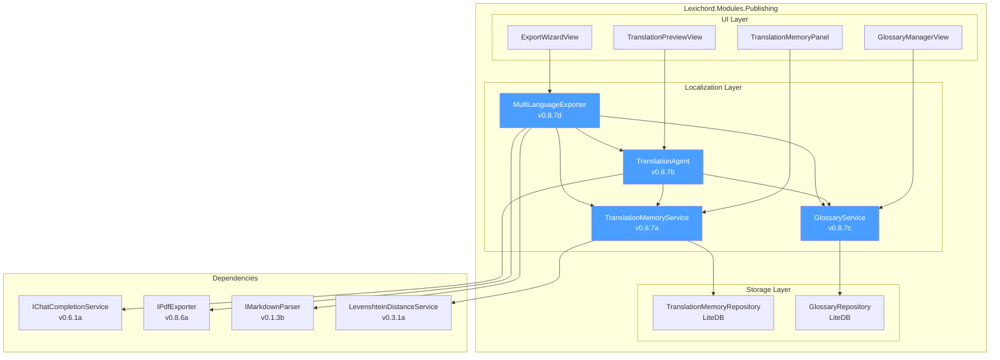
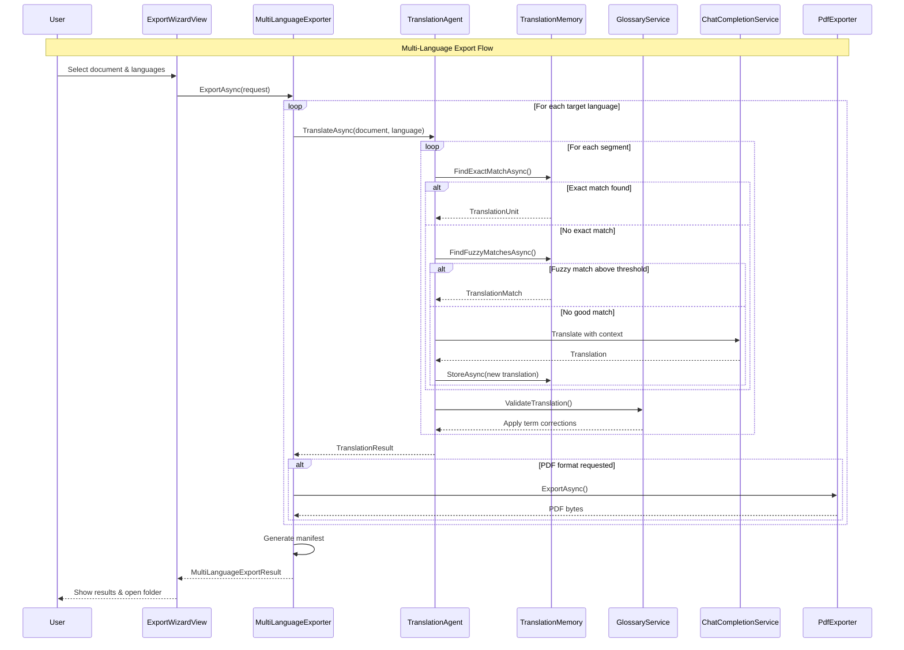

# LCS-SBD-087: Scope Breakdown — The Interpreter

## Document Control

| Field            | Value                                    |
| :--------------- | :--------------------------------------- |
| **Document ID**  | LCS-SBD-087                              |
| **Version**      | v0.8.7                                   |
| **Codename**     | The Interpreter (Localization)           |
| **Status**       | Draft                                    |
| **Last Updated** | 2026-01-27                               |
| **Owner**        | Lead Architect                           |
| **Depends On**   | v0.8.1 (Repository Reader), v0.8.3 (Release Notes Agent), v0.8.6 (PDF Exporter) |

---

## 1. Executive Summary

### 1.1 The Vision

**v0.8.7** delivers the **Interpreter** — AI-powered document translation with terminology consistency and multi-language export capabilities. This release transforms Lexichord from a single-language documentation platform into a comprehensive localization solution, enabling technical writers and documentation teams to maintain a single source of truth while producing professionally translated outputs in multiple languages.

The Interpreter combines machine translation with domain-specific terminology management, ensuring that technical terms, brand names, and product-specific vocabulary are translated consistently across all documents. Translation Memory stores approved translations for reuse, while the AI Translation Agent preserves writing style and context during translation. Glossary Sync ensures terminology consistency across all target languages, and Multi-Language Export enables single-source publishing to multiple localized outputs.

### 1.2 Business Value

- **Time Savings:** Reduce translation time by 70% through Translation Memory reuse and AI-assisted translation.
- **Terminology Consistency:** Ensure technical terms are translated identically across all documents and languages.
- **Style Preservation:** AI translation maintains the original document's tone, formality level, and writing style.
- **Single Source Publishing:** Manage one source document while exporting to unlimited target languages.
- **Cost Reduction:** Reduce professional translation costs by pre-translating with AI and using Translation Memory.
- **Enterprise Compliance:** Audit trail for all translations, including source, translator, and approval status.

### 1.3 Success Criteria

This release succeeds when:

1. Translation Memory stores and retrieves approved translations with 100% accuracy on exact matches.
2. AI Translation Agent translates documents while preserving formatting, code blocks, and markdown structure.
3. Glossary Sync enforces consistent translation of registered terms across all output languages.
4. Multi-Language Export produces localized documents in at least 20 languages with proper RTL support.
5. All UI respects license gating (Teams+ for full Localization features).

### 1.4 License Gating

The Localization feature is a **Teams** feature. Lower tiers will see:

- Read-only access to translation previews (no export capability)
- "Upgrade to Teams" prompt when attempting to export translations
- Translation Memory and Glossary Sync buttons disabled with upgrade tooltip
- AI Translation Agent inaccessible with lock icon overlay

---

## 2. Dependencies on Prior Versions

| Component                | Source Version | Usage in v0.8.7                          |
| :----------------------- | :------------- | :--------------------------------------- |
| `IChatCompletionService` | v0.6.1a        | LLM for AI translation                   |
| `IPromptRenderer`        | v0.6.3b        | Template rendering for prompts           |
| `IPromptTemplateRepository` | v0.6.3b     | Translation prompt templates             |
| `IAgent` / `BaseAgent`   | v0.6.6a        | AI Translation Agent base                |
| `IMarkdownParser`        | v0.1.3b        | Parse source documents                   |
| `IPdfExporter`           | v0.8.6a        | Export translated PDFs                   |
| `ISettingsService`       | v0.1.6a        | Language and localization preferences    |
| `ILicenseContext`        | v0.0.4c        | Feature gating                           |
| `IMediator`              | v0.0.7a        | Event publishing                         |
| `IRegionManager`         | v0.1.1b        | Panel registration                       |
| `Serilog`                | v0.0.3b        | Logging operations                       |
| `LiteDB`                 | v0.2.1a        | Translation Memory storage               |

---

## 3. Sub-Part Specifications

### 3.1 v0.8.7a: Translation Memory

| Field            | Value                                     |
| :--------------- | :---------------------------------------- |
| **Sub-Part ID**  | PUB-087a                                  |
| **Title**        | Translation Memory                        |
| **Module**       | `Lexichord.Modules.Publishing`            |
| **License Tier** | Teams                                     |

**Goal:** Store approved translations in a searchable database to enable reuse across documents and projects, reducing translation effort and ensuring consistency.

**Key Deliverables:**

- `ITranslationMemoryService` interface with CRUD operations
- `TranslationMemoryRepository` with LiteDB persistence
- `TranslationUnit` record for source/target pairs
- Fuzzy matching for similar segments (85% threshold)
- Translation Memory import/export (TMX format)
- `TranslationMemoryPanel.axaml` for browsing stored translations
- Unit tests for Translation Memory operations

**Key Interfaces:**

```csharp
namespace Lexichord.Abstractions.Contracts.Localization;

/// <summary>
/// Service for managing Translation Memory storage and retrieval.
/// Translation Memory stores approved source-target text pairs for reuse.
/// </summary>
public interface ITranslationMemoryService
{
    /// <summary>
    /// Stores a translation unit in the Translation Memory.
    /// </summary>
    /// <param name="unit">The translation unit to store.</param>
    /// <param name="cancellationToken">Cancellation token.</param>
    /// <returns>The stored translation unit with assigned ID.</returns>
    Task<TranslationUnit> StoreAsync(
        TranslationUnit unit,
        CancellationToken cancellationToken = default);

    /// <summary>
    /// Stores multiple translation units in batch.
    /// </summary>
    Task<int> StoreBatchAsync(
        IEnumerable<TranslationUnit> units,
        CancellationToken cancellationToken = default);

    /// <summary>
    /// Finds exact matches for a source segment.
    /// </summary>
    /// <param name="sourceText">The source text to match.</param>
    /// <param name="sourceLanguage">Source language code (e.g., "en-US").</param>
    /// <param name="targetLanguage">Target language code (e.g., "de-DE").</param>
    /// <param name="cancellationToken">Cancellation token.</param>
    /// <returns>Exact match translation unit, or null if not found.</returns>
    Task<TranslationUnit?> FindExactMatchAsync(
        string sourceText,
        string sourceLanguage,
        string targetLanguage,
        CancellationToken cancellationToken = default);

    /// <summary>
    /// Finds fuzzy matches for a source segment within the similarity threshold.
    /// </summary>
    /// <param name="sourceText">The source text to match.</param>
    /// <param name="sourceLanguage">Source language code.</param>
    /// <param name="targetLanguage">Target language code.</param>
    /// <param name="minSimilarity">Minimum similarity threshold (0.0-1.0).</param>
    /// <param name="maxResults">Maximum number of results to return.</param>
    /// <param name="cancellationToken">Cancellation token.</param>
    /// <returns>List of fuzzy matches with similarity scores.</returns>
    Task<IReadOnlyList<TranslationMatch>> FindFuzzyMatchesAsync(
        string sourceText,
        string sourceLanguage,
        string targetLanguage,
        double minSimilarity = 0.85,
        int maxResults = 5,
        CancellationToken cancellationToken = default);

    /// <summary>
    /// Searches Translation Memory with a query.
    /// </summary>
    Task<IReadOnlyList<TranslationUnit>> SearchAsync(
        TranslationMemoryQuery query,
        CancellationToken cancellationToken = default);

    /// <summary>
    /// Deletes a translation unit by ID.
    /// </summary>
    Task<bool> DeleteAsync(
        Guid unitId,
        CancellationToken cancellationToken = default);

    /// <summary>
    /// Imports translation units from TMX format.
    /// </summary>
    Task<TranslationMemoryImportResult> ImportTmxAsync(
        Stream tmxStream,
        CancellationToken cancellationToken = default);

    /// <summary>
    /// Exports translation units to TMX format.
    /// </summary>
    Task<Stream> ExportTmxAsync(
        TranslationMemoryExportOptions options,
        CancellationToken cancellationToken = default);

    /// <summary>
    /// Gets statistics about the Translation Memory.
    /// </summary>
    Task<TranslationMemoryStats> GetStatsAsync(
        CancellationToken cancellationToken = default);
}

/// <summary>
/// A single translation unit containing source and target text.
/// </summary>
public record TranslationUnit
{
    public Guid Id { get; init; } = Guid.NewGuid();
    public required string SourceText { get; init; }
    public required string TargetText { get; init; }
    public required string SourceLanguage { get; init; }
    public required string TargetLanguage { get; init; }
    public string? Context { get; init; }
    public string? Domain { get; init; }
    public string? Project { get; init; }
    public TranslationStatus Status { get; init; } = TranslationStatus.Approved;
    public string? TranslatedBy { get; init; }
    public string? ApprovedBy { get; init; }
    public DateTime CreatedAt { get; init; } = DateTime.UtcNow;
    public DateTime? ModifiedAt { get; init; }
    public IReadOnlyDictionary<string, string>? Metadata { get; init; }
}

/// <summary>
/// Status of a translation unit.
/// </summary>
public enum TranslationStatus
{
    Draft,
    Translated,
    Reviewed,
    Approved,
    Rejected
}

/// <summary>
/// A fuzzy match result with similarity score.
/// </summary>
public record TranslationMatch(
    TranslationUnit Unit,
    double Similarity,
    MatchType MatchType);

/// <summary>
/// Type of match found in Translation Memory.
/// </summary>
public enum MatchType
{
    Exact,          // 100% match
    Fuzzy,          // 85-99% match
    Concordance     // Partial/substring match
}

/// <summary>
/// Query parameters for searching Translation Memory.
/// </summary>
public record TranslationMemoryQuery(
    string? SourceLanguage = null,
    string? TargetLanguage = null,
    string? SearchText = null,
    string? Domain = null,
    string? Project = null,
    TranslationStatus? Status = null,
    DateTime? CreatedAfter = null,
    DateTime? CreatedBefore = null,
    int Skip = 0,
    int Take = 100);

/// <summary>
/// Result of a TMX import operation.
/// </summary>
public record TranslationMemoryImportResult(
    int TotalUnits,
    int ImportedUnits,
    int SkippedUnits,
    int UpdatedUnits,
    IReadOnlyList<string> Errors);

/// <summary>
/// Options for exporting Translation Memory.
/// </summary>
public record TranslationMemoryExportOptions(
    string? SourceLanguage = null,
    string? TargetLanguage = null,
    string? Domain = null,
    string? Project = null,
    TranslationStatus? MinStatus = null);

/// <summary>
/// Statistics about the Translation Memory.
/// </summary>
public record TranslationMemoryStats(
    int TotalUnits,
    IReadOnlyDictionary<string, int> UnitsBySourceLanguage,
    IReadOnlyDictionary<string, int> UnitsByTargetLanguage,
    IReadOnlyDictionary<TranslationStatus, int> UnitsByStatus,
    DateTime? OldestUnit,
    DateTime? NewestUnit);
```

**Key UI Components:**

```text
+------------------------------------------------------------------+
|  Translation Memory                                    [Import] [Export]|
+------------------------------------------------------------------+
| Source: [en-US v]  Target: [de-DE v]  Domain: [All v]  [Search...]     |
+------------------------------------------------------------------+
| Source Text          | Target Text         | Status    | Modified      |
|----------------------|---------------------|-----------|---------------|
| Click Save to...     | Klicken Sie auf...  | Approved  | 2026-01-15    |
| Enter your name      | Geben Sie Ihren...  | Reviewed  | 2026-01-14    |
| Loading...           | Wird geladen...     | Approved  | 2026-01-13    |
+------------------------------------------------------------------+
| Showing 1-50 of 1,234 units                    [<] [1] [2] [3] [>]    |
+------------------------------------------------------------------+
```

**Storage Location:**

- Windows: `%APPDATA%/Lexichord/TranslationMemory/tm.litedb`
- macOS: `~/Library/Application Support/Lexichord/TranslationMemory/tm.litedb`
- Linux: `~/.config/Lexichord/TranslationMemory/tm.litedb`

**Dependencies:**

- v0.2.1a: LiteDB (database storage)
- v0.3.1a: LevenshteinDistanceService (fuzzy matching)

---

### 3.2 v0.8.7b: AI Translation Agent

| Field            | Value                                     |
| :--------------- | :---------------------------------------- |
| **Sub-Part ID**  | PUB-087b                                  |
| **Title**        | AI Translation Agent                      |
| **Module**       | `Lexichord.Modules.Publishing`            |
| **License Tier** | Teams                                     |

**Goal:** Create an AI-powered translation agent that translates documents while preserving context, style, formatting, and markdown structure.

**Key Deliverables:**

- `TranslationAgent` class extending `BaseAgent`
- Translation prompt templates with style preservation
- Segment-by-segment translation with TM lookup
- Code block and formatting preservation
- Progress tracking with cancellation support
- Translation quality estimation
- `TranslationPreviewView.axaml` for side-by-side comparison
- Unit tests for translation scenarios

**Key Interfaces:**

```csharp
namespace Lexichord.Abstractions.Contracts.Localization;

/// <summary>
/// AI-powered translation agent that translates documents with context awareness.
/// </summary>
public interface ITranslationAgent
{
    /// <summary>
    /// Translates a document from source to target language.
    /// </summary>
    /// <param name="request">Translation request with source content and options.</param>
    /// <param name="progress">Progress reporter for translation status.</param>
    /// <param name="cancellationToken">Cancellation token.</param>
    /// <returns>Translation result with translated content.</returns>
    Task<TranslationResult> TranslateAsync(
        TranslationRequest request,
        IProgress<TranslationProgress>? progress = null,
        CancellationToken cancellationToken = default);

    /// <summary>
    /// Translates a single segment with Translation Memory lookup.
    /// </summary>
    Task<SegmentTranslationResult> TranslateSegmentAsync(
        string sourceText,
        TranslationContext context,
        CancellationToken cancellationToken = default);

    /// <summary>
    /// Estimates the quality of an existing translation.
    /// </summary>
    Task<TranslationQualityEstimate> EstimateQualityAsync(
        string sourceText,
        string translatedText,
        string sourceLanguage,
        string targetLanguage,
        CancellationToken cancellationToken = default);

    /// <summary>
    /// Suggests improvements for an existing translation.
    /// </summary>
    Task<IReadOnlyList<TranslationSuggestion>> SuggestImprovementsAsync(
        string sourceText,
        string translatedText,
        TranslationContext context,
        CancellationToken cancellationToken = default);
}

/// <summary>
/// Request for translating a document.
/// </summary>
public record TranslationRequest
{
    public required string SourceContent { get; init; }
    public required string SourceLanguage { get; init; }
    public required string TargetLanguage { get; init; }
    public ContentFormat Format { get; init; } = ContentFormat.Markdown;
    public TranslationOptions Options { get; init; } = new();
    public string? DocumentPath { get; init; }
    public string? ProjectContext { get; init; }
}

/// <summary>
/// Content format of the source document.
/// </summary>
public enum ContentFormat
{
    PlainText,
    Markdown,
    Html,
    Rst
}

/// <summary>
/// Options controlling translation behavior.
/// </summary>
public record TranslationOptions
{
    public bool UseTranslationMemory { get; init; } = true;
    public bool UseGlossary { get; init; } = true;
    public bool PreserveFormatting { get; init; } = true;
    public bool PreserveCodeBlocks { get; init; } = true;
    public bool PreserveUrls { get; init; } = true;
    public bool PreservePlaceholders { get; init; } = true;
    public TranslationTone Tone { get; init; } = TranslationTone.Formal;
    public double MinTmMatchThreshold { get; init; } = 0.85;
    public int MaxSegmentLength { get; init; } = 500;
    public bool StoreNewTranslations { get; init; } = true;
}

/// <summary>
/// Tone to use in translation.
/// </summary>
public enum TranslationTone
{
    Formal,
    Informal,
    Technical,
    Conversational,
    Academic
}

/// <summary>
/// Result of a document translation.
/// </summary>
public record TranslationResult
{
    public required string TranslatedContent { get; init; }
    public required string SourceLanguage { get; init; }
    public required string TargetLanguage { get; init; }
    public TranslationStats Stats { get; init; } = new();
    public IReadOnlyList<TranslationSegment> Segments { get; init; } = [];
    public IReadOnlyList<TranslationWarning> Warnings { get; init; } = [];
    public DateTime TranslatedAt { get; init; } = DateTime.UtcNow;
    public TimeSpan ElapsedTime { get; init; }
}

/// <summary>
/// Statistics about the translation.
/// </summary>
public record TranslationStats
{
    public int TotalSegments { get; init; }
    public int TmExactMatches { get; init; }
    public int TmFuzzyMatches { get; init; }
    public int AiTranslated { get; init; }
    public int GlossaryTermsApplied { get; init; }
    public int WordCount { get; init; }
    public int CharacterCount { get; init; }
}

/// <summary>
/// A single translated segment with metadata.
/// </summary>
public record TranslationSegment
{
    public required string SourceText { get; init; }
    public required string TargetText { get; init; }
    public SegmentOrigin Origin { get; init; }
    public double? Similarity { get; init; }
    public double? QualityScore { get; init; }
    public int SourcePosition { get; init; }
    public int TargetPosition { get; init; }
}

/// <summary>
/// Origin of a translated segment.
/// </summary>
public enum SegmentOrigin
{
    TranslationMemoryExact,
    TranslationMemoryFuzzy,
    AiTranslation,
    Glossary,
    Preserved       // Code blocks, URLs, etc.
}

/// <summary>
/// Warning during translation.
/// </summary>
public record TranslationWarning(
    WarningLevel Level,
    string Message,
    string? SourceSegment,
    int? Position);

/// <summary>
/// Warning severity level.
/// </summary>
public enum WarningLevel
{
    Info,
    Warning,
    Error
}

/// <summary>
/// Progress during translation.
/// </summary>
public record TranslationProgress(
    int CurrentSegment,
    int TotalSegments,
    string? CurrentText,
    TranslationPhase Phase);

/// <summary>
/// Phase of translation process.
/// </summary>
public enum TranslationPhase
{
    Initializing,
    Segmenting,
    LookingUpTm,
    Translating,
    ApplyingGlossary,
    Finalizing
}

/// <summary>
/// Context for translating a segment.
/// </summary>
public record TranslationContext
{
    public required string SourceLanguage { get; init; }
    public required string TargetLanguage { get; init; }
    public string? Domain { get; init; }
    public string? Project { get; init; }
    public string? PrecedingContext { get; init; }
    public string? FollowingContext { get; init; }
    public TranslationOptions Options { get; init; } = new();
    public IReadOnlyList<GlossaryEntry>? GlossaryTerms { get; init; }
}

/// <summary>
/// Result of translating a single segment.
/// </summary>
public record SegmentTranslationResult(
    string TranslatedText,
    SegmentOrigin Origin,
    double? Similarity,
    double? QualityScore,
    IReadOnlyList<string>? Alternatives);

/// <summary>
/// Quality estimate for a translation.
/// </summary>
public record TranslationQualityEstimate(
    double OverallScore,
    double FluencyScore,
    double AdequacyScore,
    double TerminologyScore,
    IReadOnlyList<QualityIssue> Issues);

/// <summary>
/// Specific quality issue in a translation.
/// </summary>
public record QualityIssue(
    QualityIssueType Type,
    string Description,
    string? SourceFragment,
    string? TargetFragment,
    string? Suggestion);

/// <summary>
/// Type of quality issue.
/// </summary>
public enum QualityIssueType
{
    MissingTranslation,
    IncorrectTerminology,
    GrammarError,
    StyleMismatch,
    Undertranslation,
    Overtranslation,
    Inconsistency
}

/// <summary>
/// Suggestion for improving a translation.
/// </summary>
public record TranslationSuggestion(
    string OriginalFragment,
    string SuggestedFragment,
    string Reason,
    SuggestionPriority Priority);

/// <summary>
/// Priority of a translation suggestion.
/// </summary>
public enum SuggestionPriority
{
    Low,
    Medium,
    High,
    Critical
}
```

**Translation Agent Implementation:**

```csharp
namespace Lexichord.Modules.Publishing.Agents;

/// <summary>
/// AI-powered translation agent using LLM for context-aware translation.
/// </summary>
[RequiresLicense(LicenseTier.Teams)]
[AgentDefinition("translator", "Translation Agent", "Translates documents with context awareness")]
public class TranslationAgent(
    IChatCompletionService llm,
    IPromptRenderer renderer,
    IPromptTemplateRepository templates,
    ITranslationMemoryService translationMemory,
    IGlossaryService glossary,
    IDocumentSegmenter segmenter,
    ILogger<TranslationAgent> logger) : BaseAgent(llm, renderer, templates, logger), ITranslationAgent
{
    public async Task<TranslationResult> TranslateAsync(
        TranslationRequest request,
        IProgress<TranslationProgress>? progress = null,
        CancellationToken cancellationToken = default)
    {
        var stopwatch = Stopwatch.StartNew();
        var warnings = new List<TranslationWarning>();
        var segments = new List<TranslationSegment>();

        // Phase 1: Segment the document
        progress?.Report(new TranslationProgress(0, 0, null, TranslationPhase.Segmenting));
        var sourceSegments = segmenter.Segment(request.SourceContent, request.Format);

        // Phase 2: Load glossary terms
        progress?.Report(new TranslationProgress(0, sourceSegments.Count, null, TranslationPhase.LookingUpTm));
        var glossaryTerms = request.Options.UseGlossary
            ? await glossary.GetTermsAsync(request.SourceLanguage, request.TargetLanguage, cancellationToken)
            : [];

        var stats = new TranslationStats
        {
            TotalSegments = sourceSegments.Count,
            WordCount = sourceSegments.Sum(s => s.WordCount),
            CharacterCount = sourceSegments.Sum(s => s.CharacterCount)
        };

        // Phase 3: Translate each segment
        for (int i = 0; i < sourceSegments.Count; i++)
        {
            cancellationToken.ThrowIfCancellationRequested();

            var segment = sourceSegments[i];
            progress?.Report(new TranslationProgress(i + 1, sourceSegments.Count, segment.Text, TranslationPhase.Translating));

            var context = new TranslationContext
            {
                SourceLanguage = request.SourceLanguage,
                TargetLanguage = request.TargetLanguage,
                Domain = request.ProjectContext,
                PrecedingContext = i > 0 ? sourceSegments[i - 1].Text : null,
                FollowingContext = i < sourceSegments.Count - 1 ? sourceSegments[i + 1].Text : null,
                Options = request.Options,
                GlossaryTerms = glossaryTerms
            };

            var result = await TranslateSegmentAsync(segment.Text, context, cancellationToken);

            segments.Add(new TranslationSegment
            {
                SourceText = segment.Text,
                TargetText = result.TranslatedText,
                Origin = result.Origin,
                Similarity = result.Similarity,
                QualityScore = result.QualityScore,
                SourcePosition = segment.Position,
                TargetPosition = segments.Sum(s => s.TargetText.Length)
            });

            // Store new AI translations in TM
            if (result.Origin == SegmentOrigin.AiTranslation && request.Options.StoreNewTranslations)
            {
                await translationMemory.StoreAsync(new TranslationUnit
                {
                    SourceText = segment.Text,
                    TargetText = result.TranslatedText,
                    SourceLanguage = request.SourceLanguage,
                    TargetLanguage = request.TargetLanguage,
                    Status = TranslationStatus.Translated
                }, cancellationToken);
            }
        }

        // Phase 4: Reconstruct document
        progress?.Report(new TranslationProgress(sourceSegments.Count, sourceSegments.Count, null, TranslationPhase.Finalizing));
        var translatedContent = segmenter.Reconstruct(segments.Select(s => s.TargetText).ToList(), request.Format);

        stopwatch.Stop();

        return new TranslationResult
        {
            TranslatedContent = translatedContent,
            SourceLanguage = request.SourceLanguage,
            TargetLanguage = request.TargetLanguage,
            Stats = stats with
            {
                TmExactMatches = segments.Count(s => s.Origin == SegmentOrigin.TranslationMemoryExact),
                TmFuzzyMatches = segments.Count(s => s.Origin == SegmentOrigin.TranslationMemoryFuzzy),
                AiTranslated = segments.Count(s => s.Origin == SegmentOrigin.AiTranslation),
                GlossaryTermsApplied = glossaryTerms.Count
            },
            Segments = segments,
            Warnings = warnings,
            ElapsedTime = stopwatch.Elapsed
        };
    }

    public async Task<SegmentTranslationResult> TranslateSegmentAsync(
        string sourceText,
        TranslationContext context,
        CancellationToken cancellationToken = default)
    {
        // Step 1: Check for exact match in TM
        if (context.Options.UseTranslationMemory)
        {
            var exactMatch = await translationMemory.FindExactMatchAsync(
                sourceText, context.SourceLanguage, context.TargetLanguage, cancellationToken);

            if (exactMatch is not null)
            {
                return new SegmentTranslationResult(
                    exactMatch.TargetText,
                    SegmentOrigin.TranslationMemoryExact,
                    1.0,
                    null,
                    null);
            }

            // Step 2: Check for fuzzy matches
            var fuzzyMatches = await translationMemory.FindFuzzyMatchesAsync(
                sourceText, context.SourceLanguage, context.TargetLanguage,
                context.Options.MinTmMatchThreshold, 3, cancellationToken);

            if (fuzzyMatches.Count > 0)
            {
                var bestMatch = fuzzyMatches[0];
                if (bestMatch.Similarity >= 0.95)
                {
                    // Very close match, use as-is
                    return new SegmentTranslationResult(
                        bestMatch.Unit.TargetText,
                        SegmentOrigin.TranslationMemoryFuzzy,
                        bestMatch.Similarity,
                        null,
                        fuzzyMatches.Skip(1).Select(m => m.Unit.TargetText).ToList());
                }
            }
        }

        // Step 3: AI Translation
        var translated = await TranslateWithAiAsync(sourceText, context, cancellationToken);

        // Step 4: Apply glossary terms
        if (context.Options.UseGlossary && context.GlossaryTerms?.Count > 0)
        {
            translated = ApplyGlossaryTerms(translated, sourceText, context.GlossaryTerms);
        }

        return new SegmentTranslationResult(
            translated,
            SegmentOrigin.AiTranslation,
            null,
            null,
            null);
    }

    private async Task<string> TranslateWithAiAsync(
        string sourceText,
        TranslationContext context,
        CancellationToken cancellationToken)
    {
        var promptContext = new Dictionary<string, object>
        {
            ["source_text"] = sourceText,
            ["source_language"] = GetLanguageName(context.SourceLanguage),
            ["target_language"] = GetLanguageName(context.TargetLanguage),
            ["tone"] = context.Options.Tone.ToString().ToLower(),
            ["preceding_context"] = context.PrecedingContext ?? "",
            ["following_context"] = context.FollowingContext ?? "",
            ["glossary_terms"] = FormatGlossaryTerms(context.GlossaryTerms)
        };

        var response = await InvokeAsync(new AgentRequest(
            "Translate the following text", null, promptContext), cancellationToken);

        return response.Content.Trim();
    }

    private string ApplyGlossaryTerms(
        string translatedText,
        string sourceText,
        IReadOnlyList<GlossaryEntry> terms)
    {
        foreach (var term in terms)
        {
            if (sourceText.Contains(term.SourceTerm, StringComparison.OrdinalIgnoreCase))
            {
                // Replace any incorrect translations with the glossary term
                translatedText = ReplaceWithGlossaryTerm(translatedText, term);
            }
        }
        return translatedText;
    }
}
```

**Translation Prompt Template:**

```yaml
template_id: "translation-agent"
system_prompt: |
  You are a professional translator specializing in technical documentation.

  Translation Guidelines:
  1. Translate from {{source_language}} to {{target_language}}
  2. Maintain the {{tone}} tone throughout
  3. Preserve all formatting, markdown syntax, and code blocks exactly
  4. Keep URLs, file paths, and placeholders (like {{variable}}) unchanged
  5. Use consistent terminology from the provided glossary
  6. Maintain the same sentence structure when it sounds natural
  7. Never add or remove information - translate faithfully

  {{#glossary_terms}}
  Glossary Terms (use these exact translations):
  {{glossary_terms}}
  {{/glossary_terms}}

  {{#preceding_context}}
  Previous context: {{preceding_context}}
  {{/preceding_context}}

  {{#following_context}}
  Following context: {{following_context}}
  {{/following_context}}

user_prompt: |
  Translate the following text from {{source_language}} to {{target_language}}:

  {{source_text}}

  Respond with ONLY the translated text, nothing else.
```

**Dependencies:**

- v0.6.6a: `BaseAgent` (agent infrastructure)
- v0.8.7a: `ITranslationMemoryService` (TM lookup)
- v0.8.7c: `IGlossaryService` (terminology)

---

### 3.3 v0.8.7c: Glossary Sync

| Field            | Value                                     |
| :--------------- | :---------------------------------------- |
| **Sub-Part ID**  | PUB-087c                                  |
| **Title**        | Glossary Sync                             |
| **Module**       | `Lexichord.Modules.Publishing`            |
| **License Tier** | Teams                                     |

**Goal:** Ensure terminology is translated consistently across all documents by maintaining a centralized, multi-language glossary with enforcement during translation.

**Key Deliverables:**

- `IGlossaryService` interface for term management
- `GlossaryRepository` with LiteDB persistence
- `GlossaryEntry` record with multi-language translations
- Import/export in TBX (TermBase eXchange) format
- Glossary conflict detection and resolution
- `GlossaryManagerView.axaml` for term management UI
- Real-time glossary validation during editing
- Unit tests for glossary operations

**Key Interfaces:**

```csharp
namespace Lexichord.Abstractions.Contracts.Localization;

/// <summary>
/// Service for managing multilingual glossary terms and ensuring terminology consistency.
/// </summary>
public interface IGlossaryService
{
    /// <summary>
    /// Adds a new glossary entry.
    /// </summary>
    Task<GlossaryEntry> AddEntryAsync(
        GlossaryEntry entry,
        CancellationToken cancellationToken = default);

    /// <summary>
    /// Updates an existing glossary entry.
    /// </summary>
    Task<GlossaryEntry> UpdateEntryAsync(
        GlossaryEntry entry,
        CancellationToken cancellationToken = default);

    /// <summary>
    /// Deletes a glossary entry by ID.
    /// </summary>
    Task<bool> DeleteEntryAsync(
        Guid entryId,
        CancellationToken cancellationToken = default);

    /// <summary>
    /// Gets all terms for a language pair.
    /// </summary>
    Task<IReadOnlyList<GlossaryEntry>> GetTermsAsync(
        string sourceLanguage,
        string targetLanguage,
        CancellationToken cancellationToken = default);

    /// <summary>
    /// Searches glossary entries.
    /// </summary>
    Task<IReadOnlyList<GlossaryEntry>> SearchAsync(
        GlossaryQuery query,
        CancellationToken cancellationToken = default);

    /// <summary>
    /// Finds terms that appear in the given text.
    /// </summary>
    Task<IReadOnlyList<GlossaryMatch>> FindTermsInTextAsync(
        string text,
        string sourceLanguage,
        CancellationToken cancellationToken = default);

    /// <summary>
    /// Validates that a translation uses correct glossary terms.
    /// </summary>
    Task<GlossaryValidationResult> ValidateTranslationAsync(
        string sourceText,
        string translatedText,
        string sourceLanguage,
        string targetLanguage,
        CancellationToken cancellationToken = default);

    /// <summary>
    /// Imports glossary entries from TBX format.
    /// </summary>
    Task<GlossaryImportResult> ImportTbxAsync(
        Stream tbxStream,
        CancellationToken cancellationToken = default);

    /// <summary>
    /// Exports glossary entries to TBX format.
    /// </summary>
    Task<Stream> ExportTbxAsync(
        GlossaryExportOptions options,
        CancellationToken cancellationToken = default);

    /// <summary>
    /// Syncs glossary with a remote source.
    /// </summary>
    Task<GlossarySyncResult> SyncAsync(
        GlossarySyncOptions options,
        CancellationToken cancellationToken = default);

    /// <summary>
    /// Gets glossary statistics.
    /// </summary>
    Task<GlossaryStats> GetStatsAsync(
        CancellationToken cancellationToken = default);
}

/// <summary>
/// A glossary entry with translations in multiple languages.
/// </summary>
public record GlossaryEntry
{
    public Guid Id { get; init; } = Guid.NewGuid();
    public required string SourceTerm { get; init; }
    public required string SourceLanguage { get; init; }
    public required IReadOnlyDictionary<string, string> Translations { get; init; }
    public string? Definition { get; init; }
    public string? Context { get; init; }
    public string? Domain { get; init; }
    public TermType Type { get; init; } = TermType.Term;
    public TermStatus Status { get; init; } = TermStatus.Approved;
    public bool CaseSensitive { get; init; } = false;
    public bool ForbiddenTerm { get; init; } = false;
    public string? PreferredAlternative { get; init; }
    public IReadOnlyList<string>? Synonyms { get; init; }
    public string? Note { get; init; }
    public DateTime CreatedAt { get; init; } = DateTime.UtcNow;
    public DateTime? ModifiedAt { get; init; }
    public string? CreatedBy { get; init; }
}

/// <summary>
/// Type of glossary term.
/// </summary>
public enum TermType
{
    Term,
    Abbreviation,
    Acronym,
    ProperNoun,
    BrandName,
    ProductName
}

/// <summary>
/// Status of a glossary term.
/// </summary>
public enum TermStatus
{
    Draft,
    Proposed,
    Approved,
    Deprecated
}

/// <summary>
/// Query parameters for searching glossary.
/// </summary>
public record GlossaryQuery(
    string? SearchText = null,
    string? SourceLanguage = null,
    string? TargetLanguage = null,
    string? Domain = null,
    TermType? Type = null,
    TermStatus? Status = null,
    bool? IncludeForbidden = null,
    int Skip = 0,
    int Take = 100);

/// <summary>
/// A match of a glossary term in text.
/// </summary>
public record GlossaryMatch(
    GlossaryEntry Entry,
    int StartPosition,
    int EndPosition,
    string MatchedText);

/// <summary>
/// Result of validating a translation against the glossary.
/// </summary>
public record GlossaryValidationResult(
    bool IsValid,
    IReadOnlyList<GlossaryViolation> Violations,
    IReadOnlyList<GlossaryMatch> CorrectUsages);

/// <summary>
/// A violation of glossary rules.
/// </summary>
public record GlossaryViolation(
    GlossaryViolationType Type,
    GlossaryEntry Entry,
    string ExpectedTranslation,
    string? ActualTranslation,
    int? Position,
    string Message);

/// <summary>
/// Type of glossary violation.
/// </summary>
public enum GlossaryViolationType
{
    IncorrectTranslation,
    MissingTranslation,
    ForbiddenTermUsed,
    InconsistentCapitalization
}

/// <summary>
/// Result of importing glossary from TBX.
/// </summary>
public record GlossaryImportResult(
    int TotalEntries,
    int ImportedEntries,
    int UpdatedEntries,
    int SkippedEntries,
    IReadOnlyList<string> Errors);

/// <summary>
/// Options for exporting glossary.
/// </summary>
public record GlossaryExportOptions(
    string? SourceLanguage = null,
    IReadOnlyList<string>? TargetLanguages = null,
    string? Domain = null,
    TermStatus? MinStatus = null);

/// <summary>
/// Options for syncing glossary.
/// </summary>
public record GlossarySyncOptions(
    string RemoteUrl,
    GlossarySyncDirection Direction,
    bool OverwriteLocal = false,
    bool OverwriteRemote = false);

/// <summary>
/// Direction of glossary sync.
/// </summary>
public enum GlossarySyncDirection
{
    Pull,
    Push,
    Bidirectional
}

/// <summary>
/// Result of glossary sync operation.
/// </summary>
public record GlossarySyncResult(
    int PulledEntries,
    int PushedEntries,
    int ConflictCount,
    IReadOnlyList<GlossaryConflict> Conflicts);

/// <summary>
/// A conflict during glossary sync.
/// </summary>
public record GlossaryConflict(
    GlossaryEntry LocalEntry,
    GlossaryEntry RemoteEntry,
    GlossaryConflictResolution? Resolution);

/// <summary>
/// Resolution for a glossary conflict.
/// </summary>
public enum GlossaryConflictResolution
{
    UseLocal,
    UseRemote,
    Merge,
    Skip
}

/// <summary>
/// Statistics about the glossary.
/// </summary>
public record GlossaryStats(
    int TotalEntries,
    IReadOnlyDictionary<string, int> EntriesBySourceLanguage,
    IReadOnlyDictionary<string, int> TranslationsByTargetLanguage,
    IReadOnlyDictionary<TermType, int> EntriesByType,
    IReadOnlyDictionary<TermStatus, int> EntriesByStatus,
    int ForbiddenTerms);
```

**Key UI Components:**

```text
+------------------------------------------------------------------+
|  Glossary Manager                              [Import] [Export] [Sync]|
+------------------------------------------------------------------+
| Source: [en-US v]  [+ Add Term]  [Search terms...]                     |
+------------------------------------------------------------------+
| Term            | de-DE         | fr-FR         | es-ES    | Type     |
|-----------------|---------------|---------------|----------|----------|
| API             | API           | API           | API      | Acronym  |
| repository      | Repository    | depot         | reposit. | Term     |
| pull request    | Pull-Request  | demande de... | solicit..| Term     |
| [!] whitelist   | —             | —             | —        | Forbidden|
| [>] allowlist   | Erlaubnisliste| liste blanche | lista... | Term     |
+------------------------------------------------------------------+
| Legend: [!] = Forbidden  [>] = Preferred Alternative                  |
+------------------------------------------------------------------+
```

**Dependencies:**

- v0.2.1a: LiteDB (database storage)
- v0.2.2b: ITerminologyRepository (integration with style terms)

---

### 3.4 v0.8.7d: Multi-Language Export

| Field            | Value                                     |
| :--------------- | :---------------------------------------- |
| **Sub-Part ID**  | PUB-087d                                  |
| **Title**        | Multi-Language Export                     |
| **Module**       | `Lexichord.Modules.Publishing`            |
| **License Tier** | Teams                                     |

**Goal:** Export a single source document to multiple target languages simultaneously, producing properly formatted localized outputs in various formats (Markdown, PDF, HTML).

**Key Deliverables:**

- `IMultiLanguageExporter` interface for batch export
- Export pipeline with parallel language processing
- RTL (Right-to-Left) language support for Arabic, Hebrew, etc.
- Language-specific formatting (date, number, currency)
- Export manifest with status and statistics
- `ExportWizardView.axaml` for guided export workflow
- Progress tracking with per-language status
- Unit tests for export scenarios

**Key Interfaces:**

```csharp
namespace Lexichord.Abstractions.Contracts.Localization;

/// <summary>
/// Service for exporting documents to multiple languages simultaneously.
/// </summary>
public interface IMultiLanguageExporter
{
    /// <summary>
    /// Exports a document to multiple target languages.
    /// </summary>
    Task<MultiLanguageExportResult> ExportAsync(
        MultiLanguageExportRequest request,
        IProgress<MultiLanguageExportProgress>? progress = null,
        CancellationToken cancellationToken = default);

    /// <summary>
    /// Gets the list of supported target languages.
    /// </summary>
    Task<IReadOnlyList<SupportedLanguage>> GetSupportedLanguagesAsync(
        CancellationToken cancellationToken = default);

    /// <summary>
    /// Validates an export request before execution.
    /// </summary>
    Task<ExportValidationResult> ValidateRequestAsync(
        MultiLanguageExportRequest request,
        CancellationToken cancellationToken = default);

    /// <summary>
    /// Gets the estimated time and cost for an export.
    /// </summary>
    Task<ExportEstimate> EstimateExportAsync(
        MultiLanguageExportRequest request,
        CancellationToken cancellationToken = default);
}

/// <summary>
/// Request for multi-language export.
/// </summary>
public record MultiLanguageExportRequest
{
    public required string SourceDocumentPath { get; init; }
    public required string SourceLanguage { get; init; }
    public required IReadOnlyList<string> TargetLanguages { get; init; }
    public required string OutputDirectory { get; init; }
    public ExportFormat Format { get; init; } = ExportFormat.Markdown;
    public MultiLanguageExportOptions Options { get; init; } = new();
    public string? ProjectName { get; init; }
}

/// <summary>
/// Output format for export.
/// </summary>
public enum ExportFormat
{
    Markdown,
    Html,
    Pdf,
    Docx,
    All
}

/// <summary>
/// Options for multi-language export.
/// </summary>
public record MultiLanguageExportOptions
{
    public bool UseTranslationMemory { get; init; } = true;
    public bool UseGlossary { get; init; } = true;
    public bool ParallelProcessing { get; init; } = true;
    public int MaxParallelLanguages { get; init; } = 4;
    public bool GenerateManifest { get; init; } = true;
    public bool IncludeSourceInOutput { get; init; } = false;
    public FileNamingConvention NamingConvention { get; init; } = FileNamingConvention.LanguageSuffix;
    public bool CreateLanguageSubfolders { get; init; } = true;
    public LocaleFormattingOptions LocaleFormatting { get; init; } = new();
    public RtlOptions RtlOptions { get; init; } = new();
    public PdfExportOptions? PdfOptions { get; init; }
}

/// <summary>
/// File naming convention for exports.
/// </summary>
public enum FileNamingConvention
{
    LanguageSuffix,     // document.de-DE.md
    LanguagePrefix,     // de-DE.document.md
    SubfolderOnly       // de-DE/document.md
}

/// <summary>
/// Options for locale-specific formatting.
/// </summary>
public record LocaleFormattingOptions
{
    public bool FormatDates { get; init; } = true;
    public bool FormatNumbers { get; init; } = true;
    public bool FormatCurrency { get; init; } = true;
    public bool FormatMeasurements { get; init; } = false;
    public string? DefaultDateFormat { get; init; }
    public string? DefaultNumberFormat { get; init; }
}

/// <summary>
/// Options for Right-to-Left language handling.
/// </summary>
public record RtlOptions
{
    public bool AutoDetectRtl { get; init; } = true;
    public bool AddDirectionMarkers { get; init; } = true;
    public bool MirrorImages { get; init; } = false;
    public bool ReverseTableColumns { get; init; } = false;
}

/// <summary>
/// Result of a multi-language export.
/// </summary>
public record MultiLanguageExportResult
{
    public bool Success { get; init; }
    public required IReadOnlyList<LanguageExportResult> LanguageResults { get; init; }
    public string? ManifestPath { get; init; }
    public ExportSummary Summary { get; init; } = new();
    public TimeSpan TotalElapsedTime { get; init; }
}

/// <summary>
/// Result for a single language export.
/// </summary>
public record LanguageExportResult
{
    public required string TargetLanguage { get; init; }
    public bool Success { get; init; }
    public string? OutputPath { get; init; }
    public string? ErrorMessage { get; init; }
    public LanguageExportStats Stats { get; init; } = new();
    public TimeSpan ElapsedTime { get; init; }
    public IReadOnlyList<ExportWarning> Warnings { get; init; } = [];
}

/// <summary>
/// Statistics for a single language export.
/// </summary>
public record LanguageExportStats
{
    public int SegmentsTranslated { get; init; }
    public int TmMatchesUsed { get; init; }
    public int GlossaryTermsApplied { get; init; }
    public int WordCount { get; init; }
    public long FileSizeBytes { get; init; }
}

/// <summary>
/// Warning during export.
/// </summary>
public record ExportWarning(
    string TargetLanguage,
    ExportWarningType Type,
    string Message,
    string? Details);

/// <summary>
/// Type of export warning.
/// </summary>
public enum ExportWarningType
{
    MissingGlossaryTranslation,
    LowQualityTranslation,
    FormattingIssue,
    RtlConversionIssue,
    ImageNotFound,
    LinkBroken
}

/// <summary>
/// Summary of the export operation.
/// </summary>
public record ExportSummary
{
    public int TotalLanguages { get; init; }
    public int SuccessfulLanguages { get; init; }
    public int FailedLanguages { get; init; }
    public int TotalSegments { get; init; }
    public int TotalWords { get; init; }
    public long TotalFileSizeBytes { get; init; }
}

/// <summary>
/// Progress during multi-language export.
/// </summary>
public record MultiLanguageExportProgress(
    string CurrentLanguage,
    int CurrentLanguageIndex,
    int TotalLanguages,
    int CurrentSegment,
    int TotalSegments,
    ExportPhase Phase);

/// <summary>
/// Phase of export operation.
/// </summary>
public enum ExportPhase
{
    Initializing,
    LoadingSource,
    Translating,
    Formatting,
    WritingOutput,
    GeneratingManifest,
    Completed
}

/// <summary>
/// Information about a supported language.
/// </summary>
public record SupportedLanguage(
    string Code,
    string Name,
    string NativeName,
    bool IsRtl,
    string? Script,
    string? Region);

/// <summary>
/// Result of validating an export request.
/// </summary>
public record ExportValidationResult(
    bool IsValid,
    IReadOnlyList<string> Errors,
    IReadOnlyList<string> Warnings);

/// <summary>
/// Estimate for an export operation.
/// </summary>
public record ExportEstimate(
    TimeSpan EstimatedTime,
    int EstimatedSegments,
    int EstimatedWords,
    IReadOnlyDictionary<string, int> TmCoverageByLanguage);
```

**Key UI Components:**

```text
+------------------------------------------------------------------+
|  Multi-Language Export Wizard                                        |
+------------------------------------------------------------------+
|  Step 3 of 4: Select Target Languages                                |
+------------------------------------------------------------------+
|  Source Document: /docs/user-guide.md                                |
|  Source Language: English (en-US)                                    |
+------------------------------------------------------------------+
|  Available Languages          | Selected Languages                   |
|  [ ] Arabic (ar-SA) RTL       | [x] German (de-DE)           [Up]   |
|  [ ] Chinese (zh-CN)          | [x] French (fr-FR)           [Down] |
|  [ ] Dutch (nl-NL)            | [x] Spanish (es-ES)                 |
|  [ ] Finnish (fi-FI)          | [x] Japanese (ja-JP)                |
|  [ ] Hindi (hi-IN)            | [x] Portuguese (pt-BR)              |
|  [ ] Italian (it-IT)          |                                      |
|  [ ] Japanese (ja-JP)         |                                      |
|  [ ] Korean (ko-KR)           |                                      |
|  [ ] Polish (pl-PL)           |                                      |
|                               |                                      |
|  [Select All]  [Clear]        | [Remove Selected]                    |
+------------------------------------------------------------------+
|  Estimated: 5 languages, ~2,450 words, ~15 minutes                   |
|  TM Coverage: de-DE: 78%, fr-FR: 65%, es-ES: 82%, ja-JP: 45%        |
+------------------------------------------------------------------+
|                                    [< Back]  [Next >]  [Cancel]      |
+------------------------------------------------------------------+
```

**Export Manifest Structure:**

```json
{
  "manifestVersion": "1.0",
  "exportedAt": "2026-01-27T14:30:00Z",
  "sourceDocument": {
    "path": "/docs/user-guide.md",
    "language": "en-US",
    "wordCount": 2450,
    "segments": 156
  },
  "project": "Lexichord Documentation",
  "exports": [
    {
      "language": "de-DE",
      "languageName": "German",
      "outputPath": "de-DE/user-guide.md",
      "format": "markdown",
      "status": "success",
      "stats": {
        "wordCount": 2612,
        "tmMatches": 122,
        "aiTranslated": 34,
        "glossaryTermsApplied": 47
      },
      "warnings": []
    },
    {
      "language": "ar-SA",
      "languageName": "Arabic",
      "outputPath": "ar-SA/user-guide.md",
      "format": "markdown",
      "status": "success",
      "isRtl": true,
      "stats": {
        "wordCount": 2380,
        "tmMatches": 45,
        "aiTranslated": 111,
        "glossaryTermsApplied": 47
      },
      "warnings": [
        {
          "type": "RtlConversionIssue",
          "message": "Table in section 3.2 may require manual RTL adjustment"
        }
      ]
    }
  ],
  "summary": {
    "totalLanguages": 5,
    "successful": 5,
    "failed": 0,
    "totalSegments": 780,
    "totalWords": 12450,
    "elapsedTime": "00:12:34"
  }
}
```

**Dependencies:**

- v0.8.6a: `IPdfExporter` (PDF output)
- v0.8.7a: `ITranslationMemoryService` (TM lookup)
- v0.8.7b: `ITranslationAgent` (translation)
- v0.8.7c: `IGlossaryService` (terminology)

---

## 4. Implementation Checklist

| #  | Sub-Part | Task                                                      | Est. Hours |
| :- | :------- | :-------------------------------------------------------- | :--------- |
| 1  | v0.8.7a  | Define `ITranslationMemoryService` interface              | 2          |
| 2  | v0.8.7a  | Implement `TranslationMemoryRepository` with LiteDB       | 4          |
| 3  | v0.8.7a  | Implement fuzzy matching with Levenshtein                 | 3          |
| 4  | v0.8.7a  | Implement TMX import/export                               | 4          |
| 5  | v0.8.7a  | Create `TranslationMemoryPanel.axaml`                     | 4          |
| 6  | v0.8.7a  | Unit tests for Translation Memory                         | 3          |
| 7  | v0.8.7b  | Define `ITranslationAgent` interface                      | 2          |
| 8  | v0.8.7b  | Implement `TranslationAgent` with TM integration          | 6          |
| 9  | v0.8.7b  | Create translation prompt templates                       | 2          |
| 10 | v0.8.7b  | Implement document segmenter                              | 3          |
| 11 | v0.8.7b  | Implement quality estimation                              | 3          |
| 12 | v0.8.7b  | Create `TranslationPreviewView.axaml`                     | 4          |
| 13 | v0.8.7b  | Unit tests for Translation Agent                          | 3          |
| 14 | v0.8.7c  | Define `IGlossaryService` interface                       | 2          |
| 15 | v0.8.7c  | Implement `GlossaryRepository` with LiteDB                | 4          |
| 16 | v0.8.7c  | Implement term matching and validation                    | 3          |
| 17 | v0.8.7c  | Implement TBX import/export                               | 4          |
| 18 | v0.8.7c  | Create `GlossaryManagerView.axaml`                        | 4          |
| 19 | v0.8.7c  | Unit tests for Glossary Sync                              | 3          |
| 20 | v0.8.7d  | Define `IMultiLanguageExporter` interface                 | 2          |
| 21 | v0.8.7d  | Implement export pipeline with parallel processing        | 5          |
| 22 | v0.8.7d  | Implement RTL language support                            | 4          |
| 23 | v0.8.7d  | Implement locale-specific formatting                      | 3          |
| 24 | v0.8.7d  | Generate export manifest                                  | 2          |
| 25 | v0.8.7d  | Create `ExportWizardView.axaml`                           | 5          |
| 26 | v0.8.7d  | Unit tests for Multi-Language Export                      | 3          |
| 27 | All      | Integration tests for full localization workflow          | 4          |
| 28 | All      | DI registration in PublisherModule.cs                     | 2          |
| **Total** |   |                                                           | **95 hours** |

---

## 5. Dependency Matrix

### 5.1 Required Interfaces (from earlier versions)

| Interface                   | Source Version | Purpose                              |
| :-------------------------- | :------------- | :----------------------------------- |
| `IChatCompletionService`    | v0.6.1a        | LLM for AI translation               |
| `IPromptRenderer`           | v0.6.3b        | Template rendering                   |
| `BaseAgent`                 | v0.6.6a        | Agent base class                     |
| `IMarkdownParser`           | v0.1.3b        | Document parsing                     |
| `IPdfExporter`              | v0.8.6a        | PDF export                           |
| `ILicenseContext`           | v0.0.4c        | Feature gating                       |
| `LevenshteinDistanceService`| v0.3.1a        | Fuzzy matching for TM                |

### 5.2 New Interfaces (defined in v0.8.7)

| Interface                   | Defined In | Module               | Purpose                    |
| :-------------------------- | :--------- | :------------------- | :------------------------- |
| `ITranslationMemoryService` | v0.8.7a    | Abstractions         | TM storage and retrieval   |
| `ITranslationAgent`         | v0.8.7b    | Abstractions         | AI translation             |
| `IGlossaryService`          | v0.8.7c    | Abstractions         | Terminology management     |
| `IMultiLanguageExporter`    | v0.8.7d    | Abstractions         | Multi-lang export          |
| `IDocumentSegmenter`        | v0.8.7b    | Modules.Publishing   | Document segmentation      |

### 5.3 New Records/DTOs (defined in v0.8.7)

| Record                     | Defined In | Purpose                                |
| :------------------------- | :--------- | :------------------------------------- |
| `TranslationUnit`          | v0.8.7a    | Source/target translation pair         |
| `TranslationMatch`         | v0.8.7a    | Fuzzy match result                     |
| `TranslationRequest`       | v0.8.7b    | Translation job request                |
| `TranslationResult`        | v0.8.7b    | Translation job result                 |
| `GlossaryEntry`            | v0.8.7c    | Multilingual glossary term             |
| `GlossaryValidationResult` | v0.8.7c    | Validation result                      |
| `MultiLanguageExportRequest` | v0.8.7d  | Export job request                     |
| `MultiLanguageExportResult`  | v0.8.7d  | Export job result                      |
| `SupportedLanguage`        | v0.8.7d    | Language info                          |

### 5.4 NuGet Packages

| Package     | Version | Purpose                    | New/Existing |
| :---------- | :------ | :------------------------- | :----------- |
| `LiteDB`    | 5.x     | Local database storage     | Existing     |
| `Markdig`   | 0.37.x  | Markdown parsing           | Existing     |

---

## 6. Architecture Diagram



---

## 7. Data Flow Diagram



---

## 8. Risks & Mitigations

| Risk | Impact | Probability | Mitigation |
| :--- | :----- | :---------- | :--------- |
| AI translation quality varies by language | High | Medium | Show quality estimates, flag low-confidence translations |
| RTL languages require complex formatting | Medium | Medium | Use mature RTL libraries, thorough testing with native speakers |
| Large documents exceed LLM context limits | High | Medium | Segment documents intelligently, maintain context windows |
| TMX/TBX import compatibility issues | Medium | Medium | Test with multiple CAT tool exports, provide error details |
| Glossary conflicts during team sync | Medium | Medium | Implement conflict resolution UI, audit trail |
| Translation costs unpredictable | Medium | Low | Provide estimates before translation, show token usage |

---

## 9. Success Metrics

| Metric | Target | Measurement |
| :----- | :----- | :---------- |
| TM exact match retrieval | 100% accuracy | Unit tests |
| TM fuzzy match retrieval | 95% accuracy at 0.85 threshold | Unit tests |
| Translation formatting preservation | 99% | Automated diff tests |
| RTL rendering correctness | 95% | Visual regression tests |
| Export throughput (words/minute) | 1000+ | Performance tests |
| Glossary term application rate | 100% | Integration tests |
| Memory usage per 10K words | < 100MB | Memory profiler |

---

## 10. What This Enables

After v0.8.7, Lexichord will support:

- **v0.8.8 (Hardening):** Quality assurance for localization features with comprehensive test suites.
- **v0.9.x (Enterprise):** Team-based translation workflows with review and approval processes.
- **v1.0.x (Cloud):** Cloud-hosted Translation Memory with team sharing and sync.
- **Future:** Machine translation API integration (DeepL, Google Translate) as alternative to LLM.

---

## 11. Decision Trees

### 11.1 Translation Source Selection

```text
START: "Which translation source to use for a segment?"
│
├── Check Translation Memory for exact match
│   ├── FOUND → Use TM translation (Origin: TM_Exact)
│   └── NOT FOUND → Continue
│
├── Check Translation Memory for fuzzy match (>= 0.85)
│   ├── FOUND >= 0.95 → Use fuzzy match (Origin: TM_Fuzzy)
│   ├── FOUND >= 0.85 → Use as suggestion, translate with AI
│   └── NOT FOUND → Continue
│
├── Is segment a code block, URL, or placeholder?
│   ├── YES → Preserve as-is (Origin: Preserved)
│   └── NO → Continue
│
└── Translate with AI (Origin: AI_Translation)
    └── Store in Translation Memory for future use
```

### 11.2 Export Format Selection

```text
START: "Which export format for target language?"
│
├── Is language RTL (Arabic, Hebrew, etc.)?
│   ├── YES → Enable RTL processing
│   └── NO → Standard processing
│
├── Format = Markdown?
│   ├── YES → Add language-specific frontmatter
│   └── NO → Continue
│
├── Format = PDF?
│   ├── YES → Use RTL-aware PDF template
│   └── NO → Continue
│
├── Format = HTML?
│   ├── YES → Add dir="rtl" attribute if RTL
│   └── NO → Continue
│
└── Format = All?
    └── Generate all formats
```

---

## 12. User Stories

| ID    | Role            | Story                                                                                | Acceptance Criteria                    |
| :---- | :-------------- | :----------------------------------------------------------------------------------- | :------------------------------------- |
| US-01 | Technical Writer| As a technical writer, I want to translate my documentation while keeping code blocks intact. | Code blocks remain untranslated. |
| US-02 | Technical Writer| As a technical writer, I want to reuse previous translations to save time. | TM matches shown and applied. |
| US-03 | Localization Mgr| As a localization manager, I want to enforce terminology consistency across languages. | Glossary violations flagged. |
| US-04 | Localization Mgr| As a localization manager, I want to export to multiple languages at once. | Batch export with progress. |
| US-05 | Translator      | As a translator, I want to review AI translations before approval. | Preview with edit capability. |
| US-06 | Translator      | As a translator, I want to import my existing TM from other CAT tools. | TMX import works correctly. |
| US-07 | Enterprise User | As an enterprise user, I want an audit trail of all translations. | Timestamps and user attribution. |

---

## 13. Use Cases

### UC-01: Translate Document with Translation Memory

**Preconditions:**

- User has a Markdown document in English
- Translation Memory contains some approved translations
- User has Teams license

**Flow:**

1. User opens document in Lexichord.
2. User selects "Translate" from the Publishing menu.
3. User selects target language (German).
4. System segments the document.
5. System checks each segment against Translation Memory.
6. For unmatched segments, system calls AI Translation Agent.
7. System displays side-by-side preview.
8. User reviews and approves translations.
9. Approved translations are stored in Translation Memory.
10. User exports translated document.

**Postconditions:**

- Translated document saved to disk.
- New translations stored in Translation Memory.
- Statistics shown (TM matches, AI translations).

---

### UC-02: Multi-Language Export

**Preconditions:**

- User has a source document
- Glossary contains terms for target languages
- User has Teams license

**Flow:**

1. User opens Export Wizard.
2. User selects source document.
3. User selects 5 target languages.
4. System shows estimate (time, TM coverage).
5. User confirms export.
6. System translates in parallel (up to 4 languages).
7. Progress shows per-language status.
8. System generates export manifest.
9. User views results and opens output folder.

**Postconditions:**

- 5 translated documents in output folder.
- Export manifest with statistics.
- Warnings for any issues.

---

## 14. Unit Testing Requirements

### 14.1 Translation Memory Tests

```csharp
[Trait("Category", "Unit")]
[Trait("Version", "v0.8.7a")]
public class TranslationMemoryServiceTests
{
    [Fact]
    public async Task FindExactMatch_WithExistingUnit_ReturnsUnit()
    {
        // Arrange
        var sut = CreateService();
        await sut.StoreAsync(new TranslationUnit
        {
            SourceText = "Hello, world!",
            TargetText = "Hallo, Welt!",
            SourceLanguage = "en-US",
            TargetLanguage = "de-DE"
        });

        // Act
        var result = await sut.FindExactMatchAsync(
            "Hello, world!", "en-US", "de-DE");

        // Assert
        result.Should().NotBeNull();
        result!.TargetText.Should().Be("Hallo, Welt!");
    }

    [Theory]
    [InlineData("Hello world", "Hello, world!", 0.92)]
    [InlineData("Hello worlds", "Hello, world!", 0.85)]
    public async Task FindFuzzyMatch_WithSimilarText_ReturnsMatch(
        string query, string stored, double expectedSimilarity)
    {
        // Arrange
        var sut = CreateService();
        await sut.StoreAsync(new TranslationUnit
        {
            SourceText = stored,
            TargetText = "Hallo, Welt!",
            SourceLanguage = "en-US",
            TargetLanguage = "de-DE"
        });

        // Act
        var results = await sut.FindFuzzyMatchesAsync(
            query, "en-US", "de-DE", minSimilarity: 0.85);

        // Assert
        results.Should().HaveCount(1);
        results[0].Similarity.Should().BeApproximately(expectedSimilarity, 0.02);
    }
}
```

### 14.2 Translation Agent Tests

```csharp
[Trait("Category", "Unit")]
[Trait("Version", "v0.8.7b")]
public class TranslationAgentTests
{
    [Fact]
    public async Task Translate_PreservesCodeBlocks()
    {
        // Arrange
        var source = "Run the command:\n\n```bash\nnpm install\n```\n\nThen continue.";

        // Act
        var result = await _sut.TranslateAsync(new TranslationRequest
        {
            SourceContent = source,
            SourceLanguage = "en-US",
            TargetLanguage = "de-DE"
        });

        // Assert
        result.TranslatedContent.Should().Contain("```bash\nnpm install\n```");
    }

    [Fact]
    public async Task Translate_UsesTmExactMatch_WhenAvailable()
    {
        // Arrange
        await _tm.StoreAsync(new TranslationUnit
        {
            SourceText = "Click Save.",
            TargetText = "Klicken Sie auf Speichern.",
            SourceLanguage = "en-US",
            TargetLanguage = "de-DE",
            Status = TranslationStatus.Approved
        });

        // Act
        var result = await _sut.TranslateAsync(new TranslationRequest
        {
            SourceContent = "Click Save.",
            SourceLanguage = "en-US",
            TargetLanguage = "de-DE"
        });

        // Assert
        result.Stats.TmExactMatches.Should().Be(1);
        result.Stats.AiTranslated.Should().Be(0);
    }
}
```

---

## 15. Observability & Logging

| Level   | Source              | Message Template                                                       |
| :------ | :------------------ | :--------------------------------------------------------------------- |
| Debug   | TranslationMemory   | `Searching TM for: '{SourceText}' ({SourceLang} -> {TargetLang})`     |
| Info    | TranslationMemory   | `TM match found: {MatchType} with similarity {Similarity}`            |
| Debug   | TranslationAgent    | `Translating segment {Index}/{Total}: {SourceText}`                   |
| Info    | TranslationAgent    | `Translation completed: {TmMatches} TM, {AiTranslated} AI`            |
| Warning | TranslationAgent    | `Low quality translation detected: {Segment}`                          |
| Debug   | GlossaryService     | `Validating glossary terms in translation`                             |
| Warning | GlossaryService     | `Glossary violation: {TermName} incorrectly translated`               |
| Info    | MultiLangExporter   | `Exporting to {LanguageCount} languages: {Languages}`                 |
| Info    | MultiLangExporter   | `Export completed: {Successful}/{Total} languages in {ElapsedTime}`   |
| Error   | MultiLangExporter   | `Export failed for {Language}: {Error}`                                |

---

## 16. UI/UX Specifications

### 16.1 Translation Preview Layout

```text
+------------------------------------------------------------------------------+
|  Translation Preview                                    [Accept All] [Export]|
+------------------------------------------------------------------------------+
|  Source: English (en-US)           |  Target: German (de-DE)                |
|  /docs/user-guide.md               |                                         |
+------------------------------------+-----------------------------------------+
|  ## Introduction                   |  ## Einleitung                          |
|                                    |                                         |
|  Welcome to Lexichord, the AI-     |  Willkommen bei Lexichord, der KI-     |
|  powered writing assistant.        |  gesteuerten Schreibassistenten.       |
|                                    |                                         |
|  [TM 100%] Click **Save** to       |  Klicken Sie auf **Speichern**, um     |
|  preserve your work.               |  Ihre Arbeit zu sichern.               |
|                                    |                                         |
|  [AI] This feature requires a      |  Diese Funktion erfordert eine         |
|  Teams license.                    |  Teams-Lizenz.                         |
+------------------------------------+-----------------------------------------+
|  Legend: [TM 100%] = Exact TM  [TM 87%] = Fuzzy TM  [AI] = AI Translation    |
+------------------------------------------------------------------------------+
|  Progress: 45/52 segments  |  TM: 23 exact, 12 fuzzy  |  AI: 10              |
+------------------------------------------------------------------------------+
```

### 16.2 Component Styling Requirements

| Component           | Theme Resource             | Notes                            |
| :------------------ | :------------------------- | :------------------------------- |
| TM exact badge      | `Brush.Success.Light`      | Green background                 |
| TM fuzzy badge      | `Brush.Warning.Light`      | Yellow background                |
| AI translation badge| `Brush.Primary.Light`      | Blue background                  |
| Glossary violation  | `Brush.Error.Light`        | Red underline                    |
| RTL text            | `Direction.RightToLeft`    | Mirror layout                    |

---

## 17. Acceptance Criteria (QA)

| #   | Category            | Criterion                                                                    |
| :-- | :------------------ | :--------------------------------------------------------------------------- |
| 1   | **[TM]**            | Exact match returns 100% identical source text.                              |
| 2   | **[TM]**            | Fuzzy match at 0.85 threshold returns valid candidates.                      |
| 3   | **[TM]**            | TMX import creates valid translation units.                                  |
| 4   | **[Translation]**   | Code blocks remain untranslated in output.                                   |
| 5   | **[Translation]**   | URLs and placeholders are preserved.                                         |
| 6   | **[Translation]**   | Markdown formatting is preserved (bold, italic, headers).                    |
| 7   | **[Glossary]**      | Registered terms are translated consistently.                                |
| 8   | **[Glossary]**      | Forbidden terms are flagged as violations.                                   |
| 9   | **[Export]**        | Multi-language export produces files for all selected languages.             |
| 10  | **[Export]**        | RTL languages (Arabic) render correctly.                                     |
| 11  | **[Export]**        | Export manifest contains accurate statistics.                                |
| 12  | **[License]**       | Teams+ license required for all localization features.                       |
| 13  | **[Performance]**   | 10,000 words translated in < 5 minutes.                                      |
| 14  | **[Performance]**   | TM lookup < 100ms for exact match.                                           |

---

## 18. Verification Commands

```bash
# ═══════════════════════════════════════════════════════════════════════════
# v0.8.7 Verification
# ═══════════════════════════════════════════════════════════════════════════

# 1. Build solution
dotnet build

# 2. Run Translation Memory tests
dotnet test --filter "Category=Unit&Version=v0.8.7a" --logger "console;verbosity=detailed"

# 3. Run Translation Agent tests
dotnet test --filter "Category=Unit&Version=v0.8.7b" --logger "console;verbosity=detailed"

# 4. Run Glossary tests
dotnet test --filter "Category=Unit&Version=v0.8.7c" --logger "console;verbosity=detailed"

# 5. Run Multi-Language Export tests
dotnet test --filter "Category=Unit&Version=v0.8.7d" --logger "console;verbosity=detailed"

# 6. Run all v0.8.7 tests
dotnet test --filter "Version~v0.8.7" --logger "trx;LogFileName=v087-results.trx"

# 7. Manual verification:
# a) Import a TMX file and verify units appear in Translation Memory panel
# b) Translate a document and verify TM matches are used
# c) Add glossary terms and verify they're enforced during translation
# d) Export to multiple languages and verify manifest accuracy
# e) Test RTL language export (Arabic) and verify rendering
```

---

## 19. Deliverable Checklist

| #  | Deliverable                                                    | Status |
| :- | :------------------------------------------------------------- | :----- |
| 1  | `ITranslationMemoryService` interface                          | [ ]    |
| 2  | `TranslationMemoryRepository` with LiteDB                      | [ ]    |
| 3  | TMX import/export implementation                               | [ ]    |
| 4  | `TranslationMemoryPanel.axaml`                                 | [ ]    |
| 5  | `ITranslationAgent` interface                                  | [ ]    |
| 6  | `TranslationAgent` implementation                              | [ ]    |
| 7  | Translation prompt templates                                   | [ ]    |
| 8  | `TranslationPreviewView.axaml`                                 | [ ]    |
| 9  | `IGlossaryService` interface                                   | [ ]    |
| 10 | `GlossaryRepository` with LiteDB                               | [ ]    |
| 11 | TBX import/export implementation                               | [ ]    |
| 12 | `GlossaryManagerView.axaml`                                    | [ ]    |
| 13 | `IMultiLanguageExporter` interface                             | [ ]    |
| 14 | Export pipeline with RTL support                               | [ ]    |
| 15 | `ExportWizardView.axaml`                                       | [ ]    |
| 16 | Export manifest generation                                     | [ ]    |
| 17 | Unit tests for all components                                  | [ ]    |
| 18 | Integration tests for localization workflow                    | [ ]    |
| 19 | DI registration in PublisherModule                             | [ ]    |

---

## 20. Code Examples

### 20.1 Translation Memory Service Implementation

```csharp
namespace Lexichord.Modules.Publishing.Localization;

/// <summary>
/// LiteDB-backed implementation of Translation Memory service.
/// </summary>
public class TranslationMemoryService(
    ILiteDatabase database,
    LevenshteinDistanceService distanceService,
    ILogger<TranslationMemoryService> logger) : ITranslationMemoryService
{
    private readonly ILiteCollection<TranslationUnit> _collection =
        database.GetCollection<TranslationUnit>("translation_units");

    public async Task<TranslationUnit?> FindExactMatchAsync(
        string sourceText,
        string sourceLanguage,
        string targetLanguage,
        CancellationToken cancellationToken = default)
    {
        logger.LogDebug(
            "Searching TM for exact match: '{SourceText}' ({SourceLang} -> {TargetLang})",
            sourceText.Truncate(50), sourceLanguage, targetLanguage);

        var normalizedSource = NormalizeText(sourceText);

        var match = _collection.FindOne(u =>
            u.SourceLanguage == sourceLanguage &&
            u.TargetLanguage == targetLanguage &&
            u.Status == TranslationStatus.Approved &&
            NormalizeText(u.SourceText) == normalizedSource);

        if (match is not null)
        {
            logger.LogInfo("TM exact match found for: '{SourceText}'", sourceText.Truncate(50));
        }

        return match;
    }

    public async Task<IReadOnlyList<TranslationMatch>> FindFuzzyMatchesAsync(
        string sourceText,
        string sourceLanguage,
        string targetLanguage,
        double minSimilarity = 0.85,
        int maxResults = 5,
        CancellationToken cancellationToken = default)
    {
        logger.LogDebug(
            "Searching TM for fuzzy matches: '{SourceText}' (min: {MinSimilarity})",
            sourceText.Truncate(50), minSimilarity);

        var candidates = _collection.Find(u =>
            u.SourceLanguage == sourceLanguage &&
            u.TargetLanguage == targetLanguage &&
            u.Status == TranslationStatus.Approved)
            .ToList();

        var matches = new List<TranslationMatch>();

        foreach (var candidate in candidates)
        {
            var similarity = CalculateSimilarity(sourceText, candidate.SourceText);

            if (similarity >= minSimilarity)
            {
                var matchType = similarity >= 1.0 ? MatchType.Exact :
                               similarity >= 0.85 ? MatchType.Fuzzy :
                               MatchType.Concordance;

                matches.Add(new TranslationMatch(candidate, similarity, matchType));
            }
        }

        return matches
            .OrderByDescending(m => m.Similarity)
            .Take(maxResults)
            .ToList();
    }

    private double CalculateSimilarity(string source, string target)
    {
        var distance = distanceService.Calculate(
            NormalizeText(source),
            NormalizeText(target));

        var maxLength = Math.Max(source.Length, target.Length);
        return maxLength == 0 ? 1.0 : 1.0 - ((double)distance / maxLength);
    }

    private static string NormalizeText(string text) =>
        text.Trim().ToLowerInvariant();
}
```

### 20.2 Multi-Language Exporter Implementation

```csharp
namespace Lexichord.Modules.Publishing.Localization;

/// <summary>
/// Exports documents to multiple languages with parallel processing.
/// </summary>
[RequiresLicense(LicenseTier.Teams)]
public class MultiLanguageExporter(
    ITranslationAgent translationAgent,
    IPdfExporter pdfExporter,
    IMarkdownParser markdownParser,
    ILogger<MultiLanguageExporter> logger) : IMultiLanguageExporter
{
    private static readonly HashSet<string> RtlLanguages =
        ["ar", "ar-SA", "he", "he-IL", "fa", "fa-IR", "ur", "ur-PK"];

    public async Task<MultiLanguageExportResult> ExportAsync(
        MultiLanguageExportRequest request,
        IProgress<MultiLanguageExportProgress>? progress = null,
        CancellationToken cancellationToken = default)
    {
        var stopwatch = Stopwatch.StartNew();
        var results = new List<LanguageExportResult>();

        logger.LogInfo(
            "Starting multi-language export to {LanguageCount} languages: {Languages}",
            request.TargetLanguages.Count,
            string.Join(", ", request.TargetLanguages));

        // Read source document
        progress?.Report(new MultiLanguageExportProgress(
            "", 0, request.TargetLanguages.Count, 0, 0, ExportPhase.LoadingSource));

        var sourceContent = await File.ReadAllTextAsync(
            request.SourceDocumentPath, cancellationToken);

        // Process languages (parallel or sequential)
        if (request.Options.ParallelProcessing)
        {
            var semaphore = new SemaphoreSlim(request.Options.MaxParallelLanguages);
            var tasks = request.TargetLanguages.Select((lang, index) =>
                ProcessLanguageAsync(
                    request, sourceContent, lang, index,
                    semaphore, progress, cancellationToken));

            results.AddRange(await Task.WhenAll(tasks));
        }
        else
        {
            for (int i = 0; i < request.TargetLanguages.Count; i++)
            {
                var result = await ProcessLanguageAsync(
                    request, sourceContent, request.TargetLanguages[i], i,
                    null, progress, cancellationToken);
                results.Add(result);
            }
        }

        // Generate manifest
        string? manifestPath = null;
        if (request.Options.GenerateManifest)
        {
            manifestPath = await GenerateManifestAsync(request, results, cancellationToken);
        }

        stopwatch.Stop();

        var exportResult = new MultiLanguageExportResult
        {
            Success = results.All(r => r.Success),
            LanguageResults = results,
            ManifestPath = manifestPath,
            Summary = new ExportSummary
            {
                TotalLanguages = results.Count,
                SuccessfulLanguages = results.Count(r => r.Success),
                FailedLanguages = results.Count(r => !r.Success),
                TotalSegments = results.Sum(r => r.Stats.SegmentsTranslated),
                TotalWords = results.Sum(r => r.Stats.WordCount),
                TotalFileSizeBytes = results.Sum(r => r.Stats.FileSizeBytes)
            },
            TotalElapsedTime = stopwatch.Elapsed
        };

        logger.LogInfo(
            "Export completed: {Successful}/{Total} languages in {ElapsedTime}",
            exportResult.Summary.SuccessfulLanguages,
            exportResult.Summary.TotalLanguages,
            stopwatch.Elapsed);

        return exportResult;
    }

    private async Task<LanguageExportResult> ProcessLanguageAsync(
        MultiLanguageExportRequest request,
        string sourceContent,
        string targetLanguage,
        int index,
        SemaphoreSlim? semaphore,
        IProgress<MultiLanguageExportProgress>? progress,
        CancellationToken cancellationToken)
    {
        if (semaphore is not null)
            await semaphore.WaitAsync(cancellationToken);

        try
        {
            var langStopwatch = Stopwatch.StartNew();
            var warnings = new List<ExportWarning>();

            progress?.Report(new MultiLanguageExportProgress(
                targetLanguage, index + 1, request.TargetLanguages.Count,
                0, 0, ExportPhase.Translating));

            // Translate
            var translationResult = await translationAgent.TranslateAsync(
                new TranslationRequest
                {
                    SourceContent = sourceContent,
                    SourceLanguage = request.SourceLanguage,
                    TargetLanguage = targetLanguage,
                    Format = ContentFormat.Markdown,
                    ProjectContext = request.ProjectName
                },
                new Progress<TranslationProgress>(p =>
                    progress?.Report(new MultiLanguageExportProgress(
                        targetLanguage, index + 1, request.TargetLanguages.Count,
                        p.CurrentSegment, p.TotalSegments, ExportPhase.Translating))),
                cancellationToken);

            // Apply RTL if needed
            var outputContent = translationResult.TranslatedContent;
            if (IsRtlLanguage(targetLanguage))
            {
                outputContent = ApplyRtlFormatting(outputContent, request.Options.RtlOptions);
            }

            // Determine output path
            var outputPath = GetOutputPath(request, targetLanguage);

            // Ensure directory exists
            Directory.CreateDirectory(Path.GetDirectoryName(outputPath)!);

            // Write output based on format
            progress?.Report(new MultiLanguageExportProgress(
                targetLanguage, index + 1, request.TargetLanguages.Count,
                translationResult.Stats.TotalSegments,
                translationResult.Stats.TotalSegments,
                ExportPhase.WritingOutput));

            await WriteOutputAsync(request, outputContent, outputPath, targetLanguage, cancellationToken);

            langStopwatch.Stop();

            return new LanguageExportResult
            {
                TargetLanguage = targetLanguage,
                Success = true,
                OutputPath = outputPath,
                Stats = new LanguageExportStats
                {
                    SegmentsTranslated = translationResult.Stats.TotalSegments,
                    TmMatchesUsed = translationResult.Stats.TmExactMatches +
                                   translationResult.Stats.TmFuzzyMatches,
                    GlossaryTermsApplied = translationResult.Stats.GlossaryTermsApplied,
                    WordCount = translationResult.Stats.WordCount,
                    FileSizeBytes = new FileInfo(outputPath).Length
                },
                ElapsedTime = langStopwatch.Elapsed,
                Warnings = warnings
            };
        }
        catch (Exception ex)
        {
            logger.LogError(ex, "Export failed for {Language}", targetLanguage);

            return new LanguageExportResult
            {
                TargetLanguage = targetLanguage,
                Success = false,
                ErrorMessage = ex.Message
            };
        }
        finally
        {
            semaphore?.Release();
        }
    }

    private static bool IsRtlLanguage(string languageCode) =>
        RtlLanguages.Contains(languageCode) ||
        RtlLanguages.Contains(languageCode.Split('-')[0]);

    private string ApplyRtlFormatting(string content, RtlOptions options)
    {
        if (!options.AddDirectionMarkers)
            return content;

        // Add RTL markers and handle bidirectional text
        var lines = content.Split('\n');
        var result = new StringBuilder();

        foreach (var line in lines)
        {
            if (!string.IsNullOrWhiteSpace(line) && !line.StartsWith("```"))
            {
                result.AppendLine($"\u200F{line}"); // Right-to-left mark
            }
            else
            {
                result.AppendLine(line);
            }
        }

        return result.ToString();
    }
}
```

---

## 21. Deferred Features

| Feature                         | Deferred To | Reason                                          |
| :------------------------------ | :---------- | :---------------------------------------------- |
| Cloud-based Translation Memory  | v0.9.x      | Requires cloud infrastructure                   |
| Review/approval workflow        | v0.9.x      | Enterprise feature                              |
| Machine translation APIs        | v0.9.x      | Integration complexity                          |
| Translation Quality Assurance   | v0.8.8      | Part of Hardening phase                         |
| Segment-level TM editing        | v0.9.x      | Advanced TM management                          |
| CAT tool plugin integration     | v1.0.x      | Third-party integration                         |

---

## 22. Changelog Entry

Upon completion of v0.8.7, the following entry will be added to `CHANGELOG.md`:

```markdown
## [0.8.7] - YYYY-MM-DD

### Added

- **Translation Memory**: Store and reuse approved translations with fuzzy matching
- **AI Translation Agent**: Context-aware translation preserving formatting and style
- **Glossary Sync**: Enforce terminology consistency across all target languages
- **Multi-Language Export**: Export to multiple languages with parallel processing
- **TMX/TBX Support**: Import/export industry-standard translation file formats
- **RTL Language Support**: Proper rendering for Arabic, Hebrew, and other RTL languages

### Changed

- Publishing module now includes full localization capabilities
- Improved document segmentation for translation

### Dependencies

- Uses existing LiteDB for Translation Memory and Glossary storage
- Integrates with existing LLM infrastructure for AI translation

### Technical

- `ITranslationMemoryService` for TM operations
- `ITranslationAgent` for AI-powered translation
- `IGlossaryService` for terminology management
- `IMultiLanguageExporter` for batch export
- Translation prompt templates for style-aware translation
```

---
