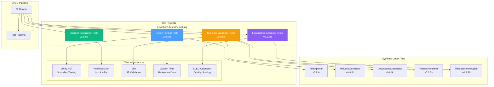
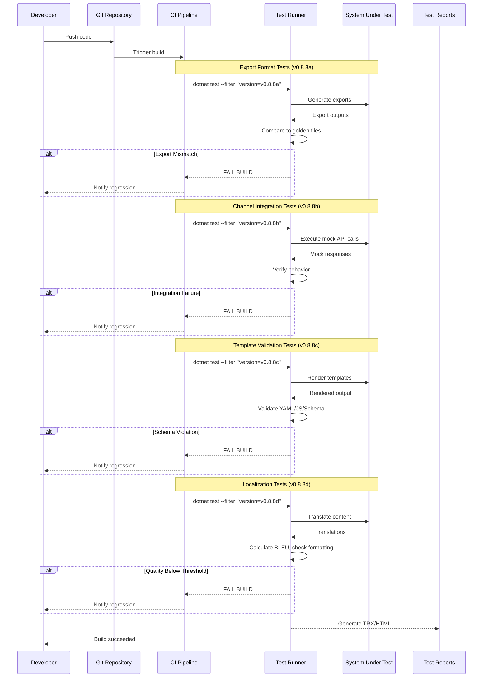

# LCS-DES-088: Design Specification Index — The Hardening (Publishing)

## Document Control

| Field | Value |
| :--- | :--- |
| **Document ID** | LCS-DES-088-INDEX |
| **Feature ID** | TST-088 |
| **Feature Name** | The Hardening (Publishing) |
| **Target Version** | v0.8.8 |
| **Module Scope** | Lexichord.Tests.Publishing |
| **Swimlane** | Governance |
| **License Tier** | Core |
| **Feature Gate Key** | N/A (testing infrastructure) |
| **Status** | Draft |
| **Last Updated** | 2026-01-27 |

---

## 1. Executive Summary

**v0.8.8** delivers the **Hardening (Publishing)** — comprehensive test suites that verify the accuracy and reliability of all publishing pipeline components introduced in v0.8.x. This represents the "Opening Night Rehearsal" for the entire Publisher module.

### 1.1 The Problem

Lexichord's v0.8.x release series introduced complex publishing infrastructure:

- Export pipelines for Markdown, DOCX, PDF, and HTML formats
- Channel integrations for WordPress, GitHub, and Confluence
- Template systems for release notes and static site scaffolding
- Localization support for multi-language documentation

Without comprehensive testing, there is no guarantee these components produce accurate, reliable outputs. Integration failures could silently break publishing workflows, and export regressions could corrupt user documents.

### 1.2 The Solution

Implement four test suites that:

1. **Verify Export Fidelity** — Compare export outputs against golden reference files using snapshot testing
2. **Mock Channel Integrations** — Test WordPress, GitHub, and Confluence publishing against mock APIs
3. **Validate Templates** — Ensure all templates comply with their defined schemas
4. **Test Localization** — Verify translation quality and formatting preservation

### 1.3 Business Value

| Value | Description |
| :--- | :--- |
| **Export Confidence** | Mathematical verification of Markdown/DOCX/PDF/HTML output accuracy |
| **Integration Reliability** | Mock-based testing prevents failures during actual publishing |
| **Template Validation** | Schema compliance ensures custom templates work correctly |
| **Localization Quality** | Translation tests verify formatting and meaning preservation |
| **Regression Prevention** | CI failures catch issues before they reach production |

---

## 2. Related Documents

### 2.1 Scope Breakdown Document

The detailed scope breakdown for v0.8.8, including all sub-parts, implementation checklists, user stories, and acceptance criteria:

| Document | Description |
| :--- | :--- |
| **[LCS-SBD-088](./LCS-SBD-088.md)** | Scope Breakdown — The Hardening (Publishing) |

### 2.2 Sub-Part Design Specifications

Each sub-part has its own detailed design specification following the LDS-01 template:

| Sub-Part | Document | Title | Description |
| :--- | :--- | :--- | :--- |
| v0.8.8a | **[LCS-DES-088a](./LCS-DES-088a.md)** | Export Format Tests | Markdown/DOCX/PDF/HTML output fidelity |
| v0.8.8b | **[LCS-DES-088b](./LCS-DES-088b.md)** | Channel Integration Tests | Mock WordPress/GitHub/Confluence APIs |
| v0.8.8c | **[LCS-DES-088c](./LCS-DES-088c.md)** | Template Validation | Schema compliance for all templates |
| v0.8.8d | **[LCS-DES-088d](./LCS-DES-088d.md)** | Localization Accuracy | Translation quality and formatting |

---

## 3. Architecture Overview

### 3.1 Component Diagram



### 3.2 Test Execution Flow



---

## 4. Dependencies

### 4.1 Upstream Dependencies (Systems Under Test)

| Interface | Source Version | Purpose |
| :--- | :--- | :--- |
| `IPdfExporter` | v0.8.6a | PDF export pipeline |
| `MarkdownPdfExporter` | v0.8.6b | Markdown to PDF rendering |
| `IMkDocsGenerator` | v0.8.5b | MkDocs configuration generation |
| `IDocusaurusGenerator` | v0.8.5c | Docusaurus configuration generation |
| `IPromptRenderer` | v0.6.3b | Template rendering engine |
| `IPromptTemplateRepository` | v0.6.3a | Template storage |
| `ReleaseNotesAgent` | v0.8.3b | Release notes generation |
| `IMarkdownParser` | v0.1.3b | Markdown parsing |
| `IDiffEngine` | v0.8.4a | Output comparison |

### 4.2 NuGet Packages

| Package | Version | Purpose |
| :--- | :--- | :--- |
| `xunit` | 2.9.x | Test framework |
| `FluentAssertions` | 6.x | Fluent test assertions |
| `Moq` | 4.x | Mocking framework |
| `Verify.Xunit` | 24.x | Snapshot testing (NEW) |
| `WireMock.Net` | 1.5.x | Mock HTTP server (NEW) |
| `Jint` | 3.x | JavaScript validation (NEW) |
| `coverlet.collector` | 6.x | Code coverage |

### 4.3 Downstream Consumers (Future)

| Version | Feature | Uses From v0.8.8 |
| :--- | :--- | :--- |
| v0.9.x | Collaboration | Test patterns for real-time features |
| v1.0.x | Production | Quality assurance for release |

---

## 5. License Gating Strategy

Testing infrastructure is **Core** tier — no license gating required.

All tests run regardless of user license tier. Test code is development-only and not included in production builds.

---

## 6. Test Categories

### 6.1 Test Trait Organization

| Category | Trait Filter | Purpose |
| :--- | :--- | :--- |
| Unit | `Category=Unit` | Export and template validation |
| Integration | `Category=Integration` | Mock API tests |
| Localization | `Category=Localization` | Translation tests |

| Version | Trait Filter | Sub-Part |
| :--- | :--- | :--- |
| v0.8.8a | `Version=v0.8.8a` | Export format tests |
| v0.8.8b | `Version=v0.8.8b` | Channel integration tests |
| v0.8.8c | `Version=v0.8.8c` | Template validation tests |
| v0.8.8d | `Version=v0.8.8d` | Localization tests |

### 6.2 CI Pipeline Commands

```bash
# Run all export format tests
dotnet test --filter "Version=v0.8.8a"

# Run all channel integration tests
dotnet test --filter "Version=v0.8.8b"

# Run all template validation tests
dotnet test --filter "Version=v0.8.8c"

# Run all localization tests
dotnet test --filter "Version=v0.8.8d"

# Run all v0.8.8 tests
dotnet test --filter "Version~v0.8.8"
```

---

## 7. Key Test Scenarios Summary

### 7.1 Export Format Tests (v0.8.8a)

| Format | Key Test | Expected Outcome |
| :--- | :--- | :--- |
| Markdown | Heading preservation | `# Heading` unchanged |
| Markdown | Table alignment | Alignment markers preserved |
| DOCX | Heading styles | `Heading1`, `Heading2` styles applied |
| DOCX | Table of contents | All headings included |
| PDF | Page dimensions | A4: 595x842pt, Letter: 612x792pt |
| PDF | Annotations | Style violations visible |
| HTML | Structure | Valid DOCTYPE and tags |
| HTML | Syntax highlighting | Code blocks with language classes |

### 7.2 Channel Integration Tests (v0.8.8b)

| Channel | Key Test | Expected Outcome |
| :--- | :--- | :--- |
| WordPress | Create post | Returns post ID |
| WordPress | Rate limiting | Retries with backoff |
| WordPress | Media upload | Attaches to post |
| GitHub | Create PR | Returns PR URL |
| GitHub | Update file | Returns commit SHA |
| GitHub | Create release | Uploads assets |
| Confluence | Create page | Returns page ID |
| Confluence | Update page | Increments version |

### 7.3 Template Validation Tests (v0.8.8c)

| Template | Key Test | Expected Outcome |
| :--- | :--- | :--- |
| Release Notes | Missing version | Throws validation error |
| Release Notes | Variable substitution | Values replaced correctly |
| MkDocs | YAML generation | Valid YAML output |
| MkDocs | Nav structure | Correct hierarchy |
| Docusaurus | JS generation | Valid JavaScript |
| Docusaurus | Sidebars | Correct category structure |
| Custom | Schema validation | Matches JSON Schema |

### 7.4 Localization Tests (v0.8.8d)

| Category | Key Test | Expected Outcome |
| :--- | :--- | :--- |
| Formatting | Heading markers | `# ` prefix preserved |
| Formatting | Bold/italic | `**` and `*` preserved |
| Formatting | Code blocks | Content unchanged |
| Quality | European languages | BLEU >= 0.85 |
| Quality | Asian languages | BLEU >= 0.80 |
| Locale | Number format | Matches locale (1,234.56 vs 1.234,56) |
| Locale | Date format | Matches locale |

---

## 8. Implementation Checklist Summary

| Sub-Part | Tasks | Est. Hours |
| :--- | :--- | :--- |
| v0.8.8a | Export Format Tests | 15 |
| v0.8.8b | Channel Integration Tests | 15 |
| v0.8.8c | Template Validation Tests | 11 |
| v0.8.8d | Localization Accuracy Tests | 11.5 |
| Integration | Project structure, CI config | 0.5 |
| **Total** | | **53 hours** |

See [LCS-SBD-088](./LCS-SBD-088.md) Section 4 for the detailed task breakdown.

---

## 9. Success Criteria Summary

| Category | Criterion | Target |
| :--- | :--- | :--- |
| **Markdown Fidelity** | Golden file match | 100% |
| **DOCX Structure** | Schema valid | 100% |
| **PDF Rendering** | Dimension accuracy | +/-1pt |
| **HTML Validity** | W3C valid | 100% |
| **WordPress Coverage** | API endpoints | 95%+ |
| **GitHub Coverage** | API endpoints | 95%+ |
| **Confluence Coverage** | API endpoints | 90%+ |
| **MkDocs YAML** | Parser success | 100% |
| **Docusaurus JS** | Jint parse | 100% |
| **BLEU (European)** | Quality score | >= 0.85 |
| **BLEU (Asian)** | Quality score | >= 0.80 |
| **Formatting Preservation** | Marker presence | 100% |

See [LCS-SBD-088](./LCS-SBD-088.md) Section 9 for full success metrics.

---

## 10. Test Coverage Summary

| Sub-Part | Test File | Coverage Area |
| :--- | :--- | :--- |
| v0.8.8a | `MarkdownExportTests.cs` | Markdown format fidelity |
| v0.8.8a | `DocxExportTests.cs` | DOCX structure and styles |
| v0.8.8a | `PdfExportTests.cs` | PDF rendering accuracy |
| v0.8.8a | `HtmlExportTests.cs` | HTML structure and validity |
| v0.8.8b | `WordPressPublishingTests.cs` | WordPress REST API mock |
| v0.8.8b | `GitHubPublishingTests.cs` | GitHub API mock |
| v0.8.8b | `ConfluencePublishingTests.cs` | Confluence API mock |
| v0.8.8c | `ReleaseNotesTemplateTests.cs` | Release notes schema |
| v0.8.8c | `MkDocsTemplateTests.cs` | MkDocs YAML validation |
| v0.8.8c | `DocusaurusTemplateTests.cs` | Docusaurus JS validation |
| v0.8.8c | `CustomTemplateTests.cs` | Custom template schema |
| v0.8.8d | `TranslationFormattingTests.cs` | Markdown preservation |
| v0.8.8d | `TranslationQualityTests.cs` | BLEU score calculation |
| v0.8.8d | `LocaleSpecificTests.cs` | Number/date/currency format |

See individual design specs for detailed test scenarios.

---

## 11. What This Enables

| Version | Feature | Uses From v0.8.8 |
| :--- | :--- | :--- |
| v0.9.x | Collaboration | Test patterns for real-time features |
| v1.0.x | Production | Quality assurance for release |
| Enterprise | Compliance | Documented test coverage |

---

## 12. Test Infrastructure Components

### 12.1 Verify.NET (Snapshot Testing)

Used for export format tests to compare generated output against golden reference files.

```csharp
// Example usage
await Verify(exportedMarkdown);
await Verify(pdfTextContent);
```

### 12.2 WireMock.Net (Mock HTTP Server)

Used for channel integration tests to mock WordPress, GitHub, and Confluence APIs.

```csharp
// Example usage
_mockServer
    .Given(Request.Create().WithPath("/api/posts").UsingPost())
    .RespondWith(Response.Create().WithStatusCode(201));
```

### 12.3 Jint (JavaScript Validation)

Used for Docusaurus template validation to ensure generated JavaScript is syntactically correct.

```csharp
// Example usage
var engine = new Engine();
var result = engine.Evaluate(generatedJs);
```

### 12.4 BLEU Score Calculator

Used for localization tests to measure translation quality against reference translations.

```csharp
// Example usage
var score = _scorer.CalculateBleuScore(translations, references);
score.Should().BeGreaterOrEqualTo(0.85);
```

---

## Document History

| Version | Date | Author | Changes |
| :--- | :--- | :--- | :--- |
| 1.0 | 2026-01-27 | Lead Architect | Initial draft |
