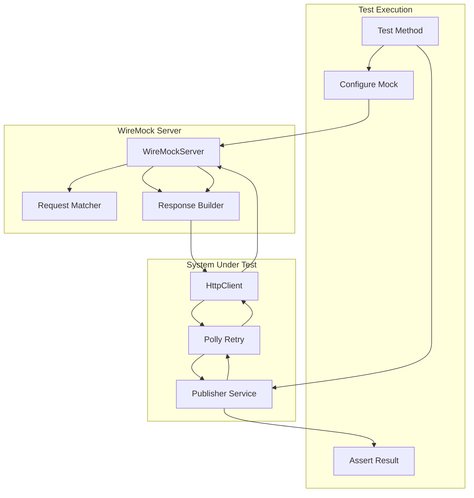
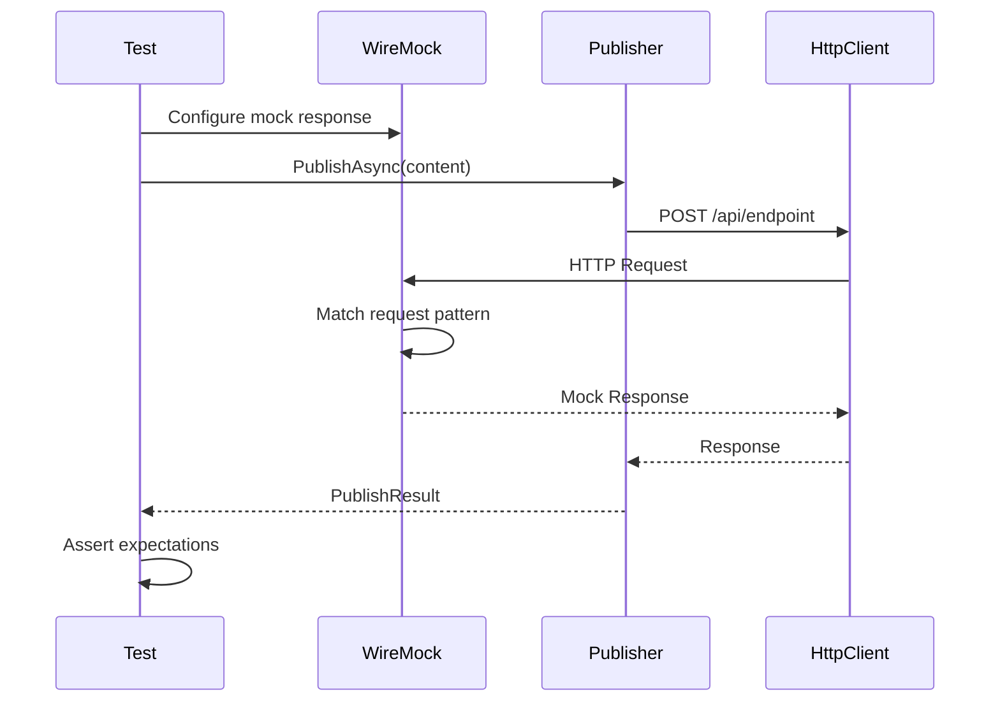

# LCS-DES-088b: Design Specification — Channel Integration Tests

## 1. Metadata & Categorization

| Field | Value | Description |
| :--- | :--- | :--- |
| **Feature ID** | `TST-088b` | Sub-part of TST-088 |
| **Feature Name** | `Channel Integration Mock Test Suite` | Mock API integration tests |
| **Target Version** | `v0.8.8b` | Second sub-part of v0.8.8 |
| **Module Scope** | `Lexichord.Tests.Publishing` | Test project |
| **Swimlane** | `Governance` | Part of Publishing vertical |
| **License Tier** | `Core` | Testing available to all |
| **Feature Gate Key** | N/A | No gating for tests |
| **Author** | Lead Architect | |
| **Status** | `Draft` | |
| **Last Updated** | `2026-01-27` | |
| **Parent Document** | [LCS-DES-088-INDEX](./LCS-DES-088-INDEX.md) | |
| **Scope Breakdown** | [LCS-SBD-088 Section 3.2](./LCS-SBD-088.md#32-v088b-channel-integration-tests) | |

---

## 2. Executive Summary

### 2.1 The Requirement

The channel integrations introduced in v0.8.x enable publishing to WordPress, GitHub, and Confluence. Testing these integrations against live APIs would be:

- **Slow**: Network latency increases test time
- **Flaky**: External service availability affects reliability
- **Costly**: API rate limits and quotas could be exhausted
- **Risky**: Accidental production changes during testing

> **Goal:** Verify that all channel integrations function correctly using mock external APIs, ensuring reliable testing without live service dependencies.

### 2.2 The Proposed Solution

Implement a comprehensive mock-based test suite using WireMock.Net that:

1. Mocks WordPress REST API v2 endpoints
2. Mocks GitHub REST API v3 endpoints
3. Mocks Confluence REST API v2 endpoints
4. Tests error scenarios (authentication failures, rate limiting, network errors)
5. Verifies retry policies and backoff behavior
6. Validates request/response transformations

---

## 3. Architecture & Modular Strategy

### 3.1 Dependencies

#### 3.1.1 Systems Under Test

| Interface | Source Version | Purpose |
| :--- | :--- | :--- |
| `IWordPressPublisher` | v0.8.x | WordPress publishing |
| `IGitHubPublisher` | v0.8.x | GitHub publishing |
| `IConfluencePublisher` | v0.8.x | Confluence publishing |
| `IReleaseNotesAgent` | v0.8.3b | Release notes for publishing |

#### 3.1.2 NuGet Packages

| Package | Version | Purpose |
| :--- | :--- | :--- |
| `xunit` | 2.9.x | Test framework |
| `FluentAssertions` | 6.x | Fluent assertions |
| `WireMock.Net` | 1.5.x | Mock HTTP server (NEW) |
| `Polly` | 8.x | Retry policy testing |

### 3.2 Licensing Behavior

No licensing required. Tests run in development/CI environments only.

---

## 4. Data Contract (The API)

### 4.1 WireMock Fixture

```csharp
namespace Lexichord.Tests.Publishing.ChannelIntegration;

/// <summary>
/// Shared fixture for WireMock server across integration tests.
/// Provides mock HTTP server for all channel integration tests.
/// </summary>
public class WireMockFixture : IAsyncLifetime
{
    public WireMockServer Server { get; private set; } = null!;

    public Task InitializeAsync()
    {
        Server = WireMockServer.Start(new WireMockServerSettings
        {
            Port = 0, // Auto-assign available port
            UseSSL = false,
            StartAdminInterface = false
        });

        return Task.CompletedTask;
    }

    public Task DisposeAsync()
    {
        Server?.Stop();
        Server?.Dispose();
        return Task.CompletedTask;
    }

    /// <summary>
    /// Reset all mappings between tests.
    /// </summary>
    public void Reset()
    {
        Server.Reset();
    }
}

/// <summary>
/// Collection definition for sharing WireMock fixture across test classes.
/// </summary>
[CollectionDefinition("WireMock")]
public class WireMockCollection : ICollectionFixture<WireMockFixture>
{
}
```

### 4.2 Test Class Structure

```csharp
namespace Lexichord.Tests.Publishing.ChannelIntegration;

[Collection("WireMock")]
[Trait("Category", "Integration")]
[Trait("Version", "v0.8.8b")]
public class WordPressPublishingTests
{
    private readonly WireMockServer _mockServer;
    private readonly IWordPressPublisher _publisher;

    public WordPressPublishingTests(WireMockFixture fixture)
    {
        _mockServer = fixture.Server;
        fixture.Reset();
        _publisher = CreatePublisher(fixture.Server.Url!);
    }
}

[Collection("WireMock")]
[Trait("Category", "Integration")]
[Trait("Version", "v0.8.8b")]
public class GitHubPublishingTests
{
    // Similar structure
}

[Collection("WireMock")]
[Trait("Category", "Integration")]
[Trait("Version", "v0.8.8b")]
public class ConfluencePublishingTests
{
    // Similar structure
}
```

---

## 5. Implementation Logic

### 5.1 Mock API Architecture



### 5.2 Request/Response Flow



---

## 6. Test Scenarios

### 6.1 WordPressPublishingTests

```csharp
[Collection("WireMock")]
[Trait("Category", "Integration")]
[Trait("Version", "v0.8.8b")]
public class WordPressPublishingTests
{
    private readonly WireMockServer _server;
    private readonly IWordPressPublisher _publisher;

    public WordPressPublishingTests(WireMockFixture fixture)
    {
        _server = fixture.Server;
        fixture.Reset();
        _publisher = new WordPressPublisher(new HttpClient
        {
            BaseAddress = new Uri(_server.Url!)
        });
    }

    #region Post Creation Tests

    [Fact]
    public async Task PublishPost_ValidContent_ReturnsPostId()
    {
        // Arrange
        _server
            .Given(Request.Create()
                .WithPath("/wp-json/wp/v2/posts")
                .UsingPost()
                .WithHeader("Content-Type", "application/json"))
            .RespondWith(Response.Create()
                .WithStatusCode(201)
                .WithHeader("Content-Type", "application/json")
                .WithBodyAsJson(new
                {
                    id = 12345,
                    status = "publish",
                    link = "https://example.com/posts/12345"
                }));

        var post = new WordPressPost
        {
            Title = "Test Post",
            Content = "This is test content.",
            Status = PublishStatus.Publish
        };

        // Act
        var result = await _publisher.PublishAsync(post);

        // Assert
        result.IsSuccess.Should().BeTrue();
        result.PostId.Should().Be(12345);
        result.Url.Should().Be("https://example.com/posts/12345");
    }

    [Fact]
    public async Task PublishPost_Draft_ReturnsDraftStatus()
    {
        _server
            .Given(Request.Create()
                .WithPath("/wp-json/wp/v2/posts")
                .UsingPost())
            .RespondWith(Response.Create()
                .WithStatusCode(201)
                .WithBodyAsJson(new
                {
                    id = 12346,
                    status = "draft"
                }));

        var post = new WordPressPost
        {
            Title = "Draft Post",
            Content = "Draft content.",
            Status = PublishStatus.Draft
        };

        var result = await _publisher.PublishAsync(post);

        result.IsSuccess.Should().BeTrue();
        result.Status.Should().Be("draft");
    }

    [Fact]
    public async Task PublishPost_WithCategories_IncludesCategoryIds()
    {
        _server
            .Given(Request.Create()
                .WithPath("/wp-json/wp/v2/posts")
                .UsingPost()
                .WithBody(new JsonMatcher(new { categories = new[] { 1, 2, 3 } }, true)))
            .RespondWith(Response.Create()
                .WithStatusCode(201)
                .WithBodyAsJson(new { id = 12347, categories = new[] { 1, 2, 3 } }));

        var post = new WordPressPost
        {
            Title = "Categorized Post",
            Content = "Content here.",
            CategoryIds = new[] { 1, 2, 3 }
        };

        var result = await _publisher.PublishAsync(post);

        result.IsSuccess.Should().BeTrue();
    }

    #endregion

    #region Media Upload Tests

    [Fact]
    public async Task UploadMedia_ValidImage_ReturnsMediaId()
    {
        _server
            .Given(Request.Create()
                .WithPath("/wp-json/wp/v2/media")
                .UsingPost()
                .WithHeader("Content-Disposition", "*"))
            .RespondWith(Response.Create()
                .WithStatusCode(201)
                .WithBodyAsJson(new
                {
                    id = 999,
                    source_url = "https://example.com/wp-content/uploads/image.png",
                    media_type = "image"
                }));

        var imageBytes = CreateTestImage();

        var result = await _publisher.UploadMediaAsync(new MediaUpload
        {
            FileName = "test-image.png",
            Content = imageBytes,
            MimeType = "image/png"
        });

        result.IsSuccess.Should().BeTrue();
        result.MediaId.Should().Be(999);
        result.Url.Should().Contain("image.png");
    }

    [Fact]
    public async Task PublishPost_WithFeaturedImage_UploadsAndAttaches()
    {
        // First mock: media upload
        _server
            .Given(Request.Create()
                .WithPath("/wp-json/wp/v2/media")
                .UsingPost())
            .RespondWith(Response.Create()
                .WithStatusCode(201)
                .WithBodyAsJson(new { id = 888 }));

        // Second mock: post creation with featured_media
        _server
            .Given(Request.Create()
                .WithPath("/wp-json/wp/v2/posts")
                .UsingPost()
                .WithBody(new JsonMatcher(new { featured_media = 888 }, true)))
            .RespondWith(Response.Create()
                .WithStatusCode(201)
                .WithBodyAsJson(new { id = 12348, featured_media = 888 }));

        var post = new WordPressPost
        {
            Title = "Post with Image",
            Content = "Content here.",
            FeaturedImage = CreateTestImage()
        };

        var result = await _publisher.PublishAsync(post);

        result.IsSuccess.Should().BeTrue();
        result.FeaturedMediaId.Should().Be(888);
    }

    #endregion

    #region Authentication Error Tests

    [Fact]
    public async Task PublishPost_Unauthorized_ReturnsAuthError()
    {
        _server
            .Given(Request.Create()
                .WithPath("/wp-json/wp/v2/posts")
                .UsingPost())
            .RespondWith(Response.Create()
                .WithStatusCode(401)
                .WithBodyAsJson(new
                {
                    code = "rest_forbidden",
                    message = "Sorry, you are not allowed to create posts.",
                    data = new { status = 401 }
                }));

        var result = await _publisher.PublishAsync(new WordPressPost());

        result.IsSuccess.Should().BeFalse();
        result.Error.Should().BeOfType<AuthenticationError>();
        result.ErrorMessage.Should().Contain("not allowed");
    }

    [Fact]
    public async Task PublishPost_Forbidden_ReturnsForbiddenError()
    {
        _server
            .Given(Request.Create()
                .WithPath("/wp-json/wp/v2/posts")
                .UsingPost())
            .RespondWith(Response.Create()
                .WithStatusCode(403)
                .WithBodyAsJson(new
                {
                    code = "rest_forbidden_context",
                    message = "Sorry, you are not allowed to publish posts."
                }));

        var result = await _publisher.PublishAsync(new WordPressPost
        {
            Status = PublishStatus.Publish
        });

        result.IsSuccess.Should().BeFalse();
        result.Error.Should().BeOfType<AuthorizationError>();
    }

    #endregion

    #region Rate Limiting Tests

    [Fact]
    public async Task PublishPost_RateLimited_RetriesWithBackoff()
    {
        var requestCount = 0;

        _server
            .Given(Request.Create()
                .WithPath("/wp-json/wp/v2/posts")
                .UsingPost())
            .RespondWith(Response.Create()
                .WithCallback(req =>
                {
                    requestCount++;
                    if (requestCount < 3)
                    {
                        return new ResponseMessage
                        {
                            StatusCode = 429,
                            Headers = new Dictionary<string, WireMockList<string>>
                            {
                                ["Retry-After"] = new WireMockList<string>("1"),
                                ["X-RateLimit-Remaining"] = new WireMockList<string>("0")
                            },
                            BodyData = new BodyData
                            {
                                BodyAsString = "{\"code\": \"rate_limit\", \"message\": \"Too many requests\"}"
                            }
                        };
                    }
                    return new ResponseMessage
                    {
                        StatusCode = 201,
                        BodyData = new BodyData
                        {
                            BodyAsString = "{\"id\": 12349, \"status\": \"publish\"}"
                        }
                    };
                }));

        var result = await _publisher.PublishAsync(new WordPressPost
        {
            Title = "Retry Test",
            Content = "Content"
        });

        result.IsSuccess.Should().BeTrue();
        requestCount.Should().Be(3, "Should retry twice before success");
    }

    [Fact]
    public async Task PublishPost_RateLimitExhausted_ReturnsError()
    {
        _server
            .Given(Request.Create()
                .WithPath("/wp-json/wp/v2/posts")
                .UsingPost())
            .RespondWith(Response.Create()
                .WithStatusCode(429)
                .WithHeader("Retry-After", "3600")
                .WithBodyAsJson(new
                {
                    code = "rate_limit",
                    message = "Rate limit exceeded"
                }));

        var result = await _publisher.PublishAsync(new WordPressPost());

        result.IsSuccess.Should().BeFalse();
        result.Error.Should().BeOfType<RateLimitError>();
    }

    #endregion

    #region Network Error Tests

    [Fact]
    public async Task PublishPost_ConnectionRefused_ReturnsNetworkError()
    {
        // Use an invalid port to simulate connection refused
        var badPublisher = new WordPressPublisher(new HttpClient
        {
            BaseAddress = new Uri("http://localhost:1")
        });

        var result = await badPublisher.PublishAsync(new WordPressPost());

        result.IsSuccess.Should().BeFalse();
        result.Error.Should().BeOfType<NetworkError>();
    }

    [Fact]
    public async Task PublishPost_Timeout_ReturnsTimeoutError()
    {
        _server
            .Given(Request.Create()
                .WithPath("/wp-json/wp/v2/posts")
                .UsingPost())
            .RespondWith(Response.Create()
                .WithDelay(TimeSpan.FromSeconds(30)));

        var publisher = new WordPressPublisher(new HttpClient
        {
            BaseAddress = new Uri(_server.Url!),
            Timeout = TimeSpan.FromSeconds(1)
        });

        var result = await publisher.PublishAsync(new WordPressPost());

        result.IsSuccess.Should().BeFalse();
        result.Error.Should().BeOfType<TimeoutError>();
    }

    #endregion

    #region Update Post Tests

    [Fact]
    public async Task UpdatePost_ExistingPost_ReturnsUpdated()
    {
        _server
            .Given(Request.Create()
                .WithPath("/wp-json/wp/v2/posts/12345")
                .UsingPut())
            .RespondWith(Response.Create()
                .WithStatusCode(200)
                .WithBodyAsJson(new
                {
                    id = 12345,
                    modified = "2026-01-27T10:00:00"
                }));

        var result = await _publisher.UpdateAsync(12345, new WordPressPost
        {
            Title = "Updated Title",
            Content = "Updated content."
        });

        result.IsSuccess.Should().BeTrue();
        result.PostId.Should().Be(12345);
    }

    [Fact]
    public async Task UpdatePost_NotFound_ReturnsNotFoundError()
    {
        _server
            .Given(Request.Create()
                .WithPath("/wp-json/wp/v2/posts/99999")
                .UsingPut())
            .RespondWith(Response.Create()
                .WithStatusCode(404)
                .WithBodyAsJson(new
                {
                    code = "rest_post_invalid_id",
                    message = "Invalid post ID."
                }));

        var result = await _publisher.UpdateAsync(99999, new WordPressPost());

        result.IsSuccess.Should().BeFalse();
        result.Error.Should().BeOfType<NotFoundError>();
    }

    #endregion

    #region Helper Methods

    private static byte[] CreateTestImage()
    {
        // Create minimal valid PNG bytes
        return new byte[]
        {
            0x89, 0x50, 0x4E, 0x47, 0x0D, 0x0A, 0x1A, 0x0A, // PNG header
            0x00, 0x00, 0x00, 0x0D, // IHDR length
            0x49, 0x48, 0x44, 0x52  // IHDR
        };
    }

    #endregion
}
```

### 6.2 GitHubPublishingTests

```csharp
[Collection("WireMock")]
[Trait("Category", "Integration")]
[Trait("Version", "v0.8.8b")]
public class GitHubPublishingTests
{
    private readonly WireMockServer _server;
    private readonly IGitHubPublisher _publisher;

    public GitHubPublishingTests(WireMockFixture fixture)
    {
        _server = fixture.Server;
        fixture.Reset();
        _publisher = new GitHubPublisher(new HttpClient
        {
            BaseAddress = new Uri(_server.Url!)
        });
    }

    #region Pull Request Tests

    [Fact]
    public async Task CreatePullRequest_ValidSpec_ReturnsPrUrl()
    {
        _server
            .Given(Request.Create()
                .WithPath("/repos/owner/repo/pulls")
                .UsingPost()
                .WithHeader("Accept", "application/vnd.github+json"))
            .RespondWith(Response.Create()
                .WithStatusCode(201)
                .WithBodyAsJson(new
                {
                    number = 42,
                    html_url = "https://github.com/owner/repo/pull/42",
                    state = "open",
                    title = "Update documentation",
                    head = new { @ref = "feature/docs" },
                    @base = new { @ref = "main" }
                }));

        var result = await _publisher.CreatePullRequestAsync(new PullRequestSpec
        {
            Owner = "owner",
            Repo = "repo",
            Title = "Update documentation",
            Body = "This PR updates the docs",
            Head = "feature/docs",
            Base = "main"
        });

        result.IsSuccess.Should().BeTrue();
        result.PullRequestNumber.Should().Be(42);
        result.Url.Should().Be("https://github.com/owner/repo/pull/42");
    }

    [Fact]
    public async Task CreatePullRequest_NoBranchDiff_ReturnsError()
    {
        _server
            .Given(Request.Create()
                .WithPath("/repos/owner/repo/pulls")
                .UsingPost())
            .RespondWith(Response.Create()
                .WithStatusCode(422)
                .WithBodyAsJson(new
                {
                    message = "Validation Failed",
                    errors = new[]
                    {
                        new { message = "No commits between main and feature/empty" }
                    }
                }));

        var result = await _publisher.CreatePullRequestAsync(new PullRequestSpec
        {
            Owner = "owner",
            Repo = "repo",
            Head = "feature/empty",
            Base = "main"
        });

        result.IsSuccess.Should().BeFalse();
        result.Error.Should().BeOfType<ValidationError>();
        result.ErrorMessage.Should().Contain("No commits");
    }

    [Fact]
    public async Task CreatePullRequest_WithLabels_AddsLabels()
    {
        // First mock: PR creation
        _server
            .Given(Request.Create()
                .WithPath("/repos/owner/repo/pulls")
                .UsingPost())
            .RespondWith(Response.Create()
                .WithStatusCode(201)
                .WithBodyAsJson(new { number = 43 }));

        // Second mock: Label addition
        _server
            .Given(Request.Create()
                .WithPath("/repos/owner/repo/issues/43/labels")
                .UsingPost()
                .WithBody(new JsonMatcher(new[] { "documentation", "automated" })))
            .RespondWith(Response.Create()
                .WithStatusCode(200)
                .WithBodyAsJson(new[]
                {
                    new { name = "documentation" },
                    new { name = "automated" }
                }));

        var result = await _publisher.CreatePullRequestAsync(new PullRequestSpec
        {
            Owner = "owner",
            Repo = "repo",
            Title = "Labeled PR",
            Head = "feature",
            Base = "main",
            Labels = new[] { "documentation", "automated" }
        });

        result.IsSuccess.Should().BeTrue();
    }

    #endregion

    #region File Update Tests

    [Fact]
    public async Task UpdateFile_NewFile_CreatesWithContent()
    {
        // Mock get file (not found)
        _server
            .Given(Request.Create()
                .WithPath("/repos/owner/repo/contents/docs/new-file.md")
                .UsingGet())
            .RespondWith(Response.Create()
                .WithStatusCode(404));

        // Mock create file
        _server
            .Given(Request.Create()
                .WithPath("/repos/owner/repo/contents/docs/new-file.md")
                .UsingPut()
                .WithBody(new JsonMatcher(new { message = "*" }, true)))
            .RespondWith(Response.Create()
                .WithStatusCode(201)
                .WithBodyAsJson(new
                {
                    content = new { sha = "abc123", path = "docs/new-file.md" },
                    commit = new { sha = "def456", message = "Create new-file.md" }
                }));

        var result = await _publisher.UpdateFileAsync(new FileUpdateSpec
        {
            Owner = "owner",
            Repo = "repo",
            Path = "docs/new-file.md",
            Content = "# New File\n\nContent here.",
            Message = "Create new-file.md",
            Branch = "main"
        });

        result.IsSuccess.Should().BeTrue();
        result.CommitSha.Should().Be("def456");
    }

    [Fact]
    public async Task UpdateFile_ExistingFile_IncludesSha()
    {
        // Mock get existing file
        _server
            .Given(Request.Create()
                .WithPath("/repos/owner/repo/contents/docs/README.md")
                .UsingGet())
            .RespondWith(Response.Create()
                .WithStatusCode(200)
                .WithBodyAsJson(new
                {
                    sha = "existing-sha-123",
                    content = Convert.ToBase64String(
                        System.Text.Encoding.UTF8.GetBytes("# Old Content"))
                }));

        // Mock update file with SHA
        _server
            .Given(Request.Create()
                .WithPath("/repos/owner/repo/contents/docs/README.md")
                .UsingPut()
                .WithBody(new JsonMatcher(new { sha = "existing-sha-123" }, true)))
            .RespondWith(Response.Create()
                .WithStatusCode(200)
                .WithBodyAsJson(new
                {
                    content = new { sha = "new-sha-456" },
                    commit = new { sha = "commit-789" }
                }));

        var result = await _publisher.UpdateFileAsync(new FileUpdateSpec
        {
            Owner = "owner",
            Repo = "repo",
            Path = "docs/README.md",
            Content = "# New Content",
            Message = "Update README"
        });

        result.IsSuccess.Should().BeTrue();
    }

    #endregion

    #region Release Tests

    [Fact]
    public async Task CreateRelease_ValidSpec_ReturnsReleaseId()
    {
        _server
            .Given(Request.Create()
                .WithPath("/repos/owner/repo/releases")
                .UsingPost())
            .RespondWith(Response.Create()
                .WithStatusCode(201)
                .WithBodyAsJson(new
                {
                    id = 123,
                    tag_name = "v1.0.0",
                    html_url = "https://github.com/owner/repo/releases/tag/v1.0.0",
                    upload_url = "https://uploads.github.com/repos/owner/repo/releases/123/assets{?name,label}"
                }));

        var result = await _publisher.CreateReleaseAsync(new ReleaseSpec
        {
            Owner = "owner",
            Repo = "repo",
            TagName = "v1.0.0",
            Name = "Version 1.0.0",
            Body = "Release notes here",
            IsDraft = false,
            IsPrerelease = false
        });

        result.IsSuccess.Should().BeTrue();
        result.ReleaseId.Should().Be(123);
        result.Url.Should().Contain("v1.0.0");
    }

    [Fact]
    public async Task CreateRelease_WithAssets_UploadsAll()
    {
        // Mock release creation
        _server
            .Given(Request.Create()
                .WithPath("/repos/owner/repo/releases")
                .UsingPost())
            .RespondWith(Response.Create()
                .WithStatusCode(201)
                .WithBodyAsJson(new
                {
                    id = 124,
                    upload_url = $"{_server.Url}/repos/owner/repo/releases/124/assets{{?name,label}}"
                }));

        // Mock asset uploads
        _server
            .Given(Request.Create()
                .WithPath("/repos/owner/repo/releases/124/assets")
                .WithParam("name", "release-notes.pdf")
                .UsingPost())
            .RespondWith(Response.Create()
                .WithStatusCode(201)
                .WithBodyAsJson(new
                {
                    id = 456,
                    name = "release-notes.pdf",
                    browser_download_url = "https://github.com/owner/repo/releases/download/v1.0.0/release-notes.pdf"
                }));

        _server
            .Given(Request.Create()
                .WithPath("/repos/owner/repo/releases/124/assets")
                .WithParam("name", "changelog.md")
                .UsingPost())
            .RespondWith(Response.Create()
                .WithStatusCode(201)
                .WithBodyAsJson(new { id = 457, name = "changelog.md" }));

        var result = await _publisher.CreateReleaseAsync(new ReleaseSpec
        {
            Owner = "owner",
            Repo = "repo",
            TagName = "v1.0.0",
            Name = "Version 1.0.0",
            Body = "Release notes",
            Assets = new[]
            {
                new ReleaseAsset("release-notes.pdf", new byte[100]),
                new ReleaseAsset("changelog.md", System.Text.Encoding.UTF8.GetBytes("# Changelog"))
            }
        });

        result.IsSuccess.Should().BeTrue();
        result.UploadedAssets.Should().HaveCount(2);
        result.UploadedAssets.Should().Contain(a => a.Name == "release-notes.pdf");
        result.UploadedAssets.Should().Contain(a => a.Name == "changelog.md");
    }

    [Fact]
    public async Task CreateRelease_TagExists_ReturnsConflictError()
    {
        _server
            .Given(Request.Create()
                .WithPath("/repos/owner/repo/releases")
                .UsingPost())
            .RespondWith(Response.Create()
                .WithStatusCode(422)
                .WithBodyAsJson(new
                {
                    message = "Validation Failed",
                    errors = new[]
                    {
                        new { resource = "Release", code = "already_exists", field = "tag_name" }
                    }
                }));

        var result = await _publisher.CreateReleaseAsync(new ReleaseSpec
        {
            TagName = "v1.0.0"
        });

        result.IsSuccess.Should().BeFalse();
        result.Error.Should().BeOfType<ConflictError>();
    }

    #endregion

    #region Authentication Tests

    [Fact]
    public async Task CreatePullRequest_InvalidToken_ReturnsAuthError()
    {
        _server
            .Given(Request.Create()
                .WithPath("/repos/owner/repo/pulls")
                .UsingPost())
            .RespondWith(Response.Create()
                .WithStatusCode(401)
                .WithBodyAsJson(new
                {
                    message = "Bad credentials",
                    documentation_url = "https://docs.github.com/rest"
                }));

        var result = await _publisher.CreatePullRequestAsync(new PullRequestSpec());

        result.IsSuccess.Should().BeFalse();
        result.Error.Should().BeOfType<AuthenticationError>();
        result.ErrorMessage.Should().Contain("Bad credentials");
    }

    [Fact]
    public async Task CreateRelease_RateLimited_RetriesWithBackoff()
    {
        var attempts = 0;

        _server
            .Given(Request.Create()
                .WithPath("/repos/owner/repo/releases")
                .UsingPost())
            .RespondWith(Response.Create()
                .WithCallback(req =>
                {
                    attempts++;
                    if (attempts < 2)
                    {
                        return new ResponseMessage
                        {
                            StatusCode = 403,
                            Headers = new Dictionary<string, WireMockList<string>>
                            {
                                ["X-RateLimit-Remaining"] = new WireMockList<string>("0"),
                                ["X-RateLimit-Reset"] = new WireMockList<string>(
                                    DateTimeOffset.UtcNow.AddSeconds(1).ToUnixTimeSeconds().ToString())
                            },
                            BodyData = new BodyData
                            {
                                BodyAsString = "{\"message\": \"API rate limit exceeded\"}"
                            }
                        };
                    }
                    return new ResponseMessage
                    {
                        StatusCode = 201,
                        BodyData = new BodyData
                        {
                            BodyAsString = "{\"id\": 125}"
                        }
                    };
                }));

        var result = await _publisher.CreateReleaseAsync(new ReleaseSpec
        {
            TagName = "v1.0.1"
        });

        result.IsSuccess.Should().BeTrue();
        attempts.Should().Be(2);
    }

    #endregion
}
```

### 6.3 ConfluencePublishingTests

```csharp
[Collection("WireMock")]
[Trait("Category", "Integration")]
[Trait("Version", "v0.8.8b")]
public class ConfluencePublishingTests
{
    private readonly WireMockServer _server;
    private readonly IConfluencePublisher _publisher;

    public ConfluencePublishingTests(WireMockFixture fixture)
    {
        _server = fixture.Server;
        fixture.Reset();
        _publisher = new ConfluencePublisher(new HttpClient
        {
            BaseAddress = new Uri(_server.Url!)
        });
    }

    #region Page Creation Tests

    [Fact]
    public async Task CreatePage_ValidContent_ReturnsPageId()
    {
        _server
            .Given(Request.Create()
                .WithPath("/wiki/api/v2/pages")
                .UsingPost())
            .RespondWith(Response.Create()
                .WithStatusCode(200)
                .WithBodyAsJson(new
                {
                    id = "98765",
                    title = "Test Page",
                    status = "current",
                    version = new { number = 1 },
                    _links = new
                    {
                        webui = "/wiki/spaces/DOC/pages/98765/Test+Page"
                    }
                }));

        var result = await _publisher.CreatePageAsync(new ConfluencePage
        {
            SpaceId = "DOC",
            Title = "Test Page",
            Body = "<p>Page content</p>",
            ParentId = "12345"
        });

        result.IsSuccess.Should().BeTrue();
        result.PageId.Should().Be("98765");
        result.Version.Should().Be(1);
    }

    [Fact]
    public async Task CreatePage_WithAncestors_SetsParent()
    {
        _server
            .Given(Request.Create()
                .WithPath("/wiki/api/v2/pages")
                .UsingPost()
                .WithBody(new JsonMatcher(new
                {
                    parentId = "12345"
                }, true)))
            .RespondWith(Response.Create()
                .WithStatusCode(200)
                .WithBodyAsJson(new
                {
                    id = "98766",
                    parentId = "12345"
                }));

        var result = await _publisher.CreatePageAsync(new ConfluencePage
        {
            SpaceId = "DOC",
            Title = "Child Page",
            Body = "<p>Child content</p>",
            ParentId = "12345"
        });

        result.IsSuccess.Should().BeTrue();
    }

    #endregion

    #region Page Update Tests

    [Fact]
    public async Task UpdatePage_ExistingPage_IncrementsVersion()
    {
        // First mock: get current page version
        _server
            .Given(Request.Create()
                .WithPath("/wiki/api/v2/pages/98765")
                .UsingGet())
            .RespondWith(Response.Create()
                .WithStatusCode(200)
                .WithBodyAsJson(new
                {
                    id = "98765",
                    title = "Existing Page",
                    version = new { number = 5 }
                }));

        // Second mock: update with incremented version
        _server
            .Given(Request.Create()
                .WithPath("/wiki/api/v2/pages/98765")
                .UsingPut()
                .WithBody(new JsonMatcher(new
                {
                    version = new { number = 6 }
                }, true)))
            .RespondWith(Response.Create()
                .WithStatusCode(200)
                .WithBodyAsJson(new
                {
                    id = "98765",
                    version = new { number = 6 }
                }));

        var result = await _publisher.UpdatePageAsync("98765", new ConfluencePage
        {
            Title = "Updated Page",
            Body = "<p>Updated content</p>"
        });

        result.IsSuccess.Should().BeTrue();
        result.Version.Should().Be(6);
    }

    [Fact]
    public async Task UpdatePage_VersionConflict_ReturnsConflictError()
    {
        _server
            .Given(Request.Create()
                .WithPath("/wiki/api/v2/pages/98765")
                .UsingGet())
            .RespondWith(Response.Create()
                .WithStatusCode(200)
                .WithBodyAsJson(new { version = new { number = 5 } }));

        _server
            .Given(Request.Create()
                .WithPath("/wiki/api/v2/pages/98765")
                .UsingPut())
            .RespondWith(Response.Create()
                .WithStatusCode(409)
                .WithBodyAsJson(new
                {
                    statusCode = 409,
                    message = "Version conflict"
                }));

        var result = await _publisher.UpdatePageAsync("98765", new ConfluencePage());

        result.IsSuccess.Should().BeFalse();
        result.Error.Should().BeOfType<ConflictError>();
    }

    #endregion

    #region Content Conversion Tests

    [Fact]
    public async Task ConvertMarkdown_Headings_ConvertsToConfluence()
    {
        var markdown = @"# Heading 1
## Heading 2
### Heading 3";

        var result = await _publisher.ConvertToStorageFormatAsync(markdown);

        result.Should().Contain("<h1>Heading 1</h1>");
        result.Should().Contain("<h2>Heading 2</h2>");
        result.Should().Contain("<h3>Heading 3</h3>");
    }

    [Fact]
    public async Task ConvertMarkdown_CodeBlock_UsesCodeMacro()
    {
        var markdown = @"```csharp
var x = 1;
```";

        var result = await _publisher.ConvertToStorageFormatAsync(markdown);

        result.Should().Contain("<ac:structured-macro ac:name=\"code\"");
        result.Should().Contain("<ac:parameter ac:name=\"language\">csharp</ac:parameter>");
        result.Should().Contain("var x = 1;");
    }

    [Fact]
    public async Task ConvertMarkdown_Table_ConvertsToHtmlTable()
    {
        var markdown = @"| A | B |
|---|---|
| 1 | 2 |";

        var result = await _publisher.ConvertToStorageFormatAsync(markdown);

        result.Should().Contain("<table");
        result.Should().Contain("<th>A</th>");
        result.Should().Contain("<td>1</td>");
    }

    [Fact]
    public async Task ConvertMarkdown_InfoPanel_UsesInfoMacro()
    {
        var markdown = @"> **Note:** This is important information.";

        var result = await _publisher.ConvertToStorageFormatAsync(markdown);

        result.Should().Contain("<ac:structured-macro ac:name=\"info\"");
    }

    [Fact]
    public async Task ConvertMarkdown_Links_PreservesUrls()
    {
        var markdown = "[Link Text](https://example.com)";

        var result = await _publisher.ConvertToStorageFormatAsync(markdown);

        result.Should().Contain("href=\"https://example.com\"");
        result.Should().Contain("Link Text");
    }

    #endregion

    #region Attachment Tests

    [Fact]
    public async Task AddAttachment_ValidFile_ReturnsAttachmentId()
    {
        _server
            .Given(Request.Create()
                .WithPath("/wiki/rest/api/content/98765/child/attachment")
                .UsingPost())
            .RespondWith(Response.Create()
                .WithStatusCode(200)
                .WithBodyAsJson(new
                {
                    results = new[]
                    {
                        new
                        {
                            id = "att123",
                            title = "diagram.png",
                            _links = new
                            {
                                download = "/wiki/download/attachments/98765/diagram.png"
                            }
                        }
                    }
                }));

        var result = await _publisher.AddAttachmentAsync("98765", new Attachment
        {
            FileName = "diagram.png",
            Content = new byte[100],
            MimeType = "image/png"
        });

        result.IsSuccess.Should().BeTrue();
        result.AttachmentId.Should().Be("att123");
    }

    #endregion

    #region Authentication Tests

    [Fact]
    public async Task CreatePage_Unauthorized_ReturnsAuthError()
    {
        _server
            .Given(Request.Create()
                .WithPath("/wiki/api/v2/pages")
                .UsingPost())
            .RespondWith(Response.Create()
                .WithStatusCode(401)
                .WithBodyAsJson(new
                {
                    statusCode = 401,
                    message = "Unauthorized"
                }));

        var result = await _publisher.CreatePageAsync(new ConfluencePage());

        result.IsSuccess.Should().BeFalse();
        result.Error.Should().BeOfType<AuthenticationError>();
    }

    [Fact]
    public async Task CreatePage_SpaceNotFound_ReturnsNotFoundError()
    {
        _server
            .Given(Request.Create()
                .WithPath("/wiki/api/v2/pages")
                .UsingPost())
            .RespondWith(Response.Create()
                .WithStatusCode(404)
                .WithBodyAsJson(new
                {
                    statusCode = 404,
                    message = "Space not found"
                }));

        var result = await _publisher.CreatePageAsync(new ConfluencePage
        {
            SpaceId = "INVALID"
        });

        result.IsSuccess.Should().BeFalse();
        result.Error.Should().BeOfType<NotFoundError>();
    }

    #endregion
}
```

---

## 7. Mock Response Fixtures

### 7.1 Mock Response Patterns

```csharp
namespace Lexichord.Tests.Publishing.TestFixtures;

/// <summary>
/// Common mock response patterns for channel integration tests.
/// </summary>
public static class MockResponses
{
    public static class WordPress
    {
        public static object SuccessfulPost(int id) => new
        {
            id,
            status = "publish",
            link = $"https://example.com/posts/{id}"
        };

        public static object RateLimitError => new
        {
            code = "rate_limit",
            message = "Rate limit exceeded"
        };

        public static object AuthError => new
        {
            code = "rest_forbidden",
            message = "Sorry, you are not allowed to create posts."
        };
    }

    public static class GitHub
    {
        public static object SuccessfulPr(int number) => new
        {
            number,
            html_url = $"https://github.com/owner/repo/pull/{number}",
            state = "open"
        };

        public static object SuccessfulRelease(int id, string tagName) => new
        {
            id,
            tag_name = tagName,
            html_url = $"https://github.com/owner/repo/releases/tag/{tagName}"
        };

        public static object ValidationError(string message) => new
        {
            message = "Validation Failed",
            errors = new[] { new { message } }
        };
    }

    public static class Confluence
    {
        public static object SuccessfulPage(string id, int version) => new
        {
            id,
            status = "current",
            version = new { number = version },
            _links = new { webui = $"/wiki/spaces/DOC/pages/{id}" }
        };

        public static object VersionConflict => new
        {
            statusCode = 409,
            message = "Version conflict"
        };
    }
}
```

---

## 8. Observability & Logging

| Level | Message Template |
| :--- | :--- |
| Debug | `"Configuring mock: {Method} {Path} -> {StatusCode}"` |
| Debug | `"Mock request received: {Method} {Path}"` |
| Info | `"Integration test suite completed: {PassCount}/{TotalCount} passed"` |
| Warning | `"Mock server startup delayed: {DelayMs}ms"` |
| Error | `"Mock configuration error: {Error}"` |

---

## 9. Security & Safety

| Risk | Level | Mitigation |
| :--- | :--- | :--- |
| Accidental live API calls | Medium | Use mock server URL only |
| Credential exposure | Low | No real credentials in tests |
| Port conflicts | Low | Use dynamic port allocation |

---

## 10. Acceptance Criteria

### 10.1 Functional Criteria

| # | Given | When | Then |
| :--- | :--- | :--- | :--- |
| 1 | Valid WordPress post | Publishing | Returns post ID |
| 2 | Invalid WordPress auth | Publishing | Returns auth error |
| 3 | WordPress rate limit | Publishing | Retries with backoff |
| 4 | Valid GitHub PR spec | Creating PR | Returns PR URL |
| 5 | GitHub tag exists | Creating release | Returns conflict error |
| 6 | Valid Confluence page | Creating page | Returns page ID |
| 7 | Confluence version conflict | Updating page | Returns conflict error |
| 8 | Network timeout | Any operation | Returns timeout error |

### 10.2 CI Criteria

| # | Given | When | Then |
| :--- | :--- | :--- | :--- |
| 9 | Mock server fails to start | CI runs tests | Test skipped with warning |
| 10 | All integration tests pass | CI runs tests | Build succeeds |

---

## 11. Deliverable Checklist

| # | Deliverable | Status |
| :--- | :--- | :--- |
| 1 | `WireMockFixture.cs` | [ ] |
| 2 | `WordPressPublishingTests.cs` with 30+ tests | [ ] |
| 3 | `GitHubPublishingTests.cs` with 35+ tests | [ ] |
| 4 | `ConfluencePublishingTests.cs` with 25+ tests | [ ] |
| 5 | `MockResponses.cs` fixtures | [ ] |
| 6 | Error scenario tests | [ ] |
| 7 | Retry policy tests | [ ] |
| 8 | WireMock.Net package added | [ ] |

---

## 12. Verification Commands

```bash
# Run all channel integration tests
dotnet test --filter "Version=v0.8.8b" --logger "console;verbosity=detailed"

# Run only WordPress tests
dotnet test --filter "FullyQualifiedName~WordPressPublishingTests"

# Run only GitHub tests
dotnet test --filter "FullyQualifiedName~GitHubPublishingTests"

# Run only Confluence tests
dotnet test --filter "FullyQualifiedName~ConfluencePublishingTests"

# Run with verbose WireMock logging
dotnet test --filter "Version=v0.8.8b" -e WIREMOCK_VERBOSE=true
```

---

## Document History

| Version | Date | Author | Changes |
| :--- | :--- | :--- | :--- |
| 1.0 | 2026-01-27 | Lead Architect | Initial draft |
