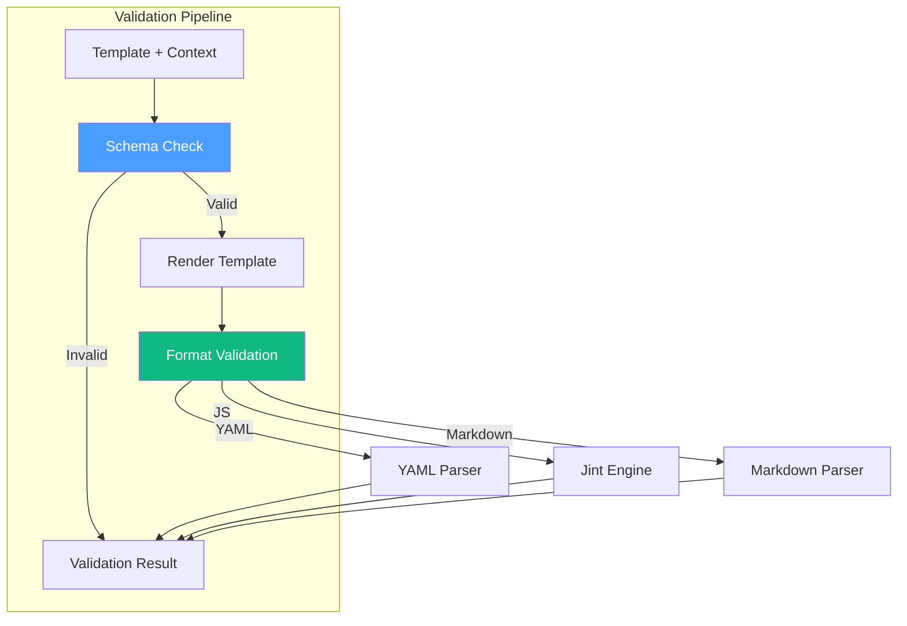

# LCS-DES-088c: Design Specification — Template Validation

## 1. Metadata & Categorization

| Field | Value | Description |
| :--- | :--- | :--- |
| **Feature ID** | `TST-088c` | Sub-part of TST-088 |
| **Feature Name** | `Template Schema Compliance Test Suite` | Template validation tests |
| **Target Version** | `v0.8.8c` | Third sub-part of v0.8.8 |
| **Module Scope** | `Lexichord.Tests.Publishing` | Test project |
| **Swimlane** | `Governance` | Part of Publishing vertical |
| **License Tier** | `Core` | Testing available to all |
| **Feature Gate Key** | N/A | No gating for tests |
| **Author** | Lead Architect | |
| **Status** | `Draft` | |
| **Last Updated** | `2026-01-27` | |
| **Parent Document** | [LCS-DES-088-INDEX](./LCS-DES-088-INDEX.md) | |
| **Scope Breakdown** | [LCS-SBD-088 Section 3.3](./LCS-SBD-088.md#33-v088c-template-validation) | |

---

## 2. Executive Summary

### 2.1 The Requirement

Lexichord's template system powers release notes generation, static site scaffolding (MkDocs, Docusaurus), and custom document generation. Without validation tests:

- Templates could fail silently with missing variables
- MkDocs configurations could produce invalid YAML
- Docusaurus configurations could generate syntactically incorrect JavaScript
- Custom templates could violate their declared schemas

> **Goal:** Verify that all templates comply with their defined schemas and produce valid, parseable output for all supported target formats.

### 2.2 The Proposed Solution

Implement a comprehensive template validation test suite that:

1. Validates release notes templates against required context variables
2. Ensures MkDocs templates generate valid YAML configurations
3. Validates Docusaurus templates produce syntactically correct JavaScript
4. Tests custom template schema compliance using JSON Schema
5. Verifies variable substitution accuracy across all template types

---

## 3. Architecture & Modular Strategy

### 3.1 Dependencies

#### 3.1.1 Systems Under Test

| Interface | Source Version | Purpose |
| :--- | :--- | :--- |
| `IPromptRenderer` | v0.6.3b | Template rendering engine |
| `IPromptTemplateRepository` | v0.6.3a | Template storage |
| `IMkDocsGenerator` | v0.8.5b | MkDocs configuration generation |
| `IDocusaurusGenerator` | v0.8.5c | Docusaurus configuration generation |
| `ReleaseNotesAgent` | v0.8.3b | Release notes templates |

#### 3.1.2 NuGet Packages

| Package | Version | Purpose |
| :--- | :--- | :--- |
| `xunit` | 2.9.x | Test framework |
| `FluentAssertions` | 6.x | Fluent assertions |
| `YamlDotNet` | 15.x | YAML validation |
| `Jint` | 3.x | JavaScript validation (NEW) |
| `NJsonSchema` | 11.x | JSON Schema validation |

### 3.2 Licensing Behavior

No licensing required. Tests run in development/CI environments only.

---

## 4. Data Contract (The API)

### 4.1 Test Class Structure

```csharp
namespace Lexichord.Tests.Publishing.TemplateValidation;

/// <summary>
/// Tests for release notes template schema compliance.
/// </summary>
[Trait("Category", "Unit")]
[Trait("Version", "v0.8.8c")]
public class ReleaseNotesTemplateTests
{
    private readonly IPromptTemplateRepository _templates;
    private readonly IPromptRenderer _renderer;

    public ReleaseNotesTemplateTests()
    {
        _templates = new PromptTemplateRepository(/* config */);
        _renderer = new PromptRenderer();
    }
}

/// <summary>
/// Tests for MkDocs template YAML validity.
/// </summary>
[Trait("Category", "Unit")]
[Trait("Version", "v0.8.8c")]
public class MkDocsTemplateTests
{
    private readonly IMkDocsGenerator _generator;
}

/// <summary>
/// Tests for Docusaurus template JavaScript validity.
/// </summary>
[Trait("Category", "Unit")]
[Trait("Version", "v0.8.8c")]
public class DocusaurusTemplateTests
{
    private readonly IDocusaurusGenerator _generator;
}

/// <summary>
/// Tests for custom user-defined template schema compliance.
/// </summary>
[Trait("Category", "Unit")]
[Trait("Version", "v0.8.8c")]
public class CustomTemplateTests
{
    private readonly IPromptRenderer _renderer;
    private readonly ITemplateValidator _validator;
}
```

---

## 5. Implementation Logic

### 5.1 Template Validation Flow



### 5.2 Schema Validation Logic

```text
TEMPLATE VALIDATION:
|
+-- Load template definition
|   +-- Parse YAML/JSON template spec
|   +-- Extract schema requirements
|   +-- Identify required variables
|
+-- Validate context against schema
|   +-- Check required fields present
|   +-- Validate field types
|   +-- Apply pattern constraints
|   +-- Validate nested objects
|
+-- Render template
|   +-- Substitute variables
|   +-- Process conditionals
|   +-- Resolve partials
|
+-- Validate output format
    +-- YAML: Parse with YamlDotNet
    +-- JS: Parse with Jint
    +-- Markdown: Parse with Markdig
```

---

## 6. Test Scenarios

### 6.1 ReleaseNotesTemplateTests

```csharp
[Trait("Category", "Unit")]
[Trait("Version", "v0.8.8c")]
public class ReleaseNotesTemplateTests
{
    private readonly IPromptTemplateRepository _templates;
    private readonly IPromptRenderer _renderer;

    public ReleaseNotesTemplateTests()
    {
        var serviceProvider = TestServiceProvider.Create();
        _templates = serviceProvider.GetRequiredService<IPromptTemplateRepository>();
        _renderer = serviceProvider.GetRequiredService<IPromptRenderer>();
    }

    #region Schema Compliance Tests

    [Fact]
    public async Task ReleaseNotesTemplate_Exists()
    {
        var template = await _templates.GetAsync("release-notes-generator");

        template.Should().NotBeNull();
        template.Id.Should().Be("release-notes-generator");
    }

    [Fact]
    public async Task ReleaseNotesTemplate_HasRequiredFields()
    {
        var template = await _templates.GetAsync("release-notes-generator");

        template.Schema.Should().NotBeNull();
        template.Schema.Required.Should().Contain("version");
        template.Schema.Required.Should().Contain("commit_groups");
        template.Schema.Required.Should().Contain("contributor_count");
    }

    [Fact]
    public async Task ReleaseNotesTemplate_ValidContext_RendersSuccessfully()
    {
        var template = await _templates.GetAsync("release-notes-generator");
        var context = CreateValidContext();

        var result = await _renderer.RenderAsync(template, context);

        result.Should().NotBeNullOrEmpty();
        result.Should().Contain("v1.0.0");
    }

    [Fact]
    public async Task ReleaseNotesTemplate_MissingVersion_ThrowsValidationError()
    {
        var template = await _templates.GetAsync("release-notes-generator");
        var context = new Dictionary<string, object>
        {
            ["commit_groups"] = "test",
            ["contributor_count"] = 1
            // Missing "version"
        };

        var act = async () => await _renderer.RenderAsync(template, context);

        await act.Should().ThrowAsync<TemplateValidationException>()
            .WithMessage("*version*required*");
    }

    [Fact]
    public async Task ReleaseNotesTemplate_MissingCommitGroups_ThrowsValidationError()
    {
        var template = await _templates.GetAsync("release-notes-generator");
        var context = new Dictionary<string, object>
        {
            ["version"] = "v1.0.0",
            ["contributor_count"] = 1
            // Missing "commit_groups"
        };

        var act = async () => await _renderer.RenderAsync(template, context);

        await act.Should().ThrowAsync<TemplateValidationException>()
            .WithMessage("*commit_groups*required*");
    }

    [Theory]
    [InlineData(null)]
    [InlineData("")]
    [InlineData("   ")]
    public async Task ReleaseNotesTemplate_EmptyVersion_ThrowsValidationError(string version)
    {
        var template = await _templates.GetAsync("release-notes-generator");
        var context = new Dictionary<string, object>
        {
            ["version"] = version,
            ["commit_groups"] = "test",
            ["contributor_count"] = 1
        };

        var act = async () => await _renderer.RenderAsync(template, context);

        await act.Should().ThrowAsync<TemplateValidationException>();
    }

    #endregion

    #region Variable Substitution Tests

    [Theory]
    [InlineData("{{version}}", "v1.0.0")]
    [InlineData("{{contributor_count}}", "5")]
    public async Task ReleaseNotesTemplate_VariableSubstitution_ReplacesCorrectly(
        string templateFragment, string expected)
    {
        var context = CreateValidContext();

        var result = await _renderer.RenderAsync(templateFragment, context);

        result.Should().Contain(expected);
    }

    [Fact]
    public async Task ReleaseNotesTemplate_CommitGroups_IteratesCorrectly()
    {
        var template = "{{#commit_groups}}{{type}}: {{description}}\n{{/commit_groups}}";
        var context = new Dictionary<string, object>
        {
            ["commit_groups"] = new[]
            {
                new { type = "feat", description = "Add feature" },
                new { type = "fix", description = "Fix bug" }
            }
        };

        var result = await _renderer.RenderAsync(template, context);

        result.Should().Contain("feat: Add feature");
        result.Should().Contain("fix: Fix bug");
    }

    [Fact]
    public async Task ReleaseNotesTemplate_ConditionalSection_RendersWhenPresent()
    {
        var template = "{{#breaking_changes}}BREAKING: {{.}}\n{{/breaking_changes}}";
        var context = new Dictionary<string, object>
        {
            ["breaking_changes"] = new[] { "API changed", "Config format updated" }
        };

        var result = await _renderer.RenderAsync(template, context);

        result.Should().Contain("BREAKING: API changed");
        result.Should().Contain("BREAKING: Config format updated");
    }

    [Fact]
    public async Task ReleaseNotesTemplate_ConditionalSection_SkipsWhenMissing()
    {
        var template = "Start{{#breaking_changes}}BREAKING: {{.}}{{/breaking_changes}}End";
        var context = new Dictionary<string, object>();

        var result = await _renderer.RenderAsync(template, context);

        result.Should().Be("StartEnd");
    }

    #endregion

    #region Style Rules Injection Tests

    [Fact]
    public async Task ReleaseNotesTemplate_WithStyleRules_InjectsRules()
    {
        var template = await _templates.GetAsync("release-notes-generator");
        var context = CreateValidContext();
        context["style_rules"] = "Use active voice. Keep entries concise.";

        var result = await _renderer.RenderAsync(template, context);

        result.Should().Contain("Use active voice");
    }

    [Fact]
    public async Task ReleaseNotesTemplate_WithoutStyleRules_SkipsSection()
    {
        var template = await _templates.GetAsync("release-notes-generator");
        var context = CreateValidContext();
        // No style_rules

        var result = await _renderer.RenderAsync(template, context);

        result.Should().NotBeNull();
        // Should not contain placeholder
        result.Should().NotContain("{{style_rules}}");
    }

    #endregion

    #region Output Validation Tests

    [Fact]
    public async Task ReleaseNotesTemplate_Output_IsValidMarkdown()
    {
        var template = await _templates.GetAsync("release-notes-generator");
        var context = CreateValidContext();

        var result = await _renderer.RenderAsync(template, context);

        var markdown = new MarkdownParser().Parse(result);
        markdown.Should().NotBeNull();
    }

    [Fact]
    public async Task ReleaseNotesTemplate_Output_ContainsVersionHeading()
    {
        var template = await _templates.GetAsync("release-notes-generator");
        var context = CreateValidContext();

        var result = await _renderer.RenderAsync(template, context);

        result.Should().MatchRegex(@"#.*v1\.0\.0");
    }

    #endregion

    #region Helper Methods

    private static Dictionary<string, object> CreateValidContext() => new()
    {
        ["version"] = "v1.0.0",
        ["commit_groups"] = FormatCommitGroups(new[]
        {
            ("feat", "Add new feature"),
            ("fix", "Fix critical bug")
        }),
        ["contributor_count"] = 5
    };

    private static string FormatCommitGroups(IEnumerable<(string type, string desc)> commits)
    {
        return string.Join("\n", commits.Select(c => $"{c.type}: {c.desc}"));
    }

    #endregion
}
```

### 6.2 MkDocsTemplateTests

```csharp
[Trait("Category", "Unit")]
[Trait("Version", "v0.8.8c")]
public class MkDocsTemplateTests
{
    private readonly IMkDocsGenerator _generator;

    public MkDocsTemplateTests()
    {
        _generator = new MkDocsGenerator();
    }

    #region YAML Validity Tests

    [Fact]
    public void GenerateConfig_MinimalOptions_ProducesValidYaml()
    {
        var options = new MkDocsGeneratorOptions
        {
            SiteName = "Test Documentation"
        };

        var config = _generator.GenerateConfig(options);
        var yaml = _generator.RenderYaml(config);

        IsValidYaml(yaml).Should().BeTrue("Generated YAML must be parseable");
    }

    [Fact]
    public void GenerateConfig_FullOptions_ProducesValidYaml()
    {
        var options = new MkDocsGeneratorOptions
        {
            SiteName = "Complete Documentation",
            SiteUrl = "https://docs.example.com",
            RepoUrl = "https://github.com/owner/repo",
            Theme = new MkDocsTheme("material", "indigo", new[]
            {
                "navigation.instant",
                "navigation.tabs",
                "search.suggest"
            }),
            NavItems = new[]
            {
                new MkDocsNavItem("Home", "index.md", null),
                new MkDocsNavItem("Guide", null, new[]
                {
                    new MkDocsNavItem("Getting Started", "guide/start.md", null)
                })
            },
            Plugins = new[] { "search", "minify" }
        };

        var yaml = _generator.RenderYaml(_generator.GenerateConfig(options));

        IsValidYaml(yaml).Should().BeTrue();
    }

    [Theory]
    [InlineData("Site with 'quotes'")]
    [InlineData("Site with \"double quotes\"")]
    [InlineData("Site with: colons")]
    [InlineData("Site with\nnewlines")]
    [InlineData("Site with special chars @#$%")]
    public void GenerateConfig_SpecialCharacters_EscapesCorrectly(string siteName)
    {
        var options = new MkDocsGeneratorOptions { SiteName = siteName };

        var yaml = _generator.RenderYaml(_generator.GenerateConfig(options));

        IsValidYaml(yaml).Should().BeTrue($"YAML with site name '{siteName}' must be valid");
    }

    #endregion

    #region Required Fields Tests

    [Fact]
    public void GenerateConfig_HasSiteName()
    {
        var options = new MkDocsGeneratorOptions { SiteName = "Test Site" };

        var yaml = _generator.RenderYaml(_generator.GenerateConfig(options));

        yaml.Should().Contain("site_name:");
        yaml.Should().Contain("Test Site");
    }

    [Fact]
    public void GenerateConfig_WithSiteUrl_IncludesUrl()
    {
        var options = new MkDocsGeneratorOptions
        {
            SiteName = "Test",
            SiteUrl = "https://docs.example.com"
        };

        var yaml = _generator.RenderYaml(_generator.GenerateConfig(options));

        yaml.Should().Contain("site_url: https://docs.example.com");
    }

    [Fact]
    public void GenerateConfig_WithRepoUrl_IncludesRepo()
    {
        var options = new MkDocsGeneratorOptions
        {
            SiteName = "Test",
            RepoUrl = "https://github.com/owner/repo"
        };

        var yaml = _generator.RenderYaml(_generator.GenerateConfig(options));

        yaml.Should().Contain("repo_url: https://github.com/owner/repo");
    }

    #endregion

    #region Theme Configuration Tests

    [Theory]
    [InlineData("material")]
    [InlineData("readthedocs")]
    [InlineData("mkdocs")]
    public void GenerateConfig_Theme_IsValidTheme(string themeName)
    {
        var options = new MkDocsGeneratorOptions
        {
            SiteName = "Test",
            Theme = new MkDocsTheme(themeName, null, null)
        };

        var yaml = _generator.RenderYaml(_generator.GenerateConfig(options));

        yaml.Should().Contain($"name: {themeName}");
        IsValidYaml(yaml).Should().BeTrue();
    }

    [Fact]
    public void GenerateConfig_MaterialTheme_IncludesFeatures()
    {
        var options = new MkDocsGeneratorOptions
        {
            SiteName = "Test",
            Theme = new MkDocsTheme("material", "indigo", new[]
            {
                "navigation.instant",
                "navigation.tabs",
                "navigation.expand"
            })
        };

        var yaml = _generator.RenderYaml(_generator.GenerateConfig(options));

        yaml.Should().Contain("features:");
        yaml.Should().Contain("- navigation.instant");
        yaml.Should().Contain("- navigation.tabs");
        yaml.Should().Contain("- navigation.expand");
    }

    [Fact]
    public void GenerateConfig_MaterialPalette_IncludesColors()
    {
        var options = new MkDocsGeneratorOptions
        {
            SiteName = "Test",
            Theme = new MkDocsTheme("material", "deep-purple", null)
        };

        var yaml = _generator.RenderYaml(_generator.GenerateConfig(options));

        yaml.Should().Contain("palette:");
        yaml.Should().Contain("primary: deep-purple");
    }

    #endregion

    #region Navigation Structure Tests

    [Fact]
    public void GenerateConfig_SimpleNav_GeneratesCorrectStructure()
    {
        var options = new MkDocsGeneratorOptions
        {
            SiteName = "Test",
            NavItems = new[]
            {
                new MkDocsNavItem("Home", "index.md", null),
                new MkDocsNavItem("About", "about.md", null)
            }
        };

        var yaml = _generator.RenderYaml(_generator.GenerateConfig(options));

        yaml.Should().Contain("nav:");
        yaml.Should().Contain("- Home: index.md");
        yaml.Should().Contain("- About: about.md");
    }

    [Fact]
    public void GenerateConfig_NestedNav_GeneratesCorrectHierarchy()
    {
        var options = new MkDocsGeneratorOptions
        {
            SiteName = "Test",
            NavItems = new[]
            {
                new MkDocsNavItem("Home", "index.md", null),
                new MkDocsNavItem("Guide", null, new[]
                {
                    new MkDocsNavItem("Getting Started", "guide/start.md", null),
                    new MkDocsNavItem("Configuration", "guide/config.md", null)
                })
            }
        };

        var yaml = _generator.RenderYaml(_generator.GenerateConfig(options));

        yaml.Should().Contain("- Guide:");
        yaml.Should().Contain("  - Getting Started: guide/start.md");
        yaml.Should().Contain("  - Configuration: guide/config.md");
        IsValidYaml(yaml).Should().BeTrue();
    }

    [Fact]
    public void GenerateConfig_DeeplyNestedNav_PreservesIndentation()
    {
        var options = new MkDocsGeneratorOptions
        {
            SiteName = "Test",
            NavItems = new[]
            {
                new MkDocsNavItem("Level 1", null, new[]
                {
                    new MkDocsNavItem("Level 2", null, new[]
                    {
                        new MkDocsNavItem("Level 3", "deep/page.md", null)
                    })
                })
            }
        };

        var yaml = _generator.RenderYaml(_generator.GenerateConfig(options));

        IsValidYaml(yaml).Should().BeTrue();
        yaml.Should().Contain("Level 3: deep/page.md");
    }

    #endregion

    #region Plugins Configuration Tests

    [Fact]
    public void GenerateConfig_WithPlugins_IncludesPluginList()
    {
        var options = new MkDocsGeneratorOptions
        {
            SiteName = "Test",
            Plugins = new[] { "search", "minify" }
        };

        var yaml = _generator.RenderYaml(_generator.GenerateConfig(options));

        yaml.Should().Contain("plugins:");
        yaml.Should().Contain("- search");
        yaml.Should().Contain("- minify");
    }

    [Fact]
    public void GenerateConfig_NoPlugins_OmitsPluginSection()
    {
        var options = new MkDocsGeneratorOptions { SiteName = "Test" };

        var yaml = _generator.RenderYaml(_generator.GenerateConfig(options));

        // Should not have empty plugins section
        yaml.Should().NotMatchRegex(@"plugins:\s*\n\s*\n");
    }

    #endregion

    #region Helper Methods

    private static bool IsValidYaml(string yaml)
    {
        try
        {
            var deserializer = new DeserializerBuilder().Build();
            deserializer.Deserialize<object>(yaml);
            return true;
        }
        catch
        {
            return false;
        }
    }

    #endregion
}
```

### 6.3 DocusaurusTemplateTests

```csharp
[Trait("Category", "Unit")]
[Trait("Version", "v0.8.8c")]
public class DocusaurusTemplateTests
{
    private readonly IDocusaurusGenerator _generator;
    private readonly Engine _jintEngine;

    public DocusaurusTemplateTests()
    {
        _generator = new DocusaurusGenerator();
        _jintEngine = new Engine();
    }

    #region JavaScript Validity Tests

    [Fact]
    public void GenerateConfig_MinimalOptions_ProducesValidJs()
    {
        var options = new DocusaurusGeneratorOptions
        {
            Title = "My Site",
            Url = "https://example.com"
        };

        var js = _generator.RenderJs(_generator.GenerateConfig(options));

        IsValidJavaScript(js).Should().BeTrue("Generated JS must be parseable");
    }

    [Fact]
    public void GenerateConfig_FullOptions_ProducesValidJs()
    {
        var options = new DocusaurusGeneratorOptions
        {
            Title = "Complete Site",
            TagLine = "A documentation site",
            Url = "https://docs.example.com",
            BaseUrl = "/docs/",
            GitHubUrl = "https://github.com/owner/repo",
            OnBrokenLinks = "throw",
            OnBrokenMarkdownLinks = "warn"
        };

        var js = _generator.RenderJs(_generator.GenerateConfig(options));

        IsValidJavaScript(js).Should().BeTrue();
    }

    [Theory]
    [InlineData("Site with 'single quotes'")]
    [InlineData("Site with \"double quotes\"")]
    [InlineData("Site with\nnewlines")]
    [InlineData("Site with \\backslashes\\")]
    public void GenerateConfig_SpecialCharacters_EscapesCorrectly(string title)
    {
        var options = new DocusaurusGeneratorOptions
        {
            Title = title,
            Url = "https://example.com"
        };

        var js = _generator.RenderJs(_generator.GenerateConfig(options));

        IsValidJavaScript(js).Should().BeTrue($"JS with title '{title}' must be valid");
    }

    #endregion

    #region Required Fields Tests

    [Fact]
    public void GenerateConfig_HasTitle()
    {
        var options = new DocusaurusGeneratorOptions
        {
            Title = "Test Site",
            Url = "https://example.com"
        };

        var js = _generator.RenderJs(_generator.GenerateConfig(options));

        js.Should().Contain("title: 'Test Site'");
    }

    [Fact]
    public void GenerateConfig_HasUrl()
    {
        var options = new DocusaurusGeneratorOptions
        {
            Title = "Test",
            Url = "https://docs.example.com"
        };

        var js = _generator.RenderJs(_generator.GenerateConfig(options));

        js.Should().Contain("url: 'https://docs.example.com'");
    }

    [Fact]
    public void GenerateConfig_HasBaseUrl()
    {
        var options = new DocusaurusGeneratorOptions
        {
            Title = "Test",
            Url = "https://example.com",
            BaseUrl = "/docs/"
        };

        var js = _generator.RenderJs(_generator.GenerateConfig(options));

        js.Should().Contain("baseUrl: '/docs/'");
    }

    #endregion

    #region Theme Configuration Tests

    [Fact]
    public void GenerateConfig_WithGitHub_IncludesNavbarItem()
    {
        var options = new DocusaurusGeneratorOptions
        {
            Title = "Test",
            Url = "https://example.com",
            GitHubUrl = "https://github.com/owner/repo"
        };

        var js = _generator.RenderJs(_generator.GenerateConfig(options));

        js.Should().Contain("themeConfig");
        js.Should().Contain("navbar");
        js.Should().Contain("github.com/owner/repo");
    }

    [Fact]
    public void GenerateConfig_WithFooter_IncludesFooterConfig()
    {
        var options = new DocusaurusGeneratorOptions
        {
            Title = "Test",
            Url = "https://example.com",
            FooterStyle = "dark",
            FooterCopyright = "Copyright 2026 Company"
        };

        var js = _generator.RenderJs(_generator.GenerateConfig(options));

        js.Should().Contain("footer");
        js.Should().Contain("style: 'dark'");
        js.Should().Contain("Copyright 2026 Company");
    }

    #endregion

    #region Sidebars Generation Tests

    [Fact]
    public void GenerateSidebars_SimpleTree_ProducesValidJs()
    {
        var tree = new[]
        {
            new DocTreeNode("intro", DocNodeType.Document, null),
            new DocTreeNode("getting-started", DocNodeType.Document, null)
        };

        var js = _generator.GenerateSidebarsJs(tree);

        IsValidJavaScript(js).Should().BeTrue();
        js.Should().Contain("'intro'");
        js.Should().Contain("'getting-started'");
    }

    [Fact]
    public void GenerateSidebars_WithCategories_CreatesCorrectStructure()
    {
        var tree = new[]
        {
            new DocTreeNode("intro", DocNodeType.Document, null),
            new DocTreeNode("Getting Started", DocNodeType.Category, new[]
            {
                new DocTreeNode("installation", DocNodeType.Document, null),
                new DocTreeNode("configuration", DocNodeType.Document, null)
            })
        };

        var js = _generator.GenerateSidebarsJs(tree);

        IsValidJavaScript(js).Should().BeTrue();
        js.Should().Contain("type: 'category'");
        js.Should().Contain("label: 'Getting Started'");
        js.Should().Contain("'installation'");
        js.Should().Contain("'configuration'");
    }

    [Fact]
    public void GenerateSidebars_NestedCategories_PreservesHierarchy()
    {
        var tree = new[]
        {
            new DocTreeNode("API", DocNodeType.Category, new[]
            {
                new DocTreeNode("Endpoints", DocNodeType.Category, new[]
                {
                    new DocTreeNode("users", DocNodeType.Document, null)
                })
            })
        };

        var js = _generator.GenerateSidebarsJs(tree);

        IsValidJavaScript(js).Should().BeTrue();
        // Should have nested structure
        js.Should().Contain("items:");
    }

    #endregion

    #region Versioning Tests

    [Fact]
    public void GenerateConfig_WithVersioning_IncludesVersionConfig()
    {
        var options = new DocusaurusGeneratorOptions
        {
            Title = "Test",
            Url = "https://example.com",
            EnableVersioning = true,
            CurrentVersion = "2.0.0"
        };

        var js = _generator.RenderJs(_generator.GenerateConfig(options));

        js.Should().Contain("docs:");
        js.Should().Contain("lastVersion: 'current'");
    }

    [Fact]
    public void GenerateConfig_WithMultipleVersions_ListsAll()
    {
        var options = new DocusaurusGeneratorOptions
        {
            Title = "Test",
            Url = "https://example.com",
            EnableVersioning = true,
            Versions = new[] { "1.0.0", "1.5.0", "2.0.0" }
        };

        var js = _generator.RenderJs(_generator.GenerateConfig(options));

        js.Should().Contain("versions:");
    }

    #endregion

    #region Preset Configuration Tests

    [Fact]
    public void GenerateConfig_HasClassicPreset()
    {
        var options = new DocusaurusGeneratorOptions
        {
            Title = "Test",
            Url = "https://example.com"
        };

        var js = _generator.RenderJs(_generator.GenerateConfig(options));

        js.Should().Contain("presets:");
        js.Should().Contain("@docusaurus/preset-classic");
    }

    #endregion

    #region Module Export Tests

    [Fact]
    public void GenerateConfig_IsValidModuleExport()
    {
        var options = new DocusaurusGeneratorOptions
        {
            Title = "Test",
            Url = "https://example.com"
        };

        var js = _generator.RenderJs(_generator.GenerateConfig(options));

        js.Should().StartWith("module.exports = ");
        js.Should().EndWith(";\n");
    }

    #endregion

    #region Helper Methods

    private bool IsValidJavaScript(string js)
    {
        try
        {
            // Wrap in function to make it evaluable
            var wrapped = $"(function() {{ return {js.Replace("module.exports = ", "").TrimEnd(';', '\n')}; }})()";
            _jintEngine.Evaluate(wrapped);
            return true;
        }
        catch
        {
            return false;
        }
    }

    #endregion
}
```

### 6.4 CustomTemplateTests

```csharp
[Trait("Category", "Unit")]
[Trait("Version", "v0.8.8c")]
public class CustomTemplateTests
{
    private readonly IPromptRenderer _renderer;
    private readonly ITemplateValidator _validator;

    public CustomTemplateTests()
    {
        _renderer = new PromptRenderer();
        _validator = new TemplateValidator();
    }

    #region Schema Parsing Tests

    [Fact]
    public void ParseTemplate_ValidSchema_Succeeds()
    {
        var templateYaml = @"
template_id: custom-template
version: '1.0'
schema:
  required:
    - title
    - content
  properties:
    title:
      type: string
    content:
      type: string
system_prompt: |
  Process: {{title}}
user_prompt: |
  Content: {{content}}
";

        var template = TemplateParser.Parse(templateYaml);

        template.Should().NotBeNull();
        template.Id.Should().Be("custom-template");
        template.Schema.Required.Should().Contain("title");
        template.Schema.Required.Should().Contain("content");
    }

    [Fact]
    public void ParseTemplate_WithPatternValidation_ExtractsPattern()
    {
        var templateYaml = @"
template_id: version-template
schema:
  properties:
    version:
      type: string
      pattern: '^v\d+\.\d+\.\d+$'
system_prompt: 'Version: {{version}}'
";

        var template = TemplateParser.Parse(templateYaml);

        template.Schema.Properties["version"].Pattern.Should().Be(@"^v\d+\.\d+\.\d+$");
    }

    [Fact]
    public void ParseTemplate_WithNestedObject_ParsesCorrectly()
    {
        var templateYaml = @"
template_id: nested-template
schema:
  properties:
    author:
      type: object
      properties:
        name:
          type: string
        email:
          type: string
          format: email
system_prompt: 'By: {{author.name}} <{{author.email}}>'
";

        var template = TemplateParser.Parse(templateYaml);

        template.Schema.Properties["author"].Type.Should().Be("object");
        template.Schema.Properties["author"].Properties.Should().ContainKey("name");
        template.Schema.Properties["author"].Properties.Should().ContainKey("email");
    }

    #endregion

    #region Schema Validation Tests

    [Fact]
    public async Task ValidateContext_ValidData_Succeeds()
    {
        var schema = new TemplateSchema
        {
            Required = new[] { "title" },
            Properties = new Dictionary<string, SchemaProperty>
            {
                ["title"] = new() { Type = "string" }
            }
        };

        var context = new Dictionary<string, object>
        {
            ["title"] = "Test Title"
        };

        var result = await _validator.ValidateAsync(schema, context);

        result.IsValid.Should().BeTrue();
    }

    [Fact]
    public async Task ValidateContext_MissingRequired_Fails()
    {
        var schema = new TemplateSchema
        {
            Required = new[] { "title", "content" },
            Properties = new Dictionary<string, SchemaProperty>
            {
                ["title"] = new() { Type = "string" },
                ["content"] = new() { Type = "string" }
            }
        };

        var context = new Dictionary<string, object>
        {
            ["title"] = "Test"
            // Missing "content"
        };

        var result = await _validator.ValidateAsync(schema, context);

        result.IsValid.Should().BeFalse();
        result.Errors.Should().Contain(e => e.Contains("content") && e.Contains("required"));
    }

    [Fact]
    public async Task ValidateContext_PatternMismatch_Fails()
    {
        var schema = new TemplateSchema
        {
            Properties = new Dictionary<string, SchemaProperty>
            {
                ["version"] = new()
                {
                    Type = "string",
                    Pattern = @"^v\d+\.\d+\.\d+$"
                }
            }
        };

        var context = new Dictionary<string, object>
        {
            ["version"] = "invalid-version"
        };

        var result = await _validator.ValidateAsync(schema, context);

        result.IsValid.Should().BeFalse();
        result.Errors.Should().Contain(e => e.Contains("version") && e.Contains("pattern"));
    }

    [Fact]
    public async Task ValidateContext_WrongType_Fails()
    {
        var schema = new TemplateSchema
        {
            Properties = new Dictionary<string, SchemaProperty>
            {
                ["count"] = new() { Type = "integer" }
            }
        };

        var context = new Dictionary<string, object>
        {
            ["count"] = "not a number"
        };

        var result = await _validator.ValidateAsync(schema, context);

        result.IsValid.Should().BeFalse();
        result.Errors.Should().Contain(e => e.Contains("count") && e.Contains("type"));
    }

    #endregion

    #region Partial Resolution Tests

    [Fact]
    public async Task RenderWithPartials_ResolvesPartials()
    {
        var template = @"
{{> header}}
# Main Content
{{> footer}}
";
        var partials = new Dictionary<string, string>
        {
            ["header"] = "---\ntitle: Document\n---",
            ["footer"] = "---\nGenerated by Lexichord"
        };

        var result = await _renderer.RenderWithPartialsAsync(
            template, new { }, partials);

        result.Should().Contain("title: Document");
        result.Should().Contain("# Main Content");
        result.Should().Contain("Generated by Lexichord");
    }

    [Fact]
    public async Task RenderWithPartials_MissingPartial_ThrowsError()
    {
        var template = "{{> nonexistent}}";
        var partials = new Dictionary<string, string>();

        var act = async () => await _renderer.RenderWithPartialsAsync(
            template, new { }, partials);

        await act.Should().ThrowAsync<TemplateRenderException>()
            .WithMessage("*nonexistent*not found*");
    }

    [Fact]
    public async Task RenderWithPartials_NestedPartials_ResolvesAll()
    {
        var template = "{{> wrapper}}";
        var partials = new Dictionary<string, string>
        {
            ["wrapper"] = "START {{> inner}} END",
            ["inner"] = "INNER CONTENT"
        };

        var result = await _renderer.RenderWithPartialsAsync(
            template, new { }, partials);

        result.Should().Contain("START INNER CONTENT END");
    }

    #endregion

    #region Complex Template Tests

    [Fact]
    public async Task RenderComplexTemplate_AllFeaturesWork()
    {
        var template = @"
{{> header}}
# {{title}}

{{#sections}}
## {{name}}
{{content}}
{{/sections}}

{{#if showFooter}}
{{> footer}}
{{/if}}
";

        var context = new Dictionary<string, object>
        {
            ["title"] = "Complex Document",
            ["sections"] = new[]
            {
                new { name = "Introduction", content = "Welcome!" },
                new { name = "Details", content = "More info here." }
            },
            ["showFooter"] = true
        };

        var partials = new Dictionary<string, string>
        {
            ["header"] = "---\ngenerated: true\n---",
            ["footer"] = "---\nEND OF DOCUMENT"
        };

        var result = await _renderer.RenderWithPartialsAsync(template, context, partials);

        result.Should().Contain("generated: true");
        result.Should().Contain("# Complex Document");
        result.Should().Contain("## Introduction");
        result.Should().Contain("Welcome!");
        result.Should().Contain("## Details");
        result.Should().Contain("END OF DOCUMENT");
    }

    #endregion
}
```

---

## 7. Test Fixtures

### 7.1 Template Schema Fixtures

```csharp
namespace Lexichord.Tests.Publishing.TestFixtures;

/// <summary>
/// Sample template schemas for validation testing.
/// </summary>
public static class TemplateSchemas
{
    public static readonly string ReleaseNotesSchema = @"
{
    ""$schema"": ""http://json-schema.org/draft-07/schema#"",
    ""type"": ""object"",
    ""required"": [""version"", ""commit_groups"", ""contributor_count""],
    ""properties"": {
        ""version"": {
            ""type"": ""string"",
            ""pattern"": ""^v?\\d+\\.\\d+\\.\\d+""
        },
        ""commit_groups"": {
            ""type"": ""string""
        },
        ""contributor_count"": {
            ""type"": ""integer"",
            ""minimum"": 0
        },
        ""style_rules"": {
            ""type"": ""string""
        },
        ""breaking_changes"": {
            ""type"": ""array"",
            ""items"": { ""type"": ""string"" }
        }
    }
}
";

    public static readonly string MkDocsConfigSchema = @"
{
    ""$schema"": ""http://json-schema.org/draft-07/schema#"",
    ""type"": ""object"",
    ""required"": [""site_name""],
    ""properties"": {
        ""site_name"": { ""type"": ""string"" },
        ""site_url"": { ""type"": ""string"", ""format"": ""uri"" },
        ""repo_url"": { ""type"": ""string"", ""format"": ""uri"" },
        ""theme"": {
            ""type"": ""object"",
            ""properties"": {
                ""name"": { ""type"": ""string"" },
                ""palette"": { ""type"": ""object"" },
                ""features"": { ""type"": ""array"" }
            }
        },
        ""nav"": { ""type"": ""array"" },
        ""plugins"": { ""type"": ""array"" }
    }
}
";
}
```

---

## 8. Observability & Logging

| Level | Message Template |
| :--- | :--- |
| Debug | `"Loading template: {TemplateId}"` |
| Debug | `"Validating context against schema"` |
| Info | `"Template validation completed: {IsValid}"` |
| Warning | `"Template validation warning: {Warning}"` |
| Error | `"Template validation failed: {Errors}"` |

---

## 9. Security & Safety

| Risk | Level | Mitigation |
| :--- | :--- | :--- |
| Template injection | Low | Templates are pre-defined, not user-input |
| Regex DoS | Low | Pattern validation has timeout |
| Infinite loop in partials | Medium | Max partial depth limit (10) |

---

## 10. Acceptance Criteria

### 10.1 Functional Criteria

| # | Given | When | Then |
| :--- | :--- | :--- | :--- |
| 1 | Valid release notes context | Rendering template | Produces valid Markdown |
| 2 | Missing required variable | Rendering template | Throws validation error |
| 3 | MkDocs options | Generating config | Produces valid YAML |
| 4 | Docusaurus options | Generating config | Produces valid JavaScript |
| 5 | Custom template with schema | Invalid context | Fails validation |
| 6 | Template with partials | Rendering | Resolves all partials |

### 10.2 CI Criteria

| # | Given | When | Then |
| :--- | :--- | :--- | :--- |
| 7 | Any template test fails | CI runs tests | Build fails |
| 8 | All template tests pass | CI runs tests | Build succeeds |

---

## 11. Deliverable Checklist

| # | Deliverable | Status |
| :--- | :--- | :--- |
| 1 | `ReleaseNotesTemplateTests.cs` with 25+ tests | [ ] |
| 2 | `MkDocsTemplateTests.cs` with 20+ tests | [ ] |
| 3 | `DocusaurusTemplateTests.cs` with 20+ tests | [ ] |
| 4 | `CustomTemplateTests.cs` with 30+ tests | [ ] |
| 5 | Template schema fixtures | [ ] |
| 6 | Jint package added | [ ] |
| 7 | JSON Schema validation | [ ] |

---

## 12. Verification Commands

```bash
# Run all template validation tests
dotnet test --filter "Version=v0.8.8c" --logger "console;verbosity=detailed"

# Run only release notes template tests
dotnet test --filter "FullyQualifiedName~ReleaseNotesTemplateTests"

# Run only MkDocs template tests
dotnet test --filter "FullyQualifiedName~MkDocsTemplateTests"

# Run only Docusaurus template tests
dotnet test --filter "FullyQualifiedName~DocusaurusTemplateTests"

# Run only custom template tests
dotnet test --filter "FullyQualifiedName~CustomTemplateTests"
```

---

## Document History

| Version | Date | Author | Changes |
| :--- | :--- | :--- | :--- |
| 1.0 | 2026-01-27 | Lead Architect | Initial draft |
