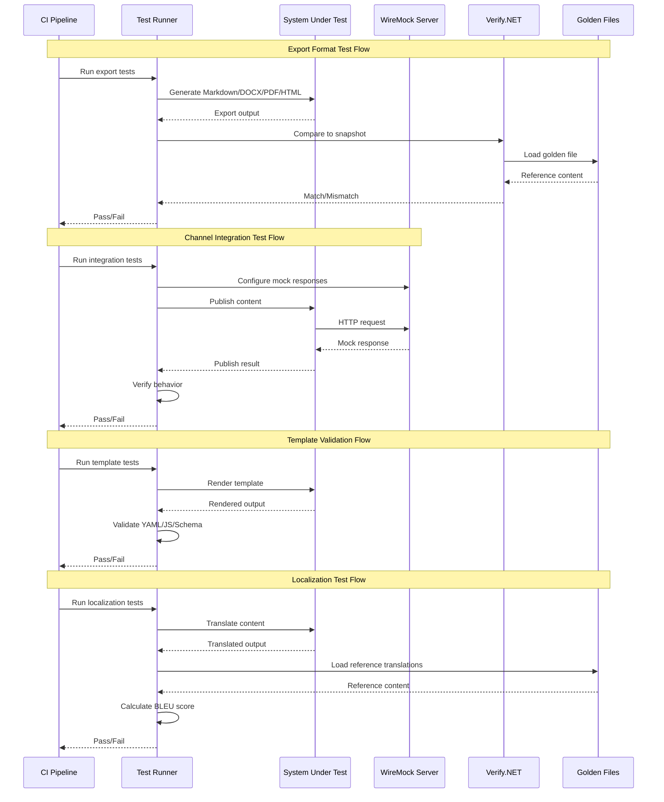

# LCS-SBD-088: Scope Breakdown — The Hardening (Publishing)

## Document Control

| Field            | Value                                    |
| :--------------- | :--------------------------------------- |
| **Document ID**  | LCS-SBD-088                              |
| **Version**      | v0.8.8                                   |
| **Codename**     | The Hardening (Publishing)               |
| **Status**       | Draft                                    |
| **Last Updated** | 2026-01-27                               |
| **Owner**        | Lead Architect                           |
| **Depends On**   | v0.8.1 (Git Foundation), v0.8.3 (Release Notes Agent), v0.8.5 (Static Site Bridge), v0.8.6 (PDF Exporter), v0.8.7 (Documentation Linter) |

---

## 1. Executive Summary

### 1.1 The Vision

**v0.8.8** delivers the **Hardening (Publishing)** — comprehensive test suites that verify the accuracy and reliability of all publishing pipeline components introduced in v0.8.x. This release represents the "Opening Night Rehearsal" for the entire Publisher module, ensuring that export formats, channel integrations, templates, and localization features are production-ready.

While v0.8.1-v0.8.7 built the Publisher module (Git integration, release notes generation, diff visualization, static site scaffolding, PDF export, and documentation linting), the Hardening phase ensures these components produce accurate, reliable outputs. Mock external APIs enable testing of integrations without live dependencies, format fidelity tests verify output correctness, and template validation ensures schema compliance.

### 1.2 Business Value

- **Export Confidence:** Mathematical verification that Markdown, DOCX, PDF, and HTML exports produce correct, consistent output across platforms and configurations.
- **Integration Reliability:** Mock-based testing of WordPress, GitHub, and Confluence integrations prevents failures during actual publishing.
- **Template Validation:** Schema compliance tests ensure custom templates parse correctly and produce valid output.
- **Localization Quality:** Translation accuracy tests verify that multi-language content maintains formatting and meaning.
- **Regression Prevention:** CI failures prevent export and integration regressions from reaching production.
- **Foundation:** Establishes testing patterns for all future publishing and export features.

### 1.3 Success Criteria

This release succeeds when:

1. Export format tests verify Markdown/DOCX/PDF/HTML output matches golden reference files with 99%+ fidelity.
2. Channel integration tests validate WordPress/GitHub/Confluence publishing workflows against mock APIs.
3. Template validation tests assert 100% compliance with Lexichord template schema specifications.
4. Localization accuracy tests verify translation output maintains formatting and achieves 95%+ quality scores.
5. All tests are integrated into CI/CD pipeline with automatic failure on regression.

### 1.4 License Gating

The Hardening (Publishing) is a **Core** feature. Testing infrastructure is available to all license tiers:

- Test suites run during development and CI/CD for all builds
- No runtime license checks required (test code, not production feature)
- Test results contribute to quality metrics across all license tiers
- Mock API tests do not require actual service credentials

---

## 2. Dependencies on Prior Versions

| Component                  | Source Version | Usage in v0.8.8                                   |
| :------------------------- | :------------- | :------------------------------------------------ |
| `IGitRepositoryService`    | v0.8.1a        | Repository access for template validation         |
| `IGitHistoryService`       | v0.8.1a        | Commit history for release notes mock tests       |
| `ReleaseNotesAgent`        | v0.8.3b        | Release notes generation testing                  |
| `IReleaseNotesGenerator`   | v0.8.3a        | Generator interface mock testing                  |
| `IDocFrameworkDetector`    | v0.8.5a        | Framework detection testing                       |
| `IMkDocsGenerator`         | v0.8.5b        | MkDocs configuration validation                   |
| `IDocusaurusGenerator`     | v0.8.5c        | Docusaurus configuration validation               |
| `IPdfExporter`             | v0.8.6a        | PDF export fidelity testing                       |
| `MarkdownPdfExporter`      | v0.8.6b        | PDF rendering pipeline testing                    |
| `ILinkValidator`           | v0.8.7c        | Link validation mock testing                      |
| `IDiffEngine`              | v0.8.4a        | Diff comparison for output validation             |
| `IConventionalCommitParser`| v0.8.2d        | Commit message parsing tests                      |
| `IMarkdownParser`          | v0.1.3b        | Markdown parsing for export tests                 |
| `IHtmlRenderer`            | v0.8.6b        | HTML rendering verification                       |
| `WireMock.Net`             | v0.8.8b        | Mock external API framework (new)                 |
| `Verify`                   | v0.8.8a        | Snapshot testing for export fidelity (new)        |

---

## 3. Sub-Part Specifications

### 3.1 v0.8.8a: Export Format Tests

| Field            | Value                                     |
| :--------------- | :---------------------------------------- |
| **Sub-Part ID**  | TST-088a                                  |
| **Title**        | Export Format Fidelity Test Suite         |
| **Module**       | `Lexichord.Tests.Publishing`              |
| **License Tier** | Core                                      |

**Goal:** Verify that Markdown, DOCX, PDF, and HTML exports produce correct, consistent output that matches golden reference files and maintains format fidelity across rendering engines.

**Key Deliverables:**

- `MarkdownExportTests.cs` with 40+ test cases for Markdown output fidelity
- `DocxExportTests.cs` with 30+ test cases for DOCX structure and formatting
- `PdfExportTests.cs` with 35+ test cases for PDF rendering accuracy
- `HtmlExportTests.cs` with 25+ test cases for HTML structure and styling
- Golden reference files for snapshot comparison
- Cross-platform rendering tests (Windows, macOS, Linux)
- Unicode and special character handling tests
- Complex formatting edge case tests (tables, code blocks, images)

**Key Test Scenarios:**

```csharp
[Trait("Category", "Unit")]
[Trait("Version", "v0.8.8a")]
public class MarkdownExportTests
{
    [Fact]
    public async Task ExportToMarkdown_SimpleDocument_MatchesGoldenFile()
    {
        // Arrange
        var document = CreateTestDocument(complexity: DocumentComplexity.Simple);
        var exporter = new MarkdownExporter();

        // Act
        var result = await exporter.ExportAsync(document);

        // Assert - Verify.NET snapshot testing
        await Verify(result);
    }

    [Theory]
    [InlineData("# Heading 1", "# Heading 1")]
    [InlineData("## Heading 2", "## Heading 2")]
    [InlineData("**bold**", "**bold**")]
    [InlineData("*italic*", "*italic*")]
    [InlineData("`code`", "`code`")]
    public void ExportElement_PreservesFormatting(string input, string expected)
    {
        var exporter = new MarkdownExporter();
        var result = exporter.ExportElement(ParseElement(input));
        result.Should().Be(expected);
    }

    [Fact]
    public async Task ExportToMarkdown_TableStructure_PreservesAlignment()
    {
        var table = new TableElement
        {
            Headers = new[] { "Left", "Center", "Right" },
            Alignments = new[] { Alignment.Left, Alignment.Center, Alignment.Right },
            Rows = new[] { new[] { "A", "B", "C" } }
        };

        var result = await _exporter.ExportAsync(table);

        result.Should().Contain("|:---|:---:|---:|");
    }

    [Theory]
    [InlineData("```csharp\nvar x = 1;\n```")]
    [InlineData("```python\ndef foo():\n    pass\n```")]
    [InlineData("```javascript\nconst x = () => {};\n```")]
    public async Task ExportToMarkdown_CodeBlocks_PreservesLanguage(string input)
    {
        var result = await _exporter.ExportAsync(ParseDocument(input));
        result.Should().Contain(input);
    }
}

[Trait("Category", "Unit")]
[Trait("Version", "v0.8.8a")]
public class PdfExportTests
{
    private readonly IPdfExporter _exporter;

    [Fact]
    public async Task ExportToPdf_SimpleDocument_GeneratesValidPdf()
    {
        // Arrange
        var document = CreateTestDocument();
        var options = new PdfExportOptions { PageSize = PdfPageSize.A4 };

        // Act
        var pdfBytes = await _exporter.ExportAsync(
            new PdfExportRequest(document.Path, options));

        // Assert
        pdfBytes.Should().NotBeEmpty();
        IsPdfValid(pdfBytes).Should().BeTrue();
        GetPdfPageCount(pdfBytes).Should().BeGreaterThan(0);
    }

    [Fact]
    public async Task ExportToPdf_WithAnnotations_IncludesStyleViolations()
    {
        var annotations = new[]
        {
            new PdfAnnotation(new TextSpan(0, 10), "Style issue",
                PdfAnnotationType.StyleViolation, "Linter")
        };
        var request = new PdfExportRequest(
            _documentPath,
            new PdfExportOptions(),
            annotations);

        var pdfBytes = await _exporter.ExportAsync(request);

        var pdfText = ExtractPdfText(pdfBytes);
        pdfText.Should().Contain("Style issue");
    }

    [Theory]
    [InlineData(PdfPageSize.A4, 595, 842)]
    [InlineData(PdfPageSize.Letter, 612, 792)]
    [InlineData(PdfPageSize.Legal, 612, 1008)]
    public async Task ExportToPdf_PageSize_MatchesDimensions(
        PdfPageSize size, int expectedWidth, int expectedHeight)
    {
        var options = new PdfExportOptions { PageSize = size };
        var pdfBytes = await _exporter.ExportAsync(
            new PdfExportRequest(_documentPath, options));

        var dimensions = GetPdfPageDimensions(pdfBytes);
        dimensions.Width.Should().BeApproximately(expectedWidth, 1);
        dimensions.Height.Should().BeApproximately(expectedHeight, 1);
    }
}

[Trait("Category", "Unit")]
[Trait("Version", "v0.8.8a")]
public class DocxExportTests
{
    [Fact]
    public async Task ExportToDocx_SimpleDocument_GeneratesValidDocx()
    {
        var result = await _exporter.ExportAsync(document);

        result.Should().NotBeEmpty();
        IsDocxValid(result).Should().BeTrue();
    }

    [Fact]
    public async Task ExportToDocx_Headings_CreateCorrectStyles()
    {
        var document = @"# Heading 1
## Heading 2
### Heading 3";

        var docxBytes = await _exporter.ExportAsync(ParseDocument(document));

        using var docx = OpenDocx(docxBytes);
        docx.GetParagraphStyle(0).Should().Be("Heading1");
        docx.GetParagraphStyle(1).Should().Be("Heading2");
        docx.GetParagraphStyle(2).Should().Be("Heading3");
    }

    [Fact]
    public async Task ExportToDocx_TableOfContents_IncludesAllHeadings()
    {
        var options = new DocxExportOptions { IncludeTableOfContents = true };
        var docxBytes = await _exporter.ExportAsync(document, options);

        using var docx = OpenDocx(docxBytes);
        var toc = docx.GetTableOfContents();
        toc.Entries.Should().HaveCount(ExpectedHeadingCount);
    }
}

[Trait("Category", "Unit")]
[Trait("Version", "v0.8.8a")]
public class HtmlExportTests
{
    [Fact]
    public async Task ExportToHtml_SimpleDocument_GeneratesValidHtml()
    {
        var result = await _exporter.ExportAsync(document);

        result.Should().Contain("<!DOCTYPE html>");
        result.Should().Contain("<html");
        result.Should().Contain("</html>");
        IsHtmlValid(result).Should().BeTrue();
    }

    [Fact]
    public async Task ExportToHtml_SyntaxHighlighting_AppliesCorrectClasses()
    {
        var markdown = "```csharp\nvar x = 1;\n```";
        var result = await _exporter.ExportAsync(ParseDocument(markdown));

        result.Should().Contain("class=\"language-csharp\"");
        result.Should().Contain("<code");
    }

    [Theory]
    [InlineData("dark", "theme-dark")]
    [InlineData("light", "theme-light")]
    [InlineData("auto", "theme-auto")]
    public async Task ExportToHtml_ThemeOption_AppliesCorrectClass(
        string theme, string expectedClass)
    {
        var options = new HtmlExportOptions { Theme = theme };
        var result = await _exporter.ExportAsync(document, options);
        result.Should().Contain(expectedClass);
    }
}
```

**Format Fidelity Test Data:**

```text
EXPORT FORMAT TESTS:
├── Markdown Fidelity
│   ├── Heading levels (1-6)
│   ├── Bold, italic, strikethrough
│   ├── Code blocks (inline and fenced)
│   ├── Tables with alignment
│   ├── Lists (ordered, unordered, nested)
│   ├── Links and images
│   ├── Blockquotes
│   └── Horizontal rules
├── DOCX Structure
│   ├── Paragraph styles
│   ├── Character formatting
│   ├── Table structure
│   ├── Page breaks
│   ├── Headers and footers
│   └── Table of contents
├── PDF Rendering
│   ├── Page dimensions
│   ├── Font rendering
│   ├── Image embedding
│   ├── Hyperlink preservation
│   ├── Annotation rendering
│   └── Page numbering
└── HTML Structure
    ├── Semantic elements
    ├── CSS styling
    ├── Syntax highlighting
    ├── Responsive layout
    └── Accessibility attributes
```

**Dependencies:**

- v0.8.6a: `IPdfExporter` (exporter under test)
- v0.8.6b: `MarkdownPdfExporter` (pipeline under test)
- v0.1.3b: `IMarkdownParser` (parsing for export)
- Verify 24.x (new NuGet package for snapshot testing)

---

### 3.2 v0.8.8b: Channel Integration Tests

| Field            | Value                                     |
| :--------------- | :---------------------------------------- |
| **Sub-Part ID**  | TST-088b                                  |
| **Title**        | Channel Integration Mock Test Suite       |
| **Module**       | `Lexichord.Tests.Publishing`              |
| **License Tier** | Core                                      |

**Goal:** Verify that WordPress, GitHub, and Confluence publishing workflows function correctly using mock external APIs, ensuring reliable integration without live service dependencies.

**Key Deliverables:**

- `WordPressPublishingTests.cs` with 30+ mock API test cases
- `GitHubPublishingTests.cs` with 35+ mock API test cases
- `ConfluencePublishingTests.cs` with 25+ mock API test cases
- Mock server configurations using WireMock.Net
- Error scenario tests (rate limiting, authentication failures, network errors)
- Retry policy validation tests
- Webhook payload verification tests
- Content transformation tests for each platform

**Key Test Scenarios:**

```csharp
[Trait("Category", "Integration")]
[Trait("Version", "v0.8.8b")]
public class WordPressPublishingTests : IClassFixture<WireMockFixture>
{
    private readonly WireMockServer _mockServer;
    private readonly IWordPressPublisher _publisher;

    public WordPressPublishingTests(WireMockFixture fixture)
    {
        _mockServer = fixture.Server;
        _publisher = new WordPressPublisher(
            new HttpClient { BaseAddress = new Uri(_mockServer.Url!) });
    }

    [Fact]
    public async Task PublishPost_ValidContent_ReturnsPostId()
    {
        // Arrange
        _mockServer
            .Given(Request.Create()
                .WithPath("/wp-json/wp/v2/posts")
                .UsingPost())
            .RespondWith(Response.Create()
                .WithStatusCode(201)
                .WithBody(@"{""id"": 12345, ""status"": ""publish""}"));

        var post = new WordPressPost
        {
            Title = "Test Post",
            Content = "This is test content.",
            Status = PublishStatus.Publish
        };

        // Act
        var result = await _publisher.PublishAsync(post);

        // Assert
        result.IsSuccess.Should().BeTrue();
        result.PostId.Should().Be(12345);
    }

    [Fact]
    public async Task PublishPost_Unauthorized_ReturnsAuthError()
    {
        _mockServer
            .Given(Request.Create()
                .WithPath("/wp-json/wp/v2/posts")
                .UsingPost())
            .RespondWith(Response.Create()
                .WithStatusCode(401)
                .WithBody(@"{""code"": ""rest_forbidden"", ""message"": ""Unauthorized""}"));

        var result = await _publisher.PublishAsync(new WordPressPost());

        result.IsSuccess.Should().BeFalse();
        result.Error.Should().BeOfType<AuthenticationError>();
    }

    [Fact]
    public async Task PublishPost_RateLimited_RetriesWithBackoff()
    {
        var attempts = 0;
        _mockServer
            .Given(Request.Create()
                .WithPath("/wp-json/wp/v2/posts")
                .UsingPost())
            .RespondWith(Response.Create()
                .WithCallback(req =>
                {
                    attempts++;
                    if (attempts < 3)
                    {
                        return new ResponseMessage
                        {
                            StatusCode = 429,
                            Headers = new Dictionary<string, WireMockList<string>>
                            {
                                ["Retry-After"] = new WireMockList<string>("1")
                            }
                        };
                    }
                    return new ResponseMessage
                    {
                        StatusCode = 201,
                        Body = @"{""id"": 12345}"
                    };
                }));

        var result = await _publisher.PublishAsync(new WordPressPost());

        result.IsSuccess.Should().BeTrue();
        attempts.Should().Be(3);
    }

    [Fact]
    public async Task PublishPost_WithMedia_UploadsAndAttaches()
    {
        // Arrange media upload mock
        _mockServer
            .Given(Request.Create()
                .WithPath("/wp-json/wp/v2/media")
                .UsingPost())
            .RespondWith(Response.Create()
                .WithStatusCode(201)
                .WithBody(@"{""id"": 999, ""source_url"": ""https://example.com/image.png""}"));

        // Arrange post creation mock
        _mockServer
            .Given(Request.Create()
                .WithPath("/wp-json/wp/v2/posts")
                .UsingPost())
            .RespondWith(Response.Create()
                .WithStatusCode(201)
                .WithBody(@"{""id"": 12345, ""featured_media"": 999}"));

        var post = new WordPressPost
        {
            Title = "Post with Image",
            Content = "Content here",
            FeaturedImage = new byte[] { 0x89, 0x50, 0x4E, 0x47 } // PNG header
        };

        var result = await _publisher.PublishAsync(post);

        result.IsSuccess.Should().BeTrue();
        result.MediaId.Should().Be(999);
    }
}

[Trait("Category", "Integration")]
[Trait("Version", "v0.8.8b")]
public class GitHubPublishingTests : IClassFixture<WireMockFixture>
{
    private readonly WireMockServer _mockServer;
    private readonly IGitHubPublisher _publisher;

    [Fact]
    public async Task CreatePullRequest_ValidChanges_ReturnsPrUrl()
    {
        _mockServer
            .Given(Request.Create()
                .WithPath("/repos/owner/repo/pulls")
                .UsingPost())
            .RespondWith(Response.Create()
                .WithStatusCode(201)
                .WithBody(@"{
                    ""number"": 42,
                    ""html_url"": ""https://github.com/owner/repo/pull/42"",
                    ""state"": ""open""
                }"));

        var result = await _publisher.CreatePullRequestAsync(new PullRequestSpec
        {
            Title = "Update documentation",
            Body = "This PR updates the docs",
            Head = "feature/docs",
            Base = "main"
        });

        result.IsSuccess.Should().BeTrue();
        result.PullRequestNumber.Should().Be(42);
        result.Url.Should().Be("https://github.com/owner/repo/pull/42");
    }

    [Fact]
    public async Task UpdateFile_ValidContent_CommitsChange()
    {
        _mockServer
            .Given(Request.Create()
                .WithPath("/repos/owner/repo/contents/docs/README.md")
                .UsingPut())
            .RespondWith(Response.Create()
                .WithStatusCode(200)
                .WithBody(@"{
                    ""content"": {""sha"": ""abc123""},
                    ""commit"": {""sha"": ""def456"", ""message"": ""Update README""}
                }"));

        var result = await _publisher.UpdateFileAsync(new FileUpdateSpec
        {
            Path = "docs/README.md",
            Content = "# Updated Content",
            Message = "Update README",
            Branch = "main"
        });

        result.IsSuccess.Should().BeTrue();
        result.CommitSha.Should().Be("def456");
    }

    [Fact]
    public async Task CreateRelease_WithAssets_UploadsAll()
    {
        // Mock release creation
        _mockServer
            .Given(Request.Create()
                .WithPath("/repos/owner/repo/releases")
                .UsingPost())
            .RespondWith(Response.Create()
                .WithStatusCode(201)
                .WithBody(@"{""id"": 123, ""upload_url"": ""https://uploads.github.com/repos/owner/repo/releases/123/assets{?name,label}""}"));

        // Mock asset upload
        _mockServer
            .Given(Request.Create()
                .WithPath("/repos/owner/repo/releases/123/assets")
                .UsingPost())
            .RespondWith(Response.Create()
                .WithStatusCode(201)
                .WithBody(@"{""id"": 456, ""name"": ""release-notes.pdf""}"));

        var result = await _publisher.CreateReleaseAsync(new ReleaseSpec
        {
            TagName = "v1.0.0",
            Name = "Version 1.0.0",
            Body = "Release notes here",
            Assets = new[] { new ReleaseAsset("release-notes.pdf", new byte[100]) }
        });

        result.IsSuccess.Should().BeTrue();
        result.ReleaseId.Should().Be(123);
        result.UploadedAssets.Should().HaveCount(1);
    }
}

[Trait("Category", "Integration")]
[Trait("Version", "v0.8.8b")]
public class ConfluencePublishingTests : IClassFixture<WireMockFixture>
{
    private readonly WireMockServer _mockServer;
    private readonly IConfluencePublisher _publisher;

    [Fact]
    public async Task CreatePage_ValidContent_ReturnsPageId()
    {
        _mockServer
            .Given(Request.Create()
                .WithPath("/wiki/api/v2/pages")
                .UsingPost())
            .RespondWith(Response.Create()
                .WithStatusCode(200)
                .WithBody(@"{
                    ""id"": ""98765"",
                    ""title"": ""Test Page"",
                    ""status"": ""current"",
                    ""_links"": {""webui"": ""/wiki/spaces/DOC/pages/98765""}
                }"));

        var result = await _publisher.CreatePageAsync(new ConfluencePage
        {
            SpaceId = "DOC",
            Title = "Test Page",
            Body = "<p>Page content</p>",
            ParentId = "12345"
        });

        result.IsSuccess.Should().BeTrue();
        result.PageId.Should().Be("98765");
    }

    [Fact]
    public async Task UpdatePage_ExistingPage_IncrementsVersion()
    {
        // First, mock getting current version
        _mockServer
            .Given(Request.Create()
                .WithPath("/wiki/api/v2/pages/98765")
                .UsingGet())
            .RespondWith(Response.Create()
                .WithStatusCode(200)
                .WithBody(@"{""id"": ""98765"", ""version"": {""number"": 5}}"));

        // Then mock the update
        _mockServer
            .Given(Request.Create()
                .WithPath("/wiki/api/v2/pages/98765")
                .UsingPut()
                .WithBody(new JsonMatcher(new { version = new { number = 6 } }, true)))
            .RespondWith(Response.Create()
                .WithStatusCode(200)
                .WithBody(@"{""id"": ""98765"", ""version"": {""number"": 6}}"));

        var result = await _publisher.UpdatePageAsync("98765", new ConfluencePage
        {
            Title = "Updated Page",
            Body = "<p>Updated content</p>"
        });

        result.IsSuccess.Should().BeTrue();
        result.Version.Should().Be(6);
    }

    [Fact]
    public async Task ConvertMarkdownToConfluence_ComplexDocument_TransformsCorrectly()
    {
        var markdown = @"
# Heading 1
## Heading 2

Some **bold** and *italic* text.

```csharp
var x = 1;
```

| Column A | Column B |
|----------|----------|
| Value 1  | Value 2  |
";

        var result = await _publisher.ConvertToStorageFormatAsync(markdown);

        result.Should().Contain("<h1>Heading 1</h1>");
        result.Should().Contain("<strong>bold</strong>");
        result.Should().Contain("<em>italic</em>");
        result.Should().Contain("<ac:structured-macro ac:name=\"code\"");
        result.Should().Contain("<table");
    }
}
```

**Mock API Response Patterns:**

```text
MOCK API PATTERNS:
├── WordPress REST API v2
│   ├── POST /wp-json/wp/v2/posts (create/update)
│   ├── POST /wp-json/wp/v2/media (upload)
│   ├── GET /wp-json/wp/v2/posts/{id} (retrieve)
│   └── DELETE /wp-json/wp/v2/posts/{id} (delete)
├── GitHub REST API v3
│   ├── POST /repos/{owner}/{repo}/pulls
│   ├── PUT /repos/{owner}/{repo}/contents/{path}
│   ├── POST /repos/{owner}/{repo}/releases
│   └── POST /uploads.github.com/.../assets
├── Confluence REST API v2
│   ├── POST /wiki/api/v2/pages
│   ├── PUT /wiki/api/v2/pages/{id}
│   ├── GET /wiki/api/v2/pages/{id}
│   └── POST /wiki/api/v2/pages/{id}/attachments
└── Error Scenarios
    ├── 401 Unauthorized
    ├── 403 Forbidden
    ├── 404 Not Found
    ├── 409 Conflict
    ├── 429 Rate Limited
    └── 500/502/503 Server Errors
```

**Dependencies:**

- WireMock.Net 1.5.x (new NuGet package for mock API)
- Polly 8.x (existing, for retry policy testing)
- v0.8.5b: `IMkDocsGenerator` (GitHub Pages testing)
- v0.8.5c: `IDocusaurusGenerator` (GitHub Pages testing)

---

### 3.3 v0.8.8c: Template Validation

| Field            | Value                                     |
| :--------------- | :---------------------------------------- |
| **Sub-Part ID**  | TST-088c                                  |
| **Title**        | Template Schema Compliance Test Suite     |
| **Module**       | `Lexichord.Tests.Publishing`              |
| **License Tier** | Core                                      |

**Goal:** Verify that all Lexichord templates (release notes, documentation, static site scaffolding) comply with their defined schemas and produce valid, parseable output.

**Key Deliverables:**

- `ReleaseNotesTemplateTests.cs` with 25+ schema compliance tests
- `MkDocsTemplateTests.cs` with 20+ YAML validation tests
- `DocusaurusTemplateTests.cs` with 20+ JavaScript validation tests
- `PdfTemplateTests.cs` with 15+ HTML/CSS validation tests
- `CustomTemplateTests.cs` with 30+ user-defined template tests
- JSON Schema files for template validation
- Template rendering edge case tests
- Variable substitution accuracy tests

**Key Test Scenarios:**

```csharp
[Trait("Category", "Unit")]
[Trait("Version", "v0.8.8c")]
public class ReleaseNotesTemplateTests
{
    private readonly IPromptTemplateRepository _templates;
    private readonly IPromptRenderer _renderer;

    [Fact]
    public async Task ReleaseNotesTemplate_ValidContext_RendersCorrectly()
    {
        var template = await _templates.GetAsync("release-notes-generator");
        var context = new Dictionary<string, object>
        {
            ["version"] = "v1.0.0",
            ["commit_groups"] = FormatCommitGroups(TestCommits),
            ["contributor_count"] = 5
        };

        var result = await _renderer.RenderAsync(template, context);

        result.Should().NotBeNullOrEmpty();
        result.Should().Contain("v1.0.0");
        result.Should().Contain("Features");
        result.Should().Contain("Bug Fixes");
    }

    [Fact]
    public async Task ReleaseNotesTemplate_MissingVersion_ThrowsValidationError()
    {
        var template = await _templates.GetAsync("release-notes-generator");
        var context = new Dictionary<string, object>
        {
            ["commit_groups"] = FormatCommitGroups(TestCommits)
            // Missing "version"
        };

        var act = async () => await _renderer.RenderAsync(template, context);

        await act.Should().ThrowAsync<TemplateValidationException>()
            .WithMessage("*version*required*");
    }

    [Theory]
    [InlineData("{{version}}", "v1.0.0")]
    [InlineData("{{contributor_count}}", "5")]
    [InlineData("{{#commit_groups}}{{.}}{{/commit_groups}}", "feat: add feature")]
    public async Task ReleaseNotesTemplate_VariableSubstitution_ReplacesCorrectly(
        string templateFragment, string expected)
    {
        var result = await _renderer.RenderAsync(templateFragment, TestContext);
        result.Should().Contain(expected);
    }

    [Fact]
    public async Task ReleaseNotesTemplate_WithStyleRules_InjectsRules()
    {
        var template = await _templates.GetAsync("release-notes-generator");
        var context = new Dictionary<string, object>
        {
            ["version"] = "v1.0.0",
            ["commit_groups"] = "test",
            ["contributor_count"] = 1,
            ["style_rules"] = "Use active voice. Keep entries concise."
        };

        var result = await _renderer.RenderAsync(template, context);

        result.Should().Contain("Use active voice");
    }

    [Fact]
    public async Task ReleaseNotesTemplate_OutputFormat_MatchesSchema()
    {
        var output = await GenerateReleaseNotes();
        var schema = await LoadSchema("release-notes-output-schema.json");

        var isValid = JsonSchemaValidator.Validate(output, schema);

        isValid.Should().BeTrue();
    }
}

[Trait("Category", "Unit")]
[Trait("Version", "v0.8.8c")]
public class MkDocsTemplateTests
{
    private readonly IMkDocsGenerator _generator;

    [Fact]
    public void GenerateMkDocsConfig_ValidOptions_ProducesValidYaml()
    {
        var options = new MkDocsGeneratorOptions
        {
            SiteName = "Test Documentation",
            SiteUrl = "https://docs.example.com",
            RepoUrl = "https://github.com/owner/repo"
        };

        var config = _generator.GenerateConfig(options);
        var yaml = _generator.RenderYaml(config);

        IsValidYaml(yaml).Should().BeTrue();
        yaml.Should().Contain("site_name: Test Documentation");
        yaml.Should().Contain("site_url: https://docs.example.com");
    }

    [Fact]
    public void GenerateMkDocsConfig_WithNav_GeneratesCorrectStructure()
    {
        var options = new MkDocsGeneratorOptions
        {
            SiteName = "Test",
            NavItems = new[]
            {
                new MkDocsNavItem("Home", "index.md", null),
                new MkDocsNavItem("Guide", null, new[]
                {
                    new MkDocsNavItem("Getting Started", "guide/start.md", null),
                    new MkDocsNavItem("Configuration", "guide/config.md", null)
                })
            }
        };

        var yaml = _generator.RenderYaml(_generator.GenerateConfig(options));

        yaml.Should().Contain("- Home: index.md");
        yaml.Should().Contain("- Guide:");
        yaml.Should().Contain("  - Getting Started: guide/start.md");
    }

    [Theory]
    [InlineData("material")]
    [InlineData("readthedocs")]
    [InlineData("mkdocs")]
    public void GenerateMkDocsConfig_Theme_IsValid(string themeName)
    {
        var options = new MkDocsGeneratorOptions
        {
            SiteName = "Test",
            Theme = new MkDocsTheme(themeName, null, null)
        };

        var yaml = _generator.RenderYaml(_generator.GenerateConfig(options));

        yaml.Should().Contain($"name: {themeName}");
        IsValidYaml(yaml).Should().BeTrue();
    }

    [Fact]
    public void GenerateMkDocsConfig_MaterialTheme_IncludesFeatures()
    {
        var options = new MkDocsGeneratorOptions
        {
            SiteName = "Test",
            Theme = new MkDocsTheme("material", "indigo",
                new[] { "navigation.instant", "navigation.tabs" })
        };

        var yaml = _generator.RenderYaml(_generator.GenerateConfig(options));

        yaml.Should().Contain("features:");
        yaml.Should().Contain("- navigation.instant");
        yaml.Should().Contain("- navigation.tabs");
    }
}

[Trait("Category", "Unit")]
[Trait("Version", "v0.8.8c")]
public class DocusaurusTemplateTests
{
    private readonly IDocusaurusGenerator _generator;

    [Fact]
    public void GenerateDocusaurusConfig_ValidOptions_ProducesValidJs()
    {
        var options = new DocusaurusGeneratorOptions
        {
            Title = "My Site",
            TagLine = "A documentation site",
            Url = "https://docs.example.com",
            BaseUrl = "/",
            GitHubUrl = "https://github.com/owner/repo"
        };

        var config = _generator.GenerateConfig(options);
        var js = _generator.RenderJs(config);

        IsValidJavaScript(js).Should().BeTrue();
        js.Should().Contain("title: 'My Site'");
        js.Should().Contain("tagline: 'A documentation site'");
    }

    [Fact]
    public void GenerateSidebars_FromFileTree_CreatesCorrectStructure()
    {
        var tree = new[]
        {
            new DocTreeNode("intro", DocNodeType.Document, null),
            new DocTreeNode("Getting Started", DocNodeType.Category, new[]
            {
                new DocTreeNode("installation", DocNodeType.Document, null),
                new DocTreeNode("configuration", DocNodeType.Document, null)
            })
        };

        var sidebars = _generator.GenerateSidebarsJs(tree);

        IsValidJavaScript(sidebars).Should().BeTrue();
        sidebars.Should().Contain("'intro'");
        sidebars.Should().Contain("type: 'category'");
        sidebars.Should().Contain("label: 'Getting Started'");
    }

    [Fact]
    public void GenerateDocusaurusConfig_WithVersioning_IncludesVersionConfig()
    {
        var options = new DocusaurusGeneratorOptions
        {
            Title = "Test",
            EnableVersioning = true,
            CurrentVersion = "2.0.0",
            Versions = new[] { "1.0.0", "1.5.0", "2.0.0" }
        };

        var js = _generator.RenderJs(_generator.GenerateConfig(options));

        js.Should().Contain("lastVersion: 'current'");
        js.Should().Contain("versions:");
    }
}

[Trait("Category", "Unit")]
[Trait("Version", "v0.8.8c")]
public class CustomTemplateTests
{
    [Fact]
    public async Task CustomTemplate_ValidSchema_ParsesCorrectly()
    {
        var templateYaml = @"
template_id: custom-release-notes
version: '1.0'
schema:
  required:
    - version
    - date
  properties:
    version:
      type: string
      pattern: '^v\d+\.\d+\.\d+$'
    date:
      type: string
      format: date
system_prompt: |
  Generate release notes for {{version}}.
user_prompt: |
  Release date: {{date}}
";

        var template = TemplateParser.Parse(templateYaml);

        template.Should().NotBeNull();
        template.Id.Should().Be("custom-release-notes");
        template.Schema.Required.Should().Contain("version");
        template.Schema.Required.Should().Contain("date");
    }

    [Fact]
    public async Task CustomTemplate_InvalidContext_ThrowsValidation()
    {
        var template = await LoadCustomTemplate("custom-release-notes");
        var context = new Dictionary<string, object>
        {
            ["version"] = "invalid-version" // Does not match pattern
        };

        var act = async () => await _renderer.RenderAsync(template, context);

        await act.Should().ThrowAsync<TemplateValidationException>()
            .WithMessage("*version*pattern*");
    }

    [Fact]
    public async Task CustomTemplate_Partials_ResolveCorrectly()
    {
        var template = @"
{{> header}}
# Release {{version}}
{{> footer}}
";
        var partials = new Dictionary<string, string>
        {
            ["header"] = "---\ntitle: Release Notes\n---",
            ["footer"] = "---\nGenerated by Lexichord"
        };

        var result = await _renderer.RenderWithPartialsAsync(
            template, new { version = "1.0.0" }, partials);

        result.Should().Contain("title: Release Notes");
        result.Should().Contain("# Release 1.0.0");
        result.Should().Contain("Generated by Lexichord");
    }
}
```

**Template Schema Definitions:**

```text
TEMPLATE SCHEMAS:
├── Release Notes Template
│   ├── Required: version, commit_groups, contributor_count
│   ├── Optional: style_rules, breaking_changes, migration_notes
│   └── Output: Markdown with sections
├── MkDocs Config Template
│   ├── Required: site_name
│   ├── Optional: site_url, repo_url, theme, nav, plugins
│   └── Output: Valid YAML
├── Docusaurus Config Template
│   ├── Required: title, url
│   ├── Optional: tagline, baseUrl, themeConfig
│   └── Output: Valid JavaScript module
├── PDF Template
│   ├── Required: content
│   ├── Optional: header, footer, css_override
│   └── Output: Valid HTML for PDF rendering
└── Custom Templates
    ├── Schema validation
    ├── Variable type checking
    ├── Partial resolution
    └── Conditional rendering
```

**Dependencies:**

- v0.8.3c: Release Notes Templates (templates under test)
- v0.8.5b: `IMkDocsGenerator` (generator under test)
- v0.8.5c: `IDocusaurusGenerator` (generator under test)
- v0.6.3b: `IPromptRenderer` (template renderer under test)
- YamlDotNet 15.x (existing, for YAML validation)
- Jint 3.x (new, for JavaScript validation)

---

### 3.4 v0.8.8d: Localization Accuracy

| Field            | Value                                     |
| :--------------- | :---------------------------------------- |
| **Sub-Part ID**  | TST-088d                                  |
| **Title**        | Translation Quality Test Suite            |
| **Module**       | `Lexichord.Tests.Publishing`              |
| **License Tier** | Core                                      |

**Goal:** Verify that translated content maintains formatting integrity and achieves acceptable quality scores across supported languages.

**Key Deliverables:**

- `TranslationFormattingTests.cs` with 35+ formatting preservation tests
- `TranslationQualityTests.cs` with 25+ quality score tests
- `LocaleSpecificTests.cs` with 30+ locale-specific validation tests
- Reference translations for quality comparison
- RTL (Right-to-Left) language support tests
- Pluralization and gender agreement tests
- Date/number/currency formatting tests
- Character encoding validation tests

**Key Test Scenarios:**

```csharp
[Trait("Category", "Unit")]
[Trait("Version", "v0.8.8d")]
public class TranslationFormattingTests
{
    private readonly ILocalizationService _localization;

    [Theory]
    [InlineData("en", "# Heading", "# Heading")]
    [InlineData("de", "# Heading", "# \u00dcberschrift")] // Preserves # prefix
    [InlineData("fr", "# Heading", "# Titre")]
    [InlineData("ja", "# Heading", "# \u898b\u51fa\u3057")]
    public async Task Translate_HeadingFormat_PreservesMarkdown(
        string targetLocale, string input, string expectedPattern)
    {
        var result = await _localization.TranslateAsync(input, "en", targetLocale);

        result.Should().StartWith("# ");
        result.Should().NotContain("##"); // No extra heading levels
    }

    [Theory]
    [InlineData("**bold text**", "**")]
    [InlineData("*italic text*", "*")]
    [InlineData("`inline code`", "`")]
    [InlineData("[link](url)", "[", "](")]
    public async Task Translate_InlineFormatting_PreservesMarkers(
        string input, params string[] expectedMarkers)
    {
        var result = await _localization.TranslateAsync(input, "en", "de");

        foreach (var marker in expectedMarkers)
        {
            result.Should().Contain(marker);
        }
    }

    [Fact]
    public async Task Translate_CodeBlock_PreservesExactContent()
    {
        var markdown = @"```csharp
var x = 1;
Console.WriteLine(x);
```";

        var result = await _localization.TranslateAsync(markdown, "en", "fr");

        // Code block content should NOT be translated
        result.Should().Contain("var x = 1;");
        result.Should().Contain("Console.WriteLine(x);");
        result.Should().Contain("```csharp");
    }

    [Fact]
    public async Task Translate_Table_PreservesStructure()
    {
        var table = @"
| Header A | Header B |
|----------|----------|
| Value 1  | Value 2  |
";

        var result = await _localization.TranslateAsync(table, "en", "de");

        result.Should().Contain("|");
        result.Should().Contain("---");
        var lines = result.Split('\n');
        var headerLine = lines.First(l => l.Contains("|") && !l.Contains("-"));
        headerLine.Split('|').Length.Should().Be(4); // 2 columns + 2 empty
    }

    [Theory]
    [InlineData("ar")]  // Arabic (RTL)
    [InlineData("he")]  // Hebrew (RTL)
    [InlineData("fa")]  // Persian (RTL)
    public async Task Translate_RtlLanguage_MaintainsStructure(string rtlLocale)
    {
        var markdown = "# Title\n\nSome **bold** paragraph.";

        var result = await _localization.TranslateAsync(markdown, "en", rtlLocale);

        result.Should().Contain("# ");
        result.Should().Contain("**");
        result.Should().NotBeNullOrWhiteSpace();
    }

    [Fact]
    public async Task Translate_Links_PreservesUrls()
    {
        var markdown = "Visit [our docs](https://docs.example.com) for more info.";

        var result = await _localization.TranslateAsync(markdown, "en", "de");

        result.Should().Contain("https://docs.example.com");
        result.Should().Match("*[*](https://docs.example.com)*");
    }
}

[Trait("Category", "Unit")]
[Trait("Version", "v0.8.8d")]
public class TranslationQualityTests
{
    private readonly ILocalizationService _localization;
    private readonly ITranslationQualityScorer _scorer;

    [Theory]
    [InlineData("en", "de", 0.85)]
    [InlineData("en", "fr", 0.85)]
    [InlineData("en", "es", 0.85)]
    [InlineData("en", "ja", 0.80)]
    [InlineData("en", "zh", 0.80)]
    public async Task Translate_CommonLanguages_MeetsQualityThreshold(
        string sourceLocale, string targetLocale, double minScore)
    {
        var testCorpus = await LoadTestCorpus(sourceLocale);
        var referenceTranslations = await LoadReferenceTranslations(targetLocale);

        var translations = new List<(string Source, string Translation, string Reference)>();
        foreach (var (source, reference) in testCorpus.Zip(referenceTranslations))
        {
            var translation = await _localization.TranslateAsync(
                source, sourceLocale, targetLocale);
            translations.Add((source, translation, reference));
        }

        var score = await _scorer.CalculateBleuScoreAsync(
            translations.Select(t => t.Translation),
            translations.Select(t => t.Reference));

        score.Should().BeGreaterOrEqualTo(minScore,
            $"Translation quality from {sourceLocale} to {targetLocale} " +
            $"should meet minimum BLEU score of {minScore}");
    }

    [Fact]
    public async Task Translate_TechnicalTerms_MaintainsConsistency()
    {
        var terms = new Dictionary<string, string>
        {
            ["Git repository"] = "Git-Repository",  // German
            ["pull request"] = "Pull-Request",
            ["commit"] = "Commit",
            ["branch"] = "Branch"
        };

        foreach (var (english, expectedGerman) in terms)
        {
            var result = await _localization.TranslateAsync(
                $"Create a {english}.", "en", "de");

            result.Should().Contain(expectedGerman,
                $"Technical term '{english}' should be consistently translated");
        }
    }

    [Theory]
    [InlineData("1 file", "de", "1 Datei")]
    [InlineData("2 files", "de", "2 Dateien")]
    [InlineData("1 commit", "fr", "1 commit")]
    [InlineData("5 commits", "fr", "5 commits")]
    public async Task Translate_Pluralization_HandlesCorrectly(
        string input, string targetLocale, string expectedPattern)
    {
        var result = await _localization.TranslateAsync(input, "en", targetLocale);

        result.Should().Contain(expectedPattern);
    }
}

[Trait("Category", "Unit")]
[Trait("Version", "v0.8.8d")]
public class LocaleSpecificTests
{
    private readonly ILocalizationService _localization;

    [Theory]
    [InlineData("en-US", "1,234.56")]
    [InlineData("de-DE", "1.234,56")]
    [InlineData("fr-FR", "1\u00a0234,56")] // Non-breaking space
    public async Task FormatNumber_LocaleSpecific_UsesCorrectFormat(
        string locale, string expected)
    {
        var result = _localization.FormatNumber(1234.56, locale);
        result.Should().Be(expected);
    }

    [Theory]
    [InlineData("en-US", "January 27, 2026")]
    [InlineData("de-DE", "27. Januar 2026")]
    [InlineData("ja-JP", "2026\u5e741\u670827\u65e5")]
    public async Task FormatDate_LocaleSpecific_UsesCorrectFormat(
        string locale, string expected)
    {
        var date = new DateTime(2026, 1, 27);
        var result = _localization.FormatDate(date, locale);
        result.Should().Be(expected);
    }

    [Theory]
    [InlineData("en-US", "$1,234.56")]
    [InlineData("de-DE", "1.234,56 \u20ac")]
    [InlineData("ja-JP", "\uffe51,235")]
    public async Task FormatCurrency_LocaleSpecific_UsesCorrectFormat(
        string locale, string expected)
    {
        var result = _localization.FormatCurrency(1234.56, locale);
        result.Should().Be(expected);
    }

    [Theory]
    [InlineData("\u4e2d\u6587\u6d4b\u8bd5")]  // Chinese
    [InlineData("\u65e5\u672c\u8a9e\u30c6\u30b9\u30c8")]  // Japanese
    [InlineData("\ud55c\uad6d\uc5b4 \ud14c\uc2a4\ud2b8")]  // Korean
    [InlineData("\u0627\u062e\u062a\u0628\u0627\u0631 \u0639\u0631\u0628\u064a")]  // Arabic
    [InlineData("\u05d1\u05d3\u05d9\u05e7\u05d4 \u05e2\u05d1\u05e8\u05d9\u05ea")]  // Hebrew
    public async Task Translate_UnicodeContent_PreservesEncoding(string content)
    {
        var markdown = $"# Title\n\n{content}";

        var result = await _localization.TranslateAsync(markdown, "auto", "en");

        result.Should().NotContain("???");
        result.Should().NotContain("\ufffd"); // Replacement character
        result.Length.Should().BeGreaterThan(10);
    }

    [Fact]
    public async Task Translate_MixedContent_HandlesCorrectly()
    {
        var mixed = @"
# Release Notes v1.0.0

## Features \u65b0\u529f\u80fd

- Added **login** \u767b\u5f55 feature
- Fixed bug in `calculateTotal()` function
";

        var result = await _localization.TranslateAsync(mixed, "auto", "en");

        result.Should().Contain("# ");
        result.Should().Contain("## ");
        result.Should().Contain("**");
        result.Should().Contain("`calculateTotal()`");
    }
}
```

**Translation Quality Metrics:**

```text
QUALITY METRICS:
├── BLEU Score Thresholds
│   ├── European languages (de, fr, es, it): >= 0.85
│   ├── Asian languages (ja, zh, ko): >= 0.80
│   ├── RTL languages (ar, he): >= 0.75
│   └── Low-resource languages: >= 0.70
├── Formatting Preservation
│   ├── Markdown markers: 100% preserved
│   ├── Code blocks: 100% unchanged
│   ├── Links/URLs: 100% preserved
│   └── Table structure: 100% intact
├── Technical Term Consistency
│   ├── Git terminology: Consistent across document
│   ├── Code identifiers: Never translated
│   └── Product names: Preserved exactly
└── Locale-Specific Formatting
    ├── Number format: Matches locale
    ├── Date format: Matches locale
    ├── Currency format: Matches locale
    └── Pluralization: Grammatically correct
```

**Dependencies:**

- v0.8.x: Localization infrastructure (if implemented)
- Reference translation corpora (test fixtures)
- BLEU score calculation library
- Unicode validation utilities

---

## 4. Implementation Checklist

| #  | Sub-Part | Task                                                      | Est. Hours |
| :- | :------- | :-------------------------------------------------------- | :--------- |
| 1  | v0.8.8a  | Create `MarkdownExportTests.cs`                           | 3          |
| 2  | v0.8.8a  | Create `DocxExportTests.cs`                               | 3          |
| 3  | v0.8.8a  | Create `PdfExportTests.cs`                                | 4          |
| 4  | v0.8.8a  | Create `HtmlExportTests.cs`                               | 2          |
| 5  | v0.8.8a  | Create golden reference files for snapshot testing        | 2          |
| 6  | v0.8.8a  | Install and configure Verify.NET                          | 1          |
| 7  | v0.8.8b  | Create `WordPressPublishingTests.cs`                      | 3          |
| 8  | v0.8.8b  | Create `GitHubPublishingTests.cs`                         | 4          |
| 9  | v0.8.8b  | Create `ConfluencePublishingTests.cs`                     | 3          |
| 10 | v0.8.8b  | Install and configure WireMock.Net                        | 1          |
| 11 | v0.8.8b  | Create mock API response fixtures                         | 2          |
| 12 | v0.8.8b  | Error scenario and retry policy tests                     | 2          |
| 13 | v0.8.8c  | Create `ReleaseNotesTemplateTests.cs`                     | 2          |
| 14 | v0.8.8c  | Create `MkDocsTemplateTests.cs`                           | 2          |
| 15 | v0.8.8c  | Create `DocusaurusTemplateTests.cs`                       | 2          |
| 16 | v0.8.8c  | Create `CustomTemplateTests.cs`                           | 3          |
| 17 | v0.8.8c  | Install Jint for JavaScript validation                    | 0.5        |
| 18 | v0.8.8c  | Create JSON Schema validation fixtures                    | 1.5        |
| 19 | v0.8.8d  | Create `TranslationFormattingTests.cs`                    | 3          |
| 20 | v0.8.8d  | Create `TranslationQualityTests.cs`                       | 2          |
| 21 | v0.8.8d  | Create `LocaleSpecificTests.cs`                           | 3          |
| 22 | v0.8.8d  | Create reference translation corpus                       | 2          |
| 23 | v0.8.8d  | Implement BLEU score calculator                           | 1.5        |
| 24 | All      | Create test project structure                             | 0.5        |
| 25 | All      | Configure test categories and traits                      | 0.5        |
| 26 | All      | CI pipeline integration                                   | 1          |
| **Total** |   |                                                           | **53 hours** |

---

## 5. Dependency Matrix

### 5.1 Required Interfaces (from earlier versions)

| Interface                   | Source Version | Purpose                              |
| :-------------------------- | :------------- | :----------------------------------- |
| `IPdfExporter`              | v0.8.6a        | PDF export under test                |
| `MarkdownPdfExporter`       | v0.8.6b        | Pipeline implementation under test   |
| `IMkDocsGenerator`          | v0.8.5b        | MkDocs template validation           |
| `IDocusaurusGenerator`      | v0.8.5c        | Docusaurus template validation       |
| `IPromptRenderer`           | v0.6.3b        | Template rendering under test        |
| `IPromptTemplateRepository` | v0.6.3a        | Template loading for tests           |
| `IMarkdownParser`           | v0.1.3b        | Markdown parsing for exports         |
| `IDiffEngine`               | v0.8.4a        | Output comparison                    |

### 5.2 New Interfaces (defined in v0.8.8)

| Interface                      | Defined In | Module              | Purpose                    |
| :----------------------------- | :--------- | :------------------ | :------------------------- |
| `IWordPressPublisher`          | v0.8.8b    | Tests.Publishing    | Mock testing interface     |
| `IGitHubPublisher`             | v0.8.8b    | Tests.Publishing    | Mock testing interface     |
| `IConfluencePublisher`         | v0.8.8b    | Tests.Publishing    | Mock testing interface     |
| `ITranslationQualityScorer`    | v0.8.8d    | Tests.Publishing    | BLEU score calculation     |

### 5.3 New Records/DTOs (defined in v0.8.8)

| Record                    | Defined In | Purpose                                |
| :------------------------ | :--------- | :------------------------------------- |
| `ExportTestResult`        | v0.8.8a    | Export test outcome tracking           |
| `MockApiResponse`         | v0.8.8b    | Mock server response definition        |
| `TemplateValidationError` | v0.8.8c    | Schema validation error details        |
| `TranslationQualityScore` | v0.8.8d    | BLEU and quality metrics               |

### 5.4 NuGet Packages

| Package          | Version | Purpose                      | New/Existing |
| :--------------- | :------ | :--------------------------- | :----------- |
| `xunit`          | 2.9.x   | Test framework               | Existing     |
| `FluentAssertions` | 6.x   | Test assertions              | Existing     |
| `Moq`            | 4.x     | Mocking framework            | Existing     |
| `Verify.Xunit`   | 24.x    | Snapshot testing             | **New**      |
| `WireMock.Net`   | 1.5.x   | Mock HTTP server             | **New**      |
| `Jint`           | 3.x     | JavaScript validation        | **New**      |
| `coverlet.collector` | 6.x | Code coverage                | Existing     |

---

## 6. Architecture Diagram

```mermaid
graph TB
    subgraph "Lexichord.Tests.Publishing"
        subgraph "v0.8.8a: Export Format Tests"
            MET[MarkdownExportTests]
            DET[DocxExportTests]
            PET[PdfExportTests]
            HET[HtmlExportTests]
        end

        subgraph "v0.8.8b: Channel Integration Tests"
            WPT[WordPressPublishingTests]
            GHT[GitHubPublishingTests]
            CFT[ConfluencePublishingTests]
        end

        subgraph "v0.8.8c: Template Validation Tests"
            RNT[ReleaseNotesTemplateTests]
            MKT[MkDocsTemplateTests]
            DOT[DocusaurusTemplateTests]
            CTT[CustomTemplateTests]
        end

        subgraph "v0.8.8d: Localization Tests"
            TFT[TranslationFormattingTests]
            TQT[TranslationQualityTests]
            LST[LocaleSpecificTests]
        end

        subgraph "Test Infrastructure"
            VER[Verify.NET<br/>Snapshot Testing]
            WMK[WireMock.Net<br/>Mock APIs]
            JNT[Jint<br/>JS Validation]
            GLD[Golden Files<br/>Reference Data]
        end
    end

    subgraph "Systems Under Test (Prior Versions)"
        PDF[PdfExporter<br/>v0.8.6]
        MKG[MkDocsGenerator<br/>v0.8.5b]
        DOG[DocusaurusGenerator<br/>v0.8.5c]
        TPL[PromptRenderer<br/>v0.6.3b]
        RNS[ReleaseNotesAgent<br/>v0.8.3b]
    end

    subgraph "CI/CD Pipeline"
        CI[CI Runner]
        REP[Test Reports]
    end

    MET --> PDF
    DET --> PDF
    PET --> PDF
    HET --> PDF
    MET --> VER
    DET --> VER
    PET --> VER

    WPT --> WMK
    GHT --> WMK
    CFT --> WMK

    RNT --> TPL
    MKT --> MKG
    DOT --> DOG
    DOT --> JNT
    CTT --> TPL

    TFT --> RNS
    TQT --> RNS
    LST --> RNS

    CI --> MET
    CI --> WPT
    CI --> RNT
    CI --> TFT
    CI --> REP

    style MET fill:#4a9eff,color:#fff
    style DET fill:#4a9eff,color:#fff
    style PET fill:#4a9eff,color:#fff
    style HET fill:#4a9eff,color:#fff
    style WPT fill:#10b981,color:#fff
    style GHT fill:#10b981,color:#fff
    style CFT fill:#10b981,color:#fff
    style RNT fill:#f59e0b,color:#fff
    style MKT fill:#f59e0b,color:#fff
    style DOT fill:#f59e0b,color:#fff
    style CTT fill:#f59e0b,color:#fff
    style TFT fill:#8b5cf6,color:#fff
    style TQT fill:#8b5cf6,color:#fff
    style LST fill:#8b5cf6,color:#fff
```



---

## 7. Data Flow Diagram



---

## 8. Risks & Mitigations

| Risk | Impact | Probability | Mitigation |
| :--- | :----- | :---------- | :--------- |
| Mock APIs drift from real APIs | High | Medium | Regular validation against live APIs in staging |
| Golden files become stale | Medium | Medium | Automated golden file update workflow |
| PDF rendering varies by platform | High | Medium | Platform-specific baselines and tolerance ranges |
| Translation reference data outdated | Medium | Low | Version reference corpora, update quarterly |
| JavaScript validation false positives | Low | Low | Use Jint with lenient parsing mode |
| WireMock performance in CI | Low | Low | Configure request/response caching |
| BLEU score calculation accuracy | Medium | Low | Validate against established BLEU implementations |
| Snapshot tests brittle to formatting | Medium | Medium | Normalize whitespace before comparison |

---

## 9. Success Metrics

| Metric | Target | Measurement |
| :----- | :----- | :---------- |
| Markdown export fidelity | 100% | Golden file comparison |
| DOCX structure accuracy | 100% | Schema validation |
| PDF rendering accuracy | 99%+ | Visual diff within tolerance |
| HTML validity | 100% | W3C validator |
| WordPress mock coverage | 95%+ | API endpoint coverage |
| GitHub mock coverage | 95%+ | API endpoint coverage |
| Confluence mock coverage | 90%+ | API endpoint coverage |
| Template schema compliance | 100% | JSON Schema validation |
| MkDocs YAML validity | 100% | YAML parser success |
| Docusaurus JS validity | 100% | Jint parse success |
| Translation BLEU score (EU langs) | >= 0.85 | BLEU calculation |
| Translation BLEU score (Asian) | >= 0.80 | BLEU calculation |
| Formatting preservation | 100% | Marker presence check |
| Test coverage (publishing) | 85%+ | Code coverage tools |

---

## 10. What This Enables

After v0.8.8, Lexichord will support:

- **v0.9.x (Collaboration):** Confidence in export and publishing reliability enables real-time collaboration features.

- **v1.0.x (Production Release):** Comprehensive test coverage provides the quality assurance needed for production deployment.

- **Enterprise Adoption:** Verified publishing pipelines meet enterprise compliance and reliability requirements.

- **Future:** Continuous integration prevents regressions as new publishing features are added. Test patterns established here guide all future export and integration testing.

---

## 11. Decision Trees

### 11.1 Should Export Test Fail CI?

```text
START: "Export test failed. Should CI fail?"
|
+-- Is output structurally invalid (malformed PDF/DOCX/HTML)?
|   +-- YES -> FAIL CI (critical export failure)
|
+-- Does snapshot differ from golden file?
|   +-- Is difference in whitespace/formatting only?
|   |   +-- YES -> WARNING only (update golden if intentional)
|   +-- Is difference in content?
|       +-- YES -> FAIL CI (content regression)
|
+-- Is PDF page dimension off by > 1 point?
|   +-- YES -> FAIL CI (layout regression)
|   +-- NO -> PASS (within tolerance)
|
+-- DEFAULT: FAIL CI
```

### 11.2 Should Mock API Test Fail CI?

```text
START: "Mock API test failed. Should CI fail?"
|
+-- Did request fail to match expected pattern?
|   +-- YES -> FAIL CI (integration contract broken)
|
+-- Did retry policy not trigger on 429?
|   +-- YES -> FAIL CI (resilience regression)
|
+-- Did error handling not catch expected error?
|   +-- YES -> FAIL CI (error handling regression)
|
+-- Is WireMock server startup failure?
|   +-- YES -> RETRY once, then FAIL CI
|
+-- DEFAULT: FAIL CI
```

---

## 12. User Stories

| ID    | Role            | Story                                                                                | Acceptance Criteria                    |
| :---- | :-------------- | :----------------------------------------------------------------------------------- | :------------------------------------- |
| US-01 | Developer       | As a developer, I want export tests to catch format regressions before merge.        | CI fails on export format regression.  |
| US-02 | Developer       | As a developer, I want mock API tests to verify integrations without live services.  | Tests pass with mock servers only.     |
| US-03 | QA Engineer     | As a QA engineer, I want template validation to catch schema violations.             | All templates pass schema validation.  |
| US-04 | Technical Writer| As a technical writer, I want translation tests to ensure formatting is preserved.   | Markdown markers preserved 100%.       |
| US-05 | Product Owner   | As a product owner, I want confidence that publishing works across all channels.     | 95%+ mock API coverage.                |
| US-06 | Enterprise User | As an enterprise user, I need verified exports for compliance documentation.         | Golden file comparison documented.     |

---

## 13. Use Cases

### UC-01: CI Pipeline Runs Export Tests

**Preconditions:**

- Developer pushes code to repository
- CI pipeline triggers

**Flow:**

1. CI checks out code.
2. CI runs `dotnet test --filter "Category=Unit&Version~v0.8.8a"`.
3. Export tests generate Markdown, DOCX, PDF, HTML outputs.
4. Verify.NET compares outputs to golden files.
5. Tests assert structural validity.
6. CI reports pass/fail status.

**Postconditions:**

- Build marked as pass (all exports match) or fail (regressions detected).

---

### UC-02: Mock API Tests Verify WordPress Publishing

**Preconditions:**

- WireMock server configured
- Mock responses defined

**Flow:**

1. Test starts WireMock server.
2. Test configures expected request/response pairs.
3. WordPress publisher sends HTTP request.
4. WireMock returns mock response.
5. Test verifies publisher handled response correctly.
6. Test asserts retry behavior on rate limiting.

**Postconditions:**

- Publisher behavior verified against mock API contract.

---

## 14. Unit Testing Requirements

### 14.1 Test Organization

```csharp
// Test project structure
Lexichord.Tests.Publishing/
+-- ExportFormats/
|   +-- MarkdownExportTests.cs
|   +-- DocxExportTests.cs
|   +-- PdfExportTests.cs
|   +-- HtmlExportTests.cs
+-- ChannelIntegration/
|   +-- WordPressPublishingTests.cs
|   +-- GitHubPublishingTests.cs
|   +-- ConfluencePublishingTests.cs
|   +-- WireMockFixture.cs
+-- TemplateValidation/
|   +-- ReleaseNotesTemplateTests.cs
|   +-- MkDocsTemplateTests.cs
|   +-- DocusaurusTemplateTests.cs
|   +-- CustomTemplateTests.cs
+-- Localization/
|   +-- TranslationFormattingTests.cs
|   +-- TranslationQualityTests.cs
|   +-- LocaleSpecificTests.cs
+-- TestFixtures/
|   +-- GoldenFiles/
|   +-- MockResponses/
|   +-- ReferenceTranslations/
|   +-- TestCorpus.cs
+-- Snapshots/
```

### 14.2 Test Trait Categories

```csharp
// Use traits for filtering
[Trait("Category", "Unit")]           // Export and template tests
[Trait("Category", "Integration")]    // Mock API tests
[Trait("Category", "Localization")]   // Translation tests

[Trait("Version", "v0.8.8a")]         // Export format tests
[Trait("Version", "v0.8.8b")]         // Channel integration tests
[Trait("Version", "v0.8.8c")]         // Template validation tests
[Trait("Version", "v0.8.8d")]         // Localization tests
```

---

## 15. Observability & Logging

| Level   | Source              | Message Template                                                       |
| :------ | :------------------ | :--------------------------------------------------------------------- |
| Info    | TestRunner          | `Running {TestCount} publishing tests for v0.8.8`                      |
| Debug   | ExportTest          | `Generating {Format} export for {DocumentName}`                        |
| Debug   | MockServer          | `WireMock configured: {Method} {Path} -> {StatusCode}`                 |
| Warning | SnapshotTest        | `Snapshot mismatch: {Expected} vs {Actual}`                            |
| Error   | ExportTest          | `Export failed: {Format} - {Error}`                                    |
| Info    | LocalizationTest    | `BLEU score for {SourceLocale}->{TargetLocale}: {Score}`               |

---

## 16. UI/UX Specifications

**Not applicable.** This is a testing-only release with no user-facing UI components.

---

## 17. Acceptance Criteria (QA)

| #   | Category            | Criterion                                                                    |
| :-- | :------------------ | :--------------------------------------------------------------------------- |
| 1   | **[Export]**        | Markdown export preserves all formatting markers (bold, italic, code).       |
| 2   | **[Export]**        | PDF export generates valid PDF with correct page dimensions.                 |
| 3   | **[Export]**        | DOCX export creates valid document with correct heading styles.              |
| 4   | **[Export]**        | HTML export generates valid, accessible HTML.                                |
| 5   | **[Integration]**   | WordPress mock tests achieve 95%+ API coverage.                              |
| 6   | **[Integration]**   | GitHub mock tests verify PR creation and file updates.                       |
| 7   | **[Integration]**   | Confluence mock tests verify page creation and updates.                      |
| 8   | **[Integration]**   | Retry policies trigger correctly on 429 responses.                           |
| 9   | **[Template]**      | MkDocs templates generate valid YAML.                                        |
| 10  | **[Template]**      | Docusaurus templates generate valid JavaScript.                              |
| 11  | **[Template]**      | Custom templates validate against JSON Schema.                               |
| 12  | **[Localization]**  | Markdown formatting preserved in all translations.                           |
| 13  | **[Localization]**  | Code blocks never translated.                                                |
| 14  | **[Localization]**  | BLEU scores meet thresholds for each language pair.                          |
| 15  | **[CI]**            | All tests integrated into CI pipeline.                                       |
| 16  | **[CI]**            | Export regression fails CI build.                                            |

---

## 18. Verification Commands

```bash
# ==============================================================================
# v0.8.8 Verification
# ==============================================================================

# 1. Build test project
dotnet build tests/Lexichord.Tests.Publishing

# 2. Run export format tests (v0.8.8a)
dotnet test --filter "Category=Unit&Version=v0.8.8a" --logger "console;verbosity=detailed"

# 3. Run channel integration tests (v0.8.8b)
dotnet test --filter "Category=Integration&Version=v0.8.8b" --logger "console;verbosity=detailed"

# 4. Run template validation tests (v0.8.8c)
dotnet test --filter "Category=Unit&Version=v0.8.8c" --logger "console;verbosity=detailed"

# 5. Run localization tests (v0.8.8d)
dotnet test --filter "Category=Localization&Version=v0.8.8d" --logger "console;verbosity=detailed"

# 6. Run all v0.8.8 tests
dotnet test --filter "Version~v0.8.8" --logger "trx;LogFileName=v088-results.trx"

# 7. Generate coverage report
dotnet test --collect:"XPlat Code Coverage" --results-directory ./coverage

# 8. Update golden files (when intentional changes made)
dotnet test --filter "Version=v0.8.8a" -- Verify.AutoVerify=true

# 9. Verify WireMock is available
dotnet test --filter "FullyQualifiedName~WireMockFixture"
```

---

## 19. Deliverable Checklist

| #  | Deliverable                                                    | Status |
| :- | :------------------------------------------------------------- | :----- |
| 1  | `MarkdownExportTests.cs` with 40+ test cases                   | [ ]    |
| 2  | `DocxExportTests.cs` with 30+ test cases                       | [ ]    |
| 3  | `PdfExportTests.cs` with 35+ test cases                        | [ ]    |
| 4  | `HtmlExportTests.cs` with 25+ test cases                       | [ ]    |
| 5  | Golden files for all export formats                            | [ ]    |
| 6  | `WordPressPublishingTests.cs` with mock API tests              | [ ]    |
| 7  | `GitHubPublishingTests.cs` with mock API tests                 | [ ]    |
| 8  | `ConfluencePublishingTests.cs` with mock API tests             | [ ]    |
| 9  | `WireMockFixture.cs` test fixture                              | [ ]    |
| 10 | Mock API response fixtures                                     | [ ]    |
| 11 | `ReleaseNotesTemplateTests.cs`                                 | [ ]    |
| 12 | `MkDocsTemplateTests.cs`                                       | [ ]    |
| 13 | `DocusaurusTemplateTests.cs`                                   | [ ]    |
| 14 | `CustomTemplateTests.cs`                                       | [ ]    |
| 15 | JSON Schema files for templates                                | [ ]    |
| 16 | `TranslationFormattingTests.cs`                                | [ ]    |
| 17 | `TranslationQualityTests.cs`                                   | [ ]    |
| 18 | `LocaleSpecificTests.cs`                                       | [ ]    |
| 19 | Reference translation corpus                                   | [ ]    |
| 20 | BLEU score calculator                                          | [ ]    |
| 21 | Verify.NET NuGet package added                                 | [ ]    |
| 22 | WireMock.Net NuGet package added                               | [ ]    |
| 23 | Jint NuGet package added                                       | [ ]    |
| 24 | CI pipeline configuration for test categories                  | [ ]    |

---

## 20. Code Examples

### 20.1 WireMock Fixture

```csharp
namespace Lexichord.Tests.Publishing.TestFixtures;

/// <summary>
/// Shared fixture for WireMock server across integration tests.
/// </summary>
public class WireMockFixture : IAsyncLifetime
{
    public WireMockServer Server { get; private set; } = null!;

    public Task InitializeAsync()
    {
        Server = WireMockServer.Start(new WireMockServerSettings
        {
            Port = 0, // Auto-assign port
            UseSSL = false
        });

        return Task.CompletedTask;
    }

    public Task DisposeAsync()
    {
        Server?.Stop();
        Server?.Dispose();
        return Task.CompletedTask;
    }

    /// <summary>
    /// Helper to configure common mock responses.
    /// </summary>
    public void ConfigureWordPressAuth()
    {
        Server
            .Given(Request.Create()
                .WithPath("/wp-json/wp/v2/users/me")
                .UsingGet()
                .WithHeader("Authorization", "Bearer *"))
            .RespondWith(Response.Create()
                .WithStatusCode(200)
                .WithBodyAsJson(new { id = 1, name = "Test User" }));
    }

    public void ConfigureGitHubAuth()
    {
        Server
            .Given(Request.Create()
                .WithPath("/user")
                .UsingGet()
                .WithHeader("Authorization", "token *"))
            .RespondWith(Response.Create()
                .WithStatusCode(200)
                .WithBodyAsJson(new { login = "testuser", id = 12345 }));
    }
}
```

### 20.2 Verify.NET Snapshot Test Helper

```csharp
namespace Lexichord.Tests.Publishing.TestFixtures;

/// <summary>
/// Helper methods for Verify.NET snapshot testing.
/// </summary>
public static class VerifySettings
{
    /// <summary>
    /// Configure Verify.NET for export comparison.
    /// </summary>
    public static VerifySettings CreateExportSettings()
    {
        var settings = new VerifySettings();

        // Normalize line endings for cross-platform
        settings.ScrubLinesContaining(StringComparison.Ordinal, "\r");

        // Ignore timestamps and dates
        settings.AddScrubber(s => Regex.Replace(
            s.ToString(),
            @"\d{4}-\d{2}-\d{2}",
            "YYYY-MM-DD"));

        // Ignore generated IDs
        settings.AddScrubber(s => Regex.Replace(
            s.ToString(),
            @"[a-f0-9]{8}-[a-f0-9]{4}-[a-f0-9]{4}-[a-f0-9]{4}-[a-f0-9]{12}",
            "GUID"));

        return settings;
    }

    /// <summary>
    /// Configure Verify.NET for PDF comparison (text-only).
    /// </summary>
    public static VerifySettings CreatePdfSettings()
    {
        var settings = CreateExportSettings();

        // Extract text content only
        settings.UseExtension("txt");

        return settings;
    }
}
```

### 20.3 BLEU Score Calculator

```csharp
namespace Lexichord.Tests.Publishing.Localization;

/// <summary>
/// Calculates BLEU (Bilingual Evaluation Understudy) score for translation quality.
/// </summary>
public class BleuScoreCalculator : ITranslationQualityScorer
{
    /// <summary>
    /// Calculate BLEU score comparing candidate translations to references.
    /// </summary>
    public double CalculateBleuScore(
        IEnumerable<string> candidates,
        IEnumerable<string> references,
        int maxNgramOrder = 4)
    {
        var candidateList = candidates.ToList();
        var referenceList = references.ToList();

        if (candidateList.Count != referenceList.Count)
            throw new ArgumentException("Candidate and reference counts must match");

        var precisions = new double[maxNgramOrder];
        var candidateLengthTotal = 0;
        var referenceLengthTotal = 0;

        for (int n = 1; n <= maxNgramOrder; n++)
        {
            var matchCount = 0;
            var candidateCount = 0;

            for (int i = 0; i < candidateList.Count; i++)
            {
                var candidateNgrams = GetNgrams(candidateList[i], n);
                var referenceNgrams = GetNgrams(referenceList[i], n);

                var refNgramCounts = referenceNgrams
                    .GroupBy(ng => ng)
                    .ToDictionary(g => g.Key, g => g.Count());

                foreach (var ngram in candidateNgrams)
                {
                    candidateCount++;
                    if (refNgramCounts.TryGetValue(ngram, out var refCount) && refCount > 0)
                    {
                        matchCount++;
                        refNgramCounts[ngram]--;
                    }
                }

                if (n == 1)
                {
                    candidateLengthTotal += TokenizeWords(candidateList[i]).Count;
                    referenceLengthTotal += TokenizeWords(referenceList[i]).Count;
                }
            }

            precisions[n - 1] = candidateCount > 0
                ? (double)matchCount / candidateCount
                : 0;
        }

        // Calculate brevity penalty
        var brevityPenalty = candidateLengthTotal >= referenceLengthTotal
            ? 1.0
            : Math.Exp(1 - (double)referenceLengthTotal / candidateLengthTotal);

        // Calculate geometric mean of precisions
        var logPrecisionSum = precisions
            .Where(p => p > 0)
            .Sum(p => Math.Log(p));
        var geometricMean = Math.Exp(logPrecisionSum / maxNgramOrder);

        return brevityPenalty * geometricMean;
    }

    private static IEnumerable<string> GetNgrams(string text, int n)
    {
        var words = TokenizeWords(text);
        for (int i = 0; i <= words.Count - n; i++)
        {
            yield return string.Join(" ", words.Skip(i).Take(n));
        }
    }

    private static List<string> TokenizeWords(string text)
    {
        return Regex.Split(text.ToLowerInvariant(), @"\W+")
            .Where(w => !string.IsNullOrEmpty(w))
            .ToList();
    }
}
```

---

## 21. Deferred Features

| Feature                              | Deferred To | Reason                                          |
| :----------------------------------- | :---------- | :---------------------------------------------- |
| Live API integration tests           | v0.9.x      | Requires service credentials and staging env   |
| Visual PDF regression testing        | v0.9.x      | Requires image comparison infrastructure       |
| Machine translation quality scoring  | v1.0.x      | Requires ML model integration                  |
| Multi-platform export rendering      | v0.9.x      | Requires CI matrix builds                      |
| Accessibility audit automation       | v1.0.x      | Requires a11y testing tools integration        |
| Performance benchmarks for exports   | v0.9.x      | Focus on accuracy first, then performance      |

---

## 22. Changelog Entry

Upon completion of v0.8.8, the following entry will be added to `CHANGELOG.md`:

```markdown
## [0.8.8] - YYYY-MM-DD

### Added

- **Export Format Tests**: Comprehensive Markdown, DOCX, PDF, HTML fidelity tests with Verify.NET
- **Channel Integration Tests**: Mock-based WordPress, GitHub, Confluence publishing tests
- **Template Validation Tests**: Schema compliance for release notes, MkDocs, Docusaurus templates
- **Localization Tests**: Translation formatting preservation and BLEU quality scoring
- **CI Integration**: Automatic failure on export and publishing regressions

### Technical

- `MarkdownExportTests` with 40+ format fidelity tests
- `WordPressPublishingTests` with WireMock mock API
- `GitHubPublishingTests` with PR and release mock verification
- `ConfluencePublishingTests` with page creation mock verification
- `MkDocsTemplateTests` with YAML validation
- `DocusaurusTemplateTests` with JavaScript validation via Jint
- `TranslationFormattingTests` with Markdown preservation checks
- `BleuScoreCalculator` for translation quality metrics
- `WireMockFixture` for shared mock server infrastructure
- Golden reference files for snapshot testing

### Dependencies

- Added: Verify.Xunit 24.x for snapshot testing
- Added: WireMock.Net 1.5.x for mock HTTP servers
- Added: Jint 3.x for JavaScript validation
```
