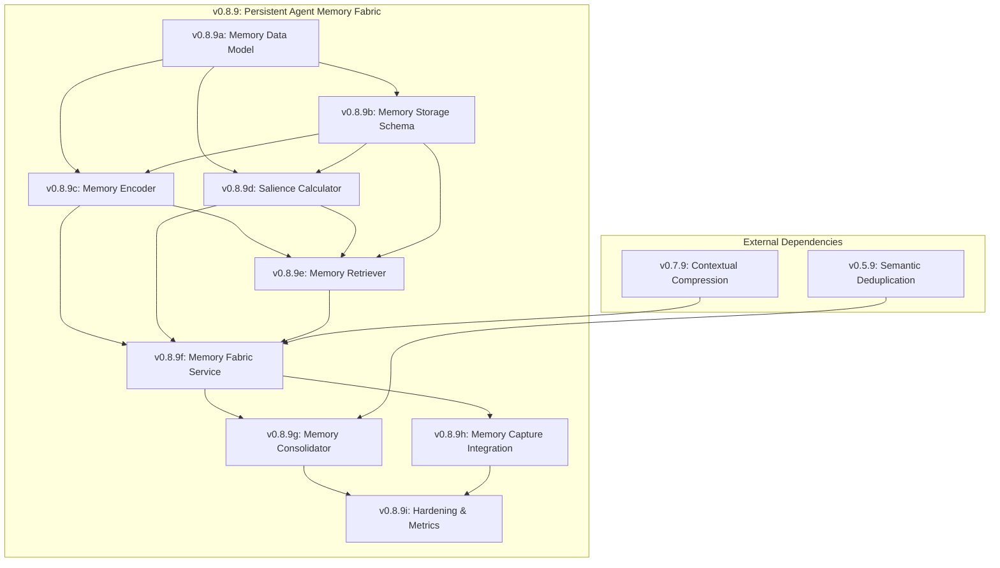

# Lexichord Design Specification Index: v0.8.9 — Persistent Agent Memory Fabric

**Parent Scope:** [LCS-SCOPE-v0.8.9.md](./LCS-SCOPE-v0.8.9.md)
**Codename:** The Rememberer
**Theme:** Cross-session memory with temporal awareness and continuous learning
**Status:** Draft
**Last Updated:** 2026-02-03

---

## Overview

This index catalogs all design specifications for the v0.8.9 Persistent Agent Memory Fabric feature set. The system provides cross-session memory enabling AI agents to build, retain, and refine personal knowledge over time, with distinct memory types (semantic, episodic, procedural), temporal awareness, salience-based retrieval, and background memory consolidation.

---

## Design Specification Documents

| Sub-Version | Document | Feature Name | Status |
|-------------|----------|--------------|--------|
| v0.8.9a | [LCS-DES-v0.8.9a.md](./LCS-DES-v0.8.9a.md) | Memory Data Model | Draft |
| v0.8.9b | [LCS-DES-v0.8.9b.md](./LCS-DES-v0.8.9b.md) | Memory Storage Schema | Draft |
| v0.8.9c | [LCS-DES-v0.8.9c.md](./LCS-DES-v0.8.9c.md) | Memory Encoder | Draft |
| v0.8.9d | [LCS-DES-v0.8.9d.md](./LCS-DES-v0.8.9d.md) | Salience Calculator | Draft |
| v0.8.9e | [LCS-DES-v0.8.9e.md](./LCS-DES-v0.8.9e.md) | Memory Retriever | Draft |
| v0.8.9f | [LCS-DES-v0.8.9f.md](./LCS-DES-v0.8.9f.md) | Memory Fabric Service | Draft |
| v0.8.9g | [LCS-DES-v0.8.9g.md](./LCS-DES-v0.8.9g.md) | Memory Consolidator | Draft |
| v0.8.9h | [LCS-DES-v0.8.9h.md](./LCS-DES-v0.8.9h.md) | Memory Capture Integration | Draft |
| v0.8.9i | [LCS-DES-v0.8.9i.md](./LCS-DES-v0.8.9i.md) | Hardening & Metrics | Draft |

---

## Dependency Graph



---

## Module & License Summary

| Sub-Version | Module Scope | License Tier | Feature Gate Key |
|-------------|--------------|--------------|------------------|
| v0.8.9a | Lexichord.Modules.Agents | Writer Pro | `Agents.Memory.Model` |
| v0.8.9b | Lexichord.Modules.Agents | Writer Pro | `Agents.Memory.Storage` |
| v0.8.9c | Lexichord.Modules.Agents | Writer Pro | `Agents.Memory.Encoder` |
| v0.8.9d | Lexichord.Modules.Agents | Writer Pro | `Agents.Memory.Salience` |
| v0.8.9e | Lexichord.Modules.Agents | Writer Pro | `Agents.Memory.Retriever` |
| v0.8.9f | Lexichord.Modules.Agents | Writer Pro | `Agents.Memory.Fabric` |
| v0.8.9g | Lexichord.Modules.Agents | Teams | `Agents.Memory.Consolidator` |
| v0.8.9h | Lexichord.Modules.Agents | Writer Pro | `Agents.Memory.Capture` |
| v0.8.9i | Lexichord.Modules.Agents | Teams | `Agents.Memory.Metrics` |

---

## Schema Changes Summary

### Memory Storage (v0.8.9b)

- `memories` — Core memory storage with vector embeddings
- `memory_confidence_history` — Confidence trajectory tracking
- `memory_links` — Inter-memory relationship graph

---

## MediatR Events Summary

| Event | Source | Description |
|-------|--------|-------------|
| `MemoryCreatedEvent` | v0.8.9f | New memory stored |
| `MemoryReinforcedEvent` | v0.8.9f | Memory salience increased |
| `MemoryUpdatedEvent` | v0.8.9f | Memory content corrected |
| `MemoryArchivedEvent` | v0.8.9f | Memory moved to archive |
| `MemorySupersededEvent` | v0.8.9f | Memory replaced by newer version |
| `MemoriesLinkedEvent` | v0.8.9f | Relationship created between memories |
| `ConsolidationCompletedEvent` | v0.8.9g | Background consolidation finished |
| `PatternExtractedEvent` | v0.8.9g | Semantic memory created from episodic patterns |
| `MemoryContradictionDetectedEvent` | v0.8.9g | Conflicting memories found |
| `MemoryCapturedEvent` | v0.8.9h | Memory captured from workflow |

---

## Implementation Order

The recommended implementation sequence follows the dependency graph:

1. **Data Model (v0.8.9a):** Core records and enums
2. **Storage Schema (v0.8.9b):** Database tables and indexes
3. **Encoder (v0.8.9c):** Memory creation and classification
4. **Salience (v0.8.9d):** Multi-factor scoring
5. **Retriever (v0.8.9e):** Multi-modal recall
6. **Fabric Service (v0.8.9f):** Main orchestration API
7. **Consolidator (v0.8.9g):** Background processing
8. **Capture Integration (v0.8.9h):** Workflow integration
9. **Hardening (v0.8.9i):** Testing and metrics

---

## Success Metrics (Overall)

| Metric | Target |
|--------|--------|
| Memory Recall Precision | >0.85 |
| Salience Ranking Accuracy | >0.80 |
| Consolidation Pattern Accuracy | >0.75 |
| Memory Store Latency (read) | <50ms |
| Memory Store Latency (write) | <100ms |
| Consolidation Cycle Duration | <30s per 1000 memories |
| Storage per Memory | <2KB average |

---

## Core Concepts

### Memory Types

```
┌─────────────────────────────────────────────────────────────┐
│                      Memory Fabric                           │
├─────────────────────────────────────────────────────────────┤
│                                                              │
│  ┌─────────────────┐  ┌─────────────────┐                   │
│  │ SEMANTIC        │  │ EPISODIC        │                   │
│  │ MEMORY          │  │ MEMORY          │                   │
│  │                 │  │                 │                   │
│  │ Facts & concepts│  │ Specific events │                   │
│  │ "User prefers   │  │ "On Jan 15, we  │                   │
│  │  dark mode"     │  │  debugged the   │                   │
│  │                 │  │  auth module"   │                   │
│  └─────────────────┘  └─────────────────┘                   │
│                                                              │
│  ┌─────────────────┐  ┌─────────────────┐                   │
│  │ PROCEDURAL      │  │ WORKING         │                   │
│  │ MEMORY          │  │ MEMORY          │                   │
│  │                 │  │                 │                   │
│  │ How to do things│  │ Current session │                   │
│  │ "To deploy,     │  │ context (temp)  │                   │
│  │  run make prod" │  │                 │                   │
│  └─────────────────┘  └─────────────────┘                   │
│                                                              │
└─────────────────────────────────────────────────────────────┘
```

### Salience Formula

```
salience = f(recency, frequency, importance, relevance)

Where:
- recency: Time decay since last access (exponential, 7-day half-life)
- frequency: Logarithmic scaling of access count
- importance: Explicitly marked or inferred significance
- relevance: Embedding similarity to current context
```

### Memory Lifecycle

```
┌────────────┐    ┌────────────┐    ┌────────────┐    ┌────────────┐
│  CAPTURE   │ -> │   ENCODE   │ -> │   STORE    │ -> │  RETRIEVE  │
│            │    │            │    │            │    │            │
│ Workflow   │    │ Classify   │    │ Persist    │    │ Recall by  │
│ observation│    │ Embed      │    │ Index      │    │ similarity │
│ Correction │    │ Contextualize   │ Link       │    │ or time    │
└────────────┘    └────────────┘    └────────────┘    └────────────┘
                                          │
                                          ▼
┌────────────┐    ┌────────────┐    ┌────────────┐
│  ARCHIVE   │ <- │   PRUNE    │ <- │ CONSOLIDATE│
│            │    │            │    │            │
│ Low-salience    │ Deduplicate│    │ Pattern    │
│ superseded │    │ Merge      │    │ extraction │
│ memories   │    │ Decay      │    │ Strengthen │
└────────────┘    └────────────┘    └────────────┘
```

---

## Integration Points

### RAG System Coexistence

The Memory Fabric operates alongside RAG, not replacing it:

| System | Purpose | Content |
|--------|---------|---------|
| RAG (existing) | Document knowledge | Chunks, citations, snippets |
| Memory Fabric (new) | Agent learning | Preferences, patterns, history |

Both feed into the Context Assembler (v0.7.2) for unified retrieval.

### Shared Infrastructure

- PostgreSQL database (separate tables)
- pgvector for embeddings
- Common embedding model (`IEmbeddingService`)
- Context Assembler for unified retrieval

---

## Open Questions

1. **Memory Scope**: Per-user? Per-project? Global?
2. **Privacy**: How to handle sensitive information in memories?
3. **Forgetting**: Should users be able to explicitly delete memories? GDPR implications?
4. **Sharing**: Can memories be shared between users/agents?
5. **Conflicts**: When memory contradicts retrieved documents, which wins?
6. **Bootstrapping**: How to handle cold-start with no memories?

