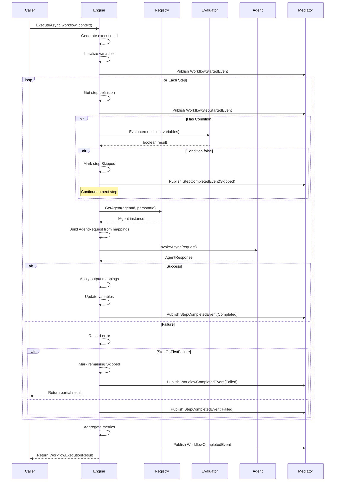

# LCS-DES-077b: Design Specification — Workflow Engine

## 1. Metadata & Categorization

| Field | Value | Description |
| :--- | :--- | :--- |
| **Feature ID** | `AGT-077b` | Sub-part of AGT-077 |
| **Feature Name** | `Workflow Engine` | Sequential agent execution |
| **Target Version** | `v0.7.7b` | Second sub-part of v0.7.7 |
| **Module Scope** | `Lexichord.Modules.Agents` | Agents module |
| **Swimlane** | `Ensemble` | Agent orchestration vertical |
| **License Tier** | `Teams` | Required for workflow execution |
| **Feature Gate Key** | `FeatureFlags.Agents.WorkflowEngine` | |
| **Author** | Lead Architect | |
| **Status** | `Draft` | |
| **Last Updated** | `2026-01-27` | |
| **Parent Document** | [LCS-DES-077-INDEX](./LCS-DES-077-INDEX.md) | |
| **Scope Breakdown** | [LCS-SBD-077 Section 3.2](./LCS-SBD-077.md#32-v077b-workflow-engine) | |

---

## 2. Executive Summary

### 2.1 The Requirement

Workflow definitions need to be executed reliably with:

- Sequential step execution in defined order
- Data passing between steps (output of step N becomes input to step N+1)
- Conditional step execution based on expressions or previous step outcomes
- Graceful cancellation at any point
- Aggregated metrics (tokens, timing) across all steps
- Event publishing for UI progress updates

> **Goal:** Implement a robust workflow execution engine that orchestrates multi-agent pipelines with full observability.

### 2.2 The Proposed Solution

Implement `IWorkflowEngine` that:

1. **Executes Sequentially** — Steps run in order, one at a time
2. **Evaluates Conditions** — Skip steps whose conditions evaluate to false
3. **Passes Data** — Map outputs from one step to inputs of the next
4. **Supports Cancellation** — Graceful termination with partial results
5. **Aggregates Metrics** — Token usage, timing across all steps
6. **Publishes Events** — MediatR events for UI progress updates

---

## 3. Architecture & Modular Strategy

### 3.1 Dependencies

#### 3.1.1 Upstream Modules

| Interface | Source Version | Purpose |
| :--- | :--- | :--- |
| `IAgent` | v0.6.6a | Agent invocation |
| `IAgentRegistry` | v0.7.1b | Agent resolution |
| `AgentPersona` | v0.7.1a | Persona application |
| `IMediator` | v0.0.7a | Event publishing |
| `IContextOrchestrator` | v0.7.2c | Context assembly |

#### 3.1.2 NuGet Packages

| Package | Version | Purpose |
| :--- | :--- | :--- |
| `DynamicExpresso` | 2.x | Expression evaluation |
| `MediatR` | 12.x | Event publishing |

### 3.2 Licensing Behavior

**Hard Gate** at execution time:

- `ExecuteAsync` checks license before execution
- Non-Teams users receive `LicenseRequiredException`
- WriterPro users can execute preset workflows (rate-limited)

---

## 4. Data Contract (The API)

### 4.1 Engine Interface

```csharp
namespace Lexichord.Modules.Agents.Workflows;

/// <summary>
/// Engine for executing agent workflows.
/// </summary>
public interface IWorkflowEngine
{
    /// <summary>
    /// Executes a workflow and returns the complete result.
    /// </summary>
    /// <param name="workflow">Workflow definition to execute.</param>
    /// <param name="context">Execution context with document and variables.</param>
    /// <param name="ct">Cancellation token.</param>
    /// <returns>Complete execution result.</returns>
    Task<WorkflowExecutionResult> ExecuteAsync(
        WorkflowDefinition workflow,
        WorkflowExecutionContext context,
        CancellationToken ct = default);

    /// <summary>
    /// Executes a workflow with streaming step results.
    /// Yields results as each step completes for real-time UI updates.
    /// </summary>
    /// <param name="workflow">Workflow definition to execute.</param>
    /// <param name="context">Execution context with document and variables.</param>
    /// <param name="ct">Cancellation token.</param>
    /// <returns>Async enumerable of step results.</returns>
    IAsyncEnumerable<WorkflowStepExecutionResult> ExecuteStreamingAsync(
        WorkflowDefinition workflow,
        WorkflowExecutionContext context,
        CancellationToken ct = default);

    /// <summary>
    /// Validates that a workflow can be executed in the current context.
    /// Checks agent availability, license requirements, etc.
    /// </summary>
    /// <param name="workflow">Workflow to validate.</param>
    /// <param name="context">Execution context.</param>
    /// <returns>Validation result with any errors.</returns>
    WorkflowExecutionValidation ValidateExecution(
        WorkflowDefinition workflow,
        WorkflowExecutionContext context);

    /// <summary>
    /// Estimates token usage for a workflow without executing it.
    /// </summary>
    /// <param name="workflow">Workflow to estimate.</param>
    /// <param name="context">Execution context.</param>
    /// <returns>Estimated token usage.</returns>
    WorkflowTokenEstimate EstimateTokens(
        WorkflowDefinition workflow,
        WorkflowExecutionContext context);
}
```

### 4.2 Execution Records

```csharp
namespace Lexichord.Modules.Agents.Workflows;

/// <summary>
/// Context provided to a workflow execution.
/// </summary>
public record WorkflowExecutionContext(
    string? DocumentPath,
    string? Selection,
    IReadOnlyDictionary<string, object> InitialVariables,
    WorkflowExecutionOptions Options
);

/// <summary>
/// Options controlling workflow execution behavior.
/// </summary>
public record WorkflowExecutionOptions(
    bool StopOnFirstFailure = true,
    bool CollectIntermediateOutputs = true,
    TimeSpan? StepTimeout = null,
    int MaxRetries = 0,
    bool DryRun = false
);

/// <summary>
/// Result of a complete workflow execution.
/// </summary>
public record WorkflowExecutionResult(
    string WorkflowId,
    string ExecutionId,
    bool Success,
    WorkflowExecutionStatus Status,
    IReadOnlyList<WorkflowStepExecutionResult> StepResults,
    string? FinalOutput,
    TimeSpan TotalDuration,
    WorkflowUsageMetrics TotalUsage,
    IReadOnlyDictionary<string, object> FinalVariables,
    string? ErrorMessage
);

/// <summary>
/// Status of a workflow execution.
/// </summary>
public enum WorkflowExecutionStatus
{
    Pending,
    Running,
    Completed,
    Failed,
    Cancelled,
    PartialSuccess
}

/// <summary>
/// Result of a single workflow step execution.
/// </summary>
public record WorkflowStepExecutionResult(
    string StepId,
    string AgentId,
    bool Success,
    WorkflowStepStatus Status,
    string? Output,
    TimeSpan Duration,
    AgentUsageMetrics Usage,
    string? ErrorMessage,
    IReadOnlyDictionary<string, object>? OutputVariables
);

/// <summary>
/// Status of a workflow step.
/// </summary>
public enum WorkflowStepStatus
{
    Pending,
    Running,
    Completed,
    Failed,
    Skipped,
    Cancelled
}

/// <summary>
/// Aggregated usage metrics for a workflow execution.
/// </summary>
public record WorkflowUsageMetrics(
    int TotalPromptTokens,
    int TotalCompletionTokens,
    int TotalTokens,
    decimal EstimatedCost,
    int StepsExecuted,
    int StepsSkipped
);

/// <summary>
/// Usage metrics for a single agent invocation.
/// </summary>
public record AgentUsageMetrics(
    int PromptTokens,
    int CompletionTokens,
    int TotalTokens,
    decimal EstimatedCost
);

/// <summary>
/// Validation result for workflow execution readiness.
/// </summary>
public record WorkflowExecutionValidation(
    bool CanExecute,
    IReadOnlyList<string> Errors,
    IReadOnlyList<string> Warnings
);

/// <summary>
/// Token usage estimate for a workflow.
/// </summary>
public record WorkflowTokenEstimate(
    int EstimatedPromptTokens,
    int EstimatedCompletionTokens,
    int EstimatedTotalTokens,
    decimal EstimatedCost,
    IReadOnlyList<StepTokenEstimate> StepEstimates
);

/// <summary>
/// Token estimate for a single step.
/// </summary>
public record StepTokenEstimate(
    string StepId,
    string AgentId,
    int EstimatedPromptTokens,
    int EstimatedCompletionTokens
);
```

### 4.3 Expression Evaluator Interface

```csharp
namespace Lexichord.Modules.Agents.Workflows;

/// <summary>
/// Evaluates conditional expressions for workflow step conditions.
/// Uses a sandboxed expression evaluator for safety.
/// </summary>
public interface IExpressionEvaluator
{
    /// <summary>
    /// Evaluates an expression against the current variable context.
    /// </summary>
    /// <typeparam name="T">Expected result type.</typeparam>
    /// <param name="expression">Expression to evaluate.</param>
    /// <param name="variables">Variable context.</param>
    /// <returns>Evaluation result.</returns>
    /// <exception cref="ExpressionEvaluationException">If evaluation fails.</exception>
    T Evaluate<T>(string expression, IReadOnlyDictionary<string, object> variables);

    /// <summary>
    /// Validates that an expression is syntactically correct.
    /// </summary>
    /// <param name="expression">Expression to validate.</param>
    /// <param name="errorMessage">Error message if invalid.</param>
    /// <returns>True if valid, false otherwise.</returns>
    bool IsValid(string expression, out string? errorMessage);

    /// <summary>
    /// Gets the list of variables referenced in an expression.
    /// </summary>
    /// <param name="expression">Expression to analyze.</param>
    /// <returns>List of variable names.</returns>
    IReadOnlyList<string> GetReferencedVariables(string expression);
}
```

### 4.4 MediatR Events

```csharp
namespace Lexichord.Modules.Agents.Events;

/// <summary>
/// Published when a workflow execution starts.
/// </summary>
public record WorkflowStartedEvent(
    string WorkflowId,
    string ExecutionId,
    int TotalSteps
) : INotification;

/// <summary>
/// Published when a workflow step completes.
/// </summary>
public record WorkflowStepCompletedEvent(
    string WorkflowId,
    string ExecutionId,
    string StepId,
    bool Success,
    WorkflowStepStatus Status,
    TimeSpan Duration
) : INotification;

/// <summary>
/// Published when a workflow step starts.
/// </summary>
public record WorkflowStepStartedEvent(
    string WorkflowId,
    string ExecutionId,
    string StepId,
    string AgentId,
    int StepNumber,
    int TotalSteps
) : INotification;

/// <summary>
/// Published when a workflow execution completes.
/// </summary>
public record WorkflowCompletedEvent(
    string WorkflowId,
    string ExecutionId,
    bool Success,
    WorkflowExecutionStatus Status,
    TimeSpan TotalDuration,
    int StepsCompleted,
    int StepsSkipped
) : INotification;

/// <summary>
/// Published when a workflow is cancelled.
/// </summary>
public record WorkflowCancelledEvent(
    string WorkflowId,
    string ExecutionId,
    string? CurrentStepId,
    int StepsCompleted
) : INotification;
```

---

## 5. Implementation Logic

### 5.1 Execution Flow Diagram



### 5.2 Condition Evaluation Logic

```text
EVALUATE STEP CONDITION:
│
├── Condition is null?
│   └── YES → Return true (execute step)
│
├── Condition.Type = Always?
│   └── YES → Return true
│
├── Condition.Type = PreviousSuccess?
│   ├── Is first step?
│   │   └── YES → Return true (no previous)
│   └── Check _previousStepSuccess variable
│       └── Return _previousStepSuccess
│
├── Condition.Type = PreviousFailed?
│   ├── Is first step?
│   │   └── YES → Return false (no previous to fail)
│   └── Check _previousStepSuccess variable
│       └── Return !_previousStepSuccess
│
├── Condition.Type = Expression?
│   ├── Expression is empty?
│   │   └── YES → Return true
│   ├── Evaluate expression with DynamicExpresso
│   │   ├── SUCCESS → Return boolean result
│   │   └── ERROR → Log warning, return true
│   └── Return evaluation result
│
└── Unknown Type → Return true with warning
```

### 5.3 Variable Mapping Flow

```text
VARIABLE FLOW BETWEEN STEPS:

Initial Context:
┌─────────────────────────────────────────┐
│ Variables:                              │
│   document: "Full document content..."  │
│   selection: "Selected text..."         │
│   documentPath: "/path/to/doc.md"       │
└─────────────────────────────────────────┘
            │
            v
┌─────────────────────────────────────────┐
│ Step 1: Editor                          │
│ Input: Uses "selection" or "document"   │
│ Output: "Here are 3 suggestions..."     │
│                                         │
│ Output Mappings:                        │
│   edit_result: "$.output"               │
│   suggestion_count: "$.metadata.count"  │
└─────────────────────────────────────────┘
            │
            v
┌─────────────────────────────────────────┐
│ Variables (after Step 1):               │
│   document: "Full document content..."  │
│   selection: "Selected text..."         │
│   _previousOutput: "Here are 3..."      │
│   _previousStepSuccess: true            │
│   edit_result: "Here are 3..."          │
│   suggestion_count: 3                   │
└─────────────────────────────────────────┘
            │
            v
┌─────────────────────────────────────────┐
│ Step 2: Simplifier                      │
│ Input Mappings:                         │
│   text: "edit_result"                   │
│ → Agent receives "Here are 3..." as     │
│   the text to simplify                  │
└─────────────────────────────────────────┘
```

### 5.4 Data Mapping Implementation

```csharp
/// <summary>
/// Maps output values from agent response to workflow variables.
/// Supports JSONPath expressions for extracting nested values.
/// </summary>
private void ApplyOutputMappings(
    WorkflowStepDefinition step,
    AgentResponse response,
    Dictionary<string, object> variables)
{
    // Always set standard variables
    variables["_previousOutput"] = response.Content ?? "";
    variables["_previousStepSuccess"] = true;

    if (step.OutputMappings is null || step.OutputMappings.Count == 0)
        return;

    foreach (var (variableName, expression) in step.OutputMappings)
    {
        try
        {
            var value = ExtractValue(response, expression);
            variables[variableName] = value;
            _logger.LogDebug("Mapped output {Variable} = {Value}", variableName, value);
        }
        catch (Exception ex)
        {
            _logger.LogWarning(ex, "Failed to map output {Variable} with expression {Expression}",
                variableName, expression);
        }
    }
}

/// <summary>
/// Extracts a value from agent response using expression.
/// Supports: $.output, $.metadata.X, $.usage.tokens
/// </summary>
private object ExtractValue(AgentResponse response, string expression)
{
    if (expression == "$.output" || expression == "$")
        return response.Content ?? "";

    if (expression.StartsWith("$.metadata."))
    {
        var key = expression["$.metadata.".Length..];
        return response.Metadata?.TryGetValue(key, out var val) == true ? val : null!;
    }

    if (expression.StartsWith("$.usage."))
    {
        var key = expression["$.usage.".Length..];
        return key switch
        {
            "promptTokens" => response.Usage?.PromptTokens ?? 0,
            "completionTokens" => response.Usage?.CompletionTokens ?? 0,
            "totalTokens" => response.Usage?.TotalTokens ?? 0,
            _ => null!
        };
    }

    // Fallback: treat as literal
    return expression;
}
```

### 5.5 Cancellation Handling

```text
CANCELLATION FLOW:

User Requests Cancel:
│
├── CancellationToken.Cancel() called
│
├── Engine checks token before each step
│   └── IF cancelled → Break loop
│
├── Current step is executing:
│   ├── Agent receives cancellation token
│   ├── Wait up to 5 seconds for graceful abort
│   └── Force timeout if agent doesn't respond
│
├── Mark current step as Cancelled
│
├── Mark remaining steps as Cancelled
│
├── Set workflow status = Cancelled
│
├── Publish WorkflowCancelledEvent
│
└── Return partial WorkflowExecutionResult
    ├── Success = false
    ├── Status = Cancelled
    ├── StepResults = completed + cancelled steps
    └── FinalOutput = last completed output
```

---

## 6. Code Implementation

### 6.1 WorkflowEngine Implementation

```csharp
namespace Lexichord.Modules.Agents.Workflows;

/// <summary>
/// Core workflow execution engine.
/// Orchestrates sequential agent execution with data passing and conditions.
/// </summary>
public class WorkflowEngine : IWorkflowEngine
{
    private readonly IAgentRegistry _agentRegistry;
    private readonly IExpressionEvaluator _expressionEvaluator;
    private readonly IMediator _mediator;
    private readonly ILogger<WorkflowEngine> _logger;
    private readonly TimeSpan _defaultStepTimeout = TimeSpan.FromSeconds(120);

    public WorkflowEngine(
        IAgentRegistry agentRegistry,
        IExpressionEvaluator expressionEvaluator,
        IMediator mediator,
        ILogger<WorkflowEngine> logger)
    {
        _agentRegistry = agentRegistry;
        _expressionEvaluator = expressionEvaluator;
        _mediator = mediator;
        _logger = logger;
    }

    public async Task<WorkflowExecutionResult> ExecuteAsync(
        WorkflowDefinition workflow,
        WorkflowExecutionContext context,
        CancellationToken ct = default)
    {
        var executionId = GenerateExecutionId();
        var stepResults = new List<WorkflowStepExecutionResult>();
        var variables = new Dictionary<string, object>(context.InitialVariables);
        var stopwatch = Stopwatch.StartNew();
        var totalUsage = WorkflowUsageMetrics.Empty;

        // Initialize standard variables
        InitializeVariables(variables, context);

        _logger.LogDebug("Workflow {WorkflowId} starting with {StepCount} steps",
            workflow.WorkflowId, workflow.Steps.Count);

        await _mediator.Publish(new WorkflowStartedEvent(
            workflow.WorkflowId, executionId, workflow.Steps.Count), ct);

        string? finalOutput = null;
        string? errorMessage = null;
        var status = WorkflowExecutionStatus.Running;

        try
        {
            var orderedSteps = workflow.Steps.OrderBy(s => s.Order).ToList();
            var stepNumber = 0;

            foreach (var step in orderedSteps)
            {
                ct.ThrowIfCancellationRequested();
                stepNumber++;

                await _mediator.Publish(new WorkflowStepStartedEvent(
                    workflow.WorkflowId, executionId, step.StepId, step.AgentId,
                    stepNumber, orderedSteps.Count), ct);

                // Evaluate condition
                if (!ShouldExecuteStep(step, variables))
                {
                    _logger.LogDebug("Step {StepId} skipped due to condition", step.StepId);
                    var skippedResult = CreateSkippedResult(step);
                    stepResults.Add(skippedResult);
                    totalUsage = totalUsage.WithSkipped();

                    await _mediator.Publish(new WorkflowStepCompletedEvent(
                        workflow.WorkflowId, executionId, step.StepId, true,
                        WorkflowStepStatus.Skipped, TimeSpan.Zero), ct);
                    continue;
                }

                // Execute step
                var stepResult = await ExecuteStepAsync(
                    step, variables, context, ct);

                stepResults.Add(stepResult);

                await _mediator.Publish(new WorkflowStepCompletedEvent(
                    workflow.WorkflowId, executionId, step.StepId, stepResult.Success,
                    stepResult.Status, stepResult.Duration), ct);

                if (stepResult.Success)
                {
                    finalOutput = stepResult.Output;
                    ApplyOutputMappings(step, stepResult, variables);
                    totalUsage = totalUsage.Add(stepResult.Usage);
                    variables["_previousStepSuccess"] = true;
                }
                else
                {
                    variables["_previousStepSuccess"] = false;
                    errorMessage = stepResult.ErrorMessage;

                    if (context.Options.StopOnFirstFailure)
                    {
                        _logger.LogWarning("Workflow {WorkflowId} stopping due to step failure",
                            workflow.WorkflowId);

                        // Mark remaining steps as skipped
                        foreach (var remaining in orderedSteps.Skip(stepNumber))
                        {
                            stepResults.Add(CreateSkippedResult(remaining, "Previous step failed"));
                        }

                        status = WorkflowExecutionStatus.Failed;
                        break;
                    }
                }
            }

            if (status == WorkflowExecutionStatus.Running)
            {
                status = stepResults.All(s => s.Success || s.Status == WorkflowStepStatus.Skipped)
                    ? WorkflowExecutionStatus.Completed
                    : WorkflowExecutionStatus.PartialSuccess;
            }
        }
        catch (OperationCanceledException)
        {
            status = WorkflowExecutionStatus.Cancelled;
            errorMessage = "Workflow cancelled by user";
            _logger.LogWarning("Workflow {WorkflowId} cancelled", workflow.WorkflowId);

            await _mediator.Publish(new WorkflowCancelledEvent(
                workflow.WorkflowId, executionId,
                stepResults.LastOrDefault()?.StepId,
                stepResults.Count(s => s.Status == WorkflowStepStatus.Completed)), ct);
        }
        catch (Exception ex)
        {
            status = WorkflowExecutionStatus.Failed;
            errorMessage = ex.Message;
            _logger.LogError(ex, "Workflow {WorkflowId} failed with exception", workflow.WorkflowId);
        }

        stopwatch.Stop();

        var result = new WorkflowExecutionResult(
            workflow.WorkflowId,
            executionId,
            status == WorkflowExecutionStatus.Completed,
            status,
            stepResults,
            finalOutput,
            stopwatch.Elapsed,
            totalUsage,
            variables.AsReadOnly(),
            errorMessage);

        _logger.LogInformation(
            "Workflow {WorkflowId} completed in {DurationMs}ms with status {Status}",
            workflow.WorkflowId, stopwatch.ElapsedMilliseconds, status);

        await _mediator.Publish(new WorkflowCompletedEvent(
            workflow.WorkflowId, executionId, result.Success, status, stopwatch.Elapsed,
            stepResults.Count(s => s.Status == WorkflowStepStatus.Completed),
            stepResults.Count(s => s.Status == WorkflowStepStatus.Skipped)), ct);

        return result;
    }

    public async IAsyncEnumerable<WorkflowStepExecutionResult> ExecuteStreamingAsync(
        WorkflowDefinition workflow,
        WorkflowExecutionContext context,
        [EnumeratorCancellation] CancellationToken ct = default)
    {
        var variables = new Dictionary<string, object>(context.InitialVariables);
        InitializeVariables(variables, context);

        foreach (var step in workflow.Steps.OrderBy(s => s.Order))
        {
            ct.ThrowIfCancellationRequested();

            if (!ShouldExecuteStep(step, variables))
            {
                yield return CreateSkippedResult(step);
                continue;
            }

            var result = await ExecuteStepAsync(step, variables, context, ct);
            yield return result;

            if (result.Success)
            {
                ApplyOutputMappings(step, result, variables);
                variables["_previousStepSuccess"] = true;
            }
            else
            {
                variables["_previousStepSuccess"] = false;
                if (context.Options.StopOnFirstFailure)
                    yield break;
            }
        }
    }

    private bool ShouldExecuteStep(
        WorkflowStepDefinition step,
        IReadOnlyDictionary<string, object> variables)
    {
        if (step.Condition is null)
            return true;

        try
        {
            return step.Condition.Type switch
            {
                ConditionType.Always => true,
                ConditionType.PreviousSuccess =>
                    !variables.TryGetValue("_previousStepSuccess", out var s) || (bool)s,
                ConditionType.PreviousFailed =>
                    variables.TryGetValue("_previousStepSuccess", out var f) && !(bool)f,
                ConditionType.Expression when string.IsNullOrWhiteSpace(step.Condition.Expression) => true,
                ConditionType.Expression =>
                    _expressionEvaluator.Evaluate<bool>(step.Condition.Expression, variables),
                _ => true
            };
        }
        catch (Exception ex)
        {
            _logger.LogWarning(ex, "Step {StepId} condition evaluation failed, defaulting to execute",
                step.StepId);
            return true;
        }
    }

    private async Task<WorkflowStepExecutionResult> ExecuteStepAsync(
        WorkflowStepDefinition step,
        Dictionary<string, object> variables,
        WorkflowExecutionContext context,
        CancellationToken ct)
    {
        var stepStopwatch = Stopwatch.StartNew();

        try
        {
            // Get agent
            var agent = step.PersonaId is not null
                ? _agentRegistry.GetAgentWithPersona(step.AgentId, step.PersonaId)
                : _agentRegistry.GetAgent(step.AgentId);

            // Build request
            var request = BuildAgentRequest(step, variables, context);

            // Execute with timeout
            var timeout = context.Options.StepTimeout ?? _defaultStepTimeout;
            using var timeoutCts = CancellationTokenSource.CreateLinkedTokenSource(ct);
            timeoutCts.CancelAfter(timeout);

            var response = await agent.InvokeAsync(request, timeoutCts.Token);

            stepStopwatch.Stop();

            _logger.LogInfo("Step {StepId} completed: {TokensUsed} tokens, {DurationMs}ms",
                step.StepId, response.Usage?.TotalTokens ?? 0, stepStopwatch.ElapsedMilliseconds);

            return new WorkflowStepExecutionResult(
                step.StepId,
                step.AgentId,
                true,
                WorkflowStepStatus.Completed,
                response.Content,
                stepStopwatch.Elapsed,
                new AgentUsageMetrics(
                    response.Usage?.PromptTokens ?? 0,
                    response.Usage?.CompletionTokens ?? 0,
                    response.Usage?.TotalTokens ?? 0,
                    0),
                null,
                response.Metadata);
        }
        catch (OperationCanceledException) when (!ct.IsCancellationRequested)
        {
            stepStopwatch.Stop();
            _logger.LogWarning("Step {StepId} timed out after {Duration}", step.StepId, stepStopwatch.Elapsed);

            return new WorkflowStepExecutionResult(
                step.StepId, step.AgentId, false, WorkflowStepStatus.Failed, null,
                stepStopwatch.Elapsed, AgentUsageMetrics.Empty,
                "Step timed out", null);
        }
        catch (Exception ex)
        {
            stepStopwatch.Stop();
            _logger.LogError(ex, "Step {StepId} failed: {Error}", step.StepId, ex.Message);

            return new WorkflowStepExecutionResult(
                step.StepId, step.AgentId, false, WorkflowStepStatus.Failed, null,
                stepStopwatch.Elapsed, AgentUsageMetrics.Empty,
                ex.Message, null);
        }
    }

    private AgentRequest BuildAgentRequest(
        WorkflowStepDefinition step,
        Dictionary<string, object> variables,
        WorkflowExecutionContext context)
    {
        var userMessage = step.PromptOverride ?? "Process the provided content.";

        // Apply input mappings
        if (step.InputMappings is { Count: > 0 })
        {
            foreach (var (placeholder, variableName) in step.InputMappings)
            {
                if (variables.TryGetValue(variableName, out var value))
                {
                    userMessage = userMessage.Replace($"{{{placeholder}}}", value?.ToString() ?? "");
                }
            }
        }

        // Include previous output if available
        var selection = variables.TryGetValue("_previousOutput", out var prev) && prev is string s && !string.IsNullOrEmpty(s)
            ? s
            : context.Selection;

        return new AgentRequest(
            UserMessage: userMessage,
            DocumentPath: context.DocumentPath,
            Selection: selection
        );
    }

    private static void InitializeVariables(Dictionary<string, object> variables, WorkflowExecutionContext context)
    {
        if (context.DocumentPath is not null)
            variables["documentPath"] = context.DocumentPath;
        if (context.Selection is not null)
            variables["selection"] = context.Selection;
        variables["_previousStepSuccess"] = true;
    }

    private static WorkflowStepExecutionResult CreateSkippedResult(
        WorkflowStepDefinition step, string? reason = null) =>
        new(step.StepId, step.AgentId, true, WorkflowStepStatus.Skipped, null,
            TimeSpan.Zero, AgentUsageMetrics.Empty, reason, null);

    private static string GenerateExecutionId() =>
        $"exec-{Guid.NewGuid():N}"[..12];
}
```

### 6.2 Expression Evaluator Implementation

```csharp
namespace Lexichord.Modules.Agents.Workflows;

/// <summary>
/// Expression evaluator using DynamicExpresso for safe evaluation.
/// </summary>
public class ExpressionEvaluator : IExpressionEvaluator
{
    private readonly Interpreter _interpreter;

    public ExpressionEvaluator()
    {
        _interpreter = new Interpreter();

        // Register common functions
        _interpreter.SetFunction("count", (Func<IEnumerable<object>, int>)(items => items.Count()));
        _interpreter.SetFunction("any", (Func<IEnumerable<object>, bool>)(items => items.Any()));
        _interpreter.SetFunction("isEmpty", (Func<string, bool>)(s => string.IsNullOrEmpty(s)));
        _interpreter.SetFunction("contains", (Func<string, string, bool>)((s, sub) => s.Contains(sub)));
    }

    public T Evaluate<T>(string expression, IReadOnlyDictionary<string, object> variables)
    {
        try
        {
            var parameters = variables.Select(kv => new Parameter(kv.Key, kv.Value)).ToArray();
            var result = _interpreter.Eval(expression, parameters);
            return (T)Convert.ChangeType(result, typeof(T));
        }
        catch (Exception ex)
        {
            throw new ExpressionEvaluationException($"Failed to evaluate expression: {expression}", ex);
        }
    }

    public bool IsValid(string expression, out string? errorMessage)
    {
        try
        {
            _interpreter.Parse(expression);
            errorMessage = null;
            return true;
        }
        catch (Exception ex)
        {
            errorMessage = ex.Message;
            return false;
        }
    }

    public IReadOnlyList<string> GetReferencedVariables(string expression)
    {
        var variables = new HashSet<string>();
        // Simple regex to find identifiers (not in quotes)
        var matches = Regex.Matches(expression, @"\b([a-zA-Z_][a-zA-Z0-9_]*)\b");
        foreach (Match match in matches)
        {
            var name = match.Groups[1].Value;
            // Exclude keywords and function names
            if (!IsReservedWord(name))
                variables.Add(name);
        }
        return variables.ToList();
    }

    private static bool IsReservedWord(string name) =>
        name is "true" or "false" or "null" or "and" or "or" or "not"
            or "count" or "any" or "isEmpty" or "contains";
}

/// <summary>
/// Exception thrown when expression evaluation fails.
/// </summary>
public class ExpressionEvaluationException : Exception
{
    public ExpressionEvaluationException(string message, Exception inner)
        : base(message, inner) { }
}
```

---

## 7. Observability & Logging

| Level | Message Template |
| :--- | :--- |
| Debug | `"Workflow {WorkflowId} starting with {StepCount} steps"` |
| Debug | `"Step {StepId} condition evaluated: {Result}"` |
| Debug | `"Step {StepId} skipped due to condition"` |
| Debug | `"Mapped output {Variable} = {Value}"` |
| Info | `"Step {StepId} completed: {TokensUsed} tokens, {DurationMs}ms"` |
| Info | `"Workflow {WorkflowId} completed in {DurationMs}ms with status {Status}"` |
| Warning | `"Step {StepId} condition evaluation failed, defaulting to execute"` |
| Warning | `"Step {StepId} timed out after {Duration}"` |
| Warning | `"Workflow {WorkflowId} stopping due to step failure"` |
| Warning | `"Workflow {WorkflowId} cancelled"` |
| Error | `"Step {StepId} failed: {Error}"` |
| Error | `"Workflow {WorkflowId} failed with exception"` |

---

## 8. Security & Safety

| Risk | Level | Mitigation |
| :--- | :--- | :--- |
| Malicious expressions | Medium | DynamicExpresso sandboxing, no reflection access |
| Infinite loops in conditions | Medium | Expression complexity limits, evaluation timeout |
| Token budget exhaustion | Medium | Pre-execution estimation, runtime tracking |
| Agent impersonation | Low | AgentId validation against registry |

---

## 9. Acceptance Criteria

### 9.1 Functional Criteria

| # | Given | When | Then |
| :--- | :--- | :--- | :--- |
| 1 | Workflow with 2 steps | ExecuteAsync called | Both steps execute in order |
| 2 | Step with Always condition | Executing workflow | Step executes |
| 3 | Step with PreviousSuccess condition | Previous step succeeded | Step executes |
| 4 | Step with PreviousSuccess condition | Previous step failed | Step skipped |
| 5 | Step with PreviousFailed condition | Previous step failed | Step executes |
| 6 | Step with Expression condition | Expression evaluates true | Step executes |
| 7 | Step with Expression condition | Expression evaluates false | Step skipped |
| 8 | Step with output mappings | Step completes | Variables updated |
| 9 | StopOnFirstFailure=true | Step fails | Remaining steps skipped |
| 10 | StopOnFirstFailure=false | Step fails | Remaining steps continue |
| 11 | Cancellation requested | During step execution | Workflow cancels gracefully |
| 12 | Multi-step workflow | All steps succeed | FinalOutput is last step output |

### 9.2 Performance Criteria

| # | Given | When | Then |
| :--- | :--- | :--- | :--- |
| 13 | Workflow with 5 steps | All steps mocked | Engine overhead < 50ms |
| 14 | Step timeout = 30s | Step takes 60s | Step fails with timeout |

---

## 10. Unit Tests

```csharp
[Trait("Category", "Unit")]
[Trait("Version", "v0.7.7b")]
public class WorkflowEngineTests
{
    private readonly Mock<IAgentRegistry> _registryMock;
    private readonly Mock<IExpressionEvaluator> _evaluatorMock;
    private readonly Mock<IMediator> _mediatorMock;
    private readonly Mock<ILogger<WorkflowEngine>> _loggerMock;
    private readonly WorkflowEngine _sut;

    public WorkflowEngineTests()
    {
        _registryMock = new Mock<IAgentRegistry>();
        _evaluatorMock = new Mock<IExpressionEvaluator>();
        _mediatorMock = new Mock<IMediator>();
        _loggerMock = new Mock<ILogger<WorkflowEngine>>();

        _sut = new WorkflowEngine(
            _registryMock.Object,
            _evaluatorMock.Object,
            _mediatorMock.Object,
            _loggerMock.Object);
    }

    [Fact]
    public async Task ExecuteAsync_SingleStep_InvokesAgentAndReturnsResult()
    {
        // Arrange
        var workflow = CreateWorkflow(CreateStep("editor"));
        var context = CreateContext();
        SetupAgent("editor", "Edited content");

        // Act
        var result = await _sut.ExecuteAsync(workflow, context);

        // Assert
        result.Success.Should().BeTrue();
        result.Status.Should().Be(WorkflowExecutionStatus.Completed);
        result.StepResults.Should().HaveCount(1);
        result.FinalOutput.Should().Be("Edited content");
    }

    [Fact]
    public async Task ExecuteAsync_MultipleSteps_ExecutesInOrder()
    {
        // Arrange
        var executionOrder = new List<string>();
        var workflow = CreateWorkflow(
            CreateStep("editor", order: 1),
            CreateStep("simplifier", order: 2));
        var context = CreateContext();

        _registryMock.Setup(r => r.GetAgent("editor"))
            .Returns(CreateMockAgent("editor", "Output 1", () => executionOrder.Add("editor")));
        _registryMock.Setup(r => r.GetAgent("simplifier"))
            .Returns(CreateMockAgent("simplifier", "Output 2", () => executionOrder.Add("simplifier")));

        // Act
        var result = await _sut.ExecuteAsync(workflow, context);

        // Assert
        executionOrder.Should().ContainInOrder("editor", "simplifier");
        result.StepResults.Should().HaveCount(2);
        result.FinalOutput.Should().Be("Output 2");
    }

    [Fact]
    public async Task ExecuteAsync_ConditionFalse_SkipsStep()
    {
        // Arrange
        var workflow = CreateWorkflow(
            CreateStep("editor", condition: new WorkflowStepCondition("false", ConditionType.Expression)));
        var context = CreateContext();

        _evaluatorMock.Setup(e => e.Evaluate<bool>("false", It.IsAny<IReadOnlyDictionary<string, object>>()))
            .Returns(false);

        // Act
        var result = await _sut.ExecuteAsync(workflow, context);

        // Assert
        result.Success.Should().BeTrue();
        result.StepResults[0].Status.Should().Be(WorkflowStepStatus.Skipped);
        _registryMock.Verify(r => r.GetAgent(It.IsAny<string>()), Times.Never);
    }

    [Fact]
    public async Task ExecuteAsync_PreviousSuccessCondition_ExecutesOnSuccess()
    {
        // Arrange
        var workflow = CreateWorkflow(
            CreateStep("editor", order: 1),
            CreateStep("simplifier", order: 2,
                condition: new WorkflowStepCondition("", ConditionType.PreviousSuccess)));
        var context = CreateContext();
        SetupAgent("editor", "Output 1");
        SetupAgent("simplifier", "Output 2");

        // Act
        var result = await _sut.ExecuteAsync(workflow, context);

        // Assert
        result.StepResults.Should().HaveCount(2);
        result.StepResults[1].Status.Should().Be(WorkflowStepStatus.Completed);
    }

    [Fact]
    public async Task ExecuteAsync_StepFails_StopsOnFirstFailure()
    {
        // Arrange
        var workflow = CreateWorkflow(
            CreateStep("editor", order: 1),
            CreateStep("simplifier", order: 2));
        var context = CreateContext(options: new WorkflowExecutionOptions(StopOnFirstFailure: true));

        _registryMock.Setup(r => r.GetAgent("editor"))
            .Returns(CreateFailingAgent("editor", "Error occurred"));

        // Act
        var result = await _sut.ExecuteAsync(workflow, context);

        // Assert
        result.Success.Should().BeFalse();
        result.Status.Should().Be(WorkflowExecutionStatus.Failed);
        result.StepResults[0].Status.Should().Be(WorkflowStepStatus.Failed);
        result.StepResults[1].Status.Should().Be(WorkflowStepStatus.Skipped);
    }

    [Fact]
    public async Task ExecuteAsync_Cancellation_StopsGracefully()
    {
        // Arrange
        var workflow = CreateWorkflow(
            CreateStep("editor", order: 1),
            CreateStep("simplifier", order: 2));
        var context = CreateContext();
        var cts = new CancellationTokenSource();

        _registryMock.Setup(r => r.GetAgent("editor"))
            .Returns(CreateMockAgent("editor", "Output 1", () => cts.Cancel()));

        // Act
        var result = await _sut.ExecuteAsync(workflow, context, cts.Token);

        // Assert
        result.Status.Should().Be(WorkflowExecutionStatus.Cancelled);
    }

    [Fact]
    public async Task ExecuteAsync_AggregatesTokenUsage()
    {
        // Arrange
        var workflow = CreateWorkflow(
            CreateStep("editor", order: 1),
            CreateStep("simplifier", order: 2));
        var context = CreateContext();

        SetupAgentWithUsage("editor", 100, 50);
        SetupAgentWithUsage("simplifier", 150, 75);

        // Act
        var result = await _sut.ExecuteAsync(workflow, context);

        // Assert
        result.TotalUsage.TotalPromptTokens.Should().Be(250);
        result.TotalUsage.TotalCompletionTokens.Should().Be(125);
        result.TotalUsage.TotalTokens.Should().Be(375);
        result.TotalUsage.StepsExecuted.Should().Be(2);
    }

    [Fact]
    public async Task ExecuteAsync_PublishesEvents()
    {
        // Arrange
        var workflow = CreateWorkflow(CreateStep("editor"));
        var context = CreateContext();
        SetupAgent("editor", "Output");

        // Act
        await _sut.ExecuteAsync(workflow, context);

        // Assert
        _mediatorMock.Verify(m => m.Publish(It.IsAny<WorkflowStartedEvent>(), It.IsAny<CancellationToken>()), Times.Once);
        _mediatorMock.Verify(m => m.Publish(It.IsAny<WorkflowStepStartedEvent>(), It.IsAny<CancellationToken>()), Times.Once);
        _mediatorMock.Verify(m => m.Publish(It.IsAny<WorkflowStepCompletedEvent>(), It.IsAny<CancellationToken>()), Times.Once);
        _mediatorMock.Verify(m => m.Publish(It.IsAny<WorkflowCompletedEvent>(), It.IsAny<CancellationToken>()), Times.Once);
    }

    // Helper methods
    private WorkflowDefinition CreateWorkflow(params WorkflowStepDefinition[] steps) =>
        new("wf-test", "Test", "", null, steps, CreateMetadata());

    private WorkflowStepDefinition CreateStep(
        string agentId,
        int order = 1,
        WorkflowStepCondition? condition = null) =>
        new($"step-{order}", agentId, null, null, order, condition, null, null);

    private WorkflowExecutionContext CreateContext(WorkflowExecutionOptions? options = null) =>
        new(null, "Test content", new Dictionary<string, object>(),
            options ?? new WorkflowExecutionOptions());

    private void SetupAgent(string agentId, string output)
    {
        var mockAgent = new Mock<IAgent>();
        mockAgent.Setup(a => a.InvokeAsync(It.IsAny<AgentRequest>(), It.IsAny<CancellationToken>()))
            .ReturnsAsync(new AgentResponse(output, null, new UsageMetrics(100, 50, 150)));
        _registryMock.Setup(r => r.GetAgent(agentId)).Returns(mockAgent.Object);
    }

    private void SetupAgentWithUsage(string agentId, int prompt, int completion)
    {
        var mockAgent = new Mock<IAgent>();
        mockAgent.Setup(a => a.InvokeAsync(It.IsAny<AgentRequest>(), It.IsAny<CancellationToken>()))
            .ReturnsAsync(new AgentResponse("Output", null, new UsageMetrics(prompt, completion, prompt + completion)));
        _registryMock.Setup(r => r.GetAgent(agentId)).Returns(mockAgent.Object);
    }

    private IAgent CreateMockAgent(string agentId, string output, Action? callback = null)
    {
        var mockAgent = new Mock<IAgent>();
        mockAgent.Setup(a => a.InvokeAsync(It.IsAny<AgentRequest>(), It.IsAny<CancellationToken>()))
            .ReturnsAsync(() =>
            {
                callback?.Invoke();
                return new AgentResponse(output, null, new UsageMetrics(100, 50, 150));
            });
        return mockAgent.Object;
    }

    private IAgent CreateFailingAgent(string agentId, string error)
    {
        var mockAgent = new Mock<IAgent>();
        mockAgent.Setup(a => a.InvokeAsync(It.IsAny<AgentRequest>(), It.IsAny<CancellationToken>()))
            .ThrowsAsync(new Exception(error));
        return mockAgent.Object;
    }

    private WorkflowMetadata CreateMetadata() =>
        new("test", DateTime.UtcNow, DateTime.UtcNow, "1.0", Array.Empty<string>(),
            WorkflowCategory.Custom, false, LicenseTier.Teams);
}
```

---

## 11. Deliverable Checklist

| # | Deliverable | Status |
| :--- | :--- | :--- |
| 1 | `IWorkflowEngine.cs` interface | [ ] |
| 2 | `WorkflowEngine.cs` implementation | [ ] |
| 3 | `WorkflowExecutionContext.cs` | [ ] |
| 4 | `WorkflowExecutionResult.cs` | [ ] |
| 5 | `WorkflowStepExecutionResult.cs` | [ ] |
| 6 | `WorkflowUsageMetrics.cs` | [ ] |
| 7 | `IExpressionEvaluator.cs` interface | [ ] |
| 8 | `ExpressionEvaluator.cs` implementation | [ ] |
| 9 | MediatR event records | [ ] |
| 10 | Unit tests for WorkflowEngine | [ ] |
| 11 | Unit tests for ExpressionEvaluator | [ ] |

---

## 12. Verification Commands

```bash
# Run engine tests
dotnet test --filter "FullyQualifiedName~WorkflowEngine"

# Run expression evaluator tests
dotnet test --filter "FullyQualifiedName~ExpressionEvaluator"

# Run all v0.7.7b tests
dotnet test --filter "Version=v0.7.7b"

# Manual verification:
# a) Create workflow with 3 steps
# b) Execute workflow
# c) Verify steps execute in order
# d) Verify progress events published
# e) Add condition to step 2
# f) Execute - verify step skipped when condition false
# g) Test cancellation mid-workflow
# h) Test failure handling with StopOnFirstFailure
```

---

## Document History

| Version | Date | Author | Changes |
| :--- | :--- | :--- | :--- |
| 1.0 | 2026-01-27 | Lead Architect | Initial draft |
