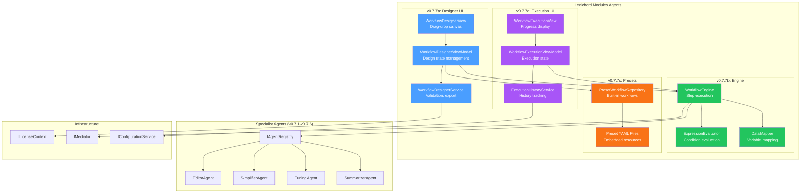
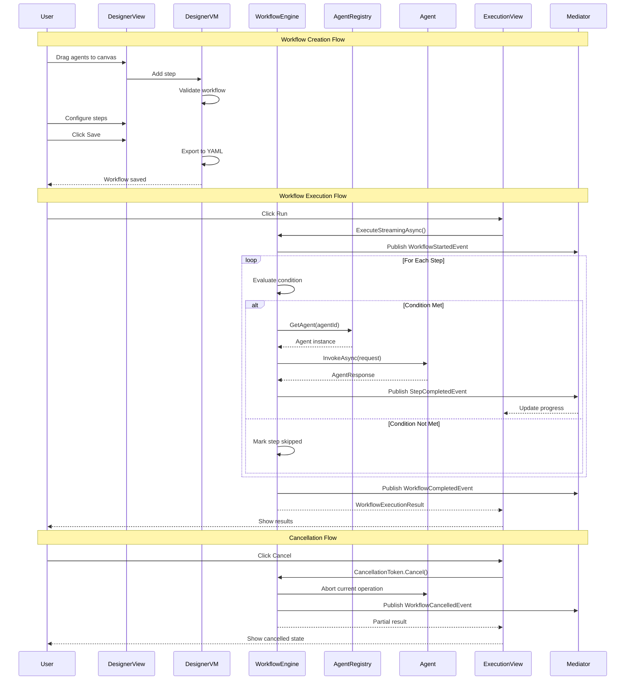

# LCS-SBD-077: Scope Breakdown — Agent Workflows

## Document Control

| Field            | Value                                    |
| :--------------- | :--------------------------------------- |
| **Document ID**  | LCS-SBD-077                              |
| **Version**      | v0.7.7                                   |
| **Codename**     | Agent Workflows (Orchestration Lite)     |
| **Status**       | Draft                                    |
| **Last Updated** | 2026-01-27                               |
| **Owner**        | Lead Architect                           |
| **Depends On**   | v0.7.1 (Agent Registry), v0.7.2 (Context Assembler), v0.7.3 (Editor Agent), v0.7.4 (Simplifier Agent), v0.7.5 (Tuning Agent), v0.7.6 (Summarizer Agent) |

---

## 1. Executive Summary

### 1.1 The Vision

**v0.7.7** delivers **Agent Workflows** — the ability to chain multiple specialized agents into reusable, shareable pipelines for complex document processing. This release transforms Lexichord from a collection of individual agents into an orchestration platform where users can compose custom "Recipes" that combine Simplify, Tune, Edit, and Summarize operations into automated workflows.

The Agent Workflows feature represents "Orchestration Lite" — a powerful yet accessible approach to multi-agent coordination. Users can visually design workflows using a drag-and-drop builder, execute them with real-time progress tracking, and share successful recipes with their team. Pre-built workflows like "Technical Review" and "Marketing Polish" provide immediate value while demonstrating the system's capabilities.

### 1.2 Business Value

- **Productivity Multiplier:** Chain multiple agents into single-click workflows, reducing repetitive manual agent invocations by 70%+.
- **Consistency:** Ensure documents pass through the same quality gates every time via standardized team workflows.
- **Knowledge Capture:** Encode expert document processing sequences into shareable, reusable recipes.
- **Reduced Cognitive Load:** Users focus on content while workflows handle the quality pipeline automatically.
- **Team Collaboration:** Share proven workflows across teams, establishing organizational best practices.
- **Foundation:** Establishes orchestration patterns for future advanced automation features.

### 1.3 Success Criteria

This release succeeds when:

1. Users can create custom workflows via drag-and-drop UI with at least 3 agent steps.
2. Workflows execute sequentially, passing outputs from one agent to the next.
3. Workflow execution displays real-time progress with step-by-step status updates.
4. Users can cancel running workflows at any point with graceful cleanup.
5. Pre-built workflows ("Technical Review", "Marketing Polish") are available out-of-the-box.
6. All workflow features respect license gating (Teams+ for workflow creation).

### 1.4 License Gating

The Agent Workflows feature is a **Teams** feature. Lower tiers will see:

- Read-only access to preset workflows (cannot create custom workflows)
- "Upgrade to Teams" prompt when attempting to create or edit workflows
- Workflow Designer UI disabled with upgrade tooltip
- Can execute pre-built workflows with WriterPro tier (limited to 3 runs/day)

---

## 2. Dependencies on Prior Versions

| Component                    | Source Version | Usage in v0.7.7                              |
| :--------------------------- | :------------- | :------------------------------------------- |
| `IAgent`                     | v0.6.6a        | Base interface for all workflow agents       |
| `IAgentRegistry`             | v0.7.1b        | Agent discovery and instantiation            |
| `AgentConfiguration`         | v0.7.1a        | Agent metadata for workflow steps            |
| `AgentPersona`               | v0.7.1a        | Persona selection per workflow step          |
| `IContextOrchestrator`       | v0.7.2c        | Context assembly between workflow steps      |
| `EditorAgent`                | v0.7.3b        | Built-in agent for editing workflows         |
| `SimplifierAgent`            | v0.7.4b        | Built-in agent for simplification workflows  |
| `TuningAgent`                | v0.7.5b        | Built-in agent for style tuning workflows    |
| `SummarizerAgent`            | v0.7.6b        | Built-in agent for summarization workflows   |
| `IChatCompletionService`     | v0.6.1a        | LLM communication for agent execution        |
| `IPromptRenderer`            | v0.6.3b        | Template rendering for workflow prompts      |
| `ILicenseContext`            | v0.0.4c        | Feature gating for Teams tier                |
| `IMediator`                  | v0.0.7a        | Event publishing for workflow status         |
| `IConfigurationService`      | v0.0.3d        | Workflow configuration storage               |
| `IRobustFileSystemWatcher`   | v0.1.2b        | Hot-reload for workflow definitions          |
| `IEditorService`             | v0.1.3a        | Document access during workflow execution    |
| `Serilog`                    | v0.0.3b        | Logging workflow operations                  |

---

## 3. Sub-Part Specifications

### 3.1 v0.7.7a: Workflow Designer UI

| Field            | Value                                     |
| :--------------- | :---------------------------------------- |
| **Sub-Part ID**  | AGT-077a                                  |
| **Title**        | Workflow Designer UI                      |
| **Module**       | `Lexichord.Modules.Agents`                |
| **License Tier** | Teams                                     |

**Goal:** Create a visual drag-and-drop workflow builder that enables users to compose multi-agent pipelines without code.

**Key Deliverables:**

- `WorkflowDesignerView.axaml` with drag-and-drop canvas
- `WorkflowDesignerViewModel` with `ObservableCollection<WorkflowStepViewModel>`
- Agent palette panel with available agents as draggable items
- Step configuration panel for per-step settings
- Visual connectors between workflow steps
- Workflow validation with error highlighting
- Save/Load workflow functionality
- Export workflow to YAML
- Unit tests for workflow validation logic

**Key Interfaces:**

```csharp
namespace Lexichord.Modules.Agents.Workflows;

/// <summary>
/// Represents a workflow definition that can be edited in the designer.
/// </summary>
public record WorkflowDefinition(
    string WorkflowId,
    string Name,
    string Description,
    string? IconName,
    IReadOnlyList<WorkflowStepDefinition> Steps,
    WorkflowMetadata Metadata
);

/// <summary>
/// Represents a single step in a workflow definition.
/// </summary>
public record WorkflowStepDefinition(
    string StepId,
    string AgentId,
    string? PersonaId,
    string? PromptOverride,
    int Order,
    WorkflowStepCondition? Condition,
    IReadOnlyDictionary<string, string>? InputMappings,
    IReadOnlyDictionary<string, string>? OutputMappings
);

/// <summary>
/// Condition that determines whether a workflow step should execute.
/// </summary>
public record WorkflowStepCondition(
    string Expression,
    ConditionType Type = ConditionType.Expression
);

/// <summary>
/// Types of conditions supported in workflow steps.
/// </summary>
public enum ConditionType
{
    Expression,      // e.g., "violations.Count > 0"
    PreviousSuccess, // Execute only if previous step succeeded
    PreviousFailed,  // Execute only if previous step failed
    Always           // Always execute
}

/// <summary>
/// Metadata about a workflow definition.
/// </summary>
public record WorkflowMetadata(
    string Author,
    DateTime CreatedAt,
    DateTime ModifiedAt,
    string? Version,
    IReadOnlyList<string> Tags,
    WorkflowCategory Category,
    bool IsBuiltIn,
    LicenseTier RequiredTier
);

/// <summary>
/// Categories for organizing workflows.
/// </summary>
public enum WorkflowCategory
{
    General,
    Technical,
    Marketing,
    Academic,
    Legal,
    Custom
}

/// <summary>
/// Service for managing workflow definitions in the designer.
/// </summary>
public interface IWorkflowDesignerService
{
    /// <summary>
    /// Creates a new empty workflow definition.
    /// </summary>
    WorkflowDefinition CreateNew(string name);

    /// <summary>
    /// Validates a workflow definition and returns any errors.
    /// </summary>
    WorkflowValidationResult Validate(WorkflowDefinition workflow);

    /// <summary>
    /// Saves a workflow definition to storage.
    /// </summary>
    Task SaveAsync(WorkflowDefinition workflow, CancellationToken ct = default);

    /// <summary>
    /// Exports a workflow definition to YAML format.
    /// </summary>
    string ExportToYaml(WorkflowDefinition workflow);

    /// <summary>
    /// Imports a workflow definition from YAML format.
    /// </summary>
    WorkflowDefinition ImportFromYaml(string yaml);
}

/// <summary>
/// Result of workflow validation.
/// </summary>
public record WorkflowValidationResult(
    bool IsValid,
    IReadOnlyList<WorkflowValidationError> Errors,
    IReadOnlyList<WorkflowValidationWarning> Warnings
);

/// <summary>
/// A validation error in a workflow definition.
/// </summary>
public record WorkflowValidationError(
    string StepId,
    string Code,
    string Message
);

/// <summary>
/// A validation warning in a workflow definition.
/// </summary>
public record WorkflowValidationWarning(
    string? StepId,
    string Code,
    string Message
);
```

**Key UI Components:**

```text
+------------------------------------------------------------------------------+
|  Workflow Designer                                           [Save] [Run]    |
+------------------------------------------------------------------------------+
| +------------------+ +----------------------------------------------------+ |
| | AGENTS           | |                    CANVAS                          | |
| |------------------| |                                                    | |
| | [drag] Editor    | |  +------------+     +------------+     +--------+  | |
| | [drag] Simplifier| |  |  Step 1    |---->|  Step 2    |---->| Step 3 |  | |
| | [drag] Tuning    | |  |  Editor    |     | Simplifier |     | Tuning |  | |
| | [drag] Summarizer| |  +------------+     +------------+     +--------+  | |
| | [drag] Co-pilot  | |                                                    | |
| |                  | |                                                    | |
| | PRESETS          | |                                                    | |
| |------------------| |                                                    | |
| | Technical Review | |                                                    | |
| | Marketing Polish | |                                                    | |
| | Quick Edit       | |                                                    | |
| +------------------+ +----------------------------------------------------+ |
+------------------------------------------------------------------------------+
| STEP CONFIGURATION: Editor (Step 1)                                          |
| +--------------------------------------------------------------------------+ |
| | Persona: [Strict Editor     v]   Temperature: [0.3        ]              | |
| | Prompt Override: [Review for grammar and clarity issues            ]     | |
| | Condition: [Always execute  v]                                           | |
| +--------------------------------------------------------------------------+ |
+------------------------------------------------------------------------------+
| Validation: [checkmark] Workflow is valid and ready to run                   |
+------------------------------------------------------------------------------+
```

**Drag-and-Drop Behavior:**

```text
DRAG AGENT TO CANVAS:
├── User drags agent from palette
├── Canvas shows drop zone indicator
├── On drop:
│   ├── Create new WorkflowStepViewModel
│   ├── Add to Steps collection
│   ├── Auto-connect to previous step
│   └── Open step configuration panel
│
REORDER STEPS:
├── User drags existing step
├── Show insertion indicator between steps
├── On drop: Reorder Steps collection
│
DELETE STEP:
├── User drags step to trash zone OR presses Delete
├── Show confirmation for steps with custom config
├── Remove from Steps collection
└── Reconnect adjacent steps
```

**Storage Location:**

- Windows: `%APPDATA%/Lexichord/workflows/[workflow-id].yaml`
- macOS: `~/Library/Application Support/Lexichord/workflows/[workflow-id].yaml`
- Linux: `~/.config/Lexichord/workflows/[workflow-id].yaml`

**Dependencies:**

- v0.7.1b: `IAgentRegistry` (available agents for palette)
- v0.7.1a: `AgentConfiguration` (agent metadata display)
- v0.0.4c: `ILicenseContext` (Teams tier gating)

---

### 3.2 v0.7.7b: Workflow Engine

| Field            | Value                                     |
| :--------------- | :---------------------------------------- |
| **Sub-Part ID**  | AGT-077b                                  |
| **Title**        | Workflow Engine                           |
| **Module**       | `Lexichord.Modules.Agents`                |
| **License Tier** | Teams                                     |

**Goal:** Implement the core workflow execution engine that orchestrates sequential agent execution with data passing between steps.

**Key Deliverables:**

- `IWorkflowEngine` interface for workflow execution
- `WorkflowEngine` implementation with step-by-step execution
- `IExpressionEvaluator` for conditional step evaluation
- Data mapping between workflow steps
- Cancellation support with graceful cleanup
- Token usage aggregation across steps
- Workflow execution result model
- Unit tests for engine logic

**Key Interfaces:**

```csharp
namespace Lexichord.Modules.Agents.Workflows;

/// <summary>
/// Engine for executing agent workflows.
/// </summary>
public interface IWorkflowEngine
{
    /// <summary>
    /// Executes a workflow and returns the complete result.
    /// </summary>
    Task<WorkflowExecutionResult> ExecuteAsync(
        WorkflowDefinition workflow,
        WorkflowExecutionContext context,
        CancellationToken ct = default);

    /// <summary>
    /// Executes a workflow with streaming step results.
    /// </summary>
    IAsyncEnumerable<WorkflowStepExecutionResult> ExecuteStreamingAsync(
        WorkflowDefinition workflow,
        WorkflowExecutionContext context,
        CancellationToken ct = default);

    /// <summary>
    /// Validates that a workflow can be executed in the current context.
    /// </summary>
    WorkflowExecutionValidation ValidateExecution(
        WorkflowDefinition workflow,
        WorkflowExecutionContext context);
}

/// <summary>
/// Context provided to a workflow execution.
/// </summary>
public record WorkflowExecutionContext(
    string? DocumentPath,
    string? Selection,
    IReadOnlyDictionary<string, object> InitialVariables,
    WorkflowExecutionOptions Options
);

/// <summary>
/// Options controlling workflow execution behavior.
/// </summary>
public record WorkflowExecutionOptions(
    bool StopOnFirstFailure = true,
    bool CollectIntermediateOutputs = true,
    TimeSpan? StepTimeout = null,
    int MaxRetries = 0
);

/// <summary>
/// Result of a complete workflow execution.
/// </summary>
public record WorkflowExecutionResult(
    string WorkflowId,
    string ExecutionId,
    bool Success,
    WorkflowExecutionStatus Status,
    IReadOnlyList<WorkflowStepExecutionResult> StepResults,
    string? FinalOutput,
    TimeSpan TotalDuration,
    WorkflowUsageMetrics TotalUsage,
    IReadOnlyDictionary<string, object> FinalVariables,
    string? ErrorMessage
);

/// <summary>
/// Status of a workflow execution.
/// </summary>
public enum WorkflowExecutionStatus
{
    Pending,
    Running,
    Completed,
    Failed,
    Cancelled,
    PartialSuccess
}

/// <summary>
/// Result of a single workflow step execution.
/// </summary>
public record WorkflowStepExecutionResult(
    string StepId,
    string AgentId,
    bool Success,
    WorkflowStepStatus Status,
    string? Output,
    TimeSpan Duration,
    AgentUsageMetrics Usage,
    string? ErrorMessage,
    IReadOnlyDictionary<string, object>? OutputVariables
);

/// <summary>
/// Status of a workflow step.
/// </summary>
public enum WorkflowStepStatus
{
    Pending,
    Running,
    Completed,
    Failed,
    Skipped,
    Cancelled
}

/// <summary>
/// Aggregated usage metrics for a workflow execution.
/// </summary>
public record WorkflowUsageMetrics(
    int TotalPromptTokens,
    int TotalCompletionTokens,
    int TotalTokens,
    decimal EstimatedCost,
    int StepsExecuted,
    int StepsSkipped
);

/// <summary>
/// Usage metrics for a single agent invocation.
/// </summary>
public record AgentUsageMetrics(
    int PromptTokens,
    int CompletionTokens,
    int TotalTokens,
    decimal EstimatedCost
);

/// <summary>
/// Evaluates conditional expressions for workflow step conditions.
/// </summary>
public interface IExpressionEvaluator
{
    /// <summary>
    /// Evaluates an expression against the current variable context.
    /// </summary>
    T Evaluate<T>(string expression, IReadOnlyDictionary<string, object> variables);

    /// <summary>
    /// Validates that an expression is syntactically correct.
    /// </summary>
    bool IsValid(string expression, out string? errorMessage);
}

/// <summary>
/// Validation result for workflow execution readiness.
/// </summary>
public record WorkflowExecutionValidation(
    bool CanExecute,
    IReadOnlyList<string> Errors,
    IReadOnlyList<string> Warnings
);
```

**Execution Flow:**

```text
WORKFLOW EXECUTION:
│
├── 1. Validate workflow definition
│   ├── Check all agents exist in registry
│   ├── Validate step conditions are parseable
│   └── Return errors if invalid
│
├── 2. Initialize execution context
│   ├── Create execution ID
│   ├── Copy initial variables
│   ├── Start timing
│   └── Publish WorkflowStartedEvent
│
├── 3. FOR EACH step in workflow.Steps:
│   │
│   ├── 3.1 Evaluate step condition
│   │   ├── Parse condition expression
│   │   ├── Evaluate against current variables
│   │   └── IF false → Mark step as Skipped, continue
│   │
│   ├── 3.2 Get agent from registry
│   │   ├── Resolve AgentId
│   │   ├── Apply PersonaId if specified
│   │   └── Throw if agent not found
│   │
│   ├── 3.3 Build agent request
│   │   ├── Apply input mappings from variables
│   │   ├── Apply prompt override if specified
│   │   └── Include document context
│   │
│   ├── 3.4 Execute agent
│   │   ├── Start step timing
│   │   ├── Invoke agent with request
│   │   ├── Capture output and usage
│   │   └── Handle timeouts/errors
│   │
│   ├── 3.5 Process step result
│   │   ├── Apply output mappings to variables
│   │   ├── Add step result to collection
│   │   ├── Publish WorkflowStepCompletedEvent
│   │   └── IF failed AND StopOnFirstFailure → Break
│   │
│   └── 3.6 Pass output to next step
│       └── Set previous output as "input" variable
│
├── 4. Aggregate results
│   ├── Calculate total duration
│   ├── Sum usage metrics
│   ├── Determine overall success
│   └── Capture final output
│
└── 5. Publish WorkflowCompletedEvent and return result
```

**Data Mapping Between Steps:**

```text
VARIABLE FLOW:
│
├── Initial Variables (from context)
│   └── { "document": "...", "selection": "..." }
│
├── Step 1 Output → Variables
│   ├── Apply outputMappings: { "edit_result": "$.output" }
│   └── Variables: { "document": "...", "edit_result": "..." }
│
├── Step 2 Input ← Variables
│   ├── Apply inputMappings: { "text": "edit_result" }
│   └── Agent receives text from previous step
│
└── Final Variables
    └── Contains all accumulated outputs
```

**Dependencies:**

- v0.7.1b: `IAgentRegistry` (agent resolution)
- v0.6.6a: `IAgent` (agent invocation)
- v0.0.7a: `IMediator` (event publishing)

---

### 3.3 v0.7.7c: Preset Workflows

| Field            | Value                                     |
| :--------------- | :---------------------------------------- |
| **Sub-Part ID**  | AGT-077c                                  |
| **Title**        | Preset Workflows                          |
| **Module**       | `Lexichord.Modules.Agents`                |
| **License Tier** | WriterPro (execute) / Teams (edit)        |

**Goal:** Provide pre-built, production-ready workflows that demonstrate best practices and deliver immediate value to users.

**Key Deliverables:**

- `technical-review.yaml` workflow definition
- `marketing-polish.yaml` workflow definition
- `quick-edit.yaml` workflow definition
- `academic-review.yaml` workflow definition
- `executive-summary.yaml` workflow definition
- `IPresetWorkflowRepository` for loading built-in workflows
- Embedded resource loading for preset workflows
- Unit tests for preset workflow execution

**Key Interfaces:**

```csharp
namespace Lexichord.Modules.Agents.Workflows;

/// <summary>
/// Repository for accessing preset (built-in) workflows.
/// </summary>
public interface IPresetWorkflowRepository
{
    /// <summary>
    /// Gets all available preset workflows.
    /// </summary>
    IReadOnlyList<WorkflowDefinition> GetAll();

    /// <summary>
    /// Gets a preset workflow by ID.
    /// </summary>
    WorkflowDefinition? GetById(string workflowId);

    /// <summary>
    /// Gets preset workflows by category.
    /// </summary>
    IReadOnlyList<WorkflowDefinition> GetByCategory(WorkflowCategory category);

    /// <summary>
    /// Checks if a workflow ID is a built-in preset.
    /// </summary>
    bool IsPreset(string workflowId);
}
```

**Preset Workflow Definitions:**

```yaml
# workflows/presets/technical-review.yaml
workflow_id: "preset-technical-review"
name: "Technical Review"
description: "Comprehensive technical document review: grammar, clarity, and style compliance"
icon: "file-code"
category: Technical
required_tier: WriterPro
steps:
  - step_id: "edit"
    agent_id: "editor"
    persona_id: "strict"
    order: 1
    prompt_override: |
      Review this technical document for:
      - Grammar and punctuation errors
      - Unclear or ambiguous statements
      - Technical accuracy concerns
      Provide specific suggestions for each issue found.
    output_mappings:
      edit_suggestions: "$.suggestions"

  - step_id: "simplify"
    agent_id: "simplifier"
    order: 2
    prompt_override: |
      Simplify complex technical explanations for a broader audience.
      Maintain technical accuracy while improving readability.
      Target reading level: 10th grade.
    condition:
      expression: "settings.simplify_enabled != false"
      type: Expression

  - step_id: "tune"
    agent_id: "tuning"
    order: 3
    prompt_override: |
      Fix any remaining style guide violations.
      Ensure consistent terminology usage.
    condition:
      expression: "violations.Count > 0"
      type: Expression

  - step_id: "summarize"
    agent_id: "summarizer"
    order: 4
    prompt_override: |
      Generate a technical abstract (150 words max) and
      key points summary for this document.
metadata:
  author: "Lexichord"
  version: "1.0.0"
  tags: ["technical", "documentation", "review"]
  is_built_in: true
```

```yaml
# workflows/presets/marketing-polish.yaml
workflow_id: "preset-marketing-polish"
name: "Marketing Polish"
description: "Transform content into compelling marketing copy with brand voice alignment"
icon: "megaphone"
category: Marketing
required_tier: WriterPro
steps:
  - step_id: "simplify"
    agent_id: "simplifier"
    order: 1
    prompt_override: |
      Simplify this content for a general audience.
      Use active voice and strong action verbs.
      Target reading level: 8th grade.
      Make every sentence count.

  - step_id: "edit"
    agent_id: "editor"
    persona_id: "friendly"
    order: 2
    prompt_override: |
      Polish this marketing content:
      - Ensure punchy, engaging sentences
      - Add compelling calls-to-action
      - Verify brand voice consistency
      - Check for marketing cliches to avoid

  - step_id: "tune"
    agent_id: "tuning"
    order: 3
    prompt_override: |
      Apply marketing style guide rules.
      Ensure consistent brand terminology.
    condition:
      type: PreviousSuccess

  - step_id: "summarize"
    agent_id: "summarizer"
    order: 4
    prompt_override: |
      Generate a tagline (10 words max) and
      three key selling points for this content.
metadata:
  author: "Lexichord"
  version: "1.0.0"
  tags: ["marketing", "copywriting", "brand"]
  is_built_in: true
```

```yaml
# workflows/presets/quick-edit.yaml
workflow_id: "preset-quick-edit"
name: "Quick Edit"
description: "Fast grammar and clarity check for any document"
icon: "zap"
category: General
required_tier: WriterPro
steps:
  - step_id: "edit"
    agent_id: "editor"
    persona_id: "friendly"
    order: 1
    prompt_override: |
      Perform a quick review focusing on:
      - Critical grammar errors
      - Obvious clarity issues
      - Sentence flow problems
      Be efficient - flag only significant issues.
metadata:
  author: "Lexichord"
  version: "1.0.0"
  tags: ["quick", "edit", "grammar"]
  is_built_in: true
```

```yaml
# workflows/presets/academic-review.yaml
workflow_id: "preset-academic-review"
name: "Academic Review"
description: "Scholarly document review with citation and formality checks"
icon: "graduation-cap"
category: Academic
required_tier: Teams
steps:
  - step_id: "edit"
    agent_id: "editor"
    persona_id: "strict"
    order: 1
    prompt_override: |
      Review this academic document for:
      - Grammar and punctuation (formal academic style)
      - Logical argument flow
      - Claim-evidence alignment
      - Citation format consistency

  - step_id: "tune"
    agent_id: "tuning"
    order: 2
    prompt_override: |
      Ensure academic writing style compliance:
      - Formal tone throughout
      - Third-person perspective (unless specified)
      - Hedging language where appropriate
      - Consistent citation style

  - step_id: "summarize"
    agent_id: "summarizer"
    order: 3
    prompt_override: |
      Generate an academic abstract (250 words) with:
      - Research question/objective
      - Methodology summary
      - Key findings
      - Conclusions/implications
metadata:
  author: "Lexichord"
  version: "1.0.0"
  tags: ["academic", "scholarly", "research"]
  is_built_in: true
```

```yaml
# workflows/presets/executive-summary.yaml
workflow_id: "preset-executive-summary"
name: "Executive Summary"
description: "Transform detailed content into executive-ready briefings"
icon: "briefcase"
category: General
required_tier: Teams
steps:
  - step_id: "simplify"
    agent_id: "simplifier"
    order: 1
    prompt_override: |
      Condense this content for executive consumption:
      - Remove technical jargon
      - Focus on business impact
      - Highlight key decisions needed
      Target reading level: 12th grade.

  - step_id: "edit"
    agent_id: "editor"
    persona_id: "strict"
    order: 2
    prompt_override: |
      Ensure executive communication standards:
      - Clear, direct statements
      - Action-oriented language
      - Bottom-line-up-front structure

  - step_id: "summarize"
    agent_id: "summarizer"
    order: 3
    prompt_override: |
      Generate executive summary:
      - Situation (2-3 sentences)
      - Key findings (bullet points)
      - Recommended actions (numbered)
      - Timeline/next steps
      Total length: 1 page maximum
metadata:
  author: "Lexichord"
  version: "1.0.0"
  tags: ["executive", "summary", "business"]
  is_built_in: true
```

**Storage Location (Built-in):**

- Embedded resources: `Lexichord.Modules.Agents/Resources/Workflows/*.yaml`

**Dependencies:**

- v0.7.3b: `EditorAgent` (editing steps)
- v0.7.4b: `SimplifierAgent` (simplification steps)
- v0.7.5b: `TuningAgent` (style tuning steps)
- v0.7.6b: `SummarizerAgent` (summarization steps)

---

### 3.4 v0.7.7d: Workflow Execution UI

| Field            | Value                                     |
| :--------------- | :---------------------------------------- |
| **Sub-Part ID**  | AGT-077d                                  |
| **Title**        | Workflow Execution UI                     |
| **Module**       | `Lexichord.Modules.Agents`                |
| **License Tier** | WriterPro (execute) / Teams (full)        |

**Goal:** Provide a rich execution experience with real-time progress tracking, step-by-step results display, and workflow cancellation capability.

**Key Deliverables:**

- `WorkflowExecutionView.axaml` with progress visualization
- `WorkflowExecutionViewModel` with execution state management
- Real-time step progress indicators
- Step result cards with expandable output
- Cancel button with graceful termination
- Execution history panel
- Workflow result actions (apply, copy, export)
- Unit tests for execution state management

**Key Interfaces:**

```csharp
namespace Lexichord.Modules.Agents.Workflows;

/// <summary>
/// ViewModel for workflow execution UI.
/// </summary>
public interface IWorkflowExecutionViewModel
{
    /// <summary>
    /// The workflow being executed.
    /// </summary>
    WorkflowDefinition Workflow { get; }

    /// <summary>
    /// Current execution status.
    /// </summary>
    WorkflowExecutionStatus Status { get; }

    /// <summary>
    /// Progress percentage (0-100).
    /// </summary>
    int Progress { get; }

    /// <summary>
    /// Currently executing step (if any).
    /// </summary>
    WorkflowStepExecutionState? CurrentStep { get; }

    /// <summary>
    /// All step states for display.
    /// </summary>
    IReadOnlyList<WorkflowStepExecutionState> StepStates { get; }

    /// <summary>
    /// Whether the workflow can be cancelled.
    /// </summary>
    bool CanCancel { get; }

    /// <summary>
    /// Final result after completion.
    /// </summary>
    WorkflowExecutionResult? Result { get; }

    /// <summary>
    /// Starts workflow execution.
    /// </summary>
    Task ExecuteAsync();

    /// <summary>
    /// Cancels the running workflow.
    /// </summary>
    void Cancel();

    /// <summary>
    /// Applies the workflow result to the document.
    /// </summary>
    Task ApplyResultAsync();

    /// <summary>
    /// Copies the workflow result to clipboard.
    /// </summary>
    Task CopyResultAsync();
}

/// <summary>
/// State of a single workflow step for UI display.
/// </summary>
public record WorkflowStepExecutionState(
    string StepId,
    string AgentName,
    string AgentIcon,
    WorkflowStepStatus Status,
    string StatusMessage,
    int? ProgressPercent,
    TimeSpan? Duration,
    string? Output,
    string? ErrorMessage,
    bool IsExpanded
);

/// <summary>
/// Service for tracking workflow execution history.
/// </summary>
public interface IWorkflowExecutionHistoryService
{
    /// <summary>
    /// Records a workflow execution result.
    /// </summary>
    Task RecordAsync(WorkflowExecutionResult result, CancellationToken ct = default);

    /// <summary>
    /// Gets recent execution history for a workflow.
    /// </summary>
    Task<IReadOnlyList<WorkflowExecutionSummary>> GetHistoryAsync(
        string workflowId,
        int limit = 10,
        CancellationToken ct = default);

    /// <summary>
    /// Gets execution statistics for a workflow.
    /// </summary>
    Task<WorkflowExecutionStatistics> GetStatisticsAsync(
        string workflowId,
        CancellationToken ct = default);
}

/// <summary>
/// Summary of a past workflow execution.
/// </summary>
public record WorkflowExecutionSummary(
    string ExecutionId,
    string WorkflowId,
    string WorkflowName,
    DateTime ExecutedAt,
    TimeSpan Duration,
    WorkflowExecutionStatus Status,
    int StepsCompleted,
    int TotalSteps,
    int TotalTokens
);

/// <summary>
/// Aggregated statistics for workflow executions.
/// </summary>
public record WorkflowExecutionStatistics(
    int TotalExecutions,
    int SuccessfulExecutions,
    double SuccessRate,
    TimeSpan AverageDuration,
    int AverageTokensPerExecution,
    DateTime? LastExecuted
);
```

**Key UI Components:**

```text
+------------------------------------------------------------------------------+
|  Running: Technical Review                                    [Cancel]       |
+------------------------------------------------------------------------------+
| Progress: [=================>                          ] 45%                 |
| Elapsed: 00:00:34                                                            |
+------------------------------------------------------------------------------+
| STEPS                                                                        |
+------------------------------------------------------------------------------+
| [checkmark] Step 1: Editor                              Completed (12s)      |
|     > "Found 3 grammar issues and 2 clarity suggestions..."                  |
|       [Expand to see full output]                                            |
+------------------------------------------------------------------------------+
| [spinner] Step 2: Simplifier                            Running...           |
|     > "Analyzing sentence complexity..."                                     |
+------------------------------------------------------------------------------+
| [pending] Step 3: Tuning                                Pending              |
+------------------------------------------------------------------------------+
| [pending] Step 4: Summarizer                            Pending              |
+------------------------------------------------------------------------------+
```

**Execution States Visualization:**

```text
STEP STATUS INDICATORS:
├── Pending:   [ ] Gray circle, "Waiting..."
├── Running:   [spinner] Blue spinner, "Processing..."
├── Completed: [checkmark] Green checkmark, duration shown
├── Skipped:   [skip] Yellow skip icon, "Condition not met"
├── Failed:    [x] Red X, error message shown
└── Cancelled: [stop] Orange stop, "Cancelled by user"

PROGRESS CALCULATION:
├── Total steps = workflow.Steps.Count
├── Completed weight = completed steps
├── Current weight = 0.5 if running
└── Progress = (completed + current) / total * 100
```

**Cancel Flow:**

```text
USER CLICKS CANCEL:
│
├── 1. Set CanCancel = false (prevent double-click)
├── 2. Trigger CancellationToken
├── 3. Update status to "Cancelling..."
├── 4. Wait for current step to complete/abort
│   ├── IF agent supports graceful cancel → Wait for completion
│   └── ELSE → Force timeout after 5 seconds
├── 5. Mark remaining steps as Cancelled
├── 6. Set Status = Cancelled
└── 7. Publish WorkflowCancelledEvent
```

**Dependencies:**

- v0.7.7b: `IWorkflowEngine` (execution)
- v0.1.3a: `IEditorService` (apply results)
- v0.0.7a: `IMediator` (events)

---

## 4. Implementation Checklist

| #  | Sub-Part | Task                                                    | Est. Hours |
| :- | :------- | :------------------------------------------------------ | :--------- |
| 1  | v0.7.7a  | Create `WorkflowDefinition` and related records         | 2          |
| 2  | v0.7.7a  | Implement `IWorkflowDesignerService`                    | 3          |
| 3  | v0.7.7a  | Create `WorkflowDesignerView.axaml` canvas              | 4          |
| 4  | v0.7.7a  | Implement drag-and-drop agent palette                   | 3          |
| 5  | v0.7.7a  | Create step configuration panel                         | 2          |
| 6  | v0.7.7a  | Implement visual connectors between steps               | 2          |
| 7  | v0.7.7a  | Add workflow validation logic                           | 2          |
| 8  | v0.7.7a  | Implement YAML export/import                            | 2          |
| 9  | v0.7.7a  | Unit tests for designer service                         | 2          |
| 10 | v0.7.7b  | Create `IWorkflowEngine` interface                      | 1          |
| 11 | v0.7.7b  | Implement `WorkflowEngine` core execution               | 4          |
| 12 | v0.7.7b  | Implement `IExpressionEvaluator`                        | 2          |
| 13 | v0.7.7b  | Add data mapping between steps                          | 2          |
| 14 | v0.7.7b  | Implement cancellation support                          | 2          |
| 15 | v0.7.7b  | Add token usage aggregation                             | 1          |
| 16 | v0.7.7b  | Implement streaming execution                           | 2          |
| 17 | v0.7.7b  | Unit tests for workflow engine                          | 3          |
| 18 | v0.7.7c  | Create `technical-review.yaml` preset                   | 1          |
| 19 | v0.7.7c  | Create `marketing-polish.yaml` preset                   | 1          |
| 20 | v0.7.7c  | Create `quick-edit.yaml` preset                         | 0.5        |
| 21 | v0.7.7c  | Create `academic-review.yaml` preset                    | 1          |
| 22 | v0.7.7c  | Create `executive-summary.yaml` preset                  | 1          |
| 23 | v0.7.7c  | Implement `IPresetWorkflowRepository`                   | 2          |
| 24 | v0.7.7c  | Configure embedded resource loading                     | 1          |
| 25 | v0.7.7c  | Unit tests for preset workflows                         | 2          |
| 26 | v0.7.7d  | Create `WorkflowExecutionView.axaml`                    | 3          |
| 27 | v0.7.7d  | Implement `WorkflowExecutionViewModel`                  | 3          |
| 28 | v0.7.7d  | Create step progress indicators                         | 2          |
| 29 | v0.7.7d  | Implement step result cards                             | 2          |
| 30 | v0.7.7d  | Add cancel button with graceful termination             | 1.5        |
| 31 | v0.7.7d  | Implement execution history service                     | 2          |
| 32 | v0.7.7d  | Add result actions (apply, copy, export)                | 1.5        |
| 33 | v0.7.7d  | Unit tests for execution ViewModel                      | 2          |
| 34 | All      | Integration tests for full workflow execution           | 3          |
| 35 | All      | DI registration in AgentsModule.cs                      | 1          |
| 36 | All      | MediatR event handlers for workflow events              | 1.5        |
| **Total** |   |                                                         | **68 hours** |

---

## 5. Dependency Matrix

### 5.1 Required Interfaces (from earlier versions)

| Interface                  | Source Version | Purpose                              |
| :------------------------- | :------------- | :----------------------------------- |
| `IAgent`                   | v0.6.6a        | Base agent interface                 |
| `IAgentRegistry`           | v0.7.1b        | Agent discovery                      |
| `AgentConfiguration`       | v0.7.1a        | Agent metadata                       |
| `AgentPersona`             | v0.7.1a        | Persona configuration                |
| `IContextOrchestrator`     | v0.7.2c        | Context assembly                     |
| `IChatCompletionService`   | v0.6.1a        | LLM communication                    |
| `IPromptRenderer`          | v0.6.3b        | Template rendering                   |
| `ILicenseContext`          | v0.0.4c        | License checking                     |
| `IMediator`                | v0.0.7a        | Event publishing                     |
| `IConfigurationService`    | v0.0.3d        | Configuration storage                |
| `IEditorService`           | v0.1.3a        | Document access                      |

### 5.2 New Interfaces (defined in v0.7.7)

| Interface                           | Defined In | Module           | Purpose                        |
| :---------------------------------- | :--------- | :--------------- | :----------------------------- |
| `IWorkflowEngine`                   | v0.7.7b    | Modules.Agents   | Workflow execution             |
| `IWorkflowDesignerService`          | v0.7.7a    | Modules.Agents   | Designer operations            |
| `IPresetWorkflowRepository`         | v0.7.7c    | Modules.Agents   | Preset workflow access         |
| `IExpressionEvaluator`              | v0.7.7b    | Modules.Agents   | Condition evaluation           |
| `IWorkflowExecutionHistoryService`  | v0.7.7d    | Modules.Agents   | Execution history              |

### 5.3 New Records/DTOs (defined in v0.7.7)

| Record                        | Defined In | Purpose                                |
| :---------------------------- | :--------- | :------------------------------------- |
| `WorkflowDefinition`          | v0.7.7a    | Complete workflow specification        |
| `WorkflowStepDefinition`      | v0.7.7a    | Single step specification              |
| `WorkflowStepCondition`       | v0.7.7a    | Step execution condition               |
| `WorkflowMetadata`            | v0.7.7a    | Workflow metadata                      |
| `WorkflowValidationResult`    | v0.7.7a    | Validation result                      |
| `WorkflowExecutionContext`    | v0.7.7b    | Execution input context                |
| `WorkflowExecutionResult`     | v0.7.7b    | Complete execution result              |
| `WorkflowStepExecutionResult` | v0.7.7b    | Single step result                     |
| `WorkflowUsageMetrics`        | v0.7.7b    | Aggregated token usage                 |
| `WorkflowStepExecutionState`  | v0.7.7d    | UI step state                          |
| `WorkflowExecutionSummary`    | v0.7.7d    | History entry summary                  |
| `WorkflowExecutionStatistics` | v0.7.7d    | Aggregated statistics                  |

### 5.4 NuGet Packages

| Package              | Version | Purpose                        | New/Existing |
| :------------------- | :------ | :----------------------------- | :----------- |
| `YamlDotNet`         | 15.x    | YAML workflow serialization    | Existing     |
| `DynamicExpresso`    | 2.x     | Expression evaluation          | **New**      |
| `CommunityToolkit.Mvvm` | 8.x  | MVVM infrastructure            | Existing     |

---

## 6. Architecture Diagram



---

## 7. Data Flow Diagram



---

## 8. Risks & Mitigations

| Risk | Impact | Probability | Mitigation |
| :--- | :----- | :---------- | :--------- |
| Long-running workflows timeout | High | Medium | Configurable per-step timeouts, graceful timeout handling |
| Agent failure cascades to entire workflow | High | Medium | Configurable `StopOnFirstFailure`, step retry options |
| Complex condition expressions cause errors | Medium | Medium | Expression validation in designer, sandboxed evaluation |
| Large token usage in multi-step workflows | High | Medium | Token budget warnings, usage preview before execution |
| Workflow designer complexity overwhelms users | Medium | Low | Preset workflows as templates, progressive disclosure |
| Cancellation leaves document in inconsistent state | High | Low | Only apply results on explicit user action, preview mode |
| YAML import from untrusted sources | Medium | Low | Schema validation, agent ID allowlist, sandbox execution |

---

## 9. Success Metrics

| Metric | Target | Measurement |
| :----- | :----- | :---------- |
| Workflow creation time | < 5 minutes | Designer session timing |
| Workflow execution success rate | > 90% | Execution history analysis |
| Steps per workflow (average) | 3-5 | Workflow definition analysis |
| Preset workflow adoption | > 50% first-time users | Usage analytics |
| Custom workflow creation (Teams) | > 30% Teams users | License-correlated analytics |
| Workflow cancellation response | < 5 seconds | Cancellation timing |
| Token usage accuracy (estimate vs actual) | < 10% variance | Execution result comparison |

---

## 10. What This Enables

After v0.7.7, Lexichord will support:

- **v0.7.8 (Hardening):** Performance optimization and error handling hardening for workflow execution.
- **v0.8.x (Advanced Orchestration):** Parallel step execution, conditional branching, loops, and sub-workflows.
- **v0.9.x (Workflow Marketplace):** Team and community workflow sharing, workflow versioning.
- **Future:** Event-triggered workflows (on save, on commit), scheduled workflows, external integrations.

---

## 11. Decision Trees

### 11.1 Should Step Execute?

```text
START: "Evaluate step execution condition"
│
├── Step has no condition?
│   └── YES → EXECUTE step
│
├── Condition type = Always?
│   └── YES → EXECUTE step
│
├── Condition type = PreviousSuccess?
│   ├── Previous step succeeded?
│   │   ├── YES → EXECUTE step
│   │   └── NO → SKIP step
│   └── No previous step → EXECUTE step
│
├── Condition type = PreviousFailed?
│   ├── Previous step failed?
│   │   ├── YES → EXECUTE step
│   │   └── NO → SKIP step
│   └── No previous step → SKIP step
│
├── Condition type = Expression?
│   ├── Evaluate expression against variables
│   ├── Result = true?
│   │   ├── YES → EXECUTE step
│   │   └── NO → SKIP step
│   └── Evaluation error → LOG warning, SKIP step
│
└── Unknown condition type → SKIP step with warning
```

### 11.2 Handle Step Failure

```text
START: "Step execution failed"
│
├── StopOnFirstFailure = true?
│   ├── YES → Mark remaining steps as Skipped
│   │         Set workflow status = Failed
│   │         Return partial result
│   └── NO → Continue to next step
│
├── MaxRetries > 0 AND retries < MaxRetries?
│   ├── YES → Increment retry count
│   │         Wait exponential backoff
│   │         Retry step execution
│   └── NO → Proceed with failure handling
│
└── Continue workflow execution
    Mark step as Failed
    Continue to next step
```

---

## 12. User Stories

| ID    | Role            | Story                                                                                | Acceptance Criteria                    |
| :---- | :-------------- | :----------------------------------------------------------------------------------- | :------------------------------------- |
| US-01 | Writer          | As a writer, I want to run a preset workflow so that my document gets reviewed quickly. | Preset workflows execute with one click. |
| US-02 | Writer          | As a writer, I want to see workflow progress so that I know how long to wait. | Progress bar and step status visible during execution. |
| US-03 | Writer          | As a writer, I want to cancel a running workflow so that I can make corrections first. | Cancel stops workflow within 5 seconds. |
| US-04 | Team Lead       | As a team lead, I want to create custom workflows so that my team follows consistent processes. | Custom workflows save and load correctly. |
| US-05 | Team Lead       | As a team lead, I want to share workflows so that the whole team benefits. | Workflows exportable/importable via YAML. |
| US-06 | Content Manager | As a content manager, I want to see workflow history so that I can track quality processes. | Execution history shows past 10 runs. |
| US-07 | Enterprise User | As an enterprise user, I want workflow execution stats so that I can report on process efficiency. | Statistics show success rate and average duration. |

---

## 13. Use Cases

### UC-01: Create Custom Workflow

**Preconditions:**

- User has Teams license
- Workflow Designer is accessible

**Flow:**

1. User opens Workflow Designer from Agents panel.
2. User enters workflow name and description.
3. User drags "Editor" agent from palette to canvas.
4. System creates Step 1 and opens configuration panel.
5. User selects "Strict" persona and enters prompt override.
6. User drags "Simplifier" agent below Step 1.
7. System creates Step 2 and connects to Step 1.
8. User adds condition: "Execute only if previous succeeded."
9. User clicks "Validate" button.
10. System shows "Workflow is valid" message.
11. User clicks "Save" button.
12. System saves workflow to user's workflow library.

**Postconditions:**

- Custom workflow appears in workflow list.
- Workflow can be executed on any document.

---

### UC-02: Execute Preset Workflow

**Preconditions:**

- User has WriterPro license
- Document is open in editor
- Text is selected (optional)

**Flow:**

1. User opens Agents panel.
2. User selects "Workflows" tab.
3. User clicks "Technical Review" preset workflow.
4. System displays workflow preview with steps.
5. User clicks "Run Workflow" button.
6. System opens Execution panel.
7. System starts executing Step 1 (Editor).
8. Progress bar shows 25%.
9. Step 1 completes, results expand below.
10. System starts executing Step 2 (Simplifier).
11. Progress bar shows 50%.
12. Steps 3 and 4 execute similarly.
13. Progress bar reaches 100%.
14. System shows "Workflow Completed" message.
15. User reviews final output.
16. User clicks "Apply to Document" button.
17. System replaces selection/document with workflow output.

**Postconditions:**

- Document updated with workflow results.
- Execution recorded in history.

---

### UC-03: Cancel Running Workflow

**Preconditions:**

- Workflow is currently executing
- At least one step is in progress

**Flow:**

1. User clicks "Cancel" button on execution panel.
2. System disables Cancel button (prevent double-click).
3. System displays "Cancelling..." status.
4. System sends cancellation signal to current agent.
5. Current agent completes or aborts (max 5 seconds).
6. System marks current step as Cancelled.
7. System marks remaining steps as Cancelled.
8. System displays "Workflow Cancelled" message.
9. System shows partial results from completed steps.
10. User can still view/copy completed step outputs.

**Postconditions:**

- Workflow execution stopped.
- Partial results available.
- No changes applied to document.

---

## 14. Unit Testing Requirements

### 14.1 WorkflowEngine Tests

```csharp
[Trait("Category", "Unit")]
[Trait("Version", "v0.7.7b")]
public class WorkflowEngineTests
{
    private readonly Mock<IAgentRegistry> _registryMock;
    private readonly Mock<IExpressionEvaluator> _evaluatorMock;
    private readonly Mock<IMediator> _mediatorMock;
    private readonly WorkflowEngine _sut;

    public WorkflowEngineTests()
    {
        _registryMock = new Mock<IAgentRegistry>();
        _evaluatorMock = new Mock<IExpressionEvaluator>();
        _mediatorMock = new Mock<IMediator>();
        _sut = new WorkflowEngine(_registryMock.Object, _evaluatorMock.Object, _mediatorMock.Object);
    }

    [Fact]
    public async Task ExecuteAsync_SingleStep_InvokesAgentAndReturnsResult()
    {
        // Arrange
        var workflow = CreateSingleStepWorkflow("editor");
        var context = CreateDefaultContext();
        var mockAgent = SetupMockAgent("editor", "Edited output");

        // Act
        var result = await _sut.ExecuteAsync(workflow, context);

        // Assert
        result.Success.Should().BeTrue();
        result.StepResults.Should().HaveCount(1);
        result.StepResults[0].Status.Should().Be(WorkflowStepStatus.Completed);
        result.FinalOutput.Should().Be("Edited output");
    }

    [Fact]
    public async Task ExecuteAsync_MultipleSteps_ExecutesInOrder()
    {
        // Arrange
        var workflow = CreateMultiStepWorkflow("editor", "simplifier", "tuning");
        var context = CreateDefaultContext();
        var executionOrder = new List<string>();
        SetupMockAgentsWithTracking(executionOrder);

        // Act
        var result = await _sut.ExecuteAsync(workflow, context);

        // Assert
        executionOrder.Should().ContainInOrder("editor", "simplifier", "tuning");
        result.StepResults.Should().HaveCount(3);
    }

    [Fact]
    public async Task ExecuteAsync_StepWithFalseCondition_SkipsStep()
    {
        // Arrange
        var workflow = CreateWorkflowWithConditionalStep(conditionResult: false);
        var context = CreateDefaultContext();
        _evaluatorMock.Setup(e => e.Evaluate<bool>(It.IsAny<string>(), It.IsAny<IReadOnlyDictionary<string, object>>()))
            .Returns(false);

        // Act
        var result = await _sut.ExecuteAsync(workflow, context);

        // Assert
        result.StepResults.Should().Contain(s => s.Status == WorkflowStepStatus.Skipped);
    }

    [Fact]
    public async Task ExecuteAsync_StepFails_StopsOnFirstFailure()
    {
        // Arrange
        var workflow = CreateMultiStepWorkflow("editor", "simplifier");
        var context = CreateDefaultContext();
        SetupMockAgentToFail("editor");

        // Act
        var result = await _sut.ExecuteAsync(workflow, context);

        // Assert
        result.Success.Should().BeFalse();
        result.Status.Should().Be(WorkflowExecutionStatus.Failed);
        result.StepResults[0].Status.Should().Be(WorkflowStepStatus.Failed);
        result.StepResults[1].Status.Should().Be(WorkflowStepStatus.Skipped);
    }

    [Fact]
    public async Task ExecuteAsync_Cancellation_StopsGracefully()
    {
        // Arrange
        var workflow = CreateMultiStepWorkflow("editor", "simplifier");
        var context = CreateDefaultContext();
        var cts = new CancellationTokenSource();
        SetupSlowMockAgent("editor", () => cts.Cancel());

        // Act
        var result = await _sut.ExecuteAsync(workflow, context, cts.Token);

        // Assert
        result.Status.Should().Be(WorkflowExecutionStatus.Cancelled);
    }

    [Fact]
    public async Task ExecuteAsync_AggregatesTokenUsage()
    {
        // Arrange
        var workflow = CreateMultiStepWorkflow("editor", "simplifier");
        var context = CreateDefaultContext();
        SetupMockAgentWithUsage("editor", promptTokens: 100, completionTokens: 50);
        SetupMockAgentWithUsage("simplifier", promptTokens: 150, completionTokens: 75);

        // Act
        var result = await _sut.ExecuteAsync(workflow, context);

        // Assert
        result.TotalUsage.TotalPromptTokens.Should().Be(250);
        result.TotalUsage.TotalCompletionTokens.Should().Be(125);
        result.TotalUsage.TotalTokens.Should().Be(375);
    }
}
```

### 14.2 WorkflowDesignerService Tests

```csharp
[Trait("Category", "Unit")]
[Trait("Version", "v0.7.7a")]
public class WorkflowDesignerServiceTests
{
    private readonly WorkflowDesignerService _sut;

    public WorkflowDesignerServiceTests()
    {
        _sut = new WorkflowDesignerService();
    }

    [Fact]
    public void Validate_EmptyWorkflow_ReturnsError()
    {
        // Arrange
        var workflow = new WorkflowDefinition("test", "Test", "", null, new List<WorkflowStepDefinition>(), CreateMetadata());

        // Act
        var result = _sut.Validate(workflow);

        // Assert
        result.IsValid.Should().BeFalse();
        result.Errors.Should().Contain(e => e.Code == "EMPTY_WORKFLOW");
    }

    [Fact]
    public void Validate_ValidWorkflow_ReturnsValid()
    {
        // Arrange
        var workflow = CreateValidWorkflow();

        // Act
        var result = _sut.Validate(workflow);

        // Assert
        result.IsValid.Should().BeTrue();
        result.Errors.Should().BeEmpty();
    }

    [Fact]
    public void Validate_UnknownAgentId_ReturnsError()
    {
        // Arrange
        var workflow = CreateWorkflowWithAgent("unknown-agent");

        // Act
        var result = _sut.Validate(workflow);

        // Assert
        result.IsValid.Should().BeFalse();
        result.Errors.Should().Contain(e => e.Code == "UNKNOWN_AGENT");
    }

    [Fact]
    public void ExportToYaml_ValidWorkflow_ProducesValidYaml()
    {
        // Arrange
        var workflow = CreateValidWorkflow();

        // Act
        var yaml = _sut.ExportToYaml(workflow);

        // Assert
        yaml.Should().Contain("workflow_id:");
        yaml.Should().Contain("steps:");
    }

    [Fact]
    public void ImportFromYaml_ValidYaml_ProducesWorkflow()
    {
        // Arrange
        var yaml = CreateValidWorkflowYaml();

        // Act
        var workflow = _sut.ImportFromYaml(yaml);

        // Assert
        workflow.Should().NotBeNull();
        workflow.Steps.Should().NotBeEmpty();
    }
}
```

---

## 15. Observability & Logging

| Level   | Source           | Message Template                                                    |
| :------ | :--------------- | :------------------------------------------------------------------ |
| Debug   | WorkflowEngine   | `Workflow {WorkflowId} starting with {StepCount} steps`             |
| Debug   | WorkflowEngine   | `Step {StepId} ({AgentId}) condition evaluated: {Result}`           |
| Info    | WorkflowEngine   | `Workflow {WorkflowId} completed in {DurationMs}ms with status {Status}` |
| Info    | WorkflowEngine   | `Step {StepId} completed: {TokensUsed} tokens, {DurationMs}ms`      |
| Warning | WorkflowEngine   | `Step {StepId} condition evaluation failed: {Error}`                |
| Warning | WorkflowEngine   | `Workflow {WorkflowId} cancelled by user`                           |
| Error   | WorkflowEngine   | `Step {StepId} failed: {Error}`                                     |
| Error   | WorkflowEngine   | `Workflow {WorkflowId} failed: {Error}`                             |
| Debug   | Designer         | `Workflow {WorkflowId} validation: {IsValid}`                       |
| Info    | Designer         | `Workflow {WorkflowId} saved by user`                               |
| Debug   | PresetRepository | `Loaded {Count} preset workflows from embedded resources`           |

---

## 16. UI/UX Specifications

### 16.1 Workflow Designer Layout

```text
+------------------------------------------------------------------------------+
|  WORKFLOW DESIGNER                                                           |
+------------------------------------------------------------------------------+
| [<- Back] [New Workflow v] [Import]              [Validate] [Save] [Run >]   |
+------------------------------------------------------------------------------+
| +------------------+ +------------------------------------------------------+|
| | AGENT PALETTE    | | WORKFLOW: "My Technical Review"                      ||
| |------------------| | Description: [Custom technical doc review     ]      ||
| | SPECIALISTS      | +------------------------------------------------------+|
| | [icon] Editor    | |                                                      ||
| | [icon] Simplifier| |  +------------+                                      ||
| | [icon] Tuning    | |  |   START    |                                      ||
| | [icon] Summarizer| |  +-----+------+                                      ||
| |                  | |        |                                             ||
| | CO-PILOT         | |        v                                             ||
| | [icon] Co-pilot  | |  +------------+     +------------+     +----------+  ||
| |                  | |  | 1. Editor  |---->| 2.Simplify |---->| 3. Tune  |  ||
| | PRESETS          | |  | [Strict]   |     | [Default]  |     | [Default]|  ||
| |------------------| |  +------------+     +------------+     +----------+  ||
| | [+] Tech Review  | |        |                  |                 |        ||
| | [+] Mktg Polish  | |        v                  v                 v        ||
| | [+] Quick Edit   | |  [Edit config]      [Edit config]     [Edit config]  ||
| +------------------| |                                                      ||
|                    | |  +------------+                                      ||
|                    | |  |    END     |                                      ||
|                    | |  +------------+                                      ||
+------------------------------------------------------------------------------+
| STEP CONFIGURATION                                                           |
+------------------------------------------------------------------------------+
| Selected: Step 1 - Editor                                      [Delete Step] |
| +--------------------------------------------------------------------------+ |
| | Agent: Editor [v]        Persona: [Strict         v]                     | |
| | Prompt Override:                                                         | |
| | +----------------------------------------------------------------------+ | |
| | | Review this technical document for grammar, clarity, and accuracy.   | | |
| | | Focus on technical terminology consistency.                          | | |
| | +----------------------------------------------------------------------+ | |
| | Condition: [Always execute v]  Expression: [                        ]    | |
| +--------------------------------------------------------------------------+ |
+------------------------------------------------------------------------------+
| STATUS: [checkmark] Workflow valid | 3 steps | Est. ~1500 tokens             |
+------------------------------------------------------------------------------+
```

### 16.2 Workflow Execution Panel

```text
+------------------------------------------------------------------------------+
|  EXECUTING WORKFLOW: Technical Review                          [Cancel]      |
+------------------------------------------------------------------------------+
| Progress: [========================>                    ] 60%                |
| Elapsed: 00:00:45 | Estimated remaining: 00:00:30                            |
+------------------------------------------------------------------------------+
| EXECUTION STEPS                                                              |
+------------------------------------------------------------------------------+
| [checkmark] STEP 1: Editor (Strict)                                          |
|     Status: Completed | Duration: 12.3s | Tokens: 523                        |
|     +------------------------------------------------------------------------+
|     | Found 3 issues:                                                        |
|     | - Line 15: Subject-verb agreement error                                |
|     | - Line 42: Unclear antecedent for "it"                                 |
|     | - Line 67: Inconsistent use of "data" (singular vs plural)             |
|     |                                                       [Expand v]       |
|     +------------------------------------------------------------------------+
+------------------------------------------------------------------------------+
| [spinner] STEP 2: Simplifier (Default)                                       |
|     Status: Running... | Processing paragraph 3 of 7                         |
|     +------------------------------------------------------------------------+
|     | Analyzing sentence complexity...                                       |
|     +------------------------------------------------------------------------+
+------------------------------------------------------------------------------+
| [clock] STEP 3: Tuning (Default)                                             |
|     Status: Pending | Waiting for previous step                              |
+------------------------------------------------------------------------------+
| [clock] STEP 4: Summarizer (Default)                                         |
|     Status: Pending | Waiting for previous step                              |
+------------------------------------------------------------------------------+
```

### 16.3 Component Styling Requirements

| Component               | Theme Resource             | Notes                            |
| :---------------------- | :------------------------- | :------------------------------- |
| Designer Canvas         | `Brush.Surface.Secondary`  | Grid background pattern          |
| Step Card               | `Brush.Surface.Primary`    | Elevated with shadow             |
| Step Card (Selected)    | `Brush.Accent.Light`       | Blue highlight border            |
| Step Card (Error)       | `Brush.Danger.Light`       | Red highlight border             |
| Connector Line          | `Brush.Text.Tertiary`      | Dashed when pending              |
| Connector Arrow         | `Brush.Accent.Primary`     | Solid arrow head                 |
| Progress Bar            | `Brush.Accent.Primary`     | Animated fill                    |
| Status: Completed       | `Brush.Success.Primary`    | Green checkmark                  |
| Status: Running         | `Brush.Accent.Primary`     | Blue spinner                     |
| Status: Failed          | `Brush.Danger.Primary`     | Red X                            |
| Status: Skipped         | `Brush.Warning.Primary`    | Yellow skip icon                 |
| Status: Pending         | `Brush.Text.Tertiary`      | Gray clock                       |

---

## 17. Acceptance Criteria (QA)

| #   | Category            | Criterion                                                                    |
| :-- | :------------------ | :--------------------------------------------------------------------------- |
| 1   | **[Designer]**      | User can drag agents from palette to canvas to create steps.                 |
| 2   | **[Designer]**      | Steps can be reordered by dragging within canvas.                            |
| 3   | **[Designer]**      | Step configuration panel opens when step is selected.                        |
| 4   | **[Designer]**      | Workflow validation shows errors for invalid configurations.                 |
| 5   | **[Designer]**      | Workflow saves to YAML and loads correctly.                                  |
| 6   | **[Engine]**        | Workflow executes steps in defined order.                                    |
| 7   | **[Engine]**        | Step conditions are evaluated correctly (skip when false).                   |
| 8   | **[Engine]**        | Data passes between steps via variable mappings.                             |
| 9   | **[Engine]**        | Workflow stops on first failure when configured.                             |
| 10  | **[Engine]**        | Cancellation stops workflow within 5 seconds.                                |
| 11  | **[Presets]**       | "Technical Review" preset is available and executes correctly.               |
| 12  | **[Presets]**       | "Marketing Polish" preset is available and executes correctly.               |
| 13  | **[Execution UI]**  | Progress bar updates in real-time during execution.                          |
| 14  | **[Execution UI]**  | Step results display as each step completes.                                 |
| 15  | **[Execution UI]**  | Cancel button stops execution and shows partial results.                     |
| 16  | **[License Gate]**  | WriterPro can execute presets (limited runs).                                |
| 17  | **[License Gate]**  | Teams can create custom workflows.                                           |
| 18  | **[License Gate]**  | Core users see upgrade prompt when accessing workflows.                      |
| 19  | **[History]**       | Execution history shows last 10 workflow runs.                               |
| 20  | **[Accessibility]** | All interactive elements are keyboard navigable.                             |

---

## 18. Verification Commands

```bash
# ===============================================================================
# v0.7.7 Verification
# ===============================================================================

# 1. Verify NuGet packages installed
dotnet list src/Lexichord.Modules.Agents package | grep -E "YamlDotNet|DynamicExpresso"

# 2. Build solution
dotnet build

# 3. Run unit tests for v0.7.7 components
dotnet test --filter "Category=Unit&Version~v0.7.7"

# 4. Run v0.7.7a Designer tests
dotnet test --filter "FullyQualifiedName~WorkflowDesigner"

# 5. Run v0.7.7b Engine tests
dotnet test --filter "FullyQualifiedName~WorkflowEngine"

# 6. Run v0.7.7c Preset tests
dotnet test --filter "FullyQualifiedName~PresetWorkflow"

# 7. Run v0.7.7d Execution UI tests
dotnet test --filter "FullyQualifiedName~WorkflowExecution"

# 8. Run all v0.7.7 tests with coverage
dotnet test --filter "Version~v0.7.7" --collect:"XPlat Code Coverage"

# 9. Manual verification:
# a) Open Workflow Designer from Agents panel
# b) Drag Editor and Simplifier agents to canvas
# c) Configure step settings
# d) Click Validate - should show "Workflow valid"
# e) Save workflow
# f) Run workflow on test document
# g) Verify progress updates in real-time
# h) Verify final output matches expected
# i) Test Cancel button during execution
# j) Test with WriterPro license (preset only)
# k) Test with Core license (upgrade prompt)
```

---

## 19. Deliverable Checklist

| #  | Deliverable                                                    | Status |
| :- | :------------------------------------------------------------- | :----- |
| 1  | `WorkflowDefinition.cs` and related records                    | [ ]    |
| 2  | `IWorkflowDesignerService.cs` interface                        | [ ]    |
| 3  | `WorkflowDesignerService.cs` implementation                    | [ ]    |
| 4  | `WorkflowDesignerView.axaml` with drag-drop canvas             | [ ]    |
| 5  | `WorkflowDesignerViewModel.cs`                                 | [ ]    |
| 6  | `IWorkflowEngine.cs` interface                                 | [ ]    |
| 7  | `WorkflowEngine.cs` implementation                             | [ ]    |
| 8  | `IExpressionEvaluator.cs` interface                            | [ ]    |
| 9  | `ExpressionEvaluator.cs` implementation                        | [ ]    |
| 10 | `technical-review.yaml` preset workflow                        | [ ]    |
| 11 | `marketing-polish.yaml` preset workflow                        | [ ]    |
| 12 | `quick-edit.yaml` preset workflow                              | [ ]    |
| 13 | `academic-review.yaml` preset workflow                         | [ ]    |
| 14 | `executive-summary.yaml` preset workflow                       | [ ]    |
| 15 | `IPresetWorkflowRepository.cs` interface                       | [ ]    |
| 16 | `PresetWorkflowRepository.cs` implementation                   | [ ]    |
| 17 | `WorkflowExecutionView.axaml`                                  | [ ]    |
| 18 | `WorkflowExecutionViewModel.cs`                                | [ ]    |
| 19 | `IWorkflowExecutionHistoryService.cs` interface                | [ ]    |
| 20 | `WorkflowExecutionHistoryService.cs` implementation            | [ ]    |
| 21 | Unit tests for WorkflowEngine                                  | [ ]    |
| 22 | Unit tests for WorkflowDesignerService                         | [ ]    |
| 23 | Unit tests for PresetWorkflowRepository                        | [ ]    |
| 24 | Unit tests for WorkflowExecutionViewModel                      | [ ]    |
| 25 | Integration tests for full workflow execution                  | [ ]    |
| 26 | DI registration in AgentsModule.cs                             | [ ]    |
| 27 | MediatR event handlers                                         | [ ]    |

---

## 20. Code Examples

### 20.1 WorkflowDefinition Record

```csharp
namespace Lexichord.Modules.Agents.Workflows;

/// <summary>
/// Complete workflow definition that can be persisted and executed.
/// </summary>
public record WorkflowDefinition
{
    /// <summary>
    /// Unique identifier for the workflow.
    /// </summary>
    public required string WorkflowId { get; init; }

    /// <summary>
    /// Human-readable workflow name.
    /// </summary>
    public required string Name { get; init; }

    /// <summary>
    /// Description of what the workflow does.
    /// </summary>
    public string Description { get; init; } = string.Empty;

    /// <summary>
    /// Icon name for UI display (e.g., "file-code", "megaphone").
    /// </summary>
    public string? IconName { get; init; }

    /// <summary>
    /// Ordered list of workflow steps.
    /// </summary>
    public required IReadOnlyList<WorkflowStepDefinition> Steps { get; init; }

    /// <summary>
    /// Workflow metadata (author, timestamps, tags).
    /// </summary>
    public required WorkflowMetadata Metadata { get; init; }
}
```

### 20.2 WorkflowEngine Implementation

```csharp
namespace Lexichord.Modules.Agents.Workflows;

/// <summary>
/// Core workflow execution engine.
/// </summary>
public class WorkflowEngine : IWorkflowEngine
{
    private readonly IAgentRegistry _agentRegistry;
    private readonly IExpressionEvaluator _expressionEvaluator;
    private readonly IMediator _mediator;
    private readonly ILogger<WorkflowEngine> _logger;

    public WorkflowEngine(
        IAgentRegistry agentRegistry,
        IExpressionEvaluator expressionEvaluator,
        IMediator mediator,
        ILogger<WorkflowEngine> logger)
    {
        _agentRegistry = agentRegistry;
        _expressionEvaluator = expressionEvaluator;
        _mediator = mediator;
        _logger = logger;
    }

    public async Task<WorkflowExecutionResult> ExecuteAsync(
        WorkflowDefinition workflow,
        WorkflowExecutionContext context,
        CancellationToken ct = default)
    {
        var executionId = Guid.NewGuid().ToString("N")[..8];
        var stepResults = new List<WorkflowStepExecutionResult>();
        var variables = new Dictionary<string, object>(context.InitialVariables);
        var totalUsage = new WorkflowUsageMetrics(0, 0, 0, 0, 0, 0);
        var stopwatch = Stopwatch.StartNew();

        _logger.LogDebug("Workflow {WorkflowId} starting with {StepCount} steps",
            workflow.WorkflowId, workflow.Steps.Count);

        await _mediator.Publish(new WorkflowStartedEvent(
            workflow.WorkflowId, executionId, workflow.Steps.Count), ct);

        try
        {
            string? previousOutput = null;

            foreach (var step in workflow.Steps.OrderBy(s => s.Order))
            {
                ct.ThrowIfCancellationRequested();

                // Evaluate condition
                if (!ShouldExecuteStep(step, variables, previousOutput != null))
                {
                    _logger.LogDebug("Step {StepId} skipped due to condition", step.StepId);
                    stepResults.Add(CreateSkippedResult(step));
                    continue;
                }

                // Execute step
                var stepResult = await ExecuteStepAsync(
                    step, variables, previousOutput, context, ct);

                stepResults.Add(stepResult);

                await _mediator.Publish(new WorkflowStepCompletedEvent(
                    workflow.WorkflowId, executionId, step.StepId, stepResult.Success), ct);

                // Update state for next step
                if (stepResult.Success)
                {
                    previousOutput = stepResult.Output;
                    ApplyOutputMappings(step, stepResult, variables);
                    totalUsage = AggregateUsage(totalUsage, stepResult.Usage);
                }
                else if (context.Options.StopOnFirstFailure)
                {
                    _logger.LogWarning("Workflow {WorkflowId} stopping due to step failure",
                        workflow.WorkflowId);
                    break;
                }
            }

            stopwatch.Stop();

            var status = DetermineStatus(stepResults, ct.IsCancellationRequested);
            var result = new WorkflowExecutionResult(
                workflow.WorkflowId,
                executionId,
                status == WorkflowExecutionStatus.Completed,
                status,
                stepResults,
                previousOutput,
                stopwatch.Elapsed,
                totalUsage,
                variables,
                null);

            _logger.LogInformation(
                "Workflow {WorkflowId} completed in {DurationMs}ms with status {Status}",
                workflow.WorkflowId, stopwatch.ElapsedMilliseconds, status);

            await _mediator.Publish(new WorkflowCompletedEvent(
                workflow.WorkflowId, executionId, result.Success), ct);

            return result;
        }
        catch (OperationCanceledException)
        {
            stopwatch.Stop();
            _logger.LogWarning("Workflow {WorkflowId} cancelled by user", workflow.WorkflowId);

            return new WorkflowExecutionResult(
                workflow.WorkflowId,
                executionId,
                false,
                WorkflowExecutionStatus.Cancelled,
                stepResults,
                null,
                stopwatch.Elapsed,
                totalUsage,
                variables,
                "Workflow cancelled by user");
        }
    }

    private bool ShouldExecuteStep(
        WorkflowStepDefinition step,
        IReadOnlyDictionary<string, object> variables,
        bool hasPreviousStep)
    {
        if (step.Condition is null)
            return true;

        return step.Condition.Type switch
        {
            ConditionType.Always => true,
            ConditionType.PreviousSuccess => !hasPreviousStep ||
                variables.TryGetValue("_previousSuccess", out var s) && (bool)s,
            ConditionType.PreviousFailed => hasPreviousStep &&
                variables.TryGetValue("_previousSuccess", out var f) && !(bool)f,
            ConditionType.Expression => _expressionEvaluator.Evaluate<bool>(
                step.Condition.Expression, variables),
            _ => true
        };
    }

    private async Task<WorkflowStepExecutionResult> ExecuteStepAsync(
        WorkflowStepDefinition step,
        Dictionary<string, object> variables,
        string? previousOutput,
        WorkflowExecutionContext context,
        CancellationToken ct)
    {
        var stepStopwatch = Stopwatch.StartNew();

        try
        {
            var agent = step.PersonaId is not null
                ? _agentRegistry.GetAgentWithPersona(step.AgentId, step.PersonaId)
                : _agentRegistry.GetAgent(step.AgentId);

            var request = BuildAgentRequest(step, variables, previousOutput, context);
            var response = await agent.InvokeAsync(request, ct);

            stepStopwatch.Stop();

            return new WorkflowStepExecutionResult(
                step.StepId,
                step.AgentId,
                true,
                WorkflowStepStatus.Completed,
                response.Content,
                stepStopwatch.Elapsed,
                new AgentUsageMetrics(
                    response.Usage?.PromptTokens ?? 0,
                    response.Usage?.CompletionTokens ?? 0,
                    response.Usage?.TotalTokens ?? 0,
                    0),
                null,
                null);
        }
        catch (Exception ex)
        {
            stepStopwatch.Stop();
            _logger.LogError(ex, "Step {StepId} failed: {Error}", step.StepId, ex.Message);

            return new WorkflowStepExecutionResult(
                step.StepId,
                step.AgentId,
                false,
                WorkflowStepStatus.Failed,
                null,
                stepStopwatch.Elapsed,
                new AgentUsageMetrics(0, 0, 0, 0),
                ex.Message,
                null);
        }
    }
}
```

---

## 21. Deferred Features

| Feature                        | Deferred To | Reason                                          |
| :----------------------------- | :---------- | :---------------------------------------------- |
| Parallel step execution        | v0.8.x      | Requires complex dependency resolution          |
| Conditional branching (if/else)| v0.8.x      | Increases designer complexity significantly     |
| Loop constructs                | v0.8.x      | Risk of infinite loops, needs safeguards        |
| Sub-workflows                  | v0.8.x      | Requires workflow nesting and scope management  |
| Workflow versioning            | v0.9.x      | Requires version control integration            |
| Team workflow sharing          | v0.9.x      | Requires workspace/team infrastructure          |
| Workflow marketplace           | v1.0.x      | Requires curation and security review process   |
| Scheduled workflows            | v1.0.x      | Requires background job infrastructure          |
| Event-triggered workflows      | v1.0.x      | Requires event bus integration                  |

---

## 22. Changelog Entry

Upon completion of v0.7.7, the following entry will be added to `CHANGELOG.md`:

```markdown
## [0.7.7] - YYYY-MM-DD

### Added

- **Workflow Designer UI**: Visual drag-and-drop builder for creating multi-agent workflows
- **Workflow Engine**: Sequential agent execution with data passing between steps
- **Preset Workflows**: Built-in "Technical Review", "Marketing Polish", "Quick Edit", "Academic Review", and "Executive Summary" workflows
- **Workflow Execution UI**: Real-time progress tracking with step-by-step results
- **Workflow Cancellation**: Graceful workflow termination with partial results
- **Execution History**: Track past workflow runs with statistics
- **Conditional Steps**: Execute steps based on expressions or previous step outcomes
- **YAML Export/Import**: Share workflows via portable YAML format

### Changed

- Agent panel now includes Workflows tab for workflow management
- License gating: WriterPro can execute presets, Teams required for custom workflows

### Dependencies

- Added: DynamicExpresso 2.x for expression evaluation

### Technical

- `IWorkflowEngine` for workflow execution orchestration
- `IWorkflowDesignerService` for workflow creation and validation
- `IPresetWorkflowRepository` for built-in workflow access
- `IExpressionEvaluator` for conditional step evaluation
- `IWorkflowExecutionHistoryService` for execution tracking
- MediatR events: `WorkflowStartedEvent`, `WorkflowStepCompletedEvent`, `WorkflowCompletedEvent`
```

---
