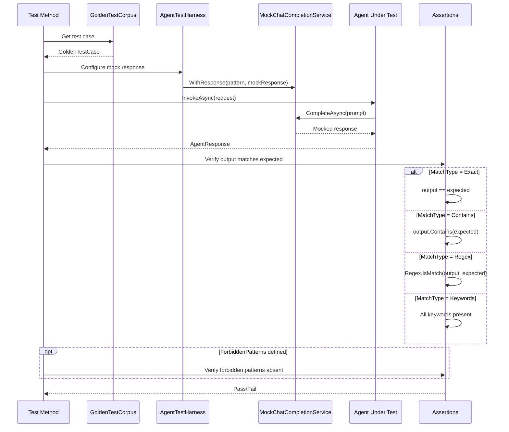

# LCS-DES-078a: Design Specification — Agent Accuracy Corpus

## 1. Metadata & Categorization

| Field | Value | Description |
| :--- | :--- | :--- |
| **Feature ID** | `TST-078a` | Sub-part of TST-078 |
| **Feature Name** | `Agent Accuracy Corpus (Golden Test Cases)` | Curated test corpus for agent verification |
| **Target Version** | `v0.7.8a` | First sub-part of v0.7.8 |
| **Module Scope** | `Lexichord.Tests.Agents` | Test project |
| **Swimlane** | `Ensemble` | Part of Agents vertical |
| **License Tier** | `Core` | Testing available to all |
| **Feature Gate Key** | N/A | No gating for tests |
| **Author** | Lead Architect | |
| **Status** | `Draft` | |
| **Last Updated** | `2026-01-27` | |
| **Parent Document** | [LCS-DES-078-INDEX](./LCS-DES-078-INDEX.md) | |
| **Scope Breakdown** | [LCS-SBD-078 Section 3.1](./LCS-SBD-078.md#31-v078a-agent-accuracy-corpus) | |

---

## 2. Executive Summary

### 2.1 The Requirement

The specialist agents introduced in v0.7.3-v0.7.6 must produce accurate, predictable outputs for known inputs. Without verification tests:

- Agent behavior could silently regress
- Prompt template changes could break expected outputs
- Quality assurance has no measurable baseline
- Enterprise compliance requirements cannot be met

> **Goal:** Create 50+ golden test cases per specialist agent with human-validated expected outputs, enabling automated accuracy verification.

### 2.2 The Proposed Solution

Implement a comprehensive golden test corpus that:

1. Provides 50+ categorized test cases per agent (Editor, Simplifier, Tuning, Summarizer)
2. Defines expected output patterns (exact match, contains, regex)
3. Covers standard cases, edge cases, and adversarial inputs
4. Integrates with CI to fail builds on accuracy regression
5. Serves as living documentation of expected agent behavior

---

## 3. Architecture & Modular Strategy

### 3.1 Dependencies

#### 3.1.1 Systems Under Test

| Interface | Source Version | Purpose |
| :--- | :--- | :--- |
| `EditorAgent` | v0.7.3b | Grammar/clarity specialist under test |
| `SimplifierAgent` | v0.7.4b | Readability specialist under test |
| `TuningAgent` | v0.7.5b | Style enforcement specialist under test |
| `SummarizerAgent` | v0.7.6b | Metadata generation specialist under test |
| `IEditSuggestionParser` | v0.7.3c | Edit parsing verification |
| `IContextOrchestrator` | v0.7.2c | Context assembly verification |

#### 3.1.2 Test Infrastructure

| Component | Source Version | Purpose |
| :--- | :--- | :--- |
| `MockChatCompletionService` | v0.7.8b | Deterministic LLM responses |
| `AgentTestHarness` | v0.7.8b | Simplified test setup |

#### 3.1.3 NuGet Packages

| Package | Version | Purpose |
| :--- | :--- | :--- |
| `xunit` | 2.9.x | Test framework |
| `FluentAssertions` | 6.x | Fluent assertions |
| `Verify.Xunit` | 26.x | Snapshot comparison |

### 3.2 Licensing Behavior

No licensing required. Tests run in development/CI environments only.

---

## 4. Data Contract (The API)

### 4.1 GoldenTestCase Record

```csharp
namespace Lexichord.Tests.Agents.Fixtures;

/// <summary>
/// A golden test case with known input and expected output patterns.
/// All expected outputs are human-validated for accuracy.
/// </summary>
public record GoldenTestCase
{
    /// <summary>
    /// Unique identifier for the test case.
    /// Format: {AgentId}-{Category}-{Number}, e.g., "editor-grammar-001"
    /// </summary>
    public required string TestId { get; init; }

    /// <summary>
    /// Category for filtering and organization.
    /// Examples: "grammar", "clarity", "readability", "style"
    /// </summary>
    public required string Category { get; init; }

    /// <summary>
    /// Subcategory for finer-grained organization.
    /// Examples: "subject-verb", "passive-voice", "jargon"
    /// </summary>
    public string? Subcategory { get; init; }

    /// <summary>
    /// Human-readable description of what this test verifies.
    /// </summary>
    public required string Description { get; init; }

    /// <summary>
    /// The input text to send to the agent.
    /// </summary>
    public required string InputText { get; init; }

    /// <summary>
    /// The user's instruction or query to the agent.
    /// </summary>
    public string? UserInstruction { get; init; }

    /// <summary>
    /// Pattern that the output must match.
    /// Interpretation depends on MatchType.
    /// </summary>
    public required string ExpectedOutputPattern { get; init; }

    /// <summary>
    /// Type of pattern matching to use.
    /// </summary>
    public PatternMatchType MatchType { get; init; } = PatternMatchType.Contains;

    /// <summary>
    /// Additional patterns that must NOT appear in output.
    /// </summary>
    public IReadOnlyList<string>? ForbiddenPatterns { get; init; }

    /// <summary>
    /// Additional context variables for the test.
    /// </summary>
    public IReadOnlyDictionary<string, object>? Context { get; init; }

    /// <summary>
    /// Mock LLM response to return for this test case.
    /// </summary>
    public required string MockResponse { get; init; }

    /// <summary>
    /// Difficulty level for categorization.
    /// </summary>
    public GoldenTestDifficulty Difficulty { get; init; } = GoldenTestDifficulty.Standard;

    /// <summary>
    /// Source or reference for this test case.
    /// </summary>
    public string? Source { get; init; }
}

public enum PatternMatchType
{
    /// <summary>Output must exactly match pattern.</summary>
    Exact,
    /// <summary>Output must contain pattern.</summary>
    Contains,
    /// <summary>Output must match regex pattern.</summary>
    Regex,
    /// <summary>Output must contain all specified keywords.</summary>
    Keywords,
    /// <summary>Output structure must match (for JSON responses).</summary>
    JsonSchema
}

public enum GoldenTestDifficulty
{
    /// <summary>Basic cases, single issue, clear fix.</summary>
    Simple,
    /// <summary>Normal complexity, typical user input.</summary>
    Standard,
    /// <summary>Multiple issues, requires nuanced handling.</summary>
    Complex,
    /// <summary>Edge cases designed to trip up the agent.</summary>
    Adversarial
}
```

### 4.2 GoldenTestCorpus Static Class

```csharp
namespace Lexichord.Tests.Agents.Fixtures;

/// <summary>
/// Repository of golden test cases for each specialist agent.
/// All cases are human-validated and serve as the source of truth
/// for expected agent behavior.
/// </summary>
public static class GoldenTestCorpus
{
    /// <summary>
    /// Golden test cases for the Editor Agent.
    /// Categories: Grammar, Clarity, Structure, Edge Cases
    /// </summary>
    public static IReadOnlyList<GoldenTestCase> EditorCases { get; } = LoadEditorCases();

    /// <summary>
    /// Golden test cases for the Simplifier Agent.
    /// Categories: Readability, Jargon, Audience, Edge Cases
    /// </summary>
    public static IReadOnlyList<GoldenTestCase> SimplifierCases { get; } = LoadSimplifierCases();

    /// <summary>
    /// Golden test cases for the Tuning Agent.
    /// Categories: Style Rules, Multi-violation, Edge Cases
    /// </summary>
    public static IReadOnlyList<GoldenTestCase> TuningCases { get; } = LoadTuningCases();

    /// <summary>
    /// Golden test cases for the Summarizer Agent.
    /// Categories: Summaries, Metadata, Tags, Edge Cases
    /// </summary>
    public static IReadOnlyList<GoldenTestCase> SummarizerCases { get; } = LoadSummarizerCases();

    /// <summary>
    /// Get all cases for a specific agent.
    /// </summary>
    public static IReadOnlyList<GoldenTestCase> GetCasesForAgent(string agentId) => agentId switch
    {
        "editor" => EditorCases,
        "simplifier" => SimplifierCases,
        "tuning" => TuningCases,
        "summarizer" => SummarizerCases,
        _ => throw new ArgumentException($"Unknown agent: {agentId}")
    };

    /// <summary>
    /// Get cases filtered by category.
    /// </summary>
    public static IReadOnlyList<GoldenTestCase> GetCasesByCategory(
        string agentId,
        string category) =>
        GetCasesForAgent(agentId)
            .Where(c => c.Category.Equals(category, StringComparison.OrdinalIgnoreCase))
            .ToList();

    /// <summary>
    /// Get cases filtered by difficulty.
    /// </summary>
    public static IReadOnlyList<GoldenTestCase> GetCasesByDifficulty(
        string agentId,
        GoldenTestDifficulty difficulty) =>
        GetCasesForAgent(agentId)
            .Where(c => c.Difficulty == difficulty)
            .ToList();
}
```

---

## 5. Implementation Logic

### 5.1 Test Execution Flow



### 5.2 Output Verification Logic

```text
VERIFY agent output against golden test case:
|
+-- Get expected pattern and match type
|
+-- Apply match type:
|   +-- Exact: output.Trim() == expected.Trim()
|   +-- Contains: output.Contains(expected)
|   +-- Regex: Regex.IsMatch(output, expected)
|   +-- Keywords: expected.Split(',').All(k => output.Contains(k))
|   +-- JsonSchema: JsonSchema.Validate(output, expected)
|
+-- Check forbidden patterns:
|   +-- FOR EACH forbidden IN ForbiddenPatterns:
|       +-- IF output.Contains(forbidden):
|           +-- FAIL: "Output contains forbidden pattern: {forbidden}"
|
+-- RETURN pass/fail result
```

---

## 6. Test Scenarios

### 6.1 Editor Agent Accuracy Tests

```csharp
namespace Lexichord.Tests.Agents.Accuracy;

[Trait("Category", "Unit")]
[Trait("Version", "v0.7.8a")]
public class EditorAgentAccuracyTests
{
    private readonly AgentTestHarness _harness;
    private readonly EditorAgent _sut;

    public EditorAgentAccuracyTests()
    {
        _harness = new AgentTestHarness();
        _sut = _harness.GetAgent<EditorAgent>();
    }

    #region Grammar Tests

    [Theory]
    [MemberData(nameof(GetGrammarTestCases))]
    public async Task Editor_Grammar_MatchesExpectedOutput(GoldenTestCase testCase)
    {
        // Arrange
        _harness.WithResponse(testCase.InputText, testCase.MockResponse);

        // Act
        var response = await _sut.InvokeAsync(
            new AgentRequest(
                testCase.UserInstruction ?? "Review for grammar issues",
                Selection: testCase.InputText),
            CancellationToken.None);

        // Assert
        AssertOutputMatches(response.Content, testCase);
    }

    public static IEnumerable<object[]> GetGrammarTestCases() =>
        GoldenTestCorpus.EditorCases
            .Where(c => c.Category == "Grammar")
            .Select(c => new object[] { c });

    #endregion

    #region Clarity Tests

    [Theory]
    [MemberData(nameof(GetClarityTestCases))]
    public async Task Editor_Clarity_MatchesExpectedOutput(GoldenTestCase testCase)
    {
        _harness.WithResponse(testCase.InputText, testCase.MockResponse);

        var response = await _sut.InvokeAsync(
            new AgentRequest(
                testCase.UserInstruction ?? "Improve clarity",
                Selection: testCase.InputText),
            CancellationToken.None);

        AssertOutputMatches(response.Content, testCase);
    }

    public static IEnumerable<object[]> GetClarityTestCases() =>
        GoldenTestCorpus.EditorCases
            .Where(c => c.Category == "Clarity")
            .Select(c => new object[] { c });

    #endregion

    #region Structure Tests

    [Theory]
    [MemberData(nameof(GetStructureTestCases))]
    public async Task Editor_Structure_MatchesExpectedOutput(GoldenTestCase testCase)
    {
        _harness.WithResponse(testCase.InputText, testCase.MockResponse);

        var response = await _sut.InvokeAsync(
            new AgentRequest(
                testCase.UserInstruction ?? "Improve structure",
                Selection: testCase.InputText),
            CancellationToken.None);

        AssertOutputMatches(response.Content, testCase);
    }

    public static IEnumerable<object[]> GetStructureTestCases() =>
        GoldenTestCorpus.EditorCases
            .Where(c => c.Category == "Structure")
            .Select(c => new object[] { c });

    #endregion

    #region Edge Case Tests

    [Theory]
    [MemberData(nameof(GetEdgeCaseTestCases))]
    public async Task Editor_EdgeCases_MatchesExpectedOutput(GoldenTestCase testCase)
    {
        _harness.WithResponse(testCase.InputText, testCase.MockResponse);

        var response = await _sut.InvokeAsync(
            new AgentRequest(
                testCase.UserInstruction ?? "Review this text",
                Selection: testCase.InputText),
            CancellationToken.None);

        AssertOutputMatches(response.Content, testCase);
    }

    public static IEnumerable<object[]> GetEdgeCaseTestCases() =>
        GoldenTestCorpus.EditorCases
            .Where(c => c.Category == "EdgeCase")
            .Select(c => new object[] { c });

    #endregion

    #region Assertion Helpers

    private void AssertOutputMatches(string output, GoldenTestCase testCase)
    {
        switch (testCase.MatchType)
        {
            case PatternMatchType.Exact:
                output.Trim().Should().Be(testCase.ExpectedOutputPattern.Trim(),
                    $"Test {testCase.TestId}: {testCase.Description}");
                break;

            case PatternMatchType.Contains:
                output.Should().Contain(testCase.ExpectedOutputPattern,
                    $"Test {testCase.TestId}: {testCase.Description}");
                break;

            case PatternMatchType.Regex:
                output.Should().MatchRegex(testCase.ExpectedOutputPattern,
                    $"Test {testCase.TestId}: {testCase.Description}");
                break;

            case PatternMatchType.Keywords:
                var keywords = testCase.ExpectedOutputPattern.Split(',')
                    .Select(k => k.Trim());
                foreach (var keyword in keywords)
                {
                    output.Should().Contain(keyword,
                        $"Test {testCase.TestId}: Missing keyword '{keyword}'");
                }
                break;
        }

        // Check forbidden patterns
        if (testCase.ForbiddenPatterns is not null)
        {
            foreach (var forbidden in testCase.ForbiddenPatterns)
            {
                output.Should().NotContain(forbidden,
                    $"Test {testCase.TestId}: Contains forbidden pattern '{forbidden}'");
            }
        }
    }

    #endregion
}
```

### 6.2 Golden Test Cases - Editor Agent

```csharp
namespace Lexichord.Tests.Agents.Fixtures;

public static partial class GoldenTestCorpus
{
    private static IReadOnlyList<GoldenTestCase> LoadEditorCases() => new List<GoldenTestCase>
    {
        // ═══════════════════════════════════════════════════════════════
        // GRAMMAR - Subject-Verb Agreement
        // ═══════════════════════════════════════════════════════════════

        new GoldenTestCase
        {
            TestId = "editor-grammar-001",
            Category = "Grammar",
            Subcategory = "SubjectVerbAgreement",
            Description = "Correct singular subject with plural verb",
            InputText = "The team are working on the project.",
            ExpectedOutputPattern = "The team is working",
            MatchType = PatternMatchType.Contains,
            MockResponse = """
                **Suggestion:**
                - Original: "The team are working on the project."
                - Revised: "The team is working on the project."
                - Explanation: "Team" is a collective noun treated as singular in American English.
                - Severity: Minor
                """,
            Difficulty = GoldenTestDifficulty.Simple
        },

        new GoldenTestCase
        {
            TestId = "editor-grammar-002",
            Category = "Grammar",
            Subcategory = "SubjectVerbAgreement",
            Description = "Correct plural subject with singular verb",
            InputText = "The results shows significant improvement.",
            ExpectedOutputPattern = "The results show",
            MatchType = PatternMatchType.Contains,
            MockResponse = """
                **Suggestion:**
                - Original: "The results shows significant improvement."
                - Revised: "The results show significant improvement."
                - Explanation: "Results" is plural and requires "show" not "shows".
                - Severity: Minor
                """,
            Difficulty = GoldenTestDifficulty.Simple
        },

        new GoldenTestCase
        {
            TestId = "editor-grammar-003",
            Category = "Grammar",
            Subcategory = "SubjectVerbAgreement",
            Description = "Complex subject with intervening phrase",
            InputText = "The manager, along with her team members, are attending the conference.",
            ExpectedOutputPattern = "is attending",
            MatchType = PatternMatchType.Contains,
            MockResponse = """
                **Suggestion:**
                - Original: "The manager, along with her team members, are attending the conference."
                - Revised: "The manager, along with her team members, is attending the conference."
                - Explanation: The subject is "manager" (singular). The phrase "along with her team members" is parenthetical.
                - Severity: Moderate
                """,
            Difficulty = GoldenTestDifficulty.Complex
        },

        // ═══════════════════════════════════════════════════════════════
        // GRAMMAR - Tense Consistency
        // ═══════════════════════════════════════════════════════════════

        new GoldenTestCase
        {
            TestId = "editor-grammar-010",
            Category = "Grammar",
            Subcategory = "TenseConsistency",
            Description = "Mixed past and present tense",
            InputText = "She walked into the room and sees her friend.",
            ExpectedOutputPattern = "walked,saw",
            MatchType = PatternMatchType.Keywords,
            MockResponse = """
                **Suggestion:**
                - Original: "She walked into the room and sees her friend."
                - Revised: "She walked into the room and saw her friend."
                - Explanation: Maintain past tense consistency throughout the sentence.
                - Severity: Moderate
                """,
            Difficulty = GoldenTestDifficulty.Standard
        },

        // ═══════════════════════════════════════════════════════════════
        // GRAMMAR - Punctuation
        // ═══════════════════════════════════════════════════════════════

        new GoldenTestCase
        {
            TestId = "editor-grammar-020",
            Category = "Grammar",
            Subcategory = "Punctuation",
            Description = "Missing comma in compound sentence",
            InputText = "The project was completed on time and the client was satisfied.",
            ExpectedOutputPattern = "on time, and",
            MatchType = PatternMatchType.Contains,
            MockResponse = """
                **Suggestion:**
                - Original: "The project was completed on time and the client was satisfied."
                - Revised: "The project was completed on time, and the client was satisfied."
                - Explanation: A comma is needed before "and" when joining two independent clauses.
                - Severity: Minor
                """,
            Difficulty = GoldenTestDifficulty.Simple
        },

        new GoldenTestCase
        {
            TestId = "editor-grammar-021",
            Category = "Grammar",
            Subcategory = "Punctuation",
            Description = "Incorrect semicolon usage",
            InputText = "I need to buy; milk, eggs, and bread.",
            ExpectedOutputPattern = "buy: milk",
            MatchType = PatternMatchType.Contains,
            MockResponse = """
                **Suggestion:**
                - Original: "I need to buy; milk, eggs, and bread."
                - Revised: "I need to buy: milk, eggs, and bread."
                - Explanation: Use a colon, not a semicolon, to introduce a list.
                - Severity: Minor
                """,
            Difficulty = GoldenTestDifficulty.Simple
        },

        // ═══════════════════════════════════════════════════════════════
        // CLARITY - Ambiguous Pronouns
        // ═══════════════════════════════════════════════════════════════

        new GoldenTestCase
        {
            TestId = "editor-clarity-001",
            Category = "Clarity",
            Subcategory = "AmbiguousPronouns",
            Description = "Unclear pronoun reference",
            InputText = "John told Bob that he needed to improve his presentation skills.",
            ExpectedOutputPattern = "ambiguous,clarify",
            MatchType = PatternMatchType.Keywords,
            MockResponse = """
                **Suggestion:**
                - Original: "John told Bob that he needed to improve his presentation skills."
                - Revised: "John told Bob that Bob needed to improve his presentation skills."
                - Or: "John said to Bob, 'You need to improve your presentation skills.'"
                - Explanation: "He" and "his" are ambiguous - could refer to John or Bob.
                - Severity: Moderate
                """,
            Difficulty = GoldenTestDifficulty.Standard
        },

        // ═══════════════════════════════════════════════════════════════
        // CLARITY - Run-on Sentences
        // ═══════════════════════════════════════════════════════════════

        new GoldenTestCase
        {
            TestId = "editor-clarity-010",
            Category = "Clarity",
            Subcategory = "RunOnSentences",
            Description = "Long run-on sentence",
            InputText = "The project deadline was approaching fast and the team was working overtime but they still needed more time because the requirements kept changing.",
            ExpectedOutputPattern = "break,shorter",
            MatchType = PatternMatchType.Keywords,
            MockResponse = """
                **Suggestion:**
                - Original: "The project deadline was approaching fast and the team was working overtime but they still needed more time because the requirements kept changing."
                - Revised: "The project deadline was approaching fast, and the team was working overtime. However, they still needed more time because the requirements kept changing."
                - Explanation: Break this run-on sentence into shorter, clearer sentences.
                - Severity: Moderate
                """,
            Difficulty = GoldenTestDifficulty.Standard
        },

        // ═══════════════════════════════════════════════════════════════
        // CLARITY - Wordiness
        // ═══════════════════════════════════════════════════════════════

        new GoldenTestCase
        {
            TestId = "editor-clarity-020",
            Category = "Clarity",
            Subcategory = "Wordiness",
            Description = "Eliminate redundant phrases",
            InputText = "In my personal opinion, I think that we should proceed forward with the plan.",
            ExpectedOutputPattern = "We should proceed with the plan",
            MatchType = PatternMatchType.Contains,
            MockResponse = """
                **Suggestion:**
                - Original: "In my personal opinion, I think that we should proceed forward with the plan."
                - Revised: "We should proceed with the plan."
                - Explanation: "In my personal opinion" and "I think" are redundant. "Proceed forward" is a tautology.
                - Severity: Minor
                """,
            Difficulty = GoldenTestDifficulty.Simple
        },

        // ═══════════════════════════════════════════════════════════════
        // EDGE CASES - Technical Content
        // ═══════════════════════════════════════════════════════════════

        new GoldenTestCase
        {
            TestId = "editor-edge-001",
            Category = "EdgeCase",
            Subcategory = "TechnicalContent",
            Description = "Preserve code snippets exactly",
            InputText = "The function `calculateTotal(items)` returns the sum. It's important to note that it don't handle null values.",
            ExpectedOutputPattern = "`calculateTotal(items)`",
            MatchType = PatternMatchType.Contains,
            ForbiddenPatterns = new[] { "calculate Total", "calculatetotal" },
            MockResponse = """
                **Suggestion:**
                - Original: "The function `calculateTotal(items)` returns the sum. It's important to note that it don't handle null values."
                - Revised: "The function `calculateTotal(items)` returns the sum. It's important to note that it doesn't handle null values."
                - Explanation: Fix grammar error "don't" -> "doesn't". Code snippet preserved exactly.
                - Severity: Minor
                """,
            Difficulty = GoldenTestDifficulty.Complex
        },

        new GoldenTestCase
        {
            TestId = "editor-edge-002",
            Category = "EdgeCase",
            Subcategory = "TechnicalContent",
            Description = "Preserve technical jargon",
            InputText = "The API endpoint returns a 200 OK response with JSON payload. The data is serialized using UTF-8 encoding.",
            ExpectedOutputPattern = "No suggestions",
            MatchType = PatternMatchType.Contains,
            MockResponse = """
                **Review Complete:**
                No grammatical or clarity issues found. Technical terminology is correct:
                - "API endpoint" - correct term
                - "200 OK response" - standard HTTP status
                - "JSON payload" - correct term
                - "UTF-8 encoding" - correct term
                """,
            Difficulty = GoldenTestDifficulty.Standard
        },

        // ... Additional test cases (40+ more to reach 50+)
    };
}
```

### 6.3 Simplifier Agent Accuracy Tests

```csharp
[Trait("Category", "Unit")]
[Trait("Version", "v0.7.8a")]
public class SimplifierAgentAccuracyTests
{
    private readonly AgentTestHarness _harness;
    private readonly SimplifierAgent _sut;

    public SimplifierAgentAccuracyTests()
    {
        _harness = new AgentTestHarness();
        _sut = _harness.GetAgent<SimplifierAgent>();
    }

    [Theory]
    [MemberData(nameof(GetReadabilityTestCases))]
    public async Task Simplifier_Readability_MatchesExpectedOutput(GoldenTestCase testCase)
    {
        // Arrange
        _harness.WithResponse(testCase.InputText, testCase.MockResponse);

        // Act
        var response = await _sut.InvokeAsync(
            new AgentRequest(
                testCase.UserInstruction ?? "Simplify for a general audience",
                Selection: testCase.InputText),
            CancellationToken.None);

        // Assert
        AssertOutputMatches(response.Content, testCase);
    }

    public static IEnumerable<object[]> GetReadabilityTestCases() =>
        GoldenTestCorpus.SimplifierCases
            .Where(c => c.Category == "Readability")
            .Select(c => new object[] { c });

    [Theory]
    [MemberData(nameof(GetJargonTestCases))]
    public async Task Simplifier_Jargon_MatchesExpectedOutput(GoldenTestCase testCase)
    {
        _harness.WithResponse(testCase.InputText, testCase.MockResponse);

        var response = await _sut.InvokeAsync(
            new AgentRequest(
                testCase.UserInstruction ?? "Remove technical jargon",
                Selection: testCase.InputText),
            CancellationToken.None);

        AssertOutputMatches(response.Content, testCase);
    }

    public static IEnumerable<object[]> GetJargonTestCases() =>
        GoldenTestCorpus.SimplifierCases
            .Where(c => c.Category == "Jargon")
            .Select(c => new object[] { c });
}
```

### 6.4 Golden Test Cases - Simplifier Agent

```csharp
public static partial class GoldenTestCorpus
{
    private static IReadOnlyList<GoldenTestCase> LoadSimplifierCases() => new List<GoldenTestCase>
    {
        // ═══════════════════════════════════════════════════════════════
        // READABILITY - Grade Level Reduction
        // ═══════════════════════════════════════════════════════════════

        new GoldenTestCase
        {
            TestId = "simplifier-readability-001",
            Category = "Readability",
            Subcategory = "GradeLevelReduction",
            Description = "Simplify complex academic sentence",
            InputText = "The utilization of sophisticated methodological approaches necessitates a comprehensive understanding of the underlying theoretical frameworks.",
            ExpectedOutputPattern = "Using advanced methods requires understanding the basic theories",
            MatchType = PatternMatchType.Contains,
            MockResponse = """
                **Simplified:**
                Original (Grade 18): "The utilization of sophisticated methodological approaches necessitates a comprehensive understanding of the underlying theoretical frameworks."

                Simplified (Grade 8): "Using advanced methods requires understanding the basic theories behind them."

                Changes:
                - "utilization" -> "using"
                - "sophisticated methodological approaches" -> "advanced methods"
                - "necessitates" -> "requires"
                - "comprehensive understanding" -> "understanding"
                - "underlying theoretical frameworks" -> "basic theories behind them"
                """,
            Difficulty = GoldenTestDifficulty.Standard
        },

        new GoldenTestCase
        {
            TestId = "simplifier-readability-002",
            Category = "Readability",
            Subcategory = "SentenceLength",
            Description = "Break long sentence into shorter ones",
            InputText = "The committee, having deliberated extensively on the matter over the course of several months, ultimately reached a consensus that the proposed changes, while potentially beneficial in the long term, would require significant resources to implement effectively.",
            ExpectedOutputPattern = "shorter,sentences",
            MatchType = PatternMatchType.Keywords,
            MockResponse = """
                **Simplified:**
                Original: [1 sentence, 47 words]

                Simplified: "The committee discussed this issue for several months. They agreed that the proposed changes could help in the long run. However, these changes would need a lot of resources to work well."

                Changes:
                - Split into 3 shorter sentences
                - Average sentence length reduced from 47 to 16 words
                - Reading level reduced from Grade 16 to Grade 8
                """,
            Difficulty = GoldenTestDifficulty.Standard
        },

        // ═══════════════════════════════════════════════════════════════
        // JARGON - Technical Term Simplification
        // ═══════════════════════════════════════════════════════════════

        new GoldenTestCase
        {
            TestId = "simplifier-jargon-001",
            Category = "Jargon",
            Subcategory = "TechnicalTerms",
            Description = "Replace medical jargon with plain language",
            InputText = "The patient presented with acute myocardial infarction and was administered thrombolytic therapy.",
            ExpectedOutputPattern = "heart attack",
            MatchType = PatternMatchType.Contains,
            MockResponse = """
                **Simplified:**
                Original: "The patient presented with acute myocardial infarction and was administered thrombolytic therapy."

                Simplified: "The patient had a heart attack and was given medication to dissolve blood clots."

                Glossary:
                - "acute myocardial infarction" = heart attack
                - "thrombolytic therapy" = medication to dissolve blood clots
                """,
            Difficulty = GoldenTestDifficulty.Standard
        },

        new GoldenTestCase
        {
            TestId = "simplifier-jargon-002",
            Category = "Jargon",
            Subcategory = "BusinessJargon",
            Description = "Replace business buzzwords with plain language",
            InputText = "We need to leverage our synergies to achieve a paradigm shift and move the needle on our KPIs.",
            ExpectedOutputPattern = "work together,improve",
            MatchType = PatternMatchType.Keywords,
            MockResponse = """
                **Simplified:**
                Original: "We need to leverage our synergies to achieve a paradigm shift and move the needle on our KPIs."

                Simplified: "We need to work together to make big changes and improve our key results."

                Changes:
                - "leverage our synergies" -> "work together"
                - "paradigm shift" -> "big changes"
                - "move the needle" -> "improve"
                - "KPIs" -> "key results"
                """,
            Difficulty = GoldenTestDifficulty.Simple
        },

        // ═══════════════════════════════════════════════════════════════
        // EDGE CASES - Preserve Technical Accuracy
        // ═══════════════════════════════════════════════════════════════

        new GoldenTestCase
        {
            TestId = "simplifier-edge-001",
            Category = "EdgeCase",
            Subcategory = "PreserveAccuracy",
            Description = "Simplify without losing technical accuracy",
            InputText = "The recursive algorithm has O(n log n) time complexity and O(n) space complexity.",
            ExpectedOutputPattern = "O(n log n),O(n)",
            MatchType = PatternMatchType.Keywords,
            ForbiddenPatterns = new[] { "O(n^2)", "O(1)" },
            MockResponse = """
                **Simplified:**
                Original: "The recursive algorithm has O(n log n) time complexity and O(n) space complexity."

                Simplified: "This method processes data in O(n log n) time, which is efficient. It needs O(n) memory space."

                Note: Big O notation preserved as it's a standard technical term that can't be simplified without losing meaning.
                """,
            Difficulty = GoldenTestDifficulty.Complex
        },

        // ... Additional test cases (40+ more to reach 50+)
    };
}
```

---

## 7. Test Organization

### 7.1 File Structure

```text
Lexichord.Tests.Agents/
+-- Accuracy/
|   +-- EditorAgentAccuracyTests.cs
|   +-- SimplifierAgentAccuracyTests.cs
|   +-- TuningAgentAccuracyTests.cs
|   +-- SummarizerAgentAccuracyTests.cs
+-- Fixtures/
|   +-- GoldenTestCorpus.cs
|   +-- GoldenTestCorpus.Editor.cs
|   +-- GoldenTestCorpus.Simplifier.cs
|   +-- GoldenTestCorpus.Tuning.cs
|   +-- GoldenTestCorpus.Summarizer.cs
|   +-- GoldenTestCase.cs
|   +-- TestDocuments.cs
+-- Helpers/
    +-- AssertionHelpers.cs
    +-- TestCaseLoader.cs
```

### 7.2 Test Categories

| Category | Description | Count Target |
| :--- | :--- | :--- |
| Grammar | Subject-verb, tense, punctuation | 15+ |
| Clarity | Pronouns, run-ons, wordiness | 15+ |
| Structure | Paragraphs, flow, transitions | 10+ |
| EdgeCase | Technical content, preservation | 10+ |

---

## 8. Observability & Logging

| Level | Message Template |
| :--- | :--- |
| Debug | `"Testing case {TestId}: {Description}"` |
| Info | `"Agent accuracy suite completed: {PassCount}/{TotalCount} passed"` |
| Warning | `"Test case {TestId} matched with unexpected pattern: {Pattern}"` |
| Error | `"Golden test failed: {TestId} expected '{Expected}', got '{Actual}'"` |

---

## 9. Security & Safety

| Risk | Level | Mitigation |
| :--- | :--- | :--- |
| Test data injection | None | Tests use hardcoded values |
| Sensitive data in tests | None | No PII in test fixtures |
| Copyright content | Low | Use original or public domain text |

---

## 10. Acceptance Criteria

### 10.1 Functional Criteria

| # | Given | When | Then |
| :--- | :--- | :--- | :--- |
| 1 | Golden test case with Contains match | Agent invoked | Output contains expected pattern |
| 2 | Golden test case with Exact match | Agent invoked | Output exactly matches expected |
| 3 | Golden test case with Keywords match | Agent invoked | Output contains all keywords |
| 4 | Golden test case with ForbiddenPatterns | Agent invoked | Output excludes forbidden patterns |
| 5 | Editor Agent | Grammar test cases | 50+ cases pass |
| 6 | Simplifier Agent | Readability test cases | 50+ cases pass |
| 7 | Tuning Agent | Style rule test cases | 50+ cases pass |
| 8 | Summarizer Agent | Metadata test cases | 50+ cases pass |

### 10.2 CI Criteria

| # | Given | When | Then |
| :--- | :--- | :--- | :--- |
| 9 | Any golden test fails | CI runs tests | Build fails |
| 10 | All golden tests pass | CI runs tests | Build succeeds |
| 11 | New test case added | CI runs tests | New case executed |

---

## 11. Deliverable Checklist

| # | Deliverable | Status |
| :--- | :--- | :--- |
| 1 | `GoldenTestCase.cs` record definition | [ ] |
| 2 | `GoldenTestCorpus.cs` static class | [ ] |
| 3 | `GoldenTestCorpus.Editor.cs` with 50+ cases | [ ] |
| 4 | `GoldenTestCorpus.Simplifier.cs` with 50+ cases | [ ] |
| 5 | `GoldenTestCorpus.Tuning.cs` with 50+ cases | [ ] |
| 6 | `GoldenTestCorpus.Summarizer.cs` with 50+ cases | [ ] |
| 7 | `EditorAgentAccuracyTests.cs` | [ ] |
| 8 | `SimplifierAgentAccuracyTests.cs` | [ ] |
| 9 | `TuningAgentAccuracyTests.cs` | [ ] |
| 10 | `SummarizerAgentAccuracyTests.cs` | [ ] |
| 11 | `AssertionHelpers.cs` | [ ] |
| 12 | Human validation of all test cases | [ ] |

---

## 12. Verification Commands

```bash
# Run all accuracy tests
dotnet test --filter "Version=v0.7.8a" --logger "console;verbosity=detailed"

# Run Editor accuracy tests only
dotnet test --filter "FullyQualifiedName~EditorAgentAccuracyTests"

# Run Simplifier accuracy tests only
dotnet test --filter "FullyQualifiedName~SimplifierAgentAccuracyTests"

# Run by category
dotnet test --filter "Category=Unit&Version=v0.7.8a"

# Run with coverage
dotnet test --filter "Version=v0.7.8a" --collect:"XPlat Code Coverage"

# Count test cases
dotnet test --filter "Version=v0.7.8a" --list-tests | wc -l
```

---

## Document History

| Version | Date | Author | Changes |
| :--- | :--- | :--- | :--- |
| 1.0 | 2026-01-27 | Lead Architect | Initial draft |
