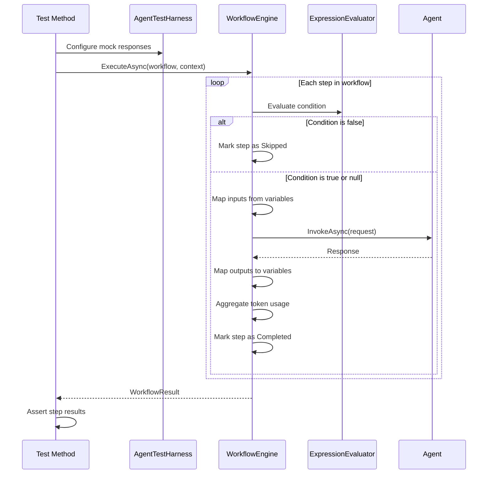

# LCS-DES-078c: Design Specification — Workflow Regression Tests

## 1. Metadata & Categorization

| Field | Value | Description |
| :--- | :--- | :--- |
| **Feature ID** | `TST-078c` | Sub-part of TST-078 |
| **Feature Name** | `Workflow Regression Tests (Pipeline Verification)` | Multi-agent workflow testing |
| **Target Version** | `v0.7.8c` | Third sub-part of v0.7.8 |
| **Module Scope** | `Lexichord.Tests.Agents` | Test project |
| **Swimlane** | `Ensemble` | Part of Agents vertical |
| **License Tier** | `Core` | Testing available to all |
| **Feature Gate Key** | N/A | No gating for tests |
| **Author** | Lead Architect | |
| **Status** | `Draft` | |
| **Last Updated** | `2026-01-27` | |
| **Parent Document** | [LCS-DES-078-INDEX](./LCS-DES-078-INDEX.md) | |
| **Scope Breakdown** | [LCS-SBD-078 Section 3.3](./LCS-SBD-078.md#33-v078c-workflow-regression-tests) | |

---

## 2. Executive Summary

### 2.1 The Requirement

The multi-agent workflow system introduced in v0.7.7 enables complex document processing pipelines. Without regression tests:

- Workflow execution order could silently change
- Conditional step logic could break
- Output mapping between steps could fail
- Error handling could regress
- Token aggregation could become incorrect

> **Goal:** Verify that all workflows execute correctly, passing data between steps, respecting conditions, and handling errors gracefully.

### 2.2 The Proposed Solution

Implement comprehensive workflow tests that:

1. Verify sequential step execution order
2. Test conditional step execution (skip when condition false)
3. Validate output mapping between steps
4. Test error handling and workflow abort behavior
5. Verify token usage aggregation across steps
6. Test all built-in workflow definitions

---

## 3. Architecture & Modular Strategy

### 3.1 Dependencies

#### 3.1.1 Systems Under Test

| Interface | Source Version | Purpose |
| :--- | :--- | :--- |
| `IWorkflowEngine` | v0.7.7b | Workflow orchestration engine |
| `AgentWorkflow` | v0.7.7a | Workflow definition model |
| `WorkflowStep` | v0.7.7a | Step definition model |
| `WorkflowStepCondition` | v0.7.7a | Conditional execution |
| `WorkflowResult` | v0.7.7b | Execution result |
| `WorkflowStepResult` | v0.7.7b | Step result |

#### 3.1.2 Test Infrastructure

| Component | Source Version | Purpose |
| :--- | :--- | :--- |
| `MockChatCompletionService` | v0.7.8b | Mock LLM responses |
| `AgentTestHarness` | v0.7.8b | Test configuration |

#### 3.1.3 NuGet Packages

| Package | Version | Purpose |
| :--- | :--- | :--- |
| `xunit` | 2.9.x | Test framework |
| `FluentAssertions` | 6.x | Fluent assertions |
| `Verify.Xunit` | 26.x | Snapshot testing |

### 3.2 Licensing Behavior

No licensing required. Test infrastructure only.

---

## 4. Data Contract (The API)

### 4.1 Test Workflow Builders

```csharp
namespace Lexichord.Tests.Agents.Workflows;

/// <summary>
/// Factory for creating test workflow definitions.
/// </summary>
public static class TestWorkflowBuilder
{
    /// <summary>
    /// Create a simple two-step workflow.
    /// </summary>
    public static AgentWorkflow CreateTwoStepWorkflow(
        string firstAgentId,
        string secondAgentId)
    {
        return new AgentWorkflow(
            WorkflowId: $"test-{firstAgentId}-{secondAgentId}",
            Name: $"Test {firstAgentId} -> {secondAgentId}",
            Description: "Two-step test workflow",
            Steps: new[]
            {
                new WorkflowStep(
                    StepId: "step1",
                    AgentId: firstAgentId,
                    PersonaId: null,
                    PromptOverride: null,
                    InputMappings: null,
                    OutputMappings: null,
                    Condition: null),
                new WorkflowStep(
                    StepId: "step2",
                    AgentId: secondAgentId,
                    PersonaId: null,
                    PromptOverride: null,
                    InputMappings: null,
                    OutputMappings: null,
                    Condition: null)
            },
            Trigger: WorkflowTrigger.Manual
        );
    }

    /// <summary>
    /// Create a workflow with output mapping between steps.
    /// </summary>
    public static AgentWorkflow CreateWorkflowWithMapping()
    {
        return new AgentWorkflow(
            WorkflowId: "test-mapping",
            Name: "Output Mapping Test",
            Description: "Tests data passing between steps",
            Steps: new[]
            {
                new WorkflowStep(
                    StepId: "analyze",
                    AgentId: "editor",
                    OutputMappings: new Dictionary<string, string>
                    {
                        ["suggestions"] = "$.suggestions",
                        ["severity"] = "$.maxSeverity"
                    }),
                new WorkflowStep(
                    StepId: "apply",
                    AgentId: "tuning",
                    InputMappings: new Dictionary<string, string>
                    {
                        ["previous_suggestions"] = "suggestions",
                        ["priority"] = "severity"
                    })
            },
            Trigger: WorkflowTrigger.Manual
        );
    }

    /// <summary>
    /// Create a workflow with conditional steps.
    /// </summary>
    public static AgentWorkflow CreateConditionalWorkflow()
    {
        return new AgentWorkflow(
            WorkflowId: "test-conditional",
            Name: "Conditional Step Test",
            Description: "Tests conditional execution",
            Steps: new[]
            {
                new WorkflowStep(
                    StepId: "analyze",
                    AgentId: "editor"),
                new WorkflowStep(
                    StepId: "tune",
                    AgentId: "tuning",
                    Condition: new WorkflowStepCondition("violations.Count > 0")),
                new WorkflowStep(
                    StepId: "simplify",
                    AgentId: "simplifier",
                    Condition: new WorkflowStepCondition("settings.simplifyEnabled == true"))
            },
            Trigger: WorkflowTrigger.Manual
        );
    }

    /// <summary>
    /// Create a workflow that should fail at a specific step.
    /// </summary>
    public static AgentWorkflow CreateFailingWorkflow(string failAtStepId)
    {
        return new AgentWorkflow(
            WorkflowId: "test-failing",
            Name: "Failing Workflow Test",
            Description: "Tests error handling",
            Steps: new[]
            {
                new WorkflowStep(StepId: "step1", AgentId: "editor"),
                new WorkflowStep(StepId: "step2", AgentId: "simplifier"),
                new WorkflowStep(StepId: "step3", AgentId: "summarizer")
            },
            Trigger: WorkflowTrigger.Manual
        );
    }
}

/// <summary>
/// Factory for creating test workflow contexts.
/// </summary>
public static class TestContextBuilder
{
    /// <summary>
    /// Create a basic workflow context.
    /// </summary>
    public static WorkflowContext CreateBasicContext(
        string? documentPath = null,
        string? selection = null)
    {
        return new WorkflowContext(
            DocumentPath: documentPath ?? "test-document.md",
            Selection: selection,
            Variables: new Dictionary<string, object>()
        );
    }

    /// <summary>
    /// Create a context with violations for tuning tests.
    /// </summary>
    public static WorkflowContext CreateContextWithViolations(int violationCount)
    {
        var violations = Enumerable.Range(1, violationCount)
            .Select(i => new { RuleId = $"rule-{i}", Message = $"Violation {i}" })
            .ToList();

        return new WorkflowContext(
            DocumentPath: "test-document.md",
            Selection: null,
            Variables: new Dictionary<string, object>
            {
                ["violations"] = violations
            }
        );
    }

    /// <summary>
    /// Create a context with settings.
    /// </summary>
    public static WorkflowContext CreateContextWithSettings(
        bool simplifyEnabled = true,
        bool tuneEnabled = true)
    {
        return new WorkflowContext(
            DocumentPath: "test-document.md",
            Selection: null,
            Variables: new Dictionary<string, object>
            {
                ["settings"] = new
                {
                    simplifyEnabled,
                    tuneEnabled
                }
            }
        );
    }
}
```

---

## 5. Implementation Logic

### 5.1 Workflow Execution Flow



### 5.2 Conditional Evaluation Logic

```text
EVALUATE step condition:
|
+-- IF condition is null:
|   +-- RETURN true (execute step)
|
+-- Parse condition expression
|
+-- Resolve variables from context:
|   +-- violations.Count -> context.Variables["violations"].Count
|   +-- settings.simplifyEnabled -> context.Variables["settings"].simplifyEnabled
|
+-- Evaluate expression:
|   +-- "violations.Count > 0" -> true if count > 0
|   +-- "settings.simplifyEnabled == true" -> true if enabled
|
+-- RETURN evaluation result
```

---

## 6. Test Scenarios

### 6.1 WorkflowEngineTests

```csharp
namespace Lexichord.Tests.Agents.Workflows;

[Trait("Category", "Unit")]
[Trait("Version", "v0.7.8c")]
public class WorkflowEngineTests
{
    private readonly AgentTestHarness _harness;

    public WorkflowEngineTests()
    {
        _harness = new AgentTestHarness();
    }

    #region Sequential Execution Tests

    [Fact]
    public async Task Execute_TwoStepWorkflow_InvokesAgentsInOrder()
    {
        // Arrange
        var invokedAgents = new List<string>();
        _harness
            .WithResponse("editor", "Editor response")
            .WithResponse("simplifier", "Simplifier response");

        var workflow = TestWorkflowBuilder.CreateTwoStepWorkflow("editor", "simplifier");
        var context = TestContextBuilder.CreateBasicContext();

        // Act
        var result = await _harness.ExecuteWorkflowAsync(workflow, context);

        // Assert
        result.Success.Should().BeTrue();
        result.StepResults.Should().HaveCount(2);
        result.StepResults[0].StepId.Should().Be("step1");
        result.StepResults[0].Status.Should().Be(WorkflowStepStatus.Completed);
        result.StepResults[1].StepId.Should().Be("step2");
        result.StepResults[1].Status.Should().Be(WorkflowStepStatus.Completed);
    }

    [Fact]
    public async Task Execute_ThreeStepWorkflow_ExecutesAllStepsSequentially()
    {
        // Arrange
        _harness
            .WithResponse("editor", "Step 1 done")
            .WithResponse("simplifier", "Step 2 done")
            .WithResponse("summarizer", "Step 3 done");

        var workflow = new AgentWorkflow(
            WorkflowId: "test-three-step",
            Name: "Three Step Test",
            Description: "Tests three sequential steps",
            Steps: new[]
            {
                new WorkflowStep(StepId: "s1", AgentId: "editor"),
                new WorkflowStep(StepId: "s2", AgentId: "simplifier"),
                new WorkflowStep(StepId: "s3", AgentId: "summarizer")
            },
            Trigger: WorkflowTrigger.Manual
        );

        // Act
        var result = await _harness.ExecuteWorkflowAsync(
            workflow,
            TestContextBuilder.CreateBasicContext());

        // Assert
        result.Success.Should().BeTrue();
        result.StepResults.Should().HaveCount(3);
        result.StepResults.All(s => s.Status == WorkflowStepStatus.Completed)
            .Should().BeTrue();
    }

    #endregion

    #region Output Mapping Tests

    [Fact]
    public async Task Execute_WithOutputMapping_PassesDataBetweenSteps()
    {
        // Arrange
        _harness
            .WithResponse("editor", """
                {
                    "suggestions": ["Fix comma", "Add period"],
                    "maxSeverity": "Moderate"
                }
                """)
            .WithResponse("tuning", "Applied suggestions");

        var workflow = TestWorkflowBuilder.CreateWorkflowWithMapping();
        var context = TestContextBuilder.CreateBasicContext();

        // Act
        var result = await _harness.ExecuteWorkflowAsync(workflow, context);

        // Assert
        result.Success.Should().BeTrue();

        // Verify the second step received mapped inputs
        var tuningStep = result.StepResults[1];
        tuningStep.InputContext.Should().ContainKey("previous_suggestions");
        tuningStep.InputContext.Should().ContainKey("priority");
    }

    [Fact]
    public async Task Execute_WithJsonPathMapping_ExtractsCorrectValues()
    {
        // Arrange
        _harness
            .WithResponse("editor", """
                {
                    "analysis": {
                        "issues": [
                            {"type": "grammar", "count": 3},
                            {"type": "clarity", "count": 2}
                        ],
                        "totalCount": 5
                    }
                }
                """)
            .WithResponse("summarizer", "Summary generated");

        var workflow = new AgentWorkflow(
            WorkflowId: "test-jsonpath",
            Name: "JSONPath Mapping Test",
            Steps: new[]
            {
                new WorkflowStep(
                    StepId: "analyze",
                    AgentId: "editor",
                    OutputMappings: new Dictionary<string, string>
                    {
                        ["total_issues"] = "$.analysis.totalCount",
                        ["grammar_count"] = "$.analysis.issues[0].count"
                    }),
                new WorkflowStep(
                    StepId: "summarize",
                    AgentId: "summarizer",
                    InputMappings: new Dictionary<string, string>
                    {
                        ["issue_count"] = "total_issues"
                    })
            },
            Trigger: WorkflowTrigger.Manual
        );

        // Act
        var result = await _harness.ExecuteWorkflowAsync(
            workflow,
            TestContextBuilder.CreateBasicContext());

        // Assert
        result.Success.Should().BeTrue();
        var summaryStep = result.StepResults[1];
        summaryStep.InputContext["issue_count"].Should().Be(5);
    }

    #endregion

    #region Conditional Execution Tests

    [Fact]
    public async Task Execute_ConditionFalse_SkipsStep()
    {
        // Arrange
        _harness
            .WithResponse("editor", "Analyzed")
            .WithResponse("tuning", "Should not be called");

        var workflow = TestWorkflowBuilder.CreateConditionalWorkflow();
        var context = TestContextBuilder.CreateContextWithViolations(0); // No violations

        // Act
        var result = await _harness.ExecuteWorkflowAsync(workflow, context);

        // Assert
        result.Success.Should().BeTrue();

        var tuneStep = result.StepResults.First(s => s.StepId == "tune");
        tuneStep.Status.Should().Be(WorkflowStepStatus.Skipped,
            "Step should be skipped when violations.Count == 0");
    }

    [Fact]
    public async Task Execute_ConditionTrue_ExecutesStep()
    {
        // Arrange
        _harness
            .WithResponse("editor", "Analyzed")
            .WithResponse("tuning", "Fixed violations")
            .WithResponse("simplifier", "Simplified");

        var workflow = TestWorkflowBuilder.CreateConditionalWorkflow();
        var context = new WorkflowContext(
            DocumentPath: "test.md",
            Selection: null,
            Variables: new Dictionary<string, object>
            {
                ["violations"] = new List<object> { new { RuleId = "r1" }, new { RuleId = "r2" } },
                ["settings"] = new { simplifyEnabled = true }
            }
        );

        // Act
        var result = await _harness.ExecuteWorkflowAsync(workflow, context);

        // Assert
        result.Success.Should().BeTrue();

        var tuneStep = result.StepResults.First(s => s.StepId == "tune");
        tuneStep.Status.Should().Be(WorkflowStepStatus.Completed,
            "Step should execute when violations.Count > 0");

        var simplifyStep = result.StepResults.First(s => s.StepId == "simplify");
        simplifyStep.Status.Should().Be(WorkflowStepStatus.Completed,
            "Step should execute when settings.simplifyEnabled == true");
    }

    [Fact]
    public async Task Execute_SettingDisabled_SkipsStep()
    {
        // Arrange
        _harness
            .WithResponse("editor", "Analyzed")
            .WithResponse("tuning", "Fixed")
            .WithResponse("simplifier", "Should not be called");

        var workflow = TestWorkflowBuilder.CreateConditionalWorkflow();
        var context = new WorkflowContext(
            DocumentPath: "test.md",
            Selection: null,
            Variables: new Dictionary<string, object>
            {
                ["violations"] = new List<object> { new { RuleId = "r1" } },
                ["settings"] = new { simplifyEnabled = false }
            }
        );

        // Act
        var result = await _harness.ExecuteWorkflowAsync(workflow, context);

        // Assert
        var simplifyStep = result.StepResults.First(s => s.StepId == "simplify");
        simplifyStep.Status.Should().Be(WorkflowStepStatus.Skipped,
            "Step should be skipped when settings.simplifyEnabled == false");
    }

    #endregion

    #region Error Handling Tests

    [Fact]
    public async Task Execute_StepThrowsException_AbortsWorkflow()
    {
        // Arrange
        _harness
            .WithResponse("editor", "OK")
            .WithMockLLM(
                r => r.Messages.Any(m => m.Content.Contains("simplifier")),
                _ => throw new InvalidOperationException("Simulated LLM failure"));

        var workflow = TestWorkflowBuilder.CreateTwoStepWorkflow("editor", "simplifier");

        // Act
        var result = await _harness.ExecuteWorkflowAsync(
            workflow,
            TestContextBuilder.CreateBasicContext());

        // Assert
        result.Success.Should().BeFalse();
        result.StepResults[0].Status.Should().Be(WorkflowStepStatus.Completed);
        result.StepResults[1].Status.Should().Be(WorkflowStepStatus.Failed);
        result.StepResults[1].Error.Should().NotBeNull();
        result.StepResults[1].Error.Should().Contain("LLM failure");
    }

    [Fact]
    public async Task Execute_FirstStepFails_SubsequentStepsNotExecuted()
    {
        // Arrange
        _harness
            .WithMockLLM(
                r => r.Messages.Any(m => m.Content.Contains("editor")),
                _ => throw new TimeoutException("Request timed out"));

        var workflow = new AgentWorkflow(
            WorkflowId: "test-fail-first",
            Name: "Fail First Step",
            Steps: new[]
            {
                new WorkflowStep(StepId: "s1", AgentId: "editor"),
                new WorkflowStep(StepId: "s2", AgentId: "simplifier"),
                new WorkflowStep(StepId: "s3", AgentId: "summarizer")
            },
            Trigger: WorkflowTrigger.Manual
        );

        // Act
        var result = await _harness.ExecuteWorkflowAsync(
            workflow,
            TestContextBuilder.CreateBasicContext());

        // Assert
        result.Success.Should().BeFalse();
        result.StepResults.Should().HaveCount(1);
        result.StepResults[0].Status.Should().Be(WorkflowStepStatus.Failed);
    }

    [Fact]
    public async Task Execute_WithTimeout_FailsGracefully()
    {
        // Arrange
        _harness
            .WithMockLLM(
                _ => true,
                async _ =>
                {
                    await Task.Delay(TimeSpan.FromMinutes(5)); // Exceeds any reasonable timeout
                    return new ChatResponse("Delayed", FinishReason.Stop, 10, 5);
                });

        var workflow = TestWorkflowBuilder.CreateTwoStepWorkflow("editor", "simplifier");

        using var cts = new CancellationTokenSource(TimeSpan.FromSeconds(1));

        // Act
        var result = await _harness.ExecuteWorkflowAsync(
            workflow,
            TestContextBuilder.CreateBasicContext(),
            cts.Token);

        // Assert
        result.Success.Should().BeFalse();
        result.StepResults[0].Error.Should().Contain("cancel");
    }

    #endregion

    #region Token Aggregation Tests

    [Fact]
    public async Task Execute_MultiStepWorkflow_AggregatesTokenUsage()
    {
        // Arrange
        _harness
            .WithResponse("editor", "Edit response", promptTokens: 100, completionTokens: 50)
            .WithResponse("simplifier", "Simplify response", promptTokens: 150, completionTokens: 75)
            .WithResponse("summarizer", "Summary response", promptTokens: 80, completionTokens: 40);

        var workflow = new AgentWorkflow(
            WorkflowId: "test-tokens",
            Name: "Token Aggregation Test",
            Steps: new[]
            {
                new WorkflowStep(StepId: "s1", AgentId: "editor"),
                new WorkflowStep(StepId: "s2", AgentId: "simplifier"),
                new WorkflowStep(StepId: "s3", AgentId: "summarizer")
            },
            Trigger: WorkflowTrigger.Manual
        );

        // Act
        var result = await _harness.ExecuteWorkflowAsync(
            workflow,
            TestContextBuilder.CreateBasicContext());

        // Assert
        result.TotalUsage.PromptTokens.Should().Be(330);      // 100 + 150 + 80
        result.TotalUsage.CompletionTokens.Should().Be(165);  // 50 + 75 + 40
    }

    [Fact]
    public async Task Execute_WithSkippedSteps_DoesNotCountSkippedTokens()
    {
        // Arrange
        _harness
            .WithResponse("editor", "OK", promptTokens: 100, completionTokens: 50)
            .WithResponse("tuning", "Should not count", promptTokens: 999, completionTokens: 999);

        var workflow = TestWorkflowBuilder.CreateConditionalWorkflow();
        var context = TestContextBuilder.CreateContextWithViolations(0); // Tuning will be skipped

        // Act
        var result = await _harness.ExecuteWorkflowAsync(workflow, context);

        // Assert
        result.TotalUsage.PromptTokens.Should().BeLessThan(500,
            "Skipped steps should not contribute to token count");
    }

    #endregion

    #region Timing Tests

    [Fact]
    public async Task Execute_RecordsTotalDuration()
    {
        // Arrange
        _harness
            .WithResponse("editor", "OK")
            .WithResponse("simplifier", "OK");

        var workflow = TestWorkflowBuilder.CreateTwoStepWorkflow("editor", "simplifier");

        // Act
        var result = await _harness.ExecuteWorkflowAsync(
            workflow,
            TestContextBuilder.CreateBasicContext());

        // Assert
        result.TotalDuration.Should().BeGreaterThan(TimeSpan.Zero);
    }

    [Fact]
    public async Task Execute_RecordsPerStepDuration()
    {
        // Arrange
        _harness
            .WithResponse("editor", "OK")
            .WithResponse("simplifier", "OK");

        var workflow = TestWorkflowBuilder.CreateTwoStepWorkflow("editor", "simplifier");

        // Act
        var result = await _harness.ExecuteWorkflowAsync(
            workflow,
            TestContextBuilder.CreateBasicContext());

        // Assert
        foreach (var stepResult in result.StepResults)
        {
            stepResult.Duration.Should().BeGreaterThan(TimeSpan.Zero);
        }
    }

    #endregion
}
```

### 6.2 Built-In Workflow Tests

```csharp
[Trait("Category", "Integration")]
[Trait("Version", "v0.7.8c")]
public class BuiltInWorkflowTests
{
    private readonly AgentTestHarness _harness;

    public BuiltInWorkflowTests()
    {
        _harness = new AgentTestHarness();
    }

    [Fact]
    public async Task FullReviewWorkflow_ExecutesAllSteps()
    {
        // Arrange
        _harness
            .WithResponse("editor", MockResponses.EditorFullReview)
            .WithResponse("simplifier", MockResponses.SimplifierResult)
            .WithResponse("tuning", MockResponses.TuningResult);

        var workflow = await WorkflowLoader.LoadAsync("full-review.yaml");
        var context = new WorkflowContext(
            DocumentPath: "test.md",
            Selection: TestDocuments.ComplexParagraph,
            Variables: new Dictionary<string, object>
            {
                ["violations"] = TestData.SampleViolations,
                ["settings"] = new { simplify_enabled = true }
            }
        );

        // Act
        var result = await _harness.ExecuteWorkflowAsync(workflow, context);

        // Assert
        result.Success.Should().BeTrue();
        result.StepResults.Should().HaveCountGreaterOrEqualTo(1);
    }

    [Fact]
    public async Task QuickEditWorkflow_SkipsTuningWhenNoViolations()
    {
        // Arrange
        _harness
            .WithResponse("editor", MockResponses.EditorNoIssues);

        var workflow = await WorkflowLoader.LoadAsync("quick-edit.yaml");
        var context = new WorkflowContext(
            DocumentPath: "test.md",
            Selection: TestDocuments.CleanParagraph,
            Variables: new Dictionary<string, object>
            {
                ["violations"] = Array.Empty<object>()
            }
        );

        // Act
        var result = await _harness.ExecuteWorkflowAsync(workflow, context);

        // Assert
        result.Success.Should().BeTrue();

        var tuningStep = result.StepResults.FirstOrDefault(s => s.StepId.Contains("tune"));
        if (tuningStep != null)
        {
            tuningStep.Status.Should().Be(WorkflowStepStatus.Skipped);
        }
    }

    [Fact]
    public async Task DocumentSummaryWorkflow_GeneratesMetadata()
    {
        // Arrange
        _harness
            .WithResponse("summarizer", MockResponses.SummarizerMetadata);

        var workflow = await WorkflowLoader.LoadAsync("document-summary.yaml");
        var context = new WorkflowContext(
            DocumentPath: "test.md",
            Selection: null,
            Variables: new Dictionary<string, object>
            {
                ["document_content"] = TestDocuments.ArticleContent
            }
        );

        // Act
        var result = await _harness.ExecuteWorkflowAsync(workflow, context);

        // Assert
        result.Success.Should().BeTrue();
        result.FinalOutput.Should().Contain("title");
        result.FinalOutput.Should().Contain("tags");
    }
}
```

### 6.3 Workflow Error Handling Tests

```csharp
[Trait("Category", "Unit")]
[Trait("Version", "v0.7.8c")]
public class WorkflowErrorHandlingTests
{
    private readonly AgentTestHarness _harness;

    public WorkflowErrorHandlingTests()
    {
        _harness = new AgentTestHarness();
    }

    [Fact]
    public async Task Execute_InvalidAgentId_FailsWithClearError()
    {
        // Arrange
        var workflow = new AgentWorkflow(
            WorkflowId: "test-invalid",
            Name: "Invalid Agent Test",
            Steps: new[]
            {
                new WorkflowStep(StepId: "s1", AgentId: "nonexistent-agent")
            },
            Trigger: WorkflowTrigger.Manual
        );

        // Act
        var result = await _harness.ExecuteWorkflowAsync(
            workflow,
            TestContextBuilder.CreateBasicContext());

        // Assert
        result.Success.Should().BeFalse();
        result.StepResults[0].Error.Should().Contain("nonexistent-agent");
    }

    [Fact]
    public async Task Execute_InvalidConditionExpression_FailsGracefully()
    {
        // Arrange
        var workflow = new AgentWorkflow(
            WorkflowId: "test-bad-condition",
            Name: "Bad Condition Test",
            Steps: new[]
            {
                new WorkflowStep(
                    StepId: "s1",
                    AgentId: "editor",
                    Condition: new WorkflowStepCondition("this.is.not.valid!!!"))
            },
            Trigger: WorkflowTrigger.Manual
        );

        // Act
        var result = await _harness.ExecuteWorkflowAsync(
            workflow,
            TestContextBuilder.CreateBasicContext());

        // Assert
        result.Success.Should().BeFalse();
        result.StepResults[0].Error.Should().NotBeEmpty();
    }

    [Fact]
    public async Task Execute_InvalidJsonPathMapping_FailsWithClearError()
    {
        // Arrange
        _harness.WithResponse("editor", """{"data": "value"}""");

        var workflow = new AgentWorkflow(
            WorkflowId: "test-bad-jsonpath",
            Name: "Bad JSONPath Test",
            Steps: new[]
            {
                new WorkflowStep(
                    StepId: "s1",
                    AgentId: "editor",
                    OutputMappings: new Dictionary<string, string>
                    {
                        ["result"] = "$.nonexistent.deeply.nested.path"
                    })
            },
            Trigger: WorkflowTrigger.Manual
        );

        // Act
        var result = await _harness.ExecuteWorkflowAsync(
            workflow,
            TestContextBuilder.CreateBasicContext());

        // Assert
        // Should either succeed with null/default value or fail clearly
        if (!result.Success)
        {
            result.StepResults[0].Error.Should().Contain("path");
        }
    }

    [Fact]
    public async Task Execute_EmptyWorkflow_ReturnsSuccessWithNoSteps()
    {
        // Arrange
        var workflow = new AgentWorkflow(
            WorkflowId: "test-empty",
            Name: "Empty Workflow",
            Steps: Array.Empty<WorkflowStep>(),
            Trigger: WorkflowTrigger.Manual
        );

        // Act
        var result = await _harness.ExecuteWorkflowAsync(
            workflow,
            TestContextBuilder.CreateBasicContext());

        // Assert
        result.Success.Should().BeTrue();
        result.StepResults.Should().BeEmpty();
        result.TotalDuration.Should().BeLessThan(TimeSpan.FromSeconds(1));
    }
}
```

---

## 7. Mock Response Fixtures

```csharp
namespace Lexichord.Tests.Agents.Fixtures;

/// <summary>
/// Pre-defined mock responses for workflow testing.
/// </summary>
public static class MockResponses
{
    public const string EditorFullReview = """
        {
            "suggestions": [
                {
                    "original": "The team are working",
                    "revised": "The team is working",
                    "explanation": "Subject-verb agreement",
                    "severity": "Minor"
                }
            ],
            "maxSeverity": "Minor",
            "issueCount": 1
        }
        """;

    public const string EditorNoIssues = """
        {
            "suggestions": [],
            "maxSeverity": null,
            "issueCount": 0,
            "message": "No issues found. The text looks good."
        }
        """;

    public const string SimplifierResult = """
        {
            "simplified": "The team works hard on the project.",
            "originalGradeLevel": 12.5,
            "simplifiedGradeLevel": 6.2,
            "changes": [
                "Shortened sentences",
                "Replaced jargon"
            ]
        }
        """;

    public const string TuningResult = """
        {
            "tuned": "The team is working diligently on the project.",
            "violationsFixed": 2,
            "violationsRemaining": 0
        }
        """;

    public const string SummarizerMetadata = """
        {
            "title": "Project Status Update",
            "oneLiner": "Team progress report for Q4",
            "abstract": "This document summarizes the team's progress on the main project during Q4.",
            "keyPoints": [
                "Milestone 1 completed",
                "Budget on track",
                "Team expanded"
            ],
            "suggestedTags": ["project", "status", "Q4", "progress"],
            "targetAudience": "Stakeholders",
            "estimatedReadingMinutes": 5
        }
        """;
}
```

---

## 8. Observability & Logging

| Level | Message Template |
| :--- | :--- |
| Debug | `"Workflow {WorkflowId} starting with {StepCount} steps"` |
| Debug | `"Step {StepId} condition evaluated: {Result}"` |
| Info | `"Step {StepId} completed in {DurationMs}ms with {Tokens} tokens"` |
| Warning | `"Step {StepId} skipped due to condition: {Condition}"` |
| Error | `"Step {StepId} failed: {Error}"` |
| Info | `"Workflow {WorkflowId} completed: {CompletedSteps}/{TotalSteps} steps"` |

---

## 9. Acceptance Criteria

| # | Given | When | Then |
| :--- | :--- | :--- | :--- |
| 1 | Two-step workflow | Executed | Both steps complete in order |
| 2 | Step with output mapping | Executed | Next step receives mapped data |
| 3 | Step with false condition | Executed | Step is skipped |
| 4 | Step with true condition | Executed | Step is executed |
| 5 | Step throws exception | Executed | Workflow marked as failed |
| 6 | Multi-step workflow | Executed | Token usage aggregated correctly |
| 7 | Built-in full-review workflow | Executed | All applicable steps run |
| 8 | Invalid agent ID | Executed | Clear error message |
| 9 | Empty workflow | Executed | Success with no steps |

---

## 10. Deliverable Checklist

| # | Deliverable | Status |
| :--- | :--- | :--- |
| 1 | `WorkflowEngineTests.cs` | [ ] |
| 2 | `BuiltInWorkflowTests.cs` | [ ] |
| 3 | `WorkflowErrorHandlingTests.cs` | [ ] |
| 4 | `TestWorkflowBuilder.cs` | [ ] |
| 5 | `TestContextBuilder.cs` | [ ] |
| 6 | `MockResponses.cs` | [ ] |
| 7 | `WorkflowConditionTests.cs` | [ ] |

---

## 11. Verification Commands

```bash
# Run all workflow tests
dotnet test --filter "Version=v0.7.8c" --logger "console;verbosity=detailed"

# Run only unit tests
dotnet test --filter "Category=Unit&Version=v0.7.8c"

# Run only integration tests
dotnet test --filter "Category=Integration&Version=v0.7.8c"

# Run error handling tests
dotnet test --filter "FullyQualifiedName~WorkflowErrorHandlingTests"
```

---

## Document History

| Version | Date | Author | Changes |
| :--- | :--- | :--- | :--- |
| 1.0 | 2026-01-27 | Lead Architect | Initial draft |
