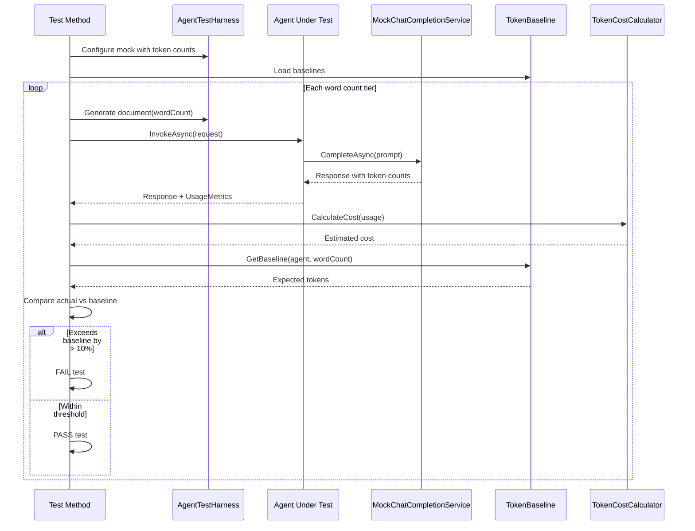

# LCS-DES-078d: Design Specification — Agent Token Benchmarks

## 1. Metadata & Categorization

| Field | Value | Description |
| :--- | :--- | :--- |
| **Feature ID** | `TST-078d` | Sub-part of TST-078 |
| **Feature Name** | `Agent Token Benchmarks (Cost Tracking)` | Token usage measurement and cost alerts |
| **Target Version** | `v0.7.8d` | Fourth sub-part of v0.7.8 |
| **Module Scope** | `Lexichord.Tests.Agents` | Test project |
| **Swimlane** | `Ensemble` | Part of Agents vertical |
| **License Tier** | `Core` | Testing available to all |
| **Feature Gate Key** | N/A | No gating for tests |
| **Author** | Lead Architect | |
| **Status** | `Draft` | |
| **Last Updated** | `2026-01-27` | |
| **Parent Document** | [LCS-DES-078-INDEX](./LCS-DES-078-INDEX.md) | |
| **Scope Breakdown** | [LCS-SBD-078 Section 3.4](./LCS-SBD-078.md#34-v078d-agent-token-benchmarks) | |

---

## 2. Executive Summary

### 2.1 The Requirement

LLM-powered agents consume tokens that directly translate to costs. Without tracking:

- Token usage could increase unnoticed after code changes
- Cost projections would be inaccurate
- Budget overruns could occur without warning
- No baseline exists for optimization efforts

> **Goal:** Establish token usage baselines for all agent operations and integrate with CI to alert when usage exceeds thresholds.

### 2.2 The Proposed Solution

Implement token benchmarking infrastructure that:

1. Measures token usage per agent per document size
2. Compares against established baselines
3. Fails CI builds when usage exceeds baseline by > 10%
4. Calculates estimated costs based on model pricing
5. Generates budget projection reports
6. Provides cost tracking dashboards

---

## 3. Architecture & Modular Strategy

### 3.1 Dependencies

#### 3.1.1 Systems Under Test

| Interface | Source Version | Purpose |
| :--- | :--- | :--- |
| `UsageMetrics` | v0.6.1c | Token usage tracking record |
| `EditorAgent` | v0.7.3b | Agent to benchmark |
| `SimplifierAgent` | v0.7.4b | Agent to benchmark |
| `TuningAgent` | v0.7.5b | Agent to benchmark |
| `SummarizerAgent` | v0.7.6b | Agent to benchmark |
| `IWorkflowEngine` | v0.7.7b | Workflow to benchmark |

#### 3.1.2 Test Infrastructure

| Component | Source Version | Purpose |
| :--- | :--- | :--- |
| `MockChatCompletionService` | v0.7.8b | Capture token counts |
| `AgentTestHarness` | v0.7.8b | Test configuration |

#### 3.1.3 NuGet Packages

| Package | Version | Purpose |
| :--- | :--- | :--- |
| `xunit` | 2.9.x | Test framework |
| `FluentAssertions` | 6.x | Fluent assertions |

### 3.2 Licensing Behavior

No licensing required. Test infrastructure only.

---

## 4. Data Contract (The API)

### 4.1 Token Usage Records

```csharp
namespace Lexichord.Tests.Agents.Benchmarks;

/// <summary>
/// Token usage metrics for a single agent operation.
/// </summary>
public record TokenUsageRecord
{
    /// <summary>
    /// The agent that was invoked.
    /// </summary>
    public required string AgentId { get; init; }

    /// <summary>
    /// Type of operation performed (e.g., "grammar-review", "simplify").
    /// </summary>
    public required string OperationType { get; init; }

    /// <summary>
    /// Number of tokens in the prompt.
    /// </summary>
    public required int PromptTokens { get; init; }

    /// <summary>
    /// Number of tokens in the completion.
    /// </summary>
    public required int CompletionTokens { get; init; }

    /// <summary>
    /// Total tokens (prompt + completion).
    /// </summary>
    public int TotalTokens => PromptTokens + CompletionTokens;

    /// <summary>
    /// Estimated cost in USD.
    /// </summary>
    public required decimal EstimatedCost { get; init; }

    /// <summary>
    /// Time taken for the operation.
    /// </summary>
    public required TimeSpan Duration { get; init; }

    /// <summary>
    /// Word count of the input document.
    /// </summary>
    public required int InputWordCount { get; init; }

    /// <summary>
    /// Tokens per word ratio (useful for estimation).
    /// </summary>
    public double TokensPerWord => InputWordCount > 0
        ? (double)TotalTokens / InputWordCount
        : 0;

    /// <summary>
    /// Timestamp of the measurement.
    /// </summary>
    public DateTimeOffset Timestamp { get; init; } = DateTimeOffset.UtcNow;

    /// <summary>
    /// Model used for the operation.
    /// </summary>
    public string? Model { get; init; }
}
```

### 4.2 Token Cost Calculator

```csharp
namespace Lexichord.Tests.Agents.Benchmarks;

/// <summary>
/// Calculates estimated costs based on token usage and model pricing.
/// </summary>
public class TokenCostCalculator
{
    private readonly IReadOnlyDictionary<string, ModelPricing> _pricing;

    /// <summary>
    /// Create calculator with default pricing.
    /// </summary>
    public TokenCostCalculator()
    {
        _pricing = DefaultPricing;
    }

    /// <summary>
    /// Create calculator with custom pricing.
    /// </summary>
    public TokenCostCalculator(IReadOnlyDictionary<string, ModelPricing> pricing)
    {
        _pricing = pricing;
    }

    /// <summary>
    /// Default pricing per 1K tokens (as of 2026).
    /// </summary>
    public static IReadOnlyDictionary<string, ModelPricing> DefaultPricing { get; } =
        new Dictionary<string, ModelPricing>
        {
            ["gpt-4o"] = new ModelPricing(
                InputPer1K: 0.005m,
                OutputPer1K: 0.015m,
                Description: "GPT-4o (default)"),

            ["gpt-4o-mini"] = new ModelPricing(
                InputPer1K: 0.00015m,
                OutputPer1K: 0.0006m,
                Description: "GPT-4o Mini (cost-optimized)"),

            ["gpt-4-turbo"] = new ModelPricing(
                InputPer1K: 0.01m,
                OutputPer1K: 0.03m,
                Description: "GPT-4 Turbo"),

            ["claude-3-5-sonnet"] = new ModelPricing(
                InputPer1K: 0.003m,
                OutputPer1K: 0.015m,
                Description: "Claude 3.5 Sonnet"),

            ["claude-3-opus"] = new ModelPricing(
                InputPer1K: 0.015m,
                OutputPer1K: 0.075m,
                Description: "Claude 3 Opus"),

            ["claude-3-haiku"] = new ModelPricing(
                InputPer1K: 0.00025m,
                OutputPer1K: 0.00125m,
                Description: "Claude 3 Haiku (cost-optimized)")
        };

    /// <summary>
    /// Calculate cost for a single operation.
    /// </summary>
    public decimal CalculateCost(string model, int promptTokens, int completionTokens)
    {
        if (!_pricing.TryGetValue(model, out var pricing))
        {
            throw new ArgumentException(
                $"Unknown model: {model}. Available models: {string.Join(", ", _pricing.Keys)}");
        }

        var inputCost = (promptTokens / 1000m) * pricing.InputPer1K;
        var outputCost = (completionTokens / 1000m) * pricing.OutputPer1K;

        return Math.Round(inputCost + outputCost, 6);
    }

    /// <summary>
    /// Calculate cost from usage metrics.
    /// </summary>
    public decimal CalculateCost(string model, UsageMetrics usage)
    {
        return CalculateCost(model, usage.PromptTokens, usage.CompletionTokens);
    }

    /// <summary>
    /// Estimate cost for a document of given word count.
    /// </summary>
    public decimal EstimateCost(
        string model,
        string agentId,
        int wordCount,
        TokenBaseline baseline)
    {
        var agentBaseline = baseline.GetBaseline(agentId, wordCount);
        return CalculateCost(model, agentBaseline.PromptTokens, agentBaseline.CompletionTokens);
    }

    /// <summary>
    /// Generate a budget report from usage records.
    /// </summary>
    public TokenBudgetReport GenerateReport(
        IEnumerable<TokenUsageRecord> records,
        BudgetConfiguration budget)
    {
        var recordList = records.ToList();

        var totalCost = recordList.Sum(r => r.EstimatedCost);
        var totalTokens = recordList.Sum(r => r.TotalTokens);

        var byAgent = recordList
            .GroupBy(r => r.AgentId)
            .ToDictionary(
                g => g.Key,
                g => new AgentCostSummary(
                    AgentId: g.Key,
                    TotalCost: g.Sum(r => r.EstimatedCost),
                    TotalTokens: g.Sum(r => r.TotalTokens),
                    OperationCount: g.Count(),
                    AverageTokensPerOperation: (int)g.Average(r => r.TotalTokens),
                    AverageCostPerOperation: g.Average(r => r.EstimatedCost)
                ));

        var byOperation = recordList
            .GroupBy(r => r.OperationType)
            .ToDictionary(
                g => g.Key,
                g => new OperationCostSummary(
                    OperationType: g.Key,
                    TotalCost: g.Sum(r => r.EstimatedCost),
                    TotalTokens: g.Sum(r => r.TotalTokens),
                    OperationCount: g.Count()
                ));

        // Calculate projections
        var timeSpan = recordList.Any()
            ? recordList.Max(r => r.Timestamp) - recordList.Min(r => r.Timestamp)
            : TimeSpan.Zero;

        var dailyRate = timeSpan.TotalDays > 0
            ? totalCost / (decimal)timeSpan.TotalDays
            : totalCost;

        return new TokenBudgetReport(
            TotalCost: totalCost,
            TotalTokens: totalTokens,
            RecordCount: recordList.Count,
            CostByAgent: byAgent,
            CostByOperation: byOperation,
            BudgetLimit: budget.DailyLimit,
            IsOverBudget: totalCost > budget.DailyLimit,
            BudgetUtilization: budget.DailyLimit > 0 ? totalCost / budget.DailyLimit : 0,
            ProjectedDailyCost: dailyRate,
            ProjectedMonthlyCost: dailyRate * 30,
            AlertThresholdReached: totalCost >= budget.DailyLimit * budget.AlertThreshold
        );
    }

    /// <summary>
    /// Get available models and their pricing.
    /// </summary>
    public IReadOnlyDictionary<string, ModelPricing> GetPricing() => _pricing;
}

/// <summary>
/// Pricing information for a model.
/// </summary>
public record ModelPricing(
    decimal InputPer1K,
    decimal OutputPer1K,
    string Description);

/// <summary>
/// Summary of costs for a single agent.
/// </summary>
public record AgentCostSummary(
    string AgentId,
    decimal TotalCost,
    int TotalTokens,
    int OperationCount,
    int AverageTokensPerOperation,
    decimal AverageCostPerOperation);

/// <summary>
/// Summary of costs for an operation type.
/// </summary>
public record OperationCostSummary(
    string OperationType,
    decimal TotalCost,
    int TotalTokens,
    int OperationCount);

/// <summary>
/// Budget configuration.
/// </summary>
public record BudgetConfiguration(
    decimal DailyLimit = 5.00m,
    decimal MonthlyLimit = 100.00m,
    decimal AlertThreshold = 0.80m);

/// <summary>
/// Complete budget report.
/// </summary>
public record TokenBudgetReport(
    decimal TotalCost,
    int TotalTokens,
    int RecordCount,
    IReadOnlyDictionary<string, AgentCostSummary> CostByAgent,
    IReadOnlyDictionary<string, OperationCostSummary> CostByOperation,
    decimal BudgetLimit,
    bool IsOverBudget,
    decimal BudgetUtilization,
    decimal ProjectedDailyCost,
    decimal ProjectedMonthlyCost,
    bool AlertThresholdReached);
```

### 4.3 Token Baseline

```csharp
namespace Lexichord.Tests.Agents.Benchmarks;

/// <summary>
/// Token usage baselines for CI threshold testing.
/// </summary>
public class TokenBaseline
{
    private readonly Dictionary<string, Dictionary<int, TokenBaselineEntry>> _baselines;

    public TokenBaseline()
    {
        _baselines = new Dictionary<string, Dictionary<int, TokenBaselineEntry>>();
    }

    /// <summary>
    /// Load baselines from JSON file.
    /// </summary>
    public static async Task<TokenBaseline> LoadAsync(string path)
    {
        var json = await File.ReadAllTextAsync(path);
        var data = JsonSerializer.Deserialize<TokenBaselineData>(json,
            new JsonSerializerOptions { PropertyNamingPolicy = JsonNamingPolicy.CamelCase });

        var baseline = new TokenBaseline();

        foreach (var (agentId, entries) in data?.Baselines ?? new())
        {
            baseline._baselines[agentId] = entries;
        }

        return baseline;
    }

    /// <summary>
    /// Save baselines to JSON file.
    /// </summary>
    public async Task SaveAsync(string path)
    {
        var data = new TokenBaselineData { Baselines = _baselines };
        var json = JsonSerializer.Serialize(data, new JsonSerializerOptions
        {
            WriteIndented = true,
            PropertyNamingPolicy = JsonNamingPolicy.CamelCase
        });

        await File.WriteAllTextAsync(path, json);
    }

    /// <summary>
    /// Get baseline for an agent and word count.
    /// </summary>
    public TokenBaselineEntry GetBaseline(string agentId, int wordCount)
    {
        if (!_baselines.TryGetValue(agentId, out var agentBaselines))
        {
            throw new ArgumentException($"No baseline for agent: {agentId}");
        }

        // Find closest baseline for word count
        var closest = agentBaselines
            .OrderBy(kvp => Math.Abs(kvp.Key - wordCount))
            .First();

        // Interpolate if exact match not found
        if (closest.Key == wordCount)
        {
            return closest.Value;
        }

        // Simple linear interpolation
        var ratio = (double)wordCount / closest.Key;
        return new TokenBaselineEntry(
            WordCount: wordCount,
            PromptTokens: (int)(closest.Value.PromptTokens * ratio),
            CompletionTokens: (int)(closest.Value.CompletionTokens * ratio)
        );
    }

    /// <summary>
    /// Set baseline for an agent and word count.
    /// </summary>
    public void SetBaseline(string agentId, TokenBaselineEntry entry)
    {
        if (!_baselines.ContainsKey(agentId))
        {
            _baselines[agentId] = new Dictionary<int, TokenBaselineEntry>();
        }

        _baselines[agentId][entry.WordCount] = entry;
    }

    /// <summary>
    /// Check if actual usage is within threshold of baseline.
    /// </summary>
    public bool IsWithinThreshold(
        string agentId,
        int wordCount,
        int actualTokens,
        double thresholdPercent = 0.10)
    {
        var baseline = GetBaseline(agentId, wordCount);
        var expectedTokens = baseline.PromptTokens + baseline.CompletionTokens;
        var threshold = expectedTokens * (1 + thresholdPercent);

        return actualTokens <= threshold;
    }

    /// <summary>
    /// Get all baselines for an agent.
    /// </summary>
    public IReadOnlyDictionary<int, TokenBaselineEntry>? GetAgentBaselines(string agentId)
    {
        return _baselines.TryGetValue(agentId, out var baselines) ? baselines : null;
    }
}

/// <summary>
/// Baseline entry for a specific word count.
/// </summary>
public record TokenBaselineEntry(
    int WordCount,
    int PromptTokens,
    int CompletionTokens)
{
    public int TotalTokens => PromptTokens + CompletionTokens;
}

/// <summary>
/// Serialization container for baselines.
/// </summary>
internal record TokenBaselineData
{
    public Dictionary<string, Dictionary<int, TokenBaselineEntry>> Baselines { get; init; } = new();
}
```

---

## 5. Implementation Logic

### 5.1 Benchmark Test Flow



### 5.2 Cost Calculation Flow

```text
CALCULATE cost for operation:
|
+-- Get model pricing:
|   +-- gpt-4o: $0.005/1K input, $0.015/1K output
|   +-- gpt-4o-mini: $0.00015/1K input, $0.0006/1K output
|
+-- Calculate input cost:
|   +-- inputCost = (promptTokens / 1000) * inputPer1K
|
+-- Calculate output cost:
|   +-- outputCost = (completionTokens / 1000) * outputPer1K
|
+-- Total cost = inputCost + outputCost
|
+-- Round to 6 decimal places
|
+-- RETURN cost in USD
```

---

## 6. Test Scenarios

### 6.1 AgentTokenBenchmarks

```csharp
namespace Lexichord.Tests.Agents.Benchmarks;

[Trait("Category", "Performance")]
[Trait("Version", "v0.7.8d")]
public class AgentTokenBenchmarks
{
    private readonly AgentTestHarness _harness;
    private readonly TokenCostCalculator _calculator;
    private readonly TokenBaseline _baseline;

    public AgentTokenBenchmarks()
    {
        _harness = new AgentTestHarness();
        _calculator = new TokenCostCalculator();
        _baseline = TokenBaseline.LoadAsync("Baselines/token-baselines.json")
            .GetAwaiter().GetResult();
    }

    #region Editor Agent Benchmarks

    [Theory]
    [InlineData(100)]
    [InlineData(500)]
    [InlineData(1000)]
    [InlineData(2000)]
    public async Task EditorAgent_TokenUsage_ByWordCount(int wordCount)
    {
        // Arrange
        var document = DocumentGenerator.Generate(wordCount);
        var expectedBaseline = _baseline.GetBaseline("editor", wordCount);

        _harness.WithResponse("grammar review", MockResponses.EditorGrammarResponse,
            promptTokens: expectedBaseline.PromptTokens,
            completionTokens: expectedBaseline.CompletionTokens);

        var agent = _harness.GetAgent<EditorAgent>();

        // Act
        var response = await agent.InvokeAsync(
            new AgentRequest("Review for grammar issues", Selection: document),
            CancellationToken.None);

        // Assert
        var record = new TokenUsageRecord
        {
            AgentId = "editor",
            OperationType = "grammar-review",
            PromptTokens = response.Usage.PromptTokens,
            CompletionTokens = response.Usage.CompletionTokens,
            EstimatedCost = _calculator.CalculateCost("gpt-4o", response.Usage),
            Duration = TimeSpan.Zero, // Not measured in mock
            InputWordCount = wordCount
        };

        // Log metrics for reporting
        LogTokenMetrics(record);

        // Verify within baseline
        _baseline.IsWithinThreshold("editor", wordCount, record.TotalTokens, 0.10)
            .Should().BeTrue(
                $"Editor agent for {wordCount} words used {record.TotalTokens} tokens, " +
                $"expected ~{expectedBaseline.TotalTokens} (±10%)");
    }

    #endregion

    #region Simplifier Agent Benchmarks

    [Theory]
    [InlineData(100)]
    [InlineData(500)]
    [InlineData(1000)]
    [InlineData(2000)]
    public async Task SimplifierAgent_TokenUsage_ByWordCount(int wordCount)
    {
        // Arrange
        var document = DocumentGenerator.Generate(wordCount);
        var expectedBaseline = _baseline.GetBaseline("simplifier", wordCount);

        _harness.WithResponse("simplify", MockResponses.SimplifierResponse,
            promptTokens: expectedBaseline.PromptTokens,
            completionTokens: expectedBaseline.CompletionTokens);

        var agent = _harness.GetAgent<SimplifierAgent>();

        // Act
        var response = await agent.InvokeAsync(
            new AgentRequest("Simplify for general audience", Selection: document),
            CancellationToken.None);

        // Assert
        _baseline.IsWithinThreshold("simplifier", wordCount, response.Usage.TotalTokens, 0.10)
            .Should().BeTrue(
                $"Simplifier agent for {wordCount} words exceeded baseline by >10%");
    }

    #endregion

    #region Tuning Agent Benchmarks

    [Theory]
    [InlineData(100)]
    [InlineData(500)]
    [InlineData(1000)]
    public async Task TuningAgent_TokenUsage_ByWordCount(int wordCount)
    {
        // Arrange
        var document = DocumentGenerator.Generate(wordCount);
        var expectedBaseline = _baseline.GetBaseline("tuning", wordCount);

        _harness.WithResponse("fix violations", MockResponses.TuningResponse,
            promptTokens: expectedBaseline.PromptTokens,
            completionTokens: expectedBaseline.CompletionTokens);

        var agent = _harness.GetAgent<TuningAgent>();

        // Act
        var response = await agent.InvokeAsync(
            new AgentRequest("Fix style violations", Selection: document),
            CancellationToken.None);

        // Assert
        _baseline.IsWithinThreshold("tuning", wordCount, response.Usage.TotalTokens, 0.10)
            .Should().BeTrue(
                $"Tuning agent for {wordCount} words exceeded baseline by >10%");
    }

    #endregion

    #region Summarizer Agent Benchmarks

    [Theory]
    [InlineData(100)]
    [InlineData(500)]
    [InlineData(1000)]
    [InlineData(5000)]
    public async Task SummarizerAgent_TokenUsage_ByWordCount(int wordCount)
    {
        // Arrange
        var document = DocumentGenerator.Generate(wordCount);
        var expectedBaseline = _baseline.GetBaseline("summarizer", wordCount);

        _harness.WithResponse("generate summary", MockResponses.SummarizerResponse,
            promptTokens: expectedBaseline.PromptTokens,
            completionTokens: expectedBaseline.CompletionTokens);

        var agent = _harness.GetAgent<SummarizerAgent>();

        // Act
        var response = await agent.InvokeAsync(
            new AgentRequest("Generate document summary", DocumentPath: "test.md"),
            CancellationToken.None);

        // Assert
        _baseline.IsWithinThreshold("summarizer", wordCount, response.Usage.TotalTokens, 0.10)
            .Should().BeTrue(
                $"Summarizer agent for {wordCount} words exceeded baseline by >10%");
    }

    #endregion

    #region Workflow Benchmarks

    [Fact]
    public async Task FullReviewWorkflow_TokenUsage_WithinBudget()
    {
        // Arrange
        const int wordCount = 1000;
        var document = DocumentGenerator.Generate(wordCount);

        _harness
            .WithResponse("editor", MockResponses.EditorGrammarResponse, 300, 200)
            .WithResponse("simplifier", MockResponses.SimplifierResponse, 350, 250)
            .WithResponse("tuning", MockResponses.TuningResponse, 280, 180);

        var workflow = await WorkflowLoader.LoadAsync("full-review.yaml");
        var context = new WorkflowContext(
            DocumentPath: "test.md",
            Selection: document,
            Variables: new Dictionary<string, object>
            {
                ["violations"] = new[] { new { RuleId = "r1" } },
                ["settings"] = new { simplify_enabled = true }
            }
        );

        // Expected budget: ~1500 tokens for 1000 word full review
        const int expectedMaxTokens = 1650; // 1500 + 10%

        // Act
        var result = await _harness.ExecuteWorkflowAsync(workflow, context);

        // Assert
        var totalTokens = result.TotalUsage.PromptTokens + result.TotalUsage.CompletionTokens;
        totalTokens.Should().BeLessThan(expectedMaxTokens,
            $"Full review workflow used {totalTokens} tokens, expected < {expectedMaxTokens}");

        var cost = _calculator.CalculateCost("gpt-4o",
            result.TotalUsage.PromptTokens,
            result.TotalUsage.CompletionTokens);
        cost.Should().BeLessThan(0.05m, "Full review should cost < $0.05");
    }

    #endregion

    #region Cost Estimation Tests

    [Theory]
    [InlineData("gpt-4o", 1000, 500, 0.0125)] // (1000*0.005 + 500*0.015) / 1000
    [InlineData("gpt-4o-mini", 1000, 500, 0.00045)] // (1000*0.00015 + 500*0.0006) / 1000
    [InlineData("claude-3-5-sonnet", 1000, 500, 0.0105)] // (1000*0.003 + 500*0.015) / 1000
    public void CalculateCost_ReturnsExpectedValue(
        string model,
        int promptTokens,
        int completionTokens,
        decimal expectedCost)
    {
        // Act
        var actualCost = _calculator.CalculateCost(model, promptTokens, completionTokens);

        // Assert
        actualCost.Should().BeApproximately(expectedCost, 0.0001m);
    }

    [Fact]
    public void CalculateCost_UnknownModel_Throws()
    {
        // Arrange
        var calculator = new TokenCostCalculator();

        // Act & Assert
        var act = () => calculator.CalculateCost("unknown-model", 100, 50);
        act.Should().Throw<ArgumentException>()
            .WithMessage("*unknown-model*");
    }

    #endregion

    private void LogTokenMetrics(TokenUsageRecord record)
    {
        // Log for CI reporting
        Console.WriteLine($"[TokenMetric] Agent={record.AgentId} " +
            $"Words={record.InputWordCount} " +
            $"Prompt={record.PromptTokens} " +
            $"Completion={record.CompletionTokens} " +
            $"Total={record.TotalTokens} " +
            $"Cost=${record.EstimatedCost:F6}");
    }
}
```

### 6.2 TokenUsageThresholdTests

```csharp
[Trait("Category", "Performance")]
[Trait("Version", "v0.7.8d")]
public class TokenUsageThresholdTests
{
    private readonly TokenBaseline _baseline;
    private readonly TokenCostCalculator _calculator;

    public TokenUsageThresholdTests()
    {
        _baseline = TokenBaseline.LoadAsync("Baselines/token-baselines.json")
            .GetAwaiter().GetResult();
        _calculator = new TokenCostCalculator();
    }

    #region CI Threshold Tests

    [Theory]
    [MemberData(nameof(GetAllAgentWordCountCombinations))]
    public void Agent_TokenUsage_WithinBaselineThreshold(
        string agentId,
        int wordCount)
    {
        // Arrange
        var baseline = _baseline.GetBaseline(agentId, wordCount);
        var maxAllowed = (int)(baseline.TotalTokens * 1.10); // 10% threshold

        // Simulate actual usage (in real tests, this comes from mock)
        var actualTokens = baseline.TotalTokens; // Baseline should pass

        // Assert
        actualTokens.Should().BeLessThanOrEqualTo(maxAllowed,
            $"Agent '{agentId}' for {wordCount} words: " +
            $"actual={actualTokens}, baseline={baseline.TotalTokens}, max={maxAllowed}");
    }

    public static IEnumerable<object[]> GetAllAgentWordCountCombinations()
    {
        var agents = new[] { "editor", "simplifier", "tuning", "summarizer" };
        var wordCounts = new[] { 100, 500, 1000, 2000 };

        foreach (var agent in agents)
        {
            foreach (var wordCount in wordCounts)
            {
                yield return new object[] { agent, wordCount };
            }
        }
    }

    #endregion

    #region Budget Alert Tests

    [Fact]
    public void BudgetReport_UnderDailyLimit_NotOverBudget()
    {
        // Arrange
        var records = new List<TokenUsageRecord>
        {
            CreateRecord("editor", 100, 50, 0.005m),
            CreateRecord("simplifier", 150, 75, 0.008m),
            CreateRecord("summarizer", 80, 40, 0.004m)
        };

        var budget = new BudgetConfiguration(DailyLimit: 5.00m);

        // Act
        var report = _calculator.GenerateReport(records, budget);

        // Assert
        report.IsOverBudget.Should().BeFalse();
        report.TotalCost.Should().Be(0.017m);
        report.BudgetUtilization.Should().BeLessThan(0.01m);
    }

    [Fact]
    public void BudgetReport_OverDailyLimit_IsOverBudget()
    {
        // Arrange
        var records = Enumerable.Range(0, 1000)
            .Select(_ => CreateRecord("editor", 500, 250, 0.01m))
            .ToList();

        var budget = new BudgetConfiguration(DailyLimit: 5.00m);

        // Act
        var report = _calculator.GenerateReport(records, budget);

        // Assert
        report.IsOverBudget.Should().BeTrue();
        report.TotalCost.Should().Be(10.00m);
    }

    [Fact]
    public void BudgetReport_At80Percent_AlertTriggered()
    {
        // Arrange
        var records = new List<TokenUsageRecord>
        {
            CreateRecord("editor", 1000, 500, 4.10m) // Just over 80% of $5 daily
        };

        var budget = new BudgetConfiguration(
            DailyLimit: 5.00m,
            AlertThreshold: 0.80m);

        // Act
        var report = _calculator.GenerateReport(records, budget);

        // Assert
        report.AlertThresholdReached.Should().BeTrue();
        report.IsOverBudget.Should().BeFalse();
    }

    [Fact]
    public void BudgetReport_GroupsByAgent()
    {
        // Arrange
        var records = new List<TokenUsageRecord>
        {
            CreateRecord("editor", 100, 50, 0.005m),
            CreateRecord("editor", 200, 100, 0.010m),
            CreateRecord("simplifier", 150, 75, 0.008m)
        };

        // Act
        var report = _calculator.GenerateReport(records, new BudgetConfiguration());

        // Assert
        report.CostByAgent.Should().HaveCount(2);
        report.CostByAgent["editor"].TotalCost.Should().Be(0.015m);
        report.CostByAgent["editor"].OperationCount.Should().Be(2);
        report.CostByAgent["simplifier"].TotalCost.Should().Be(0.008m);
    }

    #endregion

    #region Projection Tests

    [Fact]
    public void BudgetReport_CalculatesProjectedMonthlyCost()
    {
        // Arrange
        var records = new List<TokenUsageRecord>
        {
            CreateRecord("editor", 100, 50, 1.00m) // $1/day
        };

        var budget = new BudgetConfiguration(MonthlyLimit: 100.00m);

        // Act
        var report = _calculator.GenerateReport(records, budget);

        // Assert
        report.ProjectedMonthlyCost.Should().Be(30.00m); // $1 * 30 days
    }

    #endregion

    private static TokenUsageRecord CreateRecord(
        string agentId,
        int promptTokens,
        int completionTokens,
        decimal cost)
    {
        return new TokenUsageRecord
        {
            AgentId = agentId,
            OperationType = "test",
            PromptTokens = promptTokens,
            CompletionTokens = completionTokens,
            EstimatedCost = cost,
            Duration = TimeSpan.FromMilliseconds(100),
            InputWordCount = 500,
            Timestamp = DateTimeOffset.UtcNow
        };
    }
}
```

---

## 7. Token Baseline Configuration

```json
{
  "baselines": {
    "editor": {
      "100": {
        "wordCount": 100,
        "promptTokens": 200,
        "completionTokens": 150
      },
      "500": {
        "wordCount": 500,
        "promptTokens": 800,
        "completionTokens": 600
      },
      "1000": {
        "wordCount": 1000,
        "promptTokens": 1500,
        "completionTokens": 1000
      },
      "2000": {
        "wordCount": 2000,
        "promptTokens": 2800,
        "completionTokens": 1800
      }
    },
    "simplifier": {
      "100": {
        "wordCount": 100,
        "promptTokens": 250,
        "completionTokens": 200
      },
      "500": {
        "wordCount": 500,
        "promptTokens": 900,
        "completionTokens": 700
      },
      "1000": {
        "wordCount": 1000,
        "promptTokens": 1600,
        "completionTokens": 1200
      },
      "2000": {
        "wordCount": 2000,
        "promptTokens": 3000,
        "completionTokens": 2200
      }
    },
    "tuning": {
      "100": {
        "wordCount": 100,
        "promptTokens": 180,
        "completionTokens": 120
      },
      "500": {
        "wordCount": 500,
        "promptTokens": 700,
        "completionTokens": 500
      },
      "1000": {
        "wordCount": 1000,
        "promptTokens": 1300,
        "completionTokens": 900
      }
    },
    "summarizer": {
      "100": {
        "wordCount": 100,
        "promptTokens": 150,
        "completionTokens": 100
      },
      "500": {
        "wordCount": 500,
        "promptTokens": 600,
        "completionTokens": 400
      },
      "1000": {
        "wordCount": 1000,
        "promptTokens": 1100,
        "completionTokens": 700
      },
      "5000": {
        "wordCount": 5000,
        "promptTokens": 4500,
        "completionTokens": 2500
      }
    }
  },
  "pricing": {
    "gpt-4o": {
      "inputPer1K": 0.005,
      "outputPer1K": 0.015
    },
    "gpt-4o-mini": {
      "inputPer1K": 0.00015,
      "outputPer1K": 0.0006
    }
  },
  "budget": {
    "dailyLimit": 5.00,
    "monthlyLimit": 100.00,
    "alertThreshold": 0.80
  }
}
```

---

## 8. Observability & Logging

| Level | Message Template |
| :--- | :--- |
| Info | `"[TokenMetric] Agent={AgentId} Words={Words} Tokens={Tokens} Cost=${Cost}"` |
| Warning | `"Token usage exceeded baseline: {Agent} {Actual} > {Expected} (+{Percent}%)"` |
| Warning | `"Budget alert: ${Current} is {Percent}% of ${Limit} daily limit"` |
| Error | `"Budget exceeded: ${Current} > ${Limit}"` |
| Debug | `"Baseline loaded: {AgentCount} agents, {EntryCount} entries"` |

---

## 9. Acceptance Criteria

| # | Given | When | Then |
| :--- | :--- | :--- | :--- |
| 1 | Agent invoked | Token usage measured | Usage record created |
| 2 | Usage within 10% of baseline | CI runs | Test passes |
| 3 | Usage exceeds baseline by > 10% | CI runs | Test fails |
| 4 | Model and token counts | Cost calculated | Correct USD amount |
| 5 | Multiple usage records | Report generated | Grouped by agent |
| 6 | Daily spend at 80% of limit | Report generated | Alert threshold reached |
| 7 | Daily spend exceeds limit | Report generated | IsOverBudget = true |
| 8 | Usage records over time | Report generated | Monthly projection calculated |

---

## 10. Deliverable Checklist

| # | Deliverable | Status |
| :--- | :--- | :--- |
| 1 | `TokenUsageRecord.cs` | [ ] |
| 2 | `TokenCostCalculator.cs` | [ ] |
| 3 | `TokenBaseline.cs` | [ ] |
| 4 | `TokenBudgetReport.cs` | [ ] |
| 5 | `AgentTokenBenchmarks.cs` | [ ] |
| 6 | `TokenUsageThresholdTests.cs` | [ ] |
| 7 | `token-baselines.json` | [ ] |
| 8 | CI configuration for cost alerts | [ ] |
| 9 | `DocumentGenerator.cs` utility | [ ] |

---

## 11. Verification Commands

```bash
# Run all token benchmark tests
dotnet test --filter "Version=v0.7.8d" --logger "console;verbosity=detailed"

# Run threshold tests only
dotnet test --filter "FullyQualifiedName~TokenUsageThresholdTests"

# Run with custom baseline path
TOKEN_BASELINE_PATH=./custom-baselines.json dotnet test --filter "Version=v0.7.8d"

# Generate token report
dotnet run --project tools/TokenReportGenerator -- --output ./token-report.html
```

---

## 12. Future Enhancements

| Feature | Version | Description |
| :--- | :--- | :--- |
| Real-time cost dashboard | v0.8.x | Live cost monitoring in UI |
| Automatic baseline updates | v0.9.x | Update baselines on successful optimization |
| Multi-model comparison | v0.9.x | Compare costs across model providers |
| Budget enforcement | v1.0.x | Prevent operations when budget exceeded |

---

## Document History

| Version | Date | Author | Changes |
| :--- | :--- | :--- | :--- |
| 1.0 | 2026-01-27 | Lead Architect | Initial draft |
