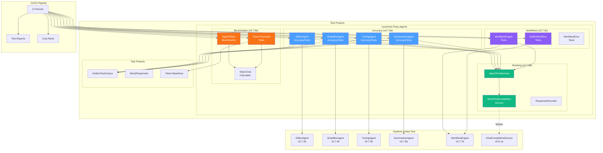
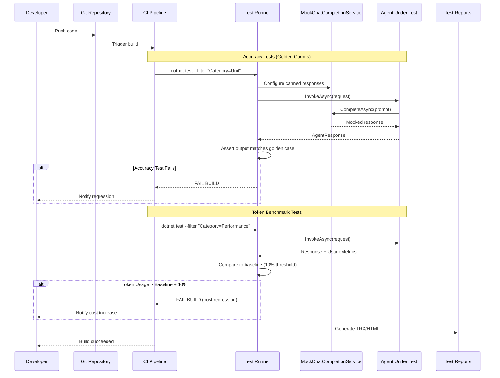

# LCS-DES-078: Design Specification Index — The Hardening (Agent Testing)

## Document Control

| Field | Value |
| :--- | :--- |
| **Document ID** | LCS-DES-078-INDEX |
| **Feature ID** | TST-078 |
| **Feature Name** | The Hardening (Agent Testing) |
| **Target Version** | v0.7.8 |
| **Module Scope** | Lexichord.Tests.Agents |
| **Swimlane** | Ensemble |
| **License Tier** | Core |
| **Feature Gate Key** | N/A (testing infrastructure) |
| **Status** | Draft |
| **Last Updated** | 2026-01-27 |

---

## 1. Executive Summary

**v0.7.8** delivers the **Hardening (Agent Testing)** — comprehensive test infrastructure proving the Specialist agents are in tune through unit tests, integration tests, and benchmarks.

### 1.1 The Problem

Lexichord's v0.7.x release series introduced sophisticated AI-powered agents:

- Editor Agent for grammar and clarity improvements
- Simplifier Agent for readability optimization
- Tuning Agent for style enforcement
- Summarizer Agent for metadata generation
- Workflow Engine for multi-agent orchestration

Without comprehensive testing, there is no guarantee these agents produce accurate results or maintain consistent behavior. LLM-powered features are inherently non-deterministic, making testing challenging. Token costs can spiral without visibility, and workflow regressions could silently degrade the user experience.

### 1.2 The Solution

Implement four test infrastructure components that:

1. **Agent Accuracy Corpus** — Golden test cases verify agent outputs match expected patterns
2. **LLM Response Mocking** — Deterministic testing without live API calls or costs
3. **Workflow Regression Tests** — Pipeline verification ensures workflows execute correctly
4. **Token Benchmarks** — Cost tracking establishes baselines and alerts on overruns

### 1.3 Business Value

| Value | Description |
| :--- | :--- |
| **Agent Confidence** | Verified accuracy against curated golden test cases |
| **Deterministic Testing** | Mock LLM enables fast, repeatable tests without API costs |
| **Regression Prevention** | CI failures catch accuracy degradation before release |
| **Cost Control** | Token benchmarks establish baselines for budget management |
| **Enterprise Compliance** | Verified agent behavior for audit requirements |
| **Foundation** | Testing patterns for all future agent development |

---

## 2. Related Documents

### 2.1 Scope Breakdown Document

The detailed scope breakdown for v0.7.8, including all sub-parts, implementation checklists, user stories, and acceptance criteria:

| Document | Description |
| :--- | :--- |
| **[LCS-SBD-078](./LCS-SBD-078.md)** | Scope Breakdown — The Hardening (Agent Testing) |

### 2.2 Sub-Part Design Specifications

Each sub-part has its own detailed design specification following the LDS-01 template:

| Sub-Part | Document | Title | Description |
| :--- | :--- | :--- | :--- |
| v0.7.8a | **[LCS-DES-078a](./LCS-DES-078a.md)** | Agent Accuracy Corpus | Golden test cases for all specialist agents |
| v0.7.8b | **[LCS-DES-078b](./LCS-DES-078b.md)** | LLM Response Mocking | Deterministic test outputs via mock providers |
| v0.7.8c | **[LCS-DES-078c](./LCS-DES-078c.md)** | Workflow Regression Tests | Pipeline verification for multi-agent workflows |
| v0.7.8d | **[LCS-DES-078d](./LCS-DES-078d.md)** | Agent Token Benchmarks | Cost tracking and budget alerts |

---

## 3. Architecture Overview

### 3.1 Component Diagram



### 3.2 Test Execution Flow



---

## 4. Dependencies

### 4.1 Upstream Dependencies (Systems Under Test)

| Interface | Source Version | Purpose |
| :--- | :--- | :--- |
| `IAgent` | v0.6.6a | Base agent interface |
| `IChatCompletionService` | v0.6.1a | LLM service to mock |
| `IAgentRegistry` | v0.7.1b | Agent discovery |
| `EditorAgent` | v0.7.3b | Grammar/clarity specialist |
| `SimplifierAgent` | v0.7.4b | Readability specialist |
| `TuningAgent` | v0.7.5b | Style enforcement specialist |
| `SummarizerAgent` | v0.7.6b | Metadata generation specialist |
| `IWorkflowEngine` | v0.7.7b | Multi-agent orchestration |
| `AgentWorkflow` | v0.7.7a | Workflow definition model |
| `UsageMetrics` | v0.6.1c | Token usage tracking |

### 4.2 NuGet Packages

| Package | Version | Purpose |
| :--- | :--- | :--- |
| `xunit` | 2.9.x | Test framework |
| `FluentAssertions` | 6.x | Fluent test assertions |
| `Moq` | 4.x | Mocking framework |
| `Verify.Xunit` | 26.x | Snapshot testing (NEW) |
| `coverlet.collector` | 6.x | Code coverage |

### 4.3 Downstream Consumers (Future)

| Version | Feature | Uses From v0.7.8 |
| :--- | :--- | :--- |
| v0.8.x | Advanced Agents | Testing patterns for new agents |
| v0.9.x | Enterprise | Audit reports from test results |
| v1.0.x | Release | Production readiness verification |

---

## 5. License Gating Strategy

Testing infrastructure is **Core** tier — no license gating required.

All tests run regardless of user license tier. Test code is development-only and not included in production builds.

---

## 6. Test Categories

### 6.1 Test Trait Organization

| Category | Trait Filter | Purpose |
| :--- | :--- | :--- |
| Unit | `Category=Unit` | Accuracy verification |
| Performance | `Category=Performance` | Token threshold enforcement |
| Integration | `Category=Integration` | Workflow integration |

| Version | Trait Filter | Sub-Part |
| :--- | :--- | :--- |
| v0.7.8a | `Version=v0.7.8a` | Accuracy corpus tests |
| v0.7.8b | `Version=v0.7.8b` | Mocking infrastructure tests |
| v0.7.8c | `Version=v0.7.8c` | Workflow regression tests |
| v0.7.8d | `Version=v0.7.8d` | Token benchmark tests |

### 6.2 CI Pipeline Commands

```bash
# Run all accuracy tests
dotnet test --filter "Category=Unit&Version~v0.7.8"

# Run all performance tests
dotnet test --filter "Category=Performance&Version~v0.7.8"

# Run specific version tests
dotnet test --filter "Version=v0.7.8a"

# Run all v0.7.8 tests
dotnet test --filter "Version~v0.7.8"

# Run with coverage
dotnet test --filter "Version~v0.7.8" --collect:"XPlat Code Coverage"
```

---

## 7. Key Test Scenarios Summary

### 7.1 Agent Accuracy (v0.7.8a)

| Agent | Categories | Test Cases | Key Verification |
| :--- | :--- | :--- | :--- |
| Editor | Grammar, Clarity, Structure | 50+ | Suggestions match expected patterns |
| Simplifier | Readability, Jargon, Audience | 50+ | Grade level reduction achieved |
| Tuning | Style Rules, Multi-violation | 50+ | Violations correctly resolved |
| Summarizer | Summaries, Metadata, Tags | 50+ | Metadata accurately extracted |

### 7.2 Mocking Infrastructure (v0.7.8b)

| Component | Purpose | Verification |
| :--- | :--- | :--- |
| MockChatCompletionService | Deterministic LLM responses | No live API calls |
| AgentTestHarness | Simplified test setup | Fluent configuration |
| ResponseRecorder | Test generation | Captured exchanges saved |

### 7.3 Workflow Regression (v0.7.8c)

| Scenario | Workflow | Verification |
| :--- | :--- | :--- |
| Sequential execution | Full Review | Agents invoked in order |
| Conditional steps | Quick Edit | Steps skipped when condition false |
| Error handling | Any | Workflow aborts on step failure |
| Output mapping | Multi-step | Data passed between steps |

### 7.4 Token Benchmarks (v0.7.8d)

| Agent | 500 words | 1000 words | Threshold |
| :--- | :--- | :--- | :--- |
| Editor | ~2000 tokens | ~3500 tokens | 10% variance |
| Simplifier | ~2100 tokens | ~3600 tokens | 10% variance |
| Tuning | ~1800 tokens | ~3000 tokens | 10% variance |
| Summarizer | ~1500 tokens | ~2500 tokens | 10% variance |
| Full Workflow | ~5000 tokens | ~8500 tokens | 10% variance |

---

## 8. Implementation Checklist Summary

| Sub-Part | Tasks | Est. Hours |
| :--- | :--- | :--- |
| v0.7.8a | Agent Accuracy Corpus (200+ test cases) | 22 |
| v0.7.8b | LLM Response Mocking Infrastructure | 12 |
| v0.7.8c | Workflow Regression Tests | 10 |
| v0.7.8d | Token Benchmarks & Cost Tracking | 9 |
| Integration | Project structure, CI config | 2 |
| **Total** | | **55 hours** |

See [LCS-SBD-078](./LCS-SBD-078.md) Section 4 for the detailed task breakdown.

---

## 9. Success Criteria Summary

| Category | Criterion | Target |
| :--- | :--- | :--- |
| **Accuracy Tests** | Golden test cases per agent | 50+ |
| **Mock Coverage** | Tests using mocks | 100% |
| **Workflow Coverage** | Built-in workflows tested | All |
| **Token Baseline** | Variance threshold | 10% |
| **CI Integration** | Regressions caught | 100% |
| **Test Execution** | Total test time | < 60s |

See [LCS-SBD-078](./LCS-SBD-078.md) Section 9 for full success metrics.

---

## 10. Test Coverage Summary

| Sub-Part | Test File | Coverage Area |
| :--- | :--- | :--- |
| v0.7.8a | `EditorAgentAccuracyTests.cs` | Grammar, clarity, structure |
| v0.7.8a | `SimplifierAgentAccuracyTests.cs` | Readability, jargon, audience |
| v0.7.8a | `TuningAgentAccuracyTests.cs` | Style rules, multi-violation |
| v0.7.8a | `SummarizerAgentAccuracyTests.cs` | Summaries, metadata, tags |
| v0.7.8b | `MockChatCompletionService.cs` | LLM response mocking |
| v0.7.8b | `AgentTestHarness.cs` | Test configuration |
| v0.7.8c | `WorkflowEngineTests.cs` | Workflow orchestration |
| v0.7.8c | `BuiltInWorkflowTests.cs` | Pre-defined workflows |
| v0.7.8c | `WorkflowErrorHandlingTests.cs` | Failure scenarios |
| v0.7.8d | `AgentTokenBenchmarks.cs` | Token usage measurement |
| v0.7.8d | `TokenUsageThresholdTests.cs` | CI cost alerts |

See individual design specs for detailed test scenarios.

---

## 11. What This Enables

| Version | Feature | Uses From v0.7.8 |
| :--- | :--- | :--- |
| v0.8.x | Advanced Agents | Testing patterns for rapid development |
| v0.9.x | Enterprise | Compliance audit from test reports |
| v1.0.x | Release | Production readiness verification |
| Future | Token Budgeting | Cost alerts in production |

---

## 12. Cross-Reference Matrix

### 12.1 Test Dependencies on Prior Sub-Parts

| Test Area | Depends On | Reason |
| :--- | :--- | :--- |
| Editor Accuracy | v0.7.3b EditorAgent | Agent under test |
| Simplifier Accuracy | v0.7.4b SimplifierAgent | Agent under test |
| Tuning Accuracy | v0.7.5b TuningAgent | Agent under test |
| Summarizer Accuracy | v0.7.6b SummarizerAgent | Agent under test |
| Workflow Tests | v0.7.7b WorkflowEngine | Engine under test |
| All Tests | v0.6.1a IChatCompletionService | Service to mock |

### 12.2 Sub-Part Inter-Dependencies

| Sub-Part | Depends On | Reason |
| :--- | :--- | :--- |
| v0.7.8a | v0.7.8b | Uses MockChatCompletionService |
| v0.7.8c | v0.7.8b | Uses AgentTestHarness |
| v0.7.8d | v0.7.8b | Uses mock for token capture |

---

## Document History

| Version | Date | Author | Changes |
| :--- | :--- | :--- | :--- |
| 1.0 | 2026-01-27 | Lead Architect | Initial draft |
