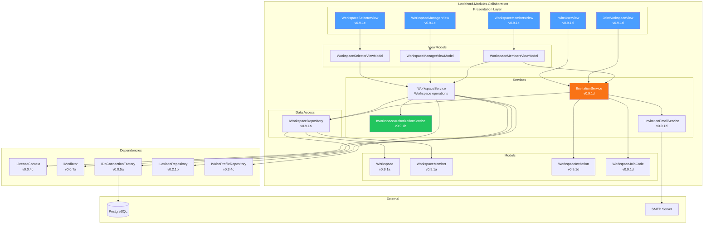
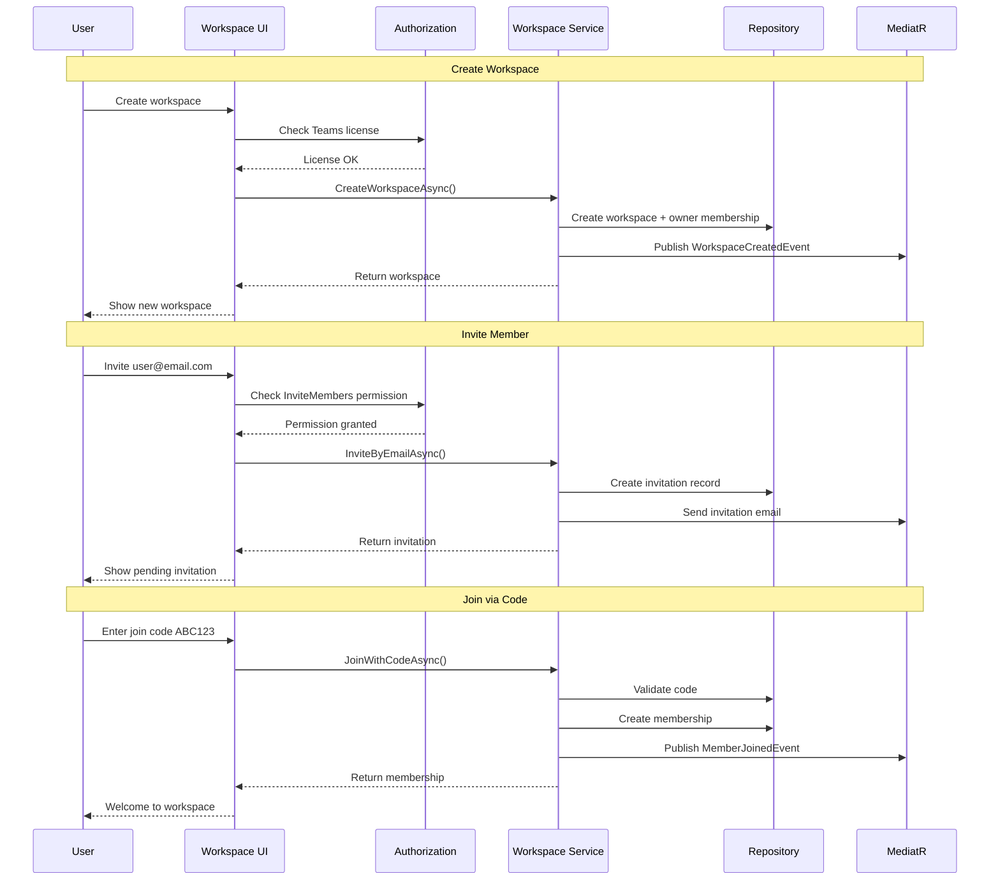

# LCS-DES-091: Design Specification Index — Team Workspace

## Document Control

| Field | Value |
| :--- | :--- |
| **Document ID** | LCS-DES-091-INDEX |
| **Feature ID** | COL-091 |
| **Feature Name** | Team Workspace (The Rehearsal Hall) |
| **Target Version** | v0.9.1 |
| **Module Scope** | Lexichord.Modules.Collaboration |
| **Swimlane** | Collaboration |
| **License Tier** | Teams |
| **Feature Gate Key** | `team_workspaces` |
| **Status** | Draft |
| **Last Updated** | 2026-01-27 |

---

## 1. Executive Summary

**v0.9.1** delivers the **Team Workspace** — shared collaborative environments where writing teams can work together on projects with shared Lexicons, Voice Profiles, and style guides.

### 1.1 The Problem

Lexichord currently operates as a single-user application. Organizations with multiple writers face challenges:

- Each writer maintains separate Lexicons and Voice Profiles
- No mechanism to share style guidelines across teams
- Inconsistent terminology usage across collaborative projects
- No visibility into team writing standards

### 1.2 The Solution

Implement team workspaces that:

1. **Centralize Resources** — Shared Lexicons and Voice Profiles accessible to all team members
2. **Control Access** — Role-based permissions (Owner, Editor, Viewer) for resource management
3. **Simplify Onboarding** — Email invitations and join codes for easy team growth
4. **Enable Collaboration** — Seamless switching between personal and team contexts

### 1.3 Business Value

| Value | Description |
| :--- | :--- |
| **Team Collaboration** | Multiple writers working with synchronized resources |
| **Brand Consistency** | Organizational terminology and voice standards enforced |
| **Role-Based Security** | Granular permissions protect sensitive content |
| **Flexible Onboarding** | Email invites and join codes enable rapid team expansion |
| **Enterprise Foundation** | Groundwork for SSO, audit logging, compliance features |

---

## 2. Related Documents

### 2.1 Scope Breakdown Document

The detailed scope breakdown for v0.9.1, including all sub-parts, implementation checklists, user stories, and acceptance criteria:

| Document | Description |
| :--- | :--- |
| **[LCS-SBD-091](./LCS-SBD-091.md)** | Scope Breakdown — Team Workspace |

### 2.2 Sub-Part Design Specifications

Each sub-part has its own detailed design specification following the LDS-01 template:

| Sub-Part | Document | Title | Description |
| :--- | :--- | :--- | :--- |
| v0.9.1a | **[LCS-DES-091a](./LCS-DES-091a.md)** | Workspace Schema | Data models, database schema, repository interfaces |
| v0.9.1b | **[LCS-DES-091b](./LCS-DES-091b.md)** | User Roles | Role-based access control, permission system |
| v0.9.1c | **[LCS-DES-091c](./LCS-DES-091c.md)** | Workspace UI | Workspace switcher, manager, member views |
| v0.9.1d | **[LCS-DES-091d](./LCS-DES-091d.md)** | Invitation System | Email invites, join codes, onboarding flows |

---

## 3. Architecture Overview

### 3.1 Component Diagram

### 3.2 Data Flow Overview

---

## 4. Dependencies

### 4.1 Upstream Dependencies

| Interface | Source Version | Purpose |
| :--- | :--- | :--- |
| `ILicenseContext` | v0.0.4c | Verify Teams tier for workspace creation |
| `IMediator` | v0.0.7a | Publish workspace lifecycle events |
| `IDbConnectionFactory` | v0.0.5a | PostgreSQL database connections |
| `ISecureVault` | v0.0.6a | Store workspace-level secrets |
| `ILexiconRepository` | v0.2.1b | Associate Lexicons with workspaces |
| `IVoiceProfileRepository` | v0.3.4c | Associate Voice Profiles with workspaces |
| `IRegionManager` | v0.1.1b | Navigate UI when switching workspaces |
| `ISettingsService` | v0.1.6a | Store active workspace preference |

### 4.2 NuGet Packages

| Package | Version | Purpose |
| :--- | :--- | :--- |
| `Dapper` | 2.x | Database ORM |
| `Npgsql` | 8.x | PostgreSQL driver |
| `MediatR` | 12.x | Event publishing |
| `CommunityToolkit.Mvvm` | 8.x | MVVM framework |
| `FluentEmail` | 3.x | Email sending (NEW) |

### 4.3 Downstream Consumers (Future)

| Version | Feature | Uses From v0.9.1 |
| :--- | :--- | :--- |
| v0.9.2 | Shared Resources | Workspace-scoped Lexicons and Profiles |
| v0.9.3 | Real-time Notifications | Workspace events for live updates |
| v0.9.4 | Activity Feed | Workspace event history |
| v0.10.x | Enterprise Features | SSO, audit logging, compliance |

---

## 5. License Gating Strategy

Team Workspace is a **Teams** tier feature.

### 5.1 Feature Gates

| Feature | Core | WriterPro | Teams | Enterprise |
| :--- | :--- | :--- | :--- | :--- |
| Personal workspace | Yes | Yes | Yes | Yes |
| Create team workspace | No | No | Yes | Yes |
| Join team workspace (as Viewer) | No | Yes* | Yes | Yes |
| Join team workspace (as Editor) | No | No | Yes | Yes |
| Invite members | No | No | Yes | Yes |
| Generate join codes | No | No | Yes | Yes |
| Unlimited workspaces | No | No | Yes | Yes |

*WriterPro users can join as Viewers if the workspace owner has Teams license.

### 5.2 UI Gating

| Element | Non-Teams Behavior |
| :--- | :--- |
| "Create Team Workspace" button | Disabled with "[Upgrade to Teams]" tooltip |
| "Invite Member" button | Hidden |
| "Generate Join Code" button | Hidden |
| Role dropdown | Disabled for non-Owners |

---

## 6. Sub-Part Summary

### 6.1 v0.9.1a: Workspace Schema

**Goal:** Define data structures for workspaces, members, and settings.

| Component | Description |
| :--- | :--- |
| `Workspace` record | Core workspace entity with name, description, owner |
| `WorkspaceMember` record | Links users to workspaces with roles |
| `WorkspaceSettings` record | Per-workspace configuration |
| `IWorkspaceRepository` | Data access interface |
| `Migration_091_TeamWorkspaces` | PostgreSQL schema creation |

See [LCS-DES-091a](./LCS-DES-091a.md) for full specification.

### 6.2 v0.9.1b: User Roles

**Goal:** Implement role-based access control for workspace operations.

| Component | Description |
| :--- | :--- |
| `WorkspaceRole` enum | Owner, Editor, Viewer |
| `WorkspacePermission` flags | Granular permission bits |
| `IWorkspaceAuthorizationService` | Permission checking interface |
| `WorkspaceAccessDeniedException` | Authorization failure exception |

See [LCS-DES-091b](./LCS-DES-091b.md) for full specification.

### 6.3 v0.9.1c: Workspace UI

**Goal:** Create user interface for workspace management and switching.

| Component | Description |
| :--- | :--- |
| `WorkspaceSelectorView` | Title bar dropdown for switching |
| `WorkspaceManagerView` | Dialog for creating/editing workspaces |
| `WorkspaceMembersView` | Panel for member management |
| ViewModels | MVVM implementations for all views |

See [LCS-DES-091c](./LCS-DES-091c.md) for full specification.

### 6.4 v0.9.1d: Invitation System

**Goal:** Implement email invitations and shareable join codes.

| Component | Description |
| :--- | :--- |
| `WorkspaceInvitation` record | Pending email invitation |
| `WorkspaceJoinCode` record | Shareable join code |
| `IInvitationService` | Invitation management interface |
| `InviteUserView` | Email invitation dialog |
| `JoinWorkspaceView` | Join code entry dialog |

See [LCS-DES-091d](./LCS-DES-091d.md) for full specification.

---

## 7. Key Scenarios Summary

### 7.1 Workspace Management

| Scenario | Actor | Expected Outcome |
| :--- | :--- | :--- |
| Create workspace | Teams user | Workspace created, user is Owner |
| Delete workspace | Owner | Workspace and all members removed |
| Archive workspace | Owner | Workspace hidden, data preserved |
| Update workspace settings | Owner | Settings saved immediately |

### 7.2 Member Management

| Scenario | Actor | Expected Outcome |
| :--- | :--- | :--- |
| Invite by email | Owner | Invitation email sent |
| Generate join code | Owner | 6-character code created |
| Accept invitation | Invitee | User added as member |
| Join via code | Any user | User added with default role |
| Change member role | Owner | Role updated immediately |
| Remove member | Owner | Member removed from workspace |

### 7.3 Workspace Switching

| Scenario | Actor | Expected Outcome |
| :--- | :--- | :--- |
| Switch to team workspace | Member | UI shows team resources |
| Switch to personal | Any user | UI shows personal resources |
| Switch without membership | Non-member | Access denied |

---

## 8. Implementation Checklist Summary

| Sub-Part | Tasks | Est. Hours |
| :--- | :--- | :--- |
| v0.9.1a | Workspace Schema | 9.5 |
| v0.9.1b | User Roles | 7 |
| v0.9.1c | Workspace UI | 15.5 |
| v0.9.1d | Invitation System | 14 |
| Integration | Tests, DI registration | 4 |
| **Total** | | **50 hours** |

See [LCS-SBD-091](./LCS-SBD-091.md) Section 4 for the detailed task breakdown.

---

## 9. Success Criteria Summary

| Category | Criterion | Target |
| :--- | :--- | :--- |
| **Workspace Creation** | Time to create workspace | < 500ms |
| **Workspace Switching** | Time to switch workspace | < 200ms |
| **Member Load** | Load 100 members | < 500ms |
| **Permission Check** | Authorization latency | < 10ms |
| **Invitation Delivery** | Email delivery rate | > 95% |
| **Join Code Acceptance** | Code validation time | < 300ms |

See [LCS-SBD-091](./LCS-SBD-091.md) Section 9 for full success metrics.

---

## 10. MediatR Events

| Event | Published When |
| :--- | :--- |
| `WorkspaceCreatedEvent` | New workspace created |
| `WorkspaceSwitchingEvent` | Before switching workspaces |
| `WorkspaceSwitchedEvent` | After switch completes |
| `WorkspaceMemberJoinedEvent` | Member joins workspace |
| `WorkspaceMemberRoleChangedEvent` | Member role updated |
| `WorkspaceMemberRemovedEvent` | Member removed |
| `WorkspaceInvitationSentEvent` | Email invitation sent |
| `WorkspaceJoinCodeCreatedEvent` | Join code generated |

---

## 11. What This Enables

| Version | Feature | Uses From v0.9.1 |
| :--- | :--- | :--- |
| v0.9.2 | Shared Resources | Workspace-scoped Lexicon and Voice Profile queries |
| v0.9.3 | Real-time Collaboration | WebSocket connections per workspace |
| v0.9.4 | Activity Feed | Event history stored per workspace |
| v0.10.x | Enterprise SSO | Workspace-level authentication policies |
| v0.10.x | Audit Logging | Workspace events for compliance |

---

## Document History

| Version | Date | Author | Changes |
| :--- | :--- | :--- | :--- |
| 1.0 | 2026-01-27 | Lead Architect | Initial draft |
