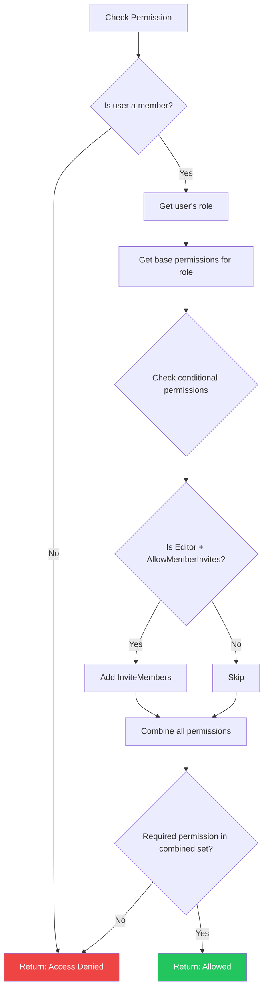

# LCS-DES-091b: Design Specification — User Roles

## 1. Metadata & Categorization

| Field | Value | Description |
| :--- | :--- | :--- |
| **Feature ID** | `COL-091b` | Sub-part of COL-091 |
| **Feature Name** | `User Roles` | Role-based access control |
| **Target Version** | `v0.9.1b` | Second sub-part of v0.9.1 |
| **Module Scope** | `Lexichord.Modules.Collaboration` | Collaboration module |
| **Swimlane** | `Collaboration` | Team features vertical |
| **License Tier** | `Teams` | Requires Teams license |
| **Feature Gate Key** | `team_workspaces` | License feature key |
| **Author** | Lead Architect | |
| **Status** | `Draft` | |
| **Last Updated** | `2026-01-27` | |
| **Parent Document** | [LCS-DES-091-INDEX](./LCS-DES-091-INDEX.md) | |
| **Scope Breakdown** | [LCS-SBD-091 Section 3.2](./LCS-SBD-091.md#32-v091b-user-roles) | |

---

## 2. Executive Summary

### 2.1 The Requirement

Workspaces need granular access control to protect content and manage team hierarchy. Without role-based authorization:

- Any member could delete workspace resources
- No way to have read-only collaborators
- Owners cannot delegate editing without risking administrative control
- No audit trail for permission-related decisions

> **Goal:** Implement a permission system where Owners have full control, Editors can modify resources, and Viewers have read-only access.

### 2.2 The Proposed Solution

Implement role-based access control (RBAC) that:

1. Defines three roles: **Owner**, **Editor**, **Viewer**
2. Uses `WorkspacePermission` flags for granular permission bits
3. Provides `IWorkspaceAuthorizationService` for permission checking
4. Throws `WorkspaceAccessDeniedException` on unauthorized operations
5. Publishes MediatR events when roles change
6. Supports conditional permissions (e.g., Editors can invite if setting enabled)

---

## 3. Architecture & Modular Strategy

### 3.1 Dependencies

#### 3.1.1 Required Services

| Interface | Source Version | Purpose |
| :--- | :--- | :--- |
| `IWorkspaceRepository` | v0.9.1a | Retrieve membership and role data |
| `IMediator` | v0.0.7a | Publish role change events |
| `Serilog.ILogger` | v0.0.3b | Log authorization decisions |

#### 3.1.2 NuGet Packages

| Package | Version | Purpose |
| :--- | :--- | :--- |
| `MediatR` | 12.x | Event publishing |

### 3.2 Licensing Behavior

Authorization service does not perform license checks. License verification occurs in the workspace service layer. A user with valid workspace membership can access that workspace regardless of their personal license tier.

---

## 4. Data Contract (The API)

### 4.1 Permission Flags

```csharp
namespace Lexichord.Modules.Collaboration.Authorization;

/// <summary>
/// Flags representing specific workspace permissions.
/// Each permission is a single bit, allowing efficient combination and checking.
/// </summary>
[Flags]
public enum WorkspacePermission
{
    /// <summary>No permissions.</summary>
    None = 0,

    // ═══════════════════════════════════════════════════════════════════════
    // Resource Viewing (bits 0-4)
    // ═══════════════════════════════════════════════════════════════════════

    /// <summary>Can view workspace metadata and dashboard.</summary>
    ViewWorkspace = 1 << 0,

    /// <summary>Can view Lexicons in the workspace.</summary>
    ViewLexicons = 1 << 1,

    /// <summary>Can view Voice Profiles in the workspace.</summary>
    ViewVoiceProfiles = 1 << 2,

    /// <summary>Can view documents in the workspace.</summary>
    ViewDocuments = 1 << 3,

    /// <summary>Can view the member list.</summary>
    ViewMembers = 1 << 4,

    // ═══════════════════════════════════════════════════════════════════════
    // Resource Editing (bits 5-7)
    // ═══════════════════════════════════════════════════════════════════════

    /// <summary>Can edit existing Lexicons (add/modify/remove terms).</summary>
    EditLexicons = 1 << 5,

    /// <summary>Can edit existing Voice Profiles.</summary>
    EditVoiceProfiles = 1 << 6,

    /// <summary>Can edit documents.</summary>
    EditDocuments = 1 << 7,

    // ═══════════════════════════════════════════════════════════════════════
    // Resource Creation/Deletion (bits 8-11)
    // ═══════════════════════════════════════════════════════════════════════

    /// <summary>Can create new Lexicons.</summary>
    CreateLexicons = 1 << 8,

    /// <summary>Can create new Voice Profiles.</summary>
    CreateVoiceProfiles = 1 << 9,

    /// <summary>Can delete Lexicons.</summary>
    DeleteLexicons = 1 << 10,

    /// <summary>Can delete Voice Profiles.</summary>
    DeleteVoiceProfiles = 1 << 11,

    // ═══════════════════════════════════════════════════════════════════════
    // Member Management (bits 12-14)
    // ═══════════════════════════════════════════════════════════════════════

    /// <summary>Can invite new members to the workspace.</summary>
    InviteMembers = 1 << 12,

    /// <summary>Can remove members from the workspace.</summary>
    RemoveMembers = 1 << 13,

    /// <summary>Can change member roles.</summary>
    ChangeRoles = 1 << 14,

    // ═══════════════════════════════════════════════════════════════════════
    // Workspace Management (bits 15-17)
    // ═══════════════════════════════════════════════════════════════════════

    /// <summary>Can modify workspace settings.</summary>
    EditWorkspaceSettings = 1 << 15,

    /// <summary>Can delete the workspace.</summary>
    DeleteWorkspace = 1 << 16,

    /// <summary>Can transfer ownership to another member.</summary>
    TransferOwnership = 1 << 17,

    // ═══════════════════════════════════════════════════════════════════════
    // Composite Permissions (Role Definitions)
    // ═══════════════════════════════════════════════════════════════════════

    /// <summary>
    /// All viewing permissions - the baseline for Viewer role.
    /// </summary>
    ViewerPermissions =
        ViewWorkspace |
        ViewLexicons |
        ViewVoiceProfiles |
        ViewDocuments |
        ViewMembers,

    /// <summary>
    /// All viewer permissions plus editing and creation - the Editor role.
    /// </summary>
    EditorPermissions =
        ViewerPermissions |
        EditLexicons |
        EditVoiceProfiles |
        EditDocuments |
        CreateLexicons |
        CreateVoiceProfiles,

    /// <summary>
    /// All permissions - the Owner role.
    /// </summary>
    OwnerPermissions =
        EditorPermissions |
        DeleteLexicons |
        DeleteVoiceProfiles |
        InviteMembers |
        RemoveMembers |
        ChangeRoles |
        EditWorkspaceSettings |
        DeleteWorkspace |
        TransferOwnership,

    /// <summary>
    /// All possible permissions.
    /// </summary>
    All = OwnerPermissions
}
```

### 4.2 Authorization Service Interface

```csharp
namespace Lexichord.Modules.Collaboration.Authorization;

/// <summary>
/// Service for checking workspace permissions and managing role-based access.
/// </summary>
public interface IWorkspaceAuthorizationService
{
    /// <summary>
    /// Gets all permissions for a user in a workspace based on their role.
    /// </summary>
    /// <param name="workspaceId">The workspace to check.</param>
    /// <param name="userId">The user to check.</param>
    /// <param name="ct">Cancellation token.</param>
    /// <returns>The combined permissions for the user, or None if not a member.</returns>
    Task<WorkspacePermission> GetPermissionsAsync(
        Guid workspaceId,
        Guid userId,
        CancellationToken ct = default);

    /// <summary>
    /// Checks if a user has a specific permission in a workspace.
    /// </summary>
    /// <param name="workspaceId">The workspace to check.</param>
    /// <param name="userId">The user to check.</param>
    /// <param name="permission">The required permission.</param>
    /// <param name="ct">Cancellation token.</param>
    /// <returns>True if the user has the permission.</returns>
    Task<bool> HasPermissionAsync(
        Guid workspaceId,
        Guid userId,
        WorkspacePermission permission,
        CancellationToken ct = default);

    /// <summary>
    /// Ensures a user has a specific permission, throwing if not authorized.
    /// </summary>
    /// <param name="workspaceId">The workspace to check.</param>
    /// <param name="userId">The user to check.</param>
    /// <param name="permission">The required permission.</param>
    /// <param name="ct">Cancellation token.</param>
    /// <exception cref="WorkspaceAccessDeniedException">
    /// Thrown when the user lacks the required permission.
    /// </exception>
    Task EnsurePermissionAsync(
        Guid workspaceId,
        Guid userId,
        WorkspacePermission permission,
        CancellationToken ct = default);

    /// <summary>
    /// Checks multiple permissions and returns which ones the user has.
    /// </summary>
    /// <param name="workspaceId">The workspace to check.</param>
    /// <param name="userId">The user to check.</param>
    /// <param name="permissions">The permissions to check.</param>
    /// <param name="ct">Cancellation token.</param>
    /// <returns>Dictionary of permission to granted status.</returns>
    Task<IReadOnlyDictionary<WorkspacePermission, bool>> CheckPermissionsAsync(
        Guid workspaceId,
        Guid userId,
        IEnumerable<WorkspacePermission> permissions,
        CancellationToken ct = default);

    /// <summary>
    /// Gets the role for a user in a workspace.
    /// </summary>
    /// <param name="workspaceId">The workspace to check.</param>
    /// <param name="userId">The user to check.</param>
    /// <param name="ct">Cancellation token.</param>
    /// <returns>The user's role, or null if not a member.</returns>
    Task<WorkspaceRole?> GetRoleAsync(
        Guid workspaceId,
        Guid userId,
        CancellationToken ct = default);

    /// <summary>
    /// Changes a member's role in a workspace.
    /// </summary>
    /// <param name="workspaceId">The workspace.</param>
    /// <param name="targetUserId">The user whose role is changing.</param>
    /// <param name="newRole">The new role to assign.</param>
    /// <param name="changedBy">The user making the change.</param>
    /// <param name="ct">Cancellation token.</param>
    /// <exception cref="WorkspaceAccessDeniedException">
    /// Thrown when changedBy lacks ChangeRoles permission.
    /// </exception>
    /// <exception cref="InvalidOperationException">
    /// Thrown when trying to demote the last Owner.
    /// </exception>
    Task ChangeRoleAsync(
        Guid workspaceId,
        Guid targetUserId,
        WorkspaceRole newRole,
        Guid changedBy,
        CancellationToken ct = default);

    /// <summary>
    /// Transfers workspace ownership to another member.
    /// </summary>
    /// <param name="workspaceId">The workspace.</param>
    /// <param name="newOwnerId">The user to become the new owner.</param>
    /// <param name="currentOwnerId">The current owner transferring ownership.</param>
    /// <param name="ct">Cancellation token.</param>
    Task TransferOwnershipAsync(
        Guid workspaceId,
        Guid newOwnerId,
        Guid currentOwnerId,
        CancellationToken ct = default);
}
```

### 4.3 Exception Type

```csharp
namespace Lexichord.Modules.Collaboration.Authorization;

/// <summary>
/// Exception thrown when a user attempts an operation they are not authorized for.
/// </summary>
public class WorkspaceAccessDeniedException : Exception
{
    /// <summary>
    /// The workspace where access was denied.
    /// </summary>
    public Guid WorkspaceId { get; }

    /// <summary>
    /// The user who was denied access.
    /// </summary>
    public Guid UserId { get; }

    /// <summary>
    /// The permission that was required but not granted.
    /// </summary>
    public WorkspacePermission RequiredPermission { get; }

    /// <summary>
    /// The user's actual role in the workspace (null if not a member).
    /// </summary>
    public WorkspaceRole? ActualRole { get; }

    public WorkspaceAccessDeniedException(
        Guid workspaceId,
        Guid userId,
        WorkspacePermission requiredPermission,
        WorkspaceRole? actualRole = null)
        : base(BuildMessage(workspaceId, userId, requiredPermission, actualRole))
    {
        WorkspaceId = workspaceId;
        UserId = userId;
        RequiredPermission = requiredPermission;
        ActualRole = actualRole;
    }

    private static string BuildMessage(
        Guid workspaceId,
        Guid userId,
        WorkspacePermission requiredPermission,
        WorkspaceRole? actualRole)
    {
        var roleDescription = actualRole.HasValue
            ? $"role {actualRole.Value}"
            : "not a member";

        return $"User {userId} ({roleDescription}) lacks permission " +
               $"{requiredPermission} in workspace {workspaceId}";
    }
}
```

### 4.4 MediatR Events

```csharp
namespace Lexichord.Modules.Collaboration.Events;

/// <summary>
/// Published when a member's role is changed.
/// </summary>
public record WorkspaceMemberRoleChangedEvent(
    Guid WorkspaceId,
    Guid UserId,
    WorkspaceRole OldRole,
    WorkspaceRole NewRole,
    Guid ChangedBy,
    DateTime ChangedAt) : INotification;

/// <summary>
/// Published when workspace ownership is transferred.
/// </summary>
public record WorkspaceOwnershipTransferredEvent(
    Guid WorkspaceId,
    Guid PreviousOwnerId,
    Guid NewOwnerId,
    DateTime TransferredAt) : INotification;

/// <summary>
/// Published when a permission check fails (for audit logging).
/// </summary>
public record WorkspaceAccessDeniedEvent(
    Guid WorkspaceId,
    Guid UserId,
    WorkspacePermission RequiredPermission,
    WorkspaceRole? ActualRole,
    DateTime OccurredAt) : INotification;
```

---

## 5. Implementation Logic

### 5.1 Permission Matrix

```text
PERMISSION MATRIX BY ROLE:
┌──────────────────────────────┬─────────┬─────────┬─────────┐
│ Permission                   │ Viewer  │ Editor  │ Owner   │
├──────────────────────────────┼─────────┼─────────┼─────────┤
│ ViewWorkspace                │    ✓    │    ✓    │    ✓    │
│ ViewLexicons                 │    ✓    │    ✓    │    ✓    │
│ ViewVoiceProfiles            │    ✓    │    ✓    │    ✓    │
│ ViewDocuments                │    ✓    │    ✓    │    ✓    │
│ ViewMembers                  │    ✓    │    ✓    │    ✓    │
├──────────────────────────────┼─────────┼─────────┼─────────┤
│ EditLexicons                 │    ✗    │    ✓    │    ✓    │
│ EditVoiceProfiles            │    ✗    │    ✓    │    ✓    │
│ EditDocuments                │    ✗    │    ✓    │    ✓    │
├──────────────────────────────┼─────────┼─────────┼─────────┤
│ CreateLexicons               │    ✗    │    ✓    │    ✓    │
│ CreateVoiceProfiles          │    ✗    │    ✓    │    ✓    │
│ DeleteLexicons               │    ✗    │    ✗    │    ✓    │
│ DeleteVoiceProfiles          │    ✗    │    ✗    │    ✓    │
├──────────────────────────────┼─────────┼─────────┼─────────┤
│ InviteMembers                │    ✗    │   (*)   │    ✓    │
│ RemoveMembers                │    ✗    │    ✗    │    ✓    │
│ ChangeRoles                  │    ✗    │    ✗    │    ✓    │
├──────────────────────────────┼─────────┼─────────┼─────────┤
│ EditWorkspaceSettings        │    ✗    │    ✗    │    ✓    │
│ DeleteWorkspace              │    ✗    │    ✗    │    ✓    │
│ TransferOwnership            │    ✗    │    ✗    │    ✓    │
└──────────────────────────────┴─────────┴─────────┴─────────┘

(*) = Conditional: Editor gets InviteMembers if workspace.AllowMemberInvites = true
```

### 5.2 Authorization Service Implementation

```csharp
namespace Lexichord.Modules.Collaboration.Authorization;

/// <summary>
/// Implementation of workspace authorization using role-based permissions.
/// </summary>
public class WorkspaceAuthorizationService(
    IWorkspaceRepository repository,
    IMediator mediator,
    ILogger<WorkspaceAuthorizationService> logger) : IWorkspaceAuthorizationService
{
    /// <summary>
    /// Maps roles to their base permission sets.
    /// </summary>
    private static readonly Dictionary<WorkspaceRole, WorkspacePermission> RolePermissions = new()
    {
        [WorkspaceRole.Viewer] = WorkspacePermission.ViewerPermissions,
        [WorkspaceRole.Editor] = WorkspacePermission.EditorPermissions,
        [WorkspaceRole.Owner] = WorkspacePermission.OwnerPermissions
    };

    public async Task<WorkspacePermission> GetPermissionsAsync(
        Guid workspaceId,
        Guid userId,
        CancellationToken ct = default)
    {
        var membership = await repository.GetMembershipAsync(workspaceId, userId, ct);

        if (membership is null)
        {
            logger.LogDebug(
                "User {UserId} is not a member of workspace {WorkspaceId}",
                userId, workspaceId);
            return WorkspacePermission.None;
        }

        var basePermissions = RolePermissions[membership.Role];

        // Apply conditional permissions
        var conditionalPermissions = await GetConditionalPermissionsAsync(
            workspaceId, membership.Role, ct);

        return basePermissions | conditionalPermissions;
    }

    public async Task<bool> HasPermissionAsync(
        Guid workspaceId,
        Guid userId,
        WorkspacePermission permission,
        CancellationToken ct = default)
    {
        var userPermissions = await GetPermissionsAsync(workspaceId, userId, ct);
        var hasPermission = (userPermissions & permission) == permission;

        logger.LogDebug(
            "Permission check: User {UserId} in workspace {WorkspaceId} " +
            "for {Permission} = {Result}",
            userId, workspaceId, permission, hasPermission);

        return hasPermission;
    }

    public async Task EnsurePermissionAsync(
        Guid workspaceId,
        Guid userId,
        WorkspacePermission permission,
        CancellationToken ct = default)
    {
        var membership = await repository.GetMembershipAsync(workspaceId, userId, ct);
        var hasPermission = await HasPermissionAsync(workspaceId, userId, permission, ct);

        if (!hasPermission)
        {
            logger.LogWarning(
                "Permission denied: User {UserId} lacks {Permission} in workspace {WorkspaceId}",
                userId, permission, workspaceId);

            // Publish audit event
            await mediator.Publish(new WorkspaceAccessDeniedEvent(
                workspaceId,
                userId,
                permission,
                membership?.Role,
                DateTime.UtcNow), ct);

            throw new WorkspaceAccessDeniedException(
                workspaceId,
                userId,
                permission,
                membership?.Role);
        }
    }

    public async Task<IReadOnlyDictionary<WorkspacePermission, bool>> CheckPermissionsAsync(
        Guid workspaceId,
        Guid userId,
        IEnumerable<WorkspacePermission> permissions,
        CancellationToken ct = default)
    {
        var userPermissions = await GetPermissionsAsync(workspaceId, userId, ct);

        return permissions.ToDictionary(
            p => p,
            p => (userPermissions & p) == p);
    }

    public async Task<WorkspaceRole?> GetRoleAsync(
        Guid workspaceId,
        Guid userId,
        CancellationToken ct = default)
    {
        var membership = await repository.GetMembershipAsync(workspaceId, userId, ct);
        return membership?.Role;
    }

    public async Task ChangeRoleAsync(
        Guid workspaceId,
        Guid targetUserId,
        WorkspaceRole newRole,
        Guid changedBy,
        CancellationToken ct = default)
    {
        // Verify changer has permission
        await EnsurePermissionAsync(workspaceId, changedBy, WorkspacePermission.ChangeRoles, ct);

        // Get current membership
        var membership = await repository.GetMembershipAsync(workspaceId, targetUserId, ct);
        if (membership is null)
        {
            throw new InvalidOperationException(
                $"User {targetUserId} is not a member of workspace {workspaceId}");
        }

        var oldRole = membership.Role;

        // Cannot demote yourself if you're the last Owner
        if (oldRole == WorkspaceRole.Owner && newRole != WorkspaceRole.Owner)
        {
            var ownerCount = await GetOwnerCountAsync(workspaceId, ct);
            if (ownerCount <= 1 && targetUserId == changedBy)
            {
                throw new InvalidOperationException(
                    "Cannot demote yourself when you are the only Owner. " +
                    "Transfer ownership first.");
            }
        }

        // Update role
        var updatedMembership = membership with { Role = newRole };
        await repository.UpdateMemberAsync(updatedMembership, ct);

        logger.LogInformation(
            "Role changed: User {UserId} in workspace {WorkspaceId} " +
            "from {OldRole} to {NewRole} by {ChangedBy}",
            targetUserId, workspaceId, oldRole, newRole, changedBy);

        // Publish event
        await mediator.Publish(new WorkspaceMemberRoleChangedEvent(
            workspaceId,
            targetUserId,
            oldRole,
            newRole,
            changedBy,
            DateTime.UtcNow), ct);
    }

    public async Task TransferOwnershipAsync(
        Guid workspaceId,
        Guid newOwnerId,
        Guid currentOwnerId,
        CancellationToken ct = default)
    {
        // Verify current user has transfer permission
        await EnsurePermissionAsync(
            workspaceId, currentOwnerId, WorkspacePermission.TransferOwnership, ct);

        // Verify new owner is a member
        var newOwnerMembership = await repository.GetMembershipAsync(workspaceId, newOwnerId, ct);
        if (newOwnerMembership is null)
        {
            throw new InvalidOperationException(
                $"User {newOwnerId} is not a member of workspace {workspaceId}");
        }

        // Promote new owner
        await repository.UpdateMemberAsync(
            newOwnerMembership with { Role = WorkspaceRole.Owner }, ct);

        // Update workspace owner_id
        var workspace = await repository.GetByIdAsync(workspaceId, ct: ct);
        if (workspace is not null)
        {
            await repository.UpdateAsync(workspace with { OwnerId = newOwnerId }, ct);
        }

        // Optionally demote previous owner to Editor (they can still be Owner if desired)
        var previousOwnerMembership = await repository.GetMembershipAsync(
            workspaceId, currentOwnerId, ct);
        if (previousOwnerMembership is not null && currentOwnerId != newOwnerId)
        {
            await repository.UpdateMemberAsync(
                previousOwnerMembership with { Role = WorkspaceRole.Editor }, ct);
        }

        logger.LogInformation(
            "Ownership transferred: Workspace {WorkspaceId} from {OldOwner} to {NewOwner}",
            workspaceId, currentOwnerId, newOwnerId);

        await mediator.Publish(new WorkspaceOwnershipTransferredEvent(
            workspaceId,
            currentOwnerId,
            newOwnerId,
            DateTime.UtcNow), ct);
    }

    private async Task<WorkspacePermission> GetConditionalPermissionsAsync(
        Guid workspaceId,
        WorkspaceRole role,
        CancellationToken ct)
    {
        var conditionalPermissions = WorkspacePermission.None;

        // Editors can invite if workspace setting allows
        if (role == WorkspaceRole.Editor)
        {
            var settings = await repository.GetSettingsAsync(workspaceId, ct);
            if (settings?.AllowMemberInvites == true)
            {
                conditionalPermissions |= WorkspacePermission.InviteMembers;
            }
        }

        return conditionalPermissions;
    }

    private async Task<int> GetOwnerCountAsync(Guid workspaceId, CancellationToken ct)
    {
        var members = await repository.GetMembersAsync(workspaceId, ct);
        return members.Count(m => m.Role == WorkspaceRole.Owner);
    }
}
```

### 5.3 Permission Check Decision Tree



---

## 6. Test Scenarios

### 6.1 Authorization Service Tests

```csharp
namespace Lexichord.Tests.Collaboration;

[Trait("Category", "Unit")]
[Trait("Version", "v0.9.1b")]
public class WorkspaceAuthorizationServiceTests
{
    private readonly Mock<IWorkspaceRepository> _repositoryMock;
    private readonly Mock<IMediator> _mediatorMock;
    private readonly WorkspaceAuthorizationService _sut;

    private readonly Guid _workspaceId = Guid.NewGuid();
    private readonly Guid _userId = Guid.NewGuid();

    public WorkspaceAuthorizationServiceTests()
    {
        _repositoryMock = new Mock<IWorkspaceRepository>();
        _mediatorMock = new Mock<IMediator>();
        _sut = new WorkspaceAuthorizationService(
            _repositoryMock.Object,
            _mediatorMock.Object,
            NullLogger<WorkspaceAuthorizationService>.Instance);
    }

    #region GetPermissionsAsync Tests

    [Fact]
    public async Task GetPermissionsAsync_NonMember_ReturnsNone()
    {
        // Arrange
        _repositoryMock
            .Setup(r => r.GetMembershipAsync(_workspaceId, _userId, default))
            .ReturnsAsync((WorkspaceMember?)null);

        // Act
        var result = await _sut.GetPermissionsAsync(_workspaceId, _userId);

        // Assert
        result.Should().Be(WorkspacePermission.None);
    }

    [Fact]
    public async Task GetPermissionsAsync_Viewer_ReturnsViewerPermissions()
    {
        // Arrange
        SetupMembership(WorkspaceRole.Viewer);

        // Act
        var result = await _sut.GetPermissionsAsync(_workspaceId, _userId);

        // Assert
        result.Should().Be(WorkspacePermission.ViewerPermissions);
    }

    [Fact]
    public async Task GetPermissionsAsync_Editor_ReturnsEditorPermissions()
    {
        // Arrange
        SetupMembership(WorkspaceRole.Editor);

        // Act
        var result = await _sut.GetPermissionsAsync(_workspaceId, _userId);

        // Assert
        result.Should().Be(WorkspacePermission.EditorPermissions);
    }

    [Fact]
    public async Task GetPermissionsAsync_Owner_ReturnsOwnerPermissions()
    {
        // Arrange
        SetupMembership(WorkspaceRole.Owner);

        // Act
        var result = await _sut.GetPermissionsAsync(_workspaceId, _userId);

        // Assert
        result.Should().Be(WorkspacePermission.OwnerPermissions);
    }

    [Fact]
    public async Task GetPermissionsAsync_EditorWithAllowInvites_IncludesInviteMembers()
    {
        // Arrange
        SetupMembership(WorkspaceRole.Editor);
        SetupSettings(allowMemberInvites: true);

        // Act
        var result = await _sut.GetPermissionsAsync(_workspaceId, _userId);

        // Assert
        result.Should().HaveFlag(WorkspacePermission.InviteMembers);
    }

    [Fact]
    public async Task GetPermissionsAsync_EditorWithoutAllowInvites_ExcludesInviteMembers()
    {
        // Arrange
        SetupMembership(WorkspaceRole.Editor);
        SetupSettings(allowMemberInvites: false);

        // Act
        var result = await _sut.GetPermissionsAsync(_workspaceId, _userId);

        // Assert
        result.Should().NotHaveFlag(WorkspacePermission.InviteMembers);
    }

    #endregion

    #region HasPermissionAsync Tests

    [Theory]
    [InlineData(WorkspaceRole.Owner, WorkspacePermission.DeleteWorkspace, true)]
    [InlineData(WorkspaceRole.Editor, WorkspacePermission.DeleteWorkspace, false)]
    [InlineData(WorkspaceRole.Viewer, WorkspacePermission.DeleteWorkspace, false)]
    [InlineData(WorkspaceRole.Owner, WorkspacePermission.EditLexicons, true)]
    [InlineData(WorkspaceRole.Editor, WorkspacePermission.EditLexicons, true)]
    [InlineData(WorkspaceRole.Viewer, WorkspacePermission.EditLexicons, false)]
    [InlineData(WorkspaceRole.Owner, WorkspacePermission.ViewWorkspace, true)]
    [InlineData(WorkspaceRole.Editor, WorkspacePermission.ViewWorkspace, true)]
    [InlineData(WorkspaceRole.Viewer, WorkspacePermission.ViewWorkspace, true)]
    public async Task HasPermissionAsync_RoleAndPermission_ReturnsExpected(
        WorkspaceRole role,
        WorkspacePermission permission,
        bool expected)
    {
        // Arrange
        SetupMembership(role);

        // Act
        var result = await _sut.HasPermissionAsync(_workspaceId, _userId, permission);

        // Assert
        result.Should().Be(expected);
    }

    #endregion

    #region EnsurePermissionAsync Tests

    [Fact]
    public async Task EnsurePermissionAsync_HasPermission_DoesNotThrow()
    {
        // Arrange
        SetupMembership(WorkspaceRole.Owner);

        // Act
        var act = () => _sut.EnsurePermissionAsync(
            _workspaceId, _userId, WorkspacePermission.DeleteWorkspace);

        // Assert
        await act.Should().NotThrowAsync();
    }

    [Fact]
    public async Task EnsurePermissionAsync_LacksPermission_ThrowsAccessDenied()
    {
        // Arrange
        SetupMembership(WorkspaceRole.Viewer);

        // Act
        var act = () => _sut.EnsurePermissionAsync(
            _workspaceId, _userId, WorkspacePermission.EditLexicons);

        // Assert
        await act.Should().ThrowAsync<WorkspaceAccessDeniedException>()
            .Where(ex =>
                ex.WorkspaceId == _workspaceId &&
                ex.UserId == _userId &&
                ex.RequiredPermission == WorkspacePermission.EditLexicons &&
                ex.ActualRole == WorkspaceRole.Viewer);
    }

    [Fact]
    public async Task EnsurePermissionAsync_LacksPermission_PublishesEvent()
    {
        // Arrange
        SetupMembership(WorkspaceRole.Viewer);

        // Act
        try
        {
            await _sut.EnsurePermissionAsync(
                _workspaceId, _userId, WorkspacePermission.EditLexicons);
        }
        catch (WorkspaceAccessDeniedException)
        {
            // Expected
        }

        // Assert
        _mediatorMock.Verify(m => m.Publish(
            It.Is<WorkspaceAccessDeniedEvent>(e =>
                e.WorkspaceId == _workspaceId &&
                e.UserId == _userId &&
                e.RequiredPermission == WorkspacePermission.EditLexicons),
            default), Times.Once);
    }

    #endregion

    #region ChangeRoleAsync Tests

    [Fact]
    public async Task ChangeRoleAsync_OwnerChangesRole_Succeeds()
    {
        // Arrange
        var targetUserId = Guid.NewGuid();
        SetupMembership(WorkspaceRole.Owner); // changer is Owner
        SetupTargetMembership(targetUserId, WorkspaceRole.Viewer);
        SetupOwnerCount(2);

        // Act
        await _sut.ChangeRoleAsync(_workspaceId, targetUserId, WorkspaceRole.Editor, _userId);

        // Assert
        _repositoryMock.Verify(r => r.UpdateMemberAsync(
            It.Is<WorkspaceMember>(m =>
                m.UserId == targetUserId &&
                m.Role == WorkspaceRole.Editor),
            default), Times.Once);
    }

    [Fact]
    public async Task ChangeRoleAsync_EditorTriesToChange_ThrowsAccessDenied()
    {
        // Arrange
        var targetUserId = Guid.NewGuid();
        SetupMembership(WorkspaceRole.Editor); // changer is Editor
        SetupTargetMembership(targetUserId, WorkspaceRole.Viewer);

        // Act
        var act = () => _sut.ChangeRoleAsync(
            _workspaceId, targetUserId, WorkspaceRole.Editor, _userId);

        // Assert
        await act.Should().ThrowAsync<WorkspaceAccessDeniedException>();
    }

    [Fact]
    public async Task ChangeRoleAsync_LastOwnerDemotesSelf_ThrowsInvalidOperation()
    {
        // Arrange
        SetupMembership(WorkspaceRole.Owner);
        SetupOwnerCount(1);

        // Act
        var act = () => _sut.ChangeRoleAsync(
            _workspaceId, _userId, WorkspaceRole.Editor, _userId);

        // Assert
        await act.Should().ThrowAsync<InvalidOperationException>()
            .WithMessage("*only Owner*");
    }

    [Fact]
    public async Task ChangeRoleAsync_Success_PublishesEvent()
    {
        // Arrange
        var targetUserId = Guid.NewGuid();
        SetupMembership(WorkspaceRole.Owner);
        SetupTargetMembership(targetUserId, WorkspaceRole.Viewer);
        SetupOwnerCount(2);

        // Act
        await _sut.ChangeRoleAsync(_workspaceId, targetUserId, WorkspaceRole.Editor, _userId);

        // Assert
        _mediatorMock.Verify(m => m.Publish(
            It.Is<WorkspaceMemberRoleChangedEvent>(e =>
                e.WorkspaceId == _workspaceId &&
                e.UserId == targetUserId &&
                e.OldRole == WorkspaceRole.Viewer &&
                e.NewRole == WorkspaceRole.Editor &&
                e.ChangedBy == _userId),
            default), Times.Once);
    }

    #endregion

    #region TransferOwnershipAsync Tests

    [Fact]
    public async Task TransferOwnershipAsync_ValidTransfer_Succeeds()
    {
        // Arrange
        var newOwnerId = Guid.NewGuid();
        SetupMembership(WorkspaceRole.Owner);
        SetupTargetMembership(newOwnerId, WorkspaceRole.Editor);
        SetupWorkspace();

        // Act
        await _sut.TransferOwnershipAsync(_workspaceId, newOwnerId, _userId);

        // Assert
        _repositoryMock.Verify(r => r.UpdateMemberAsync(
            It.Is<WorkspaceMember>(m =>
                m.UserId == newOwnerId &&
                m.Role == WorkspaceRole.Owner),
            default), Times.Once);
    }

    [Fact]
    public async Task TransferOwnershipAsync_NewOwnerNotMember_ThrowsInvalidOperation()
    {
        // Arrange
        var newOwnerId = Guid.NewGuid();
        SetupMembership(WorkspaceRole.Owner);
        _repositoryMock
            .Setup(r => r.GetMembershipAsync(_workspaceId, newOwnerId, default))
            .ReturnsAsync((WorkspaceMember?)null);

        // Act
        var act = () => _sut.TransferOwnershipAsync(_workspaceId, newOwnerId, _userId);

        // Assert
        await act.Should().ThrowAsync<InvalidOperationException>()
            .WithMessage("*not a member*");
    }

    #endregion

    #region Helper Methods

    private void SetupMembership(WorkspaceRole role)
    {
        _repositoryMock
            .Setup(r => r.GetMembershipAsync(_workspaceId, _userId, default))
            .ReturnsAsync(new WorkspaceMember
            {
                MembershipId = Guid.NewGuid(),
                WorkspaceId = _workspaceId,
                UserId = _userId,
                Role = role,
                JoinedAt = DateTime.UtcNow
            });
    }

    private void SetupTargetMembership(Guid targetUserId, WorkspaceRole role)
    {
        _repositoryMock
            .Setup(r => r.GetMembershipAsync(_workspaceId, targetUserId, default))
            .ReturnsAsync(new WorkspaceMember
            {
                MembershipId = Guid.NewGuid(),
                WorkspaceId = _workspaceId,
                UserId = targetUserId,
                Role = role,
                JoinedAt = DateTime.UtcNow
            });
    }

    private void SetupSettings(bool allowMemberInvites)
    {
        _repositoryMock
            .Setup(r => r.GetSettingsAsync(_workspaceId, default))
            .ReturnsAsync(new WorkspaceSettings
            {
                WorkspaceId = _workspaceId,
                AllowMemberInvites = allowMemberInvites
            });
    }

    private void SetupOwnerCount(int count)
    {
        var members = Enumerable.Range(0, count)
            .Select(_ => new WorkspaceMember
            {
                WorkspaceId = _workspaceId,
                UserId = Guid.NewGuid(),
                Role = WorkspaceRole.Owner
            })
            .ToList();

        _repositoryMock
            .Setup(r => r.GetMembersAsync(_workspaceId, default))
            .ReturnsAsync(members);
    }

    private void SetupWorkspace()
    {
        _repositoryMock
            .Setup(r => r.GetByIdAsync(_workspaceId, false, default))
            .ReturnsAsync(new Workspace
            {
                WorkspaceId = _workspaceId,
                Name = "Test",
                OwnerId = _userId
            });
    }

    #endregion
}
```

### 6.2 WorkspacePermission Tests

```csharp
[Trait("Category", "Unit")]
[Trait("Version", "v0.9.1b")]
public class WorkspacePermissionTests
{
    [Fact]
    public void ViewerPermissions_IncludesAllViewPermissions()
    {
        var viewer = WorkspacePermission.ViewerPermissions;

        viewer.Should().HaveFlag(WorkspacePermission.ViewWorkspace);
        viewer.Should().HaveFlag(WorkspacePermission.ViewLexicons);
        viewer.Should().HaveFlag(WorkspacePermission.ViewVoiceProfiles);
        viewer.Should().HaveFlag(WorkspacePermission.ViewDocuments);
        viewer.Should().HaveFlag(WorkspacePermission.ViewMembers);
    }

    [Fact]
    public void ViewerPermissions_ExcludesEditPermissions()
    {
        var viewer = WorkspacePermission.ViewerPermissions;

        viewer.Should().NotHaveFlag(WorkspacePermission.EditLexicons);
        viewer.Should().NotHaveFlag(WorkspacePermission.EditVoiceProfiles);
        viewer.Should().NotHaveFlag(WorkspacePermission.EditDocuments);
    }

    [Fact]
    public void EditorPermissions_IncludesViewerPermissions()
    {
        var editor = WorkspacePermission.EditorPermissions;

        (editor & WorkspacePermission.ViewerPermissions)
            .Should().Be(WorkspacePermission.ViewerPermissions);
    }

    [Fact]
    public void EditorPermissions_IncludesEditAndCreate()
    {
        var editor = WorkspacePermission.EditorPermissions;

        editor.Should().HaveFlag(WorkspacePermission.EditLexicons);
        editor.Should().HaveFlag(WorkspacePermission.CreateLexicons);
        editor.Should().HaveFlag(WorkspacePermission.CreateVoiceProfiles);
    }

    [Fact]
    public void EditorPermissions_ExcludesDelete()
    {
        var editor = WorkspacePermission.EditorPermissions;

        editor.Should().NotHaveFlag(WorkspacePermission.DeleteLexicons);
        editor.Should().NotHaveFlag(WorkspacePermission.DeleteVoiceProfiles);
    }

    [Fact]
    public void OwnerPermissions_IncludesAllPermissions()
    {
        var owner = WorkspacePermission.OwnerPermissions;

        owner.Should().HaveFlag(WorkspacePermission.DeleteWorkspace);
        owner.Should().HaveFlag(WorkspacePermission.TransferOwnership);
        owner.Should().HaveFlag(WorkspacePermission.ChangeRoles);
    }

    [Theory]
    [InlineData(WorkspacePermission.ViewWorkspace, 1)]
    [InlineData(WorkspacePermission.EditLexicons, 32)]
    [InlineData(WorkspacePermission.DeleteWorkspace, 65536)]
    public void Permission_HasExpectedBitValue(WorkspacePermission permission, int expectedValue)
    {
        ((int)permission).Should().Be(expectedValue);
    }

    [Fact]
    public void Permissions_AreOrthogonal()
    {
        // Each individual permission should be a power of 2
        var individualPermissions = Enum.GetValues<WorkspacePermission>()
            .Where(p => p != WorkspacePermission.None &&
                       p != WorkspacePermission.ViewerPermissions &&
                       p != WorkspacePermission.EditorPermissions &&
                       p != WorkspacePermission.OwnerPermissions &&
                       p != WorkspacePermission.All);

        foreach (var permission in individualPermissions)
        {
            var value = (int)permission;
            var isPowerOfTwo = value > 0 && (value & (value - 1)) == 0;
            isPowerOfTwo.Should().BeTrue(
                $"{permission} ({value}) should be a power of 2");
        }
    }
}
```

---

## 7. UI/UX Specifications

**Not applicable.** This is a service layer specification. UI components that use this service are defined in [LCS-DES-091c](./LCS-DES-091c.md).

---

## 8. Observability & Logging

| Level | Message Template |
| :--- | :--- |
| Debug | `"User {UserId} is not a member of workspace {WorkspaceId}"` |
| Debug | `"Permission check: User {UserId} in workspace {WorkspaceId} for {Permission} = {Result}"` |
| Warning | `"Permission denied: User {UserId} lacks {Permission} in workspace {WorkspaceId}"` |
| Info | `"Role changed: User {UserId} in workspace {WorkspaceId} from {OldRole} to {NewRole} by {ChangedBy}"` |
| Info | `"Ownership transferred: Workspace {WorkspaceId} from {OldOwner} to {NewOwner}"` |

---

## 9. Security & Safety

| Risk | Level | Mitigation |
| :--- | :--- | :--- |
| Permission bypass | High | All service methods call EnsurePermissionAsync |
| Privilege escalation | High | Only Owners can change roles; validated in service |
| Orphaned workspace | Medium | Cannot demote last Owner; must transfer first |
| Race condition on role check | Low | Role checked at operation time, not cached |

---

## 10. Acceptance Criteria

### 10.1 Functional Criteria

| # | Given | When | Then |
| :--- | :--- | :--- | :--- |
| 1 | User is Viewer | Checking EditLexicons permission | Returns false |
| 2 | User is Editor | Checking EditLexicons permission | Returns true |
| 3 | User is Owner | Checking any permission | Returns true |
| 4 | User is not a member | Checking any permission | Returns false |
| 5 | Editor with AllowMemberInvites | Checking InviteMembers | Returns true |
| 6 | Editor without AllowMemberInvites | Checking InviteMembers | Returns false |
| 7 | Owner changes Viewer to Editor | ChangeRoleAsync called | Role updated |
| 8 | Editor tries to change role | ChangeRoleAsync called | Throws AccessDenied |
| 9 | Last Owner demotes self | ChangeRoleAsync called | Throws InvalidOperation |
| 10 | Owner transfers ownership | TransferOwnershipAsync called | New owner set |

### 10.2 Event Criteria

| # | Given | When | Then |
| :--- | :--- | :--- | :--- |
| 11 | Role change succeeds | ChangeRoleAsync completes | WorkspaceMemberRoleChangedEvent published |
| 12 | Permission check fails | EnsurePermissionAsync throws | WorkspaceAccessDeniedEvent published |
| 13 | Ownership transferred | TransferOwnershipAsync completes | WorkspaceOwnershipTransferredEvent published |

---

## 11. Deliverable Checklist

| # | Deliverable | Status |
| :--- | :--- | :--- |
| 1 | `WorkspacePermission.cs` flags enum | [ ] |
| 2 | `IWorkspaceAuthorizationService.cs` interface | [ ] |
| 3 | `WorkspaceAuthorizationService.cs` implementation | [ ] |
| 4 | `WorkspaceAccessDeniedException.cs` | [ ] |
| 5 | `WorkspaceMemberRoleChangedEvent.cs` | [ ] |
| 6 | `WorkspaceOwnershipTransferredEvent.cs` | [ ] |
| 7 | `WorkspaceAccessDeniedEvent.cs` | [ ] |
| 8 | `WorkspaceAuthorizationServiceTests.cs` | [ ] |
| 9 | `WorkspacePermissionTests.cs` | [ ] |

---

## 12. Verification Commands

```bash
# ═══════════════════════════════════════════════════════════════════════════
# v0.9.1b Verification
# ═══════════════════════════════════════════════════════════════════════════

# 1. Build module
dotnet build src/Lexichord.Modules.Collaboration

# 2. Run unit tests
dotnet test --filter "Version=v0.9.1b" --logger "console;verbosity=detailed"

# 3. Run with coverage
dotnet test --filter "Version=v0.9.1b" --collect:"XPlat Code Coverage"

# 4. Verify permission bits are unique
dotnet test --filter "FullyQualifiedName~WorkspacePermissionTests.Permissions_AreOrthogonal"
```

---

## Document History

| Version | Date | Author | Changes |
| :--- | :--- | :--- | :--- |
| 1.0 | 2026-01-27 | Lead Architect | Initial draft |
