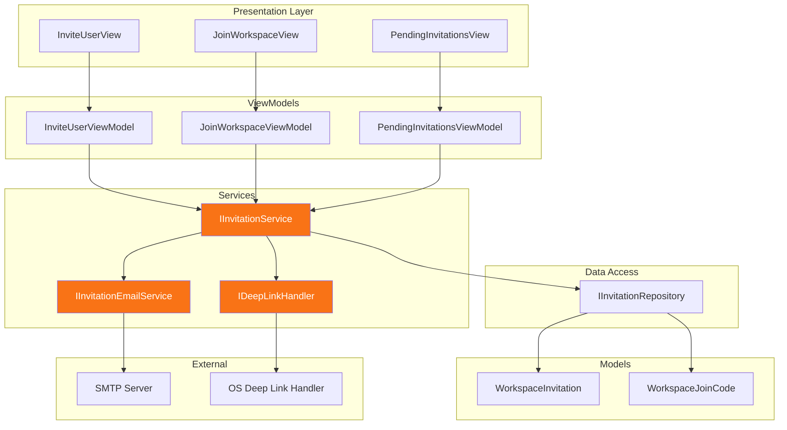
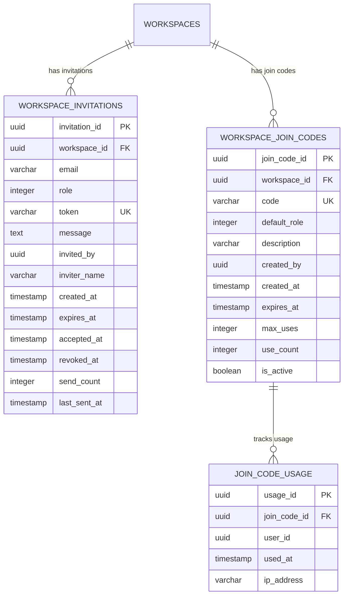

# LCS-DES-091d: Design Specification — Invitation System

## 1. Metadata & Categorization

| Field | Value | Description |
| :--- | :--- | :--- |
| **Feature ID** | `COL-091d` | Sub-part of COL-091 |
| **Feature Name** | `Invitation System` | Email invites and join codes |
| **Target Version** | `v0.9.1d` | Fourth sub-part of v0.9.1 |
| **Module Scope** | `Lexichord.Modules.Collaboration` | Collaboration module |
| **Swimlane** | `Collaboration` | Team features vertical |
| **License Tier** | `Teams` | Requires Teams license |
| **Feature Gate Key** | `team_workspaces` | License feature key |
| **Author** | Lead Architect | |
| **Status** | `Draft` | |
| **Last Updated** | `2026-01-27` | |
| **Parent Document** | [LCS-DES-091-INDEX](./LCS-DES-091-INDEX.md) | |
| **Scope Breakdown** | [LCS-SBD-091 Section 3.4](./LCS-SBD-091.md#34-v091d-invitation-system) | |

---

## 2. Executive Summary

### 2.1 The Requirement

Team workspaces need mechanisms for owners to invite new members. Without a robust invitation system:

- No way to add team members to workspaces
- Cannot share workspace access links with colleagues
- No tracking of pending invitations
- No expiration or revocation of invites
- Difficult onboarding experience for new team members

> **Goal:** Implement a comprehensive invitation system supporting email invitations with personalized messages and shareable join codes for easy team onboarding.

### 2.2 The Proposed Solution

Implement an invitation system that:

1. **Email Invitations** — Send personalized emails with secure invitation links
2. **Join Codes** — Generate shareable 6-character alphanumeric codes
3. **Expiration Control** — Configurable expiration for invitations and codes
4. **Usage Limits** — Optional usage limits for join codes
5. **Deep Links** — Handle `lexichord://` protocol for invitation acceptance
6. **Invitation Management** — View, resend, and revoke pending invitations

---

## 3. Architecture & Modular Strategy

### 3.1 Dependencies

#### 3.1.1 Required Services

| Interface | Source Version | Purpose |
| :--- | :--- | :--- |
| `IWorkspaceRepository` | v0.9.1a | Workspace and member data access |
| `IWorkspaceAuthorizationService` | v0.9.1b | Permission verification |
| `IDbConnectionFactory` | v0.0.5a | PostgreSQL connection management |
| `IConfigurationService` | v0.0.3d | Email and URL configuration |
| `ISecureVault` | v0.0.6a | Store invitation tokens securely |
| `Serilog.ILogger` | v0.0.3b | Operation logging |
| `IMediator` | v0.0.7a | Event publishing |

#### 3.1.2 NuGet Packages

| Package | Version | Purpose |
| :--- | :--- | :--- |
| `Dapper` | 2.x | Micro-ORM for data access |
| `Npgsql` | 8.x | PostgreSQL ADO.NET provider |
| `FluentEmail.Core` | 3.x | Email abstraction |
| `FluentEmail.Smtp` | 3.x | SMTP email sender |
| `FluentEmail.Razor` | 3.x | Razor email templates |

### 3.2 Component Diagram



### 3.3 Licensing Behavior

| Operation | License Check |
| :--- | :--- |
| Send email invitation | Requires Teams license on workspace owner |
| Generate join code | Requires Teams license on workspace owner |
| Accept invitation | WriterPro+ can join as Viewer; Teams+ can join as Editor |
| Resend invitation | Requires InviteMembers permission |
| Revoke invitation | Requires InviteMembers permission |

---

## 4. Data Contract (The API)

### 4.1 Core Entities

```csharp
namespace Lexichord.Modules.Collaboration.Models;

/// <summary>
/// Represents a pending email invitation to join a workspace.
/// </summary>
public record WorkspaceInvitation
{
    /// <summary>
    /// Unique identifier for this invitation.
    /// </summary>
    public Guid InvitationId { get; init; }

    /// <summary>
    /// The workspace being invited to.
    /// </summary>
    public Guid WorkspaceId { get; init; }

    /// <summary>
    /// Email address of the invitee.
    /// </summary>
    public required string Email { get; init; }

    /// <summary>
    /// Role the user will have upon accepting.
    /// </summary>
    public WorkspaceRole Role { get; init; }

    /// <summary>
    /// Secure token for invitation verification.
    /// </summary>
    public required string Token { get; init; }

    /// <summary>
    /// Optional personalized message from the inviter.
    /// </summary>
    public string? Message { get; init; }

    /// <summary>
    /// User who sent the invitation.
    /// </summary>
    public Guid InvitedBy { get; init; }

    /// <summary>
    /// Display name of the inviter (for emails).
    /// </summary>
    public string? InviterName { get; init; }

    /// <summary>
    /// When the invitation was created.
    /// </summary>
    public DateTime CreatedAt { get; init; }

    /// <summary>
    /// When the invitation expires.
    /// </summary>
    public DateTime ExpiresAt { get; init; }

    /// <summary>
    /// When the invitation was accepted (null if pending).
    /// </summary>
    public DateTime? AcceptedAt { get; init; }

    /// <summary>
    /// When the invitation was revoked (null if active).
    /// </summary>
    public DateTime? RevokedAt { get; init; }

    /// <summary>
    /// Number of times the invitation email was sent.
    /// </summary>
    public int SendCount { get; init; }

    /// <summary>
    /// When the invitation email was last sent.
    /// </summary>
    public DateTime? LastSentAt { get; init; }

    /// <summary>
    /// Current status of the invitation.
    /// </summary>
    public InvitationStatus Status => GetStatus();

    private InvitationStatus GetStatus()
    {
        if (RevokedAt.HasValue) return InvitationStatus.Revoked;
        if (AcceptedAt.HasValue) return InvitationStatus.Accepted;
        if (DateTime.UtcNow > ExpiresAt) return InvitationStatus.Expired;
        return InvitationStatus.Pending;
    }
}

/// <summary>
/// Status of a workspace invitation.
/// </summary>
public enum InvitationStatus
{
    /// <summary>Invitation is active and can be accepted.</summary>
    Pending = 0,

    /// <summary>Invitation has been accepted.</summary>
    Accepted = 1,

    /// <summary>Invitation has expired.</summary>
    Expired = 2,

    /// <summary>Invitation was revoked by an owner.</summary>
    Revoked = 3
}

/// <summary>
/// Represents a shareable join code for a workspace.
/// </summary>
public record WorkspaceJoinCode
{
    /// <summary>
    /// Unique identifier for this join code.
    /// </summary>
    public Guid JoinCodeId { get; init; }

    /// <summary>
    /// The workspace this code grants access to.
    /// </summary>
    public Guid WorkspaceId { get; init; }

    /// <summary>
    /// The 6-character alphanumeric code.
    /// </summary>
    /// <remarks>Format: uppercase letters and numbers, excluding ambiguous chars (0, O, I, L, 1).</remarks>
    public required string Code { get; init; }

    /// <summary>
    /// Role assigned to users who join with this code.
    /// </summary>
    public WorkspaceRole DefaultRole { get; init; }

    /// <summary>
    /// Optional description for this code (e.g., "Marketing Team Link").
    /// </summary>
    public string? Description { get; init; }

    /// <summary>
    /// User who created this code.
    /// </summary>
    public Guid CreatedBy { get; init; }

    /// <summary>
    /// When the code was created.
    /// </summary>
    public DateTime CreatedAt { get; init; }

    /// <summary>
    /// When the code expires (null for never).
    /// </summary>
    public DateTime? ExpiresAt { get; init; }

    /// <summary>
    /// Maximum number of uses (null for unlimited).
    /// </summary>
    public int? MaxUses { get; init; }

    /// <summary>
    /// Current number of times this code has been used.
    /// </summary>
    public int UseCount { get; init; }

    /// <summary>
    /// Whether this code is currently active.
    /// </summary>
    public bool IsActive { get; init; }

    /// <summary>
    /// Whether the code can still be used.
    /// </summary>
    public bool IsValid => IsActive
        && (!ExpiresAt.HasValue || DateTime.UtcNow <= ExpiresAt.Value)
        && (!MaxUses.HasValue || UseCount < MaxUses.Value);
}

/// <summary>
/// Record of a join code usage.
/// </summary>
public record JoinCodeUsage
{
    /// <summary>
    /// Unique identifier for this usage record.
    /// </summary>
    public Guid UsageId { get; init; }

    /// <summary>
    /// The join code that was used.
    /// </summary>
    public Guid JoinCodeId { get; init; }

    /// <summary>
    /// User who used the code.
    /// </summary>
    public Guid UserId { get; init; }

    /// <summary>
    /// When the code was used.
    /// </summary>
    public DateTime UsedAt { get; init; }

    /// <summary>
    /// IP address of the user (for audit purposes).
    /// </summary>
    public string? IpAddress { get; init; }
}
```

### 4.2 Service Interfaces

```csharp
namespace Lexichord.Abstractions.Contracts;

/// <summary>
/// Service for managing workspace invitations and join codes.
/// </summary>
public interface IInvitationService
{
    #region Email Invitations

    /// <summary>
    /// Sends an email invitation to join a workspace.
    /// </summary>
    /// <param name="workspaceId">Target workspace.</param>
    /// <param name="email">Invitee's email address.</param>
    /// <param name="role">Role to assign upon acceptance.</param>
    /// <param name="message">Optional personalized message.</param>
    /// <param name="invitedBy">User sending the invitation.</param>
    /// <param name="ct">Cancellation token.</param>
    /// <returns>The created invitation.</returns>
    Task<WorkspaceInvitation> InviteByEmailAsync(
        Guid workspaceId,
        string email,
        WorkspaceRole role,
        string? message,
        Guid invitedBy,
        CancellationToken ct = default);

    /// <summary>
    /// Gets all pending invitations for a workspace.
    /// </summary>
    /// <param name="workspaceId">The workspace ID.</param>
    /// <param name="includeExpired">Whether to include expired invitations.</param>
    /// <param name="ct">Cancellation token.</param>
    /// <returns>List of invitations.</returns>
    Task<IReadOnlyList<WorkspaceInvitation>> GetPendingInvitationsAsync(
        Guid workspaceId,
        bool includeExpired = false,
        CancellationToken ct = default);

    /// <summary>
    /// Gets an invitation by its token.
    /// </summary>
    /// <param name="token">The invitation token.</param>
    /// <param name="ct">Cancellation token.</param>
    /// <returns>The invitation or null.</returns>
    Task<WorkspaceInvitation?> GetInvitationByTokenAsync(
        string token,
        CancellationToken ct = default);

    /// <summary>
    /// Accepts an invitation and joins the workspace.
    /// </summary>
    /// <param name="token">The invitation token.</param>
    /// <param name="userId">User accepting the invitation.</param>
    /// <param name="ct">Cancellation token.</param>
    /// <returns>The created membership.</returns>
    Task<WorkspaceMember> AcceptInvitationAsync(
        string token,
        Guid userId,
        CancellationToken ct = default);

    /// <summary>
    /// Resends an invitation email.
    /// </summary>
    /// <param name="invitationId">The invitation to resend.</param>
    /// <param name="ct">Cancellation token.</param>
    Task ResendInvitationAsync(
        Guid invitationId,
        CancellationToken ct = default);

    /// <summary>
    /// Revokes a pending invitation.
    /// </summary>
    /// <param name="invitationId">The invitation to revoke.</param>
    /// <param name="ct">Cancellation token.</param>
    Task RevokeInvitationAsync(
        Guid invitationId,
        CancellationToken ct = default);

    #endregion

    #region Join Codes

    /// <summary>
    /// Creates a new join code for a workspace.
    /// </summary>
    /// <param name="workspaceId">Target workspace.</param>
    /// <param name="defaultRole">Role for users who join with this code.</param>
    /// <param name="description">Optional description.</param>
    /// <param name="expiresAt">Optional expiration date.</param>
    /// <param name="maxUses">Optional usage limit.</param>
    /// <param name="createdBy">User creating the code.</param>
    /// <param name="ct">Cancellation token.</param>
    /// <returns>The created join code.</returns>
    Task<WorkspaceJoinCode> CreateJoinCodeAsync(
        Guid workspaceId,
        WorkspaceRole defaultRole,
        string? description,
        DateTime? expiresAt,
        int? maxUses,
        Guid createdBy,
        CancellationToken ct = default);

    /// <summary>
    /// Gets all join codes for a workspace.
    /// </summary>
    /// <param name="workspaceId">The workspace ID.</param>
    /// <param name="includeInactive">Whether to include deactivated codes.</param>
    /// <param name="ct">Cancellation token.</param>
    /// <returns>List of join codes.</returns>
    Task<IReadOnlyList<WorkspaceJoinCode>> GetJoinCodesAsync(
        Guid workspaceId,
        bool includeInactive = false,
        CancellationToken ct = default);

    /// <summary>
    /// Gets a join code by its code string.
    /// </summary>
    /// <param name="code">The 6-character code.</param>
    /// <param name="ct">Cancellation token.</param>
    /// <returns>The join code or null.</returns>
    Task<WorkspaceJoinCode?> GetJoinCodeAsync(
        string code,
        CancellationToken ct = default);

    /// <summary>
    /// Joins a workspace using a join code.
    /// </summary>
    /// <param name="code">The 6-character code.</param>
    /// <param name="userId">User joining the workspace.</param>
    /// <param name="ipAddress">Optional IP address for audit.</param>
    /// <param name="ct">Cancellation token.</param>
    /// <returns>The created membership.</returns>
    Task<WorkspaceMember> JoinWithCodeAsync(
        string code,
        Guid userId,
        string? ipAddress = null,
        CancellationToken ct = default);

    /// <summary>
    /// Deactivates a join code.
    /// </summary>
    /// <param name="joinCodeId">The join code to deactivate.</param>
    /// <param name="ct">Cancellation token.</param>
    Task DeactivateJoinCodeAsync(
        Guid joinCodeId,
        CancellationToken ct = default);

    /// <summary>
    /// Gets usage history for a join code.
    /// </summary>
    /// <param name="joinCodeId">The join code ID.</param>
    /// <param name="ct">Cancellation token.</param>
    /// <returns>List of usage records.</returns>
    Task<IReadOnlyList<JoinCodeUsage>> GetJoinCodeUsageAsync(
        Guid joinCodeId,
        CancellationToken ct = default);

    #endregion
}

/// <summary>
/// Service for sending invitation emails.
/// </summary>
public interface IInvitationEmailService
{
    /// <summary>
    /// Sends an invitation email.
    /// </summary>
    /// <param name="invitation">The invitation to send.</param>
    /// <param name="workspaceName">Name of the workspace.</param>
    /// <param name="ct">Cancellation token.</param>
    /// <returns>True if email was sent successfully.</returns>
    Task<bool> SendInvitationEmailAsync(
        WorkspaceInvitation invitation,
        string workspaceName,
        CancellationToken ct = default);

    /// <summary>
    /// Sends a welcome email after joining.
    /// </summary>
    /// <param name="email">User's email address.</param>
    /// <param name="userName">User's display name.</param>
    /// <param name="workspaceName">Name of the workspace joined.</param>
    /// <param name="ct">Cancellation token.</param>
    Task SendWelcomeEmailAsync(
        string email,
        string userName,
        string workspaceName,
        CancellationToken ct = default);
}

/// <summary>
/// Handler for deep links (lexichord:// protocol).
/// </summary>
public interface IDeepLinkHandler
{
    /// <summary>
    /// Parses a deep link URL.
    /// </summary>
    /// <param name="url">The deep link URL.</param>
    /// <returns>Parsed deep link or null if invalid.</returns>
    DeepLink? Parse(string url);

    /// <summary>
    /// Generates an invitation deep link.
    /// </summary>
    /// <param name="token">Invitation token.</param>
    /// <returns>The deep link URL.</returns>
    string GenerateInvitationLink(string token);

    /// <summary>
    /// Generates a join code deep link.
    /// </summary>
    /// <param name="code">The join code.</param>
    /// <returns>The deep link URL.</returns>
    string GenerateJoinCodeLink(string code);

    /// <summary>
    /// Handles an incoming deep link.
    /// </summary>
    /// <param name="deepLink">The parsed deep link.</param>
    /// <param name="ct">Cancellation token.</param>
    Task HandleAsync(DeepLink deepLink, CancellationToken ct = default);
}

/// <summary>
/// Represents a parsed deep link.
/// </summary>
public record DeepLink
{
    /// <summary>
    /// Type of deep link.
    /// </summary>
    public required DeepLinkType Type { get; init; }

    /// <summary>
    /// The token or code from the link.
    /// </summary>
    public required string Value { get; init; }

    /// <summary>
    /// Original URL.
    /// </summary>
    public required string OriginalUrl { get; init; }
}

/// <summary>
/// Types of deep links.
/// </summary>
public enum DeepLinkType
{
    /// <summary>Email invitation link.</summary>
    Invitation,

    /// <summary>Join code link.</summary>
    JoinCode
}
```

### 4.3 Repository Interface

```csharp
namespace Lexichord.Abstractions.Contracts;

/// <summary>
/// Repository for invitation and join code data access.
/// </summary>
public interface IInvitationRepository
{
    #region Invitations

    /// <summary>
    /// Creates a new invitation.
    /// </summary>
    Task<WorkspaceInvitation> CreateInvitationAsync(
        WorkspaceInvitation invitation,
        CancellationToken ct = default);

    /// <summary>
    /// Gets an invitation by ID.
    /// </summary>
    Task<WorkspaceInvitation?> GetInvitationByIdAsync(
        Guid invitationId,
        CancellationToken ct = default);

    /// <summary>
    /// Gets an invitation by token.
    /// </summary>
    Task<WorkspaceInvitation?> GetInvitationByTokenAsync(
        string token,
        CancellationToken ct = default);

    /// <summary>
    /// Gets an invitation by email for a workspace.
    /// </summary>
    Task<WorkspaceInvitation?> GetInvitationByEmailAsync(
        Guid workspaceId,
        string email,
        CancellationToken ct = default);

    /// <summary>
    /// Gets all invitations for a workspace.
    /// </summary>
    Task<IReadOnlyList<WorkspaceInvitation>> GetInvitationsByWorkspaceAsync(
        Guid workspaceId,
        bool includeExpired = false,
        CancellationToken ct = default);

    /// <summary>
    /// Updates an invitation.
    /// </summary>
    Task<WorkspaceInvitation> UpdateInvitationAsync(
        WorkspaceInvitation invitation,
        CancellationToken ct = default);

    /// <summary>
    /// Deletes an invitation.
    /// </summary>
    Task DeleteInvitationAsync(
        Guid invitationId,
        CancellationToken ct = default);

    #endregion

    #region Join Codes

    /// <summary>
    /// Creates a new join code.
    /// </summary>
    Task<WorkspaceJoinCode> CreateJoinCodeAsync(
        WorkspaceJoinCode joinCode,
        CancellationToken ct = default);

    /// <summary>
    /// Gets a join code by ID.
    /// </summary>
    Task<WorkspaceJoinCode?> GetJoinCodeByIdAsync(
        Guid joinCodeId,
        CancellationToken ct = default);

    /// <summary>
    /// Gets a join code by its code string.
    /// </summary>
    Task<WorkspaceJoinCode?> GetJoinCodeByCodeAsync(
        string code,
        CancellationToken ct = default);

    /// <summary>
    /// Gets all join codes for a workspace.
    /// </summary>
    Task<IReadOnlyList<WorkspaceJoinCode>> GetJoinCodesByWorkspaceAsync(
        Guid workspaceId,
        bool includeInactive = false,
        CancellationToken ct = default);

    /// <summary>
    /// Updates a join code.
    /// </summary>
    Task<WorkspaceJoinCode> UpdateJoinCodeAsync(
        WorkspaceJoinCode joinCode,
        CancellationToken ct = default);

    /// <summary>
    /// Records a join code usage.
    /// </summary>
    Task<JoinCodeUsage> RecordJoinCodeUsageAsync(
        JoinCodeUsage usage,
        CancellationToken ct = default);

    /// <summary>
    /// Gets usage history for a join code.
    /// </summary>
    Task<IReadOnlyList<JoinCodeUsage>> GetJoinCodeUsageAsync(
        Guid joinCodeId,
        CancellationToken ct = default);

    /// <summary>
    /// Increments the use count for a join code.
    /// </summary>
    Task IncrementJoinCodeUsageAsync(
        Guid joinCodeId,
        CancellationToken ct = default);

    #endregion
}
```

---

## 5. Implementation Logic

### 5.1 Database Schema

```sql
-- ═══════════════════════════════════════════════════════════════════════════
-- Migration_091d_InvitationSystem.cs
-- ═══════════════════════════════════════════════════════════════════════════

-- Workspace invitations table
CREATE TABLE IF NOT EXISTS workspace_invitations (
    invitation_id UUID PRIMARY KEY DEFAULT gen_random_uuid(),
    workspace_id UUID NOT NULL,
    email VARCHAR(255) NOT NULL,
    role INTEGER NOT NULL DEFAULT 0,
    token VARCHAR(128) NOT NULL UNIQUE,
    message TEXT,
    invited_by UUID NOT NULL,
    inviter_name VARCHAR(255),
    created_at TIMESTAMP WITH TIME ZONE NOT NULL DEFAULT NOW(),
    expires_at TIMESTAMP WITH TIME ZONE NOT NULL,
    accepted_at TIMESTAMP WITH TIME ZONE,
    revoked_at TIMESTAMP WITH TIME ZONE,
    send_count INTEGER NOT NULL DEFAULT 0,
    last_sent_at TIMESTAMP WITH TIME ZONE,

    -- Foreign key to workspaces
    CONSTRAINT fk_invitations_workspace
        FOREIGN KEY (workspace_id)
        REFERENCES workspaces(workspace_id)
        ON DELETE CASCADE,

    -- Ensure one pending invitation per email per workspace
    CONSTRAINT uq_invitation_workspace_email
        UNIQUE (workspace_id, email)
        WHERE accepted_at IS NULL AND revoked_at IS NULL
);

-- Workspace join codes table
CREATE TABLE IF NOT EXISTS workspace_join_codes (
    join_code_id UUID PRIMARY KEY DEFAULT gen_random_uuid(),
    workspace_id UUID NOT NULL,
    code VARCHAR(6) NOT NULL UNIQUE,
    default_role INTEGER NOT NULL DEFAULT 0,
    description VARCHAR(255),
    created_by UUID NOT NULL,
    created_at TIMESTAMP WITH TIME ZONE NOT NULL DEFAULT NOW(),
    expires_at TIMESTAMP WITH TIME ZONE,
    max_uses INTEGER,
    use_count INTEGER NOT NULL DEFAULT 0,
    is_active BOOLEAN NOT NULL DEFAULT TRUE,

    -- Foreign key to workspaces
    CONSTRAINT fk_join_codes_workspace
        FOREIGN KEY (workspace_id)
        REFERENCES workspaces(workspace_id)
        ON DELETE CASCADE,

    -- Code format validation
    CONSTRAINT chk_join_code_format
        CHECK (code ~ '^[A-HJ-NP-Z2-9]{6}$')
);

-- Join code usage tracking table
CREATE TABLE IF NOT EXISTS join_code_usage (
    usage_id UUID PRIMARY KEY DEFAULT gen_random_uuid(),
    join_code_id UUID NOT NULL,
    user_id UUID NOT NULL,
    used_at TIMESTAMP WITH TIME ZONE NOT NULL DEFAULT NOW(),
    ip_address VARCHAR(45),

    -- Foreign key to join codes
    CONSTRAINT fk_usage_join_code
        FOREIGN KEY (join_code_id)
        REFERENCES workspace_join_codes(join_code_id)
        ON DELETE CASCADE
);

-- ═══════════════════════════════════════════════════════════════════════════
-- Indexes for performance
-- ═══════════════════════════════════════════════════════════════════════════

-- Find invitations by workspace
CREATE INDEX IF NOT EXISTS idx_invitations_workspace
    ON workspace_invitations(workspace_id);

-- Find invitations by token (for acceptance)
CREATE INDEX IF NOT EXISTS idx_invitations_token
    ON workspace_invitations(token);

-- Find pending invitations by email
CREATE INDEX IF NOT EXISTS idx_invitations_email
    ON workspace_invitations(email)
    WHERE accepted_at IS NULL AND revoked_at IS NULL;

-- Find join codes by code string
CREATE INDEX IF NOT EXISTS idx_join_codes_code
    ON workspace_join_codes(code)
    WHERE is_active = TRUE;

-- Find join codes by workspace
CREATE INDEX IF NOT EXISTS idx_join_codes_workspace
    ON workspace_join_codes(workspace_id);

-- Find usage by join code
CREATE INDEX IF NOT EXISTS idx_usage_join_code
    ON join_code_usage(join_code_id);

-- Find usage by user (for audit)
CREATE INDEX IF NOT EXISTS idx_usage_user
    ON join_code_usage(user_id);
```

### 5.2 Invitation Service Implementation

```csharp
namespace Lexichord.Modules.Collaboration.Services;

/// <summary>
/// Implementation of IInvitationService.
/// </summary>
public class InvitationService(
    IInvitationRepository invitationRepository,
    IWorkspaceRepository workspaceRepository,
    IWorkspaceAuthorizationService authService,
    IInvitationEmailService emailService,
    IMediator mediator,
    ILogger<InvitationService> logger) : IInvitationService
{
    private const int TokenLength = 64;
    private const int JoinCodeLength = 6;
    private const int DefaultExpirationDays = 7;

    // Characters for join codes (excluding ambiguous: 0, O, I, L, 1)
    private const string JoinCodeChars = "ABCDEFGHJKMNPQRSTUVWXYZ23456789";

    #region Email Invitations

    public async Task<WorkspaceInvitation> InviteByEmailAsync(
        Guid workspaceId,
        string email,
        WorkspaceRole role,
        string? message,
        Guid invitedBy,
        CancellationToken ct = default)
    {
        logger.LogInformation(
            "Inviting {Email} to workspace {WorkspaceId} as {Role}",
            email, workspaceId, role);

        // Verify permission
        await authService.RequirePermissionAsync(
            workspaceId, invitedBy, WorkspacePermission.InviteMembers, ct);

        // Check if user is already a member
        var existingMember = await workspaceRepository.GetMembershipAsync(
            workspaceId, invitedBy, ct);

        // Check for existing pending invitation
        var existingInvitation = await invitationRepository
            .GetInvitationByEmailAsync(workspaceId, email, ct);

        if (existingInvitation is not null &&
            existingInvitation.Status == InvitationStatus.Pending)
        {
            throw new InvalidOperationException(
                $"A pending invitation already exists for {email}");
        }

        // Get workspace for email
        var workspace = await workspaceRepository.GetByIdAsync(workspaceId, ct: ct)
            ?? throw new InvalidOperationException("Workspace not found");

        // Get inviter details
        var inviter = await workspaceRepository.GetMembershipAsync(
            workspaceId, invitedBy, ct);

        // Generate secure token
        var token = GenerateSecureToken();

        var invitation = new WorkspaceInvitation
        {
            InvitationId = Guid.NewGuid(),
            WorkspaceId = workspaceId,
            Email = email.ToLowerInvariant().Trim(),
            Role = role,
            Token = token,
            Message = message,
            InvitedBy = invitedBy,
            InviterName = inviter?.DisplayName,
            CreatedAt = DateTime.UtcNow,
            ExpiresAt = DateTime.UtcNow.AddDays(DefaultExpirationDays),
            SendCount = 1,
            LastSentAt = DateTime.UtcNow
        };

        // Save invitation
        invitation = await invitationRepository.CreateInvitationAsync(invitation, ct);

        // Send email
        var emailSent = await emailService.SendInvitationEmailAsync(
            invitation, workspace.Name, ct);

        if (!emailSent)
        {
            logger.LogWarning(
                "Failed to send invitation email to {Email}",
                email);
        }

        // Publish event
        await mediator.Publish(new WorkspaceInvitationSentEvent
        {
            InvitationId = invitation.InvitationId,
            WorkspaceId = workspaceId,
            Email = email,
            InvitedBy = invitedBy
        }, ct);

        return invitation;
    }

    public async Task<IReadOnlyList<WorkspaceInvitation>> GetPendingInvitationsAsync(
        Guid workspaceId,
        bool includeExpired = false,
        CancellationToken ct = default)
    {
        return await invitationRepository.GetInvitationsByWorkspaceAsync(
            workspaceId, includeExpired, ct);
    }

    public async Task<WorkspaceInvitation?> GetInvitationByTokenAsync(
        string token,
        CancellationToken ct = default)
    {
        return await invitationRepository.GetInvitationByTokenAsync(token, ct);
    }

    public async Task<WorkspaceMember> AcceptInvitationAsync(
        string token,
        Guid userId,
        CancellationToken ct = default)
    {
        logger.LogInformation(
            "User {UserId} accepting invitation with token",
            userId);

        var invitation = await invitationRepository.GetInvitationByTokenAsync(token, ct)
            ?? throw new InvalidOperationException("Invitation not found");

        if (invitation.Status != InvitationStatus.Pending)
        {
            throw new InvalidOperationException(
                $"Invitation is {invitation.Status.ToString().ToLower()}");
        }

        // Check if already a member
        var existingMembership = await workspaceRepository.GetMembershipAsync(
            invitation.WorkspaceId, userId, ct);

        if (existingMembership is not null)
        {
            throw new InvalidOperationException("User is already a member of this workspace");
        }

        // Create membership
        var member = new WorkspaceMember
        {
            MembershipId = Guid.NewGuid(),
            WorkspaceId = invitation.WorkspaceId,
            UserId = userId,
            Role = invitation.Role,
            JoinedAt = DateTime.UtcNow,
            InvitedBy = invitation.InvitedBy,
            Email = invitation.Email
        };

        member = await workspaceRepository.AddMemberAsync(member, ct);

        // Mark invitation as accepted
        var acceptedInvitation = invitation with
        {
            AcceptedAt = DateTime.UtcNow
        };
        await invitationRepository.UpdateInvitationAsync(acceptedInvitation, ct);

        // Publish event
        await mediator.Publish(new WorkspaceMemberJoinedEvent
        {
            WorkspaceId = invitation.WorkspaceId,
            UserId = userId,
            Role = invitation.Role,
            JoinMethod = "email_invitation"
        }, ct);

        logger.LogInformation(
            "User {UserId} joined workspace {WorkspaceId} via invitation",
            userId, invitation.WorkspaceId);

        return member;
    }

    public async Task ResendInvitationAsync(
        Guid invitationId,
        CancellationToken ct = default)
    {
        var invitation = await invitationRepository.GetInvitationByIdAsync(invitationId, ct)
            ?? throw new InvalidOperationException("Invitation not found");

        if (invitation.Status != InvitationStatus.Pending)
        {
            throw new InvalidOperationException("Can only resend pending invitations");
        }

        var workspace = await workspaceRepository.GetByIdAsync(invitation.WorkspaceId, ct: ct)
            ?? throw new InvalidOperationException("Workspace not found");

        // Update send count and timestamp
        var updatedInvitation = invitation with
        {
            SendCount = invitation.SendCount + 1,
            LastSentAt = DateTime.UtcNow,
            // Optionally extend expiration
            ExpiresAt = DateTime.UtcNow.AddDays(DefaultExpirationDays)
        };

        await invitationRepository.UpdateInvitationAsync(updatedInvitation, ct);

        // Send email
        await emailService.SendInvitationEmailAsync(updatedInvitation, workspace.Name, ct);

        logger.LogInformation(
            "Resent invitation {InvitationId} to {Email}",
            invitationId, invitation.Email);
    }

    public async Task RevokeInvitationAsync(
        Guid invitationId,
        CancellationToken ct = default)
    {
        var invitation = await invitationRepository.GetInvitationByIdAsync(invitationId, ct)
            ?? throw new InvalidOperationException("Invitation not found");

        if (invitation.Status != InvitationStatus.Pending)
        {
            throw new InvalidOperationException("Can only revoke pending invitations");
        }

        var revokedInvitation = invitation with
        {
            RevokedAt = DateTime.UtcNow
        };

        await invitationRepository.UpdateInvitationAsync(revokedInvitation, ct);

        logger.LogInformation(
            "Revoked invitation {InvitationId} for {Email}",
            invitationId, invitation.Email);
    }

    #endregion

    #region Join Codes

    public async Task<WorkspaceJoinCode> CreateJoinCodeAsync(
        Guid workspaceId,
        WorkspaceRole defaultRole,
        string? description,
        DateTime? expiresAt,
        int? maxUses,
        Guid createdBy,
        CancellationToken ct = default)
    {
        logger.LogInformation(
            "Creating join code for workspace {WorkspaceId}",
            workspaceId);

        // Verify permission
        await authService.RequirePermissionAsync(
            workspaceId, createdBy, WorkspacePermission.InviteMembers, ct);

        // Generate unique code
        var code = await GenerateUniqueJoinCodeAsync(ct);

        var joinCode = new WorkspaceJoinCode
        {
            JoinCodeId = Guid.NewGuid(),
            WorkspaceId = workspaceId,
            Code = code,
            DefaultRole = defaultRole,
            Description = description,
            CreatedBy = createdBy,
            CreatedAt = DateTime.UtcNow,
            ExpiresAt = expiresAt,
            MaxUses = maxUses,
            UseCount = 0,
            IsActive = true
        };

        joinCode = await invitationRepository.CreateJoinCodeAsync(joinCode, ct);

        // Publish event
        await mediator.Publish(new WorkspaceJoinCodeCreatedEvent
        {
            JoinCodeId = joinCode.JoinCodeId,
            WorkspaceId = workspaceId,
            Code = code,
            CreatedBy = createdBy
        }, ct);

        return joinCode;
    }

    public async Task<IReadOnlyList<WorkspaceJoinCode>> GetJoinCodesAsync(
        Guid workspaceId,
        bool includeInactive = false,
        CancellationToken ct = default)
    {
        return await invitationRepository.GetJoinCodesByWorkspaceAsync(
            workspaceId, includeInactive, ct);
    }

    public async Task<WorkspaceJoinCode?> GetJoinCodeAsync(
        string code,
        CancellationToken ct = default)
    {
        return await invitationRepository.GetJoinCodeByCodeAsync(
            code.ToUpperInvariant().Trim(), ct);
    }

    public async Task<WorkspaceMember> JoinWithCodeAsync(
        string code,
        Guid userId,
        string? ipAddress = null,
        CancellationToken ct = default)
    {
        var normalizedCode = code.ToUpperInvariant().Trim();

        logger.LogInformation(
            "User {UserId} joining with code {Code}",
            userId, normalizedCode);

        var joinCode = await invitationRepository.GetJoinCodeByCodeAsync(normalizedCode, ct)
            ?? throw new InvalidOperationException("Invalid join code");

        if (!joinCode.IsValid)
        {
            if (!joinCode.IsActive)
                throw new InvalidOperationException("This join code has been deactivated");
            if (joinCode.ExpiresAt.HasValue && DateTime.UtcNow > joinCode.ExpiresAt.Value)
                throw new InvalidOperationException("This join code has expired");
            if (joinCode.MaxUses.HasValue && joinCode.UseCount >= joinCode.MaxUses.Value)
                throw new InvalidOperationException("This join code has reached its usage limit");
        }

        // Check if already a member
        var existingMembership = await workspaceRepository.GetMembershipAsync(
            joinCode.WorkspaceId, userId, ct);

        if (existingMembership is not null)
        {
            throw new InvalidOperationException("User is already a member of this workspace");
        }

        // Get workspace settings to check approval requirement
        var workspace = await workspaceRepository.GetByIdAsync(
            joinCode.WorkspaceId, ct: ct);

        if (workspace?.Settings?.RequireApprovalForJoinCodes == true)
        {
            // TODO: Create pending membership request instead
            throw new NotImplementedException("Join code approval not yet implemented");
        }

        // Create membership
        var member = new WorkspaceMember
        {
            MembershipId = Guid.NewGuid(),
            WorkspaceId = joinCode.WorkspaceId,
            UserId = userId,
            Role = joinCode.DefaultRole,
            JoinedAt = DateTime.UtcNow
        };

        member = await workspaceRepository.AddMemberAsync(member, ct);

        // Record usage
        var usage = new JoinCodeUsage
        {
            UsageId = Guid.NewGuid(),
            JoinCodeId = joinCode.JoinCodeId,
            UserId = userId,
            UsedAt = DateTime.UtcNow,
            IpAddress = ipAddress
        };
        await invitationRepository.RecordJoinCodeUsageAsync(usage, ct);
        await invitationRepository.IncrementJoinCodeUsageAsync(joinCode.JoinCodeId, ct);

        // Publish event
        await mediator.Publish(new WorkspaceMemberJoinedEvent
        {
            WorkspaceId = joinCode.WorkspaceId,
            UserId = userId,
            Role = joinCode.DefaultRole,
            JoinMethod = "join_code"
        }, ct);

        logger.LogInformation(
            "User {UserId} joined workspace {WorkspaceId} via join code",
            userId, joinCode.WorkspaceId);

        return member;
    }

    public async Task DeactivateJoinCodeAsync(
        Guid joinCodeId,
        CancellationToken ct = default)
    {
        var joinCode = await invitationRepository.GetJoinCodeByIdAsync(joinCodeId, ct)
            ?? throw new InvalidOperationException("Join code not found");

        var deactivated = joinCode with { IsActive = false };
        await invitationRepository.UpdateJoinCodeAsync(deactivated, ct);

        logger.LogInformation(
            "Deactivated join code {JoinCodeId}",
            joinCodeId);
    }

    public async Task<IReadOnlyList<JoinCodeUsage>> GetJoinCodeUsageAsync(
        Guid joinCodeId,
        CancellationToken ct = default)
    {
        return await invitationRepository.GetJoinCodeUsageAsync(joinCodeId, ct);
    }

    #endregion

    #region Private Methods

    private static string GenerateSecureToken()
    {
        var bytes = new byte[TokenLength];
        using var rng = RandomNumberGenerator.Create();
        rng.GetBytes(bytes);
        return Convert.ToBase64String(bytes)
            .Replace("+", "-")
            .Replace("/", "_")
            .TrimEnd('=');
    }

    private async Task<string> GenerateUniqueJoinCodeAsync(CancellationToken ct)
    {
        const int maxAttempts = 10;
        var rng = RandomNumberGenerator.Create();

        for (int attempt = 0; attempt < maxAttempts; attempt++)
        {
            var code = GenerateRandomCode(rng);
            var existing = await invitationRepository.GetJoinCodeByCodeAsync(code, ct);

            if (existing is null)
            {
                return code;
            }
        }

        throw new InvalidOperationException(
            "Failed to generate unique join code after multiple attempts");
    }

    private static string GenerateRandomCode(RandomNumberGenerator rng)
    {
        var bytes = new byte[JoinCodeLength];
        rng.GetBytes(bytes);

        var chars = new char[JoinCodeLength];
        for (int i = 0; i < JoinCodeLength; i++)
        {
            chars[i] = JoinCodeChars[bytes[i] % JoinCodeChars.Length];
        }

        return new string(chars);
    }

    #endregion
}
```

### 5.3 Email Service Implementation

```csharp
namespace Lexichord.Modules.Collaboration.Services;

/// <summary>
/// FluentEmail implementation of IInvitationEmailService.
/// </summary>
public class InvitationEmailService(
    IFluentEmail fluentEmail,
    IDeepLinkHandler deepLinkHandler,
    IConfigurationService config,
    ILogger<InvitationEmailService> logger) : IInvitationEmailService
{
    public async Task<bool> SendInvitationEmailAsync(
        WorkspaceInvitation invitation,
        string workspaceName,
        CancellationToken ct = default)
    {
        try
        {
            var inviteLink = deepLinkHandler.GenerateInvitationLink(invitation.Token);
            var webLink = $"{config.GetValue("App:BaseUrl")}/invite/{invitation.Token}";

            var model = new InvitationEmailModel
            {
                RecipientEmail = invitation.Email,
                WorkspaceName = workspaceName,
                InviterName = invitation.InviterName ?? "A team member",
                Role = invitation.Role.ToString(),
                PersonalMessage = invitation.Message,
                InviteLink = inviteLink,
                WebLink = webLink,
                ExpiresAt = invitation.ExpiresAt
            };

            var result = await fluentEmail
                .To(invitation.Email)
                .Subject($"You've been invited to join {workspaceName} on Lexichord")
                .UsingTemplateFromFile(
                    "Templates/Email/WorkspaceInvitation.cshtml",
                    model)
                .SendAsync(ct);

            if (!result.Successful)
            {
                logger.LogWarning(
                    "Failed to send invitation email: {Errors}",
                    string.Join(", ", result.ErrorMessages));
            }

            return result.Successful;
        }
        catch (Exception ex)
        {
            logger.LogError(ex, "Exception sending invitation email to {Email}", invitation.Email);
            return false;
        }
    }

    public async Task SendWelcomeEmailAsync(
        string email,
        string userName,
        string workspaceName,
        CancellationToken ct = default)
    {
        try
        {
            var model = new WelcomeEmailModel
            {
                UserName = userName,
                WorkspaceName = workspaceName,
                AppLink = $"{config.GetValue("App:BaseUrl")}/workspaces"
            };

            await fluentEmail
                .To(email)
                .Subject($"Welcome to {workspaceName}!")
                .UsingTemplateFromFile(
                    "Templates/Email/WorkspaceWelcome.cshtml",
                    model)
                .SendAsync(ct);
        }
        catch (Exception ex)
        {
            logger.LogError(ex, "Exception sending welcome email to {Email}", email);
        }
    }
}

/// <summary>
/// Model for invitation email template.
/// </summary>
public record InvitationEmailModel
{
    public required string RecipientEmail { get; init; }
    public required string WorkspaceName { get; init; }
    public required string InviterName { get; init; }
    public required string Role { get; init; }
    public string? PersonalMessage { get; init; }
    public required string InviteLink { get; init; }
    public required string WebLink { get; init; }
    public DateTime ExpiresAt { get; init; }
}

/// <summary>
/// Model for welcome email template.
/// </summary>
public record WelcomeEmailModel
{
    public required string UserName { get; init; }
    public required string WorkspaceName { get; init; }
    public required string AppLink { get; init; }
}
```

### 5.4 Deep Link Handler Implementation

```csharp
namespace Lexichord.Modules.Collaboration.Services;

/// <summary>
/// Handles lexichord:// deep links.
/// </summary>
public class DeepLinkHandler(
    IInvitationService invitationService,
    IRegionManager regionManager,
    ILogger<DeepLinkHandler> logger) : IDeepLinkHandler
{
    private const string Scheme = "lexichord";
    private const string InvitationPath = "invite";
    private const string JoinCodePath = "join";

    public DeepLink? Parse(string url)
    {
        if (string.IsNullOrWhiteSpace(url))
            return null;

        try
        {
            var uri = new Uri(url);

            if (!uri.Scheme.Equals(Scheme, StringComparison.OrdinalIgnoreCase))
                return null;

            var path = uri.Host.ToLowerInvariant();
            var value = uri.AbsolutePath.TrimStart('/');

            return path switch
            {
                InvitationPath => new DeepLink
                {
                    Type = DeepLinkType.Invitation,
                    Value = value,
                    OriginalUrl = url
                },
                JoinCodePath => new DeepLink
                {
                    Type = DeepLinkType.JoinCode,
                    Value = value.ToUpperInvariant(),
                    OriginalUrl = url
                },
                _ => null
            };
        }
        catch (Exception ex)
        {
            logger.LogWarning(ex, "Failed to parse deep link: {Url}", url);
            return null;
        }
    }

    public string GenerateInvitationLink(string token)
    {
        return $"{Scheme}://{InvitationPath}/{token}";
    }

    public string GenerateJoinCodeLink(string code)
    {
        return $"{Scheme}://{JoinCodePath}/{code.ToUpperInvariant()}";
    }

    public async Task HandleAsync(DeepLink deepLink, CancellationToken ct = default)
    {
        logger.LogInformation(
            "Handling deep link: {Type} with value {Value}",
            deepLink.Type, deepLink.Value);

        switch (deepLink.Type)
        {
            case DeepLinkType.Invitation:
                await HandleInvitationLinkAsync(deepLink.Value, ct);
                break;

            case DeepLinkType.JoinCode:
                await HandleJoinCodeLinkAsync(deepLink.Value, ct);
                break;

            default:
                logger.LogWarning("Unknown deep link type: {Type}", deepLink.Type);
                break;
        }
    }

    private async Task HandleInvitationLinkAsync(string token, CancellationToken ct)
    {
        var invitation = await invitationService.GetInvitationByTokenAsync(token, ct);

        if (invitation is null)
        {
            // Navigate to error view
            var parameters = new NavigationParameters
            {
                { "Error", "Invitation not found" }
            };
            regionManager.RequestNavigate("MainRegion", "InvitationErrorView", parameters);
            return;
        }

        if (invitation.Status != InvitationStatus.Pending)
        {
            var parameters = new NavigationParameters
            {
                { "Error", $"This invitation has {invitation.Status.ToString().ToLower()}" }
            };
            regionManager.RequestNavigate("MainRegion", "InvitationErrorView", parameters);
            return;
        }

        // Navigate to acceptance view
        var acceptParams = new NavigationParameters
        {
            { "Invitation", invitation }
        };
        regionManager.RequestNavigate("MainRegion", "AcceptInvitationView", acceptParams);
    }

    private async Task HandleJoinCodeLinkAsync(string code, CancellationToken ct)
    {
        var joinCode = await invitationService.GetJoinCodeAsync(code, ct);

        if (joinCode is null || !joinCode.IsValid)
        {
            var parameters = new NavigationParameters
            {
                { "Error", "Invalid or expired join code" }
            };
            regionManager.RequestNavigate("MainRegion", "JoinCodeErrorView", parameters);
            return;
        }

        // Navigate to join view
        var joinParams = new NavigationParameters
        {
            { "JoinCode", joinCode }
        };
        regionManager.RequestNavigate("MainRegion", "JoinWorkspaceView", joinParams);
    }
}
```

### 5.5 Entity Relationship Diagram



---

## 6. Test Scenarios

### 6.1 Invitation Service Tests

```csharp
namespace Lexichord.Tests.Collaboration;

[Trait("Category", "Unit")]
[Trait("Version", "v0.9.1d")]
public class InvitationServiceTests
{
    private readonly Mock<IInvitationRepository> _invitationRepoMock;
    private readonly Mock<IWorkspaceRepository> _workspaceRepoMock;
    private readonly Mock<IWorkspaceAuthorizationService> _authServiceMock;
    private readonly Mock<IInvitationEmailService> _emailServiceMock;
    private readonly Mock<IMediator> _mediatorMock;
    private readonly InvitationService _sut;

    public InvitationServiceTests()
    {
        _invitationRepoMock = new Mock<IInvitationRepository>();
        _workspaceRepoMock = new Mock<IWorkspaceRepository>();
        _authServiceMock = new Mock<IWorkspaceAuthorizationService>();
        _emailServiceMock = new Mock<IInvitationEmailService>();
        _mediatorMock = new Mock<IMediator>();

        _sut = new InvitationService(
            _invitationRepoMock.Object,
            _workspaceRepoMock.Object,
            _authServiceMock.Object,
            _emailServiceMock.Object,
            _mediatorMock.Object,
            NullLogger<InvitationService>.Instance);
    }

    #region Email Invitation Tests

    [Fact]
    public async Task InviteByEmailAsync_ValidRequest_CreatesInvitationAndSendsEmail()
    {
        // Arrange
        var workspaceId = Guid.NewGuid();
        var inviterId = Guid.NewGuid();
        var email = "test@example.com";

        SetupWorkspace(workspaceId, "Test Workspace");
        SetupAuthorization(workspaceId, inviterId);
        _emailServiceMock
            .Setup(x => x.SendInvitationEmailAsync(
                It.IsAny<WorkspaceInvitation>(),
                It.IsAny<string>(),
                It.IsAny<CancellationToken>()))
            .ReturnsAsync(true);

        _invitationRepoMock
            .Setup(x => x.CreateInvitationAsync(
                It.IsAny<WorkspaceInvitation>(),
                It.IsAny<CancellationToken>()))
            .ReturnsAsync((WorkspaceInvitation inv, CancellationToken _) => inv);

        // Act
        var result = await _sut.InviteByEmailAsync(
            workspaceId, email, WorkspaceRole.Editor, "Join us!", inviterId);

        // Assert
        result.Should().NotBeNull();
        result.Email.Should().Be(email);
        result.Role.Should().Be(WorkspaceRole.Editor);
        result.Token.Should().NotBeNullOrEmpty();
        result.Message.Should().Be("Join us!");

        _emailServiceMock.Verify(x => x.SendInvitationEmailAsync(
            It.IsAny<WorkspaceInvitation>(),
            "Test Workspace",
            It.IsAny<CancellationToken>()), Times.Once);

        _mediatorMock.Verify(x => x.Publish(
            It.IsAny<WorkspaceInvitationSentEvent>(),
            It.IsAny<CancellationToken>()), Times.Once);
    }

    [Fact]
    public async Task InviteByEmailAsync_ExistingPendingInvitation_ThrowsException()
    {
        // Arrange
        var workspaceId = Guid.NewGuid();
        var inviterId = Guid.NewGuid();
        var email = "test@example.com";

        SetupWorkspace(workspaceId, "Test Workspace");
        SetupAuthorization(workspaceId, inviterId);

        var existingInvitation = new WorkspaceInvitation
        {
            InvitationId = Guid.NewGuid(),
            WorkspaceId = workspaceId,
            Email = email,
            Token = "existing-token",
            CreatedAt = DateTime.UtcNow,
            ExpiresAt = DateTime.UtcNow.AddDays(7)
        };

        _invitationRepoMock
            .Setup(x => x.GetInvitationByEmailAsync(workspaceId, email, It.IsAny<CancellationToken>()))
            .ReturnsAsync(existingInvitation);

        // Act
        var act = () => _sut.InviteByEmailAsync(
            workspaceId, email, WorkspaceRole.Editor, null, inviterId);

        // Assert
        await act.Should().ThrowAsync<InvalidOperationException>()
            .WithMessage("*pending invitation already exists*");
    }

    [Fact]
    public async Task InviteByEmailAsync_NoPermission_ThrowsAccessDeniedException()
    {
        // Arrange
        var workspaceId = Guid.NewGuid();
        var inviterId = Guid.NewGuid();

        _authServiceMock
            .Setup(x => x.RequirePermissionAsync(
                workspaceId,
                inviterId,
                WorkspacePermission.InviteMembers,
                It.IsAny<CancellationToken>()))
            .ThrowsAsync(new WorkspaceAccessDeniedException(
                workspaceId, inviterId, WorkspacePermission.InviteMembers));

        // Act
        var act = () => _sut.InviteByEmailAsync(
            workspaceId, "test@example.com", WorkspaceRole.Editor, null, inviterId);

        // Assert
        await act.Should().ThrowAsync<WorkspaceAccessDeniedException>();
    }

    [Fact]
    public async Task AcceptInvitationAsync_ValidToken_CreatesMembershipAndMarksAccepted()
    {
        // Arrange
        var workspaceId = Guid.NewGuid();
        var userId = Guid.NewGuid();
        var token = "valid-token";

        var invitation = new WorkspaceInvitation
        {
            InvitationId = Guid.NewGuid(),
            WorkspaceId = workspaceId,
            Email = "test@example.com",
            Role = WorkspaceRole.Editor,
            Token = token,
            InvitedBy = Guid.NewGuid(),
            CreatedAt = DateTime.UtcNow.AddDays(-1),
            ExpiresAt = DateTime.UtcNow.AddDays(6)
        };

        _invitationRepoMock
            .Setup(x => x.GetInvitationByTokenAsync(token, It.IsAny<CancellationToken>()))
            .ReturnsAsync(invitation);

        _workspaceRepoMock
            .Setup(x => x.GetMembershipAsync(workspaceId, userId, It.IsAny<CancellationToken>()))
            .ReturnsAsync((WorkspaceMember?)null);

        _workspaceRepoMock
            .Setup(x => x.AddMemberAsync(It.IsAny<WorkspaceMember>(), It.IsAny<CancellationToken>()))
            .ReturnsAsync((WorkspaceMember m, CancellationToken _) => m);

        _invitationRepoMock
            .Setup(x => x.UpdateInvitationAsync(It.IsAny<WorkspaceInvitation>(), It.IsAny<CancellationToken>()))
            .ReturnsAsync((WorkspaceInvitation inv, CancellationToken _) => inv);

        // Act
        var result = await _sut.AcceptInvitationAsync(token, userId);

        // Assert
        result.Should().NotBeNull();
        result.WorkspaceId.Should().Be(workspaceId);
        result.UserId.Should().Be(userId);
        result.Role.Should().Be(WorkspaceRole.Editor);

        _invitationRepoMock.Verify(x => x.UpdateInvitationAsync(
            It.Is<WorkspaceInvitation>(i => i.AcceptedAt.HasValue),
            It.IsAny<CancellationToken>()), Times.Once);

        _mediatorMock.Verify(x => x.Publish(
            It.Is<WorkspaceMemberJoinedEvent>(e =>
                e.WorkspaceId == workspaceId &&
                e.UserId == userId &&
                e.JoinMethod == "email_invitation"),
            It.IsAny<CancellationToken>()), Times.Once);
    }

    [Fact]
    public async Task AcceptInvitationAsync_ExpiredInvitation_ThrowsException()
    {
        // Arrange
        var token = "expired-token";

        var invitation = new WorkspaceInvitation
        {
            InvitationId = Guid.NewGuid(),
            WorkspaceId = Guid.NewGuid(),
            Email = "test@example.com",
            Token = token,
            CreatedAt = DateTime.UtcNow.AddDays(-10),
            ExpiresAt = DateTime.UtcNow.AddDays(-3) // Expired
        };

        _invitationRepoMock
            .Setup(x => x.GetInvitationByTokenAsync(token, It.IsAny<CancellationToken>()))
            .ReturnsAsync(invitation);

        // Act
        var act = () => _sut.AcceptInvitationAsync(token, Guid.NewGuid());

        // Assert
        await act.Should().ThrowAsync<InvalidOperationException>()
            .WithMessage("*expired*");
    }

    [Fact]
    public async Task AcceptInvitationAsync_AlreadyMember_ThrowsException()
    {
        // Arrange
        var workspaceId = Guid.NewGuid();
        var userId = Guid.NewGuid();
        var token = "valid-token";

        var invitation = new WorkspaceInvitation
        {
            InvitationId = Guid.NewGuid(),
            WorkspaceId = workspaceId,
            Email = "test@example.com",
            Token = token,
            CreatedAt = DateTime.UtcNow.AddDays(-1),
            ExpiresAt = DateTime.UtcNow.AddDays(6)
        };

        _invitationRepoMock
            .Setup(x => x.GetInvitationByTokenAsync(token, It.IsAny<CancellationToken>()))
            .ReturnsAsync(invitation);

        _workspaceRepoMock
            .Setup(x => x.GetMembershipAsync(workspaceId, userId, It.IsAny<CancellationToken>()))
            .ReturnsAsync(new WorkspaceMember
            {
                WorkspaceId = workspaceId,
                UserId = userId,
                Role = WorkspaceRole.Viewer
            });

        // Act
        var act = () => _sut.AcceptInvitationAsync(token, userId);

        // Assert
        await act.Should().ThrowAsync<InvalidOperationException>()
            .WithMessage("*already a member*");
    }

    #endregion

    #region Join Code Tests

    [Fact]
    public async Task CreateJoinCodeAsync_ValidRequest_CreatesCode()
    {
        // Arrange
        var workspaceId = Guid.NewGuid();
        var creatorId = Guid.NewGuid();

        SetupAuthorization(workspaceId, creatorId);

        _invitationRepoMock
            .Setup(x => x.GetJoinCodeByCodeAsync(It.IsAny<string>(), It.IsAny<CancellationToken>()))
            .ReturnsAsync((WorkspaceJoinCode?)null);

        _invitationRepoMock
            .Setup(x => x.CreateJoinCodeAsync(It.IsAny<WorkspaceJoinCode>(), It.IsAny<CancellationToken>()))
            .ReturnsAsync((WorkspaceJoinCode jc, CancellationToken _) => jc);

        // Act
        var result = await _sut.CreateJoinCodeAsync(
            workspaceId,
            WorkspaceRole.Viewer,
            "Marketing Team",
            DateTime.UtcNow.AddDays(30),
            100,
            creatorId);

        // Assert
        result.Should().NotBeNull();
        result.WorkspaceId.Should().Be(workspaceId);
        result.Code.Should().HaveLength(6);
        result.Code.Should().MatchRegex("^[A-HJ-NP-Z2-9]{6}$");
        result.DefaultRole.Should().Be(WorkspaceRole.Viewer);
        result.Description.Should().Be("Marketing Team");
        result.MaxUses.Should().Be(100);
        result.IsActive.Should().BeTrue();

        _mediatorMock.Verify(x => x.Publish(
            It.IsAny<WorkspaceJoinCodeCreatedEvent>(),
            It.IsAny<CancellationToken>()), Times.Once);
    }

    [Fact]
    public async Task JoinWithCodeAsync_ValidCode_CreatesMembership()
    {
        // Arrange
        var workspaceId = Guid.NewGuid();
        var userId = Guid.NewGuid();
        var code = "ABC123";

        var joinCode = new WorkspaceJoinCode
        {
            JoinCodeId = Guid.NewGuid(),
            WorkspaceId = workspaceId,
            Code = code,
            DefaultRole = WorkspaceRole.Viewer,
            CreatedBy = Guid.NewGuid(),
            CreatedAt = DateTime.UtcNow.AddDays(-1),
            IsActive = true
        };

        var workspace = new Workspace
        {
            WorkspaceId = workspaceId,
            Name = "Test Workspace",
            OwnerId = Guid.NewGuid()
        };

        _invitationRepoMock
            .Setup(x => x.GetJoinCodeByCodeAsync(code, It.IsAny<CancellationToken>()))
            .ReturnsAsync(joinCode);

        _workspaceRepoMock
            .Setup(x => x.GetMembershipAsync(workspaceId, userId, It.IsAny<CancellationToken>()))
            .ReturnsAsync((WorkspaceMember?)null);

        _workspaceRepoMock
            .Setup(x => x.GetByIdAsync(workspaceId, false, It.IsAny<CancellationToken>()))
            .ReturnsAsync(workspace);

        _workspaceRepoMock
            .Setup(x => x.AddMemberAsync(It.IsAny<WorkspaceMember>(), It.IsAny<CancellationToken>()))
            .ReturnsAsync((WorkspaceMember m, CancellationToken _) => m);

        _invitationRepoMock
            .Setup(x => x.RecordJoinCodeUsageAsync(It.IsAny<JoinCodeUsage>(), It.IsAny<CancellationToken>()))
            .ReturnsAsync((JoinCodeUsage u, CancellationToken _) => u);

        // Act
        var result = await _sut.JoinWithCodeAsync(code, userId, "192.168.1.1");

        // Assert
        result.Should().NotBeNull();
        result.WorkspaceId.Should().Be(workspaceId);
        result.UserId.Should().Be(userId);
        result.Role.Should().Be(WorkspaceRole.Viewer);

        _invitationRepoMock.Verify(x => x.RecordJoinCodeUsageAsync(
            It.Is<JoinCodeUsage>(u =>
                u.UserId == userId &&
                u.IpAddress == "192.168.1.1"),
            It.IsAny<CancellationToken>()), Times.Once);

        _invitationRepoMock.Verify(x => x.IncrementJoinCodeUsageAsync(
            joinCode.JoinCodeId,
            It.IsAny<CancellationToken>()), Times.Once);
    }

    [Fact]
    public async Task JoinWithCodeAsync_ExpiredCode_ThrowsException()
    {
        // Arrange
        var code = "EXPIRE";

        var joinCode = new WorkspaceJoinCode
        {
            JoinCodeId = Guid.NewGuid(),
            WorkspaceId = Guid.NewGuid(),
            Code = code,
            DefaultRole = WorkspaceRole.Viewer,
            CreatedBy = Guid.NewGuid(),
            CreatedAt = DateTime.UtcNow.AddDays(-10),
            ExpiresAt = DateTime.UtcNow.AddDays(-1), // Expired
            IsActive = true
        };

        _invitationRepoMock
            .Setup(x => x.GetJoinCodeByCodeAsync(code, It.IsAny<CancellationToken>()))
            .ReturnsAsync(joinCode);

        // Act
        var act = () => _sut.JoinWithCodeAsync(code, Guid.NewGuid());

        // Assert
        await act.Should().ThrowAsync<InvalidOperationException>()
            .WithMessage("*expired*");
    }

    [Fact]
    public async Task JoinWithCodeAsync_MaxUsesReached_ThrowsException()
    {
        // Arrange
        var code = "MAXUSE";

        var joinCode = new WorkspaceJoinCode
        {
            JoinCodeId = Guid.NewGuid(),
            WorkspaceId = Guid.NewGuid(),
            Code = code,
            DefaultRole = WorkspaceRole.Viewer,
            CreatedBy = Guid.NewGuid(),
            CreatedAt = DateTime.UtcNow.AddDays(-5),
            MaxUses = 10,
            UseCount = 10, // Max reached
            IsActive = true
        };

        _invitationRepoMock
            .Setup(x => x.GetJoinCodeByCodeAsync(code, It.IsAny<CancellationToken>()))
            .ReturnsAsync(joinCode);

        // Act
        var act = () => _sut.JoinWithCodeAsync(code, Guid.NewGuid());

        // Assert
        await act.Should().ThrowAsync<InvalidOperationException>()
            .WithMessage("*usage limit*");
    }

    [Fact]
    public async Task JoinWithCodeAsync_DeactivatedCode_ThrowsException()
    {
        // Arrange
        var code = "DEACTV";

        var joinCode = new WorkspaceJoinCode
        {
            JoinCodeId = Guid.NewGuid(),
            WorkspaceId = Guid.NewGuid(),
            Code = code,
            DefaultRole = WorkspaceRole.Viewer,
            CreatedBy = Guid.NewGuid(),
            CreatedAt = DateTime.UtcNow.AddDays(-5),
            IsActive = false // Deactivated
        };

        _invitationRepoMock
            .Setup(x => x.GetJoinCodeByCodeAsync(code, It.IsAny<CancellationToken>()))
            .ReturnsAsync(joinCode);

        // Act
        var act = () => _sut.JoinWithCodeAsync(code, Guid.NewGuid());

        // Assert
        await act.Should().ThrowAsync<InvalidOperationException>()
            .WithMessage("*deactivated*");
    }

    #endregion

    #region Helper Methods

    private void SetupWorkspace(Guid workspaceId, string name)
    {
        _workspaceRepoMock
            .Setup(x => x.GetByIdAsync(workspaceId, It.IsAny<bool>(), It.IsAny<CancellationToken>()))
            .ReturnsAsync(new Workspace
            {
                WorkspaceId = workspaceId,
                Name = name,
                OwnerId = Guid.NewGuid()
            });
    }

    private void SetupAuthorization(Guid workspaceId, Guid userId)
    {
        _authServiceMock
            .Setup(x => x.RequirePermissionAsync(
                workspaceId,
                userId,
                It.IsAny<WorkspacePermission>(),
                It.IsAny<CancellationToken>()))
            .Returns(Task.CompletedTask);
    }

    #endregion
}
```

### 6.2 Deep Link Handler Tests

```csharp
namespace Lexichord.Tests.Collaboration;

[Trait("Category", "Unit")]
[Trait("Version", "v0.9.1d")]
public class DeepLinkHandlerTests
{
    private readonly Mock<IInvitationService> _invitationServiceMock;
    private readonly Mock<IRegionManager> _regionManagerMock;
    private readonly DeepLinkHandler _sut;

    public DeepLinkHandlerTests()
    {
        _invitationServiceMock = new Mock<IInvitationService>();
        _regionManagerMock = new Mock<IRegionManager>();

        _sut = new DeepLinkHandler(
            _invitationServiceMock.Object,
            _regionManagerMock.Object,
            NullLogger<DeepLinkHandler>.Instance);
    }

    [Theory]
    [InlineData("lexichord://invite/abc123", DeepLinkType.Invitation, "abc123")]
    [InlineData("lexichord://join/XYZ789", DeepLinkType.JoinCode, "XYZ789")]
    [InlineData("LEXICHORD://INVITE/token", DeepLinkType.Invitation, "token")]
    [InlineData("lexichord://join/abc", DeepLinkType.JoinCode, "ABC")]
    public void Parse_ValidUrl_ReturnsCorrectDeepLink(
        string url, DeepLinkType expectedType, string expectedValue)
    {
        // Act
        var result = _sut.Parse(url);

        // Assert
        result.Should().NotBeNull();
        result!.Type.Should().Be(expectedType);
        result.Value.Should().Be(expectedValue);
        result.OriginalUrl.Should().Be(url);
    }

    [Theory]
    [InlineData("")]
    [InlineData(null)]
    [InlineData("https://example.com")]
    [InlineData("lexichord://unknown/value")]
    [InlineData("invalid-url")]
    public void Parse_InvalidUrl_ReturnsNull(string? url)
    {
        // Act
        var result = _sut.Parse(url!);

        // Assert
        result.Should().BeNull();
    }

    [Fact]
    public void GenerateInvitationLink_ReturnsCorrectFormat()
    {
        // Arrange
        var token = "test-token-123";

        // Act
        var result = _sut.GenerateInvitationLink(token);

        // Assert
        result.Should().Be("lexichord://invite/test-token-123");
    }

    [Fact]
    public void GenerateJoinCodeLink_ReturnsUppercaseCode()
    {
        // Arrange
        var code = "abc123";

        // Act
        var result = _sut.GenerateJoinCodeLink(code);

        // Assert
        result.Should().Be("lexichord://join/ABC123");
    }
}
```

---

## 7. UI/UX Specifications

### 7.1 Invite User Dialog

```
┌──────────────────────────────────────────────────────────────┐
│ Invite to "Marketing Team"                              [X]  │
├──────────────────────────────────────────────────────────────┤
│                                                              │
│  Email Address                                               │
│  ┌────────────────────────────────────────────────────────┐  │
│  │ colleague@company.com                                  │  │
│  └────────────────────────────────────────────────────────┘  │
│                                                              │
│  Role                                                        │
│  ┌────────────────────────────────────────────────────────┐  │
│  │ Editor                                             [v] │  │
│  └────────────────────────────────────────────────────────┘  │
│  Can view and edit Lexicons, Voice Profiles, and documents   │
│                                                              │
│  Personal Message (optional)                                 │
│  ┌────────────────────────────────────────────────────────┐  │
│  │ Hey! Join our workspace for the Q1 campaign.          │  │
│  │                                                        │  │
│  │                                                        │  │
│  └────────────────────────────────────────────────────────┘  │
│                                                              │
│  ───────────────────── OR ─────────────────────              │
│                                                              │
│  [Generate Join Code]                                        │
│                                                              │
├──────────────────────────────────────────────────────────────┤
│                            [Cancel]  [Send Invitation]       │
└──────────────────────────────────────────────────────────────┘
```

### 7.2 Join Code Panel

```
┌──────────────────────────────────────────────────────────────┐
│ Join Code: ABC123                                            │
├──────────────────────────────────────────────────────────────┤
│                                                              │
│  ┌────────────────────────────────────────────────────────┐  │
│  │                                                        │  │
│  │                    A B C 1 2 3                         │  │
│  │                                                        │  │
│  │                   [Copy Code]                          │  │
│  └────────────────────────────────────────────────────────┘  │
│                                                              │
│  Share this code with team members. They can join by:        │
│                                                              │
│  • Clicking: lexichord://join/ABC123                         │
│  • Entering the code in "Join Workspace" dialog              │
│                                                              │
│  ┌──────────────────────────────────────────────────────┐    │
│  │ Settings                                              │    │
│  │ ○ Never expires                                       │    │
│  │ ● Expires: [2026-02-27  ] (30 days)                   │    │
│  │                                                       │    │
│  │ ○ Unlimited uses                                      │    │
│  │ ● Max uses: [ 50 ]                                    │    │
│  │                                                       │    │
│  │ Default role: [Viewer       v]                        │    │
│  └──────────────────────────────────────────────────────┘    │
│                                                              │
│  Usage: 12 / 50                                              │
│                                                              │
├──────────────────────────────────────────────────────────────┤
│  [Deactivate Code]                     [Copy Link]  [Done]   │
└──────────────────────────────────────────────────────────────┘
```

### 7.3 Pending Invitations List

```
┌──────────────────────────────────────────────────────────────┐
│ Pending Invitations (3)                                      │
├──────────────────────────────────────────────────────────────┤
│                                                              │
│  ┌────────────────────────────────────────────────────────┐  │
│  │ [✉] john@example.com                                   │  │
│  │     Role: Editor  •  Invited 2 days ago  •  Sent 1x    │  │
│  │     Expires in 5 days                                  │  │
│  │                                      [Resend] [Revoke] │  │
│  └────────────────────────────────────────────────────────┘  │
│                                                              │
│  ┌────────────────────────────────────────────────────────┐  │
│  │ [✉] sarah@company.com                                  │  │
│  │     Role: Viewer  •  Invited 5 days ago  •  Sent 2x    │  │
│  │     Expires in 2 days                                  │  │
│  │                                      [Resend] [Revoke] │  │
│  └────────────────────────────────────────────────────────┘  │
│                                                              │
│  ┌────────────────────────────────────────────────────────┐  │
│  │ [⚠] mike@external.org                         EXPIRED  │  │
│  │     Role: Editor  •  Invited 10 days ago               │  │
│  │     Expired 3 days ago                                 │  │
│  │                                     [Reinvite] [Remove]│  │
│  └────────────────────────────────────────────────────────┘  │
│                                                              │
└──────────────────────────────────────────────────────────────┘
```

### 7.4 Join Workspace Dialog

```
┌──────────────────────────────────────────────────────────────┐
│ Join a Workspace                                        [X]  │
├──────────────────────────────────────────────────────────────┤
│                                                              │
│  Enter the 6-character code provided by your team:           │
│                                                              │
│  ┌─────┐ ┌─────┐ ┌─────┐ ┌─────┐ ┌─────┐ ┌─────┐            │
│  │  A  │ │  B  │ │  C  │ │  1  │ │  2  │ │  3  │            │
│  └─────┘ └─────┘ └─────┘ └─────┘ └─────┘ └─────┘            │
│                                                              │
│  ─────────────────────────────────────────────────────────   │
│                                                              │
│  Workspace: Marketing Team                                   │
│  You will join as: Viewer                                    │
│                                                              │
│  [ ] Remember this workspace for quick access                │
│                                                              │
├──────────────────────────────────────────────────────────────┤
│                              [Cancel]  [Join Workspace]      │
└──────────────────────────────────────────────────────────────┘
```

### 7.5 Accept Invitation View

```
┌──────────────────────────────────────────────────────────────┐
│                                                              │
│                    [Lexichord Logo]                          │
│                                                              │
│              You've been invited to join                     │
│                                                              │
│                  "Marketing Team"                            │
│                                                              │
│  ┌────────────────────────────────────────────────────────┐  │
│  │                                                        │  │
│  │  Sarah Chen invited you to collaborate on              │  │
│  │  "Marketing Team" as an Editor.                        │  │
│  │                                                        │  │
│  │  "Hey! Join our workspace for the Q1 campaign.         │  │
│  │   We're excited to have you on the team!"              │  │
│  │                                                        │  │
│  └────────────────────────────────────────────────────────┘  │
│                                                              │
│              [Decline]    [Accept Invitation]                │
│                                                              │
│  This invitation expires on February 3, 2026                 │
│                                                              │
└──────────────────────────────────────────────────────────────┘
```

---

## 8. Observability & Logging

| Level | Message Template |
| :--- | :--- |
| Debug | `"Getting pending invitations for workspace {WorkspaceId}"` |
| Debug | `"Getting join codes for workspace {WorkspaceId}"` |
| Info | `"Inviting {Email} to workspace {WorkspaceId} as {Role}"` |
| Info | `"User {UserId} accepting invitation with token"` |
| Info | `"User {UserId} joined workspace {WorkspaceId} via invitation"` |
| Info | `"Resent invitation {InvitationId} to {Email}"` |
| Info | `"Revoked invitation {InvitationId} for {Email}"` |
| Info | `"Creating join code for workspace {WorkspaceId}"` |
| Info | `"User {UserId} joining with code {Code}"` |
| Info | `"User {UserId} joined workspace {WorkspaceId} via join code"` |
| Info | `"Deactivated join code {JoinCodeId}"` |
| Info | `"Handling deep link: {Type} with value {Value}"` |
| Warning | `"Failed to send invitation email to {Email}"` |
| Warning | `"Unknown deep link type: {Type}"` |
| Error | `"Exception sending invitation email to {Email}"` |
| Error | `"Exception sending welcome email to {Email}"` |

---

## 9. Security & Safety

| Risk | Level | Mitigation |
| :--- | :--- | :--- |
| Token brute force | Low | 64-byte cryptographically random tokens |
| Join code guessing | Medium | 6-char code with 32-char alphabet = 1B combinations; rate limiting |
| Email enumeration | Low | Same response for existing/non-existing emails |
| Invitation replay | Low | Single-use tokens; marked as accepted |
| Expired token use | Low | Server-side expiration validation |
| Unauthorized invitations | Low | Permission check before creating invitations |
| IP tracking privacy | Medium | IP stored only for audit; configurable |

### 9.1 Rate Limiting

| Operation | Limit |
| :--- | :--- |
| Send invitation | 10 per workspace per hour |
| Resend invitation | 3 per invitation per day |
| Accept invitation | 5 attempts per token |
| Join with code | 5 attempts per user per minute |
| Create join code | 5 per workspace per day |

---

## 10. Acceptance Criteria

### 10.1 Functional Criteria

| # | Given | When | Then |
| :--- | :--- | :--- | :--- |
| 1 | Owner with Teams license | InviteByEmailAsync called | Invitation created and email sent |
| 2 | Valid invitation token | AcceptInvitationAsync called | Membership created, invitation marked accepted |
| 3 | Expired invitation token | AcceptInvitationAsync called | Exception thrown |
| 4 | Revoked invitation token | AcceptInvitationAsync called | Exception thrown |
| 5 | User already member | AcceptInvitationAsync called | Exception thrown |
| 6 | Pending invitation exists | InviteByEmailAsync for same email | Exception thrown |
| 7 | Owner with Teams license | CreateJoinCodeAsync called | 6-character code generated |
| 8 | Valid join code | JoinWithCodeAsync called | Membership created, usage recorded |
| 9 | Expired join code | JoinWithCodeAsync called | Exception thrown |
| 10 | Join code at max uses | JoinWithCodeAsync called | Exception thrown |
| 11 | Deactivated join code | JoinWithCodeAsync called | Exception thrown |
| 12 | Valid invitation deep link | Deep link handled | User navigated to acceptance view |
| 13 | Valid join code deep link | Deep link handled | User navigated to join view |

### 10.2 Performance Criteria

| # | Operation | Dataset | Target |
| :--- | :--- | :--- | :--- |
| 14 | InviteByEmailAsync | Single invitation | < 500ms (including email) |
| 15 | AcceptInvitationAsync | Single acceptance | < 200ms |
| 16 | GetPendingInvitationsAsync | 50 invitations | < 100ms |
| 17 | CreateJoinCodeAsync | Single code | < 100ms |
| 18 | JoinWithCodeAsync | Single join | < 200ms |
| 19 | Parse deep link | Single URL | < 5ms |

---

## 11. Deliverable Checklist

| # | Deliverable | Status |
| :--- | :--- | :--- |
| 1 | `WorkspaceInvitation.cs` record | [ ] |
| 2 | `InvitationStatus.cs` enum | [ ] |
| 3 | `WorkspaceJoinCode.cs` record | [ ] |
| 4 | `JoinCodeUsage.cs` record | [ ] |
| 5 | `IInvitationService.cs` interface | [ ] |
| 6 | `InvitationService.cs` implementation | [ ] |
| 7 | `IInvitationEmailService.cs` interface | [ ] |
| 8 | `InvitationEmailService.cs` implementation | [ ] |
| 9 | `IDeepLinkHandler.cs` interface | [ ] |
| 10 | `DeepLinkHandler.cs` implementation | [ ] |
| 11 | `IInvitationRepository.cs` interface | [ ] |
| 12 | `InvitationRepository.cs` implementation | [ ] |
| 13 | `Migration_091d_InvitationSystem.cs` | [ ] |
| 14 | `WorkspaceInvitation.cshtml` email template | [ ] |
| 15 | `WorkspaceWelcome.cshtml` email template | [ ] |
| 16 | `InviteUserView.axaml` + ViewModel | [ ] |
| 17 | `JoinWorkspaceView.axaml` + ViewModel | [ ] |
| 18 | `PendingInvitationsView.axaml` + ViewModel | [ ] |
| 19 | `AcceptInvitationView.axaml` + ViewModel | [ ] |
| 20 | `InvitationServiceTests.cs` | [ ] |
| 21 | `DeepLinkHandlerTests.cs` | [ ] |

---

## 12. Verification Commands

```bash
# ═══════════════════════════════════════════════════════════════════════════
# v0.9.1d Verification
# ═══════════════════════════════════════════════════════════════════════════

# 1. Create migration
dotnet ef migrations add Migration_091d_InvitationSystem \
    --project src/Lexichord.Host

# 2. Apply migration
dotnet ef database update --project src/Lexichord.Host

# 3. Verify tables exist
psql -U lexichord -d lexichord -c "\dt workspace_invitations"
psql -U lexichord -d lexichord -c "\dt workspace_join_codes"
psql -U lexichord -d lexichord -c "\dt join_code_usage"

# 4. Run unit tests
dotnet test --filter "Version=v0.9.1d" --logger "console;verbosity=detailed"

# 5. Run with coverage
dotnet test --filter "Version=v0.9.1d" --collect:"XPlat Code Coverage"

# 6. Verify email templates exist
ls -la src/Lexichord.Modules.Collaboration/Templates/Email/

# 7. Test deep link registration (macOS)
open "lexichord://invite/test-token"

# 8. Test deep link registration (Windows)
start lexichord://invite/test-token
```

---

## Document History

| Version | Date | Author | Changes |
| :--- | :--- | :--- | :--- |
| 1.0 | 2026-01-27 | Lead Architect | Initial draft |
